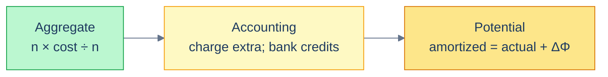
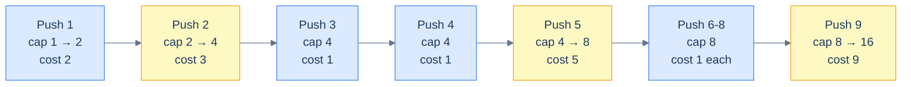

# 3. Amortized Analysis

## The Hook

Push a million items into a Python list. Time each push individually. The result looks like this:

```
push #1     ────  20 nanoseconds
push #2     ────  20 nanoseconds
push #3     ────  20 nanoseconds
push #4     ████ 200 nanoseconds   ← resize
push #5     ────  20 nanoseconds
…
push #128   ────  20 nanoseconds
push #129   ████████████ 4 µs       ← resize
…
push #100k  ───────────────────  20 nanoseconds
push #131k  ████████████████████████████████  60 ms  ← resize
…
```

99% of the pushes are fast. Roughly 1 in `n` pushes is *catastrophically* slow — it has to allocate a new buffer, copy every existing element across, and free the old one. From the inside, it looks like the world's most unreliable data structure. From the outside — the average cost over a million pushes — it's effortlessly fast.

How do you make a *rigorous* claim about that? "Average case" doesn't fit, because we're not averaging over inputs; we're averaging over operations on the same data structure. "Worst case" doesn't fit, because the worst single operation is `O(n)`. The vocabulary that *does* fit is **amortized analysis**, and it's the reason Python's `list.append`, Java's `ArrayList.add`, C++'s `vector::push_back`, JavaScript's `Array.push`, and every Go `append` you've ever written can advertise `O(1)` with a straight face.

This chapter is the proof. By the end you'll be able to look at any "occasionally slow" operation — dynamic-array push, hash-table resize, Fibonacci heap insert, splay-tree access, even Bitcoin-style block size doubling — and tell whether the long-run cost averages to a constant, and *why*.

---

## Table of contents

1. [The "every now and then" cost problem](#the-every-now-and-then-cost-problem)
2. [Three ways to amortize](#three-ways-to-amortize)
3. [Worked example: dynamic array push](#worked-example-dynamic-array-push)
4. [Worked example: incrementing a binary counter](#worked-example-incrementing-a-binary-counter)
5. [A runnable demo](#a-runnable-demo)
6. [When amortized analysis isn't enough](#when-amortized-analysis-isnt-enough)
7. [Edge cases and pitfalls](#edge-cases-and-pitfalls)
8. [Production reality](#production-reality)
9. [Practice ladder](#practice-ladder)
10. [Cross-links](#cross-links)
11. [Final takeaway](#final-takeaway)

***

# The "every now and then" cost problem

Suppose you have a sequence of `n` operations on a data structure. Most operations cost `O(1)`. Every now and then, one operation costs `O(n)`. What's the *total* cost of the sequence?

Naively: `(n-1) × O(1) + 1 × O(n) = O(n)`. So the average per-operation cost is `O(1)` — divide the total by `n`.

The catch is in "every now and then". For dynamic-array push, every now-and-then is roughly *every doubling*: pushes 1, 2, 4, 8, 16, … each trigger a resize. Push number `k` resizes when `k` is a power of 2, and the resize copies `k-1` elements. The total cost over `n` pushes is:

```
(n − log n × constant) cheap pushes × O(1) per push
+
∑ (over each resize at sizes 1, 2, 4, …, n) O(size of array at the time)
```

The `O(1)` cheap pushes contribute `O(n)`. The resizes contribute `1 + 2 + 4 + … + n/2 + n = 2n − 1` (geometric series). Together: `O(n) + O(n) = O(n)` for *all `n` operations combined*. Per-operation: `O(1)` *amortized*.

That's not the worst case (the worst single push is `O(n)`). It's not the average case (we didn't average over a distribution of inputs; we averaged over a *sequence* of operations on a single data structure). It's its own thing: the **amortized** cost.

> **Definition.** The **amortized cost** of an operation is the total cost of any sequence of `n` operations divided by `n`, in the worst case over all sequences of length `n`.

The key word is "any". An adversary doesn't get to pick a *single* expensive operation — they have to make the *whole sequence* expensive. And it turns out that for many data structures, no sequence is expensive enough on average to break the constant-time claim, even though the worst single operation looks scary.

***

# Three ways to amortize

There are three standard methods to prove an amortized cost claim. They produce the *same* number; they differ in how they get there. Pick whichever matches your taste and the structure of the problem.

### 1. Aggregate method

Compute the total cost of `n` operations directly. Divide by `n`. Done.

This is the method we just applied to dynamic-array push. It's the most concrete and the easiest first attempt. Its weakness is that it gives a single average — it doesn't differentiate between operation types if there are several.

### 2. Accounting (banker's) method

Charge each operation more than it costs. Save the surplus as "credits" attached to the data structure. When an expensive operation comes along, pay for it with the saved credits.

For dynamic-array push: charge each push `3` units (the actual cost of one push, plus `2` credit). When a resize triggers, the array has been growing — every element added since the last resize has contributed `2` credits, so there's enough credit to pay for the copy. The amortized cost per push is `3 = O(1)`.

The trick is the choice of what's charged extra. If you charge enough, you can afford anything; if you charge too little, the credit account goes negative and the analysis fails.

### 3. Potential method

Define a *potential function* `Φ(D)` of the data structure's state. The amortized cost of an operation is its actual cost plus the *change* in potential:

$$\hat{c}_i = c_i + \Phi(D_i) - \Phi(D_{i-1})$$

The total amortized cost over `n` operations is:

$$\sum \hat{c}_i = \sum c_i + \Phi(D_n) - \Phi(D_0)$$

If `Φ(D₀) = 0` and `Φ(D_n) ≥ 0`, the amortized cost is an upper bound on the actual cost.

For dynamic-array push: define `Φ(D) = 2 · (size − capacity/2)` (twice the number of elements past the halfway mark). Cheap push: `c_i = 1`, `ΔΦ = 2`, amortized = `3`. Resize push at size `k`: `c_i = k`, `ΔΦ = 2 - k`, amortized = `2`. Either way, `O(1)` amortized.

The potential method is the most powerful and the most opaque. The "right" potential function isn't obvious; it's what cleverness looks like in algorithm analysis. We'll see it again in the [Self-Balancing BST](/cortex/data-structures-and-algorithms/trees-self-balancing-bst-overview-self-balancing-bst-overview) chapter, where splay-tree analyses use a logarithmic potential function.



<p align="center"><strong>The three methods, ordered from "concrete and intuitive" to "abstract and powerful". All three give the same amortized cost; they differ in which proof writes itself for which structure.</strong></p>

***

# Worked example: dynamic array push

The canonical amortized data structure. Capacity starts at `1`; when you push into a full array, you allocate a new array of `2 ×` capacity and copy.

We'll prove `O(1)` amortized push three times, once with each method.

## Aggregate method

For `n` pushes, count the total cost. Each push pays `1` for the push itself. Resizes happen when the array size hits powers of 2: at sizes 1, 2, 4, 8, …, up to the largest power of 2 ≤ `n`. The resize at size `k` copies `k` elements.

Total cost:

$$\sum_{i=1}^{n} 1 + \sum_{k=1, 2, 4, \ldots \leq n} k = n + (1 + 2 + 4 + \ldots + 2^{\lfloor \log_2 n \rfloor}) \leq n + 2n = 3n$$

Average per push: `3n ÷ n = 3 = O(1)`. ✓

## Accounting method

Charge each push `3`. The push itself costs `1`; the surplus `2` is split:
- `1` credit on the *new* element (paying for *its eventual move during a future resize*).
- `1` credit on the element `capacity/2` slots before it (paying for *its move during this growth phase*, which it didn't have credit for from its own push).

Wait — let's reconsider. A simpler accounting:

Charge each push `3`. The `1` actual cost happens immediately. The remaining `2` credit goes onto the new element. When a resize happens, we have `capacity/2` elements that arrived since the *last* resize (the second half of the array), each holding `2` credits — enough to cover the move of *both itself and one earlier element*. Total credit: `capacity` units, exactly what we need to pay for the `capacity`-sized copy.

Amortized cost: `3 = O(1)`. ✓

## Potential method

Define the potential function:

$$\Phi(D) = 2 \cdot (\text{size}(D) - \text{capacity}(D)/2)$$

Just after a resize, `size = capacity/2`, so `Φ = 0`. As we push without resizing, `size` grows but `capacity` doesn't, so `Φ` grows by `2` per push.

**Cheap push** (no resize): `c_i = 1`, `ΔΦ = 2`. Amortized: `1 + 2 = 3`.

**Push that triggers a resize**: just *before* the push, `size = capacity`, so `Φ = capacity`. The resize copies `capacity` elements (cost `capacity`), then we push (cost `1`), then capacity doubles. After the operation: new `size = capacity + 1`, new `capacity = 2 × old capacity`, so new `Φ = 2 · (capacity + 1 - capacity) = 2`. So `ΔΦ = 2 - capacity`. Amortized: `(capacity + 1) + (2 - capacity) = 3`.

Both cases give amortized cost `3 = O(1)`. ✓

> *Three different proofs, same answer.* Pick whichever clicks for you when explaining the bound to a colleague.



<p align="center"><strong>The cost of each push as the array grows. Resizes (yellow) are expensive, but they're rare and the cheap pushes between them have already paid their share.</strong></p>

**Why doubling — and not, say, growing by a fixed `+10`?** If you grow by adding a constant, the resize cost is amortized over a constant number of pushes — which means each push is `O(n)`, not `O(1)`. Doubling is the smallest growth factor that keeps push amortized constant. Growth factors of 1.5 (Java's default `ArrayList`) and 2 (Python list, C++ `vector`) are the two choices in production; 1.5 reuses memory better, 2 has slightly tighter math. Either is `O(1)` amortized.

***

# Worked example: incrementing a binary counter

A textbook example that's instructive even though it doesn't ship in production. Maintain an `n`-bit binary counter; the operation is "increment by 1". The cost of an increment is the number of bits it flips.

```
counter:    0 0 0 0     cost: 0 (initial)
increment:  0 0 0 1     cost: 1 (flipped 1 bit)
increment:  0 0 1 0     cost: 2 (flipped 2 bits: 0→1 then 1→0 carry)
increment:  0 0 1 1     cost: 1
increment:  0 1 0 0     cost: 3
increment:  0 1 0 1     cost: 1
increment:  0 1 1 0     cost: 2
increment:  0 1 1 1     cost: 1
increment:  1 0 0 0     cost: 4
…
```

The worst increment flips all `n` bits (when going from `0111…1` to `1000…0`). So the worst case per increment is `O(n)`. But the *amortized* cost?

**Aggregate method.** Bit `i` flips on every `2^i`-th increment. Over `n` increments:

$$\text{total bit flips} = \sum_{i=0}^{\lfloor \log_2 n \rfloor} \lfloor n / 2^i \rfloor \leq n \sum_{i=0}^{\infty} \frac{1}{2^i} = 2n$$

Total cost over `n` increments: `≤ 2n`. Amortized per increment: `2 = O(1)`. The "every now and then expensive" increment averages out to constant, just like dynamic-array push.

The intuition: a 1-bit transition is cheap (cost 1). Long carry chains are expensive but rare — a chain of length `k` happens only every `2^k` increments. Geometric decay strikes again.

***

# A runnable demo

The code below implements a dynamic array with growth factor 2, pushes a million items, and measures both per-push cost and total cost. The graph the data tells: a few catastrophically expensive pushes, the rest near-instant, and the average per push converging to constant.

```python run
import time

class DynArray:
    def __init__(self):
        self.buf = [None]
        self.size = 0
        self.cap = 1

    def push(self, x):
        if self.size == self.cap:
            new_cap = self.cap * 2
            new_buf = [None] * new_cap
            for i in range(self.size):
                new_buf[i] = self.buf[i]
            self.buf = new_buf
            self.cap = new_cap
        self.buf[self.size] = x
        self.size += 1

if __name__ == "__main__":
    arr = DynArray()
    n = 1_000_000
    times = []
    t0 = time.perf_counter()
    for i in range(n):
        s = time.perf_counter()
        arr.push(i)
        times.append(time.perf_counter() - s)
    total_ms = (time.perf_counter() - t0) * 1000
    avg_us = total_ms * 1000 / n
    max_us = max(times) * 1_000_000
    p99_us = sorted(times)[int(n * 0.99)] * 1_000_000

    print(f"Pushed {n:,} items in {total_ms:.0f} ms")
    print(f"Average per push: {avg_us:.3f} µs  (amortized constant)")
    print(f"99th percentile:  {p99_us:.3f} µs")
    print(f"Max single push:  {max_us:.0f} µs  (the worst resize)")
    print(f"Ratio max / avg:  {max_us / avg_us:,.0f}×  — the resizes are slow but rare")
```

```java run
public class Main {
    static class DynArray {
        int[] buf = new int[1];
        int size = 0;
        int cap = 1;

        void push(int x) {
            if (size == cap) {
                int newCap = cap * 2;
                int[] newBuf = new int[newCap];
                System.arraycopy(buf, 0, newBuf, 0, size);
                buf = newBuf;
                cap = newCap;
            }
            buf[size++] = x;
        }
    }

    public static void main(String[] args) {
        DynArray arr = new DynArray();
        int n = 1_000_000;
        long[] times = new long[n];
        long t0 = System.nanoTime();
        for (int i = 0; i < n; i++) {
            long s = System.nanoTime();
            arr.push(i);
            times[i] = System.nanoTime() - s;
        }
        long totalNs = System.nanoTime() - t0;
        long maxNs = 0;
        for (long t : times) if (t > maxNs) maxNs = t;
        java.util.Arrays.sort(times);
        long p99 = times[(int)(n * 0.99)];

        System.out.printf("Pushed %,d items in %.0f ms%n", n, totalNs / 1e6);
        System.out.printf("Average per push: %.3f µs  (amortized constant)%n", totalNs / 1e3 / n);
        System.out.printf("99th percentile:  %.3f µs%n", p99 / 1e3);
        System.out.printf("Max single push:  %d µs  (the worst resize)%n", maxNs / 1000);
    }
}
```

What you should see: total time around 50-150 ms (varies by language and hardware) for a million pushes. Average per push around 0.05–0.15 µs. The 99th percentile is similar — most pushes are uniformly fast. The *max* single push is hundreds of microseconds — that's the final resize, copying half a million elements. The average doesn't notice.

***

# When amortized analysis isn't enough

Amortized cost is the long-run average. It's the right measure for *throughput* — total work over time. It's the *wrong* measure for **tail latency** — the slowest individual operation.

In real-time systems, this matters. An audio mixer that processes a frame every 22 µs cannot afford to spend 30 ms on a single resize, even if the amortized cost is fine. A game engine that has to render 60 frames per second cannot drop a frame because the last frame happened to trigger a hash-table rehash. A flight-control system cannot accept "the average response time is 5 ms" if the worst is 200 ms.

For these systems, you reach for **worst-case constant-time** structures or strategies that *avoid* the occasional spike:
- **Pre-allocated buffers** (decide capacity up front; never resize).
- **Incremental rebalancing** (do a tiny bit of resize work on every operation rather than batching it into one big resize).
- **Two-stage data structures** (one structure absorbs writes; periodically background-merged into a long-term store).

Splay trees are an instructive cautionary tale here: they're `O(log n)` *amortized* per access, but a single access can be `O(n)`. For batch processing, splay trees are excellent. For latency-sensitive systems, they're a trap. Real-time systems almost always pick AVL or RB trees instead — slightly higher amortized cost, much tighter worst case.

The Linux kernel makes this trade-off explicitly. The CFS scheduler uses a red-black tree (worst-case `O(log n)`), not a splay tree (amortized `O(log n)`, worst-case `O(n)`), because every scheduler decision needs a bound on individual work.

***

# Edge cases and pitfalls

- **"Amortized" doesn't mean "average over inputs".** Amortized is the worst-case *sequence* average, regardless of input distribution. If anyone says "this is `O(1)` amortized in the average case", they mean either amortized *or* average — not both at once. Be precise.
- **Geometric growth is the line.** A dynamic array growing by a factor `c > 1` (any constant > 1) is `O(1)` amortized. A dynamic array growing by a constant `+k` per resize is `O(n)` amortized. The tipping point is between "linear growth" and "exponential growth" — geometric works, arithmetic doesn't.
- **Shrinkage is harder than growth.** A naive "shrink to half capacity when half empty" oscillates: pop, shrink, push (resize back up), pop, shrink, push, … Each shrink+resize costs `n`, every two operations. Worst-case `O(n)` *amortized*. The fix: shrink only when the array drops below *quarter* capacity (or some threshold below half). Java's `ArrayList` doesn't shrink at all for this reason.
- **Mixing operation types breaks naive aggregate analysis.** If you have multiple operations with different individual costs (push: O(1); pop: O(1); search: O(n)), the aggregate-method math has to consider the worst sequence *over all operation types*. Get this wrong by analysing each operation in isolation and you'll get the wrong amortized bound.
- **Pre-existing state matters in the potential method.** The amortized claim needs `Φ(D₀) ≤ Φ(D_n)`. If your data structure can start at high potential (an attacker preloads it before the operations you analyse), the claim breaks. This is rare but real — attacker-controlled inputs to hash tables (HashDoS) is a related concern, though it manifests differently.
- **Asymptotic ≠ constant in practice.** Amortized `O(1)` push can still be slow for *small* `n` because of the big resize at, say, push #16,384. For latency-sensitive small-`n` workloads, the *constant factor* of the amortized analysis matters and can be uncomfortable.

***

# Production reality

- **Java's `ArrayList`** grows by 50% on resize (`newCapacity = oldCapacity + (oldCapacity >> 1)`). Memory-friendlier than 2×, slightly tighter copy cost. Amortized `O(1)` add.
- **CPython's `list`** grows according to `new_size = (new_size >> 3) + (new_size < 9 ? 3 : 6)` — roughly 1.125×. The growth factor was 2× until Python 1.5; the smaller factor reduces memory waste but trades against more frequent resizes. Empirically `O(1)` amortized; the constant is just a bit worse than 2×.
- **C++'s `std::vector`** grows by 2× on most implementations (libc++, libstdc++). The standard doesn't mandate the growth factor; it just mandates amortized `O(1)` `push_back`.
- **Go's `append`** uses growth factor 2× for small slices, 1.25× for larger ones (the threshold and the exact factor have changed over Go versions). The Go runtime documents this in `runtime/slice.go`. Same amortized `O(1)`.
- **Rust's `Vec`** doubles capacity. `Vec::push` is amortized `O(1)`.
- **Hash table resize.** Open-addressed hash tables (Python's dict, Java's `HashMap`) all rehash when the load factor exceeds a threshold (typically 2/3 or 3/4). Each rehash costs `O(capacity)`, but it happens only every constant fraction of insertions, so the amortized insert is `O(1)` average. (Combined with the average-case-`O(1)` lookup, a hash table is `O(1)` amortized average for insert. The amortized vs average distinction matters when adversarial inputs are possible.)
- **Splay tree access** is amortized `O(log n)` but worst-case `O(n)`. They show up in some VM heap allocators (the BSD malloc has a splay-tree variant) and in language-implementation contexts where amortized bounds are good enough.
- **Fibonacci heap operations.** `extract-min` is `O(log n)` amortized; `decrease-key` is `O(1)` amortized. Used in some Dijkstra implementations to get `O(E + V log V)` instead of `O((E + V) log V)`. The amortized analysis behind Fibonacci heaps is sophisticated — a beautiful example of the potential method, covered in textbook detail in CLRS chapter 19.

***

# Practice ladder

1. **Argue the case.** Two engineers debate. One says a Python `list.append` is `O(1)`. The other says it's `O(n)` because resizing copies the whole array. Who's right?
   > *Hint:* both are right *in different senses*. The first means amortized. The second means worst-case for a single operation. Both terms describe real properties of the data structure.

2. **Spot the bad design.** A junior engineer claims their custom dynamic array is `O(1)` amortized push because it grows by `+10` slots per resize. Write the recurrence (or aggregate) showing this is actually `O(n)` amortized.
   > *Hint:* over `n` pushes, the resizes happen at sizes 10, 20, 30, …, n. Total resize cost: `10 + 20 + 30 + … + n = Θ(n²)`. Amortized per push: `Θ(n)`. The `+10` growth rule kills the amortization.

3. **Apply the potential method.** Define a potential function for the binary counter (where the operation is increment-by-1) that proves `O(1)` amortized increment. *Hint:* `Φ(D) = number of 1-bits in D`. An increment that flips `k` low-order 1-bits to 0 then sets one new 1-bit has actual cost `k+1` and `ΔΦ = -k + 1`. Amortized: `(k+1) + (1-k) = 2`. Done.
   > *Hint:* see above for the answer. The choice of `Φ = popcount` is the kind of cleverness amortized analysis rewards.

4. **Worst-case under adversarial input.** A hash table with chaining has amortized `O(1)` insert under a random hash function. An attacker who knows your hash function can craft `n` keys that all hash to the same bucket, making the `n`-th insert `O(n)`. What's the amortized insert under this adversarial sequence?
   > *Hint:* total cost over `n` inserts: `0 + 1 + 2 + … + n = Θ(n²)`. Amortized: `Θ(n)`. The amortized analysis assumed random hashing; remove that assumption and the bound collapses. Mitigation: random hash seeds (HashDoS defense).

5. **Rebuild it from scratch.** Design a data structure that supports `push(x)` in worst-case `O(1)` (not amortized). Hint: you can't naively use a single dynamic array, because *some* push has to do the resize.
   > *Hint:* keep two arrays. `push` always writes to the smaller one and copies one element from the bigger one. When the smaller fills up, swap roles (the bigger becomes the "old", and a new bigger array is allocated, copy work continues). This "incremental resize" amortizes the copy cost across `n` pushes — *worst-case* `O(1)` per push, at the cost of some extra memory and constant overhead. The CLRS-style "spread the work" trick.

***

# Memorize

The high-leverage facts to commit to long-term memory — atomic enough for an Anki card, concrete enough to recall under pressure or during production debugging. Amortized analysis lets you defend "this is `O(1)`" claims that look false at first glance; once these patterns click, you'll spot dynamic-array push, hash rehash, and splay-tree access at sight.

## Quick recall

Click any question to reveal the answer.

<details>
<summary><strong>Q:</strong> Definition of amortized cost?</summary>

**A:** Total cost of any sequence of `n` operations, divided by `n`, in the worst case over all sequences. *Not* an average over inputs — it's an average over operations on one structure.

</details>
<details>
<summary><strong>Q:</strong> Three methods to prove amortized cost claims?</summary>

**A:** **Aggregate** (total over `n` ops, divide by `n`). **Accounting** (charge ops more than actual cost; bank credits). **Potential** (`amortized = actual + ΔΦ` where `Φ` is a potential function).

</details>
<details>
<summary><strong>Q:</strong> Amortized cost of dynamic-array push (growth factor 2)?</summary>

**A:** `O(1)`. Total cost of `n` pushes ≤ `3n` (n pushes + ≤ 2n copy work from geometric resize series).

</details>
<details>
<summary><strong>Q:</strong> Why does growth factor 2 give amortized `O(1)` but constant `+k` growth give amortized `O(n)`?</summary>

**A:** Geometric series sums to `O(n)` total resize work. Arithmetic series sums to `O(n²)`. The constant factor must be `>1` strictly, not additive.

</details>
<details>
<summary><strong>Q:</strong> Why must dynamic-array shrink only at quarter-full, not half-full?</summary>

**A:** Half-full triggers oscillation: pop-shrink-push-resize repeatedly, each `O(n)`. Quarter-full guarantees enough work between shrinks to amortise the resize.

</details>
<details>
<summary><strong>Q:</strong> Amortized cost of binary-counter increment (cost = bits flipped)?</summary>

**A:** `O(1)`. Total flips over `n` increments ≤ `2n` (geometric series: bit `i` flips every `2^i` increments).

</details>
<details>
<summary><strong>Q:</strong> Splay-tree access — amortized vs worst-case?</summary>

**A:** Amortized `O(log n)`; worst-case `O(n)`. Excellent for batch processing; bad for latency-sensitive systems.

</details>
<details>
<summary><strong>Q:</strong> When is amortized analysis the wrong tool?</summary>

**A:** Real-time / latency-bounded systems. Amortized averages over a sequence; one operation can still be `O(n)`. Use worst-case-bounded structures (RB-tree over splay) for hard deadlines.

</details>
<details>
<summary><strong>Q:</strong> Why does Linux's CFS scheduler use RB-tree instead of splay tree, despite splay being amortized `O(log n)`?</summary>

**A:** Per-decision worst-case bound matters more than throughput average. Splay's `O(n)` worst case is unacceptable in a scheduler; RB-tree's `O(log n)` worst case isn't.

</details>
<details>
<summary><strong>Q:</strong> Hash-table insert: average vs amortized?</summary>

**A:** Average insert = `O(1)` (good hash). Amortized insert = `O(1)` (resize amortises across many inserts). Both required to claim "`O(1)`" in production.

</details>

## Code template

```python
# The three amortized-analysis methods, sketched on dynamic-array push.

# 1. Aggregate method: total cost of n pushes
def aggregate_cost(n):
    pushes = n                          # 1 unit each
    resize_powers = [2 ** k for k in range(n.bit_length()) if 2 ** k <= n]
    resize = sum(resize_powers)         # geometric: ≤ 2n
    return pushes + resize              # ≤ 3n  →  amortized 3 per push

# 2. Accounting method: charge each push 3 units
#    - 1 unit pays for the push itself
#    - 2 units bank credit on the new element
#    When resize hits, banked credits across the upper half pay for the copy.

# 3. Potential method: Φ(D) = 2 * (size - capacity / 2)
#    Cheap push:    actual=1, ΔΦ=2  → amortized=3
#    Resize push:   actual=cap+1, ΔΦ=2-cap  → amortized=3

# All three give the same answer: amortized O(1) per push.
```

## Pattern triggers

- **Operation is occasionally `O(n)` but usually `O(1)`** → likely amortized; check the long-run sequence
- **Geometric resize (×2 capacity)** → `O(1)` amortized
- **Constant `+k` resize** → `O(n)` amortized; *not* a fix
- **Hash table insert with rehash** → `O(1)` amortized
- **Splay tree access / Fibonacci-heap decrease-key** → `O(log n)` / `O(1)` amortized; worst case worse
- **Real-time / latency-sensitive system** → amortized is *not* enough; use worst-case-bounded structure
- **Adversary controls the sequence** → still amortized; "for all sequences" definition holds
- **"This is `O(1)` but my profiler shows occasional spikes"** → amortized in action; look for resize / rehash points

***

# Cross-links

- **Prerequisite:** [Asymptotic Analysis](/cortex/data-structures-and-algorithms/foundations-asymptotic-analysis), [Recurrence Relations](/cortex/data-structures-and-algorithms/foundations-recurrence-relations-and-master-theorem).
- **Cited from:** [Arrays](/cortex/data-structures-and-algorithms/linear-structures-arrays-introduction) — the dynamic-array push complexity claim. [Hash Table](/cortex/data-structures-and-algorithms/linear-structures-hash-table-introduction-to-hash-tables) — the hash-table resize claim.
- **Used by:** [Self-Balancing BSTs](/cortex/data-structures-and-algorithms/trees-self-balancing-bst-overview-self-balancing-bst-overview) — *stub* — splay-tree and AVL-tree amortized analyses. [Heap](/cortex/data-structures-and-algorithms/trees-heap-introduction-to-heaps) — heap-construction is `O(n)` despite naive sum suggesting `O(n log n)`.

***

# Final Takeaway

Amortized analysis is the proof that "occasionally slow" can still be "fast on average over a long run". Three patterns to internalise:

1. **Pick the right method for the structure.** Aggregate is the easy first attempt. Accounting works when you can attach credits to specific elements. Potential is the heavy artillery for sophisticated structures.
2. **Geometric growth is the trick.** Doubling, 1.5×, even 1.125× — any constant factor > 1 — gives amortized `O(1)` resize. Constant `+k` growth doesn't.
3. **Amortized ≠ worst case.** Splay trees are amortized `O(log n)` but can be `O(n)` per access. For throughput-bounded systems, amortized is enough. For latency-bounded systems, you need worst-case bounds — which is why Linux's CFS scheduler picks RB-trees over splay trees.

The next chapter steps back from cost to *correctness*: how do you prove that a piece of code does what it's supposed to? That's loop invariants, induction, and contradiction — the proof techniques every later chapter implicitly relies on.
