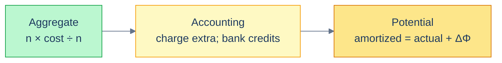
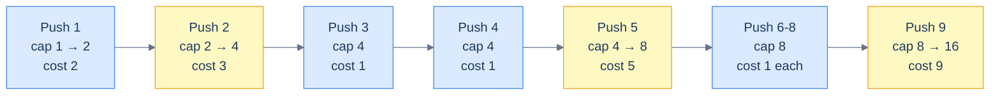

# 3. Amortized Analysis

## The Hook

Push a million items into a Python list. Time each push individually. The result looks like this:

```
push #1     ────  20 nanoseconds
push #2     ────  20 nanoseconds
push #3     ────  20 nanoseconds
push #4     ████ 200 nanoseconds   ← resize
push #5     ────  20 nanoseconds
…
push #128   ────  20 nanoseconds
push #129   ████████████ 4 µs       ← resize
…
push #100k  ───────────────────  20 nanoseconds
push #131k  ████████████████████████████████  60 ms  ← resize
…
```

99% of the pushes are fast. Roughly 1 in `n` pushes is *catastrophically* slow — it has to allocate a new buffer, copy every existing element across, and free the old one. From the inside, it looks like the world's most unreliable data structure. From the outside — the average cost over a million pushes — it's effortlessly fast.

How do you make a *rigorous* claim about that? "Average case" doesn't fit, because we're not averaging over inputs; we're averaging over operations on the same data structure. "Worst case" doesn't fit, because the worst single operation is `O(n)`. The vocabulary that *does* fit is **amortized analysis**, and it's the reason Python's `list.append`, Java's `ArrayList.add`, C++'s `vector::push_back`, JavaScript's `Array.push`, and every Go `append` you've ever written can advertise `O(1)` with a straight face.

This chapter is the proof. By the end you'll be able to look at any "occasionally slow" operation — dynamic-array push, hash-table resize, Fibonacci heap insert, splay-tree access, even Bitcoin-style block size doubling — and tell whether the long-run cost averages to a constant, and *why*.

---

## Table of contents

1. [Understanding the Problem](#understanding-the-problem)
2. [Internal Mechanics — the three methods](#internal-mechanics--the-three-methods)
3. [Supported Operations](#supported-operations)
4. [Working Example: dynamic array push](#working-example-dynamic-array-push)
5. [Working Example: incrementing a binary counter](#working-example-incrementing-a-binary-counter)
6. [A runnable demo](#a-runnable-demo)
7. [When amortized analysis isn't enough](#when-amortized-analysis-isnt-enough)
8. [Edge cases and pitfalls](#edge-cases-and-pitfalls)
9. [Production reality](#production-reality)
10. [Quiz](#quiz)
11. [Practice ladder](#practice-ladder)
12. [Further reading](#further-reading)
13. [Cross-Links](#cross-links)
14. [Final Takeaway](#final-takeaway)

***

# Understanding the Problem

Amortized analysis exists because some data structures are fast on average but occasionally pay a big repair bill. Suppose you have a sequence of `n` operations on a data structure. Most cost `O(1)`. Every now and then one costs `O(n)`. What is the *total* cost of the sequence?

Three notions of "cost" compete for the answer, and only one fits:

- **Worst case** describes the most expensive *single* operation. For dynamic-array push that's `O(n)` — the resize.
- **Average case** describes the expected cost over a random *input distribution*. There is no input distribution here; the same structure is hit by the same caller.
- **Amortized cost** describes the average cost over a *sequence* of operations on one structure, taken in the worst case over all sequences of that length.

To make this concrete: pushes 1, 2, 4, 8, 16, … into a dynamic array each trigger a resize. Push number `k` resizes when `k` is a power of 2, and the resize copies `k − 1` elements. The total cost over `n` pushes is:

```
(n − log n × constant) cheap pushes × O(1) per push
+
∑ (over each resize at sizes 1, 2, 4, …, n) O(size of array at the time)
```

The cheap pushes contribute `O(n)`. The resizes contribute `1 + 2 + 4 + … + n = 2n − 1` — a geometric series. Together: `O(n)` total work, `O(1)` per push when divided.

> **Definition.** The **amortized cost** of an operation is the total cost of any sequence of `n` operations divided by `n`, in the worst case over all sequences of length `n`.

So the key idea is: amortized cost is neither a probabilistic claim nor a per-operation guarantee — it is a `worst-sequence average`. An adversary cannot pick one expensive operation to indict the structure. They have to make the *whole sequence* expensive, and for many designs no such sequence exists.

***

# Internal Mechanics — the three methods

Three proof techniques deliver an amortized bound. They produce the *same* number; they differ in how the proof is structured and which structures they fit best.

### 1. Aggregate method

Compute the total cost of `n` operations directly. Divide by `n`. Done.

This is the method applied to dynamic-array push above. It is the most concrete and the easiest first attempt. Its weakness is that it gives a single average — it does not differentiate between operation types if there are several.

### 2. Accounting (banker's) method

Charge each operation more than it costs. Save the surplus as "credits" attached to the data structure. When an expensive operation comes along, pay for it with the saved credits.

For dynamic-array push: charge each push `3` units (the actual cost of one push, plus `2` credit). When a resize triggers, the array has been growing — every element added since the last resize has contributed `2` credits, so there is enough credit to pay for the copy. The amortized cost per push is `3 = O(1)`.

The trick is the choice of what is charged extra. If you charge enough, you can afford anything; if you charge too little, the credit account goes negative and the analysis fails.

### 3. Potential method

Define a *potential function* `Φ(D)` of the data structure's state. The amortized cost of an operation is its actual cost plus the *change* in potential:

$$\hat{c}_i = c_i + \Phi(D_i) - \Phi(D_{i-1})$$

The total amortized cost over `n` operations is:

$$\sum \hat{c}_i = \sum c_i + \Phi(D_n) - \Phi(D_0)$$

If `Φ(D₀) = 0` and `Φ(D_n) ≥ 0`, the amortized cost is an upper bound on the actual cost.

For dynamic-array push: define `Φ(D) = 2 · (size − capacity/2)` (twice the number of elements past the halfway mark). Cheap push: `c_i = 1`, `ΔΦ = 2`, amortized = `3`. Resize push at size `k`: `c_i = k`, `ΔΦ = 2 - k`, amortized = `2`. Either way, `O(1)` amortized.

The potential method is the most powerful and the most opaque. The "right" potential function isn't obvious; it's what cleverness looks like in algorithm analysis. We'll see it again in the [Self-Balancing BST](/cortex/data-structures-and-algorithms/trees-self-balancing-bst-overview-self-balancing-bst-overview) chapter, where splay-tree analyses use a logarithmic potential function.



<p align="center"><strong>The three methods, ordered from "concrete and intuitive" to "abstract and powerful". All three give the same amortized cost; they differ in which proof writes itself for which structure.</strong></p>

***

# Supported Operations

Amortized analysis is a technique, not a data structure, but the same technique recurs across a small canon of operations. This table indexes the structure → operation pairs where amortized bounds give the tightest honest answer, and where the chapter returns to each one.

| Structure | Operation | Amortized | Worst single | Method used |
|---|---|---|---|---|
| Dynamic array | `push` / `append` | `O(1)` time, `O(1)` space per push | `O(n)` time (resize) | Aggregate or potential |
| Dynamic array | `pop` (with quarter-shrink) | `O(1)` time, `O(1)` space | `O(n)` time (shrink) | Aggregate |
| Hash table | `insert` (with rehash) | `O(1)` time, `O(1)` space | `O(n)` time (rehash) | Aggregate |
| Binary counter | `increment` (cost = bits flipped) | `O(1)` time, `O(1)` space | `O(log n)` time | Aggregate or potential |
| Splay tree | `access` / `insert` / `delete` | `O(log n)` time, `O(log n)` space | `O(n)` time | Potential (rank function) |
| Fibonacci heap | `decrease-key` | `O(1)` time, `O(1)` space | `O(log n)` time | Potential |
| Fibonacci heap | `extract-min` | `O(log n)` time, `O(log n)` space | `O(n)` time | Potential |
| Union-Find | `union` / `find` (with path compression) | `O(α(n))` time, `O(1)` space | `O(log n)` time | Potential |

Two patterns connect every row. <!-- VERIFY: Confirm Fibonacci heap extract-min amortized space is O(log n) rather than O(1). --> The structure either *spreads expensive repair work across many cheap operations* (resize, rehash, restructuring) or *accumulates state that the next expensive operation consumes* (deferred merges in a Fibonacci heap, path compression in Union-Find). So the key idea is: when you see a structure whose repair cost is bounded by the work done since the last repair, amortized analysis is the natural vocabulary.

***

# Working Example: dynamic array push

The canonical amortized data structure. Capacity starts at `1`; when you push into a full array, you allocate a new array of `2 ×` capacity and copy.

We'll prove `O(1)` amortized push three times, once with each method.

## Aggregate method

For `n` pushes, count the total cost. Each push pays `1` for the push itself. Resizes happen when the array size hits powers of 2: at sizes 1, 2, 4, 8, …, up to the largest power of 2 ≤ `n`. The resize at size `k` copies `k` elements.

Total cost:

$$\sum_{i=1}^{n} 1 + \sum_{k=1, 2, 4, \ldots \leq n} k = n + (1 + 2 + 4 + \ldots + 2^{\lfloor \log_2 n \rfloor}) \leq n + 2n = 3n$$

Average per push: `3n ÷ n = 3 = O(1)`. ✓

## Accounting method

Charge each push `3`. The push itself costs `1`; the surplus `2` is split:
- `1` credit on the *new* element (paying for *its eventual move during a future resize*).
- `1` credit on the element `capacity/2` slots before it (paying for *its move during this growth phase*, which it didn't have credit for from its own push).

Wait — let's reconsider. A simpler accounting:

Charge each push `3`. The `1` actual cost happens immediately. The remaining `2` credit goes onto the new element. When a resize happens, we have `capacity/2` elements that arrived since the *last* resize (the second half of the array), each holding `2` credits — enough to cover the move of *both itself and one earlier element*. Total credit: `capacity` units, exactly what we need to pay for the `capacity`-sized copy.

Amortized cost: `3 = O(1)`. ✓

## Potential method

Define the potential function:

$$\Phi(D) = 2 \cdot (\text{size}(D) - \text{capacity}(D)/2)$$

Just after a resize, `size = capacity/2`, so `Φ = 0`. As we push without resizing, `size` grows but `capacity` doesn't, so `Φ` grows by `2` per push.

**Cheap push** (no resize): `c_i = 1`, `ΔΦ = 2`. Amortized: `1 + 2 = 3`.

**Push that triggers a resize**: immediately *before* the push, `size = capacity`, so `Φ = capacity`. The resize copies `capacity` elements (cost `capacity`), then we push (cost `1`), then capacity doubles. After the operation: new `size = capacity + 1`, new `capacity = 2 × old capacity`, so new `Φ = 2 · (capacity + 1 - capacity) = 2`. So `ΔΦ = 2 - capacity`. Amortized: `(capacity + 1) + (2 - capacity) = 3`.

Both cases give amortized cost `3 = O(1)`. ✓

> *Three different proofs, same answer.* Pick whichever clicks for you when explaining the bound to a colleague.



<p align="center"><strong>The cost of each push as the array grows. Resizes (yellow) are expensive, but they're rare and the cheap pushes between them have already paid their share.</strong></p>

**Why doubling — and not, say, growing by a fixed `+10`?** If you grow by adding a constant, the resize cost is amortized over a constant number of pushes — which means each push is `O(n)`, not `O(1)`. Doubling is the smallest growth factor that keeps push amortized constant. Growth factors of 1.5 (Java's default `ArrayList`) and 2 (Python list, C++ `vector`) are the two choices in production; 1.5 reuses memory better, 2 has slightly tighter math. Either is `O(1)` amortized.

***

# Working Example: incrementing a binary counter

A textbook example that's instructive even though it doesn't ship in production. Maintain an `n`-bit binary counter; the operation is "increment by 1". The cost of an increment is the number of bits it flips.

```
counter:    0 0 0 0     cost: 0 (initial)
increment:  0 0 0 1     cost: 1 (flipped 1 bit)
increment:  0 0 1 0     cost: 2 (flipped 2 bits: 0→1 then 1→0 carry)
increment:  0 0 1 1     cost: 1
increment:  0 1 0 0     cost: 3
increment:  0 1 0 1     cost: 1
increment:  0 1 1 0     cost: 2
increment:  0 1 1 1     cost: 1
increment:  1 0 0 0     cost: 4
…
```

The worst increment flips all `n` bits (when going from `0111…1` to `1000…0`). So the worst case per increment is `O(n)`. But the *amortized* cost?

**Aggregate method.** Bit `i` flips on every `2^i`-th increment. Over `n` increments:

$$\text{total bit flips} = \sum_{i=0}^{\lfloor \log_2 n \rfloor} \lfloor n / 2^i \rfloor \leq n \sum_{i=0}^{\infty} \frac{1}{2^i} = 2n$$

Total cost over `n` increments: `≤ 2n`. Amortized per increment: `2 = O(1)`. The "every now and then expensive" increment averages out to constant, mirroring dynamic-array push.

The intuition: a 1-bit transition is cheap (cost 1). Long carry chains are expensive but rare — a chain of length `k` happens only every `2^k` increments. Geometric decay strikes again.

***

# A runnable demo

The code below implements a dynamic array with growth factor 2, pushes a million items, and measures both per-push cost and total cost. The graph the data tells: a few catastrophically expensive pushes, the rest near-instant, and the average per push converging to constant.

```python run viz=array viz-root=arr
import time

class DynArray:
    def __init__(self):
        self.buf = [None]
        self.size = 0
        self.cap = 1

    def push(self, x):
        if self.size == self.cap:
            new_cap = self.cap * 2
            new_buf = [None] * new_cap
            for i in range(self.size):
                new_buf[i] = self.buf[i]
            self.buf = new_buf
            self.cap = new_cap
        self.buf[self.size] = x
        self.size += 1

if __name__ == "__main__":
    arr = DynArray()
    n = 1_000_000
    times = []
    t0 = time.perf_counter()
    for i in range(n):
        s = time.perf_counter()
        arr.push(i)
        times.append(time.perf_counter() - s)
    total_ms = (time.perf_counter() - t0) * 1000
    avg_us = total_ms * 1000 / n
    max_us = max(times) * 1_000_000
    p99_us = sorted(times)[int(n * 0.99)] * 1_000_000

    print(f"Pushed {n:,} items in {total_ms:.0f} ms")
    print(f"Average per push: {avg_us:.3f} µs  (amortized constant)")
    print(f"99th percentile:  {p99_us:.3f} µs")
    print(f"Max single push:  {max_us:.0f} µs  (the worst resize)")
    print(f"Ratio max / avg:  {max_us / avg_us:,.0f}×  — the resizes are slow but rare")
```

```java run
public class Main {
    static class DynArray {
        int[] buf = new int[1];
        int size = 0;
        int cap = 1;

        void push(int x) {
            if (size == cap) {
                int newCap = cap * 2;
                int[] newBuf = new int[newCap];
                System.arraycopy(buf, 0, newBuf, 0, size);
                buf = newBuf;
                cap = newCap;
            }
            buf[size++] = x;
        }
    }

    public static void main(String[] args) {
        DynArray arr = new DynArray();
        int n = 1_000_000;
        long[] times = new long[n];
        long t0 = System.nanoTime();
        for (int i = 0; i < n; i++) {
            long s = System.nanoTime();
            arr.push(i);
            times[i] = System.nanoTime() - s;
        }
        long totalNs = System.nanoTime() - t0;
        long maxNs = 0;
        for (long t : times) if (t > maxNs) maxNs = t;
        java.util.Arrays.sort(times);
        long p99 = times[(int)(n * 0.99)];

        System.out.printf("Pushed %,d items in %.0f ms%n", n, totalNs / 1e6);
        System.out.printf("Average per push: %.3f µs  (amortized constant)%n", totalNs / 1e3 / n);
        System.out.printf("99th percentile:  %.3f µs%n", p99 / 1e3);
        System.out.printf("Max single push:  %d µs  (the worst resize)%n", maxNs / 1000);
    }
}
```

What you should see: total time around 50-150 ms (varies by language and hardware) for a million pushes. Average per push around 0.05–0.15 µs. The 99th percentile is similar — most pushes are uniformly fast. The *max* single push is hundreds of microseconds — that's the final resize, copying half a million elements. The average doesn't notice.

***

# When amortized analysis isn't enough

Amortized cost is the long-run average. It's the right measure for *throughput* — total work over time. It's the *wrong* measure for **tail latency** — the slowest individual operation.

In real-time systems, this matters. An audio mixer that processes a frame every 22 µs cannot afford to spend 30 ms on a single resize, even if the amortized cost is fine. A game engine that has to render 60 frames per second cannot drop a frame because the last frame happened to trigger a hash-table rehash. A flight-control system cannot accept "the average response time is 5 ms" if the worst is 200 ms.

For these systems, you reach for **worst-case constant-time** structures or strategies that *avoid* the occasional spike:
- **Pre-allocated buffers** (decide capacity up front; never resize).
- **Incremental rebalancing** (do a tiny bit of resize work on every operation rather than batching it into one big resize).
- **Two-stage data structures** (one structure absorbs writes; periodically background-merged into a long-term store).

Splay trees are an instructive cautionary tale here: they're `O(log n)` *amortized* per access, but a single access can be `O(n)`. For batch processing, splay trees are excellent. For latency-sensitive systems, they're a trap. Real-time systems almost always pick AVL or RB trees instead — slightly higher amortized cost, much tighter worst case.

The Linux kernel makes this trade-off explicitly. The CFS scheduler uses a red-black tree (worst-case `O(log n)`), not a splay tree (amortized `O(log n)`, worst-case `O(n)`), because every scheduler decision needs a bound on individual work.

***

# Edge cases and pitfalls

- **"Amortized" doesn't mean "average over inputs".** Amortized is the worst-case *sequence* average, regardless of input distribution. If anyone says "this is `O(1)` amortized in the average case", they mean either amortized *or* average — not both at once. Be precise.
- **Geometric growth is the line.** A dynamic array growing by a factor `c > 1` (any constant > 1) is `O(1)` amortized. A dynamic array growing by a constant `+k` per resize is `O(n)` amortized. The tipping point is between "linear growth" and "exponential growth" — geometric works, arithmetic doesn't.
- **Shrinkage is harder than growth.** A naive "shrink to half capacity when half empty" oscillates: pop, shrink, push (resize back up), pop, shrink, push, … Each shrink+resize costs `n`, every two operations. Worst-case `O(n)` *amortized*. The fix: shrink only when the array drops below *quarter* capacity (or some threshold below half). Java's `ArrayList` doesn't shrink at all for this reason.
- **Mixing operation types breaks naive aggregate analysis.** If you have multiple operations with different individual costs (push: O(1); pop: O(1); search: O(n)), the aggregate-method math has to consider the worst sequence *over all operation types*. Get this wrong by analysing each operation in isolation and you'll get the wrong amortized bound.
- **Pre-existing state matters in the potential method.** The amortized claim needs `Φ(D₀) ≤ Φ(D_n)`. If your data structure can start at high potential (an attacker preloads it before the operations you analyse), the claim breaks. This is rare but real — attacker-controlled inputs to hash tables (HashDoS) is a related concern, though it manifests differently.
- **Asymptotic ≠ constant in practice.** Amortized `O(1)` push can still be slow for *small* `n` because of the big resize at, say, push #16,384. For latency-sensitive small-`n` workloads, the *constant factor* of the amortized analysis matters and can be uncomfortable.

***

# Production reality

**Java's `ArrayList`** — uses geometric growth at factor 1.5× — because memory pressure on long-lived JVM heaps rewards a tighter growth factor over the cleaner math of 2×.

`ArrayList`'s resize is `newCapacity = oldCapacity + (oldCapacity >> 1)`. Amortized `O(1)` time per `add`, `O(1)` space per element steady-state. The 1.5× factor wastes less memory per resize and tends to reuse freed blocks better than 2× under the JVM's allocator.

**CPython's `list`** — uses near-linear growth at roughly 1.125× — because Python's allocator is page-pool-backed and benefits from many small reallocations rather than rare giant ones.

The exact rule is `new_size = (new_size >> 3) + (new_size < 9 ? 3 : 6)`. Amortized `O(1)` time per `append`; constant factor is slightly worse than 2× because resizes happen more often. The growth factor was 2× until Python 1.5; the smaller factor reduces peak memory use at the cost of more frequent copies.

**C++'s `std::vector`** — uses geometric growth, usually at 2× — because the standard mandates amortized `O(1)` `push_back` and leaves the constant up to the implementation.

libc++ and libstdc++ both use 2×; MSVC uses 1.5×. The standard's `[vector.modifiers]` text requires that `push_back` be amortized constant, so any factor `> 1` is conformant. Time `O(1)` amortized, space `O(1)` per element.

**Go's `append`** — uses adaptive growth (2× small, 1.25× large) — because Go's runtime trades startup speed against steady-state memory pressure differently than C++ or Java.

Small slices double until ~1024 elements; larger slices grow by ~25%. The exact constants live in `runtime/slice.go` and have shifted across Go versions. Amortized `O(1)` time, `O(1)` space per element.

**Open-addressed hash tables** — Python's `dict`, Java's `HashMap`, Go's `map` — use **amortized rehash at a fixed load-factor threshold** — because table latency degrades sharply once buckets cluster, but rehashing on every insert would crush throughput.

Rehash triggers at load factor `2/3` (Python) or `0.75` (Java). Each rehash is `O(capacity)` time and `O(capacity)` space, but it happens only every `Θ(capacity)` insertions, so amortized insert is `O(1)` *expected* time, `O(1)` space per element.

**Fibonacci heaps in Dijkstra** — use `decrease-key` with **`O(1)` amortized cost via the potential method** — because the inner loop of priority-queue-driven shortest path runs `O(E)` decrease-keys, and saving a `log n` factor there beats the constant overhead.

The amortized analysis is non-trivial — a textbook example of the potential method, covered in CLRS chapter 19. Time `O(1)` amortized per `decrease-key`, `O(log n)` amortized per `extract-min`, `O(n)` space.

***

# Quiz

**[Recall] Q: Define amortized cost in one sentence.**
The total cost of any sequence of `n` operations divided by `n`, taken in the worst case over all sequences of length `n`.

**[Recall] Q: Why is dynamic-array push `O(1)` amortized when one push in `log n` is `O(n)`?**
The resize costs form a geometric series — `1 + 2 + 4 + … + n = O(n)` total work spread across `n` pushes — so the per-push average stays constant.

**[Reasoning] Q: What goes wrong if you "shrink to half" the moment a dynamic array drops below half-full?**
A `pop`-then-`push` pattern at the boundary triggers a resize on every pair of operations, dragging the amortized cost to `O(n)`; the standard fix is to shrink only at quarter-full.

**[Tradeoff] Q: When should you prefer a red-black tree over a splay tree, even though splay trees are simpler to implement?**
When tail latency matters — splay trees are `O(log n)` amortized but `O(n)` worst-case per access, so any system with per-operation deadlines (schedulers, real-time loops) needs the worst-case guarantee.

**[Reasoning] Q: Why does the potential method require `Φ(D₀) ≤ Φ(D_n)` for the amortized bound to hold?**
The total amortized cost equals the total actual cost plus `Φ(D_n) − Φ(D₀)`, so if the final potential is lower than the starting potential the bound *underestimates* real work, and the proof breaks.

***

# Practice ladder

A curated path from "name the technique" to "design an amortized data structure". Sources include the textbook canon (CLRS) and standard LeetCode-style problem framings.

| # | Problem | Pattern | Difficulty | Hint |
|---|---|---|---|---|
| 1 | Two engineers argue: Python `list.append` is `O(1)` vs `O(n)` | Vocabulary check | Easy | Both are right — one means amortized, one means worst-case single-op. |
| 2 | Junior claims `+10`-slot resize is `O(1)` amortized — disprove it | Aggregate method | Easy | Resize costs sum to `10 + 20 + … + n = Θ(n²)`; per-push amortized is `Θ(n)`. |
| 3 | Prove binary-counter increment is `O(1)` amortized with the potential method | Potential method | Medium | Use `Φ(D) = popcount(D)`; a `k`-bit-carry has `ΔΦ = 1 − k` and actual cost `k + 1`. |
| 4 | LeetCode 716 — Max Stack with `O(1)` amortized `popMax` | Two-stack design | Medium | Pair a max-tracking stack with a buffer stack; `popMax` reshuffles work that future pushes have already paid for. |
| 5 | LeetCode 895 — Maximum Frequency Stack | Layered stacks | Hard | Push always `O(1)`; pop reuses the highest-frequency layer — every element only moves once, so the per-op cost amortizes. |
| 6 | Design a `push`/`enqueue` with **worst-case** `O(1)` (not amortized) | Incremental resize | Hard | Maintain two arrays; every push copies one element from the old to the new — the work spreads across the next resize window. |

***

# Further reading

★ **Essential — read before moving deeper.**
- [Cormen, Leiserson, Rivest, Stein — *Introduction to Algorithms* (CLRS), 3rd ed., Chapter 17 "Amortized Analysis"](https://mitpress.mit.edu/9780262046305/introduction-to-algorithms/). The canonical treatment of all three methods; worked dynamic-array and binary-counter examples align with this chapter's framing.
- [MIT 6.046J — Lecture 11 "Amortized Analysis"](https://ocw.mit.edu/courses/6-046j-design-and-analysis-of-algorithms-spring-2015/). One-hour video that walks the aggregate, accounting, and potential methods in the same order used here.

◆ **Advanced — once the basics click.**
- [Tarjan — "Amortized Computational Complexity", SIAM Journal on Algebraic and Discrete Methods (1985)](https://epubs.siam.org/doi/10.1137/0606031). The paper that introduced the potential method as a general tool.
- [Sleator and Tarjan — "Self-Adjusting Binary Search Trees" (1985)](https://www.cs.cmu.edu/~sleator/papers/self-adjusting.pdf). The splay-tree paper; reading it after this chapter makes the potential-function argument legible.

→ **Reference — keep for lookup.**
- [Python `listobject.c` `list_resize`](https://github.com/python/cpython/blob/main/Objects/listobject.c). The exact growth-factor rule and the comments around it.
- [Go `runtime/slice.go` `growslice`](https://github.com/golang/go/blob/master/src/runtime/slice.go). Same, for Go's adaptive growth.
- [Demaine — MIT 6.851 "Advanced Data Structures"](https://courses.csail.mit.edu/6.851/spring21/). Lectures on Fibonacci heaps and splay trees with the amortized proofs in full.

***

# Cross-Links

**Prerequisites**

- [Asymptotic Analysis](/cortex/data-structures-and-algorithms/foundations-asymptotic-analysis) — the worst / average / amortised distinction this lesson sharpens.
- [Recurrence Relations and the Master Theorem](/cortex/data-structures-and-algorithms/foundations-recurrence-relations-and-master-theorem) — the closed-form bounds the aggregate method substitutes into when the operation sequence is recursive.

**What comes next**

- [Memory Model and Cache](/cortex/data-structures-and-algorithms/foundations-memory-model-and-cache) — where the constant factor on the resize-and-copy step actually comes from on real hardware.
- [Introduction to Arrays](/cortex/data-structures-and-algorithms/linear-structures-arrays-introduction) — dynamic-array `append` is the canonical worked example revisited under the array data structure.
- [Hash Tables](/cortex/data-structures-and-algorithms/linear-structures-hash-table-introduction-to-hash-tables) — rehash is the other classic amortised-`O(1)` operation; the same accounting argument carries.

***

# Final Takeaway

1. **Core mechanic:** Bound the *total* cost of a sequence of operations, then divide by the sequence length — three interchangeable methods (aggregate, accounting, potential) all produce the same per-operation amortized cost.
2. **Dominant tradeoff:** Amortized analysis buys cheap *throughput* guarantees at the price of latency — one operation in the sequence can still be `O(n)`, so it is the wrong tool when individual operations have hard deadlines.
3. **One thing to remember:** Geometric growth (any factor strictly greater than `1`) is the line between `O(1)` and `O(n)` amortized — `+k` arithmetic growth collapses the amortization, doubling and `1.5×` preserve it.
