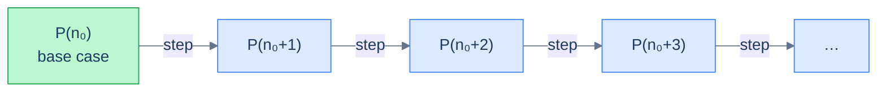
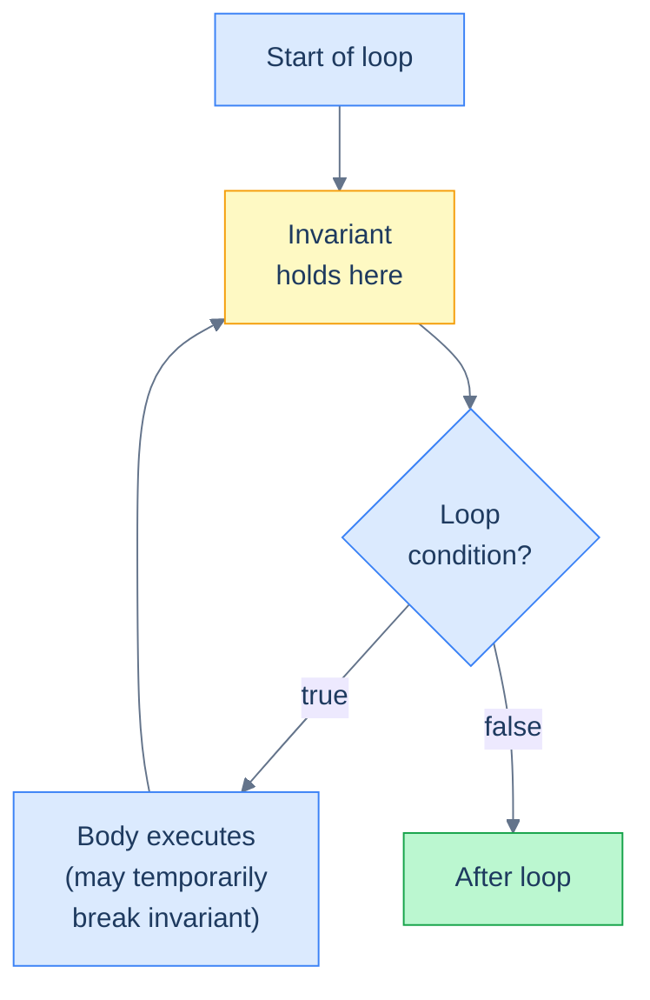

# 4. Proof Techniques

## The Hook

You write a binary search. It works on `[1, 2, 3, 4, 5]`. It works on `[5]`. It works on the empty array. You ship it.

Three weeks later, production. Your binary search is called on an array of a million elements, and silently returns the wrong index for some queries. Logs are clean. Tests are green. The bug is in a corner case you never tested.

A few unit tests cover *finite* inputs. They don't prove anything about the *infinitely* many inputs you didn't test. The gap between "works on the cases I tried" and "works on all cases" is the gap that proof techniques close. Engineers who can write a loop invariant — even informally, in a comment — catch the bug before it ships. Engineers who can't, ship and patch.

This chapter is the engineer's-eye view of proof. Not the textbook lemma-axiom-theorem version. The version where you can stare at a piece of code, write down what's true at the top of every loop iteration, and use that to argue *why the code is correct on every input it might ever see*. The pay-off is real: every difficult bug you ever fix is a place where the code's actual behaviour drifted from the invariant the author *thought* held.

---

## Table of contents

1. [Why "I tested it" isn't a proof](#why-i-tested-it-isnt-a-proof)
2. [Mathematical induction](#mathematical-induction)
3. [Proof by contradiction](#proof-by-contradiction)
4. [Loop invariants — the engineer's daily tool](#loop-invariants--the-engineers-daily-tool)
5. [Worked example: binary search](#worked-example-binary-search)
6. [Worked example: merge sort](#worked-example-merge-sort)
7. [A runnable demo](#a-runnable-demo)
8. [Edge cases and pitfalls](#edge-cases-and-pitfalls)
9. [Production reality](#production-reality)
10. [Quiz](#quiz)
11. [Practice ladder](#practice-ladder)
12. [Further reading](#further-reading)
13. [Cross-links](#cross-links)
14. [Final takeaway](#final-takeaway)

***

# Why "I tested it" isn't a proof

Tests check a finite set of inputs. The set of inputs the code might see in production is, for any non-trivial program, *infinite*. No finite collection of tests can cover an infinite set unless every test is *deductively* representative of all the cases it stands in for.

A proof in this chapter's sense is an argument that the code's behaviour holds for *all* inputs in some class. The conclusion follows not from running each input but from the structure of the argument itself. The three tools we'll use:

| Tool | Use when | Strength |
|---|---|---|
| **Induction** | The thing you're proving has a repeating structure (recursive call, loop iteration, integer counter). | The workhorse for recursive correctness and complexity. |
| **Contradiction** | You want to prove "X is impossible" or "no Y has property Z". | Often shorter than a direct proof. |
| **Loop invariants** | The thing you're proving is "this code computes the right answer". | The most concrete, most engineer-useful tool. |

We'll cover each, and then spend the bulk of the chapter on loop invariants because they're the technique you'll actually use in code review.

***

# Mathematical induction

Induction proves a statement `P(n)` for all integers `n ≥ n₀` by chaining two simpler claims.

> **Induction.**
> 1. **Base case:** Prove `P(n₀)` directly.
> 2. **Inductive step:** Assume `P(k)` for some `k ≥ n₀`. Use that to prove `P(k+1)`.
>
> If both hold, then `P(n)` is true for every `n ≥ n₀`.

The intuition: imagine an infinite line of dominoes. Knock the first one over (base case). Show that any standing domino, when knocked, knocks the next one (inductive step). Conclusion: every domino falls.



<p align="center"><strong>Induction is the chain-of-dominoes proof. Base case knocks the first; the inductive step knocks each successive one.</strong></p>

## Worked example: sum of first n integers

> **Claim:** For all `n ≥ 0`, the sum `0 + 1 + 2 + … + n = n(n+1)/2`.

**Base case** (`n = 0`): the sum is `0`. The formula gives `0 · 1 / 2 = 0`. ✓

**Inductive step.** Assume `0 + 1 + … + k = k(k+1)/2`. Show `0 + 1 + … + k + (k+1) = (k+1)(k+2)/2`.

Start from the assumption:

```
0 + 1 + … + k = k(k+1)/2
```

Add `(k+1)` to both sides:

```
0 + 1 + … + k + (k+1) = k(k+1)/2 + (k+1)
                     = (k+1) · (k/2 + 1)
                     = (k+1) · (k + 2) / 2
                     = (k+1)(k+2)/2  ✓
```

Done.

This formula is what makes "the worst-case quicksort recurrence sums to `Θ(n²)`" rigorous — you'll see it cited there.

## Strong induction

A variant: instead of assuming `P(k)` to prove `P(k+1)`, you assume `P(j)` for *all* `n₀ ≤ j ≤ k` to prove `P(k+1)`. Strong induction is useful when the inductive step needs information from earlier than the immediate predecessor. Examples: proving correctness of recursive algorithms whose recursion is on `n/2`, or showing that every integer ≥ 2 has a prime factorization.

You'll meet strong induction every time we prove a divide-and-conquer recurrence's closed form. The classic Fibonacci-time proof — `fib(n) ≥ φ^(n-2)` for `n ≥ 2`, where `φ` is the golden ratio — needs strong induction. The reason: `fib(k+1)` depends on both `fib(k)` and `fib(k-1)`.

***

# Proof by contradiction

> **Contradiction.** To prove `P`: assume `not P` and derive an absurdity. Conclude `P`.

The classic example: prove there are infinitely many primes.

> **Claim:** there are infinitely many primes.
>
> **Proof.** Assume for contradiction that only finitely many primes exist — call them `p₁, p₂, …, p_n`. Consider the number `N = p₁ · p₂ · … · p_n + 1`. Either `N` is prime, but then `N` is a prime not in our list, contradicting "those are all the primes". Or `N` is composite, so `N` has some prime factor `p`, which must be one of our `p_i`. But `N` is `1 mod p_i` for every `p_i` in the list, so no `p_i` divides `N`. That contradicts "every composite has a prime factor in the list". Either way: contradiction. The assumption was wrong. Infinitely many primes must exist. □

The shape is universal: assume the negation, follow the implications, find that the world breaks, conclude the original claim.

In algorithm correctness, contradiction is most often used for two shapes of claim:

- **Lower bounds** — "no algorithm can sort with fewer than `n log n` comparisons". Assume one could. Derive that the decision tree would have fewer than `n!` leaves. The pigeonhole principle delivers the contradiction.
- **Uniqueness** — "there's exactly one shortest path with these properties". Assume two. Show they would have to be equal. Contradiction.

***

# Loop Invariants — The Engineer's Daily Tool

A **loop invariant** is a condition that holds:

1. **Initialization** — before the loop's first iteration.
2. **Maintenance** — at the top of every iteration (assuming it held at the top of the previous one).
3. **Termination** — when the loop exits, combined with the loop's exit condition, it tells you the result is correct.

Once you have an invariant, the rest writes itself. You prove (1) directly. You prove (2) by induction. You prove (3) by combining the invariant with the exit condition.

This is the engineer's most-used proof technique because *you can write the invariant as a comment in the code*. Reading code with a clearly-stated invariant feels like reading code with the proof bolted on. Every reviewer can check the invariant against the code; every off-by-one bug is a place the invariant didn't hold.



<p align="center"><strong>The invariant holds at the entry to the body and at the exit from the body. The body might temporarily break it, but it must restore it before the next iteration.</strong></p>

***

# Worked example: binary search

Binary search is the smallest non-trivial algorithm where loop invariants pay off. The standard implementation:

```python
def binary_search(arr, target):
    lo, hi = 0, len(arr) - 1
    while lo <= hi:
        mid = lo + (hi - lo) // 2
        if arr[mid] == target:
            return mid
        if arr[mid] < target:
            lo = mid + 1
        else:
            hi = mid - 1
    return -1
```

Looks fine. It is fine. Let's prove it — and in proving it, find the off-by-ones that the next person to modify it might introduce.

**Loop invariant:** *if `target` is in `arr`, then it is in `arr[lo..hi]`* (the inclusive subarray from index `lo` to index `hi`).

Equivalently: every index `i` with `i < lo` or `i > hi` has `arr[i] != target`. The subarray we still need to search shrinks each iteration; the discarded portions never had the answer.

**Initialization.** Before the loop, `lo = 0` and `hi = len(arr) - 1`. The candidate range is the whole array. Trivially, if `target` is in `arr`, it's in `arr[0..len(arr)-1]`. ✓

**Maintenance.** Assume the invariant holds at the top of the iteration, with current range `[lo, hi]`. We compute `mid = lo + (hi - lo) // 2`, so `lo ≤ mid ≤ hi`.

- If `arr[mid] == target`: we return `mid`, exiting correctly. (Not maintenance, but a *correct exit*.)
- If `arr[mid] < target`: since `arr` is sorted, every `i ≤ mid` has `arr[i] ≤ arr[mid] < target`, so `target` cannot be at index `i ≤ mid`. The invariant was "if `target` is in `arr`, it's in `arr[lo..hi]`". Combined with the new fact that it's not at any `i ≤ mid`, it must be in `arr[mid+1..hi]`. Setting `lo = mid + 1` makes the new range exactly that. The invariant holds. ✓
- If `arr[mid] > target`: symmetric — every `i ≥ mid` has `arr[i] > target`, so the answer (if any) is in `arr[lo..mid-1]`. Setting `hi = mid - 1` makes that the new range. ✓

**Termination.** The loop exits when `lo > hi`. Combined with the invariant: if `target` is in `arr`, it's in `arr[lo..hi]` — but `arr[lo..hi]` is empty when `lo > hi`. Contradiction. So `target` is not in `arr`. Returning `-1` is correct. ✓

We've also shown the loop *terminates*: each iteration either exits via the `==` check or strictly decreases `hi - lo`. After at most `log₂(len(arr))` iterations, `hi - lo` reaches `-1` and the loop exits.

> *Predict before reading on:* what would happen if the line `mid = lo + (hi - lo) // 2` were instead `mid = (lo + hi) // 2`?

For most inputs, identical behaviour. For very large arrays where `lo + hi > 2³¹` (roughly `len ≥ 2³¹` on 32-bit `int`), the addition overflows to a negative number. The `//` then produces nonsense and the search reads out-of-bounds. This bug shipped in Java's `Arrays.binarySearch` for nine years before [Joshua Bloch found it in 2006](https://research.googleblog.com/2006/06/extra-extra-read-all-about-it-nearly.html). Tests on small arrays don't catch it; the loop invariant *would* have. The reason: `lo + (hi - lo) // 2` is the version that satisfies `lo ≤ mid ≤ hi` for all valid `lo, hi` with no overflow.

***

# Worked example: merge sort

Merge sort sorts an array recursively. The whole algorithm is two parts: the recursion that splits into halves, and the merge that combines two sorted halves. Both have invariants worth stating.

## Termination

Every recursive call is on a strictly smaller array (`len(arr) // 2 < len(arr)` for `len ≥ 2`; `len ≤ 1` is the base case). Strong induction on array length: base case `len ≤ 1` returns immediately; for `len ≥ 2`, recursive calls are on arrays of length `< len`, which terminate by inductive hypothesis. Therefore merge sort always terminates.

## Correctness

The recursion is correct if the merge step is correct. The merge step:

```python
def merge(left, right):
    out = []
    i = j = 0
    while i < len(left) and j < len(right):
        if left[i] <= right[j]:
            out.append(left[i]); i += 1
        else:
            out.append(right[j]); j += 1
    out.extend(left[i:])
    out.extend(right[j:])
    return out
```

**Invariant for the loop:** `out` is a sorted permutation of `left[0..i] + right[0..j]`.

**Initialization.** `out = []`, `i = j = 0`. The empty list is trivially a sorted permutation of nothing. ✓

**Maintenance.** Assume the invariant holds. The next iteration appends the smaller of `left[i]` or `right[j]`. WLOG it's `left[i]`. We append `left[i]` and increment `i`. The new `out` is the old `out` (which was sorted and contained `left[0..i] + right[0..j]`) followed by `left[i]`. We need to show this is still sorted.

The old `out` was sorted, so its last element was the maximum of `left[0..i] + right[0..j]`. We're appending `left[i]`, which is `≤` everything in `left[i+1..]` (because `left` is sorted) and *also* `≤` `right[j]` (the loop just chose `left[i]`). For the *new* `out` to be sorted, we need `left[i]` `≥` the previous max.

Hmm — is this true? The previous max of `out` is some element from `left[0..i] + right[0..j]`. Is it `≤ left[i]`?

- If it came from `left[0..i]`, yes — `left` is sorted, so `left[k] ≤ left[i]` for `k < i`.
- If it came from `right[0..j]`, then it's some `right[k]` for `k < j`. We need `right[k] ≤ left[i]`. We know `right[k]` was appended in some previous iteration where it was less than the `left` index *at that time*; since `i` has only grown, and `left` is sorted, `right[k] < left[i_at_that_time] ≤ left[i]`. ✓

So the invariant is maintained.

**Termination.** The loop exits when `i == len(left)` or `j == len(right)`. The two `extend` lines append the remainder of whichever list still has elements. The result `out` is a sorted permutation of `left + right`. ✓

The recursive call is correct by strong induction on array length, with the merge step as the inductive step's worker.

***

# A runnable demo

The code below implements binary search with explicit invariant assertions. Run it. Every assertion either holds (invariant maintained, code correct) or fires (bug — somewhere the implementation drifted from the spec).

```python run viz=array viz-root=arr
def binary_search(arr, target):
    # Precondition: arr is sorted ascending.
    assert all(arr[i] <= arr[i + 1] for i in range(len(arr) - 1)), "arr must be sorted"

    lo, hi = 0, len(arr) - 1
    while lo <= hi:
        # Invariant: if target is in arr, it is in arr[lo..hi].
        # Equivalently: for all i < lo, arr[i] != target; for all i > hi, arr[i] != target.
        if lo > 0:
            assert arr[lo - 1] < target, f"invariant broken: arr[{lo-1}]={arr[lo-1]} >= target={target}"
        if hi < len(arr) - 1:
            assert arr[hi + 1] > target, f"invariant broken: arr[{hi+1}]={arr[hi+1]} <= target={target}"

        mid = lo + (hi - lo) // 2
        if arr[mid] == target:
            return mid
        if arr[mid] < target:
            lo = mid + 1
        else:
            hi = mid - 1

    # Postcondition: target is not in arr.
    assert target not in arr, f"contract violation: should have found {target}"
    return -1


if __name__ == "__main__":
    import random
    random.seed(42)

    # Spot tests.
    assert binary_search([], 1) == -1
    assert binary_search([1], 1) == 0
    assert binary_search([1], 2) == -1
    assert binary_search([1, 3, 5, 7, 9], 5) == 2
    assert binary_search([1, 3, 5, 7, 9], 4) == -1
    assert binary_search([1, 3, 5, 7, 9], 9) == 4

    # Random stress test — invariants do the verification, not the test cases.
    for _ in range(1000):
        n = random.randint(0, 100)
        arr = sorted(random.randint(0, 50) for _ in range(n))
        target = random.randint(0, 50)
        result = binary_search(arr, target)
        if target in arr:
            assert result != -1 and arr[result] == target
        else:
            assert result == -1

    print("All 1000 random tests pass.")
    print("Invariants held throughout. Binary search is correct on every input it saw.")
```

```java run viz=array viz-root=arr
import java.util.*;

public class Main {
    static int binarySearch(int[] arr, int target) {
        // Precondition: arr is sorted.
        for (int i = 0; i < arr.length - 1; i++) {
            assert arr[i] <= arr[i + 1] : "arr must be sorted";
        }

        int lo = 0, hi = arr.length - 1;
        while (lo <= hi) {
            // Invariant: if target is in arr, it's in arr[lo..hi].
            if (lo > 0)            assert arr[lo - 1] < target;
            if (hi < arr.length - 1) assert arr[hi + 1] > target;

            int mid = lo + (hi - lo) / 2;
            if (arr[mid] == target) return mid;
            if (arr[mid] < target) lo = mid + 1;
            else hi = mid - 1;
        }
        return -1;
    }

    public static void main(String[] args) {
        // Run with: java -ea Main    (-ea enables assertions)
        Random rng = new Random(42);
        for (int trial = 0; trial < 1000; trial++) {
            int n = rng.nextInt(100);
            int[] arr = new int[n];
            for (int i = 0; i < n; i++) arr[i] = rng.nextInt(50);
            Arrays.sort(arr);
            int target = rng.nextInt(50);
            int result = binarySearch(arr, target);
            if (Arrays.binarySearch(arr, target) >= 0) {
                assert result != -1 && arr[result] == target;
            } else {
                assert result == -1;
            }
        }
        System.out.println("All 1000 random tests pass; invariants held throughout.");
    }
}
```

The assertions never fire, because the implementation respects the invariant. If you change `mid = lo + (hi - lo) // 2` to `mid = lo + (hi - lo) // 2 + 1` (a subtle off-by-one), some assertion will fire on some test case — the loop invariant catches the bug *before* the wrong index gets returned.

***

# Edge cases and pitfalls

- **The "obvious" base case isn't always the smallest one.** For an algorithm that works on arrays, the empty array (`len = 0`) is usually a special case worth listing in the base case. Off-by-one bugs love to live there.
- **The inductive step assumes the wrong thing.** A common mistake: assuming `P(k)` and proving `P(k+1)` *under additional, unjustified assumptions*. If your inductive step uses a fact you haven't established, it isn't a valid step.
- **Strong vs weak induction confusion.** Some recurrences (Fibonacci, divide-and-conquer) need strong induction. If your inductive step refers to *multiple* prior cases (not just `k`), state that you're using strong induction.
- **Loop invariants that hold but don't say anything useful.** "*The variables exist*" is a true invariant. It's also useless. The invariant should be just strong enough that the exit condition implies the postcondition. Too weak and you can't conclude anything; too strong and maintenance is hard to prove.
- **Forgetting to prove termination.** A loop that maintains its invariant *forever* is still wrong — it never returns. For every loop, separately argue *why* it terminates: typically a strict decrease of some non-negative quantity (`hi - lo`, the size of a remaining sublist, etc.).
- **Asserting the postcondition in the postcondition check.** The runnable demo's `assert target not in arr` at the end is a sanity check, not a proof — you've used a separate check to catch contract violations. In production code, you'd remove the linear scan (it'd dominate the cost) but keep the loop invariant as a comment.
- **Proof by contradiction that just renames the goal.** "Assume `not P`. Then `not P` would be true. But that's `not P`, contradicting `P`." This is a fake proof. The contradiction has to come from independent facts, not from the assumption itself.
- **Confusing necessary and sufficient.** "Every sorted array is binary-searchable" is true. "Every binary-searchable array is sorted" is *also* true (with one exception: a constant array). But the two statements are different and proving one doesn't prove the other.

***

# Production reality

**seL4 microkernel** — uses machine-checked refinement proofs in Isabelle/HOL — because a kernel bug compromises every program above it, and a one-time formal proof costs less than a lifetime of CVEs.

The seL4 team proved that the C implementation refines an abstract specification, line by line, in roughly 200,000 lines of Isabelle. The proof rules out buffer overflows, integer overflows, and unintended control flow. Operators deploying seL4 in avionics, autonomous vehicles, and defence systems trade a one-shot verification investment for a runtime correctness guarantee that no test suite can match.

**CompCert C compiler** — uses formally verified compilation passes proved in Coq — because a wrong optimisation silently miscompiles correct source.

Each optimisation pass carries a Coq proof that the output program has the same observable behaviour as the input. Airbus uses CompCert in flight-control code where the compiler is part of the certification boundary. The price is slower compile times and missing late-stage optimisations; the win is that a single proof replaces a fleet's worth of regression tests for compiler bugs.

**Amazon Web Services control plane** — uses TLA+ specifications model-checked with TLC — because distributed protocols fail in ways unit tests cannot reach.

S3, DynamoDB, and EBS engineers wrote TLA+ specs for protocols like the DynamoDB replicated-log consensus. The model checker explored billions of interleavings and exposed split-brain and data-loss bugs that survived years of integration tests. The technique catches design-level errors before any code ships; the [Lamport TLA+ page](https://lamport.azurewebsites.net/tla/tla.html) hosts the language Leslie Lamport invented for exactly this purpose.

**Rust compiler borrow checker** — uses an affine-type invariant proved at compile time — because data races and use-after-free are caught by structure rather than discipline.

Every reference in a compiling Rust program satisfies one invariant: it is either unique-and-mutable or shared-and-read-only. The compiler proves this invariant for the whole program before emitting code. Servo, Firefox's Stylo, and the Linux kernel's Rust modules all rely on this single proof to rule out memory-safety bugs that took decades to find in their C and C++ predecessors.

**Linux kernel red-black tree** — uses loop invariants encoded as comments — because the kernel's scheduler hot-path cannot afford a runtime check yet still must be correct.

The kernel's `lib/rbtree.c` documents five invariants every operation preserves — root colour, leaf colour, child-colour rule, black-height equality, and red-parent rule. The author's correctness argument lives in those comments; reviewers check each patch against the invariants instead of running an exhaustive test suite. The pattern surfaces in every non-trivial loop in the kernel — invariant first, code second.

***

# Quiz

**[Recall] Q: What three properties must a loop invariant satisfy?**
Initialization (holds before the first iteration), Maintenance (held entering an iteration implies held entering the next), and Termination (combined with the exit condition, implies the postcondition).

**[Recall] Q: What is the loop invariant for the standard binary search shown in this chapter?**
If `target` is in `arr`, then `target` is in the inclusive subarray `arr[lo..hi]`.

**[Reasoning] Q: Why must termination be proved separately from correctness?**
Correctness only guarantees "if the function returns, the answer is right" — a loop that maintains its invariant forever still never returns and is therefore wrong.

**[Reasoning] Q: Why does the Fibonacci-time bound `fib(n) ≥ φ^(n-2)` need strong induction rather than weak induction?**
The recursive case depends on both `fib(k)` and `fib(k-1)`, so the inductive step needs the hypothesis for two prior values, not just the immediate predecessor.

**[Tradeoff] Q: When do you reach for proof by contradiction over a direct proof?**
When the goal is impossibility or uniqueness — "no algorithm can do X" or "at most one Y exists" — because assuming the negation often forces a single concrete contradiction faster than constructing the positive argument.

***

# Practice ladder

| # | Problem | Pattern | Difficulty | Hint |
|---|---------|---------|------------|------|
| 1 | [Sum of first `n` odd integers equals `n²`](https://brilliant.org/wiki/induction-introduction/) | Induction | Easy | Base `n=1`: `1 = 1²`. Step: add `2k+1` to `k²` and factor `(k+1)²`. |
| 2 | [The "all horses are the same colour" fallacy](https://en.wikipedia.org/wiki/All_horses_are_the_same_color) | Induction (broken proof) | Easy | The inductive step assumes the two `k`-sized groups overlap. They do not when `k=1`, so the bridge from `n=1` to `n=2` fails. |
| 3 | [LeetCode 53 — Maximum Subarray](https://leetcode.com/problems/maximum-subarray/) | Loop invariant | Easy | Invariant: `best == max(arr[0..i])`. Prove initialization, maintenance, and termination. |
| 4 | [Prove "if `n²` is even, then `n` is even"](https://www.themathdoctors.org/proof-by-contradiction-some-examples/) | Contradiction | Easy | Assume `n` is odd. Expand `(2k+1)²` and show the result is odd. |
| 5 | [LeetCode 34 — Find First and Last Position of Element in Sorted Array](https://leetcode.com/problems/find-first-and-last-position-of-element-in-sorted-array/) | Loop invariant + off-by-one | Medium | Two binary searches: one for first index `≥ target`, one for first index `> target`. Subtract — do not add one. |

***

# Further reading

- [Introduction to Algorithms (CLRS), Chapter 2 — Loop Invariants](https://mitpress.mit.edu/9780262046305/introduction-to-algorithms/)
  ★ Essential — the canonical engineering treatment of loop invariants, with insertion sort worked through line by line.
- [How to Prove It — Daniel J. Velleman](https://www.cambridge.org/highereducation/books/how-to-prove-it/0BBE40FB78F7AAE6F2A2EAEF63E48D04)
  ★ Essential — a friendly first pass over induction and contradiction with hundreds of exercises.
- [Extra, Extra — Read All About It: Nearly All Binary Searches and Mergesorts are Broken](https://research.googleblog.com/2006/06/extra-extra-read-all-about-it-nearly.html)
  ★ Essential — Joshua Bloch's 2006 post that motivated the `lo + (hi - lo) / 2` idiom in this chapter.
- [Software Foundations — Benjamin Pierce et al.](https://softwarefoundations.cis.upenn.edu/)
  ◆ Advanced — interactive Coq textbook for readers who want machine-checked proofs of program correctness.
- [Specifying Systems — Leslie Lamport](https://lamport.azurewebsites.net/tla/book.html)
  ◆ Advanced — the TLA+ book; pairs naturally with the AWS production-reality entry.
- [Concrete Mathematics — Graham, Knuth, Patashnik](https://www.pearson.com/en-us/subject-catalog/p/concrete-mathematics-a-foundation-for-computer-science/P200000003167/)
  → Reference — the lookup volume for induction-heavy summations and recurrences cited throughout this book.
- [The Linux kernel `lib/rbtree.c`](https://github.com/torvalds/linux/blob/master/lib/rbtree.c)
  → Reference — production loop-invariant comments at industrial scale; cross-reference with the chapter's red-black tree material later.

***

# Cross-links

**Prerequisites**

- [Asymptotic Analysis](/cortex/data-structures-and-algorithms/foundations-asymptotic-analysis) — the language complexity proofs are written in.

**What comes next**

- [Recurrence Relations & The Master Theorem](/cortex/data-structures-and-algorithms/foundations-recurrence-relations-and-master-theorem) — the substitution method is induction applied to complexity recurrences.
- [Memory & Performance Reality](/cortex/data-structures-and-algorithms/foundations-memory-and-performance-reality) — the next chapter turns from correctness to wall-clock cost.
- [DSA in Real Systems: Linux Red-Black Tree](/cortex/data-structures-and-algorithms/dsa-in-real-systems-linux-red-black-tree-in-the-cfs-scheduler) — production loop invariants in the kernel scheduler's hot path.

***

# Final Takeaway

1. **Core mechanic:** Pick the proof tool that matches the question's shape — induction for recursive structure, contradiction for impossibility or uniqueness, loop invariants for "this code returns the right answer".
2. **Dominant tradeoff:** Writing an invariant takes minutes; running it forever costs nothing in release builds — you trade up-front rigour for permanent confidence that survives every future refactor.
3. **One thing to remember:** Correctness and termination are independent — prove both, or the code that "looks correct" never returns on the input that matters.
