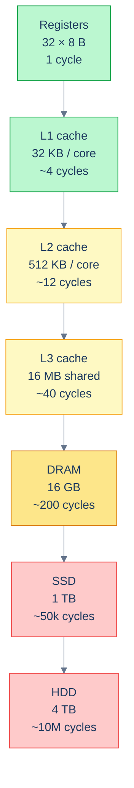
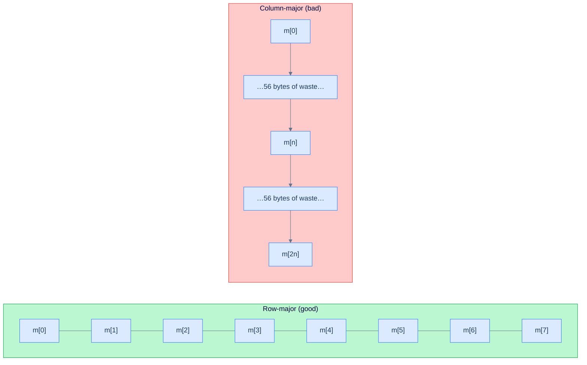
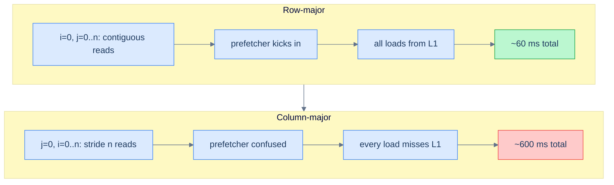

# 5. Memory Model and the Cache Hierarchy

## The Hook

Here are two C functions. Both sum every element of an `n × n` matrix. Both visit every element exactly once. Both are `Θ(n²)`.

```c
double sum_row_major(double *m, int n) {
    double s = 0;
    for (int i = 0; i < n; i++)
        for (int j = 0; j < n; j++)
            s += m[i * n + j];                    // m[i][j]
    return s;
}

double sum_col_major(double *m, int n) {
    double s = 0;
    for (int j = 0; j < n; j++)
        for (int i = 0; i < n; i++)
            s += m[i * n + j];                    // m[i][j]
    return s;
}
```

The only difference: which loop is on the outside. The inner loop steps through *consecutive* memory addresses in the first version, and through addresses *`n` apart* in the second. For a 4096×4096 matrix of doubles, the row-major version runs in about 60 ms on a typical laptop. The column-major version runs in about **600 ms**. Same `Θ(n²)`. Same number of memory reads. **Ten times slower.**

The gap is not in the algorithm. The gap is in the *memory hierarchy* — the layered cache between the CPU and RAM that you don't see in the code, you don't see in the algorithm, you don't see in Big-O. But it's the thing that decides, in practice, whether your `Θ(n²)` runs in 60 ms or 600 ms.

This chapter is the picture every later chapter assumes you have. Once you understand cache lines, spatial locality, and temporal locality, you stop being surprised by benchmarks. You also stop writing code that hits the same Big-O on paper but takes ten times longer in production.

---

## Table of contents

1. [Big-O and wall-clock disagree](#big-o-and-wall-clock-disagree)
2. [The memory hierarchy](#the-memory-hierarchy)
3. [Cache lines](#cache-lines)
4. [Spatial and temporal locality](#spatial-and-temporal-locality)
5. [Worked example: row-major vs column-major matrix traversal](#worked-example-matrix-traversal)
6. [A runnable demo](#a-runnable-demo)
7. [The data layouts that win](#the-data-layouts-that-win)
8. [Edge cases and pitfalls](#edge-cases-and-pitfalls)
9. [Production reality](#production-reality)
10. [Practice ladder](#practice-ladder)
11. [Cross-links](#cross-links)
12. [Final takeaway](#final-takeaway)

***

# Big-O and wall-clock disagree

[Asymptotic analysis](/cortex/data-structures-and-algorithms/foundations-asymptotic-analysis) tells you how cost grows as `n` grows. It deliberately *throws away the constant* — `100n` and `n` are both `O(n)` because the *shape* of the curve is the same.

In practice that constant is not nothing. It's often a 10× or 100× factor — and almost always, the factor is dominated by *memory access patterns*, not by counting operations. Two algorithms with identical operation counts can run at wildly different speeds depending on whether they touch memory in patterns the hardware likes or patterns the hardware hates.

This chapter is about the patterns. The next chapter (and every chapter after it) will use them implicitly: every "in practice this is fast" claim in the book reduces, eventually, to "this access pattern is cache-friendly".

***

# The memory hierarchy

A modern CPU is a row of caches sitting between an extremely fast computational engine and a vast, slow store of data. Each level is *bigger but slower* than the one above it.

| Level | Size (typical) | Latency (typical) |
|---|---|---|
| **CPU registers** | 16–32 of them, 8 bytes each | 1 cycle |
| **L1 cache** | 32–64 KB per core | ~4 cycles |
| **L2 cache** | 256 KB – 1 MB per core | ~12 cycles |
| **L3 cache** | 4–64 MB shared across cores | ~40 cycles |
| **Main memory (DRAM)** | 8 GB – terabytes | ~150–300 cycles |
| **SSD** | 256 GB – multi-TB | ~50,000–100,000 cycles |
| **Spinning disk (HDD)** | 1 TB – tens of TB | ~10,000,000 cycles |

The numbers vary by CPU model, but the *ratios* are universal: each level is roughly 3–10× slower than the one above and 10–100× larger.



<p align="center"><strong>Each step down is dramatically slower. Going from L1 to RAM costs 50× more time per access. Going from RAM to SSD costs another 200×. Going to HDD costs another 200×. A modern program lives or dies on whether its working set fits in cache.</strong></p>

The CPU can't tell you which level a load came from. It just looks at the address, asks the cache hierarchy, and waits. If the data is in L1, the wait is 4 cycles. If it has to go to RAM, the wait is 200 cycles. The same `arr[i]` in your code can take 50× longer depending on what's already cached.

This is the *constant* Big-O hides. The 50× factor between an L1 hit and a DRAM miss is exactly the gap between a fast array scan and a slow one.

***

# Cache lines

The cache doesn't load one byte at a time. It loads in **cache lines** — contiguous blocks of (almost universally) 64 bytes. When you access a single 4-byte `int`, the cache pulls the entire 64-byte line containing that `int`. The next 60 bytes after the one you actually wanted are now in cache, *for free*.

```
addresses:    [0x100   0x108   0x110   0x118   0x120   0x128   0x130   0x138]
              [int4 ][int4 ][int4 ][int4 ][int4 ][int4 ][int4 ][int4 ]   ← row of doubles
              ←──────────────────  64-byte cache line  ──────────────────→
                                        ↑
                                you read m[i] (8 bytes)
                                the rest of the line came along for free
```

This single fact dominates real-world performance. **If your next access is on the same cache line, it's effectively free** (it's already in L1). **If it's on a different cache line, you pay the cost of a fresh load** (anywhere from L1 → L2 latency to L3 → DRAM latency, depending on what's hot).

That's why the row-major matrix sum is 10× faster than the column-major. The row-major version walks 64 consecutive bytes per cache-line load, getting 8 doubles for the price of one fetch. The column-major version walks 8 doubles that are `n × 8 = 8n` bytes apart — every single access is a fresh cache line, the next 56 bytes of the line are wasted, and the prefetcher can't help because the stride is `> cache_size`.



<p align="center"><strong>Row-major access reuses the cache line — eight doubles per fetch. Column-major access discards 56 bytes per fetch. Same algorithm. 10× difference in wall-clock.</strong></p>

***

# Spatial and temporal locality

Two access patterns are cache-friendly. Code that has both runs fast.

> **Spatial locality:** if you've just accessed memory location `X`, you're likely to access locations near `X` soon.
>
> **Temporal locality:** if you've just accessed location `X`, you're likely to access `X` again soon.

The cache hierarchy is *built around these two assumptions*. Spatial locality is why caches load whole 64-byte lines (you'll probably want neighbours). Temporal locality is why caches *retain* recently-accessed data (you'll probably want it again).

Code that respects spatial locality:
- Iterates over arrays in *index order* (row-major, not column-major).
- Uses contiguous data structures (arrays, `std::vector`, NumPy arrays) over pointer-chained ones (linked lists, trees of `Box<T>`).
- Stores related fields together (a `struct` of small fields, all accessed together; not a "structure of arrays" if every operation touches all fields of one element).

Code that respects temporal locality:
- Reuses recently-loaded data (loop blocking, tile-based image processing).
- Avoids re-reading the same data needlessly (memoise, cache results).

Code that *violates* spatial locality:
- Walks a linked list. Each node's address is wherever the allocator put it; rarely contiguous; usually a fresh cache line per node.
- Walks a binary tree by following pointers. Same pattern.
- Iterates a sparse data structure (a hash table, a graph adjacency list).

Code that *violates* temporal locality:
- Streaming computations that touch each datum exactly once. The cache holds nothing useful for next iteration.
- Cold paths after a long pause. Whatever was in cache has been evicted by other work.

The takeaway: **arrays beat linked structures by 10× in wall-clock, even at identical Big-O**, because of cache effects. This is why every chapter that compares "array implementation vs linked-list implementation" of the same data structure has the array version winning in practice.

***

# Worked example: matrix traversal

Let's compute the gap for a 1024×1024 matrix of `double`s. Each `double` is 8 bytes; the matrix is `8 MB` total. A cache line is 64 bytes = 8 doubles. The matrix has `1024² / 8 = 128k` cache lines.

**Row-major version**: 128k cache-line loads, each touching 8 elements. The CPU's prefetcher detects the linear stride and starts prefetching the next line *while the current one is being processed* — a well-tuned prefetcher hides almost all the load latency. Result: nearly-free loads, dominated by the addition itself.

**Column-major version**: each access is to a different cache line. With 1024 cache lines per column and an L1 cache that holds maybe 512 cache lines (32 KB / 64 B per line), even *one column's worth* of accesses evicts the previous column. Every access is a miss into L2 or worse. Result: every access takes 12+ cycles instead of 1.

The 10× gap in wall-clock is exactly the ratio of "L1 hit + prefetched" to "L2 miss minimum, with no prefetching".



<p align="center"><strong>Same algorithm. Same operations. The gap is purely in how the access pattern interacts with the cache.</strong></p>

***

# A runnable demo

The code below benchmarks the row-major vs column-major sum on matrices of growing size. Run it. The gap should be clear well before the matrix exceeds L2 cache; the gap *widens* once the matrix exceeds L3 cache.

```pseudocode
function sumRowMajor(M, n):                          # m[i][j] = M[i*n + j]
    s ← 0
    for i from 0 to n − 1:
        for j from 0 to n − 1:
            s ← s + M[i*n + j]
    return s

function sumColMajor(M, n):
    s ← 0
    for j from 0 to n − 1:
        for i from 0 to n − 1:
            s ← s + M[i*n + j]
    return s
```

```python run
import time, array, sys

def sum_row_major(m, n):
    s = 0.0
    for i in range(n):
        base = i * n
        for j in range(n):
            s += m[base + j]
    return s

def sum_col_major(m, n):
    s = 0.0
    for j in range(n):
        for i in range(n):
            s += m[i * n + j]
    return s

if __name__ == "__main__":
    print(f"{'n':>6} {'matrix MB':>12} {'row (ms)':>12} {'col (ms)':>12} {'col/row':>10}")
    for n in [128, 256, 512, 1024]:
        m = array.array('d', [1.0] * (n * n))
        t0 = time.perf_counter()
        sum_row_major(m, n)
        row_ms = (time.perf_counter() - t0) * 1000
        t0 = time.perf_counter()
        sum_col_major(m, n)
        col_ms = (time.perf_counter() - t0) * 1000
        size_mb = n * n * 8 / (1024 * 1024)
        print(f"{n:>6} {size_mb:>12.1f} {row_ms:>12.2f} {col_ms:>12.2f} {col_ms / row_ms:>9.1f}x")
```

```java run
class Solution {
    static double sumRowMajor(double[] m, int n) {
        double s = 0;
        for (int i = 0; i < n; i++) {
            int base = i * n;
            for (int j = 0; j < n; j++) s += m[base + j];
        }
        return s;
    }

    static double sumColMajor(double[] m, int n) {
        double s = 0;
        for (int j = 0; j < n; j++)
            for (int i = 0; i < n; i++) s += m[i * n + j];
        return s;
    }

    public static void main(String[] args) {
        int[] sizes = {128, 256, 512, 1024};
        System.out.printf("%6s %12s %12s %12s %10s%n", "n", "matrix MB", "row (ms)", "col (ms)", "col/row");
        for (int n : sizes) {
            double[] m = new double[n * n];
            for (int i = 0; i < m.length; i++) m[i] = 1.0;
            // Warmup.
            sumRowMajor(m, n); sumColMajor(m, n);
            long t0 = System.nanoTime();
            sumRowMajor(m, n);
            double rowMs = (System.nanoTime() - t0) / 1e6;
            t0 = System.nanoTime();
            sumColMajor(m, n);
            double colMs = (System.nanoTime() - t0) / 1e6;
            double sizeMb = (double) m.length * 8 / (1024 * 1024);
            System.out.printf("%6d %12.1f %12.2f %12.2f %9.1fx%n", n, sizeMb, rowMs, colMs, colMs / rowMs);
        }
    }
}
```

```c run
#include <stdio.h>
#include <stdlib.h>
#include <time.h>

static double sum_row_major(const double *m, int n) {
    double s = 0;
    for (int i = 0; i < n; i++) {
        const double *row = m + i * n;
        for (int j = 0; j < n; j++) s += row[j];
    }
    return s;
}

static double sum_col_major(const double *m, int n) {
    double s = 0;
    for (int j = 0; j < n; j++)
        for (int i = 0; i < n; i++) s += m[i * n + j];
    return s;
}

static double ms_since(struct timespec a) {
    struct timespec b; clock_gettime(CLOCK_MONOTONIC, &b);
    return (b.tv_sec - a.tv_sec) * 1000.0 + (b.tv_nsec - a.tv_nsec) / 1e6;
}

int main(void) {
    int sizes[] = {128, 256, 512, 1024, 2048};
    printf("%6s %12s %12s %12s %10s\n", "n", "matrix MB", "row (ms)", "col (ms)", "col/row");
    for (int s = 0; s < 5; s++) {
        int n = sizes[s];
        double *m = malloc((long)n * n * sizeof(double));
        for (long i = 0; i < (long)n * n; i++) m[i] = 1.0;
        struct timespec t0;
        clock_gettime(CLOCK_MONOTONIC, &t0);
        volatile double r = sum_row_major(m, n); (void)r;
        double row_ms = ms_since(t0);
        clock_gettime(CLOCK_MONOTONIC, &t0);
        volatile double c = sum_col_major(m, n); (void)c;
        double col_ms = ms_since(t0);
        double size_mb = (double)n * n * 8 / (1024.0 * 1024.0);
        printf("%6d %12.1f %12.2f %12.2f %9.1fx\n", n, size_mb, row_ms, col_ms, col_ms / row_ms);
        free(m);
    }
    return 0;
}
```

```scala run
object Solution {
  def sumRowMajor(m: Array[Double], n: Int): Double = {
    var s = 0.0; var i = 0
    while (i < n) {
      val base = i * n
      var j = 0
      while (j < n) { s += m(base + j); j += 1 }
      i += 1
    }
    s
  }

  def sumColMajor(m: Array[Double], n: Int): Double = {
    var s = 0.0; var j = 0
    while (j < n) {
      var i = 0
      while (i < n) { s += m(i * n + j); i += 1 }
      j += 1
    }
    s
  }

  def main(args: Array[String]): Unit = {
    val sizes = Array(128, 256, 512, 1024)
    println(f"${"n"}%6s ${"matrix MB"}%12s ${"row (ms)"}%12s ${"col (ms)"}%12s ${"col/row"}%10s")
    for (n <- sizes) {
      val m = Array.fill(n * n)(1.0)
      sumRowMajor(m, n); sumColMajor(m, n)                 // warmup
      var t0 = System.nanoTime()
      sumRowMajor(m, n)
      val rowMs = (System.nanoTime() - t0) / 1e6
      t0 = System.nanoTime()
      sumColMajor(m, n)
      val colMs = (System.nanoTime() - t0) / 1e6
      val sizeMb = m.length * 8 / (1024.0 * 1024.0)
      println(f"$n%6d $sizeMb%12.1f $rowMs%12.2f $colMs%12.2f ${colMs / rowMs}%9.1fx")
    }
  }
}
```

What you should see: the `col / row` ratio starts near 1× for tiny matrices (everything fits in L1 either way), grows to 3-5× as the matrix grows past L1, and pushes 10× or more once the matrix exceeds L3.

***

# The data layouts that win

A handful of recurring patterns make code cache-friendly:

- **Arrays beat trees.** A `std::vector<int>` and a `std::set<int>` have the same Big-O for many operations, but the vector wins by 5-10× in practice because every access is contiguous and prefetched. Use trees only when you *need* the structural property (sorted iteration, ordered queries).
- **Struct-of-arrays beats array-of-structs (sometimes).** If you have `1M particles` and mostly need their `x` coordinate, store `xs: [1M doubles], ys: [1M doubles], zs: [1M doubles]` rather than `particles: [{x, y, z, mass, charge, …}, …]`. The first layout puts only `x`s in cache when you only need `x`s; the second wastes 7/8 of every cache line on fields you don't need. The reverse — array-of-structs — wins when every operation touches every field.
- **Bit-packing beats `bool[]`.** A `bool[8M]` is 8 MB. A `BitSet(8M)` (one bit per flag) is 1 MB. The latter fits in L2 cache; the former doesn't. Same asymptotic operation cost, dramatically different wall-clock when you scan or `popcount`.
- **Pre-allocate; resize is the enemy of cache.** Every dynamic-array resize rewrites the whole array into a new allocation. The new allocation might be in a different memory page, evicting the old data from cache and starting cold. If you know the size in advance, allocate once.
- **Loop blocking (tiling).** For matrix operations, work on `B×B` tiles where `B` is sized to fit in L1. The naive `for i, for j, for k` matrix multiply has `O(n³)` operations and *also* `O(n³)` cache misses; the blocked version has `O(n³)` operations but only `O(n³ / B)` cache misses.
- **Linear arrays of pointers are the worst of both worlds.** An `array<Box<int>>` stores the boxes contiguously but the boxes themselves are scattered across the heap. Walking the array is one cache line per `int`. Use `array<int>` instead unless you genuinely need pointer indirection.

***

# Edge cases and pitfalls

- **False sharing.** Two threads writing to *different* variables on the *same cache line* cause the cache line to ping-pong between cores' caches, each invalidating the other. The variables don't conflict, but the cache line does. Mitigation: pad hot variables to cache-line boundaries. The Linux kernel uses `____cacheline_aligned_in_smp` for this.
- **Pointer chasing.** Every dereference can be a cache miss. A linked list of 1M nodes is 1M *random* memory accesses; even though the operation count is `O(n)`, the wall-clock can be 100× slower than an array of 1M ints.
- **Misaligned accesses.** A `double` straddling a cache-line boundary requires *two* cache-line loads. The compiler aligns aggregates by default, but custom packed structs and serialised binary formats can land cross-line.
- **The TLB (Translation Lookaside Buffer).** A separate cache for the address-translation tables. A program that touches enough distinct 4 KB pages can exhaust the TLB even if every page's contents are in cache. This is rare but real for memory-mapped database engines.
- **Hardware prefetchers are not magic.** They detect linear strides and recent jump patterns. They don't detect random access (linked-list walks) and don't help unless the stride is reasonably small. If your code hits a "the prefetcher should have caught up" wall, profile.
- **Cache levels are inclusive vs exclusive vs NINE.** Different CPUs handle multi-level caches differently. Inclusive (L1 contents are also in L2, L2 in L3) is simpler; exclusive (each level holds different data) is more capacity. The details rarely matter for correctness but can shift performance numbers.
- **NUMA (Non-Uniform Memory Access).** On multi-socket systems, "RAM" isn't uniform — accesses to memory on the same NUMA node as the CPU are 2-3× faster than cross-node accesses. Production scheduling pins threads to NUMA nodes for this reason.
- **Cache-friendly does not mean correct.** Cache-friendly code with a logic bug is still wrong. Profile *after* correctness, not before.

***

# Production reality

- **NumPy strides.** A NumPy array stores its memory as a flat contiguous block plus a `strides` tuple that says how many bytes to advance per axis. `arr.T` (transpose) doesn't copy data — it just swaps the strides. *Both* `arr` and `arr.T` are valid NumPy arrays; iterating one is cache-friendly, iterating the other is cache-hostile. Operations that require a contiguous layout (like passing to a BLAS routine) will silently call `np.ascontiguousarray()` to copy. Reading a `np.transpose` result and getting 10× slower throughput than expected is one of the canonical NumPy performance bugs.
- **JVM object layout.** Java objects have a 12-16 byte header, then field words ordered by the JVM's object-layout algorithm to minimise padding. Reading the source of OpenJDK's `Universe::initialize_basic_type_mirrors` shows the algorithm. The result: small objects pack densely; arrays of objects fit more per cache line if the fields are small. The `-XX:+UseCompressedOops` flag halves pointer width on 64-bit JVMs by storing 32-bit "compressed pointers" — significant memory savings for pointer-heavy data structures.
- **Linux kernel cache-line hints.** The kernel uses `____cacheline_aligned` to align hot variables to cache-line boundaries (see `include/linux/cache.h`). Per-CPU variables (`DEFINE_PER_CPU`) live on per-CPU cache lines specifically to avoid false sharing on the most-touched paths.
- **Postgres B-tree page size.** Postgres B-tree pages are 8 KB by default (matching the OS page size on most platforms). The page size is the granularity of disk I/O; 8 KB is small enough to fit a meaningful number of keys, large enough that disk seeks amortise across many rows. The B-tree fanout is sized to fit a 8 KB page comfortably — usually hundreds of keys per node, dramatically reducing tree height and disk seeks.
- **Redis ziplist / listpack.** Redis stores small lists, sets, and hashes in a *contiguous* memory layout (ziplist; replaced by listpack in 7.0) instead of doubly-linked-list of objects. For small data, the cache locality wins exceed the algorithmic costs of search/insert. Above a configured threshold (`list-max-ziplist-size`), Redis converts to a more dynamic layout. The contiguous-vs-pointer-chained tradeoff is exactly the pattern of this chapter, deployed in a production database.
- **Game engines and ECS architecture.** "Entity-Component-System" architectures (Unity DOTS, Unreal's Mass framework, Bevy) store all `Position` components in one contiguous array, all `Velocity` components in another, etc. Update systems touch only the components they need, getting maximum cache locality. The traditional OOP "every entity is an object with virtual methods" approach is up to 10× slower for the same logic.

***

# Practice ladder

1. **Predict the gap.** A 4096×4096 matrix of `int32` is `64 MB`. A modern laptop has 16 MB of L3 cache. Will the row-major-vs-column-major gap be larger or smaller than for a 256×256 matrix (256 KB)?
   > *Hint:* the gap is *larger* for the bigger matrix. The 256×256 matrix fits in L3 either way; both versions ultimately load every cache line once. The 4096×4096 matrix exceeds L3, so column-major *re-loads* lines that would have stayed in cache for the row-major version. The bigger the working set relative to cache, the more the access pattern matters.

2. **Identify the cache-friendly version.** Which of these traverses an array of structs more cache-friendly-ly?
   ```c
   struct Point { double x, y, z; };
   Point arr[N];

   // Version A
   for (int i = 0; i < N; i++) sum += arr[i].x + arr[i].y + arr[i].z;

   // Version B
   for (int i = 0; i < N; i++) sum += arr[i].x;
   for (int i = 0; i < N; i++) sum += arr[i].y;
   for (int i = 0; i < N; i++) sum += arr[i].z;
   ```
   > *Hint:* Version A. It touches all three fields of each struct *while the struct is hot in L1*. Version B walks the entire array *three times* — if the array exceeds L1, each pass has to reload from L2/L3. Version A touches each cache line once; Version B touches each line three times.

3. **Spot the false-sharing bug.** Two threads work on a counter:
   ```c
   struct Counters { volatile long thread1_count, thread2_count; };
   Counters c = {0, 0};

   // Thread 1: while running, increments c.thread1_count
   // Thread 2: while running, increments c.thread2_count
   ```
   Why does this not scale linearly with the number of threads?
   > *Hint:* both fields are on the same cache line (16 bytes total, well under 64 bytes). Each thread's write invalidates the other's cache copy, forcing a cross-core cache-line transfer per increment. The fix: pad each counter to a full cache line.

4. **Pick the data layout.** You're storing 10M particles, each with 8 fields (`x, y, z, vx, vy, vz, mass, charge`). Most simulations sweep through and update positions: `x += vx * dt; y += vy * dt; z += vz * dt`. Should you store as `Particle[]` (array of structs) or as parallel `double[] xs, ys, zs, vxs, vys, vzs`?
   > *Hint:* parallel arrays. The position update only touches the 6 movement fields; mass and charge are dead weight on every cache line. Array-of-structs forces them into cache. Struct-of-arrays keeps the movement fields contiguous and pulls only what's needed. (Game engines, physics simulations, and ECS frameworks all use this layout for this reason.)

5. **Loop blocking for matrix multiplication.** The naive matrix multiplication is `O(n³)` operations and `O(n³)` cache misses. Block it: process `B × B` tiles, where `B` is small enough that the three tiles ( source A, source B, destination C ) fit in L1. The blocked version has the same `O(n³)` operations but `O(n³ / B)` cache misses. For a 1024-row matrix and `B = 32`, what's the speedup factor?
   > *Hint:* a factor of `B = 32` fewer misses. In practice the speedup is roughly 5-10× (memory access dominates; reducing misses by 32× translates to ~10× wall-clock for memory-bound workloads). This is exactly what BLAS implementations do.

***

# Memorize

The high-leverage facts to commit to long-term memory — atomic enough for an Anki card, concrete enough to recall under pressure or during production debugging. Big-O tells you the curve's shape; this chapter's facts tell you the curve's *slope*. Reading benchmarks without these is guessing.

## Quick recall

Click any question to reveal the answer.

<details>
<summary><strong>Q:</strong> Approximate latency of L1, L3, DRAM, SSD, HDD?</summary>

**A:** L1 ≈ 4 cycles, L3 ≈ 40 cycles, DRAM ≈ 200 cycles, SSD ≈ 50,000 cycles, HDD ≈ 10,000,000 cycles. Each step roughly 5–10× slower than the one above.

</details>

<details>
<summary><strong>Q:</strong> Standard cache line size on modern x86 / ARM?</summary>

**A:** 64 bytes. The granularity at which the CPU loads from memory; one access pulls 8 doubles or 16 ints "for free".

</details>

<details>
<summary><strong>Q:</strong> Spatial vs temporal locality — define both.</summary>

**A:** **Spatial:** if you've accessed `X`, you'll likely access addresses near `X` soon. **Temporal:** if you've accessed `X`, you'll likely access `X` again soon.

</details>

<details>
<summary><strong>Q:</strong> Why is row-major matrix traversal 10× faster than column-major at <code>n = 1024</code>, despite identical Big-O?</summary>

**A:** Row-major reuses each cache line (8 doubles per fetch); column-major touches a fresh line per access, wasting 56 bytes. The prefetcher helps row-major, can't help column-major.

</details>

<details>
<summary><strong>Q:</strong> What is false sharing?</summary>

**A:** Two threads writing to *different* variables on the *same* cache line cause the line to ping-pong between cores' caches. Fix: pad hot variables to cache-line boundaries.

</details>

<details>
<summary><strong>Q:</strong> Array vs linked list — why does the array win at "the same Big-O" of operations?</summary>

**A:** Arrays are contiguous; the prefetcher streams ahead. Linked-list nodes are scattered across the heap; each pointer chase can miss. Array beats list by 5–10× wall-clock for traversal.

</details>

<details>
<summary><strong>Q:</strong> Struct-of-arrays vs array-of-structs — when does each win?</summary>

**A:** **Struct-of-arrays** wins when most operations touch only a few fields (cache lines aren't wasted on unused fields). **Array-of-structs** wins when every operation touches every field (locality across fields).

</details>

<details>
<summary><strong>Q:</strong> What does loop blocking (tiling) do?</summary>

**A:** Process `B × B` tiles where `B` fits in L1. Same total work; far fewer cache misses. BLAS implementations rely on this for matrix multiply.

</details>

<details>
<summary><strong>Q:</strong> What does NumPy <code>arr.T</code> (transpose) do to memory?</summary>

**A:** Nothing! It just swaps the strides. Both `arr` and `arr.T` share the same memory; iterating one is cache-friendly, the other is cache-hostile.

</details>

<details>
<summary><strong>Q:</strong> What's the TLB and when does it matter?</summary>

**A:** Translation Lookaside Buffer — a cache for address-translation tables. A program touching enough distinct 4 KB pages can exhaust the TLB even if every page's contents are in L1. Real concern for memory-mapped database engines.

</details>

## Code template

```python
# Cache-friendly traversal cheat sheet.

# GOOD — row-major traversal of a row-major-stored matrix:
for i in range(n):
    row = m[i]              # one cache-line fetch starts here
    for j in range(n):
        do(row[j])          # subsequent accesses are L1 hits

# BAD — column-major traversal of a row-major-stored matrix:
for j in range(n):
    for i in range(n):
        do(m[i][j])         # each access is a fresh cache line

# GOOD — touch every field of each struct before moving on:
for p in particles:
    p.update_position()     # all of p's fields are hot in L1

# BAD — split the same work into multiple passes:
for p in particles: p.update_x()
for p in particles: p.update_y()
for p in particles: p.update_z()    # each pass reloads from L2/L3

# GOOD — pre-allocate, no resize:
arr = [0] * n
for i in range(n): arr[i] = compute(i)

# BAD — repeated string concat (immutable strings → O(n²) hidden):
s = ""
for chunk in chunks: s += chunk     # use "".join(chunks) instead
```

## Pattern triggers

- **Same Big-O, 10× slower in practice** → cache miss rate; profile with `perf stat`
- **Sorting structures of objects** → consider struct-of-arrays for the key field
- **Hot counter shared across threads** → false sharing; pad to cache-line boundary
- **Matrix operations** → row-major + tiling; `numpy.ascontiguousarray()` if you transposed earlier
- **Hash table keeps growing** → rehash thrashes the cache; pre-size if you know the count
- **Linked-list traversal in a tight loop** → switch to a vector / array if random access is OK
- **BLAS / linear-algebra workload** → trust the library; it already does cache blocking
- **Memory-mapped large file** → mind the TLB; consider `madvise(MADV_HUGEPAGE)` for huge regions
- **Concurrent counter degrades non-linearly with cores** → false sharing or true contention; profile cache-miss events

***

# Cross-links

- **Prerequisite:** [Asymptotic Analysis](/cortex/data-structures-and-algorithms/foundations-asymptotic-analysis) — the language for talking about cost growth, which this chapter contrasts with wall-clock cost.
- **Used by:** every "in practice this is fast" claim later in the book. [Arrays](/cortex/data-structures-and-algorithms/linear-structures-arrays-introduction) explicitly cites cache locality. [Hash Table](/cortex/data-structures-and-algorithms/linear-structures-hash-table-introduction-to-hash-tables) leans on it for open-addressing-vs-chaining tradeoffs. [Trees](/cortex/data-structures-and-algorithms/trees-index) — every comparison of "array layout vs linked layout" of a tree.
- **Production deep-dive:** [Postgres B-Tree](/cortex/data-structures-and-algorithms/dsa-in-real-systems-postgres-b-tree-and-the-write-path) — *stub* — the B-tree's design is dictated by exactly this hierarchy: nodes sized to fit a disk page, keys arranged for cache-friendly binary search.
- **Closely related:** [Concurrency and Systems: CAS and Atomics](/cortex/data-structures-and-algorithms/concurrency-and-systems-index) — *stub* — false sharing and cache coherence are the headline performance pitfalls in concurrent code.

***

# Final Takeaway

The memory hierarchy is the constant Big-O hides. Three patterns to internalise:

1. **Big-O is the *shape* of cost; the cache is the *scale*.** Two algorithms with the same Big-O can differ by 10× in wall-clock because of cache effects. Asymptotic analysis tells you which one wins as `n → ∞`; cache analysis tells you which one wins on the input you actually have.
2. **Spatial locality is the cheapest performance win.** If your data is laid out contiguously and you walk it in order, the cache loves you and the prefetcher makes loads nearly free. Linked structures and random-access patterns pay the full DRAM cost on every access.
3. **Profile before you panic.** Memory-hierarchy effects are real but not always the bottleneck. Algorithm choice still matters more for most code. Use this chapter to *understand* benchmarks, not to micro-optimise without measurement.

This concludes the Foundations module. Every later chapter cites at least one of: asymptotic analysis (the language), recurrence relations (recursive cost), amortized analysis (long-run average), proof techniques (correctness), or memory model (wall-clock truth). With these five in hand, you're ready for the rest of the curriculum.
