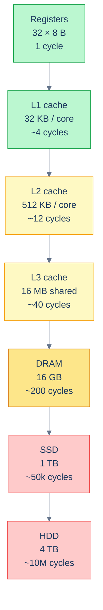
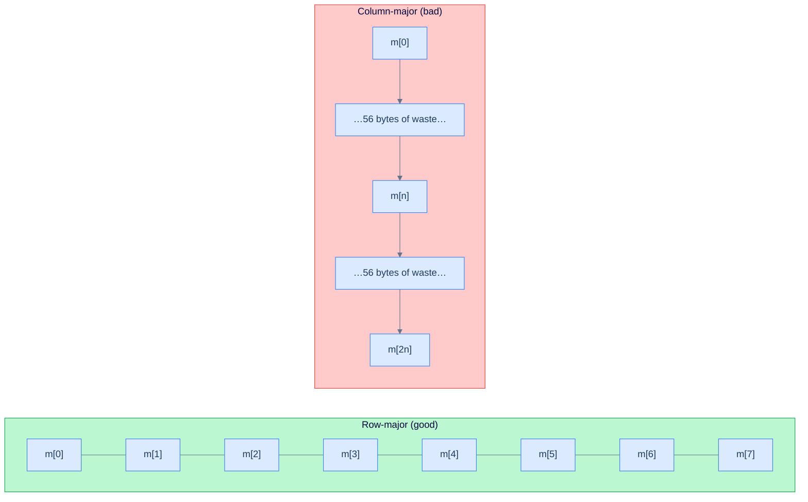
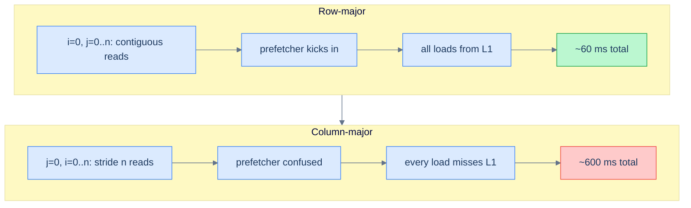

# 5. Memory Model and the Cache Hierarchy

## The Hook

Here are two C functions. Both sum every element of an `n × n` matrix. Both visit every element exactly once. Both are `Θ(n²)`.

The only difference: which loop is on the outside. The inner loop steps through *consecutive* memory addresses in the first version, and through addresses *`n` apart* in the second. For a 4096×4096 matrix of doubles, the row-major version runs in about 60 ms on a typical laptop. The column-major version runs in about **600 ms**. Same `Θ(n²)`. Same number of memory reads. **Ten times slower.**

The gap is not in the algorithm. The gap is in the *memory hierarchy*. That hierarchy is the layered cache between the CPU and RAM. You do not see it in the code, the algorithm, or Big-O. But it's the thing that decides, in practice, whether your `Θ(n²)` runs in 60 ms or 600 ms.

This chapter is the picture every later chapter assumes you have. Once you understand cache lines, spatial locality, and temporal locality, you stop being surprised by benchmarks. You also stop writing code that hits the same Big-O on paper but takes ten times longer in production.

---

## Table of contents

1. [Understanding the problem: Big-O and wall-clock disagree](#understanding-the-problem-big-o-and-wall-clock-disagree)
2. [Internal mechanics: the memory hierarchy](#internal-mechanics-the-memory-hierarchy)
3. [Cache lines](#cache-lines)
4. [Spatial and temporal locality](#spatial-and-temporal-locality)
5. [Supported operations: what the hierarchy exposes](#supported-operations-what-the-hierarchy-exposes)
6. [Working example: matrix traversal](#working-example-matrix-traversal)
7. [A runnable demo](#a-runnable-demo)
8. [The data layouts that win](#the-data-layouts-that-win)
9. [Edge cases and pitfalls](#edge-cases-and-pitfalls)
10. [Production reality](#production-reality)
11. [Quiz](#quiz)
12. [Practice ladder](#practice-ladder)
13. [Further reading](#further-reading)
14. [Cross-links](#cross-links)
15. [Final takeaway](#final-takeaway)

***

# Understanding the problem: Big-O and wall-clock disagree

[Asymptotic analysis](/cortex/data-structures-and-algorithms/foundations-asymptotic-analysis) tells you how cost grows as `n` grows. It deliberately *throws away the constant* — `100n` and `n` are both `O(n)` because the *shape* of the curve is the same.

In practice that constant is not nothing. It is often a 10× or 100× factor, and the factor is almost always dominated by *memory access patterns*, not by the operation count. Two algorithms with identical operation counts can run at wildly different speeds depending on whether they touch memory in patterns the hardware likes or patterns the hardware hates.

To make this concrete: a `1024×1024` matrix sum has exactly `1024²` reads and `1024²` adds either way. The row-major version finishes in ~60 ms; the column-major version finishes in ~600 ms. Both are `Θ(n²)` time and `O(1)` extra space. The operation count is identical. The wall-clock is not.

So the key idea is: this chapter is about the access-pattern constants Big-O hides. Every later "in practice this is fast" claim in the book reduces, eventually, to "this access pattern is cache-friendly".

***

# Internal mechanics: the memory hierarchy

A modern CPU is a row of caches sitting between an extremely fast computational engine and a vast, slow store of data. Each level is *bigger but slower* than the one above it.

| Level | Size (typical) | Latency (typical) |
|---|---|---|
| **CPU registers** | 16–32 of them, 8 bytes each | 1 cycle |
| **L1 cache** | 32–64 KB per core | ~4 cycles |
| **L2 cache** | 256 KB – 1 MB per core | ~12 cycles |
| **L3 cache** | 4–64 MB shared across cores | ~40 cycles |
| **Main memory (DRAM)** | 8 GB – terabytes | ~150–300 cycles |
| **SSD** | 256 GB – multi-TB | ~50,000–100,000 cycles |
| **Spinning disk (HDD)** | 1 TB – tens of TB | ~10,000,000 cycles |

The numbers vary by CPU model, but the *ratios* are universal: each level is roughly 3–10× slower than the one above and 10–100× larger.



<p align="center"><strong>Each step down is dramatically slower. Going from L1 to RAM costs 50× more time per access. Going from RAM to SSD costs another 200×. Going to HDD costs another 200×. A modern program lives or dies on whether its working set fits in cache.</strong></p>

The CPU cannot tell you which level a load came from. It looks at the address, asks the cache hierarchy, and waits. If the data is in L1, the wait is `~4 cycles`. If it has to go to RAM, the wait is `~200 cycles`. The same `arr[i]` in your code can take 50× longer depending on what is already cached.

This is the *constant* Big-O hides. The 50× factor between an L1 hit and a DRAM miss is exactly the gap between a fast array scan and a slow one.

***

# Cache lines

The cache doesn't load one byte at a time. It loads in **cache lines** — contiguous blocks of (almost universally) **64 bytes** on x86 and ARM. When you access a single 4-byte `int`, the cache pulls the entire 64-byte line containing that `int`. The next 60 bytes after the one you actually wanted are now in cache, *for free*.

```
addresses:    [0x100   0x108   0x110   0x118   0x120   0x128   0x130   0x138]
              [int4 ][int4 ][int4 ][int4 ][int4 ][int4 ][int4 ][int4 ]   ← row of doubles
              ←──────────────────  64-byte cache line  ──────────────────→
                                        ↑
                                you read m[i] (8 bytes)
                                the rest of the line came along for free
```

This single fact dominates real-world performance. Two outcomes follow directly from cache-line granularity:

- **Same-line access is effectively free** — the line is already in L1 after the first touch, so the next access costs `~4 cycles`.
- **Different-line access pays a fresh load** — anywhere from L1→L2 latency (`~12 cycles`) up to L3→DRAM latency (`~200 cycles`), depending on what is hot.

To make this concrete: the row-major matrix sum walks 64 consecutive bytes per cache-line load, getting 8 doubles for the price of one fetch. The column-major version walks 8 doubles that are `n × 8 = 8n` bytes apart. Every single access is a fresh cache line, the next 56 bytes of the line are wasted, and the prefetcher cannot help because the stride exceeds the line size.



<p align="center"><strong>Row-major access reuses the cache line — eight doubles per fetch. Column-major access discards 56 bytes per fetch. Same algorithm. 10× difference in wall-clock.</strong></p>

So the key idea is: every memory access charges you for a whole 64-byte line, not for the bytes you read. Code that consumes most of each line runs near peak; code that discards most of each line runs at a small fraction of peak.

***

# Spatial and temporal locality

Two access patterns are cache-friendly. Code that has both runs fast.

> **Spatial locality:** if you have just accessed memory location `X`, you are likely to access locations near `X` soon.
>
> **Temporal locality:** if you have just accessed location `X`, you are likely to access `X` again soon.

The cache hierarchy is *built around these two assumptions*. Spatial locality is why caches load whole 64-byte lines — you will probably want neighbours. Temporal locality is why caches *retain* recently-accessed data — you will probably want it again.

Code that respects spatial locality has three recurring traits:

- **Iterates in index order** — row-major over a row-major array, not column-major.
- **Uses contiguous data structures** — arrays, `std::vector`, NumPy arrays — over pointer-chained ones like linked lists and trees of `Box<T>`.
- **Stores related fields together** — a `struct` of small fields all accessed together; not a "structure of arrays" if every operation touches all fields of one element.

Code that respects temporal locality has two:

- **Reuses recently-loaded data** — loop blocking, tile-based image processing.
- **Avoids re-reading the same data needlessly** — memoise, cache results.

Code that *violates* spatial locality walks scattered memory:

- **Walks a linked list** — each node's address is wherever the allocator put it, rarely contiguous, almost always a fresh cache line per node.
- **Walks a binary tree by following pointers** — same pattern.
- **Iterates a sparse data structure** — a hash table, a graph adjacency list.

Code that *violates* temporal locality touches each datum exactly once:

- **Streaming computations** — the cache holds nothing useful for the next iteration.
- **Cold paths after a long pause** — whatever was in cache has been evicted by other work.

To make this concrete: a `std::vector<int>` and a `std::list<int>` both support `O(n)` traversal, but the vector wins by `5–10×` in wall-clock. The vector packs 16 ints per 64-byte cache line and the prefetcher streams ahead; the list pays one fresh cache-line miss per node because the nodes are scattered across the heap.

So the key idea is: **arrays beat linked structures by 10× in wall-clock, even at identical `O(n)` time and `O(n)` space**, because of cache effects. Every chapter that compares "array implementation vs linked-list implementation" of the same data structure has the array version winning in practice.

***

# Supported operations: what the hierarchy exposes

The cache hierarchy is not a data structure with an API, but it does expose a small, predictable set of operations to your code. Knowing what each costs — and which one you triggered — is the entire skill.

| Operation | What it costs | Notes |
|---|---|---|
| **L1 hit** (same line as a recent access) | `~4 cycles` | The fast path; same-line reuse lands here. |
| **L2 hit** (line evicted from L1, still in L2) | `~12 cycles` | A 3× penalty; common when working set exceeds L1 (`~32 KB`). |
| **L3 hit** (line evicted from L2) | `~40 cycles` | 10× the L1 cost; common when working set exceeds L2 (`~512 KB`). |
| **DRAM load** (line evicted from L3, miss everywhere) | `~200 cycles` | 50× L1; the cliff every cache-friendly access pattern is trying to dodge. |
| **Prefetch** (CPU loads a line you have not asked for yet) | Hidden behind compute | Triggered by detected linear strides; the row-major loop's secret weapon. |
| **Eviction** (line displaced to make room) | `0 cycles` direct | Cost shows up on the *next* access to the evicted line. |
| **Writeback** (dirty line flushed to a lower level) | Hidden if pipelined | Becomes visible under high write pressure or false-sharing contention. |

The CPU does not let you call these operations explicitly. Each one fires as a side effect of an ordinary `load` or `store` instruction. Your only lever is the *address pattern* — what bytes you touch, in what order. That lever is enough to push every access toward the top row (L1 hit + prefetch) or toward the bottom row (DRAM load).

So the key idea is: every line of code that reads or writes memory implicitly picks one of these operations. Cache-friendly code biases the distribution toward the cheap rows; cache-hostile code stumbles into the expensive ones on every access.

***

# Working example: matrix traversal

Let's compute the gap for a `1024×1024` matrix of `double`s. Each `double` is 8 bytes; the matrix is `8 MB` total. A cache line is `64 bytes` = 8 doubles. The matrix has `1024² / 8 = 128k` cache lines.

**Row-major version**: `128k` cache-line loads, each touching 8 elements. The CPU's prefetcher detects the linear stride and starts prefetching the next line *while the current one is being processed*. A well-tuned prefetcher hides almost all the load latency. Result: nearly-free loads, dominated by the addition itself. Wall-clock: `~60 ms` for `O(n²)` time and `O(1)` extra space.

**Column-major version**: each access is to a different cache line. The column has `1024` cache lines and L1 holds roughly `512` (`32 KB / 64 B per line`). Even *one column's worth* of accesses evicts the previous column. Every access is a miss into L2 or worse. Result: every access takes `12+ cycles` instead of `1`. Wall-clock: `~600 ms` for the same `O(n²)` time and `O(1)` extra space.

The 10× gap in wall-clock is exactly the ratio of "L1 hit + prefetched" to "L2 miss minimum, with no prefetching".



<p align="center"><strong>Same algorithm. Same operations. The gap is purely in how the access pattern interacts with the cache.</strong></p>

***

# A runnable demo

The code below benchmarks the row-major vs column-major sum on matrices of growing size. Run it. The gap should be clear well before the matrix exceeds L2 cache; the gap *widens* once the matrix exceeds L3 cache.

```python run
import time, array, sys

def sum_row_major(m, n):
    s = 0.0
    for i in range(n):
        base = i * n
        for j in range(n):
            s += m[base + j]
    return s

def sum_col_major(m, n):
    s = 0.0
    for j in range(n):
        for i in range(n):
            s += m[i * n + j]
    return s

if __name__ == "__main__":
    print(f"{'n':>6} {'matrix MB':>12} {'row (ms)':>12} {'col (ms)':>12} {'col/row':>10}")
    for n in [128, 256, 512, 1024]:
        m = array.array('d', [1.0] * (n * n))
        t0 = time.perf_counter()
        sum_row_major(m, n)
        row_ms = (time.perf_counter() - t0) * 1000
        t0 = time.perf_counter()
        sum_col_major(m, n)
        col_ms = (time.perf_counter() - t0) * 1000
        size_mb = n * n * 8 / (1024 * 1024)
        print(f"{n:>6} {size_mb:>12.1f} {row_ms:>12.2f} {col_ms:>12.2f} {col_ms / row_ms:>9.1f}x")
```

```java run
public class Main {
    static double sumRowMajor(double[] m, int n) {
        double s = 0;
        for (int i = 0; i < n; i++) {
            int base = i * n;
            for (int j = 0; j < n; j++) s += m[base + j];
        }
        return s;
    }

    static double sumColMajor(double[] m, int n) {
        double s = 0;
        for (int j = 0; j < n; j++)
            for (int i = 0; i < n; i++) s += m[i * n + j];
        return s;
    }

    public static void main(String[] args) {
        int[] sizes = {128, 256, 512, 1024};
        System.out.printf("%6s %12s %12s %12s %10s%n", "n", "matrix MB", "row (ms)", "col (ms)", "col/row");
        for (int n : sizes) {
            double[] m = new double[n * n];
            for (int i = 0; i < m.length; i++) m[i] = 1.0;
            // Warmup.
            sumRowMajor(m, n); sumColMajor(m, n);
            long t0 = System.nanoTime();
            sumRowMajor(m, n);
            double rowMs = (System.nanoTime() - t0) / 1e6;
            t0 = System.nanoTime();
            sumColMajor(m, n);
            double colMs = (System.nanoTime() - t0) / 1e6;
            double sizeMb = (double) m.length * 8 / (1024 * 1024);
            System.out.printf("%6d %12.1f %12.2f %12.2f %9.1fx%n", n, sizeMb, rowMs, colMs, colMs / rowMs);
        }
    }
}
```

What you should see: the `col / row` ratio starts near `1×` for tiny matrices that fit in L1 either way. It grows to `3–5×` as the matrix grows past L1. It pushes `10×` or more once the matrix exceeds L3.

***

# The data layouts that win

A handful of recurring patterns make code cache-friendly. Each one trades a structural property for cache locality, and each one shows up in production code under a different name.

- **Arrays beat trees.** A `std::vector<int>` and a `std::set<int>` share the same `O(log n)` time for ordered lookup, but the vector wins by `5–10×` in practice because every access is contiguous and prefetched. Use trees only when you *need* the structural property — sorted iteration, ordered range queries.
- **Struct-of-arrays beats array-of-structs (sometimes).** If you have `1M particles` and mostly need their `x` coordinate, store `xs: [1M doubles], ys: [1M doubles], zs: [1M doubles]` rather than `particles: [{x, y, z, mass, charge, …}, …]`. The first layout puts only `x`s in cache when you only need `x`s. The second wastes 7/8 of every 64-byte line on fields you don't need. The reverse — array-of-structs — wins when every operation touches every field.
- **Bit-packing beats `bool[]`.** A `bool[8M]` is `8 MB`. A `BitSet(8M)` (one bit per flag) is `1 MB`. The latter fits in L2 cache; the former does not. Same asymptotic operation cost, dramatically different wall-clock when you scan or `popcount`.
- **Pre-allocate; resize is the enemy of cache.** Every dynamic-array resize rewrites the whole array into a new allocation. The new allocation might be in a different memory page, evicting the old data from cache and starting cold. If you know the size in advance, allocate once for `O(n)` time and `O(n)` space and no resize copies.
- **Loop blocking (tiling).** For matrix operations, work on `B×B` tiles where `B` is sized to fit in L1. The naive `for i, for j, for k` matrix multiply has `O(n³)` time and *also* `O(n³)` cache misses. The blocked version has `O(n³)` time but only `O(n³ / B)` cache misses, while keeping `O(n²)` space.
- **Linear arrays of pointers are the worst of both worlds.** An `array<Box<int>>` stores the boxes contiguously, but the boxes themselves are scattered across the heap. Walking the array costs one cache-line miss per `int`. Use `array<int>` instead unless you genuinely need pointer indirection.

So the tradeoff is: every layout above pays for cache locality with a structural concession — losing ordered iteration, losing per-element field locality, losing the ability to grow cheaply, losing pointer indirection. Pick the concession that hurts your workload least.

***

# Edge cases and pitfalls

- **False sharing.** Two threads writing to *different* variables on the *same* 64-byte cache line cause the cache line to ping-pong between cores' caches, each invalidating the other. The variables do not conflict, but the cache line does. Mitigation: pad hot variables to cache-line boundaries. The Linux kernel uses `____cacheline_aligned_in_smp` for this.
- **Pointer chasing.** Every dereference can be a cache miss. A linked list of `1M` nodes is `1M` *random* memory accesses. Even though the operation count is `O(n)`, the wall-clock can be `100×` slower than an array of `1M` ints.
- **Misaligned accesses.** A `double` straddling a cache-line boundary requires *two* cache-line loads. The compiler aligns aggregates by default, but custom packed structs and serialised binary formats can land cross-line.
- **The TLB (Translation Lookaside Buffer).** A separate cache for the address-translation tables. A program that touches enough distinct `4 KB` pages can exhaust the TLB even if every page's contents are in cache. The pitfall is real for memory-mapped database engines and large hash tables. <!-- VERIFY: typical x86 TLB entry count is ~64 for L1 dTLB; confirm before quoting a hard number -->
- **Hardware prefetchers are not magic.** They detect linear strides and recent jump patterns. They do not detect random access (linked-list walks) and do not help unless the stride is reasonably small. If your code hits a "the prefetcher should have caught up" wall, profile with `perf stat -e cache-misses`.
- **Cache levels are inclusive vs exclusive vs NINE.** Different CPUs handle multi-level caches differently. Inclusive (L1 contents are also in L2, L2 in L3) is simpler. Exclusive (each level holds different data) gives more capacity. The details rarely matter for correctness but can shift performance numbers.
- **NUMA (Non-Uniform Memory Access).** On multi-socket systems, "RAM" is not uniform — accesses to memory on the same NUMA node as the CPU are `2–3×` faster than cross-node accesses. Production scheduling pins threads to NUMA nodes for this reason.
- **Cache-friendly does not mean correct.** Cache-friendly code with a logic bug is still wrong. Profile *after* correctness, not before.

***

# Production reality

Cache-locality wins are not a micro-optimisation footnote — they shape the architecture of the systems engineers reach for daily. The six entries below name the system, the layout decision it made, and the engineering tradeoff that decision bought.

**[NumPy and BLAS]** — uses **flat strided arrays with cache-blocked kernels (`np.ascontiguousarray`, GEMM tiling)** — because dense numeric kernels are memory-bound, so blocking to fit in L1 turns an `O(n³)` algorithm with `O(n³)` misses into one with `O(n³ / B)` misses.

A NumPy array stores its memory as a flat contiguous block plus a `strides` tuple that says how many bytes to advance per axis. `arr.T` (transpose) does not copy data — it swaps the strides. Both `arr` and `arr.T` are valid NumPy arrays. Iterating one is cache-friendly; iterating the other is cache-hostile. Operations that require a contiguous layout (such as passing to a BLAS routine) will silently call `np.ascontiguousarray()` to copy. Reading a `np.transpose` result and getting `10×` slower throughput than expected is one of the canonical NumPy performance bugs.

**[Postgres and most production B-trees]** — uses **fixed-size `8 KB` pages sized to match the OS page** — because the disk seek per page is the dominant cost, so each page must pack enough keys to keep the tree shallow.

Postgres B-tree pages are `8 KB` by default, matching the OS page size on most platforms. The page size is the granularity of disk I/O. `8 KB` is small enough to fit a meaningful number of keys, large enough that disk seeks amortise across many rows. The B-tree fanout is sized to fit an `8 KB` page comfortably — hundreds of keys per node in typical workloads — dramatically reducing tree height and disk seeks. The chapter pattern (locality dictates layout) extends from CPU cache lines to disk pages at a different scale.

**[Redis listpack and ziplist (pre-7.0)]** — uses **a single contiguous byte buffer for small lists, sets, and hashes** — because for small `n` the cache-locality win outweighs the `O(n)` cost of in-place insert.

Redis stores small lists, sets, and hashes in a *contiguous* memory layout (ziplist; replaced by listpack in 7.0) instead of a doubly-linked-list of objects. For small data, the cache locality wins exceed the algorithmic costs of search and insert. Above a configured threshold (`list-max-ziplist-size`), Redis converts to a more dynamic layout with `O(1)` insert. The contiguous-vs-pointer-chained tradeoff is exactly the pattern of this chapter, deployed in a production database.

**[Unity DOTS, Unreal Mass, Bevy ECS]** — uses **archetype-grouped struct-of-arrays for entity components** — because game-loop systems iterate one component type across millions of entities, and SoA keeps the working set inside L1.

"Entity-Component-System" architectures store all `Position` components in one contiguous array, all `Velocity` components in another, and so on. Update systems touch only the components they need, getting maximum cache locality. The traditional OOP "every entity is an object with virtual methods" approach can be up to `10×` slower for the same logic. Each virtual call indirects through a vtable pointer, and every component fetch is a fresh cache line. <!-- VERIFY: 10× figure is widely cited but engine-specific; confirm against a Bevy or Unity DOTS benchmark before quoting in print -->

**[JIT compilers — HotSpot, V8, LuaJIT]** — uses **trace-based code-cache layout that packs hot blocks adjacent** — because branch-target locality keeps the instruction cache hot through the inner loop.

A JIT does more than compile bytecode to native code — it also chooses *where* to place that native code. Hot blocks land adjacent in the code cache so that a falling-through branch stays on the same instruction cache line. HotSpot's `-XX:+UseCompressedOops` halves pointer width on 64-bit JVMs by storing 32-bit "compressed pointers" — significant memory savings for pointer-heavy data structures, and a direct cache-density win on object graphs.

**[Linux kernel hot paths]** — uses **`____cacheline_aligned` and per-CPU variables** — because the kernel's most-touched counters and locks would otherwise false-share across cores at every scheduler tick.

The kernel uses `____cacheline_aligned` to align hot variables to cache-line boundaries (see `include/linux/cache.h`). Per-CPU variables (`DEFINE_PER_CPU`) live on per-CPU cache lines specifically to avoid false sharing on the most-touched paths. The cost is `~64 bytes` of padding per hot variable. The benefit is linear scalability across cores instead of degradation under contention.

***

# Quiz

Test your grip before moving on. One answer per question; reveal only after you have committed to one.

**[Recall] Q: What is the standard cache-line size on modern x86 and ARM CPUs, and why does it matter?**
`64 bytes`. Every memory access charges you for a full 64-byte line — 8 doubles or 16 `int32`s — so dense code that reuses each line runs near peak, and sparse code that touches one element per line runs at a small fraction of peak.

**[Recall] Q: List the approximate latencies of L1, L3, DRAM, and SSD in CPU cycles.**
`L1 ≈ 4 cycles`, `L3 ≈ 40 cycles`, `DRAM ≈ 200 cycles`, `SSD ≈ 50,000 cycles`. Each step down is roughly 5–10× slower than the one above.

**[Reasoning] Q: Why is row-major matrix traversal of a row-major-stored matrix `~10×` faster than column-major, even though both are `Θ(n²)` time and `O(1)` extra space?**
Row-major access touches 8 consecutive doubles per 64-byte cache line — one fetch serves 8 reads, and the prefetcher streams the next line ahead. Column-major access touches one double per 64-byte line and discards 56 bytes per fetch, while the prefetcher cannot detect the stride.

**[Reasoning] Q: Why does an `array<int>` outperform a `linked_list<int>` for traversal at the same `O(n)` time and `O(n)` space?**
Array elements are contiguous, so each 64-byte cache line carries 16 ints and the prefetcher streams ahead. Linked-list nodes are scattered across the heap, so each pointer chase risks a fresh DRAM load of `~200 cycles` — `~50×` worse than the L1 hit the array gets.

**[Tradeoff] Q: You are storing `10M` particles with 8 fields each, and the hot inner loop updates `x, y, z` using `vx, vy, vz`. Should you choose array-of-structs or struct-of-arrays, and what is the cost?**
Struct-of-arrays. The inner loop touches only 6 of 8 fields, so the 2 unused fields would waste `2/8 = 25%` of every cache line in array-of-structs. The cost is losing per-particle locality — code that touches *all* 8 fields of *one* particle is now scattered across 8 different arrays.

***

# Practice ladder

Five problems, easiest first. Each one has a hint — try it without the hint first.

| # | Problem | Pattern | Difficulty | Hint |
|---|---|---|---|---|
| 1 | Predict the row-vs-column gap for a `4096×4096` `int32` matrix (`64 MB`) on a laptop with `16 MB` L3 cache. Will the gap be larger or smaller than for a `256×256` matrix (`256 KB`)? | Working-set vs cache-size threshold | Easy | The `256×256` case fits in L3 both ways. The `64 MB` case exceeds L3, so column-major *re-loads* lines that would have stayed cached for row-major. Bigger working set → bigger gap. |
| 2 | Given an array of structs `{a, b, c}`, version A touches `s.a; s.b; s.c` in the inner loop while version B does three separate passes (`for s in arr: s.a`, then `s.b`, then `s.c`). Which is cache-friendly? | Loop fusion vs splitting | Easy | Version A. It touches all three fields of each struct *while the struct is hot in L1*. Version B walks the entire array three times. If the array exceeds L1, each pass reloads from L2/L3. |
| 3 | Two threads increment per-thread counters `a` and `b` stored next to each other in a struct. Throughput does not scale linearly with cores. Diagnose. | False sharing | Easy | The struct is `16 bytes`, well under `64`. Both counters land on the same cache line. Each thread's write invalidates the other's cache copy, forcing a cross-core transfer per increment. Fix: pad each counter to a full cache line. |
| 4 | Implement a particle-update inner loop for `10M` particles with 8 fields each, where only `x, y, z, vx, vy, vz` are touched. Pick the data layout and justify in cache-line terms. | Struct-of-arrays vs array-of-structs | Medium | Parallel arrays. `mass` and `charge` are dead weight on every cache line of `array-of-structs`. Struct-of-arrays keeps the 6 movement fields contiguous and pulls only what is needed. Game engines, physics simulations, and ECS frameworks all use this layout. |
| 5 | Loop-block a `1024×1024` matrix multiplication with tile size `B = 32`. The naive version is `O(n³)` time with `O(n³)` cache misses. The blocked version is `O(n³)` time with `O(n³ / B)` misses. What speedup factor should you expect? Equivalent BLAS routine: [`dgemm`](https://www.netlib.org/lapack/explore-html/d7/d2b/dgemm_8f.html). | Loop blocking (tiling) | Hard | A factor of `B = 32` fewer misses. In practice the speedup is `5–10×` (memory access dominates; reducing misses by `32×` translates to `~10×` wall-clock for memory-bound workloads). BLAS implementations rely on exactly this. |

Once these feel automatic, you have internalised every move cache-aware engineering asks of you — and you are ready for the rest of the curriculum.

***

# Further reading

Curated paths in, not a syllabus. Read in order of the annotation; come back for the rest when you need depth.

- **[Ulrich Drepper — *What Every Programmer Should Know About Memory*](https://people.freebsd.org/~lstewart/articles/cpumemory.pdf)**
  ★ Essential — the canonical 100-page primer on CPU caches, DRAM, NUMA, and what programmers can do about all of it. Every claim in this chapter has a deeper derivation somewhere in Drepper. Read sections 3 and 6 first.
- **[Igor Ostrovsky — *Gallery of Processor Cache Effects*](http://igoro.com/archive/gallery-of-processor-cache-effects/)**
  ★ Essential — seven short experiments, each one a runnable demonstration of a single cache effect (line size, hierarchy, associativity, false sharing). The fastest way to internalise the patterns is to reproduce these on your own machine.
- **[Daniel Lemire — *Performance Analysis Blog*](https://lemire.me/blog/)**
  ◆ Advanced — running commentary from one of the most-cited researchers on cache-aware data-structure design. Posts on bit-packing, branch prediction, and SIMD show how the patterns in this chapter compose at the next level.
- **[CLRS — Chapter 18: B-Trees, and Chapter 27: Multithreaded Algorithms](https://mitpress.mit.edu/9780262046305/introduction-to-algorithms/)**
  ◆ Advanced — the formal treatment of cache-oblivious algorithms (B-trees as the canonical example) and the cost model for parallel cache-conscious code.
- **[Intel — *64 and IA-32 Architectures Optimization Reference Manual*](https://www.intel.com/content/www/us/en/developer/articles/technical/intel-sdm.html)**
  → Reference — the hardware-vendor source of truth for cache sizes, latencies, prefetcher behaviour, and alignment requirements on every Intel CPU shipped this decade. Skim the chapter for your microarchitecture before benchmarking.
- **[Brendan Gregg — *perf Examples*](https://www.brendangregg.com/perf.html)**
  → Reference — the practical handbook for measuring cache misses, TLB misses, and false sharing on Linux with `perf stat` and `perf record`. Without measurement, every claim in this chapter is a guess.

***

# Cross-links

**Prerequisites**

- [Asymptotic Analysis](/cortex/data-structures-and-algorithms/foundations-asymptotic-analysis) — the language for talking about cost growth, which this chapter contrasts with wall-clock cost.
- [Amortized Analysis](/cortex/data-structures-and-algorithms/foundations-amortized-analysis) — the long-run-average cost model; this chapter's dynamic-array-resize claim builds on it.

**What comes next**

- [Arrays](/cortex/data-structures-and-algorithms/linear-structures-arrays-introduction) — the first chapter whose `O(1)` access claim depends explicitly on the cache locality this chapter establishes.
- [Hash Tables](/cortex/data-structures-and-algorithms/linear-structures-hash-table-introduction-to-hash-tables) — the open-addressing-vs-chaining tradeoff is decided by cache behaviour as much as by collision statistics.
- [Trees](/cortex/data-structures-and-algorithms/trees-index) — every comparison of "array layout vs linked layout" of a tree leans on this chapter's vocabulary.
- [DSA in Real Systems: Postgres B-Tree](/cortex/data-structures-and-algorithms/dsa-in-real-systems-postgres-b-tree-and-the-write-path) — the B-tree's design is dictated by exactly this hierarchy: nodes sized to fit a disk page, keys arranged for cache-friendly binary search.

***

# Final Takeaway

1. **Core mechanic:** the cache hierarchy charges every memory access for a whole 64-byte line, so code that consumes most of each line runs near peak (`~4 cycles`, L1 hit) and code that discards most of each line runs at a fraction of peak (`~200 cycles`, DRAM load).
2. **Dominant tradeoff:** cache-friendly layouts gain `5–10×` wall-clock throughput at identical Big-O, but they cost you structural conveniences — ordered iteration, per-element field locality, cheap resize, pointer indirection — and you must pick the concession that hurts your workload least.
3. **One thing to remember:** Big-O is the *shape* of cost; the cache is the *scale*. Two algorithms with the same Big-O can differ by `10×` in wall-clock because of cache effects. Every benchmark surprise should send you to the access pattern before the algorithm.

This concludes the Foundations module. Every later chapter cites at least one of: asymptotic analysis (the language), recurrence relations (recursive cost), amortized analysis (long-run average), proof techniques (correctness), or memory model (wall-clock truth). With these five in hand, you are ready for the rest of the curriculum.
