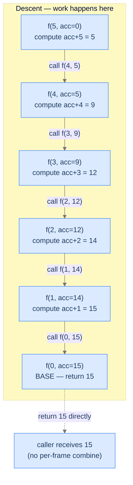
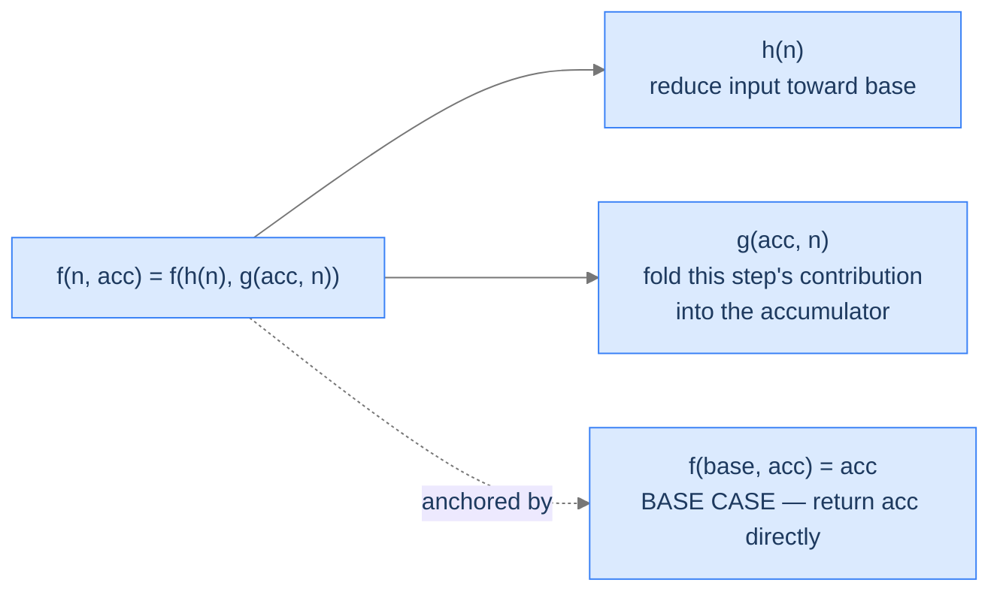
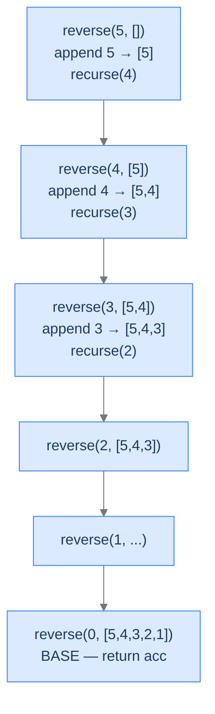
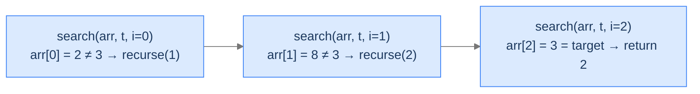
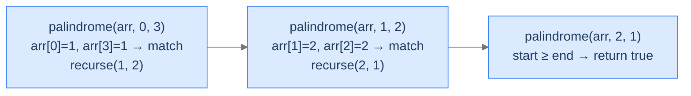
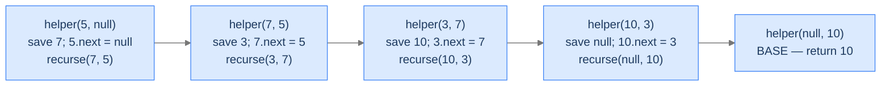

# 5. Pattern: Tail Recursion

If head recursion is "ask first, work second," tail recursion is the opposite: **work first, then ask.** Every frame finishes its contribution *before* making the recursive call, accumulating the answer into a parameter that travels down the stack. By the time the base case fires, the answer is already complete — no unwinding needed.

That timing flip has a major consequence. Tail-recursive functions can — in some languages, with some flags — be compiled into ordinary loops, eliminating the stack-frame cost entirely. This is **tail-call optimisation** (TCO), and it's the reason functional languages like Scala and OCaml lean on tail recursion as their primary loop construct.

By the end of this lesson you'll know what makes a recursive call "tail" vs not, the diagnostic checks for spotting tail-recursion candidates, which of the 10 languages of this course actually optimise tail calls, and four worked problems that drill the pattern.

## Table of contents

1. [Understanding tail recursion](#understanding-tail-recursion)
2. [Identifying tail recursion](#identifying-tail-recursion)
3. [Reverse sequence](#reverse-sequence)
4. [Search element](#search-element)
5. [Is palindrome](#is-palindrome)
6. [Reverse a list](#reverse-a-list)

***

# Understanding Tail Recursion

> **Course:** DSA › Algorithms › Recursion › Tail Recursion

A function call is a **tail call** if it's the *last* thing the calling function does — nothing remains to compute after it returns. A function is **tail-recursive** if its recursive call is a tail call: the function returns the result of the recursive call directly, doing no work afterwards.

Compare:

```
# Head recursion — work happens AFTER the recursive call (on ascent)
def head(n):
    if n == 0: return 0
    return n + head(n - 1)        # recursive call is INSIDE an expression;
                                  # the `n + _` runs after the call returns

# Tail recursion — work happens BEFORE the recursive call (on descent)
def tail(n, acc=0):
    if n == 0: return acc
    return tail(n - 1, acc + n)   # recursive call is the LAST action;
                                  # the `acc + n` is computed first and passed in
```

The difference looks small. The runtime impact is huge. In the head version, every frame must wait for its recursive call to return before it can run `n + _`. The frames pile up and unwind. In the tail version, the recursive call has nothing to return *to* — the current frame can be discarded the moment the call is made. With TCO, the frame is reused; without it, frames still pile up but the algorithm is *logically* a loop.



<p align="center"><strong>Tail recursion: each frame does its work on the way <em>down</em> and stuffs the partial answer into the <code>acc</code> parameter. The base case returns the final answer; nothing happens during unwinding.</strong></p>

This downward-flowing accumulator is the heart of tail recursion. The recursive call doesn't produce a value the current frame needs; the current frame produces a value the *next* recursive call needs.

---

## Tail Call Optimisation (TCO)

TCO is the compiler trick that turns tail-recursive functions into loops. Since the calling frame has nothing left to do once the tail call is made, the compiler can **reuse** the same stack frame for the recursive call instead of pushing a new one. The result: a tail-recursive function that would normally use `O(n)` stack space runs in `O(1)` stack space — same as a `while` loop.

```d2
direction: right

without: "Without TCO" {
  grid-rows: 1
  grid-columns: 1
  grid-gap: 0
  s: "Stack: 5 frames pile up\n(O(n) space)" {style.fill: "#fecaca"; style.stroke: "#dc2626"}
}

with: "With TCO" {
  grid-rows: 1
  grid-columns: 1
  grid-gap: 0
  s: "Stack: 1 frame, reused\n(O(1) space)" {style.fill: "#bbf7d0"; style.stroke: "#16a34a"}
}

without -> with: compiler optimises tail calls
```

<p align="center"><strong>With TCO, the same frame is reused for every tail call — recursion becomes a loop without you writing one.</strong></p>

But not every language optimises tail calls. Here's the per-language reality for the 10 languages of this course:

| Language | TCO? | How |
|---|---|---|
| **Scala** | ✅ Yes | `@tailrec` annotation; the compiler verifies the call is in tail position and rewrites to a loop. |
| **Kotlin** | ✅ Yes | `tailrec` modifier on the function; same idea as Scala. |
| **C** | ⚠️ Sometimes | GCC/Clang at `-O2` or higher; not part of the language spec, so you can't rely on it. |
| **C++** | ⚠️ Sometimes | Same as C — depends on compiler and optimisation level. |
| **Rust** | ⚠️ Sometimes | LLVM may apply TCO at `--release`; no language guarantee. |
| **Go** | ❌ No | The Go authors explicitly chose not to do TCO; goroutine stacks grow on demand instead. |
| **Java** | ❌ No | The JVM has no TCO; deep tail recursion still overflows the stack. |
| **JavaScript** | ❌ No (in practice) | ES2015 specced TCO ("PTC") but only Safari implemented it; V8 explicitly rejected it. |
| **TypeScript** | ❌ No | Compiles to JS — same situation. |
| **Python** | ❌ No (and won't be) | Guido van Rossum explicitly rejected TCO; better stack traces matter more in Python's design. |

> **Practical takeaway.** In Scala and Kotlin, write tail-recursive code freely — the compiler will turn it into a loop. In C/C++/Rust, it's a nice-to-have at high optimisation levels. In **Java, Python, JavaScript, TypeScript, and Go**, tail recursion gives you the *style* of recursion-as-a-loop but **still uses linear stack space**. For very deep recursions in those languages, you should rewrite to iteration explicitly.

> *Predict before reading on — for a function that recurses 100,000 times, which of the 10 languages will crash with a stack overflow if you write the function tail-recursively? List them before reading the answer.*

In Java, Python, JavaScript, TypeScript, Java, and (for native compilers without explicit TCO flags) sometimes C/C++/Rust as well, you'll crash. Go's growable stacks save you. Scala (with `@tailrec`) and Kotlin (with `tailrec`) compile to loops and run in `O(1)` stack — perfectly safe. The lesson: tail recursion gives you *correctness* in any language, but *space efficiency* only in some.

---

## What Tail Recursion Looks Like in Code

The generic shape:



<p align="center"><strong>Tail recursion's general equation: each call updates an accumulator with this step's work and recurses with a smaller input. The base case returns the accumulator unchanged.</strong></p>

The pseudocode:

```
function tail_recursion(n, acc):
    if n is base case:
        return acc                         ← step 0: stop and return accumulated answer

    new_acc = g(acc, n)                    ← step 1: fold this step's contribution
    next_n  = h(n)                         ← step 2: reduce the input
    return tail_recursion(next_n, new_acc) ← step 3: tail call (LAST action, nothing follows)
```

Notice the difference from head recursion:
- The combine step `g` runs **before** the recursive call (head recursion ran it after).
- The recursive call is the **last action** — no `+ result` or wrapping work follows.
- The base case returns `acc` itself — no further computation needed.

The result of the function is *complete* by the time the base case is reached. The base case just hands it back.

---

## Passing Data Down

In tail recursion, **the accumulator is the lifeblood of the algorithm.** It carries the answer-being-built down through every call. The accumulator is initialised at the top-level call (often to a sensible default like `0`, `""`, `[]`, or the input itself) and updated by `g` at every step.

A common pattern is to wrap the tail-recursive helper in a public method that hides the accumulator from the caller:

```python run
class Solution:
    def sum_to_n(self, n: int) -> int:
        return self._helper(n, 0)        # caller doesn't see the acc parameter

    def _helper(self, n: int, acc: int) -> int:
        if n == 0: return acc
        return self._helper(n - 1, acc + n)
```

The wrapper hides the accumulator's existence from the caller, who only knows about `sum_to_n(n)`. This is the canonical idiom — embrace it.

---

## Passing Data Up

Tail recursion barely passes anything *up*. Each frame returns whatever the next-deeper call returned, with no transformation. The base case's `return acc` is the only "real" return value; every other frame's `return helper(...)` is a pass-through.

That's the structural reason TCO works: there's literally nothing for the current frame to do after the recursive call returns. The frame's work is over. So why allocate the frame at all? TCO just doesn't.

---

## Algorithm

Putting it together:

> **tailRecursion(n, acc)**
>
> 1. **Stop** — if `n` is the base case, return `acc`.
> 2. **Fold** — compute `new_acc = g(acc, n)`.
> 3. **Reduce** — compute `next_n = h(n)`.
> 4. **Tail call** — return `tailRecursion(next_n, new_acc)` directly.

Steps 2 and 3 are this frame's work; step 4 is the tail call. The function never combines anything on the way back.

---

## Implementation

A clean, language-agnostic implementation of the generic template — `g` and `h` are placeholders the problem will fill in. **Pay attention to language-specific TCO annotations** where applicable.


```pseudocode
function tailRecursion(n, acc):
    if n ≤ 0:                              # base case — return accumulator directly
        return acc
    newAcc ← g(acc, n)                     # 1. fold this frame's contribution into the accumulator
    nextN  ← h(n)                          # 2. reduce the input
    return tailRecursion(nextN, newAcc)    # 3. tail call — caller has nothing left to do
```

```python run
class Solution:
    def tail_recursion(self, n: int, acc: int = 0) -> int:
        # Step 1 — base case: returns accumulated answer directly
        if n <= 0:
            return acc

        # Step 2 — fold this frame's contribution INTO the accumulator
        new_acc = self._g(acc, n)
        # Step 3 — reduce the input for the next call
        next_n = self._h(n)

        # Step 4 — tail call. Note: Python does NOT optimise this.
        # For deep recursion, rewrite as a loop.
        return self.tail_recursion(next_n, new_acc)

    def _g(self, acc: int, n: int) -> int:
        return acc + n         # Example combine: addition
    def _h(self, n: int) -> int:
        return n - 1           # Example reduction: decrement


if __name__ == "__main__":
    print(Solution().tail_recursion(5))   # 15
```

```java run
public class Solution {
    int tailRecursion(int n, int acc) {
        // Step 1 — base case
        if (n <= 0) {
            return acc;
        }
        int newAcc = g(acc, n);   // Step 2 — fold
        int nextN  = h(n);        // Step 3 — reduce
        // Step 4 — tail call. Note: JVM has NO TCO; this still uses a frame.
        return tailRecursion(nextN, newAcc);
    }

    int tailRecursion(int n) { return tailRecursion(n, 0); }   // Convenience wrapper

    private int g(int acc, int n) { return acc + n; }
    private int h(int n) { return n - 1; }

    public static void main(String[] args) {
        System.out.println(new Solution().tailRecursion(5));   // 15
    }
}
```

```c run
#include <stdio.h>

/* GCC and Clang at -O2 will typically apply TCO here, turning the recursion
 * into a loop. Without optimisation, this still uses O(n) stack. */
static int g(int acc, int n) { return acc + n; }
static int h(int n)          { return n - 1; }

int tail_recursion(int n, int acc) {
    if (n <= 0) return acc;                /* Step 1 — base case */
    int new_acc = g(acc, n);                /* Step 2 — fold */
    int next_n  = h(n);                     /* Step 3 — reduce */
    return tail_recursion(next_n, new_acc); /* Step 4 — tail call */
}

int main(void) {
    printf("%d\n", tail_recursion(5, 0));   /* 15 */
    return 0;
}
```

```cpp run
#include <iostream>

class Solution {
public:
    int tailRecursion(int n, int acc = 0) {
        if (n <= 0) return acc;                                   // Base
        return tailRecursion(h(n), g(acc, n));                    // Tail call
        // -O2 with GCC/Clang typically applies TCO and turns this into a loop.
    }
private:
    int g(int acc, int n) { return acc + n; }
    int h(int n) { return n - 1; }
};

int main() {
    std::cout << Solution{}.tailRecursion(5) << '\n';   // 15
}
```

```scala run
import scala.annotation.tailrec

class Solution {
  // @tailrec instructs the compiler to verify this is a tail call and rewrite
  // it to a loop. Without the annotation it would still work but might miss TCO.
  @tailrec
  final def tailRecursion(n: Int, acc: Int = 0): Int = {
    if (n <= 0) acc
    else tailRecursion(h(n), g(acc, n))   // Single tail call — Scala will compile to a loop
  }

  private def g(acc: Int, n: Int): Int = acc + n
  private def h(n: Int): Int = n - 1
}

object Main {
  def main(args: Array[String]): Unit = {
    println(new Solution().tailRecursion(5))   // 15
  }
}
```

```typescript run
class Solution {
    tailRecursion(n: number, acc: number = 0): number {
        if (n <= 0) return acc;
        return this.tailRecursion(this.h(n), this.g(acc, n));
    }
    g(acc: number, n: number): number { return acc + n; }
    h(n: number): number { return n - 1; }
}

console.log(new Solution().tailRecursion(5));   // 15
```

```go run
package main

import "fmt"

func g(acc, n int) int { return acc + n }
func h(n int) int      { return n - 1 }

// Go does NOT optimise tail calls. Goroutine stacks grow on demand,
// which makes deep recursion safer than on the JVM, but each call still
// uses a real frame.
func tailRecursion(n, acc int) int {
    if n <= 0 {
        return acc                     // Base
    }
    return tailRecursion(h(n), g(acc, n))   // Tail call (no TCO)
}

func main() {
    fmt.Println(tailRecursion(5, 0))   // 15
}
```

```rust run
fn g(acc: i32, n: i32) -> i32 { acc + n }
fn h(n: i32) -> i32 { n - 1 }

// LLVM (Rust's backend) may apply TCO at --release.
// No language-level guarantee, so don't rely on it for production-grade
// recursion depth — use a loop if you need O(1) stack guaranteed.
fn tail_recursion(n: i32, acc: i32) -> i32 {
    if n <= 0 { return acc; }                  // Base
    tail_recursion(h(n), g(acc, n))            // Tail call
}

fn main() {
    println!("{}", tail_recursion(5, 0));      // 15
}
```


---

## Complexity Analysis

| Resource | Cost (without TCO) | Cost (with TCO) | Why |
|---|---|---|---|
| **Time** | `O(n)` if `g`, `h` are `O(1)` | `O(n)` | Same total work either way. |
| **Space** | `O(n)` | `O(1)` | Without TCO, frames pile up; with TCO, one frame is reused. |

The space column tells the whole language-dependent story. Tail-recursive code in Scala or Kotlin (with the right annotation) is genuinely as efficient as a `while` loop. The same code in Java or Python uses linear stack and crashes on deep input. Identical algorithm, very different runtime profile.

> **Best Case** — Time `O(n)`, Space `O(1)` (with TCO) or `O(n)` (without)
>
> **Worst Case** — Same as best; no input variation changes the depth

---

## Key Takeaway

Tail recursion does its work on the descent and accumulates the answer in a parameter. The base case returns that accumulator unchanged. With TCO it's a loop in disguise; without TCO it's structurally a loop but pays for each iteration in stack space. Now we'll learn how to spot tail-recursion candidates without writing any code.

***

# Identifying Tail Recursion

> **Course:** DSA › Algorithms › Recursion › Tail Recursion

Three diagnostic questions decide whether tail recursion fits.

| # | Question | If "yes," tail recursion fits because... |
|---|---|---|
| **Q1** | Can the answer be built up *as we descend*, with no need to look back? | The accumulator can carry the running answer down without revisiting frames. |
| **Q2** | Can each step's contribution be folded into a single value (the accumulator)? | We don't need to wait for the smaller answer; we update the accumulator and recurse. |
| **Q3** | Is the recursive call the *very last* thing the function does? | The call is in tail position — no work follows it, so TCO is even possible. |

If all three are "yes," the problem fits tail recursion's template.

### Q1 — Why "build down, no look-back"?

**Mental model.** Tail recursion never revisits a frame. Once we descend, we're committed — the frame is conceptually gone (with TCO, literally gone). The answer must be representable as a single value being mutated as we go.

**Concrete check.** For `sum(1..n)`: build down with `acc + n`, going `5 → 4 → 3 → 2 → 1 → 0` with running sums `5 → 9 → 12 → 14 → 15 → 15`. We never need to revisit any frame. ✓

**What breaks otherwise.** Consider Fibonacci's classical form `fib(n) = fib(n-1) + fib(n-2)`. The result for `n` requires *two* smaller answers, and the second `+` happens after both calls return. There's no single accumulator that can capture this on the descent — fib needs head/multiple recursion (the Multiple Recursion lesson), not tail.

### Q2 — Why "fold into a single accumulator"?

**Mental model.** The accumulator is the *only* state the recursion carries. If the answer needs two or more parameters that interact, you need that many accumulator parameters. If the answer is fundamentally a *tree* (like a sorted output of an unsorted set), an accumulator can't hold the structure cleanly.

**Concrete check.** For `is_palindrome(arr)` we don't even need an accumulator value — the answer is "as long as no mismatch found, keep going." That's a degenerate accumulator (the answer is implicit in the *absence* of an early return). Tail recursion still fits. ✓

**What breaks otherwise.** Building a sorted permutation of an array's elements? An accumulator would need to be a partial tree of decisions; we'd actually need branching recursion (the Multiple Recursion lesson) or backtracking. Tail recursion's single-thread-of-progress model can't handle branching.

### Q3 — Why "recursive call is the very last action"?

**Mental model.** The call is in tail position only if **the function returns the result of that call directly, without any wrapping work**. `return helper(...)` ✓. `return helper(...) + 1` ✗ (the `+ 1` is wrapping work). `return helper(...) * helper(...)` ✗ (the multiplication wraps two calls).

**Concrete check.** Linear search for an element: `if arr[i] == target return i; return search(arr, target, i+1)`. The recursive call is wrapped by nothing — pure tail call. ✓

**What breaks otherwise.** `return n * factorial(n-1)` — the multiplication runs *after* the recursive call returns. That's head recursion, not tail. The frame can't be discarded because it has work to do on the ascent. TCO won't apply.

---

## A Worked Example — Reverse a Sequence

> *Pause and predict — to print numbers from 5 down to 1, would you want head recursion or tail recursion? Why?*

Tail recursion fits naturally: each step prints `n` first, then recurses on `n-1`. The work (the print) happens on the descent, before the recursive call. Head recursion could also work, but it would print the values during *unwinding*, which means the printing order would be `1, 2, 3, 4, 5` — not `5, 4, 3, 2, 1`. Tail wins for descending order; head wins for ascending. **The order of operations is the order of the recursion's direction.**

We make this concrete in **Problem 1** below.

---

## Key Takeaway

Three checks — descent-only progress, single-accumulator answer, recursive call in tail position — gate every tail-recursion problem. Pass all three and the template snaps in. Four worked problems coming up. The first one mirrors Forward Sequence from the Head Recursion lesson but reverses the *direction* of work — same template, opposite ordering.

***

# Reverse Sequence

> **Course:** DSA › Algorithms › Recursion › Tail Recursion

The mirror image of Forward Sequence from the Head Recursion lesson. Same problem family, but now we want the numbers in descending order — and tail recursion gives it to us essentially for free.

---

## The Problem

Given a positive integer `n`, return a list containing the numbers from `n` down to `1`. You **must** solve this recursively.

```
Input:  n = 5
Output: [5, 4, 3, 2, 1]

Input:  n = 1
Output: [1]
```

---

## Why Tail Recursion Fits Here

Each frame's job is to append its `n`, then recurse on `n-1`. The append happens *before* the recursive call. By the time we hit the base case, the list is fully built. The base case has nothing to do but return.

Compare with the head-recursive Forward Sequence: the list was built *during unwinding*, with each ascending frame appending its number. Here, the list is built *during the descent*, with each descending frame appending its number. **The direction of work matches the direction of output.**



<p align="center"><strong>Each descending frame appends and recurses. The list is fully built by the time the base case fires.</strong></p>

---

## Applying the Diagnostic Questions

| # | Check | Answer |
|---|---|---|
| **Q1** | Build down without look-back? | **Yes** — append each `n` as we go; never revisit. |
| **Q2** | Single accumulator? | **Yes** — the list itself is the accumulator. |
| **Q3** | Recursive call last? | **Yes** — append, then `return helper(n-1, result)` with nothing after. |

### Q1 — Why "build down, no look-back"?

The output `[5, 4, 3, 2, 1]` is exactly the descent order. Nothing in the result depends on a smaller `n`; in fact, smaller numbers are *appended after* larger ones. We never look back at frames already done. ✓

### Q2 — Why "the list is the accumulator"?

The list is the running answer, mutated as we descend. There's no second piece of state. Tail recursion needs exactly this. ✓

### Q3 — Why "the call is in tail position"?

After appending, the recursive call is the function's last action. The return is `return helper(n-1, result)` (or in languages without explicit return, just the call). Nothing wraps it — the language can apply TCO if it supports it. ✓

---

## The Append-on-Descent Strategy (Visualised)

<div class="d2-slides" data-caption="Each descending frame appends and recurses. The list is fully built when the base case fires.">

```d2
state: "Initial — start at n=5" {
  list: "result = []"
}
```

```d2
state: "n=5 — append, recurse(4)" {
  list: "result = [5]" {style.fill: "#dbeafe"; style.stroke: "#3b82f6"}
}
```

```d2
state: "n=4 — append, recurse(3)" {
  list: "result = [5, 4]" {style.fill: "#fde68a"; style.stroke: "#d97706"}
}
```

```d2
state: "n=3 — append, recurse(2)" {
  list: "result = [5, 4, 3]" {style.fill: "#bbf7d0"; style.stroke: "#16a34a"}
}
```

```d2
state: "n=1 — append, recurse(0)" {
  list: "result = [5, 4, 3, 2, 1]" {style.fill: "#ede9fe"; style.stroke: "#7c3aed"}
}
```

```d2
state: "n=0 — base case fires, return" {
  list: "result = [5, 4, 3, 2, 1] (final)" {style.fill: "#bbf7d0"; style.stroke: "#16a34a"}
}
```

</div>

---

## The Solution


```pseudocode
function reverseSequence(n):
    result ← empty list
    helper(n, result)
    return result

function helper(n, result):
    if n ≤ 0:                              # base case — done
        return
    append n to result                     # work BEFORE recurse — tail recursion → n, n−1, …, 1
    helper(n − 1, result)                  # tail call
```

```python run
from typing import List

class Solution:
    def reverse_sequence(self, n: int) -> List[int]:
        result: List[int] = []
        self._helper(n, result)
        return result

    def _helper(self, n: int, result: List[int]) -> None:
        if n <= 0:
            return                         # Base case
        result.append(n)                   # Work BEFORE recurse — tail recursion
        self._helper(n - 1, result)        # Tail call (Python won't optimise it)


if __name__ == "__main__":
    print(Solution().reverse_sequence(5))   # [5, 4, 3, 2, 1]
```

```java run
import java.util.ArrayList;
import java.util.List;

public class Solution {
    public List<Integer> reverseSequence(int n) {
        List<Integer> result = new ArrayList<>();
        helper(n, result);
        return result;
    }

    private void helper(int n, List<Integer> result) {
        if (n <= 0) return;        // Base case
        result.add(n);             // Work first
        helper(n - 1, result);     // Tail call (JVM has no TCO)
    }

    public static void main(String[] args) {
        System.out.println(new Solution().reverseSequence(5));   // [5, 4, 3, 2, 1]
    }
}
```

```c run
#include <stdio.h>
#include <stdlib.h>

static void helper(int n, int *result, int *idx) {
    if (n <= 0) return;             /* Base case */
    result[(*idx)++] = n;           /* Work first */
    helper(n - 1, result, idx);     /* Tail call (GCC -O2 typically optimises) */
}

int main(void) {
    int n = 5;
    int *result = (int *) malloc(sizeof(int) * n);
    int idx = 0;
    helper(n, result, &idx);
    for (int i = 0; i < idx; i++) printf("%d ", result[i]);
    printf("\n");
    free(result);
    return 0;
}
```

```cpp run
#include <iostream>
#include <vector>

class Solution {
public:
    void helper(int n, std::vector<int>& result) {
        if (n <= 0) return;            // Base case
        result.push_back(n);            // Work first
        helper(n - 1, result);          // Tail call (compiler may optimise)
    }

    std::vector<int> reverseSequence(int n) {
        std::vector<int> result;
        helper(n, result);
        return result;
    }
};

int main() {
    auto v = Solution{}.reverseSequence(5);
    for (int x : v) std::cout << x << ' ';
    std::cout << '\n';
}
```

```scala run
import scala.annotation.tailrec
import scala.collection.mutable.ArrayBuffer

class Solution {
  def reverseSequence(n: Int): List[Int] = {
    val result = ArrayBuffer[Int]()
    helper(n, result)
    result.toList
  }

  @tailrec
  private def helper(n: Int, result: ArrayBuffer[Int]): Unit = {
    if (n <= 0) return        // Base case
    result += n               // Work first
    helper(n - 1, result)     // Tail call — Scala compiles to a loop
  }
}

object Main {
  def main(args: Array[String]): Unit = {
    println(new Solution().reverseSequence(5))   // List(5, 4, 3, 2, 1)
  }
}
```

```typescript run
class Solution {
    reverseSequence(n: number): number[] {
        const result: number[] = [];
        this._helper(n, result);
        return result;
    }
    private _helper(n: number, result: number[]): void {
        if (n <= 0) return;
        result.push(n);
        this._helper(n - 1, result);
    }
}

console.log(new Solution().reverseSequence(5));
```

```go run
package main

import "fmt"

func helper(n int, result *[]int) {
    if n <= 0 {
        return                       // Base case
    }
    *result = append(*result, n)     // Work first
    helper(n-1, result)              // Tail call (Go doesn't optimise but goroutine stacks grow)
}

func reverseSequence(n int) []int {
    result := []int{}
    helper(n, &result)
    return result
}

func main() {
    fmt.Println(reverseSequence(5))   // [5 4 3 2 1]
}
```

```rust run
fn helper(n: i32, result: &mut Vec<i32>) {
    if n <= 0 { return; }              // Base case
    result.push(n);                    // Work first
    helper(n - 1, result);             // Tail call (LLVM may optimise at --release)
}

fn reverse_sequence(n: i32) -> Vec<i32> {
    let mut result: Vec<i32> = Vec::new();
    helper(n, &mut result);
    result
}

fn main() {
    println!("{:?}", reverse_sequence(5));   // [5, 4, 3, 2, 1]
}
```


<details>
<summary><strong>Trace — n = 5</strong></summary>

```
Step 1 │ n=5 │ append 5 → [5]            │ recurse(4)
Step 2 │ n=4 │ append 4 → [5, 4]         │ recurse(3)
Step 3 │ n=3 │ append 3 → [5, 4, 3]      │ recurse(2)
Step 4 │ n=2 │ append 2 → [5, 4, 3, 2]   │ recurse(1)
Step 5 │ n=1 │ append 1 → [5, 4, 3, 2, 1]│ recurse(0)
Step 6 │ n=0 │ BASE — return immediately

Result: [5, 4, 3, 2, 1]  (no per-frame combine on ascent)
```

The list is fully built during descent. The ascent is silent — every frame just returns.

</details>

---

## Complexity Analysis

| Resource | Cost (without TCO) | Cost (with TCO) | Why |
|---|---|---|---|
| **Time** | `O(n)` | `O(n)` | One append per integer. |
| **Space (output)** | `O(n)` | `O(n)` | The list has `n` elements. |
| **Space (stack)** | `O(n)` | `O(1)` | Without TCO, `n` frames; with TCO, one reused. |

---

## Edge Cases

| Case | Example | Expected | Reasoning |
|---|---|---|---|
| Smallest valid | `n = 1` | `[1]` | Append 1, recurse(0) → base. |
| Smallest possible | `n = 0` | `[]` | Base case fires immediately. |
| Negative input | `n = -3` | `[]` | Guard catches it. |
| Large input | `n = 100_000` | descending list | Stack overflow on Java/Python/JS without TCO; safe on Scala/Kotlin/Go. |

---

## Final Takeaway

Reverse Sequence is the tail-recursion mirror of Forward Sequence: same recursion shape, same depth, but the work happens on the way *down* rather than the way back. The next problem applies the same template to *search* — where the accumulator's job is to track "we haven't found it yet" rather than to build output.

***

# Search Element

> **Course:** DSA › Algorithms › Recursion › Tail Recursion

Linear search done recursively. The accumulator is the index we're currently inspecting — start at 0, advance by 1 each call, return the index on a match or `-1` at the end.

---

## The Problem

Given an array `arr` and a `target`, return the index of the first occurrence of `target`, or `-1` if it's not present. You **must** solve this recursively.

```
Input:  arr = [2, 8, 3, 6, 4], target = 3
Output: 2

Input:  arr = [1, 2, 3, 4, 5], target = 5
Output: 4

Input:  arr = [2, 8, 1, 9, 4], target = 10
Output: -1
```

---

## Why Tail Recursion Fits Here

The "answer being built" is the *current index*. We start at 0 and advance until either we find the target or we run off the end of the array. At each step we check the current element, return immediately on match, or recurse with the next index.



<p align="center"><strong>Each call checks one element and either returns or tail-calls with <code>i + 1</code>.</strong></p>

---

## Applying the Diagnostic Questions

| # | Check | Answer |
|---|---|---|
| **Q1** | Build down without look-back? | **Yes** — index advances forward; we never revisit. |
| **Q2** | Single accumulator? | **Yes** — the index itself. |
| **Q3** | Recursive call last? | **Yes** — return on match, or tail-call on no-match. |

### Q1 — Why "advance, don't look back"?

Linear search is left-to-right by definition. Once we've moved past index `i`, we never need to come back. The recursion's natural direction matches the algorithm's natural direction. ✓

### Q2 — Why "the index is the accumulator"?

The only state we need is "where am I in the array?" That's a single integer; perfect tail-recursion accumulator. ✓

### Q3 — Why "the call is in tail position"?

The function either returns `index` (match found), `-1` (off the end), or `helper(arr, target, index + 1)`. Each branch is a direct return — no wrapping work. ✓

---

## The Linear-Scan-with-Index Strategy (Visualised)

<div class="d2-slides" data-caption="The index advances; the array is read-only. The accumulator IS the answer.">

```d2
state: "Step 0 — i = 0" {
  arr: "arr = [2, 8, 3, 6, 4],  target = 3" {style.fill: "#dbeafe"; style.stroke: "#3b82f6"}
  check: "arr[0] = 2 ≠ 3 → recurse(1)"
}
```

```d2
state: "Step 1 — i = 1" {
  arr: "arr = [2, 8, 3, 6, 4]"
  check: "arr[1] = 8 ≠ 3 → recurse(2)" {style.fill: "#fde68a"; style.stroke: "#d97706"}
}
```

```d2
state: "Step 2 — i = 2 — MATCH" {
  arr: "arr = [2, 8, 3, 6, 4]"
  check: "arr[2] = 3 = target → return 2" {style.fill: "#bbf7d0"; style.stroke: "#16a34a"}
}
```

</div>

---

## The Solution


```pseudocode
function searchElement(arr, target):
    return helper(arr, target, 0)

function helper(arr, target, index):
    if index = length(arr):                # base case 1 — ran off the end
        return −1
    if arr[index] = target:                # base case 2 — found
        return index
    return helper(arr, target, index + 1)  # tail call — advance index
```

```python run
from typing import List

class Solution:
    def search_element(self, arr: List[int], target: int) -> int:
        return self._helper(arr, target, 0)

    def _helper(self, arr: List[int], target: int, index: int) -> int:
        # Base case 1: ran off the end without finding target
        if index == len(arr):
            return -1
        # Base case 2: found target — return its index
        if arr[index] == target:
            return index
        # Tail call: advance the index
        return self._helper(arr, target, index + 1)


if __name__ == "__main__":
    print(Solution().search_element([2, 8, 3, 6, 4], 3))    # 2
    print(Solution().search_element([2, 8, 1, 9, 4], 10))   # -1
```

```java run
public class Solution {
    public int searchElement(int[] arr, int target) {
        return helper(arr, target, 0);
    }

    private int helper(int[] arr, int target, int index) {
        if (index == arr.length) return -1;        // Base 1 — not found
        if (arr[index] == target) return index;    // Base 2 — found
        return helper(arr, target, index + 1);     // Tail call (JVM no TCO)
    }

    public static void main(String[] args) {
        int[] arr = {2, 8, 3, 6, 4};
        System.out.println(new Solution().searchElement(arr, 3));   // 2
    }
}
```

```c run
#include <stdio.h>

int helper(const int *arr, int n, int target, int index) {
    if (index == n) return -1;                 /* Base 1 — not found */
    if (arr[index] == target) return index;    /* Base 2 — found */
    return helper(arr, n, target, index + 1);  /* Tail call */
}

int search_element(const int *arr, int n, int target) {
    return helper(arr, n, target, 0);
}

int main(void) {
    int arr[] = {2, 8, 3, 6, 4};
    printf("%d\n", search_element(arr, 5, 3));   /* 2 */
    return 0;
}
```

```cpp run
#include <iostream>
#include <vector>

class Solution {
public:
    int searchElement(const std::vector<int>& arr, int target) {
        return helper(arr, target, 0);
    }
private:
    int helper(const std::vector<int>& arr, int target, int index) {
        if (index == (int) arr.size()) return -1;
        if (arr[index] == target) return index;
        return helper(arr, target, index + 1);
    }
};

int main() {
    std::vector<int> arr = {2, 8, 3, 6, 4};
    std::cout << Solution{}.searchElement(arr, 3) << '\n';   // 2
}
```

```scala run
import scala.annotation.tailrec

class Solution {
  def searchElement(arr: Array[Int], target: Int): Int = helper(arr, target, 0)

  @tailrec
  private def helper(arr: Array[Int], target: Int, index: Int): Int = {
    if (index == arr.length) -1            // Base 1 — not found
    else if (arr(index) == target) index   // Base 2 — found
    else helper(arr, target, index + 1)    // Tail call — compiled to a loop
  }
}

object Main {
  def main(args: Array[String]): Unit = {
    println(new Solution().searchElement(Array(2, 8, 3, 6, 4), 3))   // 2
  }
}
```

```typescript run
class Solution {
    searchElement(arr: number[], target: number): number {
        return this._helper(arr, target, 0);
    }
    private _helper(arr: number[], target: number, index: number): number {
        if (index === arr.length) return -1;
        if (arr[index] === target) return index;
        return this._helper(arr, target, index + 1);
    }
}

console.log(new Solution().searchElement([2, 8, 3, 6, 4], 3));   // 2
```

```go run
package main

import "fmt"

func helper(arr []int, target, index int) int {
    if index == len(arr) {
        return -1                       // Base 1
    }
    if arr[index] == target {
        return index                    // Base 2
    }
    return helper(arr, target, index+1) // Tail call
}

func searchElement(arr []int, target int) int {
    return helper(arr, target, 0)
}

func main() {
    fmt.Println(searchElement([]int{2, 8, 3, 6, 4}, 3))   // 2
}
```

```rust run
fn helper(arr: &[i32], target: i32, index: usize) -> i32 {
    if index == arr.len() { return -1; }      // Base 1
    if arr[index] == target { return index as i32; }   // Base 2
    helper(arr, target, index + 1)            // Tail call
}

fn search_element(arr: &[i32], target: i32) -> i32 {
    helper(arr, target, 0)
}

fn main() {
    let arr = [2, 8, 3, 6, 4];
    println!("{}", search_element(&arr, 3));   // 2
}
```


<details>
<summary><strong>Trace — arr = [2, 8, 3, 6, 4], target = 3</strong></summary>

```
Step 1 │ index=0, arr[0]=2  │ 2 ≠ 3      │ recurse(1)
Step 2 │ index=1, arr[1]=8  │ 8 ≠ 3      │ recurse(2)
Step 3 │ index=2, arr[2]=3  │ 3 = target │ return 2

Result: 2  (early termination on match — no further recursion)
```

When the match is found, every paused frame returns the same `index` value directly — no combining. With TCO, even the paused frames don't exist; without TCO, they unwind passing the answer up unchanged.

</details>

---

## Complexity Analysis

| Resource | Cost | Why |
|---|---|---|
| **Time** | `O(n)` worst case | We may scan the entire array. |
| **Space (stack)** | `O(n)` without TCO, `O(1)` with TCO | Recursion depth = scan length. |

---

## Edge Cases

| Case | Example | Expected | Reasoning |
|---|---|---|---|
| Empty array | `arr = []` | `-1` | Base case 1 fires immediately. |
| Match at start | `arr = [3, ...]` | `0` | Base case 2 fires on first call. |
| Match at end | `arr = [..., 3]` | `n - 1` | Last call before "off the end" finds it. |
| No match | `arr = [..., target absent]` | `-1` | Recurses through all `n` elements. |
| Duplicates | `arr = [3, 1, 3, 5]` | `0` | Returns the first match — the index of the leftmost occurrence. |

---

## Final Takeaway

Search Element shows tail recursion in its simplest "scanner" form: an index accumulator advances until a condition fires. Same template you'll use for "find first negative number," "find first repeated character," and dozens of single-pass tests. The next problem also uses the index-advance template, but with two indices that converge from opposite ends.

***

# Is Palindrome

> **Course:** DSA › Algorithms › Recursion › Tail Recursion

Two-pointer recursion. Start at both ends, walk inward, fail fast on mismatch.

---

## The Problem

Given an array `arr`, return `true` if it reads the same forwards and backwards, else `false`. You **must** solve this recursively.

```
Input:  arr = [1, 2, 2, 1]
Output: true

Input:  arr = [1, 3, 2, 1]
Output: false

Input:  arr = []
Output: true   (an empty array is trivially a palindrome)
```

---

## Why Tail Recursion Fits Here

Two pointers — `start` and `end` — converge from the array's edges toward the middle. Each call compares `arr[start]` and `arr[end]`. If they differ, return `false`. If they match, recurse with `start + 1` and `end - 1`. When `start >= end`, every pair has been checked.



<p align="center"><strong>Two pointers march toward each other; mismatch is an early-return false; meeting-or-crossing is a true return.</strong></p>

---

## Applying the Diagnostic Questions

| # | Check | Answer |
|---|---|---|
| **Q1** | Build down without look-back? | **Yes** — pointers move monotonically toward the centre. |
| **Q2** | Single accumulator? | **Yes** — the pointer pair `(start, end)` is a degenerate accumulator (we don't really build anything; we just track positions). |
| **Q3** | Recursive call last? | **Yes** — early-return on mismatch, otherwise tail-call. |

### Q1 — Why "monotonic convergence"?

Each call narrows the unchecked range by 2 (one on each side). The window strictly shrinks; we never expand. Eventually `start >= end` and we're done. ✓

### Q2 — Why "the pointers are the accumulator"?

There's nothing to *build* — the answer is "no mismatch found, keep going" or "mismatch found, false." The pointers carry the position state forward; no value accumulation is needed. ✓

### Q3 — Why "the call is in tail position"?

Three branches: `return true` (done), `return false` (mismatch), `return helper(arr, start + 1, end - 1)` (tail call). All three are direct returns. ✓

---

## The Two-Pointer Convergence Strategy (Visualised)

<div class="d2-slides" data-caption="Each call compares one pair and either returns false or recurses with both pointers moved inward.">

```d2
state: "arr = [1, 2, 2, 1]   start=0, end=3" {
  pair: "arr[0]=1 vs arr[3]=1 → match" {style.fill: "#bbf7d0"; style.stroke: "#16a34a"}
}
```

```d2
state: "arr = [1, 2, 2, 1]   start=1, end=2" {
  pair: "arr[1]=2 vs arr[2]=2 → match" {style.fill: "#bbf7d0"; style.stroke: "#16a34a"}
}
```

```d2
state: "start=2, end=1   start ≥ end" {
  result: "All pairs matched → return true" {style.fill: "#dbeafe"; style.stroke: "#3b82f6"}
}
```

</div>

---

## The Solution


```pseudocode
function isPalindrome(arr):
    return helper(arr, 0, length(arr) − 1)

function helper(arr, start, end):
    if start ≥ end:                        # base case — pointers met or crossed
        return true
    if arr[start] ≠ arr[end]:              # mismatch — not a palindrome
        return false
    return helper(arr, start + 1, end − 1) # tail call — march inward
```

```python run
from typing import List

class Solution:
    def is_palindrome(self, arr: List[int]) -> bool:
        return self._helper(arr, 0, len(arr) - 1)

    def _helper(self, arr: List[int], start: int, end: int) -> bool:
        # Base case: all pairs checked
        if start >= end:
            return True
        # Mismatch: not a palindrome
        if arr[start] != arr[end]:
            return False
        # Tail call: pointers march inward
        return self._helper(arr, start + 1, end - 1)


if __name__ == "__main__":
    print(Solution().is_palindrome([1, 2, 2, 1]))   # True
    print(Solution().is_palindrome([1, 3, 2, 1]))   # False
```

```java run
public class Solution {
    public boolean isPalindrome(int[] arr) {
        return helper(arr, 0, arr.length - 1);
    }
    private boolean helper(int[] arr, int start, int end) {
        if (start >= end) return true;             // Base
        if (arr[start] != arr[end]) return false;  // Mismatch
        return helper(arr, start + 1, end - 1);    // Tail call
    }

    public static void main(String[] args) {
        System.out.println(new Solution().isPalindrome(new int[]{1, 2, 2, 1}));   // true
    }
}
```

```c run
#include <stdio.h>
#include <stdbool.h>

bool helper(const int *arr, int start, int end) {
    if (start >= end) return true;                /* Base */
    if (arr[start] != arr[end]) return false;     /* Mismatch */
    return helper(arr, start + 1, end - 1);       /* Tail call */
}

bool is_palindrome(const int *arr, int n) {
    return helper(arr, 0, n - 1);
}

int main(void) {
    int a[] = {1, 2, 2, 1};
    printf("%d\n", is_palindrome(a, 4));   /* 1 (true) */
    return 0;
}
```

```cpp run
#include <iostream>
#include <vector>

class Solution {
public:
    bool isPalindrome(const std::vector<int>& arr) {
        return helper(arr, 0, (int) arr.size() - 1);
    }
private:
    bool helper(const std::vector<int>& arr, int start, int end) {
        if (start >= end) return true;
        if (arr[start] != arr[end]) return false;
        return helper(arr, start + 1, end - 1);
    }
};

int main() {
    std::vector<int> v = {1, 2, 2, 1};
    std::cout << Solution{}.isPalindrome(v) << '\n';   // 1
}
```

```scala run
import scala.annotation.tailrec

class Solution {
  def isPalindrome(arr: Array[Int]): Boolean = helper(arr, 0, arr.length - 1)

  @tailrec
  private def helper(arr: Array[Int], start: Int, end: Int): Boolean = {
    if (start >= end) true
    else if (arr(start) != arr(end)) false
    else helper(arr, start + 1, end - 1)   // Tail call — Scala compiles to loop
  }
}

object Main {
  def main(args: Array[String]): Unit = {
    println(new Solution().isPalindrome(Array(1, 2, 2, 1)))   // true
  }
}
```

```typescript run
class Solution {
    isPalindrome(arr: number[]): boolean {
        return this._helper(arr, 0, arr.length - 1);
    }
    private _helper(arr: number[], start: number, end: number): boolean {
        if (start >= end) return true;
        if (arr[start] !== arr[end]) return false;
        return this._helper(arr, start + 1, end - 1);
    }
}

console.log(new Solution().isPalindrome([1, 2, 2, 1]));   // true
```

```go run
package main

import "fmt"

func helper(arr []int, start, end int) bool {
    if start >= end {
        return true                         // Base
    }
    if arr[start] != arr[end] {
        return false                        // Mismatch
    }
    return helper(arr, start+1, end-1)      // Tail call
}

func isPalindrome(arr []int) bool {
    return helper(arr, 0, len(arr)-1)
}

func main() {
    fmt.Println(isPalindrome([]int{1, 2, 2, 1}))   // true
}
```

```rust run
fn helper(arr: &[i32], start: usize, end: usize) -> bool {
    if start >= end { return true; }                 // Base
    if arr[start] != arr[end] { return false; }      // Mismatch
    helper(arr, start + 1, end - 1)                  // Tail call
}

fn is_palindrome(arr: &[i32]) -> bool {
    if arr.is_empty() { return true; }
    helper(arr, 0, arr.len() - 1)
}

fn main() {
    println!("{}", is_palindrome(&[1, 2, 2, 1]));   // true
}
```


<details>
<summary><strong>Trace — arr = [1, 3, 2, 1]</strong></summary>

```
Step 1 │ start=0, end=3 │ arr[0]=1, arr[3]=1 │ match     │ recurse(1, 2)
Step 2 │ start=1, end=2 │ arr[1]=3, arr[2]=2 │ MISMATCH  │ return false

Result: false  (mismatch caught at step 2; no further recursion)
```

The early-return on mismatch is the algorithm's strength: we stop the moment we know the answer.

</details>

---

## Complexity Analysis

| Resource | Cost | Why |
|---|---|---|
| **Time** | `O(n)` worst case | At most `n / 2` comparisons. |
| **Space (stack)** | `O(n)` without TCO, `O(1)` with TCO | Depth = `n / 2`. |

---

## Edge Cases

| Case | Example | Expected | Reasoning |
|---|---|---|---|
| Empty | `arr = []` | `true` | `start = 0 >= end = -1` immediately. |
| Single element | `arr = [5]` | `true` | `start = 0, end = 0` → base case. |
| Two same | `arr = [3, 3]` | `true` | Match, recurse to `start = 1, end = 0` → base. |
| Two different | `arr = [3, 4]` | `false` | Mismatch on first call. |
| Odd length | `arr = [1, 2, 1]` | `true` | Middle element never compared (correctly). |

---

## Final Takeaway

Is-Palindrome is tail recursion with two converging pointers. The accumulator is positional state, not value-building. Once you see this two-pointer convergence pattern, you'll see it again in "find pair summing to target," in "trim a list from both sides," in any problem where the operation is symmetric across the middle. The next problem combines tail-recursion's downward work with a *destructive* operation: rewriting linked-list pointers.

***

# Reverse a List

> **Course:** DSA › Algorithms › Recursion › Tail Recursion

The classic interview question. Reverse a singly linked list using only `O(1)` auxiliary memory (with TCO, anyway). The recursive solution is three lines and arguably clearer than the iterative one.

---

## The Problem

Given the head of a singly linked list, reverse it in place and return the new head. You **must** solve this recursively.

```
Input:  head → 5 → 7 → 3 → 10 → null
Output: head → 10 → 3 → 7 → 5 → null
```

---

## Why Tail Recursion Fits Here

Reversing a linked list is a perfect tail-recursion candidate because we can carry both **the current node** and **the previous node** forward as accumulator parameters. Each step rewires `current.next = previous`, then advances both pointers by one.



<p align="center"><strong>Each frame saves <code>current.next</code> in a local, rewires <code>current.next = previous</code>, then tail-calls with <code>(saved_next, current)</code>. The base case returns the last <code>previous</code> — the new head.</strong></p>

---

## Applying the Diagnostic Questions

| # | Check | Answer |
|---|---|---|
| **Q1** | Build down without look-back? | **Yes** — we walk forward through the list once, rewiring as we go. |
| **Q2** | Single accumulator? | **Yes** — the `previous` pointer is the running answer. |
| **Q3** | Recursive call last? | **Yes** — `return helper(next, current)` is the tail call. |

### Q1 — Why "single forward pass, no look-back"?

We never revisit a node. Each node is touched exactly once: we save its `.next`, rewire it, and move on. The walk is monotonically forward. ✓

### Q2 — Why "previous is the accumulator"?

The "answer being built" is the head of the reversed list — which, at any moment, is the most-recently-rewired node. That's exactly `previous`. ✓

### Q3 — Why "the call is in tail position"?

After rewiring, the function does `return helper(next, current)`. Nothing follows the call. ✓

---

## The Pointer-Rewire Strategy (Visualised)

<div class="d2-slides" data-caption="Each frame rewires one pointer and advances. The accumulator (`previous`) becomes the new head when we run off the end.">

```d2
state: "Initial — current=5, previous=null" {
  list: "5 → 7 → 3 → 10 → null" {style.fill: "#dbeafe"; style.stroke: "#3b82f6"}
  ptrs: "previous=null  current=5  next=7"
}
```

```d2
state: "After step 1 — current=7, previous=5" {
  list: "5 → null   then   7 → 3 → 10 → null"
  ptrs: "previous=5  current=7  next=3" {style.fill: "#fde68a"; style.stroke: "#d97706"}
}
```

```d2
state: "After step 2 — current=3, previous=7" {
  list: "7 → 5 → null   then   3 → 10 → null"
  ptrs: "previous=7  current=3  next=10"
}
```

```d2
state: "After step 3 — current=10, previous=3" {
  list: "3 → 7 → 5 → null   then   10 → null"
  ptrs: "previous=3  current=10  next=null"
}
```

```d2
state: "After step 4 — current=null, previous=10" {
  list: "10 → 3 → 7 → 5 → null" {style.fill: "#bbf7d0"; style.stroke: "#16a34a"}
  ptrs: "BASE — return previous=10 (new head)"
}
```

</div>

---

## The Solution


```pseudocode
function reverseList(head):
    return helper(head, null)              # previous starts as null (new tail)

function helper(current, previous):
    if current is null:                    # base case — previous is the new head
        return previous
    next ← current.next                    # save next BEFORE rewiring
    current.next ← previous                # rewire current to point backward
    return helper(next, current)           # tail call — advance both pointers
```

```python run
from typing import Optional

class ListNode:
    def __init__(self, val: int = 0, nxt: "Optional[ListNode]" = None):
        self.val = val
        self.next = nxt

class Solution:
    def reverse_list(self, head: Optional[ListNode]) -> Optional[ListNode]:
        return self._helper(head, None)

    def _helper(self, current: Optional[ListNode], previous: Optional[ListNode]) -> Optional[ListNode]:
        # Base case: ran off the end → previous is the new head
        if current is None:
            return previous

        # Save next BEFORE rewiring (otherwise we'd lose the rest of the list)
        nxt = current.next
        # Rewire current to point backward
        current.next = previous
        # Tail call: advance both pointers
        return self._helper(nxt, current)


if __name__ == "__main__":
    head = ListNode(5, ListNode(7, ListNode(3, ListNode(10))))
    new_head = Solution().reverse_list(head)
    out = []
    while new_head:
        out.append(new_head.val)
        new_head = new_head.next
    print(out)   # [10, 3, 7, 5]
```

```java run
public class Solution {
    public static class ListNode {
        int val;
        ListNode next;
        ListNode(int v) { val = v; }
    }

    public ListNode reverseAList(ListNode head) {
        return helper(head, null);
    }

    private ListNode helper(ListNode current, ListNode previous) {
        if (current == null) return previous;       // Base: previous is the new head
        ListNode nxt = current.next;                 // Save next BEFORE rewiring
        current.next = previous;                     // Rewire backward
        return helper(nxt, current);                 // Tail call (no TCO on JVM)
    }
}
```

```c run
#include <stdio.h>
#include <stdlib.h>

typedef struct ListNode { int val; struct ListNode *next; } ListNode;

ListNode *helper(ListNode *current, ListNode *previous) {
    if (current == NULL) return previous;       /* Base */
    ListNode *next = current->next;              /* Save next */
    current->next = previous;                    /* Rewire */
    return helper(next, current);                /* Tail call */
}

ListNode *reverse_list(ListNode *head) { return helper(head, NULL); }

int main(void) {
    /* Build 5 → 7 → 3 → 10 */
    ListNode n4 = {10, NULL}, n3 = {3, &n4}, n2 = {7, &n3}, n1 = {5, &n2};
    ListNode *h = reverse_list(&n1);
    while (h) { printf("%d ", h->val); h = h->next; }   /* 10 3 7 5 */
    printf("\n");
    return 0;
}
```

```cpp run
#include <iostream>

struct ListNode {
    int val;
    ListNode *next;
    ListNode(int v) : val(v), next(nullptr) {}
};

class Solution {
public:
    ListNode *helper(ListNode *current, ListNode *previous) {
        if (!current) return previous;             // Base
        ListNode *nxt = current->next;             // Save
        current->next = previous;                  // Rewire
        return helper(nxt, current);               // Tail call
    }

    ListNode *reverseAList(ListNode *head) { return helper(head, nullptr); }
};

int main() {
    ListNode n4(10), n3(3), n2(7), n1(5);
    n1.next = &n2; n2.next = &n3; n3.next = &n4;
    ListNode *h = Solution{}.reverseAList(&n1);
    while (h) { std::cout << h->val << ' '; h = h->next; }   // 10 3 7 5
    std::cout << '\n';
}
```

```scala run
import scala.annotation.tailrec

class ListNode(var value: Int, var next: ListNode = null)

class Solution {
  def reverseAList(head: ListNode): ListNode = helper(head, null)

  @tailrec
  private def helper(current: ListNode, previous: ListNode): ListNode = {
    if (current == null) return previous     // Base
    val nxt = current.next                    // Save
    current.next = previous                   // Rewire
    helper(nxt, current)                      // Tail call — Scala compiles to loop
  }
}
```

```typescript run
class ListNode {
    val: number;
    next: ListNode | null;
    constructor(val: number = 0, next: ListNode | null = null) {
        this.val = val;
        this.next = next;
    }
}

class Solution {
    reverseAList(head: ListNode | null): ListNode | null {
        return this._helper(head, null);
    }
    private _helper(current: ListNode | null, previous: ListNode | null): ListNode | null {
        if (current === null) return previous;
        const nxt = current.next;
        current.next = previous;
        return this._helper(nxt, current);
    }
}
```

```go run
package main

import "fmt"

type ListNode struct {
    Val  int
    Next *ListNode
}

func helper(current, previous *ListNode) *ListNode {
    if current == nil {
        return previous           // Base
    }
    nxt := current.Next           // Save
    current.Next = previous       // Rewire
    return helper(nxt, current)   // Tail call (no Go TCO; goroutine stack grows)
}

func reverseAList(head *ListNode) *ListNode { return helper(head, nil) }

func main() {
    n4 := &ListNode{10, nil}
    n3 := &ListNode{3, n4}
    n2 := &ListNode{7, n3}
    n1 := &ListNode{5, n2}
    h := reverseAList(n1)
    for h != nil {
        fmt.Print(h.Val, " ")     // 10 3 7 5
        h = h.Next
    }
    fmt.Println()
}
```

```rust run
// Note: idiomatic Rust would use Option<Box<ListNode>>; here we use a simpler
// raw-pointer model for direct comparison with the other languages. Production
// Rust code would typically use unsafe or a different data structure.

struct ListNode {
    val: i32,
    next: Option<Box<ListNode>>,
}

fn reverse_list(head: Option<Box<ListNode>>) -> Option<Box<ListNode>> {
    fn helper(current: Option<Box<ListNode>>, previous: Option<Box<ListNode>>) -> Option<Box<ListNode>> {
        match current {
            None => previous,
            Some(mut node) => {
                let nxt = node.next.take();   // Save next, leaving node.next = None
                node.next = previous;          // Rewire backward
                helper(nxt, Some(node))        // Tail call
            }
        }
    }
    helper(head, None)
}

fn main() {
    let n4 = Box::new(ListNode { val: 10, next: None });
    let n3 = Box::new(ListNode { val: 3, next: Some(n4) });
    let n2 = Box::new(ListNode { val: 7, next: Some(n3) });
    let n1 = Box::new(ListNode { val: 5, next: Some(n2) });
    let mut h = reverse_list(Some(n1));
    while let Some(node) = h {
        print!("{} ", node.val);
        h = node.next;
    }
    println!();
}
```


<details>
<summary><strong>Trace — head = 5 → 7 → 3 → 10 → null</strong></summary>

```
Initial: previous=null   current=5

Step 1 │ save next=7  │ 5.next = null     │ recurse(7, 5)
        new state: 5 → null  ;  7 → 3 → 10 → null  (two pieces)

Step 2 │ save next=3  │ 7.next = 5        │ recurse(3, 7)
        new state: 7 → 5 → null  ;  3 → 10 → null

Step 3 │ save next=10 │ 3.next = 7        │ recurse(10, 3)
        new state: 3 → 7 → 5 → null  ;  10 → null

Step 4 │ save next=null │ 10.next = 3     │ recurse(null, 10)
        new state: 10 → 3 → 7 → 5 → null

Step 5 │ current=null │ BASE — return previous=10

Final answer: head → 10 → 3 → 7 → 5 → null  ✓
```

The list is reversed in place. With TCO, this whole walk uses constant stack space. Without TCO, it's `O(n)` frames — fine for normal-sized lists, problematic for huge ones (where iteration is the safer choice).

</details>

---

## Complexity Analysis

| Resource | Cost | Why |
|---|---|---|
| **Time** | `O(n)` | Each node touched once. |
| **Space (stack)** | `O(n)` without TCO, `O(1)` with TCO | Depth = list length. |
| **Space (auxiliary)** | `O(1)` | Only a few pointers held in the frame. |

---

## Edge Cases

| Case | Example | Expected | Reasoning |
|---|---|---|---|
| Empty list | `head = null` | `null` | Base case fires immediately; `previous = null` is returned. |
| Single node | `head = [5]` | `[5]` | Recurses to `helper(null, 5)` → returns 5 unchanged. |
| Two nodes | `[5, 7]` | `[7, 5]` | Two rewires before base. |
| Already reversed | `[10, 3, 7, 5]` | `[5, 7, 3, 10]` | Reversal is its own inverse. |

---

## Final Takeaway

Reverse-a-List is the canonical "two-pointer rewire" recursion: walk the list, save `next` before each rewire, advance both pointers in the tail call. The pattern shows up in linked-list rotation, in cycle detection (with care), in nth-from-end problems, and in any structural transformation of a linked list. The accumulator is the partially-reversed list; the recursion ends when we run off the end.

You came in with the timing flip — work first, ask later — as a fragile concept. You're leaving with four worked problems, three diagnostic questions, an understanding of TCO across 10 languages, and a feel for when an accumulator-driven recursion beats the head-recursion alternative. The next lesson lifts the restriction "exactly one recursive call per frame": what happens when a function makes *two* recursive calls? The tree branches, the call count explodes, and we meet our first exponential-time recursion.

**Transfer challenge — try before the Multiple Recursion lesson:** Write a tail-recursive function that computes the **GCD of two non-negative integers** using Euclid's algorithm: `gcd(a, b) = gcd(b, a mod b)`, base case `gcd(a, 0) = a`. Use any of the 10 languages above. Three lines including the base case.

<details>
<summary><strong>Answer — open after you've written it</strong></summary>

```python run
class Solution:
    def gcd(self, a: int, b: int) -> int:
        if b == 0:
            return a            # Base case
        return self.gcd(b, a % b)   # Tail call — pure Euclidean step


print(Solution().gcd(48, 18))   # 6
```

The recursive relation `gcd(a, b) = gcd(b, a % b)` is Euclid's algorithm in pure tail-recursion form. The accumulator-style of "carry the running pair forward" is in plain sight. Depth is `O(log min(a, b))` (a beautiful number-theoretic fact). With Scala's `@tailrec` or Kotlin's `tailrec` this is genuinely a loop. Even without TCO, the depth is so shallow you'll never overflow.

**You just wrote one of the most efficient algorithms in human history in three lines.** That's tail recursion's gift: a clean accumulator-driven walk that mirrors the underlying mathematics exactly.

</details>
