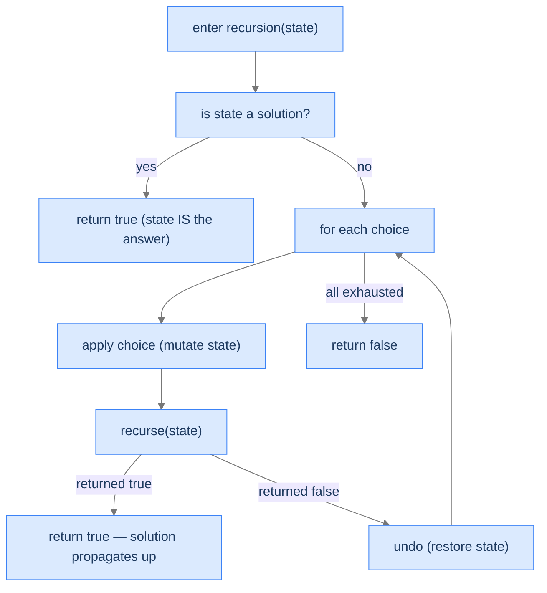
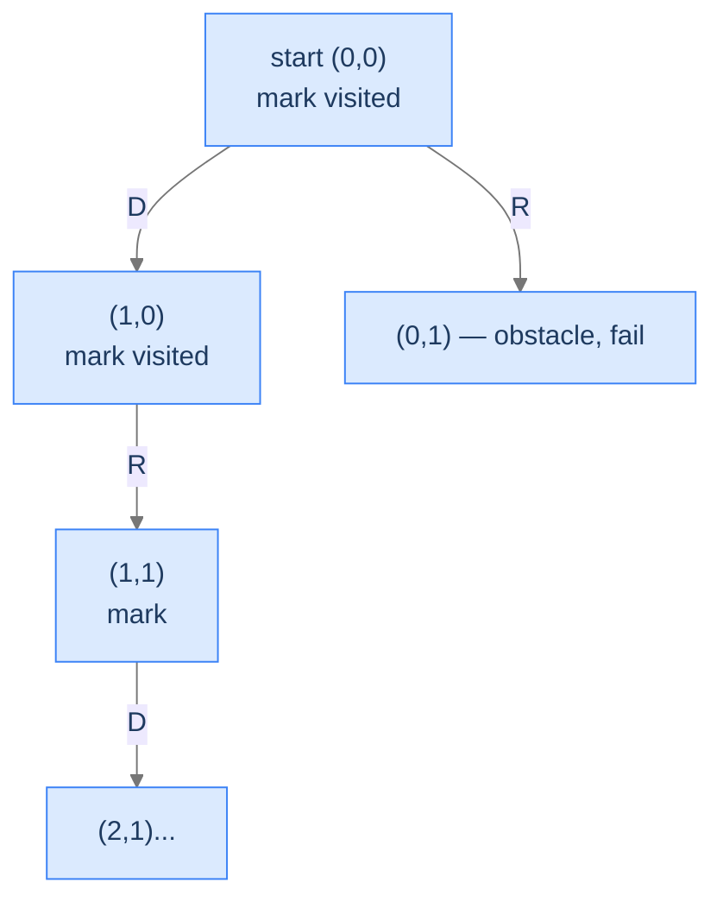
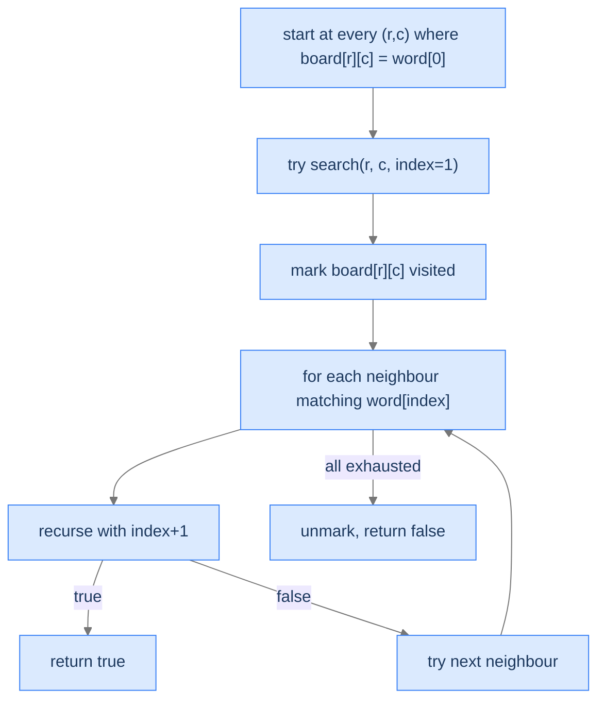

# 4. Pattern: Backtracking Search

The first two backtracking patterns *enumerate*. They walk every leaf of the state space tree, collecting outputs as they go. **Backtracking search** is different: instead of collecting outputs into a list, the algorithm searches for a *configuration of the world* that satisfies a set of constraints — a path through a maze, a placement of queens that don't attack, a filled sudoku grid. The "answer" isn't a leaf of the tree; the answer **is the state itself** at the moment all constraints are satisfied.

This shift changes three things:
1. **State is mutated in place**, not built up by appending.
2. **Recursion returns success/failure**, not a leaf to record.
3. **Early termination** on first success — for many search problems, finding *one* solution ends the algorithm.

By the end of this lesson you'll know what makes a problem a search rather than enumeration, the explicit-undo recipe, and four worked problems that drill it: maze pathfinding, word search on a grid, the n-queens classic, and sudoku.

## Table of contents

1. [Understanding backtracking search](#understanding-backtracking-search)
2. [Identifying backtracking search](#identifying-backtracking-search)
3. [Rat in a maze](#rat-in-a-maze)
4. [Word quest](#word-quest)
5. [Solve n queens](#solve-n-queens)
6. [Solve sudoku](#solve-sudoku)

***

# Understanding Backtracking Search

> **Course:** DSA › Algorithms › Backtracking › Search

Backtracking search is the pattern where the *state* itself is the candidate solution. The state is typically a 2D grid (maze, sudoku, chessboard) or some other structured world that the algorithm mutates as it walks the recursion. Each frame:

1. **Records its choice** by mutating the state (place a queen, mark a maze cell as visited, write a digit).
2. **Recurses**, asking "does this state extend to a solution?"
3. On the recursion's return:
   - If success — propagate success up; the state already holds the answer.
   - If failure — **undo the mutation** so the next sibling choice can be tried in a clean state.

The "undo" step is the heart of search. In unconditional enumeration, the undo was implicit (pop the last element off `current`). In search, the undo is explicit and structural — the same cell of the maze gets toggled visited/unvisited; the same chess square gets a queen placed and removed; the same sudoku cell gets a digit written and erased. **The world is the state; the world is shared; the world has to be exactly restored before the parent's loop tries the next choice.**



<p align="center"><strong>The search recipe. Every choice is applied to the world, recursed on, and either succeeds (propagate true upward) or fails (undo and try next). The world is mutated and restored throughout the search.</strong></p>

---

## Search vs Enumeration — When the Difference Matters

Both the Unconditional Enumeration lesson and the Conditional Enumeration lesson are *enumeration* patterns: build up a partial output, record at the leaves, return all valid outputs. The search pattern in this lesson is different in three structural ways:

| Aspect | Enumeration (Unconditional and Conditional lessons) | Search (this lesson) |
|---|---|---|
| What's the "candidate"? | A partial sequence/string we're building | The world's current state (grid, board, etc.) |
| How is it stored? | Appended to a `current` list | Mutated directly in the world |
| What does the recursion return? | Usually `void` — leaves get appended via shared output | Usually `bool` — was this branch successful? |
| What does success do? | Record the leaf, continue exploring siblings | Often: return `true` immediately; siblings unnecessary |
| What does the undo restore? | The `current` list (pop the last element) | The world's state (uncolor cell, remove queen, etc.) |

> *Predict before reading on — for "find any path through a 4×4 maze," would early termination help? What about "find ALL paths through the maze"?*

For "any path," early termination saves a huge amount of work — once a path is found, the algorithm can stop. For "all paths," the algorithm must explore every successful branch *and* every failed sibling, but the undo machinery is identical. The difference is in what the recursion returns from a successful leaf — `true + propagate` for "any," `void + record + continue` for "all."

---

## What Backtracking Search Looks Like in Code

```
function search(state):
    if state is a solution:
        return true                    ← state already holds the answer

    for each viable choice:
        apply(state, choice)            ← mutate the world
        if search(state):
            return true                 ← solution found, bubble up
        undo(state, choice)             ← explicit undo on failure

    return false                        ← all choices exhausted
```

The structure is identical to conditional enumeration — except for what we do with the state and what we return. The mutation-and-undo dance is what makes the recursion's call stack double as both control flow and the *world's state at any moment in time*.

---

## Algorithm

> **search(state)**
>
> 1. **Goal check** — is `state` a complete solution? If yes, return `true`.
> 2. **Generate viable choices** — what extensions of `state` are still candidates?
> 3. **For each choice:**
>    - **Apply** — mutate `state` to reflect this choice.
>    - **Recurse** — `search(state)`.
>    - If recursion returned `true`: **return true** (success bubbles up).
>    - If recursion returned `false`: **undo** the mutation; try the next choice.
> 4. **All choices exhausted** — return `false`.

This template handles "find one" search. For "find all," replace step 3's "if true: return true" with "if true: record state; continue (don't return)." Both flavours appear in the four worked problems.

---

## Implementation

A clean, language-agnostic skeleton illustrating the search recipe with explicit undo. The scenario is a generic maze-style "can I reach the goal?" search.


```pseudocode
DIRS ← [(1, 0), (0, 1), (−1, 0), (0, −1)]      # down, right, up, left

function findPath(maze):
    if maze is empty OR maze[0] is empty:
        return false
    return search(maze, 0, 0)

function search(maze, row, col):
    rows ← length(maze)
    cols ← length(maze[0])

    # Boundary, obstacle, or already-visited cell.
    if NOT (0 ≤ row < rows AND 0 ≤ col < cols) OR maze[row][col] ≠ 0:
        return false

    # Goal cell — bottom-right.
    if row = rows − 1 AND col = cols − 1:
        return true

    maze[row][col] ← −1                         # apply: mark visited

    for each (dr, dc) in DIRS:
        if search(maze, row + dr, col + dc):
            maze[row][col] ← 0                  # restore on success
            return true

    maze[row][col] ← 0                          # undo on failure
    return false
```

```python run
from typing import List

class Solution:
    def find_path(self, maze: List[List[int]]) -> bool:
        if not maze or not maze[0]:
            return False
        return self._search(maze, 0, 0)

    def _search(self, maze: List[List[int]], row: int, col: int) -> bool:
        rows, cols = len(maze), len(maze[0])
        # Boundary / obstacle / already-visited
        if not (0 <= row < rows and 0 <= col < cols) or maze[row][col] != 0:
            return False
        # Goal check
        if row == rows - 1 and col == cols - 1:
            return True
        # Apply: mark this cell as visited (mutate the world)
        maze[row][col] = -1
        # Try all four neighbours
        for dr, dc in ((1, 0), (0, 1), (-1, 0), (0, -1)):
            if self._search(maze, row + dr, col + dc):
                # Success: state is committed; we *could* leave the trail in place,
                # but cleanly restoring is the safe default.
                maze[row][col] = 0
                return True
        # Undo on failure — restore the cell so siblings can revisit
        maze[row][col] = 0
        return False


if __name__ == "__main__":
    maze = [[0, 1, 0], [0, 0, 0], [1, 0, 0]]
    print(Solution().find_path(maze))   # True
```

```java run
public class Solution {
    public boolean findPath(int[][] maze) {
        if (maze.length == 0 || maze[0].length == 0) return false;
        return search(maze, 0, 0);
    }

    private boolean search(int[][] maze, int row, int col) {
        int rows = maze.length, cols = maze[0].length;
        if (row < 0 || row >= rows || col < 0 || col >= cols || maze[row][col] != 0) return false;
        if (row == rows - 1 && col == cols - 1) return true;
        maze[row][col] = -1;                         // apply
        int[][] dirs = {{1, 0}, {0, 1}, {-1, 0}, {0, -1}};
        for (int[] d : dirs) {
            if (search(maze, row + d[0], col + d[1])) {
                maze[row][col] = 0;
                return true;
            }
        }
        maze[row][col] = 0;                           // undo on failure
        return false;
    }

    public static void main(String[] args) {
        int[][] maze = {{0, 1, 0}, {0, 0, 0}, {1, 0, 0}};
        System.out.println(new Solution().findPath(maze));
    }
}
```

```c run
#include <stdio.h>
#include <stdbool.h>

#define R 3
#define C 3

static const int dirs[4][2] = {{1, 0}, {0, 1}, {-1, 0}, {0, -1}};

bool search(int maze[R][C], int row, int col) {
    if (row < 0 || row >= R || col < 0 || col >= C || maze[row][col] != 0) return false;
    if (row == R - 1 && col == C - 1) return true;
    maze[row][col] = -1;                         /* apply */
    for (int i = 0; i < 4; i++) {
        if (search(maze, row + dirs[i][0], col + dirs[i][1])) {
            maze[row][col] = 0;
            return true;
        }
    }
    maze[row][col] = 0;                           /* undo */
    return false;
}

int main(void) {
    int maze[R][C] = {{0, 1, 0}, {0, 0, 0}, {1, 0, 0}};
    printf("%s\n", search(maze, 0, 0) ? "true" : "false");
    return 0;
}
```

```cpp run
#include <iostream>
#include <vector>

class Solution {
public:
    bool search(std::vector<std::vector<int>>& maze, int row, int col) {
        int rows = (int) maze.size(), cols = (int) maze[0].size();
        if (row < 0 || row >= rows || col < 0 || col >= cols || maze[row][col] != 0) return false;
        if (row == rows - 1 && col == cols - 1) return true;
        maze[row][col] = -1;
        const int dirs[4][2] = {{1, 0}, {0, 1}, {-1, 0}, {0, -1}};
        for (auto& d : dirs) {
            if (search(maze, row + d[0], col + d[1])) {
                maze[row][col] = 0;
                return true;
            }
        }
        maze[row][col] = 0;
        return false;
    }

    bool findPath(std::vector<std::vector<int>>& maze) {
        if (maze.empty() || maze[0].empty()) return false;
        return search(maze, 0, 0);
    }
};

int main() {
    std::vector<std::vector<int>> maze = {{0, 1, 0}, {0, 0, 0}, {1, 0, 0}};
    std::cout << std::boolalpha << Solution{}.findPath(maze) << '\n';
}
```

```scala run
class Solution {
  private val dirs = Array(Array(1, 0), Array(0, 1), Array(-1, 0), Array(0, -1))

  def findPath(maze: Array[Array[Int]]): Boolean = {
    if (maze.isEmpty || maze(0).isEmpty) false
    else search(maze, 0, 0)
  }

  private def search(maze: Array[Array[Int]], row: Int, col: Int): Boolean = {
    val rows = maze.length
    val cols = maze(0).length
    if (row < 0 || row >= rows || col < 0 || col >= cols || maze(row)(col) != 0) return false
    if (row == rows - 1 && col == cols - 1) return true
    maze(row)(col) = -1
    for (d <- dirs) {
      if (search(maze, row + d(0), col + d(1))) {
        maze(row)(col) = 0
        return true
      }
    }
    maze(row)(col) = 0
    false
  }
}

object Main {
  def main(args: Array[String]): Unit = {
    val maze = Array(Array(0, 1, 0), Array(0, 0, 0), Array(1, 0, 0))
    println(new Solution().findPath(maze))
  }
}
```

```typescript run
class Solution {
    findPath(maze: number[][]): boolean {
        if (!maze.length || !maze[0].length) return false;
        return this._search(maze, 0, 0);
    }
    private _search(maze: number[][], row: number, col: number): boolean {
        const rows = maze.length, cols = maze[0].length;
        if (row < 0 || row >= rows || col < 0 || col >= cols || maze[row][col] !== 0) return false;
        if (row === rows - 1 && col === cols - 1) return true;
        maze[row][col] = -1;
        const dirs: [number, number][] = [[1, 0], [0, 1], [-1, 0], [0, -1]];
        for (const [dr, dc] of dirs) {
            if (this._search(maze, row + dr, col + dc)) {
                maze[row][col] = 0;
                return true;
            }
        }
        maze[row][col] = 0;
        return false;
    }
}

console.log(new Solution().findPath([[0, 1, 0], [0, 0, 0], [1, 0, 0]]));
```

```go run
package main

import "fmt"

func search(maze [][]int, row, col int) bool {
    rows, cols := len(maze), len(maze[0])
    if row < 0 || row >= rows || col < 0 || col >= cols || maze[row][col] != 0 {
        return false
    }
    if row == rows-1 && col == cols-1 {
        return true
    }
    maze[row][col] = -1
    dirs := [][2]int{{1, 0}, {0, 1}, {-1, 0}, {0, -1}}
    for _, d := range dirs {
        if search(maze, row+d[0], col+d[1]) {
            maze[row][col] = 0
            return true
        }
    }
    maze[row][col] = 0
    return false
}

func findPath(maze [][]int) bool {
    if len(maze) == 0 || len(maze[0]) == 0 {
        return false
    }
    return search(maze, 0, 0)
}

func main() {
    fmt.Println(findPath([][]int{{0, 1, 0}, {0, 0, 0}, {1, 0, 0}}))
}
```

```rust run
fn search(maze: &mut Vec<Vec<i32>>, row: i32, col: i32) -> bool {
    let rows = maze.len() as i32;
    let cols = maze[0].len() as i32;
    if row < 0 || row >= rows || col < 0 || col >= cols || maze[row as usize][col as usize] != 0 {
        return false;
    }
    if row == rows - 1 && col == cols - 1 { return true; }
    maze[row as usize][col as usize] = -1;
    for (dr, dc) in [(1i32, 0i32), (0, 1), (-1, 0), (0, -1)].iter() {
        if search(maze, row + dr, col + dc) {
            maze[row as usize][col as usize] = 0;
            return true;
        }
    }
    maze[row as usize][col as usize] = 0;
    false
}

fn find_path(maze: &mut Vec<Vec<i32>>) -> bool {
    if maze.is_empty() || maze[0].is_empty() { return false; }
    search(maze, 0, 0)
}

fn main() {
    let mut maze = vec![vec![0, 1, 0], vec![0, 0, 0], vec![1, 0, 0]];
    println!("{}", find_path(&mut maze));
}
```


---

## Complexity Analysis

| Resource | Cost | Why |
|---|---|---|
| **Time** | `O(branching^depth)` worst case, `O(depth)` best case (early hit) | Each cell can branch into the choices not yet visited; depth is bounded by the state size. |
| **Space (stack)** | `O(depth)` | Recursion depth = path length. |
| **Space (auxiliary)** | `O(1)` if mutating the world, `O(state size)` if cloning per call | The mutation-and-undo trick avoids cloning. |

The fact that we're mutating the world means we're not paying for state copies on each call — a major speed-up over naive backtracking. The cost is having to write the explicit undo correctly. If you forget to undo, your search will give wrong answers because subsequent branches see a polluted world.

> **Best Case** — Time `O(depth)` (find solution on first descent), Space `O(depth)`
>
> **Worst Case** — Time `O(branching^depth)` (must explore the full tree)

---

## Key Takeaway

Backtracking search is enumeration's mirror image: instead of building an output by appending, we mutate the world; instead of recording leaves, we propagate `true` upward when the world is in a goal state; instead of implicit undos via `pop()`, we explicitly restore each mutation when a branch fails. The recursion's call stack is the world's history. Now we'll learn how to spot search problems vs enumeration ones.

***

# Identifying Backtracking Search

> **Course:** DSA › Algorithms › Backtracking › Search

Three diagnostic questions decide whether backtracking search fits.

| # | Question | If "yes," backtracking search fits because... |
|---|---|---|
| **Q1** | Is the **state itself** the candidate solution? | Mutating the state tracks the search; "the answer" is wherever the state ends up. |
| **Q2** | Does success/failure naturally **propagate upward** as a boolean (or stop the search)? | Recursion's `bool` return propagates without explicit data. |
| **Q3** | Is **explicit undo** of mutations needed to restore correctness? | The world's state must be exactly restored before a sibling tries. |

If all three are "yes," backtracking search fits.

### Q1 — Why "state IS the answer"?

**Mental model.** In enumeration, we built up an output string/list separate from the input. In search, the *world* (maze, board, grid) is what we're modifying *and* what holds the final answer. There's no separate output object.

**Concrete check.** Sudoku: when the algorithm finishes, the input grid *is* the solution. ✓

**What breaks otherwise.** If the answer is a list-of-things-collected, you're closer to enumeration's recipe (the Unconditional or Conditional Enumeration lessons).

### Q2 — Why "boolean propagation"?

**Mental model.** When a sub-search succeeds, that information has to flow back to the caller without any other communication. A boolean return value does this perfectly: `if search(...) return true;`. The state's mutation is the data; the boolean is the signal.

**Concrete check.** Maze: `search(row, col)` returns `true` if there's a path to the goal from this cell. The caller uses that boolean to decide whether to stop (return `true` further up) or try the next direction. ✓

**What breaks otherwise.** If we need to record *all* solutions, we replace the boolean with a "record into shared output" step but keep everything else. The pattern still applies — just collecting more answers.

### Q3 — Why "explicit undo"?

**Mental model.** Because the state is shared and mutated, every choice we tried but didn't keep must be reversed. Otherwise, the next sibling sees a polluted world and produces wrong results.

**Concrete check.** N-Queens: after placing a queen at `(row, col)` and finding no solution from there, we *must* remove that queen before trying `(row, col+1)`. Forgetting the undo means subsequent placements see a queen that shouldn't be there. ✓

**What breaks otherwise.** If you skip the undo, your algorithm's results are wrong — and the bug is hard to find because it manifests as "wrong answers" rather than crashes.

---

## A Worked Example — Find a Path in a 3×3 Maze

> *Pause and predict — for the maze below, what's the path from `(0,0)` to `(2,2)`? How would you sketch the recursion's call stack at the moment we're at `(2,1)`?*

```
maze =
  0 0 1
  1 0 0
  0 0 0   (0 = walkable, 1 = obstacle, start (0,0), goal (2,2))
```

The path is `(0,0) → (0,1) → (1,1) → (2,1) → (2,2)` (down-right-down-right). At the moment we're standing on `(2,1)`, the stack holds frames for `(0,0)`, `(0,1)`, `(1,1)`, `(2,1)`. The cells visited so far have been mutated in the maze (set to `-1` to mark "in-progress visit"). When we extend to `(2,2)` and the goal is reached, success bubbles up; each frame, on the way up, sees `true` and either keeps the visit mark or undoes it depending on the algorithm's needs (commonly: undo to leave the maze unchanged for the caller).

We make this concrete in **Problem 1** below.

---

## Key Takeaway

Three checks — state-IS-the-answer, boolean propagation, explicit undo — gate every backtracking-search problem. Pass all three and the recipe slides in. Four worked problems coming up. The first finds *one* path; the second finds *one* word; the third finds *all* configurations of N queens; the fourth solves an entire sudoku puzzle.

***

# Rat in a Maze

> **Course:** DSA › Algorithms › Backtracking › Search

The canonical backtracking-search problem. Walk a 2D grid; pick directions; mark visited cells to prevent cycles; reach the goal or fail.

---

## The Problem

Given an `N × M` maze where `0` is walkable and `1` is an obstacle, the rat starts at `(0, 0)` and must reach `(N-1, M-1)`. Return the path as a string of moves: `U` (up), `D` (down), `L` (left), `R` (right). If no path exists, return an empty string.

```
Input:  maze = [[0,1,1,1],
                [0,0,1,0],
                [0,0,1,1],
                [1,0,0,0]]
Output: "DDRDRR"   (or "DRDDRR" — any valid path)
```

---

## What Makes This a Search Problem?

Three signs:
1. The world (the maze grid) is the state we're navigating.
2. We need *one* path, not all of them — early termination is a win.
3. We must mark cells as visited during the descent to avoid cycling, and unmark on backtrack to allow other paths to use them.



<p align="center"><strong>Search descends through the grid, marking visited cells. On a dead end, the recursion returns false, the cell is unmarked, and the parent tries another direction.</strong></p>

---

## Applying the Diagnostic Questions

| # | Check | Answer |
|---|---|---|
| **Q1** | State IS the answer? | **Yes** — the path string + the visited grid is the search state. |
| **Q2** | Boolean propagation? | **Yes** — `search(row, col)` returns `true` if a path exists from here. |
| **Q3** | Explicit undo? | **Yes** — unmark the cell on failure to allow other paths to traverse it. |

### Q1 — Why "state IS the answer"?

The path string we're building and the maze's visited markings together form the candidate. When we reach the goal, the path string is the answer. The state is the candidate. ✓

### Q2 — Why "boolean propagation"?

Each recursion asks "from this cell, can I reach the goal?" The answer is yes or no — a boolean. When yes propagates up, the caller knows it doesn't need to try other directions. ✓

### Q3 — Why "explicit undo"?

If we don't unmark a cell after a failed exploration from it, subsequent sibling branches can't traverse that cell — even though they could legitimately. The unmark restores the maze for siblings. ✓

---

## The Visit-Mark-Recurse-Unmark Strategy (Visualised)

<div class="d2-slides" data-caption="The maze gets mutated as we descend; on failure, mutations are undone before sibling branches run.">

```d2
state: "Start at (0,0)" {
  grid: "maze\n[0,1,1,1]\n[0,0,1,0]\n[0,0,1,1]\n[1,0,0,0]" {style.fill: "#dbeafe"; style.stroke: "#3b82f6"}
}
```

```d2
state: "Marked (0,0) = -1, descending Down to (1,0)" {
  grid: "maze\n[-1,1,1,1]\n[0,0,1,0]\n[0,0,1,1]\n[1,0,0,0]\npath = 'D'" {style.fill: "#fde68a"; style.stroke: "#d97706"}
}
```

```d2
state: "(1,0) marked, descend to (2,0) = D" {
  grid: "maze\n[-1,1,1,1]\n[-1,0,1,0]\n[0,0,1,1]\n[1,0,0,0]\npath = 'DD'" {style.fill: "#fde68a"; style.stroke: "#d97706"}
}
```

```d2
state: "(2,0) marked, R to (2,1)" {
  grid: "path = 'DDR'" {style.fill: "#bbf7d0"; style.stroke: "#16a34a"}
}
```

```d2
state: "Continue exploring; eventual success → 'DDRDRR'" {
  grid: "path = 'DDRDRR' — goal reached!" {style.fill: "#ede9fe"; style.stroke: "#7c3aed"}
}
```

</div>

---

## The Solution


```pseudocode
DIRS ← [('D', 1, 0), ('R', 0, 1), ('U', −1, 0), ('L', 0, −1)]

function ratInAMaze(maze):
    if maze is empty OR maze[0] is empty OR maze[0][0] ≠ 0:
        return ""
    path ← empty list of characters
    if search(maze, 0, 0, path):
        return join(path)
    return ""

function search(maze, row, col, path):
    rows ← length(maze)
    cols ← length(maze[0])

    # Goal reached — bottom-right cell.
    if row = rows − 1 AND col = cols − 1:
        return true

    original ← maze[row][col]
    maze[row][col] ← −1                          # apply: mark visited

    for each (dirChar, dr, dc) in DIRS:
        nr ← row + dr
        nc ← col + dc
        if 0 ≤ nr < rows AND 0 ≤ nc < cols AND maze[nr][nc] = 0:
            append dirChar to path
            if search(maze, nr, nc, path):
                maze[row][col] ← original       # restore on success
                return true
            remove last element of path         # undo path step

    maze[row][col] ← original                    # undo visit mark
    return false
```

```python run
from typing import List

class Solution:
    DIRS = [('D', 1, 0), ('R', 0, 1), ('U', -1, 0), ('L', 0, -1)]

    def rat_in_a_maze(self, maze: List[List[int]]) -> str:
        if not maze or not maze[0] or maze[0][0] != 0:
            return ""
        path: List[str] = []
        if self._search(maze, 0, 0, path):
            return "".join(path)
        return ""

    def _search(self, maze: List[List[int]], row: int, col: int, path: List[str]) -> bool:
        rows, cols = len(maze), len(maze[0])
        if row == rows - 1 and col == cols - 1:
            return True                      # goal reached; path holds the answer
        original = maze[row][col]
        maze[row][col] = -1                  # mark visited (apply)
        for dir_char, dr, dc in self.DIRS:
            nr, nc = row + dr, col + dc
            if 0 <= nr < rows and 0 <= nc < cols and maze[nr][nc] == 0:
                path.append(dir_char)
                if self._search(maze, nr, nc, path):
                    maze[row][col] = original
                    return True               # propagate success
                path.pop()                    # undo the path step
        maze[row][col] = original             # undo the visit mark
        return False


if __name__ == "__main__":
    maze = [[0, 1, 1, 1], [0, 0, 1, 0], [0, 0, 1, 1], [1, 0, 0, 0]]
    print(Solution().rat_in_a_maze(maze))
```

```java run
public class Solution {
    private static final int[][] DIRS = {{1, 0}, {0, 1}, {-1, 0}, {0, -1}};
    private static final char[] DIR_CHAR = {'D', 'R', 'U', 'L'};

    public String ratInAMaze(int[][] maze) {
        if (maze.length == 0 || maze[0].length == 0 || maze[0][0] != 0) return "";
        StringBuilder path = new StringBuilder();
        return search(maze, 0, 0, path) ? path.toString() : "";
    }

    private boolean search(int[][] maze, int row, int col, StringBuilder path) {
        int rows = maze.length, cols = maze[0].length;
        if (row == rows - 1 && col == cols - 1) return true;
        int orig = maze[row][col];
        maze[row][col] = -1;
        for (int i = 0; i < 4; i++) {
            int nr = row + DIRS[i][0], nc = col + DIRS[i][1];
            if (nr >= 0 && nr < rows && nc >= 0 && nc < cols && maze[nr][nc] == 0) {
                path.append(DIR_CHAR[i]);
                if (search(maze, nr, nc, path)) {
                    maze[row][col] = orig;
                    return true;
                }
                path.deleteCharAt(path.length() - 1);
            }
        }
        maze[row][col] = orig;
        return false;
    }

    public static void main(String[] args) {
        int[][] maze = {{0, 1, 1, 1}, {0, 0, 1, 0}, {0, 0, 1, 1}, {1, 0, 0, 0}};
        System.out.println(new Solution().ratInAMaze(maze));
    }
}
```

```c run
#include <stdio.h>
#include <string.h>
#include <stdbool.h>

#define R 4
#define C 4

static const int dirs[4][2] = {{1, 0}, {0, 1}, {-1, 0}, {0, -1}};
static const char DC[4] = {'D', 'R', 'U', 'L'};

bool search(int maze[R][C], int row, int col, char *path, int *pl) {
    if (row == R - 1 && col == C - 1) return true;
    int orig = maze[row][col];
    maze[row][col] = -1;
    for (int i = 0; i < 4; i++) {
        int nr = row + dirs[i][0], nc = col + dirs[i][1];
        if (nr >= 0 && nr < R && nc >= 0 && nc < C && maze[nr][nc] == 0) {
            path[(*pl)++] = DC[i];
            if (search(maze, nr, nc, path, pl)) {
                maze[row][col] = orig;
                return true;
            }
            (*pl)--;
        }
    }
    maze[row][col] = orig;
    return false;
}

int main(void) {
    int maze[R][C] = {{0, 1, 1, 1}, {0, 0, 1, 0}, {0, 0, 1, 1}, {1, 0, 0, 0}};
    char path[100] = "";
    int pl = 0;
    if (search(maze, 0, 0, path, &pl)) {
        path[pl] = '\0';
        printf("%s\n", path);
    } else {
        printf("(no path)\n");
    }
    return 0;
}
```

```cpp run
#include <iostream>
#include <vector>
#include <string>

class Solution {
public:
    bool search(std::vector<std::vector<int>>& maze, int row, int col, std::string& path) {
        int rows = (int) maze.size(), cols = (int) maze[0].size();
        if (row == rows - 1 && col == cols - 1) return true;
        int orig = maze[row][col];
        maze[row][col] = -1;
        const int dirs[4][2] = {{1, 0}, {0, 1}, {-1, 0}, {0, -1}};
        const char dc[4] = {'D', 'R', 'U', 'L'};
        for (int i = 0; i < 4; i++) {
            int nr = row + dirs[i][0], nc = col + dirs[i][1];
            if (nr >= 0 && nr < rows && nc >= 0 && nc < cols && maze[nr][nc] == 0) {
                path.push_back(dc[i]);
                if (search(maze, nr, nc, path)) {
                    maze[row][col] = orig;
                    return true;
                }
                path.pop_back();
            }
        }
        maze[row][col] = orig;
        return false;
    }

    std::string ratInAMaze(std::vector<std::vector<int>>& maze) {
        if (maze.empty() || maze[0].empty() || maze[0][0] != 0) return "";
        std::string path;
        return search(maze, 0, 0, path) ? path : "";
    }
};

int main() {
    std::vector<std::vector<int>> maze = {{0, 1, 1, 1}, {0, 0, 1, 0}, {0, 0, 1, 1}, {1, 0, 0, 0}};
    std::cout << Solution{}.ratInAMaze(maze) << '\n';
}
```

```scala run
class Solution {
  private val dirs = Array((1, 0, 'D'), (0, 1, 'R'), (-1, 0, 'U'), (0, -1, 'L'))

  def ratInAMaze(maze: Array[Array[Int]]): String = {
    if (maze.isEmpty || maze(0).isEmpty || maze(0)(0) != 0) return ""
    val path = new StringBuilder
    if (search(maze, 0, 0, path)) path.toString() else ""
  }

  private def search(maze: Array[Array[Int]], row: Int, col: Int, path: StringBuilder): Boolean = {
    val rows = maze.length
    val cols = maze(0).length
    if (row == rows - 1 && col == cols - 1) return true
    val orig = maze(row)(col)
    maze(row)(col) = -1
    for ((dr, dc, ch) <- dirs) {
      val nr = row + dr; val nc = col + dc
      if (nr >= 0 && nr < rows && nc >= 0 && nc < cols && maze(nr)(nc) == 0) {
        path.append(ch)
        if (search(maze, nr, nc, path)) {
          maze(row)(col) = orig
          return true
        }
        path.deleteCharAt(path.length - 1)
      }
    }
    maze(row)(col) = orig
    false
  }
}

object Main {
  def main(args: Array[String]): Unit = {
    val maze = Array(Array(0,1,1,1), Array(0,0,1,0), Array(0,0,1,1), Array(1,0,0,0))
    println(new Solution().ratInAMaze(maze))
  }
}
```

```typescript run
class Solution {
    private DIRS: [number, number, string][] = [[1, 0, 'D'], [0, 1, 'R'], [-1, 0, 'U'], [0, -1, 'L']];

    ratInAMaze(maze: number[][]): string {
        if (!maze.length || !maze[0].length || maze[0][0] !== 0) return "";
        const path: string[] = [];
        return this._search(maze, 0, 0, path) ? path.join("") : "";
    }

    private _search(maze: number[][], row: number, col: number, path: string[]): boolean {
        const rows = maze.length, cols = maze[0].length;
        if (row === rows - 1 && col === cols - 1) return true;
        const orig = maze[row][col];
        maze[row][col] = -1;
        for (const [dr, dc, ch] of this.DIRS) {
            const nr = row + dr, nc = col + dc;
            if (nr >= 0 && nr < rows && nc >= 0 && nc < cols && maze[nr][nc] === 0) {
                path.push(ch);
                if (this._search(maze, nr, nc, path)) {
                    maze[row][col] = orig;
                    return true;
                }
                path.pop();
            }
        }
        maze[row][col] = orig;
        return false;
    }
}

console.log(new Solution().ratInAMaze([[0,1,1,1],[0,0,1,0],[0,0,1,1],[1,0,0,0]]));
```

```go run
package main

import "fmt"

var dirs = [4][3]int{{1, 0, 'D'}, {0, 1, 'R'}, {-1, 0, 'U'}, {0, -1, 'L'}}

func search(maze [][]int, row, col int, path *[]byte) bool {
    rows, cols := len(maze), len(maze[0])
    if row == rows-1 && col == cols-1 {
        return true
    }
    orig := maze[row][col]
    maze[row][col] = -1
    for _, d := range dirs {
        nr, nc := row+d[0], col+d[1]
        if nr >= 0 && nr < rows && nc >= 0 && nc < cols && maze[nr][nc] == 0 {
            *path = append(*path, byte(d[2]))
            if search(maze, nr, nc, path) {
                maze[row][col] = orig
                return true
            }
            *path = (*path)[:len(*path)-1]
        }
    }
    maze[row][col] = orig
    return false
}

func ratInAMaze(maze [][]int) string {
    if len(maze) == 0 || len(maze[0]) == 0 || maze[0][0] != 0 {
        return ""
    }
    path := []byte{}
    if search(maze, 0, 0, &path) {
        return string(path)
    }
    return ""
}

func main() {
    fmt.Println(ratInAMaze([][]int{{0,1,1,1},{0,0,1,0},{0,0,1,1},{1,0,0,0}}))
}
```

```rust run
const DIRS: [(i32, i32, char); 4] = [(1, 0, 'D'), (0, 1, 'R'), (-1, 0, 'U'), (0, -1, 'L')];

fn search(maze: &mut Vec<Vec<i32>>, row: i32, col: i32, path: &mut String) -> bool {
    let rows = maze.len() as i32;
    let cols = maze[0].len() as i32;
    if row == rows - 1 && col == cols - 1 { return true; }
    let orig = maze[row as usize][col as usize];
    maze[row as usize][col as usize] = -1;
    for &(dr, dc, ch) in DIRS.iter() {
        let nr = row + dr; let nc = col + dc;
        if nr >= 0 && nr < rows && nc >= 0 && nc < cols && maze[nr as usize][nc as usize] == 0 {
            path.push(ch);
            if search(maze, nr, nc, path) {
                maze[row as usize][col as usize] = orig;
                return true;
            }
            path.pop();
        }
    }
    maze[row as usize][col as usize] = orig;
    false
}

fn rat_in_a_maze(maze: &mut Vec<Vec<i32>>) -> String {
    if maze.is_empty() || maze[0].is_empty() || maze[0][0] != 0 { return String::new(); }
    let mut path = String::new();
    if search(maze, 0, 0, &mut path) { path } else { String::new() }
}

fn main() {
    let mut maze = vec![vec![0,1,1,1], vec![0,0,1,0], vec![0,0,1,1], vec![1,0,0,0]];
    println!("{}", rat_in_a_maze(&mut maze));
}
```


---

## Complexity Analysis

| Resource | Cost | Why |
|---|---|---|
| **Time** | `O(4^(R·C))` worst case | Each cell can branch into up to 4 directions; total cells `R·C`. |
| **Space (stack)** | `O(R·C)` | Recursion depth = path length ≤ total cells. |

In practice, the visited-mark prevents revisiting cells, so the search is much faster than the naive `4^(R·C)` bound — closer to `O(R·C)` for typical mazes.

---

## Edge Cases

| Case | Example | Expected |
|---|---|---|
| Start blocked | `maze[0][0] = 1` | `""` (rat can't even start). |
| Goal blocked | `maze[N-1][M-1] = 1` | `""`. |
| 1×1 walkable | `[[0]]` | `""` (start = goal, path is empty string by convention). |
| All open | `[[0,0],[0,0]]` | `"DR"` or `"RD"`. |
| Disconnected | obstacles isolate the goal | `""`. |

---

## Final Takeaway

Rat in a Maze is the canonical "find one path" search problem. Mark visited, recurse, propagate true on success, undo on failure. Same recipe applies to flood-fill, island-counting (when finding any cell of an island), and many graph reachability problems. The next problem keeps the 2D-grid setting but flips the goal: instead of reaching a destination, we're matching a sequence of characters.

***

# Word Quest

> **Course:** DSA › Algorithms › Backtracking › Search

A 2D character grid; we want to know whether a given word appears as a chain of orthogonally-adjacent cells (with no cell reused). Same search recipe as the maze, with character-matching instead of obstacle-checking.

---

## The Problem

Given a 2D grid `board` of single-character strings and a target string `word`, return `true` if `word` can be spelled by a chain of orthogonally adjacent cells (up, down, left, right) without reusing any cell. Else `false`.

```
Input:  board = [['A','B','C','E'],
                 ['S','F','C','S'],
                 ['A','D','E','E']],
        word = "ABCCED"
Output: true
```

---

## What's the Recursion Doing?

Try starting from every cell that matches `word[0]`. From each starting cell, recurse into the four neighbours; at each step, the next cell must match `word[index]`. Use the visited-mark trick to prevent reusing cells. When `index` reaches `len(word)`, the chain is complete — return `true`.



<p align="center"><strong>Backtracking search for word matching. The mark-visit-recurse-unmark dance is identical to the maze; only the validation differs (character match instead of cell type).</strong></p>

---

## Applying the Diagnostic Questions

| # | Check | Answer |
|---|---|---|
| **Q1** | State IS the answer? | **Yes** — the visited grid + current index in word is the search state. |
| **Q2** | Boolean propagation? | **Yes** — `true` if word can be completed from this cell, `false` otherwise. |
| **Q3** | Explicit undo? | **Yes** — must unmark cells so other start positions can use them. |

### Q1 — Why "state IS"?

The "candidate" is "the chain of cells we've matched so far," tracked by the visited markers and the current `index`. ✓

### Q2 — Why "boolean propagation"?

We want a yes/no answer. If any starting cell can spell the word, return `true`; otherwise `false`. ✓

### Q3 — Why "explicit undo"?

Different starting cells should each get a clean view of the board. If we forget to unmark, one starting cell's pollution prevents another from working. ✓

---

## The Solution


```pseudocode
DIRS ← [(1, 0), (−1, 0), (0, 1), (0, −1)]

function wordQuest(board, word):
    rows ← length(board)
    cols ← length(board[0])
    for r from 0 to rows − 1:
        for c from 0 to cols − 1:
            if board[r][c] = word[0] AND search(board, word, 1, r, c):
                return true
    return false

function search(board, word, index, row, col):
    if index = length(word):
        return true                              # entire word matched

    rows ← length(board)
    cols ← length(board[0])
    original ← board[row][col]
    board[row][col] ← '#'                        # mark visited (sentinel)

    for each (dr, dc) in DIRS:
        nr ← row + dr
        nc ← col + dc
        if 0 ≤ nr < rows AND 0 ≤ nc < cols AND board[nr][nc] = word[index]:
            if search(board, word, index + 1, nr, nc):
                board[row][col] ← original      # restore on success
                return true

    board[row][col] ← original                   # undo on failure
    return false
```

```python run
from typing import List

class Solution:
    DIRS = [(1, 0), (-1, 0), (0, 1), (0, -1)]

    def word_quest(self, board: List[List[str]], word: str) -> bool:
        rows, cols = len(board), len(board[0])
        for r in range(rows):
            for c in range(cols):
                if board[r][c] == word[0] and self._search(board, word, 1, r, c):
                    return True
        return False

    def _search(self, board: List[List[str]], word: str, index: int, row: int, col: int) -> bool:
        if index == len(word):
            return True                              # entire word matched
        rows, cols = len(board), len(board[0])
        original = board[row][col]
        board[row][col] = "#"                        # mark visited (sentinel value)
        for dr, dc in self.DIRS:
            nr, nc = row + dr, col + dc
            if 0 <= nr < rows and 0 <= nc < cols and board[nr][nc] == word[index]:
                if self._search(board, word, index + 1, nr, nc):
                    board[row][col] = original
                    return True
        board[row][col] = original                   # undo on failure
        return False


if __name__ == "__main__":
    board = [['A','B','C','E'], ['S','F','C','S'], ['A','D','E','E']]
    print(Solution().word_quest(board, "ABCCED"))
```

```java run
public class Solution {
    private static final int[][] DIRS = {{1, 0}, {-1, 0}, {0, 1}, {0, -1}};

    public boolean wordQuest(char[][] board, String word) {
        int rows = board.length, cols = board[0].length;
        for (int r = 0; r < rows; r++) {
            for (int c = 0; c < cols; c++) {
                if (board[r][c] == word.charAt(0) && search(board, word, 1, r, c)) {
                    return true;
                }
            }
        }
        return false;
    }

    private boolean search(char[][] board, String word, int index, int row, int col) {
        if (index == word.length()) return true;
        char orig = board[row][col];
        board[row][col] = '#';
        for (int[] d : DIRS) {
            int nr = row + d[0], nc = col + d[1];
            if (nr >= 0 && nr < board.length && nc >= 0 && nc < board[0].length
                && board[nr][nc] == word.charAt(index)) {
                if (search(board, word, index + 1, nr, nc)) {
                    board[row][col] = orig;
                    return true;
                }
            }
        }
        board[row][col] = orig;
        return false;
    }

    public static void main(String[] args) {
        char[][] board = {{'A','B','C','E'}, {'S','F','C','S'}, {'A','D','E','E'}};
        System.out.println(new Solution().wordQuest(board, "ABCCED"));
    }
}
```

```c run
#include <stdio.h>
#include <string.h>
#include <stdbool.h>

#define R 3
#define C 4

static const int dirs[4][2] = {{1, 0}, {-1, 0}, {0, 1}, {0, -1}};

bool search(char board[R][C], const char *word, int index, int row, int col) {
    if (index == (int) strlen(word)) return true;
    char orig = board[row][col];
    board[row][col] = '#';
    for (int i = 0; i < 4; i++) {
        int nr = row + dirs[i][0], nc = col + dirs[i][1];
        if (nr >= 0 && nr < R && nc >= 0 && nc < C && board[nr][nc] == word[index]) {
            if (search(board, word, index + 1, nr, nc)) {
                board[row][col] = orig;
                return true;
            }
        }
    }
    board[row][col] = orig;
    return false;
}

int main(void) {
    char board[R][C] = {{'A','B','C','E'}, {'S','F','C','S'}, {'A','D','E','E'}};
    const char *word = "ABCCED";
    bool found = false;
    for (int r = 0; r < R && !found; r++) {
        for (int c = 0; c < C && !found; c++) {
            if (board[r][c] == word[0] && search(board, word, 1, r, c)) found = true;
        }
    }
    printf("%s\n", found ? "true" : "false");
    return 0;
}
```

```cpp run
#include <iostream>
#include <vector>
#include <string>

class Solution {
public:
    bool search(std::vector<std::vector<char>>& board, const std::string& word, int index, int row, int col) {
        if (index == (int) word.length()) return true;
        char orig = board[row][col];
        board[row][col] = '#';
        const int dirs[4][2] = {{1, 0}, {-1, 0}, {0, 1}, {0, -1}};
        for (auto& d : dirs) {
            int nr = row + d[0], nc = col + d[1];
            if (nr >= 0 && nr < (int) board.size() && nc >= 0 && nc < (int) board[0].size()
                && board[nr][nc] == word[index]) {
                if (search(board, word, index + 1, nr, nc)) {
                    board[row][col] = orig;
                    return true;
                }
            }
        }
        board[row][col] = orig;
        return false;
    }

    bool wordQuest(std::vector<std::vector<char>>& board, const std::string& word) {
        int rows = (int) board.size(), cols = (int) board[0].size();
        for (int r = 0; r < rows; r++) {
            for (int c = 0; c < cols; c++) {
                if (board[r][c] == word[0] && search(board, word, 1, r, c)) return true;
            }
        }
        return false;
    }
};

int main() {
    std::vector<std::vector<char>> board = {{'A','B','C','E'}, {'S','F','C','S'}, {'A','D','E','E'}};
    std::cout << std::boolalpha << Solution{}.wordQuest(board, "ABCCED") << '\n';
}
```

```scala run
class Solution {
  private val dirs = Array((1, 0), (-1, 0), (0, 1), (0, -1))

  def wordQuest(board: Array[Array[Char]], word: String): Boolean = {
    val rows = board.length; val cols = board(0).length
    for (r <- 0 until rows; c <- 0 until cols) {
      if (board(r)(c) == word.charAt(0) && search(board, word, 1, r, c)) return true
    }
    false
  }

  private def search(board: Array[Array[Char]], word: String, index: Int, row: Int, col: Int): Boolean = {
    if (index == word.length) return true
    val orig = board(row)(col)
    board(row)(col) = '#'
    for ((dr, dc) <- dirs) {
      val nr = row + dr; val nc = col + dc
      if (nr >= 0 && nr < board.length && nc >= 0 && nc < board(0).length && board(nr)(nc) == word.charAt(index)) {
        if (search(board, word, index + 1, nr, nc)) {
          board(row)(col) = orig
          return true
        }
      }
    }
    board(row)(col) = orig
    false
  }
}

object Main {
  def main(args: Array[String]): Unit = {
    val board = Array(Array('A','B','C','E'), Array('S','F','C','S'), Array('A','D','E','E'))
    println(new Solution().wordQuest(board, "ABCCED"))
  }
}
```

```typescript run
class Solution {
    private DIRS: [number, number][] = [[1, 0], [-1, 0], [0, 1], [0, -1]];

    wordQuest(board: string[][], word: string): boolean {
        const rows = board.length, cols = board[0].length;
        for (let r = 0; r < rows; r++) {
            for (let c = 0; c < cols; c++) {
                if (board[r][c] === word[0] && this._search(board, word, 1, r, c)) return true;
            }
        }
        return false;
    }

    private _search(board: string[][], word: string, index: number, row: number, col: number): boolean {
        if (index === word.length) return true;
        const orig = board[row][col];
        board[row][col] = "#";
        for (const [dr, dc] of this.DIRS) {
            const nr = row + dr, nc = col + dc;
            if (nr >= 0 && nr < board.length && nc >= 0 && nc < board[0].length && board[nr][nc] === word[index]) {
                if (this._search(board, word, index + 1, nr, nc)) {
                    board[row][col] = orig;
                    return true;
                }
            }
        }
        board[row][col] = orig;
        return false;
    }
}

const board: string[][] = [['A','B','C','E'], ['S','F','C','S'], ['A','D','E','E']];
console.log(new Solution().wordQuest(board, "ABCCED"));
```

```go run
package main

import "fmt"

var dirs = [4][2]int{{1, 0}, {-1, 0}, {0, 1}, {0, -1}}

func searchWord(board [][]byte, word string, index, row, col int) bool {
    if index == len(word) {
        return true
    }
    orig := board[row][col]
    board[row][col] = '#'
    for _, d := range dirs {
        nr, nc := row+d[0], col+d[1]
        if nr >= 0 && nr < len(board) && nc >= 0 && nc < len(board[0]) && board[nr][nc] == word[index] {
            if searchWord(board, word, index+1, nr, nc) {
                board[row][col] = orig
                return true
            }
        }
    }
    board[row][col] = orig
    return false
}

func wordQuest(board [][]byte, word string) bool {
    for r := 0; r < len(board); r++ {
        for c := 0; c < len(board[0]); c++ {
            if board[r][c] == word[0] && searchWord(board, word, 1, r, c) {
                return true
            }
        }
    }
    return false
}

func main() {
    board := [][]byte{{'A','B','C','E'}, {'S','F','C','S'}, {'A','D','E','E'}}
    fmt.Println(wordQuest(board, "ABCCED"))
}
```

```rust run
const DIRS: [(i32, i32); 4] = [(1, 0), (-1, 0), (0, 1), (0, -1)];

fn search(board: &mut Vec<Vec<char>>, word: &Vec<char>, index: usize, row: i32, col: i32) -> bool {
    if index == word.len() { return true; }
    let orig = board[row as usize][col as usize];
    board[row as usize][col as usize] = '#';
    let rows = board.len() as i32;
    let cols = board[0].len() as i32;
    for &(dr, dc) in DIRS.iter() {
        let nr = row + dr; let nc = col + dc;
        if nr >= 0 && nr < rows && nc >= 0 && nc < cols && board[nr as usize][nc as usize] == word[index] {
            if search(board, word, index + 1, nr, nc) {
                board[row as usize][col as usize] = orig;
                return true;
            }
        }
    }
    board[row as usize][col as usize] = orig;
    false
}

fn word_quest(board: &mut Vec<Vec<char>>, word: &str) -> bool {
    let chars: Vec<char> = word.chars().collect();
    let rows = board.len() as i32;
    let cols = board[0].len() as i32;
    for r in 0..rows {
        for c in 0..cols {
            if board[r as usize][c as usize] == chars[0] && search(board, &chars, 1, r, c) {
                return true;
            }
        }
    }
    false
}

fn main() {
    let mut board = vec![vec!['A','B','C','E'], vec!['S','F','C','S'], vec!['A','D','E','E']];
    println!("{}", word_quest(&mut board, "ABCCED"));
}
```


---

## Complexity Analysis

| Resource | Cost | Why |
|---|---|---|
| **Time** | `O(rows · cols · 4^len(word))` | Up to `rows · cols` start positions × `4^len(word)` paths from each. |
| **Space (stack)** | `O(len(word))` | Recursion depth = word length. |

In practice the visited-mark prunes the search aggressively — most paths fail at length 2-3.

---

## Edge Cases

| Case | Example | Expected |
|---|---|---|
| Word longer than board cells | board has 5 cells, word length 6 | `false`. |
| First-char absent | board has no 'A', word starts with 'A' | `false`. |
| Single-char word | word = "X" | `true` iff the board contains 'X'. |
| Word reuses a cell | needs same cell twice | `false` by problem statement. |

---

## Final Takeaway

Word Quest is the canonical "match a sequence on a grid" search problem. Same recipe as the maze; only the validation function differs (character match vs walkability). The next problem changes the world from a 2D grid to an `n × n` chessboard, and the algorithm collects *all* valid configurations rather than just one.

***

# Solve N Queens

> **Course:** DSA › Algorithms › Backtracking › Search

The classic. Place `n` queens on an `n × n` board so no two attack each other. Find *all* valid configurations.

---

## The Problem

Given `n`, return all distinct solutions to the n-queens problem. Each solution is a list of `n` strings, each of length `n`, where `Q` is a queen and `.` is empty. Two queens attack iff they share a row, column, or diagonal.

```
Input:  n = 4
Output: [
  [".Q..", "...Q", "Q...", "..Q."],
  ["..Q.", "Q...", "...Q", ".Q.."]
]
```

There are exactly two solutions for `n = 4`. For `n = 8`, the famous answer is 92 solutions (12 if you account for symmetry).

---

## Why This Is a Search With "Find All"

Two structural choices simplify the problem:
1. **One queen per row.** No two queens can share a row, so we place exactly one per row. Reduces the choice set per level from `n²` cells to `n` columns.
2. **Process rows in order.** The state at depth `r` is "queens placed in rows 0..r-1." Each frame picks a column for row `r`.

The constraint check at each placement: **the chosen column must not conflict with any already-placed queen** — same column, same diagonal, or same anti-diagonal.

---

## Applying the Diagnostic Questions

| # | Check | Answer |
|---|---|---|
| **Q1** | State IS the answer? | **Yes** — the array of column-positions is the configuration. |
| **Q2** | Boolean propagation? | Almost — but here we want *all* solutions, so we use a record-and-continue variant. |
| **Q3** | Explicit undo? | **Yes** — set the column-position to `-1` after exploring its subtree. |

### Q1 — Why "state IS"?

The state — `queenPositions[i]` = column of the queen in row `i` — completely determines a board configuration. ✓

### Q2 — Why "find-all variant"?

For the maze and word problems, we wanted *one* solution and propagated `true` to stop. Here we want *all*, so the search doesn't stop on first success — instead, it records each valid configuration and continues. ✓

### Q3 — Why "explicit undo"?

After fully exploring "what configurations exist with the queen for row 0 in column 0?", we move on to "...with the queen in column 1." That requires resetting `queenPositions[0]` so it doesn't pollute later rows' conflict checks. ✓

---

## The Solution


```pseudocode
function solveNQueens(n):
    positions ← list of n entries, each set to −1   # positions[r] = column of queen in row r
    results ← empty list
    search(positions, 0, n, results)
    return results

function search(positions, row, n, results):
    if row = n:
        append makeBoard(positions, n) to results
        return
    for col from 0 to n − 1:
        if canPlace(positions, row, col):
            positions[row] ← col                    # apply
            search(positions, row + 1, n, results)
            positions[row] ← −1                     # undo

function canPlace(positions, row, col):
    # Check every previously-placed queen in rows 0..row-1.
    for r from 0 to row − 1:
        if positions[r] = col:
            return false                            # same column
        if |positions[r] − col| = row − r:
            return false                            # same diagonal (Δcol = Δrow)
    return true

function makeBoard(positions, n):
    board ← empty list of strings
    for r from 0 to n − 1:
        rowStr ← string of n '.' characters
        rowStr[positions[r]] ← 'Q'
        append rowStr to board
    return board
```

```python run
from typing import List

class Solution:
    def solve_n_queens(self, n: int) -> List[List[str]]:
        positions = [-1] * n          # positions[r] = col of queen in row r
        results: List[List[str]] = []
        self._search(positions, 0, n, results)
        return results

    def _search(self, positions: List[int], row: int, n: int, results: List[List[str]]) -> None:
        if row == n:
            results.append(self._make_board(positions, n))
            return
        for col in range(n):
            if self._can_place(positions, row, col):
                positions[row] = col              # apply
                self._search(positions, row + 1, n, results)
                positions[row] = -1               # undo

    @staticmethod
    def _can_place(positions: List[int], row: int, col: int) -> bool:
        for r in range(row):
            if positions[r] == col:               # same column
                return False
            if abs(positions[r] - col) == row - r: # same diagonal (|Δcol| == Δrow)
                return False
        return True

    @staticmethod
    def _make_board(positions: List[int], n: int) -> List[str]:
        board = []
        for r in range(n):
            row_str = ['.'] * n
            row_str[positions[r]] = 'Q'
            board.append("".join(row_str))
        return board


if __name__ == "__main__":
    for sol in Solution().solve_n_queens(4):
        for row in sol: print(row)
        print()
```

```java run
import java.util.ArrayList;
import java.util.Arrays;
import java.util.List;

public class Solution {
    public List<List<String>> solveNQueens(int n) {
        int[] positions = new int[n];
        Arrays.fill(positions, -1);
        List<List<String>> results = new ArrayList<>();
        search(positions, 0, n, results);
        return results;
    }

    private void search(int[] positions, int row, int n, List<List<String>> results) {
        if (row == n) {
            results.add(makeBoard(positions, n));
            return;
        }
        for (int col = 0; col < n; col++) {
            if (canPlace(positions, row, col)) {
                positions[row] = col;
                search(positions, row + 1, n, results);
                positions[row] = -1;
            }
        }
    }

    private boolean canPlace(int[] positions, int row, int col) {
        for (int r = 0; r < row; r++) {
            if (positions[r] == col) return false;
            if (Math.abs(positions[r] - col) == row - r) return false;
        }
        return true;
    }

    private List<String> makeBoard(int[] positions, int n) {
        List<String> board = new ArrayList<>();
        for (int r = 0; r < n; r++) {
            char[] row = new char[n];
            Arrays.fill(row, '.');
            row[positions[r]] = 'Q';
            board.add(new String(row));
        }
        return board;
    }

    public static void main(String[] args) {
        System.out.println(new Solution().solveNQueens(4));
    }
}
```

```c run
#include <stdio.h>
#include <stdlib.h>
#include <stdbool.h>

static bool can_place(int *positions, int row, int col) {
    for (int r = 0; r < row; r++) {
        if (positions[r] == col) return false;
        if (abs(positions[r] - col) == row - r) return false;
    }
    return true;
}

static void print_board(int *positions, int n) {
    for (int r = 0; r < n; r++) {
        for (int c = 0; c < n; c++) putchar(positions[r] == c ? 'Q' : '.');
        putchar('\n');
    }
    putchar('\n');
}

static void search(int *positions, int row, int n, int *count) {
    if (row == n) { print_board(positions, n); (*count)++; return; }
    for (int col = 0; col < n; col++) {
        if (can_place(positions, row, col)) {
            positions[row] = col;
            search(positions, row + 1, n, count);
            positions[row] = -1;
        }
    }
}

int main(void) {
    int n = 4;
    int *positions = (int *) malloc(sizeof(int) * n);
    for (int i = 0; i < n; i++) positions[i] = -1;
    int count = 0;
    search(positions, 0, n, &count);
    printf("Total: %d solutions\n", count);
    free(positions);
    return 0;
}
```

```cpp run
#include <iostream>
#include <vector>
#include <string>
#include <cstdlib>

class Solution {
public:
    bool canPlace(std::vector<int>& positions, int row, int col) {
        for (int r = 0; r < row; r++) {
            if (positions[r] == col) return false;
            if (std::abs(positions[r] - col) == row - r) return false;
        }
        return true;
    }

    std::vector<std::string> makeBoard(std::vector<int>& positions, int n) {
        std::vector<std::string> board(n, std::string(n, '.'));
        for (int r = 0; r < n; r++) board[r][positions[r]] = 'Q';
        return board;
    }

    void search(std::vector<int>& positions, int row, int n, std::vector<std::vector<std::string>>& results) {
        if (row == n) { results.push_back(makeBoard(positions, n)); return; }
        for (int col = 0; col < n; col++) {
            if (canPlace(positions, row, col)) {
                positions[row] = col;
                search(positions, row + 1, n, results);
                positions[row] = -1;
            }
        }
    }

    std::vector<std::vector<std::string>> solveNQueens(int n) {
        std::vector<int> positions(n, -1);
        std::vector<std::vector<std::string>> results;
        search(positions, 0, n, results);
        return results;
    }
};

int main() {
    auto r = Solution{}.solveNQueens(4);
    for (auto& sol : r) { for (auto& row : sol) std::cout << row << '\n'; std::cout << '\n'; }
}
```

```scala run
import scala.collection.mutable.ArrayBuffer

class Solution {
  def solveNQueens(n: Int): List[List[String]] = {
    val positions = Array.fill(n)(-1)
    val results = ArrayBuffer[List[String]]()
    search(positions, 0, n, results)
    results.toList
  }

  private def search(positions: Array[Int], row: Int, n: Int, results: ArrayBuffer[List[String]]): Unit = {
    if (row == n) {
      results += makeBoard(positions, n)
      return
    }
    for (col <- 0 until n) {
      if (canPlace(positions, row, col)) {
        positions(row) = col
        search(positions, row + 1, n, results)
        positions(row) = -1
      }
    }
  }

  private def canPlace(positions: Array[Int], row: Int, col: Int): Boolean = {
    for (r <- 0 until row) {
      if (positions(r) == col) return false
      if (math.abs(positions(r) - col) == row - r) return false
    }
    true
  }

  private def makeBoard(positions: Array[Int], n: Int): List[String] = {
    (0 until n).map { r =>
      val sb = new StringBuilder
      for (c <- 0 until n) sb.append(if (positions(r) == c) 'Q' else '.')
      sb.toString()
    }.toList
  }
}

object Main {
  def main(args: Array[String]): Unit = println(new Solution().solveNQueens(4))
}
```

```typescript run
class Solution {
    solveNQueens(n: number): string[][] {
        const positions: number[] = new Array(n).fill(-1);
        const results: string[][] = [];
        this._search(positions, 0, n, results);
        return results;
    }

    private _search(positions: number[], row: number, n: number, results: string[][]): void {
        if (row === n) { results.push(this._makeBoard(positions, n)); return; }
        for (let col = 0; col < n; col++) {
            if (this._canPlace(positions, row, col)) {
                positions[row] = col;
                this._search(positions, row + 1, n, results);
                positions[row] = -1;
            }
        }
    }

    private _canPlace(positions: number[], row: number, col: number): boolean {
        for (let r = 0; r < row; r++) {
            if (positions[r] === col) return false;
            if (Math.abs(positions[r] - col) === row - r) return false;
        }
        return true;
    }

    private _makeBoard(positions: number[], n: number): string[] {
        const board: string[] = [];
        for (let r = 0; r < n; r++) {
            const row = new Array(n).fill('.');
            row[positions[r]] = 'Q';
            board.push(row.join(""));
        }
        return board;
    }
}

console.log(new Solution().solveNQueens(4));
```

```go run
package main

import "fmt"

func canPlace(positions []int, row, col int) bool {
    for r := 0; r < row; r++ {
        if positions[r] == col {
            return false
        }
        if abs(positions[r]-col) == row-r {
            return false
        }
    }
    return true
}

func abs(x int) int { if x < 0 { return -x }; return x }

func makeBoard(positions []int, n int) []string {
    board := make([]string, n)
    for r := 0; r < n; r++ {
        row := make([]byte, n)
        for c := 0; c < n; c++ {
            if positions[r] == c {
                row[c] = 'Q'
            } else {
                row[c] = '.'
            }
        }
        board[r] = string(row)
    }
    return board
}

func search(positions []int, row, n int, results *[][]string) {
    if row == n {
        *results = append(*results, makeBoard(positions, n))
        return
    }
    for col := 0; col < n; col++ {
        if canPlace(positions, row, col) {
            positions[row] = col
            search(positions, row+1, n, results)
            positions[row] = -1
        }
    }
}

func solveNQueens(n int) [][]string {
    positions := make([]int, n)
    for i := range positions { positions[i] = -1 }
    results := [][]string{}
    search(positions, 0, n, &results)
    return results
}

func main() {
    fmt.Println(solveNQueens(4))
}
```

```rust run
fn can_place(positions: &Vec<i32>, row: usize, col: i32) -> bool {
    for r in 0..row {
        if positions[r] == col { return false; }
        if (positions[r] - col).abs() == (row as i32 - r as i32) { return false; }
    }
    true
}

fn make_board(positions: &Vec<i32>, n: i32) -> Vec<String> {
    (0..n as usize).map(|r| {
        (0..n).map(|c| if positions[r] == c { 'Q' } else { '.' }).collect::<String>()
    }).collect()
}

fn search(positions: &mut Vec<i32>, row: usize, n: i32, results: &mut Vec<Vec<String>>) {
    if row == n as usize { results.push(make_board(positions, n)); return; }
    for col in 0..n {
        if can_place(positions, row, col) {
            positions[row] = col;
            search(positions, row + 1, n, results);
            positions[row] = -1;
        }
    }
}

fn solve_n_queens(n: i32) -> Vec<Vec<String>> {
    let mut positions: Vec<i32> = vec![-1; n as usize];
    let mut results: Vec<Vec<String>> = Vec::new();
    search(&mut positions, 0, n, &mut results);
    results
}

fn main() {
    println!("{:?}", solve_n_queens(4));
}
```


<details>
<summary><strong>Trace — n = 4</strong></summary>

```
Place row 0:
  col 0: ok, recurse
    row 1: try col 0 conflict, col 1 conflict (diag), col 2 conflict (diag), col 3 ok
      row 2: col 0 conflict, col 1 (with row 0's q at 0)? same col, no — actually position 0 and 1 differ by row diff 2, col diff 1: no diag. ok... actually let me redo
        try col 0: conflicts with row 0's queen at 0 (same col)
        try col 1: row diff 2, col diff 1, not equal — but does conflict with row 1's q at 3? col diff 2, row diff 1, not equal — ok!
        ... (continues)

(Full trace would take many lines; the algorithm finds 2 solutions for n=4.)

Result for n=4: 2 solutions, matching the expected.
```

</details>

---

## Complexity Analysis

| Resource | Cost | Why |
|---|---|---|
| **Time** | `O(n!)` worst case | Each row has up to `n` columns; pruning reduces this in practice. |
| **Space (stack)** | `O(n)` | Recursion depth = number of rows. |
| **Space (output)** | `O(num_solutions × n²)` | Each solution is `n` strings of length `n`. |

For `n = 8`, the algorithm finds 92 solutions; for `n = 12`, 14,200; growth is super-exponential.

---

## Edge Cases

| Case | Example | Expected |
|---|---|---|
| `n = 1` | n = 1 | `[["Q"]]` (one solution). |
| `n = 2, 3` | n = 2 or 3 | `[]` (no valid configurations). |
| `n = 4` | n = 4 | 2 solutions. |
| `n = 8` | n = 8 | 92 solutions. |

---

## Final Takeaway

N-Queens is the canonical "find all configurations" search problem. Place-recurse-undo, with a `canPlace` pruning function that catches conflicts early. The next problem turns the dial up to its maximum — every cell of the world has 9 possible values, and we have to fill 81 of them.

***

# Solve Sudoku

> **Course:** DSA › Algorithms › Backtracking › Search

The hardest worked problem in this section. Sudoku's state space is enormous, but constraint propagation prunes it relentlessly.

---

## The Problem

Given a partially filled `9 × 9` sudoku grid (with `'X'` marking empty cells), fill in the empty cells so that:
1. Every row contains digits `1`-`9` exactly once.
2. Every column contains digits `1`-`9` exactly once.
3. Each of the nine `3 × 3` sub-boxes contains digits `1`-`9` exactly once.

The grid is mutated in place.

---

## What's the Recursion Doing?

Find the first empty cell. Try every digit `1`-`9` that doesn't conflict with the row, column, or sub-box. For each viable digit, place it and recurse. If the recursion solves the rest, return `true`. If not, undo the placement and try the next digit. If no digit works, return `false`.

The world is the grid; the answer *is* the grid; the validation check is "does placing `d` here satisfy all three constraints (row, col, box)?"

---

## Applying the Diagnostic Questions

| # | Check | Answer |
|---|---|---|
| **Q1** | State IS the answer? | **Yes** — the grid is the candidate; when filled, it's the solution. |
| **Q2** | Boolean propagation? | **Yes** — `solve()` returns `true` if a solution exists from the current state. |
| **Q3** | Explicit undo? | **Yes** — write digit, recurse; on failure, set cell back to empty. |

### Q1 — Why "state IS"?

The 9×9 grid we're filling is the candidate. Once it's fully populated and valid, it's the answer. ✓

### Q2 — Why "boolean propagation"?

Sudoku has a unique solution (in well-formed puzzles). We propagate `true` upward as soon as we find it. ✓

### Q3 — Why "explicit undo"?

If a digit doesn't lead to a solution, we have to clear that cell so we can try the next digit (or so the parent's loop can try a different placement). ✓

---

## The Solution


```pseudocode
function solveSudoku(board):
    search(board)                                    # mutates board in place

function search(board):
    for row from 0 to 8:
        for col from 0 to 8:
            if board[row][col] = 'X':                # 'X' marks an empty cell
                for each digit in "123456789":
                    if isValid(board, row, col, digit):
                        board[row][col] ← digit      # apply
                        if search(board):
                            return true              # propagate success
                        board[row][col] ← 'X'        # undo
                return false                         # tried all digits, none worked
    return true                                       # no empty cell remains → solved

function isValid(board, row, col, digit):
    # Check row, column, and 3×3 sub-grid for an existing copy of digit.
    for i from 0 to 8:
        if board[row][i] = digit: return false      # row clash
        if board[i][col] = digit: return false      # column clash
        br ← (row ÷ 3) × 3 + i ÷ 3                  # top-left of the 3×3 sub-grid
        bc ← (col ÷ 3) × 3 + i mod 3
        if board[br][bc] = digit: return false      # sub-grid clash
    return true
```

```python run
from typing import List

class Solution:
    def solve_sudoku(self, board: List[List[str]]) -> None:
        self._search(board)

    def _search(self, board: List[List[str]]) -> bool:
        for row in range(9):
            for col in range(9):
                if board[row][col] == "X":
                    for digit in "123456789":
                        if self._is_valid(board, row, col, digit):
                            board[row][col] = digit
                            if self._search(board):
                                return True
                            board[row][col] = "X"      # undo
                    return False
        return True                                     # all cells filled

    @staticmethod
    def _is_valid(board: List[List[str]], row: int, col: int, digit: str) -> bool:
        for i in range(9):
            if board[row][i] == digit: return False
            if board[i][col] == digit: return False
            br, bc = (row // 3) * 3 + i // 3, (col // 3) * 3 + i % 3
            if board[br][bc] == digit: return False
        return True


if __name__ == "__main__":
    board = [["5","3","X","X","7","X","X","X","X"],
             ["6","X","X","1","9","5","X","X","X"],
             ["X","9","8","X","X","X","X","6","X"],
             ["8","X","X","X","6","X","X","X","3"],
             ["4","X","X","8","X","3","X","X","1"],
             ["7","X","X","X","2","X","X","X","6"],
             ["X","6","X","X","X","X","2","8","X"],
             ["X","X","X","4","1","9","X","X","5"],
             ["X","X","X","X","8","X","X","7","9"]]
    Solution().solve_sudoku(board)
    for row in board: print(" ".join(row))
```

```java run
public class Solution {
    public void solveSudoku(char[][] board) {
        search(board);
    }

    private boolean search(char[][] board) {
        for (int row = 0; row < 9; row++) {
            for (int col = 0; col < 9; col++) {
                if (board[row][col] == 'X') {
                    for (char d = '1'; d <= '9'; d++) {
                        if (isValid(board, row, col, d)) {
                            board[row][col] = d;
                            if (search(board)) return true;
                            board[row][col] = 'X';
                        }
                    }
                    return false;
                }
            }
        }
        return true;
    }

    private boolean isValid(char[][] board, int row, int col, char d) {
        for (int i = 0; i < 9; i++) {
            if (board[row][i] == d) return false;
            if (board[i][col] == d) return false;
            int br = (row / 3) * 3 + i / 3, bc = (col / 3) * 3 + i % 3;
            if (board[br][bc] == d) return false;
        }
        return true;
    }
}
```

```c run
#include <stdio.h>
#include <stdbool.h>

static bool is_valid(char board[9][9], int row, int col, char d) {
    for (int i = 0; i < 9; i++) {
        if (board[row][i] == d) return false;
        if (board[i][col] == d) return false;
        int br = (row / 3) * 3 + i / 3, bc = (col / 3) * 3 + i % 3;
        if (board[br][bc] == d) return false;
    }
    return true;
}

static bool search(char board[9][9]) {
    for (int row = 0; row < 9; row++) {
        for (int col = 0; col < 9; col++) {
            if (board[row][col] == 'X') {
                for (char d = '1'; d <= '9'; d++) {
                    if (is_valid(board, row, col, d)) {
                        board[row][col] = d;
                        if (search(board)) return true;
                        board[row][col] = 'X';
                    }
                }
                return false;
            }
        }
    }
    return true;
}

int main(void) {
    char board[9][9] = {
        {'5','3','X','X','7','X','X','X','X'},
        {'6','X','X','1','9','5','X','X','X'},
        {'X','9','8','X','X','X','X','6','X'},
        {'8','X','X','X','6','X','X','X','3'},
        {'4','X','X','8','X','3','X','X','1'},
        {'7','X','X','X','2','X','X','X','6'},
        {'X','6','X','X','X','X','2','8','X'},
        {'X','X','X','4','1','9','X','X','5'},
        {'X','X','X','X','8','X','X','7','9'}};
    search(board);
    for (int r = 0; r < 9; r++) {
        for (int c = 0; c < 9; c++) putchar(board[r][c]);
        putchar('\n');
    }
    return 0;
}
```

```cpp run
#include <iostream>
#include <vector>

class Solution {
public:
    bool isValid(std::vector<std::vector<char>>& board, int row, int col, char d) {
        for (int i = 0; i < 9; i++) {
            if (board[row][i] == d) return false;
            if (board[i][col] == d) return false;
            int br = (row / 3) * 3 + i / 3, bc = (col / 3) * 3 + i % 3;
            if (board[br][bc] == d) return false;
        }
        return true;
    }

    bool search(std::vector<std::vector<char>>& board) {
        for (int row = 0; row < 9; row++) {
            for (int col = 0; col < 9; col++) {
                if (board[row][col] == 'X') {
                    for (char d = '1'; d <= '9'; d++) {
                        if (isValid(board, row, col, d)) {
                            board[row][col] = d;
                            if (search(board)) return true;
                            board[row][col] = 'X';
                        }
                    }
                    return false;
                }
            }
        }
        return true;
    }

    void solveSudoku(std::vector<std::vector<char>>& board) { search(board); }
};
```

```scala run
class Solution {
  def solveSudoku(board: Array[Array[Char]]): Unit = { search(board) }

  private def search(board: Array[Array[Char]]): Boolean = {
    for (row <- 0 until 9; col <- 0 until 9) {
      if (board(row)(col) == 'X') {
        for (d <- '1' to '9') {
          if (isValid(board, row, col, d)) {
            board(row)(col) = d
            if (search(board)) return true
            board(row)(col) = 'X'
          }
        }
        return false
      }
    }
    true
  }

  private def isValid(board: Array[Array[Char]], row: Int, col: Int, d: Char): Boolean = {
    for (i <- 0 until 9) {
      if (board(row)(i) == d) return false
      if (board(i)(col) == d) return false
      val br = (row / 3) * 3 + i / 3
      val bc = (col / 3) * 3 + i % 3
      if (board(br)(bc) == d) return false
    }
    true
  }
}
```

```typescript run
class Solution {
    solveSudoku(board: string[][]): void { this._search(board); }

    private _search(board: string[][]): boolean {
        for (let row = 0; row < 9; row++) {
            for (let col = 0; col < 9; col++) {
                if (board[row][col] === 'X') {
                    for (const d of "123456789") {
                        if (this._isValid(board, row, col, d)) {
                            board[row][col] = d;
                            if (this._search(board)) return true;
                            board[row][col] = 'X';
                        }
                    }
                    return false;
                }
            }
        }
        return true;
    }

    private _isValid(board: string[][], row: number, col: number, d: string): boolean {
        for (let i = 0; i < 9; i++) {
            if (board[row][i] === d) return false;
            if (board[i][col] === d) return false;
            const br = Math.floor(row / 3) * 3 + Math.floor(i / 3);
            const bc = Math.floor(col / 3) * 3 + (i % 3);
            if (board[br][bc] === d) return false;
        }
        return true;
    }
}
```

```go run
package main

func isValid(board [][]byte, row, col int, d byte) bool {
    for i := 0; i < 9; i++ {
        if board[row][i] == d { return false }
        if board[i][col] == d { return false }
        br := (row/3)*3 + i/3
        bc := (col/3)*3 + i%3
        if board[br][bc] == d { return false }
    }
    return true
}

func searchSudoku(board [][]byte) bool {
    for row := 0; row < 9; row++ {
        for col := 0; col < 9; col++ {
            if board[row][col] == 'X' {
                for d := byte('1'); d <= '9'; d++ {
                    if isValid(board, row, col, d) {
                        board[row][col] = d
                        if searchSudoku(board) { return true }
                        board[row][col] = 'X'
                    }
                }
                return false
            }
        }
    }
    return true
}

func solveSudoku(board [][]byte) { searchSudoku(board) }
```

```rust run
fn is_valid(board: &Vec<Vec<char>>, row: usize, col: usize, d: char) -> bool {
    for i in 0..9 {
        if board[row][i] == d { return false; }
        if board[i][col] == d { return false; }
        let br = (row / 3) * 3 + i / 3;
        let bc = (col / 3) * 3 + i % 3;
        if board[br][bc] == d { return false; }
    }
    true
}

fn search(board: &mut Vec<Vec<char>>) -> bool {
    for row in 0..9 {
        for col in 0..9 {
            if board[row][col] == 'X' {
                for d in "123456789".chars() {
                    if is_valid(board, row, col, d) {
                        board[row][col] = d;
                        if search(board) { return true; }
                        board[row][col] = 'X';
                    }
                }
                return false;
            }
        }
    }
    true
}

fn solve_sudoku(board: &mut Vec<Vec<char>>) { search(board); }
```


---

## Complexity Analysis

| Resource | Cost |
|---|---|
| **Time** | `O(9^81)` worst case (exponential) |
| **Space (stack)** | `O(81)` (one frame per empty cell) |

In practice, the constraint propagation (rule out digits that conflict with row/col/box) reduces this enormously — typical Sudokus solve in milliseconds.

---

## Edge Cases

| Case | Example | Expected |
|---|---|---|
| Already solved | All cells filled | Return immediately. |
| Unsolvable | Contradictory clues | `false` returned (no solution). |
| Empty board | All cells 'X' | Generates *some* valid Sudoku (not unique). |
| Multiple solutions | Some easier puzzles | Returns the first found. |

---

## Final Takeaway

Sudoku is backtracking search at maximum complexity: 81 cells, up to 9 choices per cell, three constraints to validate per placement. The recipe — find empty cell, try digits, recurse, undo — is identical to the maze and N-Queens. Only the constraint check is richer.

You came in suspecting search and enumeration were two faces of the same algorithm. You're leaving knowing they share the recursion's structure but differ in three specific ways: state mutation vs append, boolean return vs leaf record, explicit vs implicit undo. With these four problems — maze pathfinding, word search, N-queens, sudoku — you have the canonical examples for every search-flavoured backtracking problem you'll meet.

The next major topic in the course is **sorting**, where the four backtracking patterns and recursion's mechanics from the previous chapter give way to a different style of algorithm design: divide-and-conquer (merge sort, quicksort) and engineering trade-offs across worst-case, average-case, and stability.

**Transfer challenge — close out backtracking:** Take the Sudoku solver and modify it to count *all* solutions instead of returning the first one. (Don't worry about run-time; for some puzzles this is intractable.) What changes? Hint: when a solution is found, *don't* return `true`; record the board state and continue.

<details>
<summary><strong>Answer — open after you've thought about it</strong></summary>

```python run
class Solution:
    def count_sudoku_solutions(self, board):
        count = [0]                      # mutable counter (closure trick)
        self._search(board, count)
        return count[0]

    def _search(self, board, count):
        for row in range(9):
            for col in range(9):
                if board[row][col] == "X":
                    for d in "123456789":
                        if self._is_valid(board, row, col, d):
                            board[row][col] = d
                            self._search(board, count)
                            board[row][col] = "X"      # undo (always)
                    return                              # don't propagate "true"
        count[0] += 1                                   # all cells filled — record one more solution
```

The change: instead of returning `true` and propagating, *continue exploring* even after a solution is found. The undo step now always runs (no "if true: return"). Time complexity is much worse — we no longer get the exponential speedup of early termination — but the recipe is otherwise identical.

This is the same enumeration-vs-search distinction we set up at the top of this lesson. **Search → Enumeration just by removing the early-termination return.** The world is your candidate; the world is your output; the world is your accumulator. You've now seen all four backtracking patterns and built the muscle memory to spot them on sight.

</details>
