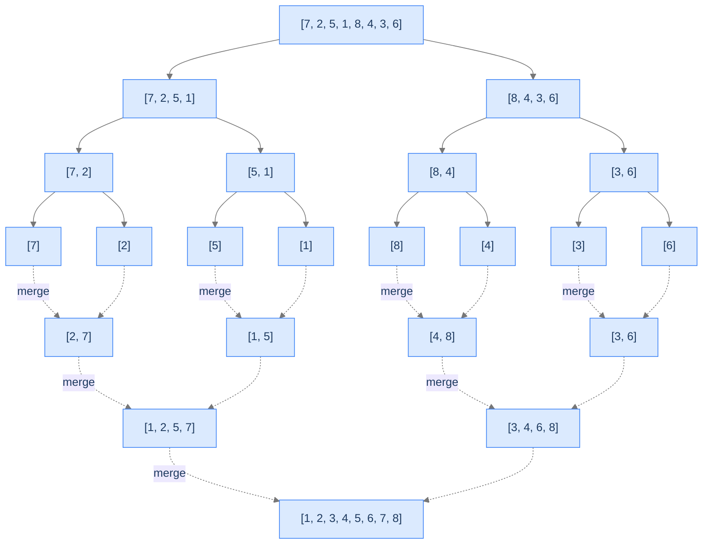

# 9. Merge Sort

Quicksort splits the array around a *value* (the pivot). Merge sort splits the array by *index* — straight down the middle. Recurse on each half. Then merge the two sorted halves into one sorted whole.

That's it. The split is trivially balanced (always `n/2` and `n/2`); the recursion depth is exactly `log n`; the merge step does `O(n)` work. Total: `O(n log n)`. **Worst case `O(n log n)`** — quicksort can degrade to `O(n²)` on unlucky pivots, but merge sort can't, because there's no pivot to be unlucky about.

The price for the predictability is `O(n)` extra memory — merge sort isn't in-place. The merge step writes the combined result into a temporary buffer before copying back. For most modern systems with abundant RAM, this is a fair trade for the worst-case guarantee.

By the end of this lesson you'll know the divide-merge structure, why merge sort is *stable* (the lone stable `O(n log n)` sort in this section), why it's the algorithm of choice for **external sorting** (data too big to fit in memory), and how the merge step alone solves the classic "count inversions" interview problem.

## Table of contents

1. [Understanding merge sort](#understanding-merge-sort)
2. [The merge step](#the-merge-step)
3. [Implementation](#implementation)
4. [Complexity analysis](#complexity-analysis)
5. [Merge sort problem](#merge-sort-problem)
6. [Count inversions](#count-inversions)

***

# Understanding Merge Sort

> **Course:** DSA › Algorithms › Sorting › Merge Sort

Merge sort follows the divide-and-conquer paradigm exactly:

1. **Divide** — split the array into two halves at the midpoint.
2. **Conquer** — recursively sort each half.
3. **Combine** — merge the two sorted halves into one sorted array.

Quicksort's interesting work happens in *divide* (the partition); merge sort's interesting work happens in *combine* (the merge). The split is trivial; the merge does all the heavy lifting.



<p align="center"><strong>Merge sort's recursion tree. Splits go down (solid arrows); merges come back up (dashed arrows). Each merge combines two sorted runs into one sorted run.</strong></p>

The recursion has `log n` levels. Each level does `O(n)` total work (the merges at that level collectively touch each element once). Total: `O(n log n)`.

---

## Why the Worst Case Is `O(n log n)`

Quicksort's worst case is `O(n²)` because a bad pivot can produce maximally unbalanced splits. Merge sort always splits at the midpoint — the split is guaranteed balanced. The recursion depth is *exactly* `log₂(n)`, no matter the input. There's no input that makes merge sort run in `O(n²)`.

This guarantee is why merge sort is preferred when worst-case time matters more than constant-factor speed: real-time systems, financial trading, anything with strict latency requirements.

---

## The Merge — Where the Magic Happens

Merging two sorted arrays into one sorted array can be done in `O(n + m)` time with a simple two-pointer scan:

1. Have two pointers, one for each input array.
2. Compare the elements they point to.
3. Take the smaller one, write it to the output, advance that pointer.
4. Repeat until one input is exhausted; copy the rest of the other.

```d2
direction: right

L: "Left = [1, 5, 7]" {style.fill: "#dbeafe"; style.stroke: "#3b82f6"}
R: "Right = [3, 4, 8]" {style.fill: "#fde68a"; style.stroke: "#d97706"}
M: "Merged = [1, 3, 4, 5, 7, 8]" {style.fill: "#bbf7d0"; style.stroke: "#16a34a"}

L -> M: pointer-walk
R -> M: pointer-walk
```

<p align="center"><strong>Merging two sorted arrays. One linear scan with two pointers; the smaller element wins each step.</strong></p>

This linear merge is what gives merge sort its `O(n)` per level and ultimately its `O(n log n)` total. It's also the part that requires `O(n)` auxiliary memory — we can't merge in place efficiently.

---

## Strengths and Limitations

| Strength | Detail |
|---|---|
| **`O(n log n)` worst case** | Guaranteed — no degenerate inputs. |
| **Stable** | Equal elements preserve their relative order (when the merge uses `<=` not `<`). |
| **Predictable performance** | Same time on every input shape. |
| **Parallelisable** | Each recursive call is independent — easy to split across cores. |
| **External sorting** | Works on data too big to fit in RAM (we'll discuss). |

| Limitation | Detail |
|---|---|
| **`O(n)` extra space** | Not in-place. Allocates an auxiliary array of size `n`. |
| **Larger constant factor than quicksort** | Slower in practice on random data despite the same `O(n log n)`. |
| **Recursive** | Stack depth `O(log n)`. |

In practice, merge sort is used:
1. When stability is required and `O(n log n)` is needed.
2. For **external sorting** — sorting datasets larger than memory by streaming through disk or cloud storage in chunks.
3. As the inner loop of **TimSort** (used in Python, Java, Rust) — TimSort is essentially merge sort with optimisations for partially-sorted data.
4. For sorting **linked lists** — quicksort's swap-heavy approach is awkward on linked lists; merge sort's pointer-rewiring works naturally.

---

## Key Takeaway

Merge sort: split in half, recurse, merge. `O(n log n)` worst case, stable, but `O(n)` extra space. The slow-but-steady `O(n log n)` sort. Now we'll formalise the merge step.

***

# The Merge Step

> **Course:** DSA › Algorithms › Sorting › Merge Sort

Merging two sorted arrays into one sorted array is a classic two-pointer algorithm.

## Algorithm

Given two sorted arrays `L` and `R`:

```
function merge(L, R):
    result = empty array of size |L| + |R|
    i = 0, j = 0, k = 0

    while i < |L| and j < |R|:
        if L[i] <= R[j]:           # ← `<=` makes the merge stable
            result[k++] = L[i++]
        else:
            result[k++] = R[j++]

    # Copy any remaining elements
    while i < |L|: result[k++] = L[i++]
    while j < |R|: result[k++] = R[j++]

    return result
```

The `<=` (not strict `<`) is what makes merge sort stable. When two equal elements appear (one in `L`, one in `R`), the one from `L` is written first — preserving the original relative order.

---

## A Walkthrough

`L = [1, 5, 7]`, `R = [3, 4, 8]`. Trace:

```
result = [], i=0, j=0
  L[0]=1 <= R[0]=3 → take 1, i++. result=[1]
  L[1]=5 vs R[0]=3 → take 3, j++. result=[1, 3]
  L[1]=5 vs R[1]=4 → take 4, j++. result=[1, 3, 4]
  L[1]=5 <= R[2]=8 → take 5, i++. result=[1, 3, 4, 5]
  L[2]=7 <= R[2]=8 → take 7, i++. result=[1, 3, 4, 5, 7]
  i exhausted, copy rest of R: result=[1, 3, 4, 5, 7, 8]
```

Six elements, six steps. `O(n + m)` time, `O(n + m)` space (for `result`).

---

## Why the Merge Is `O(n)` per Recursion Level

The key observation: at each level of the recursion tree, the merges collectively process every element exactly once. There are `log n` levels. Total work: `O(n) × log n = O(n log n)`.

```d2
direction: down

l0: "Level 0 — 1 merge of n/2 + n/2 elements = n work" {style.fill: "#dbeafe"; style.stroke: "#3b82f6"}
l1: "Level 1 — 2 merges of n/4 + n/4 elements each = n total work" {style.fill: "#fde68a"; style.stroke: "#d97706"}
l2: "Level 2 — 4 merges of n/8 + n/8 elements each = n total work" {style.fill: "#bbf7d0"; style.stroke: "#16a34a"}
ld: "..."
last: "Level log(n) — n merges of single elements = n total work"

l0 -> l1 -> l2 -> ld -> last
total: "Total: n × log(n) = O(n log n)"
last -> total
```

<p align="center"><strong>The recursion tree's per-level work. Each level processes <code>n</code> total elements across all its merges; there are <code>log n</code> levels; total <code>O(n log n)</code>.</strong></p>

---

## Key Takeaway

The merge step combines two sorted arrays in `O(n + m)` time with a two-pointer scan. Stable when `<=` is used. This is the algorithm's core operation; the recursion just sets up the merges. Now the implementation.

***

# Implementation

> **Course:** DSA › Algorithms › Sorting › Merge Sort

Two functions: `merge` (combines two sorted arrays) and `merge_sort` (the recursive driver).


```pseudocode
function mergeSort(arr):
    if length(arr) ≤ 1:
        return arr
    mid ← length(arr) ÷ 2
    left  ← mergeSort(arr[0..mid − 1])      # recursively sort each half
    right ← mergeSort(arr[mid..end])
    return merge(left, right)               # combine two sorted halves into one

function merge(left, right):
    result ← empty list
    i ← 0; j ← 0
    while i < length(left) AND j < length(right):
        if left[i] ≤ right[j]:              # ≤ keeps the sort stable
            append left[i] to result
            i ← i + 1
        else:
            append right[j] to result
            j ← j + 1
    append remaining elements of left and right to result
    return result
```

```python run
from typing import List

class Solution:
    def merge_sort(self, arr: List[int]) -> List[int]:
        if len(arr) <= 1:
            return arr
        mid = len(arr) // 2
        left = self.merge_sort(arr[:mid])
        right = self.merge_sort(arr[mid:])
        return self._merge(left, right)

    def _merge(self, left: List[int], right: List[int]) -> List[int]:
        result: List[int] = []
        i = j = 0
        while i < len(left) and j < len(right):
            if left[i] <= right[j]:                   # `<=` for stability
                result.append(left[i]); i += 1
            else:
                result.append(right[j]); j += 1
        result.extend(left[i:])
        result.extend(right[j:])
        return result


if __name__ == "__main__":
    print(Solution().merge_sort([7, 2, 5, 1, 8, 4, 3, 6]))   # [1, 2, 3, 4, 5, 6, 7, 8]
```

```java run
import java.util.Arrays;

public class Solution {
    public int[] mergeSort(int[] arr) {
        if (arr.length <= 1) return arr;
        int mid = arr.length / 2;
        int[] left = mergeSort(Arrays.copyOfRange(arr, 0, mid));
        int[] right = mergeSort(Arrays.copyOfRange(arr, mid, arr.length));
        return merge(left, right);
    }

    private int[] merge(int[] left, int[] right) {
        int[] result = new int[left.length + right.length];
        int i = 0, j = 0, k = 0;
        while (i < left.length && j < right.length) {
            if (left[i] <= right[j]) result[k++] = left[i++];
            else result[k++] = right[j++];
        }
        while (i < left.length) result[k++] = left[i++];
        while (j < right.length) result[k++] = right[j++];
        return result;
    }

    public static void main(String[] args) {
        int[] r = new Solution().mergeSort(new int[]{7, 2, 5, 1, 8, 4, 3, 6});
        for (int x : r) System.out.print(x + " ");
        System.out.println();
    }
}
```

```c run
#include <stdio.h>
#include <stdlib.h>
#include <string.h>

void merge(int *arr, int left, int mid, int right, int *temp) {
    int i = left, j = mid + 1, k = left;
    while (i <= mid && j <= right) {
        if (arr[i] <= arr[j]) temp[k++] = arr[i++];
        else temp[k++] = arr[j++];
    }
    while (i <= mid) temp[k++] = arr[i++];
    while (j <= right) temp[k++] = arr[j++];
    for (int t = left; t <= right; t++) arr[t] = temp[t];
}

void merge_sort_helper(int *arr, int left, int right, int *temp) {
    if (left >= right) return;
    int mid = left + (right - left) / 2;
    merge_sort_helper(arr, left, mid, temp);
    merge_sort_helper(arr, mid + 1, right, temp);
    merge(arr, left, mid, right, temp);
}

void merge_sort(int *arr, int n) {
    int *temp = (int *) malloc(n * sizeof(int));
    merge_sort_helper(arr, 0, n - 1, temp);
    free(temp);
}

int main(void) {
    int arr[] = {7, 2, 5, 1, 8, 4, 3, 6};
    int n = 8;
    merge_sort(arr, n);
    for (int i = 0; i < n; i++) printf("%d ", arr[i]);
    printf("\n");
    return 0;
}
```

```cpp run
#include <iostream>
#include <vector>

class Solution {
public:
    std::vector<int> mergeSort(std::vector<int>& arr) {
        if (arr.size() <= 1) return arr;
        int mid = (int) arr.size() / 2;
        std::vector<int> left(arr.begin(), arr.begin() + mid);
        std::vector<int> right(arr.begin() + mid, arr.end());
        left = mergeSort(left);
        right = mergeSort(right);
        return merge(left, right);
    }

    std::vector<int> merge(std::vector<int>& left, std::vector<int>& right) {
        std::vector<int> result;
        result.reserve(left.size() + right.size());
        int i = 0, j = 0;
        while (i < (int) left.size() && j < (int) right.size()) {
            if (left[i] <= right[j]) result.push_back(left[i++]);
            else result.push_back(right[j++]);
        }
        while (i < (int) left.size()) result.push_back(left[i++]);
        while (j < (int) right.size()) result.push_back(right[j++]);
        return result;
    }
};

int main() {
    std::vector<int> arr = {7, 2, 5, 1, 8, 4, 3, 6};
    auto r = Solution{}.mergeSort(arr);
    for (int x : r) std::cout << x << ' ';
    std::cout << '\n';
}
```

```scala run
class Solution {
  def mergeSort(arr: Array[Int]): Array[Int] = {
    if (arr.length <= 1) return arr
    val mid = arr.length / 2
    val left = mergeSort(arr.slice(0, mid))
    val right = mergeSort(arr.slice(mid, arr.length))
    merge(left, right)
  }

  private def merge(left: Array[Int], right: Array[Int]): Array[Int] = {
    val result = new Array[Int](left.length + right.length)
    var i = 0; var j = 0; var k = 0
    while (i < left.length && j < right.length) {
      if (left(i) <= right(j)) { result(k) = left(i); i += 1 }
      else { result(k) = right(j); j += 1 }
      k += 1
    }
    while (i < left.length) { result(k) = left(i); i += 1; k += 1 }
    while (j < right.length) { result(k) = right(j); j += 1; k += 1 }
    result
  }
}

object Main {
  def main(args: Array[String]): Unit = {
    println(new Solution().mergeSort(Array(7, 2, 5, 1, 8, 4, 3, 6)).mkString(" "))
  }
}
```

```typescript run
class Solution {
    mergeSort(arr: number[]): number[] {
        if (arr.length <= 1) return arr;
        const mid = Math.floor(arr.length / 2);
        const left = this.mergeSort(arr.slice(0, mid));
        const right = this.mergeSort(arr.slice(mid));
        return this._merge(left, right);
    }

    private _merge(left: number[], right: number[]): number[] {
        const result: number[] = [];
        let i = 0, j = 0;
        while (i < left.length && j < right.length) {
            if (left[i] <= right[j]) result.push(left[i++]);
            else result.push(right[j++]);
        }
        return result.concat(left.slice(i)).concat(right.slice(j));
    }
}

console.log(new Solution().mergeSort([7, 2, 5, 1, 8, 4, 3, 6]));
```

```go run
package main

import "fmt"

func merge(left, right []int) []int {
    result := make([]int, 0, len(left)+len(right))
    i, j := 0, 0
    for i < len(left) && j < len(right) {
        if left[i] <= right[j] {
            result = append(result, left[i])
            i++
        } else {
            result = append(result, right[j])
            j++
        }
    }
    result = append(result, left[i:]...)
    result = append(result, right[j:]...)
    return result
}

func mergeSort(arr []int) []int {
    if len(arr) <= 1 {
        return arr
    }
    mid := len(arr) / 2
    left := mergeSort(append([]int{}, arr[:mid]...))
    right := mergeSort(append([]int{}, arr[mid:]...))
    return merge(left, right)
}

func main() {
    fmt.Println(mergeSort([]int{7, 2, 5, 1, 8, 4, 3, 6}))
}
```

```rust run
fn merge(left: &[i32], right: &[i32]) -> Vec<i32> {
    let mut result = Vec::with_capacity(left.len() + right.len());
    let (mut i, mut j) = (0, 0);
    while i < left.len() && j < right.len() {
        if left[i] <= right[j] {
            result.push(left[i]); i += 1;
        } else {
            result.push(right[j]); j += 1;
        }
    }
    result.extend_from_slice(&left[i..]);
    result.extend_from_slice(&right[j..]);
    result
}

fn merge_sort(arr: Vec<i32>) -> Vec<i32> {
    if arr.len() <= 1 { return arr; }
    let mid = arr.len() / 2;
    let left = merge_sort(arr[..mid].to_vec());
    let right = merge_sort(arr[mid..].to_vec());
    merge(&left, &right)
}

fn main() {
    println!("{:?}", merge_sort(vec![7, 2, 5, 1, 8, 4, 3, 6]));
}
```


***

# Complexity Analysis

> **Course:** DSA › Algorithms › Sorting › Merge Sort

| Resource | Best | Average | Worst |
|---|---|---|---|
| **Time** | `O(n log n)` | `O(n log n)` | `O(n log n)` |
| **Space (auxiliary)** | `O(n)` | `O(n)` | `O(n)` |
| **Space (stack)** | `O(log n)` | `O(log n)` | `O(log n)` |
| **Stability** | ✓ | ✓ | ✓ |
| **In-place** | ✗ | ✗ | ✗ |

The time complexity is `O(n log n)` *unconditionally*. Best, average, and worst cases all have the same shape — the recursion tree always has `log n` levels and each level does `O(n)` work. No input can degrade merge sort.

The space complexity is `O(n)` for the auxiliary buffers used in merging plus `O(log n)` for the recursion stack — total `O(n)`.

---

## When to Choose Merge Sort

| Scenario | Why merge sort wins |
|---|---|
| Worst-case `O(n log n)` is required | Quicksort can degrade; merge sort can't. |
| Stability matters | One of the few `O(n log n)` stable sorts. |
| Sorting linked lists | No need for random-access pointer arithmetic; merge step works naturally on linked lists. |
| External sorting (data > RAM) | Read chunks, sort, write to disk, merge sorted chunks. The classic disk-friendly sort. |
| Parallel sorting | Recursive halves are independent; trivially parallelisable across cores or machines. |

| Scenario | Why merge sort loses |
|---|---|
| Memory is constrained | `O(n)` extra memory may be unavailable. |
| Random-access in-place is preferred | Quicksort wins on memory and cache. |
| Constant factor matters | Quicksort has a smaller constant on random data. |

---

## External Sorting — Sorting Bigger Than RAM

Imagine you have a 100 GB log file to sort and only 16 GB of RAM. You can't load the file into memory and call `sort()`. The classic solution is **external merge sort**:

1. Read the file in chunks of, say, 8 GB.
2. Sort each chunk in memory and write it back to disk as a sorted "run."
3. After processing the whole file, you have ~13 sorted runs on disk.
4. Use a multi-way merge (k-way generalisation of the two-way merge) to combine the runs into one sorted output, streaming through disk.

This is how databases like PostgreSQL handle `ORDER BY` on tables larger than memory. It's also how MapReduce and Spark's shuffle phase work. The fundamental algorithm hasn't changed since the 1960s.

---

## Key Takeaway

Merge sort: `O(n log n)` worst case, stable, `O(n)` extra space. The slow-but-steady choice; the engine of external sorting; the foundation of TimSort. Now the canonical exercise.

***

# Merge Sort Problem

> **Course:** DSA › Algorithms › Sorting › Merge Sort

---

## The Problem

Given an integer array `arr`, return a new array sorted in non-decreasing order using merge sort. (Returns a new array; does not modify the input — merge sort is naturally out-of-place.)

```
Input:  arr = [2, 3, 2, 1, 5, 6]
Output: [1, 2, 2, 3, 5, 6]

Input:  arr = [6, 5, 4, 4, 4, 3, 2, 1]
Output: [1, 2, 3, 4, 4, 4, 5, 6]   (the four 4s preserve their relative input order — stable)

Input:  arr = [1, 2, 3, 4, 5, 6]
Output: [1, 2, 3, 4, 5, 6]
```

---

## The Solution

The implementation is identical to the version above. See [Implementation](#implementation) for all 10 languages.

---

## Edge Cases

| Case | Example | Expected |
|---|---|---|
| Empty | `[]` | `[]` (base case fires immediately). |
| Single element | `[7]` | `[7]`. |
| All equal | `[3, 3, 3, 3]` | `[3, 3, 3, 3]` — `<=` keeps stable. |
| Already sorted | `[1, 2, 3]` | `[1, 2, 3]` (still does full `O(n log n)` work). |
| Reverse sorted | `[5, 4, 3, 2, 1]` | `[1, 2, 3, 4, 5]`. |

---

# Count Inversions

> **Course:** DSA › Algorithms › Sorting › Merge Sort

A classic problem that uses merge sort's *merge* step alone — and shows why merge sort's structure is more useful than just sorting.

---

## The Problem

Given an integer array `arr`, count the number of **inversions**. An inversion is a pair `(i, j)` with `i < j` and `arr[i] > arr[j]`. Solve it in `O(n log n)` time.

```
Input:  arr = [1, 10, 5, 3, 4]
Output: 5
Explanation: pairs are (10,5), (10,3), (10,4), (5,3), (5,4) — five inversions

Input:  arr = [1, 3, 2, 4, 5]
Output: 1   (just (3, 2))

Input:  arr = [1, 2, 3, 4, 5]
Output: 0   (sorted, no inversions)
```

---

## Why Merge Sort Solves This

The naive `O(n²)` algorithm: nested loops, count pairs where `arr[i] > arr[j]` for `i < j`. Works but slow.

Merge sort does it in `O(n log n)` because the merge step *naturally* counts inversions. When merging `left` and `right`:
- If `left[i] <= right[j]`, no inversions to count for this pair (left element comes before right element in sorted order, which matches their original order — left half is to the left of right half).
- If `left[i] > right[j]`, then `right[j]` is smaller than every remaining element in `left` (because `left` is sorted). All those elements are inversions with `right[j]`. Count = `len(left) - i`.

Add up the inversions counted across all merges; that's the total.

```d2
direction: down

input: "Input: [3, 1, 4, 2]" {style.fill: "#dbeafe"; style.stroke: "#3b82f6"}
split: "Split: [3, 1] and [4, 2]"
sub1: "Sort [3, 1] → [1, 3] (1 inversion)"
sub2: "Sort [4, 2] → [2, 4] (1 inversion)"
final_merge: "Merge [1, 3] with [2, 4]:\n1<=2 → take 1\n3>2 → take 2, +1 inversion (3 still in left)\n3<=4 → take 3\n→ take 4\nMerged: [1, 2, 3, 4]\nLocal inversions: 1"
total: "Total inversions: 1 + 1 + 1 = 3" {style.fill: "#bbf7d0"; style.stroke: "#16a34a"}

input -> split -> sub1
split -> sub2
sub1 -> final_merge
sub2 -> final_merge
final_merge -> total
```

<p align="center"><strong>Counting inversions during merge sort. Each merge counts the inversions <em>between</em> its two halves; recursion handles inversions within each half.</strong></p>

---

## The Algorithm

```
function merge_count(arr, temp, left, right):
    inversions = 0
    if left < right:
        mid = (left + right) / 2
        inversions += merge_count(arr, temp, left, mid)
        inversions += merge_count(arr, temp, mid + 1, right)
        inversions += merge_and_count(arr, temp, left, mid, right)
    return inversions

function merge_and_count(arr, temp, left, mid, right):
    i = left, j = mid + 1, k = left, count = 0
    while i <= mid and j <= right:
        if arr[i] <= arr[j]:
            temp[k++] = arr[i++]
        else:
            temp[k++] = arr[j++]
            count += mid - i + 1     # all remaining in left are > arr[j]
    while i <= mid: temp[k++] = arr[i++]
    while j <= right: temp[k++] = arr[j++]
    copy temp[left..right] back to arr[left..right]
    return count
```

---

## The Solution


```pseudocode
function countInversions(arr):
    temp ← list of length(arr) zeros
    return sortAndCount(arr, temp, 0, length(arr) − 1)

function sortAndCount(arr, temp, left, right):
    if left ≥ right:
        return 0
    mid ← (left + right) ÷ 2
    inv ← sortAndCount(arr, temp, left, mid)               # inversions inside the left half
    inv ← inv + sortAndCount(arr, temp, mid + 1, right)    # inversions inside the right half
    inv ← inv + mergeAndCount(arr, temp, left, mid, right) # cross-half inversions
    return inv

function mergeAndCount(arr, temp, left, mid, right):
    i ← left; j ← mid + 1; k ← left; inv ← 0
    while i ≤ mid AND j ≤ right:
        if arr[i] ≤ arr[j]:
            temp[k] ← arr[i]; i ← i + 1
        else:
            temp[k] ← arr[j]; j ← j + 1
            inv ← inv + (mid − i + 1)         # arr[i..mid] all > arr[j] → that many inversions at once
        k ← k + 1
    copy remaining of arr[i..mid] and arr[j..right] into temp[k..]
    copy temp[left..right] back into arr[left..right]
    return inv
```

```python run
from typing import List

class Solution:
    def count_inversions(self, arr: List[int]) -> int:
        temp = [0] * len(arr)
        return self._sort_count(arr, temp, 0, len(arr) - 1)

    def _sort_count(self, arr: List[int], temp: List[int], left: int, right: int) -> int:
        if left >= right: return 0
        mid = (left + right) // 2
        inv = self._sort_count(arr, temp, left, mid)
        inv += self._sort_count(arr, temp, mid + 1, right)
        inv += self._merge_count(arr, temp, left, mid, right)
        return inv

    def _merge_count(self, arr: List[int], temp: List[int], left: int, mid: int, right: int) -> int:
        i, j, k, count = left, mid + 1, left, 0
        while i <= mid and j <= right:
            if arr[i] <= arr[j]:
                temp[k] = arr[i]; i += 1
            else:
                temp[k] = arr[j]; j += 1
                count += mid - i + 1
            k += 1
        while i <= mid: temp[k] = arr[i]; i += 1; k += 1
        while j <= right: temp[k] = arr[j]; j += 1; k += 1
        for t in range(left, right + 1):
            arr[t] = temp[t]
        return count


if __name__ == "__main__":
    print(Solution().count_inversions([1, 10, 5, 3, 4]))   # 5
```

```java run
public class Solution {
    public int countInversions(int[] arr) {
        int[] temp = new int[arr.length];
        return sortCount(arr, temp, 0, arr.length - 1);
    }

    private int sortCount(int[] arr, int[] temp, int left, int right) {
        if (left >= right) return 0;
        int mid = (left + right) / 2;
        int inv = sortCount(arr, temp, left, mid);
        inv += sortCount(arr, temp, mid + 1, right);
        inv += mergeCount(arr, temp, left, mid, right);
        return inv;
    }

    private int mergeCount(int[] arr, int[] temp, int left, int mid, int right) {
        int i = left, j = mid + 1, k = left, count = 0;
        while (i <= mid && j <= right) {
            if (arr[i] <= arr[j]) temp[k++] = arr[i++];
            else { temp[k++] = arr[j++]; count += mid - i + 1; }
        }
        while (i <= mid) temp[k++] = arr[i++];
        while (j <= right) temp[k++] = arr[j++];
        for (int t = left; t <= right; t++) arr[t] = temp[t];
        return count;
    }
}
```

```c run
#include <stdio.h>
#include <stdlib.h>

int merge_count(int *arr, int *temp, int left, int mid, int right) {
    int i = left, j = mid + 1, k = left, count = 0;
    while (i <= mid && j <= right) {
        if (arr[i] <= arr[j]) temp[k++] = arr[i++];
        else { temp[k++] = arr[j++]; count += mid - i + 1; }
    }
    while (i <= mid) temp[k++] = arr[i++];
    while (j <= right) temp[k++] = arr[j++];
    for (int t = left; t <= right; t++) arr[t] = temp[t];
    return count;
}

int sort_count(int *arr, int *temp, int left, int right) {
    if (left >= right) return 0;
    int mid = (left + right) / 2;
    int inv = sort_count(arr, temp, left, mid);
    inv += sort_count(arr, temp, mid + 1, right);
    inv += merge_count(arr, temp, left, mid, right);
    return inv;
}

int count_inversions(int *arr, int n) {
    int *temp = (int *) malloc(n * sizeof(int));
    int r = sort_count(arr, temp, 0, n - 1);
    free(temp);
    return r;
}
```

```cpp run
#include <vector>

class Solution {
public:
    int countInversions(std::vector<int>& arr) {
        std::vector<int> temp(arr.size());
        return sortCount(arr, temp, 0, (int) arr.size() - 1);
    }

    int sortCount(std::vector<int>& arr, std::vector<int>& temp, int left, int right) {
        if (left >= right) return 0;
        int mid = (left + right) / 2;
        int inv = sortCount(arr, temp, left, mid);
        inv += sortCount(arr, temp, mid + 1, right);
        inv += mergeCount(arr, temp, left, mid, right);
        return inv;
    }

    int mergeCount(std::vector<int>& arr, std::vector<int>& temp, int left, int mid, int right) {
        int i = left, j = mid + 1, k = left, count = 0;
        while (i <= mid && j <= right) {
            if (arr[i] <= arr[j]) temp[k++] = arr[i++];
            else { temp[k++] = arr[j++]; count += mid - i + 1; }
        }
        while (i <= mid) temp[k++] = arr[i++];
        while (j <= right) temp[k++] = arr[j++];
        for (int t = left; t <= right; t++) arr[t] = temp[t];
        return count;
    }
};
```

```scala run
class Solution {
  def countInversions(arr: Array[Int]): Int = {
    val temp = new Array[Int](arr.length)
    sortCount(arr, temp, 0, arr.length - 1)
  }

  private def sortCount(arr: Array[Int], temp: Array[Int], left: Int, right: Int): Int = {
    if (left >= right) return 0
    val mid = (left + right) / 2
    var inv = sortCount(arr, temp, left, mid)
    inv += sortCount(arr, temp, mid + 1, right)
    inv += mergeCount(arr, temp, left, mid, right)
    inv
  }

  private def mergeCount(arr: Array[Int], temp: Array[Int], left: Int, mid: Int, right: Int): Int = {
    var i = left; var j = mid + 1; var k = left; var count = 0
    while (i <= mid && j <= right) {
      if (arr(i) <= arr(j)) { temp(k) = arr(i); i += 1 }
      else { temp(k) = arr(j); j += 1; count += mid - i + 1 }
      k += 1
    }
    while (i <= mid) { temp(k) = arr(i); i += 1; k += 1 }
    while (j <= right) { temp(k) = arr(j); j += 1; k += 1 }
    for (t <- left to right) arr(t) = temp(t)
    count
  }
}
```

```typescript run
class Solution {
    countInversions(arr: number[]): number {
        const temp: number[] = new Array(arr.length);
        return this._sortCount(arr, temp, 0, arr.length - 1);
    }

    private _sortCount(arr: number[], temp: number[], left: number, right: number): number {
        if (left >= right) return 0;
        const mid = (left + right) >> 1;
        let inv = this._sortCount(arr, temp, left, mid);
        inv += this._sortCount(arr, temp, mid + 1, right);
        inv += this._mergeCount(arr, temp, left, mid, right);
        return inv;
    }

    private _mergeCount(arr: number[], temp: number[], left: number, mid: number, right: number): number {
        let i = left, j = mid + 1, k = left, count = 0;
        while (i <= mid && j <= right) {
            if (arr[i] <= arr[j]) temp[k++] = arr[i++];
            else { temp[k++] = arr[j++]; count += mid - i + 1; }
        }
        while (i <= mid) temp[k++] = arr[i++];
        while (j <= right) temp[k++] = arr[j++];
        for (let t = left; t <= right; t++) arr[t] = temp[t];
        return count;
    }
}
```

```go run
package main

func mergeCount(arr, temp []int, left, mid, right int) int {
    i, j, k, count := left, mid+1, left, 0
    for i <= mid && j <= right {
        if arr[i] <= arr[j] {
            temp[k] = arr[i]
            i++
        } else {
            temp[k] = arr[j]
            j++
            count += mid - i + 1
        }
        k++
    }
    for i <= mid {
        temp[k] = arr[i]
        i++
        k++
    }
    for j <= right {
        temp[k] = arr[j]
        j++
        k++
    }
    for t := left; t <= right; t++ {
        arr[t] = temp[t]
    }
    return count
}

func sortCount(arr, temp []int, left, right int) int {
    if left >= right { return 0 }
    mid := (left + right) / 2
    inv := sortCount(arr, temp, left, mid)
    inv += sortCount(arr, temp, mid+1, right)
    inv += mergeCount(arr, temp, left, mid, right)
    return inv
}

func countInversions(arr []int) int {
    temp := make([]int, len(arr))
    return sortCount(arr, temp, 0, len(arr)-1)
}
```

```rust run
fn merge_count(arr: &mut [i32], temp: &mut [i32], left: usize, mid: usize, right: usize) -> i64 {
    let mut i = left; let mut j = mid + 1; let mut k = left; let mut count: i64 = 0;
    while i <= mid && j <= right {
        if arr[i] <= arr[j] { temp[k] = arr[i]; i += 1; }
        else { temp[k] = arr[j]; j += 1; count += (mid - i + 1) as i64; }
        k += 1;
    }
    while i <= mid { temp[k] = arr[i]; i += 1; k += 1; }
    while j <= right { temp[k] = arr[j]; j += 1; k += 1; }
    for t in left..=right { arr[t] = temp[t]; }
    count
}

fn sort_count(arr: &mut [i32], temp: &mut [i32], left: usize, right: usize) -> i64 {
    if left >= right { return 0; }
    let mid = (left + right) / 2;
    let mut inv = sort_count(arr, temp, left, mid);
    inv += sort_count(arr, temp, mid + 1, right);
    inv += merge_count(arr, temp, left, mid, right);
    inv
}

fn count_inversions(arr: &mut Vec<i32>) -> i64 {
    let n = arr.len();
    if n == 0 { return 0; }
    let mut temp = vec![0i32; n];
    sort_count(arr, &mut temp, 0, n - 1)
}
```


---

## Complexity

`O(n log n)` time, `O(n)` space — the same as merge sort itself, since this *is* merge sort with a counter.

The naive `O(n²)` algorithm is to count pairs with nested loops. Merge sort beats it by using the structure of the recursion to count inversions during the merge.

---

## Why This Pattern Generalises

The merge step alone is a primitive that solves several problems related to "count something between two halves." Variations include:
- **Reverse pairs** (count `(i, j)` where `i < j` and `arr[i] > 2 * arr[j]`).
- **Range count** (count elements in a range across the merge).
- **Closest pair** (the classic divide-and-conquer geometry problem uses a merge-style scan).

Anytime you have a "count something across the divide" problem, ask whether merge sort's structure can help. Often it can — and the resulting algorithm is `O(n log n)` instead of `O(n²)`.

---

## Final Takeaway

Merge sort is the predictable `O(n log n)` sort: stable, worst-case guaranteed, foundation of TimSort and external sorting. The `O(n)` extra space is the trade-off. Beyond sorting, the merge step is a primitive that solves a whole family of "across the divide" problems — count inversions is the classic example, but the technique generalises.

The next algorithm — **heapsort** — is the third major `O(n log n)` comparison sort. It's in-place (unlike merge sort) and worst-case `O(n log n)` (unlike quicksort) — the best of both worlds in those specific dimensions. The trade-off is that it's not stable and has worse cache behaviour. We'll see why and when each `O(n log n)` sort wins.

**Transfer challenge — try before the Heapsort lesson:** Write a merge sort that *reverses* the comparison: descending order. (Hint: change one operator.) Then think: does the count-inversions algorithm still work? Why or why not?

<details>
<summary><strong>Answer — open after you've thought about it</strong></summary>

For descending order, change `if left[i] <= right[j]` to `if left[i] >= right[j]`. The algorithm structure is unchanged.

But the inversions counter doesn't directly translate — for descending sort, "inversion" would mean `arr[i] < arr[j]` for `i < j`. The same algorithm with the flipped comparison counts those instead. **The general pattern**: merge sort with comparison `f(left, right)` counts pairs that would violate the sort order `f` provides.

This generalisation is why merge sort is the building block for many "count something across pairs" problems. Pick the right comparison; the merge step gives you the count. **You just unlocked half a dozen interview problems that are merge-sort variants in disguise.**

</details>
