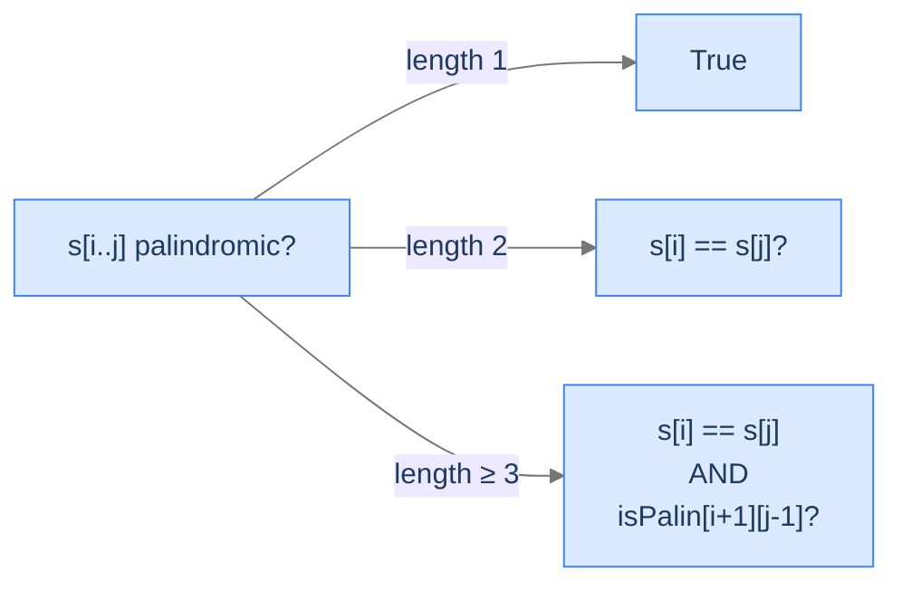

# 7. Longest Palindromic Substring

The previous lesson found the longest palindromic *subsequence* — characters that read the same backward, gaps allowed. **Substring** is the contiguous version: the palindrome must be a continuous slice of the original string. The two-character difference between "subsequence" and "substring" changes everything: now we need a *boolean* table — "is this slice a palindrome?" — and then the longest contiguous palindrome falls out.

By the end of this lesson you'll know the **Longest Palindromic Substring** recurrence (`isPalin[i][j] = (s[i] == s[j]) and isPalin[i+1][j-1]`), how to track the longest palindrome's length and start position as the table fills, and how the same problem can be solved in `O(n²)` time with `O(1)` extra space using the "expand around center" trick.

## Table of contents

1. [The Palindromic-Substring Problem](#the-palindromic-substring-problem)
2. [The `isPalindrome` Recurrence](#the-ispalindrome-recurrence)
3. [Longest Palindromic Substring](#longest-palindromic-substring)
4. [Alternate: Expand Around Center](#alternate-expand-around-center)

***

# The Palindromic-Substring Problem

> **Course:** DSA › Algorithms › Dynamic Programming › LPSubstr

Given a string `s`, find the longest substring (contiguous) that is itself a palindrome.

```d2
direction: right
ex: "Example: s = 'forgeeksskeegfor'" {
  grid-rows: 2
  grid-columns: 16
  grid-gap: 0
  c0: "f"
  c1: "o"
  c2: "r"
  c3: "g" {style.fill: "#fde68a"; style.stroke: "#d97706"}
  c4: "e" {style.fill: "#fde68a"; style.stroke: "#d97706"}
  c5: "e" {style.fill: "#fde68a"; style.stroke: "#d97706"}
  c6: "k" {style.fill: "#fde68a"; style.stroke: "#d97706"}
  c7: "s" {style.fill: "#fde68a"; style.stroke: "#d97706"}
  c8: "s" {style.fill: "#fde68a"; style.stroke: "#d97706"}
  c9: "k" {style.fill: "#fde68a"; style.stroke: "#d97706"}
  c10:"e" {style.fill: "#fde68a"; style.stroke: "#d97706"}
  c11:"e" {style.fill: "#fde68a"; style.stroke: "#d97706"}
  c12:"g" {style.fill: "#fde68a"; style.stroke: "#d97706"}
  c13:"f"
  c14:"o"
  c15:"r"
  l0: "[0]"
  l1: "[1]"
  l2: "[2]"
  l3: "[3]"
  l4: "[4]"
  l5: "[5]"
  l6: "[6]"
  l7: "[7]"
  l8: "[8]"
  l9: "[9]"
  l10:"[10]"
  l11:"[11]"
  l12:"[12]"
  l13:"[13]"
  l14:"[14]"
  l15:"[15]"
}
```

<p align="center"><strong>The longest palindromic substring of <code>"forgeeksskeegfor"</code> is <code>"geeksskeeg"</code> (length 10), spanning indices [3..12]. The characters must be contiguous — no gaps — to count as a substring.</strong></p>

> *Predict before reading on — for <code>s = "babad"</code>, what's the LPSubstr?</em>

`"bab"` or `"aba"` — both are length 3. Either is correct.

---

## Key Takeaway

LPSubstr requires contiguity. Brute force (check all `O(n²)` substrings, palindromicity check `O(n)`) is `O(n³)`. DP brings it to `O(n²)`.

***

# The `isPalindrome` Recurrence

> **Course:** DSA › Algorithms › Dynamic Programming › LPSubstr

Define `isPalin[i][j]` = `True` if `s[i..j]` is a palindrome, `False` otherwise. Three cases:

- **Length 1** (`i == j`): always palindromic. `isPalin[i][i] = True`.
- **Length 2** (`j == i + 1`): palindromic iff `s[i] == s[j]`.
- **Length ≥ 3**: palindromic iff `s[i] == s[j]` *and* `isPalin[i+1][j-1]` is `True`.



<p align="center"><strong>Three sub-cases of the palindromic-substring check. Length 1: always true. Length 2: endpoint equality. Length ≥ 3: endpoints equal AND interior is palindromic.</strong></p>

Once the table is full, the answer is the longest range `(i, j)` with `isPalin[i][j] == True`.

## Why an Inner Substring Has to Be Palindromic Too

Imagine a palindrome of length 7. Strip the first and last characters — the result is still a palindrome (length 5). Strip again — still palindromic (length 3). The recursion bottoms out at length 1 or 2. So if `s[i..j]` is a palindrome and longer than 2, *its interior* `s[i+1..j-1]` must also be palindromic. This is exactly what the recurrence checks.

---

## Key Takeaway

Substring palindromicity is a single-bit predicate that propagates inward. Filling order is by length; the answer is the longest range marked `True`.

***

# Longest Palindromic Substring

> **Course:** DSA › Algorithms › Dynamic Programming › LPSubstr

## The Problem

Given a string `s`, return its longest palindromic substring (any one is acceptable on ties).

```
Input:  s = "babad"
Output: "bab"   (or "aba")

Input:  s = "cbbd"
Output: "bb"

Input:  s = "forgeeksskeegfor"
Output: "geeksskeeg"
```

---

## Applying the Diagnostic Questions

| # | Question | Answer |
|---|---|---|
| **Q1** | Optimal substructure? | **Yes** — interior must be palindromic. |
| **Q2** | Overlapping subproblems? | **Yes** — `(i+1, j-1)` is reached from many `(i, j)`. |
| **Q3** | 2D state? | **Yes** — `(i, j)` substring range. |
| **Q4** | Filling order? | **By length, ascending** — same as LPS. |

### Q1 — Why "Yes"?

**Mental model.** A palindrome is recursively defined: it's empty (length 0), a single character (length 1), or two equal endpoints surrounding a smaller palindrome.

**Concrete numbers.** For `"abba"`: outer pair `('a', 'a')` matches; inner `"bb"` is also a palindrome → `"abba"` is palindromic.

**What breaks otherwise.** If we required only endpoint equality (no inner check), `"abca"` would be considered a palindrome — wrong.

---

## The Solution

Track the longest palindrome's length and start position as the table fills.


```pseudocode
# isPalin[i][j] = true iff s[i..j] is a palindrome. Track the longest run as we fill the table.
function longestPalindromicSubstring(s):
    n ← length(s)
    if n = 0: return ""
    isPalin ← n × n grid of false
    bestStart ← 0
    bestLen ← 1

    # Length 1 — diagonals.
    for i from 0 to n − 1: isPalin[i][i] ← true
    # Length 2.
    for i from 0 to n − 2:
        if s[i] = s[i + 1]:
            isPalin[i][i + 1] ← true
            if bestLen < 2:
                bestStart ← i; bestLen ← 2
    # Length ≥ 3 — fill in increasing-length order so the interior is ready.
    for length from 3 to n:
        for i from 0 to n − length:
            j ← i + length − 1
            if s[i] = s[j] AND isPalin[i + 1][j − 1]:
                isPalin[i][j] ← true
                if length > bestLen:
                    bestStart ← i; bestLen ← length
    return substring of s from bestStart to bestStart + bestLen − 1
```

```python run
from typing import List

class Solution:
    def longest_palindromic_substring(self, s: str) -> str:
        n = len(s)
        if n == 0:
            return ""
        # is_palin[i][j] = True iff s[i..j] is a palindrome.
        is_palin: List[List[bool]] = [[False] * n for _ in range(n)]
        best_start = 0
        best_len = 1                              # Single char always works
        # Length 1
        for i in range(n):
            is_palin[i][i] = True
        # Length 2
        for i in range(n - 1):
            if s[i] == s[i + 1]:
                is_palin[i][i + 1] = True
                if best_len < 2:
                    best_start, best_len = i, 2
        # Length ≥ 3 — fill in increasing-length order
        for length in range(3, n + 1):
            for i in range(n - length + 1):
                j = i + length - 1
                if s[i] == s[j] and is_palin[i + 1][j - 1]:
                    is_palin[i][j] = True
                    if length > best_len:
                        best_start, best_len = i, length
        return s[best_start : best_start + best_len]


if __name__ == "__main__":
    print(Solution().longest_palindromic_substring("forgeeksskeegfor"))   # "geeksskeeg"
```

```java run
public class Solution {
    public String longestPalindromicSubstring(String s) {
        int n = s.length();
        if (n == 0) return "";
        boolean[][] isPalin = new boolean[n][n];
        int bestStart = 0, bestLen = 1;
        for (int i = 0; i < n; i++) isPalin[i][i] = true;
        for (int i = 0; i < n - 1; i++) {
            if (s.charAt(i) == s.charAt(i + 1)) {
                isPalin[i][i + 1] = true;
                if (bestLen < 2) { bestStart = i; bestLen = 2; }
            }
        }
        for (int len = 3; len <= n; len++) {
            for (int i = 0; i <= n - len; i++) {
                int j = i + len - 1;
                if (s.charAt(i) == s.charAt(j) && isPalin[i + 1][j - 1]) {
                    isPalin[i][j] = true;
                    if (len > bestLen) { bestStart = i; bestLen = len; }
                }
            }
        }
        return s.substring(bestStart, bestStart + bestLen);
    }

    public static void main(String[] args) {
        System.out.println(new Solution().longestPalindromicSubstring("forgeeksskeegfor"));
    }
}
```

```c run
#include <stdio.h>
#include <string.h>
#include <stdbool.h>

bool is_palin[1001][1001];
char out_buf[1001];

const char *longest_palindromic_substring(const char *s) {
    int n = (int) strlen(s);
    if (n == 0) return "";
    for (int i = 0; i < n; i++) for (int j = 0; j < n; j++) is_palin[i][j] = false;
    int best_start = 0, best_len = 1;
    for (int i = 0; i < n; i++) is_palin[i][i] = true;
    for (int i = 0; i < n - 1; i++) if (s[i] == s[i + 1]) {
        is_palin[i][i + 1] = true;
        if (best_len < 2) { best_start = i; best_len = 2; }
    }
    for (int len = 3; len <= n; len++) {
        for (int i = 0; i <= n - len; i++) {
            int j = i + len - 1;
            if (s[i] == s[j] && is_palin[i + 1][j - 1]) {
                is_palin[i][j] = true;
                if (len > best_len) { best_start = i; best_len = len; }
            }
        }
    }
    memcpy(out_buf, s + best_start, best_len);
    out_buf[best_len] = 0;
    return out_buf;
}

int main(void) {
    printf("%s\n", longest_palindromic_substring("forgeeksskeegfor"));
    return 0;
}
```

```cpp run
#include <iostream>
#include <string>
#include <vector>

class Solution {
public:
    std::string longestPalindromicSubstring(std::string s) {
        int n = (int) s.size();
        if (n == 0) return "";
        std::vector<std::vector<bool>> isPalin(n, std::vector<bool>(n, false));
        int bestStart = 0, bestLen = 1;
        for (int i = 0; i < n; i++) isPalin[i][i] = true;
        for (int i = 0; i < n - 1; i++) if (s[i] == s[i + 1]) {
            isPalin[i][i + 1] = true;
            if (bestLen < 2) { bestStart = i; bestLen = 2; }
        }
        for (int len = 3; len <= n; len++) {
            for (int i = 0; i <= n - len; i++) {
                int j = i + len - 1;
                if (s[i] == s[j] && isPalin[i + 1][j - 1]) {
                    isPalin[i][j] = true;
                    if (len > bestLen) { bestStart = i; bestLen = len; }
                }
            }
        }
        return s.substr(bestStart, bestLen);
    }
};

int main() {
    std::cout << Solution().longestPalindromicSubstring("forgeeksskeegfor") << "\n";
    return 0;
}
```

```scala run
class Solution {
  def longestPalindromicSubstring(s: String): String = {
    val n = s.length
    if (n == 0) return ""
    val isPalin = Array.fill(n, n)(false)
    var bestStart = 0; var bestLen = 1
    for (i <- 0 until n) isPalin(i)(i) = true
    for (i <- 0 until n - 1; if s(i) == s(i + 1)) {
      isPalin(i)(i + 1) = true
      if (bestLen < 2) { bestStart = i; bestLen = 2 }
    }
    for (len <- 3 to n; i <- 0 to n - len) {
      val j = i + len - 1
      if (s(i) == s(j) && isPalin(i + 1)(j - 1)) {
        isPalin(i)(j) = true
        if (len > bestLen) { bestStart = i; bestLen = len }
      }
    }
    s.substring(bestStart, bestStart + bestLen)
  }
}
```

```typescript run
class Solution {
    longestPalindromicSubstring(s: string): string {
        const n = s.length;
        if (n === 0) return "";
        const isPalin: boolean[][] = Array.from({length: n}, () => new Array(n).fill(false));
        let bestStart = 0, bestLen = 1;
        for (let i = 0; i < n; i++) isPalin[i][i] = true;
        for (let i = 0; i < n - 1; i++) if (s[i] === s[i + 1]) {
            isPalin[i][i + 1] = true;
            if (bestLen < 2) { bestStart = i; bestLen = 2; }
        }
        for (let len = 3; len <= n; len++) {
            for (let i = 0; i <= n - len; i++) {
                const j = i + len - 1;
                if (s[i] === s[j] && isPalin[i + 1][j - 1]) {
                    isPalin[i][j] = true;
                    if (len > bestLen) { bestStart = i; bestLen = len; }
                }
            }
        }
        return s.slice(bestStart, bestStart + bestLen);
    }
}
```

```go run
package main

import "fmt"

func longestPalindromicSubstring(s string) string {
    n := len(s)
    if n == 0 { return "" }
    isPalin := make([][]bool, n)
    for i := range isPalin { isPalin[i] = make([]bool, n) }
    bestStart, bestLen := 0, 1
    for i := 0; i < n; i++ { isPalin[i][i] = true }
    for i := 0; i < n-1; i++ {
        if s[i] == s[i+1] {
            isPalin[i][i+1] = true
            if bestLen < 2 { bestStart, bestLen = i, 2 }
        }
    }
    for length := 3; length <= n; length++ {
        for i := 0; i <= n-length; i++ {
            j := i + length - 1
            if s[i] == s[j] && isPalin[i+1][j-1] {
                isPalin[i][j] = true
                if length > bestLen { bestStart, bestLen = i, length }
            }
        }
    }
    return s[bestStart : bestStart+bestLen]
}

func main() {
    fmt.Println(longestPalindromicSubstring("forgeeksskeegfor"))   // geeksskeeg
}
```

```rust run
fn longest_palindromic_substring(s: &str) -> String {
    let bytes = s.as_bytes();
    let n = bytes.len();
    if n == 0 { return String::new(); }
    let mut is_palin = vec![vec![false; n]; n];
    let mut best_start = 0; let mut best_len = 1;
    for i in 0..n { is_palin[i][i] = true; }
    for i in 0..n - 1 {
        if bytes[i] == bytes[i + 1] {
            is_palin[i][i + 1] = true;
            if best_len < 2 { best_start = i; best_len = 2; }
        }
    }
    for len in 3..=n {
        for i in 0..=n - len {
            let j = i + len - 1;
            if bytes[i] == bytes[j] && is_palin[i + 1][j - 1] {
                is_palin[i][j] = true;
                if len > best_len { best_start = i; best_len = len; }
            }
        }
    }
    s[best_start..best_start + best_len].to_string()
}

fn main() {
    println!("{}", longest_palindromic_substring("forgeeksskeegfor"));
}
```


---

## Complexity

| Aspect | Cost | Why |
|---|---|---|
| Time | `O(n²)` | One cell per `(i, j)` pair with `i ≤ j`. |
| Space | `O(n²)` | The boolean table. |

---

## Edge Cases

| Case | Example | Expected | Reasoning |
|---|---|---|---|
| Empty | `""` | `""` | Guard returns empty. |
| Single | `"a"` | `"a"` | Length-1 base case. |
| All same | `"aaaa"` | `"aaaa"` | Whole string is palindromic. |
| All distinct | `"abc"` | `"a"` | Best is length 1. |
| Even-length palindrome | `"cbbd"` | `"bb"` | Found via length-2 case. |

***

# Alternate: Expand Around Center

> **Course:** DSA › Algorithms › Dynamic Programming › LPSubstr

A palindrome has a *center* — a character (odd-length palindrome) or a gap between two characters (even-length palindrome). There are `2n - 1` possible centers in a string of length `n`. For each, expand outward as far as the substring stays palindromic. The longest expansion is the answer.

This runs in `O(n²)` time and **O(1) space** — no DP table needed. Same Big-O as the DP approach but constant-factor faster and trivial memory.

```python run
class Solution:
    def longest_palindromic_substring_center(self, s: str) -> str:
        if not s:
            return ""
        start, max_len = 0, 1
        for centre in range(len(s)):
            # Odd-length palindromes (single-character centre)
            l, r = centre, centre
            while l >= 0 and r < len(s) and s[l] == s[r]:
                if r - l + 1 > max_len:
                    start, max_len = l, r - l + 1
                l -= 1
                r += 1
            # Even-length palindromes (gap centre, between centre and centre+1)
            l, r = centre, centre + 1
            while l >= 0 and r < len(s) and s[l] == s[r]:
                if r - l + 1 > max_len:
                    start, max_len = l, r - l + 1
                l -= 1
                r += 1
        return s[start : start + max_len]
```

There's also **Manacher's algorithm**, which solves LPSubstr in `O(n)` linear time using a clever extension of expand-around-center — but it's intricate and beyond this section.

---

## Final Takeaway

LPSubstr replaces LPS's "max length" DP with an "is it a palindrome?" boolean DP. Track the running longest as the table fills. Same time complexity as LPS (`O(n²)`); same interval-DP filling order.

> *Transfer challenge for the next lesson:* Both LPS and LPSubstr returned a *single* palindrome. The next problem asks: how many *partitions* does it take to split the string so that *every part* is a palindrome? Predict the recurrence's shape.

<details>
<summary><strong>Answer</strong></summary>

`cuts(i)` = minimum cuts needed for `s[0..i]`. If `s[0..i]` is already a palindrome, 0 cuts. Otherwise, try every split point `j`: `cuts(i) = 1 + cuts(j) + 0` if `s[j+1..i]` is palindromic. Take the min. The next lesson formalises this.

</details>
