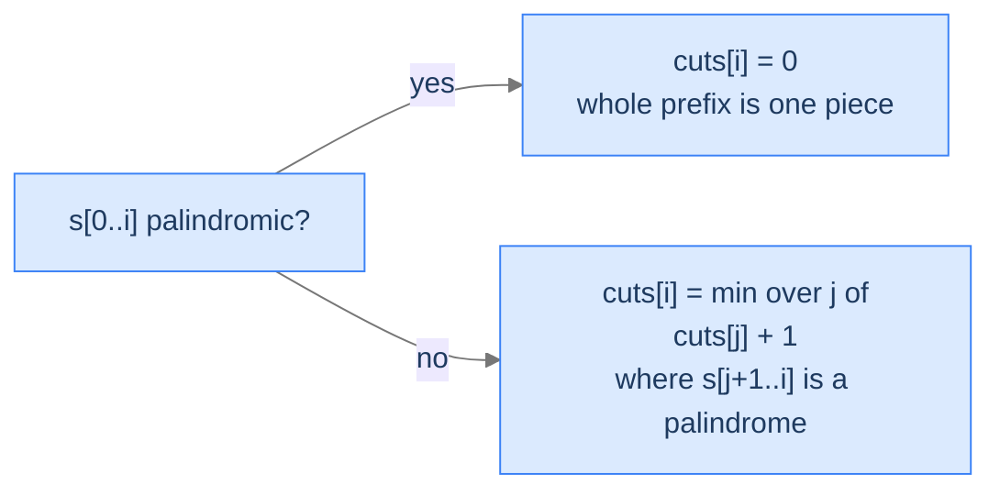
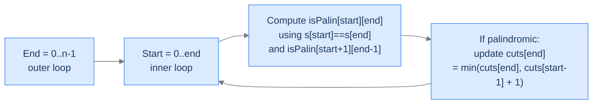

# 8. Palindrome Partitioning — Minimum Cuts

The previous two lessons hunted for *one* palindrome inside a string — the longest subsequence, then the longest contiguous substring. Now the demand flips: split the **whole** string so that every single piece is a palindrome, and use as few cuts as possible. `"abbbc"` looks unfriendly until you see it as `a | bbb | c` — three palindromic pieces, two cuts. The naive thing is to try every possible partition, but a string of length `n` has `2^(n-1)` ways to drop dividers; brute force collapses fast. Underneath, every cut decision depends on choices already made — classic optimal substructure with overlapping subproblems.

By the end of this lesson you'll know the **minimum-cut palindrome partitioning** recurrence (`cuts[i] = 0` when `s[0..i]` is itself palindromic, otherwise `min(cuts[j] + 1)` over every `j` where `s[j+1..i]` is palindromic), why the state collapses to *one* index instead of two, and how to interleave a precomputed palindromicity table with the cuts pass so each cell does only `O(n)` work — keeping the whole algorithm at `O(n²)`.

## Table of contents

1. [The Partitioning Problem](#the-partitioning-problem)
2. [Optimal Substructure — Fix the Last Piece](#optimal-substructure--fix-the-last-piece)
3. [Two Tables, One Pass](#two-tables-one-pass)
4. [Palindrome Partitioning — Minimum Cuts](#palindrome-partitioning--minimum-cuts)

***

# The Partitioning Problem

> **Course:** DSA › Algorithms › Dynamic Programming › Palindrome Partitioning

Given a string `s` of length `n`, find the **minimum number of cuts** so that every resulting piece reads the same forward and backward.

```d2
direction: right
ex: "Example: s = 'abbbc' → minimum cuts = 2" {
  grid-rows: 2
  grid-columns: 5
  grid-gap: 0
  c0: "a" {style.fill: "#fde68a"; style.stroke: "#d97706"}
  c1: "b"
  c2: "b"
  c3: "b"
  c4: "c" {style.fill: "#fde68a"; style.stroke: "#d97706"}
  i0: "[0]"
  i1: "[1]"
  i2: "[2]"
  i3: "[3]"
  i4: "[4]"
}
```

<p align="center"><strong>Two cuts split <code>"abbbc"</code> into <code>a | bbb | c</code> — three palindromic pieces. Highlighted cells mark where the cuts fall (after index 0 and after index 3). <em>k</em> cuts always produce <em>k + 1</em> pieces.</strong></p>

The brute force enumerates every way to drop dividers — `2^(n-1)` partitions — and checks each one. Optimal substructure plus overlapping subproblems shrink this to `O(n²)`.

> *Predict before reading on — for `s = "aab"`, what's the minimum number of cuts?*

`1`. The whole string `"aab"` isn't palindromic (it reads `"baa"` backward), so 0 cuts is impossible. The naive split `a | a | b` uses 2 cuts. But `aa | b` works with just 1 — the first piece `"aa"` is already palindromic.

The lesson: greedy "cut at the first non-match" misses better options. We need to compare all valid partitions and pick the cheapest.

## Where this shows up

Sequence segmentation appears all over the stack: tokenisation in NLP, RNA secondary-structure prediction in bioinformatics, run-length-style compression where each run must satisfy a structural property, and any "split a sequence into satisfying pieces" decision in a compiler or interpreter. The recurrence we'll derive here generalises far past palindromes.

---

## Key Takeaway

Palindrome partitioning counts **cuts**, not pieces. Brute force is `2^(n-1)`; DP is `O(n²)`. Greedy fails because the first valid split isn't always the best.

***

# Optimal Substructure — Fix the Last Piece

> **Course:** DSA › Algorithms › Dynamic Programming › Palindrome Partitioning

Define `cuts[i]` = minimum cuts needed to palindrome-partition the prefix `s[0..i]`. Two cases:

**Case 1 — `s[0..i]` is itself a palindrome.** The whole prefix is already one valid piece. No cut needed:
```
cuts[i] = 0
```

**Case 2 — `s[0..i]` is not a palindrome.** We must place at least one cut. Iterate the position `j` of the **last cut**, where `0 ≤ j < i`. The rightmost piece is `s[j+1..i]`; if it's palindromic, the partition is valid, and the leftover work is exactly `cuts[j]`:
```
cuts[i] = min over all valid j of (cuts[j] + 1)
       where "valid" means s[j+1..i] is a palindrome
```



<p align="center"><strong>Two cases of the recurrence. If the entire prefix is already a palindrome, no cut is needed. Otherwise, try every position for the last cut and pick the cheapest.</strong></p>

> *Pause. Why fix the **last** cut, not the **first**? Predict the consequence of either choice.*

It's a choice, not a constraint — both formulations enumerate exactly the same set of partitions, just indexed differently. Any valid partitioning of `s[0..i]` has a well-defined first cut and a well-defined last cut. Fixing the *first* cut and recursing on the right works; fixing the *last* cut and recursing on the left works. The convention is to fix the last cut because it lines up cleanly with prefix-indexed DP — `cuts[0], cuts[1], ..., cuts[n-1]` fills left-to-right, with each cell looking *backward* at smaller already-filled cells.

## Why the State Is 1D, Not 2D

LPSubstr last lesson used a 2D state `(i, j)` — a substring's two endpoints. Why does this problem get away with one index? Because we always partition a *prefix*, never an arbitrary middle slice. Once you fix the last piece, the leftover is `s[0..j]` — another prefix. The recursion shrinks only the right edge; the left edge stays pinned at `0`. One shrinking dimension means one index of state.

If the problem changed to "minimum cuts to partition any substring `s[i..j]`", the state would jump to 2D `(i, j)`. The 1D-vs-2D split is dictated by what stays fixed.

---

## Key Takeaway

Optimal substructure for partition problems: fix one piece (here, the last), recurse on the rest. State stays 1D when the recursion shrinks only one direction.

***

# Two Tables, One Pass

> **Course:** DSA › Algorithms › Dynamic Programming › Palindrome Partitioning

The recurrence asks `"is s[j+1..i] a palindrome?"` inside its inner loop. Naively that's an `O(n)` check, blowing the total cost to `O(n³)`. We need an `O(1)` palindromicity lookup.

The fix is a precomputed `isPalin[i][j]` table — exactly the boolean table from the previous lesson:
```
isPalin[i][j] = (s[i] == s[j]) AND (j - i ≤ 2 OR isPalin[i+1][j-1])
```

Two ways to combine the two tables:

1. **Two passes** — first fill the entire `isPalin` table by length (length 1 → length `n`), then sweep `cuts`.
2. **One pass** — extend `isPalin[start][end]` *as `end` grows*. For each new `end`, scan `start` from `0` to `end`, computing `isPalin[start][end]` and updating `cuts[end]` in the same loop body. Each `isPalin` lookup is `O(1)` because the smaller interval `isPalin[start+1][end-1]` was filled when `end-1` was the outer loop's value.



<p align="center"><strong>The one-pass shape. Each iteration of the outer loop seals one column of the <code>isPalin</code> table and finalises one cell of <code>cuts</code>. Same <code>O(n²)</code> time as the two-pass version, fewer table writes overall.</strong></p>

Both versions are `O(n²)` time and `O(n²)` space — only the loop nesting differs. The one-pass version is what the original CodeIntuition implementation uses, and it's what we'll code below.

> *Predict before reading on — when the inner loop hits `start = 0` (cutting before the first character), the recurrence wants `cuts[start - 1] = cuts[-1]`. What should this represent?*

It's the "no cut at all" case — `s[0..end]` is itself a palindrome. We can either special-case `start == 0` to set `cuts[end] = 0` directly, or pad the array with a sentinel `cuts[-1] = -1` so that `cuts[-1] + 1 = 0`. Both work; the special-case version reads more clearly.

---

## Key Takeaway

Two-phase DPs ("predicate first, optimisation second") are common when the predicate has its own recurrence. Compute it upfront *or* interleave it with the main loop — same complexity, different code shape.

***

# Palindrome Partitioning — Minimum Cuts

> **Course:** DSA › Algorithms › Dynamic Programming › Palindrome Partitioning

## The Problem

Given a string `s`, return the minimum number of cuts to partition it so every piece is a palindrome.

```
Input:  s = "abbbc"
Output: 2                  Cuts: a | bbb | c

Input:  s = "abcdef"
Output: 5                  Cuts: a | b | c | d | e | f  (no two adjacent characters match)

Input:  s = "aaa"
Output: 0                  Already a palindrome — no cuts needed
```

---

## Applying the Diagnostic Questions

| # | Question | Answer |
|---|---|---|
| **Q1** | Optimal substructure? | **Yes** — every valid partition of `s[0..i]` decomposes into a last palindromic piece plus an optimum partition of the prefix to its left. |
| **Q2** | Overlapping subproblems? | **Yes** — `cuts[j]` is reused by every later index `i > j` whose last palindromic piece starts at `j+1`. |
| **Q3** | 1D or 2D state? | **1D** — only the prefix's right endpoint varies; the left endpoint is pinned at `0`. |
| **Q4** | Answer's location? | **`cuts[n-1]`** — the optimum for the entire string. |

### Q1 — Why "Yes"?

**Mental model.** Imagine you've already made every cut. The *last* piece must end at index `n-1` and start at some index `j+1`. Whatever cuts came before turned `s[0..j]` into palindromic pieces optimally — otherwise we could re-do them and lower the total. So the optimum at `i` = (cost of one last cut) + (optimum at `j`).

**Concrete numbers.** For `s = "abbbc"`, the optimal partition `a | bbb | c` has its last piece `"c"` starting at index 4. `cuts[4] = cuts[3] + 1`. And `cuts[3]` solves the same problem for `"abbb"` — which is `a | bbb`, one cut. So `cuts[4] = 1 + 1 = 2`. ✓

**What breaks otherwise.** Suppose at `i = 4` we used a *suboptimal* `cuts[3]`. Then we could replace those choices with the real optimum for `s[0..3]` and lower the total — meaning our claimed minimum at `i = 4` wasn't actually minimum. Contradiction.

### Q2 — Why "Yes"?

**Mental model.** When you compute `cuts[i]`, you ask `cuts[j]` for many different `j`. Each of those `cuts[j]` was already asked for by *every* `i' > i` whose last cut might land at `j`. The same value gets queried over and over.

**Concrete numbers.** For `s = "abcabc"`: computing `cuts[5]` reads `cuts[0], cuts[1], ..., cuts[4]`. Computing `cuts[4]` reads `cuts[0], cuts[1], cuts[2], cuts[3]`. The values `cuts[0..3]` are reused at every later index. Without memoization (i.e. recursing instead of tabulating), each is recomputed every time it's asked for — exponential.

**What breaks otherwise.** Drop the table; recurse top-down with no cache. Time blows up to roughly `Θ(2^n)` because each `cuts(i)` re-derives every smaller subproblem from scratch.

### Q3 — Why 1D, not 2D?

**Mental model.** A partition always covers a *prefix* of `s`. The left edge stays pinned at index 0 — only the right edge `i` varies. One free index = 1D state.

**Concrete numbers.** A 2D state `cuts[i][j]` would have `n²` cells. We'd be answering "minimum cuts for every substring of `s`" — far more questions than needed. We only ever ask about prefixes, so we only need `n` cells.

**What breaks otherwise.** Using a 2D state still works, just wastes space. Using a 0D (single number) state breaks correctness because we lose the ability to compose subproblems.

### Q4 — Why `cuts[n-1]`?

**Mental model.** The whole problem is "minimum cuts for `s[0..n-1]`" — exactly the cell at index `n-1`.

**Concrete numbers.** For `s = "abbbc"`, `n = 5`, answer = `cuts[4] = 2`.

**What breaks otherwise.** Reading any earlier index would answer the question for a *strict prefix* of `s`, not the full string.

---

## The Solution

The implementation interleaves the `isPalin` table with the `cuts` array — one outer loop on `end`, one inner loop on `start`.


```pseudocode
# cuts[i] = minimum cuts needed to partition s[0..i] into palindromes.
# isPalin[start][end] is built on the fly as `end` advances.
function minPalindromeCuts(s):
    n ← length(s)
    if n ≤ 1: return 0                              # empty / single char is already palindromic
    isPalin ← n × n grid of false
    cuts ← list of n zeros

    for end from 0 to n − 1:
        minCuts ← end                               # worst case: cut between every char
        for start from 0 to end:
            # s[start..end] is palindromic iff endpoints match AND interior is palindromic
            # (interior with ≤ 1 char doesn't need a check).
            if s[start] = s[end] AND (end − start ≤ 2 OR isPalin[start + 1][end − 1]):
                isPalin[start][end] ← true
                if start = 0:
                    minCuts ← 0                     # whole prefix is one palindrome — no cuts
                else:
                    minCuts ← min(minCuts, cuts[start − 1] + 1)   # cut just before `start`
        cuts[end] ← minCuts
    return cuts[n − 1]
```

```python run
from typing import List

class Solution:
    def min_palindrome_cuts(self, s: str) -> int:
        n = len(s)
        if n <= 1:
            return 0                               # Empty or single char is already palindromic
        # is_palin[i][j] is True iff s[i..j] is a palindrome.
        is_palin: List[List[bool]] = [[False] * n for _ in range(n)]
        # cuts[i] = minimum cuts needed for s[0..i].
        cuts: List[int] = [0] * n
        for end in range(n):
            min_cuts = end                         # Worst case: cut between every char → end cuts
            for start in range(end + 1):
                # s[start..end] is a palindrome iff endpoints match AND
                # interior is palindromic (or interior has ≤ 1 char, no need to check).
                if s[start] == s[end] and (end - start <= 2 or is_palin[start + 1][end - 1]):
                    is_palin[start][end] = True
                    if start == 0:
                        # The whole prefix s[0..end] is one palindromic piece — no cut.
                        min_cuts = 0
                    else:
                        # Last piece is s[start..end]; preceding work cost cuts[start-1] + 1.
                        min_cuts = min(min_cuts, cuts[start - 1] + 1)
            cuts[end] = min_cuts
        return cuts[n - 1]


if __name__ == "__main__":
    print(Solution().min_palindrome_cuts("abbbc"))     # 2
    print(Solution().min_palindrome_cuts("abcdef"))    # 5
    print(Solution().min_palindrome_cuts("aaa"))       # 0
```

```java run
public class Solution {
    public int minPalindromeCuts(String s) {
        int n = s.length();
        if (n <= 1) return 0;
        boolean[][] isPalin = new boolean[n][n];
        int[] cuts = new int[n];
        for (int end = 0; end < n; end++) {
            int minCuts = end;
            for (int start = 0; start <= end; start++) {
                if (s.charAt(start) == s.charAt(end)
                        && (end - start <= 2 || isPalin[start + 1][end - 1])) {
                    isPalin[start][end] = true;
                    if (start == 0) minCuts = 0;
                    else minCuts = Math.min(minCuts, cuts[start - 1] + 1);
                }
            }
            cuts[end] = minCuts;
        }
        return cuts[n - 1];
    }

    public static void main(String[] args) {
        System.out.println(new Solution().minPalindromeCuts("abbbc"));    // 2
        System.out.println(new Solution().minPalindromeCuts("abcdef"));   // 5
        System.out.println(new Solution().minPalindromeCuts("aaa"));      // 0
    }
}
```

```c run
#include <stdio.h>
#include <string.h>
#include <stdbool.h>

bool is_palin[1001][1001];
int cuts_arr[1001];

int min_palindrome_cuts(const char *s) {
    int n = (int) strlen(s);
    if (n <= 1) return 0;
    for (int i = 0; i < n; i++) for (int j = 0; j < n; j++) is_palin[i][j] = false;
    for (int end = 0; end < n; end++) {
        int min_cuts = end;
        for (int start = 0; start <= end; start++) {
            if (s[start] == s[end] && (end - start <= 2 || is_palin[start + 1][end - 1])) {
                is_palin[start][end] = true;
                if (start == 0) min_cuts = 0;
                else if (cuts_arr[start - 1] + 1 < min_cuts) min_cuts = cuts_arr[start - 1] + 1;
            }
        }
        cuts_arr[end] = min_cuts;
    }
    return cuts_arr[n - 1];
}

int main(void) {
    printf("%d\n", min_palindrome_cuts("abbbc"));     // 2
    printf("%d\n", min_palindrome_cuts("abcdef"));    // 5
    printf("%d\n", min_palindrome_cuts("aaa"));       // 0
    return 0;
}
```

```cpp run
#include <iostream>
#include <string>
#include <vector>
#include <climits>

class Solution {
public:
    int minPalindromeCuts(std::string s) {
        int n = (int) s.size();
        if (n <= 1) return 0;
        std::vector<std::vector<bool>> isPalin(n, std::vector<bool>(n, false));
        std::vector<int> cuts(n, 0);
        for (int end = 0; end < n; end++) {
            int minCuts = end;
            for (int start = 0; start <= end; start++) {
                if (s[start] == s[end] && (end - start <= 2 || isPalin[start + 1][end - 1])) {
                    isPalin[start][end] = true;
                    if (start == 0) minCuts = 0;
                    else minCuts = std::min(minCuts, cuts[start - 1] + 1);
                }
            }
            cuts[end] = minCuts;
        }
        return cuts[n - 1];
    }
};

int main() {
    std::cout << Solution().minPalindromeCuts("abbbc")  << "\n";   // 2
    std::cout << Solution().minPalindromeCuts("abcdef") << "\n";   // 5
    std::cout << Solution().minPalindromeCuts("aaa")    << "\n";   // 0
    return 0;
}
```

```scala run
class Solution {
  def minPalindromeCuts(s: String): Int = {
    val n = s.length
    if (n <= 1) return 0
    val isPalin = Array.fill(n, n)(false)
    val cuts = Array.fill(n)(0)
    for (end <- 0 until n) {
      var minCuts = end
      for (start <- 0 to end) {
        if (s(start) == s(end) && (end - start <= 2 || isPalin(start + 1)(end - 1))) {
          isPalin(start)(end) = true
          if (start == 0) minCuts = 0
          else minCuts = math.min(minCuts, cuts(start - 1) + 1)
        }
      }
      cuts(end) = minCuts
    }
    cuts(n - 1)
  }
}

object Main extends App {
  println(new Solution().minPalindromeCuts("abbbc"))    // 2
  println(new Solution().minPalindromeCuts("abcdef"))   // 5
  println(new Solution().minPalindromeCuts("aaa"))      // 0
}
```

```typescript run
class Solution {
    minPalindromeCuts(s: string): number {
        const n = s.length;
        if (n <= 1) return 0;
        const isPalin: boolean[][] = Array.from({length: n}, () => new Array(n).fill(false));
        const cuts: number[] = new Array(n).fill(0);
        for (let end = 0; end < n; end++) {
            let minCuts = end;
            for (let start = 0; start <= end; start++) {
                if (s[start] === s[end] && (end - start <= 2 || isPalin[start + 1][end - 1])) {
                    isPalin[start][end] = true;
                    if (start === 0) minCuts = 0;
                    else minCuts = Math.min(minCuts, cuts[start - 1] + 1);
                }
            }
            cuts[end] = minCuts;
        }
        return cuts[n - 1];
    }
}
```

```go run
package main

import "fmt"

func minPalindromeCuts(s string) int {
    n := len(s)
    if n <= 1 { return 0 }
    isPalin := make([][]bool, n)
    for i := range isPalin { isPalin[i] = make([]bool, n) }
    cuts := make([]int, n)
    for end := 0; end < n; end++ {
        minCuts := end
        for start := 0; start <= end; start++ {
            if s[start] == s[end] && (end-start <= 2 || isPalin[start+1][end-1]) {
                isPalin[start][end] = true
                if start == 0 {
                    minCuts = 0
                } else if cuts[start-1]+1 < minCuts {
                    minCuts = cuts[start-1] + 1
                }
            }
        }
        cuts[end] = minCuts
    }
    return cuts[n-1]
}

func main() {
    fmt.Println(minPalindromeCuts("abbbc"))    // 2
    fmt.Println(minPalindromeCuts("abcdef"))   // 5
    fmt.Println(minPalindromeCuts("aaa"))      // 0
}
```

```rust run
fn min_palindrome_cuts(s: &str) -> i32 {
    let bytes = s.as_bytes();
    let n = bytes.len();
    if n <= 1 { return 0; }
    let mut is_palin = vec![vec![false; n]; n];
    let mut cuts = vec![0i32; n];
    for end in 0..n {
        let mut min_cuts = end as i32;
        for start in 0..=end {
            let interior_ok = end as i32 - start as i32 <= 2
                || is_palin[start + 1][end - 1];
            if bytes[start] == bytes[end] && interior_ok {
                is_palin[start][end] = true;
                if start == 0 {
                    min_cuts = 0;
                } else if cuts[start - 1] + 1 < min_cuts {
                    min_cuts = cuts[start - 1] + 1;
                }
            }
        }
        cuts[end] = min_cuts;
    }
    cuts[n - 1]
}

fn main() {
    println!("{}", min_palindrome_cuts("abbbc"));     // 2
    println!("{}", min_palindrome_cuts("abcdef"));    // 5
    println!("{}", min_palindrome_cuts("aaa"));       // 0
}
```


<details>
<summary><strong>Trace — s = "abbbc"</strong></summary>

```
Initial: cuts = [_, _, _, _, _]   isPalin all false

end = 0  (char 'a'):
  start = 0: s[0]='a'==s[0]='a' (length 1) → isPalin[0][0]=true
             start==0 → minCuts = 0
  cuts[0] = 0

end = 1  (char 'b'):
  start = 0: 'a' != 'b' → skip
  start = 1: 'b' == 'b' (length 1) → isPalin[1][1]=true
             cuts[0]+1 = 1 → minCuts = 1
  cuts[1] = 1

end = 2  (char 'b'):
  start = 0: 'a' != 'b' → skip
  start = 1: 'b' == 'b', length 2 → isPalin[1][2]=true
             cuts[0]+1 = 1 → minCuts = 1
  start = 2: 'b' == 'b' (length 1) → isPalin[2][2]=true
             cuts[1]+1 = 2 → minCuts stays 1
  cuts[2] = 1

end = 3  (char 'b'):
  start = 0: 'a' != 'b' → skip
  start = 1: 'b' == 'b', interior isPalin[2][2]=true → isPalin[1][3]=true
             cuts[0]+1 = 1 → minCuts = 1
  start = 2: 'b' == 'b', length 2 → isPalin[2][3]=true
             cuts[1]+1 = 2 → minCuts stays 1
  start = 3: 'b' == 'b' (length 1) → isPalin[3][3]=true
             cuts[2]+1 = 2 → minCuts stays 1
  cuts[3] = 1

end = 4  (char 'c'):
  start = 0: 'a' != 'c' → skip
  start = 1: 'b' != 'c' → skip
  start = 2: 'b' != 'c' → skip
  start = 3: 'b' != 'c' → skip
  start = 4: 'c' == 'c' (length 1) → isPalin[4][4]=true
             cuts[3]+1 = 2 → minCuts = 2
  cuts[4] = 2

Final cuts = [0, 1, 1, 1, 2]
Answer: cuts[4] = 2  ✓  (partition: a | bbb | c)
```

</details>

---

## Complexity Analysis

| Aspect | Cost | Why |
|---|---|---|
| Time | `O(n²)` | Outer loop is `n`; inner loop is up to `n`; each iteration is `O(1)` thanks to the `isPalin` table. |
| Space | `O(n²)` | The `isPalin` boolean table dominates; the `cuts` array is `O(n)`. |

There's a slicker `O(n)`-space variant that exploits the "expand around centre" trick from the previous lesson — for each centre, expand outward, and at each successful expansion update `cuts[end]` directly. Same `O(n²)` time, drops the `isPalin` table. Beyond this lesson, but worth mentioning.

---

## Edge Cases

| Case | Example | Expected | Reasoning |
|---|---|---|---|
| Empty string | `""` | `0` | Guard returns 0; nothing to partition. |
| Single char | `"a"` | `0` | A single character is trivially palindromic. |
| Already a palindrome | `"racecar"` | `0` | `start = 0` branch fires for `end = n-1`. |
| All distinct chars | `"abcdef"` | `n - 1` | Every cut needed; answer hits the worst-case initial value `end`. |
| All same chars | `"aaaa"` | `0` | Whole string palindromic; same as "already a palindrome". |
| Two chars matching | `"aa"` | `0` | Length-2 palindrome. |
| Two chars different | `"ab"` | `1` | One cut; both pieces single-char palindromes. |
| Embedded long palindrome | `"abbbc"` | `2` | Cuts surround the central palindrome `bbb`. |

---

## Final Takeaway

Palindrome partitioning is the canonical "split into satisfying pieces" DP. State is 1D — minimum cuts for a prefix — because the left endpoint stays pinned at index 0 while only the right endpoint shrinks. The recurrence fixes the *last* piece (palindromic, by predicate lookup) and recurses on the leftover prefix. The `isPalin` table from the previous lesson plugs in directly, giving `O(1)` predicate checks and `O(n²)` total time. **You didn't just solve palindrome partitioning. You learned the shape of every "minimum / maximum / count of partitions where each piece satisfies P" problem — fix the last piece, recurse on the prefix, and combine the predicate's DP with the optimisation's DP.**

> *Transfer challenge for the next lesson:* Replace "is this piece a palindrome?" with "is this piece a word in a dictionary?" — and switch the goal from "minimum cuts" to "is *any* valid partition possible?". Predict how the recurrence changes shape.

<details>
<summary><strong>Answer</strong></summary>

The state stays 1D — `canBreak[i]` = whether `s[0..i]` is segmentable. The min-over-cuts becomes a logical OR: `canBreak[i] = OR over valid j of canBreak[j]`, where "valid" means `s[j+1..i]` is in the dictionary. The predicate is now a hash-set membership check (O(1) average) instead of palindrome lookup. Same shape; different predicate; aggregator changed from `min(... + 1)` to `OR`. The next lesson formalises this as the **Word Break** problem.

</details>
