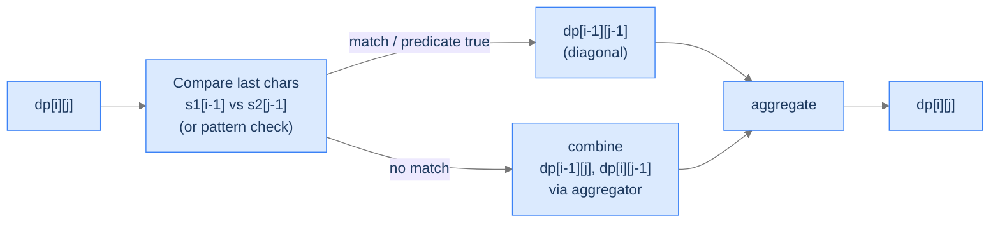

# 15. The Edit-Distance Pattern

Look closely at lessons 3, 4, and 5 — Longest Common Subsequence, Longest Common Substring, Edit Distance — and an architecture emerges. Each compares *two prefixes*, indexed by `(i, j)`. Each looks at the last characters and forks: do they match? Each combines smaller prefix results via min, max, or count. Different problems, identical bones. Two more problems share that exact skeleton: **wildcard pattern matching** (does a string match a pattern containing `?` and `*`?) and **interleaving check** (does a string `s3` interleave `s1` and `s2` while preserving order?). Both are 2D DPs over prefixes; both decompose by the last character; both add their own per-cell logic on top of the shared template.

By the end of this lesson you'll know the **edit-distance pattern** — the meta-template behind every "compare two sequences" DP — and you'll have written two problems that follow it: wildcard matching and interleaving check. You'll see why this single shape covers a vast slice of string-DP problems, and you'll start recognising it before the question even finishes.

## Table of contents

1. [The Edit-Distance Pattern](#the-edit-distance-pattern)
2. [Wildcard Pattern Matching](#wildcard-pattern-matching)
3. [Interleaving Check](#interleaving-check)
4. [Final Takeaway](#final-takeaway)

***

# The Edit-Distance Pattern

> **Course:** DSA › Algorithms › Dynamic Programming › Edit-Distance Pattern

The pattern has four mandatory components:

1. **State.** `dp[i][j]` represents some answer to the question "considering the first `i` characters of one input and the first `j` characters of another (or the same) input."
2. **Base cases.** Live in row 0 (`i = 0`) and column 0 (`j = 0`). They encode "what's true when one side is empty."
3. **Case fork on the last characters.** The recurrence asks `s1[i-1] == s2[j-1]` (or some predicate on them). The two branches reduce to smaller prefixes — usually `(i-1, j)`, `(i, j-1)`, `(i-1, j-1)`.
4. **Aggregator.** Min, max, OR, sum, AND — whatever the question asks.



<p align="center"><strong>The edit-distance pattern in one diagram. Every "compare two sequences" DP — LCS, LCSubstr, edit distance, wildcard, interleaving — is some specialisation of this template.</strong></p>

> *Predict before reading on — for "longest common subsequence" of two strings, what's `dp[i][j]`?*

`dp[i][j]` = length of the LCS of the first `i` chars of `s1` and the first `j` chars of `s2`. Match → `dp[i-1][j-1] + 1`; mismatch → `max(dp[i-1][j], dp[i][j-1])`. State, base cases, fork, aggregator — all four pattern components fall out of the question.

## Why This Pattern Is Worth a Lesson of Its Own

The pattern itself is a *template* — once you can spot it, you don't have to derive a new recurrence for every problem. You just identify the four components and assemble. The problems we'll do here illustrate two non-trivial twists:

- **Wildcard matching** has *predicates* on characters (the pattern character can be `?` or `*`, with special semantics) — so the fork has more cases than a simple match/mismatch.
- **Interleaving check** indexes a *third string* `s3` whose position is `i + j - 1` — derived implicitly from the prefix counts, not stored as a third state.

Both problems show how the same skeleton stretches.

---

## Key Takeaway

The edit-distance pattern: 2D prefix DP, base cases on empty prefixes, fork on last-char predicate, aggregator chosen by the question. Spot it once, write it forever.

***

# Wildcard Pattern Matching

> **Course:** DSA › Algorithms › Dynamic Programming › Edit-Distance Pattern

## The Problem

Given a string `s` and a `pattern` that may include wildcards:
- `?` matches any single character.
- `*` matches any sequence of characters (including empty).

Return `true` if the pattern matches the entire string `s`.

```
Input:  s = "abcdef", pattern = "abc??f"
Output: true                          ?? matches "de"; rest is literal

Input:  s = "abcdef", pattern = "ab*"
Output: true                          * matches "cdef"

Input:  s = "abcdef", pattern = "ab?"
Output: false                         Pattern length 3, but ? matches 1 char — too short
```

## The Recurrence

`dp[i][j]` = whether `pattern[0..j-1]` matches `s[0..i-1]`.

**Base cases.**
- `dp[0][0] = true` — empty pattern matches empty string.
- `dp[0][j] = dp[0][j-1]` if `pattern[j-1] == '*'`; else `false`. (A `*` can match the empty string, so a leading streak of `*`s still matches.)
- `dp[i][0] = false` for `i ≥ 1` — empty pattern can't match a non-empty string.

**Inductive case.** Three sub-cases on `pattern[j-1]`:
- **Literal match (`pattern[j-1] == s[i-1]`)** or **single-char wildcard (`pattern[j-1] == '?'`)** — both consume one char on each side: `dp[i][j] = dp[i-1][j-1]`.
- **Multi-char wildcard (`pattern[j-1] == '*'`)** — two options:
  - `*` matches zero characters → `dp[i][j-1]` (pattern shrinks, string unchanged).
  - `*` matches at least one character → `dp[i-1][j]` (string shrinks, pattern unchanged — `*` keeps consuming).
  - Combine: `dp[i][j] = dp[i][j-1] OR dp[i-1][j]`.
- **Literal mismatch** (`pattern[j-1]` is a regular character but doesn't equal `s[i-1]`) → `dp[i][j] = false`.

> *Pause. Why does `*` matching "one or more" recurse on `dp[i-1][j]` (not `dp[i-1][j-1]`)?*

Because the same `*` can keep matching more characters. After consuming one `s[i-1]`, the `*` is still alive — same column `j`, with `i` decremented. If we recursed on `dp[i-1][j-1]`, we'd be saying `*` matched exactly one character, losing the "match many more" semantics.

## The Solution


```pseudocode
# Wildcard match: '?' matches any single char, '*' matches any (possibly empty) substring.
# dp[i][j] = true iff pattern[0..j−1] matches s[0..i−1].
function wildcardMatch(s, pattern):
    n ← length(s); m ← length(pattern)
    dp ← (n + 1) × (m + 1) grid of false
    dp[0][0] ← true

    # Leading run of '*' can match the empty string.
    for j from 1 to m:
        if pattern[j − 1] = '*':
            dp[0][j] ← dp[0][j − 1]

    for i from 1 to n:
        for j from 1 to m:
            pc ← pattern[j − 1]
            if pc = '?' OR pc = s[i − 1]:
                dp[i][j] ← dp[i − 1][j − 1]       # consume one char on each side
            else if pc = '*':
                dp[i][j] ← dp[i][j − 1]            # '*' matches 0 chars
                            OR dp[i − 1][j]        # '*' matches 1+ chars
            # else: literal mismatch — dp[i][j] stays false
    return dp[n][m]
```

```python run
from typing import List

class Solution:
    def wildcard_match(self, s: str, pattern: str) -> bool:
        n, m = len(s), len(pattern)
        # dp[i][j] = True iff pattern[0..j-1] matches s[0..i-1].
        dp: List[List[bool]] = [[False] * (m + 1) for _ in range(n + 1)]
        dp[0][0] = True
        # Leading run of '*' can match the empty string.
        for j in range(1, m + 1):
            if pattern[j - 1] == '*':
                dp[0][j] = dp[0][j - 1]
        for i in range(1, n + 1):
            for j in range(1, m + 1):
                pc = pattern[j - 1]
                if pc == '?' or pc == s[i - 1]:
                    dp[i][j] = dp[i - 1][j - 1]            # consume one on each side
                elif pc == '*':
                    # *  matches 0 chars  → dp[i][j-1]
                    # *  matches 1+ chars → dp[i-1][j]
                    dp[i][j] = dp[i][j - 1] or dp[i - 1][j]
                # else: literal mismatch — dp[i][j] stays False
        return dp[n][m]


if __name__ == "__main__":
    sol = Solution()
    print(sol.wildcard_match("abcdef", "abc??f"))   # True
    print(sol.wildcard_match("abcdef", "ab*"))      # True
    print(sol.wildcard_match("abcdef", "ab?"))      # False
```

```java run
public class Solution {
    public boolean wildcardMatch(String s, String pattern) {
        int n = s.length(), m = pattern.length();
        boolean[][] dp = new boolean[n + 1][m + 1];
        dp[0][0] = true;
        for (int j = 1; j <= m; j++) {
            if (pattern.charAt(j - 1) == '*') dp[0][j] = dp[0][j - 1];
        }
        for (int i = 1; i <= n; i++) {
            for (int j = 1; j <= m; j++) {
                char pc = pattern.charAt(j - 1);
                if (pc == '?' || pc == s.charAt(i - 1))      dp[i][j] = dp[i - 1][j - 1];
                else if (pc == '*')                          dp[i][j] = dp[i][j - 1] || dp[i - 1][j];
            }
        }
        return dp[n][m];
    }

    public static void main(String[] args) {
        Solution sol = new Solution();
        System.out.println(sol.wildcardMatch("abcdef", "abc??f"));   // true
        System.out.println(sol.wildcardMatch("abcdef", "ab*"));      // true
    }
}
```

```c run
#include <stdio.h>
#include <string.h>
#include <stdbool.h>

bool dp[1001][1001];

bool wildcard_match(const char *s, const char *pattern) {
    int n = (int) strlen(s), m = (int) strlen(pattern);
    for (int i = 0; i <= n; i++) for (int j = 0; j <= m; j++) dp[i][j] = false;
    dp[0][0] = true;
    for (int j = 1; j <= m; j++) {
        if (pattern[j - 1] == '*') dp[0][j] = dp[0][j - 1];
    }
    for (int i = 1; i <= n; i++) {
        for (int j = 1; j <= m; j++) {
            char pc = pattern[j - 1];
            if (pc == '?' || pc == s[i - 1])      dp[i][j] = dp[i - 1][j - 1];
            else if (pc == '*')                   dp[i][j] = dp[i][j - 1] || dp[i - 1][j];
        }
    }
    return dp[n][m];
}

int main(void) {
    printf("%d\n", wildcard_match("abcdef", "abc??f"));   /* 1 */
    return 0;
}
```

```cpp run
#include <iostream>
#include <string>
#include <vector>

class Solution {
public:
    bool wildcardMatch(std::string s, std::string pattern) {
        int n = (int) s.size(), m = (int) pattern.size();
        std::vector<std::vector<bool>> dp(n + 1, std::vector<bool>(m + 1, false));
        dp[0][0] = true;
        for (int j = 1; j <= m; j++) {
            if (pattern[j - 1] == '*') dp[0][j] = dp[0][j - 1];
        }
        for (int i = 1; i <= n; i++) {
            for (int j = 1; j <= m; j++) {
                char pc = pattern[j - 1];
                if (pc == '?' || pc == s[i - 1])      dp[i][j] = dp[i - 1][j - 1];
                else if (pc == '*')                   dp[i][j] = dp[i][j - 1] || dp[i - 1][j];
            }
        }
        return dp[n][m];
    }
};

int main() {
    std::cout << Solution().wildcardMatch("abcdef", "abc??f") << "\n";   // 1
    return 0;
}
```

```scala run
class Solution {
  def wildcardMatch(s: String, pattern: String): Boolean = {
    val n = s.length; val m = pattern.length
    val dp = Array.fill(n + 1, m + 1)(false)
    dp(0)(0) = true
    for (j <- 1 to m) {
      if (pattern(j - 1) == '*') dp(0)(j) = dp(0)(j - 1)
    }
    for (i <- 1 to n; j <- 1 to m) {
      val pc = pattern(j - 1)
      if (pc == '?' || pc == s(i - 1)) dp(i)(j) = dp(i - 1)(j - 1)
      else if (pc == '*')              dp(i)(j) = dp(i)(j - 1) || dp(i - 1)(j)
    }
    dp(n)(m)
  }
}

object Main extends App {
  println(new Solution().wildcardMatch("abcdef", "abc??f"))   // true
}
```

```typescript run
class Solution {
    wildcardMatch(s: string, pattern: string): boolean {
        const n = s.length, m = pattern.length;
        const dp: boolean[][] = Array.from({length: n + 1}, () => new Array(m + 1).fill(false));
        dp[0][0] = true;
        for (let j = 1; j <= m; j++) {
            if (pattern[j - 1] === '*') dp[0][j] = dp[0][j - 1];
        }
        for (let i = 1; i <= n; i++) {
            for (let j = 1; j <= m; j++) {
                const pc = pattern[j - 1];
                if (pc === '?' || pc === s[i - 1]) dp[i][j] = dp[i - 1][j - 1];
                else if (pc === '*')               dp[i][j] = dp[i][j - 1] || dp[i - 1][j];
            }
        }
        return dp[n][m];
    }
}
```

```go run
package main

import "fmt"

func wildcardMatch(s, pattern string) bool {
    n, m := len(s), len(pattern)
    dp := make([][]bool, n+1)
    for i := range dp { dp[i] = make([]bool, m+1) }
    dp[0][0] = true
    for j := 1; j <= m; j++ {
        if pattern[j-1] == '*' { dp[0][j] = dp[0][j-1] }
    }
    for i := 1; i <= n; i++ {
        for j := 1; j <= m; j++ {
            pc := pattern[j-1]
            switch {
            case pc == '?' || pc == s[i-1]:
                dp[i][j] = dp[i-1][j-1]
            case pc == '*':
                dp[i][j] = dp[i][j-1] || dp[i-1][j]
            }
        }
    }
    return dp[n][m]
}

func main() {
    fmt.Println(wildcardMatch("abcdef", "abc??f"))   // true
}
```

```rust run
fn wildcard_match(s: &str, pattern: &str) -> bool {
    let s = s.as_bytes(); let p = pattern.as_bytes();
    let n = s.len(); let m = p.len();
    let mut dp = vec![vec![false; m + 1]; n + 1];
    dp[0][0] = true;
    for j in 1..=m {
        if p[j - 1] == b'*' { dp[0][j] = dp[0][j - 1]; }
    }
    for i in 1..=n {
        for j in 1..=m {
            let pc = p[j - 1];
            if pc == b'?' || pc == s[i - 1] { dp[i][j] = dp[i - 1][j - 1]; }
            else if pc == b'*'              { dp[i][j] = dp[i][j - 1] || dp[i - 1][j]; }
        }
    }
    dp[n][m]
}

fn main() {
    println!("{}", wildcard_match("abcdef", "abc??f"));   // true
}
```


## Complexity

| Aspect | Cost |
|---|---|
| Time | `O(n × m)` |
| Space | `O(n × m)` (reducible to `O(m)` with rolling rows) |

## Edge Cases

| Case | Example | Expected | Reasoning |
|---|---|---|---|
| Empty inputs | `s="", pattern=""` | `true` | `dp[0][0] = true`. |
| Pattern is just `*` | `s="abc", pattern="*"` | `true` | `*` matches anything, including empty. |
| Pattern empty, string non-empty | `s="abc", pattern=""` | `false` | Column 0 stays false past row 0. |
| Multiple `*`s | `s="abcd", pattern="*c*"` | `true` | Two `*`s coverage. |
| Adversarial mismatch | `s="abc", pattern="abd"` | `false` | Literal mismatch at position 2. |

***

# Interleaving Check

> **Course:** DSA › Algorithms › Dynamic Programming › Edit-Distance Pattern

## The Problem

Given three strings `s1`, `s2`, `s3`, return `true` if `s3` is an interleaving of `s1` and `s2` — that is, `s3` is formed by merging the characters of `s1` and `s2` while preserving each one's internal order.

```
Input:  s1 = "code", s2 = "intuition", s3 = "cointuitionde"
Output: true
        Merge as: c-o-(intuition)-d-e ?  No — let's verify properly.
        s1 contributes: c, o, ..., d, e in order. s2 contributes: i, n, t, u, i, t, i, o, n in order.
        The merged sequence "co" + "intuition" + "de" alternates s1[c, o] then s2[intuition] then s1[d, e].

Input:  s1 = "abc", s2 = "def", s3 = "adbecf"
Output: true
        a (s1) d (s2) b (s1) e (s2) c (s1) f (s2) — strict alternation.

Input:  s1 = "abc", s2 = "def", s3 = "adcebf"
Output: false
        s3 has c before b — violates s1's internal order.
```

## The Recurrence

`dp[i][j]` = whether `s3[0..i+j-1]` is an interleaving of `s1[0..i-1]` and `s2[0..j-1]`. Note: `s3`'s position is *implicit* — `i + j - 1`.

**Base case.** `dp[0][0] = true` — empty plus empty equals empty, trivially an interleaving.

**Inductive case.** Two ways `s3[i+j-1]` could have been produced:
- It matches the last character of `s1`: `s1[i-1] == s3[i+j-1]` AND `dp[i-1][j]` is true (the rest interleaves correctly).
- It matches the last character of `s2`: `s2[j-1] == s3[i+j-1]` AND `dp[i][j-1]` is true.

OR them:
```
dp[i][j] = (s1[i-1] == s3[i+j-1] AND dp[i-1][j])
        OR (s2[j-1] == s3[i+j-1] AND dp[i][j-1])
```

> *Pause. Why is there no diagonal `dp[i-1][j-1]` term? Predict the reasoning.*

Because each character of `s3` must come from *exactly one* of `s1` or `s2` — not both, not neither. The two terms above cover both options; a diagonal term would correspond to "consume one from each", which doesn't make sense for an interleaving (which consumes one character at a time, alternating arbitrarily between the two source strings).

**Fast fail.** If `len(s3) != len(s1) + len(s2)`, return `false` immediately. Lengths must add up by the pigeonhole-style accounting.

## The Solution


```pseudocode
# dp[i][j] = true iff s3[0..i+j−1] is an interleaving of s1[0..i−1] and s2[0..j−1].
function isInterleave(s1, s2, s3):
    n ← length(s1); m ← length(s2)
    if n + m ≠ length(s3): return false           # length mismatch — quick reject
    dp ← (n + 1) × (m + 1) grid of false
    dp[0][0] ← true
    for i from 0 to n:
        for j from 0 to m:
            if i > 0 AND s1[i − 1] = s3[i + j − 1]:
                dp[i][j] ← dp[i][j] OR dp[i − 1][j]   # next char came from s1
            if j > 0 AND s2[j − 1] = s3[i + j − 1]:
                dp[i][j] ← dp[i][j] OR dp[i][j − 1]   # next char came from s2
    return dp[n][m]
```

```python run
from typing import List

class Solution:
    def is_interleave(self, s1: str, s2: str, s3: str) -> bool:
        n, m = len(s1), len(s2)
        if n + m != len(s3):
            return False                            # Quick reject on length mismatch
        # dp[i][j] = True iff s3[0..i+j-1] interleaves s1[0..i-1] and s2[0..j-1].
        dp: List[List[bool]] = [[False] * (m + 1) for _ in range(n + 1)]
        dp[0][0] = True
        for i in range(n + 1):
            for j in range(m + 1):
                if i > 0 and s1[i - 1] == s3[i + j - 1]:
                    dp[i][j] = dp[i][j] or dp[i - 1][j]
                if j > 0 and s2[j - 1] == s3[i + j - 1]:
                    dp[i][j] = dp[i][j] or dp[i][j - 1]
        return dp[n][m]


if __name__ == "__main__":
    sol = Solution()
    print(sol.is_interleave("code", "intuition", "cointuitionde"))   # True
    print(sol.is_interleave("abc",  "def",       "adbecf"))          # True
    print(sol.is_interleave("abc",  "def",       "adcebf"))          # False
```

```java run
public class Solution {
    public boolean isInterleave(String s1, String s2, String s3) {
        int n = s1.length(), m = s2.length();
        if (n + m != s3.length()) return false;
        boolean[][] dp = new boolean[n + 1][m + 1];
        dp[0][0] = true;
        for (int i = 0; i <= n; i++) {
            for (int j = 0; j <= m; j++) {
                if (i > 0 && s1.charAt(i - 1) == s3.charAt(i + j - 1))
                    dp[i][j] = dp[i][j] || dp[i - 1][j];
                if (j > 0 && s2.charAt(j - 1) == s3.charAt(i + j - 1))
                    dp[i][j] = dp[i][j] || dp[i][j - 1];
            }
        }
        return dp[n][m];
    }

    public static void main(String[] args) {
        System.out.println(new Solution().isInterleave("code", "intuition", "cointuitionde"));   // true
        System.out.println(new Solution().isInterleave("abc",  "def",       "adcebf"));          // false
    }
}
```

```c run
#include <stdio.h>
#include <string.h>
#include <stdbool.h>

bool dp[501][501];

bool is_interleave(const char *s1, const char *s2, const char *s3) {
    int n = (int) strlen(s1), m = (int) strlen(s2);
    if (n + m != (int) strlen(s3)) return false;
    for (int i = 0; i <= n; i++) for (int j = 0; j <= m; j++) dp[i][j] = false;
    dp[0][0] = true;
    for (int i = 0; i <= n; i++) {
        for (int j = 0; j <= m; j++) {
            if (i > 0 && s1[i - 1] == s3[i + j - 1]) dp[i][j] = dp[i][j] || dp[i - 1][j];
            if (j > 0 && s2[j - 1] == s3[i + j - 1]) dp[i][j] = dp[i][j] || dp[i][j - 1];
        }
    }
    return dp[n][m];
}

int main(void) {
    printf("%d\n", is_interleave("abc", "def", "adbecf"));   /* 1 */
    return 0;
}
```

```cpp run
#include <iostream>
#include <string>
#include <vector>

class Solution {
public:
    bool isInterleave(std::string s1, std::string s2, std::string s3) {
        int n = (int) s1.size(), m = (int) s2.size();
        if (n + m != (int) s3.size()) return false;
        std::vector<std::vector<bool>> dp(n + 1, std::vector<bool>(m + 1, false));
        dp[0][0] = true;
        for (int i = 0; i <= n; i++) {
            for (int j = 0; j <= m; j++) {
                if (i > 0 && s1[i - 1] == s3[i + j - 1]) dp[i][j] = dp[i][j] || dp[i - 1][j];
                if (j > 0 && s2[j - 1] == s3[i + j - 1]) dp[i][j] = dp[i][j] || dp[i][j - 1];
            }
        }
        return dp[n][m];
    }
};

int main() {
    std::cout << Solution().isInterleave("code", "intuition", "cointuitionde") << "\n";  // 1
    return 0;
}
```

```scala run
class Solution {
  def isInterleave(s1: String, s2: String, s3: String): Boolean = {
    val (n, m) = (s1.length, s2.length)
    if (n + m != s3.length) return false
    val dp = Array.fill(n + 1, m + 1)(false)
    dp(0)(0) = true
    for (i <- 0 to n; j <- 0 to m) {
      if (i > 0 && s1(i - 1) == s3(i + j - 1)) dp(i)(j) = dp(i)(j) || dp(i - 1)(j)
      if (j > 0 && s2(j - 1) == s3(i + j - 1)) dp(i)(j) = dp(i)(j) || dp(i)(j - 1)
    }
    dp(n)(m)
  }
}

object Main extends App {
  println(new Solution().isInterleave("abc", "def", "adbecf"))   // true
}
```

```typescript run
class Solution {
    isInterleave(s1: string, s2: string, s3: string): boolean {
        const n = s1.length, m = s2.length;
        if (n + m !== s3.length) return false;
        const dp: boolean[][] = Array.from({length: n + 1}, () => new Array(m + 1).fill(false));
        dp[0][0] = true;
        for (let i = 0; i <= n; i++) {
            for (let j = 0; j <= m; j++) {
                if (i > 0 && s1[i - 1] === s3[i + j - 1]) dp[i][j] = dp[i][j] || dp[i - 1][j];
                if (j > 0 && s2[j - 1] === s3[i + j - 1]) dp[i][j] = dp[i][j] || dp[i][j - 1];
            }
        }
        return dp[n][m];
    }
}
```

```go run
package main

import "fmt"

func isInterleave(s1, s2, s3 string) bool {
    n, m := len(s1), len(s2)
    if n+m != len(s3) { return false }
    dp := make([][]bool, n+1)
    for i := range dp { dp[i] = make([]bool, m+1) }
    dp[0][0] = true
    for i := 0; i <= n; i++ {
        for j := 0; j <= m; j++ {
            if i > 0 && s1[i-1] == s3[i+j-1] { dp[i][j] = dp[i][j] || dp[i-1][j] }
            if j > 0 && s2[j-1] == s3[i+j-1] { dp[i][j] = dp[i][j] || dp[i][j-1] }
        }
    }
    return dp[n][m]
}

func main() {
    fmt.Println(isInterleave("abc", "def", "adbecf"))   // true
}
```

```rust run
fn is_interleave(s1: &str, s2: &str, s3: &str) -> bool {
    let s1 = s1.as_bytes(); let s2 = s2.as_bytes(); let s3 = s3.as_bytes();
    let n = s1.len(); let m = s2.len();
    if n + m != s3.len() { return false; }
    let mut dp = vec![vec![false; m + 1]; n + 1];
    dp[0][0] = true;
    for i in 0..=n {
        for j in 0..=m {
            if i > 0 && s1[i - 1] == s3[i + j - 1] { dp[i][j] = dp[i][j] || dp[i - 1][j]; }
            if j > 0 && s2[j - 1] == s3[i + j - 1] { dp[i][j] = dp[i][j] || dp[i][j - 1]; }
        }
    }
    dp[n][m]
}

fn main() {
    println!("{}", is_interleave("abc", "def", "adbecf"));   // true
}
```


## Complexity

| Aspect | Cost |
|---|---|
| Time | `O(n × m)` |
| Space | `O(n × m)` (reducible to `O(m)` with rolling rows) |

## Edge Cases

| Case | Example | Expected | Reasoning |
|---|---|---|---|
| Both empty, target empty | `("", "", "")` | `true` | `dp[0][0] = true`. |
| One source empty, target equals other | `("", "abc", "abc")` | `true` | Pure pass-through. |
| Length mismatch | `("a", "b", "abc")` | `false` | Quick reject. |
| Same character on both sides | `("aa", "ab", "aaba")` | `true` | Multiple valid interleavings; OR collects them. |

***

# Final Takeaway

The edit-distance pattern isn't just one problem — it's the *template* behind a family of two-sequence DPs:

| Problem | State | Fork on | Aggregator |
|---|---|---|---|
| LCS | `(i, j)` over both prefixes | char match | max |
| LCSubstr | `(i, j)` over both prefixes | char match | max with reset |
| Edit Distance | `(i, j)` over both prefixes | char match → 4 cases | min |
| Wildcard Match | `(i, j)` over string and pattern | char/`?`/`*` cases | OR |
| Interleaving Check | `(i, j)` over `s1`, `s2` (with `s3[i+j-1]` derived) | char match on each side | OR |

All five problems share the 2D prefix state, the case fork on the last characters, and the appropriate aggregator. **You didn't just learn two new problems. You internalised the meta-template behind half of every "compare two sequences" DP problem you'll see for the rest of your career — recognise the shape, identify the four components, and the recurrence writes itself.**

> *Transfer challenge for the next lesson:* Drop the second sequence entirely. Now you have *one* array of integers and a target sum. Can the array's elements be partitioned into two subsets with equal sum? This isn't a sequence-comparison problem; it's a *subset-sum* problem dressed up. Predict the recurrence shape — and notice it's not the edit-distance pattern at all.

<details>
<summary><strong>Answer</strong></summary>

State `dp[i][s]` = boolean — whether some subset of the first `i` elements sums to `s`. Same recurrence shape as subset sum from lesson 11; the partition-into-equal-subsets reduces to "is there a subset summing to `total / 2`?". The next lesson formalises the **subset-sum pattern** — a meta-template for partition, target-sum, and counting variants.

</details>
