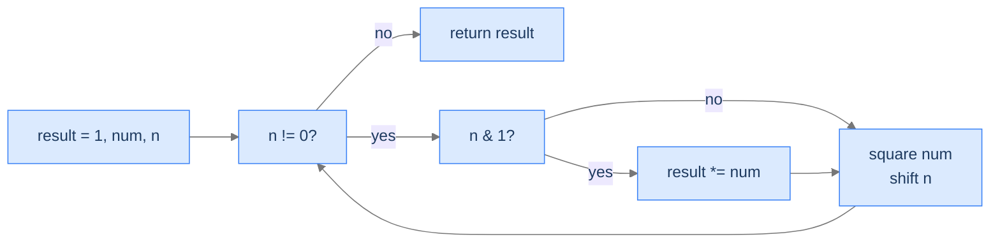

# 6. Bit-Manipulation Applications

The five preceding lessons built the toolkit — kth-bit primitives, set-bit finders, bit reversal and rotation, XOR cancellation, bitmask enumeration. This final lesson is a **showcase**: four classic problems that compose those primitives into elegant constant-time (or logarithmic-time) solutions. **Parity checker** uses `n & 1`. **Power of 2** uses `n & (n - 1) == 0`. **Parity (popcount mod 2)** uses Brian Kernighan's loop. **Power function** uses the bits of the exponent to do exponentiation in O(log n) — the most-cited bit-trick in numerical computing. Each algorithm is a single-line composition of patterns you've already met.

By the end of this lesson, you'll see how the small primitives stack into surprisingly powerful one-liners, and you'll have completed the bit-manipulation section.

## Table of contents

1. [Parity Checker](#parity-checker)
2. [Power of 2](#power-of-2)
3. [Parity Checker II — Set-Bit Parity](#parity-checker-ii--set-bit-parity)
4. [Power Function — Fast Exponentiation](#power-function--fast-exponentiation)
5. [Final Takeaway](#final-takeaway)

***

# Parity Checker

> **Course:** DSA › Algorithms › Bit Manipulation › Applications

## The Problem

Given an integer, return `"odd"` if it's odd, `"even"` if it's even.

```
Input:  num = 10  →  "even"
Input:  num = 9   →  "odd"
Input:  num = 1   →  "odd"
```

## The Recurrence

The least significant bit *is* the parity. `n & 1` returns 1 for odd numbers, 0 for even.

```
parity = "odd" if (n & 1) else "even"
```

> *Pause. Why does this work for negative numbers in two's complement? Predict.*

In two's complement, `-1`'s bit pattern is all-1s, `-2`'s is all-1s except the LSB, and so on. The LSB still alternates between 0 (even) and 1 (odd) as the magnitude grows — same as for positives. So `n & 1` is parity-preserving for any signed integer.

Compare to `n % 2`: for negative numbers in C and similar languages, `(-3) % 2 = -1` (signed remainder), which fails the `== 1` test. `n & 1` always returns `0` or `1`. Use the bitwise check; sidestep the language-specific signed-modulo trap.

## The Solution


```pseudocode
function parityChecker(num):
    # The lowest bit is 1 iff num is odd.
    if (num bitwise AND 1) ≠ 0:
        return "odd"
    return "even"
```

```python run
class Solution:
    def parity_checker(self, num: int) -> str:
        return "odd" if (num & 1) else "even"


if __name__ == "__main__":
    sol = Solution()
    print(sol.parity_checker(10))   # even
    print(sol.parity_checker(9))    # odd
```

```java run
public class Solution {
    public String parityChecker(int num) {
        return (num & 1) != 0 ? "odd" : "even";
    }
}
```

```c run
#include <stdio.h>

const char *parity_checker(int num) {
    return (num & 1) ? "odd" : "even";
}

int main(void) {
    printf("%s\n", parity_checker(10));   /* even */
    printf("%s\n", parity_checker(9));    /* odd */
    return 0;
}
```

```cpp run
#include <iostream>
#include <string>

class Solution {
public:
    std::string parityChecker(int num) {
        return (num & 1) ? "odd" : "even";
    }
};

int main() {
    std::cout << Solution().parityChecker(10) << "\n";   // even
    return 0;
}
```

```scala run
class Solution {
  def parityChecker(num: Int): String = if ((num & 1) != 0) "odd" else "even"
}

object Main extends App {
  println(new Solution().parityChecker(10))   // even
}
```

```typescript run
class Solution {
    parityChecker(num: number): string {
        return (num & 1) ? "odd" : "even";
    }
}
```

```go run
package main

import "fmt"

func parityChecker(num int) string {
    if num & 1 != 0 { return "odd" }
    return "even"
}

func main() {
    fmt.Println(parityChecker(10))   // even
}
```

```rust run
fn parity_checker(num: i32) -> &'static str {
    if num & 1 != 0 { "odd" } else { "even" }
}

fn main() {
    println!("{}", parity_checker(10));   // even
}
```


***

# Power of 2

> **Course:** DSA › Algorithms › Bit Manipulation › Applications

## The Problem

Given an integer, return `true` if it's a positive power of 2 (1, 2, 4, 8, …); else `false`.

```
Input:  num = 1   →  true     2^0
Input:  num = 8   →  true     2^3
Input:  num = 3   →  false
```

## The Recurrence

A power of 2 has *exactly one* set bit. From lesson 2, `(n & (n - 1)) == 0` exactly when `n` has zero or one set bits. Combine with `n > 0` to exclude zero (which has zero set bits):

```
is_power_of_2 = n > 0 and (n & (n - 1)) == 0
```

> *Pause. Why does <code>n > 0</code> matter? What does <code>(0 & -1) == 0</code> evaluate to?*

In two's complement, `0 - 1 = -1` (all bits 1). `0 & -1 = 0`. Without the `n > 0` guard, the function would return `true` for `n = 0` — but 0 isn't a power of 2 (`2^k > 0` for any integer k). The guard plugs that hole.

## The Solution


```pseudocode
function powerOf2(num):
    # num & (num − 1) clears the lowest set bit. If the result is 0, num had exactly one set bit.
    return num > 0 AND (num bitwise AND (num − 1)) = 0
```

```python run
class Solution:
    def power_of_2(self, num: int) -> bool:
        # n > 0 excludes zero; n & (n - 1) == 0 means at most one set bit.
        return num > 0 and (num & (num - 1)) == 0


if __name__ == "__main__":
    sol = Solution()
    print(sol.power_of_2(1))   # True
    print(sol.power_of_2(8))   # True
    print(sol.power_of_2(3))   # False
```

```java run
public class Solution {
    public boolean powerOf2(int num) {
        return num > 0 && (num & (num - 1)) == 0;
    }
}
```

```c run
#include <stdio.h>
#include <stdbool.h>

bool power_of_2(int num) {
    return num > 0 && (num & (num - 1)) == 0;
}

int main(void) {
    printf("%d\n", power_of_2(8));   /* 1 */
    printf("%d\n", power_of_2(3));   /* 0 */
    return 0;
}
```

```cpp run
#include <iostream>

class Solution {
public:
    bool powerOf2(int num) {
        return num > 0 && (num & (num - 1)) == 0;
    }
};

int main() {
    std::cout << Solution().powerOf2(8) << "\n";   // 1
    return 0;
}
```

```scala run
class Solution {
  def powerOf2(num: Int): Boolean = num > 0 && (num & (num - 1)) == 0
}

object Main extends App {
  println(new Solution().powerOf2(8))   // true
}
```

```typescript run
class Solution {
    powerOf2(num: number): boolean {
        return num > 0 && (num & (num - 1)) === 0;
    }
}
```

```go run
package main

import "fmt"

func powerOf2(num int) bool {
    return num > 0 && num & (num - 1) == 0
}

func main() {
    fmt.Println(powerOf2(8))   // true
}
```

```rust run
fn power_of_2(num: i32) -> bool {
    num > 0 && (num & (num - 1)) == 0
}

fn main() {
    println!("{}", power_of_2(8));   // true
}
```


***

# Parity Checker II — Set-Bit Parity

> **Course:** DSA › Algorithms › Bit Manipulation › Applications

## The Problem

Given an integer `num`, return `"odd"` if its **set bit count** is odd, `"even"` otherwise. (This is *bit parity*, distinct from numerical parity from earlier.)

```
Input:  num = 10   →  "even"   Binary 1010 — 2 set bits → even
Input:  num = 13   →  "odd"    Binary 1101 — 3 set bits → odd
Input:  num = 1    →  "odd"    1 set bit → odd
```

## The Recurrence

Use **Brian Kernighan's algorithm** from lesson 4. Each `n & (n - 1)` clears one set bit; toggle a parity flag each iteration. After the loop, the flag's final state is the parity.

```
flag = false
while n != 0:
    flag = not flag
    n = n & (n - 1)
return "odd" if flag else "even"
```

> *Pause. Why iterate <code>n & (n - 1)</code> instead of just shifting and counting <code>n & 1</code>?*

Both work. Kernighan's runs in O(set-bit count); the shift-and-count loop runs in O(bit-width). For sparse integers (few set bits), Kernighan's is much faster. CPUs also expose a `popcount` instruction that's faster than either; in production, prefer the intrinsic. The manual version here illustrates the technique.

## The Solution


```pseudocode
# Parity = whether the number of SET BITS is odd or even.
# Brian Kernighan's loop counts set bits in O(popcount) time.
function parityCheckerII(num):
    flag ← false
    while num ≠ 0:
        flag ← NOT flag
        num ← num bitwise AND (num − 1)            # clear lowest set bit
    if flag:
        return "odd"
    return "even"
```

```python run
class Solution:
    def parity_checker_ii(self, num: int) -> str:
        flag = False
        while num:
            flag = not flag
            num &= num - 1                          # Clear lowest set bit
        return "odd" if flag else "even"


if __name__ == "__main__":
    sol = Solution()
    print(sol.parity_checker_ii(10))   # even (2 set bits)
    print(sol.parity_checker_ii(13))   # odd  (3 set bits)
```

```java run
public class Solution {
    public String parityCheckerII(int num) {
        boolean flag = false;
        while (num != 0) { flag = !flag; num &= num - 1; }
        return flag ? "odd" : "even";
    }
}
```

```c run
#include <stdio.h>
#include <stdbool.h>

const char *parity_checker_ii(int num) {
    bool flag = false;
    while (num) { flag = !flag; num &= num - 1; }
    return flag ? "odd" : "even";
}

int main(void) {
    printf("%s\n", parity_checker_ii(10));   /* even */
    return 0;
}
```

```cpp run
#include <iostream>
#include <string>

class Solution {
public:
    std::string parityCheckerII(int num) {
        bool flag = false;
        while (num) { flag = !flag; num &= num - 1; }
        return flag ? "odd" : "even";
    }
};

int main() {
    std::cout << Solution().parityCheckerII(10) << "\n";   // even
    return 0;
}
```

```scala run
class Solution {
  def parityCheckerII(num: Int): String = {
    if (Integer.bitCount(num) % 2 == 1) "odd" else "even"
  }
}

object Main extends App {
  println(new Solution().parityCheckerII(10))   // even
}
```

```typescript run
class Solution {
    parityCheckerII(num: number): string {
        let flag = false;
        while (num) { flag = !flag; num &= num - 1; }
        return flag ? "odd" : "even";
    }
}
```

```go run
package main

import (
    "fmt"
    "math/bits"
)

func parityCheckerII(num uint32) string {
    if bits.OnesCount32(num) % 2 == 1 { return "odd" }
    return "even"
}

func main() {
    fmt.Println(parityCheckerII(10))   // even
}
```

```rust run
fn parity_checker_ii(num: i32) -> &'static str {
    if num.count_ones() % 2 == 1 { "odd" } else { "even" }
}

fn main() {
    println!("{}", parity_checker_ii(10));   // even
}
```


***

# Power Function — Fast Exponentiation

> **Course:** DSA › Algorithms › Bit Manipulation › Applications

## The Problem

Given an integer `num` and a non-negative integer `n`, compute `num^n`. Required: O(log n) time.

```
Input:  num = 4, n = 2   →  16
Input:  num = 10, n = 3  →  1000
Input:  num = 2, n = 8   →  256
```

## The Recurrence — Bits of the Exponent

Naive multiplication uses `n - 1` operations. We can do it in `log₂(n)` by exploiting binary representation:

`num^n = num^(b₀ + 2·b₁ + 4·b₂ + …)` where `b_i` are the bits of `n`. By the rule `x^(a + b) = x^a · x^b`, this becomes:

```
num^n = num^(b₀)  ×  num^(2·b₁)  ×  num^(4·b₂)  ×  ...
      = num^(2^0 if b₀=1 else 1) × num^(2^1 if b₁=1 else 1) × ...
```

So: keep a running `num`, doubling its exponent each iteration (`num *= num`). For each *set* bit of `n`, multiply the result by the current `num`. Iteration cost = `O(log n)`.

```
result = 1
while n > 0:
    if n & 1:                # bit set in current position?
        result *= num
    num *= num               # square num for the next bit position
    n >>= 1                  # move to the next bit
return result
```



<p align="center"><strong>Each iteration squares <code>num</code> (advancing one binary place) and conditionally multiplies it into the result if that bit of <code>n</code> was set. Total iterations = bit-width of <code>n</code> = O(log n).</strong></p>

> *Pause. For <code>num = 2, n = 8</code> (binary <code>1000</code>), how many multiplications happen? Predict before tracing.*

`8` in binary is `1000`. Three bits are zero (no result-multiplication), one bit (the topmost) is one (one result-multiplication). Plus 4 squarings of `num`. Total ~ 5 multiplications, vs 7 with naive looping. The saving grows: `n = 1000` saves ~990 multiplications.

## The Solution


```pseudocode
# Fast exponentiation by squaring. O(log n) multiplications.
function powerFunction(num, n):
    result ← 1
    while n > 0:
        if (n bitwise AND 1) ≠ 0:                  # current bit is set → fold num into result
            result ← result × num
        num ← num × num                             # square num for the next bit position
        n ← n shifted right by 1
    return result
```

```python run
class Solution:
    def power_function(self, num: int, n: int) -> int:
        result = 1
        while n > 0:
            if n & 1:                              # If current bit is set, fold num into result
                result *= num
            num *= num                             # Square num for the next bit position
            n >>= 1                                # Shift to the next bit
        return result


if __name__ == "__main__":
    sol = Solution()
    print(sol.power_function(4, 2))    # 16
    print(sol.power_function(10, 3))   # 1000
    print(sol.power_function(2, 8))    # 256
```

```java run
public class Solution {
    public long powerFunction(int num, int n) {
        long result = 1L;
        long base = num;
        while (n > 0) {
            if ((n & 1) != 0) result *= base;
            base *= base;
            n >>= 1;
        }
        return result;
    }
}
```

```c run
#include <stdio.h>

long power_function(int num, int n) {
    long result = 1L, base = num;
    while (n > 0) {
        if (n & 1) result *= base;
        base *= base;
        n >>= 1;
    }
    return result;
}

int main(void) {
    printf("%ld\n", power_function(2, 8));   /* 256 */
    return 0;
}
```

```cpp run
#include <iostream>

class Solution {
public:
    long long powerFunction(int num, int n) {
        long long result = 1, base = num;
        while (n > 0) {
            if (n & 1) result *= base;
            base *= base;
            n >>= 1;
        }
        return result;
    }
};

int main() {
    std::cout << Solution().powerFunction(2, 8) << "\n";   // 256
    return 0;
}
```

```scala run
class Solution {
  def powerFunction(num: Int, n: Int): Long = {
    var result = 1L; var base = num.toLong; var nn = n
    while (nn > 0) {
      if ((nn & 1) != 0) result *= base
      base *= base
      nn >>= 1
    }
    result
  }
}

object Main extends App {
  println(new Solution().powerFunction(2, 8))   // 256
}
```

```typescript run
class Solution {
    powerFunction(num: number, n: number): number {
        let result = 1, base = num;
        while (n > 0) {
            if (n & 1) result *= base;
            base *= base;
            n >>>= 1;
        }
        return result;
    }
}
```

```go run
package main

import "fmt"

func powerFunction(num, n int) int64 {
    result, base := int64(1), int64(num)
    for n > 0 {
        if n & 1 != 0 { result *= base }
        base *= base
        n >>= 1
    }
    return result
}

func main() {
    fmt.Println(powerFunction(2, 8))   // 256
}
```

```rust run
fn power_function(num: i64, mut n: i64) -> i64 {
    let mut result: i64 = 1;
    let mut base = num;
    while n > 0 {
        if n & 1 != 0 { result *= base; }
        base *= base;
        n >>= 1;
    }
    result
}

fn main() {
    println!("{}", power_function(2, 8));   // 256
}
```


<details>
<summary><strong>Trace — power_function(2, 8)</strong></summary>

```
Initial: result = 1, base = 2, n = 8 (binary 1000)

Iter 1: n & 1 = 0 → skip multiply. base = 4. n = 4.
Iter 2: n & 1 = 0 → skip. base = 16. n = 2.
Iter 3: n & 1 = 0 → skip. base = 256. n = 1.
Iter 4: n & 1 = 1 → result = 256. base = 65536. n = 0.

Loop ends. Return result = 256 ✓.

Total: 4 squarings, 1 multiply into result. Naive would have been 7 multiplies.
```

</details>

## Complexity

| Aspect | Cost |
|---|---|
| Time | `O(log n)` — one iteration per bit of `n` |
| Space | `O(1)` |

Fast exponentiation is the workhorse behind RSA, modular exponentiation in cryptography, and many polynomial-time algorithms that need integer powers.

***

# Final Takeaway

Four problems, each a one-line composition of primitives:

| Problem | Bit Trick | One-Liner |
|---|---|---|
| Numerical parity | LSB inspection | `n & 1` |
| Power of 2 | Single set-bit test | `n > 0 && (n & (n - 1)) == 0` |
| Bit parity | Kernighan's loop | toggle flag while clearing bits |
| Fast exponentiation | Bits-of-exponent traversal | square base, multiply result on set bits |

**You finished the bit-manipulation section. Six lessons, ~25 problems, one toolkit. Every algorithm here was a composition of three or four basic primitives — kth-bit operations, `n & (n - 1)`, XOR cancellation, and bitmask enumeration. The deeper lesson: low-level bit code is *not* impenetrable. It's a small algebraic system with predictable operators and a handful of recognised patterns. Once you can name the primitives, you can read any bit-manipulation algorithm in a textbook, library, or interview question and decode its intent on first sight.**

The patterns generalise: bitmask DP for traveling-salesman variants, popcount-based bloom filters, integer encodings of state spaces, branchless conditionals via masks. None of those are bit-manipulation lessons here — but they're built on exactly what you've learned. Bit manipulation is one of those rare topics where **a small investment in fundamentals pays back across hundreds of problems for the rest of your career.**

This concludes the DSA series' algorithms section. Combined with the data-structures sections, the book now covers the canonical algorithms-and-data-structures curriculum in the same depth as the rewrite for arrays and dynamic programming — narrative-first, friction-prompted, full-language-coverage learning resources you can revisit and revise from for years to come.
