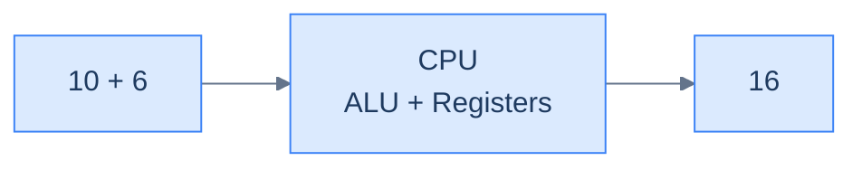
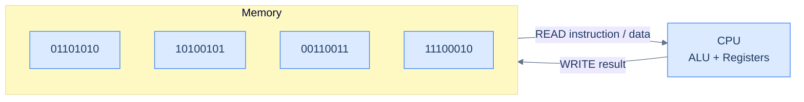
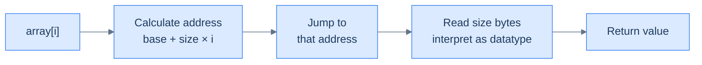

# 1. Introduction to arrays

## The Hook

A photo editor opens a 4096 × 4096 RGB image. That's 50 million bytes — three bytes per pixel, sixteen million pixels — and the user just clicked **Flip Horizontally**. They want to see the result before their finger leaves the trackpad.

On a laptop, the flip finishes in about 30 milliseconds. The CPU walks two rows at a time, swapping pixels left-to-right with right-to-left, moving sixteen bytes per cycle through SIMD instructions. The hardware *prefetches* the next cache line before the previous one finishes, because it knows exactly where the next byte lives: at the previous byte's address + 1.

None of that is possible without the array. Without **contiguous memory** — every pixel sitting next to its neighbour with no gaps — the prefetcher would have nothing to predict. Without **fixed element size** — every pixel exactly three bytes — "the next pixel" would not be a one-instruction addition. Without **O(1) indexing** — `image[row][col]` resolved with one multiplication and one addition — the editor would walk a linked list of pixels, pay a cache miss per step, and finish the flip in *seconds* instead of milliseconds.

The array is the one data structure your CPU loves most. It is the storage shape behind every other structure in this book: hash tables, heaps, stacks, queues, B-trees, every database row, every NumPy `ndarray`, every glyph your terminal renders. Nine out of ten production performance wins reduce to *"we changed a list of pointers into an array of values"*.

This first lesson sets up the language: how memory actually works, why a single contiguous block is more useful than a hundred named variables, the operations every array supports, and the address-arithmetic formula that makes random access free. By the end, you should be able to predict — for any code that touches an array — whether it'll fly or crawl.

> 🖼 Diagram — TODO: visual illustrating the hook's real-world scenario

---

## Table of contents

1. [Understanding the memory model](#understanding-the-memory-model)
2. [Understanding the problem](#understanding-the-problem)
3. [Exploring a possible solution](#exploring-a-possible-solution)
4. [Overview of supported operations](#overview-of-supported-operations)
5. [Internal mechanics of arrays](#internal-mechanics-of-arrays)
6. [Working example](#working-example)
7. [Edge cases and pitfalls](#edge-cases-and-pitfalls)
8. [Production reality](#production-reality)
9. [Practice ladder](#practice-ladder)
10. [Quiz](#quiz)
11. [Further reading](#further-reading)
12. [Cross-links](#cross-links)
13. [Final takeaway](#final-takeaway)

***

# Understanding the Memory Model

Before diving into data structures like arrays, we need to answer a surprisingly important question: **how does a computer actually store and retrieve data?**

What is computer memory? Why does it exist? How does a program even run? These fundamentals are what make everything else — arrays, pointers, data structures — click into place. In this lesson, we'll build a simple mental model of memory that works across almost all programming languages.

---

## Memory

Let's start with a concrete example. You ask the CPU to compute `10 + 6`. It does the math and produces `16`. Simple enough.

But here's the real question: **where does `16` go?**

> 🖼 Diagram — The CPU can add two numbers and produce the result — but where is that result stored?


<p align="center"><strong>The CPU can add two numbers and produce the result — but where is that result stored?</strong></p>

The CPU uses tiny internal slots called **registers** to hold values during computation. But registers are extremely limited in number. For data that needs to persist beyond a single instruction, we need something bigger: **computer memory (RAM)**.

RAM is its own chip on your motherboard. It doesn't compute anything — that's the CPU's job. Its entire purpose is to **store data** so it can be retrieved and updated later.

> 🖼 Diagram — CPU computes. RAM stores. They are two separate chips on your motherboard.
```d2
direction: right

cpu: CPU chip {
  ALU
  Registers
}

ram: RAM chip {
  grid-columns: 5
  c0: ""
  c1: ""
  c2: ""
  c3: ""
  c4: ""
}

cpu <-> ram: separate chips, different jobs
```

<p align="center"><strong>CPU computes. RAM stores. They are two separate chips on your motherboard.</strong></p>

---

### Everything is Binary

RAM is a chip, and chips work with electrical signals — high voltage (1) and low voltage (0). That means **everything stored in memory must be represented as 0s and 1s**.

Fortunately, this is easier than it sounds:

- **Numbers** → convert to base 2 (binary)
- **Text, images, etc.** → first encoded as numbers, then converted to binary

This is called the **binary form** of data. Every piece of information your program uses — integers, characters, floats, strings — lives in memory as a sequence of bits.

> **Memory trick:** Think of each bit as a light switch. On = 1, Off = 0. RAM is just a huge wall of light switches.

---

## The Memory Model

When writing real software, you don't want to think about voltage levels and transistors. That's where the **memory model** comes in.

A memory model is an abstraction — a simplified way to think about how memory works so you can reason about your code without getting lost in hardware details.

The mental model is dead simple:

> Imagine memory as a **long chain of numbered boxes**, starting at `0` and ending at `n - 1`, where `n` is the total number of boxes. That's it. This picture covers 99% of what you need when writing software.

> 🖼 Diagram — Memory can be visualized as a linear sequence of numbered blocks.
```d2
mem: Memory {
  grid-columns: 8
  grid-gap: 0
  b0: "0"
  b1: "1"
  b2: "2"
  b3: "3"
  b4: "4"
  b5: "5"
  b6: "6"
  b7: "n-1"
}
```

<p align="center"><strong>Memory can be visualized as a linear sequence of numbered blocks.</strong></p>

---

### Bits and Bytes

Each box in that chain holds exactly **8 bits**. A group of 8 bits is called a **byte** — the basic unit of memory, like a meter is the basic unit of distance.

| Unit | What it is |
|------|------------|
| **Bit** | A single binary digit — either `0` or `1` |
| **Byte** | A group of 8 bits |

So when you hear "this integer takes 4 bytes", it means 4 consecutive boxes in memory, holding 32 bits total.

---

### Addresses

Storing data is easy. But how do you *find* it again?

Each byte has a unique identifier based on its position — its **address**. It's just the index of the box, counting from 0.

> 🖼 Diagram — Each cell is 1 byte (8 bits); its position number is its address. Highlighted cell sits at address = 3.
```d2
mem: Memory {
  grid-columns: 6
  grid-gap: 0
  b0: "0"
  b1: "1"
  b2: "2"
  b3: "3" {style.fill: "#fde68a"; style.stroke: "#d97706"}
  b4: "4"
  b5: "5"
}
```

<p align="center"><strong>Each cell is 1 byte (8 bits); its position number is its address. Highlighted cell sits at <code>address = 3</code>.</strong></p>

> **Address in memory:** The address of data is the position of the **first byte** where that data starts.

If you store a 4-byte integer starting at address `3`, its address is `3` — even though it occupies boxes `3`, `4`, `5`, and `6`.

The CPU uses these addresses to read and write data with pinpoint precision. No searching required — it jumps straight to the right box.

> **Analogy:** Memory addresses are like house numbers on a street. You don't walk the entire street to find a house — you go directly to the number.

---

## Program Execution

Now let's zoom out and see how memory fits into the bigger picture of running a program.

When you run a program:
1. The compiler translates your source code into **machine code**
2. That machine code is **loaded into memory** in full
3. The CPU reads instructions from memory **sequentially**, starting at the first address
4. As it executes, the CPU reads data from memory, processes it, and writes results back

> 🖼 Diagram — The CPU and memory are in constant conversation during execution.


<p align="center"><strong>The CPU and memory are in constant conversation during execution.</strong></p>

Think of it like the human brain: one part breaks down complex problems (CPU), another part retains intermediate information (memory). They work together — neither can do much without the other.

Memory stores two kinds of things during a program's lifetime:
- **The program itself** (the machine code instructions)
- **The data** the program creates and manipulates

---

## Why This Matters for Arrays

This memory model is the foundation for understanding arrays — and nearly every other data structure.

- Arrays occupy a **contiguous sequence** of memory addresses
- Every element starts at a **predictable address** (calculable from the base address + element size)
- The CPU can jump to any element instantly because it knows the exact address

Once you have this mental picture — memory as a numbered line of bytes, each accessible by address — arrays become completely intuitive.

But there's still a question we haven't answered: when you write `array[3]`, what *exactly* happens between that source line and the value coming back? We'll trace it byte by byte before this lesson ends.

---

## Key Takeaway

- RAM is a storage chip; the CPU is a computation chip — they're separate and work together
- Everything in memory is stored as **binary (0s and 1s)**
- Memory = a long sequence of numbered **bytes** (each byte = 8 bits)
- Each byte has a unique **address** (its index from 0)
- The **address of data** = the first byte where it starts
- During execution, the CPU constantly reads instructions and data from memory and writes results back

***

# Understanding the Problem

To understand arrays and why we need them, let's look at a real problem that programmers run into all the time when designing software systems.

When writing a program, we often need to store a **collection of related data items** that can be accessed sequentially. For example, imagine storing the ages of all the students in a class.

If there are only a few students, storing them in separate variables feels fine:

> 🖼 Diagram — Using variables to store the ages of 3 students.
```d2
students: {
  grid-columns: 3
  grid-gap: 24
  a: "ageStudent1 = 12"
  b: "ageStudent2 = 13"
  c: "ageStudent3 = 13"
}
```

<p align="center"><strong>Using variables to store the ages of 3 students.</strong></p>

Easy enough. Three students, three variables. Done.

But what happens when the class has **hundreds of students**? Now you need hundreds of variables:

> 🖼 Diagram — Using variables to store ages of 108 students.
```d2
students: {
  grid-rows: 4
  grid-gap: 16
  s1: "ageStudent1 = 12"
  s2: "ageStudent2 = 13"
  s3: "ageStudent3 = 13"
  s4: "ageStudent4 = 11"
  s5: "ageStudent5 = 11"
  s6: "ageStudent6 = 12"
  s7: "ageStudent7 = 12"
  s8: "ageStudent8 = 13"
  s9: "......"
  s10: "......"
  s11: "......"
  s12: "......"
  s13: "ageStudent105 = 13"
  s14: "ageStudent106 = 11"
  s15: "ageStudent107 = 13"
  s16: "ageStudent108 = 11"
}
```

<p align="center"><strong>Using variables to store ages of 108 students.</strong></p>

While this technically works, storing and managing hundreds of values across hundreds of individually named variables is **error-prone and not scalable**.

> *Before reading on — picture the code that prints every student's age. With 108 separately-named variables, what would the loop body even look like? You'd need 108 hard-coded `print()` lines. There's no `i` to loop over.*

That last observation is the hidden cost — variables don't just multiply names, they kill loops.

---

## Limitations of Using Variables

Variables are incredibly useful for holding individual pieces of data. But when you try to use them to store a *collection* of related data, they start to break down fast.

Here's why:

- **A variable can store only one value at a time.**
- **Different variables that store the same type of information must have different names.** You can't call two things `ageStudent` — one has to be `ageStudent1`, another `ageStudent2`, and so on forever.
- **Too many variables complicate the source code and the programming logic**, making it error-prone.
- **Using variables to store lots of data is not scalable.** What happens when the class size changes? You'd need to add or remove variable declarations manually.

> **The real problem:** Variables are designed for individual values. They were never meant to handle collections.

---

## Why This Matters

Computers are designed to solve problems **at scale** — managing large amounts of data that would be impossible for humans to handle manually. Problems like these (storing and processing collections) are extremely common, even in the simplest software.

That's why even the **lowest-level programming languages**, such as assembly, inherently support a data structure for storing multiple values together.

That data structure is what we're about to learn: the **array**.

---

## Key Takeaway

| Approach | Works for | Breaks when |
|---|---|---|
| Separate variables | 2–3 values | Data grows, or you need to loop over it |
| Arrays | Any number of values | (Rarely — this is exactly what they're built for) |

The moment you find yourself typing `variable1`, `variable2`, `variable3`... stop. You need an array.

***

# Exploring a Possible Solution

Now that we understand the limitations of using variables and how they prevent us from designing solutions at scale, we can look at the data structure designed to address these problems.

---

## Enter the Array

> An array is a **contiguous segment of memory** that can store multiple data items simultaneously. In its simplest form, an array has a **fixed size** and can store only a fixed number of data items. All items in an array must be of the **same type**.

Let's break that definition down:

- **Contiguous** — all elements sit next to each other in memory, no gaps
- **Fixed size** — you decide how many items it holds when you create it
- **Same type** — you can't mix integers and strings in the same array

Visually, an array looks like a row of labelled boxes, all the same size, sitting side by side:

> 🖼 Diagram — An array data structure.
```d2
direction: right

arr: array {
  grid-columns: 7
  grid-gap: 0
  v1: value1
  v2: value2
  v3: value3
  v4: value4
  v5: value5
  v6: value6
  v7: value7
}

size: "◄────── size ──────►" {
  shape: text
}
size -> arr: "" {style.stroke-dash: 3}
```

<p align="center"><strong>An array data structure.</strong></p>

The `size` is fixed at creation time. Every cell holds one value of the same type, and every cell is the same width in memory.

---

## Solving the Student Ages Problem

Remember the problem from last lesson — storing ages for an entire class? With separate variables it fell apart at scale. An array solves this cleanly.

Instead of:
```
ageStudent1 = 12
ageStudent2 = 13
ageStudent3 = 13
... (×108)
```

You create **one** array that holds all the ages:

> 🖼 Diagram — Storing the ages of students in a class in an array.
```d2
ages: ages {
  grid-columns: 7
  grid-gap: 0
  a1: age1
  a2: age2
  a3: age3
  a4: age4
  a5: age5
  a6: age6
  a7: age7
}
```

<p align="center"><strong>Storing the ages of students in a class in an array.</strong></p>

One name. One structure. All the values.

---

## Why This Works

| Problem with variables | How arrays fix it |
|---|---|
| One value per variable | One array holds all values |
| Hundreds of different names | One name, access by index |
| Can't loop over them easily | Loop with `i` from `0` to `n-1` |
| Not scalable | Resize once, logic stays the same |

> **Key insight:** Instead of naming every value, you name the *collection* once and refer to items by their **position (index)**.

---

## Key Takeaway

An array is the simplest, most fundamental solution to the "store a collection of same-type values" problem. It trades flexibility (fixed size, fixed type) for speed and simplicity (instant access by index, compact in memory).

Every data structure you'll learn after this is either built on top of arrays or exists to solve a limitation of arrays.

***

# Overview of Supported Operations

Now that we know the logical representation of an array, let's examine how to **create**, **access**, **modify**, and **traverse** one. Almost all major programming languages support arrays in some form.

---

## Creating an Array

The syntax and rules for creating an array depend on the programming language. An array with a fixed size cannot be modified after creation, and all data items in an array must be of the same type.

> 🖼 Diagram — Creating an array of fixed size and datatype.
```d2
arr: array {
  grid-columns: 5
  grid-gap: 0
  v1: value1
  v2: value2
  v3: value3
  v4: value4
  v5: value5
}
```

<p align="center"><strong>Creating an array of fixed size and datatype.</strong></p>

Higher-level languages like Python inherently provide a **list** instead of a raw array. A list behaves like an array but has a dynamic size and can store elements of different types. However, the underlying machine-level implementation still uses basic arrays as the core data structure, which has a fixed size and type.


```python run viz=array viz-root=numbers
from typing import List

# Python lists are dynamic and can grow or shrink at runtime

# Declaring an array (list) of fixed size with default values
numbers: List[int] = [0] * 5

# Declaring and initializing an array
numbers2: List[int] = [1, 2, 3, 4, 5]

# Creating an array of size n
size_n: int = 5
numbers3: List[int] = [0] * size_n

# Creating and initializing using list comprehension
numbers4: List[int] = [i for i in range(5)]
```

```java run viz=array viz-root=numbers
public class Main {
    public static void main(String[] args) {
        // Arrays in Java are always allocated on the heap
        // and are automatically garbage collected

        // Declaring an array of fixed size 5
        int[] numbers = new int[5];

        // Declaring and initializing an array
        int[] numbers2 = {1, 2, 3, 4, 5};

        // Declaring and initializing an array using new keyword
        int[] numbers3 = new int[]{1, 2, 3, 4, 5};

        // Creating an array of size n
        int size_n = 5;
        int[] numbers4 = new int[size_n];

    }
}
```


> **Tip:** In Python, annotating with `List[int]` is just a hint — the runtime won't enforce it. But it's good practice to document your intent, especially for DSA problems.

---

## Accessing Elements in an Array

An array is a collection of data items stored in **contiguous memory**. This layout allows us to access any element directly using its **index** via the subscript operator `[]`.

> **Why do array indices start from 0 instead of 1?**
>
> Array indices represent an element's **relative** position from the array's beginning. The first element is 0 steps away from the start, the second is 1 step away, and so on. This is not a convention — it's a direct reflection of how address arithmetic works in memory.

> 🖼 Diagram — Array elements are accessed via their indices.
```d2
arr: array {
  grid-rows: 2
  grid-columns: 5
  grid-gap: 0
  v1: value1
  v2: value2
  v3: value3
  v4: value4
  v5: value5
  i0: "[0]"
  i1: "[1]"
  i2: "[2]"
  i3: "[3]"
  i4: "[4]"
}
```

<p align="center"><strong>Array elements are accessed via their indices.</strong></p>

Different languages have different syntax, but the underlying access mechanism is the same for all.


```python run viz=array viz-root=numbers
from typing import List

# Initializing an array (list)
numbers: List[int] = [1, 2, 3, 4, 5]

# Array elements are accessed using the
# subscript [] operator
print("1st value:", numbers[0])
print("5th value:", numbers[4])
```

```java run viz=array viz-root=numbers
public class Main {
    public static void main(String[] args) {

        // Initializing an array
        int[] numbers = {1, 2, 3, 4, 5};

        // Array elements are accessed using the
        // subscript [] operator
        System.out.println("1st value: " + numbers[0]);
        System.out.println("5th value: " + numbers[4]);
    }
}
```


> **Common mistake:** Accessing `numbers[5]` in a 5-element array raises an `IndexError`. Valid indices are `0` to `len(numbers) - 1`.

---

## Modifying Elements in an Array

Elements in an array can be modified in place, just like variables. To update a value, use `array[index]` on the left side of the assignment operator.

> 🖼 Diagram — Array elements can be modified via their indices (highlighted = being updated).
```d2
arr: array {
  grid-rows: 2
  grid-columns: 5
  grid-gap: 0
  v1: value1
  v2: value2 {style.fill: "#fde68a"; style.stroke: "#d97706"}
  v3: value3 {style.fill: "#fde68a"; style.stroke: "#d97706"}
  v4: value4
  v5: value5
  i0: "[0]"
  i1: "[1]" {style.fill: "#fde68a"; style.stroke: "#d97706"}
  i2: "[2]" {style.fill: "#fde68a"; style.stroke: "#d97706"}
  i3: "[3]"
  i4: "[4]"
}
```

<p align="center"><strong>Array elements can be modified via their indices (highlighted = being updated).</strong></p>


```python run viz=array viz-root=numbers
from typing import List

# Initializing an array (list)
numbers: List[int] = [1, 2, 3, 4, 5]

# Modifying array elements using the
# subscript [] operator
numbers[0] = 10
numbers[2] = 30
numbers[4] = 50

# Printing modified values
print("1st value:", numbers[0])
print("3rd value:", numbers[2])
print("5th value:", numbers[4])
```

```java run viz=array viz-root=numbers
public class Main {
    public static void main(String[] args) {

        // Initializing an array
        int[] numbers = {1, 2, 3, 4, 5};

        // Modifying array elements using the
        // subscript [] operator
        numbers[0] = 10;
        numbers[2] = 30;
        numbers[4] = 50;

        // Printing modified values
        System.out.println("1st value: " + numbers[0]);
        System.out.println("3rd value: " + numbers[2]);
        System.out.println("5th value: " + numbers[4]);
    }
}
```


Different languages implement this differently at the syntax level, but the underlying mechanism — overwriting a memory location at a known address — is the same everywhere.

---

## Traversing an Array

Traversal is one of the most common operations on an array. It is the **only** way to search for a value in an array and is implemented using a loop control variable as an index, starting from `0`. To traverse safely, the size of the array must be known.

The pointer starts at index `0` and steps forward one cell at a time until it reaches the end:

> ▶ Interactive Diagram — Traversing an array using a loop control variable index. Use Prev/Next/Play to step through.
```d3 widget=array-1d
{
  "steps": [
    {
      "nodes": [
        {
          "id": "0",
          "label": "1",
          "kind": "cell",
          "meta": [],
          "slot": 0,
          "cardId": "",
          "layoutKind": ""
        },
        {
          "id": "1",
          "label": "2",
          "kind": "cell",
          "meta": [],
          "slot": 1,
          "cardId": "",
          "layoutKind": ""
        },
        {
          "id": "2",
          "label": "3",
          "kind": "cell",
          "meta": [],
          "slot": 2,
          "cardId": "",
          "layoutKind": ""
        },
        {
          "id": "3",
          "label": "4",
          "kind": "cell",
          "meta": [],
          "slot": 3,
          "cardId": "",
          "layoutKind": ""
        },
        {
          "id": "4",
          "label": "5",
          "kind": "cell",
          "meta": [],
          "slot": 4,
          "cardId": "",
          "layoutKind": ""
        }
      ],
      "edges": [],
      "cursor": [
        {
          "name": "index",
          "target": "0",
          "color": "#3b82f6"
        }
      ],
      "highlight": [],
      "changed": [],
      "removed": [],
      "annotation": "Start at index = 0; read arr[0] = 1.",
      "line": 0,
      "frames": [],
      "cardCursor": []
    },
    {
      "nodes": [
        {
          "id": "0",
          "label": "1",
          "kind": "cell",
          "meta": [],
          "slot": 0,
          "cardId": "",
          "layoutKind": ""
        },
        {
          "id": "1",
          "label": "2",
          "kind": "cell",
          "meta": [],
          "slot": 1,
          "cardId": "",
          "layoutKind": ""
        },
        {
          "id": "2",
          "label": "3",
          "kind": "cell",
          "meta": [],
          "slot": 2,
          "cardId": "",
          "layoutKind": ""
        },
        {
          "id": "3",
          "label": "4",
          "kind": "cell",
          "meta": [],
          "slot": 3,
          "cardId": "",
          "layoutKind": ""
        },
        {
          "id": "4",
          "label": "5",
          "kind": "cell",
          "meta": [],
          "slot": 4,
          "cardId": "",
          "layoutKind": ""
        }
      ],
      "edges": [],
      "cursor": [
        {
          "name": "index",
          "target": "1",
          "color": "#3b82f6"
        }
      ],
      "highlight": [],
      "changed": [],
      "removed": [],
      "annotation": "Advance: index = 1; read arr[1] = 2.",
      "line": 0,
      "frames": [],
      "cardCursor": []
    },
    {
      "nodes": [
        {
          "id": "0",
          "label": "1",
          "kind": "cell",
          "meta": [],
          "slot": 0,
          "cardId": "",
          "layoutKind": ""
        },
        {
          "id": "1",
          "label": "2",
          "kind": "cell",
          "meta": [],
          "slot": 1,
          "cardId": "",
          "layoutKind": ""
        },
        {
          "id": "2",
          "label": "3",
          "kind": "cell",
          "meta": [],
          "slot": 2,
          "cardId": "",
          "layoutKind": ""
        },
        {
          "id": "3",
          "label": "4",
          "kind": "cell",
          "meta": [],
          "slot": 3,
          "cardId": "",
          "layoutKind": ""
        },
        {
          "id": "4",
          "label": "5",
          "kind": "cell",
          "meta": [],
          "slot": 4,
          "cardId": "",
          "layoutKind": ""
        }
      ],
      "edges": [],
      "cursor": [
        {
          "name": "index",
          "target": "2",
          "color": "#3b82f6"
        }
      ],
      "highlight": [],
      "changed": [],
      "removed": [],
      "annotation": "Advance: index = 2; read arr[2] = 3.",
      "line": 0,
      "frames": [],
      "cardCursor": []
    },
    {
      "nodes": [
        {
          "id": "0",
          "label": "1",
          "kind": "cell",
          "meta": [],
          "slot": 0,
          "cardId": "",
          "layoutKind": ""
        },
        {
          "id": "1",
          "label": "2",
          "kind": "cell",
          "meta": [],
          "slot": 1,
          "cardId": "",
          "layoutKind": ""
        },
        {
          "id": "2",
          "label": "3",
          "kind": "cell",
          "meta": [],
          "slot": 2,
          "cardId": "",
          "layoutKind": ""
        },
        {
          "id": "3",
          "label": "4",
          "kind": "cell",
          "meta": [],
          "slot": 3,
          "cardId": "",
          "layoutKind": ""
        },
        {
          "id": "4",
          "label": "5",
          "kind": "cell",
          "meta": [],
          "slot": 4,
          "cardId": "",
          "layoutKind": ""
        }
      ],
      "edges": [],
      "cursor": [
        {
          "name": "index",
          "target": "3",
          "color": "#3b82f6"
        }
      ],
      "highlight": [],
      "changed": [],
      "removed": [],
      "annotation": "Advance: index = 3; read arr[3] = 4.",
      "line": 0,
      "frames": [],
      "cardCursor": []
    },
    {
      "nodes": [
        {
          "id": "0",
          "label": "1",
          "kind": "cell",
          "meta": [],
          "slot": 0,
          "cardId": "",
          "layoutKind": ""
        },
        {
          "id": "1",
          "label": "2",
          "kind": "cell",
          "meta": [],
          "slot": 1,
          "cardId": "",
          "layoutKind": ""
        },
        {
          "id": "2",
          "label": "3",
          "kind": "cell",
          "meta": [],
          "slot": 2,
          "cardId": "",
          "layoutKind": ""
        },
        {
          "id": "3",
          "label": "4",
          "kind": "cell",
          "meta": [],
          "slot": 3,
          "cardId": "",
          "layoutKind": ""
        },
        {
          "id": "4",
          "label": "5",
          "kind": "cell",
          "meta": [],
          "slot": 4,
          "cardId": "",
          "layoutKind": ""
        }
      ],
      "edges": [],
      "cursor": [
        {
          "name": "index",
          "target": "4",
          "color": "#3b82f6"
        }
      ],
      "highlight": [],
      "changed": [],
      "removed": [],
      "annotation": "Advance: index = 4; read arr[4] = 5.",
      "line": 0,
      "frames": [],
      "cardCursor": []
    },
    {
      "nodes": [
        {
          "id": "0",
          "label": "1",
          "kind": "cell",
          "meta": [],
          "slot": 0,
          "cardId": "",
          "layoutKind": ""
        },
        {
          "id": "1",
          "label": "2",
          "kind": "cell",
          "meta": [],
          "slot": 1,
          "cardId": "",
          "layoutKind": ""
        },
        {
          "id": "2",
          "label": "3",
          "kind": "cell",
          "meta": [],
          "slot": 2,
          "cardId": "",
          "layoutKind": ""
        },
        {
          "id": "3",
          "label": "4",
          "kind": "cell",
          "meta": [],
          "slot": 3,
          "cardId": "",
          "layoutKind": ""
        },
        {
          "id": "4",
          "label": "5",
          "kind": "cell",
          "meta": [],
          "slot": 4,
          "cardId": "",
          "layoutKind": ""
        }
      ],
      "edges": [],
      "cursor": [],
      "highlight": [],
      "changed": [],
      "removed": [],
      "annotation": "index = 5 ≥ length — loop ends. Every element has been visited exactly once.",
      "line": 0,
      "frames": [],
      "cardCursor": []
    }
  ],
  "title": "Traversing an array with a loop control variable"
}
```

<p align="center"><strong>Traversing an array using a loop control variable <code>index</code>. Use Prev/Next/Play to step through.</strong></p>

Higher-level languages have built-in functions to get the array's length. For lower-level languages like C/C++, the programmer needs to track the array's size manually.


```python run viz=array viz-root=numbers
from typing import List

# Initializing an array (list)
numbers: List[int] = [1, 2, 3, 4, 5]

# 1. Traversal using index-based for loop
for index in range(len(numbers)):
    print(numbers[index])

# 2. Traversal using direct for-each loop
for value in numbers:
    print(value)

# 3. Traversal using enumerate (index + value)
for index, value in enumerate(numbers):
    print(index, value)

# 4. Traversal using while loop
index: int = 0
while index < len(numbers):
    print(numbers[index])
    index += 1

# 5. Reverse traversal
for index in range(len(numbers) - 1, -1, -1):
    print(numbers[index])
```

```java run viz=array viz-root=numbers
public class Main {
    public static void main(String[] args) {

        // Initializing an array
        int[] numbers = {1, 2, 3, 4, 5};

        // 1. Traversal using index-based for loop
        for (int index = 0; index < numbers.length; index++) {
            System.out.print(numbers[index] + " ");
        }
        System.out.println();

        // 2. Traversal using enhanced for-each loop
        for (int value : numbers) {
            System.out.print(value + " ");
        }
        System.out.println();

        // 3. Reverse traversal
        for (int index = numbers.length - 1; index >= 0; index--) {
            System.out.print(numbers[index] + " ");
        }
        System.out.println();
    }
}
```


> **Which to use?**
> - Use `for value in numbers` when you only need the value
> - Use `for index, value in enumerate(numbers)` when you need both
> - Use `while` when you need finer control (e.g. skip indices, step by 2)
> - Walk the index range backwards (`range(len(numbers) - 1, -1, -1)`) for a reverse traversal

---

## Summary

| Operation | Syntax | Time Complexity |
|---|---|---|
| **Create** | `numbers = [0] * n` | O(n) |
| **Access** | `numbers[i]` | O(1) |
| **Modify** | `numbers[i] = x` | O(1) |
| **Traverse** | `for i in range(len(numbers))` | O(n) |

Access and modify are **O(1)** because the CPU computes the exact memory address directly from the index — no searching required. Traversal is **O(n)** because every element must be visited.

***

# Internal Mechanics of Arrays

So far, we learned what an array is and how it solves problems where we need to store and manipulate large-scale data easily. We can now look at **how the array data structure works under the hood** and what makes it so fast and easy to use.

---

## Memory Addresses

Array elements are accessed using indices because arrays are stored **contiguously** in memory. To understand why, let's revisit the memory model.

> **Note:** This is how an array data structure is stored at the lowest level. Higher-level programming languages abstract all this from the user, but at their core, use the same mechanism.

Memory in RAM is logically organized as a sequence of blocks, each **1 byte (8 bits)** long. Every block has a unique identifier — its **address** — which is simply its relative position from the start (starting from 0).

> 🖼 Diagram — Memory is logically organized as a linear sequence of byte-sized cells. Highlighted cell sits at address = 3.
```d2
mem: Memory {
  grid-columns: 8
  grid-gap: 0
  b0: "0"
  b1: "1"
  b2: "2"
  b3: "3" {style.fill: "#fde68a"; style.stroke: "#d97706"}
  b4: "4"
  b5: "5"
  b6: "6"
  b7: "7"
}
```

<p align="center"><strong>Memory is logically organized as a linear sequence of byte-sized cells. Highlighted cell sits at <code>address = 3</code>.</strong></p>

---

## Layout in Memory

An array is just a **continuous** segment of memory that stores data of a single type. Each element in the array has a fixed size equal to the size of its data type. So:

> **Total size of array** = size of datatype × number of elements

The address of the memory block where an array starts is called the array's **base address**.

> **Base address:** The address of the block of memory where an array starts. The base address, along with the index, is used to access data items in an array.

Here's what an array of 5 integers looks like in memory, with a base address of `2` and each `int` occupying **4 bytes**:

> 🖼 Diagram — Structure of an array in memory — base address = 2, each int spans 4 bytes. The first element starts at the base address (highlighted).
```d2
arr: array {
  grid-rows: 3
  grid-columns: 5
  grid-gap: 0
  v0: value1 {style.fill: "#fde68a"; style.stroke: "#d97706"}
  v1: value2
  v2: value3
  v3: value4
  v4: value5
  i0: "[0]"
  i1: "[1]"
  i2: "[2]"
  i3: "[3]"
  i4: "[4]"
  a0: "2→5"
  a1: "6→9"
  a2: "10→13"
  a3: "14→17"
  a4: "18→21"
}
```

<p align="center"><strong>Structure of an array in memory — base address = <code>2</code>, each <code>int</code> spans 4 bytes. The first element starts at the base address (highlighted).</strong></p>

Key observations:
- Elements are laid out **back to back** with no gaps
- Each element spans exactly `size_of_datatype` bytes
- The next element always starts exactly `size_of_datatype` bytes after the previous one

---

## Accessing Data Items

Now that we know how an array maps into continuous memory, we can derive a simple formula to calculate the address of **any element**, given:
- the **base address** (where the array starts)
- the **size of the datatype** (bytes per element)
- the **index** (which element we want)

> *Before reading on — try writing the formula yourself. Given base `2`, int size `4`, and index `3`, where does element 3 live? What arithmetic gets you there from base?*

> $$\text{address}(index) = base\_address + (size\_of\_datatype \times index)$$

Let's verify with our example (base address = `2`, int = `4` bytes):

| Index | Formula | Address |
|-------|---------|---------|
| 0 | 2 + (4 × 0) | **2** |
| 1 | 2 + (4 × 1) | **6** |
| 2 | 2 + (4 × 2) | **10** |
| 3 | 2 + (4 × 3) | **14** |
| 4 | 2 + (4 × 4) | **18** |

This matches the layout exactly.

> **This is why array indices start at 0, not 1.**
>
> Think of the index not as a position number, but as a **how many elements to skip** count.
>
> - To reach the first element — skip **0** elements → index `0`
> - To reach the second element — skip **1** element → index `1`
> - To reach the third element — skip **2** elements → index `2`
>
> The formula makes this concrete. With base address `2` and int size `4`:
>
> - `index 0` → 2 + (4 × **0**) = **2** ✓ lands exactly at the first element
> - `index 1` → 2 + (4 × **1**) = **6** ✓ lands exactly at the second element
>
> If indices started at `1` instead, `index 1` would give address `6` — jumping straight past the first element at address `2`, which would never be reachable. You'd need a messy correction like `base + (size × (index − 1))`. Starting at `0` keeps the formula clean and direct.

The CPU computes this address **instantly** using a single multiplication and addition — no iteration, no searching. That's why array access is O(1).

---

## Key Takeaway

The power of arrays comes from this formula. Once you know the base address and the datatype size, you can jump to any element in constant time. The CPU doesn't need to scan from the beginning — it does one arithmetic operation and lands exactly at the right memory address.


```python run
# Simulate the subscript-operator's address arithmetic for an int array of length 5.
base_address = 2
size_of_int = 4  # bytes

def address_of(index: int) -> int:
    return base_address + (size_of_int * index)

for i in range(5):
    print(f"value{i+1} at index {i} → address {address_of(i)}")
```

```java run
public class Main {
    static final int BASE_ADDRESS = 2;
    static final int SIZE_OF_INT = 4;

    static int addressOf(int index) {
        return BASE_ADDRESS + SIZE_OF_INT * index;
    }

    public static void main(String[] args) {
        for (int i = 0; i < 5; i++) {
            System.out.println("value" + (i + 1) + " at index " + i + " → address " + addressOf(i));
        }
    }
}
```


***

# Working Example

Now that we know how an array is stored in memory, let's walk through a **complete end-to-end example** — from logical representation all the way down to how the CPU locates and reads a value using the subscript operator `[]`.

Given below is the logical representation of an integer array with 5 data items:

> 🖼 Diagram — Logical representation of an integer array with 5 data items.
```d2
direction: right

decl: "array[5]" {
  shape: oval
}

arr: array {
  grid-columns: 5
  grid-gap: 0
  v1: value1
  v2: value2
  v3: value3
  v4: value4
  v5: value5
}

decl -> arr: logical representation
```

<p align="center"><strong>Logical representation of an integer array with 5 data items.</strong></p>

---

## Layout in Memory

We map the array into memory starting at **base address 2**. Because this is an integer array, we consider the size of each data item to be **4 bytes** for this example.

> 🖼 Diagram — An array of 5 integers mapped into continuous memory starting at address 2 (highlighted = base).
```d2
arr: array {
  grid-rows: 3
  grid-columns: 5
  grid-gap: 0
  v0: value1 {style.fill: "#fde68a"; style.stroke: "#d97706"}
  v1: value2
  v2: value3
  v3: value4
  v4: value5
  i0: "[0]"
  i1: "[1]"
  i2: "[2]"
  i3: "[3]"
  i4: "[4]"
  a0: "2→5"
  a1: "6→9"
  a2: "10→13"
  a3: "14→17"
  a4: "18→21"
}
```

<p align="center"><strong>An array of 5 integers mapped into continuous memory starting at address <code>2</code> (highlighted = base).</strong></p>

Each element occupies exactly 4 consecutive bytes. The elements are laid out back to back with no gaps — that's what "contiguous" means.

---

## Calculating the Address of Data Items

When we write `array[2]` or `array[3]`, the program uses the formula we learned to calculate the exact memory address of that element:

> `address(index) = base_address + (size_of_datatype × index)`

The program already knows the base address and the size of the data type — this is all it needs. Let's see it in action for two accesses:

> 🖼 Diagram — Calculating the address for array[2] and array[3] using the subscript operator.
```d2
c2: |md
  **array[2]**<br/>`2 + (2 × 4) = 10`
| {style.fill: "#fef9c3"; style.stroke: "#d97706"}

c3: |md
  **array[3]**<br/>`2 + (3 × 4) = 14`
| {style.fill: "#dcfce7"; style.stroke: "#16a34a"}

arr: array {
  grid-rows: 2
  grid-columns: 5
  grid-gap: 0
  v0: value1
  v1: value2
  v2: value3 {style.fill: "#fef9c3"; style.stroke: "#d97706"}
  v3: value4 {style.fill: "#dcfce7"; style.stroke: "#16a34a"}
  v4: value5
  a0: "addr 2"
  a1: "addr 6"
  a2: "addr 10" {style.fill: "#fef9c3"; style.stroke: "#d97706"}
  a3: "addr 14" {style.fill: "#dcfce7"; style.stroke: "#16a34a"}
  a4: "addr 18"
}

c2 -> arr.v2
c3 -> arr.v3
```

<p align="center"><strong>Calculating the address for <code>array[2]</code> and <code>array[3]</code> using the subscript operator.</strong></p>

The CPU performs one multiplication and one addition — and it's done. No scanning, no searching. That's why access is always **O(1)**, regardless of array size.

---

## Dereferencing the Value

Calculating the address is only **half** the work. The next step is to actually read the value stored there — this is called **dereferencing**.

The program knows the type of data stored in the array (integer, in our case). So starting from the calculated address, it reads exactly `size_of_datatype` bytes (4 bytes for an int) and interprets them as the value.

> **Dereferencing:** Accessing the value stored at the memory address held by a pointer. The pointer's data type determines how many bytes to read and how to interpret them.

> 🖼 Diagram — Dereferencing: reading the value at the calculated address using the datatype to determine how many bytes to interpret.
```d2
direction: right

a2: "array[2] = 10" {style.fill: "#fef9c3"; style.stroke: "#d97706"}
v3: value3 {style.fill: "#fef9c3"; style.stroke: "#d97706"}
a2 -> v3: read 4 bytes at addr 10

a3: "array[3] = 14" {style.fill: "#dcfce7"; style.stroke: "#16a34a"}
v4: value4 {style.fill: "#dcfce7"; style.stroke: "#16a34a"}
a3 -> v4: read 4 bytes at addr 14
```

<p align="center"><strong>Dereferencing: reading the value at the calculated address using the datatype to determine how many bytes to interpret.</strong></p>

> **Note:** Lower-level languages like C and C++ expose this mechanism directly through **pointers** — variables that store memory addresses and let you read or manipulate any part of a contiguous memory segment. In Python and most high-level languages, this all happens invisibly.

---

## Putting It All Together

Here's the full sequence of what happens every time you write `array[i]`:

> 🖼 Diagram — The full pipeline for a single array element access.


<p align="center"><strong>The full pipeline for a single array element access.</strong></p>

> **We used 4-byte integers in this example, but the underlying mechanism is identical for any datatype** — 1-byte chars, 8-byte doubles, or any custom struct. The formula stays the same; only `size_of_datatype` changes.

All of this happens automatically under the hood in modern programming languages. As a programmer, you just write `array[i]` — the language handles the address arithmetic and dereferencing for you.

---

## Key Takeaway

The subscript operator `array[i]` is not magic — it's one multiplication, one addition, and one memory read. The CPU knows exactly where to go, reads exactly the right number of bytes, and hands the value back. That's what makes arrays so fast and so fundamental.


```python run
# Full subscript pipeline: address = base + size × index, then read 4 bytes.
base_address = 2
size_of_int = 4

def access(index: int) -> str:
    addr = base_address + (size_of_int * index)
    return f"array[{index}] → address {addr} → value{index + 1}"

for i in range(5):
    print(access(i))
```

```java run
public class Main {
    static final int BASE = 2;
    static final int SIZE = 4;

    static String access(int index) {
        int addr = BASE + SIZE * index;
        return "array[" + index + "] → address " + addr + " → value" + (index + 1);
    }

    public static void main(String[] args) {
        for (int i = 0; i < 5; i++) System.out.println(access(i));
    }
}
```

***

# Edge Cases and Pitfalls

The array is the simplest data structure in this book and somehow ships with the longest list of bugs in production. The list below is the catalogue every reviewer eventually develops — keep it open the next time you're staring at an off-by-one or a mysterious `IndexError` at 2 a.m.

- **Off-by-one on the upper bound.** Valid indices are `0` to `n − 1`, not `1` to `n`. The fence-post bug — `for i in range(1, n + 1)` when you meant `range(n)` — is the single most common array bug in the world. Triple-check ranges around the *last* element.
- **Out-of-bounds reads in C are undefined behaviour, not errors.** `arr[n]` in C is *legal compilation*; the runtime happily reads whatever bytes happen to live past the array. You'll get junk, a segfault, *or* a security vulnerability — the program may appear to work for years before someone notices. Python (`IndexError`), Java (`ArrayIndexOutOfBoundsException`), and Rust (panic) all check; C and C++ do not. Bounds-check yourself or use a memory-safe language for the parts of the codebase that handle untrusted input.
- **Negative indexing isn't portable.** `arr[-1]` is "the last element" in Python, JavaScript (with `at()`), and Ruby. In C, it reads memory *before* the array — undefined. In Java, `IndexOutOfBoundsException`. Always compute `arr[len − 1]` explicitly when porting code across languages.
- **Insertion in the middle is O(n), not O(1).** `list.insert(i, x)` in Python and `ArrayList.add(i, x)` in Java look like a one-liner — they're not. Every element from index `i` to the end shifts one slot to the right. For an array of a million ints, that's a million byte-copies. If you find yourself inserting in the middle inside a loop, you've written quadratic code without noticing.
- **Deletion in the middle is also O(n).** Same shift, opposite direction. A `for x in arr: if predicate(x): arr.remove(x)` loop is `O(n²)` for the same reason — and worse, removing while iterating mutates what you're iterating over (skipped elements, confused indices). Use `arr = [x for x in arr if not predicate(x)]` for a clean O(n) pass.
- **Stack-allocated arrays have a 1 MB ceiling.** In C, `int big[1_000_000]` declared inside a function blows the stack on most platforms. The fix: `malloc` or static allocation. In Java, all arrays are heap-allocated, so this trap doesn't apply. In Rust, fixed-size arrays go on the stack by default — same trap. Big arrays belong on the heap.
- **Modifying while iterating breaks loops in subtle ways.** Python iterates `for x in arr:` over an evolving list and silently skips elements when you `arr.pop(0)` mid-loop. Java's `ArrayList` throws `ConcurrentModificationException`. Both are warning you about the same hazard: snapshot the indices first, or copy the list, or filter into a new list.
- **Slicing creates a copy in Python, a view in NumPy.** `lst[1:5]` allocates a new list. `np_arr[1:5]` returns a view into the same backing buffer — writes back-propagate. Mixing the two mental models is how a NumPy `slice` "mysteriously" mutates the original array; converting it back to a list with `.copy()` or `np.array(...)` snaps it.
- **Row-major vs column-major matters for cache.** C, C++, Python, Java, and most languages lay out 2D arrays *row by row* (row-major). Fortran, MATLAB, and (by default) R use column-major. Iterating `for i: for j: arr[i][j]` is *cache-friendly* in row-major and *cache-hostile* in column-major; swap the loops and you get a 5–10× difference in wall-clock time. NumPy lets you choose with `order='C'` or `order='F'`.
- **Dynamic arrays amortise; they don't promise O(1) per push.** Python's `list.append`, Java's `ArrayList.add`, Go's `append`, C++'s `std::vector::push_back` are all *amortised* O(1). When the array is full, the next push triggers a `2×` resize that copies the whole buffer — a single O(n) hiccup. For latency-critical paths (game frames, real-time audio, trading hot loops), pre-size the buffer with `arr = [0] * n` or `new ArrayList<>(n)` to skip the resizes entirely.

***

# Production Reality

The array's range goes from "the smallest helper inside a leetcode solution" to "the storage layer of every database in the world". The six places below are worth knowing by name.

**[NumPy's `ndarray`]** — uses **a contiguous C buffer with a strides descriptor** — because vectorised math needs zero per-element interpreter overhead.

A single contiguous C array sits under every multi-dimensional shape, with a *strides* descriptor on top so indexing, slicing, and broadcasting all reduce to address arithmetic. Every PyTorch tensor, every Pandas column, every scikit-learn model parameter ultimately bottoms out here. The reason `for x in array: process(x)` is slow but `np.process(array)` is fast is exactly this: vectorised ops walk the contiguous buffer in tight C; Python loops pay an interpreter dispatch per element. Source: [arrayobject.c](https://github.com/numpy/numpy/blob/main/numpy/_core/src/multiarray/arrayobject.c).

**[Redis ziplist / listpack]** — uses **a packed array of variable-length entries** — because the cache wins of contiguous memory beat asymptotic wins below ~128 entries.

Small Redis lists, hashes, and sorted sets are stored as one packed array instead of a real linked list or hash table. Below the configured threshold (`list-max-listpack-size`, `hash-max-listpack-entries`), the cache locality of the array form wins outright. Redis literally chooses the array layout for the small case and switches structure only when it grows past the threshold. Source: [listpack.c](https://github.com/redis/redis/blob/unstable/src/listpack.c).

**[Postgres B-tree pages]** — uses **a sorted array of `(key, tuple-pointer)` entries per page** — because binary search over a cache-friendly buffer beats pointer-chasing per node.

Every page in the index is a fixed-size buffer (8 KB by default) holding a sorted array of entries, with binary search inside the page. Walking the B-tree becomes a chain of array binary searches, one per level. The page-as-array model is what makes an index lookup feel instant on tables of a billion rows. Source: [nbtsearch.c](https://github.com/postgres/postgres/blob/master/src/backend/access/nbtree/nbtsearch.c).

**[The Linux VFS dispatch table]** — uses **a fixed array of function pointers** — because a one-step indexed lookup is the fastest possible polymorphic dispatch.

`struct file_operations` is an array of function pointers — `open`, `read`, `write`, `llseek`, and the rest. Every `read()` syscall does a one-step pointer-array lookup to find the right driver function. The same trick powers every C++ vtable, every COM interface, every JVM virtual-method dispatch — under the hood, it is an array of pointers. Source: [include/linux/fs.h](https://github.com/torvalds/linux/blob/master/include/linux/fs.h).

**[LMAX Disruptor / ring buffers in trading systems]** — uses **a pre-allocated array as a ring buffer** — because eliminating allocator calls and pointer-chasing pushes throughput past six million messages per second per thread.

High-throughput message passing inside a single process uses a pre-allocated array with reader and writer cursors held as atomic integers. No allocations on the hot path; cache-line-aligned slots; no contention except where it is mathematically necessary. The throughput win is not a clever algorithm — it is the absence of allocator calls and pointer-chasing. Source: [disruptor design paper](https://lmax-exchange.github.io/disruptor/disruptor.html).

**[Java's `HashMap` bucket table]** — uses **`Node<K,V>[] table` — a plain array of bucket pointers** — because hash tables fundamentally require O(1) indexed dispatch from a hash code to a bucket.

The map "is" a hash table because of how the array is *used*; the underlying storage is the same primitive we have been discussing. Same story for Python's dict (a hash table backed by an array of `PyDictKeyEntry`), Go's map, and every standard library on every platform. Source: [HashMap.java](https://github.com/openjdk/jdk/blob/master/src/java.base/share/classes/java/util/HashMap.java).

***

# Practice Ladder

Five problems, easiest first. Try each unaided; hit the hint only after ten minutes stuck; don't peek at solutions until you've made the array *do something* in code.

| # | Problem | Pattern | Difficulty | Hint |
|---|---------|---------|------------|------|
| 1 | [Two Sum](https://leetcode.com/problems/two-sum/) | [Two Pointers Reduction](./05-pattern-two-pointers-reduction/02-problems/01-two-sum.md) | Easy | Scan once, build a `value → index` hash map. For each `x`, check whether `target − x` is already in the map. One pass, `O(n)`. |
| 2 | [Best Time to Buy and Sell Stock](https://leetcode.com/problems/best-time-to-buy-and-sell-stock/) | [Variable Sliding Window](./09-pattern-variable-sliding-window/01-pattern.md) | Easy | Track `min_price_so_far` as you scan. At each day, candidate profit is `price − min_price_so_far`. Answer is the max. |
| 3 | [Rotate Array](https://leetcode.com/problems/rotate-array/) | [Two Pointers](./04-pattern-two-pointers/01-pattern.md) | Medium | Reversal trick: reverse the whole array, then the first `k`, then the remaining `n − k`. Three reversals, `O(n)` time, `O(1)` space. Don't forget `k %= n`. |
| 4 | [Container With Most Water](https://leetcode.com/problems/container-with-most-water/) | [Two Pointers Reduction](./05-pattern-two-pointers-reduction/02-problems/04-largest-container.md) | Medium | Start one pointer at each end. Area is `min(height[L], height[R]) × (R − L)`. Move the *shorter* pointer inward — the taller one can only decrease the area. |
| 5 | [Trapping Rain Water](https://leetcode.com/problems/trapping-rain-water/) | [Two Pointers Reduction](./05-pattern-two-pointers-reduction/01-pattern.md) | Hard | Water above bar `i` is `min(max_left[i], max_right[i]) − height[i]`. Three passes give `O(n)` time, `O(n)` space; the two-pointer variant compresses to `O(1)` space. |

Once these feel automatic, you have internalised every move the two-pointer, prefix-sum, and sliding-window vocabularies will ask of you — ready for the pattern chapters that name and reuse them.

***

# Quiz

Test your grip before moving on. One answer per question; reveal only after you have committed to one.

**[Recall] Q: Given an integer array with base address `100` and 4-byte ints, what is the address of `arr[7]`?**
`100 + 4 × 7 = 128`.

**[Recall] Q: What is the worst-case time complexity of inserting a value at the middle of an array of length `n`?**
`O(n)` — every element from the insertion index onward shifts one slot to the right.

**[Reasoning] Q: Why is `arr[i]` `O(1)` regardless of how large `i` is?**
The address `base + size × i` is one multiplication and one addition; the cost does not depend on `i` or on `n`, so access is constant time.

**[Reasoning] Q: Why are arrays cache-friendly in real wall-clock terms, not just in Big-O?**
Contiguous memory plus fixed element size lets the CPU's hardware prefetcher predict and fetch the next cache line before the program asks for it; linked structures fight this at every pointer hop.

**[Tradeoff] Q: When does a dynamic array (`list.append`, `ArrayList.add`) hide an `O(n)` step inside its "`O(1)`" promise, and how do you avoid it in latency-critical code?**
The promise is *amortised* `O(1)` — every full buffer triggers an `O(n)` resize-and-copy. Pre-size the array (`[0] * n`, `new ArrayList<>(n)`) when you know the final size to skip the resize hiccups entirely.

***

# Further Reading

Curated paths in, not a syllabus. Read in order of the annotation; come back for the rest when you need depth.

- **[CLRS — Chapter 10: Elementary Data Structures](https://mitpress.mit.edu/9780262046305/introduction-to-algorithms/)**
  ★ Essential — the canonical reference for arrays, stacks, and queues; the abstract definitions every other source builds on.
- **[Ulrich Drepper — "What Every Programmer Should Know About Memory"](https://people.freebsd.org/~lstewart/articles/cpumemory.pdf)**
  ◆ Advanced — explains *why* contiguous memory is fast at the hardware level. Cache lines, prefetchers, NUMA, all the way down.
- **[Bjarne Stroustrup — "Why you should avoid linked lists" (GoingNative 2012)](https://www.youtube.com/watch?v=YQs6IC-vgmo)**
  ★ Essential — a 30-second clip that turns the cache-locality argument into a concrete benchmark; the punchline lands harder than any textbook chart.
- **[NumPy internals: the `ndarray` object](https://numpy.org/doc/stable/reference/arrays.ndarray.html)**
  → Reference — how strides, dtypes, and views are layered over the contiguous buffer; the doc to keep open when reading NumPy source.
- **[Python `list` implementation — `listobject.c`](https://github.com/python/cpython/blob/main/Objects/listobject.c)**
  ◆ Advanced — the canonical "dynamic array of `PyObject*` pointers" implementation, including the growth factor (`new_allocated = (size_t)newsize + (newsize >> 3) + 6`) that gives the amortised `O(1)` append its real-world shape.

***

# Cross-Links

**Prerequisites**

- [Asymptotic Analysis](/cortex/data-structures-and-algorithms/foundations-asymptotic-analysis) — what `O(1)`, `O(n)`, and `amortised O(1)` mean, and how to derive them from a loop.

**What comes next**

- [Multidimensional Arrays](/cortex/data-structures-and-algorithms/linear-structures-arrays-multidimensional) — the address formula extended to 2D and beyond, with row-major vs column-major in detail.
- [Two Pointers](/cortex/data-structures-and-algorithms/linear-structures-arrays-pattern-two-pointers) — the first major traversal pattern that the array's contiguous layout unlocks.
- [Fixed Sliding Window](/cortex/data-structures-and-algorithms/linear-structures-arrays-pattern-fixed-sliding-window) — the second traversal pattern; an `O(1)` extension of two pointers over a windowed subarray.
- [Hash Tables](/cortex/data-structures-and-algorithms/linear-structures-hash-table-introduction-to-hash-tables) — the next structure, itself backed by an array of buckets; the "trade `O(n²)` for `O(n)` with a hash map" move shows up constantly.

***

## Final Takeaway

1. **Core mechanic:** an array is a contiguous block of same-sized cells, addressable by index in `O(1)` time via `address = base + size × index`.
2. **Dominant tradeoff:** you gain constant-time random access and cache-friendly traversal; you give up cheap middle insertion and deletion (both `O(n)` shifts) and the freedom to mix element types or grow without reallocating.
3. **One thing to remember:** every other data structure in this book is either built on top of an array or exists to work around one of its limitations — so understanding the array is the floor for understanding everything that follows.
