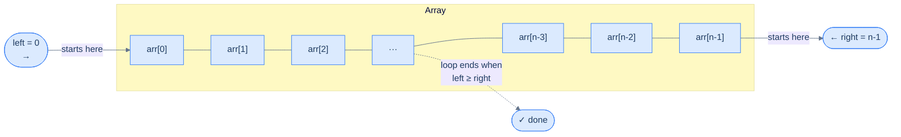
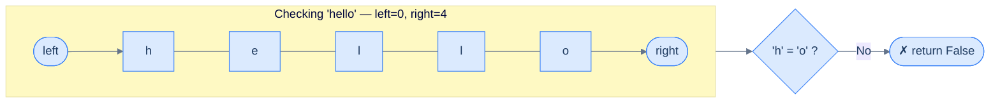
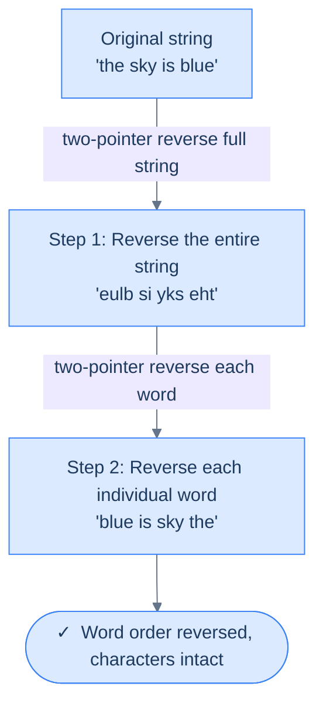
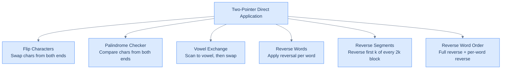

# 3. Pattern: Two pointers

This section introduces the direct-application version of the two-pointer pattern and walks through representative problems.

## Table of contents

1. [Understanding the two pointer pattern](#understanding-the-two-pointer-pattern)
2. [Identifying direct application](#identifying-direct-application)
3. [Flip characters](#flip-characters)
4. [Palindrome checker](#palindrome-checker)
5. [Vowel exchange](#vowel-exchange)
6. [Reverse words](#reverse-words)
7. [Reverse segments](#reverse-segments)
8. [Reverse word order](#reverse-word-order)

***

# Understanding the Two Pointer Pattern

## Why Single-Direction Traversal Isn't Always Enough

When you work with arrays, a single loop moving left to right is your default tool. It handles most problems cleanly. But some problems have a property that a single direction completely ignores: **both ends of the array matter at the same time**.

Think about checking if a word is a palindrome. You need to compare the first character with the last, the second with the second-to-last — you're always looking at two positions simultaneously, one from each end. A single forward loop forces you to either:
- Use a second nested loop (O(n²) — very slow), or
- Store results and do two passes (extra space)

The **two-pointer technique** solves this elegantly: use two variables, `left` and `right`, as indices that start at opposite ends and march toward each other in a single pass.

---

## The Core Idea

Two pointers (`left` and `right`) start at opposite ends of the array and converge toward the middle. At each step, you do some work using both `arr[left]` and `arr[right]`, then move one or both pointers inward.



<p align="center"><strong>The two-pointer traversal — <code>left</code> starts at index 0 and advances right; <code>right</code> starts at index n−1 and retreats left. They meet in the middle.</strong></p>

The loop terminates when `left >= right`. At that point, every pair of equidistant positions has been visited exactly once — which is why the algorithm runs in **O(n) time with O(1) extra space**.

---

## How the Pointers Move

Here is the full picture of a single traversal on an array of size 7:

```d3 widget=array-traversal
{
  "items": ["A", "B", "C", "D", "E", "F", "G"],
  "title": "Two-pointer traversal on a 7-element array",
  "steps": [
    {
      "markers": [
        { "name": "left",  "index": 0, "color": "#3b82f6" },
        { "name": "right", "index": 6, "color": "#f59e0b" }
      ],
      "range":   { "lo": 0, "hi": 6 },
      "msg": "Initial state — left = 0, right = 6. The whole array lies between the pointers."
    },
    {
      "markers": [
        { "name": "left",  "index": 1, "color": "#3b82f6" },
        { "name": "right", "index": 5, "color": "#f59e0b" }
      ],
      "range":   { "lo": 1, "hi": 5 },
      "msg": "After iteration 1 — A and G have been processed; left++, right--."
    },
    {
      "markers": [
        { "name": "left",  "index": 2, "color": "#3b82f6" },
        { "name": "right", "index": 4, "color": "#f59e0b" }
      ],
      "range":   { "lo": 2, "hi": 4 },
      "msg": "After iteration 2 — B and F processed; left++, right--."
    },
    {
      "markers": [
        { "name": "left",  "index": 3, "color": "#3b82f6" },
        { "name": "right", "index": 3, "color": "#f59e0b" }
      ],
      "range":   { "lo": 3, "hi": 3 },
      "msg": "After iteration 3 — C and E processed; left = right = 3."
    },
    {
      "markers": [],
      "msg": "left ≥ right — loop ends. The centre element D is handled separately if the problem requires it."
    }
  ]
}
```

<p align="center"><strong>Iteration-by-iteration view of the two-pointer traversal on a 7-element array — each step processes one pair of equidistant elements and closes the gap by one on each side.</strong></p>

---

## The Generic Algorithm

The two-pointer pattern follows this skeleton for every problem that uses it directly:

**Step 1.** Initialise `left = 0`, `right = n − 1` (or whatever starting positions the problem requires, as long as `left < right`).

**Step 2.** Loop while `left < right`:
- **Step 2.1** — do some work on `arr[left]` and `arr[right]`
- **Step 2.2** — move `left` forward by some number of steps (if the problem requires it)
- **Step 2.3** — move `right` backward by some number of steps (if the problem requires it)

**Step 3.** Return the result.

The specific "work" and "step size" in steps 2.1–2.3 change per problem. Everything else stays the same.

---

## Generic Implementation


```pseudocode
# Generic two-pointer template. Customise the four hooks for the actual problem.
function twoPointer(arr):
    left ← 0
    right ← length(arr) − 1
    while left < right:
        leftVal  ← arr[left]
        rightVal ← arr[right]
        # ... problem-specific work (swap, compare, accumulate, …) ...
        if shouldMoveLeft(leftVal, rightVal):
            left ← left + leftStep(leftVal, rightVal)
        if shouldMoveRight(leftVal, rightVal):
            right ← right − rightStep(leftVal, rightVal)
```

```python run
from typing import List

class Solution:
    def two_pointer(self, arr: List[int]) -> None:
        left = 0
        right = len(arr) - 1

        while left < right:
            left_val  = arr[left]
            right_val = arr[right]

            # Problem-specific work goes here (swap, compare, accumulate, etc.).

            if self.should_move_left(left_val, right_val):
                left += self.left_step(left_val, right_val)
            if self.should_move_right(left_val, right_val):
                right -= self.right_step(left_val, right_val)

    def should_move_left(self, lv, rv):  return True
    def should_move_right(self, lv, rv): return True
    def left_step(self, lv, rv):  return 1
    def right_step(self, lv, rv): return 1


arr = [1, 2, 3, 4, 5, 6, 7]
Solution().two_pointer(arr)
print("Done — customise the template above to solve a real problem!")
```

```java run
public class Main {
    static class Solution {
        void twoPointer(int[] arr) {
            int left = 0;
            int right = arr.length - 1;

            while (left < right) {
                int leftVal  = arr[left];
                int rightVal = arr[right];

                // Problem-specific work goes here.

                if (shouldMoveLeft(leftVal, rightVal))  left  += leftStep(leftVal, rightVal);
                if (shouldMoveRight(leftVal, rightVal)) right -= rightStep(leftVal, rightVal);
            }
        }
        boolean shouldMoveLeft(int lv, int rv)  { return true; }
        boolean shouldMoveRight(int lv, int rv) { return true; }
        int leftStep(int lv, int rv)  { return 1; }
        int rightStep(int lv, int rv) { return 1; }
    }

    public static void main(String[] args) {
        int[] arr = {1, 2, 3, 4, 5, 6, 7};
        new Solution().twoPointer(arr);
        System.out.println("Done — customise the template above to solve a real problem!");
    }
}
```

```c run
#include <stdio.h>
#include <stdbool.h>

static bool should_move_left(int lv, int rv)  { (void)lv; (void)rv; return true; }
static bool should_move_right(int lv, int rv) { (void)lv; (void)rv; return true; }
static int  left_step(int lv, int rv)         { (void)lv; (void)rv; return 1; }
static int  right_step(int lv, int rv)        { (void)lv; (void)rv; return 1; }

void two_pointer(int* arr, int n) {
    int left = 0;
    int right = n - 1;

    while (left < right) {
        int left_val  = arr[left];
        int right_val = arr[right];

        /* Problem-specific work goes here. */

        if (should_move_left(left_val, right_val))  left  += left_step(left_val, right_val);
        if (should_move_right(left_val, right_val)) right -= right_step(left_val, right_val);
    }
}

int main() {
    int arr[] = {1, 2, 3, 4, 5, 6, 7};
    two_pointer(arr, 7);
    printf("Done — customise the template above to solve a real problem!\n");
    return 0;
}
```

```scala run
object Main extends App {
  class Solution {
    def twoPointer(arr: Array[Int]): Unit = {
      var left = 0
      var right = arr.length - 1

      while (left < right) {
        val leftVal  = arr(left)
        val rightVal = arr(right)

        // Problem-specific work goes here.

        if (shouldMoveLeft(leftVal, rightVal))  left  += leftStep(leftVal, rightVal)
        if (shouldMoveRight(leftVal, rightVal)) right -= rightStep(leftVal, rightVal)
      }
    }
    def shouldMoveLeft(lv: Int, rv: Int)  = true
    def shouldMoveRight(lv: Int, rv: Int) = true
    def leftStep(lv: Int, rv: Int)  = 1
    def rightStep(lv: Int, rv: Int) = 1
  }

  val arr = Array(1, 2, 3, 4, 5, 6, 7)
  new Solution().twoPointer(arr)
  println("Done — customise the template above to solve a real problem!")
}
```


---

## Complexity Analysis

| | Complexity | Reasoning |
|---|---|---|
| **Time** | O(n) | `left` and `right` together visit every index exactly once. No element is processed twice. |
| **Space** | O(1) | Only two integer variables (`left` and `right`) are needed regardless of input size. |

This is true for every problem that directly applies the two-pointer technique — **both best and worst case are O(n) time, O(1) space**.

The power of this pattern is that it reduces problems which naively need O(n²) nested loops to a single O(n) pass.

---

## Three Ways to Apply Two Pointers

Not every two-pointer problem is identical. Problems in this pattern fall into three categories:

```d2
Root: Two-Pointer Pattern Problems

D: |md
  **Direct Application**

  Two pointers applied as-is

  (e.g. reverse, palindrome check)
|

R: |md
  **Reduction**

  Problem reduced to an
  equivalent two-pointer problem
|

S: |md
  **Subproblems**

  One step of the solution
  uses two pointers internally
|

Root -> D
Root -> R
Root -> S
```

<p align="center"><strong>Three categories of two-pointer pattern problems — we start with Direct Application, which is the simplest and most common.</strong></p>

In the next lessons, we work through the **Direct Application** category in depth — problems where the two-pointer template above applies almost verbatim.

***

# Identifying Direct Application

## What Makes a Problem a "Direct Application"?

The two-pointer technique can be applied **directly** when the problem asks you to do something with pairs of elements — one from each end — while moving both pointers inward until they meet. No clever transformation needed. The template fits as-is.

The mental checklist:

> ✅ We need to look at two positions simultaneously
> ✅ One position starts near the beginning, one near the end
> ✅ Both move inward with each iteration
> ✅ The work done at each step is simple (swap, compare, copy…)

If those four boxes are checked, you're looking at a direct application.

---

## The Canonical Example: Reverse an Array In-Place

**Problem statement:** Given an array `arr`, reverse it in-place. Do not create and return a new array — modify the original.

```
Input:  arr = [1, 2, 3, 4, 5]
Output: arr is modified to [5, 4, 3, 2, 1]
```

```d2
direction: right

before: "Original" {
  grid-columns: 5
  grid-gap: 0
  a: "1"
  b: "2"
  c: "3"
  d: "4"
  e: "5"
}

after: "Reversed (in-place)" {
  grid-columns: 5
  grid-gap: 0
  a: "5"
  b: "4"
  c: "3"
  d: "2"
  e: "1"
}

before -> after
```

<p align="center"><strong>Reverse the array in-place — the original array (top) becomes the reversed array (bottom) without allocating new memory.</strong></p>

---

## Brute Force: Two Passes + Temp Array

The naive approach copies elements in reverse into a temporary array, then copies back:

1. Walk `arr` backwards and fill `temp` forwards
2. Walk `temp` forwards and copy back into `arr`

```d2
direction: right

ORIG: "Original arr" {
  grid-columns: 5
  grid-gap: 0
  a: "1"
  b: "2"
  c: "3"
  d: "4"
  e: "5"
}

TEMP: "temp (copy arr backwards)" {
  grid-columns: 5
  grid-gap: 0
  a: "5"
  b: "4"
  c: "3"
  d: "2"
  e: "1"
}

BACK: "arr (copy temp back)" {
  grid-columns: 5
  grid-gap: 0
  a: "5"
  b: "4"
  c: "3"
  d: "2"
  e: "1"
}

ORIG -> TEMP: pass 1 — backwards copy
TEMP -> BACK: pass 2 — forwards copy
```

<p align="center"><strong>Brute-force reversal — two full passes and O(n) extra space for the temp array.</strong></p>


```pseudocode
# Brute force — copy backwards into a buffer, then back. O(n) time, O(n) extra space.
function reverse(arr):
    n ← length(arr)
    temp ← list of n zeros
    for i from n − 1 down to 0:                           # pass 1: copy reversed
        temp[n − 1 − i] ← arr[i]
    for i from 0 to n − 1:                                # pass 2: copy back
        arr[i] ← temp[i]
```

```python run
from typing import List

class BruteForce:
    def reverse(self, arr: List[int]) -> None:
        n = len(arr)
        temp = [0] * n

        # Pass 1: copy arr backwards into temp.
        for i in range(n - 1, -1, -1):
            temp[n - 1 - i] = arr[i]

        # Pass 2: copy temp back into arr.
        for i in range(n):
            arr[i] = temp[i]


arr = [1, 2, 3, 4, 5]
BruteForce().reverse(arr)
print(arr)   # [5, 4, 3, 2, 1]
```

```java run
import java.util.Arrays;

public class Main {
    static class BruteForce {
        void reverse(int[] arr) {
            int n = arr.length;
            int[] temp = new int[n];
            // Pass 1: copy backwards into temp.
            for (int i = n - 1; i >= 0; i--) temp[n - 1 - i] = arr[i];
            // Pass 2: copy temp back into arr.
            for (int i = 0; i < n; i++) arr[i] = temp[i];
        }
    }

    public static void main(String[] args) {
        int[] arr = {1, 2, 3, 4, 5};
        new BruteForce().reverse(arr);
        System.out.println(Arrays.toString(arr));
    }
}
```

```c run
#include <stdio.h>
#include <stdlib.h>

void reverse_brute(int* arr, int n) {
    int* temp = (int*)malloc(n * sizeof(int));
    for (int i = n - 1; i >= 0; i--) temp[n - 1 - i] = arr[i];
    for (int i = 0; i < n; i++) arr[i] = temp[i];
    free(temp);
}

int main() {
    int arr[] = {1, 2, 3, 4, 5};
    int n = 5;
    reverse_brute(arr, n);
    for (int i = 0; i < n; i++) printf("%d ", arr[i]);
    printf("\n");
    return 0;
}
```

```scala run
object Main extends App {
  class BruteForce {
    def reverse(arr: Array[Int]): Unit = {
      val n = arr.length
      val temp = new Array[Int](n)
      for (i <- (n - 1) to 0 by -1) temp(n - 1 - i) = arr(i)
      for (i <- 0 until n) arr(i) = temp(i)
    }
  }

  val arr = Array(1, 2, 3, 4, 5)
  new BruteForce().reverse(arr)
  println(arr.mkString(", "))
}
```


This works, but it uses O(n) extra space and touches every element twice. We can do better.

---

## Two-Pointer Solution: One Pass, Zero Extra Space

**Key insight:** to reverse an array, we just need to swap equidistant elements from both ends — `arr[0] ↔ arr[n-1]`, `arr[1] ↔ arr[n-2]`, and so on. Each swap needs exactly two positions: one from the left, one from the right. That's the two-pointer template.

```d3 widget=array-traversal
{
  "items": ["1", "2", "3", "4", "5"],
  "title": "Two-pointer reversal on [1, 2, 3, 4, 5]",
  "steps": [
    {
      "items":   ["1", "2", "3", "4", "5"],
      "markers": [
        { "name": "left",  "index": 0, "color": "#3b82f6" },
        { "name": "right", "index": 4, "color": "#f59e0b" }
      ],
      "msg": "Initial — left = 0, right = 4. Swap arr[0]=1 with arr[4]=5."
    },
    {
      "items":   ["5", "2", "3", "4", "1"],
      "markers": [
        { "name": "left",  "index": 1, "color": "#3b82f6" },
        { "name": "right", "index": 3, "color": "#f59e0b" }
      ],
      "msg": "Move inward — left = 1, right = 3. Swap arr[1]=2 with arr[3]=4."
    },
    {
      "items":   ["5", "4", "3", "2", "1"],
      "markers": [
        { "name": "left",  "index": 2, "color": "#3b82f6" },
        { "name": "right", "index": 2, "color": "#f59e0b" }
      ],
      "msg": "left = right = 2 — pointers meet, the middle element stays. Result: [5, 4, 3, 2, 1]."
    }
  ]
}
```

<p align="center"><strong>Two-pointer reversal on <code>[1, 2, 3, 4, 5]</code> — two swaps close the gap from both ends; the middle element needs no swap.</strong></p>


```pseudocode
# In-place reverse via two pointers — swap mirror pairs, march inward.
function reverse(arr):
    left ← 0
    right ← length(arr) − 1
    while left < right:                                   # odd-length: middle stays put
        swap arr[left] and arr[right]
        left ← left + 1
        right ← right − 1
```

```python run
from typing import List

class Solution:
    def reverse(self, arr: List[int]) -> None:
        left, right = 0, len(arr) - 1

        # Stop when pointers meet (odd length: middle stays put) or cross (even length: done).
        while left < right:
            arr[left], arr[right] = arr[right], arr[left]   # swap equidistant ends
            left  += 1                                       # close the window from the left
            right -= 1                                       # close the window from the right


arr = [1, 2, 3, 4, 5]
Solution().reverse(arr)
print(arr)   # [5, 4, 3, 2, 1]

arr2 = [1, 2, 3, 4]
Solution().reverse(arr2)
print(arr2)  # [4, 3, 2, 1]
```

```java run
import java.util.Arrays;

public class Main {
    static class Solution {
        void reverse(int[] arr) {
            int left = 0;
            int right = arr.length - 1;

            while (left < right) {
                int tmp = arr[left];
                arr[left] = arr[right];
                arr[right] = tmp;
                left++;
                right--;
            }
        }
    }

    public static void main(String[] args) {
        int[] arr = {1, 2, 3, 4, 5};
        new Solution().reverse(arr);
        System.out.println(Arrays.toString(arr));

        int[] arr2 = {1, 2, 3, 4};
        new Solution().reverse(arr2);
        System.out.println(Arrays.toString(arr2));
    }
}
```

```c run
#include <stdio.h>

void reverse_arr(int* arr, int n) {
    int left = 0, right = n - 1;
    while (left < right) {
        int tmp = arr[left];
        arr[left]  = arr[right];
        arr[right] = tmp;
        left++;
        right--;
    }
}

void print_arr(int* arr, int n) {
    for (int i = 0; i < n; i++) printf("%d ", arr[i]);
    printf("\n");
}

int main() {
    int arr[] = {1, 2, 3, 4, 5};
    reverse_arr(arr, 5);
    print_arr(arr, 5);

    int arr2[] = {1, 2, 3, 4};
    reverse_arr(arr2, 4);
    print_arr(arr2, 4);
    return 0;
}
```

```scala run
object Main extends App {
  class Solution {
    def reverse(arr: Array[Int]): Unit = {
      var left = 0
      var right = arr.length - 1
      while (left < right) {
        val tmp = arr(left)
        arr(left)  = arr(right)
        arr(right) = tmp
        left  += 1
        right -= 1
      }
    }
  }

  val arr = Array(1, 2, 3, 4, 5)
  new Solution().reverse(arr)
  println(arr.mkString(", "))

  val arr2 = Array(1, 2, 3, 4)
  new Solution().reverse(arr2)
  println(arr2.mkString(", "))
}
```


One pass. No extra memory. The two-pointer template applied directly.

<details>
<summary><strong>Trace — arr = [1, 2, 3, 4, 5]</strong></summary>

```
arr = [1, 2, 3, 4, 5]   left = 0,  right = 4

Step 1 │ left=0 (1),  right=4 (5) │ 0 < 4 → swap │ [5, 2, 3, 4, 1] │ left=1, right=3
Step 2 │ left=1 (2),  right=3 (4) │ 1 < 3 → swap │ [5, 4, 3, 2, 1] │ left=2, right=2
Step 3 │ left=2 (3),  right=2 (3) │ 2 == 2 → left < right is false → loop exits

Result: [5, 4, 3, 2, 1] ✓

Note: The middle element (3) never needed a swap — it's equidistant from both ends
      and sits in its correct reversed position automatically.

Even-length check — arr = [1, 2, 3, 4]:
Step 1 │ left=0 (1),  right=3 (4) │ 0 < 3 → swap │ [4, 2, 3, 1] │ left=1, right=2
Step 2 │ left=1 (2),  right=2 (3) │ 1 < 2 → swap │ [4, 3, 2, 1] │ left=2, right=1
Step 3 │ left=2,      right=1     │ 2 > 1 → loop exits (pointers crossed)

Result: [4, 3, 2, 1] ✓

Note: For even-length arrays the pointers cross (left > right) rather than meet —
      all pairs are handled before that happens.
```

</details>

---

## Fitting the Template

Let's verify this problem matches all four checkboxes:

| Checkpoint | This Problem |
|---|---|
| Two positions at once? | ✅ `arr[left]` and `arr[right]` |
| One near start, one near end? | ✅ `left=0`, `right=n-1` |
| Both move inward? | ✅ `left++`, `right--` each iteration |
| Simple work per step? | ✅ One swap |

---

### Checkpoint 1 — Why "two positions at once"?

**WHAT:** A reversal requires swapping pairs of elements. A swap is an inherently two-element operation — you can't swap a single element with nothing.

**WHY it means two pointers fit:** Every step of the algorithm needs `arr[left]` and `arr[right]` simultaneously. One pointer alone can't do the job — it would need to "remember" the element it picked up and go look for where to put it, which is exactly what the brute force does (it stores the whole array in `temp`).

**What breaks with a single pointer:** Walk forward with one pointer and try to reverse in-place — when you overwrite `arr[0]` with `arr[4]`, the original `arr[0]` is gone. You'd need to save it somewhere first. That "somewhere" is the temp array. Two pointers sidestep the need entirely: they swap atomically (`a, b = b, a`), so nothing is lost.

> **Rule of thumb:** If the problem needs to operate on two elements that "belong together" (a pair, a palindrome check, a sum), two simultaneous pointers are the natural fit.

---

### Checkpoint 2 — Why "one near start, one near end"?

**WHAT:** `left` starts at index `0` (the first element), `right` starts at index `n-1` (the last element).

**WHY this specific placement:** After reversal, element at index `0` must land at index `n-1` and vice versa. Element at index `1` must land at `n-2`. The pattern is: **element at distance `d` from the left end swaps with element at distance `d` from the right end**.

Placing one pointer at each end directly aligns with this structure — at every step, `left` and `right` are pointing at exactly the pair that needs to swap next.

**What breaks with a different placement:** If both pointers started from the left (like in many sliding window problems), you'd never naturally reach the element at `n-1` first. You'd be doing something fundamentally different — not a reversal.

**Concrete check:** `[1, 2, 3, 4, 5]`
- `left=0, right=4`: `1` and `5` are the farthest pair — swap first ✓
- `left=1, right=3`: `2` and `4` are next closest pair — swap second ✓
- `left=2, right=2`: single middle element — no swap needed ✓

---

### Checkpoint 3 — Why "both move inward"?

**WHAT:** After each swap, both `left` increments by 1 and `right` decrements by 1.

**WHY inward movement:** After swapping `arr[left]` and `arr[right]`, those two positions are finalized — they now hold the correct values for a reversed array. The unsolved subproblem is the inner portion: `arr[left+1 .. right-1]`. Moving both pointers inward shrinks the problem by 2 each step and focuses attention on exactly what's left to solve.

**Why the stop condition is `left < right` (not `left <= right`):**
- When `left == right` (odd-length arrays): both pointers are at the same middle element. That element is already in the correct position — swapping it with itself is a no-op. We stop before that unnecessary step.
- When `left > right` (even-length arrays): the pointers have crossed, all pairs have been handled. No element remains.

**What breaks if you stop at `left <= right`:** For odd-length arrays like `[1, 2, 3, 4, 5]`, when `left = right = 2`, you'd execute `arr[2], arr[2] = arr[2], arr[2]` — harmless but wasteful. For the stop condition to be correct, `left < right` is sufficient and exact.

---

### Checkpoint 4 — Why "simple work per step"?

**WHAT:** At each step, we do exactly one swap: `arr[left], arr[right] = arr[right], arr[left]`.

**WHY "simple" matters:** The two-pointer direct application template is powerful precisely because the loop body is O(1) — a fixed amount of work per step. Combined with O(n) steps (n/2 swaps), the total is O(n) time. The simplicity of the per-step work is what keeps the whole algorithm lean.

**HOW to recognize "simple work" in other problems:** The work per step should not require nested loops, searching, or recursion. It should be a direct operation on the two elements currently pointed at — compare, swap, copy, check equality. If the per-step work itself requires a loop, you may be looking at a subproblem pattern instead (section 05).

**What this rules out:** If you found yourself needing to scan the entire remaining array on each step, that's O(n²) and the direct-application template no longer applies cleanly.

---

That's a direct application — all four checkboxes confirmed.

---

## Problems in This Category

The following lessons each apply the two-pointer technique in exactly this direct way. Each is a small variation on the same theme:

| Problem | Two-pointer work per step |
|---|---|
| **Flip Characters** | Swap characters from both ends |
| **Palindrome Checker** | Compare characters from both ends |
| **Vowel Exchange** | Find and swap vowels from both ends |
| **Reverse Words** | Reverse each word's characters with inner two pointers |
| **Reverse Segments** | Reverse the first *k* characters of every *2k* block |
| **Reverse Word Order** | Reverse entire string, then reverse each word |

Each is a small twist on the same pattern — same skeleton, different work in the loop body.

***

# Flip Characters

## The Problem

Given an array of characters `arr`, reverse the array by **swapping equidistant elements** from the start and the end. The reversal must happen **in-place** — modify the input array directly and use **O(1) extra space**.

```
Input:  arr = [a, e, i, o, u]
Output:       [u, o, i, e, a]
```

This is the canonical direct application of the two-pointer pattern — the template and the algorithm are identical.

---

## Examples

**Example 1**
```
Input:  arr = [a, e, i, o, u]
Output:       [u, o, i, e, a]
```

**Example 2**
```
Input:  arr = [a, b, c, d, e]
Output:       [e, d, c, b, a]
```

**Example 3 — empty array**
```
Input:  arr = []
Output:       []
```

---

## Intuition

To reverse a sequence, the first element must become the last, the second must become the second-to-last, and so on. Every character has a **mirror partner** equidistant from the opposite end. We just need to swap each pair.

Two pointers are perfect for this: `left` starts at index 0 (the first character), `right` starts at index `n-1` (the last character). Swap the pair, then move both inward. Repeat until they meet.

```d3 widget=array-traversal
{
  "items": ["a", "e", "i", "o", "u"],
  "title": "Reversing [a, e, i, o, u] in place with two pointers",
  "steps": [
    {
      "items":   ["a", "e", "i", "o", "u"],
      "markers": [
        { "name": "left",  "index": 0, "color": "#3b82f6" },
        { "name": "right", "index": 4, "color": "#f59e0b" }
      ],
      "msg": "Initial — left = 0, right = 4. Swap arr[left] and arr[right] (a ↔ u)."
    },
    {
      "items":   ["u", "e", "i", "o", "a"],
      "markers": [
        { "name": "left",  "index": 1, "color": "#3b82f6" },
        { "name": "right", "index": 3, "color": "#f59e0b" }
      ],
      "msg": "Move inward — left = 1, right = 3. Swap arr[left] and arr[right] (e ↔ o)."
    },
    {
      "items":   ["u", "o", "i", "e", "a"],
      "markers": [
        { "name": "left",  "index": 2, "color": "#3b82f6" },
        { "name": "right", "index": 2, "color": "#f59e0b" }
      ],
      "msg": "Pointers meet at index 2 — the middle element is its own mirror; no swap needed."
    },
    {
      "items":   ["u", "o", "i", "e", "a"],
      "markers": [],
      "msg": "Done — arr is reversed: [u, o, i, e, a]."
    }
  ]
}
```

<p align="center"><strong>Flipping <code>[a, e, i, o, u]</code> in place — two swaps reverse the array; the middle element at index 2 is its own mirror.</strong></p>

---

## Applying the Diagnostic Questions

| Check | Answer for Flip Characters |
|---|---|
| ✅ Two positions simultaneously? | Yes — `chars[left]` and `chars[right]` are read and swapped together at every step |
| ✅ One near start, one near end? | Yes — `left = 0`, `right = n-1` |
| ✅ Both move inward? | Yes — `left++`, `right--` after every swap |
| ✅ Simple work at each step? | Yes — one swap per iteration |

Every box is checked with nothing extra needed. This is the purest direct application — the template and the algorithm are identical.

**Why does every element have exactly one partner?** Because reversal is a bijection: element at position `i` maps to position `n-1-i`. Two pointers exploit this directly — `left` tracks "the element at distance 0 from the left" and `right` tracks "the element at distance 0 from the right." Every step, both advance one position inward, so the i-th iteration handles the i-th mirror pair. When `left >= right`, all pairs have been processed.

**What breaks if you use one pointer instead?** A single forward pointer at position `i` can move `chars[i]` to its destination at `n-1-i`, but it has already overwritten whatever was at `n-1-i` — you need a temp variable and a second loop. Two pointers avoid this entirely: the swap is symmetric, so both elements land in their correct positions in one step, no temp array required.

---

## Approach

1. Set `left = 0`, `right = len(chars) - 1`
2. While `left < right`:
   - Swap `chars[left]` and `chars[right]`
   - `left += 1`, `right -= 1`
3. Done — the array is reversed in-place

---

## Solution


```pseudocode
function flipCharacters(arr):
    # Initialize two pointers, one at the start and the other at the end
    left  ← 0
    right ← length(arr) − 1

    # Walk the pointers inward, swapping each mirror pair
    while left < right:
        swap arr[left] and arr[right]
        left  ← left + 1
        right ← right − 1
```

```python run
from typing import List

class Solution:
    def flip_characters(self, arr: List[str]) -> None:

        # Initialize two pointers, one pointing to the beginning of the
        # array and the other pointing to the end of the array
        left: int = 0
        right = len(arr) - 1

        # Use a while loop to traverse the array using the two pointers
        while left < right:

            # Swap the characters pointed by the left and right pointers
            arr[left], arr[right] = arr[right], arr[left]

            # Move the pointers towards the center of the array
            left  += 1
            right -= 1


a1 = ['a', 'e', 'i', 'o', 'u']
Solution().flip_characters(a1); print(a1)   # ['u', 'o', 'i', 'e', 'a']

a2 = ['a', 'b', 'c', 'd', 'e']
Solution().flip_characters(a2); print(a2)   # ['e', 'd', 'c', 'b', 'a']

a3: List[str] = []
Solution().flip_characters(a3); print(a3)   # []
```

```java run
import java.util.Arrays;

public class Main {
    static class Solution {
        void flipCharacters(char[] arr) {

            // Initialize two pointers, one pointing to the beginning of the
            // array and the other pointing to the end of the array
            int left  = 0;
            int right = arr.length - 1;

            // Use a while loop to traverse the array using the two pointers
            while (left < right) {

                // Swap the characters pointed by the left and right pointers
                char tmp     = arr[left];
                arr[left]    = arr[right];
                arr[right]   = tmp;

                // Move the pointers towards the center of the array
                left++;
                right--;
            }
        }
    }

    public static void main(String[] args) {
        char[] a1 = {'a','e','i','o','u'};
        new Solution().flipCharacters(a1);
        System.out.println(Arrays.toString(a1));   // [u, o, i, e, a]

        char[] a2 = {'a','b','c','d','e'};
        new Solution().flipCharacters(a2);
        System.out.println(Arrays.toString(a2));   // [e, d, c, b, a]

        char[] a3 = {};
        new Solution().flipCharacters(a3);
        System.out.println(Arrays.toString(a3));   // []
    }
}
```

```c run
#include <stdio.h>

void flip_characters(char* arr, int n) {

    /* Initialize two pointers, one pointing to the beginning of the
     * array and the other pointing to the end of the array */
    int left  = 0;
    int right = n - 1;

    /* Use a while loop to traverse the array using the two pointers */
    while (left < right) {

        /* Swap the characters pointed by the left and right pointers */
        char tmp   = arr[left];
        arr[left]  = arr[right];
        arr[right] = tmp;

        /* Move the pointers towards the center of the array */
        left++;
        right--;
    }
}

static void print_arr(char* arr, int n) {
    putchar('[');
    for (int i = 0; i < n; i++) printf("%c%s", arr[i], i + 1 < n ? ", " : "");
    printf("]\n");
}

int main() {
    char a1[] = {'a','e','i','o','u'};
    flip_characters(a1, 5); print_arr(a1, 5);   /* [u, o, i, e, a] */

    char a2[] = {'a','b','c','d','e'};
    flip_characters(a2, 5); print_arr(a2, 5);   /* [e, d, c, b, a] */

    char a3[1] = {0};
    flip_characters(a3, 0); print_arr(a3, 0);   /* [] */
    return 0;
}
```

```scala run
object Main extends App {
  class Solution {
    def flipCharacters(arr: Array[Char]): Unit = {

      // Initialize two pointers, one pointing to the beginning of the
      // array and the other pointing to the end of the array
      var left  = 0
      var right = arr.length - 1

      // Use a while loop to traverse the array using the two pointers
      while (left < right) {

        // Swap the characters pointed by the left and right pointers
        val tmp    = arr(left)
        arr(left)  = arr(right)
        arr(right) = tmp

        // Move the pointers towards the center of the array
        left  += 1
        right -= 1
      }
    }
  }

  val a1 = Array('a','e','i','o','u')
  new Solution().flipCharacters(a1); println(a1.mkString("[", ", ", "]"))   // [u, o, i, e, a]

  val a2 = Array('a','b','c','d','e')
  new Solution().flipCharacters(a2); println(a2.mkString("[", ", ", "]"))   // [e, d, c, b, a]

  val a3 = Array.empty[Char]
  new Solution().flipCharacters(a3); println(a3.mkString("[", ", ", "]"))   // []
}
```


---

## Dry Run — Example 1

`arr = [a, e, i, o, u]`, `n = 5`

| Iteration | `left` | `right` | Swap | Array after swap |
|---|---|---|---|---|
| 1 | 0 | 4 | `a ↔ u` | `[u, e, i, o, a]` |
| 2 | 1 | 3 | `e ↔ o` | `[u, o, i, e, a]` |
| — | 2 | 2 | `left ≥ right` — stop | `[u, o, i, e, a]` ✓ |

The middle element at index 2 (`i`) is its own mirror — no swap needed.

---

## Complexity Analysis

| | Complexity | Reasoning |
|---|---|---|
| **Time** | O(n) | Each character is visited once; `left` and `right` together make n/2 swaps |
| **Space** | O(1) | Only two pointer variables — no auxiliary array |

---

## Edge Cases

| Scenario | Input | Output | Note |
|---|---|---|---|
| Empty array | `[]` | `[]` | `left = 0 > right = -1` — loop never runs |
| Single character | `['A']` | `['A']` | `left = right = 0` — loop never runs |
| Two characters | `['A','B']` | `['B','A']` | One swap, then `left = right = 1` — stops |
| Even length | `['A','B','C','D']` | `['D','C','B','A']` | All pairs swapped, no middle element |
| Odd length | `['A','B','C']` | `['C','B','A']` | Two pairs swapped, middle `'B'` unchanged |

---

## Key Takeaway

Flip Characters is the two-pointer reversal pattern applied to a character array. The mechanics are identical to reversing integers — the only difference is the element type. Every future problem in this section is a variation on this same core swap-and-converge idea.

***

# Palindrome Checker

## The Problem

Given a string `s`, return `true` if it is a **palindrome** — a string that reads the same forwards and backwards **after converting all uppercase letters to lowercase and removing all non-alphanumeric characters**. Return `false` otherwise.

Alphanumeric characters are letters and digits: `[a–z]`, `[A–Z]`, `[0–9]`. Everything else (spaces, punctuation) is skipped.

```
Input:  s = "a man nam a"   →   Output: True   (after filtering: "amannama")
Input:  s = "race car rac ecar" → Output: True (after filtering: "racecarracecar")
Input:  s = "This is codeintuition" → Output: False
```

---

## Examples

**Example 1**
```
Input:  s = "a man nam a"
Output: True
Explanation: Removing spaces and lower-casing gives "amannama", which is a palindrome.
```

**Example 2**
```
Input:  s = "race car rac ecar"
Output: True
Explanation: After filtering, "racecarracecar" is a palindrome.
```

**Example 3**
```
Input:  s = "This is codeintuition"
Output: False
Explanation: After filtering, "thisiscodeintuition" reads differently forwards vs backwards.
```

**Example 4 — single character**
```
Input:  s = "a"
Output: True   (every single alphanumeric character is trivially a palindrome)
```

---

## Intuition

A string is a palindrome when its first alphanumeric character (lowercased) equals its last, its second equals its second-to-last, and so on all the way to the middle.

That's a mirror-pair relationship — exactly what two pointers are built for. Place `left` at the start and `right` at the end. At each step, examine `s[left]` and `s[right]`:

- If either is **not alphanumeric** → skip it (advance `left` or retreat `right` past it)
- If both are alphanumeric and **match** (case-insensitive) → the pair is fine, move both inward and continue
- If both are alphanumeric and **don't match** → it's not a palindrome, return `False` immediately
- If `left >= right` without any mismatch → every pair matched, return `True`

No extra memory needed. One pass.

```d3 widget=array-traversal
{
  "items": ["r", "a", "c", "e", "c", "a", "r"],
  "title": "Checking \"racecar\" for palindrome",
  "steps": [
    {
      "keys":    ["r0", "a0", "c0", "e", "c1", "a1", "r1"],
      "markers": [
        { "name": "left",  "index": 0, "color": "#3b82f6" },
        { "name": "right", "index": 6, "color": "#f59e0b" }
      ],
      "msg": "Initial — compare s[0]='r' with s[6]='r' → match, move both inward."
    },
    {
      "keys":    ["r0", "a0", "c0", "e", "c1", "a1", "r1"],
      "markers": [
        { "name": "left",  "index": 1, "color": "#3b82f6" },
        { "name": "right", "index": 5, "color": "#f59e0b" }
      ],
      "msg": "Compare s[1]='a' with s[5]='a' → match, move both inward."
    },
    {
      "keys":    ["r0", "a0", "c0", "e", "c1", "a1", "r1"],
      "markers": [
        { "name": "left",  "index": 2, "color": "#3b82f6" },
        { "name": "right", "index": 4, "color": "#f59e0b" }
      ],
      "msg": "Compare s[2]='c' with s[4]='c' → match, move both inward."
    },
    {
      "keys":    ["r0", "a0", "c0", "e", "c1", "a1", "r1"],
      "markers": [
        { "name": "left",  "index": 3, "color": "#3b82f6" },
        { "name": "right", "index": 3, "color": "#f59e0b" }
      ],
      "msg": "Pointers meet at index 3 (the middle 'e'). All pairs matched — return True."
    }
  ]
}
```

<p align="center"><strong>Checking <code>"racecar"</code> for palindrome — every mirror pair matches; when pointers meet at the centre, the check passes.</strong></p>

---

## Applying the Diagnostic Questions

| Check | Answer for Palindrome Checker |
|---|---|
| ✅ Two positions simultaneously? | Yes — `s[left]` and `s[right]` are compared together at every step |
| ✅ One near start, one near end? | Yes — `left = 0`, `right = n-1` |
| ✅ Both move inward? | Yes — `left++`, `right--` after every matching pair |
| ✅ Simple work at each step? | Yes — one comparison per iteration, return immediately on mismatch |

The structure is identical to Flip Characters — the only difference is the loop body: **compare** instead of **swap**.

**Why check from both ends simultaneously?** A palindrome's definition is symmetric: the character at position `i` from the left must equal the character at position `i` from the right, for every `i` from `0` to `n/2`. Two pointers map this requirement directly — `left` and `right` track the pair at distance `i` from each end. Moving both inward covers every required pair in exactly `n/2` steps.

**What breaks if you use only one pointer?** A single pointer could reverse the string and compare — but that costs O(n) extra space for the reversed copy and a second O(n) pass. Two pointers do it in one pass with O(1) space, and gain the early-exit advantage: as soon as any pair mismatches, `False` is returned without inspecting the rest. For a string like `"abcde...xyz" + "XYZ"`, the mismatch at position 0 stops the algorithm immediately.

---

## What Failure Looks Like



<p align="center"><strong>The check fails immediately on the first pair — <code>'h' ≠ 'o'</code> is enough to return <code>False</code> without looking at the rest.</strong></p>

This early-exit property makes two-pointer palindrome checking efficient in practice — you never process more pairs than necessary.

---

## Solution


```pseudocode
function palindromeChecker(s):
    # An empty string is vacuously a palindrome
    if s is empty:
        return true

    # Initialize two pointers, one at the start and the other at the end
    left  ← 0
    right ← length(s) − 1

    while left < right:
        charLeft  ← s[left]
        charRight ← s[right]

        # Skip non-alphanumeric characters from the left
        if charLeft is not alphanumeric:
            left ← left + 1

        # Skip non-alphanumeric characters from the right
        else if charRight is not alphanumeric:
            right ← right − 1

        # Compare the characters ignoring case
        else if toLower(charLeft) ≠ toLower(charRight):
            return false

        # Pair matched — move both pointers inward
        else:
            left  ← left + 1
            right ← right − 1

    # All pairs matched — it's a palindrome
    return true
```

```python run
class Solution:
    def palindrome_checker(self, s: str) -> bool:
        if not s:

            # An empty string is considered a palindrome
            return True

        # Initialize two pointers, one pointing to the beginning of the
        # string and the other pointing to the end of the string
        left  = 0
        right = len(s) - 1

        while left < right:
            char_left  = s[left]
            char_right = s[right]

            # Skip non-alphanumeric characters from the left
            if not char_left.isalnum():
                left += 1

            # Skip non-alphanumeric characters from the right
            elif not char_right.isalnum():
                right -= 1

            # Check if the characters are equal ignoring case
            elif char_left.lower() != char_right.lower():

                # Characters are not equal, so it's not a palindrome
                return False

            # Move both pointers towards the center
            else:
                left  += 1
                right -= 1

        # All characters have been checked and are equal, so it's a palindrome
        return True


sol = Solution()
print(sol.palindrome_checker("a man nam a"))             # True
print(sol.palindrome_checker("race car rac ecar"))       # True
print(sol.palindrome_checker("This is codeintuition"))   # False
print(sol.palindrome_checker("racecar"))                 # True
print(sol.palindrome_checker("a"))                       # True
print(sol.palindrome_checker(""))                        # True
```

```java run
public class Main {
    static class Solution {
        boolean palindromeChecker(String s) {
            if (s.isEmpty()) {

                // An empty string is considered a palindrome
                return true;
            }

            // Initialize two pointers, one pointing to the beginning of the
            // string and the other pointing to the end of the string
            int left  = 0;
            int right = s.length() - 1;

            while (left < right) {
                char charLeft  = s.charAt(left);
                char charRight = s.charAt(right);

                // Skip non-alphanumeric characters from the left
                if (!Character.isLetterOrDigit(charLeft)) {
                    left++;
                }
                // Skip non-alphanumeric characters from the right
                else if (!Character.isLetterOrDigit(charRight)) {
                    right--;
                }
                // Check if the characters are equal ignoring case
                else if (Character.toLowerCase(charLeft) !=
                         Character.toLowerCase(charRight)) {

                    // Characters are not equal, so it's not a palindrome
                    return false;
                }
                // Move both pointers towards the center
                else {
                    left++;
                    right--;
                }
            }

            // All characters have been checked and are equal, so it's a palindrome
            return true;
        }
    }

    public static void main(String[] args) {
        Solution sol = new Solution();
        System.out.println(sol.palindromeChecker("a man nam a"));            // true
        System.out.println(sol.palindromeChecker("race car rac ecar"));      // true
        System.out.println(sol.palindromeChecker("This is codeintuition"));  // false
        System.out.println(sol.palindromeChecker("racecar"));                // true
        System.out.println(sol.palindromeChecker("a"));                      // true
        System.out.println(sol.palindromeChecker(""));                       // true
    }
}
```

```c run
#include <stdio.h>
#include <stdbool.h>
#include <ctype.h>
#include <string.h>

bool palindrome_checker(const char* s) {
    /* An empty string is considered a palindrome */
    if (s[0] == '\0') return true;

    /* Initialize two pointers, one pointing to the beginning of the
     * string and the other pointing to the end of the string */
    int left  = 0;
    int right = (int)strlen(s) - 1;

    while (left < right) {
        char char_left  = s[left];
        char char_right = s[right];

        /* Skip non-alphanumeric characters from the left */
        if (!isalnum((unsigned char)char_left)) {
            left++;
        }
        /* Skip non-alphanumeric characters from the right */
        else if (!isalnum((unsigned char)char_right)) {
            right--;
        }
        /* Check if the characters are equal ignoring case */
        else if (tolower((unsigned char)char_left) !=
                 tolower((unsigned char)char_right)) {

            /* Characters are not equal, so it's not a palindrome */
            return false;
        }
        /* Move both pointers towards the center */
        else {
            left++;
            right--;
        }
    }

    /* All characters have been checked and are equal, so it's a palindrome */
    return true;
}

int main() {
    printf("%d\n", palindrome_checker("a man nam a"));            /* 1 */
    printf("%d\n", palindrome_checker("race car rac ecar"));      /* 1 */
    printf("%d\n", palindrome_checker("This is codeintuition"));  /* 0 */
    printf("%d\n", palindrome_checker("racecar"));                /* 1 */
    printf("%d\n", palindrome_checker("a"));                      /* 1 */
    printf("%d\n", palindrome_checker(""));                       /* 1 */
    return 0;
}
```

```scala run
object Main extends App {
  class Solution {
    def palindromeChecker(s: String): Boolean = {
      if (s.isEmpty) {

        // An empty string is considered a palindrome
        return true
      }

      // Initialize two pointers, one pointing to the beginning of the
      // string and the other pointing to the end of the string
      var left  = 0
      var right = s.length - 1

      while (left < right) {
        val charLeft  = s(left)
        val charRight = s(right)

        // Skip non-alphanumeric characters from the left
        if (!charLeft.isLetterOrDigit) {
          left += 1
        }
        // Skip non-alphanumeric characters from the right
        else if (!charRight.isLetterOrDigit) {
          right -= 1
        }
        // Check if the characters are equal ignoring case
        else if (charLeft.toLower != charRight.toLower) {

          // Characters are not equal, so it's not a palindrome
          return false
        }
        // Move both pointers towards the center
        else {
          left  += 1
          right -= 1
        }
      }

      // All characters have been checked and are equal, so it's a palindrome
      true
    }
  }

  val sol = new Solution
  println(sol.palindromeChecker("a man nam a"))            // true
  println(sol.palindromeChecker("race car rac ecar"))      // true
  println(sol.palindromeChecker("This is codeintuition"))  // false
  println(sol.palindromeChecker("racecar"))                // true
  println(sol.palindromeChecker("a"))                      // true
  println(sol.palindromeChecker(""))                       // true
}
```


---

## Dry Run — "racecar"

`s = "racecar"`, `n = 7`

| Iteration | `left` | `right` | `s[left]` | `s[right]` | Match? |
|---|---|---|---|---|---|
| 1 | 0 | 6 | `'r'` | `'r'` | ✅ |
| 2 | 1 | 5 | `'a'` | `'a'` | ✅ |
| 3 | 2 | 4 | `'c'` | `'c'` | ✅ |
| — | 3 | 3 | — | — | `left ≥ right` → stop |

**Return `True`** ✓

---

## Dry Run — "hello"

| Iteration | `left` | `right` | `s[left]` | `s[right]` | Match? |
|---|---|---|---|---|---|
| 1 | 0 | 4 | `'h'` | `'o'` | ❌ → return `False` immediately |

**Return `False`** ✓

---

## Complexity Analysis

| | Complexity | Reasoning |
|---|---|---|
| **Time** | O(n) worst case | Every mirror pair checked once if all match; exits early on first mismatch |
| **Space** | O(1) | Only two pointer variables |

---

## Edge Cases

| Scenario | Input | Output | Note |
|---|---|---|---|
| Empty string | `""` | `True` | `left = 0 > right = -1` — loop never runs, vacuously true |
| Single character | `"a"` | `True` | `left = right` — loop never runs |
| Two identical chars | `"aa"` | `True` | One comparison, both match |
| Two different chars | `"ab"` | `False` | One comparison, immediate mismatch |
| All same characters | `"aaaa"` | `True` | Every pair matches |

---

## Key Takeaway

Palindrome checking is the comparison variant of the two-pointer pattern. Where "Flip Characters" *swapped* mirror pairs, here we *compare* them. The pointer movement is identical — the work in the loop body is the only difference. This is the pattern: same skeleton, swap the operation.

***

# Vowel Exchange

## The Problem

Given a string `s`, **reverse the vowels** in the string and return the updated string. All non-vowel characters stay in place. The vowels to consider are the English-alphabet ones — `a`, `e`, `i`, `o`, `u`, in both uppercase and lowercase.

```
Input:  s = "random"     →   Output: "rondam"
Input:  s = "afegijoku"  →   Output: "ufogijeka"
Input:  s = "bcdf"       →   Output: "bcdf"
```

---

## Examples

**Example 1**
```
Input:  s = "random"
Output: "rondam"
Explanation: The vowels 'a' (index 1) and 'o' (index 2) are swapped.
```

**Example 2**
```
Input:  s = "afegijoku"
Output: "ufogijeka"
Explanation: The vowels are swapped in mirror-pair order:
             - 'a' (index 0) is swapped with 'u' (index 8)
             - 'e' (index 2) is swapped with 'o' (index 6)
             - 'i' (index 4) is its own mirror; it stays in place.
```

**Example 3**
```
Input:  s = "bcdf"
Output: "bcdf"
Explanation: No vowels — the string is unchanged.
```

**Example 4 — all vowels**
```
Input:  s = "aeiou"
Output: "uoiea"
Explanation: Every position is a vowel, so the swap reduces to a full reversal.
```

---

## Intuition

The classic two-pointer reversal swaps every pair. This problem adds a filter: **only swap when both pointers are sitting on vowels**. When a pointer is sitting on a consonant, just skip it — slide inward until you find the next vowel.

Think of the two pointers as scouts. The left scout hunts for the next vowel from the left; the right scout hunts for the next vowel from the right. When both scouts have found a vowel, they swap and then both advance. If either scout hits the middle first, we're done.

```d3 widget=array-traversal
{
  "items": ["a", "f", "e", "g", "i", "j", "o", "k", "u"],
  "title": "Vowel exchange on \"afegijoku\"",
  "steps": [
    {
      "items":   ["a", "f", "e", "g", "i", "j", "o", "k", "u"],
      "markers": [
        { "name": "left",  "index": 0, "color": "#3b82f6" },
        { "name": "right", "index": 8, "color": "#f59e0b" }
      ],
      "msg": "Both pointers are on vowels — swap arr[left]='a' with arr[right]='u'."
    },
    {
      "items":   ["u", "f", "e", "g", "i", "j", "o", "k", "a"],
      "markers": [
        { "name": "left",  "index": 1, "color": "#3b82f6" },
        { "name": "right", "index": 7, "color": "#f59e0b" }
      ],
      "msg": "Move inward — arr[left]='f' is a consonant (skip), arr[right]='k' is a consonant (skip)."
    },
    {
      "items":   ["u", "f", "e", "g", "i", "j", "o", "k", "a"],
      "markers": [
        { "name": "left",  "index": 2, "color": "#3b82f6" },
        { "name": "right", "index": 6, "color": "#f59e0b" }
      ],
      "msg": "Both pointers are on vowels — swap arr[left]='e' with arr[right]='o'."
    },
    {
      "items":   ["u", "f", "o", "g", "i", "j", "e", "k", "a"],
      "markers": [
        { "name": "left",  "index": 3, "color": "#3b82f6" },
        { "name": "right", "index": 5, "color": "#f59e0b" }
      ],
      "msg": "arr[left]='g' is a consonant (skip), arr[right]='j' is a consonant (skip)."
    },
    {
      "items":   ["u", "f", "o", "g", "i", "j", "e", "k", "a"],
      "markers": [
        { "name": "left",  "index": 4, "color": "#3b82f6" },
        { "name": "right", "index": 4, "color": "#f59e0b" }
      ],
      "msg": "Pointers meet at index 4 — the middle 'i' is its own mirror; nothing to swap. Result: \"ufogijeka\"."
    }
  ]
}
```

<p align="center"><strong>Vowel exchange on <code>"afegijoku"</code> — each pointer scans past consonants until it finds a vowel; matched vowel pairs swap; pointers meet at the middle <code>'i'</code>.</strong></p>

---

## Applying the Diagnostic Questions

| Check | Answer for Vowel Exchange |
|---|---|
| ✅ Two positions simultaneously? | Yes — `chars[left]` and `chars[right]` are both evaluated and swapped together |
| ✅ One near start, one near end? | Yes — `left = 0`, `right = n-1` |
| ✅ Both move inward? | Yes — both advance inward after each swap, plus inward scans to skip consonants |
| ✅ Simple work at each step? | Yes — scan to the next vowel on each side, then one swap |

This is a direct application with one variation: each pointer doesn't step by exactly 1 per iteration — it **scans** past non-qualifying characters before acting. The template is still the same; the advance is just variable-distance.

**Why scan independently from both ends?** Vowels and consonants are interleaved arbitrarily. The left pointer needs to find the next vowel from the left independently of where the right pointer is, and vice versa. If you advanced both pointers by 1 each step, you'd land on consonants and attempt invalid swaps. The inner `while` loops decouple scanning from swapping — each side walks at its own pace to its next qualifying position.

**What breaks if you use only one pointer?** A single forward pointer can collect vowel positions into a list, but then you need a second pass and a stack (or reverse of that list) to know which vowel to pair each one with. Two pointers eliminate that storage — the right pointer always tracks the vowel that the left's current vowel should swap with. The two-pointer structure implicitly encodes "pair the leftmost unswapped vowel with the rightmost unswapped vowel," which is exactly what reversal of vowels requires.

---

## Approach

1. Convert the string to a list of characters (strings are immutable in Python)
2. `left = 0`, `right = len - 1`, define `VOWELS = set("aeiouAEIOU")`
3. While `left < right`:
   - Advance `left` while `left < right` and `chars[left]` is not a vowel
   - Retreat `right` while `left < right` and `chars[right]` is not a vowel
   - If `left < right`: swap `chars[left]` and `chars[right]`, then `left++`, `right--`
4. Return `"".join(chars)`

---

## Solution


```pseudocode
VOWELS ← {'a','e','i','o','u','A','E','I','O','U'}

function vowelExchange(s):
    # Convert the string to an array for easier manipulation
    chars ← list of characters of s

    # Initialize two pointers, one at the start and the other at the end
    left  ← 0
    right ← length(chars) − 1

    while left < right:
        # If the left pointer is not on a vowel, move it inward
        if chars[left] is not in VOWELS:
            left ← left + 1

        # If the right pointer is not on a vowel, move it inward
        else if chars[right] is not in VOWELS:
            right ← right − 1

        # Both pointers are on vowels — swap and advance both
        else:
            swap chars[left] and chars[right]
            left  ← left + 1
            right ← right − 1

    # Convert the array back to a string and return
    return chars joined into a string
```

```python run
class Solution:
    def vowel_exchange(self, s: str) -> str:

        # Create a set to store all the vowels in both uppercase and
        # lowercase
        vowels = set(["a", "e", "i", "o", "u", "A", "E", "I", "O", "U"])

        # Initialize two pointers, one pointing to the beginning of the
        # string and the other pointing to the end of the string
        left:  int = 0
        right: int = len(s) - 1

        # Convert the string to an array for easier manipulation
        chars = list(s)

        # Use a while loop to traverse the string using the two pointers
        while left < right:

            # Check if the character pointed by the first pointer is a
            # vowel. If it is not a vowel, move the pointer to the next
            # character
            if chars[left] not in vowels:
                left += 1

            # Check if the character pointed by the second pointer is a
            # vowel. If it is not a vowel, move the pointer to the
            # previous character
            elif chars[right] not in vowels:
                right -= 1

            # If both pointers point to vowels, swap the characters
            else:
                chars[left], chars[right] = chars[right], chars[left]
                left  += 1
                right -= 1

        # Convert the array back to a string and return the modified string
        return "".join(chars)


sol = Solution()
print(sol.vowel_exchange("random"))     # rondam
print(sol.vowel_exchange("afegijoku"))  # ufogijeka
print(sol.vowel_exchange("bcdf"))       # bcdf
print(sol.vowel_exchange("aeiou"))      # uoiea
print(sol.vowel_exchange("a"))          # a
```

```java run
import java.util.HashSet;

public class Main {
    static class Solution {
        String vowelExchange(String s) {

            // Create a hash set to store all the vowels in both
            // uppercase and lowercase
            HashSet<Character> vowels = new HashSet<>();
            for (char c : "aeiouAEIOU".toCharArray()) vowels.add(c);

            // Initialize two pointers, one pointing to the beginning of
            // the string and the other pointing to the end of the string
            int left  = 0;
            int right = s.length() - 1;

            // Convert the string to a character array for easier
            // manipulation
            char[] chars = s.toCharArray();

            // Use a while loop to traverse the string using the two pointers
            while (left < right) {

                // Check if the character pointed by the first pointer is a
                // vowel. If it is not a vowel, move the pointer to the
                // next character
                if (!vowels.contains(chars[left])) {
                    left++;
                }
                // Check if the character pointed by the second pointer is
                // a vowel. If it is not a vowel, move the pointer to the
                // previous character
                else if (!vowels.contains(chars[right])) {
                    right--;
                }
                // If both pointers point to vowels, swap the characters
                else {
                    char tmp     = chars[left];
                    chars[left]  = chars[right];
                    chars[right] = tmp;
                    left++;
                    right--;
                }
            }

            // Convert the character array back to a string and return the
            // modified string
            return new String(chars);
        }
    }

    public static void main(String[] args) {
        Solution sol = new Solution();
        System.out.println(sol.vowelExchange("random"));     // rondam
        System.out.println(sol.vowelExchange("afegijoku"));  // ufogijeka
        System.out.println(sol.vowelExchange("bcdf"));       // bcdf
        System.out.println(sol.vowelExchange("aeiou"));      // uoiea
        System.out.println(sol.vowelExchange("a"));          // a
    }
}
```

```c run
#include <stdio.h>
#include <string.h>
#include <stdbool.h>

static bool is_vowel(char c) {
    /* Vowels in both uppercase and lowercase */
    return strchr("aeiouAEIOU", c) != NULL;
}

void vowel_exchange(char* s) {

    /* Initialize two pointers, one pointing to the beginning of the
     * string and the other pointing to the end of the string */
    int left  = 0;
    int right = (int)strlen(s) - 1;

    /* Use a while loop to traverse the string using the two pointers */
    while (left < right) {

        /* Move the left pointer inward past non-vowels */
        if (!is_vowel(s[left])) {
            left++;
        }
        /* Move the right pointer inward past non-vowels */
        else if (!is_vowel(s[right])) {
            right--;
        }
        /* Both pointers point to vowels — swap them */
        else {
            char tmp = s[left];
            s[left]  = s[right];
            s[right] = tmp;
            left++;
            right--;
        }
    }
}

int main() {
    char s1[] = "random";     vowel_exchange(s1); printf("%s\n", s1);   /* rondam */
    char s2[] = "afegijoku";  vowel_exchange(s2); printf("%s\n", s2);   /* ufogijeka */
    char s3[] = "bcdf";       vowel_exchange(s3); printf("%s\n", s3);   /* bcdf */
    char s4[] = "aeiou";      vowel_exchange(s4); printf("%s\n", s4);   /* uoiea */
    char s5[] = "a";          vowel_exchange(s5); printf("%s\n", s5);   /* a */
    return 0;
}
```

```scala run
object Main extends App {
  class Solution {
    def vowelExchange(s: String): String = {

      // Create a set to store all the vowels in both uppercase and
      // lowercase
      val vowels: Set[Char] = "aeiouAEIOU".toSet

      // Initialize two pointers, one pointing to the beginning of the
      // string and the other pointing to the end of the string
      var left  = 0
      var right = s.length - 1

      // Convert the string to a character array for easier manipulation
      val chars = s.toCharArray

      // Use a while loop to traverse the string using the two pointers
      while (left < right) {

        // If the left pointer is not on a vowel, move it inward
        if (!vowels.contains(chars(left))) {
          left += 1
        }
        // If the right pointer is not on a vowel, move it inward
        else if (!vowels.contains(chars(right))) {
          right -= 1
        }
        // If both pointers point to vowels, swap the characters
        else {
          val tmp      = chars(left)
          chars(left)  = chars(right)
          chars(right) = tmp
          left  += 1
          right -= 1
        }
      }

      // Convert the character array back to a string and return
      new String(chars)
    }
  }

  val sol = new Solution
  println(sol.vowelExchange("random"))     // rondam
  println(sol.vowelExchange("afegijoku"))  // ufogijeka
  println(sol.vowelExchange("bcdf"))       // bcdf
  println(sol.vowelExchange("aeiou"))      // uoiea
  println(sol.vowelExchange("a"))          // a
}
```


---

## Dry Run — "afegijoku"

`s = "afegijoku"`, `n = 9`. Vowels live at indices `0 (a)`, `2 (e)`, `4 (i)`, `6 (o)`, `8 (u)`.

| Round | `left` | `right` | Action | String |
|---|---|---|---|---|
| 1 | 0 (`a`, vowel) | 8 (`u`, vowel) | swap `a ↔ u`, then `left++`, `right--` | `"ufegijoka"` |
| 2 | 1 (`f`, consonant) | 7 (`k`, consonant) | `left++`, `right--` past consonants | `"ufegijoka"` |
| 3 | 2 (`e`, vowel) | 6 (`o`, vowel) | swap `e ↔ o`, then `left++`, `right--` | `"ufogijeka"` |
| 4 | 3 (`g`, consonant) | 5 (`j`, consonant) | `left++`, `right--` past consonants | `"ufogijeka"` |
| 5 | 4 | 4 | `left ≥ right` — stop | `"ufogijeka"` ✓ |

The middle character at index 4 (`'i'`) is its own mirror — no swap.

**Return `"ufogijeka"`** ✓

---

## Complexity Analysis

| | Complexity | Reasoning |
|---|---|---|
| **Time** | O(n) | Each character is visited at most once by each pointer — total work is O(n) |
| **Space** | O(n) | The `chars` list copy of the input string |

> If the input were a mutable character array (as in C++/Java), space would drop to O(1). In Python we need the list copy because strings are immutable.

---

## Edge Cases

| Scenario | Input | Output | Note |
|---|---|---|---|
| No vowels | `"bcdf"` | `"bcdf"` | Pointers never stop to swap |
| All vowels | `"aeiou"` | `"uoiea"` | Every step swaps |
| Single character | `"a"` | `"a"` | Loop never runs |
| Already reversed vowels | `"uoiea"` | `"aeiou"` | Swap brings original back |
| Mixed case | `"hEllo"` | `"hollE"` | Uppercase vowels counted too |

---

## Key Takeaway

Vowel Exchange introduces a new wrinkle: **not every position deserves a swap**. The two inner `while` loops act as scanners — they fast-forward each pointer past irrelevant characters until a qualifying element is found. This "scan then act" pattern appears in many two-pointer problems where only a subset of elements are candidates for the operation.

***

# Reverse Words

## The Problem

Given a string `s`, reverse the characters of every word **while preserving the original word order** and the original whitespace exactly. The string may contain leading or trailing spaces, and words may be separated by more than a single space — every space stays where it was; only the letters inside each word are flipped.

```
Input:  s = "This is a string"
Output:     "sihT si a gnirts"
```

The words stay in place — only the characters inside each word are reversed.

---

## Examples

**Example 1**
```
Input:  s = "This is a string"
Output:     "sihT si a gnirts"
Explanation: All four words are reversed; spaces are preserved.
```

**Example 2 — multiple spaces between words**
```
Input:  s = "I  love  coding"
Output:     "I  evol  gnidoc"
Explanation: Words separated by more than one space — the double spaces stay
             intact; only the words' characters reverse.
```

**Example 3 — single word**
```
Input:  s = "random"
Output:     "modnar"
Explanation: The string contains one word; it is reversed.
```

**Example 4 — single-character words**
```
Input:  s = "a b c"
Output:     "a b c"
Explanation: Reversing a single character is a no-op.
```

---

## Intuition

You already know how to reverse a contiguous block of characters with two pointers — that's exactly what "Flip Characters" did. This problem asks you to apply that same operation **multiple times**, once per word.

The key insight: **spaces act as word boundaries**. Walk through the array character by character. When you find the start of a word, scan forward to find its end (the next space or the array boundary). Now you have a `[word_start, word_end]` range — apply the two-pointer reversal to that range. Then continue scanning for the next word.

```d3 widget=array-traversal
{
  "items": ["t", "h", "e", " ", "s", "k", "y"],
  "title": "Reverse each word in \"the sky\"",
  "steps": [
    {
      "items":   ["t", "h", "e", " ", "s", "k", "y"],
      "markers": [
        { "name": "left",  "index": 0, "color": "#3b82f6" },
        { "name": "right", "index": 2, "color": "#f59e0b" }
      ],
      "range":   { "lo": 0, "hi": 2 },
      "msg": "Scan finds the first word at indices [0..2]. Reverse it: swap arr[0]='t' with arr[2]='e'."
    },
    {
      "items":   ["e", "h", "t", " ", "s", "k", "y"],
      "markers": [
        { "name": "left",  "index": 1, "color": "#3b82f6" },
        { "name": "right", "index": 1, "color": "#f59e0b" }
      ],
      "range":   { "lo": 0, "hi": 2 },
      "msg": "Inside word 1, the pointers meet at index 1; the middle 'h' is its own mirror."
    },
    {
      "items":   ["e", "h", "t", " ", "s", "k", "y"],
      "markers": [
        { "name": "left",  "index": 4, "color": "#3b82f6" },
        { "name": "right", "index": 6, "color": "#f59e0b" }
      ],
      "range":   { "lo": 4, "hi": 6 },
      "msg": "Scan skips the space at index 3, then finds the second word at indices [4..6]. Reverse it: swap arr[4]='s' with arr[6]='y'."
    },
    {
      "items":   ["e", "h", "t", " ", "y", "k", "s"],
      "markers": [
        { "name": "left",  "index": 5, "color": "#3b82f6" },
        { "name": "right", "index": 5, "color": "#f59e0b" }
      ],
      "range":   { "lo": 4, "hi": 6 },
      "msg": "Inside word 2, the pointers meet at index 5. Result: \"eht yks\"."
    }
  ]
}
```

<p align="center"><strong>Reverse Words on <code>"the sky"</code> — the outer scan finds each word's boundaries (highlighted band); two pointers then reverse the characters inside that range.</strong></p>

---

## Applying the Diagnostic Questions

| Check | Answer for Reverse Words |
|---|---|
| ✅ Two positions simultaneously? | Yes — inside each word's reversal, `chars[left]` and `chars[right]` are swapped together |
| ✅ One near start, one near end? | Yes — for each word, `left = word_start`, `right = word_end` |
| ✅ Both move inward? | Yes — `left++`, `right--` within each word's reversal loop |
| ✅ Simple work at each step? | Yes — one swap per pair within the word |

The outer scan that finds word boundaries is bookkeeping — once a `[word_start, word_end]` range is identified, the inner two-pointer reversal is a textbook direct application on that sub-range.

**Why find word boundaries with a linear scan instead of outer two pointers?** This problem operates on each word independently, not on a single pair of positions across the whole string. The outer scan moves linearly left-to-right, identifying the next word. For each word found, two inner pointers cover it from start to end. Trying to maintain two outer pointers across the full string wouldn't give word-by-word control — you'd lose the ability to identify where each word's characters start and end.

**What connects this to the direct-application pattern?** The `reverse(chars, l, r)` helper is a pure direct application. The outer scan is word-boundary discovery. Reverse Words decomposes as: discover word boundary → directly apply two-pointer reversal on that range → repeat. Composing multiple direct applications, each on a different sub-range, is still the direct-application pattern — the same four checks hold for every inner reversal call.

---

## Approach

1. Convert the string to a mutable character list (if needed)
2. Use an outer pointer `i` to scan from left to right
3. For each position `i`:
   - If `chars[i]` is not a space, it's the **start of a word** — record `word_start = i`
   - Advance `i` until you hit a space or the end of the array — `i - 1` is `word_end`
   - Apply two-pointer reversal on `chars[word_start : word_end]`
4. Return the joined result

---

## Solution


```pseudocode
function findWordEnd(arr, start):
    # Assign the start index to the end index
    end ← start

    # Iterate through the string until a space is encountered
    while end < length(arr) AND arr[end] ≠ ' ':
        end ← end + 1

    # Return the index of the last character of the word
    return end − 1

function reverseWord(arr, left, right):
    # Use a while loop to traverse the word using the two pointers
    while left < right:
        swap arr[left] and arr[right]
        left  ← left + 1
        right ← right − 1

function reverseWords(s):
    arr   ← list of characters of s
    start ← 0

    # Iterate through the string
    while start < length(arr):
        # Skip any leading spaces
        if arr[start] = ' ':
            start ← start + 1
            continue

        # Find the end of the current word
        end ← findWordEnd(arr, start)

        # Reverse the characters in the current word using two pointers
        reverseWord(arr, start, end)

        # Move the start pointer to the next word
        start ← end + 1

    return arr joined as a string
```

```python run
from typing import List

class Solution:
    def find_word_end(self, arr: List[str], start: int) -> int:

        # Assign the start index to the end index
        end = start

        # Iterate through the string until a space is encountered
        while end < len(arr) and arr[end] != " ":
            end += 1

        # Return the index of the last character of the word
        return end - 1

    def reverse_word(self, arr: List[str], left: int, right: int) -> None:

        # Use a while loop to traverse the word using the two pointers
        while left < right:

            # Swap the characters pointed by the left and right pointers
            arr[left], arr[right] = arr[right], arr[left]

            # Move the pointers towards the center of the word
            left  += 1
            right -= 1

    def reverse_words(self, s: str) -> str:
        arr   = list(s)
        start = 0

        # Iterate through the string
        while start < len(arr):

            # Skip any leading spaces
            if arr[start] == " ":
                start += 1
                continue

            # Find the end of the current word
            end = self.find_word_end(arr, start)

            # Reverse the characters in the current word using two
            # pointers
            self.reverse_word(arr, start, end)

            # Move the start pointer to the next word
            start = end + 1

        return "".join(arr)


sol = Solution()
print(sol.reverse_words("This is a string"))   # sihT si a gnirts
print(sol.reverse_words("I  love  coding"))    # I  evol  gnidoc
print(sol.reverse_words("random"))             # modnar
print(sol.reverse_words("a b c"))              # a b c
print(repr(sol.reverse_words("")))             # ''
```

```java run
public class Main {
    static class Solution {
        int findWordEnd(char[] arr, int start) {

            // Assign the start index to the end index
            int end = start;

            // Iterate through the string until a space is encountered
            while (end < arr.length && arr[end] != ' ') {
                end++;
            }

            // Return the index of the last character of the word
            return end - 1;
        }

        void reverseWord(char[] arr, int left, int right) {

            // Use a while loop to traverse the word using the two pointers
            while (left < right) {

                // Swap the characters pointed by the left and right pointers
                char tmp   = arr[left];
                arr[left]  = arr[right];
                arr[right] = tmp;

                // Move the pointers towards the center of the word
                left++;
                right--;
            }
        }

        String reverseWords(String s) {
            char[] arr = s.toCharArray();
            int start = 0;

            // Iterate through the string
            while (start < arr.length) {

                // Skip any leading spaces
                if (arr[start] == ' ') {
                    start++;
                    continue;
                }

                // Find the end of the current word
                int end = findWordEnd(arr, start);

                // Reverse the characters in the current word using two
                // pointers
                reverseWord(arr, start, end);

                // Move the start pointer to the next word
                start = end + 1;
            }

            return new String(arr);
        }
    }

    public static void main(String[] args) {
        Solution sol = new Solution();
        System.out.println(sol.reverseWords("This is a string"));  // sihT si a gnirts
        System.out.println(sol.reverseWords("I  love  coding"));   // I  evol  gnidoc
        System.out.println(sol.reverseWords("random"));            // modnar
        System.out.println(sol.reverseWords("a b c"));             // a b c
        System.out.println("'" + sol.reverseWords("") + "'");      // ''
    }
}
```

```c run
#include <stdio.h>
#include <string.h>

static int find_word_end(const char* arr, int n, int start) {

    /* Assign the start index to the end index */
    int end = start;

    /* Iterate through the string until a space is encountered */
    while (end < n && arr[end] != ' ') {
        end++;
    }

    /* Return the index of the last character of the word */
    return end - 1;
}

static void reverse_word(char* arr, int left, int right) {

    /* Use a while loop to traverse the word using the two pointers */
    while (left < right) {

        /* Swap the characters pointed by the left and right pointers */
        char tmp   = arr[left];
        arr[left]  = arr[right];
        arr[right] = tmp;

        /* Move the pointers towards the center of the word */
        left++;
        right--;
    }
}

void reverse_words(char* s) {
    int n     = (int)strlen(s);
    int start = 0;

    /* Iterate through the string */
    while (start < n) {

        /* Skip any leading spaces */
        if (s[start] == ' ') {
            start++;
            continue;
        }

        /* Find the end of the current word */
        int end = find_word_end(s, n, start);

        /* Reverse the characters in the current word using two pointers */
        reverse_word(s, start, end);

        /* Move the start pointer to the next word */
        start = end + 1;
    }
}

int main() {
    char s1[] = "This is a string";  reverse_words(s1); printf("%s\n", s1);
    char s2[] = "I  love  coding";   reverse_words(s2); printf("%s\n", s2);
    char s3[] = "random";            reverse_words(s3); printf("%s\n", s3);
    char s4[] = "a b c";             reverse_words(s4); printf("%s\n", s4);
    char s5[] = "";                  reverse_words(s5); printf("'%s'\n", s5);
    return 0;
}
```

```scala run
object Main extends App {
  class Solution {
    def findWordEnd(arr: Array[Char], start: Int): Int = {

      // Assign the start index to the end index
      var end = start

      // Iterate through the string until a space is encountered
      while (end < arr.length && arr(end) != ' ') {
        end += 1
      }

      // Return the index of the last character of the word
      end - 1
    }

    def reverseWord(arr: Array[Char], l: Int, r: Int): Unit = {
      var left  = l
      var right = r

      // Use a while loop to traverse the word using the two pointers
      while (left < right) {

        // Swap the characters pointed by the left and right pointers
        val tmp    = arr(left)
        arr(left)  = arr(right)
        arr(right) = tmp

        // Move the pointers towards the center of the word
        left  += 1
        right -= 1
      }
    }

    def reverseWords(s: String): String = {
      val arr   = s.toCharArray
      var start = 0

      // Iterate through the string
      while (start < arr.length) {

        // Skip any leading spaces
        if (arr(start) == ' ') {
          start += 1
        } else {
          // Find the end of the current word
          val end = findWordEnd(arr, start)

          // Reverse the characters in the current word using two pointers
          reverseWord(arr, start, end)

          // Move the start pointer to the next word
          start = end + 1
        }
      }

      new String(arr)
    }
  }

  val sol = new Solution
  println(sol.reverseWords("This is a string"))  // sihT si a gnirts
  println(sol.reverseWords("I  love  coding"))   // I  evol  gnidoc
  println(sol.reverseWords("random"))            // modnar
  println(sol.reverseWords("a b c"))             // a b c
  println(s"'${sol.reverseWords("")}'")          // ''
}
```


---

## Dry Run — "the sky"

`arr = ['t','h','e',' ','s','k','y']`, `n = 7`

**Word 1:** outer scan finds non-space at `start = 0`; `findWordEnd` returns `end = 2`.

| Step | `left` | `right` | Swap | Array |
|---|---|---|---|---|
| 1 | 0 | 2 | `t ↔ e` | `['e','h','t',' ','s','k','y']` |
| — | 1 | 1 | `left ≥ right` — stop | — |

`start` advances to `end + 1 = 3`. The space at index 3 is skipped; `start = 4`.

**Word 2:** `findWordEnd` returns `end = 6`.

| Step | `left` | `right` | Swap | Array |
|---|---|---|---|---|
| 1 | 4 | 6 | `s ↔ y` | `['e','h','t',' ','y','k','s']` |
| — | 5 | 5 | `left ≥ right` — stop | — |

`start` advances to `end + 1 = 7 = n` — outer loop exits.

**Return `"eht yks"`** ✓

---

## Complexity Analysis

| | Complexity | Reasoning |
|---|---|---|
| **Time** | O(n) | Each character is visited at most twice — once by the outer scan, once by the inner reversal |
| **Space** | O(n) | The `chars` list (O(1) if the input were already mutable) |

---

## Edge Cases

| Scenario | Input | Output | Note |
|---|---|---|---|
| Empty string | `""` | `""` | Outer loop never runs |
| Single word | `"hello"` | `"olleh"` | One reversal |
| All spaces | `"   "` | `"   "` | Every char is a space — no reversals |
| Leading/trailing spaces | `" hi "` | `" ih "` | Spaces skipped; only `"hi"` reversed |
| Single-char words | `"a b"` | `"a b"` | Reversing one character is a no-op |

---

## Key Takeaway

Reverse Words composes two ideas: **scanning to find word boundaries** and **two-pointer reversal within a range**. The outer loop handles discovery; the inner two pointers handle the work. This composition — "find a range, then operate on it with two pointers" — is a pattern that recurs throughout the two-pointer family of problems.

***

# Reverse Segments

## The Problem

Given a string `s` and an integer `k`, process the string in groups of `2k` characters and reverse the **first `k` characters of every group**. Return the updated string.

Two rules cover the tail of the string when a full `2k` group doesn't fit:

- If fewer than `k` characters remain, reverse all of them.
- If at least `k` but fewer than `2k` characters remain, reverse only the first `k` and leave the rest unchanged.

```
Input:  s = "abcdefghij",  k = 2
Output: "bacdfeghji"

  groups of 2k = 4:    abcd      efgh      ij
  reverse first k = 2: [ba]cd    [fe]gh    [ji]     (last group: only k chars, reverse all)
  result:              bacdfeghji
```

---

## Examples

**Example 1 — full groups plus a trailing chunk of exactly `k`**
```
Input:  s = "abcdefghij",  k = 2
Output: "bacdfeghji"
```
- The first 2k characters are `abcd`; reverse the first k: `ab` → `ba`.
- The next 2k characters are `efgh`; reverse the first k: `ef` → `fe`.
- `ij` is left — `k` characters, fewer than `2k` — so reverse the first k: `ij` → `ji`.

**Example 2 — fewer than `k` characters remain**
```
Input:  s = "dfgh",  k = 5
Output: "hgfd"
```
- There are fewer than `k` characters left, so reverse all of them.

**Example 3 — exactly `2k` characters, second half untouched**
```
Input:  s = "qwerty",  k = 3
Output: "ewqrty"
```
- The first k characters are reversed: `qwe` → `ewq`.
- The remaining characters (`rty`) are left unchanged.

**Example 4 — trailing chunk between `k` and `2k`**
```
Input:  s = "abcdefg",  k = 2
Output: "bacdfeg"
```
- Groups are `abcd` and `efg`. In `abcd`, reverse `ab` → `ba`. `efg` has 3 characters (≥ `k`, < `2k`), so reverse the first `k` — `ef` → `fe` — and leave `g`.

---

## Intuition

You already have the exact tool for this: the two-pointer reversal from "Flip Characters". Reversing the first `k` characters of a block is just that reversal applied to a sub-range — start `left` at the block's first index and `right` `k - 1` positions later.

The whole problem is then a simple outer loop: jump through the string in strides of `2k`, and at each landing point reverse one `k`-wide window. Two details make the tail rules disappear:

- **Stride by `2k`, not `k`.** Only the first `k` of each block is touched; the second `k` is skipped. Stepping `start` by `2k` lands directly on each window and steps *over* the untouched halves — so "leave the rest unchanged" needs no code, those indices are simply never visited.
- **Clamp `right` with `min`.** Set `right = min(start + k - 1, n - 1)`. When a full `k`-window fits, this is `start + k - 1`. When fewer than `k` characters remain, `start + k - 1` runs off the end and `min` pulls it back to the last index — so the "reverse whatever's left" rule is handled by arithmetic, not a branch.

```d2
direction: down

ORIG: "Original — s = abcdefghij, k = 2  (block size 2k = 4)" {
  grid-columns: 10
  grid-gap: 0
  a: "a"
  b: "b"
  c: "c"
  d: "d"
  e: "e"
  f: "f"
  g: "g"
  h: "h"
  i: "i"
  j: "j"
}
ORIG.a.style.fill: "#fde68a"
ORIG.b.style.fill: "#fde68a"
ORIG.e.style.fill: "#fde68a"
ORIG.f.style.fill: "#fde68a"
ORIG.i.style.fill: "#fde68a"
ORIG.j.style.fill: "#fde68a"

RESULT: "Result — first k of every 2k block reversed" {
  grid-columns: 10
  grid-gap: 0
  a: "b"
  b: "a"
  c: "c"
  d: "d"
  e: "f"
  f: "e"
  g: "g"
  h: "h"
  i: "j"
  j: "i"
}
RESULT.a.style.fill: "#dcfce7"
RESULT.b.style.fill: "#dcfce7"
RESULT.e.style.fill: "#dcfce7"
RESULT.f.style.fill: "#dcfce7"
RESULT.i.style.fill: "#dcfce7"
RESULT.j.style.fill: "#dcfce7"

ORIG -> RESULT: "reverse first k=2 of every 2k=4 block (last block has only k chars left)"
```

<p align="center"><strong>Reversing the first <code>k</code> of every <code>2k</code> block in <code>abcdefghij</code> — the highlighted cells are the windows that get reversed; the gaps (<code>cd</code>, <code>gh</code>) are stepped over entirely.</strong></p>

---

## Applying the Diagnostic Questions

| Check | Answer for Reverse Segments |
|---|---|
| ✅ Two positions simultaneously? | Yes — within each `k`-window, `arr[left]` and `arr[right]` are swapped together |
| ✅ One near start, one near end? | Yes — for each window, `left = start` and `right = min(start + k - 1, n - 1)` |
| ✅ Both move inward? | Yes — `left++`, `right--` within each window's reversal |
| ✅ Simple work at each step? | Yes — one swap per iteration |

Reverse Segments is structurally identical to Flip Characters — the only difference is that `left` and `right` start from a computed window `(start, start + k - 1)` instead of `(0, n-1)`. The two-pointer pattern is unchanged; the `2k` stride and the `min` clamp just decide *which* sub-ranges to feed it.

**Why is this still "direct application" and not something more complex?** The reversal inside each window is the unmodified swap-and-converge loop. The only thing wrapped around it is a `for` loop that picks window start positions by counting in `2k` strides. There's no data transformation, no searching for a range, no condition-based pointer movement inside the window. Two pointers enter a window, march toward each other, and exit.

**Why doesn't the "leave the rest unchanged" rule need any code?** Because the outer loop strides by `2k` and each reversal only touches `start .. start + k - 1`. The second half of every block — indices `start + k .. start + 2k - 1` — is never an endpoint and never swapped. The rule is satisfied by *omission*: those indices are simply skipped, so they keep their original values for free.

---

## Approach

1. Convert `s` to a mutable character array `arr` (strings are immutable in most languages).
2. For each block start `start` = `0, 2k, 4k, …` while `start < n`:
   - Set `left = start` and `right = min(start + k - 1, n - 1)` — the `min` clamps the short tail.
   - While `left < right`: swap `arr[left]` and `arr[right]`, `left++`, `right--`.
3. Join `arr` back into a string and return it.

---

## Solution


```pseudocode
function reverseSegment(arr, left, right):                # in-place reverse arr[left..right]
    while left < right:
        swap arr[left] and arr[right]
        left  ← left + 1
        right ← right − 1

function reverseSegments(s, k):
    arr ← characters of s                                 # mutable copy
    n   ← length(arr)
    start ← 0
    while start < n:                                      # jump over each 2k block
        left  ← start
        right ← min(start + k − 1, n − 1)                 # clamp the short tail
        reverseSegment(arr, left, right)
        start ← start + 2k
    return arr joined into a string
```

```python run
from typing import List

class Solution:
    def reverse_segment(
        self, arr: List[str], left: int, right: int
    ) -> None:

        # Use a while loop to traverse the string using the two pointers
        while left < right:

            # Swap the characters pointed by the left and right pointers
            arr[left], arr[right] = arr[right], arr[left]

            # Move the pointers towards the center of the string
            left += 1
            right -= 1

    def reverse_segments(self, s: str, k: int) -> str:

        # convert the string to list for in-place modification
        arr = list(s)
        n = len(arr)

        for start in range(0, n, 2 * k):

            # Initialize left and right pointers to the current segment
            left = start
            right = min(start + k - 1, n - 1)

            # Reverse the segment using the two-pointer method
            self.reverse_segment(arr, left, right)

        # convert the list back to string
        return "".join(arr)


sol = Solution()
print(sol.reverse_segments("abcdefghij", 2))   # bacdfeghji
print(sol.reverse_segments("dfgh", 5))         # hgfd
print(sol.reverse_segments("qwerty", 3))       # ewqrty
print(sol.reverse_segments("abcdefg", 2))      # bacdfeg
```

```java run
public class Main {
    static class Solution {
        void reverseSegment(char[] arr, int left, int right) {
            while (left < right) {
                char tmp = arr[left];
                arr[left]  = arr[right];
                arr[right] = tmp;
                left++;
                right--;
            }
        }

        String reverseSegments(String s, int k) {
            char[] arr = s.toCharArray();
            int n = arr.length;

            for (int start = 0; start < n; start += 2 * k) {
                int left  = start;
                int right = Math.min(start + k - 1, n - 1);
                reverseSegment(arr, left, right);
            }

            return new String(arr);
        }
    }

    public static void main(String[] args) {
        Solution sol = new Solution();
        System.out.println(sol.reverseSegments("abcdefghij", 2));   // bacdfeghji
        System.out.println(sol.reverseSegments("dfgh", 5));         // hgfd
        System.out.println(sol.reverseSegments("qwerty", 3));       // ewqrty
        System.out.println(sol.reverseSegments("abcdefg", 2));      // bacdfeg
    }
}
```

```c run
#include <stdio.h>
#include <string.h>

void reverse_segment(char* arr, int left, int right) {
    while (left < right) {
        char tmp = arr[left];
        arr[left]  = arr[right];
        arr[right] = tmp;
        left++;
        right--;
    }
}

/* Reverses the first k chars of every 2k block, in place. */
void reverse_segments(char* arr, int k) {
    int n = (int)strlen(arr);
    for (int start = 0; start < n; start += 2 * k) {
        int left  = start;
        int right = start + k - 1;
        if (right > n - 1) right = n - 1;       /* clamp the short tail */
        reverse_segment(arr, left, right);
    }
}

int main() {
    char s1[] = "abcdefghij";
    reverse_segments(s1, 2); printf("%s\n", s1);   /* bacdfeghji */

    char s2[] = "dfgh";
    reverse_segments(s2, 5); printf("%s\n", s2);   /* hgfd */

    char s3[] = "qwerty";
    reverse_segments(s3, 3); printf("%s\n", s3);   /* ewqrty */

    char s4[] = "abcdefg";
    reverse_segments(s4, 2); printf("%s\n", s4);   /* bacdfeg */
    return 0;
}
```

```scala run
object Main extends App {
  class Solution {
    def reverseSegment(arr: Array[Char], l: Int, r: Int): Unit = {
      var left  = l
      var right = r
      while (left < right) {
        val tmp = arr(left)
        arr(left)  = arr(right)
        arr(right) = tmp
        left  += 1
        right -= 1
      }
    }

    def reverseSegments(s: String, k: Int): String = {
      val arr = s.toCharArray
      val n   = arr.length

      var start = 0
      while (start < n) {
        val left  = start
        val right = math.min(start + k - 1, n - 1)
        reverseSegment(arr, left, right)
        start += 2 * k
      }

      new String(arr)
    }
  }

  val sol = new Solution
  println(sol.reverseSegments("abcdefghij", 2))   // bacdfeghji
  println(sol.reverseSegments("dfgh", 5))         // hgfd
  println(sol.reverseSegments("qwerty", 3))       // ewqrty
  println(sol.reverseSegments("abcdefg", 2))      // bacdfeg
}
```


---

## Dry Run — Example 1

`s = "abcdefghij"`, `k = 2` → `n = 10`, stride `2k = 4`. Block starts: `0, 4, 8`.

**Block start = 0:** `left = 0`, `right = min(0 + 1, 9) = 1`

| Step | `left` | `right` | Swap | Array |
|---|---|---|---|---|
| 1 | 0 | 1 | `a ↔ b` | `bacdefghij` |
| — | 1 | 0 | stop | — |

**Block start = 4:** `left = 4`, `right = min(4 + 1, 9) = 5`

| Step | `left` | `right` | Swap | Array |
|---|---|---|---|---|
| 1 | 4 | 5 | `e ↔ f` | `bacdfeghij` |
| — | 5 | 4 | stop | — |

**Block start = 8:** `left = 8`, `right = min(8 + 1, 9) = 9` — only `k` characters remain; the clamp is a no-op here

| Step | `left` | `right` | Swap | Array |
|---|---|---|---|---|
| 1 | 8 | 9 | `i ↔ j` | `bacdfeghji` |
| — | 9 | 8 | stop | — |

**Result: `"bacdfeghji"`** ✓

---

## Complexity Analysis

Let `n` = the length of the string.

| | Complexity | Reasoning |
|---|---|---|
| **Time** | O(n) | Every index is an endpoint of at most one swap; the skipped second-halves aren't visited at all. Building the character array and joining it back are also O(n). |
| **Space** | O(n) | The mutable character array is a copy of the string — unavoidable because strings are immutable (in Python, Java, Scala). The two-pointer reversal itself adds only O(1) on top of that copy. |

---

## Edge Cases

| Scenario | Input | Effect |
|---|---|---|
| `k = 1` | any `s` | Every window is a single character — `left = right`, the loop never runs; the string returns unchanged |
| `k ≥ n` | `s = "dfgh", k = 5` | One block; `right` clamps to `n - 1`; the whole string is reversed |
| Last block `< k` chars | trailing chunk | `min` clamps `right`; the short tail is fully reversed |
| Last block `k`–`2k` chars | trailing chunk | First `k` reversed; the rest is never visited, left as-is |
| Empty string | `s = ""` | `n = 0`; the outer loop never runs; returns `""` |
| `k = 0` | — | Out of scope — the problem constraints assume `k ≥ 1` (a `2k = 0` stride would not advance) |

---

## Key Takeaway

Reverse Segments shows that the two-pointer reversal is a **reusable utility** — not just a technique for one specific problem. By extracting it into `reverse_segment(arr, left, right)`, you get a building block that can be aimed at any sub-range. The new idea here is letting *index arithmetic* carry the irregular requirements: a `2k` stride skips the untouched halves, and a `min` clamp folds two separate tail rules into one expression — no branching needed. The next problem, Reverse Word Order, composes sub-range reversals the same way to flip word order while keeping each word intact.

***

# Reverse Word Order

## The Problem

Given a string `s`, return a new string with the **words in reverse order**, separated by a single space, with no leading or trailing whitespace. Words in the input are separated by **one or more** spaces, and the input may contain leading, trailing, or multiple spaces between words — all of which must be normalised in the output.

```
Input:  s = "This is a    string"
Output:     "string a is This"
```

The words flip order; each word's characters stay intact; redundant whitespace disappears.

---

## Examples

**Example 1 — multiple spaces inside the string**
```
Input:  s = "This is a    string"
Output:     "string a is This"
Explanation: All four words are concatenated in reverse order and separated
             by a single space.
```

**Example 2 — leading and trailing spaces**
```
Input:  s = "   fizz buzz  "
Output:     "buzz fizz"
Explanation: Leading and trailing spaces are removed.
```

**Example 3 — single word**
```
Input:  s = "random"
Output:     "random"
Explanation: Only one word; the result is the input.
```

**Example 4**
```
Input:  s = "a good example"
Output:     "example good a"
```

---

## Intuition

This is the hardest problem in the section, and it has a beautiful two-step trick.

If you reverse the entire string first, the words appear in reverse order — but each word's own characters are also reversed. So in step two, you reverse each word's characters back to normal. The two operations cancel each other out for the characters inside words, but compound their effect on word order.



<p align="center"><strong>The two-step trick — reversing the whole string flips word order but scrambles each word; reversing each word individually unscrambles the characters while keeping the new word order.</strong></p>

---

## Why This Works — The Intuition

Let's trace exactly what each step does to `"the sky"`:

```d3 widget=array-traversal
{
  "items": ["t", "h", "e", " ", "s", "k", "y"],
  "title": "Reversing word order in \"the sky\"",
  "steps": [
    {
      "items":   ["t", "h", "e", " ", "s", "k", "y"],
      "markers": [
        { "name": "left",  "index": 0, "color": "#3b82f6" },
        { "name": "right", "index": 6, "color": "#f59e0b" }
      ],
      "range":   { "lo": 0, "hi": 6 },
      "msg": "Step 1: reverse the entire string. Pointers start at the two ends."
    },
    {
      "items":   ["y", "k", "s", " ", "e", "h", "t"],
      "markers": [],
      "range":   { "lo": 0, "hi": 6 },
      "msg": "After Step 1: the string is reversed to 'yks eht'. Word order is flipped; each word's letters are also flipped."
    },
    {
      "items":   ["y", "k", "s", " ", "e", "h", "t"],
      "markers": [
        { "name": "left",  "index": 0, "color": "#3b82f6" },
        { "name": "right", "index": 2, "color": "#f59e0b" }
      ],
      "range":   { "lo": 0, "hi": 2 },
      "msg": "Step 2a: scan finds the first word at indices [0..2]. Reverse it."
    },
    {
      "items":   ["s", "k", "y", " ", "e", "h", "t"],
      "markers": [
        { "name": "left",  "index": 4, "color": "#3b82f6" },
        { "name": "right", "index": 6, "color": "#f59e0b" }
      ],
      "range":   { "lo": 4, "hi": 6 },
      "msg": "Step 2b: scan finds the second word at indices [4..6]. Reverse it."
    },
    {
      "items":   ["s", "k", "y", " ", "t", "h", "e"],
      "markers": [],
      "msg": "Final: 'sky the' — words are in reverse order, characters intact."
    }
  ]
}
```

<p align="center"><strong>Step-by-step on <code>"the sky"</code> — Step 1 reverses the whole string (flipping word order but scrambling each word); Step 2 reverses each word, unscrambling letters while keeping the new word order.</strong></p>

Each word is reversed **twice** in total — once by the full-string reversal, once by the per-word reversal. Two reversals cancel out, returning each word's characters to their original order. But the words themselves have moved to their new positions.

---

## Applying the Diagnostic Questions

| Check | Answer for Reverse Word Order |
|---|---|
| ✅ Two positions simultaneously? | Yes — in both Step 1 and Step 2, `chars[left]` and `chars[right]` are swapped together |
| ✅ One near start, one near end? | Yes — Step 1: `left=0`, `right=n-1`; Step 2: per word, `left=word_start`, `right=word_end` |
| ✅ Both move inward? | Yes — `left++`, `right--` in both reversal passes |
| ✅ Simple work at each step? | Yes — one swap per iteration in each pass |

This is a **composed** direct application: two separate two-pointer passes applied in sequence. Step 1 (full reverse) is Flip Characters on the whole string. Step 2 (per-word reverse) is Reverse Words from the previous lesson. Each pass passes all four checks independently.

**Why does composing two reversals give word-order reversal?** Because reversing is its own inverse: reverse a sequence twice and you get back the original. For each word, the full-string reversal scrambles its characters, and the per-word reversal unscrambles them — net effect on the word's characters: zero. But the word's **position** in the string only experiences the full-string reversal (the per-word reversal doesn't change inter-word positions, only intra-word order). So the characters come out intact, but the word slots have been rearranged. See the "Why This Works" section above for the full concrete trace.

**What breaks if you only do Step 1?** After `reverse(0, n-1)`, words are in reverse order — correct — but every word's characters are also reversed — wrong. `"the sky"` → `"yks eht"` instead of `"sky the"`. Step 2 is what restores each word's internal character order without disturbing the newly achieved word-order reversal.

---

## Approach

1. Convert string to a mutable character list
2. **Step 1:** Reverse the entire character array with two pointers (`left=0`, `right=n-1`)
3. **Step 2:** Scan through the array; for each word found at range `[l, r]`, reverse `chars[l..r]` with two pointers
4. Return `"".join(chars)`

This reuses `reverse_segment(arr, left, right)` from the previous lesson twice.

---

## Solution


```pseudocode
function findWordEnd(arr, start):
    end ← start
    while end < length(arr) AND arr[end] ≠ ' ':
        end ← end + 1
    return end − 1

function reverseWord(arr, left, right):
    while left < right:
        swap arr[left] and arr[right]
        left  ← left + 1
        right ← right − 1

function removeExtraSpaces(s):
    # Collapse runs of spaces to one, trim leading/trailing spaces
    return s with multiple spaces replaced by a single space,
             trimmed of leading and trailing whitespace

function reverseWordOrder(s):
    # Reverse the entire string (flips word order, scrambles each word)
    s ← reverse(s)

    # Reverse each word in place — unscrambles letters within each word
    arr   ← list of characters of s
    start ← 0
    while start < length(arr):
        if arr[start] = ' ':
            start ← start + 1
            continue
        end ← findWordEnd(arr, start)
        reverseWord(arr, start, end)
        start ← end + 1

    # Normalise whitespace and return
    return removeExtraSpaces(arr joined as a string)
```

```python run
from typing import List

class Solution:
    def remove_extra_spaces(self, s: str) -> str:
        # Collapse any run of whitespace into a single space, and strip
        # leading/trailing spaces
        return " ".join(s.split()).strip()

    def find_word_end(self, arr: List[str], start: int) -> int:

        # Assign the start index to the end index
        end = start

        # Iterate through the string until a space is encountered
        while end < len(arr) and arr[end] != " ":
            end += 1

        # Return the index of the last character of the word
        return end - 1

    def reverse_word(self, arr: List[str], left: int, right: int) -> None:

        # Use a while loop to traverse the word using the two pointers
        while left < right:

            # Swap the characters pointed by the left and right pointers
            arr[left], arr[right] = arr[right], arr[left]

            # Move the pointers towards the center of the word
            left  += 1
            right -= 1

    def reverse_word_order(self, s: str) -> str:

        # Step 1: reverse the entire string (Python slicing makes this easy)
        s = s[::-1]

        # Convert to a character array for easier manipulation
        arr   = list(s)
        start = 0

        # Step 2: reverse each word in place
        while start < len(arr):

            # Skip any leading spaces
            if arr[start] == " ":
                start += 1
                continue

            # Find the end of the current word
            end = self.find_word_end(arr, start)

            # Reverse the current word using the two-pointer method
            self.reverse_word(arr, start, end)

            # Move start to the start of the next word
            start = end + 1

        # Convert the array back to a string and normalise whitespace
        return self.remove_extra_spaces("".join(arr))


sol = Solution()
print(sol.reverse_word_order("This is a    string"))   # string a is This
print(sol.reverse_word_order("   fizz buzz  "))        # buzz fizz
print(sol.reverse_word_order("random"))                # random
print(sol.reverse_word_order("a good example"))        # example good a
```

```java run
public class Main {
    static class Solution {
        String removeExtraSpaces(String s) {
            // Use regex to collapse multiple spaces into one and trim
            return s.replaceAll("\\s+", " ").trim();
        }

        String reverse(String s) {
            // Use StringBuilder to reverse the whole string
            return new StringBuilder(s).reverse().toString();
        }

        int findWordEnd(char[] arr, int start) {

            // Assign the start index to the end index
            int end = start;

            // Iterate through the string until a space is encountered
            while (end < arr.length && arr[end] != ' ') {
                end++;
            }

            // Return the index of the last character of the word
            return end - 1;
        }

        void reverseWord(char[] arr, int left, int right) {

            // Use a while loop to traverse the word using the two pointers
            while (left < right) {

                // Swap the characters pointed by the left and right pointers
                char tmp   = arr[left];
                arr[left]  = arr[right];
                arr[right] = tmp;

                // Move the pointers towards the center of the word
                left++;
                right--;
            }
        }

        String reverseWordOrder(String s) {

            // Step 1: reverse the entire string
            s = reverse(s);

            // Convert to a character array
            char[] arr = s.toCharArray();

            int start = 0;
            while (start < arr.length) {

                // Skip any leading spaces
                if (arr[start] == ' ') {
                    start++;
                    continue;
                }

                // Find the end of the current word
                int end = findWordEnd(arr, start);

                // Reverse the current word using the two-pointer method
                reverseWord(arr, start, end);

                // Move start to the start of the next word
                start = end + 1;
            }

            // Normalise whitespace and return
            return removeExtraSpaces(new String(arr));
        }
    }

    public static void main(String[] args) {
        Solution sol = new Solution();
        System.out.println(sol.reverseWordOrder("This is a    string"));   // string a is This
        System.out.println(sol.reverseWordOrder("   fizz buzz  "));        // buzz fizz
        System.out.println(sol.reverseWordOrder("random"));                // random
        System.out.println(sol.reverseWordOrder("a good example"));        // example good a
    }
}
```

```c run
#include <stdio.h>
#include <string.h>

static void reverse_range(char* s, int l, int r) {
    while (l < r) {
        char tmp = s[l];
        s[l]     = s[r];
        s[r]     = tmp;
        l++;
        r--;
    }
}

static int find_word_end(const char* arr, int n, int start) {
    int end = start;
    while (end < n && arr[end] != ' ') end++;
    return end - 1;
}

/* Collapse runs of spaces to one and strip leading / trailing spaces
 * in place. The string is rewritten through a write index. */
static void remove_extra_spaces(char* s) {
    int n     = (int)strlen(s);
    int write = 0;
    for (int i = 0; i < n; i++) {
        if (s[i] != ' ' || (i > 0 && s[i - 1] != ' ')) {
            s[write++] = s[i];
        }
    }
    if (write > 0 && s[write - 1] == ' ') write--;
    s[write] = '\0';
}

void reverse_word_order(char* s) {
    int n = (int)strlen(s);

    /* Step 1: reverse the entire string */
    reverse_range(s, 0, n - 1);

    /* Step 2: reverse each word in place */
    int start = 0;
    while (start < n) {
        if (s[start] == ' ') { start++; continue; }
        int end = find_word_end(s, n, start);
        reverse_range(s, start, end);
        start = end + 1;
    }

    /* Step 3: normalise whitespace */
    remove_extra_spaces(s);
}

int main() {
    char s1[] = "This is a    string"; reverse_word_order(s1); printf("%s\n", s1);
    char s2[] = "   fizz buzz  ";      reverse_word_order(s2); printf("%s\n", s2);
    char s3[] = "random";              reverse_word_order(s3); printf("%s\n", s3);
    char s4[] = "a good example";      reverse_word_order(s4); printf("%s\n", s4);
    return 0;
}
```

```scala run
object Main extends App {
  class Solution {
    def removeExtraSpaces(s: String): String =
      // Collapse runs of spaces to one and trim leading / trailing spaces
      s.split("\\s+").filter(_.nonEmpty).mkString(" ")

    def reverse(s: String): String = s.reverse

    def findWordEnd(arr: Array[Char], start: Int): Int = {
      var end = start
      while (end < arr.length && arr(end) != ' ') end += 1
      end - 1
    }

    def reverseWord(arr: Array[Char], l: Int, r: Int): Unit = {
      var left  = l
      var right = r
      while (left < right) {
        val tmp    = arr(left)
        arr(left)  = arr(right)
        arr(right) = tmp
        left  += 1
        right -= 1
      }
    }

    def reverseWordOrder(s: String): String = {
      // Step 1: reverse the entire string
      val reversed = reverse(s)

      // Convert to a character array
      val arr   = reversed.toCharArray
      var start = 0

      // Step 2: reverse each word in place
      while (start < arr.length) {
        if (arr(start) == ' ') {
          start += 1
        } else {
          val end = findWordEnd(arr, start)
          reverseWord(arr, start, end)
          start = end + 1
        }
      }

      // Step 3: normalise whitespace and return
      removeExtraSpaces(new String(arr))
    }
  }

  val sol = new Solution
  println(sol.reverseWordOrder("This is a    string"))   // string a is This
  println(sol.reverseWordOrder("   fizz buzz  "))        // buzz fizz
  println(sol.reverseWordOrder("random"))                // random
  println(sol.reverseWordOrder("a good example"))        // example good a
}
```


---

## Dry Run — "the sky is blue"

**Step 1: Reverse entire string**

```
"the sky is blue"
       ↓
"eulb si yks eht"
```

(Characters are in exact reverse order — words are backwards, characters within each word are backwards)

**Step 2: Reverse each word**

| Word found | Range | Before | After |
|---|---|---|---|
| `"eulb"` | [0, 3] | `eulb` | `blue` |
| `"si"` | [5, 6] | `si` | `is` |
| `"yks"` | [8, 10] | `yks` | `sky` |
| `"eht"` | [12, 14] | `eht` | `the` |

**Final result: `"blue is sky the"`** ✓

---

## Complexity Analysis

| | Complexity | Reasoning |
|---|---|---|
| **Time** | O(n) | Step 1 visits every character once (O(n)); Step 2 visits every character once more (O(n)); total = O(2n) = O(n) |
| **Space** | O(n) | The `chars` list (O(1) if working with a mutable char array) |

---

## Edge Cases

| Scenario | Input | Output | Note |
|---|---|---|---|
| Single word | `"hello"` | `"hello"` | Full reverse gives `"olleh"`; reversing single word gives `"hello"` back |
| Two words | `"hi there"` | `"there hi"` | One full reverse + two word reverses |
| Leading space | `" hello"` | `"hello"` | Space normalised out by `removeExtraSpaces` |
| Trailing space | `"hello "` | `"hello"` | Trailing space stripped |
| Multiple spaces | `"hi   there"` | `"there hi"` | Multi-space runs collapsed to one |
| Empty string | `""` | `""` | No words; result is empty |

---

## The Full Picture: All Six Problems

You've now seen every direct-application two-pointer problem in this section. They all share the same skeleton — what changes is the work done inside the loop:



<p align="center"><strong>All six direct-application problems — one template, six variations in the loop body.</strong></p>

---

## Key Takeaway

Reverse Word Order is the culminating problem of this section — it composes two two-pointer operations in sequence, and it's the first problem where the trick isn't immediately obvious. The insight (reverse-all, then reverse-each) is a pattern worth memorising: it appears in several string manipulation problems and is a favourite in technical interviews. Once you see it, you never forget it.
