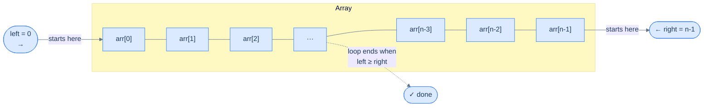

# Understanding the Two Pointer Pattern

## Why Single-Direction Traversal Isn't Always Enough

When you work with arrays, a single loop moving left to right is your default tool. It handles most problems cleanly. But some problems have a property that a single direction completely ignores: **both ends of the array matter at the same time**.

Think about checking if a word is a palindrome. You need to compare the first character with the last, the second with the second-to-last — you're always looking at two positions simultaneously, one from each end. A single forward loop forces you to either:
- Use a second nested loop (O(n²) — very slow), or
- Store results and do two passes (extra space)

The **two-pointer technique** solves this elegantly: use two variables, `left` and `right`, as indices that start at opposite ends and march toward each other in a single pass.

---

## The Core Idea

Two pointers (`left` and `right`) start at opposite ends of the array and converge toward the middle. At each step, you do some work using both `arr[left]` and `arr[right]`, then move one or both pointers inward.

> 🖼 Diagram — The two-pointer traversal — left starts at index 0 and advances right; right starts at index n−1 and retreats left. They meet in the middle.


<p align="center"><strong>The two-pointer traversal — <code>left</code> starts at index 0 and advances right; <code>right</code> starts at index n−1 and retreats left. They meet in the middle.</strong></p>

The loop terminates when `left >= right`. At that point, every pair of equidistant positions has been visited exactly once — which is why the algorithm runs in **O(n) time with O(1) extra space**.

---

## How the Pointers Move

Here is the full picture of a single traversal on an array of size 7:

> ▶ Interactive Diagram — Iteration-by-iteration view of the two-pointer traversal on a 7-element array — each step processes one pair of equidistant elements and closes the gap by one on each side.
```d3 widget=array-traversal
{
  "items": ["A", "B", "C", "D", "E", "F", "G"],
  "title": "Two-pointer traversal on a 7-element array",
  "steps": [
    {
      "markers": [
        { "name": "left",  "index": 0, "color": "#3b82f6" },
        { "name": "right", "index": 6, "color": "#f59e0b" }
      ],
      "range":   { "lo": 0, "hi": 6 },
      "msg": "Initial state — left = 0, right = 6. The whole array lies between the pointers."
    },
    {
      "markers": [
        { "name": "left",  "index": 1, "color": "#3b82f6" },
        { "name": "right", "index": 5, "color": "#f59e0b" }
      ],
      "range":   { "lo": 1, "hi": 5 },
      "msg": "After iteration 1 — A and G have been processed; left++, right--."
    },
    {
      "markers": [
        { "name": "left",  "index": 2, "color": "#3b82f6" },
        { "name": "right", "index": 4, "color": "#f59e0b" }
      ],
      "range":   { "lo": 2, "hi": 4 },
      "msg": "After iteration 2 — B and F processed; left++, right--."
    },
    {
      "markers": [
        { "name": "left",  "index": 3, "color": "#3b82f6" },
        { "name": "right", "index": 3, "color": "#f59e0b" }
      ],
      "range":   { "lo": 3, "hi": 3 },
      "msg": "After iteration 3 — C and E processed; left = right = 3."
    },
    {
      "markers": [],
      "msg": "left ≥ right — loop ends. The centre element D is handled separately if the problem requires it."
    }
  ]
}
```

<p align="center"><strong>Iteration-by-iteration view of the two-pointer traversal on a 7-element array — each step processes one pair of equidistant elements and closes the gap by one on each side.</strong></p>

---

## The Generic Algorithm

The two-pointer pattern follows this skeleton for every problem that uses it directly:

**Step 1.** Initialise `left = 0`, `right = n − 1` (or whatever starting positions the problem requires, as long as `left < right`).

**Step 2.** Loop while `left < right`:
- **Step 2.1** — do some work on `arr[left]` and `arr[right]`
- **Step 2.2** — move `left` forward by some number of steps (if the problem requires it)
- **Step 2.3** — move `right` backward by some number of steps (if the problem requires it)

**Step 3.** Return the result.

The specific "work" and "step size" in steps 2.1–2.3 change per problem. Everything else stays the same.

---

## Generic Implementation


```python run
from typing import List

class Solution:
    # Generic code for two-pointer traversal
    def two_pointer(self, arr: List[int]) -> None:

        # Initialize left and right to the ends of the array
        left = 0
        right = len(arr) - 1

        while left < right:
            left_val = arr[left]
            right_val = arr[right]

            # Check if the left pointer should be incremented
            if self.increment_left(left_val, right_val):
                # Increment the left pointer by some steps
                left += self.left_step(left_val, right_val)

            # Check if the right pointer should be decremented
            if self.decrement_right(left_val, right_val):
                # Decrement the right pointer by some steps
                right -= self.right_step(left_val, right_val)

    # Decide whether to move the left pointer
    def increment_left(self, left_val: int, right_val: int) -> bool:
        # Example condition: move left if sum < 10
        return left_val + right_val < 10

    # Decide whether to move the right pointer
    def decrement_right(self, left_val: int, right_val: int) -> bool:
        # Example condition: move right if sum > 10
        return left_val + right_val > 10

    # Steps to move the left pointer
    def left_step(self, left_val: int, right_val: int) -> int:
        return 1  # Example: move 1 step

    # Steps to move the right pointer
    def right_step(self, left_val: int, right_val: int) -> int:
        return 1  # Example: move 1 step
```

```java run
import java.util.List;

class Solution {

    // Generic code for two-pointer traversal
    public void twoPointer(List<Integer> arr) {

        // Initialize left and right to the ends of the array
        int left = 0;
        int right = arr.size() - 1;

        while (left < right) {
            int leftVal = arr.get(left);
            int rightVal = arr.get(right);

            // Check if the left pointer should be incremented
            if (incrementLeft(leftVal, rightVal)) {
                // Increment the left pointer by some steps
                left += leftStep(leftVal, rightVal);
            }

            // Check if the right pointer should be decremented
            if (decrementRight(leftVal, rightVal)) {
                // Decrement the right pointer by some steps
                right -= rightStep(leftVal, rightVal);
            }
        }
    }

    // Decide whether to move the left pointer
    private boolean incrementLeft(int leftVal, int rightVal) {
        // Example condition: move left if sum < 10
        return (leftVal + rightVal < 10);
    }

    // Decide whether to move the right pointer
    private boolean decrementRight(int leftVal, int rightVal) {
        // Example condition: move right if sum > 10
        return (leftVal + rightVal > 10);
    }

    // Steps to move the left pointer
    private int leftStep(int leftVal, int rightVal) {
        return 1; // Example: move 1 step
    }

    // Steps to move the right pointer
    private int rightStep(int leftVal, int rightVal) {
        return 1; // Example: move 1 step
    }
}
```


---

## Complexity Analysis

| | Complexity | Reasoning |
|---|---|---|
| **Time** | O(n) | `left` and `right` together visit every index exactly once. No element is processed twice. |
| **Space** | O(1) | Only two integer variables (`left` and `right`) are needed regardless of input size. |

This is true for every problem that directly applies the two-pointer technique — **both best and worst case are O(n) time, O(1) space**.

The power of this pattern is that it reduces problems which naively need O(n²) nested loops to a single O(n) pass.

---

## Three Ways to Apply Two Pointers

Not every two-pointer problem is identical. Problems in this pattern fall into three categories:

> 🖼 Diagram — Three categories of two-pointer pattern problems — we start with Direct Application, which is the simplest and most common.
```d2
Root: Two-Pointer Pattern Problems

D: |md
  **Direct Application**

  Two pointers applied as-is

  (e.g. reverse, palindrome check)
|

R: |md
  **Reduction**

  Problem reduced to an
  equivalent two-pointer problem
|

S: |md
  **Subproblems**

  One step of the solution
  uses two pointers internally
|

Root -> D
Root -> R
Root -> S
```

<p align="center"><strong>Three categories of two-pointer pattern problems — we start with Direct Application, which is the simplest and most common.</strong></p>

In the next lessons, we work through the **Direct Application** category in depth — problems where the two-pointer template above applies almost verbatim.

# Identifying Direct Application

## What Makes a Problem a "Direct Application"?

A two-pointer problem is a **direct application** when the loop template above fits without any pre-processing or wrapping. The problem already asks you to operate on pairs of elements — one from each end — while both pointers walk inward. No sorting, no transformation, no nested scan; the skeleton drops in and the loop body is one or two lines.

The contrast helps. A *reduction* problem first needs you to sort the array, re-index it, or convert it into a different shape before two pointers can run. A *subproblem* problem uses two pointers as one tactical step inside a larger algorithm. A direct application is what's left when neither layer is needed.

To make this concrete: reversing an array in place is direct (`left` and `right` swap and step inward). Finding two numbers in an unsorted array that sum to a target is *not* direct — you must sort it first, which is the reduction step before two pointers can take over.

So the key idea is: direct application means the two-pointer skeleton solves the problem as-stated, with only a constant-time operation in the loop body.

---

## Recognition Checklist

Use these four questions to decide whether a problem is a direct application. If every answer is "yes," the template fits as-is.

1. **Do you need to look at two positions of the array at the same time?** A direct application reads `arr[left]` and `arr[right]` together in every iteration — never one without the other.
2. **Does one position start near the beginning and the other near the end?** The initial state must be `left = 0` (or close to it) and `right = n − 1` (or close to it), with `left < right`.
3. **Do both pointers move strictly inward as the loop progresses?** Each iteration moves `left` forward, `right` backward, or both. Neither pointer ever reverses direction.
4. **Is the work done per step constant-time?** The loop body must be a fixed amount of work — a swap, a comparison, a copy. No nested scan of the remaining array.

These same four questions reappear as the **Diagnostic Questions** table in every problem write-up that follows. Treat them as the gatekeeper for the pattern.

---

## The Canonical Example: Reverse an Array In-Place

**Problem statement:** Given an array `arr`, reverse it in-place. Do not create and return a new array — modify the original.

```
Input:  arr = [1, 2, 3, 4, 5]
Output: arr is modified to [5, 4, 3, 2, 1]
```

> 🖼 Diagram — Reverse the array in-place — the original array (top) becomes the reversed array (bottom) without allocating new memory.
```d2
direction: right

before: "Original" {
  grid-columns: 5
  grid-gap: 0
  a: "1"
  b: "2"
  c: "3"
  d: "4"
  e: "5"
}

after: "Reversed (in-place)" {
  grid-columns: 5
  grid-gap: 0
  a: "5"
  b: "4"
  c: "3"
  d: "2"
  e: "1"
}

before -> after
```

<p align="center"><strong>Reverse the array in-place — the original array (top) becomes the reversed array (bottom) without allocating new memory.</strong></p>

---

## Brute Force: Two Passes + Temp Array

The naive approach copies elements in reverse into a temporary array, then copies back:

1. Walk `arr` backwards and fill `temp` forwards
2. Walk `temp` forwards and copy back into `arr`

> 🖼 Diagram — Brute-force reversal — two full passes and O(n) extra space for the temp array.
```d2
direction: right

ORIG: "Original arr" {
  grid-columns: 5
  grid-gap: 0
  a: "1"
  b: "2"
  c: "3"
  d: "4"
  e: "5"
}

TEMP: "temp (copy arr backwards)" {
  grid-columns: 5
  grid-gap: 0
  a: "5"
  b: "4"
  c: "3"
  d: "2"
  e: "1"
}

BACK: "arr (copy temp back)" {
  grid-columns: 5
  grid-gap: 0
  a: "5"
  b: "4"
  c: "3"
  d: "2"
  e: "1"
}

ORIG -> TEMP: pass 1 — backwards copy
TEMP -> BACK: pass 2 — forwards copy
```

<p align="center"><strong>Brute-force reversal — two full passes and O(n) extra space for the temp array.</strong></p>


```python run viz=array viz-root=arr
from typing import List

class BruteForce:
    def reverse(self, arr: List[int]) -> None:
        n = len(arr)
        temp = [0] * n

        # Pass 1: copy arr backwards into temp.
        for i in range(n - 1, -1, -1):
            temp[n - 1 - i] = arr[i]

        # Pass 2: copy temp back into arr.
        for i in range(n):
            arr[i] = temp[i]


arr = [1, 2, 3, 4, 5]
BruteForce().reverse(arr)
print(arr)   # [5, 4, 3, 2, 1]
```

```java run
import java.util.Arrays;

public class Main {
    static class BruteForce {
        void reverse(int[] arr) {
            int n = arr.length;
            int[] temp = new int[n];
            // Pass 1: copy backwards into temp.
            for (int i = n - 1; i >= 0; i--) temp[n - 1 - i] = arr[i];
            // Pass 2: copy temp back into arr.
            for (int i = 0; i < n; i++) arr[i] = temp[i];
        }
    }

    public static void main(String[] args) {
        int[] arr = {1, 2, 3, 4, 5};
        new BruteForce().reverse(arr);
        System.out.println(Arrays.toString(arr));
    }
}
```


This works, but it uses O(n) extra space and touches every element twice. We can do better.

---

## Two-Pointer Solution: One Pass, Zero Extra Space

**Key insight:** to reverse an array, we just need to swap equidistant elements from both ends — `arr[0] ↔ arr[n-1]`, `arr[1] ↔ arr[n-2]`, and so on. Each swap needs exactly two positions: one from the left, one from the right. That's the two-pointer template.

> ▶ Interactive Diagram — Two-pointer reversal on [1, 2, 3, 4, 5] — two swaps close the gap from both ends; the middle element needs no swap.
```d3 widget=array-traversal
{
  "items": ["1", "2", "3", "4", "5"],
  "title": "Two-pointer reversal on [1, 2, 3, 4, 5]",
  "steps": [
    {
      "items":   ["1", "2", "3", "4", "5"],
      "markers": [
        { "name": "left",  "index": 0, "color": "#3b82f6" },
        { "name": "right", "index": 4, "color": "#f59e0b" }
      ],
      "msg": "Initial — left = 0, right = 4. Swap arr[0]=1 with arr[4]=5."
    },
    {
      "items":   ["5", "2", "3", "4", "1"],
      "markers": [
        { "name": "left",  "index": 1, "color": "#3b82f6" },
        { "name": "right", "index": 3, "color": "#f59e0b" }
      ],
      "msg": "Move inward — left = 1, right = 3. Swap arr[1]=2 with arr[3]=4."
    },
    {
      "items":   ["5", "4", "3", "2", "1"],
      "markers": [
        { "name": "left",  "index": 2, "color": "#3b82f6" },
        { "name": "right", "index": 2, "color": "#f59e0b" }
      ],
      "msg": "left = right = 2 — pointers meet, the middle element stays. Result: [5, 4, 3, 2, 1]."
    }
  ]
}
```

<p align="center"><strong>Two-pointer reversal on <code>[1, 2, 3, 4, 5]</code> — two swaps close the gap from both ends; the middle element needs no swap.</strong></p>


```python run
from typing import List

class Solution:
    def reverse(self, arr: List[int]) -> None:

        # Initialize two pointers, one pointing to the beginning of the
        # array and the other pointing to the end of the array
        left: int = 0
        right = len(arr) - 1

        # Use a while loop to traverse the array using the two pointers
        while left < right:

            # Swap the values pointed by the left and right pointers
            arr[left], arr[right] = arr[right], arr[left]

            # Move the pointers towards the center of the array
            left += 1
            right -= 1
```

```java run
class Solution {
    public void reverse(int[] arr) {

        // Initialize two pointers, one pointing to the beginning of the
        // array and the other pointing to the end of the array
        int left = 0;
        int right = arr.length - 1;

        // Use a while loop to traverse the array using the two pointers
        while (left < right) {

            // Swap the values pointed by the left and right pointers
            int temp = arr[left];
            arr[left] = arr[right];
            arr[right] = temp;

            // Move the pointers towards the center of the array
            left++;
            right--;
        }
    }
}
```


One pass. No extra memory. The two-pointer template applied directly.

<details>
<summary><strong>Trace — arr = [1, 2, 3, 4, 5]</strong></summary>

```
arr = [1, 2, 3, 4, 5]   left = 0,  right = 4

Step 1 │ left=0 (1),  right=4 (5) │ 0 < 4 → swap │ [5, 2, 3, 4, 1] │ left=1, right=3
Step 2 │ left=1 (2),  right=3 (4) │ 1 < 3 → swap │ [5, 4, 3, 2, 1] │ left=2, right=2
Step 3 │ left=2 (3),  right=2 (3) │ 2 == 2 → left < right is false → loop exits

Result: [5, 4, 3, 2, 1] ✓

Note: The middle element (3) never needed a swap — it's equidistant from both ends
      and sits in its correct reversed position automatically.

Even-length check — arr = [1, 2, 3, 4]:
Step 1 │ left=0 (1),  right=3 (4) │ 0 < 3 → swap │ [4, 2, 3, 1] │ left=1, right=2
Step 2 │ left=1 (2),  right=2 (3) │ 1 < 2 → swap │ [4, 3, 2, 1] │ left=2, right=1
Step 3 │ left=2,      right=1     │ 2 > 1 → loop exits (pointers crossed)

Result: [4, 3, 2, 1] ✓

Note: For even-length arrays the pointers cross (left > right) rather than meet —
      all pairs are handled before that happens.
```

</details>

---

## Fitting the Template

Let's verify this problem matches all four checkboxes:

| Checkpoint | This Problem |
|---|---|
| Two positions at once? | ✅ `arr[left]` and `arr[right]` |
| One near start, one near end? | ✅ `left=0`, `right=n-1` |
| Both move inward? | ✅ `left++`, `right--` each iteration |
| Simple work per step? | ✅ One swap |

---

### Checkpoint 1 — Why "two positions at once"?

**WHAT:** A reversal requires swapping pairs of elements. A swap is an inherently two-element operation — you can't swap a single element with nothing.

**WHY it means two pointers fit:** Every step of the algorithm needs `arr[left]` and `arr[right]` simultaneously. One pointer alone can't do the job — it would need to "remember" the element it picked up and go look for where to put it, which is exactly what the brute force does (it stores the whole array in `temp`).

**What breaks with a single pointer:** Walk forward with one pointer and try to reverse in-place — when you overwrite `arr[0]` with `arr[4]`, the original `arr[0]` is gone. You'd need to save it somewhere first. That "somewhere" is the temp array. Two pointers sidestep the need entirely: they swap atomically (`a, b = b, a`), so nothing is lost.

> **Rule of thumb:** If the problem needs to operate on two elements that "belong together" (a pair, a palindrome check, a sum), two simultaneous pointers are the natural fit.

---

### Checkpoint 2 — Why "one near start, one near end"?

**WHAT:** `left` starts at index `0` (the first element), `right` starts at index `n-1` (the last element).

**WHY this specific placement:** After reversal, element at index `0` must land at index `n-1` and vice versa. Element at index `1` must land at `n-2`. The pattern is: **element at distance `d` from the left end swaps with element at distance `d` from the right end**.

Placing one pointer at each end directly aligns with this structure — at every step, `left` and `right` are pointing at exactly the pair that needs to swap next.

**What breaks with a different placement:** If both pointers started from the left (like in many sliding window problems), you'd never naturally reach the element at `n-1` first. You'd be doing something fundamentally different — not a reversal.

**Concrete check:** `[1, 2, 3, 4, 5]`
- `left=0, right=4`: `1` and `5` are the farthest pair — swap first ✓
- `left=1, right=3`: `2` and `4` are next closest pair — swap second ✓
- `left=2, right=2`: single middle element — no swap needed ✓

---

### Checkpoint 3 — Why "both move inward"?

**WHAT:** After each swap, both `left` increments by 1 and `right` decrements by 1.

**WHY inward movement:** After swapping `arr[left]` and `arr[right]`, those two positions are finalized — they now hold the correct values for a reversed array. The unsolved subproblem is the inner portion: `arr[left+1 .. right-1]`. Moving both pointers inward shrinks the problem by 2 each step and focuses attention on exactly what's left to solve.

**Why the stop condition is `left < right` (not `left <= right`):**
- When `left == right` (odd-length arrays): both pointers are at the same middle element. That element is already in the correct position — swapping it with itself is a no-op. We stop before that unnecessary step.
- When `left > right` (even-length arrays): the pointers have crossed, all pairs have been handled. No element remains.

**What breaks if you stop at `left <= right`:** For odd-length arrays like `[1, 2, 3, 4, 5]`, when `left = right = 2`, you'd execute `arr[2], arr[2] = arr[2], arr[2]` — harmless but wasteful. For the stop condition to be correct, `left < right` is sufficient and exact.

---

### Checkpoint 4 — Why "simple work per step"?

**WHAT:** At each step, we do exactly one swap: `arr[left], arr[right] = arr[right], arr[left]`.

**WHY "simple" matters:** The two-pointer direct application template is powerful precisely because the loop body is O(1) — a fixed amount of work per step. Combined with O(n) steps (n/2 swaps), the total is O(n) time. The simplicity of the per-step work is what keeps the whole algorithm lean.

**HOW to recognize "simple work" in other problems:** The work per step should not require nested loops, searching, or recursion. It should be a direct operation on the two elements currently pointed at — compare, swap, copy, check equality. If the per-step work itself requires a loop, you may be looking at a subproblem pattern instead (section 05).

**What this rules out:** If you found yourself needing to scan the entire remaining array on each step, that's O(n²) and the direct-application template no longer applies cleanly.

---

That's a direct application — all four checkboxes confirmed.

---

## Problems in This Category

The following lessons each apply the two-pointer technique in exactly this direct way. Each is a small variation on the same theme:

| Problem | Two-pointer work per step |
|---|---|
| **Flip Characters** | Swap characters from both ends |
| **Palindrome Checker** | Compare characters from both ends |
| **Vowel Exchange** | Find and swap vowels from both ends |
| **Reverse Words** | Reverse each word's characters with inner two pointers |
| **Reverse Segments** | Reverse the first *k* characters of every *2k* block |
| **Reverse Word Order** | Reverse entire string, then reverse each word |

Each is a small twist on the same pattern — same skeleton, different work in the loop body.
