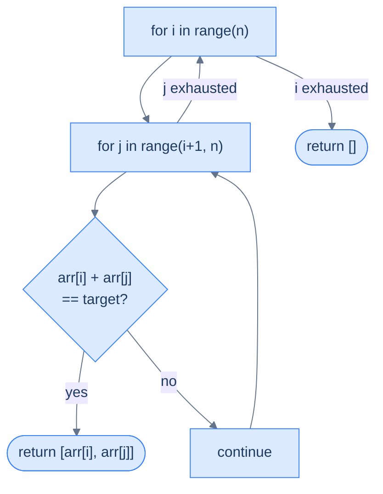
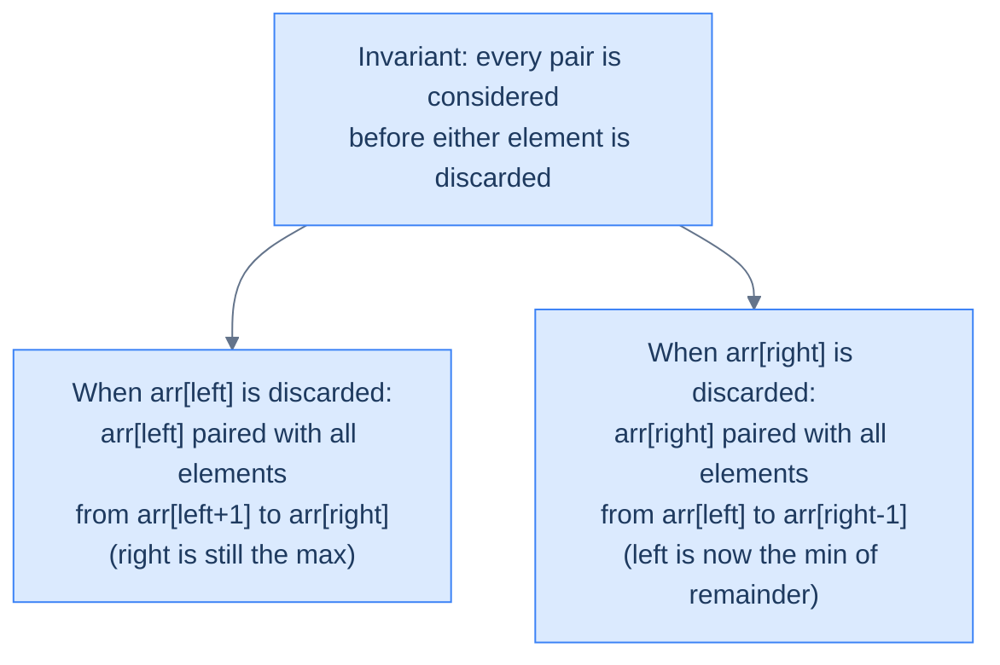

# Identifying Two Pointer Reduction

## Understanding the Pattern

### Why Naive Isn't Enough

The direct two-pointer template assumes the input already exposes a monotonic structure between its two ends. On `[1, 2, 4, 7, 9]`, left is the minimum and right is the maximum, so each pointer move has a guaranteed effect on the sum. On `[3, 5, 2, 8, 7, 1, 9, 4]`, that guarantee evaporates — `arr[0]` is neither the smallest nor the largest, and a move could push the sum in either direction.

The naive workaround is to scan every pair with nested loops in O(n²) time, which throws away the linear-pass discipline the two-pointer pattern exists to provide. To make the search resolve in O(n) work after a one-time setup, the array first has to acquire the monotonic structure the template needs.

### The Core Idea

If the original problem can be transformed into an equivalent problem that fits the direct two-pointer template — and the solution to the transformed problem is provably also the solution to the original — then the two-pointer pass applies. The transformation is called a **reduction**. The most common reduction is sorting; when the answer depends only on values (not on original indices), sorting is free, and the sorted order creates the min-at-left / max-at-right invariant the template needs. When sorting is forbidden because positions matter, a problem-specific greedy argument can sometimes create the same decisive direction without rearranging the array.

### How the Pointers Move

The mechanics carry over from direct two pointers — `left = 0`, `right = n − 1`, both move inward — but the move rule is now decided by a comparison rooted in the reduced structure rather than by a fixed direction. Three decision shapes recur across the problems in this section:

- **Equality search** — compare `arr[left] + arr[right]` to `target`; move the pointer that nudges the sum back toward `target`.
- **Inequality search** — compare against a threshold; on a valid pair, record it and advance the pointer that hunts for an improvement.
- **Greedy area** — the formula itself dictates the move (e.g. always advance the pointer on the shorter wall in Largest Container).

In each shape, one pointer move discards an element from further consideration, and the discard is justified by an invariant the reduction created.

---

## The Generic Algorithm

The reduction-style two-pointer pass has four stages:

1. Verify the four diagnostic questions allow the reduction (order doesn't matter or a greedy guarantee exists; two items are needed simultaneously; traversal from both ends has a decisive direction in the transformed problem).
2. Apply the reducing transformation — usually `arr.sort()` in O(n log n) time, occasionally a problem-specific greedy invariant that needs no preprocessing.
3. Initialise `left = 0`, `right = n − 1`, and any accumulator the problem needs (`max_sum`, `result`, etc.).
4. While `left < right`, evaluate the pair under the problem's predicate, update the accumulator if appropriate, and move exactly one pointer per iteration in the direction justified by the invariant.

Each iteration discards at least one index permanently. The loop terminates in at most `n − 1` iterations because the gap `right − left` strictly decreases on every pass.

---

## Complexity Analysis

| Cost | Bound | Reasoning |
|---|---|---|
| **Time (sort-based reduction)** | O(n log n) | Sorting dominates the O(n) two-pointer pass |
| **Time (greedy reduction, no sort)** | O(n) | Single inward sweep, constant work per step |
| **Extra space** | O(1) | In-place sort plus two pointer variables; output space is separate when the problem returns a list of pairs |

When the input is guaranteed sorted, the sort-based variant collapses to O(n) time as well. The space bound assumes an in-place sort; a language-specific sort that copies (e.g. `Arrays.sort` on boxed `Integer[]`) raises it to O(n).

---

## Variants / Taxonomy

The problems in this section sweep out the main sub-shapes of the reduction pattern:

- **Equality reduction (sort)** — Two Sum: sort, then converge until the sum matches the target.
- **Inequality reduction (sort)** — Target Limited Two Sum: sort, then track the largest sum below a threshold; on a valid pair, advance `left` to hunt for a larger one.
- **Deduplicating reduction (sort)** — Duplicate Aware Two Sum: sort, then on each match skip past consecutive equals on both sides before continuing.
- **Greedy reduction (no sort)** — Largest Container: the area formula creates the decisive direction directly — always move the pointer on the shorter wall.

The first three share sorting as the reducing transformation; the fourth replaces sorting with a problem-specific greedy invariant.

---

## Recognition Checklist

Before attempting a reduction, run through these four questions:

Before attempting a reduction, run through these four questions:

| Question | What it tests |
|---|---|
| **Q1.** Does the order of items matter? | If no, sorting is allowed — a huge enabler |
| **Q2.** Do we need two items simultaneously? | Two pointers need two active positions |
| **Q3.** Does traversing from both ends give us something special? | On a sorted array, left gives minimum, right gives maximum |
| **Q4.** Can we reduce to a simpler problem and re-ask Q1–Q3? | Chained reductions are possible |

If sorting unlocks Q3 (traversal from both ends becomes meaningful), you almost certainly have a two-pointer reduction problem. The decisive direction may also come from a greedy argument when sorting is forbidden — Largest Container is the canonical example.

---

## Canonical Example

### Problem Statement

Given an array `arr` of integers and a target, find two elements whose sum equals the target.

Let's use `arr = [3, 5, 2, 8, 7, 1, 9, 4]`, target = 13.

> 🖼 Diagram — Find two numbers with the given sum (13) in the array — pairs (5,8) and (4,9) both qualify.
```d2
direction: right

arr: "arr = [3, 5, 2, 8, 7, 1, 9, 4],  target = 13" {
  grid-columns: 8
  grid-gap: 0
  a0: "3"
  a1: "5" {style.fill: "#fde68a"; style.stroke: "#d97706"}
  a2: "2"
  a3: "8" {style.fill: "#fde68a"; style.stroke: "#d97706"}
  a4: "7"
  a5: "1"
  a6: "9" {style.fill: "#dcfce7"; style.stroke: "#16a34a"}
  a7: "4" {style.fill: "#dcfce7"; style.stroke: "#16a34a"}
}

p1: "5 + 8 = 13" {style.fill: "#fde68a"; style.stroke: "#d97706"}
p2: "4 + 9 = 13" {style.fill: "#dcfce7"; style.stroke: "#16a34a"}

p1 -> arr.a1
p1 -> arr.a3
p2 -> arr.a6
p2 -> arr.a7
```

<p align="center"><strong>Find two numbers with the given sum (13) in the array — pairs (5,8) and (4,9) both qualify.</strong></p>

---

### Brute Force

The naive solution checks every pair with nested loops in O(n²) time:

> 🖼 Diagram — Brute-force nested loops check every pair — O(n²) time, correct but slow. For n=8 that's 28 pairs checked.


<p align="center"><strong>Brute-force nested loops check every pair — O(n²) time, correct but slow. For n=8 that's 28 pairs checked.</strong></p>

> ▶ Interactive Diagram — TODO: add caption
```d3 widget=array-1d
{
  "steps": [
    {
      "nodes": [
        {
          "id": "0",
          "label": "3",
          "kind": "cell",
          "meta": [],
          "slot": 0,
          "cardId": "",
          "layoutKind": ""
        },
        {
          "id": "1",
          "label": "5",
          "kind": "cell",
          "meta": [],
          "slot": 1,
          "cardId": "",
          "layoutKind": ""
        },
        {
          "id": "2",
          "label": "2",
          "kind": "cell",
          "meta": [],
          "slot": 2,
          "cardId": "",
          "layoutKind": ""
        },
        {
          "id": "3",
          "label": "8",
          "kind": "cell",
          "meta": [],
          "slot": 3,
          "cardId": "",
          "layoutKind": ""
        },
        {
          "id": "4",
          "label": "7",
          "kind": "cell",
          "meta": [],
          "slot": 4,
          "cardId": "",
          "layoutKind": ""
        },
        {
          "id": "5",
          "label": "1",
          "kind": "cell",
          "meta": [],
          "slot": 5,
          "cardId": "",
          "layoutKind": ""
        },
        {
          "id": "6",
          "label": "9",
          "kind": "cell",
          "meta": [],
          "slot": 6,
          "cardId": "",
          "layoutKind": ""
        },
        {
          "id": "7",
          "label": "4",
          "kind": "cell",
          "meta": [],
          "slot": 7,
          "cardId": "",
          "layoutKind": ""
        }
      ],
      "edges": [],
      "cursor": [
        {
          "name": "i",
          "target": "0",
          "color": "#3b82f6"
        },
        {
          "name": "j",
          "target": "1",
          "color": "#f59e0b"
        }
      ],
      "highlight": [],
      "changed": [],
      "removed": [],
      "annotation": "i=0 (3), j=1 (5): 3 + 5 = 8 ≠ 13",
      "line": 0,
      "frames": [],
      "cardCursor": []
    },
    {
      "nodes": [
        {
          "id": "0",
          "label": "3",
          "kind": "cell",
          "meta": [],
          "slot": 0,
          "cardId": "",
          "layoutKind": ""
        },
        {
          "id": "1",
          "label": "5",
          "kind": "cell",
          "meta": [],
          "slot": 1,
          "cardId": "",
          "layoutKind": ""
        },
        {
          "id": "2",
          "label": "2",
          "kind": "cell",
          "meta": [],
          "slot": 2,
          "cardId": "",
          "layoutKind": ""
        },
        {
          "id": "3",
          "label": "8",
          "kind": "cell",
          "meta": [],
          "slot": 3,
          "cardId": "",
          "layoutKind": ""
        },
        {
          "id": "4",
          "label": "7",
          "kind": "cell",
          "meta": [],
          "slot": 4,
          "cardId": "",
          "layoutKind": ""
        },
        {
          "id": "5",
          "label": "1",
          "kind": "cell",
          "meta": [],
          "slot": 5,
          "cardId": "",
          "layoutKind": ""
        },
        {
          "id": "6",
          "label": "9",
          "kind": "cell",
          "meta": [],
          "slot": 6,
          "cardId": "",
          "layoutKind": ""
        },
        {
          "id": "7",
          "label": "4",
          "kind": "cell",
          "meta": [],
          "slot": 7,
          "cardId": "",
          "layoutKind": ""
        }
      ],
      "edges": [],
      "cursor": [
        {
          "name": "i",
          "target": "0",
          "color": "#3b82f6"
        },
        {
          "name": "j",
          "target": "2",
          "color": "#f59e0b"
        }
      ],
      "highlight": [],
      "changed": [],
      "removed": [],
      "annotation": "i=0 (3), j=2 (2): 3 + 2 = 5 ≠ 13",
      "line": 0,
      "frames": [],
      "cardCursor": []
    },
    {
      "nodes": [
        {
          "id": "0",
          "label": "3",
          "kind": "cell",
          "meta": [],
          "slot": 0,
          "cardId": "",
          "layoutKind": ""
        },
        {
          "id": "1",
          "label": "5",
          "kind": "cell",
          "meta": [],
          "slot": 1,
          "cardId": "",
          "layoutKind": ""
        },
        {
          "id": "2",
          "label": "2",
          "kind": "cell",
          "meta": [],
          "slot": 2,
          "cardId": "",
          "layoutKind": ""
        },
        {
          "id": "3",
          "label": "8",
          "kind": "cell",
          "meta": [],
          "slot": 3,
          "cardId": "",
          "layoutKind": ""
        },
        {
          "id": "4",
          "label": "7",
          "kind": "cell",
          "meta": [],
          "slot": 4,
          "cardId": "",
          "layoutKind": ""
        },
        {
          "id": "5",
          "label": "1",
          "kind": "cell",
          "meta": [],
          "slot": 5,
          "cardId": "",
          "layoutKind": ""
        },
        {
          "id": "6",
          "label": "9",
          "kind": "cell",
          "meta": [],
          "slot": 6,
          "cardId": "",
          "layoutKind": ""
        },
        {
          "id": "7",
          "label": "4",
          "kind": "cell",
          "meta": [],
          "slot": 7,
          "cardId": "",
          "layoutKind": ""
        }
      ],
      "edges": [],
      "cursor": [
        {
          "name": "i",
          "target": "0",
          "color": "#3b82f6"
        },
        {
          "name": "j",
          "target": "3",
          "color": "#f59e0b"
        }
      ],
      "highlight": [],
      "changed": [],
      "removed": [],
      "annotation": "i=0 (3), j=3 (8): 3 + 8 = 11 ≠ 13",
      "line": 0,
      "frames": [],
      "cardCursor": []
    },
    {
      "nodes": [
        {
          "id": "0",
          "label": "3",
          "kind": "cell",
          "meta": [],
          "slot": 0,
          "cardId": "",
          "layoutKind": ""
        },
        {
          "id": "1",
          "label": "5",
          "kind": "cell",
          "meta": [],
          "slot": 1,
          "cardId": "",
          "layoutKind": ""
        },
        {
          "id": "2",
          "label": "2",
          "kind": "cell",
          "meta": [],
          "slot": 2,
          "cardId": "",
          "layoutKind": ""
        },
        {
          "id": "3",
          "label": "8",
          "kind": "cell",
          "meta": [],
          "slot": 3,
          "cardId": "",
          "layoutKind": ""
        },
        {
          "id": "4",
          "label": "7",
          "kind": "cell",
          "meta": [],
          "slot": 4,
          "cardId": "",
          "layoutKind": ""
        },
        {
          "id": "5",
          "label": "1",
          "kind": "cell",
          "meta": [],
          "slot": 5,
          "cardId": "",
          "layoutKind": ""
        },
        {
          "id": "6",
          "label": "9",
          "kind": "cell",
          "meta": [],
          "slot": 6,
          "cardId": "",
          "layoutKind": ""
        },
        {
          "id": "7",
          "label": "4",
          "kind": "cell",
          "meta": [],
          "slot": 7,
          "cardId": "",
          "layoutKind": ""
        }
      ],
      "edges": [],
      "cursor": [
        {
          "name": "i",
          "target": "0",
          "color": "#3b82f6"
        },
        {
          "name": "j",
          "target": "4",
          "color": "#f59e0b"
        }
      ],
      "highlight": [],
      "changed": [],
      "removed": [],
      "annotation": "i=0 (3), j=4 (7): 3 + 7 = 10 ≠ 13",
      "line": 0,
      "frames": [],
      "cardCursor": []
    },
    {
      "nodes": [
        {
          "id": "0",
          "label": "3",
          "kind": "cell",
          "meta": [],
          "slot": 0,
          "cardId": "",
          "layoutKind": ""
        },
        {
          "id": "1",
          "label": "5",
          "kind": "cell",
          "meta": [],
          "slot": 1,
          "cardId": "",
          "layoutKind": ""
        },
        {
          "id": "2",
          "label": "2",
          "kind": "cell",
          "meta": [],
          "slot": 2,
          "cardId": "",
          "layoutKind": ""
        },
        {
          "id": "3",
          "label": "8",
          "kind": "cell",
          "meta": [],
          "slot": 3,
          "cardId": "",
          "layoutKind": ""
        },
        {
          "id": "4",
          "label": "7",
          "kind": "cell",
          "meta": [],
          "slot": 4,
          "cardId": "",
          "layoutKind": ""
        },
        {
          "id": "5",
          "label": "1",
          "kind": "cell",
          "meta": [],
          "slot": 5,
          "cardId": "",
          "layoutKind": ""
        },
        {
          "id": "6",
          "label": "9",
          "kind": "cell",
          "meta": [],
          "slot": 6,
          "cardId": "",
          "layoutKind": ""
        },
        {
          "id": "7",
          "label": "4",
          "kind": "cell",
          "meta": [],
          "slot": 7,
          "cardId": "",
          "layoutKind": ""
        }
      ],
      "edges": [],
      "cursor": [
        {
          "name": "i",
          "target": "0",
          "color": "#3b82f6"
        },
        {
          "name": "j",
          "target": "5",
          "color": "#f59e0b"
        }
      ],
      "highlight": [],
      "changed": [],
      "removed": [],
      "annotation": "i=0 (3), j=5 (1): 3 + 1 = 4 ≠ 13",
      "line": 0,
      "frames": [],
      "cardCursor": []
    },
    {
      "nodes": [
        {
          "id": "0",
          "label": "3",
          "kind": "cell",
          "meta": [],
          "slot": 0,
          "cardId": "",
          "layoutKind": ""
        },
        {
          "id": "1",
          "label": "5",
          "kind": "cell",
          "meta": [],
          "slot": 1,
          "cardId": "",
          "layoutKind": ""
        },
        {
          "id": "2",
          "label": "2",
          "kind": "cell",
          "meta": [],
          "slot": 2,
          "cardId": "",
          "layoutKind": ""
        },
        {
          "id": "3",
          "label": "8",
          "kind": "cell",
          "meta": [],
          "slot": 3,
          "cardId": "",
          "layoutKind": ""
        },
        {
          "id": "4",
          "label": "7",
          "kind": "cell",
          "meta": [],
          "slot": 4,
          "cardId": "",
          "layoutKind": ""
        },
        {
          "id": "5",
          "label": "1",
          "kind": "cell",
          "meta": [],
          "slot": 5,
          "cardId": "",
          "layoutKind": ""
        },
        {
          "id": "6",
          "label": "9",
          "kind": "cell",
          "meta": [],
          "slot": 6,
          "cardId": "",
          "layoutKind": ""
        },
        {
          "id": "7",
          "label": "4",
          "kind": "cell",
          "meta": [],
          "slot": 7,
          "cardId": "",
          "layoutKind": ""
        }
      ],
      "edges": [],
      "cursor": [
        {
          "name": "i",
          "target": "0",
          "color": "#3b82f6"
        },
        {
          "name": "j",
          "target": "6",
          "color": "#f59e0b"
        }
      ],
      "highlight": [],
      "changed": [],
      "removed": [],
      "annotation": "i=0 (3), j=6 (9): 3 + 9 = 12 ≠ 13",
      "line": 0,
      "frames": [],
      "cardCursor": []
    },
    {
      "nodes": [
        {
          "id": "0",
          "label": "3",
          "kind": "cell",
          "meta": [],
          "slot": 0,
          "cardId": "",
          "layoutKind": ""
        },
        {
          "id": "1",
          "label": "5",
          "kind": "cell",
          "meta": [],
          "slot": 1,
          "cardId": "",
          "layoutKind": ""
        },
        {
          "id": "2",
          "label": "2",
          "kind": "cell",
          "meta": [],
          "slot": 2,
          "cardId": "",
          "layoutKind": ""
        },
        {
          "id": "3",
          "label": "8",
          "kind": "cell",
          "meta": [],
          "slot": 3,
          "cardId": "",
          "layoutKind": ""
        },
        {
          "id": "4",
          "label": "7",
          "kind": "cell",
          "meta": [],
          "slot": 4,
          "cardId": "",
          "layoutKind": ""
        },
        {
          "id": "5",
          "label": "1",
          "kind": "cell",
          "meta": [],
          "slot": 5,
          "cardId": "",
          "layoutKind": ""
        },
        {
          "id": "6",
          "label": "9",
          "kind": "cell",
          "meta": [],
          "slot": 6,
          "cardId": "",
          "layoutKind": ""
        },
        {
          "id": "7",
          "label": "4",
          "kind": "cell",
          "meta": [],
          "slot": 7,
          "cardId": "",
          "layoutKind": ""
        }
      ],
      "edges": [],
      "cursor": [
        {
          "name": "i",
          "target": "0",
          "color": "#3b82f6"
        },
        {
          "name": "j",
          "target": "7",
          "color": "#f59e0b"
        }
      ],
      "highlight": [],
      "changed": [],
      "removed": [],
      "annotation": "i=0 (3), j=7 (4): 3 + 4 = 7 ≠ 13. Inner loop exhausted → i++",
      "line": 0,
      "frames": [],
      "cardCursor": []
    },
    {
      "nodes": [
        {
          "id": "0",
          "label": "3",
          "kind": "cell",
          "meta": [],
          "slot": 0,
          "cardId": "",
          "layoutKind": ""
        },
        {
          "id": "1",
          "label": "5",
          "kind": "cell",
          "meta": [],
          "slot": 1,
          "cardId": "",
          "layoutKind": ""
        },
        {
          "id": "2",
          "label": "2",
          "kind": "cell",
          "meta": [],
          "slot": 2,
          "cardId": "",
          "layoutKind": ""
        },
        {
          "id": "3",
          "label": "8",
          "kind": "cell",
          "meta": [],
          "slot": 3,
          "cardId": "",
          "layoutKind": ""
        },
        {
          "id": "4",
          "label": "7",
          "kind": "cell",
          "meta": [],
          "slot": 4,
          "cardId": "",
          "layoutKind": ""
        },
        {
          "id": "5",
          "label": "1",
          "kind": "cell",
          "meta": [],
          "slot": 5,
          "cardId": "",
          "layoutKind": ""
        },
        {
          "id": "6",
          "label": "9",
          "kind": "cell",
          "meta": [],
          "slot": 6,
          "cardId": "",
          "layoutKind": ""
        },
        {
          "id": "7",
          "label": "4",
          "kind": "cell",
          "meta": [],
          "slot": 7,
          "cardId": "",
          "layoutKind": ""
        }
      ],
      "edges": [],
      "cursor": [
        {
          "name": "i",
          "target": "1",
          "color": "#3b82f6"
        },
        {
          "name": "j",
          "target": "2",
          "color": "#f59e0b"
        }
      ],
      "highlight": [],
      "changed": [],
      "removed": [],
      "annotation": "i=1 (5), j=2 (2): 5 + 2 = 7 ≠ 13",
      "line": 0,
      "frames": [],
      "cardCursor": []
    },
    {
      "nodes": [
        {
          "id": "0",
          "label": "3",
          "kind": "cell",
          "meta": [],
          "slot": 0,
          "cardId": "",
          "layoutKind": ""
        },
        {
          "id": "1",
          "label": "5",
          "kind": "cell",
          "meta": [],
          "slot": 1,
          "cardId": "",
          "layoutKind": ""
        },
        {
          "id": "2",
          "label": "2",
          "kind": "cell",
          "meta": [],
          "slot": 2,
          "cardId": "",
          "layoutKind": ""
        },
        {
          "id": "3",
          "label": "8",
          "kind": "cell",
          "meta": [],
          "slot": 3,
          "cardId": "",
          "layoutKind": ""
        },
        {
          "id": "4",
          "label": "7",
          "kind": "cell",
          "meta": [],
          "slot": 4,
          "cardId": "",
          "layoutKind": ""
        },
        {
          "id": "5",
          "label": "1",
          "kind": "cell",
          "meta": [],
          "slot": 5,
          "cardId": "",
          "layoutKind": ""
        },
        {
          "id": "6",
          "label": "9",
          "kind": "cell",
          "meta": [],
          "slot": 6,
          "cardId": "",
          "layoutKind": ""
        },
        {
          "id": "7",
          "label": "4",
          "kind": "cell",
          "meta": [],
          "slot": 7,
          "cardId": "",
          "layoutKind": ""
        }
      ],
      "edges": [],
      "cursor": [
        {
          "name": "i",
          "target": "1",
          "color": "#3b82f6"
        },
        {
          "name": "j",
          "target": "3",
          "color": "#f59e0b"
        }
      ],
      "highlight": [
        "1",
        "2",
        "3"
      ],
      "changed": [],
      "removed": [],
      "annotation": "i=1 (5), j=3 (8): 5 + 8 = 13 ✓ → return [5, 8]",
      "line": 0,
      "frames": [],
      "cardCursor": []
    }
  ],
  "title": "Brute force on arr = [3, 5, 2, 8, 7, 1, 9, 4], target = 13"
}
```


```python run viz=array viz-root=arr
from typing import List

def two_sum_brute(arr: List[int], target: int) -> List[int]:
    for i in range(len(arr)):
        # Start j at i+1: same-element use is forbidden, and (i,j) ≡ (j,i) — skip duplicates.
        for j in range(i + 1, len(arr)):
            if arr[i] + arr[j] == target:
                return [arr[i], arr[j]]
    return []

print(two_sum_brute([3, 5, 2, 8, 7, 1, 9, 4], 13))  # [5, 8]
```

```java run viz=array viz-root=arr
import java.util.Arrays;

public class Main {
    static int[] twoSumBrute(int[] arr, int target) {
        for (int i = 0; i < arr.length; i++) {
            for (int j = i + 1; j < arr.length; j++) {
                if (arr[i] + arr[j] == target) {
                    return new int[] { arr[i], arr[j] };
                }
            }
        }
        return new int[0];
    }

    public static void main(String[] args) {
        System.out.println(Arrays.toString(twoSumBrute(new int[]{3,5,2,8,7,1,9,4}, 13)));
    }
}
```


<details>
<summary><strong>Trace — arr = [3, 5, 2, 8, 7, 1, 9, 4],  target = 13  (brute force)</strong></summary>

```
arr = [3, 5, 2, 8, 7, 1, 9, 4],  target = 13

i=0 (3):
  j=1 (5): 3+5= 8 ≠ 13
  j=2 (2): 3+2= 5 ≠ 13
  j=3 (8): 3+8=11 ≠ 13
  j=4 (7): 3+7=10 ≠ 13
  j=5 (1): 3+1= 4 ≠ 13
  j=6 (9): 3+9=12 ≠ 13
  j=7 (4): 3+4= 7 ≠ 13

i=1 (5):
  j=2 (2): 5+2= 7 ≠ 13
  j=3 (8): 5+8=13 == 13 → return [5, 8] ✓

Total pairs checked: 10 out of 28 possible (got lucky — answer found early)
Worst case: all 28 pairs checked → O(n²)
```

</details>

---

### Key Insight

Run the diagnostic questions against the brute-force problem:

| Question | Answer |
|---|---|
| **Q1.** Does order matter? | **No** — we just need the pair, not their positions |
| **Q2.** Do we need two items? | **Yes** — always summing a pair |
| **Q3.** Does traversing from both ends have special characteristics? (Unsorted) | **No** — order is arbitrary, no decisive direction |
| **Q4.** Reduced problem: what if we sort first? | Q3 flips to **Yes** — now traversal has a decisive direction |

The pivot is Q4: sort the array in O(n log n) time, and the reduced problem now has a sorted-order invariant. The expanded reasoning per question follows.

---

#### Q1 — Why "order doesn't matter here"?

**WHAT:** The problem asks for the *values* of the two elements that sum to `target` — it doesn't care which indices they lived at originally.

**WHY it matters:** Order being irrelevant is the permission slip to sort. Sorting rearranges elements, which normally destroys positional information — but since we don't need positions here, we lose nothing.

**Concrete check:** `arr = [3, 5, 2, 8, 7, 1, 9, 4]`, target = 13. The pair `(5, 8)` is valid whether the array is unsorted or sorted as `[1, 2, 3, 4, 5, 7, 8, 9]`. The answer stays the same.

**What breaks if order DID matter?** If the problem asked for the *indices* of the pair (like LeetCode Two Sum), sorting would shuffle elements and invalidate any index-based answer. You'd need a hash map instead — sorting is off the table.


> **Memory trick:**
>
> Q1 is your sorting gate.
>
> - If order matters → no sort → no two-pointer reduction.
> - If order doesn't matter → sort is free → reduction is possible.

---

#### Q2 — Why "we always need two items simultaneously"?

**WHAT:** Two-pointer requires exactly two active cursor positions — one tracking the "left candidate" and one tracking the "right candidate" at every step.

**WHY it matters for this problem:** Summing a pair means we must hold two elements at once. There's no way to answer "do two numbers sum to target?" by looking at one element at a time — you always need a partner for comparison.

**Concrete check:** At any given moment, we have `arr[left]` and `arr[right]` in hand. We compute `arr[left] + arr[right]` and decide which pointer to move. If we only tracked one pointer, we'd have no way to evaluate the sum.

**What breaks without Q2?** If the problem were "find one element equal to target", a single pointer suffices — no two-pointer needed. Q2 is the check that ensures the two-pointer structure is actually necessary.

---

#### Q3 — Why "No" on the unsorted array, and why sorting flips it to "Yes"?

This is the most important question — it's the one that unlocks (or blocks) the entire reduction.

**On the unsorted array — Why "No":**

On `[3, 5, 2, 8, 7, 1, 9, 4]`, `arr[0] = 3` and `arr[7] = 4` have no special relationship. Left isn't smallest, right isn't largest — they're just two arbitrary elements.

If `3 + 4 = 7 < 13`, should you move `left` or `right`? You genuinely don't know. Moving `left` could give you a smaller number (e.g. `arr[2] = 2`), making things worse. There's no *decisive direction* — every move is a guess.

**After sorting — Why "Yes":**

Sort to `[1, 2, 3, 4, 5, 7, 8, 9]`. Now:
- `arr[left]` is **always the minimum** of all remaining elements
- `arr[right]` is **always the maximum** of all remaining elements

This gives you decisive power at every step:

| Situation | Reasoning | Action |
|---|---|---|
| `sum < target` | `arr[right]` is already the max — nothing to the right can help. Only moving `left` rightward can increase sum | `left++` |
| `sum > target` | `arr[left]` is already the min — nothing to the left can help. Only moving `right` leftward can decrease sum | `right--` |
| `sum == target` | Found it | return |

**Concrete trace** (target = 13):
- `left=0, right=7`: `1 + 9 = 10 < 13` → `left++`
- `left=1, right=7`: `2 + 9 = 11 < 13` → `left++`
- `left=2, right=7`: `3 + 9 = 12 < 13` → `left++`
- `left=3, right=7`: `4 + 9 = 13 == 13` → found `(4, 9)` ✓

**What breaks if you run two pointers on the unsorted array?** You'd miss valid pairs. On `[3, 5, 2, 8, 7, 1, 9, 4]`, `left=0, right=7` gives `3 + 4 = 7 < 13`, so you'd move `left` to index 1. But `arr[1] = 5` and moving left was wrong — the valid pair `(5, 8)` is at indices 1 and 3, nowhere near the ends. Without sorted order, "move left" has no guaranteed meaning.

---

#### Q4 — Why "chained reduction" is the key unlock?

**WHAT:** Q4 is the "what if?" question — when the direct answers to Q1–Q3 don't immediately enable two pointers, ask whether a *transformation* of the problem does.

**WHY it works here:** The original problem fails Q3 (unsorted, no decisive direction). But sorting is a legal transformation because Q1 tells us order doesn't matter. After sorting, Q3 becomes Yes. The problem is now solvable with two pointers.

The chain:
> Original problem → *sort (allowed because Q1=No)* → Sorted problem → Q3=Yes → two-pointer applies

**HOW to apply Q4 in general:** whenever Q3 is No, ask:
- Can I sort? (Is Q1 = No?)
- Can I preprocess in another way (hash map, prefix sum, frequency count) that creates a useful structure?

If yes to either, you may be able to reduce the problem into something two-pointer-friendly. Sort is the most common such transformation.

The critical observation: sorting establishes a special relationship between items when traversed from both ends — the left pointer always sees the minimum of what's left, the right pointer always sees the maximum. Because of this, every pointer move has a guaranteed effect: moving `left` right always increases the sum, moving `right` left always decreases it. No guessing, no backtracking.

---

### Optimized Solution

> 🖼 Diagram — Sorted array with two pointers — left = 0 points at the smallest element, right = n−1 points at the largest.
```d2
direction: right

arr: "Sorted: [1, 2, 3, 4, 5, 7, 8, 9],  target = 13" {
  grid-columns: 8
  grid-gap: 0
  a0: "1" {style.fill: "#fde68a"; style.stroke: "#d97706"}
  a1: "2"
  a2: "3"
  a3: "4"
  a4: "5"
  a5: "7"
  a6: "8"
  a7: "9" {style.fill: "#dcfce7"; style.stroke: "#16a34a"}
}

L: "left = 0" {shape: oval; style.fill: "#fde68a"; style.stroke: "#d97706"}
R: "right = 7" {shape: oval; style.fill: "#dcfce7"; style.stroke: "#16a34a"}

L -> arr.a0
R -> arr.a7
```

<p align="center"><strong>Sorted array with two pointers — <code>left = 0</code> points at the smallest element, <code>right = n−1</code> points at the largest.</strong></p>

> ▶ Interactive Diagram — TODO: add caption
```d3 widget=array-1d
{
  "steps": [
    {
      "nodes": [
        {
          "id": "0",
          "label": "1",
          "kind": "cell",
          "meta": [],
          "slot": 0,
          "cardId": "",
          "layoutKind": ""
        },
        {
          "id": "1",
          "label": "2",
          "kind": "cell",
          "meta": [],
          "slot": 1,
          "cardId": "",
          "layoutKind": ""
        },
        {
          "id": "2",
          "label": "3",
          "kind": "cell",
          "meta": [],
          "slot": 2,
          "cardId": "",
          "layoutKind": ""
        },
        {
          "id": "3",
          "label": "4",
          "kind": "cell",
          "meta": [],
          "slot": 3,
          "cardId": "",
          "layoutKind": ""
        },
        {
          "id": "4",
          "label": "5",
          "kind": "cell",
          "meta": [],
          "slot": 4,
          "cardId": "",
          "layoutKind": ""
        },
        {
          "id": "5",
          "label": "7",
          "kind": "cell",
          "meta": [],
          "slot": 5,
          "cardId": "",
          "layoutKind": ""
        },
        {
          "id": "6",
          "label": "8",
          "kind": "cell",
          "meta": [],
          "slot": 6,
          "cardId": "",
          "layoutKind": ""
        },
        {
          "id": "7",
          "label": "9",
          "kind": "cell",
          "meta": [],
          "slot": 7,
          "cardId": "",
          "layoutKind": ""
        }
      ],
      "edges": [],
      "cursor": [
        {
          "name": "left",
          "target": "0",
          "color": "#3b82f6"
        },
        {
          "name": "right",
          "target": "7",
          "color": "#f59e0b"
        }
      ],
      "highlight": [],
      "changed": [],
      "removed": [],
      "annotation": "sum = 1 + 9 = 10 < 13 → 9 is the max; only ++left can grow the sum.",
      "line": 0,
      "frames": [],
      "cardCursor": []
    },
    {
      "nodes": [
        {
          "id": "0",
          "label": "1",
          "kind": "cell",
          "meta": [],
          "slot": 0,
          "cardId": "",
          "layoutKind": ""
        },
        {
          "id": "1",
          "label": "2",
          "kind": "cell",
          "meta": [],
          "slot": 1,
          "cardId": "",
          "layoutKind": ""
        },
        {
          "id": "2",
          "label": "3",
          "kind": "cell",
          "meta": [],
          "slot": 2,
          "cardId": "",
          "layoutKind": ""
        },
        {
          "id": "3",
          "label": "4",
          "kind": "cell",
          "meta": [],
          "slot": 3,
          "cardId": "",
          "layoutKind": ""
        },
        {
          "id": "4",
          "label": "5",
          "kind": "cell",
          "meta": [],
          "slot": 4,
          "cardId": "",
          "layoutKind": ""
        },
        {
          "id": "5",
          "label": "7",
          "kind": "cell",
          "meta": [],
          "slot": 5,
          "cardId": "",
          "layoutKind": ""
        },
        {
          "id": "6",
          "label": "8",
          "kind": "cell",
          "meta": [],
          "slot": 6,
          "cardId": "",
          "layoutKind": ""
        },
        {
          "id": "7",
          "label": "9",
          "kind": "cell",
          "meta": [],
          "slot": 7,
          "cardId": "",
          "layoutKind": ""
        }
      ],
      "edges": [],
      "cursor": [
        {
          "name": "left",
          "target": "1",
          "color": "#3b82f6"
        },
        {
          "name": "right",
          "target": "7",
          "color": "#f59e0b"
        }
      ],
      "highlight": [],
      "changed": [],
      "removed": [],
      "annotation": "sum = 2 + 9 = 11 < 13 → still short; ++left.",
      "line": 0,
      "frames": [],
      "cardCursor": []
    },
    {
      "nodes": [
        {
          "id": "0",
          "label": "1",
          "kind": "cell",
          "meta": [],
          "slot": 0,
          "cardId": "",
          "layoutKind": ""
        },
        {
          "id": "1",
          "label": "2",
          "kind": "cell",
          "meta": [],
          "slot": 1,
          "cardId": "",
          "layoutKind": ""
        },
        {
          "id": "2",
          "label": "3",
          "kind": "cell",
          "meta": [],
          "slot": 2,
          "cardId": "",
          "layoutKind": ""
        },
        {
          "id": "3",
          "label": "4",
          "kind": "cell",
          "meta": [],
          "slot": 3,
          "cardId": "",
          "layoutKind": ""
        },
        {
          "id": "4",
          "label": "5",
          "kind": "cell",
          "meta": [],
          "slot": 4,
          "cardId": "",
          "layoutKind": ""
        },
        {
          "id": "5",
          "label": "7",
          "kind": "cell",
          "meta": [],
          "slot": 5,
          "cardId": "",
          "layoutKind": ""
        },
        {
          "id": "6",
          "label": "8",
          "kind": "cell",
          "meta": [],
          "slot": 6,
          "cardId": "",
          "layoutKind": ""
        },
        {
          "id": "7",
          "label": "9",
          "kind": "cell",
          "meta": [],
          "slot": 7,
          "cardId": "",
          "layoutKind": ""
        }
      ],
      "edges": [],
      "cursor": [
        {
          "name": "left",
          "target": "2",
          "color": "#3b82f6"
        },
        {
          "name": "right",
          "target": "7",
          "color": "#f59e0b"
        }
      ],
      "highlight": [],
      "changed": [],
      "removed": [],
      "annotation": "sum = 3 + 9 = 12 < 13 → still short; ++left.",
      "line": 0,
      "frames": [],
      "cardCursor": []
    },
    {
      "nodes": [
        {
          "id": "0",
          "label": "1",
          "kind": "cell",
          "meta": [],
          "slot": 0,
          "cardId": "",
          "layoutKind": ""
        },
        {
          "id": "1",
          "label": "2",
          "kind": "cell",
          "meta": [],
          "slot": 1,
          "cardId": "",
          "layoutKind": ""
        },
        {
          "id": "2",
          "label": "3",
          "kind": "cell",
          "meta": [],
          "slot": 2,
          "cardId": "",
          "layoutKind": ""
        },
        {
          "id": "3",
          "label": "4",
          "kind": "cell",
          "meta": [],
          "slot": 3,
          "cardId": "",
          "layoutKind": ""
        },
        {
          "id": "4",
          "label": "5",
          "kind": "cell",
          "meta": [],
          "slot": 4,
          "cardId": "",
          "layoutKind": ""
        },
        {
          "id": "5",
          "label": "7",
          "kind": "cell",
          "meta": [],
          "slot": 5,
          "cardId": "",
          "layoutKind": ""
        },
        {
          "id": "6",
          "label": "8",
          "kind": "cell",
          "meta": [],
          "slot": 6,
          "cardId": "",
          "layoutKind": ""
        },
        {
          "id": "7",
          "label": "9",
          "kind": "cell",
          "meta": [],
          "slot": 7,
          "cardId": "",
          "layoutKind": ""
        }
      ],
      "edges": [],
      "cursor": [
        {
          "name": "left",
          "target": "3",
          "color": "#3b82f6"
        },
        {
          "name": "right",
          "target": "7",
          "color": "#f59e0b"
        }
      ],
      "highlight": [
        "3",
        "4",
        "5",
        "6",
        "7"
      ],
      "changed": [],
      "removed": [],
      "annotation": "sum = 4 + 9 = 13 = target → return [4, 9] ✓",
      "line": 0,
      "frames": [],
      "cardCursor": []
    }
  ],
  "title": "Two-pointer on sorted [1, 2, 3, 4, 5, 7, 8, 9], target = 13"
}
```

```python run
class Solution:
    def two_sum(self, arr: List[int], target: int) -> List[int]:

        # Sort the array in non-decreasing order
        arr.sort()

        left = 0
        right = len(arr) - 1

        # Use a while loop to traverse the array using the two pointers
        while left < right:
            sum = arr[left] + arr[right]

            # Found a pair that sums up to the target
            if sum == target:
                return [arr[left], arr[right]]

            # Move the left pointer to increase the sum
            elif sum < target:
                left += 1

            # Move the right pointer to decrease the sum
            else:
                right -= 1

        # No pair found, return an empty array
        return []
```

```java run
import java.util.*;

class Solution {
    public int[] twoSum(int[] arr, int target) {

        // Sort the array in non-decreasing order
        Arrays.sort(arr);

        int left = 0;
        int right = arr.length - 1;

        // Use a while loop to traverse the array using the two pointers
        while (left < right) {
            int sum = arr[left] + arr[right];

            // Found a pair that sums up to the target
            if (sum == target) {
                return new int[] { arr[left], arr[right] };
            }

            // Move the left pointer to increase the sum
            else if (sum < target) {
                left++;
            }

            // Move the right pointer to decrease the sum
            else {
                right--;
            }
        }

        // No pair found, return an empty array
        return new int[0];
    }
}
```


### Trace

<details>
<summary><strong>Trace — arr = [3, 5, 2, 8, 7, 1, 9, 4],  target = 13  (two-pointer)</strong></summary>

```
Original:  [3, 5, 2, 8, 7, 1, 9, 4]
After sort: [1, 2, 3, 4, 5, 7, 8, 9]   left = 0,  right = 7

Step 1 │ left=0 (1),  right=7 (9) │  1+ 9=10 < 13 │ 9 is the MAX — 1 can never reach 13 → left++
Step 2 │ left=1 (2),  right=7 (9) │  2+ 9=11 < 13 │ 9 is the MAX — 2 can never reach 13 → left++
Step 3 │ left=2 (3),  right=7 (9) │  3+ 9=12 < 13 │ 9 is the MAX — 3 can never reach 13 → left++
Step 4 │ left=3 (4),  right=7 (9) │  4+ 9=13 == 13 → return [4, 9] ✓

Total steps: 4 vs 10+ in brute force.
Each step discards one element permanently — no re-visiting, no wasted work.
```

</details>

The four-step pass terminates with the answer `[4, 9]` against the brute force's ten-plus pair checks on the same input. The sort takes O(n log n) time and the inward sweep is O(n), so total work stays at O(n log n) regardless of where the answer lives.

#### Proof of Correctness

Each pointer move discards exactly one index from the remaining window; the discard is safe because the sorted invariant proves no valid pair could include it.

**Case 1: `arr[left] + arr[right] < target` → discard `arr[left]`**

`arr[right]` is the maximum value available. If even the maximum can't make `arr[left]` reach `target`, no other element can either. Every pair containing `arr[left]` has already been virtually checked — all have sum < target.

> 🖼 Diagram — All pairs containing arr[left] have sum &lt; target — discard arr[left] by incrementing left.
```d2
direction: right

arr: "[1, 2, 3, 4, 5, 7, 8, 9],  target = 13" {
  grid-columns: 8
  grid-gap: 0
  a0: "1" {style.fill: "#fde68a"; style.stroke: "#d97706"}
  a1: "2"
  a2: "3"
  a3: "4"
  a4: "5"
  a5: "7"
  a6: "8"
  a7: "9" {style.fill: "#dcfce7"; style.stroke: "#16a34a"}
}

L: "left = 0" {shape: oval; style.fill: "#fde68a"; style.stroke: "#d97706"}
R: "right = 7" {shape: oval; style.fill: "#dcfce7"; style.stroke: "#16a34a"}
note: |md
  `1 + 9 = 10 < 13`

  `arr[right]=9` is the **MAX**

  All pairs with 1 have sum < 13

  Safely discard 1
|

L -> arr.a0
R -> arr.a7
arr.a0 -> note: "all pairs < 13" {style.stroke-dash: 3}
```

<p align="center"><strong>All pairs containing <code>arr[left]</code> have sum &lt; target — discard <code>arr[left]</code> by incrementing <code>left</code>.</strong></p>

> 🖼 Diagram — Discard arr[left] by incrementing left — the discarded element is never considered again.
```d2
direction: right

arr: "After left++:  [✗, 2, 3, 4, 5, 7, 8, 9]" {
  grid-columns: 8
  grid-gap: 0
  a0: "1 ✗" {style.fill: "#f1f5f9"; style.stroke: "#94a3b8"; style.font-color: "#94a3b8"}
  a1: "2" {style.fill: "#fde68a"; style.stroke: "#d97706"}
  a2: "3"
  a3: "4"
  a4: "5"
  a5: "7"
  a6: "8"
  a7: "9" {style.fill: "#dcfce7"; style.stroke: "#16a34a"}
}

L: "left = 1" {shape: oval; style.fill: "#fde68a"; style.stroke: "#d97706"}
R: "right = 7" {shape: oval; style.fill: "#dcfce7"; style.stroke: "#16a34a"}

L -> arr.a1
R -> arr.a7
```

<p align="center"><strong>Discard <code>arr[left]</code> by incrementing <code>left</code> — the discarded element is never considered again.</strong></p>

**Case 2: `arr[left] + arr[right] > target` → discard `arr[right]`**

`arr[left]` is the minimum of all remaining elements. If even the minimum makes `arr[right]` exceed `target`, no other element will do better. Every pair containing `arr[right]` exceeds `target`.

> 🖼 Diagram — All pairs of previously discarded elements were already considered before discarding — the invariant is maintained throughout all iterations.
```d2
direction: right

arr: "Remaining: [2, 3, 4, 5, 7, 8, 9],  target = 13" {
  grid-columns: 7
  grid-gap: 0
  a0: "2" {style.fill: "#fde68a"; style.stroke: "#d97706"}
  a1: "3"
  a2: "4"
  a3: "5"
  a4: "7"
  a5: "8"
  a6: "9" {style.fill: "#dcfce7"; style.stroke: "#16a34a"}
}

L: "left = 1" {shape: oval; style.fill: "#fde68a"; style.stroke: "#d97706"}
R: "right = 7" {shape: oval; style.fill: "#dcfce7"; style.stroke: "#16a34a"}

note: |md
  `2 + 9 = 11 < 13` → discard 2

  `3 + 9 = 12 < 13` → discard 3

  `4 + 9 = 13 == target` → ✓ found!
|

L -> arr.a0
R -> arr.a6
arr.a0 -> note {style.stroke-dash: 3}
```

<p align="center"><strong>All pairs of previously discarded elements were already considered before discarding — the invariant is maintained throughout all iterations.</strong></p>

**The invariant:** we only discard `arr[right]` after confirming that every remaining element (those not yet discarded) pairs with `arr[right]` to give a sum > target. The previously discarded elements were already paired with `arr[right]` and considered before being discarded.

> 🖼 Diagram — Discard arr[right] by decrementing right — the invariant guarantees no valid pair is missed.


<p align="center"><strong>Discard <code>arr[right]</code> by decrementing <code>right</code> — the invariant guarantees no valid pair is missed.</strong></p>

### Fitting the Template

| Template requirement | Two Sum (after sort) |
|---|---|
| Two cursors with a meaningful relationship at every step | `left` indexes the minimum, `right` indexes the maximum of the remaining window |
| A decisive direction for each pointer move | `sum < target` forces `left++`; `sum > target` forces `right--`; both moves are provably necessary |
| Constant work per step | Compare a sum to `target` and adjust one index in O(1) |
| Single inward pass terminating in O(n) iterations | `right − left` strictly decreases each step; loop ends in at most `n − 1` iterations |

The sort lifts an unsorted array into the template's required shape; once inside the template, the standard direct two-pointer mechanics carry the rest of the work.

---

## Problems in This Category

| Problem | Reduction step |
|---|---|
| **Two Sum** | Sort → two-pointer sum search |
| **Target Limited Two Sum** | Sort → two-pointer, track max valid sum |
| **Duplicate Aware Two Sum** | Sort → two-pointer, skip duplicates after match |
| **Largest Container** | No sort needed — greedy choice drives pointer movement |

All are medium-difficulty problems because the reduction step (sorting + insight) is non-obvious.
