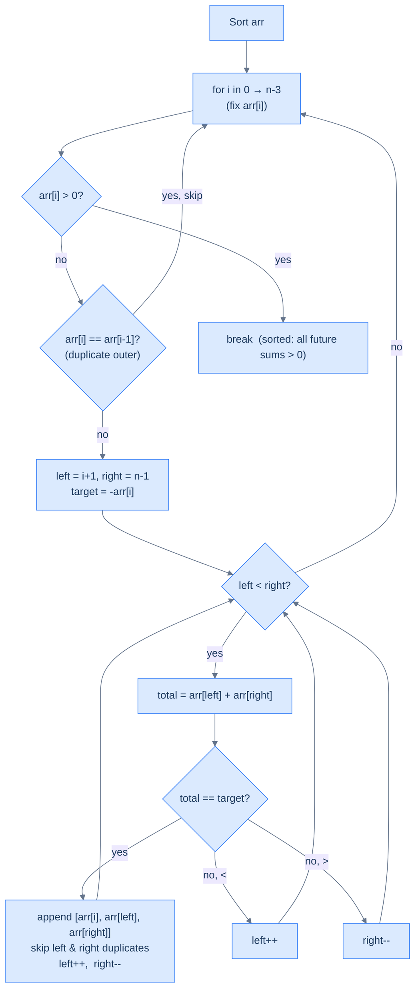
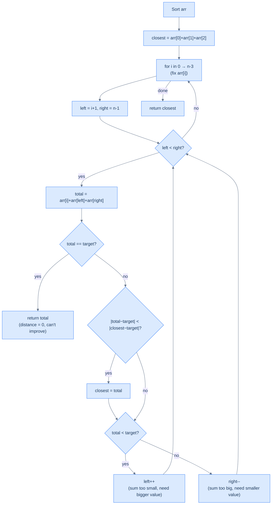
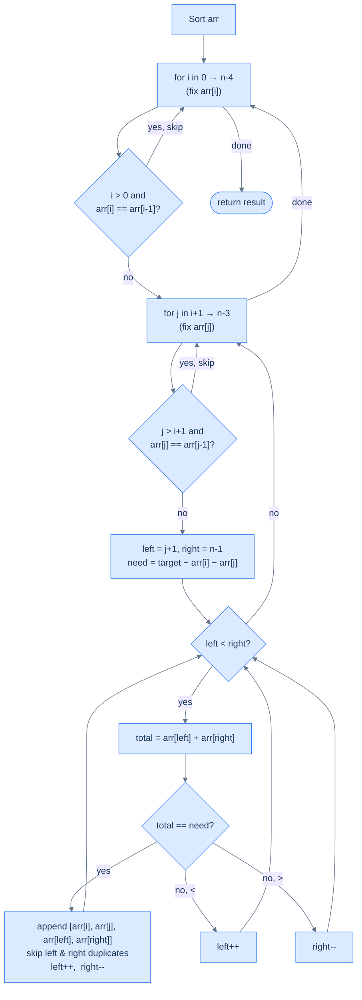

# 5. Pattern: Two pointers (Subproblem)

This section covers subproblem-style two-pointer techniques where each step reduces a larger array problem into a smaller one.

## Table of contents

1. [Identifying two pointer subproblem](#identifying-two-pointer-subproblem)
2. [K rotations](#k-rotations-right)
3. [Three sum](#three-sum)
4. [Approximate three sum](#approximate-three-sum)
5. [Four sum](#four-sum)

***

# Identifying Two Pointer Subproblem

## When the Problem Is Bigger Than One Two-Pointer Pass

So far, we've seen problems where a single two-pointer traversal solves the whole thing. But some problems are too complex for that — they consist of **multiple smaller pieces**, and the two-pointer technique applies to one (or more) of those pieces.

The key shift in thinking:

> Instead of asking "can I solve this with two pointers?", ask "can I **decompose** this into subproblems, any of which can be solved with two pointers?"

---

## The Diagnostic Questions

| Question | What it unlocks |
|---|---|
| **Q1.** Can the problem or solution be broken into smaller subproblems? | Identifies decomposition opportunities |
| **Q2.** Can any subproblem be solved with the two-pointer technique (directly or via reduction)? | Identifies where two pointers fit in |

If yes to both, you have a two-pointer subproblem pattern problem.

---

## The Example: K Rotations LEFT - Rotate Array **`k`** Times Left

**Problem:** Given an array `arr` of size `n` and an integer `k`, rotate the array `k` positions to the left in-place.

```
Input:  arr = [1, 2, 3, 4, 5, 6, 7, 8],  k = 4
Output: arr = [5, 6, 7, 8, 1, 2, 3, 4]
```

```d2
direction: right

before: "Before  (k=4)" {
  grid-columns: 8
  grid-gap: 0
  a0: "1" {style.fill: "#fde68a"; style.stroke: "#d97706"}
  a1: "2" {style.fill: "#fde68a"; style.stroke: "#d97706"}
  a2: "3" {style.fill: "#fde68a"; style.stroke: "#d97706"}
  a3: "4" {style.fill: "#fde68a"; style.stroke: "#d97706"}
  a4: "5"
  a5: "6"
  a6: "7"
  a7: "8"
}

after: "After rotating 4 left" {
  grid-columns: 8
  grid-gap: 0
  b0: "5"
  b1: "6"
  b2: "7"
  b3: "8"
  b4: "1" {style.fill: "#fde68a"; style.stroke: "#d97706"}
  b5: "2" {style.fill: "#fde68a"; style.stroke: "#d97706"}
  b6: "3" {style.fill: "#fde68a"; style.stroke: "#d97706"}
  b7: "4" {style.fill: "#fde68a"; style.stroke: "#d97706"}
}

before -> after: "rotate left by k=4"
```

<p align="center"><strong>Rotate an array k=4 times to the left — the first 4 elements wrap around to the end.</strong></p>

---

## Brute Force: Temp Array, O(n) Space

Copy elements at k-shifted indices into a temp array, then copy back:

```d2
direction: right

orig: "Original arr" {
  grid-columns: 8
  grid-gap: 0
  a0: "1"
  a1: "2"
  a2: "3"
  a3: "4"
  a4: "5"
  a5: "6"
  a6: "7"
  a7: "8"
}

temp: "temp:  temp[i] = arr[(i+k) % n]" {
  grid-columns: 8
  grid-gap: 0
  b0: "5"
  b1: "6"
  b2: "7"
  b3: "8"
  b4: "1"
  b5: "2"
  b6: "3"
  b7: "4"
}

copy: "Copy temp → arr" {
  grid-columns: 8
  grid-gap: 0
  c0: "5"
  c1: "6"
  c2: "7"
  c3: "8"
  c4: "1"
  c5: "2"
  c6: "3"
  c7: "4"
}

orig -> temp: "pass 1: fill temp"
temp -> copy: "pass 2: copy back"
```

<p align="center"><strong>Brute-force rotation using a temporary array — two passes, O(n) extra space.</strong></p>

```d3 widget=array-traversal
{
  "items": ["1", "2", "3", "4", "5", "6", "7", "8"],
  "title": "Brute-force left-rotate by k=4 using temp array",
  "secondaryItems": ["·", "·", "·", "·", "·", "·", "·", "·"],
  "steps": [
    {
      "items": ["1", "2", "3", "4", "5", "6", "7", "8"],
      "secondaryItems": ["·", "·", "·", "·", "·", "·", "·", "·"],
      "secondaryKeys": ["t0", "t1", "t2", "t3", "t4", "t5", "t6", "t7"],
      "msg": "Init: arr above, temp (empty) below. We will fill temp[i] = arr[(i + 4) mod 8]."
    },
    {
      "items": ["1", "2", "3", "4", "5", "6", "7", "8"],
      "markers": [{"name": "src", "index": 4, "color": "#f59e0b"}],
      "secondaryItems": ["5", "·", "·", "·", "·", "·", "·", "·"],
      "secondaryKeys": ["t0", "t1", "t2", "t3", "t4", "t5", "t6", "t7"],
      "secondaryMarkers": [{"name": "i", "index": 0, "color": "#3b82f6"}],
      "msg": "i=0 → temp[0] = arr[(0+4) mod 8] = arr[4] = 5."
    },
    {
      "items": ["1", "2", "3", "4", "5", "6", "7", "8"],
      "markers": [{"name": "src", "index": 5, "color": "#f59e0b"}],
      "secondaryItems": ["5", "6", "·", "·", "·", "·", "·", "·"],
      "secondaryKeys": ["t0", "t1", "t2", "t3", "t4", "t5", "t6", "t7"],
      "secondaryMarkers": [{"name": "i", "index": 1, "color": "#3b82f6"}],
      "msg": "i=1 → temp[1] = arr[5] = 6."
    },
    {
      "items": ["1", "2", "3", "4", "5", "6", "7", "8"],
      "markers": [{"name": "src", "index": 6, "color": "#f59e0b"}],
      "secondaryItems": ["5", "6", "7", "·", "·", "·", "·", "·"],
      "secondaryKeys": ["t0", "t1", "t2", "t3", "t4", "t5", "t6", "t7"],
      "secondaryMarkers": [{"name": "i", "index": 2, "color": "#3b82f6"}],
      "msg": "i=2 → temp[2] = arr[6] = 7."
    },
    {
      "items": ["1", "2", "3", "4", "5", "6", "7", "8"],
      "markers": [{"name": "src", "index": 7, "color": "#f59e0b"}],
      "secondaryItems": ["5", "6", "7", "8", "·", "·", "·", "·"],
      "secondaryKeys": ["t0", "t1", "t2", "t3", "t4", "t5", "t6", "t7"],
      "secondaryMarkers": [{"name": "i", "index": 3, "color": "#3b82f6"}],
      "msg": "i=3 → temp[3] = arr[7] = 8."
    },
    {
      "items": ["1", "2", "3", "4", "5", "6", "7", "8"],
      "markers": [{"name": "src", "index": 0, "color": "#f59e0b"}],
      "secondaryItems": ["5", "6", "7", "8", "1", "·", "·", "·"],
      "secondaryKeys": ["t0", "t1", "t2", "t3", "t4", "t5", "t6", "t7"],
      "secondaryMarkers": [{"name": "i", "index": 4, "color": "#3b82f6"}],
      "msg": "i=4 → (4+4) mod 8 wraps to index 0 → temp[4] = arr[0] = 1."
    },
    {
      "items": ["1", "2", "3", "4", "5", "6", "7", "8"],
      "markers": [{"name": "src", "index": 1, "color": "#f59e0b"}],
      "secondaryItems": ["5", "6", "7", "8", "1", "2", "·", "·"],
      "secondaryKeys": ["t0", "t1", "t2", "t3", "t4", "t5", "t6", "t7"],
      "secondaryMarkers": [{"name": "i", "index": 5, "color": "#3b82f6"}],
      "msg": "i=5 → temp[5] = arr[1] = 2."
    },
    {
      "items": ["1", "2", "3", "4", "5", "6", "7", "8"],
      "markers": [{"name": "src", "index": 2, "color": "#f59e0b"}],
      "secondaryItems": ["5", "6", "7", "8", "1", "2", "3", "·"],
      "secondaryKeys": ["t0", "t1", "t2", "t3", "t4", "t5", "t6", "t7"],
      "secondaryMarkers": [{"name": "i", "index": 6, "color": "#3b82f6"}],
      "msg": "i=6 → temp[6] = arr[2] = 3."
    },
    {
      "items": ["1", "2", "3", "4", "5", "6", "7", "8"],
      "markers": [{"name": "src", "index": 3, "color": "#f59e0b"}],
      "secondaryItems": ["5", "6", "7", "8", "1", "2", "3", "4"],
      "secondaryKeys": ["t0", "t1", "t2", "t3", "t4", "t5", "t6", "t7"],
      "secondaryMarkers": [{"name": "i", "index": 7, "color": "#3b82f6"}],
      "msg": "i=7 → temp[7] = arr[3] = 4. Pass 1 complete."
    },
    {
      "items": ["5", "6", "7", "8", "1", "2", "3", "4"],
      "secondaryItems": ["5", "6", "7", "8", "1", "2", "3", "4"],
      "secondaryKeys": ["t0", "t1", "t2", "t3", "t4", "t5", "t6", "t7"],
      "msg": "Pass 2: copy temp back into arr → arr = [5, 6, 7, 8, 1, 2, 3, 4] ✓"
    }
  ]
}
```


```python run
from typing import List

def k_rotate(arr: List[int], k: int) -> None:
    n = len(arr)
    k = k % n                              # k > n is just (k mod n) rotations.
    temp = [0] * n
    for i in range(n):
        temp[i] = arr[(i + k) % n]         # source index wraps with % n.
    for i in range(n):
        arr[i] = temp[i]


arr = [1, 2, 3, 4, 5, 6, 7, 8]
k_rotate(arr, 4)
print(arr)   # [5, 6, 7, 8, 1, 2, 3, 4]
```

```java run
import java.util.Arrays;

public class Main {
    static void kRotate(int[] arr, int k) {
        int n = arr.length;
        k = k % n;
        int[] temp = new int[n];
        for (int i = 0; i < n; i++) temp[i] = arr[(i + k) % n];
        for (int i = 0; i < n; i++) arr[i] = temp[i];
    }

    public static void main(String[] args) {
        int[] arr = {1, 2, 3, 4, 5, 6, 7, 8};
        kRotate(arr, 4);
        System.out.println(Arrays.toString(arr));
    }
}
```


<details>
<summary><strong>Trace — arr = [1, 2, 3, 4, 5, 6, 7, 8],  k = 4  (brute force)</strong></summary>

```
arr = [1, 2, 3, 4, 5, 6, 7, 8],  n = 8,  k = 4 % 8 = 4

Pass 1 — temp[i] = arr[(i + k) % n]:
  i=0: temp[0] = arr[(0+4)%8] = arr[4] = 5
  i=1: temp[1] = arr[(1+4)%8] = arr[5] = 6
  i=2: temp[2] = arr[(2+4)%8] = arr[6] = 7
  i=3: temp[3] = arr[(3+4)%8] = arr[7] = 8
  i=4: temp[4] = arr[(4+4)%8] = arr[0] = 1  ← wrap-around kicks in here
  i=5: temp[5] = arr[(5+4)%8] = arr[1] = 2
  i=6: temp[6] = arr[(6+4)%8] = arr[2] = 3
  i=7: temp[7] = arr[(7+4)%8] = arr[3] = 4

temp = [5, 6, 7, 8, 1, 2, 3, 4]

Pass 2 — copy temp → arr:
arr  = [5, 6, 7, 8, 1, 2, 3, 4] ✓

Note: The % operator is what handles the wrap-around.
      Without it, indices 4–7 would go out of bounds.
```

</details>

---

## Applying the Diagnostic Questions

| Question | Answer |
|---|---|
| **Q1.** Can the solution be broken into subproblems? | **Yes** — rotation = 3 in-place reversals |
| **Q2.** Can those subproblems use two pointers? | **Yes** — in-place reversal is the two-pointer flip |

### Q1 — Why "rotation = 3 in-place reversals"?

At first glance, rotating an array seems like it *must* involve moving elements around — shift the first element to the end, shift the second… that's O(n·k) moves. Or use a temp array and copy. But there's a beautiful shortcut.

**The insight:** A left rotation by `k` positions is *mathematically equivalent* to three in-place reversals of specific segments.

Here's the WHY step by step:

- After a left rotation by `k`, the first `k` elements move to the end, and the last `n-k` elements move to the front.
- Think of the array as two halves: `[LEFT | RIGHT]` where LEFT = first `k` elements, RIGHT = last `n-k` elements.
- The goal is to produce `[RIGHT | LEFT]` — swap those two halves.
- **How do 3 reversals achieve this?**
  1. Reverse LEFT → its internal order flips: `[LEFT_reversed | RIGHT]`
  2. Reverse RIGHT → its internal order flips: `[LEFT_reversed | RIGHT_reversed]`
  3. Reverse the entire array → everything flips, which **un-reverses both halves back to their original relative order** while swapping their positions: `[RIGHT | LEFT]` ✓

**Concrete check with `[1, 2, 3, 4 | 5, 6, 7, 8]`, k=4:**
- Step 1 (reverse LEFT): `[4, 3, 2, 1 | 5, 6, 7, 8]`
- Step 2 (reverse RIGHT): `[4, 3, 2, 1 | 8, 7, 6, 5]`
- Step 3 (reverse all): `[5, 6, 7, 8, 1, 2, 3, 4]` ✓

**What breaks if you skip a step?** If you only reversed the entire array without the two segment reversals first, you'd get `[8, 7, 6, 5, 4, 3, 2, 1]` — reversed, not rotated. The two prep reversals are what ensure each half's *internal order* is preserved after the final full reversal.

This is the subproblem decomposition: one complex O(n) operation (rotation) → three simpler O(n) operations (reversals), each solvable independently.

---

### Q2 — Why "in-place reversal is the two-pointer flip"?

Reversing a subarray is the canonical two-pointer direct application you already know:
- Place `left` at the start of the segment, `right` at the end.
- Swap `arr[left]` and `arr[right]`, then move `left` inward and `right` inward.
- Repeat until they meet in the middle.

**Why two pointers?** Because the reversal problem has a natural symmetric structure — the element at position `i` from the left goes to position `i` from the right. Two pointers exploit that symmetry directly: one pointer tracks "the element that needs to go right" and the other tracks "the element that needs to go left." They meet in the middle when all swaps are done.

**What if you didn't use two pointers?** You'd need an extra array to copy the reversed segment into, then copy it back — that's O(n) space per reversal, and we'd be back to the brute-force approach. Two pointers make it O(1) space per reversal.

So the full chain of reasoning is:
> Rotation → 3 reversals → each reversal → two-pointer → O(1) space total

---

**Critical observation:** a left rotation by `k` is equivalent to three reversal operations:

1. Reverse the first `k` elements: `arr[0..k-1]`
2. Reverse the remaining `n-k` elements: `arr[k..n-1]`
3. Reverse the entire array: `arr[0..n-1]`

```d2
direction: right

s0: "Original:  [1, 2, 3, 4 | 5, 6, 7, 8]" {
  grid-columns: 8
  grid-gap: 0
  a0: "1" {style.fill: "#fde68a"; style.stroke: "#d97706"}
  a1: "2" {style.fill: "#fde68a"; style.stroke: "#d97706"}
  a2: "3" {style.fill: "#fde68a"; style.stroke: "#d97706"}
  a3: "4" {style.fill: "#fde68a"; style.stroke: "#d97706"}
  a4: "5"
  a5: "6"
  a6: "7"
  a7: "8"
}

s1: "Step 1: Reverse first k=4  →  [4, 3, 2, 1 | 5, 6, 7, 8]" {
  grid-columns: 8
  grid-gap: 0
  b0: "4" {style.fill: "#fde68a"; style.stroke: "#d97706"}
  b1: "3" {style.fill: "#fde68a"; style.stroke: "#d97706"}
  b2: "2" {style.fill: "#fde68a"; style.stroke: "#d97706"}
  b3: "1" {style.fill: "#fde68a"; style.stroke: "#d97706"}
  b4: "5" {style.fill: "#dcfce7"; style.stroke: "#16a34a"}
  b5: "6" {style.fill: "#dcfce7"; style.stroke: "#16a34a"}
  b6: "7" {style.fill: "#dcfce7"; style.stroke: "#16a34a"}
  b7: "8" {style.fill: "#dcfce7"; style.stroke: "#16a34a"}
}

s2: "Step 2: Reverse last n-k=4  →  [4, 3, 2, 1 | 8, 7, 6, 5]" {
  grid-columns: 8
  grid-gap: 0
  c0: "4"
  c1: "3"
  c2: "2"
  c3: "1"
  c4: "8" {style.fill: "#dcfce7"; style.stroke: "#16a34a"}
  c5: "7" {style.fill: "#dcfce7"; style.stroke: "#16a34a"}
  c6: "6" {style.fill: "#dcfce7"; style.stroke: "#16a34a"}
  c7: "5" {style.fill: "#dcfce7"; style.stroke: "#16a34a"}
}

s3: "Step 3: Reverse entire array  →  [5, 6, 7, 8, 1, 2, 3, 4]" {
  grid-columns: 8
  grid-gap: 0
  d0: "5" {style.fill: "#dbeafe"; style.stroke: "#3b82f6"}
  d1: "6" {style.fill: "#dbeafe"; style.stroke: "#3b82f6"}
  d2: "7" {style.fill: "#dbeafe"; style.stroke: "#3b82f6"}
  d3: "8" {style.fill: "#dbeafe"; style.stroke: "#3b82f6"}
  d4: "1" {style.fill: "#dbeafe"; style.stroke: "#3b82f6"}
  d5: "2" {style.fill: "#dbeafe"; style.stroke: "#3b82f6"}
  d6: "3" {style.fill: "#dbeafe"; style.stroke: "#3b82f6"}
  d7: "4" {style.fill: "#dbeafe"; style.stroke: "#3b82f6"}
}

s0 -> s1: "reverse arr[0..3]"
s1 -> s2: "reverse arr[4..7]"
s2 -> s3: "reverse arr[0..7]"
```

<p align="center"><strong>Shift k=4 elements to the left by combining three in-place reversal subproblems — each reversal is solved with the two-pointer technique, O(1) space total.</strong></p>

Each reversal is a direct two-pointer application (`left++`, `right--`, swap until they meet). Three subproblems, each O(n), solved in-place with O(1) extra memory.

---

## Two-Pointer Solution


```python run
class Solution:
    def reverse(self, arr: List[int], start: int, end: int) -> None:
        while start < end:
            arr[start], arr[end] = arr[end], arr[start]
            start += 1
            end -= 1

    def k_rotations(self, arr: List[int], k: int) -> None:
        n = len(arr)

        # Set k to be in the range of [0, n)
        k %= n

        # Reverse the first k elements using two pointer method
        self.reverse(arr, 0, k - 1)

        # Reverse the remaining elements using two pointer method
        self.reverse(arr, k, n - 1)

        # Reverse the entire array using two pointer method
        self.reverse(arr, 0, n - 1)
```

```java run
class Solution {
    public void reverse(int[] arr, int start, int end) {
        while (start < end) {
            int temp = arr[start];
            arr[start] = arr[end];
            arr[end] = temp;
            start++;
            end--;
        }
    }

    public void kRotations(int[] arr, int k) {
        int n = arr.length;

        // Set k to be in the range of [0, n)
        k %= n;

        // Reverse the first k elements using two pointer method
        reverse(arr, 0, k - 1);

        // Reverse the remaining elements using two pointer method
        reverse(arr, k, n - 1);

        // Reverse the entire array using two pointer method
        reverse(arr, 0, n - 1);
    }
}
```


<details>
<summary><strong>Trace — arr = [1, 2, 3, 4, 5, 6, 7, 8],  k = 4  (two-pointer, 3 reversals)</strong></summary>

```
arr = [1, 2, 3, 4, 5, 6, 7, 8],  n = 8,  k = 4 % 8 = 4

━━━ reverse(arr, 0, 3) — flip LEFT segment [0..3] ━━━
  start=0 (1), end=3 (4) │ 0 < 3 → swap │ [4, 2, 3, 1, 5, 6, 7, 8] │ start=1, end=2
  start=1 (2), end=2 (3) │ 1 < 2 → swap │ [4, 3, 2, 1, 5, 6, 7, 8] │ start=2, end=1
  start=2,     end=1     │ 2 > 1 → done

After step 1: [4, 3, 2, 1, 5, 6, 7, 8]

━━━ reverse(arr, 4, 7) — flip RIGHT segment [4..7] ━━━
  start=4 (5), end=7 (8) │ 4 < 7 → swap │ [4, 3, 2, 1, 8, 6, 7, 5] │ start=5, end=6
  start=5 (6), end=6 (7) │ 5 < 6 → swap │ [4, 3, 2, 1, 8, 7, 6, 5] │ start=6, end=5
  start=6,     end=5     │ 6 > 5 → done

After step 2: [4, 3, 2, 1, 8, 7, 6, 5]

━━━ reverse(arr, 0, 7) — flip ENTIRE array [0..7] ━━━
  start=0 (4), end=7 (5) │ 0 < 7 → swap │ [5, 3, 2, 1, 8, 7, 6, 4] │ start=1, end=6
  start=1 (3), end=6 (6) │ 1 < 6 → swap │ [5, 6, 2, 1, 8, 7, 3, 4] │ start=2, end=5
  start=2 (2), end=5 (7) │ 2 < 5 → swap │ [5, 6, 7, 1, 8, 2, 3, 4] │ start=3, end=4
  start=3 (1), end=4 (8) │ 3 < 4 → swap │ [5, 6, 7, 8, 1, 2, 3, 4] │ start=4, end=3
  start=4,     end=3     │ 4 > 3 → done

After step 3: [5, 6, 7, 8, 1, 2, 3, 4] ✓

Total swaps: 2 + 2 + 4 = 8  (all within O(n))
Extra space:  0 — every swap is in-place
```

</details>

---

## Problems in This Category

| Problem | Subproblems | How two pointers fit |
|---|---|---|
| **K Rotations** | 3 in-place reversals | Direct two-pointer on each reversal |
| **Three Sum** | Fix one element, solve Two Sum on the rest | Reduction: sort + two-pointer for each fixed element |
| **Approximate Three Sum** | Fix one element, find closest pair | Reduction: sort + two-pointer tracking minimum distance |
| **Four Sum** | Fix two elements, solve Two Sum on the rest | Two nested fixed elements + two-pointer inner pass |

Difficulty increases as the nesting depth grows — Four Sum has three nested loops where the innermost is two-pointer.

***

# K Rotations (Right)

## The Problem

Given an array `arr` and a non-negative number `k`, rotate the array by `k` steps to the **right** — in-place, using O(1) extra space.

**Example 1:**
```
Input:  arr = [1, 2, 3, 4, 5], k = 3
Output: [3, 4, 5, 1, 2]

Rotate 1 step right  →  [5, 1, 2, 3, 4]
Rotate 2 steps right →  [4, 5, 1, 2, 3]
Rotate 3 steps right →  [3, 4, 5, 1, 2]
```

**Example 2:**
```
Input:  arr = [1, 2, 3, 4, 5], k = 5
Output: [1, 2, 3, 4, 5]    ← rotating n times returns the original
```

**Example 3:**
```
Input:  arr = [1, 2, 3, 4, 5], k = 0
Output: [1, 2, 3, 4, 5]
```

---

<details>
<summary><h2>What Does "Rotate Right" Mean?</h2></summary>


One step to the right means the **last element wraps around to the front**, and every other element shifts one position to the right.

```d2
direction: right

a: "[1, 2, 3, 4, 5]"
b: "[5, 1, 2, 3, 4]"
c: "[4, 5, 1, 2, 3]"
d: "[3, 4, 5, 1, 2]" {style.fill: "#dbeafe"; style.stroke: "#3b82f6"}

a -> b: "rotate right 1"
b -> c: "rotate right 2"
c -> d: "rotate right 3"
```

<p align="center"><strong>Each right rotation brings the last element to the front — after k=3 steps, the last 3 elements form the new prefix.</strong></p>

After `k` right rotations, the **last `k` elements** end up at the front, and the **first `n-k` elements** shift to the back.

Think of it as splitting the array into two halves: `[HEAD | TAIL]` where `HEAD` = first `n-k` elements and `TAIL` = last `k` elements. The goal is to produce `[TAIL | HEAD]`.

</details>
<details>
<summary><h2>Applying the Diagnostic Questions</h2></summary>


| Question | Answer |
|---|---|
| **Q1.** Can the solution be broken into subproblems? | **Yes** — right rotation = 3 in-place reversals |
| **Q2.** Can those subproblems use two pointers? | **Yes** — in-place reversal is the classic two-pointer flip |

### Q1 — Why "right rotation = 3 in-place reversals"?

This is the same fundamental insight from the previous lesson, adapted for the direction of rotation.

**Mental model:** Split the array into `[HEAD | TAIL]` (where `HEAD` = first `n-k`, `TAIL` = last `k`). A right rotation by `k` wants to produce `[TAIL | HEAD]`. Reversing the entire array first puts `TAIL` in front and `HEAD` at the back — but both halves are now scrambled internally. Reversing each scrambled half individually restores its original order.

**The three steps:**
1. Reverse the entire array: `[HEAD | TAIL]` → `[reverse(TAIL) | reverse(HEAD)]` — `TAIL` is now in front of `HEAD`, but both are scrambled
2. Reverse the first `k` elements: `reverse(TAIL)` becomes `TAIL` again → `[TAIL | reverse(HEAD)]`
3. Reverse the last `n-k` elements: `reverse(HEAD)` becomes `HEAD` again → `[TAIL | HEAD]` ✓

**Concrete check with `[1, 2, 3, 4, 5]`, k=3:**
- `HEAD = [1, 2]` (first 2), `TAIL = [3, 4, 5]` (last 3)
- Step 1 (reverse all `[0..4]`): `[5, 4, 3, 2, 1]` — `TAIL` reversed in front, `HEAD` reversed at back
- Step 2 (reverse first `k=3`, indices `[0..2]`): `[3, 4, 5, 2, 1]` — `TAIL` restored to its original order
- Step 3 (reverse indices `[3..4]`): `[3, 4, 5, 1, 2]` ✓ — `HEAD` restored to its original order

**What breaks if you skip either segment reversal?** After step 1 alone you have `[5, 4, 3, 2, 1]` — a full reversal, not a rotation. The two segment reversals are what un-scramble each half so the relative order inside `TAIL` and inside `HEAD` matches the original.

**How this differs from left rotation:** The previous lesson solved left rotation with the same "reverse all, then reverse each half" trick — only the segment boundaries change. For right rotation by `k`, the first segment is `k` long (it was `n-k` for left rotation), and the second is `n-k`. The same three-reversal mechanic, with the split point shifted.

### Q2 — Why "in-place reversal is the two-pointer flip"?

Reversing a segment `[start..end]` is the canonical two-pointer direct application:
- Place `left` at `start`, `right` at `end`
- Swap `arr[left]` and `arr[right]`, move `left` inward, `right` inward
- Stop when `left >= right`

**Why two pointers?** The reversal problem has perfect bilateral symmetry — element at position `i` from the left swaps with position `i` from the right. Two pointers exploit this directly, doing both jobs simultaneously from the outside in.

**What if you didn't use two pointers?** You'd need a temporary array to hold the reversed segment before writing it back — O(k) extra space per reversal. Two pointers do it with only two index variables — O(1) per reversal, O(1) total.

</details>
<details>
<summary><h2>The Three-Reversal Strategy (Visualised)</h2></summary>


```d2
direction: right

s0: "Original:  [1, 2 | 3, 4, 5]  (HEAD=[1,2], TAIL=[3,4,5])" {
  grid-columns: 5
  grid-gap: 0
  a0: "1" {style.fill: "#dcfce7"; style.stroke: "#16a34a"}
  a1: "2" {style.fill: "#dcfce7"; style.stroke: "#16a34a"}
  a2: "3" {style.fill: "#fde68a"; style.stroke: "#d97706"}
  a3: "4" {style.fill: "#fde68a"; style.stroke: "#d97706"}
  a4: "5" {style.fill: "#fde68a"; style.stroke: "#d97706"}
}

s1: "Step 1: Reverse all [0..4]  →  [5, 4, 3, 2, 1]" {
  grid-columns: 5
  grid-gap: 0
  b0: "5" {style.fill: "#fde68a"; style.stroke: "#d97706"}
  b1: "4" {style.fill: "#fde68a"; style.stroke: "#d97706"}
  b2: "3" {style.fill: "#fde68a"; style.stroke: "#d97706"}
  b3: "2" {style.fill: "#dcfce7"; style.stroke: "#16a34a"}
  b4: "1" {style.fill: "#dcfce7"; style.stroke: "#16a34a"}
}

s2: "Step 2: Reverse first k=3 [0..2]  →  [3, 4, 5, 2, 1]" {
  grid-columns: 5
  grid-gap: 0
  c0: "3" {style.fill: "#fde68a"; style.stroke: "#d97706"}
  c1: "4" {style.fill: "#fde68a"; style.stroke: "#d97706"}
  c2: "5" {style.fill: "#fde68a"; style.stroke: "#d97706"}
  c3: "2" {style.fill: "#dcfce7"; style.stroke: "#16a34a"}
  c4: "1" {style.fill: "#dcfce7"; style.stroke: "#16a34a"}
}

s3: "Step 3: Reverse last n-k=2 [3..4]  →  [3, 4, 5, 1, 2]  ✓" {
  grid-columns: 5
  grid-gap: 0
  d0: "3" {style.fill: "#dbeafe"; style.stroke: "#3b82f6"}
  d1: "4" {style.fill: "#dbeafe"; style.stroke: "#3b82f6"}
  d2: "5" {style.fill: "#dbeafe"; style.stroke: "#3b82f6"}
  d3: "1" {style.fill: "#dbeafe"; style.stroke: "#3b82f6"}
  d4: "2" {style.fill: "#dbeafe"; style.stroke: "#3b82f6"}
}

s0 -> s1: "reverse arr[0..4]"
s1 -> s2: "reverse arr[0..2]"
s2 -> s3: "reverse arr[3..4]"
```

<p align="center"><strong>Right rotation by k=3 via three in-place reversals — each reversal is an independent two-pointer subproblem.</strong></p>

</details>
<details>
<summary><h2>The Solution</h2></summary>


```python run
from typing import List

class Solution:
    def reverse(self, arr: List[int], start: int, end: int) -> None:
        while start < end:
            arr[start], arr[end] = arr[end], arr[start]
            start += 1
            end   -= 1

    def k_rotations(self, arr: List[int], k: int) -> None:
        n = len(arr)

        # Set k to be in the range of [0, n)
        k %= n

        # Reverse the entire array using two pointer method
        self.reverse(arr, 0, n - 1)

        # Reverse the first k elements using two pointer method
        self.reverse(arr, 0, k - 1)

        # Reverse the remaining elements using two pointer method
        self.reverse(arr, k, n - 1)


arr = [1, 2, 3, 4, 5]
Solution().k_rotations(arr, 3)
print(arr)   # [3, 4, 5, 1, 2]
```

```java run
import java.util.Arrays;

public class Main {
    static class Solution {
        private void reverse(int[] arr, int start, int end) {
            while (start < end) {
                int temp   = arr[start];
                arr[start] = arr[end];
                arr[end]   = temp;
                start++;
                end--;
            }
        }

        public void kRotations(int[] arr, int k) {
            int n = arr.length;

            // Set k to be in the range of [0, n)
            k %= n;

            // Reverse the entire array using two pointer method
            reverse(arr, 0, n - 1);

            // Reverse the first k elements using two pointer method
            reverse(arr, 0, k - 1);

            // Reverse the remaining elements using two pointer method
            reverse(arr, k, n - 1);
        }
    }

    public static void main(String[] args) {
        int[] arr = {1, 2, 3, 4, 5};
        new Solution().kRotations(arr, 3);
        System.out.println(Arrays.toString(arr));   // [3, 4, 5, 1, 2]
    }
}
```

</details>
<details>
<summary><strong>Trace — arr = [1, 2, 3, 4, 5], k = 3</strong></summary>

```
n = 5,  k = 3 % 5 = 3
HEAD = arr[0..1] = [1, 2],  TAIL = arr[2..4] = [3, 4, 5]

━━━ Step 1: reverse(arr, 0, 4) — flip entire array [0..4] ━━━
  start=0 (1), end=4 (5)  │  0 < 4 → swap 1↔5  →  [5, 2, 3, 4, 1]  │  start=1, end=3
  start=1 (2), end=3 (4)  │  1 < 3 → swap 2↔4  →  [5, 4, 3, 2, 1]  │  start=2, end=2
  start=2 (3), end=2 (3)  │  2 == 2 → stop (middle element, no swap)
After step 1: [5, 4, 3, 2, 1]   (TAIL reversed in front, HEAD reversed at back)

━━━ Step 2: reverse(arr, 0, 2) — flip first k=3 elements [0..2] ━━━
  start=0 (5), end=2 (3)  │  0 < 2 → swap 5↔3  →  [3, 4, 5, 2, 1]  │  start=1, end=1
  start=1 (4), end=1 (4)  │  1 == 1 → stop (middle element, no swap)
After step 2: [3, 4, 5, 2, 1]   (TAIL is now back in original order)

━━━ Step 3: reverse(arr, 3, 4) — flip last n-k=2 elements [3..4] ━━━
  start=3 (2), end=4 (1)  │  3 < 4 → swap 2↔1  →  [3, 4, 5, 1, 2]  │  start=4, end=3
  start=4, end=3           │  4 > 3 → stop
After step 3: [3, 4, 5, 1, 2] ✓   (HEAD is now back in original order)

Result: [3, 4, 5, 1, 2]
The last 3 elements are now the prefix; original relative order within each group is preserved.
```

</details>
<details>
<summary><h2>Solution &amp; Analysis</h2></summary>

### Complexity Analysis

| | Complexity | Reason |
|---|---|---|
| **Time** | O(n) | Each element is touched exactly twice across all three reversals |
| **Space** | O(1) | Only `start` and `end` index variables — no auxiliary array |

### Edge Cases

| Case | What happens |
|---|---|
| `k = 0` | `k %= n` → 0, early return — no work |
| `k = n` | `k %= n` → 0, early return — full rotation is a no-op |
| `k > n` | `k %= n` collapses it to the equivalent rotation (e.g. k=8, n=5 → k=3) |
| Single element (`n = 1`) | Any k reduces to 0 — no swaps occur |
| `k = 1` | `HEAD = arr[0..n-2]`, `TAIL = arr[n-1..n-1]` — just the last element wraps to front |

</details>
<details>
<summary><h2>Left vs. Right Rotation — The Relationship</h2></summary>


Right rotation by `k` is identical to left rotation by `n - k`. Both use the same three-reversal trick — reverse the entire array, then reverse each of the two halves to restore their internal order. Only the split point changes:

| Operation | Step 1 | Step 2 | Step 3 |
|---|---|---|---|
| **Left rotation by k** | Reverse all | Reverse first `n-k` | Reverse last `k` |
| **Right rotation by k** | Reverse all | Reverse first `k` | Reverse last `n-k` |

The core mechanic is identical — what changes is which segment you call HEAD and which you call TAIL, which in turn moves the split point used by steps 2 and 3.

</details>
<details>
<summary><h2>Final Takeaway</h2></summary>


A right rotation by `k` splits the array into `[HEAD | TAIL]` and produces `[TAIL | HEAD]`. The three-reversal trick achieves this in O(n) time, O(1) space: reverse the entire array to swap the halves' positions (at the cost of scrambling each half), then reverse the first `k` elements and the last `n-k` elements to un-scramble each half in place. Always normalize `k` with `k %= n` first to eliminate redundant rotations.

</details>

***

# Three Sum

## The Problem

Given an integer array `arr`, find **all unique triplets** `[a, b, c]` such that `a + b + c = 0`. The solution set must not contain duplicate triplets.

```
Input:  arr = [-1, 0, 1, 2, -1, -4]
Output: [[-1, -1, 2], [-1, 0, 1]]
```

---

<details>
<summary><h2>Examples</h2></summary>


**Example 1**
```
Input:  arr = [-1, 0, 1, 2, -1, -4]
Output: [[-1, -1, 2], [-1, 0, 1]]
```

**Example 2**
```
Input:  arr = [0, 0, 0, 0]
Output: [[0, 0, 0]]
```

**Example 3**
```
Input:  arr = [1, 2, 3]
Output: []
Explanation: No triplet sums to 0.
```

**Example 4**
```
Input:  arr = [-2, 0, 0, 2, 2]
Output: [[-2, 0, 2]]
```

</details>
<details>
<summary><h2>Intuition: Fix One, Two-Pointer the Rest</h2></summary>


Three Sum extends Two Sum with one extra element fixed. If we pick one element `arr[i]` and fix it, the problem reduces to:

> Find all pairs in the **remaining** subarray that sum to `−arr[i]`.

That's exactly Duplicate Aware Two Sum! And we know how to solve that in O(n) with two pointers on a sorted array.

So the full algorithm is:
1. **Sort** the array
2. **Fix** each element `arr[i]` with an outer loop
3. **Two-pointer** on `arr[i+1..n-1]` searching for pairs summing to `−arr[i]`
4. **Skip duplicates** at every level to avoid repeated triplets



<p align="center"><strong>Three Sum — outer loop fixes one element; inner two-pointer finds all valid pairs summing to the negative of that element.</strong></p>

</details>
<details>
<summary><h2>Applying the Diagnostic Questions</h2></summary>


Three Sum sits at the intersection of two patterns you've already seen — the **subproblem** pattern from this section and the **reduction** technique from the previous one. The diagnostic questions make this explicit.

| Question | Answer |
|---|---|
| **Q1.** Can the solution be broken into subproblems? | **Yes** — fix `arr[i]`; the problem becomes "find all pairs in `arr[i+1..n-1]` summing to `−arr[i]`" |
| **Q2.** Can any subproblem use two pointers (directly or via reduction)? | **Yes** — that pair-finding subproblem is exactly Duplicate Aware Two Sum, which sorts and uses two pointers in O(n) |

### Q1 — Why "fix one element and reduce to a pair-finding subproblem"?

**Mental model:** Think of the problem as searching through all triples `(a, b, c)` where `a + b + c = 0`. That's a three-dimensional search. If you lock one dimension — say `a = arr[i]` — you're left with a two-dimensional search: `b + c = −arr[i]`. Two unknowns on a sorted array is a problem you already know how to solve in O(n).

**Concrete numbers:** take `arr = [-4, -1, -1, 0, 1, 2]` (sorted). Fix `arr[1] = -1`. Now `target = −(−1) = 1`. The subproblem is: find all pairs in `[-1, 0, 1, 2]` summing to `1`. Two pointers find `(-1, 2)` and `(0, 1)` — giving triplets `[-1, -1, 2]` and `[-1, 0, 1]`.

**What breaks without this decomposition?** Without fixing one element, you'd need three nested loops to check every triple — O(n³). Fixing one element collapses the search from three dimensions to two, giving O(n²). The outer loop runs at most n times; the inner two-pointer pass runs in O(n) per iteration.

### Q2 — Why "the inner subproblem is Duplicate Aware Two Sum, solved with two pointers"?

**Mental model:** Once you fix `arr[i]` and have a sorted subarray with a target, the problem is identical to the Two Sum problems in the previous section. The subarray is already sorted (sorting once before the outer loop covers all inner passes). `arr[left]` is always the minimum remaining value and `arr[right]` is always the maximum. Every pointer move has a predictable, guaranteed effect: moving `left` right always increases the sum; moving `right` left always decreases it.

**Concrete numbers:** subarray `[-1, 0, 1, 2]`, target `1`:
- `left=0 (-1), right=3 (2)`: sum = 1 — match ✓, record and move both inward
- `left=1 (0), right=2 (1)`: sum = 1 — match ✓, record and move both inward
- `left=2, right=1`: left ≥ right — done

Two pointer moves, two results, O(n) total. A three-nested-loop brute force would take 6 comparisons for the same 4-element window.

**What breaks if you skip sorting?** Without sorting the subarray, moving `left` right no longer guarantees a larger value — you might skip the correct pair entirely. The decisive-direction property that makes two pointers work comes entirely from the sorted order.

> **Pattern note:** Three Sum is a two-pointer **subproblem** problem at the outer level (decompose by fixing one element), and a two-pointer **reduction** problem at the inner level (sort + two-pointer on the subarray). The nesting of patterns is what makes it an O(n²) solution — one layer of decomposition, one layer of linear two-pointer inside.

</details>
<details>
<summary><h2>The Early-Exit Optimisation</h2></summary>


Since the array is sorted, if `arr[i] > 0`, then `arr[left] ≥ arr[i] > 0` and `arr[right] ≥ arr[i] > 0` — the sum of any three elements from position `i` onward is positive. No triplet can sum to 0. Break early.

</details>
<details>
<summary><h2>Solution &amp; Analysis</h2></summary>

### Solution

```python run
from typing import List

class Solution:
    def skip_duplicates_left(
        self, arr: List[int], left: int, right: int
    ) -> int:

        # Skip duplicates from the left pointer
        while left < right and arr[left] == arr[left + 1]:
            left += 1

        # Return the index of the next unique element
        return left + 1

    def skip_duplicates_right(
        self, arr: List[int], left: int, right: int
    ) -> int:

        # Skip duplicates from the right pointer
        while left < right and arr[right] == arr[right - 1]:
            right -= 1

        # Return the index of the next unique element
        return right - 1

    def duplicate_aware_two_sum(
        self, arr: List[int], index: int, result: List[List[int]]
    ) -> None:
        left = index + 1
        right = len(arr) - 1

        # Use a while loop to traverse the array using the two pointers
        while left < right:
            total = arr[index] + arr[left] + arr[right]

            # If the sum is 0, add the triplet to the result.
            if total == 0:
                result.append([arr[index], arr[left], arr[right]])

                # Move the left pointer to the next unique element to
                # avoid duplicates
                left = self.skip_duplicates_left(arr, left, right)

                # Move the right pointer to the previous unique element
                # to avoid duplicates
                right = self.skip_duplicates_right(arr, left, right)

            # Move the left pointer to increase the sum
            elif total < 0:
                left += 1

            # Move the right pointer to decrease the sum
            else:
                right -= 1

    def three_sum(self, arr: List[int]) -> List[List[int]]:
        result = []

        # Sort the array in non-decreasing order.
        arr.sort()

        # Traverse the array using 1 pointer.
        for i in range(len(arr)):

            # Skip duplicates for the first element.
            if i > 0 and arr[i] == arr[i - 1]:
                continue

            # Use the two-pointer technique to find pairs with sum
            # -arr[i].
            self.duplicate_aware_two_sum(arr, i, result)

        return result


# Examples from the problem statement
print(Solution().three_sum([-1, 0, 1, 2, -1, -4]))  # [[-1, -1, 2], [-1, 0, 1]]
print(Solution().three_sum([0, 0, 0]))               # [[0, 0, 0]]
print(Solution().three_sum([2, 7, 11, 15]))          # []

# Edge cases
print(Solution().three_sum([]))                      # []
print(Solution().three_sum([1, 2]))                  # [] — too few elements
print(Solution().three_sum([-2, 0, 2]))              # [[-2, 0, 2]]
print(Solution().three_sum([0, 0, 0, 0]))            # [[0, 0, 0]] — no duplicate triplets
```

```java run
import java.util.*;

public class Main {
    static class Solution {
        private int skipDuplicatesLeft(int[] arr, int left, int right) {

            // Skip duplicates from the left pointer
            while (left < right && arr[left] == arr[left + 1]) {
                left++;
            }

            // Return the index of the next unique element
            return left + 1;
        }

        private int skipDuplicatesRight(int[] arr, int left, int right) {

            // Skip duplicates from the right pointer
            while (left < right && arr[right] == arr[right - 1]) {
                right--;
            }

            // Return the index of the next unique element
            return right - 1;
        }

        private void duplicateAwareTwoSum(
            int[] arr,
            int index,
            List<List<Integer>> result
        ) {
            int left = index + 1;
            int right = arr.length - 1;

            // Use a while loop to traverse the array using the two pointers
            while (left < right) {
                int sum = arr[index] + arr[left] + arr[right];

                // If the sum is 0, add the triplet to the result.
                if (sum == 0) {
                    result.add(List.of(arr[index], arr[left], arr[right]));

                    // Move the left pointer to the next unique element to
                    // avoid duplicates
                    left = skipDuplicatesLeft(arr, left, right);

                    // Move the right pointer to the previous unique element
                    // to avoid duplicates
                    right = skipDuplicatesRight(arr, left, right);
                }

                // Move the left pointer to increase the sum
                else if (sum < 0) {
                    left++;
                }

                // Move the right pointer to decrease the sum
                else {
                    right--;
                }
            }
        }

        public List<List<Integer>> threeSum(int[] arr) {
            List<List<Integer>> result = new ArrayList<>();

            // Sort the array in non-decreasing order.
            Arrays.sort(arr);

            // Traverse the array using 1 pointer.
            for (int i = 0; i < arr.length; i++) {

                // Skip duplicates for the first element.
                if (i > 0 && arr[i] == arr[i - 1]) {
                    continue;
                }

                // Use the two-pointer technique to find pairs with sum
                // -arr[i].
                duplicateAwareTwoSum(arr, i, result);
            }

            return result;
        }
    }

    public static void main(String[] args) {
        // Examples from the problem statement
        System.out.println(new Solution().threeSum(new int[]{-1,0,1,2,-1,-4})); // [[-1, -1, 2], [-1, 0, 1]]
        System.out.println(new Solution().threeSum(new int[]{0,0,0}));           // [[0, 0, 0]]
        System.out.println(new Solution().threeSum(new int[]{2,7,11,15}));       // []

        // Edge cases
        System.out.println(new Solution().threeSum(new int[]{}));                // []
        System.out.println(new Solution().threeSum(new int[]{1,2}));             // [] — too few elements
        System.out.println(new Solution().threeSum(new int[]{-2,0,2}));          // [[-2, 0, 2]]
        System.out.println(new Solution().threeSum(new int[]{0,0,0,0}));         // [[0, 0, 0]] — no duplicate triplets
    }
}
```

### Dry Run — Example 1

`arr = [-1, 0, 1, 2, -1, -4]` → sorted: `[-4, -1, -1, 0, 1, 2]`

**i=0, arr[i]=-4, target=4, left=1, right=5:**

| left | right | arr[l]+arr[r] | Action |
|---|---|---|---|
| 1 (-1) | 5 (2) | 1 | < 4 → left++ |
| 2 (-1) | 5 (2) | 1 | < 4 → left++ |
| 3 (0) | 5 (2) | 2 | < 4 → left++ |
| 4 (1) | 5 (2) | 3 | < 4 → left++ |
| 5=right | — | — | left ≥ right → stop |

No triplets for i=0.

**i=1, arr[i]=-1, target=1, left=2, right=5:**

```d3 widget=array-traversal
{
  "items": ["-4", "-1", "-1", "0", "1", "2"],
  "title": "Three Sum inner trace — i = 1 (arr[i] = -1), target for inner = 1",
  "steps": [
    {
      "keys":    ["a", "b", "c", "d", "e", "f"],
      "markers": [
        { "name": "i",     "index": 1, "color": "#a855f7" },
        { "name": "left",  "index": 2, "color": "#3b82f6" },
        { "name": "right", "index": 5, "color": "#f59e0b" }
      ],
      "msg": "arr[left] + arr[right] = -1 + 2 = 1 = target → record triplet [-1, -1, 2]."
    },
    {
      "keys":    ["a", "b", "c", "d", "e", "f"],
      "markers": [
        { "name": "i",     "index": 1, "color": "#a855f7" },
        { "name": "left",  "index": 3, "color": "#3b82f6" },
        { "name": "right", "index": 4, "color": "#f59e0b" }
      ],
      "msg": "After advancing past duplicates: arr[left] + arr[right] = 0 + 1 = 1 = target → record triplet [-1, 0, 1]."
    },
    {
      "keys":    ["a", "b", "c", "d", "e", "f"],
      "markers": [
        { "name": "i",     "index": 1, "color": "#a855f7" }
      ],
      "msg": "left ≥ right → inner pass for i = 1 ends. Two triplets recorded."
    }
  ]
}
```

| left | right | arr[l]+arr[r] | Action |
|---|---|---|---|
| 2 (-1) | 5 (2) | 1 | == 1 ✅ → record **[-1,-1,2]**, skip dup, left=3, right=4 |
| 3 (0) | 4 (1) | 1 | == 1 ✅ → record **[-1,0,1]**, left=4, right=3 |
| — | — | — | left ≥ right → stop |

**i=2, arr[i]=-1:** duplicate of arr[1] → skip

**i=3, arr[i]=0:** `arr[i] > 0`? No. target=0, left=4, right=5:

| left | right | arr[l]+arr[r] | Action |
|---|---|---|---|
| 4 (1) | 5 (2) | 3 | > 0 → right-- |
| 4 (1) | 4 | — | left ≥ right → stop |

**i=4:** only 1 element left — loop ends.

**Result: `[[-1,-1,2], [-1,0,1]]`** ✓

### Complexity Analysis

| | Complexity | Reasoning |
|---|---|---|
| **Time** | O(n²) | Outer loop O(n) × inner two-pointer O(n) — sort is O(n log n), dominated by O(n²) |
| **Space** | O(k) | k = number of unique triplets returned; O(1) working space |

### Edge Cases

| Scenario | Input | Output | Note |
|---|---|---|---|
| All zeros | `[0,0,0,0]` | `[[0,0,0]]` | Duplicate skip keeps it unique |
| No valid triplets | `[1,2,3]` | `[]` | All positive — early exit after i=0 |
| Single triplet | `[-1,0,1]` | `[[-1,0,1]]` | Exact minimum case |
| Array length < 3 | `[1,2]` | `[]` | Loop range `n-2` = 0 — never enters |

</details>
<details>
<summary><h2>Key Takeaway</h2></summary>


Three Sum = outer fixed element + inner Duplicate Aware Two Sum. The reduction insight: fix one element and reduce to a two-variable sum problem on the sorted remainder. The same duplicate-skipping logic from the two-pointer reduction section applies — now at two levels (the fixed element and both inner pointers). The time complexity is O(n²), which is optimal for this problem.

</details>

***

# Approximate Three Sum

## The Problem

Given an integer array `arr` and an integer `target`, find three integers in `arr` whose sum is **closest to `target`**. Return that sum. You may assume exactly one solution exists.

```
Input:  arr = [-1, 2, 1, -4],  target = 1
Output: 2
```

---

<details>
<summary><h2>Examples</h2></summary>


**Example 1**
```
Input:  arr = [2, 7, 11, 15],  target = 3
Output: 20
Explanation: 2 + 7 + 11 = 20 is the closest sum to 3.
```

**Example 2**
```
Input:  arr = [-1, 2, 1, -4],  target = 1
Output: 2
Explanation: -1 + 2 + 1 = 2 is the closest sum to 1.
```

**Example 3**
```
Input:  arr = [0, 0, 0],  target = 1
Output: 0
Explanation: 0 + 0 + 0 = 0 is the closest sum to 1.
```

</details>
<details>
<summary><h2>Intuition: Three Sum with a Closest Tracker</h2></summary>


This problem is Three Sum's sibling — fix one element, two-pointer the rest — but with one twist: you no longer need an exact match. You need the **minimum distance** to the target across all triplets.

At each step of the two-pointer pass you compute `total = arr[i] + arr[left] + arr[right]`. Instead of checking `total == 0`, you compare `|total − target|` against the best distance seen so far and update your answer when you find something closer.

The decisive-direction property still holds: after sorting, moving `left` right always increases the total, and moving `right` left always decreases it. So every pointer move is still purposeful — you're navigating toward the target, not wandering randomly.

If you ever hit `total == target`, the distance is zero — you cannot get any closer. Return immediately.



<p align="center"><strong>Approximate Three Sum — fix one element, two-pointer the rest, track the minimum-distance sum seen so far.</strong></p>

</details>
<details>
<summary><h2>Applying the Diagnostic Questions</h2></summary>


| Question | Answer |
|---|---|
| **Q1.** Can the solution be broken into subproblems? | **Yes** — fix `arr[i]`; the problem becomes "find the pair in `arr[i+1..n-1]` whose sum is closest to `target − arr[i]`" |
| **Q2.** Can the subproblem use two pointers? | **Yes** — two pointers on the sorted subarray give a decisive direction: left moves the sum up, right moves it down |

### Q1 — Why "fix one element and reduce to a closest-pair subproblem"?

**Mental model:** Searching for the closest triplet is a three-dimensional problem. Lock one dimension by fixing `arr[i]`, and you're left with: "find the pair in the rest of the array whose sum is closest to `target − arr[i]`." That's a two-variable closest-sum problem on a sorted subarray — a problem you can solve in O(n) with two pointers.

**Concrete numbers:** take `arr = [-4, -1, 1, 2]` (sorted), `target = 1`. Fix `arr[0] = −4`. The pair subproblem is now: find the pair in `[-1, 1, 2]` closest to `1 − (−4) = 5`. Two pointers check `(−1, 2) = 1`, then `(1, 2) = 3` — both miss 5, but they still contribute to the global closest tracker. The pair `(−1, 2)` gives triplet sum `−4 + (−1) + 2 = −3`; pair `(1, 2)` gives `−4 + 1 + 2 = −1`. Both update the tracker if they beat the current best.

**What breaks without decomposition?** Three nested loops checking every triplet cost O(n³). Fixing one element collapses the search from three dimensions to two: the outer loop runs n times; the inner two-pointer pass runs in O(n). The total is O(n²) — the same cost as exact Three Sum.

### Q2 — Why "two pointers give a decisive direction in the subproblem"?

**Mental model:** After sorting, `arr[left]` is always the smallest remaining value in the window and `arr[right]` is always the largest. Because of this, every pointer move has a predictable, guaranteed effect on the total:
- `left++` replaces the minimum with the next-larger value → total strictly increases
- `right--` replaces the maximum with the next-smaller value → total strictly decreases

This is the same decisive direction that made Two Sum and Three Sum work — just applied to distance minimisation instead of exact matching.

**Concrete numbers:** subarray `[-1, 1, 2]` with pair target `5`:
- `left=0 (−1), right=2 (2)`: pair sum = 1. Not 5, and `1 < 5` → move `left++`
- `left=1 (1), right=2 (2)`: pair sum = 3. Not 5, and `3 < 5` → move `left++`
- `left=2 = right` → stop

At every step we moved purposefully toward a larger sum because the current total was below the pair target. No pair is skipped — we're guaranteed to visit the best candidate.

**What breaks without sorting?** Without sorting, `left++` might produce a smaller value, not a larger one. The decisive direction disappears. You'd have to check every pair in the window — O(n²) per fixed element, O(n³) total.

</details>
<details>
<summary><h2>Solution &amp; Analysis</h2></summary>

### Solution

```python run
from typing import List

class Solution:
    def closest_two_sum(
        self, arr: List[int], index: int, target: int
    ) -> int:
        left = index + 1
        right = len(arr) - 1
        closest_sum = float("inf")

        # Use a while loop to traverse the array using the two pointers
        while left < right:

            # Compute the sum of the three numbers
            sum = arr[index] + arr[left] + arr[right]

            # Update closest_sum if necessary
            if abs(sum - target) < abs(closest_sum - target):
                closest_sum = sum

            # If the sum equals target, return the sum
            if sum == target:
                return sum

            # Move the left pointer to increase the sum
            elif sum < target:
                left += 1

            # Move the right pointer to decrease the sum
            else:
                right -= 1

        return closest_sum

    def approximate_three_sum(self, arr: List[int], target: int) -> int:

        # Sort the input array in non-decreasing order
        arr.sort()

        # Initialize closest_sum to a large value
        closest_sum = float("inf")
        for i in range(len(arr)):
            current_sum = self.closest_two_sum(arr, i, target)
            if abs(current_sum - target) < abs(closest_sum - target):
                closest_sum = current_sum

        # Return the closest sum of three integers to the target
        return closest_sum


# Examples from the problem statement
print(Solution().approximate_three_sum([2, 7, 11, 15], 3))   # 20
print(Solution().approximate_three_sum([-1, 2, 1, -4], 1))   # 2
print(Solution().approximate_three_sum([0, 0, 0], 1))         # 0

# Edge cases
print(Solution().approximate_three_sum([1, 1, 1], 10))        # 3 — only one triplet
print(Solution().approximate_three_sum([-1, 0, 1], 0))        # 0 — exact hit
print(Solution().approximate_three_sum([1, 2, 3, 4], 6))      # 6 — exact hit: 1+2+3
print(Solution().approximate_three_sum([-4, -1, 1, 2], -1))   # -1 — negative target
```

```java run
import java.util.*;

public class Main {
    static class Solution {
        private int closestTwoSum(int[] arr, int index, int target) {
            int left = index + 1;
            int right = arr.length - 1;
            int closestSum = Integer.MAX_VALUE;

            // Use a while loop to traverse the array using the two pointers
            while (left < right) {

                // Compute the sum of the three numbers
                int sum = arr[index] + arr[left] + arr[right];

                // Update closestSum if necessary
                if (Math.abs(sum - target) < Math.abs(closestSum - target)) {
                    closestSum = sum;
                }

                // If the sum equals target, return the sum
                if (sum == target) {
                    return sum;
                }

                // Move the left pointer to increase the sum
                else if (sum < target) {
                    left++;
                }

                // Move the right pointer to decrease the sum
                else {
                    right--;
                }
            }

            return closestSum;
        }

        public int approximateThreeSum(int[] arr, int target) {

            // Sort the input array in non-decreasing order
            Arrays.sort(arr);

            // Initialize closestSum to a large value
            int closestSum = Integer.MAX_VALUE;
            for (int i = 0; i < arr.length; i++) {
                int currentSum = closestTwoSum(arr, i, target);
                if (
                    Math.abs(currentSum - target) <
                    Math.abs(closestSum - target)
                ) {
                    closestSum = currentSum;
                }
            }

            return closestSum;
        }
    }

    public static void main(String[] args) {
        // Examples from the problem statement
        System.out.println(new Solution().approximateThreeSum(new int[]{2,7,11,15}, 3));   // 20
        System.out.println(new Solution().approximateThreeSum(new int[]{-1,2,1,-4}, 1));   // 2
        System.out.println(new Solution().approximateThreeSum(new int[]{0,0,0}, 1));        // 0

        // Edge cases
        System.out.println(new Solution().approximateThreeSum(new int[]{1,1,1}, 10));       // 3 — only one triplet
        System.out.println(new Solution().approximateThreeSum(new int[]{-1,0,1}, 0));       // 0 — exact hit
        System.out.println(new Solution().approximateThreeSum(new int[]{1,2,3,4}, 6));      // 6 — exact hit: 1+2+3
        System.out.println(new Solution().approximateThreeSum(new int[]{-4,-1,1,2}, -1));   // -1 — negative target
    }
}
```

### Dry Run

`arr = [-1, 2, 1, -4]`, `target = 1`
Sorted: `[-4, -1, 1, 2]`

Initial `closest = −4 + (−1) + 1 = −4`.

**i=0, arr[i]=−4, left=1, right=3:**

| left | right | arr[l]+arr[r] | total | Distance | Update closest? | Action |
|---|---|---|---|---|---|---|
| 1 (−1) | 3 (2) | 1 | −3 | \|−3−1\|=4 | −4→−3 ✓ | total < 1 → left++ |
| 2 (1) | 3 (2) | 3 | −1 | \|−1−1\|=2 | −3→−1 ✓ | total < 1 → left++ |
| 3=right | — | — | — | — | — | left ≥ right → stop |

Closest after i=0: **−1**

**i=1, arr[i]=−1, left=2, right=3:**

| left | right | arr[l]+arr[r] | total | Distance | Update closest? | Action |
|---|---|---|---|---|---|---|
| 2 (1) | 3 (2) | 3 | 2 | \|2−1\|=1 | −1→2 ✓ | total > 1 → right-- |
| 2 (1) | 2 | — | — | — | — | left ≥ right → stop |

Closest after i=1: **2**

**i=2, arr[i]=1, left=3, right=3:** `left ≥ right` immediately — inner loop never runs; closest unchanged.

**i=3, arr[i]=2, left=4, right=3:** `left > right` immediately — inner loop never runs; closest unchanged.

(The outer loop runs over every `i` in `range(len(arr))`. For `i = n-2` and `i = n-1` the inner two-pointer pass has fewer than two remaining elements so the `while left < right` guard skips it instantly.)

**Result: `2`** ✓ (`−1 + 2 + 1 = 2`, distance 1 — the minimum possible)

<details>
<summary><strong>Trace — arr = [2, 7, 11, 15], target = 3</strong></summary>

```
Sorted: [2, 7, 11, 15],  target = 3
closest = 2 + 7 + 11 = 20

i=0, arr[i]=2, left=1, right=3:
  Step 1 │ left=1(7),  right=3(15) │ total=24 │ |24-3|=21 > |20-3|=17 → no update │ 24 > 3 → right--
  Step 2 │ left=1(7),  right=2(11) │ total=20 │ |20-3|=17 == current best → no update │ 20 > 3 → right--
  Step 3 │ left=1, right=1 → stop

i=1, arr[i]=7, left=2, right=3:
  Step 1 │ left=2(11), right=3(15) │ total=33 │ |33-3|=30 > 17 → no update │ 33 > 3 → right--
  Step 2 │ left=2, right=2 → stop

Result: 20 ✓  (2 + 7 + 11 = 20, distance 17 — no triplet gets closer to 3)
```

</details>

### Complexity Analysis

| | Complexity | Reasoning |
|---|---|---|
| **Time** | O(n²) | Outer loop O(n) × inner two-pointer O(n); sort is O(n log n), dominated by O(n²) |
| **Space** | O(1) | Only a handful of scalar variables — no extra data structure |

</details>
<details>
<summary><h2>Differences from Exact Three Sum</h2></summary>


| Aspect | Three Sum (exact) | Approximate Three Sum |
|---|---|---|
| Goal | All triplets summing to 0 | One triplet sum closest to target |
| Match condition | `total == 0` → record | `|total − target|` minimised → update tracker |
| Early exit | `arr[i] > 0` → break | `total == target` → return immediately |
| Duplicate handling | Skip duplicates at both levels | Not needed — exactly one answer, duplicates cannot worsen it |
| Return value | List of triplets | Single integer (the closest sum) |

The algorithmic skeleton is identical; only the inner bookkeeping changes.

</details>
<details>
<summary><h2>Edge Cases</h2></summary>


| Scenario | Input | Output | Note |
|---|---|---|---|
| Exact match exists | `[-1, 2, 1, -4]`, target=2 | 2 | `−1+2+1=2` hits target exactly; early-exit triggers |
| All same elements | `[0, 0, 0]`, target=1 | 0 | Only one triplet possible; 0 is returned |
| All positive, target very small | `[2, 7, 11, 15]`, target=3 | 20 | Smallest triplet sum (2+7+11) is still the closest |
| Minimum array size | `[1, 2, 3]`, target=100 | 6 | Only one triplet; 1+2+3=6 returned regardless |

</details>
<details>
<summary><h2>Key Takeaway</h2></summary>


Approximate Three Sum = Exact Three Sum skeleton + a running closest tracker. Fix one element, two-pointer the rest, update the best answer when `|total − target|` shrinks, and return immediately on an exact hit. The sort-and-two-pointer approach gives O(n²) — the same asymptotic cost as the exact version, because "closest" still provides the same decisive direction as "exact": every pointer move is purposeful.

</details>

***

# Four Sum

## The Problem

Given an integer array `arr` and an integer `target`, find **all unique quadruplets** `[a, b, c, d]` such that `a + b + c + d = target`. The solution set must not contain duplicate quadruplets.

```
Input:  arr = [1, 0, -1, 0, -2, 2],  target = 0
Output: [[-2, -1, 1, 2], [-2, 0, 0, 2], [-1, 0, 0, 1]]
```

---

<details>
<summary><h2>Examples</h2></summary>


**Example 1**
```
Input:  arr = [1, 0, -1, 0, -2, 2],  target = 0
Output: [[-2, -1, 1, 2], [-2, 0, 0, 2], [-1, 0, 0, 1]]
```

**Example 2**
```
Input:  arr = [2, 2, 2, 2, 2],  target = 8
Output: [[2, 2, 2, 2]]
Explanation: All elements are 2; only one unique quadruplet exists.
```

**Example 3**
```
Input:  arr = [1, 2, 3, 4],  target = 100
Output: []
Explanation: No quadruplet sums to 100.
```

**Example 4**
```
Input:  arr = [0, 0, 0, 0],  target = 0
Output: [[0, 0, 0, 0]]
```

</details>
<details>
<summary><h2>Intuition: Fix Two, Two-Pointer the Rest</h2></summary>


You already know the pattern. Three Sum fixed one element and ran a Two Sum two-pointer on the rest. Four Sum takes this one step further: fix **two** elements with a nested outer loop and run a Two Sum two-pointer on the remaining subarray.

> Fix `arr[i]` and `arr[j]`. Now find all pairs in `arr[j+1..n-1]` summing to `target − arr[i] − arr[j]`.

That inner two-pointer is exactly the same Two Sum we've been using — sorted array, converging pointers, duplicate skipping. The only addition is a second outer loop and a second level of duplicate skipping.



<p align="center"><strong>Four Sum — two nested fixed-element loops, each with duplicate skipping, plus an inner two-pointer Two Sum pass.</strong></p>

</details>
<details>
<summary><h2>Applying the Diagnostic Questions</h2></summary>


Four Sum is the clearest demonstration of the two-pointer subproblem pattern because the decomposition happens at **two levels** before the two-pointer even starts.

| Question | Answer |
|---|---|
| **Q1.** Can the solution be broken into subproblems? | **Yes** — fix `arr[i]` and `arr[j]`; the subproblem becomes "find all pairs in `arr[j+1..n-1]` summing to `target − arr[i] − arr[j]`" — a plain Two Sum |
| **Q2.** Can any subproblem use two pointers (directly or via reduction)? | **Yes** — the inner pair-finding is exactly the sorted two-pointer Two Sum from the reduction section: one linear pass, O(n) |

### Q1 — Why "fix two elements and reduce to Two Sum"?

**Mental model:** Think of the search space as four dimensions: `a + b + c + d = target`. Lock two dimensions — `a = arr[i]`, `b = arr[j]` — and you're left with two unknowns: `c + d = target − arr[i] − arr[j]`. Two unknowns on a sorted subarray is Two Sum — the problem you can already solve in O(n). Every additional element you fix collapses one more dimension; you always want to collapse down to exactly Two Sum, because that's the base case the two-pointer solves optimally.

**Concrete numbers:** `arr = [-2, -1, 0, 0, 1, 2]` (sorted), `target = 0`. Fix `arr[0] = -2` and `arr[1] = -1`. Remaining need: `0 − (−2) − (−1) = 3`. Subproblem: find pairs in `[0, 0, 1, 2]` summing to 3. Two-pointer:
- `left=0 (0), right=3 (2)`: sum `2 < 3` → `left++`
- `left=1 (0), right=3 (2)`: sum `2 < 3` → `left++`
- `left=2 (1), right=3 (2)`: sum `3 == 3` ✓ → record `[-2, -1, 1, 2]`

One fixed pair, one linear inner pass, one quadruplet found.

**What breaks if you only fix one element (like Three Sum)?** With one fixed element, the inner subproblem is Three Sum — O(n²) — and the outer loop is O(n), giving O(n³). With two fixed elements, the inner subproblem collapses to Two Sum — O(n) — and the two outer loops are O(n²), also giving O(n³). Same final complexity, but the two-level decomposition is cleaner: the innermost operation is always the same O(n) Two Sum core, regardless of how many outer loops wrap it.

**The pattern generalisation:** Three Sum fixed 1 element to reach Two Sum. Four Sum fixes 2 elements to reach Two Sum. k-Sum fixes k−2 elements to reach Two Sum. The number of fixed elements equals the number of outer loops; the innermost operation is always Two Sum.

### Q2 — Why "the inner Two Sum subproblem is solved with two pointers"?

**Mental model:** After fixing `arr[i]` and `arr[j]`, you have a sorted subarray `arr[j+1..n-1]` and a specific need. `arr[left]` is the minimum of that window; `arr[right]` is the maximum. Moving `left` right increases the pair sum; moving `right` left decreases it. This decisive direction — identical to the reduction section's Two Sum — is what makes the inner pass O(n) instead of O(n²).

**Concrete numbers:** subarray `[0, 0, 1, 2]`, need `3`:
- `left=0 (0), right=3 (2)`: sum `2 < 3` → moving `left` is the only way to increase the sum → `left++`
- `left=1 (0), right=3 (2)`: sum `2 < 3` → same reasoning → `left++`
- `left=2 (1), right=3 (2)`: sum `3 == 3` → match, record, move both inward
- `left=3, right=2`: `left > right` → done

Each decision eliminates one element permanently, so the inner loop runs at most `n − j − 1` steps — O(n) total per `(i, j)` pair.

**What if you skipped sorting?** Without sorting, `arr[left]` and `arr[right]` have no guaranteed min/max relationship. You'd need to try every pair in the subarray — O(n²) inner work instead of O(n) — making the total O(n⁴) instead of O(n³).

> **Pattern nesting in Four Sum:** the outer structure is a two-pointer **subproblem** pattern at two levels (fix `arr[i]`, then fix `arr[j]`), and the innermost operation is a two-pointer **reduction** (sort + Two Sum). The nesting depth of subproblem decompositions determines the exponent in the complexity: Two Sum → O(n), Three Sum → O(n²), Four Sum → O(n³).

</details>
<details>
<summary><h2>Duplicate Skipping — Three Levels</h2></summary>


This is the part that trips people up. Duplicates must be skipped at every level independently:

| Level | What to skip | Why |
|---|---|---|
| **Outer loop `i`** | Skip if `arr[i] == arr[i-1]` | Same first element → same set of quadruplets |
| **Inner loop `j`** | Skip if `arr[j] == arr[j-1]` (and `j > i+1`) | Same second element with the same first → duplicate quadruplets |
| **Two-pointer** | After a match, skip while `arr[left] == arr[left+1]` and `arr[right] == arr[right-1]` | Same pair found again from the same `(i, j)` pair |

The `j > i+1` guard for the inner skip is important — without it, `j = i+1` would compare against `arr[i]` (a different fixed element), incorrectly skipping valid quadruplets.

</details>
<details>
<summary><h2>Solution &amp; Analysis</h2></summary>

### Solution

```python run
from typing import List

class Solution:
    def skip_duplicates_left(
        self, arr: List[int], left: int, right: int
    ) -> int:

        # Skip duplicates from the left pointer
        while left < right and arr[left] == arr[left + 1]:
            left += 1

        # Return the index of the next unique element
        return left + 1

    def skip_duplicates_right(
        self, arr: List[int], left: int, right: int
    ) -> int:

        # Skip duplicates from the right pointer
        while left < right and arr[right] == arr[right - 1]:
            right -= 1

        # Return the index of the next unique element
        return right - 1

    def duplicate_aware_two_sum(
        self, arr: List[int], left: int, target: int
    ) -> List[List[int]]:
        right = len(arr) - 1
        result = []

        # Use a while loop to traverse the array using the two pointers
        while left < right:
            sum_ = arr[left] + arr[right]

            # If the sum is equal to target, add the numbers to the
            # result.
            if sum_ == target:
                result.append([arr[left], arr[right]])

                # Move the left pointer to the next unique element to
                # avoid duplicates
                left = self.skip_duplicates_left(arr, left, right)

                # Move the right pointer to the previous unique element
                # to avoid duplicates
                right = self.skip_duplicates_right(arr, left, right)

            # Move the left pointer to increase the sum
            elif sum_ < target:
                left += 1

            # Move the right pointer to decrease the sum
            else:
                right -= 1
        return result

    def four_sum(self, arr: List[int], target: int) -> List[List[int]]:
        result = []

        # Sort the array in non-decreasing order
        arr.sort()

        for i in range(len(arr)):

            # Skip duplicates for the first element
            if i > 0 and arr[i] == arr[i - 1]:
                continue

            for j in range(i + 1, len(arr)):

                # Skip duplicates for the second element
                if j > i + 1 and arr[j] == arr[j - 1]:
                    continue

                # Define the remaining target for the two-pointer
                # technique
                remaining_target = target - arr[i] - arr[j]

                # Find pairs with sum equal to the remaining target
                two_sum_results = self.duplicate_aware_two_sum(
                    arr, j + 1, remaining_target
                )

                # Add the quadruplets to the result
                for two_sum in two_sum_results:
                    result.append(
                        [arr[i], arr[j], two_sum[0], two_sum[1]]
                    )

        return result


# Examples from the problem statement
print(Solution().four_sum([1, 0, -1, 0, -2, 2], 0))  # [[-2, -1, 1, 2], [-2, 0, 0, 2], [-1, 0, 0, 1]]
print(Solution().four_sum([2, 2, 2, 2, 2], 8))        # [[2, 2, 2, 2]]

# Edge cases
print(Solution().four_sum([], 0))                      # []
print(Solution().four_sum([1, 2, 3], 6))               # [] — too few elements
print(Solution().four_sum([0, 0, 0, 0], 0))            # [[0, 0, 0, 0]]
print(Solution().four_sum([-3, -2, -1, 0, 0, 1, 2, 3], 0))  # multiple quadruplets
```

```java run
import java.util.*;

public class Main {
    static class Solution {
        private int skipDuplicatesLeft(int[] arr, int left, int right) {

            // Skip duplicates from the left pointer
            while (left < right && arr[left] == arr[left + 1]) {
                left++;
            }

            // Return the index of the next unique element
            return left + 1;
        }

        private int skipDuplicatesRight(int[] arr, int left, int right) {

            // Skip duplicates from the right pointer
            while (left < right && arr[right] == arr[right - 1]) {
                right--;
            }

            // Return the index of the next unique element
            return right - 1;
        }

        private List<int[]> duplicateAwareTwoSum(
            int[] arr,
            int left,
            int target
        ) {
            int right = arr.length - 1;
            List<int[]> result = new ArrayList<>();

            // Use a while loop to traverse the array using the two pointers
            while (left < right) {
                int sum = arr[left] + arr[right];

                // If the sum is equal to target, add the numbers to the
                // result.
                if (sum == target) {
                    result.add(new int[] { arr[left], arr[right] });

                    // Move the left pointer to the next unique element to
                    // avoid duplicates
                    left = skipDuplicatesLeft(arr, left, right);

                    // Move the right pointer to the previous unique element
                    // to avoid duplicates
                    right = skipDuplicatesRight(arr, left, right);
                }

                // Move the left pointer to increase the sum
                else if (sum < target) {
                    left++;
                }

                // Move the right pointer to decrease the sum
                else {
                    right--;
                }
            }
            return result;
        }

        public List<List<Integer>> fourSum(int[] arr, int target) {
            List<List<Integer>> result = new ArrayList<>();

            // Sort the array in non-decreasing order
            Arrays.sort(arr);

            // Loop through each element of the array
            for (int i = 0; i < arr.length; i++) {

                // Skip duplicates for the first element
                if (i > 0 && arr[i] == arr[i - 1]) {
                    continue;
                }

                for (int j = i + 1; j < arr.length; j++) {

                    // Skip duplicates for the second element
                    if (j > i + 1 && arr[j] == arr[j - 1]) {
                        continue;
                    }

                    // Define the remaining target for the two-pointer
                    // technique
                    int remainingTarget = target - arr[i] - arr[j];

                    // Find pairs with sum equal to the remaining target
                    List<int[]> twoSumResults = duplicateAwareTwoSum(
                        arr,
                        j + 1,
                        remainingTarget
                    );

                    // Add the quadruplets to the result
                    for (int[] twoSum : twoSumResults) {
                        result.add(
                            List.of(arr[i], arr[j], twoSum[0], twoSum[1])
                        );
                    }
                }
            }

            return result;
        }
    }

    public static void main(String[] args) {
        // Examples from the problem statement
        System.out.println(new Solution().fourSum(new int[]{1,0,-1,0,-2,2}, 0));  // [[-2, -1, 1, 2], [-2, 0, 0, 2], [-1, 0, 0, 1]]
        System.out.println(new Solution().fourSum(new int[]{2,2,2,2,2}, 8));       // [[2, 2, 2, 2]]

        // Edge cases
        System.out.println(new Solution().fourSum(new int[]{}, 0));                // []
        System.out.println(new Solution().fourSum(new int[]{1,2,3}, 6));           // [] — too few elements
        System.out.println(new Solution().fourSum(new int[]{0,0,0,0}, 0));         // [[0, 0, 0, 0]]
        System.out.println(new Solution().fourSum(new int[]{-3,-2,-1,0,0,1,2,3}, 0)); // multiple quadruplets
    }
}
```

### Dry Run — Example 1

`arr = [1, 0, -1, 0, -2, 2]` → sorted: `[-2, -1, 0, 0, 1, 2]`, target = 0

**i=0, arr[i]=-2:**

&nbsp;&nbsp;**j=1, arr[j]=-1, need=0−(−2)−(−1)=3, left=2, right=5:**

| left | right | total | Action |
|---|---|---|---|
| 2 (0) | 5 (2) | 2 | < 3 → left++ |
| 3 (0) | 5 (2) | 2 | < 3 → left++ |
| 4 (1) | 5 (2) | 3 | == 3 ✅ → record **[-2,-1,1,2]**, left=5, right=4 |
| — | — | — | left ≥ right → stop |

&nbsp;&nbsp;**j=2, arr[j]=0, need=0−(−2)−0=2, left=3, right=5:**

| left | right | total | Action |
|---|---|---|---|
| 3 (0) | 5 (2) | 2 | == 2 ✅ → record **[-2,0,0,2]**, left=4, right=4 |
| — | — | — | left ≥ right → stop |

&nbsp;&nbsp;**j=3, arr[j]=0:** duplicate of arr[2] (and j > i+1) → skip

&nbsp;&nbsp;**j=4, arr[j]=1, need=0−(−2)−1=1, left=5, right=5:** left ≥ right → stop immediately

**i=1, arr[i]=-1:**

&nbsp;&nbsp;**j=2, arr[j]=0, need=0−(−1)−0=1, left=3, right=5:**

| left | right | total | Action |
|---|---|---|---|
| 3 (0) | 5 (2) | 2 | > 1 → right-- |
| 3 (0) | 4 (1) | 1 | == 1 ✅ → record **[-1,0,0,1]**, left=4, right=3 |
| — | — | — | left ≥ right → stop |

&nbsp;&nbsp;**j=3, arr[j]=0:** duplicate of arr[2] → skip

&nbsp;&nbsp;**j=4, arr[j]=1, need=0−(−1)−1=0, left=5, right=5:** left ≥ right → stop

**i=2, arr[i]=0:**

&nbsp;&nbsp;**j=3, arr[j]=0, need=0−0−0=0, left=4, right=5:**

| left | right | total | Action |
|---|---|---|---|
| 4 (1) | 5 (2) | 3 | > 0 → right-- |
| 4 (1) | 4 | — | left ≥ right → stop |

**i=3, arr[i]=0:** duplicate of arr[2] → skip outer iteration.

**i=4, arr[i]=1:** j loops from 5 to 5. For each `j`, the inner two-pointer starts at `j+1 ≥ 6`, so `left ≥ right` immediately — no pairs.

**i=5, arr[i]=2:** j range is empty (`i+1 = 6 = len(arr)`) — inner loop does not run.

(The outer loop runs over every `i` in `range(len(arr))`; the duplicate skip handles `i=3`, and for `i ≥ 4` the inner two-pointer's `while left < right` guard exits without recording anything.)

**Result: `[[-2,-1,1,2], [-2,0,0,2], [-1,0,0,1]]`** ✓

### Complexity Analysis

| | Complexity | Reasoning |
|---|---|---|
| **Time** | O(n³) | Outer loop O(n) × inner loop O(n) × two-pointer O(n); sort is O(n log n), dominated by O(n³) |
| **Space** | O(k) | k = number of unique quadruplets returned; O(1) working space beyond output |

This is the natural cost of searching for 4 elements — each additional fixed element multiplies by O(n). Two Sum is O(n), Three Sum is O(n²), Four Sum is O(n³). You cannot do better than O(n³) for the general k-sum problem with k ≥ 3.

### Edge Cases

| Scenario | Input | Output | Note |
|---|---|---|---|
| All same elements | `[2,2,2,2,2]`, target=8 | `[[2,2,2,2]]` | Duplicate skipping at all three levels keeps it unique |
| No valid quadruplet | `[1,2,3,4]`, target=100 | `[]` | Two-pointer never finds a matching pair |
| Minimum length | `[1,2,3,4]`, target=10 | `[[1,2,3,4]]` | Only one quadruplet possible |
| Large duplicate set | `[0,0,0,0,0,0]`, target=0 | `[[0,0,0,0]]` | All three skip levels fire |
| Negative target | `[-3,-2,-1,0]`, target=-6 | `[[-3,-2,-1,0]]` | Works identically — no assumption about sign |

</details>
<details>
<summary><h2>The k-Sum Generalisation</h2></summary>


The pattern is recursive:

- **Two Sum**: sort + single two-pointer pass → O(n)
- **Three Sum**: fix 1 element + Two Sum → O(n²)
- **Four Sum**: fix 2 elements + Two Sum → O(n³)
- **k-Sum**: fix k−2 elements (k−2 nested loops) + Two Sum → O(nᵏ⁻¹)

Every level adds one outer loop with duplicate skipping. The innermost operation is always the same two-pointer Two Sum.

```d2
direction: right

ts: |md
  **Two Sum**

  `O(n)`
| {style.fill: "#dcfce7"; style.stroke: "#16a34a"}

th: |md
  **Three Sum**

  fix 1 + Two Sum

  `O(n²)`
| {style.fill: "#dbeafe"; style.stroke: "#3b82f6"}

fo: |md
  **Four Sum**

  fix 2 + Two Sum

  `O(n³)`
| {style.fill: "#fde68a"; style.stroke: "#d97706"}

ks: |md
  **k-Sum**

  fix k−2 + Two Sum

  `O(nᵏ⁻¹)`
| {style.fill: "#ede9fe"; style.stroke: "#7c3aed"}

ts -> th: "wrap in one loop"
th -> fo: "wrap in one loop"
fo -> ks: "wrap in k−4 loops"
```

<p align="center"><strong>The k-Sum family — each level wraps the previous in one more outer loop with duplicate skipping. Two Sum is always the innermost operation.</strong></p>

</details>
<details>
<summary><h2>Comparison: Three Sum vs Four Sum</h2></summary>


| | Three Sum | Four Sum |
|---|---|---|
| Outer loops | 1 (fix `i`) | 2 (fix `i` and `j`) |
| Duplicate skip levels | 2 (outer + two-pointer) | 3 (outer `i`, outer `j`, two-pointer) |
| `j` skip guard | N/A | `j > i + 1` (not `j > 0`) |
| Time complexity | O(n²) | O(n³) |
| Inner operation | Two-pointer on `arr[i+1..n-1]` | Two-pointer on `arr[j+1..n-1]` |

The only structural additions are: one more outer loop, one more duplicate-skip block with a careful guard condition, and the need-variable computed from two fixed elements instead of one.

</details>
<details>
<summary><h2>Key Takeaway</h2></summary>


Four Sum is the natural extension of Three Sum — add one more fixed-element loop, add one more level of duplicate skipping. The inner two-pointer stays identical. Understanding this telescoping structure reveals the entire k-Sum family: every problem reduces to the same Two Sum core, wrapped in successively more outer loops. Once you have the pattern, adding another level of nesting is mechanical.

</details>