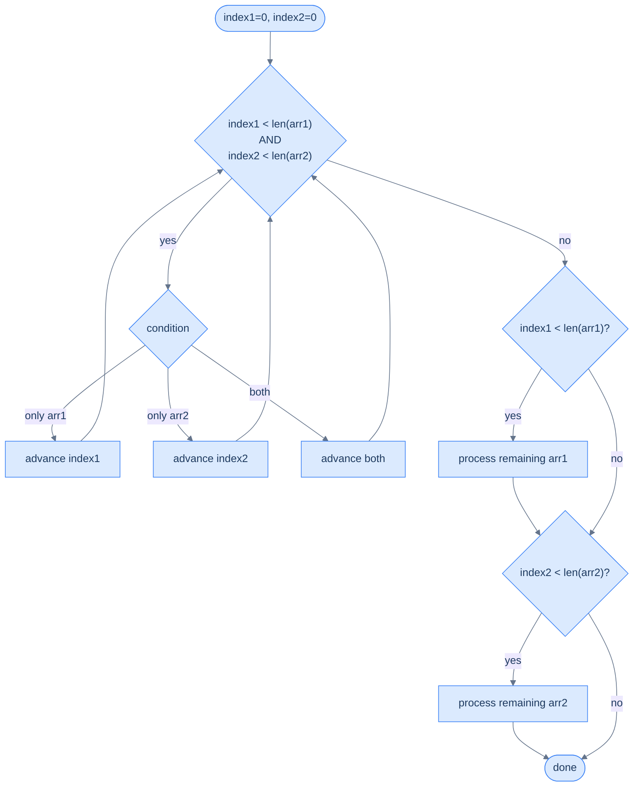
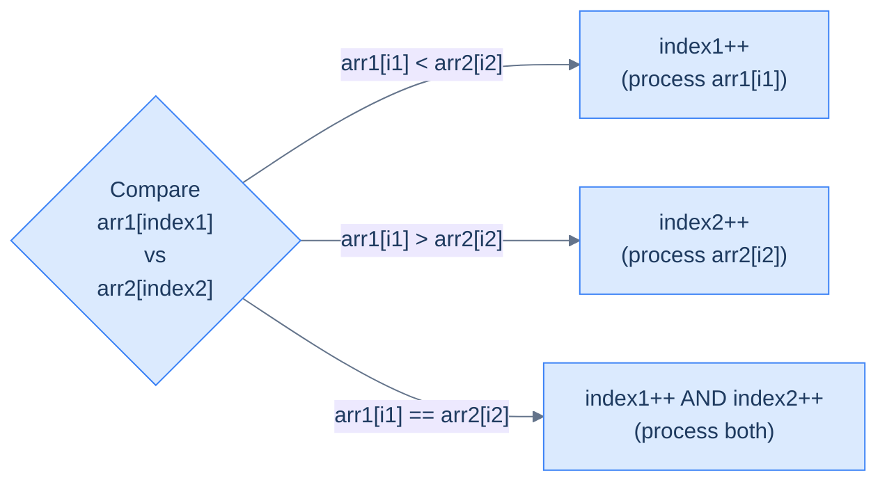
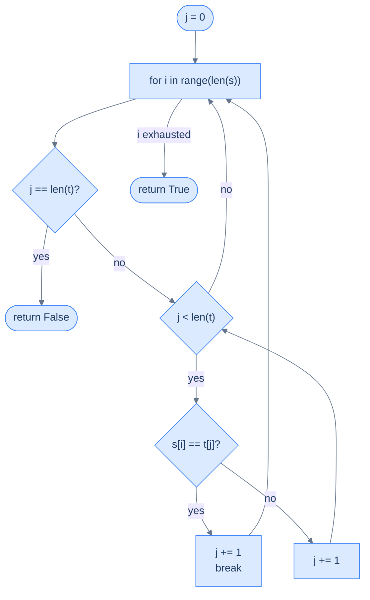
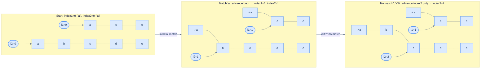
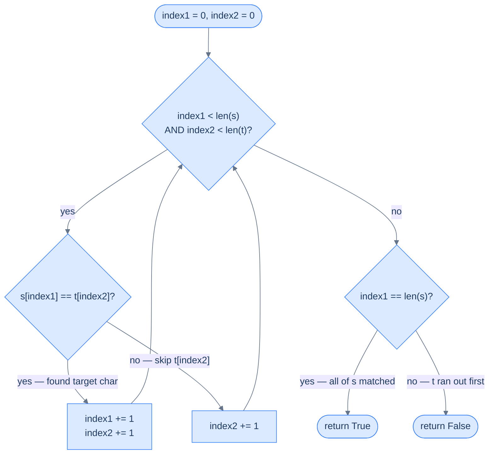
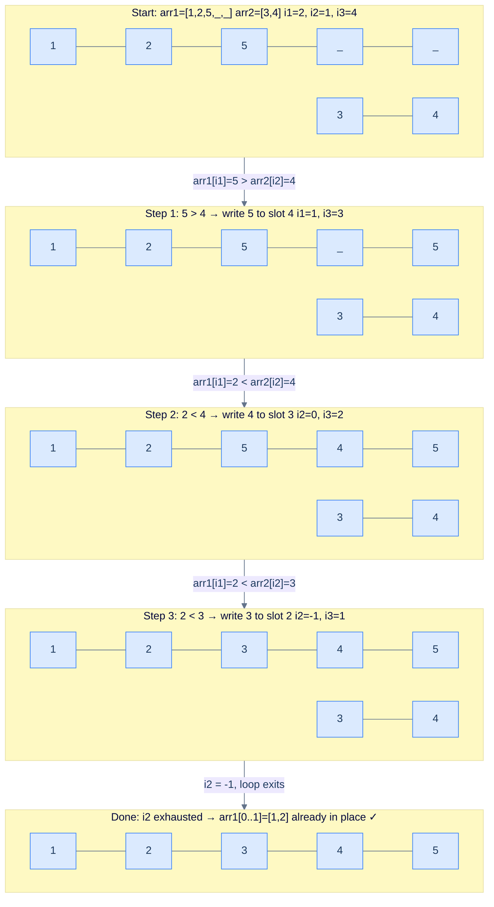
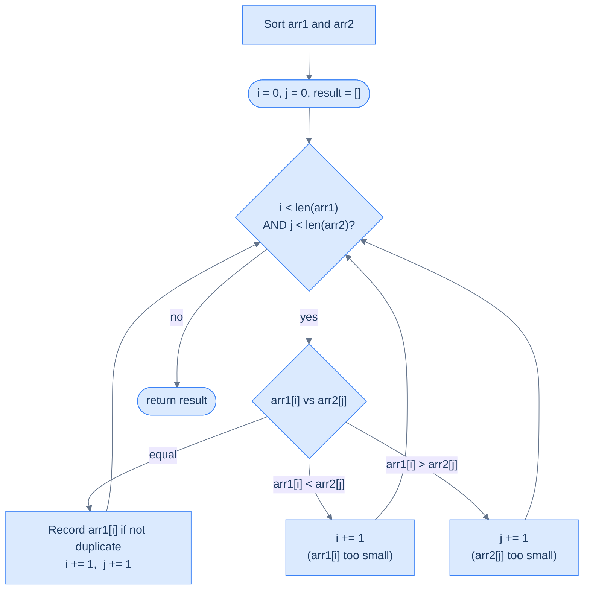
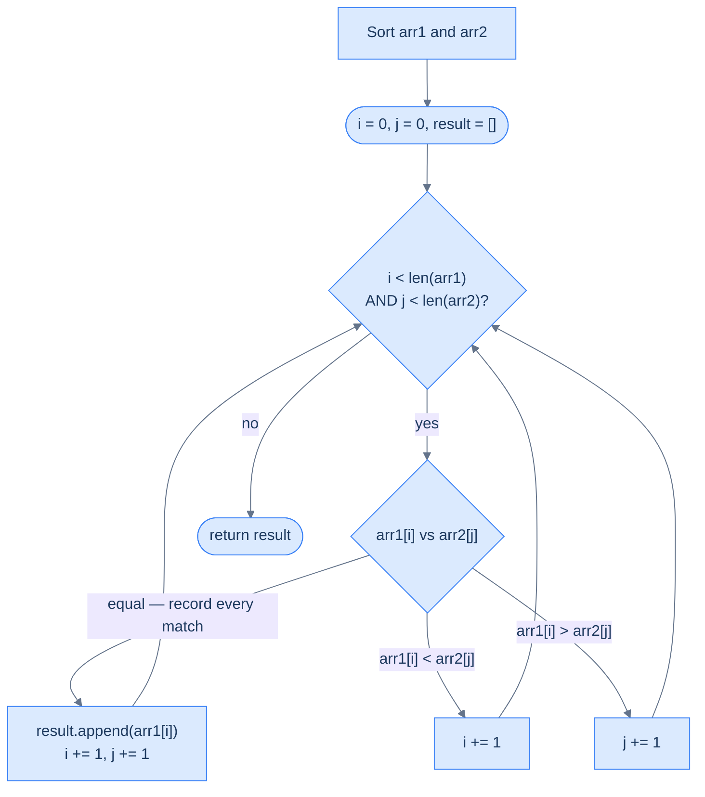

# 6. Pattern: Simultaneous traversal

This section explains how to move through two ordered collections together to compare, merge, or intersect them efficiently.

## Table of contents

1. [Understanding the simultaneous traversal pattern](#understanding-the-simultaneous-traversal-pattern)
2. [Identifying the simultaneous traversal pattern](#identifying-the-simultaneous-traversal-pattern)
3. [Subsequence checker](#subsequence-checker)
4. [Merge sorted arrays](#merge-sorted-arrays)
5. [Unique intersections](#unique-intersections)
6. [Repeated intersections](#repeated-intersections)

***

# Understanding the Simultaneous Traversal Pattern

## When One Array Isn't Enough

Every pattern we've covered so far works on a single array. But some problems give you **two arrays** and ask you to do something that requires looking at both at the same time.

Merging two sorted lists. Checking if one sequence appears inside another. Finding common elements between two arrays. These problems can't be solved by finishing one array and then starting the other — the answer depends on how items in both arrays relate to each other at each step.

The simultaneous traversal pattern handles exactly this: traverse two arrays in a single pass using two index variables, where a condition at each step decides which index moves forward.

---

## The Mental Model

Think of two conveyor belts running side by side. Each belt carries items in order. You have one hand on each belt. At every moment:
- You compare the items both hands are holding.
- Based on the comparison, you pick from the left belt, the right belt, or both.
- You advance whichever belt(s) you took from.

Neither belt ever rewinds. You just decide, at each step, which hand moves forward.

```d2
direction: right

arr1: "arr1  (size N)" {
  grid-columns: 5
  grid-gap: 0
  a0: "a₀" {style.fill: "#fde68a"; style.stroke: "#d97706"}
  a1: "a₁"
  a2: "a₂"
  a3: "a₃"
  a4: "..."
}

arr2: "arr2  (size M)" {
  grid-columns: 4
  grid-gap: 0
  b0: "b₀" {style.fill: "#dcfce7"; style.stroke: "#16a34a"}
  b1: "b₁"
  b2: "b₂"
  b3: "..."
}

i1: "index1" {shape: oval; style.fill: "#fde68a"; style.stroke: "#d97706"}
i2: "index2" {shape: oval; style.fill: "#dcfce7"; style.stroke: "#16a34a"}

i1 -> arr1.a0
i2 -> arr2.b0
```

<p align="center"><strong>Two index variables — one per array — start at position 0 and move independently based on a condition evaluated at each step.</strong></p>

---

## Two Index Variables, One Loop

The implementation has a fixed shape regardless of the problem:

- `index1` tracks the current position in `arr1`
- `index2` tracks the current position in `arr2`
- The main loop runs while **both** arrays have unprocessed elements
- After the main loop, two cleanup loops handle whatever remains in either array



<p align="center"><strong>Simultaneous traversal flow — the main loop runs while both arrays have items; two cleanup loops drain whichever array still has leftover elements.</strong></p>

The cleanup loops are what separate simultaneous traversal from the two-pointer pattern. Two pointers stop when the pointers converge on a single array. Simultaneous traversal continues until **both** arrays are fully processed.

---

## The Template


```pseudocode
# Generic simultaneous-traversal template. Customise the two advance hooks per problem.
function simultaneousTraversal(arr1, arr2):
    index1 ← 0; index2 ← 0
    while index1 < length(arr1) AND index2 < length(arr2):
        if shouldAdvanceArr1(arr1[index1], arr2[index2]):
            index1 ← index1 + 1
        if shouldAdvanceArr2(arr1[index1], arr2[index2]):
            index2 ← index2 + 1

    # Drain leftover — at most one of these two loops actually runs.
    while index1 < length(arr1): index1 ← index1 + 1
    while index2 < length(arr2): index2 ← index2 + 1
```

```python run
from typing import List

def should_advance_arr1(a: int, b: int) -> bool: return True
def should_advance_arr2(a: int, b: int) -> bool: return True

def simultaneous_traversal(arr1: List[int], arr2: List[int]) -> None:
    index1, index2 = 0, 0

    # Main loop — both arrays still have unprocessed elements.
    while index1 < len(arr1) and index2 < len(arr2):
        if should_advance_arr1(arr1[index1], arr2[index2]):
            index1 += 1
        if should_advance_arr2(arr1[index1], arr2[index2]):
            index2 += 1

    # Drain whichever array has leftovers — only one of these loops runs.
    while index1 < len(arr1):
        index1 += 1
    while index2 < len(arr2):
        index2 += 1
```

```java run
public class Main {
    static boolean shouldAdvanceArr1(int a, int b) { return true; }
    static boolean shouldAdvanceArr2(int a, int b) { return true; }

    static void simultaneousTraversal(int[] arr1, int[] arr2) {
        int i1 = 0, i2 = 0;
        while (i1 < arr1.length && i2 < arr2.length) {
            if (shouldAdvanceArr1(arr1[i1], arr2[i2])) i1++;
            if (i1 < arr1.length && i2 < arr2.length
                && shouldAdvanceArr2(arr1[i1], arr2[i2])) i2++;
        }
        while (i1 < arr1.length) i1++;
        while (i2 < arr2.length) i2++;
    }

    public static void main(String[] args) {
        simultaneousTraversal(new int[]{1, 2, 3}, new int[]{4, 5, 6});
        System.out.println("Template ran (no output by design — fill in process steps).");
    }
}
```

```c run
#include <stdio.h>
#include <stdbool.h>

static bool should_advance_arr1(int a, int b) { (void)a; (void)b; return true; }
static bool should_advance_arr2(int a, int b) { (void)a; (void)b; return true; }

void simultaneous_traversal(int* arr1, int n1, int* arr2, int n2) {
    int i1 = 0, i2 = 0;
    while (i1 < n1 && i2 < n2) {
        if (should_advance_arr1(arr1[i1], arr2[i2])) i1++;
        if (i1 < n1 && i2 < n2 && should_advance_arr2(arr1[i1], arr2[i2])) i2++;
    }
    while (i1 < n1) i1++;
    while (i2 < n2) i2++;
}

int main() {
    int a1[] = {1, 2, 3};
    int a2[] = {4, 5, 6};
    simultaneous_traversal(a1, 3, a2, 3);
    printf("Template ran.\n");
    return 0;
}
```

```scala run
object Main extends App {
  def shouldAdvanceArr1(a: Int, b: Int): Boolean = true
  def shouldAdvanceArr2(a: Int, b: Int): Boolean = true

  def simultaneousTraversal(arr1: Array[Int], arr2: Array[Int]): Unit = {
    var i1 = 0
    var i2 = 0
    while (i1 < arr1.length && i2 < arr2.length) {
      if (shouldAdvanceArr1(arr1(i1), arr2(i2))) i1 += 1
      if (i1 < arr1.length && i2 < arr2.length
          && shouldAdvanceArr2(arr1(i1), arr2(i2))) i2 += 1
    }
    while (i1 < arr1.length) i1 += 1
    while (i2 < arr2.length) i2 += 1
  }

  simultaneousTraversal(Array(1, 2, 3), Array(4, 5, 6))
  println("Template ran.")
}
```


---

## How Pointer Movement Works

At each step, exactly one of three outcomes happens, driven by the condition:



<p align="center"><strong>The condition evaluated each step determines which pointer advances — one, the other, or both. No pointer ever moves backwards.</strong></p>

The condition is problem-specific. Some examples:

| Problem | Condition to advance `index1` | Condition to advance `index2` |
|---|---|---|
| Merge sorted arrays | `arr1[i1] <= arr2[i2]` | `arr2[i2] < arr1[i1]` (or equal → advance both) |
| Subsequence check | `arr1[i1] == arr2[i2]` (match found) | always |
| Intersection | `arr1[i1] == arr2[i2]` (match found) | `arr1[i1] == arr2[i2]` (advance both on match) |

---

## Why Cleanup Loops Are Needed

When the main loop exits, exactly one of these is true:
- `index1 == len(arr1)` — `arr1` is exhausted, but `arr2` may still have items
- `index2 == len(arr2)` — `arr2` is exhausted, but `arr1` may still have items

Those remaining items are often meaningful. In a merge, they need to be appended to the result. In a subsequence check, if `s` still has characters left when `t` runs out, the answer is false.

The cleanup loops guarantee that no element in either array is silently skipped.

---

## Complexity

Every element in both arrays is processed exactly once — each index moves forward and never backwards. If `arr1` has N elements and `arr2` has M:

| | Time | Space |
|---|---|---|
| Best and worst case | O(N + M) | O(1) |

**Why brute force is O(N × M):** A naive nested loop resets `index2` to 0 for each element in `arr1`. That means every element of `arr1` triggers a full scan of `arr2`. Simultaneous traversal eliminates the reset — `index2` only ever moves forward.

***

# Identifying the Simultaneous Traversal Pattern

## The Diagnostic Questions

Before deciding this pattern applies, run through these three questions:

| Question | What it tests |
|---|---|
| **Q1.** Does the problem involve two sequences that must be compared or processed together? | Checks if two simultaneous cursors are structurally required |
| **Q2.** Does advancing in one sequence depend on a comparison between the two sequences? | Confirms that pointer movement is conditional, not independent |
| **Q3.** Is each pointer's advance condition simple and deterministic at every step? | Confirms the O(N + M) linear solution is achievable without backtracking |

If yes to all three, you have a simultaneous traversal problem.

---

## The Example: Subsequence Checker

**Problem:** Given two strings `s` and `t`, return `True` if `s` is a subsequence of `t`.

A string `s` is a subsequence of `t` if every character of `s` appears in `t` in the **same relative order** — but not necessarily consecutively.

```
s = "ace",   t = "abcde"  →  True   (a..c..e all appear in order)
s = "aec",   t = "abcde"  →  False  (e appears before c in t, not after)
```

```d2
direction: right

tt: "t = a b c d e" {
  grid-columns: 5
  grid-gap: 0
  t0: "a" {style.fill: "#dcfce7"; style.stroke: "#16a34a"}
  t1: "b"
  t2: "c" {style.fill: "#dcfce7"; style.stroke: "#16a34a"}
  t3: "d"
  t4: "e" {style.fill: "#dcfce7"; style.stroke: "#16a34a"}
}

ss: "s = a · c · e" {
  grid-columns: 3
  grid-gap: 0
  s0: "a" {style.fill: "#dcfce7"; style.stroke: "#16a34a"}
  s1: "c" {style.fill: "#dcfce7"; style.stroke: "#16a34a"}
  s2: "e" {style.fill: "#dcfce7"; style.stroke: "#16a34a"}
}

ss.s0 -> tt.t0: "matched at t[0]"
ss.s1 -> tt.t2: "matched at t[2]"
ss.s2 -> tt.t4: "matched at t[4]"
```

<p align="center"><strong>s = "ace" is a subsequence of t = "abcde" — each character of s maps to a later position in t, maintaining order.</strong></p>

---

## Applying the Diagnostic Questions

| Question | Answer |
|---|---|
| **Q1.** Two sequences processed together? | **Yes** — every character of `s` must be located inside `t` in order |
| **Q2.** Advancing one depends on comparing both? | **Yes** — `index1` (for `s`) only advances when `s[index1] == t[index2]`; `index2` (for `t`) always advances |
| **Q3.** Condition is simple and deterministic? | **Yes** — a single equality check at each step, no sorting or preprocessing needed |

---

### Q1 — Why "two sequences processed together"?

**WHAT:** The problem asks whether every character of `s` appears in `t` in the same order. You must match characters across both strings simultaneously — you can't answer this by scanning just `s` or just `t` alone.

**WHY two cursors are required:** `index1` tracks "which character of `s` are we currently trying to find?", and `index2` tracks "where in `t` are we currently looking?". Losing track of either position breaks the ordering guarantee.

**What breaks with a single pointer:** If you had one pointer scanning `t` for each character of `s` independently, you'd find 'a', 'c', 'e' correctly — but you'd also incorrectly accept `s = "aec"` because 'a', 'e', 'c' can each be found in `t` individually. The single pointer would restart from the beginning of `t` each time, losing the positional constraint.

---

### Q2 — Why "advancing index1 depends on a comparison"?

**WHAT:** At every step, `index2` always advances (we always move through `t`). But `index1` only advances when `s[index1] == t[index2]` — when we've found the current target character.

**WHY this conditional movement is the pattern:** The key insight is that `t` might have many characters that aren't in `s`. We skip over them by advancing `index2` without touching `index1`. Only a match triggers progress in `s`.

**Concrete check with s="ace", t="abcde":**
- `index1=0 ('a'), index2=0 ('a')`: match → advance both
- `index1=1 ('c'), index2=1 ('b')`: no match → advance only `index2`
- `index1=1 ('c'), index2=2 ('c')`: match → advance both
- `index1=2 ('e'), index2=3 ('d')`: no match → advance only `index2`
- `index1=2 ('e'), index2=4 ('e')`: match → advance both
- `index1=3 == len(s)=3` → all of `s` was matched → return `True`

**What breaks without conditional movement:** If you advanced `index1` regardless of whether there was a match, you'd move through `s` at the same speed as `t`, comparing `s[0]` with `t[0]`, `s[1]` with `t[1]`, etc. That checks if `s` is a prefix of `t`, not a subsequence.

---

### Q3 — Why "simple and deterministic at every step"?

**WHAT:** The condition is just `s[index1] == t[index2]` — a single character comparison. No sorting needed, no auxiliary data structure, no lookahead.

**WHY this guarantees O(N + M):** Because the condition takes O(1) time and each pointer only moves forward, the total number of steps is at most `len(s) + len(t)`. The algorithm never needs to revisit a position in either string.

**What would break this guarantee:** If the condition required scanning ahead — "does `s[index1]` appear *anywhere* in the remaining `t`?" — you'd need an inner loop, pushing complexity to O(N × M). The simultaneous traversal only works efficiently when the advance decision is local (based on current positions only).

---

## Brute Force: Nested Scan, O(N × M)

For each character in `s`, scan `t` from where we left off to find its first occurrence:



<p align="center"><strong>Brute force — for each character of s, scan forward in t until found or t is exhausted. Correct, but the nested structure is error-prone.</strong></p>


```pseudocode
# Brute-force subsequence check via nested loops.
function isSubsequenceBrute(s, t):
    j ← 0
    for i from 0 to length(s) − 1:
        if j = length(t):
            return false
        while j < length(t):
            if s[i] = t[j]:
                j ← j + 1
                break
            j ← j + 1
    return true
```

```python run
def is_subsequence_brute(s: str, t: str) -> bool:
    j = 0
    for i in range(len(s)):
        if j == len(t):
            return False
        while j < len(t):
            if s[i] == t[j]:
                j += 1
                break
            j += 1
    return True

print(is_subsequence_brute("ace", "abcde"))   # True
print(is_subsequence_brute("aec", "abcde"))   # False
```

```java run
public class Main {
    static boolean isSubsequenceBrute(String s, String t) {
        int j = 0;
        for (int i = 0; i < s.length(); i++) {
            if (j == t.length()) return false;
            while (j < t.length()) {
                if (s.charAt(i) == t.charAt(j)) { j++; break; }
                j++;
            }
        }
        return true;
    }

    public static void main(String[] args) {
        System.out.println(isSubsequenceBrute("ace", "abcde"));
        System.out.println(isSubsequenceBrute("aec", "abcde"));
    }
}
```

```c run
#include <stdio.h>
#include <stdbool.h>
#include <string.h>

bool is_subsequence_brute(const char* s, const char* t) {
    int j = 0;
    int ns = (int)strlen(s), nt = (int)strlen(t);
    for (int i = 0; i < ns; i++) {
        if (j == nt) return false;
        while (j < nt) {
            if (s[i] == t[j]) { j++; break; }
            j++;
        }
    }
    return true;
}

int main() {
    printf("%d\n", is_subsequence_brute("ace", "abcde"));
    printf("%d\n", is_subsequence_brute("aec", "abcde"));
    return 0;
}
```

```scala run
object Main extends App {
  def isSubsequenceBrute(s: String, t: String): Boolean = {
    var j = 0
    var i = 0
    while (i < s.length) {
      if (j == t.length) return false
      var matched = false
      while (j < t.length && !matched) {
        if (s(i) == t(j)) { j += 1; matched = true }
        else              { j += 1 }
      }
      i += 1
    }
    true
  }

  println(isSubsequenceBrute("ace", "abcde"))
  println(isSubsequenceBrute("aec", "abcde"))
}
```


<details>
<summary><strong>Trace — s = "ace", t = "abcde"  (brute force)</strong></summary>

```
j = 0

i=0, s[0]='a':
  j=0, t[0]='a': 'a'=='a' → j=1, break
i=1, s[1]='c':
  j=1, t[1]='b': 'c'≠'b' → j=2
  j=2, t[2]='c': 'c'=='c' → j=3, break
i=2, s[2]='e':
  j=3, t[3]='d': 'e'≠'d' → j=4
  j=4, t[4]='e': 'e'=='e' → j=5, break

i exhausted → return True ✓

Note: j never resets to 0 — this version actually behaves like simultaneous traversal
      under the hood. The nested while loop is what makes it hard to read and reason about.
```

</details>

---

## Simultaneous Traversal Solution: One Loop, O(N + M)

The same logic, expressed cleanly with two explicit index variables:



<p align="center"><strong>Simultaneous traversal — <code>index2</code> always advances; <code>index1</code> only advances on a match. The two-pointer structure makes the logic explicit and easy to follow.</strong></p>


```pseudocode
# Two-pointer subsequence check. Advance s only on a match; advance t every iteration.
function subsequenceChecker(s, t):
    index1 ← 0; index2 ← 0
    while index1 < length(s) AND index2 < length(t):
        if s[index1] = t[index2]:
            index1 ← index1 + 1
        index2 ← index2 + 1
    return index1 = length(s)                     # all of s consumed → s is a subsequence
```

```python run
class Solution:
    def subsequence_checker(self, s: str, t: str) -> bool:
        index1, index2 = 0, 0
        while index1 < len(s) and index2 < len(t):
            if s[index1] == t[index2]:
                index1 += 1                  # Advance s only on a match.
            index2 += 1                      # Always advance t — every char examined once.
        return index1 == len(s)              # All of s consumed → subsequence.


print(Solution().subsequence_checker("ace", "abcde"))   # True
print(Solution().subsequence_checker("aec", "abcde"))   # False
print(Solution().subsequence_checker("", "abcde"))      # True
print(Solution().subsequence_checker("abc", ""))        # False
```

```java run
public class Main {
    static class Solution {
        boolean subsequenceChecker(String s, String t) {
            int i1 = 0, i2 = 0;
            while (i1 < s.length() && i2 < t.length()) {
                if (s.charAt(i1) == t.charAt(i2)) i1++;
                i2++;
            }
            return i1 == s.length();
        }
    }

    public static void main(String[] args) {
        Solution sol = new Solution();
        System.out.println(sol.subsequenceChecker("ace", "abcde"));
        System.out.println(sol.subsequenceChecker("aec", "abcde"));
        System.out.println(sol.subsequenceChecker("", "abcde"));
        System.out.println(sol.subsequenceChecker("abc", ""));
    }
}
```

```c run
#include <stdio.h>
#include <stdbool.h>
#include <string.h>

bool subsequence_checker(const char* s, const char* t) {
    int i1 = 0, i2 = 0;
    int ns = (int)strlen(s), nt = (int)strlen(t);
    while (i1 < ns && i2 < nt) {
        if (s[i1] == t[i2]) i1++;
        i2++;
    }
    return i1 == ns;
}

int main() {
    printf("%d\n", subsequence_checker("ace", "abcde"));
    printf("%d\n", subsequence_checker("aec", "abcde"));
    printf("%d\n", subsequence_checker("", "abcde"));
    printf("%d\n", subsequence_checker("abc", ""));
    return 0;
}
```

```scala run
object Main extends App {
  class Solution {
    def subsequenceChecker(s: String, t: String): Boolean = {
      var i1 = 0
      var i2 = 0
      while (i1 < s.length && i2 < t.length) {
        if (s(i1) == t(i2)) i1 += 1
        i2 += 1
      }
      i1 == s.length
    }
  }

  val sol = new Solution
  println(sol.subsequenceChecker("ace", "abcde"))
  println(sol.subsequenceChecker("aec", "abcde"))
  println(sol.subsequenceChecker("", "abcde"))
  println(sol.subsequenceChecker("abc", ""))
}
```


<details>
<summary><strong>Trace — s = "ace", t = "abcde"  (simultaneous traversal)</strong></summary>

```
index1 = 0,  index2 = 0

Step 1 │ index1=0 ('a'), index2=0 ('a') │ 'a'=='a' match  │ index1=1, index2=1
Step 2 │ index1=1 ('c'), index2=1 ('b') │ 'c'≠'b' no match│ index1=1, index2=2
Step 3 │ index1=1 ('c'), index2=2 ('c') │ 'c'=='c' match  │ index1=2, index2=3
Step 4 │ index1=2 ('e'), index2=3 ('d') │ 'e'≠'d' no match│ index1=2, index2=4
Step 5 │ index1=2 ('e'), index2=4 ('e') │ 'e'=='e' match  │ index1=3, index2=5
Step 6 │ index1=3 == len(s)=3 → loop exits

Return: index1 == len(s) → 3 == 3 → True ✓

Failure case — s = "aec", t = "abcde":
Step 1 │ index1=0 ('a'), index2=0 ('a') │ match   │ index1=1, index2=1
Step 2 │ index1=1 ('e'), index2=1 ('b') │ no match│ index1=1, index2=2
Step 3 │ index1=1 ('e'), index2=2 ('c') │ no match│ index1=1, index2=3
Step 4 │ index1=1 ('e'), index2=3 ('d') │ no match│ index1=1, index2=4
Step 5 │ index1=1 ('e'), index2=4 ('e') │ match   │ index1=2, index2=5
Step 6 │ index2=5 == len(t)=5 → loop exits

Return: index1 == len(s) → 2 == 3 → False ✓
Note: 'e' was found before 'c', so s[2]='c' was never matched — index1 stopped at 2.
```

</details>

---

## Problems in This Category

| Problem | Both sequences needed? | Advance condition |
|---|---|---|
| **Subsequence Checker** | Yes — match chars of s inside t | match → both; no match → t only |
| **Merge Sorted Arrays** | Yes — merge arr1 and arr2 into sorted result | pick smaller → advance that one; equal → advance both |
| **Unique Intersections** | Yes — find elements in both arrays | match → record and advance both; mismatch → advance the smaller |
| **Repeated Intersections** | Yes — find all common elements including duplicates | same as intersections but don't skip duplicates |

The difficulty varies by how complex the advance condition is — but the template stays the same.

***

# Subsequence Checker

## Problem

Given two strings `s` and `t`, return `True` if `s` is a **subsequence** of `t`.

A subsequence means every character of `s` appears in `t` in the **same relative order** — but not necessarily at consecutive positions. Characters in `t` that don't belong to `s` can be freely skipped.

```
s = "ace",  t = "abcde"  →  True   (a at t[0], c at t[2], e at t[4] — order preserved)
s = "aec",  t = "abcde"  →  False  (e appears at t[4], but c appears at t[2] — order violated)
s = "",     t = "abc"    →  True   (empty string is always a subsequence of anything)
s = "abc",  t = ""       →  False  (non-empty s cannot match inside an empty t)
```

---

## Intuition

Imagine `t` as a long river and `s` as a treasure map with a sequence of landmarks you need to visit in order. You paddle down the river from left to right — you can't go back upstream. Each time you reach a landmark that matches the next one on your map, you check it off. If you check off every landmark before reaching the end of the river, the journey was valid.

That's exactly the structure here. You have two positions to track:
- **Where you are in `t`** — always moving forward, skipping anything that doesn't match
- **How far you've matched in `s`** — only advances when the current character of `t` matches the current target in `s`

This is a simultaneous traversal problem because you can't answer the question by scanning `s` alone or `t` alone. You need to walk both at the same time: `t`'s pointer tells you "what character of `t` am I looking at right now?" and `s`'s pointer tells you "which character of `s` am I currently trying to match?"

If `s`'s pointer reaches the end of `s`, all characters were matched in order — return `True`. If `t`'s pointer reaches the end of `t` first, `s` still has unmatched characters — return `False`.

---

## Key Observations

1. **`t`'s pointer always advances.** You scan every character of `t` exactly once, whether or not it matches.
2. **`s`'s pointer only advances on a match.** This enforces the ordering constraint: you can only check off a character once you actually find it at or after the current position in `t`.
3. **No backtracking.** Once you move past a position in `t`, you never revisit it. This is what gives the O(N + M) time complexity.
4. **Order matters, gaps don't.** `s = "ace"` succeeds even though positions 1 and 3 (`b` and `d`) are skipped. But `s = "aec"` fails because `e` cannot appear before `c` in the subsequence.

---

## Approach



<p align="center"><strong>Simultaneous traversal — <code>index2</code> advances every step; <code>index1</code> only advances when a match is found. The loop exits when either string is exhausted.</strong></p>

**Step-by-step logic:**

1. Start both pointers at position 0.
2. Each iteration: if `s[index1] == t[index2]`, the current target character in `s` was found — advance both pointers.
3. If no match, `t[index2]` is not the character we need right now — advance only `index2` to check the next character in `t`.
4. When the loop exits (one of the strings is exhausted), check if `index1 == len(s)`. If yes, every character in `s` was matched in order — `True`. Otherwise, `s` still has unmatched characters — `False`.

---

## Solution


```pseudocode
function subsequenceChecker(s, t):
    # pointer for s
    index1 ← 0

    # pointer for t
    index2 ← 0

    while index1 < length(s) AND index2 < length(t):
        if s[index1] = t[index2]:

            # If the current character matches, move the pointer for s
            index1 ← index1 + 1

        # Move the pointer for t in every iteration
        index2 ← index2 + 1

    # If index1 reaches the end of s, it means all characters in s
    # are found in t in the same order
    return index1 = length(s)
```

```python run
class Solution:
    def subsequence_checker(self, s: str, t: str) -> bool:

        # pointer for s
        index1: int = 0

        # pointer for t
        index2: int = 0

        while index1 < len(s) and index2 < len(t):
            if s[index1] == t[index2]:

                # If the current character matches, move the pointer for
                # s
                index1 += 1

            # Move the pointer for t in every iteration
            index2 += 1

        # If index1 reaches the end of s, it means all characters in s
        # are found in t in the same order
        return index1 == len(s)


sol = Solution()
print(sol.subsequence_checker("ace", "abcde"))   # True
print(sol.subsequence_checker("aec", "abcde"))   # False
print(sol.subsequence_checker("", "abc"))        # True
print(sol.subsequence_checker("abc", ""))        # False
print(sol.subsequence_checker("abc", "abc"))     # True
```

```java run
public class Main {
    static class Solution {
        public boolean subsequenceChecker(String s, String t) {

            // pointer for s
            int index1 = 0;

            // pointer for t
            int index2 = 0;

            while (index1 < s.length() && index2 < t.length()) {
                if (s.charAt(index1) == t.charAt(index2)) {

                    // If the current character matches, move the pointer for
                    // s
                    index1++;
                }

                // Move the pointer for t in every iteration
                index2++;
            }

            // If index1 reaches the end of s, it means all characters in s
            // are found in t in the same order
            return index1 == s.length();
        }
    }

    public static void main(String[] args) {
        Solution sol = new Solution();
        System.out.println(sol.subsequenceChecker("ace", "abcde"));   // true
        System.out.println(sol.subsequenceChecker("aec", "abcde"));   // false
        System.out.println(sol.subsequenceChecker("", "abc"));        // true
        System.out.println(sol.subsequenceChecker("abc", ""));        // false
        System.out.println(sol.subsequenceChecker("abc", "abc"));     // true
    }
}
```

```c run
#include <stdio.h>
#include <stdbool.h>
#include <string.h>

bool subsequence_checker(const char* s, const char* t) {

    /* pointer for s */
    int index1 = 0;

    /* pointer for t */
    int index2 = 0;

    int ns = (int)strlen(s);
    int nt = (int)strlen(t);

    while (index1 < ns && index2 < nt) {
        if (s[index1] == t[index2]) {

            /* If the current character matches, move the pointer for s */
            index1++;
        }

        /* Move the pointer for t in every iteration */
        index2++;
    }

    /* If index1 reaches the end of s, it means all characters in s
     * are found in t in the same order */
    return index1 == ns;
}

int main() {
    printf("%d\n", subsequence_checker("ace", "abcde"));    /* 1 */
    printf("%d\n", subsequence_checker("aec", "abcde"));    /* 0 */
    printf("%d\n", subsequence_checker("", "abc"));         /* 1 */
    printf("%d\n", subsequence_checker("abc", ""));         /* 0 */
    printf("%d\n", subsequence_checker("abc", "abc"));      /* 1 */
    return 0;
}
```

```scala run
object Main extends App {
  class Solution {
    def subsequenceChecker(s: String, t: String): Boolean = {

      // pointer for s
      var index1 = 0

      // pointer for t
      var index2 = 0

      while (index1 < s.length && index2 < t.length) {
        if (s(index1) == t(index2)) {

          // If the current character matches, move the pointer for s
          index1 += 1
        }

        // Move the pointer for t in every iteration
        index2 += 1
      }

      // If index1 reaches the end of s, it means all characters in s
      // are found in t in the same order
      index1 == s.length
    }
  }

  val sol = new Solution
  println(sol.subsequenceChecker("ace", "abcde"))   // true
  println(sol.subsequenceChecker("aec", "abcde"))   // false
  println(sol.subsequenceChecker("", "abc"))        // true
  println(sol.subsequenceChecker("abc", ""))        // false
  println(sol.subsequenceChecker("abc", "abc"))     // true
}
```


---

## Trace

<details>
<summary><strong>Trace — s = "ace", t = "abcde"</strong></summary>

```
index1 = 0,  index2 = 0

Step 1 │ index1=0 ('a'), index2=0 ('a') │ 'a'=='a' match   │ index1=1, index2=1
Step 2 │ index1=1 ('c'), index2=1 ('b') │ 'c'≠'b' no match │ index1=1, index2=2
Step 3 │ index1=1 ('c'), index2=2 ('c') │ 'c'=='c' match   │ index1=2, index2=3
Step 4 │ index1=2 ('e'), index2=3 ('d') │ 'e'≠'d' no match │ index1=2, index2=4
Step 5 │ index1=2 ('e'), index2=4 ('e') │ 'e'=='e' match   │ index1=3, index2=5
Loop exits: index1=3 == len(s)=3

Return: True ✓

Note: index2 advanced on every step; index1 only advanced on steps 1, 3, and 5.
The three skipped characters ('b', 'd') in t were irrelevant to the match.
```

</details>

<details>
<summary><strong>Trace — s = "aec", t = "abcde"  (failure case)</strong></summary>

```
index1 = 0,  index2 = 0

Step 1 │ index1=0 ('a'), index2=0 ('a') │ match   │ index1=1, index2=1
Step 2 │ index1=1 ('e'), index2=1 ('b') │ no match│ index1=1, index2=2
Step 3 │ index1=1 ('e'), index2=2 ('c') │ no match│ index1=1, index2=3
Step 4 │ index1=1 ('e'), index2=3 ('d') │ no match│ index1=1, index2=4
Step 5 │ index1=1 ('e'), index2=4 ('e') │ match   │ index1=2, index2=5
Loop exits: index2=5 == len(t)=5

Return: index1 == len(s) → 2 == 3 → False ✓

Note: 'e' was found successfully, but now index2 has run off the end of t.
s[2]='c' was never matched — and it can't be, because 'c' in t was already
passed at index2=2, before 'e' was found. The ordering is violated.
```

</details>

---

## Complexity

| | Time | Space |
|---|---|---|
| **Subsequence checker** | O(N + M) | O(1) |

**Time:** In the worst case (no match, or a match only at the very end), `index2` scans all of `t` (M steps) and `index1` scans all of `s` (N steps). Total steps: at most N + M.

**Space:** Only two integer pointers — no auxiliary data structures needed.

---

## Edge Cases

| Case | Example | Expected | Reasoning |
|---|---|---|---|
| Empty `s` | `s=""`, `t="abc"` | `True` | index1 starts at 0 == len(s), loop never runs, returns True immediately |
| Empty `t` | `s="a"`, `t=""` | `False` | Loop never runs, index1=0 ≠ len(s)=1 → False |
| Both empty | `s=""`, `t=""` | `True` | index1=0 == len(s)=0 → True |
| `s` longer than `t` | `s="abcde"`, `t="abc"` | `False` | t exhausts before all of s is matched |
| `s` equals `t` | `s="abc"`, `t="abc"` | `True` | Every character matches at the same position |
| All characters same | `s="aaa"`, `t="aaaa"` | `True` | Three matches found before t is exhausted |
| Single character miss | `s="z"`, `t="abcde"` | `False` | 'z' never appears in t; t exhausts with index1=0 |

---

## Key Takeaway

Use simultaneous traversal when one string's pointer always advances and the other only advances on a match — the answer is whether the conditional pointer exhausts its sequence first. Remember: `index2` (for `t`) is the engine that drives the loop; `index1` (for `s`) is the progress meter.

***

# Merge Sorted Arrays

## The Problem

Given two integer arrays `arr1` and `arr2`, both sorted in non-decreasing order, and two integers `m` and `n` representing the number of valid elements in each array, merge `arr2` into `arr1` **in-place** so that `arr1` holds all `m + n` elements in sorted order.

`arr1` is pre-allocated to length `m + n` — the last `n` slots are filled with zeros as placeholders.

```
Input:  arr1 = [1, 2, 3, 0, 0], m = 3, arr2 = [4, 5], n = 2
Output: [1, 2, 3, 4, 5]

Input:  arr1 = [1, 2, 5, 0, 0], m = 3, arr2 = [3, 4], n = 2
Output: [1, 2, 3, 4, 5]

Input:  arr1 = [1], m = 1, arr2 = [], n = 0
Output: [1]
```

---

## What Makes Merging In-Place Tricky?

Your first instinct is to merge from the front: compare `arr1[0]` and `arr2[0]`, place the smaller one at position 0, then move forward. Clean logic — but there's a fatal problem.

`arr1` is the destination *and* a source. The moment you write into `arr1[0]`, you destroy the element that was already there. You'd have to shift everything one position to the right to make room first — and that's O(N) work per insert, O(N²) total.

```d2
direction: right

bad: "Front-to-back: destroys arr1[0] before reading it" {
  grid-columns: 5
  grid-gap: 0
  a0: "1" {style.fill: "#fecaca"; style.stroke: "#dc2626"}
  a1: "2"
  a2: "3"
  a3: "0"
  a4: "0"
}

bad_arrow: "write here ✗ overwrites!" {shape: oval; style.fill: "#fecaca"; style.stroke: "#dc2626"}
bad_arrow -> bad.a0

good: "Back-to-front: writes into free zeros, never destroys unread data" {
  grid-columns: 5
  grid-gap: 0
  b0: "1"
  b1: "2"
  b2: "3"
  b3: "0"
  b4: "0" {style.fill: "#dcfce7"; style.stroke: "#16a34a"}
}

good_arrow: "write here ✓ safe (free slot)" {shape: oval; style.fill: "#dcfce7"; style.stroke: "#16a34a"}
good_arrow -> good.b4
```

<p align="center"><strong>Writing from the front overwrites unread data. Writing from the back fills the pre-allocated zero slots — already free, never destructive.</strong></p>

The fix is to flip the direction entirely. The last `n` positions of `arr1` are zeros — free space nobody has touched. The largest element belongs there. Fill from the back, largest-first. The write pointer never catches up to the read pointers until every element has been consumed.

---

## Applying the Diagnostic Questions

| Question | Answer |
|---|---|
| **Q1.** Does the problem involve two sequences that must be compared or processed together? | **Yes** — elements from `arr1` and `arr2` must compete at every step to determine placement order |
| **Q2.** Does advancing in one sequence depend on a comparison between the two? | **Yes** — whichever array supplies the larger element has its pointer decremented; the other stays |
| **Q3.** Is each pointer's advance condition simple and deterministic at every step? | **Yes** — a single `>` comparison at each step, no sorting or preprocessing needed |

### Q1 — Why "elements from both arrays must compete at every step"?

**Mental model:** Think of the merge as a competition. At every position (from back to front), two candidates show up — `arr1[i1]` and `arr2[i2]`. The winner takes the current slot and steps aside; the loser stays for the next round.

**Why you can't process each array separately:** If you placed all of `arr2` first, then all of `arr1`, you'd lose the sorted order that lets you merge in O(M + N). The sorted property only helps you when you're comparing one element from each array simultaneously — comparing an `arr1` element only against other `arr1` elements tells you nothing about where it lands relative to `arr2`.

**What breaks with a single pointer:** If you used one pointer scanning `arr1` for the right slot to insert each element of `arr2`, you'd need an inner loop — O(N) work per `arr2` element, O(N × M) total. Two simultaneous pointers reduce this to one comparison per element.

### Q2 — Why "whichever supplies the larger element gets decremented"?

**Mental model:** Think of the two pointers as two fingers pointing at the current candidates. At each step, you pick the larger of the two, write it to the current back slot, and pull that finger one position closer to the front. The other finger freezes — it might win the next round.

**Concrete check with `arr1=[1,2,5]`, `arr2=[3,4]`, writing from position 4 down:**
- `i1=2 (5)` vs `i2=1 (4)`: 5 wins → write 5 to slot 4, decrement `i1`
- `i1=1 (2)` vs `i2=1 (4)`: 4 wins → write 4 to slot 3, decrement `i2`
- `i1=1 (2)` vs `i2=0 (3)`: 3 wins → write 3 to slot 2, decrement `i2`
- `i2` exhausted → `arr1[0..1] = [1, 2]` are already in place

**What breaks if you always decrement both:** You'd skip elements. If `arr1[i1] = 5` and `arr2[i2] = 4`, decrementing `i2` means `arr2[i2]` (which is 4) never gets placed — it gets skipped without being written anywhere.

### Q3 — Why "a single comparison is enough at every step"?

**Mental model:** Both arrays are already sorted, so the current candidates `arr1[i1]` and `arr2[i2]` are the maximum of their respective remaining elements. You don't need to look further — the largest overall element is always one of these two.

**Why O(M + N) is achievable:** Each element is examined at most once (as a candidate) and written once (when it wins). With M elements in `arr1` and N in `arr2`, that's exactly M + N operations — no lookahead, no backtracking.

**What would break this:** If the arrays weren't sorted, you couldn't pick the global maximum by only looking at `arr1[i1]` and `arr2[i2]`. You'd need to scan the rest of each array — pushing complexity to O(M × N).

---

## The Backward Fill Strategy (Visualised)



<p align="center"><strong>Three-pointer backward fill — <code>i1</code> and <code>i2</code> compete for each slot; <code>i3</code> always fills the next free position from the back. No element is ever overwritten before being read.</strong></p>

**The three pointers:**
- `i1 = m - 1` — last valid element of `arr1`
- `i2 = n - 1` — last element of `arr2`
- `i3 = m + n - 1` — current write position (starts at the very back)

**At each step:** Compare `arr1[i1]` and `arr2[i2]`. The larger one claims slot `i3`. Decrement its source pointer and decrement `i3`.

**After the loop:** If `arr2` still has elements (`i2 >= 0`), copy them straight into `arr1` — they're all smaller than everything already placed, so no comparison needed. If `arr1` still has elements, they're already sitting in the right positions — no action needed.

---

## The Solution


```pseudocode
# Merge arr2 into arr1 in-place. arr1 has m real elements + n trailing zeros.
# Backward fill: write from the back so we never overwrite unread data.
function mergeSortedArrays(arr1, m, arr2, n):
    i1 ← m − 1; i2 ← n − 1; i3 ← m + n − 1
    while i1 ≥ 0 AND i2 ≥ 0:
        if arr1[i1] > arr2[i2]:
            arr1[i3] ← arr1[i1]
            i1 ← i1 − 1
        else:
            arr1[i3] ← arr2[i2]
            i2 ← i2 − 1
        i3 ← i3 − 1
    while i2 ≥ 0:                                 # leftover arr2 elements (smaller than all placed)
        arr1[i3] ← arr2[i2]
        i2 ← i2 − 1
        i3 ← i3 − 1
```

```python run
from typing import List

class Solution:
    def merge_sorted_arrays(self, arr1: List[int], m: int,
                                  arr2: List[int], n: int) -> None:
        # Fill arr1 from the back: arr1's tail is reserved zeros, so writes never clobber unread data.
        i1, i2, i3 = m - 1, n - 1, m + n - 1
        while i1 >= 0 and i2 >= 0:
            if arr1[i1] > arr2[i2]:
                arr1[i3] = arr1[i1]
                i1 -= 1
            else:
                arr1[i3] = arr2[i2]
                i2 -= 1
            i3 -= 1
        # Anything left in arr2 is smaller than everything already placed → copy directly.
        while i2 >= 0:
            arr1[i3] = arr2[i2]
            i2 -= 1
            i3 -= 1


sol = Solution()

arr1 = [1, 2, 3, 0, 0]; sol.merge_sorted_arrays(arr1, 3, [4, 5], 2); print(arr1)
arr1 = [1, 2, 5, 0, 0]; sol.merge_sorted_arrays(arr1, 3, [3, 4], 2); print(arr1)
arr1 = [1];             sol.merge_sorted_arrays(arr1, 1, [], 0);     print(arr1)
arr1 = [0];             sol.merge_sorted_arrays(arr1, 0, [1], 1);    print(arr1)
```

```java run
import java.util.Arrays;

public class Main {
    static class Solution {
        void mergeSortedArrays(int[] arr1, int m, int[] arr2, int n) {
            int i1 = m - 1, i2 = n - 1, i3 = m + n - 1;
            while (i1 >= 0 && i2 >= 0) {
                if (arr1[i1] > arr2[i2]) { arr1[i3] = arr1[i1]; i1--; }
                else                     { arr1[i3] = arr2[i2]; i2--; }
                i3--;
            }
            while (i2 >= 0) { arr1[i3] = arr2[i2]; i2--; i3--; }
        }
    }

    public static void main(String[] args) {
        Solution sol = new Solution();

        int[] a1 = {1, 2, 3, 0, 0};
        sol.mergeSortedArrays(a1, 3, new int[]{4, 5}, 2);
        System.out.println(Arrays.toString(a1));

        int[] a2 = {1, 2, 5, 0, 0};
        sol.mergeSortedArrays(a2, 3, new int[]{3, 4}, 2);
        System.out.println(Arrays.toString(a2));

        int[] a3 = {1};
        sol.mergeSortedArrays(a3, 1, new int[]{}, 0);
        System.out.println(Arrays.toString(a3));

        int[] a4 = {0};
        sol.mergeSortedArrays(a4, 0, new int[]{1}, 1);
        System.out.println(Arrays.toString(a4));
    }
}
```

```c run
#include <stdio.h>

void merge_sorted_arrays(int* arr1, int m, int* arr2, int n) {
    int i1 = m - 1, i2 = n - 1, i3 = m + n - 1;
    while (i1 >= 0 && i2 >= 0) {
        if (arr1[i1] > arr2[i2]) { arr1[i3] = arr1[i1]; i1--; }
        else                     { arr1[i3] = arr2[i2]; i2--; }
        i3--;
    }
    while (i2 >= 0) { arr1[i3] = arr2[i2]; i2--; i3--; }
}

void print_arr(int* arr, int n) {
    printf("[");
    for (int i = 0; i < n; i++) printf("%d%s", arr[i], i + 1 < n ? ", " : "");
    printf("]\n");
}

int main() {
    int a1[] = {1, 2, 3, 0, 0};
    int b1[] = {4, 5};
    merge_sorted_arrays(a1, 3, b1, 2); print_arr(a1, 5);

    int a2[] = {1, 2, 5, 0, 0};
    int b2[] = {3, 4};
    merge_sorted_arrays(a2, 3, b2, 2); print_arr(a2, 5);

    int a3[] = {1};
    merge_sorted_arrays(a3, 1, NULL, 0); print_arr(a3, 1);

    int a4[] = {0};
    int b4[] = {1};
    merge_sorted_arrays(a4, 0, b4, 1); print_arr(a4, 1);
    return 0;
}
```

```scala run
object Main extends App {
  class Solution {
    def mergeSortedArrays(arr1: Array[Int], m: Int, arr2: Array[Int], n: Int): Unit = {
      var i1 = m - 1
      var i2 = n - 1
      var i3 = m + n - 1
      while (i1 >= 0 && i2 >= 0) {
        if (arr1(i1) > arr2(i2)) { arr1(i3) = arr1(i1); i1 -= 1 }
        else                      { arr1(i3) = arr2(i2); i2 -= 1 }
        i3 -= 1
      }
      while (i2 >= 0) { arr1(i3) = arr2(i2); i2 -= 1; i3 -= 1 }
    }
  }

  val sol = new Solution

  val a1 = Array(1, 2, 3, 0, 0); sol.mergeSortedArrays(a1, 3, Array(4, 5), 2); println(a1.mkString(", "))
  val a2 = Array(1, 2, 5, 0, 0); sol.mergeSortedArrays(a2, 3, Array(3, 4), 2); println(a2.mkString(", "))
  val a3 = Array(1);             sol.mergeSortedArrays(a3, 1, Array.empty[Int], 0); println(a3.mkString(", "))
  val a4 = Array(0);             sol.mergeSortedArrays(a4, 0, Array(1), 1);    println(a4.mkString(", "))
}
```


<details>
<summary><strong>Trace — arr1 = [1, 2, 5, 0, 0], m = 3, arr2 = [3, 4], n = 2</strong></summary>

```
i1 = 2,  i2 = 1,  i3 = 4

Step 1 │ i1=2 (arr1[2]=5), i2=1 (arr2[1]=4) │ 5 > 4 → arr1[4]=5, i1=1 │ arr1=[1,2,5,0,5]  i3=3
Step 2 │ i1=1 (arr1[1]=2), i2=1 (arr2[1]=4) │ 2 < 4 → arr1[3]=4, i2=0 │ arr1=[1,2,5,4,5]  i3=2
Step 3 │ i1=1 (arr1[1]=2), i2=0 (arr2[0]=3) │ 2 < 3 → arr1[2]=3, i2=-1│ arr1=[1,2,3,4,5]  i3=1

Loop exits: i2 = -1

No leftover arr2 elements. arr1[0..1] = [1, 2] already in correct positions.

Result: [1, 2, 3, 4, 5] ✓

Note: the write pointer i3 always wrote into a position at or ahead of where
it started — it never caught up to i1, so no element was overwritten before being read.
```

</details>

<details>
<summary><strong>Trace — arr1 = [3, 4, 0, 0], m = 2, arr2 = [1, 2], n = 2  (arr1 exhausts first, leftover-copy runs)</strong></summary>

```
i1 = 1,  i2 = 1,  i3 = 3

Step 1 │ i1=1 (arr1[1]=4), i2=1 (arr2[1]=2) │ 4 > 2 → arr1[3]=4, i1=0 │ arr1=[3,4,0,4]  i3=2
Step 2 │ i1=0 (arr1[0]=3), i2=1 (arr2[1]=2) │ 3 > 2 → arr1[2]=3, i1=-1│ arr1=[3,4,3,4]  i3=1

Loop exits: i1 = -1

Leftover arr2: i2=1
  copy arr2[1]=2 → arr1[1]=2, i2=0, i3=0
  copy arr2[0]=1 → arr1[0]=1, i2=-1

Result: [1, 2, 3, 4] ✓

Note: the leftover-copy pass handles arr2 elements that are all smaller
than anything already placed — no comparison needed, just copy in order.
```

</details>

---

## Complexity Analysis

| | Complexity | Reason |
|---|---|---|
| **Time** | O(M + N) | Each element is read once (by `i1` or `i2`) and written once (by `i3`) — M + N operations total |
| **Space** | O(1) | Only three integer pointers; the pre-allocated zeros in `arr1` serve as the output buffer |

---

## Edge Cases

| Case | Example | Expected | Reasoning |
|---|---|---|---|
| `arr2` is empty | `arr1=[1]`, `m=1`, `arr2=[]`, `n=0` | `[1]` | `i2=-1` immediately; main loop never runs, `arr1` unchanged |
| `arr1` has no valid elements | `arr1=[0]`, `m=0`, `arr2=[1]`, `n=1` | `[1]` | `i1=-1` immediately; main loop skipped; leftover-copy runs once |
| All `arr2` larger than `arr1` | `arr1=[1,2,0,0]`, `arr2=[3,4]` | `[1,2,3,4]` | `arr2` wins every comparison; `arr1` elements stay untouched at the front |
| All `arr2` smaller than `arr1` | `arr1=[3,4,0,0]`, `arr2=[1,2]` | `[1,2,3,4]` | `arr1` wins every comparison; leftover-copy places both `arr2` elements |
| Arrays perfectly interleave | `arr1=[1,3,0,0]`, `arr2=[2,4]` | `[1,2,3,4]` | Each comparison alternates winner between `i1` and `i2` |
| Tie (equal elements) | `arr1=[2,3,0]`, `arr2=[2]` | `[2,2,3]` | `else` branch fires on ties, placing `arr2[i2]` first — both orderings are valid for equal elements |

---

## Final Takeaway

Merge from the back when the destination array has pre-allocated empty space at the end — it lets the write pointer fill free slots without ever stomping on unread values. The three-pointer setup (`i1` reads `arr1`, `i2` reads `arr2`, `i3` writes into `arr1`) is simultaneous traversal running in reverse: two read pointers compete to supply the largest element, one write pointer claims the result. Always handle the leftover `arr2` copy pass — leftover `arr1` elements are already in place and need no action.

***

# Unique Intersections

## The Problem

Given two integer arrays `arr1` and `arr2`, return an array containing all elements that appear in **both** arrays. Each element in the result must appear **only once**, regardless of how many times it appears in the inputs.

```
arr1 = [1, 2, 2, 3, 4],  arr2 = [2, 2, 3, 5]  →  [2, 3]
arr1 = [1, 2, 3],         arr2 = [4, 5, 6]      →  []
arr1 = [1, 1, 1],         arr2 = [1, 1]          →  [1]
arr1 = [1, 2, 3, 4, 5],   arr2 = [1, 3, 5, 7]   →  [1, 3, 5]
```

---

## Examples

**Example 1**
```
Input:  arr1 = [1, 2, 2, 3, 4],  arr2 = [2, 2, 3, 5]
Output: [2, 3]
Explanation: 2 and 3 appear in both arrays. Even though 2 appears twice in both,
             it appears only once in the result.
```

**Example 2**
```
Input:  arr1 = [1, 3, 5],  arr2 = [2, 4, 6]
Output: []
Explanation: No value appears in both arrays.
```

**Example 3**
```
Input:  arr1 = [2, 2, 2],  arr2 = [2, 2]
Output: [2]
Explanation: 2 is common, but unique intersections means it appears once.
```

---

## Intuition

The brute force way is to check every element of `arr1` against every element of `arr2` — that's O(N × M). But if both arrays are sorted, you can do something much smarter: walk both simultaneously.

Think of it like merging, but instead of taking elements from either side, you're looking for **moments where both sides match**. When `arr1[i] == arr2[j]`, you've found a common element — record it and advance both pointers. When `arr1[i] < arr2[j]`, the element in `arr1` is too small to find a match on the right, so skip it. When `arr1[i] > arr2[j]`, the element in `arr2` is too small — skip it.

The **uniqueness** constraint adds one extra rule: after recording a match, if the next elements on either side are duplicates of what you just recorded, skip them. You only ever record a value the first time you encounter it.



<p align="center"><strong>Unique Intersections — sort both, then walk with two pointers. On a match, record only if the value is new. On a mismatch, advance the smaller pointer.</strong></p>

---

## Brute Force: Nested Loops, O(N × M)


```pseudocode
# Brute-force unique intersections — O(n × m) nested loops + Set for de-duplication.
function uniqueIntersectionsBrute(arr1, arr2):
    seen ← empty Set
    result ← empty list
    for each x in arr1:
        for each y in arr2:
            if x = y AND x is not in seen:
                append x to result
                add x to seen
                break
    return result
```

```python run
from typing import List

def unique_intersections_brute(arr1: List[int], arr2: List[int]) -> List[int]:
    seen = set()
    result = []
    for x in arr1:
        for y in arr2:
            if x == y and x not in seen:
                result.append(x)
                seen.add(x)
                break
    return result

print(unique_intersections_brute([1, 2, 2, 3, 4], [2, 2, 3, 5]))  # [2, 3]
```

```java run
import java.util.*;

public class Main {
    static List<Integer> uniqueIntersectionsBrute(int[] arr1, int[] arr2) {
        Set<Integer> seen = new HashSet<>();
        List<Integer> result = new ArrayList<>();
        for (int x : arr1) {
            for (int y : arr2) {
                if (x == y && !seen.contains(x)) {
                    result.add(x);
                    seen.add(x);
                    break;
                }
            }
        }
        return result;
    }

    public static void main(String[] args) {
        System.out.println(uniqueIntersectionsBrute(new int[]{1, 2, 2, 3, 4}, new int[]{2, 2, 3, 5}));
    }
}
```

```c run
#include <stdio.h>
#include <stdbool.h>

int main() {
    int arr1[] = {1, 2, 2, 3, 4};
    int arr2[] = {2, 2, 3, 5};
    int n1 = 5, n2 = 4;

    int seen[100] = {0};   /* boolean flags for small ints in this demo */
    printf("[");
    int first = 1;
    for (int i = 0; i < n1; i++) {
        for (int j = 0; j < n2; j++) {
            if (arr1[i] == arr2[j] && !seen[arr1[i]]) {
                if (!first) printf(", ");
                printf("%d", arr1[i]);
                seen[arr1[i]] = 1;
                first = 0;
                break;
            }
        }
    }
    printf("]\n");
    return 0;
}
```

```scala run
object Main extends App {
  def uniqueIntersectionsBrute(arr1: Array[Int], arr2: Array[Int]): List[Int] = {
    val seen = scala.collection.mutable.Set[Int]()
    val result = scala.collection.mutable.ListBuffer.empty[Int]
    for (x <- arr1) {
      var found = false
      for (y <- arr2 if !found) {
        if (x == y && !seen.contains(x)) {
          result += x
          seen += x
          found = true
        }
      }
    }
    result.toList
  }

  println(uniqueIntersectionsBrute(Array(1, 2, 2, 3, 4), Array(2, 2, 3, 5)))
}
```


Works, but rescans `arr2` for every element in `arr1` — O(N × M) and easy to get wrong with the duplicate-tracking logic.

---

## Solution


```pseudocode
# Sort both, walk simultaneously. Skip duplicates by comparing against the last recorded result.
function uniqueIntersections(arr1, arr2):
    sort arr1 in place
    sort arr2 in place
    result ← empty list
    i ← 0; j ← 0
    while i < length(arr1) AND j < length(arr2):
        if arr1[i] = arr2[j]:
            if result is empty OR last(result) ≠ arr1[i]:
                append arr1[i] to result          # de-dup against previous record
            i ← i + 1
            j ← j + 1
        else if arr1[i] < arr2[j]:
            i ← i + 1
        else:
            j ← j + 1
    return result
```

```python run
from typing import List

class Solution:
    def unique_intersections(self, arr1: List[int], arr2: List[int]) -> List[int]:
        arr1.sort()
        arr2.sort()
        result = []
        i = j = 0

        while i < len(arr1) and j < len(arr2):
            if arr1[i] == arr2[j]:
                # Skip duplicates by comparing against the last recorded result.
                if not result or result[-1] != arr1[i]:
                    result.append(arr1[i])
                i += 1
                j += 1
            elif arr1[i] < arr2[j]:
                i += 1                         # arr1's element is too small → skip.
            else:
                j += 1                         # arr2's element is too small → skip.
        return result


sol = Solution()
print(sol.unique_intersections([1, 2, 2, 3, 4], [2, 2, 3, 5]))   # [2, 3]
print(sol.unique_intersections([1, 3, 5], [2, 4, 6]))             # []
print(sol.unique_intersections([2, 2, 2], [2, 2]))                # [2]
print(sol.unique_intersections([1, 2, 3, 4, 5], [1, 3, 5, 7]))   # [1, 3, 5]
print(sol.unique_intersections([], [1, 2, 3]))                    # []
```

```java run
import java.util.*;

public class Main {
    static class Solution {
        List<Integer> uniqueIntersections(int[] arr1, int[] arr2) {
            Arrays.sort(arr1);
            Arrays.sort(arr2);
            List<Integer> result = new ArrayList<>();
            int i = 0, j = 0;
            while (i < arr1.length && j < arr2.length) {
                if (arr1[i] == arr2[j]) {
                    if (result.isEmpty() || result.get(result.size() - 1) != arr1[i])
                        result.add(arr1[i]);
                    i++; j++;
                } else if (arr1[i] < arr2[j]) {
                    i++;
                } else {
                    j++;
                }
            }
            return result;
        }
    }

    public static void main(String[] args) {
        Solution sol = new Solution();
        System.out.println(sol.uniqueIntersections(new int[]{1, 2, 2, 3, 4}, new int[]{2, 2, 3, 5}));
        System.out.println(sol.uniqueIntersections(new int[]{1, 3, 5}, new int[]{2, 4, 6}));
        System.out.println(sol.uniqueIntersections(new int[]{2, 2, 2}, new int[]{2, 2}));
        System.out.println(sol.uniqueIntersections(new int[]{1, 2, 3, 4, 5}, new int[]{1, 3, 5, 7}));
        System.out.println(sol.uniqueIntersections(new int[]{}, new int[]{1, 2, 3}));
    }
}
```

```c run
#include <stdio.h>
#include <stdlib.h>

int cmp(const void* a, const void* b) { return (*(int*)a) - (*(int*)b); }

void unique_intersections(int* arr1, int n1, int* arr2, int n2) {
    qsort(arr1, n1, sizeof(int), cmp);
    qsort(arr2, n2, sizeof(int), cmp);

    printf("[");
    int i = 0, j = 0, last = 0, has_last = 0, first = 1;
    while (i < n1 && j < n2) {
        if (arr1[i] == arr2[j]) {
            if (!has_last || last != arr1[i]) {
                if (!first) printf(", ");
                printf("%d", arr1[i]);
                last = arr1[i];
                has_last = 1;
                first = 0;
            }
            i++;
            j++;
        } else if (arr1[i] < arr2[j]) i++;
        else                          j++;
    }
    printf("]\n");
}

int main() {
    int a1[] = {1, 2, 2, 3, 4}; int b1[] = {2, 2, 3, 5}; unique_intersections(a1, 5, b1, 4);
    int a2[] = {1, 3, 5};       int b2[] = {2, 4, 6};    unique_intersections(a2, 3, b2, 3);
    int a3[] = {2, 2, 2};       int b3[] = {2, 2};       unique_intersections(a3, 3, b3, 2);
    int a4[] = {1, 2, 3, 4, 5}; int b4[] = {1, 3, 5, 7}; unique_intersections(a4, 5, b4, 4);
    return 0;
}
```

```scala run
object Main extends App {
  class Solution {
    def uniqueIntersections(arr1: Array[Int], arr2: Array[Int]): List[Int] = {
      val a = arr1.sorted
      val b = arr2.sorted
      val result = scala.collection.mutable.ListBuffer.empty[Int]
      var i = 0
      var j = 0
      while (i < a.length && j < b.length) {
        if (a(i) == b(j)) {
          if (result.isEmpty || result.last != a(i)) result += a(i)
          i += 1
          j += 1
        } else if (a(i) < b(j)) i += 1
        else                    j += 1
      }
      result.toList
    }
  }

  val sol = new Solution
  println(sol.uniqueIntersections(Array(1, 2, 2, 3, 4), Array(2, 2, 3, 5)))
  println(sol.uniqueIntersections(Array(1, 3, 5), Array(2, 4, 6)))
  println(sol.uniqueIntersections(Array(2, 2, 2), Array(2, 2)))
  println(sol.uniqueIntersections(Array(1, 2, 3, 4, 5), Array(1, 3, 5, 7)))
  println(sol.uniqueIntersections(Array.empty[Int], Array(1, 2, 3)))
}
```


---

## Dry Run — Example 1

`arr1 = [1, 2, 2, 3, 4]`, `arr2 = [2, 2, 3, 5]` (both already sorted)

<details>
<summary><strong>Trace — arr1 = [1, 2, 2, 3, 4],  arr2 = [2, 2, 3, 5]</strong></summary>

```
i=0, j=0, result=[]

Step 1 │ arr1[0]=1, arr2[0]=2 │ 1 < 2 → advance i          │ i=1, j=0
Step 2 │ arr1[1]=2, arr2[0]=2 │ 2 == 2 → result empty → record 2 → i=2, j=1  │ result=[2]
Step 3 │ arr1[2]=2, arr2[1]=2 │ 2 == 2 → result[-1]==2 → skip (duplicate)    │ i=3, j=2
Step 4 │ arr1[3]=3, arr2[2]=3 │ 3 == 3 → result[-1]=2 ≠ 3 → record 3 → i=4, j=3  │ result=[2,3]
Step 5 │ arr1[4]=4, arr2[3]=5 │ 4 < 5 → advance i          │ i=5, j=3

i=5 == len(arr1)=5 → loop exits

Result: [2, 3] ✓

Note: step 3 found a second (2,2) match but the duplicate check suppressed it.
The sorted order of both arrays means once a match is recorded, all subsequent
duplicates of that value appear consecutively and are caught immediately.
```

</details>

---

## Why Sort First?

Without sorting, you can't use the directional "advance the smaller" rule — you don't know which pointer to move when there's no match. The sort gives you the guarantee that:

- If `arr1[i] < arr2[j]`, no element of `arr2` at positions `0..j-1` equals `arr1[i]` (already passed), and no element at positions `j..end` is smaller than `arr2[j]` (sorted). So `arr1[i]` can never match — safely skip it.
- The symmetric argument applies for `arr1[i] > arr2[j]`.

After sorting, the advance condition is always decisive. Without sorting, you'd need an inner scan — and that's O(N × M) again.

---

## Complexity Analysis

| | Complexity | Reasoning |
|---|---|---|
| **Time** | O(N log N + M log M) | Two sorts dominate; the traversal itself is O(N + M) |
| **Space** | O(k) | k = number of unique common elements in the result; O(1) extra working space |

If both arrays arrive pre-sorted, the time is O(N + M).

---

## Edge Cases

| Scenario | Input | Output | Note |
|---|---|---|---|
| No common elements | `[1,3,5]`, `[2,4,6]` | `[]` | Pointers never match; one runs out first |
| All elements match | `[1,2,3]`, `[1,2,3]` | `[1,2,3]` | Every step is a match |
| One array empty | `[]`, `[1,2,3]` | `[]` | Loop never runs |
| All duplicates | `[2,2,2]`, `[2,2]` | `[2]` | Duplicate check fires after first match |
| Single common element | `[1,5,9]`, `[3,5,7]` | `[5]` | One match in the middle |

---

## Key Takeaway

Unique Intersections = merge pattern + match-only recording + duplicate suppression. Sort both arrays once, then use a single simultaneous pass. The `result[-1] != arr1[i]` guard is the whole difference between this problem and Repeated Intersections — one line is all it takes to enforce uniqueness when the array is sorted.

***

# Repeated Intersections

## The Problem

Given two integer arrays `arr1` and `arr2`, return an array containing all elements that appear in **both** arrays, **including duplicates**. An element that appears `p` times in `arr1` and `q` times in `arr2` should appear `min(p, q)` times in the result.

```
arr1 = [1, 2, 2, 3],  arr2 = [2, 2, 3, 3]  →  [2, 2, 3]
arr1 = [1, 2, 3],     arr2 = [4, 5, 6]      →  []
arr1 = [2, 2, 2],     arr2 = [2, 2]          →  [2, 2]
arr1 = [1, 2, 3],     arr2 = [1, 2, 3]       →  [1, 2, 3]
```

---

## Examples

**Example 1**
```
Input:  arr1 = [1, 2, 2, 3],  arr2 = [2, 2, 3, 3]
Output: [2, 2, 3]
Explanation: 2 appears twice in both → 2 appears twice in result.
             3 appears once in arr1, twice in arr2 → min(1,2)=1 → once in result.
```

**Example 2**
```
Input:  arr1 = [2, 2, 2],  arr2 = [2, 2]
Output: [2, 2]
Explanation: 2 appears 3 times in arr1, 2 times in arr2 → min(3,2)=2 appearances.
```

**Example 3**
```
Input:  arr1 = [1, 3, 5],  arr2 = [2, 4, 6]
Output: []
Explanation: No common values exist.
```

---

## Intuition

This is nearly identical to Unique Intersections — but with one critical difference: every matching pair is recorded, not just the first one.

On a sorted array, when `arr1[i] == arr2[j]`, both pointers are sitting on the same value. That's one instance of a common element. Record it and advance both. If the next positions also match, that's another shared instance — record again. The `min(p, q)` rule falls out naturally: once the shorter side runs out of copies of a value, the pointers stop matching and move on.



<p align="center"><strong>Repeated Intersections — identical to Unique Intersections but every match is recorded unconditionally. The min(p, q) rule emerges naturally from both pointers advancing on each match.</strong></p>

---

## Solution


```pseudocode
# Same as uniqueIntersections, but record EVERY match — duplicates included.
function repeatedIntersections(arr1, arr2):
    sort arr1 in place
    sort arr2 in place
    result ← empty list
    i ← 0; j ← 0
    while i < length(arr1) AND j < length(arr2):
        if arr1[i] = arr2[j]:
            append arr1[i] to result              # always record
            i ← i + 1
            j ← j + 1
        else if arr1[i] < arr2[j]:
            i ← i + 1
        else:
            j ← j + 1
    return result
```

```python run
from typing import List

class Solution:
    def repeated_intersections(self, arr1: List[int], arr2: List[int]) -> List[int]:
        arr1.sort()
        arr2.sort()
        result = []
        i = j = 0

        while i < len(arr1) and j < len(arr2):
            if arr1[i] == arr2[j]:
                result.append(arr1[i])         # Record EVERY match — duplicates included.
                i += 1
                j += 1
            elif arr1[i] < arr2[j]:
                i += 1
            else:
                j += 1
        return result


sol = Solution()
print(sol.repeated_intersections([1, 2, 2, 3], [2, 2, 3, 3]))    # [2, 2, 3]
print(sol.repeated_intersections([2, 2, 2], [2, 2]))              # [2, 2]
print(sol.repeated_intersections([1, 3, 5], [2, 4, 6]))           # []
print(sol.repeated_intersections([1, 2, 3], [1, 2, 3]))           # [1, 2, 3]
print(sol.repeated_intersections([], [1, 2]))                     # []
```

```java run
import java.util.*;

public class Main {
    static class Solution {
        List<Integer> repeatedIntersections(int[] arr1, int[] arr2) {
            Arrays.sort(arr1);
            Arrays.sort(arr2);
            List<Integer> result = new ArrayList<>();
            int i = 0, j = 0;
            while (i < arr1.length && j < arr2.length) {
                if (arr1[i] == arr2[j]) {
                    result.add(arr1[i]);
                    i++; j++;
                } else if (arr1[i] < arr2[j]) {
                    i++;
                } else {
                    j++;
                }
            }
            return result;
        }
    }

    public static void main(String[] args) {
        Solution sol = new Solution();
        System.out.println(sol.repeatedIntersections(new int[]{1, 2, 2, 3}, new int[]{2, 2, 3, 3}));
        System.out.println(sol.repeatedIntersections(new int[]{2, 2, 2}, new int[]{2, 2}));
        System.out.println(sol.repeatedIntersections(new int[]{1, 3, 5}, new int[]{2, 4, 6}));
        System.out.println(sol.repeatedIntersections(new int[]{1, 2, 3}, new int[]{1, 2, 3}));
        System.out.println(sol.repeatedIntersections(new int[]{}, new int[]{1, 2}));
    }
}
```

```c run
#include <stdio.h>
#include <stdlib.h>

int cmp(const void* a, const void* b) { return (*(int*)a) - (*(int*)b); }

void repeated_intersections(int* arr1, int n1, int* arr2, int n2) {
    qsort(arr1, n1, sizeof(int), cmp);
    qsort(arr2, n2, sizeof(int), cmp);

    printf("[");
    int i = 0, j = 0, first = 1;
    while (i < n1 && j < n2) {
        if (arr1[i] == arr2[j]) {
            if (!first) printf(", ");
            printf("%d", arr1[i]);
            first = 0;
            i++;
            j++;
        } else if (arr1[i] < arr2[j]) i++;
        else                          j++;
    }
    printf("]\n");
}

int main() {
    int a1[] = {1, 2, 2, 3}; int b1[] = {2, 2, 3, 3}; repeated_intersections(a1, 4, b1, 4);
    int a2[] = {2, 2, 2};    int b2[] = {2, 2};       repeated_intersections(a2, 3, b2, 2);
    int a3[] = {1, 3, 5};    int b3[] = {2, 4, 6};    repeated_intersections(a3, 3, b3, 3);
    int a4[] = {1, 2, 3};    int b4[] = {1, 2, 3};    repeated_intersections(a4, 3, b4, 3);
    return 0;
}
```

```scala run
object Main extends App {
  class Solution {
    def repeatedIntersections(arr1: Array[Int], arr2: Array[Int]): List[Int] = {
      val a = arr1.sorted
      val b = arr2.sorted
      val result = scala.collection.mutable.ListBuffer.empty[Int]
      var i = 0
      var j = 0
      while (i < a.length && j < b.length) {
        if (a(i) == b(j)) {
          result += a(i)
          i += 1
          j += 1
        } else if (a(i) < b(j)) i += 1
        else                    j += 1
      }
      result.toList
    }
  }

  val sol = new Solution
  println(sol.repeatedIntersections(Array(1, 2, 2, 3), Array(2, 2, 3, 3)))
  println(sol.repeatedIntersections(Array(2, 2, 2), Array(2, 2)))
  println(sol.repeatedIntersections(Array(1, 3, 5), Array(2, 4, 6)))
  println(sol.repeatedIntersections(Array(1, 2, 3), Array(1, 2, 3)))
  println(sol.repeatedIntersections(Array.empty[Int], Array(1, 2)))
}
```


---

## Dry Run — Example 1

`arr1 = [1, 2, 2, 3]`, `arr2 = [2, 2, 3, 3]` (both already sorted)

<details>
<summary><strong>Trace — arr1 = [1, 2, 2, 3],  arr2 = [2, 2, 3, 3]</strong></summary>

```
i=0, j=0, result=[]

Step 1 │ arr1[0]=1, arr2[0]=2 │ 1 < 2 → advance i                │ i=1, j=0
Step 2 │ arr1[1]=2, arr2[0]=2 │ 2 == 2 → record 2                │ i=2, j=1,  result=[2]
Step 3 │ arr1[2]=2, arr2[1]=2 │ 2 == 2 → record 2 again          │ i=3, j=2,  result=[2,2]
Step 4 │ arr1[3]=3, arr2[2]=3 │ 3 == 3 → record 3                │ i=4, j=3,  result=[2,2,3]

i=4 == len(arr1)=4 → loop exits

Result: [2, 2, 3] ✓

Compare with Unique Intersections: in step 3, Unique would have checked
result[-1]==2 and skipped. Repeated does not check — it records unconditionally.
That single difference is the entire distinction between the two problems.
```

</details>

---

## Why min(p, q) Falls Out Naturally

You don't need to count occurrences of each value. The simultaneous pointer movement handles it automatically:

- Each match consumes one copy from `arr1` (i advances) and one copy from `arr2` (j advances).
- The side with fewer copies runs out of them first. When it does, `arr1[i] ≠ arr2[j]` again, and the match streak ends.
- The number of consecutive matches is exactly `min(p, q)` — the count of the shorter side.

For `arr1 = [2, 2, 2]` and `arr2 = [2, 2]`:
- Match at i=0, j=0 → record, i=1, j=1
- Match at i=1, j=1 → record, i=2, j=2
- j=2 == len(arr2) → loop exits. Two matches recorded = min(3, 2) = 2 ✓

---

## Unique vs Repeated — The One-Line Difference

| | Unique Intersections | Repeated Intersections |
|---|---|---|
| On match | `if not result or result[-1] != arr1[i]: result.append(...)` | `result.append(arr1[i])` unconditionally |
| Duplicate handling | Skip duplicate matches | Record every match |
| Result for `[2,2]` ∩ `[2,2,2]` | `[2]` | `[2, 2]` |
| Use case | Set intersection (no duplicates) | Multiset intersection (with duplicates) |

The only structural difference is the guard condition on the append. Remove it, and Unique Intersections becomes Repeated Intersections.

---

## Complexity Analysis

| | Complexity | Reasoning |
|---|---|---|
| **Time** | O(N log N + M log M) | Two sorts dominate; traversal is O(N + M) |
| **Space** | O(k) | k = total number of matches = sum of min(count_in_arr1, count_in_arr2) across all values |

---

## Edge Cases

| Scenario | Input | Output | Note |
|---|---|---|---|
| No overlap | `[1,3,5]`, `[2,4,6]` | `[]` | No matches ever |
| All elements match | `[1,2,3]`, `[1,2,3]` | `[1,2,3]` | Every step is a match |
| One array empty | `[]`, `[1,2,3]` | `[]` | Loop never runs |
| One array is a subset | `[2,3]`, `[1,2,3,4]` | `[2,3]` | Every element of the smaller array matches |
| All duplicates | `[3,3,3]`, `[3,3]` | `[3,3]` | min(3,2)=2 matches |

---

## Key Takeaway

Repeated Intersections is Unique Intersections without the duplicate guard — one line removed, and the semantics shift from set intersection to multiset intersection. The `min(p, q)` count falls out naturally from two pointers advancing together: each match consumes one copy from each side, and the smaller side dictates how many total matches occur.
