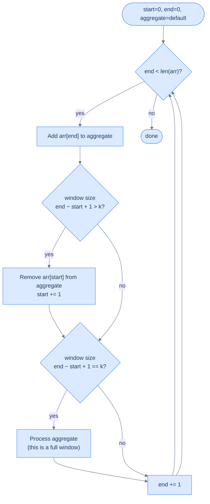
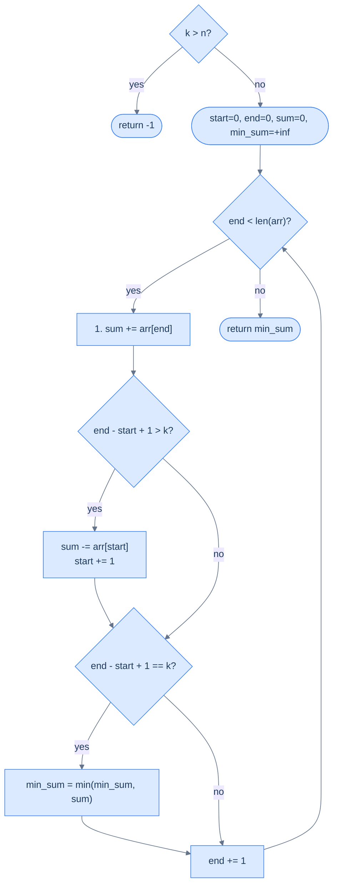
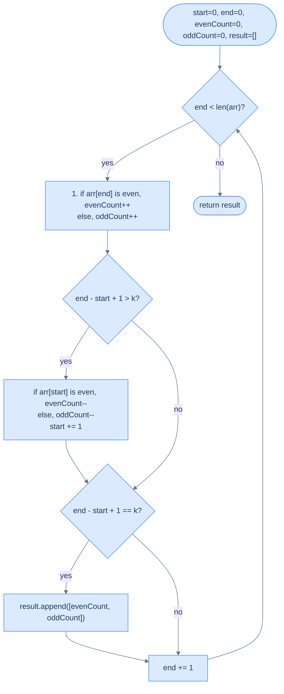

# 7. Pattern: Fixed sized sliding window

This section introduces fixed-size window problems where the window length stays constant while it slides across the array.

## Table of contents

1. [Understanding the fixed sized sliding window pattern](#understanding-the-fixed-sliding-window-pattern)
2. [Identifying the fixed sized sliding window pattern](#understanding-the-fixed-sliding-window-pattern)
3. [Subarray size equals K](#subarray-size-equals-k)
4. [Maximum ones](#maximum-ones)
5. [Negative window](#negative-window)
6. [Even odd count](#even-odd-count)

***

# Understanding the Fixed Sliding Window Pattern

## The Best Subarrays Always Move Together

Here's a deceptively simple question: given an array of numbers, what's the maximum sum of any 3 consecutive elements?

The obvious answer: try every possible window of size 3, sum each one, keep the largest. That's three passes through most of the array, just to produce each new sum.

But notice something. When you move the window one step to the right, the new window shares **two elements** with the old one. You recomputed those two elements from scratch — and you'll do the same thing 500,000 more times on a large array. You're recalculating the same data over and over.

What if you could slide the window forward in one subtraction and one addition?

---

## The Mental Model

Picture a train car moving along a track. The car has a fixed number of seats — say, four. As the train inches forward, one new passenger boards at the front door and one passenger exits at the back door. The total passenger count shifts by exactly those two people — you never need to recount every seat.

```d2
direction: right

arr: "Before slide" {
  grid-columns: 6
  grid-gap: 0
  a0: "2" {style.fill: "#fde68a"; style.stroke: "#d97706"}
  a1: "5" {style.fill: "#fde68a"; style.stroke: "#d97706"}
  a2: "1" {style.fill: "#fde68a"; style.stroke: "#d97706"}
  a3: "3" {style.fill: "#fde68a"; style.stroke: "#d97706"}
  a4: "7"
  a5: "4"
}

s: "▲ start = 0" {shape: oval; style.fill: "#fde68a"; style.stroke: "#d97706"}
e: "▲ end = 3" {shape: oval; style.fill: "#fde68a"; style.stroke: "#d97706"}

s -> arr.a0
e -> arr.a3
```

<p align="center"><strong>Window [2, 5, 1, 3] — <code>start=0</code>, <code>end=3</code>, sum = 11.</strong></p>

```d2
direction: right

arr: "After one slide" {
  grid-columns: 6
  grid-gap: 0
  a0: "2"
  a1: "5" {style.fill: "#fde68a"; style.stroke: "#d97706"}
  a2: "1" {style.fill: "#fde68a"; style.stroke: "#d97706"}
  a3: "3" {style.fill: "#fde68a"; style.stroke: "#d97706"}
  a4: "7" {style.fill: "#fde68a"; style.stroke: "#d97706"}
  a5: "4"
}

s: "▲ start = 1" {shape: oval; style.fill: "#fde68a"; style.stroke: "#d97706"}
e: "▲ end = 4" {shape: oval; style.fill: "#fde68a"; style.stroke: "#d97706"}

s -> arr.a1
e -> arr.a4
```

<p align="center"><strong>Slide right — subtract <code>arr[start]=2</code>, add <code>arr[new end]=7</code>. New sum = 11 − 2 + 7 = 16. No recount needed.</strong></p>

The key insight is the **incremental update**: instead of recomputing the aggregate from scratch each time, you maintain a running value and perform one removal and one addition per slide. Two pointer variables — `start` and `end` — mark the boundaries of the current window, and an `aggregate` variable holds the current result.

---

## What Makes a Function Slidable?

Not every aggregate function can use this trick. The whole point of sliding window is to avoid recomputing the window's result from scratch on every step — instead you **maintain** a running value by applying one cheap update. For that to work, the function must support two operations:

- An **addition operation** — cheaply include a new element as it enters the window from the right
- A **removal operation** — cheaply exclude an element as it exits the window from the left

"Cheaply" means O(1) per update. If either operation costs O(k) — proportional to the window size — you've lost the benefit entirely, because you'd be doing O(k) work per step across O(N) steps, which is exactly what brute force costs.

### Functions That Qualify

| Function | Add operation | Remove operation | Why it's O(1) |
|---|---|---|---|
| Sum | `aggregate += arr[end]` | `aggregate -= arr[start]` | Addition and subtraction are single arithmetic operations |
| Product | `aggregate *= arr[end]` | `aggregate //= arr[start]` | Multiplication and division are single arithmetic operations |
| Count of X | `aggregate += (arr[end] == X)` | `aggregate -= (arr[start] == X)` | A single comparison produces 0 or 1; no scan needed |
| Frequency map | `freq[arr[end]] += 1` | `freq[arr[start]] -= 1` | Hash map update at a single key is O(1) amortized |

Each of these works because the "contribution" of a single element to the aggregate can be added or removed in constant time, independently of all other elements in the window.

### Functions That Do Not Qualify — And Why

#### Median

The median is the middle value of a sorted sequence. To find it, the window's elements must be in sorted order.

**The problem:** when the window slides — one element leaves and one enters — you can't update a sorted structure in O(1). You have to re-sort, or use a balanced BST / two-heap structure to maintain order. Both cost O(log k) per update.

**Concretely:** window `[1, 3, 5, 7, 9]` (k=5), median = `5`. New window is `[3, 5, 7, 9, 2]`. The new element `2` needs to be inserted in the right sorted position, and `1` needs to be removed from it. With a plain sorted list, finding where `2` goes requires scanning up to k elements — O(k). You can't just "subtract 1 and add 2" to get the new median, because median depends on *relative rank*, not on a simple arithmetic formula.

**What breaks if you try it naively:** `median([1,3,5,7,9]) = 5`. Remove `1`, add `2` — naive arithmetic gives you no way to know the new median is `5` again. You must re-sort the window: O(k log k), not O(1).

**Can it still use a window structure?** Yes — with two heaps (a max-heap for the lower half and a min-heap for the upper half), you can maintain the median in O(log k) per slide. So a "sliding window median" is solvable in O(N log k), but it no longer uses the simple fixed-window template — it requires a more complex data structure.

---

#### Mode (Most Frequent Element)

The mode is the element that appears most often in the window.

**The problem:** tracking the mode requires knowing the frequency of *every* element in the window. When one element leaves, its frequency drops by one — and that might dethrone it as the mode. When a new element enters, it might become the new mode. You need to know the current maximum frequency at all times.

**Concretely:** window `[3, 1, 3, 2, 3]` (k=5), mode = `3` (appears 3 times). New window is `[1, 3, 2, 3, 3]` — `3` removed from left, another `3` added from right. Mode is still `3`. Easy case.

Now try: window `[3, 3, 3, 1, 2]`, mode = `3` (3 times). Slide to `[3, 3, 1, 2, 1]` — one `3` leaves, one `1` enters. Now `3` appears twice, `1` appears twice — it's a tie. Was `3` still mode? Or `1`? You can't know without scanning the full frequency map to find the current max.

**What breaks if you try it naively:** You can maintain a frequency map in O(1) per update (that part works). But finding *which element has the highest frequency* after each update requires scanning the entire frequency map — O(k) in the worst case. There's no O(1) way to track "which key currently has the maximum value" in a hash map as values change.

**Can it still be made efficient?** Partially. With a frequency map plus a separate "max frequency" counter, you can get O(1) *amortized* for some problems (like "longest subarray with at most one distinct element"), but the general mode-of-window problem cannot be solved with the simple template.

---

#### Maximum / Minimum

The maximum (or minimum) of a window seems simple — surely you can just track the current max?

**The problem:** when the *maximum element exits the window*, you have no way to know the new maximum without scanning the remaining k−1 elements. There's no arithmetic inverse for "remove a maximum from a set" the way there is for sum.

**Concretely:** window `[2, 8, 5, 3]`, max = `8`. Slide: `8` exits, `6` enters → new window `[5, 3, 6]`. What's the new max? You can't compute it from `8` alone — you have to look at all remaining elements. If the outgoing element was not the max, you're fine. But you never know in advance which slides will evict the max.

**What breaks if you try it naively:** keep a variable `current_max`. When `arr[end]` enters, update `current_max = max(current_max, arr[end])` — easy. When `arr[start]` exits: if `arr[start] != current_max`, do nothing. But if `arr[start] == current_max`, you now have to scan the entire window to find the new max — O(k) per such step.

In a worst-case array like `[9, 8, 7, 6, 5, 4, 3, 2, 1]`, the max exits on every single slide, meaning every step triggers a full O(k) scan — total cost O(N × k), same as brute force.

**Can it still use a window structure?** Yes — a **monotonic deque** (a double-ended queue that maintains elements in decreasing order) gives you O(1) amortized max/min per slide. This is a classic technique, but it's a different and more complex data structure than the simple `aggregate` variable in the basic template. The `f_remove` operation is no longer a single arithmetic step.

---

### The Core Rule

The dividing line is this: a function is O(1)-slidable if and only if **the contribution of a single element to the aggregate can be undone in constant time, regardless of what other elements are in the window**.

- Sum: contribution of element `x` is exactly `x` — trivially undone by `aggregate -= x`.
- Product: contribution is exactly `x` — undone by `aggregate /= x` (with a caveat for zeros).
- Max: contribution of element `x` depends on whether it's larger than all others — that relationship cannot be expressed independently of the rest of the window.
- Median: contribution of element `x` depends on its *rank* among all other elements — inherently relational, not independent.

If removing one element forces you to look at other elements to restore the aggregate, the function is not O(1)-slidable with a plain variable.

---

## The Mechanics — Step by Step

Let's make this concrete. You have an array and a window size `k`. You want to evaluate some function `f` over every subarray of size exactly `k`.

Here's how the window moves:



<p align="center"><strong>Fixed sliding window flow — <code>end</code> expands the window each iteration; once window exceeds <code>k</code>, <code>start</code> contracts it from the left; once window equals <code>k</code>, process the aggregate.</strong></p>

Notice the design: `end` always moves forward every iteration, so the total number of iterations is exactly `n`. `start` only moves when the window would exceed `k`. Every element is added exactly once and removed at most once — that's what gives you O(n).

---

## The Algorithm

The generic fixed-sized sliding window algorithm is given below. It uses two variables `start` and `end` to maintain the window boundaries and a variable `aggregate` that always holds the result of function `f` computed over the current window `arr[start..end]`.

> **Step 1:** Initialize two variables, `start` and `end` to 0.
>
> **Step 2:** Create a variable `aggregate` to store the aggregated value of a window and initialize it to some default value dictated by the problem.
>
> **Step 3:** Loop while `end` < `arr.size()` and do the following:
>
> - **Step 3.1:** Add the contribution of `arr[end]` to `aggregate`
>
> - **Step 3.2:** If the size of the current window (`end` − `start` + 1) is greater than `k`, remove the contribution of `arr[start]` from `aggregate` and increment `start` by 1
>
> - **Step 3.3:** If the size of the current window (`end` − `start` + 1) equals `k`, process `aggregate`
>
> - **Step 3.4:** Increment `end` by 1

The order of steps 3.1 → 3.2 → 3.3 → 3.4 is not arbitrary — it is the only correct ordering. Here's why each position matters:

- **Step 3.1 must come first:** `arr[end]` must be added to `aggregate` before any size checks, because the size check in Step 3.2 determines whether this newly-added element pushed the window past `k`.
- **Step 3.2 must come before 3.3:** If you process before trimming, you may process a window that is one element too large. The window must be trimmed to exactly `k` before being evaluated.
- **Step 3.4 must come last:** `end` is incremented after all processing. If you increment first, you'd process the wrong index.

Three things to supply when solving a specific problem:
1. **`f_add`** — how to include `arr[end]` (e.g. `aggregate += arr[end]` for sum)
2. **`f_remove`** — how to exclude `arr[start]` (e.g. `aggregate -= arr[start]` for sum)
3. **`process`** — what to do with the window's aggregate (e.g. record max, check condition)

---

## A Concrete Walkthrough — Window of Size 4

Array: `[2, 5, 1, 3, 7, 4]`, window size `k = 4`, function `f` = sum.

```d3 widget=array-traversal
{
  "items": ["2", "5", "1", "3", "7", "4"],
  "title": "Fixed sliding window of size k = 4 on [2, 5, 1, 3, 7, 4]",
  "steps": [
    { "markers": [{"name": "start", "index": 0, "color": "#3b82f6"}, {"name": "end", "index": 0, "color": "#f59e0b"}], "range": {"lo": 0, "hi": 0}, "msg": "end=0 — add arr[0]=2 → window=[2], size 1 < 4 → skip process." },
    { "markers": [{"name": "start", "index": 0, "color": "#3b82f6"}, {"name": "end", "index": 1, "color": "#f59e0b"}], "range": {"lo": 0, "hi": 1}, "msg": "end=1 — add arr[1]=5 → window=[2, 5], size 2 < 4 → skip process." },
    { "markers": [{"name": "start", "index": 0, "color": "#3b82f6"}, {"name": "end", "index": 2, "color": "#f59e0b"}], "range": {"lo": 0, "hi": 2}, "msg": "end=2 — add arr[2]=1 → window=[2, 5, 1], size 3 < 4 → skip process." },
    { "markers": [{"name": "start", "index": 0, "color": "#3b82f6"}, {"name": "end", "index": 3, "color": "#f59e0b"}], "range": {"lo": 0, "hi": 3}, "msg": "end=3 — add arr[3]=3 → window=[2, 5, 1, 3], size = k → process sum = 11." },
    { "markers": [{"name": "start", "index": 1, "color": "#3b82f6"}, {"name": "end", "index": 4, "color": "#f59e0b"}], "range": {"lo": 1, "hi": 4}, "msg": "end=4 — add 7 → size 5 > 4 → remove arr[0]=2, start=1 → window=[5, 1, 3, 7] → process sum = 16." },
    { "markers": [{"name": "start", "index": 2, "color": "#3b82f6"}, {"name": "end", "index": 5, "color": "#f59e0b"}], "range": {"lo": 2, "hi": 5}, "msg": "end=5 — add 4 → size 5 > 4 → remove arr[1]=5, start=2 → window=[1, 3, 7, 4] → process sum = 15." }
  ]
}
```

<p align="center"><strong>Complete execution on <code>[2, 5, 1, 3, 7, 4]</code> with <code>k=4</code>. Three windows of size 4 are processed: sums 11, 16, 15. Each window is derived from the previous with one subtraction and one addition.</strong></p>

Sums computed: `11, 16, 15`. The maximum is `16` (window `[5, 1, 3, 7]`). And you never recounted the middle elements.

---

## Implementation

Given below is the generic code implementation of the fixed-sized sliding window technique. It maps directly to the four steps in the algorithm above — Step 3.1 (add), Step 3.2 (trim if oversized), Step 3.3 (process if full), Step 3.4 (advance `end`):


```python run
from typing import List

def f_add(agg, x): return agg + x
def f_remove(agg, x): return agg - x
def process(agg): pass

def fixed_size_sliding_window(arr: List[int], k: int) -> None:
    start = end = 0
    aggregate = 0

    while end < len(arr):
        aggregate = f_add(aggregate, arr[end])             # Step 3.1: extend right.

        if end - start + 1 > k:                            # Step 3.2: trim oversize.
            aggregate = f_remove(aggregate, arr[start])
            start += 1

        if end - start + 1 == k:                           # Step 3.3: process full window.
            process(aggregate)

        end += 1                                           # Step 3.4: advance right.
```

```java run
public class Main {
    static int fAdd(int agg, int x)    { return agg + x; }
    static int fRemove(int agg, int x) { return agg - x; }
    static void process(int agg)       { /* problem-specific */ }

    static void fixedSizeSlidingWindow(int[] arr, int k) {
        int start = 0, end = 0, aggregate = 0;
        while (end < arr.length) {
            aggregate = fAdd(aggregate, arr[end]);

            if (end - start + 1 > k) {
                aggregate = fRemove(aggregate, arr[start]);
                start++;
            }

            if (end - start + 1 == k) process(aggregate);

            end++;
        }
    }

    public static void main(String[] args) {
        fixedSizeSlidingWindow(new int[]{1, 2, 3, 4, 5}, 3);
        System.out.println("Template ran.");
    }
}
```


---

## Complexity

| | Time | Space |
|---|---|---|
| Best and worst case | O(N) | O(1) |

**Why O(N):** `end` sweeps from `0` to `N-1` — exactly N iterations. `start` only moves forward and can never pass `end`. Every element is added once and removed once. Total work: 2N → O(N). This holds as long as `f_add` and `f_remove` are O(1) operations.

**Why O(1):** No new data structure grows with input size. Only `start`, `end`, and `aggregate` are used regardless of array length.

**Brute force comparison:** A naive nested loop recomputes the sum of every window from scratch — that's O(k) work per window, and there are O(N) windows, giving O(N × k). For `k = 1000` and `N = 1,000,000`, the difference between O(N) and O(N × k) is the difference between milliseconds and minutes.

---

Later in the course, you'll see specific problems where the aggregate is a sum, a character frequency map, and a count of distinct elements — each one plugging different `f_add` / `f_remove` logic into this same template while the structure stays identical.

***

# Identifying the Fixed Sliding Window Pattern

## The Diagnostic Questions

| Question | What it tests |
|---|---|
| **Q1.** Does the problem ask for a value computed over all (or the best) subarray of a **fixed** size k? | Confirms the window size never needs to grow or shrink — it's always exactly k |
| **Q2.** Can the aggregate update in O(1) when one element enters and one leaves? | Confirms the O(N) sliding window is achievable — not just O(N × k) |

If yes to both, you have a fixed sliding window problem.

---

## The Example: Maximum Average Subarray

**Problem:** Given an array `arr` and an integer `k`, find the maximum average of any contiguous subarray of size exactly `k`.

```
arr = [1, 12, -5, -6, 50, 3],  k = 4

Subarrays of size 4:
  [1,  12, -5, -6]  →  sum =  2,  avg = 0.50
  [12, -5, -6, 50]  →  sum = 51,  avg = 12.75  ← maximum
  [-5, -6, 50,  3]  →  sum = 42,  avg = 10.50

Answer: 12.75
```

```d2
direction: right

w1: "Window 1: [1, 12, -5, -6]  avg = 0.50" {
  grid-columns: 6
  grid-gap: 0
  a0: "1" {style.fill: "#fde68a"; style.stroke: "#d97706"}
  a1: "12" {style.fill: "#fde68a"; style.stroke: "#d97706"}
  a2: "-5" {style.fill: "#fde68a"; style.stroke: "#d97706"}
  a3: "-6" {style.fill: "#fde68a"; style.stroke: "#d97706"}
  a4: "50"
  a5: "3"
}

w2: "Window 2: [12, -5, -6, 50]  avg = 12.75 ★" {
  grid-columns: 6
  grid-gap: 0
  b0: "1 ✗" {style.fill: "#f1f5f9"; style.stroke: "#94a3b8"}
  b1: "12" {style.fill: "#dcfce7"; style.stroke: "#16a34a"}
  b2: "-5" {style.fill: "#dcfce7"; style.stroke: "#16a34a"}
  b3: "-6" {style.fill: "#dcfce7"; style.stroke: "#16a34a"}
  b4: "50" {style.fill: "#dcfce7"; style.stroke: "#16a34a"}
  b5: "3"
}

w3: "Window 3: [-5, -6, 50, 3]  avg = 10.50" {
  grid-columns: 6
  grid-gap: 0
  c0: "1 ✗" {style.fill: "#f1f5f9"; style.stroke: "#94a3b8"}
  c1: "12 ✗" {style.fill: "#f1f5f9"; style.stroke: "#94a3b8"}
  c2: "-5" {style.fill: "#fde68a"; style.stroke: "#d97706"}
  c3: "-6" {style.fill: "#fde68a"; style.stroke: "#d97706"}
  c4: "50" {style.fill: "#fde68a"; style.stroke: "#d97706"}
  c5: "3" {style.fill: "#fde68a"; style.stroke: "#d97706"}
}

w1 -> w2: "remove 1, add 50"
w2 -> w3: "remove 12, add 3"
```

<p align="center"><strong>Three windows of size k=4 slide through the array. Each slide removes one element from the left and adds one from the right — the sum updates in O(1) each time.</strong></p>

```d3 widget=array-traversal
{
  "items": ["1", "12", "-5", "-6", "50", "3"],
  "title": "Maximum average subarray on [1, 12, -5, -6, 50, 3], k = 4",
  "steps": [
    { "markers": [{"name": "start", "index": 0, "color": "#3b82f6"}, {"name": "end", "index": 0, "color": "#f59e0b"}], "range": {"lo": 0, "hi": 0}, "msg": "end=0 — add 1 → sum = 1, window=[1], size 1 < 4." },
    { "markers": [{"name": "start", "index": 0, "color": "#3b82f6"}, {"name": "end", "index": 1, "color": "#f59e0b"}], "range": {"lo": 0, "hi": 1}, "msg": "end=1 — add 12 → sum = 13, window=[1, 12], size 2 < 4." },
    { "markers": [{"name": "start", "index": 0, "color": "#3b82f6"}, {"name": "end", "index": 2, "color": "#f59e0b"}], "range": {"lo": 0, "hi": 2}, "msg": "end=2 — add −5 → sum = 8, window=[1, 12, −5], size 3 < 4." },
    { "markers": [{"name": "start", "index": 0, "color": "#3b82f6"}, {"name": "end", "index": 3, "color": "#f59e0b"}], "range": {"lo": 0, "hi": 3}, "msg": "end=3 — add −6 → sum = 2, window=[1, 12, −5, −6] → avg = 0.50; maxAvg = 0.50." },
    { "markers": [{"name": "start", "index": 1, "color": "#3b82f6"}, {"name": "end", "index": 4, "color": "#f59e0b"}], "range": {"lo": 1, "hi": 4}, "msg": "end=4 — add 50, remove arr[0]=1 → sum = 51, window=[12, −5, −6, 50] → avg = 12.75; maxAvg = 12.75 ★." },
    { "markers": [{"name": "start", "index": 2, "color": "#3b82f6"}, {"name": "end", "index": 5, "color": "#f59e0b"}], "range": {"lo": 2, "hi": 5}, "msg": "end=5 — add 3, remove arr[1]=12 → sum = 42, window=[−5, −6, 50, 3] → avg = 10.50; maxAvg stays 12.75 → answer: 12.75." }
  ]
}
```

---

## Applying the Diagnostic Questions

| Question | Answer |
|---|---|
| **Q1.** Fixed size subarray? | **Yes** — exactly k=4 elements, every time. The window never grows or shrinks to satisfy a condition |
| **Q2.** O(1) add and remove? | **Yes** — `sum += arr[end]` to add, `sum -= arr[start]` to remove. Both are O(1) arithmetic |

---

### Q1 — Why "fixed size" matters here?

**WHAT:** The problem asks for the maximum average over subarrays of size *exactly* k. The window size is a fixed constraint, not a goal to satisfy. Every valid subarray has the same size.

**WHY "fixed" is the key qualifier:** A fixed window never needs logic to decide whether to grow or shrink based on a condition. You just slide it. This is what separates fixed sliding window from variable sliding window — in the variable version, the window size changes dynamically to satisfy a condition (e.g., "smallest subarray with sum ≥ target"). Here, the size is always k. No condition checking needed to adjust the window.

**Concrete check:** With `k=4` and `n=6`, there are exactly `n − k + 1 = 3` valid windows. Each has exactly 4 elements. The brute force computes the sum of 4 elements, 3 times — that's 12 additions. The sliding window computes the initial window once (4 additions) and then 2 slides (2 additions + 2 subtractions = 4 more operations) — 8 total. As k grows, this advantage compounds dramatically.

**What breaks if you use variable sliding window logic here:** A variable window expands and contracts based on whether a condition is satisfied. With a fixed target size, there's no condition to check — every window of size k is valid. Using variable logic would add unnecessary complexity without any benefit.

---

### Q2 — Why "O(1) add and remove" is required?

**WHAT:** When the window slides right by 1:
- `arr[end]` enters the window → `sum += arr[end]`
- `arr[start]` leaves the window → `sum -= arr[start]`

Both operations are O(1) arithmetic on a single variable.

**WHY this is the condition that makes sliding window faster than brute force:** Brute force recomputes the sum of k elements from scratch for every window — O(k) per window, O(N × k) total. Sliding window reuses the previous sum and updates it in O(1) — O(N) total. The update must be O(1), or the sliding window gains nothing over brute force.

**What doesn't have O(1) remove:** "Maximum element in window" — when the maximum element leaves the window, you need to find the new maximum from the remaining k−1 elements. That's O(k), not O(1). Fixed sliding window doesn't apply; you'd need a monotonic deque instead. "Sum of squares" could be O(1) (`+= end²`, `-= start²`), so it does apply. Always verify both add AND remove are O(1) before using this pattern.

---

## Brute Force: Nested Loops, O(N × k)

Fix a starting index `i`, compute the sum of `k` elements starting there, check if it beats the current max:


```python run
from typing import List

def k_subarray_max_average_brute(arr: List[int], k: int) -> float:
    n = len(arr)
    max_average = float('-inf')

    for i in range(n - k + 1):
        current_sum = 0
        # Inner loop recomputes arr[i+1..i+k-1] each time — the O(n*k) cost.
        for j in range(k):
            current_sum += arr[i + j]
        max_average = max(max_average, current_sum / k)
    return max_average

print(k_subarray_max_average_brute([1, 12, -5, -6, 50, 3], 4))  # 12.75
```

```java run
public class Main {
    static double kSubarrayMaxAverageBrute(int[] arr, int k) {
        int n = arr.length;
        double maxAverage = Double.NEGATIVE_INFINITY;
        for (int i = 0; i <= n - k; i++) {
            double currentSum = 0;
            for (int j = 0; j < k; j++) currentSum += arr[i + j];
            maxAverage = Math.max(maxAverage, currentSum / k);
        }
        return maxAverage;
    }

    public static void main(String[] args) {
        System.out.println(kSubarrayMaxAverageBrute(new int[]{1, 12, -5, -6, 50, 3}, 4));
    }
}
```


<details>
<summary><strong>Trace — arr = [1, 12, -5, -6, 50, 3],  k = 4  (brute force)</strong></summary>

```
n=6,  valid starting positions: i = 0, 1, 2  (n - k + 1 = 3)

i=0: j=0..3 → 1 + 12 + (-5) + (-6) = 2    → avg = 0.50   max_avg = 0.50
i=1: j=0..3 → 12 + (-5) + (-6) + 50 = 51  → avg = 12.75  max_avg = 12.75
              Note: 12, -5, -6 were already summed in i=0 — recomputed here
i=2: j=0..3 → (-5) + (-6) + 50 + 3 = 42   → avg = 10.50  max_avg = 12.75
              Note: -5, -6, 50 were already summed in i=1 — recomputed again

Return: 12.75 ✓

Total additions: 3 windows × 4 elements = 12 additions
Sliding window would do: 4 (initial) + 2×2 (slides) = 8 operations
```

</details>

---

## Fixed Sliding Window Solution: One Pass, O(N)

We apply the fixed sliding window algorithm directly. We initialise `start = 0`, `end = 0`, and a running `window_sum = 0`. In each iteration we follow the four steps:

- **Step 3.1:** Add `arr[end]` to `window_sum`
- **Step 3.2:** If window size exceeds `k`, remove `arr[start]` and advance `start`
- **Step 3.3:** If window size equals `k`, evaluate the average against `max_average`
- **Step 3.4:** Advance `end`


```python run
from typing import List

class Solution:
    def k_subarray_average(self, arr: List[int], k: int) -> float:
        n = len(arr)

        # to store the starting index of the subarray
        start: int = 0

        # to store the ending index of the subarray
        end: int = 0

        # to store the current subarray sum
        sum: int = 0

        # to store the maximum average
        max_average = float("-inf")

        # loop through the array
        while end < n:

            # add the current element to the current subarray sum
            sum += arr[end]

            # if the current subarray has more than k elements
            # then remove elements from the start of the subarray till
            # the subarray has exactly k elements
            if end - start + 1 > k:

                # remove the first element from the subarray
                sum -= arr[start]

                # move the start pointer forward
                start += 1

            # if the current subarray has exactly k elements
            # then calculate the average and update the maximum average
            if end - start + 1 == k:

                # calculate the average and update the maximum average
                max_average = max(max_average, sum / k)

            # move the end pointer forward
            end += 1

        return max_average


sol = Solution()
print(sol.k_subarray_average([1, 12, -5, -6, 50, 3], 4))   # 12.75
```

```java run
public class Main {
    static class Solution {
        public double kSubarrayAverage(int[] arr, int k) {
            int n = arr.length;

            // to store the starting index of the subarray
            int start = 0;

            // to store the ending index of the subarray
            int end = 0;

            // to store the current subarray sum
            int sum = 0;

            // to store the maximum average
            double maxAverage = Double.NEGATIVE_INFINITY;

            // loop through the array
            while (end < n) {

                // add the current element to the current subarray sum
                sum += arr[end];

                // if the current subarray has more than k elements
                // then remove elements from the start of the subarray till
                // the subarray has exactly k elements
                if (end - start + 1 > k) {

                    // remove the first element from the subarray
                    sum -= arr[start];

                    // move the start pointer forward
                    start++;
                }

                // if the current subarray has exactly k elements
                // then calculate the average and update the maximum average
                if (end - start + 1 == k) {

                    // calculate the average and update the maximum average
                    maxAverage = Math.max(maxAverage, (double) sum / k);
                }

                // move the end pointer forward
                end++;
            }

            return maxAverage;
        }
    }

    public static void main(String[] args) {
        Solution sol = new Solution();
        System.out.println(sol.kSubarrayAverage(new int[]{1, 12, -5, -6, 50, 3}, 4));   // 12.75
    }
}
```


<details>
<summary><strong>Trace — arr = [1, 12, -5, -6, 50, 3],  k = 4  (sliding window)</strong></summary>

```
start=0, end=0, window_sum=0, max_average=-inf

end=0: window_sum += arr[0]=1  → sum=1.  size=1, not k=4.
end=1: window_sum += arr[1]=12 → sum=13. size=2.
end=2: window_sum += arr[2]=-5 → sum=8.  size=3.
end=3: window_sum += arr[3]=-6 → sum=2.  size=4 == k → avg=2/4=0.50.   max_avg=0.50.
end=4: window_sum += arr[4]=50 → sum=52. size=5 > k → remove arr[0]=1: sum=51, start=1.
       size=4 == k → avg=51/4=12.75. max_avg=12.75.
end=5: window_sum += arr[5]=3  → sum=54. size=5 > k → remove arr[1]=12: sum=42, start=2.
       size=4 == k → avg=42/4=10.50. max_avg=12.75.
end=6: end >= n=6 → loop exits.

Return: 12.75 ✓

Total operations: 6 adds + 2 removes = 8 (vs 12 for brute force on this input)
Every element added exactly once, removed at most once.
```

</details>

---

## Problems in This Category

| Problem | Aggregate | Add operation | Remove operation |
|---|---|---|---|
| **Maximum Average Subarray** | Sum (then ÷ k) | `sum += arr[end]` | `sum -= arr[start]` |
| **Subarray of Size k** | Count / sum | `sum += arr[end]` | `sum -= arr[start]` |
| **Maximum Ones** | Count of 1s | `+= 1 if arr[end]==1` | `-= 1 if arr[start]==1` |
| **Negative Window** | Count of negatives | `+= 1 if arr[end]<0` | `-= 1 if arr[start]<0` |
| **Even/Odd Count** | Count of evens or odds | `+= 1 if even` | `-= 1 if even` |

All follow the same template — the only thing that changes is the add and remove logic in steps ① and ②.

***

# Subarray Size Equals K

## The Problem

Given an integer array `arr` and a positive integer `k`, find the **minimum sum** among all contiguous subarrays of size exactly `k`. If no such subarray exists (i.e. `k > len(arr)`), return `-1` instead.

```
arr = [4, 4, 5, 6, 4], k = 3   →  13   (subarray [4, 4, 5])
arr = [1, 2, 3, 5],    k = 1   →   1   (subarray [1])
arr = [1, 2, 3, 5],    k = 4   →  11   (only one subarray: [1, 2, 3, 5])
arr = [1, 2],          k = 5   →  -1   (no size-5 subarray exists)
```

---

<details>
<summary><h2>Examples</h2></summary>


**Example 1**
```
Input:  arr = [4, 4, 5, 6, 4], k = 3
Output: 13
Explanation: The subarray [4, 4, 5] has a minimum sum of 13 and a size of 3.
```

**Example 2**
```
Input:  arr = [1, 2, 3, 5], k = 1
Output: 1
Explanation: The subarray [1] has a minimum sum of 1 and a size of 1.
```

**Example 3**
```
Input:  arr = [1, 2, 3, 5], k = 4
Output: 11
Explanation: The subarray [1, 2, 3, 5] has a minimum sum of 11 and a size of 4.
```

</details>
<details>
<summary><h2>Intuition &amp; Brute Force</h2></summary>

### Intuition

There are exactly `n − k + 1` contiguous subarrays of size `k` in an array of length `n`. The brute force sums each one from scratch — recomputing `k − 1` shared elements every time the window slides — and tracks the running minimum.

The fixed sliding window does the same in one pass: maintain a running `sum`. When the window slides right by one step, **add the new element entering on the right** and **subtract the element leaving on the left**. One addition + one subtraction replaces the entire inner sum.

Whenever the window has exactly `k` elements, compare its current sum against the running `min_sum` and update if smaller.



<p align="center"><strong>Subarray Size Equals K — expand the window, contract if oversized, then update <code>min_sum</code> whenever the window reaches exactly size k.</strong></p>

### Brute Force: Nested Loops, O(N × k)

```python run
from typing import List

def subarray_size_equals_k_brute(arr: List[int], k: int) -> int:
    n = len(arr)
    if k > n:
        return -1
    min_sum = float("inf")
    for i in range(n - k + 1):
        window_sum = 0
        for j in range(k):
            window_sum += arr[i + j]    # Re-summed each window — that's the O(n*k) cost.
        if window_sum < min_sum:
            min_sum = window_sum
    return min_sum


print(subarray_size_equals_k_brute([4, 4, 5, 6, 4], 3))  # 13
print(subarray_size_equals_k_brute([1, 2, 3, 5], 1))     # 1
```

```java run
public class Main {
    static int subarraySizeEqualsKBrute(int[] arr, int k) {
        int n = arr.length;
        if (k > n) return -1;
        int minSum = Integer.MAX_VALUE;
        for (int i = 0; i <= n - k; i++) {
            int windowSum = 0;
            for (int j = 0; j < k; j++) windowSum += arr[i + j];
            if (windowSum < minSum) minSum = windowSum;
        }
        return minSum;
    }

    public static void main(String[] args) {
        System.out.println(subarraySizeEqualsKBrute(new int[]{4, 4, 5, 6, 4}, 3));  // 13
        System.out.println(subarraySizeEqualsKBrute(new int[]{1, 2, 3, 5}, 1));     // 1
    }
}
```


<details>
<summary><strong>Trace — arr = [4, 4, 5, 6, 4],  k = 3  (brute force)</strong></summary>

```
n=5, valid windows: i = 0, 1, 2  (n - k + 1 = 3)

i=0: 4+4+5 = 13            min_sum = 13   (initial)
i=1: 4+5+6 = 15            min_sum = 13   (4 and 5 re-summed from i=0)
i=2: 5+6+4 = 15            min_sum = 13   (5 and 6 re-summed from i=1)

Return: 13 ✓  —  total additions: 9 (3 windows × 3 elements each)
```

</details>

</details>
<details>
<summary><h2>Solution &amp; Analysis</h2></summary>

### Solution

```python run
from typing import List

class Solution:
    def subarray_size_equals_k(self, arr: List[int], k: int) -> int:

        # Edge case: If k is greater than the array size, return -1.
        if k > len(arr):
            return -1

        # To store the starting index of the subarray
        start: int = 0

        # To store the ending index of the subarray
        end: int = 0

        # To store the current subarray sum
        sum: int = 0

        # We want to find the minimum sum.
        min_sum = float("inf")

        # Sliding window to process all subarrays of size k
        while end < len(arr):

            # Add contribution of arr[end] to the current window sum
            sum += arr[end]

            # If the current subarray has more than k elements
            # then remove elements from the start of the subarray till
            # the subarray has exactly k elements
            if end - start + 1 > k:

                # Remove contribution of arr[start] as the window is now
                # too large
                sum -= arr[start]

                # Contract the window from the left
                start += 1

            # Check if the window size is exactly k
            if end - start + 1 == k:

                # Update the minimum sum
                min_sum = min(min_sum, sum)

            # Expand the window from the right
            end += 1

        return min_sum


# Examples from the problem statement
print(Solution().subarray_size_equals_k([4, 4, 5, 6, 4], 3))   # 13
print(Solution().subarray_size_equals_k([1, 2, 3, 5], 1))       # 1
print(Solution().subarray_size_equals_k([1, 2, 3, 5], 4))       # 11

# Edge cases
print(Solution().subarray_size_equals_k([5], 1))                 # 5  — single element
print(Solution().subarray_size_equals_k([3, 1], 2))              # 4  — two elements
print(Solution().subarray_size_equals_k([2, 2, 2], 3))           # 6  — all same
print(Solution().subarray_size_equals_k([10, 1, 2], 5))          # -1 — k > length
print(Solution().subarray_size_equals_k([-1, -2, -3, -4], 2))   # -7 — negatives
```

```java run
public class Main {
    static class Solution {
        public int subarraySizeEqualsK(int[] arr, int k) {

            // Edge case: If k is greater than the array size, return -1.
            if (k > arr.length) {
                return -1;
            }

            // To store the starting index of the subarray
            int start = 0;

            // To store the ending index of the subarray
            int end = 0;

            // To store the current subarray sum
            int sum = 0;

            // We want to find the minimum sum.
            int minSum = Integer.MAX_VALUE;

            // Sliding window to process all subarrays of size k
            while (end < arr.length) {

                // Add contribution of arr[end] to the current window sum
                sum += arr[end];

                // If the current subarray has more than k elements
                // then remove elements from the start of the subarray till
                // the subarray has exactly k elements
                if (end - start + 1 > k) {

                    // Remove contribution of arr[start] as the window is now
                    // too large
                    sum -= arr[start];

                    // Contract the window from the left
                    start++;
                }

                // Check if the window size is exactly k
                if (end - start + 1 == k) {

                    // Update the minimum sum
                    minSum = Math.min(minSum, sum);
                }

                // Expand the window from the right
                end++;
            }

            return minSum;
        }
    }

    public static void main(String[] args) {
        // Examples from the problem statement
        System.out.println(new Solution().subarraySizeEqualsK(new int[]{4, 4, 5, 6, 4}, 3));   // 13
        System.out.println(new Solution().subarraySizeEqualsK(new int[]{1, 2, 3, 5}, 1));       // 1
        System.out.println(new Solution().subarraySizeEqualsK(new int[]{1, 2, 3, 5}, 4));       // 11

        // Edge cases
        System.out.println(new Solution().subarraySizeEqualsK(new int[]{5}, 1));                 // 5  — single element
        System.out.println(new Solution().subarraySizeEqualsK(new int[]{3, 1}, 2));              // 4  — two elements
        System.out.println(new Solution().subarraySizeEqualsK(new int[]{2, 2, 2}, 3));           // 6  — all same
        System.out.println(new Solution().subarraySizeEqualsK(new int[]{10, 1, 2}, 5));          // -1 — k > length
        System.out.println(new Solution().subarraySizeEqualsK(new int[]{-1, -2, -3, -4}, 2));   // -7 — negatives
    }
}
```

### Dry Run — Example 1

`arr = [4, 4, 5, 6, 4]`, `k = 3`

```d3 widget=array-traversal
{
  "items": ["4", "4", "5", "6", "4"],
  "title": "Fixed sliding window k = 3 on [4, 4, 5, 6, 4] — finding min sum",
  "steps": [
    {
      "keys":    ["a", "b", "c", "d", "e"],
      "markers": [
        { "name": "start", "index": 0, "color": "#3b82f6" },
        { "name": "end",   "index": 0, "color": "#10b981" }
      ],
      "range":   { "lo": 0, "hi": 0 },
      "msg": "Expand: window = [0..0], size 1 < k. sum = 4."
    },
    {
      "keys":    ["a", "b", "c", "d", "e"],
      "markers": [
        { "name": "start", "index": 0, "color": "#3b82f6" },
        { "name": "end",   "index": 1, "color": "#10b981" }
      ],
      "range":   { "lo": 0, "hi": 1 },
      "msg": "Expand: window = [0..1], size 2 < k. sum = 8."
    },
    {
      "keys":    ["a", "b", "c", "d", "e"],
      "markers": [
        { "name": "start", "index": 0, "color": "#3b82f6" },
        { "name": "end",   "index": 2, "color": "#10b981" }
      ],
      "range":   { "lo": 0, "hi": 2 },
      "msg": "Expand: window = [0..2], size 3 = k. sum = 13 → min_sum = 13."
    },
    {
      "keys":    ["a", "b", "c", "d", "e"],
      "markers": [
        { "name": "start", "index": 1, "color": "#3b82f6" },
        { "name": "end",   "index": 3, "color": "#10b981" }
      ],
      "range":   { "lo": 1, "hi": 3 },
      "msg": "Slide: drop arr[0]=4, add arr[3]=6. sum = 15. 15 > 13, min_sum stays 13."
    },
    {
      "keys":    ["a", "b", "c", "d", "e"],
      "markers": [
        { "name": "start", "index": 2, "color": "#3b82f6" },
        { "name": "end",   "index": 4, "color": "#10b981" }
      ],
      "range":   { "lo": 2, "hi": 4 },
      "msg": "Slide: drop arr[1]=4, add arr[4]=4. sum = 15. 15 > 13, min_sum stays 13."
    },
    {
      "keys":    ["a", "b", "c", "d", "e"],
      "markers": [],
      "msg": "end past array bound — loop ends. Return min_sum = 13."
    }
  ]
}
```

<details>
<summary><strong>Trace — arr = [4, 4, 5, 6, 4],  k = 3</strong></summary>

```
start=0, end=0, sum=0, min_sum=∞

end=0: ① sum += arr[0]=4 → sum=4.  size=1 < k.
end=1: ① sum += arr[1]=4 → sum=8.  size=2 < k.
end=2: ① sum += arr[2]=5 → sum=13. size=3 = k → min_sum = 13.
end=3: ① sum += arr[3]=6 → sum=19. ② size=4 > k → sum -= arr[0]=4 → sum=15, start=1.
       ③ size=3 = k → min_sum = min(13, 15) = 13.
end=4: ① sum += arr[4]=4 → sum=19. ② size=4 > k → sum -= arr[1]=4 → sum=15, start=2.
       ③ size=3 = k → min_sum = min(13, 15) = 13.
end=5: end >= n=5 → loop exits.

Return: 13 ✓
```

</details>

### Complexity Analysis

| | Complexity | Reasoning |
|---|---|---|
| **Time** | O(N) | `end` visits each element once; `start` moves at most N times across all iterations |
| **Space** | O(1) | Two index variables, one running sum, one min_sum |

Versus brute force O(N × k) — the sliding window replaces the inner loop of k additions with one add + one subtract per slide.

### Edge Cases

| Scenario | Input | Output | Note |
|---|---|---|---|
| `k > n` | `[1, 2]`, k=5 | `-1` | No window of size k fits — return sentinel |
| `k == n` | `[1, 2, 3]`, k=3 | `6` | Only one window: the whole array |
| `k == 1` | `[3, 1, 4, 1, 5]`, k=1 | `1` | Each element is its own window — answer is `min(arr)` |
| All identical | `[5, 5, 5, 5]`, k=2 | `10` | Every window sums to the same value |
| Negative elements | `[-1, 2, -1, 2]`, k=2 | `1` | Works identically — smallest pair is `(-1, 2)` or `(2, -1)`, both sum to 1 |
| Single element | `[5]`, k=1 | `5` | One window, one element |

</details>
<details>
<summary><h2>Key Takeaway</h2></summary>


Subarray Size Equals K is the simplest fixed sliding window problem: maintain a running sum, add on expand, subtract on contract, take the minimum on full size. The time drops from O(N × k) to O(N) because the shared elements between adjacent windows are updated in O(1) instead of recomputed. The `k > n` guard is the only edge that needs explicit handling — every other case falls out of the loop body.

</details>

***

# Maximum Ones

## The Problem

Given a **binary** array `arr` (containing only `0`s and `1`s) and a positive integer `k`, find the **maximum number of `1`s** among all subarrays of size `k`.

```
arr = [1, 1, 1, 0, 1, 0, 0, 1, 1, 1, 0],  k = 5  →  4
arr = [1, 1, 0, 1, 0, 1, 1, 0, 1, 0],     k = 4  →  3
arr = [0, 0, 0],                          k = 2  →  0
```

---

<details>
<summary><h2>Examples</h2></summary>


**Example 1**
```
Input:  arr = [1, 1, 1, 0, 1, 0, 0, 1, 1, 1, 0], k = 5
Output: 4
Explanation: The maximum number of 1s among all subarrays of size 5 is 4 —
             the window arr[0..4] = [1, 1, 1, 0, 1] has four 1s.
```

**Example 2**
```
Input:  arr = [1, 1, 0, 1, 0, 1, 1, 0, 1, 0], k = 4
Output: 3
Explanation: The maximum number of 1s among all subarrays of size 4
             is 3 (e.g. the window [1, 0, 1, 1] at indices 4..7).
```

**Example 3**
```
Input:  arr = [0, 0, 0], k = 2
Output: 0
Explanation: There are no 1s anywhere, so every size-2 window has zero.
```

</details>
<details>
<summary><h2>Intuition &amp; Brute Force</h2></summary>

### Intuition

Each element is either a `1` or a `0`. The aggregate we care about is the **count of `1`s** in the current window, not the sum of all elements. When the window slides:
- A `1` enters from the right → `ones_count += 1`
- A `1` leaves from the left → `ones_count -= 1`
- A `0` entering or leaving changes nothing

This is the fixed sliding window template with a count aggregate instead of a sum aggregate. The mechanics are identical — only the add and remove operations differ.

```d2
direction: right

w1: "Window [1,0,1,1]: ones=3" {
  grid-columns: 8
  grid-gap: 0
  a0: "1" {style.fill: "#fde68a"; style.stroke: "#d97706"}
  a1: "0" {style.fill: "#fde68a"; style.stroke: "#d97706"}
  a2: "1" {style.fill: "#fde68a"; style.stroke: "#d97706"}
  a3: "1" {style.fill: "#fde68a"; style.stroke: "#d97706"}
  a4: "0"
  a5: "1"
  a6: "1"
  a7: "0"
}

w2: "Window [0,1,1,0]: ones=2" {
  grid-columns: 8
  grid-gap: 0
  b0: "1 ✗" {style.fill: "#f1f5f9"; style.stroke: "#94a3b8"}
  b1: "0" {style.fill: "#dcfce7"; style.stroke: "#16a34a"}
  b2: "1" {style.fill: "#dcfce7"; style.stroke: "#16a34a"}
  b3: "1" {style.fill: "#dcfce7"; style.stroke: "#16a34a"}
  b4: "0" {style.fill: "#dcfce7"; style.stroke: "#16a34a"}
  b5: "1"
  b6: "1"
  b7: "0"
}

w1 -> w2: "remove arr[0]=1 (-1), add arr[4]=0 (+0) → ones=2"
```

<p align="center"><strong>Sliding the window right: remove the outgoing element's contribution to the ones count, add the incoming element's contribution. The max ones count is tracked across all windows.</strong></p>

### Brute Force: Nested Loops, O(N × k)

```python run
from typing import List

def max_ones_brute(arr: List[int], k: int) -> int:
    n = len(arr)
    max_ones = 0
    for i in range(n - k + 1):
        ones = 0
        for j in range(k):
            if arr[i + j] == 1:
                ones += 1
        max_ones = max(max_ones, ones)
    return max_ones

print(max_ones_brute([1, 1, 1, 0, 1, 0, 0, 1, 1, 1, 0], 5))  # 4
print(max_ones_brute([1, 1, 0, 1, 0, 1, 1, 0, 1, 0], 4))     # 3
print(max_ones_brute([0, 0, 0], 2))                           # 0
```

```java run
public class Main {
    static int maxOnesBrute(int[] arr, int k) {
        int n = arr.length, maxOnes = 0;
        for (int i = 0; i <= n - k; i++) {
            int ones = 0;
            for (int j = 0; j < k; j++) if (arr[i + j] == 1) ones++;
            maxOnes = Math.max(maxOnes, ones);
        }
        return maxOnes;
    }

    public static void main(String[] args) {
        System.out.println(maxOnesBrute(new int[]{1, 1, 1, 0, 1, 0, 0, 1, 1, 1, 0}, 5));  // 4
        System.out.println(maxOnesBrute(new int[]{1, 1, 0, 1, 0, 1, 1, 0, 1, 0}, 4));     // 3
        System.out.println(maxOnesBrute(new int[]{0, 0, 0}, 2));                           // 0
    }
}
```

</details>
<details>
<summary><h2>Solution &amp; Analysis</h2></summary>

### Solution

```python run
from typing import List

class Solution:
    def maximum_ones(self, arr: List[int], k: int) -> int:

        # To store the starting index of the subarray
        start = 0

        # To store the ending index of the subarray
        end = 0

        # To store the current count of 1s in the window
        count_ones = 0

        # To store the maximum number of 1s in any subarray of size k
        max_ones = 0

        # Loop through the array
        while end < len(arr):

            # Add the current element to the count if it's 1
            if arr[end] == 1:
                count_ones += 1

            # If the current subarray has more than k elements
            # then shrink it from the start
            if end - start + 1 > k:

                # Remove the contribution of arr[start] if it was 1
                if arr[start] == 1:
                    count_ones -= 1

                # Move the start pointer forward
                start += 1

            # If the current subarray has exactly k elements
            # then update the maximum number of 1s
            if end - start + 1 == k:
                max_ones = max(max_ones, count_ones)

            # Move the end pointer forward
            end += 1

        return max_ones


# Examples from the problem statement
print(Solution().maximum_ones([1, 1, 1, 0, 1, 0, 0, 1, 1, 1, 0], 5))   # 4
print(Solution().maximum_ones([1, 1, 0, 1, 0, 1, 1, 0, 1, 0], 4))       # 3
print(Solution().maximum_ones([0, 0, 0], 2))                              # 0

# Edge cases
print(Solution().maximum_ones([1], 1))                                    # 1  — single element
print(Solution().maximum_ones([0, 1], 2))                                 # 1  — two elements
print(Solution().maximum_ones([1, 1, 1], 3))                              # 3  — all ones
print(Solution().maximum_ones([0, 0, 0, 0], 3))                          # 0  — all zeros
print(Solution().maximum_ones([1, 0, 1, 0, 1], 2))                       # 1  — alternating
```

```java run
public class Main {
    static class Solution {
        public int maximumOnes(int[] arr, int k) {

            // To store the starting index of the subarray
            int start = 0;

            // To store the ending index of the subarray
            int end = 0;

            // To store the current count of 1s in the window
            int countOnes = 0;

            // To store the maximum number of 1s in any subarray of size k
            int maxOnes = 0;

            // Loop through the array
            while (end < arr.length) {

                // Add the current element to the count if it's 1
                if (arr[end] == 1) {
                    countOnes++;
                }

                // If the current subarray has more than k elements
                // then shrink it from the start
                if (end - start + 1 > k) {

                    // Remove the contribution of arr[start] if it was 1
                    if (arr[start] == 1) {
                        countOnes--;
                    }

                    // Move the start pointer forward
                    start++;
                }

                // If the current subarray has exactly k elements
                // then update the maximum number of 1s
                if (end - start + 1 == k) {
                    maxOnes = Math.max(maxOnes, countOnes);
                }

                // Move the end pointer forward
                end++;
            }

            return maxOnes;
        }
    }

    public static void main(String[] args) {
        // Examples from the problem statement
        System.out.println(new Solution().maximumOnes(new int[]{1, 1, 1, 0, 1, 0, 0, 1, 1, 1, 0}, 5));   // 4
        System.out.println(new Solution().maximumOnes(new int[]{1, 1, 0, 1, 0, 1, 1, 0, 1, 0}, 4));       // 3
        System.out.println(new Solution().maximumOnes(new int[]{0, 0, 0}, 2));                              // 0

        // Edge cases
        System.out.println(new Solution().maximumOnes(new int[]{1}, 1));                                    // 1  — single element
        System.out.println(new Solution().maximumOnes(new int[]{0, 1}, 2));                                 // 1  — two elements
        System.out.println(new Solution().maximumOnes(new int[]{1, 1, 1}, 3));                              // 3  — all ones
        System.out.println(new Solution().maximumOnes(new int[]{0, 0, 0, 0}, 3));                          // 0  — all zeros
        System.out.println(new Solution().maximumOnes(new int[]{1, 0, 1, 0, 1}, 2));                       // 1  — alternating
    }
}
```

### Dry Run — Example 1

`arr = [1, 1, 1, 0, 1, 0, 0, 1, 1, 1, 0]`, `k = 5`

<details>
<summary><strong>Trace — arr = [1, 1, 1, 0, 1, 0, 0, 1, 1, 1, 0],  k = 5</strong></summary>

```
start=0, end=0, count_ones=0, max_ones=0

end=0:  ① arr[0]=1 → count=1.  size=1 < k.
end=1:  ① arr[1]=1 → count=2.  size=2 < k.
end=2:  ① arr[2]=1 → count=3.  size=3 < k.
end=3:  ① arr[3]=0 → count=3.  size=4 < k.
end=4:  ① arr[4]=1 → count=4.  size=5 = k → max_ones = 4.   ← window [1,1,1,0,1]
end=5:  ① arr[5]=0 → count=4.  ② size=6 > k → arr[0]=1 → count=3, start=1.  size=5 = k → max stays 4.
end=6:  ① arr[6]=0 → count=3.  ② size=6 > k → arr[1]=1 → count=2, start=2.  size=5 = k → max stays 4.
end=7:  ① arr[7]=1 → count=3.  ② size=6 > k → arr[2]=1 → count=2, start=3.  size=5 = k → max stays 4.
end=8:  ① arr[8]=1 → count=3.  ② size=6 > k → arr[3]=0 → count=3, start=4.  size=5 = k → max stays 4.
end=9:  ① arr[9]=1 → count=4.  ② size=6 > k → arr[4]=1 → count=3, start=5.  size=5 = k → max stays 4.
end=10: ① arr[10]=0 → count=3. ② size=6 > k → arr[5]=0 → count=3, start=6.  size=5 = k → max stays 4.
end=11: end >= n=11 → loop exits.

Return: 4 ✓

The best window is the very first one — [1, 1, 1, 0, 1] at indices 0..4 with four 1s.
```

</details>

### Complexity Analysis

| | Complexity | Reasoning |
|---|---|---|
| **Time** | O(N) | `end` visits each element once; `start` moves at most N times total |
| **Space** | O(1) | Two pointer variables plus a count variable |

Versus brute force O(N × k) — the count updates in O(1) per slide because only one element enters and one leaves.

### Edge Cases

| Scenario | Input | Output | Note |
|---|---|---|---|
| All zeros | `[0, 0, 0]`, k=2 | `0` | No 1s anywhere — max stays 0 |
| All ones | `[1, 1, 1, 1]`, k=3 | `3` | Every window is full of 1s |
| k == n | `[1, 0, 1]`, k=3 | `2` | One window: the whole array |
| k == 1 | `[1, 0, 1, 0]`, k=1 | `1` | Best single-element window is a 1 |
| Single element | `[1]`, k=1 | `1` | One window, one 1 |

</details>
<details>
<summary><h2>Key Takeaway</h2></summary>


Maximum Ones shows that the fixed sliding window aggregate doesn't have to be a sum — it can be a count. The add and remove operations are now conditional on the element's value (`if arr[end] == 1` / `if arr[start] == 1`), but the three-step template (expand → contract → process) is identical. Whenever an aggregate can update in O(1) per slide, fixed sliding window applies.

</details>

***

# Negative Window

## The Problem

Given an integer array `arr` and a positive integer `k`, return the **count of negative numbers in every subarray of size `k`** — one count per window position, in order.

```
arr = [4, -4, 5, -1, 4],  k = 3  →  [1, 2, 1]
arr = [1, -2, 3, -5],     k = 1  →  [0, 1, 0, 1]
arr = [-1, -2, 3, -5],    k = 4  →  [3]
```

---

<details>
<summary><h2>Examples</h2></summary>


**Example 1**
```
Input:  arr = [4, -4, 5, -1, 4], k = 3
Output: [1, 2, 1]
Explanation: The count of negative numbers in each subarray of size 3 —
             [4, -4, 5] has 1 negative; [-4, 5, -1] has 2; [5, -1, 4] has 1.
```

**Example 2**
```
Input:  arr = [1, -2, 3, -5], k = 1
Output: [0, 1, 0, 1]
Explanation: Each window of size 1 is one element; the count is 1 if that
             element is negative, 0 otherwise.
```

**Example 3**
```
Input:  arr = [-1, -2, 3, -5], k = 4
Output: [3]
Explanation: One window — the whole array — with 3 negatives.
```

</details>
<details>
<summary><h2>Intuition</h2></summary>


The aggregate here is the **count of negative numbers** in the current window. When the window slides one step:
- If the element entering from the right is negative → `neg_count += 1`
- If the element leaving from the left is negative → `neg_count -= 1`
- Non-negative elements entering or leaving don't affect the count

Unlike Maximum Ones (which tracked the best count) or Subarray Size Equals K (which tracked a match count), this problem records the count for **every** window position. The result is an array, not a single number.

```d2
direction: right

w1: "Window [-1, 2, -3]: neg_count=2" {
  grid-columns: 5
  grid-gap: 0
  a0: "-1" {style.fill: "#fde68a"; style.stroke: "#d97706"}
  a1: "2" {style.fill: "#fde68a"; style.stroke: "#d97706"}
  a2: "-3" {style.fill: "#fde68a"; style.stroke: "#d97706"}
  a3: "4"
  a4: "-5"
}

w2: "Window [2, -3, 4]: neg_count=1" {
  grid-columns: 5
  grid-gap: 0
  b0: "-1 ✗" {style.fill: "#f1f5f9"; style.stroke: "#94a3b8"}
  b1: "2" {style.fill: "#dcfce7"; style.stroke: "#16a34a"}
  b2: "-3" {style.fill: "#dcfce7"; style.stroke: "#16a34a"}
  b3: "4" {style.fill: "#dcfce7"; style.stroke: "#16a34a"}
  b4: "-5"
}

w3: "Window [-3, 4, -5]: neg_count=2" {
  grid-columns: 5
  grid-gap: 0
  c0: "-1 ✗" {style.fill: "#f1f5f9"; style.stroke: "#94a3b8"}
  c1: "2 ✗" {style.fill: "#f1f5f9"; style.stroke: "#94a3b8"}
  c2: "-3" {style.fill: "#fde68a"; style.stroke: "#d97706"}
  c3: "4" {style.fill: "#fde68a"; style.stroke: "#d97706"}
  c4: "-5" {style.fill: "#fde68a"; style.stroke: "#d97706"}
}

w1 -> w2: "remove -1 (-1), add 4 (+0) → neg=1"
w2 -> w3: "remove 2 (+0), add -5 (+1) → neg=2"
```

<p align="center"><strong>Each slide removes the outgoing element's contribution and adds the incoming one. The count updates in O(1) — one conditional check per side per step.</strong></p>

</details>
<details>
<summary><h2>Solution &amp; Analysis</h2></summary>

### Solution

```python run
from typing import List

class Solution:
    def negative_window(self, arr: List[int], k: int) -> List[int]:

        # To store the starting index of the subarray
        start = 0

        # To store the ending index of the subarray
        end = 0

        # To store the current count of negative numbers in the window
        negative_count = 0

        # To store the count of negative numbers in subarrays of size k
        result: List[int] = []

        # Loop through the array
        while end < len(arr):

            # Add the current element if it is negative
            if arr[end] < 0:
                negative_count += 1

            # If the current subarray has more than k elements
            # then shrink it from the start
            if end - start + 1 > k:

                # Remove the contribution of arr[start]
                if arr[start] < 0:
                    negative_count -= 1

                # Move the start pointer forward
                start += 1

            # If the current subarray has exactly k elements
            # then add the count to the result
            if end - start + 1 == k:
                result.append(negative_count)

            # Move the end pointer forward
            end += 1

        return result


# Examples from the problem statement
print(Solution().negative_window([4, -4, 5, -1, 4], 3))     # [1, 2, 1]
print(Solution().negative_window([1, -2, 3, -5], 1))         # [0, 1, 0, 1]
print(Solution().negative_window([-1, -2, 3, -5], 4))        # [3]

# Edge cases
print(Solution().negative_window([-5], 1))                    # [1]  — single negative
print(Solution().negative_window([3], 1))                     # [0]  — single positive
print(Solution().negative_window([-1, -2], 2))                # [2]  — two negatives
print(Solution().negative_window([1, 2, 3, 4], 2))            # [0, 0, 0]  — all positive
print(Solution().negative_window([-1, -2, -3, -4], 3))        # [3, 3]  — all negative
```

```java run
import java.util.*;

public class Main {
    static class Solution {
        public List<Integer> negativeWindow(int[] arr, int k) {

            // To store the starting index of the subarray
            int start = 0;

            // To store the ending index of the subarray
            int end = 0;

            // To store the current count of negative numbers in the window
            int negativeCount = 0;

            // To store the count of negative numbers in subarrays of size k
            List<Integer> result = new ArrayList<>();

            // Loop through the array
            while (end < arr.length) {

                // Add the current element if it is negative
                if (arr[end] < 0) {
                    negativeCount++;
                }

                // If the current subarray has more than k elements
                // then shrink it from the start
                if (end - start + 1 > k) {

                    // Remove the contribution of arr[start]
                    if (arr[start] < 0) {
                        negativeCount--;
                    }

                    // Move the start pointer forward
                    start++;
                }

                // If the current subarray has exactly k elements
                // then add the count to the result
                if (end - start + 1 == k) {
                    result.add(negativeCount);
                }

                // Move the end pointer forward
                end++;
            }

            return result;
        }
    }

    public static void main(String[] args) {
        // Examples from the problem statement
        System.out.println(new Solution().negativeWindow(new int[]{4, -4, 5, -1, 4}, 3));     // [1, 2, 1]
        System.out.println(new Solution().negativeWindow(new int[]{1, -2, 3, -5}, 1));         // [0, 1, 0, 1]
        System.out.println(new Solution().negativeWindow(new int[]{-1, -2, 3, -5}, 4));        // [3]

        // Edge cases
        System.out.println(new Solution().negativeWindow(new int[]{-5}, 1));                    // [1]  — single negative
        System.out.println(new Solution().negativeWindow(new int[]{3}, 1));                     // [0]  — single positive
        System.out.println(new Solution().negativeWindow(new int[]{-1, -2}, 2));                // [2]  — two negatives
        System.out.println(new Solution().negativeWindow(new int[]{1, 2, 3, 4}, 2));            // [0, 0, 0]  — all positive
        System.out.println(new Solution().negativeWindow(new int[]{-1, -2, -3, -4}, 3));        // [3, 3]  — all negative
    }
}
```

### Dry Run — Example 1

`arr = [4, -4, 5, -1, 4]`, `k = 3`

<details>
<summary><strong>Trace — arr = [4, -4, 5, -1, 4],  k = 3</strong></summary>

```
start=0, end=0, negative_count=0, result=[]

end=0: ① arr[0]=4  ≥ 0 → neg=0. size=1, not k.
end=1: ① arr[1]=-4 < 0 → neg=1. size=2, not k.
end=2: ① arr[2]=5  ≥ 0 → neg=1. ③ size=3==k → result=[1].
end=3: ① arr[3]=-1 < 0 → neg=2. ② size=4>k → arr[0]=4 ≥ 0 → neg=2, start=1.
       ③ size=3==k → result=[1, 2].
end=4: ① arr[4]=4  ≥ 0 → neg=2. ② size=4>k → arr[1]=-4 < 0 → neg=1, start=2.
       ③ size=3==k → result=[1, 2, 1].
end=5: end >= n=5 → loop exits.

Return: [1, 2, 1] ✓

Window [4, -4, 5]  → 1 negative (-4)
Window [-4, 5, -1] → 2 negatives (-4 and -1)
Window [5, -1, 4]  → 1 negative (-1)
```

</details>

### Result Size

The result always has exactly `n − k + 1` elements — one per valid window. For `n=5, k=3`: `5 − 3 + 1 = 3` windows, 3 results. This is consistent with all fixed sliding window "report per window" problems.

### Complexity Analysis

| | Complexity | Reasoning |
|---|---|---|
| **Time** | O(N) | `end` visits each element once; `start` moves at most N times total |
| **Space** | O(N − k + 1) | The result array holds one entry per window; O(1) working space beyond that |

### Edge Cases

| Scenario | Input | Output | Note |
|---|---|---|---|
| No negatives | `[1, 2, 3, 4]`, k=2 | `[0, 0, 0]` | All counts are zero |
| All negatives | `[-1, -2, -3]`, k=2 | `[2, 2]` | Every window is all negative |
| k == n | `[-1, 2, -3]`, k=3 | `[2]` | One window: the whole array, 2 negatives |
| k == 1 | `[1, -2, 3, -5]`, k=1 | `[0, 1, 0, 1]` | Each element is its own window |
| Single element positive | `[5]`, k=1 | `[0]` | One window, zero negatives |
| Single element negative | `[-5]`, k=1 | `[1]` | One window, one negative |

</details>
<details>
<summary><h2>Key Takeaway</h2></summary>


Negative Window demonstrates recording per-window results rather than a single aggregate maximum or count. The aggregate (count of negatives) still updates in O(1) per slide via a conditional increment/decrement. The result array grows by one entry each time the window reaches full size — this is the ③ process step of the template, here recording instead of comparing.

</details>

***

# Even Odd Count

## The Problem

Given an integer array `arr` and a positive integer `k`, return the **count of even and odd numbers, respectively**, in every subarray of size `k`. The result is a list of `[evenCount, oddCount]` pairs — one pair per window position, in order.

```
arr = [4, 4, 5, 1, 4], k = 3   →  [[2, 1], [1, 2], [1, 2]]
arr = [1, 2, 3, 5],    k = 1   →  [[0, 1], [1, 0], [0, 1], [0, 1]]
arr = [1, 2, 3, 5],    k = 4   →  [[1, 3]]
```

---

<details>
<summary><h2>Examples</h2></summary>


**Example 1**
```
Input:  arr = [4, 4, 5, 1, 4], k = 3
Output: [[2, 1], [1, 2], [1, 2]]
Explanation: Above is the count of even and odd numbers in each subarray of
             size 3:
               Window [4, 4, 5]: 2 even (4, 4), 1 odd (5)
               Window [4, 5, 1]: 1 even (4),    2 odd (5, 1)
               Window [5, 1, 4]: 1 even (4),    2 odd (5, 1)
```

**Example 2**
```
Input:  arr = [1, 2, 3, 5], k = 1
Output: [[0, 1], [1, 0], [0, 1], [0, 1]]
Explanation: Each window is a single element — 1 odd, 2 even, 3 odd, 5 odd.
```

**Example 3**
```
Input:  arr = [1, 2, 3, 5], k = 4
Output: [[1, 3]]
Explanation: One window — the whole array — has 1 even (2) and 3 odd (1, 3, 5).
```

</details>
<details>
<summary><h2>Intuition</h2></summary>


This is a per-window report problem just like Negative Window, but now we track **two** aggregates: the count of evens and the count of odds in the current window. The mechanics are identical to the single-aggregate version — every entering element bumps either `evenCount` or `oddCount`, every leaving element decrements the corresponding counter. At each full-size window the pair `(evenCount, oddCount)` is appended to the result.



<p align="center"><strong>Even Odd Count — two counters slide together; the full-size window appends <code>[evenCount, oddCount]</code> to the result.</strong></p>

</details>
<details>
<summary><h2>Solution &amp; Analysis</h2></summary>

### Solution

```python run
from typing import List, Tuple

class Solution:
    def even_odd_count(
        self, arr: List[int], k: int
    ) -> List[Tuple[int, int]]:

        # To store the starting index of the subarray
        start = 0

        # To store the ending index of the subarray
        end = 0

        # To store the current count of even numbers in the window
        even_count = 0

        # To store the current count of odd numbers in the window
        odd_count = 0

        # To store the result as pairs {evenCount, oddCount}
        result: List[Tuple[int, int]] = []

        # Loop through the array
        while end < len(arr):

            # Add the current element to the respective count
            if arr[end] % 2 == 0:
                even_count += 1
            else:
                odd_count += 1

            # If the current subarray has more than k elements
            # then shrink it from the start
            if end - start + 1 > k:

                # Remove the contribution of arr[start]
                if arr[start] % 2 == 0:
                    even_count -= 1
                else:
                    odd_count -= 1

                # Move the start pointer forward
                start += 1

            # If the current subarray has exactly k elements
            # then add the counts to the result
            if end - start + 1 == k:
                result.append((even_count, odd_count))

            # Move the end pointer forward
            end += 1

        return result


# Examples from the problem statement
print(Solution().even_odd_count([4, 4, 5, 1, 4], 3))    # [(2, 1), (1, 2), (1, 2)]
print(Solution().even_odd_count([1, 2, 3, 5], 1))        # [(0, 1), (1, 0), (0, 1), (0, 1)]
print(Solution().even_odd_count([1, 2, 3, 5], 4))        # [(1, 3)]

# Edge cases
print(Solution().even_odd_count([2], 1))                  # [(1, 0)]  — single even
print(Solution().even_odd_count([1], 1))                  # [(0, 1)]  — single odd
print(Solution().even_odd_count([2, 4], 2))               # [(2, 0)]  — all even
print(Solution().even_odd_count([1, 3, 5], 2))            # [(0, 2), (0, 2)]  — all odd
print(Solution().even_odd_count([2, 2, 2, 2], 3))         # [(3, 0), (3, 0)]  — all same even
```

```java run
import java.util.*;

public class Main {
    static class Solution {
        public List<List<Integer>> evenOddCount(int[] arr, int k) {

            // To store the starting index of the subarray
            int start = 0;

            // To store the ending index of the subarray
            int end = 0;

            // To store the current count of even numbers in the window
            int evenCount = 0;

            // To store the current count of odd numbers in the window
            int oddCount = 0;

            // To store the result as lists {evenCount, oddCount}
            List<List<Integer>> result = new ArrayList<>();

            // Loop through the array
            while (end < arr.length) {

                // Add the current element to the respective count
                if (arr[end] % 2 == 0) {
                    evenCount++;
                } else {
                    oddCount++;
                }

                // If the current subarray has more than k elements
                // then shrink it from the start
                if (end - start + 1 > k) {

                    // Remove the contribution of arr[start]
                    if (arr[start] % 2 == 0) {
                        evenCount--;
                    } else {
                        oddCount--;
                    }

                    // Move the start pointer forward
                    start++;
                }

                // If the current subarray has exactly k elements
                // then add the counts to the result
                if (end - start + 1 == k) {
                    result.add(List.of(evenCount, oddCount));
                }

                // Move the end pointer forward
                end++;
            }

            return result;
        }
    }

    public static void main(String[] args) {
        // Examples from the problem statement
        System.out.println(new Solution().evenOddCount(new int[]{4, 4, 5, 1, 4}, 3));    // [[2, 1], [1, 2], [1, 2]]
        System.out.println(new Solution().evenOddCount(new int[]{1, 2, 3, 5}, 1));        // [[0, 1], [1, 0], [0, 1], [0, 1]]
        System.out.println(new Solution().evenOddCount(new int[]{1, 2, 3, 5}, 4));        // [[1, 3]]

        // Edge cases
        System.out.println(new Solution().evenOddCount(new int[]{2}, 1));                  // [[1, 0]]  — single even
        System.out.println(new Solution().evenOddCount(new int[]{1}, 1));                  // [[0, 1]]  — single odd
        System.out.println(new Solution().evenOddCount(new int[]{2, 4}, 2));               // [[2, 0]]  — all even
        System.out.println(new Solution().evenOddCount(new int[]{1, 3, 5}, 2));            // [[0, 2], [0, 2]]  — all odd
        System.out.println(new Solution().evenOddCount(new int[]{2, 2, 2, 2}, 3));         // [[3, 0], [3, 0]]  — all same even
    }
}
```

### Dry Run — Example 1

`arr = [4, 4, 5, 1, 4]`, `k = 3`

<details>
<summary><strong>Trace — arr = [4, 4, 5, 1, 4],  k = 3</strong></summary>

```
start=0, end=0, even_count=0, odd_count=0, result=[]

end=0: ① arr[0]=4 even → even=1, odd=0. size=1, not k.
end=1: ① arr[1]=4 even → even=2, odd=0. size=2, not k.
end=2: ① arr[2]=5 odd  → even=2, odd=1. ③ size=3==k → result=[(2, 1)].   Window [4, 4, 5]
end=3: ① arr[3]=1 odd  → even=2, odd=2.
       ② size=4>k → arr[0]=4 even → even=1, start=1.
       ③ size=3==k → result=[(2, 1), (1, 2)].   Window [4, 5, 1]
end=4: ① arr[4]=4 even → even=2, odd=2.
       ② size=4>k → arr[1]=4 even → even=1, start=2.
       ③ size=3==k → result=[(2, 1), (1, 2), (1, 2)].   Window [5, 1, 4]
end=5: end >= n=5 → loop exits.

Return: [(2, 1), (1, 2), (1, 2)] ✓
```

</details>

### Result Size

The result always has exactly `n − k + 1` pairs — one per valid window. For `n=5, k=3`: `5 − 3 + 1 = 3` windows, 3 pairs.

### Complexity Analysis

| | Complexity | Reasoning |
|---|---|---|
| **Time** | O(N) | `end` visits each element once; `start` moves at most N times total |
| **Space** | O(N − k + 1) | The result holds one pair per window; O(1) working space beyond that |

### Edge Cases

| Scenario | Input | Output | Note |
|---|---|---|---|
| All even | `[2, 4, 6, 8]`, k=2 | `[[2, 0], [2, 0], [2, 0]]` | Every window has 0 odd |
| All odd | `[1, 3, 5, 7]`, k=2 | `[[0, 2], [0, 2], [0, 2]]` | Every window has 0 even |
| k == n | `[1, 2, 3, 4]`, k=4 | `[[2, 2]]` | One window: the whole array |
| k == 1 | `[1, 2, 3, 5]`, k=1 | `[[0, 1], [1, 0], [0, 1], [0, 1]]` | Each element is its own window |
| Single even | `[2]`, k=1 | `[[1, 0]]` | One window, one even, zero odd |
| Single odd | `[3]`, k=1 | `[[0, 1]]` | One window, zero even, one odd |

</details>
<details>
<summary><h2>Comparison: All Four Fixed Sliding Window Problems</h2></summary>


| Problem | Aggregate | Add operation | Remove operation | Process step |
|---|---|---|---|---|
| **Subarray Size = k** | Sum | `+= arr[end]` | `-= arr[start]` | `min_sum = min(min_sum, sum)` |
| **Maximum Ones** | Count of 1s | `+= 1 if arr[end] == 1` | `-= 1 if arr[start] == 1` | `max_ones = max(max_ones, count_ones)` |
| **Negative Window** | Count of negatives | `+= 1 if arr[end] < 0` | `-= 1 if arr[start] < 0` | `result.append(negative_count)` |
| **Even Odd Count** | (evenCount, oddCount) | `++ even or ++ odd` per parity | `-- even or -- odd` per parity | `result.append([even, odd])` |

All four use the same template. Only the aggregate definition and the process step differ.

</details>
<details>
<summary><h2>Key Takeaway</h2></summary>


Even Odd Count tracks **two** aggregates simultaneously — one for evens and one for odds — but the sliding-window mechanics stay identical. Each entering element contributes to exactly one counter; each leaving element subtracts from exactly one. The result is a per-window list of `(evenCount, oddCount)` pairs, generalising the single-counter "report per window" pattern from Negative Window.

</details>