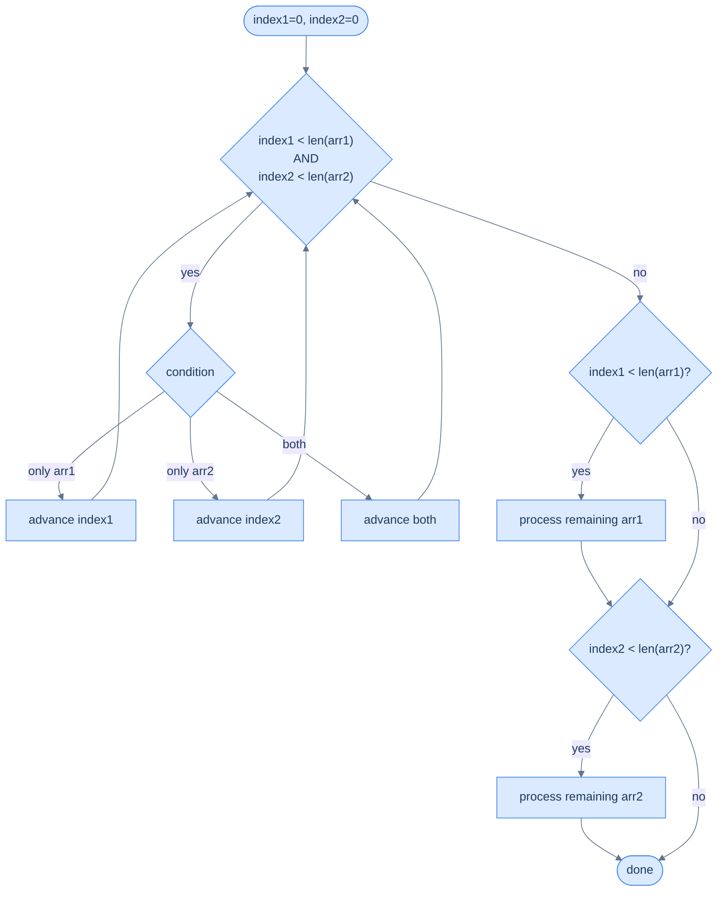
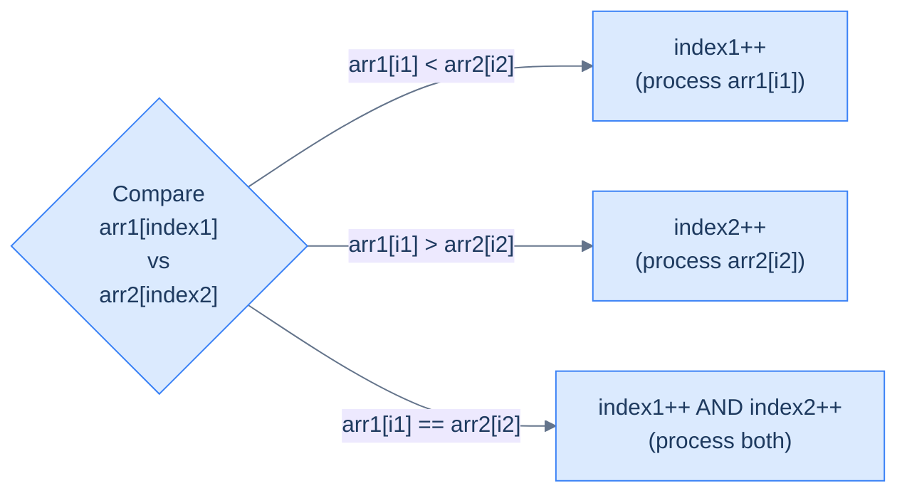
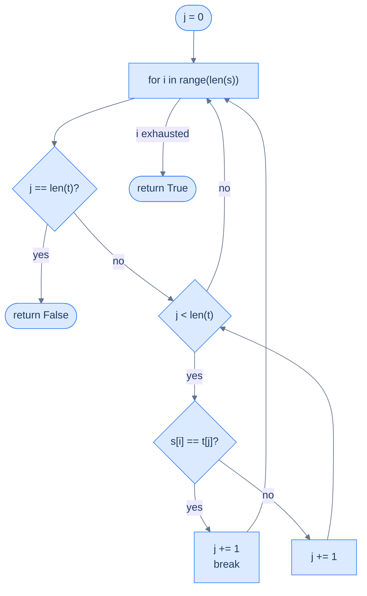
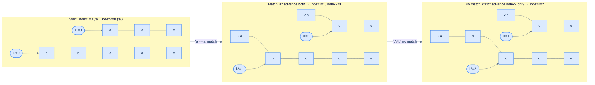

# Pattern: Simultaneous Traversal

## Why Naive Isn't Enough

Every pattern so far worked on a single array. A naive solution to a *two-array* problem looks the same shape: pick one array, for every element scan the other end-to-end, accumulate results. That nested-scan shape costs `O(N × M)` time — `N` elements in `arr1`, each triggering a fresh `M`-step walk of `arr2` — because the inner index restarts at zero on every outer step.

The cost is not the per-step work but the *restart*. When both arrays carry useful order — they are sorted, or each index in one array maps to a unique target in the other — the inner restart re-examines positions that earlier outer steps already proved irrelevant. The merge problem makes this concrete: once you have written `arr2[0]` into the output, you never need to look at it again, so any algorithm that re-scans `arr2` from zero is doing wasted work.

To make this concrete: consider merging `arr1 = [1, 4, 7, 10]` and `arr2 = [2, 5, 8]`. A naive merge picks `1` from `arr1`, then re-scans all of `arr2` to confirm `2` belongs next — but `2` is sitting right at `arr2[0]`, and `arr2[0]` will never need to be revisited again. The inner restart costs `M` work per element of `arr1`, for `N × M` total.

So the core insight is: when both arrays carry the order or the matching rule we need, replace the restart with a *second cursor* that only moves forward. One pointer per array, one comparison per step, one pass.

---

## The Core Idea

Maintain **one index per array**, and at every step let a single comparison decide which index advances. The two indices walk forward in lock-step — sometimes both move, sometimes only one — and neither ever rewinds. The loop ends when either array is fully traversed; a short cleanup pass drains whatever is left in the other.

Think of two conveyor belts running side by side. Each belt carries items in order. You have one hand on each belt. At every moment:

- you compare the items both hands are holding
- based on the comparison, you take from the left belt, the right belt, or both
- you advance whichever belt(s) you took from

Neither belt rewinds. You only decide, at each step, which hand moves forward.

> 🖼 Diagram — Two index variables — one per array — start at position 0 and move independently based on a condition evaluated at each step.
```d2
direction: right

arr1: "arr1  (size N)" {
  grid-columns: 5
  grid-gap: 0
  a0: "a₀" {style.fill: "#fde68a"; style.stroke: "#d97706"}
  a1: "a₁"
  a2: "a₂"
  a3: "a₃"
  a4: "..."
}

arr2: "arr2  (size M)" {
  grid-columns: 4
  grid-gap: 0
  b0: "b₀" {style.fill: "#dcfce7"; style.stroke: "#16a34a"}
  b1: "b₁"
  b2: "b₂"
  b3: "..."
}

i1: "index1" {shape: oval; style.fill: "#fde68a"; style.stroke: "#d97706"}
i2: "index2" {shape: oval; style.fill: "#dcfce7"; style.stroke: "#16a34a"}

i1 -> arr1.a0
i2 -> arr2.b0
```

<p align="center"><strong>Two index variables — one per array — start at position 0 and move independently based on a condition evaluated at each step.</strong></p>

> ▶ Interactive Diagram — Step through a merge of two sorted arrays — at each step a single comparison picks which pointer advances and which value enters the merged output.
```d3 widget=array-1d
{
  "steps": [
    {
      "nodes": [
        {
          "id": "p0",
          "label": "1",
          "kind": "cell",
          "meta": [],
          "slot": 0,
          "cardId": "",
          "layoutKind": ""
        },
        {
          "id": "p1",
          "label": "4",
          "kind": "cell",
          "meta": [],
          "slot": 1,
          "cardId": "",
          "layoutKind": ""
        },
        {
          "id": "p2",
          "label": "7",
          "kind": "cell",
          "meta": [],
          "slot": 2,
          "cardId": "",
          "layoutKind": ""
        },
        {
          "id": "p3",
          "label": "10",
          "kind": "cell",
          "meta": [],
          "slot": 3,
          "cardId": "",
          "layoutKind": ""
        },
        {
          "id": "s0",
          "label": "2",
          "kind": "cell",
          "meta": [],
          "slot": 0,
          "cardId": "",
          "layoutKind": ""
        },
        {
          "id": "s1",
          "label": "5",
          "kind": "cell",
          "meta": [],
          "slot": 1,
          "cardId": "",
          "layoutKind": ""
        },
        {
          "id": "s2",
          "label": "8",
          "kind": "cell",
          "meta": [],
          "slot": 2,
          "cardId": "",
          "layoutKind": ""
        }
      ],
      "edges": [],
      "cursor": [
        {
          "name": "index1",
          "target": "p0",
          "color": "#f59e0b"
        },
        {
          "name": "index2",
          "target": "s0",
          "color": "#10b981"
        }
      ],
      "highlight": [],
      "changed": [],
      "removed": [],
      "annotation": "Init: index1=0, index2=0. Compare arr1[0]=1 vs arr2[0]=2.",
      "line": 0,
      "frames": [],
      "cardCursor": []
    },
    {
      "nodes": [
        {
          "id": "p0",
          "label": "1",
          "kind": "cell",
          "meta": [],
          "slot": 0,
          "cardId": "",
          "layoutKind": ""
        },
        {
          "id": "p1",
          "label": "4",
          "kind": "cell",
          "meta": [],
          "slot": 1,
          "cardId": "",
          "layoutKind": ""
        },
        {
          "id": "p2",
          "label": "7",
          "kind": "cell",
          "meta": [],
          "slot": 2,
          "cardId": "",
          "layoutKind": ""
        },
        {
          "id": "p3",
          "label": "10",
          "kind": "cell",
          "meta": [],
          "slot": 3,
          "cardId": "",
          "layoutKind": ""
        },
        {
          "id": "s0",
          "label": "2",
          "kind": "cell",
          "meta": [],
          "slot": 0,
          "cardId": "",
          "layoutKind": ""
        },
        {
          "id": "s1",
          "label": "5",
          "kind": "cell",
          "meta": [],
          "slot": 1,
          "cardId": "",
          "layoutKind": ""
        },
        {
          "id": "s2",
          "label": "8",
          "kind": "cell",
          "meta": [],
          "slot": 2,
          "cardId": "",
          "layoutKind": ""
        }
      ],
      "edges": [],
      "cursor": [
        {
          "name": "index1",
          "target": "p1",
          "color": "#f59e0b"
        },
        {
          "name": "index2",
          "target": "s0",
          "color": "#10b981"
        }
      ],
      "highlight": [],
      "changed": [],
      "removed": [],
      "annotation": "1 < 2 → take arr1[0]=1, advance index1 → 1. Merged so far: [1].",
      "line": 0,
      "frames": [],
      "cardCursor": []
    },
    {
      "nodes": [
        {
          "id": "p0",
          "label": "1",
          "kind": "cell",
          "meta": [],
          "slot": 0,
          "cardId": "",
          "layoutKind": ""
        },
        {
          "id": "p1",
          "label": "4",
          "kind": "cell",
          "meta": [],
          "slot": 1,
          "cardId": "",
          "layoutKind": ""
        },
        {
          "id": "p2",
          "label": "7",
          "kind": "cell",
          "meta": [],
          "slot": 2,
          "cardId": "",
          "layoutKind": ""
        },
        {
          "id": "p3",
          "label": "10",
          "kind": "cell",
          "meta": [],
          "slot": 3,
          "cardId": "",
          "layoutKind": ""
        },
        {
          "id": "s0",
          "label": "2",
          "kind": "cell",
          "meta": [],
          "slot": 0,
          "cardId": "",
          "layoutKind": ""
        },
        {
          "id": "s1",
          "label": "5",
          "kind": "cell",
          "meta": [],
          "slot": 1,
          "cardId": "",
          "layoutKind": ""
        },
        {
          "id": "s2",
          "label": "8",
          "kind": "cell",
          "meta": [],
          "slot": 2,
          "cardId": "",
          "layoutKind": ""
        }
      ],
      "edges": [],
      "cursor": [
        {
          "name": "index1",
          "target": "p1",
          "color": "#f59e0b"
        },
        {
          "name": "index2",
          "target": "s1",
          "color": "#10b981"
        }
      ],
      "highlight": [],
      "changed": [],
      "removed": [],
      "annotation": "arr1[1]=4 vs arr2[0]=2 → 4 > 2 → take 2, advance index2 → 1. Merged: [1, 2].",
      "line": 0,
      "frames": [],
      "cardCursor": []
    },
    {
      "nodes": [
        {
          "id": "p0",
          "label": "1",
          "kind": "cell",
          "meta": [],
          "slot": 0,
          "cardId": "",
          "layoutKind": ""
        },
        {
          "id": "p1",
          "label": "4",
          "kind": "cell",
          "meta": [],
          "slot": 1,
          "cardId": "",
          "layoutKind": ""
        },
        {
          "id": "p2",
          "label": "7",
          "kind": "cell",
          "meta": [],
          "slot": 2,
          "cardId": "",
          "layoutKind": ""
        },
        {
          "id": "p3",
          "label": "10",
          "kind": "cell",
          "meta": [],
          "slot": 3,
          "cardId": "",
          "layoutKind": ""
        },
        {
          "id": "s0",
          "label": "2",
          "kind": "cell",
          "meta": [],
          "slot": 0,
          "cardId": "",
          "layoutKind": ""
        },
        {
          "id": "s1",
          "label": "5",
          "kind": "cell",
          "meta": [],
          "slot": 1,
          "cardId": "",
          "layoutKind": ""
        },
        {
          "id": "s2",
          "label": "8",
          "kind": "cell",
          "meta": [],
          "slot": 2,
          "cardId": "",
          "layoutKind": ""
        }
      ],
      "edges": [],
      "cursor": [
        {
          "name": "index1",
          "target": "p2",
          "color": "#f59e0b"
        },
        {
          "name": "index2",
          "target": "s1",
          "color": "#10b981"
        }
      ],
      "highlight": [],
      "changed": [],
      "removed": [],
      "annotation": "arr1[1]=4 vs arr2[1]=5 → 4 < 5 → take 4, advance index1 → 2. Merged: [1, 2, 4].",
      "line": 0,
      "frames": [],
      "cardCursor": []
    },
    {
      "nodes": [
        {
          "id": "p0",
          "label": "1",
          "kind": "cell",
          "meta": [],
          "slot": 0,
          "cardId": "",
          "layoutKind": ""
        },
        {
          "id": "p1",
          "label": "4",
          "kind": "cell",
          "meta": [],
          "slot": 1,
          "cardId": "",
          "layoutKind": ""
        },
        {
          "id": "p2",
          "label": "7",
          "kind": "cell",
          "meta": [],
          "slot": 2,
          "cardId": "",
          "layoutKind": ""
        },
        {
          "id": "p3",
          "label": "10",
          "kind": "cell",
          "meta": [],
          "slot": 3,
          "cardId": "",
          "layoutKind": ""
        },
        {
          "id": "s0",
          "label": "2",
          "kind": "cell",
          "meta": [],
          "slot": 0,
          "cardId": "",
          "layoutKind": ""
        },
        {
          "id": "s1",
          "label": "5",
          "kind": "cell",
          "meta": [],
          "slot": 1,
          "cardId": "",
          "layoutKind": ""
        },
        {
          "id": "s2",
          "label": "8",
          "kind": "cell",
          "meta": [],
          "slot": 2,
          "cardId": "",
          "layoutKind": ""
        }
      ],
      "edges": [],
      "cursor": [
        {
          "name": "index1",
          "target": "p2",
          "color": "#f59e0b"
        },
        {
          "name": "index2",
          "target": "s2",
          "color": "#10b981"
        }
      ],
      "highlight": [],
      "changed": [],
      "removed": [],
      "annotation": "arr1[2]=7 vs arr2[1]=5 → 7 > 5 → take 5, advance index2 → 2. Merged: [1, 2, 4, 5].",
      "line": 0,
      "frames": [],
      "cardCursor": []
    },
    {
      "nodes": [
        {
          "id": "p0",
          "label": "1",
          "kind": "cell",
          "meta": [],
          "slot": 0,
          "cardId": "",
          "layoutKind": ""
        },
        {
          "id": "p1",
          "label": "4",
          "kind": "cell",
          "meta": [],
          "slot": 1,
          "cardId": "",
          "layoutKind": ""
        },
        {
          "id": "p2",
          "label": "7",
          "kind": "cell",
          "meta": [],
          "slot": 2,
          "cardId": "",
          "layoutKind": ""
        },
        {
          "id": "p3",
          "label": "10",
          "kind": "cell",
          "meta": [],
          "slot": 3,
          "cardId": "",
          "layoutKind": ""
        },
        {
          "id": "s0",
          "label": "2",
          "kind": "cell",
          "meta": [],
          "slot": 0,
          "cardId": "",
          "layoutKind": ""
        },
        {
          "id": "s1",
          "label": "5",
          "kind": "cell",
          "meta": [],
          "slot": 1,
          "cardId": "",
          "layoutKind": ""
        },
        {
          "id": "s2",
          "label": "8",
          "kind": "cell",
          "meta": [],
          "slot": 2,
          "cardId": "",
          "layoutKind": ""
        }
      ],
      "edges": [],
      "cursor": [
        {
          "name": "index1",
          "target": "p3",
          "color": "#f59e0b"
        },
        {
          "name": "index2",
          "target": "s2",
          "color": "#10b981"
        }
      ],
      "highlight": [],
      "changed": [],
      "removed": [],
      "annotation": "arr1[2]=7 vs arr2[2]=8 → 7 < 8 → take 7, advance index1 → 3. Merged: [1, 2, 4, 5, 7].",
      "line": 0,
      "frames": [],
      "cardCursor": []
    },
    {
      "nodes": [
        {
          "id": "p0",
          "label": "1",
          "kind": "cell",
          "meta": [],
          "slot": 0,
          "cardId": "",
          "layoutKind": ""
        },
        {
          "id": "p1",
          "label": "4",
          "kind": "cell",
          "meta": [],
          "slot": 1,
          "cardId": "",
          "layoutKind": ""
        },
        {
          "id": "p2",
          "label": "7",
          "kind": "cell",
          "meta": [],
          "slot": 2,
          "cardId": "",
          "layoutKind": ""
        },
        {
          "id": "p3",
          "label": "10",
          "kind": "cell",
          "meta": [],
          "slot": 3,
          "cardId": "",
          "layoutKind": ""
        },
        {
          "id": "s0",
          "label": "2",
          "kind": "cell",
          "meta": [],
          "slot": 0,
          "cardId": "",
          "layoutKind": ""
        },
        {
          "id": "s1",
          "label": "5",
          "kind": "cell",
          "meta": [],
          "slot": 1,
          "cardId": "",
          "layoutKind": ""
        },
        {
          "id": "s2",
          "label": "8",
          "kind": "cell",
          "meta": [],
          "slot": 2,
          "cardId": "",
          "layoutKind": ""
        }
      ],
      "edges": [],
      "cursor": [
        {
          "name": "index1",
          "target": "p3",
          "color": "#f59e0b"
        },
        {
          "name": "index2",
          "target": "s2",
          "color": "#10b981"
        }
      ],
      "highlight": [],
      "changed": [],
      "removed": [],
      "annotation": "arr1[3]=10 vs arr2[2]=8 → 10 > 8 → take 8, advance index2 → 3 (past end). Main loop exits. Cleanup: append remaining arr1 → [1, 2, 4, 5, 7, 8, 10] ✓",
      "line": 0,
      "frames": [],
      "cardCursor": []
    }
  ],
  "title": "Simultaneous traversal on two sorted arrays (merge example)"
}
```

---

## How the Pointers Move

The implementation has a fixed shape regardless of the problem:

- `index1` tracks the current position in `arr1`
- `index2` tracks the current position in `arr2`
- the **main loop** runs while *both* arrays have unprocessed elements
- two **cleanup loops** run after, draining whatever remains in either array

> 🖼 Diagram — Simultaneous traversal flow — the main loop runs while both arrays have items; two cleanup loops drain whichever array still has leftover elements.


<p align="center"><strong>Simultaneous traversal flow — the main loop runs while both arrays have items; two cleanup loops drain whichever array still has leftover elements.</strong></p>

The cleanup loops are what separate simultaneous traversal from the converging two-pointer pattern. Converging two pointers stop when both meet inside a single array. Simultaneous traversal continues until **both** arrays are fully processed — and the leftover suffix in the slower array is almost always part of the answer.

---

## The Generic Algorithm

1. Initialise `index1 = 0` and `index2 = 0`.
2. While both indices are within bounds — `index1 < len(arr1)` AND `index2 < len(arr2)` — evaluate the problem's condition on `arr1[index1]` and `arr2[index2]`.
3. If the condition says "consume from `arr1` only", process `arr1[index1]` (compare, copy, or record) and advance `index1` by one.
4. If the condition says "consume from `arr2` only", process `arr2[index2]` and advance `index2` by one.
5. If the condition says "consume from both" (typically the equal case), process both elements and advance both indices by one.
6. When the main loop exits, exactly one array is exhausted. Drain the leftover of the other array with a single while loop, advancing that one index until it reaches its array's length.

The condition in step 2 is the only problem-specific knob. Everything else — the bounds check, the two cleanup loops, the strictly-forward motion — stays the same across every problem in the pattern.

The example conditions below show how different problems plug into the same template:

| Problem | Advance `index1` when… | Advance `index2` when… |
|---|---|---|
| Merge sorted arrays | `arr1[i1] <= arr2[i2]` (smaller wins) | `arr2[i2] < arr1[i1]` (smaller wins) |
| Subsequence check | `arr1[i1] == arr2[i2]` (match found) | every iteration (always) |
| Intersection | `arr1[i1] < arr2[i2]` OR match (advance both on match) | `arr2[i2] < arr1[i1]` OR match |

---

## The Template

The numbered steps above translate directly into the same skeleton in every language — one main loop, two cleanup loops, one problem-specific condition in the middle.


```python run

def simultaneous_traversal(arr1: List[int], arr2: List[int]) -> None:
    # Initialize index variables for two arrays
    index1 = 0
    index2 = 0

    # Traverse both arrays simultaneously until
    # the end of any one array is reached
    while index1 < len(arr1) and index2 < len(arr2):

        if should_move_first:  # Replace this with actual condition
            # Process arr1[index1]
            # .......
            index1 += 1

        if should_move_second:  # Replace this with actual condition
            # Process arr2[index2]
            # .......
            index2 += 1

    # Traverse the remaining elements of arr1
    while index1 < len(arr1):
        # Process arr1[index1]
        # .......
        index1 += 1

    # Traverse the remaining elements of arr2
    while index2 < len(arr2):
        # Process arr2[index2]
        # .......
        index2 += 1
```

```java run
class SimultaneousTraversal {

    public void simultaneousTraversal(List<Integer> arr1, List<Integer> arr2) {
        // Initialize index variables for two arrays
        int index1 = 0, index2 = 0;

        // Traverse both arrays simultaneously until
        // the end of any one array is reached
        while (index1 < arr1.size() && index2 < arr2.size()) {

            if (shouldMoveFirst) { // Replace this with actual condition

                // Process arr1[index1]
                // ....

                index1++;
            }
            if (shouldMoveSecond) { // Replace this with actual condition

                // Process arr2[index2]
                // ....

                index2++;
            }
        }

        // Traverse the remaining elements of arr1
        while (index1 < arr1.size()) {
            // Process arr1[index1]
            // .......
            index1++;
        }

        // Traverse the remaining elements of arr2
        while (index2 < arr2.size()) {
            // Process arr2[index2]
            // .......
            index2++;
        }
    }
}
```


The two `if` blocks inside the main loop are independent — both can fire on the same iteration when the condition wants to consume from both arrays (the equal case). Problems that demand strict "advance one or the other" can replace the second `if` with `else`.

---

## Pointer-Movement Cheat Sheet

The single comparison in the main loop resolves to one of three outcomes — exactly one of the three branches fires per iteration:

> 🖼 Diagram — The condition evaluated each step determines which pointer advances — one, the other, or both. No pointer ever moves backwards.


<p align="center"><strong>The condition evaluated each step determines which pointer advances — one, the other, or both. No pointer ever moves backwards.</strong></p>

The fourth outcome — the loop exit — is handled by the main-loop guard, not by the condition. Whichever array exhausts first triggers the relevant cleanup loop.

---

## Complexity Analysis

Every element in both arrays is processed at most once — each index moves forward and never backwards. If `arr1` has `N` elements and `arr2` has `M`:

| | Time | Space |
|---|---|---|
| Best and worst case | `O(N + M)` | `O(1)` |

Why brute force is `O(N × M)`: a nested loop resets `index2` to `0` for each element of `arr1`, so every element of `arr1` triggers a full scan of `arr2`. Simultaneous traversal eliminates the reset — `index2` only ever moves forward.

The `O(1)` space bound assumes the answer is written in place or streamed out. Problems that build a new output array of size up to `N + M` (merge, intersection list) pay `O(N + M)` extra for that output, but the working space of the pointers themselves remains `O(1)`.

---

## Variants

Several recognisable shapes live under the simultaneous-traversal umbrella, distinguished by the advance condition:

- **Match-driven**: one pointer always advances; the other only on a match. Used when the answer is "does `s` fit inside `t` in order?" (Subsequence Checker).
- **Comparison-driven**: each step picks the smaller (or larger) of the two current elements and advances that one. Used when the answer is "merge two ordered streams into one" (Merge Sorted Arrays).
- **Intersection-driven**: equal values are recorded and both pointers advance; on a mismatch the smaller side advances. Used when the answer is "find values shared by both" (Unique / Repeated Intersections).
- **Backward-fill variant**: the same comparison-driven shape, but pointers walk from `len - 1` toward `0`. Used when the destination array has pre-allocated trailing space and writing front-to-back would overwrite unread data (the in-place Merge Sorted Arrays).

The template is the same in every variant; only the advance condition changes.

---

## Recognition Checklist

Before deciding this pattern applies, run through these four questions. A "yes" to all four means simultaneous traversal fits.

| Question | What it tests |
|---|---|
| **Q1.** Does the problem involve two sequences that must be compared or processed together? | Confirms two simultaneous cursors are structurally required — neither array can be finished alone |
| **Q2.** Does advancing in one sequence depend on a comparison between the two sequences? | Confirms pointer movement is conditional on the *pair*, not on either array in isolation |
| **Q3.** Is each pointer's advance condition simple and deterministic at every step? | Confirms the `O(N + M)` linear solution is achievable — no backtracking, no inner scan |
| **Q4.** When one array is exhausted, do leftover elements in the other still matter? | Confirms the cleanup loops are part of the answer (merge, subsequence) and not a corner case to ignore |

---

## Canonical Example: Subsequence Checker

### Problem Statement

Given two strings `s` and `t`, return `True` if `s` is a subsequence of `t`.

A string `s` is a **subsequence** of `t` if every character of `s` appears in `t` in the *same relative order* — but not necessarily consecutively.

```
s = "ace",   t = "abcde"  →  True   (a..c..e all appear in order)
s = "aec",   t = "abcde"  →  False  (e appears before c in t, not after)
```

> 🖼 Diagram — s = "ace" is a subsequence of t = "abcde" — each character of s maps to a later position in t, maintaining order.
```d2
direction: right

tt: "t = a b c d e" {
  grid-columns: 5
  grid-gap: 0
  t0: "a" {style.fill: "#dcfce7"; style.stroke: "#16a34a"}
  t1: "b"
  t2: "c" {style.fill: "#dcfce7"; style.stroke: "#16a34a"}
  t3: "d"
  t4: "e" {style.fill: "#dcfce7"; style.stroke: "#16a34a"}
}

ss: "s = a · c · e" {
  grid-columns: 3
  grid-gap: 0
  s0: "a" {style.fill: "#dcfce7"; style.stroke: "#16a34a"}
  s1: "c" {style.fill: "#dcfce7"; style.stroke: "#16a34a"}
  s2: "e" {style.fill: "#dcfce7"; style.stroke: "#16a34a"}
}

ss.s0 -> tt.t0: "matched at t[0]"
ss.s1 -> tt.t2: "matched at t[2]"
ss.s2 -> tt.t4: "matched at t[4]"
```

<p align="center"><strong>s = "ace" is a subsequence of t = "abcde" — each character of s maps to a later position in t, maintaining order.</strong></p>

---

### Brute Force: Nested Scan, O(N × M)

For each character in `s`, scan forward in `t` from where the last match left off, looking for the next occurrence. If `t` runs out before all of `s` is matched, the answer is `False`.

> 🖼 Diagram — Brute force — for each character of s, scan forward in t until found or t is exhausted. Correct, but the nested structure is error-prone.


<p align="center"><strong>Brute force — for each character of s, scan forward in t until found or t is exhausted. Correct, but the nested structure is error-prone.</strong></p>


```python run viz=array viz-root=s
def is_subsequence_brute(s: str, t: str) -> bool:
    j = 0
    for i in range(len(s)):
        if j == len(t):
            return False
        while j < len(t):
            if s[i] == t[j]:
                j += 1
                break
            j += 1
    return True

print(is_subsequence_brute("ace", "abcde"))   # True
print(is_subsequence_brute("aec", "abcde"))   # False
```

```java run viz=array viz-root=s
public class Main {
    static boolean isSubsequenceBrute(String s, String t) {
        int j = 0;
        for (int i = 0; i < s.length(); i++) {
            if (j == t.length()) return false;
            while (j < t.length()) {
                if (s.charAt(i) == t.charAt(j)) { j++; break; }
                j++;
            }
        }
        return true;
    }

    public static void main(String[] args) {
        System.out.println(isSubsequenceBrute("ace", "abcde"));
        System.out.println(isSubsequenceBrute("aec", "abcde"));
    }
}
```


<details>
<summary><strong>Trace — s = "ace", t = "abcde"  (brute force)</strong></summary>

```
j = 0

i=0, s[0]='a':
  j=0, t[0]='a': 'a'=='a' → j=1, break
i=1, s[1]='c':
  j=1, t[1]='b': 'c'≠'b' → j=2
  j=2, t[2]='c': 'c'=='c' → j=3, break
i=2, s[2]='e':
  j=3, t[3]='d': 'e'≠'d' → j=4
  j=4, t[4]='e': 'e'=='e' → j=5, break

i exhausted → return True ✓

Note: j never resets to 0 — this version actually behaves like simultaneous traversal
      under the hood. The nested while loop is what makes it hard to read and reason about.
```

</details>

---

### Key Insight

`t` may contain many characters that are not in `s`, and skipping them is free if we never restart. Replace the `for`-then-`while` shape with two index variables in a single loop: `index2` (for `t`) always advances, and `index1` (for `s`) advances only on a match. The `for`-loop's restart over `j` collapses into a single forward sweep.

---

### Optimised Solution: One Loop, O(N + M)

Two index variables, one outer condition, one match check — and the algorithm matches the template exactly.

> 🖼 Diagram — Simultaneous traversal — index2 always advances; index1 only advances on a match. The two-pointer structure makes the logic explicit and easy to follow.


<p align="center"><strong>Simultaneous traversal — <code>index2</code> always advances; <code>index1</code> only advances on a match. The two-pointer structure makes the logic explicit and easy to follow.</strong></p>

> ▶ Interactive Diagram — Step through the subsequence check — watch index2 advance every step while index1 only ticks forward when the characters match.
```d3 widget=array-1d
{
  "steps": [
    {
      "nodes": [
        {
          "id": "p0",
          "label": "a",
          "kind": "cell",
          "meta": [],
          "slot": 0,
          "cardId": "",
          "layoutKind": ""
        },
        {
          "id": "p1",
          "label": "c",
          "kind": "cell",
          "meta": [],
          "slot": 1,
          "cardId": "",
          "layoutKind": ""
        },
        {
          "id": "p2",
          "label": "e",
          "kind": "cell",
          "meta": [],
          "slot": 2,
          "cardId": "",
          "layoutKind": ""
        },
        {
          "id": "s0",
          "label": "a",
          "kind": "cell",
          "meta": [],
          "slot": 0,
          "cardId": "",
          "layoutKind": ""
        },
        {
          "id": "s1",
          "label": "b",
          "kind": "cell",
          "meta": [],
          "slot": 1,
          "cardId": "",
          "layoutKind": ""
        },
        {
          "id": "s2",
          "label": "c",
          "kind": "cell",
          "meta": [],
          "slot": 2,
          "cardId": "",
          "layoutKind": ""
        },
        {
          "id": "s3",
          "label": "d",
          "kind": "cell",
          "meta": [],
          "slot": 3,
          "cardId": "",
          "layoutKind": ""
        },
        {
          "id": "s4",
          "label": "e",
          "kind": "cell",
          "meta": [],
          "slot": 4,
          "cardId": "",
          "layoutKind": ""
        }
      ],
      "edges": [],
      "cursor": [
        {
          "name": "index1",
          "target": "p0",
          "color": "#f59e0b"
        },
        {
          "name": "index2",
          "target": "s0",
          "color": "#10b981"
        }
      ],
      "highlight": [],
      "changed": [],
      "removed": [],
      "annotation": "s[0]='a' vs t[0]='a' → match → advance both.",
      "line": 0,
      "frames": [],
      "cardCursor": []
    },
    {
      "nodes": [
        {
          "id": "p0",
          "label": "a",
          "kind": "cell",
          "meta": [],
          "slot": 0,
          "cardId": "",
          "layoutKind": ""
        },
        {
          "id": "p1",
          "label": "c",
          "kind": "cell",
          "meta": [],
          "slot": 1,
          "cardId": "",
          "layoutKind": ""
        },
        {
          "id": "p2",
          "label": "e",
          "kind": "cell",
          "meta": [],
          "slot": 2,
          "cardId": "",
          "layoutKind": ""
        },
        {
          "id": "s0",
          "label": "a",
          "kind": "cell",
          "meta": [],
          "slot": 0,
          "cardId": "",
          "layoutKind": ""
        },
        {
          "id": "s1",
          "label": "b",
          "kind": "cell",
          "meta": [],
          "slot": 1,
          "cardId": "",
          "layoutKind": ""
        },
        {
          "id": "s2",
          "label": "c",
          "kind": "cell",
          "meta": [],
          "slot": 2,
          "cardId": "",
          "layoutKind": ""
        },
        {
          "id": "s3",
          "label": "d",
          "kind": "cell",
          "meta": [],
          "slot": 3,
          "cardId": "",
          "layoutKind": ""
        },
        {
          "id": "s4",
          "label": "e",
          "kind": "cell",
          "meta": [],
          "slot": 4,
          "cardId": "",
          "layoutKind": ""
        }
      ],
      "edges": [],
      "cursor": [
        {
          "name": "index1",
          "target": "p1",
          "color": "#f59e0b"
        },
        {
          "name": "index2",
          "target": "s1",
          "color": "#10b981"
        }
      ],
      "highlight": [],
      "changed": [],
      "removed": [],
      "annotation": "s[1]='c' vs t[1]='b' → no match → advance only index2.",
      "line": 0,
      "frames": [],
      "cardCursor": []
    },
    {
      "nodes": [
        {
          "id": "p0",
          "label": "a",
          "kind": "cell",
          "meta": [],
          "slot": 0,
          "cardId": "",
          "layoutKind": ""
        },
        {
          "id": "p1",
          "label": "c",
          "kind": "cell",
          "meta": [],
          "slot": 1,
          "cardId": "",
          "layoutKind": ""
        },
        {
          "id": "p2",
          "label": "e",
          "kind": "cell",
          "meta": [],
          "slot": 2,
          "cardId": "",
          "layoutKind": ""
        },
        {
          "id": "s0",
          "label": "a",
          "kind": "cell",
          "meta": [],
          "slot": 0,
          "cardId": "",
          "layoutKind": ""
        },
        {
          "id": "s1",
          "label": "b",
          "kind": "cell",
          "meta": [],
          "slot": 1,
          "cardId": "",
          "layoutKind": ""
        },
        {
          "id": "s2",
          "label": "c",
          "kind": "cell",
          "meta": [],
          "slot": 2,
          "cardId": "",
          "layoutKind": ""
        },
        {
          "id": "s3",
          "label": "d",
          "kind": "cell",
          "meta": [],
          "slot": 3,
          "cardId": "",
          "layoutKind": ""
        },
        {
          "id": "s4",
          "label": "e",
          "kind": "cell",
          "meta": [],
          "slot": 4,
          "cardId": "",
          "layoutKind": ""
        }
      ],
      "edges": [],
      "cursor": [
        {
          "name": "index1",
          "target": "p1",
          "color": "#f59e0b"
        },
        {
          "name": "index2",
          "target": "s2",
          "color": "#10b981"
        }
      ],
      "highlight": [],
      "changed": [],
      "removed": [],
      "annotation": "s[1]='c' vs t[2]='c' → match → advance both.",
      "line": 0,
      "frames": [],
      "cardCursor": []
    },
    {
      "nodes": [
        {
          "id": "p0",
          "label": "a",
          "kind": "cell",
          "meta": [],
          "slot": 0,
          "cardId": "",
          "layoutKind": ""
        },
        {
          "id": "p1",
          "label": "c",
          "kind": "cell",
          "meta": [],
          "slot": 1,
          "cardId": "",
          "layoutKind": ""
        },
        {
          "id": "p2",
          "label": "e",
          "kind": "cell",
          "meta": [],
          "slot": 2,
          "cardId": "",
          "layoutKind": ""
        },
        {
          "id": "s0",
          "label": "a",
          "kind": "cell",
          "meta": [],
          "slot": 0,
          "cardId": "",
          "layoutKind": ""
        },
        {
          "id": "s1",
          "label": "b",
          "kind": "cell",
          "meta": [],
          "slot": 1,
          "cardId": "",
          "layoutKind": ""
        },
        {
          "id": "s2",
          "label": "c",
          "kind": "cell",
          "meta": [],
          "slot": 2,
          "cardId": "",
          "layoutKind": ""
        },
        {
          "id": "s3",
          "label": "d",
          "kind": "cell",
          "meta": [],
          "slot": 3,
          "cardId": "",
          "layoutKind": ""
        },
        {
          "id": "s4",
          "label": "e",
          "kind": "cell",
          "meta": [],
          "slot": 4,
          "cardId": "",
          "layoutKind": ""
        }
      ],
      "edges": [],
      "cursor": [
        {
          "name": "index1",
          "target": "p2",
          "color": "#f59e0b"
        },
        {
          "name": "index2",
          "target": "s3",
          "color": "#10b981"
        }
      ],
      "highlight": [],
      "changed": [],
      "removed": [],
      "annotation": "s[2]='e' vs t[3]='d' → no match → advance only index2.",
      "line": 0,
      "frames": [],
      "cardCursor": []
    },
    {
      "nodes": [
        {
          "id": "p0",
          "label": "a",
          "kind": "cell",
          "meta": [],
          "slot": 0,
          "cardId": "",
          "layoutKind": ""
        },
        {
          "id": "p1",
          "label": "c",
          "kind": "cell",
          "meta": [],
          "slot": 1,
          "cardId": "",
          "layoutKind": ""
        },
        {
          "id": "p2",
          "label": "e",
          "kind": "cell",
          "meta": [],
          "slot": 2,
          "cardId": "",
          "layoutKind": ""
        },
        {
          "id": "s0",
          "label": "a",
          "kind": "cell",
          "meta": [],
          "slot": 0,
          "cardId": "",
          "layoutKind": ""
        },
        {
          "id": "s1",
          "label": "b",
          "kind": "cell",
          "meta": [],
          "slot": 1,
          "cardId": "",
          "layoutKind": ""
        },
        {
          "id": "s2",
          "label": "c",
          "kind": "cell",
          "meta": [],
          "slot": 2,
          "cardId": "",
          "layoutKind": ""
        },
        {
          "id": "s3",
          "label": "d",
          "kind": "cell",
          "meta": [],
          "slot": 3,
          "cardId": "",
          "layoutKind": ""
        },
        {
          "id": "s4",
          "label": "e",
          "kind": "cell",
          "meta": [],
          "slot": 4,
          "cardId": "",
          "layoutKind": ""
        }
      ],
      "edges": [],
      "cursor": [
        {
          "name": "index1",
          "target": "p2",
          "color": "#f59e0b"
        },
        {
          "name": "index2",
          "target": "s4",
          "color": "#10b981"
        }
      ],
      "highlight": [],
      "changed": [],
      "removed": [],
      "annotation": "s[2]='e' vs t[4]='e' → match → advance both. index1 == len(s) → return True ✓",
      "line": 0,
      "frames": [],
      "cardCursor": []
    }
  ],
  "title": "Subsequence check via simultaneous traversal — s = ace, t = abcde"
}
```


```python run
class Solution:
    def subsequence_checker(self, s: str, t: str) -> bool:

        # pointer for s
        index1: int = 0

        # pointer for t
        index2: int = 0

        while index1 < len(s) and index2 < len(t):
            if s[index1] == t[index2]:

                # If the current character matches, move the pointer for
                # s
                index1 += 1

            # Move the pointer for t in every iteration
            index2 += 1

        # If index1 reaches the end of s, it means all characters in s
        # are found in t in the same order
        return index1 == len(s)
```

```java run
class Solution {
    public boolean subsequenceChecker(String s, String t) {

        // pointer for s
        int index1 = 0;

        // pointer for t
        int index2 = 0;

        while (index1 < s.length() && index2 < t.length()) {
            if (s.charAt(index1) == t.charAt(index2)) {

                // If the current character matches, move the pointer for
                // s
                index1++;
            }

            // Move the pointer for t in every iteration
            index2++;
        }

        // If index1 reaches the end of s, it means all characters in s
        // are found in t in the same order
        return index1 == s.length();
    }
}
```

---

### Trace

<details>
<summary><strong>Trace — s = "ace", t = "abcde"  (simultaneous traversal)</strong></summary>

```
index1 = 0,  index2 = 0

Step 1 │ index1=0 ('a'), index2=0 ('a') │ 'a'=='a' match  │ index1=1, index2=1
Step 2 │ index1=1 ('c'), index2=1 ('b') │ 'c'≠'b' no match│ index1=1, index2=2
Step 3 │ index1=1 ('c'), index2=2 ('c') │ 'c'=='c' match  │ index1=2, index2=3
Step 4 │ index1=2 ('e'), index2=3 ('d') │ 'e'≠'d' no match│ index1=2, index2=4
Step 5 │ index1=2 ('e'), index2=4 ('e') │ 'e'=='e' match  │ index1=3, index2=5
Step 6 │ index1=3 == len(s)=3 → loop exits

Return: index1 == len(s) → 3 == 3 → True ✓

Failure case — s = "aec", t = "abcde":
Step 1 │ index1=0 ('a'), index2=0 ('a') │ match   │ index1=1, index2=1
Step 2 │ index1=1 ('e'), index2=1 ('b') │ no match│ index1=1, index2=2
Step 3 │ index1=1 ('e'), index2=2 ('c') │ no match│ index1=1, index2=3
Step 4 │ index1=1 ('e'), index2=3 ('d') │ no match│ index1=1, index2=4
Step 5 │ index1=1 ('e'), index2=4 ('e') │ match   │ index1=2, index2=5
Step 6 │ index2=5 == len(t)=5 → loop exits

Return: index1 == len(s) → 2 == 3 → False ✓
Note: 'e' was found before 'c', so s[2]='c' was never matched — index1 stopped at 2.
```

</details>

---

### Fitting the Template

Run the recognition checklist on this problem to confirm the pattern is the right tool.

| Question | Answer for Subsequence Checker |
|---|---|
| **Q1.** Two sequences processed together? | **Yes** — every character of `s` must be located inside `t` in order; neither string can be finished alone |
| **Q2.** Advancing one depends on comparing both? | **Yes** — `index1` (for `s`) only advances when `s[index1] == t[index2]`; `index2` (for `t`) always advances |
| **Q3.** Condition is simple and deterministic? | **Yes** — one equality check per step, `O(1)` per iteration, no sorting or preprocessing |
| **Q4.** Leftover elements matter when one array exhausts? | **Yes** — if `t` exhausts while `s` still has unmatched characters, the answer is `False`; the post-loop check `index1 == len(s)` is the answer |

---

## Problems in This Category

| Problem | Both sequences needed? | Advance condition |
|---|---|---|
| **Subsequence Checker** | Yes — match chars of `s` inside `t` | match → both; no match → `t` only |
| **Merge Sorted Arrays** | Yes — merge `arr1` and `arr2` into sorted result | pick smaller → advance that one; equal → either order works |
| **Unique Intersections** | Yes — find values present in both arrays | match → record once and advance both; mismatch → advance the smaller |
| **Repeated Intersections** | Yes — find all common values including duplicates | match → record every time and advance both; mismatch → advance the smaller |

The difficulty varies by how complex the advance condition is — but the template stays the same.
