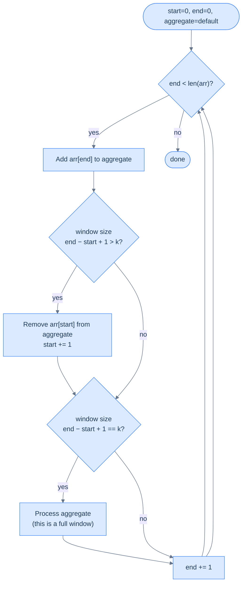

# Understanding the Fixed Sliding Window Pattern

## The Best Subarrays Always Move Together

Here's a deceptively simple question: given an array of numbers, what's the maximum sum of any 3 consecutive elements?

The obvious answer: try every possible window of size 3, sum each one, keep the largest. That's three passes through most of the array, just to produce each new sum.

But notice something. When you move the window one step to the right, the new window shares **two elements** with the old one. You recomputed those two elements from scratch — and you'll do the same thing 500,000 more times on a large array. You're recalculating the same data over and over.

What if you could slide the window forward in one subtraction and one addition?

---

## The Mental Model

Picture a train car moving along a track. The car has a fixed number of seats — say, four. As the train inches forward, one new passenger boards at the front door and one passenger exits at the back door. The total passenger count shifts by exactly those two people — you never need to recount every seat.

> 🖼 Diagram — Window [2, 5, 1, 3] — start=0, end=3, sum = 11.
```d2
direction: right

arr: "Before slide" {
  grid-columns: 6
  grid-gap: 0
  a0: "2" {style.fill: "#fde68a"; style.stroke: "#d97706"}
  a1: "5" {style.fill: "#fde68a"; style.stroke: "#d97706"}
  a2: "1" {style.fill: "#fde68a"; style.stroke: "#d97706"}
  a3: "3" {style.fill: "#fde68a"; style.stroke: "#d97706"}
  a4: "7"
  a5: "4"
}

s: "▲ start = 0" {shape: oval; style.fill: "#fde68a"; style.stroke: "#d97706"}
e: "▲ end = 3" {shape: oval; style.fill: "#fde68a"; style.stroke: "#d97706"}

s -> arr.a0
e -> arr.a3
```

<p align="center"><strong>Window [2, 5, 1, 3] — <code>start=0</code>, <code>end=3</code>, sum = 11.</strong></p>

> 🖼 Diagram — Slide right — subtract arr[start]=2, add arr[new end]=7. New sum = 11 − 2 + 7 = 16. No recount needed.
```d2
direction: right

arr: "After one slide" {
  grid-columns: 6
  grid-gap: 0
  a0: "2"
  a1: "5" {style.fill: "#fde68a"; style.stroke: "#d97706"}
  a2: "1" {style.fill: "#fde68a"; style.stroke: "#d97706"}
  a3: "3" {style.fill: "#fde68a"; style.stroke: "#d97706"}
  a4: "7" {style.fill: "#fde68a"; style.stroke: "#d97706"}
  a5: "4"
}

s: "▲ start = 1" {shape: oval; style.fill: "#fde68a"; style.stroke: "#d97706"}
e: "▲ end = 4" {shape: oval; style.fill: "#fde68a"; style.stroke: "#d97706"}

s -> arr.a1
e -> arr.a4
```

<p align="center"><strong>Slide right — subtract <code>arr[start]=2</code>, add <code>arr[new end]=7</code>. New sum = 11 − 2 + 7 = 16. No recount needed.</strong></p>

The key insight is the **incremental update**: instead of recomputing the aggregate from scratch each time, you maintain a running value and perform one removal and one addition per slide. Two pointer variables — `start` and `end` — mark the boundaries of the current window, and an `aggregate` variable holds the current result.

---

## What Makes a Function Slidable?

Not every aggregate function can use this trick. The whole point of sliding window is to avoid recomputing the window's result from scratch on every step — instead you **maintain** a running value by applying one cheap update. For that to work, the function must support two operations:

- An **addition operation** — cheaply include a new element as it enters the window from the right
- A **removal operation** — cheaply exclude an element as it exits the window from the left

"Cheaply" means O(1) per update. If either operation costs O(k) — proportional to the window size — you've lost the benefit entirely, because you'd be doing O(k) work per step across O(N) steps, which is exactly what brute force costs.

### Functions That Qualify

| Function | Add operation | Remove operation | Why it's O(1) |
|---|---|---|---|
| Sum | `aggregate += arr[end]` | `aggregate -= arr[start]` | Addition and subtraction are single arithmetic operations |
| Product | `aggregate *= arr[end]` | `aggregate //= arr[start]` | Multiplication and division are single arithmetic operations |
| Count of X | `aggregate += (arr[end] == X)` | `aggregate -= (arr[start] == X)` | A single comparison produces 0 or 1; no scan needed |
| Frequency map | `freq[arr[end]] += 1` | `freq[arr[start]] -= 1` | Hash map update at a single key is O(1) amortized |

Each of these works because the "contribution" of a single element to the aggregate can be added or removed in constant time, independently of all other elements in the window.

### Functions That Do Not Qualify — And Why

#### Median

The median is the middle value of a sorted sequence. To find it, the window's elements must be in sorted order.

**The problem:** when the window slides — one element leaves and one enters — you can't update a sorted structure in O(1). You have to re-sort, or use a balanced BST / two-heap structure to maintain order. Both cost O(log k) per update.

**Concretely:** window `[1, 3, 5, 7, 9]` (k=5), median = `5`. New window is `[3, 5, 7, 9, 2]`. The new element `2` needs to be inserted in the right sorted position, and `1` needs to be removed from it. With a plain sorted list, finding where `2` goes requires scanning up to k elements — O(k). You can't just "subtract 1 and add 2" to get the new median, because median depends on *relative rank*, not on a simple arithmetic formula.

**What breaks if you try it naively:** `median([1,3,5,7,9]) = 5`. Remove `1`, add `2` — naive arithmetic gives you no way to know the new median is `5` again. You must re-sort the window: O(k log k), not O(1).

**Can it still use a window structure?** Yes — with two heaps (a max-heap for the lower half and a min-heap for the upper half), you can maintain the median in O(log k) per slide. So a "sliding window median" is solvable in O(N log k), but it no longer uses the simple fixed-window template — it requires a more complex data structure.

---

#### Mode (Most Frequent Element)

The mode is the element that appears most often in the window.

**The problem:** tracking the mode requires knowing the frequency of *every* element in the window. When one element leaves, its frequency drops by one — and that might dethrone it as the mode. When a new element enters, it might become the new mode. You need to know the current maximum frequency at all times.

**Concretely:** window `[3, 1, 3, 2, 3]` (k=5), mode = `3` (appears 3 times). New window is `[1, 3, 2, 3, 3]` — `3` removed from left, another `3` added from right. Mode is still `3`. Easy case.

Now try: window `[3, 3, 3, 1, 2]`, mode = `3` (3 times). Slide to `[3, 3, 1, 2, 1]` — one `3` leaves, one `1` enters. Now `3` appears twice, `1` appears twice — it's a tie. Was `3` still mode? Or `1`? You can't know without scanning the full frequency map to find the current max.

**What breaks if you try it naively:** You can maintain a frequency map in O(1) per update (that part works). But finding *which element has the highest frequency* after each update requires scanning the entire frequency map — O(k) in the worst case. There's no O(1) way to track "which key currently has the maximum value" in a hash map as values change.

**Can it still be made efficient?** Partially. With a frequency map plus a separate "max frequency" counter, you can get O(1) *amortized* for some problems (like "longest subarray with at most one distinct element"), but the general mode-of-window problem cannot be solved with the simple template.

---

#### Maximum / Minimum

The maximum (or minimum) of a window seems simple — surely you can just track the current max?

**The problem:** when the *maximum element exits the window*, you have no way to know the new maximum without scanning the remaining k−1 elements. There's no arithmetic inverse for "remove a maximum from a set" the way there is for sum.

**Concretely:** window `[2, 8, 5, 3]`, max = `8`. Slide: `8` exits, `6` enters → new window `[5, 3, 6]`. What's the new max? You can't compute it from `8` alone — you have to look at all remaining elements. If the outgoing element was not the max, you're fine. But you never know in advance which slides will evict the max.

**What breaks if you try it naively:** keep a variable `current_max`. When `arr[end]` enters, update `current_max = max(current_max, arr[end])` — easy. When `arr[start]` exits: if `arr[start] != current_max`, do nothing. But if `arr[start] == current_max`, you now have to scan the entire window to find the new max — O(k) per such step.

In a worst-case array like `[9, 8, 7, 6, 5, 4, 3, 2, 1]`, the max exits on every single slide, meaning every step triggers a full O(k) scan — total cost O(N × k), same as brute force.

**Can it still use a window structure?** Yes — a **monotonic deque** (a double-ended queue that maintains elements in decreasing order) gives you O(1) amortized max/min per slide. This is a classic technique, but it's a different and more complex data structure than the simple `aggregate` variable in the basic template. The `f_remove` operation is no longer a single arithmetic step.

---

### The Core Rule

The dividing line is this: a function is O(1)-slidable if and only if **the contribution of a single element to the aggregate can be undone in constant time, regardless of what other elements are in the window**.

- Sum: contribution of element `x` is exactly `x` — trivially undone by `aggregate -= x`.
- Product: contribution is exactly `x` — undone by `aggregate /= x` (with a caveat for zeros).
- Max: contribution of element `x` depends on whether it's larger than all others — that relationship cannot be expressed independently of the rest of the window.
- Median: contribution of element `x` depends on its *rank* among all other elements — inherently relational, not independent.

If removing one element forces you to look at other elements to restore the aggregate, the function is not O(1)-slidable with a plain variable.

---

## The Mechanics — Step by Step

Let's make this concrete. You have an array and a window size `k`. You want to evaluate some function `f` over every subarray of size exactly `k`.

Here's how the window moves:

> 🖼 Diagram — Fixed sliding window flow — end expands the window each iteration; once window exceeds k, start contracts it from the left; once window equals k, process the aggregate.


<p align="center"><strong>Fixed sliding window flow — <code>end</code> expands the window each iteration; once window exceeds <code>k</code>, <code>start</code> contracts it from the left; once window equals <code>k</code>, process the aggregate.</strong></p>

Notice the design: `end` always moves forward every iteration, so the total number of iterations is exactly `n`. `start` only moves when the window would exceed `k`. Every element is added exactly once and removed at most once — that's what gives you O(n).

---

## The Algorithm

The generic fixed-sized sliding window algorithm is given below. It uses two variables `start` and `end` to maintain the window boundaries and a variable `aggregate` that always holds the result of function `f` computed over the current window `arr[start..end]`.

> **Step 1:** Initialize two variables, `start` and `end` to 0.
>
> **Step 2:** Create a variable `aggregate` to store the aggregated value of a window and initialize it to some default value dictated by the problem.
>
> **Step 3:** Loop while `end` < `arr.size()` and do the following:
>
> - **Step 3.1:** Add the contribution of `arr[end]` to `aggregate`
>
> - **Step 3.2:** If the size of the current window (`end` − `start` + 1) is greater than `k`, remove the contribution of `arr[start]` from `aggregate` and increment `start` by 1
>
> - **Step 3.3:** If the size of the current window (`end` − `start` + 1) equals `k`, process `aggregate`
>
> - **Step 3.4:** Increment `end` by 1

The order of steps 3.1 → 3.2 → 3.3 → 3.4 is not arbitrary — it is the only correct ordering. Here's why each position matters:

- **Step 3.1 must come first:** `arr[end]` must be added to `aggregate` before any size checks, because the size check in Step 3.2 determines whether this newly-added element pushed the window past `k`.
- **Step 3.2 must come before 3.3:** If you process before trimming, you may process a window that is one element too large. The window must be trimmed to exactly `k` before being evaluated.
- **Step 3.4 must come last:** `end` is incremented after all processing. If you increment first, you'd process the wrong index.

Three things to supply when solving a specific problem:
1. **`f_add`** — how to include `arr[end]` (e.g. `aggregate += arr[end]` for sum)
2. **`f_remove`** — how to exclude `arr[start]` (e.g. `aggregate -= arr[start]` for sum)
3. **`process`** — what to do with the window's aggregate (e.g. record max, check condition)

---

## A Concrete Walkthrough — Window of Size 4

Array: `[2, 5, 1, 3, 7, 4]`, window size `k = 4`, function `f` = sum.

> ▶ Interactive Diagram — Complete execution on [2, 5, 1, 3, 7, 4] with k=4. Three windows of size 4 are processed: sums 11, 16, 15. Each window is derived from the previous with one subtraction and one addition.
```d3 widget=array-traversal
{
  "items": ["2", "5", "1", "3", "7", "4"],
  "title": "Fixed sliding window of size k = 4 on [2, 5, 1, 3, 7, 4]",
  "steps": [
    { "markers": [{"name": "start", "index": 0, "color": "#3b82f6"}, {"name": "end", "index": 0, "color": "#f59e0b"}], "range": {"lo": 0, "hi": 0}, "msg": "end=0 — add arr[0]=2 → window=[2], size 1 < 4 → skip process." },
    { "markers": [{"name": "start", "index": 0, "color": "#3b82f6"}, {"name": "end", "index": 1, "color": "#f59e0b"}], "range": {"lo": 0, "hi": 1}, "msg": "end=1 — add arr[1]=5 → window=[2, 5], size 2 < 4 → skip process." },
    { "markers": [{"name": "start", "index": 0, "color": "#3b82f6"}, {"name": "end", "index": 2, "color": "#f59e0b"}], "range": {"lo": 0, "hi": 2}, "msg": "end=2 — add arr[2]=1 → window=[2, 5, 1], size 3 < 4 → skip process." },
    { "markers": [{"name": "start", "index": 0, "color": "#3b82f6"}, {"name": "end", "index": 3, "color": "#f59e0b"}], "range": {"lo": 0, "hi": 3}, "msg": "end=3 — add arr[3]=3 → window=[2, 5, 1, 3], size = k → process sum = 11." },
    { "markers": [{"name": "start", "index": 1, "color": "#3b82f6"}, {"name": "end", "index": 4, "color": "#f59e0b"}], "range": {"lo": 1, "hi": 4}, "msg": "end=4 — add 7 → size 5 > 4 → remove arr[0]=2, start=1 → window=[5, 1, 3, 7] → process sum = 16." },
    { "markers": [{"name": "start", "index": 2, "color": "#3b82f6"}, {"name": "end", "index": 5, "color": "#f59e0b"}], "range": {"lo": 2, "hi": 5}, "msg": "end=5 — add 4 → size 5 > 4 → remove arr[1]=5, start=2 → window=[1, 3, 7, 4] → process sum = 15." }
  ]
}
```

<p align="center"><strong>Complete execution on <code>[2, 5, 1, 3, 7, 4]</code> with <code>k=4</code>. Three windows of size 4 are processed: sums 11, 16, 15. Each window is derived from the previous with one subtraction and one addition.</strong></p>

Sums computed: `11, 16, 15`. The maximum is `16` (window `[5, 1, 3, 7]`). And you never recounted the middle elements.

---

## Implementation

Given below is the generic code implementation of the fixed-sized sliding window technique. It maps directly to the four steps in the algorithm above — Step 3.1 (add), Step 3.2 (trim if oversized), Step 3.3 (process if full), Step 3.4 (advance `end`):


```python run
from typing import List

def f_add(agg, x): return agg + x
def f_remove(agg, x): return agg - x
def process(agg): pass

def fixed_size_sliding_window(arr: List[int], k: int) -> None:
    start = end = 0
    aggregate = 0

    while end < len(arr):
        aggregate = f_add(aggregate, arr[end])             # Step 3.1: extend right.

        if end - start + 1 > k:                            # Step 3.2: trim oversize.
            aggregate = f_remove(aggregate, arr[start])
            start += 1

        if end - start + 1 == k:                           # Step 3.3: process full window.
            process(aggregate)

        end += 1                                           # Step 3.4: advance right.
```

```java run
public class Main {
    static int fAdd(int agg, int x)    { return agg + x; }
    static int fRemove(int agg, int x) { return agg - x; }
    static void process(int agg)       { /* problem-specific */ }

    static void fixedSizeSlidingWindow(int[] arr, int k) {
        int start = 0, end = 0, aggregate = 0;
        while (end < arr.length) {
            aggregate = fAdd(aggregate, arr[end]);

            if (end - start + 1 > k) {
                aggregate = fRemove(aggregate, arr[start]);
                start++;
            }

            if (end - start + 1 == k) process(aggregate);

            end++;
        }
    }

    public static void main(String[] args) {
        fixedSizeSlidingWindow(new int[]{1, 2, 3, 4, 5}, 3);
        System.out.println("Template ran.");
    }
}
```


---

## Complexity

| | Time | Space |
|---|---|---|
| Best and worst case | O(N) | O(1) |

**Why O(N):** `end` sweeps from `0` to `N-1` — exactly N iterations. `start` only moves forward and can never pass `end`. Every element is added once and removed once. Total work: 2N → O(N). This holds as long as `f_add` and `f_remove` are O(1) operations.

**Why O(1):** No new data structure grows with input size. Only `start`, `end`, and `aggregate` are used regardless of array length.

**Brute force comparison:** A naive nested loop recomputes the sum of every window from scratch — that's O(k) work per window, and there are O(N) windows, giving O(N × k). For `k = 1000` and `N = 1,000,000`, the difference between O(N) and O(N × k) is the difference between milliseconds and minutes.

---

Later in the course, you'll see specific problems where the aggregate is a sum, a character frequency map, and a count of distinct elements — each one plugging different `f_add` / `f_remove` logic into this same template while the structure stays identical.

# Identifying the Fixed Sliding Window Pattern

## Recognition Checklist

Use these four questions to decide whether a problem fits the fixed sliding window template. If every answer is "yes," the template drops in with only the add/remove/process logic to specialise.

| Question | What it tests |
|---|---|
| **Q1.** Is the value being computed over **contiguous subarrays of a fixed size `k`**? | Confirms the window size never grows or shrinks — it is always exactly `k`, so no condition-driven resizing is needed. |
| **Q2.** Can the aggregate be **incrementally updated in O(1)** when one element enters from the right and one leaves from the left? | Confirms the O(N) speedup is achievable — without this, the algorithm collapses to O(N × k). |
| **Q3.** Does the problem need the result for **every window** (a per-window list) **or a single best window** (min, max, count of qualifying windows)? | Confirms the `process` step shape — append to a list versus update a running extremum — so the template's third step is well-defined. |
| **Q4.** Are the edge cases `k > n`, `k == n`, and `k == 1` covered by the problem's spec? | Confirms there is a defined behaviour for windows that cannot exist (`k > n`), the single-window degenerate case (`k == n`), and the trivially-correct single-element case (`k == 1`). |

These same four questions reappear as the **Diagnostic Questions** table in every problem write-up that follows.

---

## The Example: Maximum Average Subarray

**Problem:** Given an array `arr` and an integer `k`, find the maximum average of any contiguous subarray of size exactly `k`.

```
arr = [1, 12, -5, -6, 50, 3],  k = 4

Subarrays of size 4:
  [1,  12, -5, -6]  →  sum =  2,  avg = 0.50
  [12, -5, -6, 50]  →  sum = 51,  avg = 12.75  ← maximum
  [-5, -6, 50,  3]  →  sum = 42,  avg = 10.50

Answer: 12.75
```

> 🖼 Diagram — Three windows of size k=4 slide through the array. Each slide removes one element from the left and adds one from the right — the sum updates in O(1) each time.
```d2
direction: right

w1: "Window 1: [1, 12, -5, -6]  avg = 0.50" {
  grid-columns: 6
  grid-gap: 0
  a0: "1" {style.fill: "#fde68a"; style.stroke: "#d97706"}
  a1: "12" {style.fill: "#fde68a"; style.stroke: "#d97706"}
  a2: "-5" {style.fill: "#fde68a"; style.stroke: "#d97706"}
  a3: "-6" {style.fill: "#fde68a"; style.stroke: "#d97706"}
  a4: "50"
  a5: "3"
}

w2: "Window 2: [12, -5, -6, 50]  avg = 12.75 ★" {
  grid-columns: 6
  grid-gap: 0
  b0: "1 ✗" {style.fill: "#f1f5f9"; style.stroke: "#94a3b8"}
  b1: "12" {style.fill: "#dcfce7"; style.stroke: "#16a34a"}
  b2: "-5" {style.fill: "#dcfce7"; style.stroke: "#16a34a"}
  b3: "-6" {style.fill: "#dcfce7"; style.stroke: "#16a34a"}
  b4: "50" {style.fill: "#dcfce7"; style.stroke: "#16a34a"}
  b5: "3"
}

w3: "Window 3: [-5, -6, 50, 3]  avg = 10.50" {
  grid-columns: 6
  grid-gap: 0
  c0: "1 ✗" {style.fill: "#f1f5f9"; style.stroke: "#94a3b8"}
  c1: "12 ✗" {style.fill: "#f1f5f9"; style.stroke: "#94a3b8"}
  c2: "-5" {style.fill: "#fde68a"; style.stroke: "#d97706"}
  c3: "-6" {style.fill: "#fde68a"; style.stroke: "#d97706"}
  c4: "50" {style.fill: "#fde68a"; style.stroke: "#d97706"}
  c5: "3" {style.fill: "#fde68a"; style.stroke: "#d97706"}
}

w1 -> w2: "remove 1, add 50"
w2 -> w3: "remove 12, add 3"
```

<p align="center"><strong>Three windows of size k=4 slide through the array. Each slide removes one element from the left and adds one from the right — the sum updates in O(1) each time.</strong></p>

> ▶ Interactive Diagram — Step-by-step execution on `[1, 12, -5, -6, 50, 3]` with `k = 4` — three valid windows of size 4 produce averages 0.50, 12.75, 10.50; `maxAverage = 12.75` after the middle window.
```d3 widget=array-traversal
{
  "items": ["1", "12", "-5", "-6", "50", "3"],
  "title": "Maximum average subarray on [1, 12, -5, -6, 50, 3], k = 4",
  "steps": [
    { "markers": [{"name": "start", "index": 0, "color": "#3b82f6"}, {"name": "end", "index": 0, "color": "#f59e0b"}], "range": {"lo": 0, "hi": 0}, "msg": "end=0 — add 1 → sum = 1, window=[1], size 1 < 4." },
    { "markers": [{"name": "start", "index": 0, "color": "#3b82f6"}, {"name": "end", "index": 1, "color": "#f59e0b"}], "range": {"lo": 0, "hi": 1}, "msg": "end=1 — add 12 → sum = 13, window=[1, 12], size 2 < 4." },
    { "markers": [{"name": "start", "index": 0, "color": "#3b82f6"}, {"name": "end", "index": 2, "color": "#f59e0b"}], "range": {"lo": 0, "hi": 2}, "msg": "end=2 — add −5 → sum = 8, window=[1, 12, −5], size 3 < 4." },
    { "markers": [{"name": "start", "index": 0, "color": "#3b82f6"}, {"name": "end", "index": 3, "color": "#f59e0b"}], "range": {"lo": 0, "hi": 3}, "msg": "end=3 — add −6 → sum = 2, window=[1, 12, −5, −6] → avg = 0.50; maxAvg = 0.50." },
    { "markers": [{"name": "start", "index": 1, "color": "#3b82f6"}, {"name": "end", "index": 4, "color": "#f59e0b"}], "range": {"lo": 1, "hi": 4}, "msg": "end=4 — add 50, remove arr[0]=1 → sum = 51, window=[12, −5, −6, 50] → avg = 12.75; maxAvg = 12.75 ★." },
    { "markers": [{"name": "start", "index": 2, "color": "#3b82f6"}, {"name": "end", "index": 5, "color": "#f59e0b"}], "range": {"lo": 2, "hi": 5}, "msg": "end=5 — add 3, remove arr[1]=12 → sum = 42, window=[−5, −6, 50, 3] → avg = 10.50; maxAvg stays 12.75 → answer: 12.75." }
  ]
}
```

---

## Applying the Diagnostic Questions

| Question | Answer for Maximum Average Subarray |
|---|---|
| **Q1.** Fixed size subarray? | **Yes** — exactly `k=4` elements per window. The window never grows or shrinks to satisfy a condition. |
| **Q2.** O(1) add and remove? | **Yes** — `sum += arr[end]` to add, `sum -= arr[start]` to remove. Both are O(1) arithmetic on a single integer. |
| **Q3.** Per-window report or single best? | **Single best** — we only need the maximum average, not every window's average. The `process` step compares against a running `max_average`. |
| **Q4.** Edge cases defined? | **Yes** — the problem guarantees `1 ≤ k ≤ n`, so `k > n` never occurs; `k == n` yields one window; `k == 1` reduces to `max(arr)`. |

---

### Q1 — Why "fixed size" matters here?

**WHAT:** The problem asks for the maximum average over subarrays of size *exactly* k. The window size is a fixed constraint, not a goal to satisfy. Every valid subarray has the same size.

**WHY "fixed" is the key qualifier:** A fixed window never needs logic to decide whether to grow or shrink based on a condition. You just slide it. This is what separates fixed sliding window from variable sliding window — in the variable version, the window size changes dynamically to satisfy a condition (e.g., "smallest subarray with sum ≥ target"). Here, the size is always k. No condition checking needed to adjust the window.

**Concrete check:** With `k=4` and `n=6`, there are exactly `n − k + 1 = 3` valid windows. Each has exactly 4 elements. The brute force computes the sum of 4 elements, 3 times — that's 12 additions. The sliding window computes the initial window once (4 additions) and then 2 slides (2 additions + 2 subtractions = 4 more operations) — 8 total. As k grows, this advantage compounds dramatically.

**What breaks if you use variable sliding window logic here:** A variable window expands and contracts based on whether a condition is satisfied. With a fixed target size, there's no condition to check — every window of size k is valid. Using variable logic would add unnecessary complexity without any benefit.

---

### Q2 — Why "O(1) add and remove" is required?

**WHAT:** When the window slides right by 1:
- `arr[end]` enters the window → `sum += arr[end]`
- `arr[start]` leaves the window → `sum -= arr[start]`

Both operations are O(1) arithmetic on a single variable.

**WHY this is the condition that makes sliding window faster than brute force:** Brute force recomputes the sum of k elements from scratch for every window — O(k) per window, O(N × k) total. Sliding window reuses the previous sum and updates it in O(1) — O(N) total. The update must be O(1), or the sliding window gains nothing over brute force.

**What doesn't have O(1) remove:** "Maximum element in window" — when the maximum element leaves the window, you need to find the new maximum from the remaining k−1 elements. That's O(k), not O(1). Fixed sliding window doesn't apply; you'd need a monotonic deque instead. "Sum of squares" could be O(1) (`+= end²`, `-= start²`), so it does apply. Always verify both add AND remove are O(1) before using this pattern.

---

## Brute Force: Nested Loops, O(N × k)

Fix a starting index `i`, compute the sum of `k` elements starting there, check if it beats the current max:


```python run
from typing import List

def k_subarray_max_average_brute(arr: List[int], k: int) -> float:
    n = len(arr)
    max_average = float('-inf')

    for i in range(n - k + 1):
        current_sum = 0
        # Inner loop recomputes arr[i+1..i+k-1] each time — the O(n*k) cost.
        for j in range(k):
            current_sum += arr[i + j]
        max_average = max(max_average, current_sum / k)
    return max_average

print(k_subarray_max_average_brute([1, 12, -5, -6, 50, 3], 4))  # 12.75
```

```java run
public class Main {
    static double kSubarrayMaxAverageBrute(int[] arr, int k) {
        int n = arr.length;
        double maxAverage = Double.NEGATIVE_INFINITY;
        for (int i = 0; i <= n - k; i++) {
            double currentSum = 0;
            for (int j = 0; j < k; j++) currentSum += arr[i + j];
            maxAverage = Math.max(maxAverage, currentSum / k);
        }
        return maxAverage;
    }

    public static void main(String[] args) {
        System.out.println(kSubarrayMaxAverageBrute(new int[]{1, 12, -5, -6, 50, 3}, 4));
    }
}
```


<details>
<summary><strong>Trace — arr = [1, 12, -5, -6, 50, 3],  k = 4  (brute force)</strong></summary>

```
n=6,  valid starting positions: i = 0, 1, 2  (n - k + 1 = 3)

i=0: j=0..3 → 1 + 12 + (-5) + (-6) = 2    → avg = 0.50   max_avg = 0.50
i=1: j=0..3 → 12 + (-5) + (-6) + 50 = 51  → avg = 12.75  max_avg = 12.75
              Note: 12, -5, -6 were already summed in i=0 — recomputed here
i=2: j=0..3 → (-5) + (-6) + 50 + 3 = 42   → avg = 10.50  max_avg = 12.75
              Note: -5, -6, 50 were already summed in i=1 — recomputed again

Return: 12.75 ✓

Total additions: 3 windows × 4 elements = 12 additions
Sliding window would do: 4 (initial) + 2×2 (slides) = 8 operations
```

</details>

---

## Key Insight: Two Adjacent Windows Differ by Only Two Elements

Windows of size `k` that start at indices `i` and `i + 1` differ by exactly two elements: `arr[i]` left the window and `arr[i + k]` entered it. The other `k − 1` elements are shared.

The brute force re-sums those shared `k − 1` elements every time. The sliding window keeps them in a running `sum` and applies a single subtraction (for the leaver) and a single addition (for the joiner) per step.

To make this concrete on `arr = [1, 12, -5, -6, 50, 3]`, `k = 4`:
- Window `[1, 12, -5, -6]` has `sum = 2`.
- Slide right by one: `1` leaves, `50` enters. New `sum = 2 − 1 + 50 = 51`.
- The reader never re-touched `12`, `-5`, or `-6` — but the brute force does, on every window.

The core insight is: the per-step cost drops from O(k) (re-sum the whole window) to O(1) (one subtract + one add), so the total cost drops from O(N × k) to O(N).

---

## Fixed Sliding Window Solution: One Pass, O(N)

We apply the fixed sliding window algorithm directly. We initialise `start = 0`, `end = 0`, and a running `window_sum = 0`. In each iteration we follow the four steps:

- **Step 3.1:** Add `arr[end]` to `window_sum`
- **Step 3.2:** If window size exceeds `k`, remove `arr[start]` and advance `start`
- **Step 3.3:** If window size equals `k`, evaluate the average against `max_average`
- **Step 3.4:** Advance `end`


```python run
from typing import List

class Solution:
    def k_subarray_average(self, arr: List[int], k: int) -> float:
        n = len(arr)

        # to store the starting index of the subarray
        start: int = 0

        # to store the ending index of the subarray
        end: int = 0

        # to store the current subarray sum
        sum: int = 0

        # to store the maximum average
        max_average = float("-inf")

        # loop through the array
        while end < n:

            # add the current element to the current subarray sum
            sum += arr[end]

            # if the current subarray has more than k elements
            # then remove elements from the start of the subarray till
            # the subarray has exactly k elements
            if end - start + 1 > k:

                # remove the first element from the subarray
                sum -= arr[start]

                # move the start pointer forward
                start += 1

            # if the current subarray has exactly k elements
            # then calculate the average and update the maximum average
            if end - start + 1 == k:

                # calculate the average and update the maximum average
                max_average = max(max_average, sum / k)

            # move the end pointer forward
            end += 1

        return max_average


sol = Solution()
print(sol.k_subarray_average([1, 12, -5, -6, 50, 3], 4))   # 12.75
```

```java run
public class Main {
    static class Solution {
        public double kSubarrayAverage(int[] arr, int k) {
            int n = arr.length;

            // to store the starting index of the subarray
            int start = 0;

            // to store the ending index of the subarray
            int end = 0;

            // to store the current subarray sum
            int sum = 0;

            // to store the maximum average
            double maxAverage = Double.NEGATIVE_INFINITY;

            // loop through the array
            while (end < n) {

                // add the current element to the current subarray sum
                sum += arr[end];

                // if the current subarray has more than k elements
                // then remove elements from the start of the subarray till
                // the subarray has exactly k elements
                if (end - start + 1 > k) {

                    // remove the first element from the subarray
                    sum -= arr[start];

                    // move the start pointer forward
                    start++;
                }

                // if the current subarray has exactly k elements
                // then calculate the average and update the maximum average
                if (end - start + 1 == k) {

                    // calculate the average and update the maximum average
                    maxAverage = Math.max(maxAverage, (double) sum / k);
                }

                // move the end pointer forward
                end++;
            }

            return maxAverage;
        }
    }

    public static void main(String[] args) {
        Solution sol = new Solution();
        System.out.println(sol.kSubarrayAverage(new int[]{1, 12, -5, -6, 50, 3}, 4));   // 12.75
    }
}
```


<details>
<summary><strong>Trace — arr = [1, 12, -5, -6, 50, 3],  k = 4  (sliding window)</strong></summary>

```
start=0, end=0, window_sum=0, max_average=-inf

end=0: window_sum += arr[0]=1  → sum=1.  size=1, not k=4.
end=1: window_sum += arr[1]=12 → sum=13. size=2.
end=2: window_sum += arr[2]=-5 → sum=8.  size=3.
end=3: window_sum += arr[3]=-6 → sum=2.  size=4 == k → avg=2/4=0.50.   max_avg=0.50.
end=4: window_sum += arr[4]=50 → sum=52. size=5 > k → remove arr[0]=1: sum=51, start=1.
       size=4 == k → avg=51/4=12.75. max_avg=12.75.
end=5: window_sum += arr[5]=3  → sum=54. size=5 > k → remove arr[1]=12: sum=42, start=2.
       size=4 == k → avg=42/4=10.50. max_avg=12.75.
end=6: end >= n=6 → loop exits.

Return: 12.75 ✓

Total operations: 6 adds + 2 removes = 8 (vs 12 for brute force on this input)
Every element added exactly once, removed at most once.
```

</details>

---

## Fitting the Template

Once the four diagnostic questions all answer "yes," specialising the template is a four-row checklist. Each row pins one piece of problem-specific logic to its slot in the algorithm.

| Slot | Maximum Average Subarray fills it with |
|---|---|
| **Aggregate variable** | `sum` (running total of the current window's elements) |
| **`f_add(aggregate, arr[end])`** | `sum += arr[end]` — O(1) integer addition |
| **`f_remove(aggregate, arr[start])`** | `sum -= arr[start]` — O(1) integer subtraction |
| **`process(aggregate)`** | `max_average = max(max_average, sum / k)` — O(1) update of a running extremum |

Every other line of the algorithm (initialisation, the while loop, the size checks, the `end += 1` advance) is unchanged.

---

## Variants of the Pattern

Every fixed sliding window problem reduces to choosing the aggregate and the process step. Three shapes appear repeatedly in the problems that follow, and recognising the shape is the fastest way to write the `process` step correctly.

- **Single best window** — return one number summarising the whole sweep. The `process` step updates a running extremum (max/min) or a counter. *Examples in this section:* Subarray Size Equals K (running min), Maximum Ones (running max).
- **Per-window report** — return an array of one value per window position. The `process` step appends to a list, and the result has exactly `n − k + 1` entries. *Examples in this section:* Negative Window (one count per window), Even Odd Count (one pair per window).
- **Multi-aggregate window** — the window tracks two or more independent counters at once, each updated in O(1). The `process` step bundles them into a tuple before reporting or comparing. *Example in this section:* Even Odd Count (parallel `evenCount` and `oddCount`).

So the core insight is: the pattern's *mechanics* never change — only the aggregate's type (scalar, counter, tuple) and the `process` step's shape (compare, append, bundle) vary across the variants.

---

## Problems in This Category

| Problem | Aggregate | Add operation | Remove operation |
|---|---|---|---|
| **Maximum Average Subarray** | Sum (then ÷ k) | `sum += arr[end]` | `sum -= arr[start]` |
| **Subarray of Size k** | Count / sum | `sum += arr[end]` | `sum -= arr[start]` |
| **Maximum Ones** | Count of 1s | `+= 1 if arr[end]==1` | `-= 1 if arr[start]==1` |
| **Negative Window** | Count of negatives | `+= 1 if arr[end]<0` | `-= 1 if arr[start]<0` |
| **Even/Odd Count** | Count of evens or odds | `+= 1 if even` | `-= 1 if even` |

All follow the same template — the only thing that changes is the add and remove logic in steps ① and ②.
