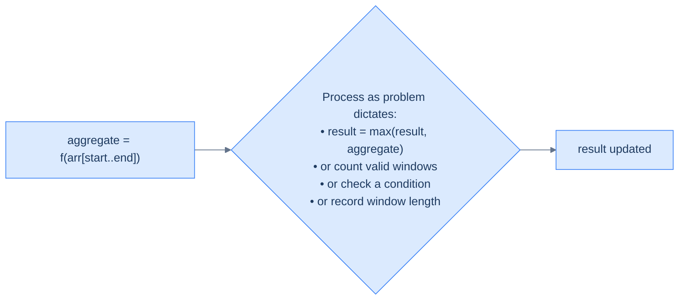
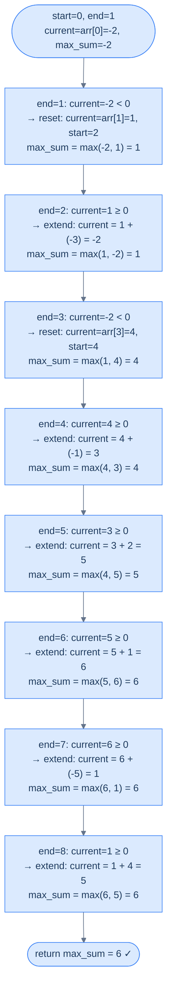
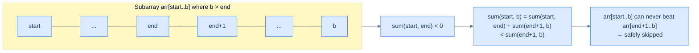
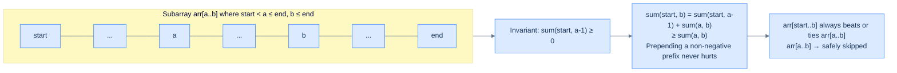
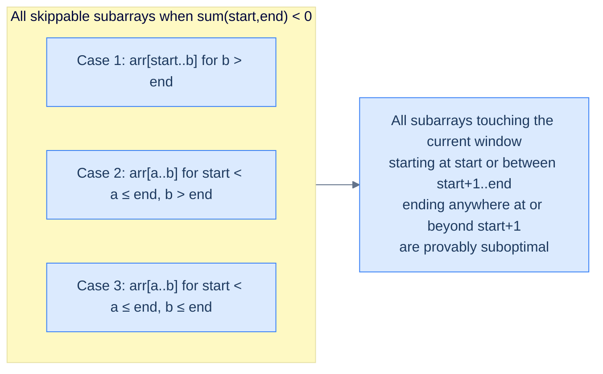

# 8. Pattern: Variable sized sliding window

This section covers window problems where the window expands and shrinks dynamically based on the condition being tracked.

## Table of contents

1. [Understanding the variable sized sliding window pattern](#understanding-the-variable-sized-sliding-window-pattern)
2. [Identifying the variable sized sliding window pattern](#identifying-the-variable-sized-sliding-window-pattern)
3. [Consecutive ones](#consecutive-ones)
4. [Product conundrum](#product-conundrum)
5. [Maximum subarray sum](#maximum-subarray-sum)
6. [Consecutive ones with K flips](#consecutive-ones-with-k-flips)

***

# Understanding the Variable Sized Sliding Window Pattern

## The Train Car Grew Elastic

The fixed sliding window was satisfying — a train car with exactly `k` seats, sliding smoothly down the track, processing every window of precisely `k` elements. Elegant and predictable.

But what if the problem doesn't give you `k`?

What if you need the *longest* subarray whose sum stays below a threshold? Or the *shortest* subarray whose product exceeds some limit? Or the subarray with the maximum possible sum — where the optimal length could be 1, 3, or N, depending entirely on the values?

The fixed window fails immediately. You'd have to run it for every possible window size from 1 to N — that's O(N²) total work, exactly as bad as the naive nested loops you were trying to escape.

There has to be a better way. And there is — but it demands a harder question: *can we skip most subarrays entirely without missing the answer?*

---

## The Rubber Band Window

Forget the train car with fixed seats. Picture a **rubber band** stretched across the array. The left end is pinned at index `start`. The right end is held at index `end`. As you move through the array, the band can **stretch** (moving `end` forward to include more elements) or **compress** (moving `start` forward to shrink from the left).

```d2
direction: right

stretch_before: "Before: arr[1..2]" {
  grid-columns: 6
  grid-gap: 0
  a0: "2"
  a1: "5" {style.fill: "#fde68a"; style.stroke: "#d97706"}
  a2: "1" {style.fill: "#fde68a"; style.stroke: "#d97706"}
  a3: "3"
  a4: "7"
  a5: "4"
}

stretch_op: |md
  **`end += 1`**

  `end`: 2 → 3, window grows right
|

stretch_after: "After: arr[1..3]" {
  grid-columns: 6
  grid-gap: 0
  b0: "2"
  b1: "5" {style.fill: "#fde68a"; style.stroke: "#d97706"}
  b2: "1" {style.fill: "#fde68a"; style.stroke: "#d97706"}
  b3: "3" {style.fill: "#dcfce7"; style.stroke: "#16a34a"}
  b4: "7"
  b5: "4"
}

stretch_before -> stretch_op
stretch_op -> stretch_after
```

```d2
direction: right

compress_before: "Before: arr[1..3]" {
  grid-columns: 6
  grid-gap: 0
  a0: "2"
  a1: "5" {style.fill: "#fde68a"; style.stroke: "#d97706"}
  a2: "1" {style.fill: "#fde68a"; style.stroke: "#d97706"}
  a3: "3" {style.fill: "#fde68a"; style.stroke: "#d97706"}
  a4: "7"
  a5: "4"
}

compress_op: |md
  **`start += 1`**

  `start`: 1 → 2, window shrinks left
|

compress_after: "After: arr[2..3]" {
  grid-columns: 6
  grid-gap: 0
  b0: "2"
  b1: "5"
  b2: "1" {style.fill: "#fde68a"; style.stroke: "#d97706"}
  b3: "3" {style.fill: "#fde68a"; style.stroke: "#d97706"}
  b4: "7"
  b5: "4"
}

compress_before -> compress_op
compress_op -> compress_after
```

<p align="center"><strong>The variable-sized window breathes — <code>end</code> stretches it right, <code>start</code> compresses it from the left. At any moment the window covers exactly <code>arr[start..end]</code>.</strong></p>

This is the variable-sized sliding window. Unlike the fixed window, its size isn't predetermined — it breathes, expanding and contracting in response to the values inside it. Two pointer variables mark its boundaries, and a variable called `aggregate` always holds the current value of some function `f` computed over every element in the window `arr[start..end]`.

The window always starts with `start = 0` and `end = 0`, representing a zero-sized window. Then it grows, processes, and shrinks as it moves through the array, guided by a decision the problem defines: when to expand, when to contract, and when to process.

---

## What You Are Trying to Avoid

Some problems require computing the output of an aggregate function over **all** subarrays of an array and then aggregating those results into a single value. To solve these naively, you would need to run fixed-sized sliding windows of every size from 1 to N through the array — one pass per size. That is O(N²) total work.

| Starts at | Subarrays                               | Count |
|----------:|-----------------------------------------|------:|
| `i = 0`   | `[2]`, `[2,5]`, `[2,5,1]`, `[2,5,1,3]`  | 4     |
| `i = 1`   | `[5]`, `[5,1]`, `[5,1,3]`               | 3     |
| `i = 2`   | `[1]`, `[1,3]`                          | 2     |
| `i = 3`   | `[3]`                                   | 1     |
| **Total** |                                         | **10** |

<p align="center"><strong>All 10 distinct subarrays of <code>[2, 5, 1, 3]</code>. An array of size N has N(N+1)/2 subarrays — for N=1000 that is 500,500; for N=10,000 that is over 50 million.</strong></p>

However, for some problems we may only need to find results for **some** subarrays and can safely skip the remaining ones. These problems can be solved by the variable-sized sliding window technique, which contracts or expands the window in each iteration as it slides through the array. It is a powerful technique that solves many problems in a single pass that would otherwise need nested loops.

```d2
direction: right

arr: "Variable-sized window: arr[start..end]" {
  grid-columns: 6
  grid-gap: 0
  a0: "2"
  a1: "5" {style.fill: "#fde68a"; style.stroke: "#d97706"}
  a2: "1" {style.fill: "#fde68a"; style.stroke: "#d97706"}
  a3: "3" {style.fill: "#fde68a"; style.stroke: "#d97706"}
  a4: "7"
  a5: "4"
}

s: "▲ start" {shape: oval; style.fill: "#fde68a"; style.stroke: "#d97706"}
e: "▲ end" {shape: oval; style.fill: "#fde68a"; style.stroke: "#d97706"}
agg: "aggregate = f(arr[1..3])"

s -> arr.a1
e -> arr.a3
arr -> agg: "" {style.stroke-dash: 3}
```

<p align="center"><strong>At any point in time the window spans <code>arr[start..end]</code> and <code>aggregate</code> holds the value of function <code>f</code> computed over exactly those elements.</strong></p>

Two prerequisites make variable window possible:
1. You can **add** an element's contribution to `aggregate` in O(1) — so you can grow the window cheaply
2. You can **remove** an element's contribution from `aggregate` in O(1) — so you can shrink the window cheaply
3. You can **prove** that skipping certain subarrays never misses the optimal answer — this is the hard part

If all three hold, you get O(N). If any fails, nested loops are unavoidable.

---

## The Four Operations

The variable-sized sliding window uses `start` and `end` for boundaries and `aggregate` for the running result of `f` over `arr[start..end]`. We initialize `aggregate` with some default value dictated by the problem and start with `start = 0` and `end = 0` (a zero-sized window). We iterate until `end` reaches the end of the array, and in each iteration perform some or all of the following four operations.

### Operation 1 — Update Aggregate with Item at `end`

We update `aggregate` by adding the contribution of `arr[end]` to it so that `aggregate` always reflects the function `f` computed over all elements in the current window, including the one at `end`.

```d2
direction: right

before: "Before: arr[1..2], aggregate = 6" {
  grid-columns: 6
  grid-gap: 0
  a0: "2"
  a1: "5" {style.fill: "#fde68a"; style.stroke: "#d97706"}
  a2: "1" {style.fill: "#fde68a"; style.stroke: "#d97706"}
  a3: "3"
  a4: "7"
  a5: "4"
}

op: |md
  `aggregate = f(aggregate, arr[end])`

  `= f(6, arr[3]) = f(6, 3) = 9`
|

after_note: "aggregate now reflects arr[1..3]"

before -> op
op -> after_note
```

<p align="center"><strong>Operation 1: add <code>arr[end]</code>'s contribution to <code>aggregate</code>. After this step, <code>aggregate</code> holds the value of <code>f</code> over the entire current window <code>arr[start..end]</code>.</strong></p>

The function `f` must support an O(1) add operation. Common examples: `aggregate += arr[end]` for sum, `aggregate *= arr[end]` for product, `freq[arr[end]] += 1` for frequency counts.

### Operation 2 — Process the Aggregate

The value stored in `aggregate` is the aggregated value of the function `f` over the subarray from `start` to `end`. We process it as dictated by the problem — update a running maximum, check a validity condition, record a window length, count a match, or anything else the problem asks.



<p align="center"><strong>Operation 2: use the current aggregate. This is the step where the problem's output logic lives — every window evaluated here is a candidate for the final answer.</strong></p>

### Operation 3 — Contract the Window by Incrementing `start`

If we can skip all remaining subarrays starting at `start` — specifically the ones that would end beyond `end` — we increment `start` by 1, which contracts the window from the left. We also update `aggregate` to remove the contribution of `arr[start]` (the item being removed from the window).

```d2
direction: right

before: "Before: arr[1..3], invariant violated" {
  grid-columns: 6
  grid-gap: 0
  a0: "2"
  a1: "5" {style.fill: "#fde68a"; style.stroke: "#d97706"}
  a2: "1" {style.fill: "#fde68a"; style.stroke: "#d97706"}
  a3: "3" {style.fill: "#fde68a"; style.stroke: "#d97706"}
  a4: "7"
  a5: "4"
}

op: |md
  `aggregate = f_inverse(aggregate, arr[start])`

  `start += 1`

  Subarrays starting at old `start` are skipped.
|

after: "After: arr[2..3], invariant restored" {
  grid-columns: 6
  grid-gap: 0
  b0: "2"
  b1: "5"
  b2: "1" {style.fill: "#dcfce7"; style.stroke: "#16a34a"}
  b3: "3" {style.fill: "#dcfce7"; style.stroke: "#16a34a"}
  b4: "7"
  b5: "4"
}

before -> op
op -> after
```

<p align="center"><strong>Operation 3: remove <code>arr[start]</code>'s contribution from <code>aggregate</code> and advance <code>start</code>. This permanently discards all subarrays beginning at the old <code>start</code> that extend beyond <code>end</code>.</strong></p>

```
aggregate = f_inverse(aggregate, arr[start])  # Remove arr[start]'s contribution
start += 1                                     # Contract window from the left
```

Critical: one contraction isn't always enough. Many problems require a **while loop** on the contraction condition — keep shrinking until the invariant is fully restored before moving on. The choice between `if` and `while` here is one of the most important decisions when adapting the template to a specific problem.

### Operation 4 — Expand the Window by Incrementing `end`

If we want to consider the next subarray starting at `start` — that is, the subarray from `start` to `end+1` — in the next iteration, we increment `end` by 1, which expands the window to the right. We do **not** add the contribution of the newly added item to `aggregate` yet — that will be done in the next iteration's Operation 1.

```d2
direction: right

before: "Current: arr[1..3]" {
  grid-columns: 6
  grid-gap: 0
  a0: "2"
  a1: "5" {style.fill: "#fde68a"; style.stroke: "#d97706"}
  a2: "1" {style.fill: "#fde68a"; style.stroke: "#d97706"}
  a3: "3" {style.fill: "#fde68a"; style.stroke: "#d97706"}
  a4: "7"
  a5: "4"
}

op: |md
  `end += 1`

  `arr[end] = 7` is added in the next iteration.
|

after: "After: arr[1..4] next iteration" {
  grid-columns: 6
  grid-gap: 0
  b0: "2"
  b1: "5" {style.fill: "#fde68a"; style.stroke: "#d97706"}
  b2: "1" {style.fill: "#fde68a"; style.stroke: "#d97706"}
  b3: "3" {style.fill: "#fde68a"; style.stroke: "#d97706"}
  b4: "7" {style.fill: "#dcfce7"; style.stroke: "#16a34a"}
  b5: "4"
}

before -> op
op -> after
```

<p align="center"><strong>Operation 4: advance <code>end</code> to expand the window. The element at the new <code>end</code> position is NOT added to <code>aggregate</code> yet — that happens in the very next iteration's Operation 1.</strong></p>

```
end += 1  # arr[end]'s contribution will be added in the next iteration
```

---

## The Variable Sized Sliding Window Technique

The variable-sized sliding window technique uses two variables `start` and `end` to maintain a window in the array and a variable `aggregate` that always holds the aggregated value of `f` over the current window. We initialize `aggregate` with some default value dictated by the problem, and start with `start = 0` and `end = 0` denoting a zero-sized window. We iterate until `end` reaches the end of the array and in each iteration do some or all of the operations described above.

> **Step 1:** Initialize two variables, `start` and `end` to 0.
>
> **Step 2:** Initialize `aggregate` to some initial value dictated by the problem.
>
> **Step 3:** Loop while `end` < `arr.size()` and do the following:
>
> - **Step 3.1:** Check if we should compute `aggregate`:
>   - **Step 3.1.1:** Add the contribution of `arr[end]` to `aggregate`
>
> - **Step 3.2:** Process `aggregate` as dictated by the problem
>
> - **Step 3.3:** Check if we should contract the window:
>   - **Step 3.3.1:** Remove the contribution of `arr[start]` from `aggregate` using the inverse function
>   - **Step 3.3.2:** Increment `start` by 1
>
> - **Step 3.4:** Check if we should expand the window:
>   - **Step 3.4.1:** Increment `end` by 1

The four adaptations you make when solving a specific problem:
- **What is `aggregate`?** Sum, product, frequency map, distinct element count, or something else
- **When do you compute the aggregate (Step 3.1)?** Always, or only under certain conditions
- **When and how many times do you contract (Step 3.3)?** `if` for at most one contraction per iteration, `while` for as many as needed
- **What does "process" do (Step 3.2)?** Update a max, count valid windows, record a length, check a condition

---

## Implementation

Given below is the generic code implementation of the variable-sized sliding window technique on an array `arr`, using `start` and `end` as the boundaries of the window.


```pseudocode
# Generic variable-window template. Predicates `shouldContract` / `shouldExpand` are
# problem-specific. Often `shouldContract` is a `while` loop, not just an `if`.
function variableSlidingWindow(arr):
    start ← 0; end ← 0
    aggregate ← 0
    while end < length(arr):
        aggregate ← fAdd(aggregate, arr[end])         # 1. add arr[end]
        process(aggregate)                            # 2. record this window's answer
        if shouldContract():                          # 3. shrink (use `while` if needed)
            aggregate ← fRemove(aggregate, arr[start])
            start ← start + 1
        if shouldExpand():                            # 4. extend right
            end ← end + 1
```

```python run
from typing import List

def f_add(agg, x): return agg + x
def f_remove(agg, x): return agg - x
def process(agg): pass

# Stand-in flags — replace with the real problem-specific predicates.
should_contract = False
should_expand   = True

def variable_sliding_window(arr: List[int]) -> None:
    start = end = 0
    aggregate = 0
    while end < len(arr):
        aggregate = f_add(aggregate, arr[end])         # Step 3.1: add arr[end].
        process(aggregate)                              # Step 3.2: process current window.

        if should_contract:                             # Step 3.3: shrink (use while if needed).
            aggregate = f_remove(aggregate, arr[start])
            start += 1

        if should_expand:                               # Step 3.4: extend right.
            end += 1
```

```java run
public class Main {
    static int fAdd(int agg, int x)    { return agg + x; }
    static int fRemove(int agg, int x) { return agg - x; }
    static void process(int agg)       { /* problem-specific */ }

    static boolean shouldContract = false;
    static boolean shouldExpand   = true;

    static void variableSlidingWindow(int[] arr) {
        int start = 0, end = 0, aggregate = 0;
        while (end < arr.length) {
            aggregate = fAdd(aggregate, arr[end]);
            process(aggregate);

            if (shouldContract) {
                aggregate = fRemove(aggregate, arr[start]);
                start++;
            }
            if (shouldExpand) {
                end++;
            }
        }
    }

    public static void main(String[] args) {
        variableSlidingWindow(new int[]{1, 2, 3, 4});
        System.out.println("Template ran.");
    }
}
```

```c run
#include <stdio.h>
#include <stdbool.h>

int  f_add(int agg, int x)    { return agg + x; }
int  f_remove(int agg, int x) { return agg - x; }
void process(int agg)         { (void)agg; }

bool should_contract = false;
bool should_expand   = true;

void variable_sliding_window(int* arr, int n) {
    int start = 0, end = 0, aggregate = 0;
    while (end < n) {
        aggregate = f_add(aggregate, arr[end]);
        process(aggregate);
        if (should_contract) {
            aggregate = f_remove(aggregate, arr[start]);
            start++;
        }
        if (should_expand) end++;
    }
}

int main() {
    int arr[] = {1, 2, 3, 4};
    variable_sliding_window(arr, 4);
    printf("Template ran.\n");
    return 0;
}
```

```scala run
object Main extends App {
  def fAdd(agg: Int, x: Int): Int    = agg + x
  def fRemove(agg: Int, x: Int): Int = agg - x
  def process(agg: Int): Unit = ()

  val shouldContract = false
  val shouldExpand   = true

  def variableSlidingWindow(arr: Array[Int]): Unit = {
    var start = 0
    var end = 0
    var aggregate = 0
    while (end < arr.length) {
      aggregate = fAdd(aggregate, arr(end))
      process(aggregate)
      if (shouldContract) {
        aggregate = fRemove(aggregate, arr(start))
        start += 1
      }
      if (shouldExpand) end += 1
    }
  }

  variableSlidingWindow(Array(1, 2, 3, 4))
  println("Template ran.")
}
```


Notice how this template mirrors the fixed window structurally — the same `start`, `end`, `aggregate` trio — but the contraction and expansion decisions are now **conditional** rather than triggered mechanically by the window size crossing `k`. That conditionality is where all the problem-specific logic lives.

---

## Complexity Analysis

The algorithm's time and space complexity is straightforward to reason about.

We create a sliding window using `start` and `end`, and with each iteration we either move, expand, or contract it. Both `start` and `end` are initialized to 0, and at least one of them moves forward in each iteration. This means there can be a maximum of **2×N** iterations of the outer while loop before both pointers reach the end of the array.

In the worst case, both `start` and `end` iterate the entire array — leading to O(2×N) ≈ **O(N)** time complexity, assuming that both `f_add` and `f_remove` have constant O(1) time complexity. In the best case, `end` reaches the end of the array after N iterations, which also gives linear **O(N)** time.

Since we do not create any new data structure that grows with the input, the space complexity is constant **O(1)** in any case.

| | Time | Space |
|---|---|---|
| Best case | **O(N)** | **O(1)** |
| Worst case | **O(N)** | **O(1)** |

**Compared to brute force:** A naive nested loop evaluates all N(N+1)/2 subarrays at O(f) per subarray — total O(N² × f). Variable window achieves O(N × f). For f = O(1) and N = 10,000: brute force performs ~50 million operations; variable window performs 10,000. That is not a minor improvement — it is the difference between milliseconds and seconds.

---

Later in the course, we will examine techniques for identifying problems that can be solved using the variable-sized sliding window technique and walk through a complete example to better understand it.

***

# Identifying the Variable Sized Sliding Window Pattern

## The Honesty Test

You now know what a variable-sized sliding window does. But knowing the technique isn't enough — you need to know *when it applies*. Walk into any problem about subarrays and naively reach for this pattern, and you might spend an hour implementing something that is provably wrong.

There is a checklist. Every box must be checked before the variable window is safe to use.

---

## The Identification Template

Some specific problems where we need to return a single result after aggregating the results from all subarrays in an array can be solved using the variable-sized sliding window technique. In these problems, we can often skip calculating results for some subarrays by identifying when to expand, contract, or move the window. These are generally medium or hard problems, as we need to make some critical observations and prove that skipping some subarrays does not affect the correctness of the solution.

If the problem statement or its solution follows the generic template below, it can be solved by applying the variable-sized sliding window technique:

> Given an array, compute the value of an aggregate function `f` for all subarrays. Apply another aggregate function `g` on the results and return the output. We should be able to add and remove the contribution of an item from the aggregate computed by `f`.

Breaking the template down:
- **`f`** is the per-subarray aggregate — the function you compute over every element in a window (sum, product, count of distinct elements, etc.)
- **`g`** is the cross-subarray aggregate — the function you apply across all subarray results to get the final answer (maximum, minimum, count of valid windows, etc.)
- **Add/remove in O(1)** — the critical mechanical requirement. If you cannot undo an element's contribution to `f` in constant time, the variable window gains you nothing.
- **Provable skipping** — the critical mathematical requirement. You must establish a **window invariant**: a condition about the current window that lets you prove entire families of subarrays are suboptimal and can be ignored without missing the answer. This is what makes these problems hard.

---

## A Worked Example — Maximum Subarray Sum

Let's walk through the complete identification, solution, and proof process on a concrete problem.

**Problem statement:** Given an integer array `arr`, find the subarray with the largest sum and return the sum.

```d2
direction: right

array: "arr = [-2, 1, -3, 4, -1, 2, 1, -5, 4]" {
  grid-columns: 9
  grid-gap: 0
  a0: "-2"
  a1: "1"
  a2: "-3"
  a3: "4" {style.fill: "#dcfce7"; style.stroke: "#16a34a"}
  a4: "-1" {style.fill: "#dcfce7"; style.stroke: "#16a34a"}
  a5: "2" {style.fill: "#dcfce7"; style.stroke: "#16a34a"}
  a6: "1" {style.fill: "#dcfce7"; style.stroke: "#16a34a"}
  a7: "-5"
  a8: "4"
}

best: "Maximum sum subarray: [4, -1, 2, 1] → sum = 6" {
  grid-columns: 4
  grid-gap: 0
  b0: "4" {style.fill: "#dcfce7"; style.stroke: "#16a34a"}
  b1: "-1" {style.fill: "#dcfce7"; style.stroke: "#16a34a"}
  b2: "2" {style.fill: "#dcfce7"; style.stroke: "#16a34a"}
  b3: "1" {style.fill: "#dcfce7"; style.stroke: "#16a34a"}
}
```

<p align="center"><strong>Find the subarray with the maximum sum. The answer is not always the whole array — negative elements can drag it down, making a shorter subarray better.</strong></p>

### Does It Fit the Template?

The problem description fits the template for variable-sized sliding window problems as described below:

- **`f` = sum:** Compute the sum of all elements in the current window
- **`g` = maximum:** Find the maximum sum across all subarrays
- **O(1) add?** Yes — `aggregate += arr[end]`
- **O(1) remove?** Yes — `aggregate -= arr[start]`
- **Can we skip subarrays?** We need to make a key observation and prove it — that is what makes this problem non-trivial

Three boxes check immediately. The fourth — provable skipping — is the hard part, and we will look at the proof after the solution.

---

## The Brute Force Solution

The brute-force solution is to use nested loops to find the sum of all possible subarrays. If the sum of any subarray is greater than the maximum seen so far, we update the maximum sum value. Below is an execution of the brute force solution on the array.

```d2
direction: right

i0: "Outer loop i=0: all subarrays starting at index 0" {
  grid-columns: 4
  grid-gap: 16
  j0a: |md
    `[-2]`

    sum=-2
  |
  j0b: |md
    `[-2,1]`

    sum=-1
  |
  j0c: |md
    `[-2,1,-3]`

    sum=-4
  |
  j0d: "..."
}

i1: "Outer loop i=1: all subarrays starting at index 1" {
  grid-columns: 4
  grid-gap: 16
  j1a: |md
    `[1]`

    sum=1
  |
  j1b: |md
    `[1,-3]`

    sum=-2
  |
  j1c: |md
    `[1,-3,4]`

    sum=2
  |
  j1d: "..."
}

i3: "Outer loop i=3: all subarrays starting at index 3" {
  grid-columns: 4
  grid-gap: 16
  j3a: |md
    `[4]`

    sum=4
  |
  j3b: |md
    `[4,-1]`

    sum=3
  |
  j3c: |md
    `[4,-1,2]`

    sum=5
  |
  j3d: |md
    `[4,-1,2,1]`

    sum=6 ← new max
  | {style.fill: "#dcfce7"; style.stroke: "#16a34a"}
}
```

<p align="center"><strong>Brute force checks every subarray — N(N+1)/2 total. For each outer position <code>i</code>, the inner loop extends <code>j</code> rightward accumulating the sum. Every subarray is evaluated explicitly.</strong></p>

```d3 widget=array-traversal
{
  "items": ["-2", "1", "-3", "4", "-1", "2", "1", "-5", "4"],
  "title": "Brute force max subarray sum — selected highlights",
  "steps": [
    { "markers": [{"name": "i", "index": 0, "color": "#3b82f6"}, {"name": "j", "index": 0, "color": "#f59e0b"}], "range": {"lo": 0, "hi": 0}, "msg": "i=0, j=0 → subarray=[-2], sum=-2; maxSum=-2." },
    { "markers": [{"name": "i", "index": 0, "color": "#3b82f6"}, {"name": "j", "index": 1, "color": "#f59e0b"}], "range": {"lo": 0, "hi": 1}, "msg": "i=0, j=1 → subarray=[-2,1], sum=-1; maxSum=-1." },
    { "markers": [{"name": "i", "index": 0, "color": "#3b82f6"}, {"name": "j", "index": 8, "color": "#f59e0b"}], "range": {"lo": 0, "hi": 8}, "msg": "…i=0 continues to j=8 (all subarrays starting at 0)." },
    { "markers": [{"name": "i", "index": 1, "color": "#3b82f6"}, {"name": "j", "index": 1, "color": "#f59e0b"}], "range": {"lo": 1, "hi": 1}, "msg": "i=1, j=1 → subarray=[1], sum=1." },
    { "markers": [{"name": "i", "index": 3, "color": "#3b82f6"}, {"name": "j", "index": 3, "color": "#f59e0b"}], "range": {"lo": 3, "hi": 3}, "msg": "i=3, j=3 → subarray=[4], sum=4; maxSum=4." },
    { "markers": [{"name": "i", "index": 3, "color": "#3b82f6"}, {"name": "j", "index": 4, "color": "#f59e0b"}], "range": {"lo": 3, "hi": 4}, "msg": "i=3, j=4 → subarray=[4,-1], sum=3." },
    { "markers": [{"name": "i", "index": 3, "color": "#3b82f6"}, {"name": "j", "index": 5, "color": "#f59e0b"}], "range": {"lo": 3, "hi": 5}, "msg": "i=3, j=5 → subarray=[4,-1,2], sum=5; maxSum=5." },
    { "markers": [{"name": "i", "index": 3, "color": "#3b82f6"}, {"name": "j", "index": 6, "color": "#f59e0b"}], "range": {"lo": 3, "hi": 6}, "msg": "i=3, j=6 → subarray=[4,-1,2,1], sum=6; maxSum=6 ★." },
    { "markers": [{"name": "i", "index": 3, "color": "#3b82f6"}, {"name": "j", "index": 7, "color": "#f59e0b"}], "range": {"lo": 3, "hi": 7}, "msg": "i=3, j=7 → subarray=[4,-1,2,1,-5], sum=1; maxSum stays 6." },
    { "markers": [{"name": "i", "index": 3, "color": "#3b82f6"}, {"name": "j", "index": 8, "color": "#f59e0b"}], "range": {"lo": 3, "hi": 8}, "msg": "i=3, j=8 → subarray=[4,-1,2,1,-5,4], sum=5; maxSum stays 6. Outer loop continues to i=4..8 (all dominated by earlier 6)." }
  ]
}
```


```pseudocode
# Brute force — every subarray (i, j). O(n²).
function maxSubarraySumBrute(arr):
    maxSum ← −∞
    for i from 0 to length(arr) − 1:
        currentSum ← 0
        for j from i to length(arr) − 1:
            currentSum ← currentSum + arr[j]
            maxSum ← max(maxSum, currentSum)
    return maxSum
```

```python run
from typing import List

def max_subarray_sum_brute(arr: List[int]) -> int:
    max_sum = float('-inf')                          # -∞ handles all-negative arrays.
    for i in range(len(arr)):
        current_sum = 0
        for j in range(i, len(arr)):
            current_sum += arr[j]
            max_sum = max(current_sum, max_sum)
    return max_sum

print(max_subarray_sum_brute([-2, 1, -3, 4, -1, 2, 1, -5, 4]))   # 6
```

```java run
public class Main {
    static int maxSubarraySumBrute(int[] arr) {
        int maxSum = Integer.MIN_VALUE;
        for (int i = 0; i < arr.length; i++) {
            int currentSum = 0;
            for (int j = i; j < arr.length; j++) {
                currentSum += arr[j];
                if (currentSum > maxSum) maxSum = currentSum;
            }
        }
        return maxSum;
    }

    public static void main(String[] args) {
        System.out.println(maxSubarraySumBrute(new int[]{-2, 1, -3, 4, -1, 2, 1, -5, 4}));
    }
}
```

```c run
#include <stdio.h>
#include <limits.h>

int max_subarray_sum_brute(int* arr, int n) {
    int max_sum = INT_MIN;
    for (int i = 0; i < n; i++) {
        int current = 0;
        for (int j = i; j < n; j++) {
            current += arr[j];
            if (current > max_sum) max_sum = current;
        }
    }
    return max_sum;
}

int main() {
    int arr[] = {-2, 1, -3, 4, -1, 2, 1, -5, 4};
    printf("%d\n", max_subarray_sum_brute(arr, 9));
    return 0;
}
```

```scala run
object Main extends App {
  def maxSubarraySumBrute(arr: Array[Int]): Int = {
    var maxSum = Int.MinValue
    for (i <- arr.indices) {
      var current = 0
      for (j <- i until arr.length) {
        current += arr(j)
        maxSum = math.max(maxSum, current)
      }
    }
    maxSum
  }

  println(maxSubarraySumBrute(Array(-2, 1, -3, 4, -1, 2, 1, -5, 4)))
}
```


Though the solution is correct, it requires nested loops and has a time complexity of **O(N²)** in any case. For N = 100,000, this runs approximately 5 billion operations — completely impractical.

---

## The Variable Sized Sliding Window Solution

By closely observing the problem, we can see that we don't need to calculate the sum of all subarrays to find the subarray with the maximum sum. Here is the key insight:

**If the running sum of a window turns negative, then every subarray extending that window will be beaten by a fresh start from the next element.** Adding more elements to a subarray that is already negative can only make things worse. Any subarray that starts fresh from the very next index will have a strictly better sum.

This is the **window invariant** that we maintain:

> For all indices `i` such that `start ≤ i < end`, the sum `arr[start..i]` is non-negative.

We initialize `start` and `end` to 0 to create a sliding window and iterate using `end` until we reach the end of the array. We create variables `sum` and `max_sum` to aggregate the sum of all items in the current window and keep track of the maximum sum seen so far.

In each iteration, we add the item at `end` to `sum` and update `max_sum` if `sum` is greater than the maximum seen so far. If `sum` turns negative at any point, we set `start = end + 1` to effectively contract the window size back to 0 when the window expands at the end of the iteration. We also set `sum = 0` to reset the aggregate as the window size is now 0.

Below is the execution of the variable-sized sliding window technique on the example array:



```d3 widget=array-traversal
{
  "items": ["-2", "1", "-3", "4", "-1", "2", "1", "-5", "4"],
  "title": "Variable-window max subarray sum (Kadane's) on [-2, 1, -3, 4, -1, 2, 1, -5, 4]",
  "steps": [
    { "markers": [{"name": "start", "index": 0, "color": "#3b82f6"}, {"name": "end", "index": 0, "color": "#f59e0b"}], "range": {"lo": 0, "hi": 0}, "msg": "Init: current = arr[0] = −2, maxSum = −2." },
    { "markers": [{"name": "start", "index": 1, "color": "#3b82f6"}, {"name": "end", "index": 1, "color": "#f59e0b"}], "range": {"lo": 1, "hi": 1}, "msg": "end=1, current=−2 < 0 → reset: current=arr[1]=1, start=1; maxSum = max(−2, 1) = 1." },
    { "markers": [{"name": "start", "index": 1, "color": "#3b82f6"}, {"name": "end", "index": 2, "color": "#f59e0b"}], "range": {"lo": 1, "hi": 2}, "msg": "end=2, current=1 ≥ 0 → extend: current = 1 + (−3) = −2; maxSum stays 1." },
    { "markers": [{"name": "start", "index": 3, "color": "#3b82f6"}, {"name": "end", "index": 3, "color": "#f59e0b"}], "range": {"lo": 3, "hi": 3}, "msg": "end=3, current=−2 < 0 → reset: current=arr[3]=4, start=3; maxSum = max(1, 4) = 4." },
    { "markers": [{"name": "start", "index": 3, "color": "#3b82f6"}, {"name": "end", "index": 4, "color": "#f59e0b"}], "range": {"lo": 3, "hi": 4}, "msg": "end=4, current=4 ≥ 0 → extend: current = 4 + (−1) = 3; maxSum stays 4." },
    { "markers": [{"name": "start", "index": 3, "color": "#3b82f6"}, {"name": "end", "index": 5, "color": "#f59e0b"}], "range": {"lo": 3, "hi": 5}, "msg": "end=5, current=3 ≥ 0 → extend: current = 3 + 2 = 5; maxSum = max(4, 5) = 5." },
    { "markers": [{"name": "start", "index": 3, "color": "#3b82f6"}, {"name": "end", "index": 6, "color": "#f59e0b"}], "range": {"lo": 3, "hi": 6}, "msg": "end=6, current=5 ≥ 0 → extend: current = 5 + 1 = 6; maxSum = max(5, 6) = 6 ★." },
    { "markers": [{"name": "start", "index": 3, "color": "#3b82f6"}, {"name": "end", "index": 7, "color": "#f59e0b"}], "range": {"lo": 3, "hi": 7}, "msg": "end=7, current=6 ≥ 0 → extend: current = 6 + (−5) = 1; maxSum stays 6." },
    { "markers": [{"name": "start", "index": 3, "color": "#3b82f6"}, {"name": "end", "index": 8, "color": "#f59e0b"}], "range": {"lo": 3, "hi": 8}, "msg": "end=8, current=1 ≥ 0 → extend: current = 1 + 4 = 5; maxSum stays 6 → return 6." }
  ]
}
```

<p align="center"><strong>The variable-sized sliding window skips all subarrays starting between <code>start+1</code> and <code>end</code>, and all subarrays starting at <code>start</code> and ending beyond <code>end</code>. Two resets occur — at <code>end=1</code> and <code>end=3</code> — discarding all subarrays rooted in those negative prefixes.</strong></p>


```pseudocode
# Kadane's algorithm — sliding-window form. O(n).
# If the running sum goes negative, restart fresh at the next element.
function maxSubarraySum(arr):
    n ← length(arr)
    if n = 0: return 0
    current ← arr[0]                              # seed with arr[0] for all-negative inputs
    maxSum  ← arr[0]
    end ← 1
    while end < n:
        if current < 0:
            current ← arr[end]                    # negative prefix only hurts — restart
        else:
            current ← current + arr[end]
        maxSum ← max(maxSum, current)
        end ← end + 1
    return maxSum
```

```python run
from typing import List

def max_subarray_sum(arr: List[int]) -> int:
    n = len(arr)
    if n == 0:
        return 0

    # Seed with arr[0] — using 0 would break all-negative inputs like [-3, -1, -2].
    current = max_sum = arr[0]
    start = 0
    end = 1

    while end < n:
        if current < 0:
            # Negative prefix can only hurt — restart fresh at end.
            current = arr[end]
            start   = end
        else:
            current += arr[end]
        max_sum = max(max_sum, current)
        end += 1
    return max_sum


print(max_subarray_sum([-2, 1, -3, 4, -1, 2, 1, -5, 4]))   # 6
print(max_subarray_sum([-3, -1, -2]))                       # -1
print(max_subarray_sum([1]))                                 # 1
```

```java run
public class Main {
    static int maxSubarraySum(int[] arr) {
        int n = arr.length;
        if (n == 0) return 0;
        int current = arr[0], maxSum = arr[0];
        for (int end = 1; end < n; end++) {
            if (current < 0) current = arr[end];
            else             current += arr[end];
            if (current > maxSum) maxSum = current;
        }
        return maxSum;
    }

    public static void main(String[] args) {
        System.out.println(maxSubarraySum(new int[]{-2, 1, -3, 4, -1, 2, 1, -5, 4}));
        System.out.println(maxSubarraySum(new int[]{-3, -1, -2}));
        System.out.println(maxSubarraySum(new int[]{1}));
    }
}
```

```c run
#include <stdio.h>

int max_subarray_sum(int* arr, int n) {
    if (n == 0) return 0;
    int current = arr[0], max_sum = arr[0];
    for (int end = 1; end < n; end++) {
        if (current < 0) current = arr[end];
        else             current += arr[end];
        if (current > max_sum) max_sum = current;
    }
    return max_sum;
}

int main() {
    int a1[] = {-2, 1, -3, 4, -1, 2, 1, -5, 4};
    int a2[] = {-3, -1, -2};
    int a3[] = {1};
    printf("%d\n", max_subarray_sum(a1, 9));
    printf("%d\n", max_subarray_sum(a2, 3));
    printf("%d\n", max_subarray_sum(a3, 1));
    return 0;
}
```

```scala run
object Main extends App {
  def maxSubarraySum(arr: Array[Int]): Int = {
    if (arr.isEmpty) return 0
    var current = arr(0)
    var maxSum = arr(0)
    for (end <- 1 until arr.length) {
      current = if (current < 0) arr(end) else current + arr(end)
      maxSum = math.max(maxSum, current)
    }
    maxSum
  }

  println(maxSubarraySum(Array(-2, 1, -3, 4, -1, 2, 1, -5, 4)))
  println(maxSubarraySum(Array(-3, -1, -2)))
  println(maxSubarraySum(Array(1)))
}
```


<details>
<summary><strong>Trace — arr = [-2, 1, -3, 4, -1, 2, 1, -5, 4]</strong></summary>

```
arr = [-2, 1, -3, 4, -1, 2, 1, -5, 4]
Initial: current = arr[0] = -2, max_sum = -2, end → 1

end=1: current=-2 < 0 → reset  | current=arr[1]=1, start=2     | max_sum=max(-2,1)=1
end=2: current=1 ≥ 0  → extend | current=1+(-3)=-2             | max_sum=max(1,-2)=1
end=3: current=-2 < 0 → reset  | current=arr[3]=4, start=4     | max_sum=max(1,4)=4
end=4: current=4 ≥ 0  → extend | current=4+(-1)=3              | max_sum=max(4,3)=4
end=5: current=3 ≥ 0  → extend | current=3+2=5                 | max_sum=max(4,5)=5
end=6: current=5 ≥ 0  → extend | current=5+1=6                 | max_sum=max(5,6)=6
end=7: current=6 ≥ 0  → extend | current=6+(-5)=1              | max_sum=max(6,1)=6
end=8: current=1 ≥ 0  → extend | current=1+4=5                 | max_sum=max(6,5)=6

Result: 6 ✓  (subarray [4, -1, 2, 1], indices 3..6)
The two resets (at end=1 and end=3) skipped all subarrays rooted at negative prefixes.
```

</details>

As the code above demonstrates, using the variable-sized sliding window technique we solve the problem in a **single pass in O(N) time**. But how do we know this is safe? We need to prove that resetting when the sum goes negative never causes us to miss the actual maximum subarray.

---

## Proof of Correctness

Consider we have an array `arr` and a window denoted by `start` and `end` (including `start`, including `end`) somewhere in the array such that `sum(start, i)` is non-negative for all `i` such that `start ≤ i < end`. This will be the **invariant** that we maintain throughout the execution.

```d2
invariant: "Invariant: sum(start, i) ≥ 0 for all i in [start, end)" {
  grid-columns: 6
  grid-gap: 0
  s_node: "start"
  i1: "arr[start]" {style.fill: "#dcfce7"; style.stroke: "#16a34a"}
  i2: "arr[start+1]" {style.fill: "#dcfce7"; style.stroke: "#16a34a"}
  i3: "..."
  ie: "arr[end-1]" {style.fill: "#dcfce7"; style.stroke: "#16a34a"}
  e_node: "end"
}

note: |md
  Every prefix sum

  `arr[start..i] ≥ 0`
| {style.fill: "#dcfce7"; style.stroke: "#16a34a"}

invariant -> note: "" {style.stroke-dash: 3}
```

<p align="center"><strong>The invariant states that every partial sum from <code>start</code> to any index before <code>end</code> is non-negative. The window has been "clean" up to this point.</strong></p>

Now consider that adding the item at index `end` turns the sum negative — that is, `sum(start, end)` is negative:

```d2
direction: right

brk: "sum(start, end) < 0 — invariant broken" {
  grid-columns: 5
  grid-gap: 0
  s_node: "start"
  i1: "arr[start]"
  i2: "..."
  ie: "arr[end-1]"
  endn: |md
    `arr[end]`

    ← this broke it
  | {style.fill: "#fecaca"; style.stroke: "#dc2626"}
}

note: "sum(start, end) < 0" {style.fill: "#fecaca"; style.stroke: "#dc2626"}

brk -> note: "" {style.stroke-dash: 3}
```

<p align="center"><strong>Adding <code>arr[end]</code> pushed the total sum below zero. We now prove that every subarray touching this region can be safely discarded as a candidate for the maximum sum.</strong></p>

If the invariant holds, we can prove that all of the following subarrays can never have the maximum sum and can be ignored.

---

### 1. Subarrays Starting at `start` and Ending Beyond `end`

Consider a subarray starting at `start` and ending beyond `end` at some index `b`. We can prove that `sum(start, b)` can never be the maximum sum. This is because `sum(end+1, b)` will always be greater, since `sum(start, end)` is negative.

Decompose: `sum(start, b) = sum(start, end) + sum(end+1, b)`

Since `sum(start, end) < 0`: `sum(start, b) < sum(end+1, b)`



<p align="center"><strong>Case 1: a negative prefix drags down any extension beyond it. Starting fresh at <code>end+1</code> always produces a higher sum.</strong></p>

**Conclusion:** We can skip all subarrays starting at `start` and ending beyond `end`.

---

### 2. Subarrays Starting Between `start+1` and `end` and Ending Beyond `end`

Consider a subarray starting between `start + 1` and `end` (including both) at some index `a`, and ending beyond `end` at some index `b`. We can see that `sum(a, b)` can never be the maximum sum, because it will always be less than `sum(end+1, b)`.

The argument: `sum(a, end)` is negative. This is because `sum(start, end)` is negative and, per our invariant, `sum(start, a-1)` is non-negative — which means `sum(a, end)` must be negative (a non-negative prefix cannot be responsible for a negative total; the remainder must be).

Once we know `sum(a, end) < 0`, the same argument from Case 1 applies: `sum(a, b) = sum(a, end) + sum(end+1, b) < sum(end+1, b)`.

```mermaid
---
config:
  theme: base
  themeVariables:
    primaryColor: "#dbeafe"
    primaryBorderColor: "#3b82f6"
    primaryTextColor: "#1e3a5f"
    lineColor: "#64748b"
    secondaryColor: "#ede9fe"
    tertiaryColor: "#fef9c3"
---
flowchart LR
    subgraph Structure["Subarray arr[a..b] where start < a ≤ end, b > end"]
        direction LR
        S["start"] --- Dots1["..."] --- A["a"] --- Dots2["..."] --- EN["end"] --- Dots3["..."] --- B["b"]
    end
    Inv["Invariant: sum(start, a-1) ≥ 0"]
    Neg["sum(start, end) < 0 and sum(start, a-1) ≥ 0<br/>⟹ sum(a, end) < 0"]
    Comp["sum(a, b) = sum(a, end) + sum(end+1, b)<br/>< sum(end+1, b)"]
    Conc["arr[a..b] can never beat arr[end+1..b]<br/>→ safely skipped"]
    Structure --> Inv --> Neg --> Comp --> Conc
```



<p align="center"><strong>Case 2: any subarray rooted between <code>start+1</code> and <code>end</code> that extends beyond <code>end</code> is beaten by starting fresh at <code>end+1</code>.</strong></p>

**Conclusion:** We can skip all subarrays starting between `start+1` and `end` (including both) and ending beyond `end`.

---

### 3. Subarrays Starting Between `start+1` and `end` and Ending At or Before `end`

Consider a subarray starting between `start + 1` and `end` (including both) at index `a`, and ending at or before `end` at index `b`. We can see that `sum(a, b)` can never be the maximum sum, because it will always be less than `sum(start, b)`.

The argument: per our invariant, `sum(start, a-1) ≥ 0`. Therefore:

`sum(start, b) = sum(start, a-1) + sum(a, b) ≥ sum(a, b)`

Any subarray starting later than `start` and ending at the same point `b` is always beaten by the subarray starting at `start`, because prepending a non-negative prefix to any subarray never reduces its sum.



<p align="center"><strong>Case 3: any subarray starting strictly after <code>start</code> and ending before <code>end</code> is dominated by the corresponding subarray starting at <code>start</code> — which was already evaluated in a previous iteration.</strong></p>

**Conclusion:** We can skip all subarrays starting between `start+1` and `end` (including both) and ending at or before `end`.

---

### The Full Conclusion — What Is Skipped and What Is Kept

We can conclude from the three cases above that if the invariant holds, the following subarrays can be skipped entirely:

1. All subarrays starting at `start` and ending beyond `end` (from Case 1)
2. All subarrays starting between `start+1` and `end`, including both, ending anywhere (from Cases 2 and 3)



<p align="center"><strong>Three cases together cover every possible subarray that touches the current window. All are safely skippable once the prefix sum turns negative.</strong></p>

Conversely, this means that only the following subarrays still need to be checked for the maximum sum:

1. Subarrays starting at `start` and ending **before** `end` — but these were already evaluated in previous iterations
2. Subarrays starting **after** `end` — which will be evaluated in future iterations

```d2
keep: "Subarrays still worth checking" {
  grid-columns: 2
  grid-gap: 24
  k1: |md
    **1.** `arr[start..i]` for `i < end`

    ← already evaluated in prior iterations
  | {style.fill: "#dcfce7"; style.stroke: "#16a34a"}
  k2: |md
    **2.** `arr[j..b]` for `j > end`

    ← will be evaluated in future iterations
  | {style.fill: "#dbeafe"; style.stroke: "#3b82f6"}
}
```

<p align="center"><strong>Nothing is ever missed. Category 1 was evaluated as <code>end</code> grew from <code>start</code> to <code>end-1</code>. Category 2 is handled by setting <code>start = end + 1</code> and continuing forward.</strong></p>

The variable-sized sliding window technique does precisely this: it sets `start = 0` and `end = 0` to initialize a window of zero size for which the invariant holds trivially. It then expands the window using `end` and maintains the invariant as it iterates. In each iteration it considers `sum(start, end)` as a candidate for the maximum sum. At any point if `sum(start, end)` turns negative, it sets `start = end + 1` to skip all subarrays starting between `start+1` and `end` and all subarrays starting at `start` and ending beyond `end`.

Since the invariant is maintained throughout the run, and we consider `sum(start, end)` for the maximum sum in each iteration, we are guaranteed to find the maximum sum while only skipping subarrays that can never have the maximum sum.

---

## Example Problems

Most problems in this category are medium or hard — the difficulty lies not in the template itself, but in identifying the right invariant and proving the skipping is safe. The following problems in this section are solved using the variable-sized sliding window:

- **Consecutive Ones** — find the length of the longest run of 1s (no flips allowed)
- **Product Conundrum** — find the length of the longest subarray with product strictly less than K
- **Maximum Subarray Sum** — find the maximum sum over any subarray (the problem we just proved)
- **Consecutive Ones with K Flips** — find the longest run of 1s with at most K zeros flipped

We will now solve these problems to understand the variable-size sliding window technique better.

***

# Consecutive Ones

## The Problem

Given a binary array `arr`, find and return the **maximum number of consecutive `1`s** in the array.

```
arr = [1, 1, 1, 0, 0, 0, 1, 1, 1, 1, 0]   →  4
arr = [1, 1, 0, 0, 0, 1, 1, 0, 1, 0]      →  2
arr = [0, 0, 0]                            →  0
```

---

## Examples

**Example 1**
```
Input:  arr = [1, 1, 1, 0, 0, 0, 1, 1, 1, 1, 0]
Output: 4
Explanation: The maximum number of consecutive ones is 4 — the run at
             indices 6..9.
```

**Example 2**
```
Input:  arr = [1, 1, 0, 0, 0, 1, 1, 0, 1, 0]
Output: 2
Explanation: The maximum number of consecutive ones is 2 — both the run
             [1, 1] at indices 0..1 and the run [1, 1] at indices 5..6.
```

**Example 3**
```
Input:  arr = [0, 0, 0]
Output: 0
Explanation: The maximum number of consecutive ones is 0.
```

---

## Intuition

Walk through the array once. Track two values:

- **`count_ones`** — the length of the current run of `1`s ending at the current position.
- **`max_ones`** — the best run length we've seen so far.

Every time we see a `1`, the current run grows by one. Every time we see a `0`, the current run ends — we compare it against `max_ones`, then reset the counter to zero and start counting again.

One subtlety: when the array ends on a run of `1`s (no trailing `0` to trigger the comparison), we need a **final check** after the loop to make sure that last run is folded into `max_ones`.

---

## The Solution


```pseudocode
function consecutiveOnes(arr):
    # To store the starting index of the subarray
    start ← 0

    # To store the ending index of the subarray
    end ← 0

    # To store the current count of 1s in the window
    countOnes ← 0

    # To store the maximum number of 1s in any subarray
    maxOnes ← 0

    # Move the window one step to the right until it reaches the end of the array
    while end < length(arr):

        # Add the current element to the count if it's 1
        if arr[end] = 1:
            countOnes ← countOnes + 1

        # Otherwise, process the aggregate and reset count
        else:
            # Process aggregate when we encounter a 0
            maxOnes ← max(maxOnes, countOnes)

            # Reset count for consecutive ones
            countOnes ← 0

        # Expand the window
        end ← end + 1

    # Final check for the last segment of ones
    maxOnes ← max(maxOnes, countOnes)

    return maxOnes
```

```python run
from typing import List

class Solution:
    def consecutive_ones(self, arr: List[int]) -> int:

        # To store the starting index of the subarray
        start = 0

        # To store the ending index of the subarray
        end = 0

        # To store the current count of 1s in the window
        count_ones = 0

        # To store the maximum number of 1s in any subarray
        max_ones = 0

        # Move the window one step to the right until it reaches the end
        # of the array
        while end < len(arr):

            # Add the current element to the count if it's 1
            if arr[end] == 1:
                count_ones += 1

            # Otherwise, process the aggregate and reset count
            else:

                # Process aggregate when we encounter a 0
                max_ones = max(max_ones, count_ones)

                # Reset count for consecutive ones
                count_ones = 0

            # Expand the window
            end += 1

        # Final check for the last segment of ones
        max_ones = max(max_ones, count_ones)

        return max_ones


sol = Solution()
print(sol.consecutive_ones([1, 1, 1, 0, 0, 0, 1, 1, 1, 1, 0]))   # 4
print(sol.consecutive_ones([1, 1, 0, 0, 0, 1, 1, 0, 1, 0]))      # 2
print(sol.consecutive_ones([0, 0, 0]))                            # 0
```

```java run
public class Main {
    static class Solution {
        public int consecutiveOnes(int[] arr) {

            // To store the starting index of the subarray
            int start = 0;

            // To store the ending index of the subarray
            int end = 0;

            // To store the current count of 1s in the window
            int countOnes = 0;

            // To store the maximum number of 1s in any subarray
            int maxOnes = 0;

            // Move the window one step to the right until it reaches the
            // end of the array
            while (end < arr.length) {

                // Add the current element to the count if it's 1
                if (arr[end] == 1) {
                    countOnes++;
                }

                // Otherwise, process the aggregate and reset count
                else {

                    // Process aggregate when we encounter a 0
                    maxOnes = Math.max(maxOnes, countOnes);

                    // Reset count for consecutive ones
                    countOnes = 0;
                }

                // Expand the window
                end++;
            }

            // Final check for the last segment of ones
            maxOnes = Math.max(maxOnes, countOnes);

            return maxOnes;
        }
    }

    public static void main(String[] args) {
        Solution sol = new Solution();
        System.out.println(sol.consecutiveOnes(new int[]{1, 1, 1, 0, 0, 0, 1, 1, 1, 1, 0}));  // 4
        System.out.println(sol.consecutiveOnes(new int[]{1, 1, 0, 0, 0, 1, 1, 0, 1, 0}));     // 2
        System.out.println(sol.consecutiveOnes(new int[]{0, 0, 0}));                           // 0
    }
}
```

```c run
#include <stdio.h>

int consecutive_ones(int* arr, int n) {

    /* To store the starting index of the subarray */
    int start = 0;

    /* To store the ending index of the subarray */
    int end = 0;

    /* To store the current count of 1s in the window */
    int count_ones = 0;

    /* To store the maximum number of 1s in any subarray */
    int max_ones = 0;

    /* Move the window one step to the right until it reaches the end of
     * the array */
    while (end < n) {

        /* Add the current element to the count if it's 1 */
        if (arr[end] == 1) {
            count_ones++;
        }

        /* Otherwise, process the aggregate and reset count */
        else {

            /* Process aggregate when we encounter a 0 */
            if (count_ones > max_ones) max_ones = count_ones;

            /* Reset count for consecutive ones */
            count_ones = 0;
        }

        /* Expand the window */
        end++;
    }

    /* Final check for the last segment of ones */
    if (count_ones > max_ones) max_ones = count_ones;

    return max_ones;
}

int main() {
    int a1[] = {1, 1, 1, 0, 0, 0, 1, 1, 1, 1, 0};
    int a2[] = {1, 1, 0, 0, 0, 1, 1, 0, 1, 0};
    int a3[] = {0, 0, 0};
    printf("%d\n", consecutive_ones(a1, 11));  /* 4 */
    printf("%d\n", consecutive_ones(a2, 10));  /* 2 */
    printf("%d\n", consecutive_ones(a3, 3));   /* 0 */
    return 0;
}
```

```scala run
object Main extends App {
  class Solution {
    def consecutiveOnes(arr: Array[Int]): Int = {

      // To store the starting index of the subarray
      var start = 0

      // To store the ending index of the subarray
      var end = 0

      // To store the current count of 1s in the window
      var countOnes = 0

      // To store the maximum number of 1s in any subarray
      var maxOnes = 0

      // Move the window one step to the right until it reaches the end
      // of the array
      while (end < arr.length) {

        // Add the current element to the count if it's 1
        if (arr(end) == 1) {
          countOnes += 1
        }
        // Otherwise, process the aggregate and reset count
        else {

          // Process aggregate when we encounter a 0
          maxOnes = math.max(maxOnes, countOnes)

          // Reset count for consecutive ones
          countOnes = 0
        }

        // Expand the window
        end += 1
      }

      // Final check for the last segment of ones
      maxOnes = math.max(maxOnes, countOnes)

      maxOnes
    }
  }

  val sol = new Solution
  println(sol.consecutiveOnes(Array(1, 1, 1, 0, 0, 0, 1, 1, 1, 1, 0)))   // 4
  println(sol.consecutiveOnes(Array(1, 1, 0, 0, 0, 1, 1, 0, 1, 0)))      // 2
  println(sol.consecutiveOnes(Array(0, 0, 0)))                            // 0
}
```


```d3 widget=array-traversal
{
  "items": ["1", "1", "1", "0", "0", "0", "1", "1", "1", "1", "0"],
  "title": "Consecutive Ones on [1, 1, 1, 0, 0, 0, 1, 1, 1, 1, 0]",
  "steps": [
    {
      "keys":    ["a", "b", "c", "d", "e", "f", "g", "h", "i", "j", "k"],
      "markers": [{ "name": "end", "index": 0, "color": "#10b981" }],
      "msg": "arr[0] = 1 → count_ones = 1. max_ones = 0."
    },
    {
      "keys":    ["a", "b", "c", "d", "e", "f", "g", "h", "i", "j", "k"],
      "markers": [{ "name": "end", "index": 2, "color": "#10b981" }],
      "msg": "After three 1s in a row: count_ones = 3. max_ones still 0 (no 0 seen yet)."
    },
    {
      "keys":    ["a", "b", "c", "d", "e", "f", "g", "h", "i", "j", "k"],
      "markers": [{ "name": "end", "index": 3, "color": "#10b981" }],
      "msg": "arr[3] = 0 → process: max_ones = max(0, 3) = 3. Reset count_ones = 0."
    },
    {
      "keys":    ["a", "b", "c", "d", "e", "f", "g", "h", "i", "j", "k"],
      "markers": [{ "name": "end", "index": 5, "color": "#10b981" }],
      "msg": "More 0s — max_ones stays 3, count_ones stays 0."
    },
    {
      "keys":    ["a", "b", "c", "d", "e", "f", "g", "h", "i", "j", "k"],
      "markers": [{ "name": "end", "index": 9, "color": "#10b981" }],
      "msg": "Four 1s at indices 6..9: count_ones = 4. max_ones still 3."
    },
    {
      "keys":    ["a", "b", "c", "d", "e", "f", "g", "h", "i", "j", "k"],
      "markers": [{ "name": "end", "index": 10, "color": "#10b981" }],
      "msg": "arr[10] = 0 → process: max_ones = max(3, 4) = 4. Reset count_ones = 0."
    },
    {
      "keys":    ["a", "b", "c", "d", "e", "f", "g", "h", "i", "j", "k"],
      "markers": [],
      "msg": "Loop ends. Final check: max_ones = max(4, 0) = 4. Return 4."
    }
  ]
}
```

<details>
<summary><strong>Trace — arr = [1, 1, 1, 0, 0, 0, 1, 1, 1, 1, 0]</strong></summary>

```
start=0, end=0, count_ones=0, max_ones=0

end=0:  arr[0]=1  → count_ones=1.  max_ones=0.
end=1:  arr[1]=1  → count_ones=2.  max_ones=0.
end=2:  arr[2]=1  → count_ones=3.  max_ones=0.
end=3:  arr[3]=0  → max_ones=max(0,3)=3. count_ones=0.
end=4:  arr[4]=0  → max_ones=max(3,0)=3. count_ones=0.
end=5:  arr[5]=0  → max_ones=max(3,0)=3. count_ones=0.
end=6:  arr[6]=1  → count_ones=1.
end=7:  arr[7]=1  → count_ones=2.
end=8:  arr[8]=1  → count_ones=3.
end=9:  arr[9]=1  → count_ones=4.
end=10: arr[10]=0 → max_ones=max(3,4)=4. count_ones=0.

Final check: max_ones = max(4, 0) = 4.

Return: 4 ✓  (the run at indices 6..9)
```

</details>

---

## Complexity Analysis

| | Complexity | Reasoning |
|---|---|---|
| **Time** | O(N) | One pass through the array; constant work per element |
| **Space** | O(1) | Two integer counters (`count_ones`, `max_ones`) |

---

## Edge Cases

| Case | Example | Expected | Reasoning |
|---|---|---|---|
| Empty array | `[]` | `0` | Loop never runs; both counters stay 0 |
| All zeros | `[0, 0, 0]` | `0` | Each 0 resets `count_ones` to 0; `max_ones` never updates |
| All ones | `[1, 1, 1, 1]` | `4` | No 0 to trigger comparison; final check folds the run in |
| Single one | `[1]` | `1` | One iteration, then final check returns 1 |
| Trailing ones | `[0, 1, 1]` | `2` | Final check catches the run that didn't see a closing 0 |

---

## Key Takeaway

Consecutive Ones is the simplest aggregate-then-reset variation of the sliding window. The `count_ones` counter is the aggregate; each `0` triggers a process-and-reset step. The **final check after the loop** is the part that's easy to miss — without it, an array ending on a run of `1`s would silently lose its best run.

***

# Product Conundrum

## The Problem

Given an array of positive integers `arr` and an integer `k`, find and return the **number of contiguous subarrays** where the product of all the elements in the subarray is **strictly less than `k`**.

```
arr = [10, 5, 2, 6],  k = 100   →  8
arr = [10, 5],        k = 50    →  2
arr = [1],            k = 1     →  0
```

---

## Examples

**Example 1**
```
Input:  arr = [10, 5, 2, 6], k = 100
Output: 8
Explanation: The 8 subarrays whose product is less than 100 are:
             [10], [5], [2], [6], [10, 5], [5, 2], [2, 6], [5, 2, 6].
             Note that [10, 5, 2] is not included — its product 100 is
             not strictly less than k.
```

**Example 2**
```
Input:  arr = [10, 5], k = 50
Output: 2
Explanation: The 2 subarrays whose product is less than 50 are [10] and [5].
             Note that [10, 5] is not included — its product 50 is not
             strictly less than k.
```

**Example 3**
```
Input:  arr = [1], k = 1
Output: 0
Explanation: There are no subarrays whose product is less than k.
```

---

## Intuition

The invariant: `product(arr[start..end]) < k`. When we expand `end`, the product can only grow (all elements are ≥ 1). When it crosses or equals `k`, we contract.

**Why `while` and not `if`?** Suppose the window is `[2, 3, 4]` with product `24`, and we add a `50`. Now the product is `1200`, and `k = 100`. Contracting once drops the `2` — new product `600`. Still too big. Again → `200`. Again → `50`. It took **three** contractions to restore the invariant. One big new element can dethrone several old ones in a single iteration.

**Counting the subarrays.** Once the invariant holds for `arr[start..end]`, every subarray *ending at `end`* with start position in `[start, end]` also satisfies it (since shorter windows have smaller products). That's exactly `end − start + 1` valid subarrays ending at the current `end`. Accumulate this count at every step and the total at the end is the answer.

---

## The Solution


```pseudocode
function productConundrum(arr, k):
    # To store the starting index of the subarray
    start ← 0

    # To store the ending index of the subarray
    end ← 0

    # Initialize product to 1
    product ← 1

    # Initialize answer to 0
    answer ← 0

    # Move the window one step to the right until it reaches the end
    # of the array
    while end < length(arr):

        # Add contribution of arr[end]
        product ← product × arr[end]

        # Process aggregate
        while start ≤ end AND product ≥ k:

            # Remove contribution of arr[start] using the inverse function
            product ← product ÷ arr[start]

            # Contract window
            start ← start + 1

        # Count valid subarrays
        answer ← answer + (end − start + 1)

        # Expand the window
        end ← end + 1

    return answer
```

```python run
from typing import List

class Solution:
    def product_conundrum(self, arr: List[int], k: int) -> int:

        # To store the starting index of the subarray
        start = 0

        # To store the ending index of the subarray
        end = 0

        # Initialize product to 1
        product = 1

        # Initialize answer to 0
        answer = 0

        # Move the window one step to the right until it reaches the end
        # of the array
        while end < len(arr):

            # Add contribution of arr[end]
            product *= arr[end]

            # Process aggregate
            while start <= end and product >= k:

                # Remove contribution of arr[start] using the inverse
                # function
                product //= arr[start]

                # Contract window
                start += 1

            # Count valid subarrays
            answer += end - start + 1

            # Expand the window
            end += 1

        return answer


sol = Solution()
print(sol.product_conundrum([10, 5, 2, 6], 100))   # 8
print(sol.product_conundrum([10, 5], 50))           # 2
print(sol.product_conundrum([1], 1))                # 0
```

```java run
public class Main {
    static class Solution {
        public int productConundrum(int[] arr, int k) {

            // To store the starting index of the subarray
            int start = 0;

            // To store the ending index of the subarray
            int end = 0;

            // Initialize product to 1
            long product = 1;

            // Initialize answer to 0
            int answer = 0;

            // Move the window one step to the right until it reaches the
            // end of the array
            while (end < arr.length) {

                // Add contribution of arr[end]
                product *= arr[end];

                // Process aggregate
                while (start <= end && product >= k) {

                    // Remove contribution of arr[start] using the inverse
                    // function
                    product /= arr[start];

                    // Contract window
                    start++;
                }

                // Count valid subarrays
                answer += end - start + 1;

                // Expand the window
                end++;
            }

            return answer;
        }
    }

    public static void main(String[] args) {
        Solution sol = new Solution();
        System.out.println(sol.productConundrum(new int[]{10, 5, 2, 6}, 100));   // 8
        System.out.println(sol.productConundrum(new int[]{10, 5}, 50));           // 2
        System.out.println(sol.productConundrum(new int[]{1}, 1));                // 0
    }
}
```

```c run
#include <stdio.h>

int product_conundrum(int* arr, int n, int k) {

    /* To store the starting index of the subarray */
    int start = 0;

    /* To store the ending index of the subarray */
    int end = 0;

    /* Initialize product to 1 */
    long long product = 1;

    /* Initialize answer to 0 */
    int answer = 0;

    /* Move the window one step to the right until it reaches the end of
     * the array */
    while (end < n) {

        /* Add contribution of arr[end] */
        product *= arr[end];

        /* Process aggregate */
        while (start <= end && product >= k) {

            /* Remove contribution of arr[start] using the inverse function */
            product /= arr[start];

            /* Contract window */
            start++;
        }

        /* Count valid subarrays */
        answer += end - start + 1;

        /* Expand the window */
        end++;
    }

    return answer;
}

int main() {
    int a1[] = {10, 5, 2, 6};  printf("%d\n", product_conundrum(a1, 4, 100));  /* 8 */
    int a2[] = {10, 5};        printf("%d\n", product_conundrum(a2, 2, 50));   /* 2 */
    int a3[] = {1};            printf("%d\n", product_conundrum(a3, 1, 1));    /* 0 */
    return 0;
}
```

```scala run
object Main extends App {
  class Solution {
    def productConundrum(arr: Array[Int], k: Int): Int = {

      // To store the starting index of the subarray
      var start = 0

      // To store the ending index of the subarray
      var end = 0

      // Initialize product to 1
      var product = 1L

      // Initialize answer to 0
      var answer = 0

      // Move the window one step to the right until it reaches the end
      // of the array
      while (end < arr.length) {

        // Add contribution of arr[end]
        product *= arr(end)

        // Process aggregate
        while (start <= end && product >= k) {

          // Remove contribution of arr[start] using the inverse function
          product /= arr(start)

          // Contract window
          start += 1
        }

        // Count valid subarrays
        answer += end - start + 1

        // Expand the window
        end += 1
      }

      answer
    }
  }

  val sol = new Solution
  println(sol.productConundrum(Array(10, 5, 2, 6), 100))   // 8
  println(sol.productConundrum(Array(10, 5), 50))           // 2
  println(sol.productConundrum(Array(1), 1))                // 0
}
```


<details>
<summary><strong>Trace — arr = [10, 5, 2, 6], k = 100</strong></summary>

```
start=0, end=0, product=1, answer=0

end=0: product *= 10 → 10. 10 < 100 — no contract.
       answer += (0 - 0 + 1) = 1 → answer = 1.   subarray [10]
end=1: product *= 5 → 50. 50 < 100 — no contract.
       answer += (1 - 0 + 1) = 2 → answer = 3.   subarrays [5], [10, 5]
end=2: product *= 2 → 100. 100 ≥ 100 — contract:
         product //= 10 → 10, start=1. 10 < 100 — stop.
       answer += (2 - 1 + 1) = 2 → answer = 5.   subarrays [2], [5, 2]
end=3: product *= 6 → 60. 60 < 100 — no contract.
       answer += (3 - 1 + 1) = 3 → answer = 8.   subarrays [6], [2, 6], [5, 2, 6]

Return: 8 ✓
```

</details>

---

## Complexity Analysis

| | Complexity | Reasoning |
|---|---|---|
| **Time** | O(N) | Each index is visited at most twice overall — once by `end`, once by `start`. The inner `while` is amortised |
| **Space** | O(1) | Four integers: `start`, `end`, `product`, `answer` |

The amortised argument matters: the inner `while` looks quadratic, but across the *whole* run, `start` moves forward at most `N` times total, so the sum of all inner iterations is bounded by `N`.

---

## Edge Cases

| Case | Example | Expected | Reasoning |
|---|---|---|---|
| `k ≤ 1` | `arr=[1, 2, 3]`, `k=1` | `0` | No product of positive ints can be strictly less than 1 |
| Single element `≥ k` | `arr=[10]`, `k=5` | `0` | Inner contract empties window; nothing to count |
| All elements `< k` | `arr=[1, 1, 1]`, `k=2` | `6` | Every non-empty subarray valid: 3 + 2 + 1 = 6 |
| Empty array | `arr=[]`, `k=10` | `0` | Loop never executes |
| Product exactly equals `k` | `arr=[2, 5]`, `k=10` | `2` | `2 * 5 = 10` not strictly less — only `[2]` and `[5]` count |

---

## Key Takeaway

Product Conundrum upgrades the variable window in two ways at once: contraction becomes a `while` (one expansion can force several shrinks), and the aggregate is a **count of subarrays**, not a single max/min. The trick to counting is recognising that once the invariant holds for `[start..end]`, every shorter window ending at `end` is also valid — so `end − start + 1` new subarrays land in the answer at each step.

***

# Maximum Subarray Sum

## The Problem

Given an integer array `arr`, find the **non-empty subarray with the maximum sum** and return that sum.

```
arr = [-2, 1, -3, 4, -1, 2, 1, -5, 4]   →  6        (subarray [4, -1, 2, 1])
arr = [5, 4, -1, 7, 8]                  →  23       (the whole array)
arr = [1]                                →  1
```

---

## Examples

**Example 1**
```
Input:  arr = [-2, 1, -3, 4, -1, 2, 1, -5, 4]
Output: 6
Explanation: The subarray [4, -1, 2, 1] has the largest sum of 6.
```

**Example 2**
```
Input:  arr = [5, 4, -1, 7, 8]
Output: 23
Explanation: The subarray [5, 4, -1, 7, 8] has the largest sum of 23.
```

**Example 3**
```
Input:  arr = [1]
Output: 1
Explanation: The subarray [1] has the largest sum of 1.
```

---

## Intuition

Kadane's algorithm in sliding-window form. The invariant:

- **`sum`** — the running sum of the current candidate subarray ending at the current `end`.
- **`max_sum`** — the best sum seen so far.

When the running `sum` goes negative, every subarray ending at `end` with a non-empty negative prefix is provably beaten by one that starts at `end + 1`. Reset by setting `sum = arr[end]` and leaping `start` past the dead region. Otherwise, just extend the current subarray by adding `arr[end]`.

We seed `sum` and `max_sum` with `arr[0]` (not `0`) so that an all-negative array still returns the single largest element rather than `0`.

---

## The Solution


```pseudocode
function maxSubarraySum(arr):
    if arr is empty: return 0

    # To store the starting index of the subarray
    start ← 0

    # To store the ending index of the subarray
    end ← 0

    # Initialize sum to a default value (current sum)
    sum ← arr[end]

    # To store the maximum subarray sum found so far
    maxSum ← arr[end]

    # Increment to start from index 1 as index 0 has already been taken
    end ← end + 1

    # Sliding window
    while end < length(arr):

        # If the current sum becomes negative, reset the window
        if sum < 0:
            sum ← arr[end]
            start ← end + 1

        # Otherwise, add contribution of arr[end]
        else:
            sum ← sum + arr[end]

        # Update the maximum subarray sum found so far
        maxSum ← max(maxSum, sum)

        # Expand the window from the right
        end ← end + 1

    return maxSum
```

```python run
from typing import List

class Solution:
    def max_subarray_sum(self, arr: List[int]) -> int:
        if not arr:
            return 0

        # To store the starting index of the subarray
        start = 0

        # To store the ending index of the subarray
        end = 0

        # Initialize sum to a default value (current sum)
        sum = arr[end]

        # To store the maximum subarray sum found so far
        max_sum = arr[end]

        # Increment to start from index 1 as index 0 has already been
        # taken into account
        end += 1

        # Sliding window
        while end < len(arr):

            # If the current sum becomes negative, reset the window
            if sum < 0:
                sum = arr[end]
                start = end + 1

            # Otherwise, add the contribution of arr[end]
            else:
                sum += arr[end]

            # Update the maximum subarray sum found so far
            max_sum = max(max_sum, sum)

            # Expand the window from the right
            end += 1

        return max_sum


sol = Solution()
print(sol.max_subarray_sum([-2, 1, -3, 4, -1, 2, 1, -5, 4]))   # 6
print(sol.max_subarray_sum([5, 4, -1, 7, 8]))                   # 23
print(sol.max_subarray_sum([1]))                                # 1
```

```java run
public class Main {
    static class Solution {
        public int maxSubarraySum(int[] arr) {
            if (arr.length == 0) {
                return 0;
            }

            // To store the starting index of the subarray
            int start = 0;

            // To store the ending index of the subarray
            int end = 0;

            // Initialize sum to a default value (current sum)
            int sum = arr[end];

            // To store the maximum subarray sum found so far
            int maxSum = arr[end];

            // Increment to start from index 1 as index 0 has already been
            // taken into account
            end++;

            // Sliding window
            while (end < arr.length) {

                // If the current sum becomes negative, reset the window
                if (sum < 0) {
                    sum = arr[end];
                    start = end + 1;
                }

                // Otherwise, add contribution of arr[end]
                else {
                    sum += arr[end];
                }

                // Update the maximum subarray sum found so far
                maxSum = Math.max(maxSum, sum);

                // Expand the window from the right
                end++;
            }

            return maxSum;
        }
    }

    public static void main(String[] args) {
        Solution sol = new Solution();
        System.out.println(sol.maxSubarraySum(new int[]{-2, 1, -3, 4, -1, 2, 1, -5, 4}));  // 6
        System.out.println(sol.maxSubarraySum(new int[]{5, 4, -1, 7, 8}));                   // 23
        System.out.println(sol.maxSubarraySum(new int[]{1}));                                 // 1
    }
}
```

```c run
#include <stdio.h>

int max_subarray_sum(int* arr, int n) {
    if (n == 0) return 0;

    /* To store the starting index of the subarray */
    int start = 0;

    /* To store the ending index of the subarray */
    int end = 0;

    /* Initialize sum to a default value (current sum) */
    int sum = arr[end];

    /* To store the maximum subarray sum found so far */
    int max_sum = arr[end];

    /* Increment to start from index 1 as index 0 has already been taken */
    end++;

    /* Sliding window */
    while (end < n) {

        /* If the current sum becomes negative, reset the window */
        if (sum < 0) {
            sum = arr[end];
            start = end + 1;
        }

        /* Otherwise, add contribution of arr[end] */
        else {
            sum += arr[end];
        }

        /* Update the maximum subarray sum found so far */
        if (sum > max_sum) max_sum = sum;

        /* Expand the window from the right */
        end++;
    }

    return max_sum;
}

int main() {
    int a1[] = {-2, 1, -3, 4, -1, 2, 1, -5, 4};
    int a2[] = {5, 4, -1, 7, 8};
    int a3[] = {1};
    printf("%d\n", max_subarray_sum(a1, 9));   /* 6 */
    printf("%d\n", max_subarray_sum(a2, 5));   /* 23 */
    printf("%d\n", max_subarray_sum(a3, 1));   /* 1 */
    return 0;
}
```

```scala run
object Main extends App {
  class Solution {
    def maxSubarraySum(arr: Array[Int]): Int = {
      if (arr.isEmpty) {
        return 0
      }

      // To store the starting index of the subarray
      var start = 0

      // To store the ending index of the subarray
      var end = 0

      // Initialize sum to a default value (current sum)
      var sum = arr(end)

      // To store the maximum subarray sum found so far
      var maxSum = arr(end)

      // Increment to start from index 1 as index 0 has already been taken
      end += 1

      // Sliding window
      while (end < arr.length) {

        // If the current sum becomes negative, reset the window
        if (sum < 0) {
          sum = arr(end)
          start = end + 1
        }
        // Otherwise, add contribution of arr[end]
        else {
          sum += arr(end)
        }

        // Update the maximum subarray sum found so far
        maxSum = math.max(maxSum, sum)

        // Expand the window from the right
        end += 1
      }

      maxSum
    }
  }

  val sol = new Solution
  println(sol.maxSubarraySum(Array(-2, 1, -3, 4, -1, 2, 1, -5, 4)))   // 6
  println(sol.maxSubarraySum(Array(5, 4, -1, 7, 8)))                    // 23
  println(sol.maxSubarraySum(Array(1)))                                 // 1
}
```


<details>
<summary><strong>Trace — arr = [-2, 1, -3, 4, -1, 2, 1, -5, 4]</strong></summary>

```
Initial: start=0, end=0, sum = arr[0] = -2, max_sum = -2.  Increment end to 1.

end=1: sum=-2 < 0 → reset.    sum = arr[1] = 1,  start = 2.  max_sum = max(-2, 1) = 1
end=2: sum=1  ≥ 0 → extend.   sum = 1 + (-3) = -2.           max_sum = max(1, -2) = 1
end=3: sum=-2 < 0 → reset.    sum = arr[3] = 4,  start = 4.  max_sum = max(1, 4) = 4
end=4: sum=4  ≥ 0 → extend.   sum = 4 + (-1) = 3.            max_sum = max(4, 3) = 4
end=5: sum=3  ≥ 0 → extend.   sum = 3 + 2 = 5.               max_sum = max(4, 5) = 5
end=6: sum=5  ≥ 0 → extend.   sum = 5 + 1 = 6.               max_sum = max(5, 6) = 6
end=7: sum=6  ≥ 0 → extend.   sum = 6 + (-5) = 1.            max_sum = max(6, 1) = 6
end=8: sum=1  ≥ 0 → extend.   sum = 1 + 4 = 5.               max_sum = max(6, 5) = 6

Return: 6 ✓   (the subarray [4, -1, 2, 1], indices 3..6)
```

</details>

---

## Complexity Analysis

| | Complexity | Reasoning |
|---|---|---|
| **Time** | O(N) | Single pass; every element visited exactly once |
| **Space** | O(1) | Constant — `start`, `end`, `sum`, `maxSum` |

---

## Edge Cases

| Case | Example | Expected | Reasoning |
|---|---|---|---|
| All negative | `[-3, -1, -2]` | `-1` | Seed from `arr[0]` and record every iteration — the single largest element wins |
| Single element | `[5]` | `5` | Loop never runs; seed values are the answer |
| Entire array positive | `[5, 4, -1, 7, 8]` | `23` | Invariant never breaks; `sum` just keeps accumulating |
| Starts with huge negative | `[-100, 1, 2, 3]` | `6` | One reset at `end=1`, then pure accumulation |
| Zero prefix | `[0, 0, -1, 5]` | `5` | Zeros are non-negative — invariant holds until the `-1`; code still correct |
| Empty array | `[]` | `0` | Early-return guard |

---

## Key Takeaway

Maximum Subarray Sum is Kadane's algorithm written in the variable-sliding-window shape. The invariant is "the running `sum` from `start` to `end` is non-negative"; when adding `arr[end]` pushes that sum below zero, every subarray with a non-empty negative prefix is provably dominated by one starting at `end + 1`, so we leap `start` past the dead region. The seed value `arr[0]` (instead of `0`) keeps the algorithm correct for all-negative arrays.

***

# Consecutive Ones with K Flips

## The Problem

Given a binary array `arr` and a non-negative integer `k`, find and return the **maximum number of consecutive `1`s** in the array **if you can flip at most `k` `0`s**.

```
arr = [1, 1, 1, 0, 0, 0, 1, 1, 1, 1, 0],  k = 1   →  5    (flip the last 0 inside the run)
arr = [1, 1, 1, 0, 1, 0, 1, 1, 1, 0, 0],  k = 2   →  9    (flip 0s at indices 3 and 5)
arr = [0, 0, 0, 0],                        k = 2   →  2    (flip any 2 consecutive 0s)
```

---

## Examples

**Example 1**
```
Input:  arr = [1, 1, 1, 0, 0, 0, 1, 1, 1, 1, 0], k = 1
Output: 5
Explanation: The maximum number of consecutive 1s is 5 if we flip the
             last 0 between the two runs of 1s.
```

**Example 2**
```
Input:  arr = [1, 1, 1, 0, 1, 0, 1, 1, 1, 0, 0], k = 2
Output: 9
Explanation: The maximum number of consecutive 1s is 9 if we flip the 0s
             at indices 3 and 5.
```

**Example 3**
```
Input:  arr = [0, 0, 0, 0], k = 2
Output: 2
Explanation: The maximum number of consecutive 1s is 2 if we flip any 2
             consecutive 0s.
```

---

## Intuition

The invariant: **the window contains at most `k` zeros**. As long as we can fit all the zeros we've seen into our flip budget, the whole window is a valid candidate — we'd just flip every zero in it.

When the invariant breaks (`zeros > k`), we contract from the left *until it holds again*. How many contractions? Exactly enough to drop one zero out of the window — which could take anywhere from one step (if `arr[start]` is the zero) to many (if `arr[start]` is a `1` and the offending zero is deep inside).

> *Predict: with `arr = [1, 1, 1, 1, 0, 1, 1, 1, 1, 0]` and `k = 1`, how many contractions happen when `end` reaches the second zero at index 9?*

Answer: five. `start` must walk from `0` past the first zero at index `4`, so `start` becomes `5`. Each of those four `1`s and one `0` is ejected one at a time — five contractions, all amortised into the total O(N) bound.

And here is the payoff: set `k = 0`, and this code becomes **identical in behaviour** to Consecutive Ones. Same invariant ("at most 0 zeros" = "all ones"), same outcome. Consecutive Ones was a special case all along.

---

## The Solution


```pseudocode
function consecutiveOnesWithKFlips(arr, k):
    # To store the starting index of the subarray
    start ← 0

    # To store the ending index of the subarray
    end ← 0

    # To store the current count of 0s in the window
    countZeros ← 0

    # To store the maximum number of 1s in any subarray
    maxOnes ← 0

    # Move the window one step to the right until it reaches the end of
    # the array
    while end < length(arr):

        # Add contribution of arr[end]
        if arr[end] = 0:

            # Increment count of zeros
            countZeros ← countZeros + 1

        # Process aggregate
        while countZeros > k:

            # Remove contribution of arr[start] using the inverse function
            if arr[start] = 0:

                # Decrement count of zeros if we move past a zero
                countZeros ← countZeros − 1

            # Contract window
            start ← start + 1

        # Update the maximum number of consecutive ones seen so far
        maxOnes ← max(maxOnes, end − start + 1)

        # Expand the window
        end ← end + 1

    return maxOnes
```

```python run
from typing import List

class Solution:
    def consecutive_ones_with_k_flips(
        self, arr: List[int], k: int
    ) -> int:

        # To store the starting index of the subarray
        start = 0

        # To store the ending index of the subarray
        end = 0

        # To store the current count of 0s in the window
        count_zeros = 0

        # To store the maximum number of 1s in any subarray
        max_ones = 0

        # Move the window one step to the right until it reaches the end
        # of the array
        while end < len(arr):

            # Add contribution of arr[end]
            if arr[end] == 0:

                # Increment count of zeros
                count_zeros += 1

            # Process aggregate
            while count_zeros > k:

                # Remove contribution of arr[start] using the inverse
                # function
                if arr[start] == 0:

                    # Decrement count of zeros if we move past a zero
                    count_zeros -= 1

                # Contract window
                start += 1

            # Update the maximum number of consecutive ones seen so far
            max_ones = max(max_ones, end - start + 1)

            # Expand the window
            end += 1

        return max_ones


sol = Solution()
print(sol.consecutive_ones_with_k_flips([1, 1, 1, 0, 0, 0, 1, 1, 1, 1, 0], 1))   # 5
print(sol.consecutive_ones_with_k_flips([1, 1, 1, 0, 1, 0, 1, 1, 1, 0, 0], 2))   # 9
print(sol.consecutive_ones_with_k_flips([0, 0, 0, 0], 2))                         # 2
```

```java run
public class Main {
    static class Solution {
        public int consecutiveOnesWithKFlips(int[] arr, int k) {

            // To store the starting index of the subarray
            int start = 0;

            // To store the ending index of the subarray
            int end = 0;

            // To store the current count of 0s in the window
            int countZeros = 0;

            // To store the maximum number of 1s in any subarray
            int maxOnes = 0;

            // Move the window one step to the right until it reaches the
            // end of the array
            while (end < arr.length) {

                // Add contribution of arr[end]
                if (arr[end] == 0) {

                    // Increment count of zeros
                    countZeros++;
                }

                // Process aggregate
                while (countZeros > k) {

                    // Remove contribution of arr[start] using the inverse
                    // function
                    if (arr[start] == 0) {

                        // Decrement count of zeros if we move past a zero
                        countZeros--;
                    }

                    // Contract window
                    start++;
                }

                // Update the maximum number of consecutive ones seen so far
                maxOnes = Math.max(maxOnes, end - start + 1);

                // Expand the window
                end++;
            }

            return maxOnes;
        }
    }

    public static void main(String[] args) {
        Solution sol = new Solution();
        System.out.println(sol.consecutiveOnesWithKFlips(new int[]{1, 1, 1, 0, 0, 0, 1, 1, 1, 1, 0}, 1));  // 5
        System.out.println(sol.consecutiveOnesWithKFlips(new int[]{1, 1, 1, 0, 1, 0, 1, 1, 1, 0, 0}, 2));  // 9
        System.out.println(sol.consecutiveOnesWithKFlips(new int[]{0, 0, 0, 0}, 2));                       // 2
    }
}
```

```c run
#include <stdio.h>

int consecutive_ones_with_k_flips(int* arr, int n, int k) {

    /* To store the starting index of the subarray */
    int start = 0;

    /* To store the ending index of the subarray */
    int end = 0;

    /* To store the current count of 0s in the window */
    int count_zeros = 0;

    /* To store the maximum number of 1s in any subarray */
    int max_ones = 0;

    /* Move the window one step to the right until it reaches the end of
     * the array */
    while (end < n) {

        /* Add contribution of arr[end] */
        if (arr[end] == 0) {

            /* Increment count of zeros */
            count_zeros++;
        }

        /* Process aggregate */
        while (count_zeros > k) {

            /* Remove contribution of arr[start] using the inverse function */
            if (arr[start] == 0) {

                /* Decrement count of zeros if we move past a zero */
                count_zeros--;
            }

            /* Contract window */
            start++;
        }

        /* Update the maximum number of consecutive ones seen so far */
        if (end - start + 1 > max_ones) max_ones = end - start + 1;

        /* Expand the window */
        end++;
    }

    return max_ones;
}

int main() {
    int a1[] = {1, 1, 1, 0, 0, 0, 1, 1, 1, 1, 0}; printf("%d\n", consecutive_ones_with_k_flips(a1, 11, 1));  /* 5 */
    int a2[] = {1, 1, 1, 0, 1, 0, 1, 1, 1, 0, 0}; printf("%d\n", consecutive_ones_with_k_flips(a2, 11, 2));  /* 9 */
    int a3[] = {0, 0, 0, 0};                       printf("%d\n", consecutive_ones_with_k_flips(a3, 4, 2));   /* 2 */
    return 0;
}
```

```scala run
object Main extends App {
  class Solution {
    def consecutiveOnesWithKFlips(arr: Array[Int], k: Int): Int = {

      // To store the starting index of the subarray
      var start = 0

      // To store the ending index of the subarray
      var end = 0

      // To store the current count of 0s in the window
      var countZeros = 0

      // To store the maximum number of 1s in any subarray
      var maxOnes = 0

      // Move the window one step to the right until it reaches the end
      // of the array
      while (end < arr.length) {

        // Add contribution of arr[end]
        if (arr(end) == 0) {

          // Increment count of zeros
          countZeros += 1
        }

        // Process aggregate
        while (countZeros > k) {

          // Remove contribution of arr[start] using the inverse function
          if (arr(start) == 0) {

            // Decrement count of zeros if we move past a zero
            countZeros -= 1
          }

          // Contract window
          start += 1
        }

        // Update the maximum number of consecutive ones seen so far
        maxOnes = math.max(maxOnes, end - start + 1)

        // Expand the window
        end += 1
      }

      maxOnes
    }
  }

  val sol = new Solution
  println(sol.consecutiveOnesWithKFlips(Array(1, 1, 1, 0, 0, 0, 1, 1, 1, 1, 0), 1))  // 5
  println(sol.consecutiveOnesWithKFlips(Array(1, 1, 1, 0, 1, 0, 1, 1, 1, 0, 0), 2))  // 9
  println(sol.consecutiveOnesWithKFlips(Array(0, 0, 0, 0), 2))                       // 2
}
```


<details>
<summary><strong>Trace — arr = [1, 1, 0, 0, 1, 1, 1, 0, 1], k = 2</strong></summary>

```
start=0, zeros=0, max_len=0

end=0: arr[0]=1 | zeros=0 ≤ 2 ✓ | window=[0..0] len=1 | max_len=1
end=1: arr[1]=1 | zeros=0 ≤ 2 ✓ | window=[0..1] len=2 | max_len=2
end=2: arr[2]=0 → zeros=1 | 1 ≤ 2 ✓ | window=[0..2] len=3 | max_len=3
end=3: arr[3]=0 → zeros=2 | 2 ≤ 2 ✓ | window=[0..3] len=4 | max_len=4
end=4: arr[4]=1 | zeros=2 ≤ 2 ✓ | window=[0..4] len=5 | max_len=5
end=5: arr[5]=1 | zeros=2 ≤ 2 ✓ | window=[0..5] len=6 | max_len=6
end=6: arr[6]=1 | zeros=2 ≤ 2 ✓ | window=[0..6] len=7 | max_len=7
end=7: arr[7]=0 → zeros=3 | 3 > 2 → contract:
         arr[0]=1 → start=1 (zeros still 3)
         arr[1]=1 → start=2 (zeros still 3)
         arr[2]=0 → zeros=2, start=3 (stop — invariant restored)
       window=[3..7] len=5                              | max_len=7
end=8: arr[8]=1 | zeros=2 ≤ 2 ✓ | window=[3..8] len=6 | max_len=7

Return: 7 ✓   (flipping the two 0s at indices 2,3 gives a run of 7)

The multi-step contraction at end=7 is the 'while' in action — three
shrinks needed to eject one troublesome 0.
```

</details>

---

## Complexity Analysis

| | Complexity | Reasoning |
|---|---|---|
| **Time** | O(N) | `end` advances `N` times; `start` also advances at most `N` times in total (amortised) |
| **Space** | O(1) | Three integers: `start`, `zeros`, `max_len` |

---

## Edge Cases

| Case | Example | Expected | Reasoning |
|---|---|---|---|
| `k = 0` | `arr=[1,0,1]`, `k=0` | `1` | Reduces to Consecutive Ones — any `0` forces a leap |
| `k ≥ number of zeros` | `arr=[0,1,0]`, `k=10` | `3` | Every zero fits within budget; window = entire array |
| All ones | `arr=[1,1,1]`, `k=2` | `3` | `zeros` never grows; `start` never moves |
| All zeros, `k=0` | `arr=[0,0,0]`, `k=0` | `0` | Every expansion breaks the invariant; `start` chases `end` forever |
| All zeros, `k ≥ n` | `arr=[0,0,0]`, `k=3` | `3` | Every zero fits; entire array is a valid window |

---

## Comparison: The Four Problems at a Glance

| Problem | Invariant | Contract with | Key insight |
|---|---|---|---|
| Consecutive Ones | Window has zero `0`s | Leap (`start = end + 1`) | One bad element voids every window touching it |
| Product Conundrum | Product `< k` | `while` loop | One big element can eject several small ones |
| Maximum Subarray Sum | Prefix sum `≥ 0` | Leap (`current = arr[end]`) | A negative prefix can never help — skip it whole |
| Consecutive Ones with K flips | Zero count `≤ k` | `while` loop | Budget-bounded tolerance — generalises Consecutive Ones |

The leap variants trade a potential slow shrink for a single jump; the `while` variants earn their amortised O(N) by only ever moving `start` forward. Every problem in this section is one of these two shapes.

---

## Final Takeaway

Consecutive Ones with K flips is the capstone — a window that tolerates a bounded amount of "badness" and uses that tolerance to find a longer run. The `while`-loop contraction is the general-purpose tool; the single leap (seen in problems 1 and 3) is an optimised special case. If you can answer **"what is my invariant?"** and **"how do I restore it after a bad element enters?"**, every variable-window problem on the rest of this course — and most on any interview whiteboard — will yield to the same two-pointer dance.

> **Transfer Challenge:** Extend the solution to return the **actual flipped array** (the original with up to `k` zeros replaced by `1`s inside the best window). Can you do it without a second pass?
>
> <details><summary><strong>Solution hint</strong></summary>
>
> Track `best_start` and `best_end` alongside `max_len`. After the main loop, copy `arr`, then iterate `i` from `best_start` to `best_end` and set every `0` in that range to `1`. It is *technically* a second pass over the window, but not over the full array — the total work is still O(N).
>
> </details>

---

With the four problems complete, you have every move the variable-sized sliding window knows. The next section — **pattern interval merging** — takes the sliding idea off the raw array and applies it to a sorted list of intervals. The window gets replaced by a sweeping line, but the two-pointer shape you have internalised here stays exactly the same.
