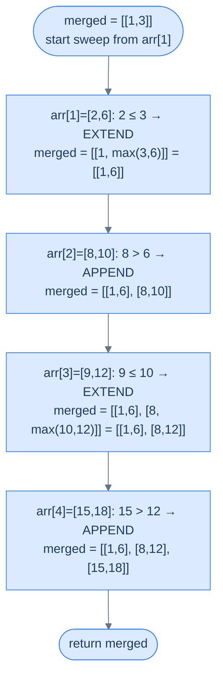
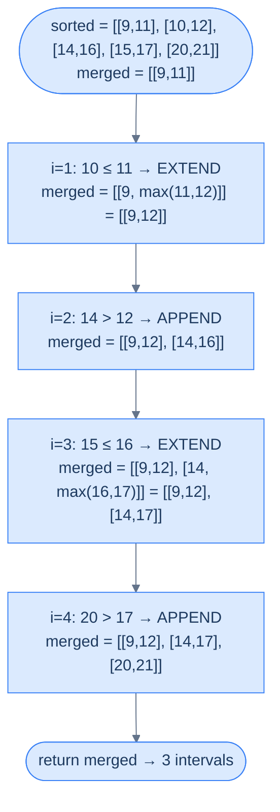
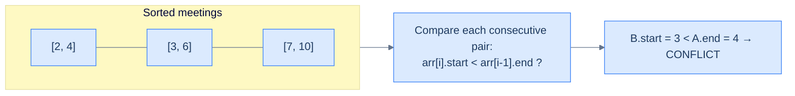

# 9. Pattern: Interval Merging

This section introduces the **line sweep** technique and the **interval merging** pattern — two ideas that take the sliding-window mindset off raw values and apply it to *intervals* on a number line. Once you see overlap problems through this lens, an entire family of "schedule", "calendar", "range", and "time window" problems collapses into one mechanical recipe.

## Table of Contents

1. [Understanding the Line Sweep Technique](#understanding-the-line-sweep-technique)
2. [Understanding the Interval Merging Pattern](#understanding-the-interval-merging-pattern)
3. [Identifying the Interval Merging Pattern](#identifying-the-interval-merging-pattern)
4. [Verify Schedule](#verify-schedule)
5. [Overlap Reduction](#overlap-reduction)
6. [Employee Free Time](#employee-free-time)
7. [Insert Interval](#insert-interval)

***

# Understanding the Line Sweep Technique

## The Hook

Imagine a thousand events scattered across a single day — flights landing, meetings booked, server requests arriving. Your task: find every moment two events overlap. The naive answer compares **every pair** — a million comparisons for a thousand events, a billion for ten thousand. There's a smarter way that does it in roughly the time it takes to *sort* the events. Once you see the trick, you'll never reach for nested loops on interval problems again.

The trick has a name. Computational geometers call it the **line sweep**, and it powers everything from collision detection in games to query planning in databases. Today you're going to learn it from first principles.

---

## The World — A Vertical Line Walking Across Your Data

Picture an x-axis stretched out before you. Every event in your input — every meeting, every flight, every request — gets placed on it as a small horizontal segment. The segment's left edge is its **start time**, the right edge its **end time**.

```d2
plane: "An interval on the x-axis" {
  grid-columns: 4
  grid-gap: 0
  s: "start" {style.fill: "#dcfce7"; style.stroke: "#16a34a"}
  m1: "•"
  m2: "•"
  e: "end" {style.fill: "#fde68a"; style.stroke: "#d97706"}
}

lbl: |md
  `interval = [start, end]`
|

plane -> lbl: "" {style.stroke-dash: 3}
```

<p align="center"><strong>An interval is just two points on a number line — a <code>start</code> and an <code>end</code>. The "axis" represents whatever scalar matters: time, distance, kilometres, frequency.</strong></p>

Now imagine a tall vertical line standing at the very left of the axis. You walk it slowly to the right. Every time the line *crosses* an event boundary — entering an interval or leaving one — something happens: a counter increments, a set updates, an answer gets recorded. The line is your cursor; the events are landmarks; the algorithm is the bookkeeping you do at each landmark.

That walking line is the **sweep line**. You're not comparing pairs anymore — you're processing events in a single ordered pass.

> *Before you read on — what would happen if the events arrived in random order? Could you still sweep the line meaningfully?*

You couldn't. The whole power of the sweep depends on visiting events in a deterministic order — almost always **sorted by start coordinate** (with end as a tiebreaker, or vice versa). Without sorting, the "line" has no axis to walk along.

---

## Step 1 — Sort the Events

Sorting is the price of admission. Intervals are usually sorted **by start coordinate ascending**, and ties broken by end coordinate ascending. The sorted order makes traversal of the array equivalent to walking left-to-right on the x-axis.

```d2
direction: right

unsorted: "Unsorted: arbitrary positions on the axis" {
  grid-columns: 4
  grid-gap: 16
  u1: "[6,8]"
  u2: "[1,3]"
  u3: "[4,7]"
  u4: "[2,5]"
}

sorted: "After sorting by (start, end)" {
  grid-columns: 4
  grid-gap: 16
  s1: "[1,3]" {style.fill: "#dcfce7"; style.stroke: "#16a34a"}
  s2: "[2,5]" {style.fill: "#dcfce7"; style.stroke: "#16a34a"}
  s3: "[4,7]" {style.fill: "#dcfce7"; style.stroke: "#16a34a"}
  s4: "[6,8]" {style.fill: "#dcfce7"; style.stroke: "#16a34a"}
}

unsorted -> sorted
```

<p align="center"><strong>Sort the interval array by <code>start</code> ascending; break ties by <code>end</code> ascending. Iterating the sorted array is now equivalent to scanning the x-axis left-to-right.</strong></p>

Why sort by start first, then by end? Because the sweep advances by start position — the start tells you *when* an event becomes relevant. If two events share a start, the end tiebreaker keeps the smaller, fully-contained one before the longer one. That subtle ordering matters for problems like "merge all overlapping intervals" — we'll see why in a moment.

```d2
tiebreak: "Tiebreak: same start, sort by end ascending" {
  grid-columns: 3
  grid-gap: 16
  t1: "[2,4]" {style.fill: "#dcfce7"; style.stroke: "#16a34a"}
  t2: "[2,7]"
  t3: "[2,9]"
}

note: |md
  Smaller, contained intervals come first

  so the sweep sees them before their longer siblings
|

tiebreak -> note: "" {style.stroke-dash: 3}
```

<p align="center"><strong>Ties on <code>start</code> are broken by <code>end</code> ascending — shorter intervals come first so they fold into the longer one as the sweep continues.</strong></p>

---

## Step 2 — Sweep the Line

With the array sorted, traversing it from left to right *is* the sweep. As you visit each interval, you maintain some piece of state — a counter, a "currently active" set, the last interval you kept. That state encodes the answer-so-far. As the sweep crosses each event, you update the state in O(1) and continue.

```d2
direction: right

axis: "Sorted intervals on the x-axis" {
  grid-columns: 4
  grid-gap: 0
  a: "[1,3]"
  b: "[2,5]"
  c: "[4,7]"
  d: "[6,8]"
}

sweep: "▲ sweep line walks left → right" {style.fill: "#fde68a"; style.stroke: "#d97706"}

state: |md
  **State:** depends on problem

  (active count, merged list, last end seen, ...)
|

axis -> sweep
sweep -> state
```

<p align="center"><strong>The sweep visits each interval in sorted order, updating shared state in O(1). One pass — no nested loops.</strong></p>

```d3 widget=array-traversal
{
  "items": ["[1,3]", "[2,5]", "[4,7]", "[6,8]"],
  "title": "Line sweep — visit sorted intervals left to right",
  "steps": [
    { "markers": [{"name": "sweep", "index": 0, "color": "#f59e0b"}], "msg": "Sweep at [1,3] — state initialised (algorithm-specific)." },
    { "markers": [{"name": "sweep", "index": 1, "color": "#f59e0b"}], "msg": "Sweep advances to [2,5] — state updated based on relation to previous." },
    { "markers": [{"name": "sweep", "index": 2, "color": "#f59e0b"}], "msg": "Sweep advances to [4,7] — single O(1) state update." },
    { "markers": [{"name": "sweep", "index": 3, "color": "#f59e0b"}], "msg": "Sweep advances to [6,8] — final state produces the answer." }
  ]
}
```

The state is **the algorithm**. Different problems need different state:
- **Merge overlaps** → keep the last merged interval and stretch its end forward
- **Maximum concurrent events** → maintain a running count of active intervals
- **Detect any overlap** → remember the largest end seen so far
- **Find gaps** → record any moment where current start > previous end

The sweep itself is universal; the state machine on top is what makes each problem unique.

---

## Complexity Analysis

| | Time | Space |
|---|---|---|
| **Best case (sort in place)** | O(N log N) | O(1) |
| **Worst case (sorted copy)** | O(N log N) | O(N) |

The work breakdown is mechanical:
- **Sorting** — O(N log N), and there's no way around it; the sweep depends on order.
- **Single pass** — O(N) after sorting; each interval handled exactly once with O(1) state updates.

So the total is dominated by the sort: **O(N log N)** in any case. Space is O(1) when you can sort the input in place; O(N) when the problem requires preserving the original order or working on an immutable input.

---

> Sorting + one pass + a small piece of state. That is the entire shape of a sweep. The next section takes this skeleton and grows the most common state machine on top of it: **interval merging**.

***

# Understanding the Interval Merging Pattern

## The Hook

You've got a calendar with 47 overlapping bookings. You want a clean list — no duplicates, no fragments — just the *blocks* of busy time. A reasonable first idea is "compare every pair, merge if they overlap, repeat until stable" — and that's O(N³) on a bad day. The line sweep collapses it to a single left-to-right scan that *can never miss* an overlap. Once you've seen the trick, you'll start spotting interval-merging in problems that don't even mention intervals.

This is the **interval merging pattern** — the most common application of the sweep line on the planet, and the workhorse behind half the "calendar", "ranges", and "schedule" interview questions you'll ever see.

---

## The World — Sweeping a Highlighter Across a Number Line

Picture every interval as a colored stripe drawn on a long sheet of paper. Some stripes overlap, some sit alone. Your job: produce one cleaned-up sheet where overlapping stripes have been **fused** into single, longer stripes, and isolated stripes are left alone.

```d2
direction: right

before: "Before: 5 raw intervals (some overlap)" {
  grid-columns: 5
  grid-gap: 16
  a1: "[1,3]"
  a2: "[2,6]"
  a3: "[8,10]"
  a4: "[9,12]"
  a5: "[15,18]"
}

after: "After: 3 merged intervals" {
  grid-columns: 3
  grid-gap: 16
  b1: "[1,6]" {style.fill: "#dcfce7"; style.stroke: "#16a34a"}
  b2: "[8,12]" {style.fill: "#dcfce7"; style.stroke: "#16a34a"}
  b3: "[15,18]" {style.fill: "#dcfce7"; style.stroke: "#16a34a"}
}

before -> after
```

<p align="center"><strong>Merging fuses overlapping intervals into the smallest set of disjoint intervals that covers all the original ones — like running a highlighter and never lifting it through any overlap.</strong></p>

The mental shortcut: **sweep with a single highlighter**. Whenever the next stripe touches the current one, extend the highlighter rightward. Whenever the next stripe is completely past the current one, lift the pen, start a new stripe.

That mental model *is* the algorithm.

---

## Step 1 — Sort by Start Coordinate

Sorting comes first, as always for a sweep.

```d2
direction: right

in_arr: "arr (unsorted)" {
  grid-columns: 5
  grid-gap: 16
  i1: "[8,10]"
  i2: "[1,3]"
  i3: "[15,18]"
  i4: "[2,6]"
  i5: "[9,12]"
}

out_arr: "arr (sorted by start, then end)" {
  grid-columns: 5
  grid-gap: 16
  o1: "[1,3]" {style.fill: "#dcfce7"; style.stroke: "#16a34a"}
  o2: "[2,6]" {style.fill: "#dcfce7"; style.stroke: "#16a34a"}
  o3: "[8,10]" {style.fill: "#dcfce7"; style.stroke: "#16a34a"}
  o4: "[9,12]" {style.fill: "#dcfce7"; style.stroke: "#16a34a"}
  o5: "[15,18]" {style.fill: "#dcfce7"; style.stroke: "#16a34a"}
}

in_arr -> out_arr
```

<p align="center"><strong>After sorting, intervals appear in left-to-right order on the x-axis. The sweep can now process them in a single pass.</strong></p>

Why start coordinate? Because **two intervals overlap iff the one starting later has its start inside the one starting earlier**. Sorting by start guarantees the "earlier-starting" interval is always the one you've already seen — exactly the one sitting at the back of your `merged` list.

> *Pause and predict — what would go wrong if you sorted by **end** coordinate instead?*

You could lose overlaps. Consider `[[1, 10], [2, 4]]`. Sorted by end: `[[2, 4], [1, 10]]`. Now when you process `[1, 10]`, its start (1) is **before** the previous interval's start (2) — your "is this overlapping the last merged interval?" check no longer makes sense, because the new interval doesn't sit cleanly to the right of the last one. Sorting by start eliminates this whole class of bookkeeping.

---

## Step 2 — Initialize `merged` With the First Interval

Create an output list `merged` and seed it with the first sorted interval. The "current highlighter stripe" is always **the last item in `merged`** — that's the only interval the sweep can extend.

```d2
sorted: "Sorted arr" {
  grid-columns: 5
  grid-gap: 0
  s1: "[1,3]" {style.fill: "#fde68a"; style.stroke: "#d97706"}
  s2: "[2,6]"
  s3: "[8,10]"
  s4: "[9,12]"
  s5: "[15,18]"
}

init: |md
  `merged = [ [1,3] ]`

  (seeded with arr[0])
| {style.fill: "#fde68a"; style.stroke: "#d97706"}

sorted -> init
```

<p align="center"><strong>Seed <code>merged</code> with the first interval. From now on, every new interval is compared only against <code>merged.last</code> — never the entire list.</strong></p>

This is a crucial invariant: **`merged` always contains pairwise disjoint, sorted intervals**. Because the input is sorted, any new overlap can only reach back to the most recent merged interval. We never need to scan further.

---

## Step 3 — Sweep and Decide: Extend or Append

For each subsequent interval `arr[i]`, ask one yes/no question:

> *Does `arr[i]`'s start lie inside or touch the last merged interval's end?*

- **Yes** (`arr[i].start <= merged.last.end`) → **extend** the highlighter. Update `merged.last.end = max(merged.last.end, arr[i].end)`. The `max` matters because `arr[i]` could be entirely contained within the last merged interval — never shrink an interval you've already grown.
- **No** (`arr[i].start > merged.last.end`) → **lift the pen**. Append `arr[i]` to `merged` as a fresh stripe.



<p align="center"><strong>Each iteration peeks at <code>merged.last</code> and either extends its end or appends a fresh interval. The sweep visits every input exactly once.</strong></p>

```d3 widget=array-traversal
{
  "items": ["[1,3]", "[2,6]", "[8,10]", "[9,12]", "[15,18]"],
  "title": "Interval merging on sorted arr = [[1,3], [2,6], [8,10], [9,12], [15,18]]",
  "primaryLabel": "arr (sorted)",
  "secondaryItems": ["[1,3]", "·", "·", "·", "·"],
  "secondaryLabel": "merged",
  "steps": [
    {
      "items": ["[1,3]", "[2,6]", "[8,10]", "[9,12]", "[15,18]"],
      "markers": [{"name": "i", "index": 0, "color": "#3b82f6"}],
      "secondaryItems": ["[1,3]", "·", "·", "·", "·"],
      "secondaryKeys": ["m0", "m1", "m2", "m3", "m4"],
      "msg": "Init: seed merged with arr[0]=[1,3]. Sweep starts from i=1."
    },
    {
      "items": ["[1,3]", "[2,6]", "[8,10]", "[9,12]", "[15,18]"],
      "markers": [{"name": "i", "index": 1, "color": "#3b82f6"}],
      "secondaryItems": ["[1,6]", "·", "·", "·", "·"],
      "secondaryKeys": ["m0", "m1", "m2", "m3", "m4"],
      "secondaryMarkers": [{"name": "last", "index": 0, "color": "#f59e0b"}],
      "msg": "i=1: arr[1]=[2,6]. 2 ≤ 3 (last.end) → EXTEND → merged.last = [1, max(3,6)] = [1,6]."
    },
    {
      "items": ["[1,3]", "[2,6]", "[8,10]", "[9,12]", "[15,18]"],
      "markers": [{"name": "i", "index": 2, "color": "#3b82f6"}],
      "secondaryItems": ["[1,6]", "[8,10]", "·", "·", "·"],
      "secondaryKeys": ["m0", "m1", "m2", "m3", "m4"],
      "secondaryMarkers": [{"name": "last", "index": 1, "color": "#f59e0b"}],
      "msg": "i=2: arr[2]=[8,10]. 8 > 6 → APPEND → merged = [[1,6], [8,10]]."
    },
    {
      "items": ["[1,3]", "[2,6]", "[8,10]", "[9,12]", "[15,18]"],
      "markers": [{"name": "i", "index": 3, "color": "#3b82f6"}],
      "secondaryItems": ["[1,6]", "[8,12]", "·", "·", "·"],
      "secondaryKeys": ["m0", "m1", "m2", "m3", "m4"],
      "secondaryMarkers": [{"name": "last", "index": 1, "color": "#f59e0b"}],
      "msg": "i=3: arr[3]=[9,12]. 9 ≤ 10 → EXTEND → merged.last = [8, max(10,12)] = [8,12]."
    },
    {
      "items": ["[1,3]", "[2,6]", "[8,10]", "[9,12]", "[15,18]"],
      "markers": [{"name": "i", "index": 4, "color": "#3b82f6"}],
      "secondaryItems": ["[1,6]", "[8,12]", "[15,18]", "·", "·"],
      "secondaryKeys": ["m0", "m1", "m2", "m3", "m4"],
      "secondaryMarkers": [{"name": "last", "index": 2, "color": "#f59e0b"}],
      "msg": "i=4: arr[4]=[15,18]. 15 > 12 → APPEND → merged = [[1,6], [8,12], [15,18]] ✓"
    }
  ]
}
```

The `<=` vs `<` distinction is the only edge-case knob. If your problem treats touching intervals like `[1, 3]` and `[3, 5]` as overlapping (e.g. continuous busy time), use `<=`. If it treats them as adjacent-but-distinct (e.g. discrete sessions), use `<`. The whole algorithm is otherwise identical.

---

## Why Only the Last Merged Interval?

Because the input is sorted by start, any interval we process from this point forward has a start coordinate `≥ arr[i].start`. The intervals already inside `merged` (excluding the last) all have **end coordinates that come before `merged.last.start`** — otherwise they would have been merged into `merged.last` themselves. So they cannot possibly overlap with anything still to come.

```d2
direction: right

m: "merged so far" {
  grid-columns: 3
  grid-gap: 0
  m1: "[1,6]"
  m2: "[8,12]"
  m3: "[15,18] ← last" {style.fill: "#fde68a"; style.stroke: "#d97706"}
}

future: |md
  Any future `arr[i]` has `start ≥ 15`<br/>(input is sorted)
|

conc: |md
  Future intervals can ONLY touch or extend `[15,18]` — never `[1,6]` or `[8,12]`
| {style.fill: "#dcfce7"; style.stroke: "#16a34a"}

m -> future
future -> conc
```

<p align="center"><strong>The "compare only against the last" trick works because sorted input plus the merged-so-far invariant guarantee earlier intervals are forever sealed.</strong></p>

That's why the algorithm is O(N) after sorting — every interval is compared against exactly one other interval, ever.

---

## Algorithm Summary

> **Step 1.** Sort `arr` by start coordinate ascending; break ties by end ascending.
>
> **Step 2.** Initialize `merged = [arr[0]]`.
>
> **Step 3.** For `i` from 1 to `len(arr) - 1`:
>
> - **3.1.** If `arr[i].start <= merged.last.end` → set `merged.last.end = max(merged.last.end, arr[i].end)` (extend).
> - **3.2.** Else → append `arr[i]` to `merged` (lift the pen).
>
> **Step 4.** Return `merged`.

The whole pattern — every "merge intervals" problem on every interview prep site — is *that*. Four steps. One pass after sorting.

---

## Implementation

The generic merge function below uses `<=` so touching intervals are merged. Flip it to `<` if your problem treats touching as non-overlapping.


```python run
class Solution:
    def merge_overlapping(
        self, arr: List[List[int]]
    ) -> List[List[int]]:

        # Sort arr by start time
        arr.sort(key=lambda x: x[0])

        # Initialize output array and push the first interval
        merged = [arr[0]]

        # Loop through arr and merge if overlapping or adjacent
        for i in range(1, len(arr)):

            # If the current interval overlaps with the last interval in
            # the merged list, merge them
            # Change '<=' to '<' for cases where the start of an interval
            # coinciding with the end of another is not considered an overlap
            if arr[i][0] <= merged[-1][1]:
                merged[-1][1] = max(merged[-1][1], arr[i][1])

            # If the current interval is non-overlapping, add it to the
            # merged list
            else:
                merged.append(arr[i])
        return merged
```

```java run
import java.util.*;

class Solution {
    public int[][] mergeOverlapping(int[][] arr) {

        // Sort arr by start time
        Arrays.sort(arr, (a, b) -> Integer.compare(a[0], b[0]));

        // Initialize output list and push the first interval
        List<int[]> merged = new ArrayList<>();
        merged.add(arr[0]);

        // Loop through arr and merge if overlapping or adjacent
        for (int i = 1; i < arr.length; i++) {

            // If the current interval overlaps with the last interval in
            // the merged list, merge them
            // Change '<=' to '<' for cases where the start of an interval
            // coinciding with the end of another is not considered an overlap
            if (arr[i][0] <= merged.get(merged.size() - 1)[1]) {
                merged.get(merged.size() - 1)[1] =
                    Math.max(
                        merged.get(merged.size() - 1)[1],
                        arr[i][1]
                    );
            }

            // If the current interval is non-overlapping, add it to the
            // merged list
            else {
                merged.add(arr[i]);
            }
        }

        // Convert output list to 2D array and return
        return merged.toArray(new int[merged.size()][]);
    }
}
```


---

## Complexity Analysis

| | Time | Space |
|---|---|---|
| **Best case (all merge into one)** | O(N log N) | O(1) extra (output is one interval) |
| **Worst case (no overlap)** | O(N log N) | O(N) extra (output equals input) |

Sorting dominates at **O(N log N)**. The sweep itself is O(N). Space depends on the output: best case is one big merged interval (O(1)), worst case is N disjoint intervals (O(N)).

---

> The pattern is mechanical, but identifying *when* to apply it is the real skill. The next section gives you a template for spotting interval-merging problems in disguise — and walks through a concrete example end to end.

***

# Identifying the Interval Merging Pattern

## The Hook

You won't always see the word "merge" in the problem statement. You'll see "find the minimum number of meeting rooms", "verify the schedule has no conflicts", "compress the busy intervals", "find the gaps". All of these are interval merging in costume. The trick is recognizing the underlying shape: **a set of intervals + a question whose answer becomes obvious once overlaps are merged**.

This section gives you a one-line template for spotting it, and then walks a full example from problem statement → solution.

---

## The Identification Template

> Given an array of intervals, **merge all overlapping intervals**, and the merged form either *is* the answer or makes the answer trivially derivable.

If you can rephrase the problem so that step one is "merge overlapping intervals", you have a candidate. After merging, you should be able to read off the answer with one more O(N) pass — counting, summing lengths, finding gaps, picking the first or last, etc.

If the rephrased problem requires *not* merging — for example, "count the maximum number of overlapping intervals at any moment" — then this is **not** an interval-merging problem. That belongs to the maximum-overlap pattern (next section). Most "schedule" problems are easy or medium difficulty.

---

## A Worked Example — Delivery Intervals

> **Problem statement:** A delivery service expects a sequence of deliveries throughout the day, each described by a `[start, end]` time window. Find the **minimum number of non-overlapping time intervals** during which at least one delivery is expected at every moment.

```d2
direction: right

input_arr: "Raw delivery windows" {
  grid-columns: 5
  grid-gap: 16
  i1: "[9, 11]"
  i2: "[10, 12]"
  i3: "[14, 16]"
  i4: "[15, 17]"
  i5: "[20, 21]"
}

output_arr: "Minimum non-overlapping busy intervals" {
  grid-columns: 3
  grid-gap: 16
  o1: "[9, 12]" {style.fill: "#dcfce7"; style.stroke: "#16a34a"}
  o2: "[14, 17]" {style.fill: "#dcfce7"; style.stroke: "#16a34a"}
  o3: "[20, 21]" {style.fill: "#dcfce7"; style.stroke: "#16a34a"}
}

input_arr -> output_arr
```

<p align="center"><strong>Find the minimum set of non-overlapping windows that cover every delivery — equivalently, "merge all overlapping deliveries". The merged count <em>is</em> the answer.</strong></p>

---

### Does It Fit the Template?

Apply the template:
- "Given an array of intervals" → ✓ delivery windows.
- "Merge all overlapping intervals" → ✓ the question literally asks for the smallest set of non-overlapping intervals covering everything.
- "Answer trivially derivable" → ✓ the merged list is itself the answer; we just return it (or its length).

This is a textbook interval-merging problem. We can solve it by running the generic merge directly.

---

### The Solution



<p align="center"><strong>The sweep extends the highlighter twice and lifts it twice. Final answer: three non-overlapping busy windows.</strong></p>

```d3 widget=array-traversal
{
  "items": ["[9,11]", "[10,12]", "[14,16]", "[15,17]", "[20,21]"],
  "title": "Delivery intervals — merge on sorted [[9,11], [10,12], [14,16], [15,17], [20,21]]",
  "primaryLabel": "sorted",
  "secondaryItems": ["[9,11]", "·", "·", "·", "·"],
  "secondaryLabel": "merged",
  "steps": [
    {
      "items": ["[9,11]", "[10,12]", "[14,16]", "[15,17]", "[20,21]"],
      "markers": [{"name": "i", "index": 0, "color": "#3b82f6"}],
      "secondaryItems": ["[9,11]", "·", "·", "·", "·"],
      "secondaryKeys": ["m0", "m1", "m2", "m3", "m4"],
      "msg": "Init: seed merged with sorted[0]=[9,11]. Sweep from i=1."
    },
    {
      "items": ["[9,11]", "[10,12]", "[14,16]", "[15,17]", "[20,21]"],
      "markers": [{"name": "i", "index": 1, "color": "#3b82f6"}],
      "secondaryItems": ["[9,12]", "·", "·", "·", "·"],
      "secondaryKeys": ["m0", "m1", "m2", "m3", "m4"],
      "secondaryMarkers": [{"name": "last", "index": 0, "color": "#f59e0b"}],
      "msg": "i=1: [10,12]. 10 ≤ 11 → EXTEND → merged.last = [9, max(11,12)] = [9,12]."
    },
    {
      "items": ["[9,11]", "[10,12]", "[14,16]", "[15,17]", "[20,21]"],
      "markers": [{"name": "i", "index": 2, "color": "#3b82f6"}],
      "secondaryItems": ["[9,12]", "[14,16]", "·", "·", "·"],
      "secondaryKeys": ["m0", "m1", "m2", "m3", "m4"],
      "secondaryMarkers": [{"name": "last", "index": 1, "color": "#f59e0b"}],
      "msg": "i=2: [14,16]. 14 > 12 → APPEND → merged = [[9,12], [14,16]]."
    },
    {
      "items": ["[9,11]", "[10,12]", "[14,16]", "[15,17]", "[20,21]"],
      "markers": [{"name": "i", "index": 3, "color": "#3b82f6"}],
      "secondaryItems": ["[9,12]", "[14,17]", "·", "·", "·"],
      "secondaryKeys": ["m0", "m1", "m2", "m3", "m4"],
      "secondaryMarkers": [{"name": "last", "index": 1, "color": "#f59e0b"}],
      "msg": "i=3: [15,17]. 15 ≤ 16 → EXTEND → merged.last = [14, max(16,17)] = [14,17]."
    },
    {
      "items": ["[9,11]", "[10,12]", "[14,16]", "[15,17]", "[20,21]"],
      "markers": [{"name": "i", "index": 4, "color": "#3b82f6"}],
      "secondaryItems": ["[9,12]", "[14,17]", "[20,21]", "·", "·"],
      "secondaryKeys": ["m0", "m1", "m2", "m3", "m4"],
      "secondaryMarkers": [{"name": "last", "index": 2, "color": "#f59e0b"}],
      "msg": "i=4: [20,21]. 20 > 17 → APPEND → merged = [[9,12], [14,17], [20,21]] → 3 busy windows ✓"
    }
  ]
}
```


```python run
class Solution:
    def delivery_intervals(
        self, times: List[List[int]]
    ) -> List[List[int]]:

        # Sort times by start time
        times.sort(key=lambda x: x[0])

        # Initialize output array and push the first time
        merged = [times[0]]

        # Loop through times and merge if overlapping or adjacent
        for i in range(1, len(times)):

            # If the current time overlaps with the last time in
            # the merged list, merge them
            if times[i][0] <= merged[-1][1]:
                merged[-1][1] = max(merged[-1][1], times[i][1])

            # If the current time is non-overlapping, add it to the
            # merged list
            else:
                merged.append(times[i])
        return merged
```

```java run
import java.util.*;

class Solution {
    public int[][] deliveryIntervals(int[][] times) {

        // Sort times by start time
        Arrays.sort(times, (a, b) -> Integer.compare(a[0], b[0]));

        // Initialize output list and push the first time
        List<int[]> merged = new ArrayList<>();
        merged.add(times[0]);

        // Loop through times and merge if overlapping or adjacent
        for (int i = 1; i < times.length; i++) {

            // If the current time overlaps with the last time in
            // the merged list, merge them
            if (times[i][0] <= merged.get(merged.size() - 1)[1]) {
                merged.get(merged.size() - 1)[1] =
                    Math.max(
                        merged.get(merged.size() - 1)[1],
                        times[i][1]
                    );
            }

            // If the current time is non-overlapping, add it to the
            // merged list
            else {
                merged.add(times[i]);
            }
        }

        // Convert output list to 2D array and return
        return merged.toArray(new int[merged.size()][]);
    }
}
```


The pattern fits, the algorithm is the generic merge, the answer is `merged` itself. **O(N log N)** time, **O(N)** space for the output.

---

## Example Problems

The four problems in this section all reduce to interval merging — sometimes in disguise. We'll work through each one with the same template.

- **Verify Schedule** — given meeting intervals, can a single person attend all of them?
- **Overlap Reduction** — given intervals, find the minimum number to remove so the rest are non-overlapping.
- **Employee Free Time** — given each employee's busy intervals, find the time windows when *every* employee is free.
- **Insert Interval** — given a sorted, non-overlapping list, insert a new interval and re-merge.

The first two are variations on plain merging. The last two stress your understanding of the *invariant* — what the merged list represents and how to update it without doing a full re-merge.

***

# Verify Schedule

<details>
<summary><h2>The Hook</h2></summary>


You're scheduling assistant for a busy executive. Given a day's worth of meeting requests as `[start, end]` intervals, your one job is to answer: **can they attend every meeting?** Miss a single overlap and your reputation is gone. Brute force compares every pair (O(N²)). The right answer comes from the same line-sweep idea you just learned — and runs in O(N log N).

</details>
## The Problem

> Given an array of meeting time intervals `arr` where `arr[i] = [start_i, end_i]`, return `true` if a single person can attend **all** meetings without conflict, and `false` otherwise. Treat touching intervals (like `[1, 3]` and `[3, 5]`) as **non-conflicting** — back-to-back meetings are fine.

```
Input:  arr = [[0, 30], [5, 10], [15, 20]]
Output: false        ([0,30] overlaps both [5,10] and [15,20])

Input:  arr = [[7, 10], [2, 4]]
Output: true         (no overlap; sorted view is [[2,4], [7,10]])

Input:  arr = [[1, 3], [3, 6]]
Output: true         (touching, not overlapping — back-to-back is allowed)

Input:  arr = []
Output: true         (no meetings → no conflicts)
```

---

<details>
<summary><h2>What Does "Conflict" Mean?</h2></summary>


Two meetings conflict iff one starts **strictly before** the other ends. After sorting by start, the only conflict that can possibly exist between meeting `i` and any earlier meeting is between `arr[i]` and `arr[i-1]` — because `arr[i-1]` has the largest end of any earlier meeting *we care about* (the one that could still be running when `arr[i]` begins).



<p align="center"><strong>After sorting by start, a conflict can only happen between consecutive intervals. We never need to compare further back.</strong></p>

> *Pause and predict — does sorting by end work too? Try `[[7,10], [2,4]]` sorted by end → `[[2,4], [7,10]]`. Does the consecutive-pair check still detect every conflict?*

It happens to work for this example, but consider `[[1, 10], [2, 3]]`. Sorted by end: `[[2, 3], [1, 10]]`. Now `arr[1].start = 1 < arr[0].end = 3` — looks like a conflict (correct), but the **reason** is now muddled because `arr[1]` actually starts *before* `arr[0]`. The clean "compare consecutive" logic only holds when sorted by start.

</details>
<details>
<summary><h2>Solution &amp; Analysis</h2></summary>

### The Solution

After sorting, sweep left-to-right and check that **each meeting starts no earlier than the previous one ends**. The first time the check fails, return `false`. If the loop completes, no conflicts — return `true`.


```python run
from typing import List

class Solution:
    def verify_schedule(self, meetings: List[List[int]]) -> bool:

        # sort the meetings on their start time
        meetings.sort(key=lambda x: x[0])

        # check if any two meetings overlap
        for i in range(1, len(meetings)):
            if meetings[i][0] < meetings[i - 1][1]:
                return False

        return True


# Examples from the problem statement
print(Solution().verify_schedule([[1, 20], [10, 30], [30, 40], [1, 5]]))   # False
print(Solution().verify_schedule([[1, 10], [1, 10], [1, 10]]))             # False
print(Solution().verify_schedule([[1, 15], [15, 17], [17, 18]]))           # True

# Edge cases
print(Solution().verify_schedule([[1, 2]]))                                 # True  — single meeting
print(Solution().verify_schedule([[1, 5], [6, 10]]))                        # True  — two non-overlapping
print(Solution().verify_schedule([[1, 5], [4, 6]]))                         # False — two overlapping
print(Solution().verify_schedule([[5, 10], [1, 4], [11, 15]]))             # True  — unsorted non-overlapping
print(Solution().verify_schedule([[1, 3], [3, 5], [5, 7]]))                # True  — touching endpoints only
```

```java run
import java.util.*;

public class Main {
    static class Solution {
        public boolean verifySchedule(int[][] meetings) {

            // sort the meetings on their start time
            Arrays.sort(meetings, Comparator.comparingInt(a -> a[0]));

            // check if any two meetings overlap
            for (int i = 1; i < meetings.length; i++) {
                if (meetings[i][0] < meetings[i - 1][1]) {
                    return false;
                }
            }

            return true;
        }
    }

    public static void main(String[] args) {
        // Examples from the problem statement
        System.out.println(new Solution().verifySchedule(new int[][]{{1, 20}, {10, 30}, {30, 40}, {1, 5}}));   // false
        System.out.println(new Solution().verifySchedule(new int[][]{{1, 10}, {1, 10}, {1, 10}}));             // false
        System.out.println(new Solution().verifySchedule(new int[][]{{1, 15}, {15, 17}, {17, 18}}));           // true

        // Edge cases
        System.out.println(new Solution().verifySchedule(new int[][]{{1, 2}}));                                 // true  — single meeting
        System.out.println(new Solution().verifySchedule(new int[][]{{1, 5}, {6, 10}}));                        // true  — two non-overlapping
        System.out.println(new Solution().verifySchedule(new int[][]{{1, 5}, {4, 6}}));                         // false — two overlapping
        System.out.println(new Solution().verifySchedule(new int[][]{{5, 10}, {1, 4}, {11, 15}}));             // true  — unsorted non-overlapping
        System.out.println(new Solution().verifySchedule(new int[][]{{1, 3}, {3, 5}, {5, 7}}));                // true  — touching endpoints only
    }
}
```


<details>
<summary><strong>Trace — arr = [[0, 30], [5, 10], [15, 20]]</strong></summary>

```
After sort by start: [[0, 30], [5, 10], [15, 20]]

i=1: arr[1].start = 5  < arr[0].end = 30  → CONFLICT, return false

Result: false ✓   ([0,30] swallows the entire morning)
```

</details>
<details>
<summary><strong>Trace — arr = [[1, 3], [3, 6]]</strong></summary>

```
After sort by start: [[1, 3], [3, 6]]

i=1: arr[1].start = 3  < arr[0].end = 3  →  3 < 3 is FALSE → ok

Loop completes → return true ✓
The strict '<' is what allows touching meetings. With '<=' this would return false.
```

</details>

### Complexity Analysis

| | Complexity | Reasoning |
|---|---|---|
| **Time** | O(N log N) | Dominated by sorting; the sweep is O(N) |
| **Space** | O(1) extra (in-place sort) or O(log N) for sort recursion stack | No extra structure built |

### Edge Cases

| Case | Example | Expected | Reasoning |
|---|---|---|---|
| Empty input | `[]` | `true` | No meetings means no conflict by vacuous truth |
| Single meeting | `[[5, 10]]` | `true` | Loop body never runs |
| Touching at boundary | `[[1, 3], [3, 6]]` | `true` | `<` strict — back-to-back is allowed |
| Identical start times | `[[1, 5], [1, 4]]` | `false` | After sort, `arr[1].start = 1 < arr[0].end = 5` → conflict |
| Out-of-order input | `[[7, 10], [2, 4]]` | `true` | Sort fixes order before sweep |
| Fully contained | `[[1, 10], [3, 5]]` | `false` | After sort, `arr[1].start = 3 < arr[0].end = 10` |

</details>
<details>
<summary><h2>Final Takeaway</h2></summary>


Verify Schedule is the smallest possible interval-merging problem — you don't even need to *build* the merged list, just **detect** the first overlap during the sweep. The `<` vs `<=` choice is the only domain-specific knob, and it captures whether your problem treats touching as overlapping. When you next see a problem with the words "can attend", "schedule conflict", "double-booking", or "compatible meetings", reach for sort + consecutive-pair check.

> **Transfer Challenge:** Modify the function to return the *first conflicting pair* of meetings (their original indices), not just `true`/`false`.
>
> <details><summary><strong>Solution hint</strong></summary>
>
> Pair each meeting with its original index before sorting (e.g. tuples `(start, end, idx)`). When the check fires, return `(arr[i-1].idx, arr[i].idx)`. Sorting now needs to be on `start` only, but storage stays O(N).
>
> </details>

</details>

***

# Overlap Reduction

## The Problem

Given an array of `intervals` where `intervals[i] = [si, ei]`, merge all **overlapping** intervals and return a list of non-overlapping intervals that covers all the intervals in the input. You can return the answer in **any order**.

Two intervals `[s1, e1]` and `[s2, e2]` are considered **overlapping** if `e1 ≥ s2` (so touching counts as overlap and the two halves merge).

```
intervals = [[1, 4], [2, 3], [3, 4], [4, 6]]   →  [[1, 6]]
intervals = [[1, 5], [1, 5], [1, 5]]            →  [[1, 5]]
intervals = [[1, 5], [6, 7], [8, 9]]            →  [[1, 5], [6, 7], [8, 9]]
```

---

<details>
<summary><h2>Examples</h2></summary>


**Example 1**
```
Input:  intervals = [[1, 4], [2, 3], [3, 4], [4, 6]]
Output: [[1, 6]]
Explanation: [2, 3] and [3, 4] already lie within [1, 4]; [1, 4] and [4, 6]
             touch (overlap by our definition) and merge into [1, 6].
```

**Example 2**
```
Input:  intervals = [[1, 5], [1, 5], [1, 5]]
Output: [[1, 5]]
Explanation: All three are the same interval — they collapse into one.
```

**Example 3**
```
Input:  intervals = [[1, 5], [6, 7], [8, 9]]
Output: [[1, 5], [6, 7], [8, 9]]
Explanation: The intervals are already pairwise non-overlapping; nothing merges.
```

</details>
<details>
<summary><h2>Intuition</h2></summary>


After sorting by start, two intervals `A` (earlier) and `B` (later) overlap exactly when `B.start ≤ A.end`. In that case, the merged result starts at `A.start` and ends at `max(A.end, B.end)` (because `B` could end earlier than `A` if it's nested inside).

The algorithm sweeps left to right, maintaining a running `merged` list:
- The first interval seeds the list.
- For each subsequent interval, compare its start with the **last merged interval's end**:
  - **Overlap** (`current.start ≤ merged[-1].end`) → extend the last merged interval's end to `max(merged[-1].end, current.end)`.
  - **No overlap** → append the current interval as a new entry in `merged`.

A single pass over the sorted intervals produces the answer.

</details>
<details>
<summary><h2>Solution &amp; Analysis</h2></summary>

### The Solution

```python run
from typing import List

class Solution:
    def overlap_reduction(
        self, intervals: List[List[int]]
    ) -> List[List[int]]:

        # Sort intervals by start time
        intervals.sort(key=lambda x: x[0])

        # Initialize output array and push the first interval
        merged = [intervals[0]]

        # Loop through intervals and merge if overlapping or adjacent
        for i in range(1, len(intervals)):

            # If the current interval overlaps with the last interval in
            # the merged list, merge them
            if intervals[i][0] <= merged[-1][1]:
                merged[-1][1] = max(merged[-1][1], intervals[i][1])

            # If the current interval is non-overlapping, add it to the
            # merged list
            else:
                merged.append(intervals[i])
        return merged


# Examples from the problem statement
print(Solution().overlap_reduction([[1, 4], [2, 3], [3, 4], [4, 6]]))   # [[1, 6]]
print(Solution().overlap_reduction([[1, 5], [1, 5], [1, 5]]))           # [[1, 5]]
print(Solution().overlap_reduction([[1, 5], [6, 7], [8, 9]]))           # [[1, 5], [6, 7], [8, 9]]

# Edge cases
print(Solution().overlap_reduction([[1, 2]]))                            # [[1, 2]]  — single interval
print(Solution().overlap_reduction([[1, 3], [2, 4]]))                    # [[1, 4]]  — two overlapping
print(Solution().overlap_reduction([[1, 2], [3, 4]]))                    # [[1, 2], [3, 4]]  — two non-overlapping
print(Solution().overlap_reduction([[1, 10], [2, 3], [4, 5]]))          # [[1, 10]]  — one contains all others
print(Solution().overlap_reduction([[5, 6], [1, 2], [3, 4]]))           # [[1, 2], [3, 4], [5, 6]]  — unsorted input
```

```java run
import java.util.*;

public class Main {
    static class Solution {
        public int[][] overlapReduction(int[][] intervals) {

            // Sort intervals by start time
            Arrays.sort(intervals, (a, b) -> Integer.compare(a[0], b[0]));

            // Initialize output list and push the first interval
            List<int[]> merged = new ArrayList<>();
            merged.add(intervals[0]);

            // Loop through intervals and merge if overlapping or adjacent
            for (int i = 1; i < intervals.length; i++) {

                // If the current interval overlaps with the last interval in
                // the merged list, merge them
                if (intervals[i][0] <= merged.get(merged.size() - 1)[1]) {
                    merged.get(merged.size() - 1)[1] = Math.max(
                        merged.get(merged.size() - 1)[1],
                        intervals[i][1]
                    );
                }

                // If the current interval is non-overlapping, add it to the
                // merged list
                else {
                    merged.add(intervals[i]);
                }
            }

            // Convert output list to 2D array and return
            return merged.toArray(new int[merged.size()][]);
        }
    }

    public static void main(String[] args) {
        // Examples from the problem statement
        System.out.println(Arrays.deepToString(new Solution().overlapReduction(new int[][]{{1, 4}, {2, 3}, {3, 4}, {4, 6}})));   // [[1, 6]]
        System.out.println(Arrays.deepToString(new Solution().overlapReduction(new int[][]{{1, 5}, {1, 5}, {1, 5}})));           // [[1, 5]]
        System.out.println(Arrays.deepToString(new Solution().overlapReduction(new int[][]{{1, 5}, {6, 7}, {8, 9}})));           // [[1, 5], [6, 7], [8, 9]]

        // Edge cases
        System.out.println(Arrays.deepToString(new Solution().overlapReduction(new int[][]{{1, 2}})));                            // [[1, 2]]  — single interval
        System.out.println(Arrays.deepToString(new Solution().overlapReduction(new int[][]{{1, 3}, {2, 4}})));                    // [[1, 4]]  — two overlapping
        System.out.println(Arrays.deepToString(new Solution().overlapReduction(new int[][]{{1, 2}, {3, 4}})));                    // [[1, 2], [3, 4]]  — two non-overlapping
        System.out.println(Arrays.deepToString(new Solution().overlapReduction(new int[][]{{1, 10}, {2, 3}, {4, 5}})));          // [[1, 10]]  — one contains all others
        System.out.println(Arrays.deepToString(new Solution().overlapReduction(new int[][]{{5, 6}, {1, 2}, {3, 4}})));           // [[1, 2], [3, 4], [5, 6]]  — unsorted input
    }
}
```


<details>
<summary><strong>Trace — intervals = [[1, 4], [2, 3], [3, 4], [4, 6]]</strong></summary>

```
After sort by start: [[1, 4], [2, 3], [3, 4], [4, 6]] (already sorted)

Initial: merged = [[1, 4]]

i=1: [2, 3]. 2 ≤ merged[-1].end (4) → merge: merged[-1].end = max(4, 3) = 4.
     merged = [[1, 4]]
i=2: [3, 4]. 3 ≤ 4 → merge: merged[-1].end = max(4, 4) = 4.
     merged = [[1, 4]]
i=3: [4, 6]. 4 ≤ 4 → merge: merged[-1].end = max(4, 6) = 6.
     merged = [[1, 6]]

Result: [[1, 6]] ✓
```

</details>

### Complexity Analysis

| | Complexity | Reasoning |
|---|---|---|
| **Time** | O(N log N) | Sort dominates; the merge sweep is O(N) |
| **Space** | O(N) | The `merged` list holds at most `N` intervals |

### Edge Cases

| Case | Example | Expected | Reasoning |
|---|---|---|---|
| Single interval | `[[3, 7]]` | `[[3, 7]]` | Loop body never runs; the seed is the answer |
| All identical | `[[1, 5], [1, 5], [1, 5]]` | `[[1, 5]]` | Each merges into the seed |
| Already disjoint | `[[1, 2], [4, 5]]` | `[[1, 2], [4, 5]]` | The else branch fires every iteration |
| Touching intervals | `[[1, 4], [4, 6]]` | `[[1, 6]]` | `4 ≤ 4` triggers merge — touching counts as overlap here |
| Fully nested | `[[1, 10], [3, 5]]` | `[[1, 10]]` | After sort, `[3, 5]` is contained in `[1, 10]`; `max(10, 5) = 10` |
| Out-of-order input | `[[8, 9], [1, 5], [6, 7]]` | `[[1, 5], [6, 7], [8, 9]]` | Sort fixes order; nothing merges |

</details>
<details>
<summary><h2>Key Takeaway</h2></summary>


Overlap Reduction is the canonical **merge overlapping intervals** problem and the spine of the interval-merging pattern. Once intervals are sorted by start, the merge rule reduces to "does this start fall on or before the last merged end?" — a one-comparison test that produces the entire merged set in a single linear sweep. Every interval-merge problem you'll meet (calendar collapse, range coalesce, event windowing) is a variation on this exact loop.
> </details>

</details>

***

# Employee Free Time

## The Problem

Given an array of `meetings` consisting of the start and end times `[[s1, e1], [s2, e2], ...]` (with `si < ei`) of all meetings of the employees of a company, find and return the **time intervals where all the employees are free** — i.e. none of them are in a meeting.

Two intervals `[s1, e1]` and `[s2, e2]` are considered **overlapping** if `e1 ≥ s2` (touching counts as overlap, so no zero-length free windows are emitted).

```
meetings = [[1, 4], [2, 3], [3, 4], [4, 6], [8, 9]]   →  [[6, 8]]
meetings = [[1, 2], [4, 6], [5, 7], [9, 10]]           →  [[2, 4], [7, 9]]
meetings = [[1, 5], [2, 4], [5, 9]]                    →  []
```

---

<details>
<summary><h2>Examples</h2></summary>


**Example 1**
```
Input:  meetings = [[1, 4], [2, 3], [3, 4], [4, 6], [8, 9]]
Output: [[6, 8]]
Explanation: All the employees will be free only in the interval [6, 8].
```

**Example 2**
```
Input:  meetings = [[1, 2], [4, 6], [5, 7], [9, 10]]
Output: [[2, 4], [7, 9]]
Explanation: All the employees will be free only in the intervals [2, 4]
             and [7, 9].
```

**Example 3**
```
Input:  meetings = [[1, 5], [2, 4], [5, 9]]
Output: []
Explanation: There are no time intervals during which all employees are
             simultaneously free.
```

</details>
<details>
<summary><h2>Intuition</h2></summary>


A moment is "everyone free" iff it is **not inside any meeting**. So if we take the union of all meetings, the gaps between consecutive merged blocks are exactly the moments when nobody is busy.

The recipe falls out:

1. **Sort meetings by start time** — adjacent meetings are now the only candidates for merging.
2. **Merge overlapping meetings** with the standard interval-merge sweep (`<=` because touching counts as overlap here).
3. **Walk the merged list** and emit `[prev.end, curr.start]` for every consecutive pair where `prev.end < curr.start`.

The algorithm collapses the input to a list of disjoint "busy blocks", then reads off the gaps. Free time before the earliest busy moment or after the latest is **not** reported — only intervals bounded on both sides by meetings.

</details>
<details>
<summary><h2>Solution &amp; Analysis</h2></summary>

### The Solution

```python run
from typing import List

class Solution:
    def employee_free_time(
        self, meetings: List[List[int]]
    ) -> List[List[int]]:

        # Sort meetings by start time
        meetings.sort(key=lambda x: x[0])

        # Initialize output array and push the first meeting
        merged = [meetings[0]]

        # Loop through meetings and merge if overlapping or adjacent
        for i in range(1, len(meetings)):

            # If the current meeting overlaps with the last meeting in
            # the merged list, merge them
            if meetings[i][0] <= merged[-1][1]:
                merged[-1][1] = max(merged[-1][1], meetings[i][1])

            # If the current meeting is non-overlapping, add it to the
            # merged list
            else:
                merged.append(meetings[i])

        # Find free time slots between merged meetings
        free_times: List[List[int]] = []
        for i in range(1, len(merged)):
            start: int = merged[i - 1][1]
            end: int = merged[i][0]
            if start < end:
                free_times.append([start, end])
        return free_times


# Examples from the problem statement
print(Solution().employee_free_time([[1, 4], [2, 3], [3, 4], [4, 6], [8, 9]]))   # [[6, 8]]
print(Solution().employee_free_time([[1, 2], [4, 6], [5, 7], [9, 10]]))           # [[2, 4], [7, 9]]
print(Solution().employee_free_time([[1, 5], [2, 4], [5, 9]]))                    # []

# Edge cases
print(Solution().employee_free_time([[1, 2]]))                                     # []   — single meeting, no gaps
print(Solution().employee_free_time([[1, 2], [5, 6]]))                             # [[2, 5]]  — two meetings with gap
print(Solution().employee_free_time([[1, 3], [3, 5]]))                             # []   — touching, no gap
print(Solution().employee_free_time([[1, 2], [4, 5], [7, 8]]))                    # [[2, 4], [5, 7]]  — multiple gaps
print(Solution().employee_free_time([[1, 10], [2, 5], [6, 8]]))                   # []   — all inside one interval
```

```java run
import java.util.*;

public class Main {
    static class Solution {
        public int[][] employeeFreeTime(int[][] meetings) {

            // Sort meetings by start time
            Arrays.sort(meetings, (a, b) -> Integer.compare(a[0], b[0]));

            // Initialize output list and push the first meeting
            List<int[]> merged = new ArrayList<>();
            merged.add(meetings[0]);

            // Loop through meetings and merge if overlapping or adjacent
            for (int i = 1; i < meetings.length; i++) {

                // If the current meeting overlaps with the last meeting in
                // the merged list, merge them
                if (meetings[i][0] <= merged.get(merged.size() - 1)[1]) {
                    merged.get(merged.size() - 1)[1] = Math.max(
                        merged.get(merged.size() - 1)[1],
                        meetings[i][1]
                    );
                }

                // If the current meeting is non-overlapping, add it to the
                // merged list
                else {
                    merged.add(meetings[i]);
                }
            }

            // Find gaps between merged meetings to get free time
            List<int[]> freeTimes = new ArrayList<>();
            for (int i = 1; i < merged.size(); i++) {
                int start = merged.get(i - 1)[1];
                int end = merged.get(i)[0];
                if (start < end) {
                    freeTimes.add(new int[] { start, end });
                }
            }

            // Convert the list to an array and return
            return freeTimes.toArray(new int[freeTimes.size()][]);
        }
    }

    public static void main(String[] args) {
        // Examples from the problem statement
        System.out.println(Arrays.deepToString(new Solution().employeeFreeTime(new int[][]{{1, 4}, {2, 3}, {3, 4}, {4, 6}, {8, 9}})));   // [[6, 8]]
        System.out.println(Arrays.deepToString(new Solution().employeeFreeTime(new int[][]{{1, 2}, {4, 6}, {5, 7}, {9, 10}})));           // [[2, 4], [7, 9]]
        System.out.println(Arrays.deepToString(new Solution().employeeFreeTime(new int[][]{{1, 5}, {2, 4}, {5, 9}})));                    // []

        // Edge cases
        System.out.println(Arrays.deepToString(new Solution().employeeFreeTime(new int[][]{{1, 2}})));                                     // []   — single meeting, no gaps
        System.out.println(Arrays.deepToString(new Solution().employeeFreeTime(new int[][]{{1, 2}, {5, 6}})));                             // [[2, 5]]  — two meetings with gap
        System.out.println(Arrays.deepToString(new Solution().employeeFreeTime(new int[][]{{1, 3}, {3, 5}})));                             // []   — touching, no gap
        System.out.println(Arrays.deepToString(new Solution().employeeFreeTime(new int[][]{{1, 2}, {4, 5}, {7, 8}})));                    // [[2, 4], [5, 7]]  — multiple gaps
        System.out.println(Arrays.deepToString(new Solution().employeeFreeTime(new int[][]{{1, 10}, {2, 5}, {6, 8}})));                   // []   — all inside one interval
    }
}
```


<details>
<summary><strong>Trace — meetings = [[1, 4], [2, 3], [3, 4], [4, 6], [8, 9]]</strong></summary>

```
After sort by start: [[1, 4], [2, 3], [3, 4], [4, 6], [8, 9]] (already sorted)

Merge:
  init     merged = [[1, 4]]
  [2, 3]: 2 ≤ 4 → merge: merged[-1].end = max(4, 3) = 4 → merged = [[1, 4]]
  [3, 4]: 3 ≤ 4 → merge: merged[-1].end = max(4, 4) = 4 → merged = [[1, 4]]
  [4, 6]: 4 ≤ 4 → merge: merged[-1].end = max(4, 6) = 6 → merged = [[1, 6]]
  [8, 9]: 8 > 6 → append → merged = [[1, 6], [8, 9]]

Gaps:
  pair ([1, 6], [8, 9]): 6 < 8 → emit [6, 8]

Result: [[6, 8]] ✓
```

</details>

### Complexity Analysis

Let `N` be the total number of meetings in the (already flattened) `meetings` input.

| | Complexity | Reasoning |
|---|---|---|
| **Time** | O(N log N) | Sorting the meetings list dominates; the merge sweep and gap-scan are each O(N) |
| **Space** | O(N) | The `merged` list holds at most `N` intervals; the `free_times` output is at most `N − 1` gaps |

If the input arrives as a per-employee schedule (a list of lists), flatten it into a single meetings list before calling this function — the flatten step is O(N) and doesn't change the overall complexity. A more advanced technique uses a min-heap of one interval per employee for O(N log K) time (`K` employees), trading sort overhead for heap overhead. The flatten-and-merge approach above is simpler, just as correct, and almost always fast enough.

### Edge Cases

| Case | Example | Expected | Reasoning |
|---|---|---|---|
| All meetings overlap into one block | `[[1,5], [2,4], [3,6]]` | `[]` | Merge → `[[1,6]]`; only one block, no internal gaps |
| Single meeting | `[[1,2]]` | `[]` | Single merged block, no internal gaps |
| Two meetings with a gap | `[[1,2], [5,6]]` | `[[2,5]]` | Merged list of 2 → one gap reported |
| Touching busy intervals | `[[1,3], [3,5]]` | `[]` | `<=` merges them into `[1,5]` — no gap |
| Outside-the-range gaps excluded | `[[3,5], [7,9]]` | `[[5,7]]` | Time before 3 and after 9 is *not* reported |

</details>
<details>
<summary><h2>Final Takeaway</h2></summary>


Employee Free Time is interval merging applied to the **complement**. Any time you see "find common free moments", "find unused capacity", or "find gaps between events", remember the recipe: flatten everyone, merge, then read off the gaps. The algorithm forgets *who* was busy and only remembers *when* anyone was — which is exactly the abstraction the problem needs.

> **Transfer Challenge:** Modify the function to also return the **total** amount of free time (sum of gap lengths) along with the gap intervals.
>
> <details><summary><strong>Solution hint</strong></summary>
>
> While building the `free` list, also accumulate `total += gap_end - gap_start`. Return both. No extra pass needed.
>
> </details>

</details>

***

# Insert Interval

<details>
<summary><h2>The Hook</h2></summary>


You manage a calendar that's already been carefully merged — every entry sits in sorted order, and none overlap. A new event comes in. Naively you could append it and re-run the full merge for an `O(N log N)` rebuild. But you've been handed a **gift**: the existing list is already sorted and disjoint. The right algorithm exploits that and finishes in a single linear pass — **O(N)**, no sort. This is the cleanest possible expression of the interval-merging idea, and it shows up in calendar libraries, schedule builders, and version-control merge tools everywhere.

</details>
## The Problem

> You are given an array `intervals` of non-overlapping intervals, sorted by start coordinate ascending, and a new interval `newInterval = [s, e]`. Insert `newInterval` into `intervals` and return the resulting array, **still sorted and still non-overlapping** (merging where necessary). Touching intervals are merged.

```
Input:  intervals = [[1, 3], [6, 9]],          newInterval = [2, 5]
Output: [[1, 5], [6, 9]]               ([2,5] eats into [1,3])

Input:  intervals = [[1, 2], [3, 5], [6, 7], [8, 10], [12, 16]],   newInterval = [4, 8]
Output: [[1, 2], [3, 10], [12, 16]]    ([4,8] swallows [3,5], [6,7], [8,10])

Input:  intervals = [],                        newInterval = [5, 7]
Output: [[5, 7]]

Input:  intervals = [[1, 5]],                  newInterval = [6, 8]
Output: [[1, 5], [6, 8]]               (no overlap → just append in the right place)

Input:  intervals = [[3, 5], [12, 15]],        newInterval = [6, 10]
Output: [[3, 5], [6, 10], [12, 15]]    (slots cleanly between)
```

---

<details>
<summary><h2>The Three-Phase Sweep</h2></summary>


The single linear pass partitions the existing intervals into **three groups** relative to `newInterval`:

1. **Strictly before** `newInterval` — keep them as-is.
2. **Overlap with** `newInterval` — absorb them into `newInterval` by stretching its `start` and `end`.
3. **Strictly after** `newInterval` — keep them as-is.

```d2
direction: right

input_arr: "intervals = [[1,2], [3,5], [6,7], [8,10], [12,16]],  newInterval = [4, 8]" {
  grid-columns: 5
  grid-gap: 16
  i1: "[1,2]" {style.fill: "#dcfce7"; style.stroke: "#16a34a"}
  i2: "[3,5]" {style.fill: "#fde68a"; style.stroke: "#d97706"}
  i3: "[6,7]" {style.fill: "#fde68a"; style.stroke: "#d97706"}
  i4: "[8,10]" {style.fill: "#fde68a"; style.stroke: "#d97706"}
  i5: "[12,16]" {style.fill: "#dbeafe"; style.stroke: "#3b82f6"}
}

phase1: "Phase 1 — strictly before [4,8]" {
  p1: "[1,2]" {style.fill: "#dcfce7"; style.stroke: "#16a34a"}
}

phase2: "Phase 2 — overlapping [4,8] → absorb" {
  grid-rows: 2
  grid-gap: 16
  p2a: "[3,5]" {style.fill: "#fde68a"; style.stroke: "#d97706"}
  p2b: "[6,7]" {style.fill: "#fde68a"; style.stroke: "#d97706"}
  p2c: "[8,10]" {style.fill: "#fde68a"; style.stroke: "#d97706"}
  note: "newInterval grows: [4,8] → [3,8] → [3,8] → [3,10]"
}

phase3: "Phase 3 — strictly after [3,10]" {
  p3: "[12,16]" {style.fill: "#dbeafe"; style.stroke: "#3b82f6"}
}

result: "Output = [[1,2], [3,10], [12,16]]"

input_arr -> phase1
input_arr -> phase2
input_arr -> phase3
phase1 -> result
phase2 -> result
phase3 -> result
```

<p align="center"><strong>Three contiguous groups: copy-as-is, absorb, copy-as-is. The middle group collapses into a single grown <code>newInterval</code> before being appended.</strong></p>

The "copy / absorb / copy" structure is what makes the algorithm linear. Because the input is sorted, the three groups appear in order — once you leave group 1 you never go back, once you leave group 2 you never go back. A single index walks left-to-right.

</details>
<details>
<summary><h2>The Decision Rules</h2></summary>


For each `iv` in `intervals`:
- **Phase 1 (`iv.end < newInterval.start`)** → strictly before; copy to output.
- **Phase 3 (`iv.start > newInterval.end`)** → strictly after; copy to output (but make sure `newInterval` itself has been pushed first).
- **Otherwise** → overlapping with `newInterval`; absorb by `newInterval = [min(starts), max(ends)]`.

> *Predict — what happens if `intervals = [[1, 5]]` and `newInterval = [2, 3]` (fully contained)?*
>
> `iv = [1,5]`: not strictly before (`5 ≥ 2`), not strictly after (`1 ≤ 3`) → absorb. `newInterval` becomes `[min(1,2), max(5,3)] = [1, 5]`. We push `[1,5]`. Result: `[[1,5]]`. The `min/max` formulation handles containment automatically.

</details>
<details>
<summary><h2>Solution &amp; Analysis</h2></summary>

### The Solution

```python run
from typing import List

class Solution:
    def insert_interval(
        self, intervals: List[List[int]], interval: List[int]
    ) -> List[List[int]]:

        # Initialize output list
        merged: List[List[int]] = []

        i: int = 0
        n: int = len(intervals)

        # Add all intervals that come before the new interval
        while i < n and intervals[i][1] < interval[0]:
            merged.append(intervals[i])
            i += 1

        # Merge overlapping intervals with the new interval
        while i < n and intervals[i][0] <= interval[1]:
            interval[0] = min(interval[0], intervals[i][0])
            interval[1] = max(interval[1], intervals[i][1])
            i += 1

        # Add the merged new interval
        merged.append(interval)

        # Add remaining intervals after the new interval
        while i < n:
            merged.append(intervals[i])
            i += 1

        return merged


# Examples from the problem statement
print(Solution().insert_interval([[1, 4], [6, 7]], [3, 6]))           # [[1, 7]]
print(Solution().insert_interval([[4, 5], [7, 9]], [6, 8]))           # [[4, 5], [6, 9]]
print(Solution().insert_interval([[1, 2], [6, 7], [8, 9]], [4, 5]))   # [[1, 2], [4, 5], [6, 7], [8, 9]]

# Edge cases
print(Solution().insert_interval([], [1, 3]))                          # [[1, 3]]  — empty list
print(Solution().insert_interval([[2, 5]], [1, 3]))                    # [[1, 5]]  — single overlap at start
print(Solution().insert_interval([[1, 2]], [3, 4]))                    # [[1, 2], [3, 4]]  — append at end
print(Solution().insert_interval([[3, 5], [7, 9]], [1, 2]))            # [[1, 2], [3, 5], [7, 9]]  — prepend
print(Solution().insert_interval([[1, 3], [4, 6], [7, 9]], [2, 8]))   # [[1, 9]]  — merge all
```

```java run
import java.util.*;

public class Main {
    static class Solution {
        public int[][] insertInterval(int[][] intervals, int[] interval) {

            // Initialize output list
            List<int[]> merged = new ArrayList<>();

            int i = 0;
            int n = intervals.length;

            // Add all intervals that come before the new interval
            while (i < n && intervals[i][1] < interval[0]) {
                merged.add(intervals[i]);
                i++;
            }

            // Merge overlapping intervals with the new interval
            while (i < n && intervals[i][0] <= interval[1]) {
                interval[0] = Math.min(interval[0], intervals[i][0]);
                interval[1] = Math.max(interval[1], intervals[i][1]);
                i++;
            }

            // Add the merged new interval
            merged.add(interval);

            // Add remaining intervals after the new interval
            while (i < n) {
                merged.add(intervals[i]);
                i++;
            }

            return merged.toArray(new int[merged.size()][]);
        }
    }

    public static void main(String[] args) {
        // Examples from the problem statement
        System.out.println(Arrays.deepToString(new Solution().insertInterval(new int[][]{{1, 4}, {6, 7}}, new int[]{3, 6})));           // [[1, 7]]
        System.out.println(Arrays.deepToString(new Solution().insertInterval(new int[][]{{4, 5}, {7, 9}}, new int[]{6, 8})));           // [[4, 5], [6, 9]]
        System.out.println(Arrays.deepToString(new Solution().insertInterval(new int[][]{{1, 2}, {6, 7}, {8, 9}}, new int[]{4, 5}))); // [[1, 2], [4, 5], [6, 7], [8, 9]]

        // Edge cases
        System.out.println(Arrays.deepToString(new Solution().insertInterval(new int[][]{}, new int[]{1, 3})));                          // [[1, 3]]  — empty list
        System.out.println(Arrays.deepToString(new Solution().insertInterval(new int[][]{{2, 5}}, new int[]{1, 3})));                    // [[1, 5]]  — single overlap at start
        System.out.println(Arrays.deepToString(new Solution().insertInterval(new int[][]{{1, 2}}, new int[]{3, 4})));                    // [[1, 2], [3, 4]]  — append at end
        System.out.println(Arrays.deepToString(new Solution().insertInterval(new int[][]{{3, 5}, {7, 9}}, new int[]{1, 2})));            // [[1, 2], [3, 5], [7, 9]]  — prepend
        System.out.println(Arrays.deepToString(new Solution().insertInterval(new int[][]{{1, 3}, {4, 6}, {7, 9}}, new int[]{2, 8}))); // [[1, 9]]  — merge all
    }
}
```


<details>
<summary><strong>Trace — intervals = [[1, 2], [3, 5], [6, 7], [8, 10], [12, 16]], newInterval = [4, 8]</strong></summary>

```
ns = 4, ne = 8

Phase 1 (end < ns=4):
  i=0: [1,2]: 2 < 4 → copy.       result = [[1,2]]
  i=1: [3,5]: 5 < 4 is FALSE → exit phase 1.

Phase 2 (start <= ne, absorbing):
  i=1: [3,5]: 3 ≤ 8 → ns=min(4,3)=3, ne=max(8,5)=8.   ns=3, ne=8
  i=2: [6,7]: 6 ≤ 8 → ns=min(3,6)=3, ne=max(8,7)=8.   ns=3, ne=8
  i=3: [8,10]:8 ≤ 8 → ns=min(3,8)=3, ne=max(8,10)=10. ns=3, ne=10
  i=4: [12,16]: 12 ≤ 10 is FALSE → exit phase 2.
  Push grown [ns, ne] = [3, 10].   result = [[1,2], [3,10]]

Phase 3 (rest):
  i=4: [12,16] → copy.            result = [[1,2], [3,10], [12,16]]

Result: [[1,2], [3,10], [12,16]] ✓
The grown new interval absorbed three originals — note how the absorb loop
extended ne from 8 → 10 thanks to [8,10] sneaking in via the touch at start=8.
```

</details>
<details>
<summary><strong>Trace — intervals = [[1, 5]], newInterval = [6, 8]  (no overlap)</strong></summary>

```
ns = 6, ne = 8

Phase 1: i=0: [1,5]: 5 < 6 → copy.     result = [[1,5]]
Phase 2: i=1 = n, loop doesn't run. Push [6,8]. result = [[1,5], [6,8]]
Phase 3: nothing left.

Result: [[1,5], [6,8]] ✓
```

</details>

### Complexity Analysis

| | Complexity | Reasoning |
|---|---|---|
| **Time** | O(N) | Single linear pass; index `i` only moves forward |
| **Space** | O(N) | Output array (no extra working storage beyond the result) |

Notice what's **not** in this table: there is **no sort**. We exploit the precondition that `intervals` is already sorted and disjoint to skip the O(N log N) step entirely. This is the structural reward for a well-prepared input.

### Edge Cases

| Case | Example | Expected | Reasoning |
|---|---|---|---|
| Empty input | `intervals=[]`, `new=[5,7]` | `[[5,7]]` | All three phases skip; only the push runs |
| New before everything | `[[3,5]]`, `[1,2]` | `[[1,2],[3,5]]` | Phase 1 empty; Phase 2 empty; Phase 3 copies |
| New after everything | `[[1,2]]`, `[5,7]` | `[[1,2],[5,7]]` | Phase 1 copies; Phase 2 empty; Phase 3 empty |
| Touching at left | `[[1,3],[6,9]]`, `[3,4]` | `[[1,4],[6,9]]` | `intervals[0].end=3 < ns=3` is **false**; absorbed |
| Touching at right | `[[1,3],[6,9]]`, `[3,6]` | `[[1,9]]` | Both originals absorb into the new |
| New fully contained | `[[1,10]]`, `[3,4]` | `[[1,10]]` | Phase 2 absorbs; `min/max` keeps original bounds |
| New swallows everything | `[[2,3],[5,6]]`, `[1,10]` | `[[1,10]]` | Both originals absorbed |

</details>
<details>
<summary><h2>Why Not Just Append + Re-Merge?</h2></summary>


It would be **correct**, but slower:

| Approach | Time | Space | Notes |
|---|---|---|---|
| **Append + sort + merge** | O(N log N) | O(N) | Throws away the precondition |
| **Three-phase sweep** | **O(N)** | O(N) | Exploits sorted+disjoint invariant |

For a single insert this difference matters; for *streaming* inserts (many in a row), it matters enormously — the three-phase sweep can be the difference between a snappy calendar UI and a sluggish one.

</details>
<details>
<summary><h2>Final Takeaway</h2></summary>


Insert Interval is the cleanest demonstration of why structural preconditions matter. When you know your input is sorted *and* disjoint, you trade the universal `O(N log N)` merge for a tailor-made `O(N)` three-phase sweep. The pattern — **copy / absorb / copy** — generalizes to any "insert into a maintained invariant" problem: range trees, interval databases, even some merge-step optimizations in mergesort variants. Whenever you find yourself sorting an already-sorted input, stop and ask: is there a single linear pass that respects the existing order? Often the answer is yes.

> **Transfer Challenge:** Suppose the input list is the same (sorted and disjoint), but you receive a **batch** of `K` new intervals to insert (in any order). Design an algorithm better than calling `insert` `K` times. What's your best time complexity?
>
> <details><summary><strong>Solution hint</strong></summary>
>
> Sort the K new intervals by start (O(K log K)). Now you have two sorted, possibly-overlapping streams: original (`N`) and new (`K`). Merge them in a single pass like the merge step of mergesort, then run the standard interval-merge over the combined sorted output (one more O(N+K) pass). Total: **O(N + K log K)** — beating the naive `K × O(N) = O(NK)` whenever `K log K < NK`, which is essentially always.
>
> </details>

---

You've now seen four problems that all reduce to the same core idea: **sort, then sweep with a single piece of state**. The state was the merged list (Verify, Overlap, Free Time), or the growing newInterval (Insert), or just the previous end (Verify). Once you internalize sort-then-sweep, every "interval" or "schedule" problem on the rest of this course — and on most interview whiteboards — yields to the same two-step dance.

The next section, **maximum overlap**, takes the sweep idea one step further: instead of merging, it *counts* — how many intervals overlap at any single point in time? The data structure changes (a counter, sometimes a heap), but the sweep is the same shape you've internalized here.

</details>