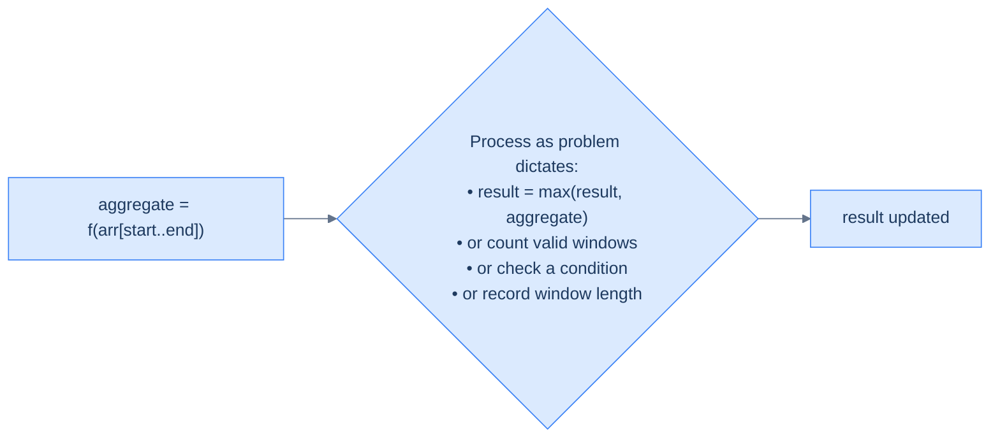
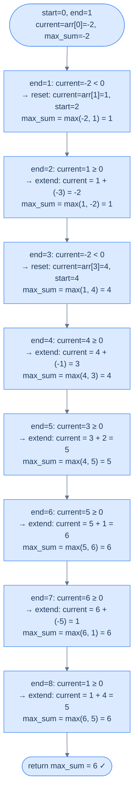
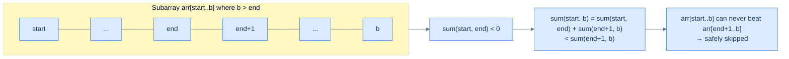
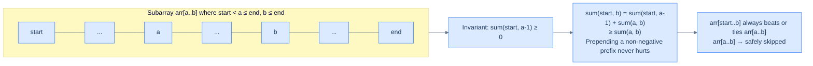
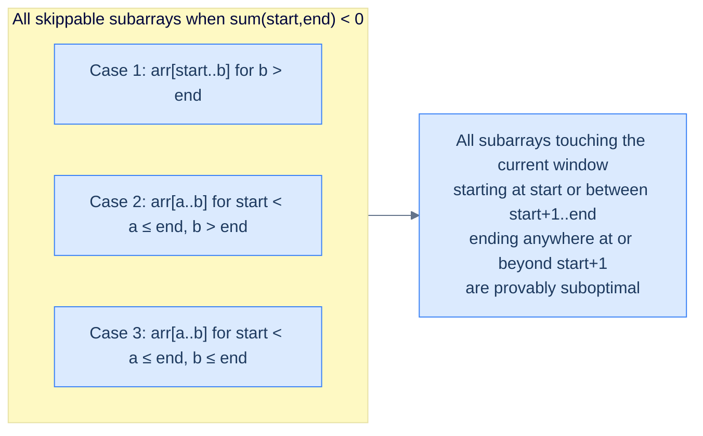

# Understanding the Variable Sized Sliding Window Pattern

## The Train Car Grew Elastic

The fixed sliding window was satisfying — a train car with exactly `k` seats, sliding smoothly down the track, processing every window of precisely `k` elements. Elegant and predictable.

But what if the problem doesn't give you `k`?

What if you need the *longest* subarray whose sum stays below a threshold? Or the *shortest* subarray whose product exceeds some limit? Or the subarray with the maximum possible sum — where the optimal length could be 1, 3, or N, depending entirely on the values?

The fixed window fails immediately. You'd have to run it for every possible window size from 1 to N — that's O(N²) total work, exactly as bad as the naive nested loops you were trying to escape.

There has to be a better way. And there is — but it demands a harder question: *can we skip most subarrays entirely without missing the answer?*

---

## The Rubber Band Window

Forget the train car with fixed seats. Picture a **rubber band** stretched across the array. The left end is pinned at index `start`. The right end is held at index `end`. As you move through the array, the band can **stretch** (moving `end` forward to include more elements) or **compress** (moving `start` forward to shrink from the left).

> 🖼 Diagram — TODO: add caption
```d2
direction: right

stretch_before: "Before: arr[1..2]" {
  grid-columns: 6
  grid-gap: 0
  a0: "2"
  a1: "5" {style.fill: "#fde68a"; style.stroke: "#d97706"}
  a2: "1" {style.fill: "#fde68a"; style.stroke: "#d97706"}
  a3: "3"
  a4: "7"
  a5: "4"
}

stretch_op: |md
  **`end += 1`**

  `end`: 2 → 3, window grows right
|

stretch_after: "After: arr[1..3]" {
  grid-columns: 6
  grid-gap: 0
  b0: "2"
  b1: "5" {style.fill: "#fde68a"; style.stroke: "#d97706"}
  b2: "1" {style.fill: "#fde68a"; style.stroke: "#d97706"}
  b3: "3" {style.fill: "#dcfce7"; style.stroke: "#16a34a"}
  b4: "7"
  b5: "4"
}

stretch_before -> stretch_op
stretch_op -> stretch_after
```

> 🖼 Diagram — The variable-sized window breathes — end stretches it right, start compresses it from the left. At any moment the window covers exactly arr[start..end].
```d2
direction: right

compress_before: "Before: arr[1..3]" {
  grid-columns: 6
  grid-gap: 0
  a0: "2"
  a1: "5" {style.fill: "#fde68a"; style.stroke: "#d97706"}
  a2: "1" {style.fill: "#fde68a"; style.stroke: "#d97706"}
  a3: "3" {style.fill: "#fde68a"; style.stroke: "#d97706"}
  a4: "7"
  a5: "4"
}

compress_op: |md
  **`start += 1`**

  `start`: 1 → 2, window shrinks left
|

compress_after: "After: arr[2..3]" {
  grid-columns: 6
  grid-gap: 0
  b0: "2"
  b1: "5"
  b2: "1" {style.fill: "#fde68a"; style.stroke: "#d97706"}
  b3: "3" {style.fill: "#fde68a"; style.stroke: "#d97706"}
  b4: "7"
  b5: "4"
}

compress_before -> compress_op
compress_op -> compress_after
```

<p align="center"><strong>The variable-sized window breathes — <code>end</code> stretches it right, <code>start</code> compresses it from the left. At any moment the window covers exactly <code>arr[start..end]</code>.</strong></p>

This is the variable-sized sliding window. Unlike the fixed window, its size isn't predetermined — it breathes, expanding and contracting in response to the values inside it. Two pointer variables mark its boundaries, and a variable called `aggregate` always holds the current value of some function `f` computed over every element in the window `arr[start..end]`.

The window always starts with `start = 0` and `end = 0`, representing a zero-sized window. Then it grows, processes, and shrinks as it moves through the array, guided by a decision the problem defines: when to expand, when to contract, and when to process.

---

## What You Are Trying to Avoid

Some problems require computing the output of an aggregate function over **all** subarrays of an array and then aggregating those results into a single value. To solve these naively, you would need to run fixed-sized sliding windows of every size from 1 to N through the array — one pass per size. That is O(N²) total work.

| Starts at | Subarrays                               | Count |
|----------:|-----------------------------------------|------:|
| `i = 0`   | `[2]`, `[2,5]`, `[2,5,1]`, `[2,5,1,3]`  | 4     |
| `i = 1`   | `[5]`, `[5,1]`, `[5,1,3]`               | 3     |
| `i = 2`   | `[1]`, `[1,3]`                          | 2     |
| `i = 3`   | `[3]`                                   | 1     |
| **Total** |                                         | **10** |

<p align="center"><strong>All 10 distinct subarrays of <code>[2, 5, 1, 3]</code>. An array of size N has N(N+1)/2 subarrays — for N=1000 that is 500,500; for N=10,000 that is over 50 million.</strong></p>

However, for some problems we may only need to find results for **some** subarrays and can safely skip the remaining ones. These problems can be solved by the variable-sized sliding window technique, which contracts or expands the window in each iteration as it slides through the array. It is a powerful technique that solves many problems in a single pass that would otherwise need nested loops.

> 🖼 Diagram — At any point in time the window spans arr[start..end] and aggregate holds the value of function f computed over exactly those elements.
```d2
direction: right

arr: "Variable-sized window: arr[start..end]" {
  grid-columns: 6
  grid-gap: 0
  a0: "2"
  a1: "5" {style.fill: "#fde68a"; style.stroke: "#d97706"}
  a2: "1" {style.fill: "#fde68a"; style.stroke: "#d97706"}
  a3: "3" {style.fill: "#fde68a"; style.stroke: "#d97706"}
  a4: "7"
  a5: "4"
}

s: "▲ start" {shape: oval; style.fill: "#fde68a"; style.stroke: "#d97706"}
e: "▲ end" {shape: oval; style.fill: "#fde68a"; style.stroke: "#d97706"}
agg: "aggregate = f(arr[1..3])"

s -> arr.a1
e -> arr.a3
arr -> agg: "" {style.stroke-dash: 3}
```

<p align="center"><strong>At any point in time the window spans <code>arr[start..end]</code> and <code>aggregate</code> holds the value of function <code>f</code> computed over exactly those elements.</strong></p>

Two prerequisites make variable window possible:
1. You can **add** an element's contribution to `aggregate` in O(1) — so you can grow the window cheaply
2. You can **remove** an element's contribution from `aggregate` in O(1) — so you can shrink the window cheaply
3. You can **prove** that skipping certain subarrays never misses the optimal answer — this is the hard part

If all three hold, you get O(N). If any fails, nested loops are unavoidable.

---

## The Four Operations

The variable-sized sliding window uses `start` and `end` for boundaries and `aggregate` for the running result of `f` over `arr[start..end]`. We initialize `aggregate` with some default value dictated by the problem and start with `start = 0` and `end = 0` (a zero-sized window). We iterate until `end` reaches the end of the array, and in each iteration perform some or all of the following four operations.

### Operation 1 — Update Aggregate with Item at `end`

We update `aggregate` by adding the contribution of `arr[end]` to it so that `aggregate` always reflects the function `f` computed over all elements in the current window, including the one at `end`.

> 🖼 Diagram — Operation 1: add arr[end]'s contribution to aggregate. After this step, aggregate holds the value of f over the entire current window arr[start..end].
```d2
direction: right

before: "Before: arr[1..2], aggregate = 6" {
  grid-columns: 6
  grid-gap: 0
  a0: "2"
  a1: "5" {style.fill: "#fde68a"; style.stroke: "#d97706"}
  a2: "1" {style.fill: "#fde68a"; style.stroke: "#d97706"}
  a3: "3"
  a4: "7"
  a5: "4"
}

op: |md
  `aggregate = f(aggregate, arr[end])`

  `= f(6, arr[3]) = f(6, 3) = 9`
|

after_note: "aggregate now reflects arr[1..3]"

before -> op
op -> after_note
```

<p align="center"><strong>Operation 1: add <code>arr[end]</code>'s contribution to <code>aggregate</code>. After this step, <code>aggregate</code> holds the value of <code>f</code> over the entire current window <code>arr[start..end]</code>.</strong></p>

The function `f` must support an O(1) add operation. Common examples: `aggregate += arr[end]` for sum, `aggregate *= arr[end]` for product, `freq[arr[end]] += 1` for frequency counts.

### Operation 2 — Process the Aggregate

The value stored in `aggregate` is the aggregated value of the function `f` over the subarray from `start` to `end`. We process it as dictated by the problem — update a running maximum, check a validity condition, record a window length, count a match, or anything else the problem asks.

> 🖼 Diagram — Operation 2: use the current aggregate. This is the step where the problem's output logic lives — every window evaluated here is a candidate for the final answer.


<p align="center"><strong>Operation 2: use the current aggregate. This is the step where the problem's output logic lives — every window evaluated here is a candidate for the final answer.</strong></p>

### Operation 3 — Contract the Window by Incrementing `start`

If we can skip all remaining subarrays starting at `start` — specifically the ones that would end beyond `end` — we increment `start` by 1, which contracts the window from the left. We also update `aggregate` to remove the contribution of `arr[start]` (the item being removed from the window).

> 🖼 Diagram — Operation 3: remove arr[start]'s contribution from aggregate and advance start. This permanently discards all subarrays beginning at the old start that extend beyond end.
```d2
direction: right

before: "Before: arr[1..3], invariant violated" {
  grid-columns: 6
  grid-gap: 0
  a0: "2"
  a1: "5" {style.fill: "#fde68a"; style.stroke: "#d97706"}
  a2: "1" {style.fill: "#fde68a"; style.stroke: "#d97706"}
  a3: "3" {style.fill: "#fde68a"; style.stroke: "#d97706"}
  a4: "7"
  a5: "4"
}

op: |md
  `aggregate = f_inverse(aggregate, arr[start])`

  `start += 1`

  Subarrays starting at old `start` are skipped.
|

after: "After: arr[2..3], invariant restored" {
  grid-columns: 6
  grid-gap: 0
  b0: "2"
  b1: "5"
  b2: "1" {style.fill: "#dcfce7"; style.stroke: "#16a34a"}
  b3: "3" {style.fill: "#dcfce7"; style.stroke: "#16a34a"}
  b4: "7"
  b5: "4"
}

before -> op
op -> after
```

<p align="center"><strong>Operation 3: remove <code>arr[start]</code>'s contribution from <code>aggregate</code> and advance <code>start</code>. This permanently discards all subarrays beginning at the old <code>start</code> that extend beyond <code>end</code>.</strong></p>

```
aggregate = f_inverse(aggregate, arr[start])  # Remove arr[start]'s contribution
start += 1                                     # Contract window from the left
```

Critical: one contraction isn't always enough. Many problems require a **while loop** on the contraction condition — keep shrinking until the invariant is fully restored before moving on. The choice between `if` and `while` here is one of the most important decisions when adapting the template to a specific problem.

### Operation 4 — Expand the Window by Incrementing `end`

If we want to consider the next subarray starting at `start` — that is, the subarray from `start` to `end+1` — in the next iteration, we increment `end` by 1, which expands the window to the right. We do **not** add the contribution of the newly added item to `aggregate` yet — that will be done in the next iteration's Operation 1.

> 🖼 Diagram — Operation 4: advance end to expand the window. The element at the new end position is NOT added to aggregate yet — that happens in the very next iteration's Operation 1.
```d2
direction: right

before: "Current: arr[1..3]" {
  grid-columns: 6
  grid-gap: 0
  a0: "2"
  a1: "5" {style.fill: "#fde68a"; style.stroke: "#d97706"}
  a2: "1" {style.fill: "#fde68a"; style.stroke: "#d97706"}
  a3: "3" {style.fill: "#fde68a"; style.stroke: "#d97706"}
  a4: "7"
  a5: "4"
}

op: |md
  `end += 1`

  `arr[end] = 7` is added in the next iteration.
|

after: "After: arr[1..4] next iteration" {
  grid-columns: 6
  grid-gap: 0
  b0: "2"
  b1: "5" {style.fill: "#fde68a"; style.stroke: "#d97706"}
  b2: "1" {style.fill: "#fde68a"; style.stroke: "#d97706"}
  b3: "3" {style.fill: "#fde68a"; style.stroke: "#d97706"}
  b4: "7" {style.fill: "#dcfce7"; style.stroke: "#16a34a"}
  b5: "4"
}

before -> op
op -> after
```

<p align="center"><strong>Operation 4: advance <code>end</code> to expand the window. The element at the new <code>end</code> position is NOT added to <code>aggregate</code> yet — that happens in the very next iteration's Operation 1.</strong></p>

```
end += 1  # arr[end]'s contribution will be added in the next iteration
```

---

## The Variable Sized Sliding Window Technique

The variable-sized sliding window technique uses two variables `start` and `end` to maintain a window in the array and a variable `aggregate` that always holds the aggregated value of `f` over the current window. We initialize `aggregate` with some default value dictated by the problem, and start with `start = 0` and `end = 0` denoting a zero-sized window. We iterate until `end` reaches the end of the array and in each iteration do some or all of the operations described above.

> **Step 1:** Initialize two variables, `start` and `end` to 0.
>
> **Step 2:** Initialize `aggregate` to some initial value dictated by the problem.
>
> **Step 3:** Loop while `end` < `arr.size()` and do the following:
>
> - **Step 3.1:** Check if we should compute `aggregate`:
>   - **Step 3.1.1:** Add the contribution of `arr[end]` to `aggregate`
>
> - **Step 3.2:** Process `aggregate` as dictated by the problem
>
> - **Step 3.3:** Check if we should contract the window:
>   - **Step 3.3.1:** Remove the contribution of `arr[start]` from `aggregate` using the inverse function
>   - **Step 3.3.2:** Increment `start` by 1
>
> - **Step 3.4:** Check if we should expand the window:
>   - **Step 3.4.1:** Increment `end` by 1

The four adaptations you make when solving a specific problem:
- **What is `aggregate`?** Sum, product, frequency map, distinct element count, or something else
- **When do you compute the aggregate (Step 3.1)?** Always, or only under certain conditions
- **When and how many times do you contract (Step 3.3)?** `if` for at most one contraction per iteration, `while` for as many as needed
- **What does "process" do (Step 3.2)?** Update a max, count valid windows, record a length, check a condition

---

## Implementation

Given below is the generic code implementation of the variable-sized sliding window technique on an array `arr`, using `start` and `end` as the boundaries of the window.


```python run

def sliding_window(arr: List[int]) -> None:
    # Initialize start and end to 0
    start = 0
    end = 0

    # Initialize aggregate to a default value
    aggregate = 0

    # Move the window one step to the right until
    # it reaches the end of the array
    while end < len(arr):

        if should_compute_aggregate:
            # Add contribution of arr[end]
            aggregate = f(aggregate, arr[end])

        # Process aggregate
        # ......
        # (Add your processing code here)

        if should_contract_window:
            # Remove contribution of arr[start] using the inverse function
            aggregate = f_inverse(aggregate, arr[start])
            # Contract window
            start += 1

        if should_expand_window:
            end += 1
```

```java run

public class SlidingWindow {
    public void slidingWindow(int[] arr) {
        // Initialize start and end to 0
        int start = 0, end = 0;

        // Initialize aggregate to a default value
        int aggregate = 0;

        // Move the window one step to the right until
        // it reaches the end of the array
        while (end < arr.length) {

            if (shouldComputeAggregate) {
                // Add contribution of arr[end]
                aggregate = f(aggregate, arr[end]);
            }

            // Process aggregate
            // ......
            // (Add your processing code here)

            if (shouldContractWindow) {
                // Remove contribution of arr[start] using the inverse function
                aggregate = fInverse(aggregate, arr[start]);
                // Contract window
                start++;
            }

            if (shouldExpandWindow) {
                end++;
            }
        }
    }
}
```


Notice how this template mirrors the fixed window structurally — the same `start`, `end`, `aggregate` trio — but the contraction and expansion decisions are now **conditional** rather than triggered mechanically by the window size crossing `k`. That conditionality is where all the problem-specific logic lives.

---

## Complexity Analysis

The algorithm's time and space complexity is straightforward to reason about.

We create a sliding window using `start` and `end`, and with each iteration we either move, expand, or contract it. Both `start` and `end` are initialized to 0, and at least one of them moves forward in each iteration. This means there can be a maximum of **2×N** iterations of the outer while loop before both pointers reach the end of the array.

In the worst case, both `start` and `end` iterate the entire array — leading to O(2×N) ≈ **O(N)** time complexity, assuming that both `f_add` and `f_remove` have constant O(1) time complexity. In the best case, `end` reaches the end of the array after N iterations, which also gives linear **O(N)** time.

Since we do not create any new data structure that grows with the input, the space complexity is constant **O(1)** in any case.

| | Time | Space |
|---|---|---|
| Best case | **O(N)** | **O(1)** |
| Worst case | **O(N)** | **O(1)** |

**Compared to brute force:** A naive nested loop evaluates all N(N+1)/2 subarrays at O(f) per subarray — total O(N² × f). Variable window achieves O(N × f). For f = O(1) and N = 10,000: brute force performs ~50 million operations; variable window performs 10,000. That is not a minor improvement — it is the difference between milliseconds and seconds.

---

Later in the course, we will examine techniques for identifying problems that can be solved using the variable-sized sliding window technique and walk through a complete example to better understand it.

# Identifying the Variable Sized Sliding Window Pattern

## Recognition Checklist

Before you reach for a variable-sized sliding window, walk through these four diagnostic questions. Every one must answer **yes** — a single **no** means the pattern is unsafe and you need a different technique.

1. **Is the input a single sequence (array, string, or stream)?** The window slides over one ordered structure; pair-of-arrays problems need simultaneous traversal, not a window.
2. **Are you computing an aggregate over every subarray, then reducing across those aggregates?** The shape is `g(f(sub))` — sum/product/count per window, then max/min/count across windows. A pure "find an element" or "sort then operate" problem does not fit.
3. **Can `f` add and remove a single element in `O(1)`?** Sum and product can. Mode, median, and "count distinct exceeding K" can — with a hash map or multiset assist. Sorted-order queries (max/min in window) cannot without a deque/heap upgrade.
4. **Does shrinking the window from the left strictly improve (or strictly worsen) the invariant in a known direction?** This monotonic property is what makes skipping safe — without it, contracting the window is just guessing.

If all four answers are **yes**, the variable-sized sliding window is provably correct. Skip any one and you are either solving a different pattern or about to write something incorrect.

---

## The Honesty Test

You now know what a variable-sized sliding window does. But knowing the technique isn't enough — you need to know *when it applies*. Walk into any problem about subarrays and naively reach for this pattern, and you might spend an hour implementing something that is provably wrong.

There is a checklist. Every box must be checked before the variable window is safe to use.

---

## The Identification Template

Some specific problems where we need to return a single result after aggregating the results from all subarrays in an array can be solved using the variable-sized sliding window technique. In these problems, we can often skip calculating results for some subarrays by identifying when to expand, contract, or move the window. These are generally medium or hard problems, as we need to make some critical observations and prove that skipping some subarrays does not affect the correctness of the solution.

If the problem statement or its solution follows the generic template below, it can be solved by applying the variable-sized sliding window technique:

> Given an array, compute the value of an aggregate function `f` for all subarrays. Apply another aggregate function `g` on the results and return the output. We should be able to add and remove the contribution of an item from the aggregate computed by `f`.

Breaking the template down:
- **`f`** is the per-subarray aggregate — the function you compute over every element in a window (sum, product, count of distinct elements, etc.)
- **`g`** is the cross-subarray aggregate — the function you apply across all subarray results to get the final answer (maximum, minimum, count of valid windows, etc.)
- **Add/remove in O(1)** — the critical mechanical requirement. If you cannot undo an element's contribution to `f` in constant time, the variable window gains you nothing.
- **Provable skipping** — the critical mathematical requirement. You must establish a **window invariant**: a condition about the current window that lets you prove entire families of subarrays are suboptimal and can be ignored without missing the answer. This is what makes these problems hard.

---

## A Worked Example — Maximum Subarray Sum

Let's walk through the complete identification, solution, and proof process on a concrete problem.

**Problem statement:** Given an integer array `arr`, find the subarray with the largest sum and return the sum.

> 🖼 Diagram — Find the subarray with the maximum sum. The answer is not always the whole array — negative elements can drag it down, making a shorter subarray better.
```d2
direction: right

array: "arr = [-2, 1, -3, 4, -1, 2, 1, -5, 4]" {
  grid-columns: 9
  grid-gap: 0
  a0: "-2"
  a1: "1"
  a2: "-3"
  a3: "4" {style.fill: "#dcfce7"; style.stroke: "#16a34a"}
  a4: "-1" {style.fill: "#dcfce7"; style.stroke: "#16a34a"}
  a5: "2" {style.fill: "#dcfce7"; style.stroke: "#16a34a"}
  a6: "1" {style.fill: "#dcfce7"; style.stroke: "#16a34a"}
  a7: "-5"
  a8: "4"
}

best: "Maximum sum subarray: [4, -1, 2, 1] → sum = 6" {
  grid-columns: 4
  grid-gap: 0
  b0: "4" {style.fill: "#dcfce7"; style.stroke: "#16a34a"}
  b1: "-1" {style.fill: "#dcfce7"; style.stroke: "#16a34a"}
  b2: "2" {style.fill: "#dcfce7"; style.stroke: "#16a34a"}
  b3: "1" {style.fill: "#dcfce7"; style.stroke: "#16a34a"}
}
```

<p align="center"><strong>Find the subarray with the maximum sum. The answer is not always the whole array — negative elements can drag it down, making a shorter subarray better.</strong></p>

### Does It Fit the Template?

The problem description fits the template for variable-sized sliding window problems as described below:

- **`f` = sum:** Compute the sum of all elements in the current window
- **`g` = maximum:** Find the maximum sum across all subarrays
- **O(1) add?** Yes — `aggregate += arr[end]`
- **O(1) remove?** Yes — `aggregate -= arr[start]`
- **Can we skip subarrays?** We need to make a key observation and prove it — that is what makes this problem non-trivial

Three boxes check immediately. The fourth — provable skipping — is the hard part, and we will look at the proof after the solution.

---

## The Brute Force Solution

The brute-force solution is to use nested loops to find the sum of all possible subarrays. If the sum of any subarray is greater than the maximum seen so far, we update the maximum sum value. Below is an execution of the brute force solution on the array.

> 🖼 Diagram — Brute force checks every subarray — N(N+1)/2 total. For each outer position i, the inner loop extends j rightward accumulating the sum. Every subarray is evaluated explicitly.
```d2
direction: right

i0: "Outer loop i=0: all subarrays starting at index 0" {
  grid-columns: 4
  grid-gap: 16
  j0a: |md
    `[-2]`

    sum=-2
  |
  j0b: |md
    `[-2,1]`

    sum=-1
  |
  j0c: |md
    `[-2,1,-3]`

    sum=-4
  |
  j0d: "..."
}

i1: "Outer loop i=1: all subarrays starting at index 1" {
  grid-columns: 4
  grid-gap: 16
  j1a: |md
    `[1]`

    sum=1
  |
  j1b: |md
    `[1,-3]`

    sum=-2
  |
  j1c: |md
    `[1,-3,4]`

    sum=2
  |
  j1d: "..."
}

i3: "Outer loop i=3: all subarrays starting at index 3" {
  grid-columns: 4
  grid-gap: 16
  j3a: |md
    `[4]`

    sum=4
  |
  j3b: |md
    `[4,-1]`

    sum=3
  |
  j3c: |md
    `[4,-1,2]`

    sum=5
  |
  j3d: |md
    `[4,-1,2,1]`

    sum=6 ← new max
  | {style.fill: "#dcfce7"; style.stroke: "#16a34a"}
}
```

<p align="center"><strong>Brute force checks every subarray — N(N+1)/2 total. For each outer position <code>i</code>, the inner loop extends <code>j</code> rightward accumulating the sum. Every subarray is evaluated explicitly.</strong></p>

> ▶ Interactive Diagram — TODO: add caption
```d3 widget=array-traversal
{
  "items": ["-2", "1", "-3", "4", "-1", "2", "1", "-5", "4"],
  "title": "Brute force max subarray sum — selected highlights",
  "steps": [
    { "markers": [{"name": "i", "index": 0, "color": "#3b82f6"}, {"name": "j", "index": 0, "color": "#f59e0b"}], "range": {"lo": 0, "hi": 0}, "msg": "i=0, j=0 → subarray=[-2], sum=-2; maxSum=-2." },
    { "markers": [{"name": "i", "index": 0, "color": "#3b82f6"}, {"name": "j", "index": 1, "color": "#f59e0b"}], "range": {"lo": 0, "hi": 1}, "msg": "i=0, j=1 → subarray=[-2,1], sum=-1; maxSum=-1." },
    { "markers": [{"name": "i", "index": 0, "color": "#3b82f6"}, {"name": "j", "index": 8, "color": "#f59e0b"}], "range": {"lo": 0, "hi": 8}, "msg": "…i=0 continues to j=8 (all subarrays starting at 0)." },
    { "markers": [{"name": "i", "index": 1, "color": "#3b82f6"}, {"name": "j", "index": 1, "color": "#f59e0b"}], "range": {"lo": 1, "hi": 1}, "msg": "i=1, j=1 → subarray=[1], sum=1." },
    { "markers": [{"name": "i", "index": 3, "color": "#3b82f6"}, {"name": "j", "index": 3, "color": "#f59e0b"}], "range": {"lo": 3, "hi": 3}, "msg": "i=3, j=3 → subarray=[4], sum=4; maxSum=4." },
    { "markers": [{"name": "i", "index": 3, "color": "#3b82f6"}, {"name": "j", "index": 4, "color": "#f59e0b"}], "range": {"lo": 3, "hi": 4}, "msg": "i=3, j=4 → subarray=[4,-1], sum=3." },
    { "markers": [{"name": "i", "index": 3, "color": "#3b82f6"}, {"name": "j", "index": 5, "color": "#f59e0b"}], "range": {"lo": 3, "hi": 5}, "msg": "i=3, j=5 → subarray=[4,-1,2], sum=5; maxSum=5." },
    { "markers": [{"name": "i", "index": 3, "color": "#3b82f6"}, {"name": "j", "index": 6, "color": "#f59e0b"}], "range": {"lo": 3, "hi": 6}, "msg": "i=3, j=6 → subarray=[4,-1,2,1], sum=6; maxSum=6 ★." },
    { "markers": [{"name": "i", "index": 3, "color": "#3b82f6"}, {"name": "j", "index": 7, "color": "#f59e0b"}], "range": {"lo": 3, "hi": 7}, "msg": "i=3, j=7 → subarray=[4,-1,2,1,-5], sum=1; maxSum stays 6." },
    { "markers": [{"name": "i", "index": 3, "color": "#3b82f6"}, {"name": "j", "index": 8, "color": "#f59e0b"}], "range": {"lo": 3, "hi": 8}, "msg": "i=3, j=8 → subarray=[4,-1,2,1,-5,4], sum=5; maxSum stays 6. Outer loop continues to i=4..8 (all dominated by earlier 6)." }
  ]
}
```


```python run viz=array viz-root=arr
from typing import List

def max_subarray_sum_brute(arr: List[int]) -> int:
    max_sum = float('-inf')                          # -∞ handles all-negative arrays.
    for i in range(len(arr)):
        current_sum = 0
        for j in range(i, len(arr)):
            current_sum += arr[j]
            max_sum = max(current_sum, max_sum)
    return max_sum

print(max_subarray_sum_brute([-2, 1, -3, 4, -1, 2, 1, -5, 4]))   # 6
```

```java run
public class Main {
    static int maxSubarraySumBrute(int[] arr) {
        int maxSum = Integer.MIN_VALUE;
        for (int i = 0; i < arr.length; i++) {
            int currentSum = 0;
            for (int j = i; j < arr.length; j++) {
                currentSum += arr[j];
                if (currentSum > maxSum) maxSum = currentSum;
            }
        }
        return maxSum;
    }

    public static void main(String[] args) {
        System.out.println(maxSubarraySumBrute(new int[]{-2, 1, -3, 4, -1, 2, 1, -5, 4}));
    }
}
```


Though the solution is correct, it requires nested loops and has a time complexity of **O(N²)** in any case. For N = 100,000, this runs approximately 5 billion operations — completely impractical.

---

## The Variable Sized Sliding Window Solution

By closely observing the problem, we can see that we don't need to calculate the sum of all subarrays to find the subarray with the maximum sum. Here is the key insight:

**If the running sum of a window turns negative, then every subarray extending that window will be beaten by a fresh start from the next element.** Adding more elements to a subarray that is already negative can only make things worse. Any subarray that starts fresh from the very next index will have a strictly better sum.

This is the **window invariant** that we maintain:

> For all indices `i` such that `start ≤ i < end`, the sum `arr[start..i]` is non-negative.

We initialize `start` and `end` to 0 to create a sliding window and iterate using `end` until we reach the end of the array. We create variables `sum` and `max_sum` to aggregate the sum of all items in the current window and keep track of the maximum sum seen so far.

In each iteration, we add the item at `end` to `sum` and update `max_sum` if `sum` is greater than the maximum seen so far. If `sum` turns negative at any point, we set `start = end + 1` to effectively contract the window size back to 0 when the window expands at the end of the iteration. We also set `sum = 0` to reset the aggregate as the window size is now 0.

Below is the execution of the variable-sized sliding window technique on the example array:

> 🖼 Diagram — TODO: add caption


> ▶ Interactive Diagram — The variable-sized sliding window skips all subarrays starting between start+1 and end, and all subarrays starting at start and ending beyond end. Two resets occur — at end=1 and end=3 — discarding all subarrays rooted in those negative prefixes.
```d3 widget=array-traversal
{
  "items": ["-2", "1", "-3", "4", "-1", "2", "1", "-5", "4"],
  "title": "Variable-window max subarray sum (Kadane's) on [-2, 1, -3, 4, -1, 2, 1, -5, 4]",
  "steps": [
    { "markers": [{"name": "start", "index": 0, "color": "#3b82f6"}, {"name": "end", "index": 0, "color": "#f59e0b"}], "range": {"lo": 0, "hi": 0}, "msg": "Init: current = arr[0] = −2, maxSum = −2." },
    { "markers": [{"name": "start", "index": 1, "color": "#3b82f6"}, {"name": "end", "index": 1, "color": "#f59e0b"}], "range": {"lo": 1, "hi": 1}, "msg": "end=1, current=−2 < 0 → reset: current=arr[1]=1, start=1; maxSum = max(−2, 1) = 1." },
    { "markers": [{"name": "start", "index": 1, "color": "#3b82f6"}, {"name": "end", "index": 2, "color": "#f59e0b"}], "range": {"lo": 1, "hi": 2}, "msg": "end=2, current=1 ≥ 0 → extend: current = 1 + (−3) = −2; maxSum stays 1." },
    { "markers": [{"name": "start", "index": 3, "color": "#3b82f6"}, {"name": "end", "index": 3, "color": "#f59e0b"}], "range": {"lo": 3, "hi": 3}, "msg": "end=3, current=−2 < 0 → reset: current=arr[3]=4, start=3; maxSum = max(1, 4) = 4." },
    { "markers": [{"name": "start", "index": 3, "color": "#3b82f6"}, {"name": "end", "index": 4, "color": "#f59e0b"}], "range": {"lo": 3, "hi": 4}, "msg": "end=4, current=4 ≥ 0 → extend: current = 4 + (−1) = 3; maxSum stays 4." },
    { "markers": [{"name": "start", "index": 3, "color": "#3b82f6"}, {"name": "end", "index": 5, "color": "#f59e0b"}], "range": {"lo": 3, "hi": 5}, "msg": "end=5, current=3 ≥ 0 → extend: current = 3 + 2 = 5; maxSum = max(4, 5) = 5." },
    { "markers": [{"name": "start", "index": 3, "color": "#3b82f6"}, {"name": "end", "index": 6, "color": "#f59e0b"}], "range": {"lo": 3, "hi": 6}, "msg": "end=6, current=5 ≥ 0 → extend: current = 5 + 1 = 6; maxSum = max(5, 6) = 6 ★." },
    { "markers": [{"name": "start", "index": 3, "color": "#3b82f6"}, {"name": "end", "index": 7, "color": "#f59e0b"}], "range": {"lo": 3, "hi": 7}, "msg": "end=7, current=6 ≥ 0 → extend: current = 6 + (−5) = 1; maxSum stays 6." },
    { "markers": [{"name": "start", "index": 3, "color": "#3b82f6"}, {"name": "end", "index": 8, "color": "#f59e0b"}], "range": {"lo": 3, "hi": 8}, "msg": "end=8, current=1 ≥ 0 → extend: current = 1 + 4 = 5; maxSum stays 6 → return 6." }
  ]
}
```

<p align="center"><strong>The variable-sized sliding window skips all subarrays starting between <code>start+1</code> and <code>end</code>, and all subarrays starting at <code>start</code> and ending beyond <code>end</code>. Two resets occur — at <code>end=1</code> and <code>end=3</code> — discarding all subarrays rooted in those negative prefixes.</strong></p>


```python run viz=array viz-root=arr
from typing import List

class Solution:
    def max_subarray_sum(self, arr: List[int]) -> int:
        if not arr:
            return 0

        # To store the starting index of the subarray
        start = 0

        # To store the ending index of the subarray
        end = 0

        # Initialize sum to a default value (current sum)
        sum = arr[end]

        # To store the maximum subarray sum found so far
        max_sum = arr[end]

        # Increment to start from index 1 as index 0 has already been
        # taken into account
        end += 1

        # Sliding window
        while end < len(arr):

            # If the current sum becomes negative, reset the window
            if sum < 0:
                sum = arr[end]
                start = end + 1

            # Otherwise, add the contribution of arr[end]
            else:
                sum += arr[end]

            # Update the maximum subarray sum found so far
            max_sum = max(max_sum, sum)

            # Expand the window from the right
            end += 1

        return max_sum


sol = Solution()
print(sol.max_subarray_sum([-2, 1, -3, 4, -1, 2, 1, -5, 4]))   # 6
print(sol.max_subarray_sum([-3, -1, -2]))                       # -1
print(sol.max_subarray_sum([1]))                                # 1
```

```java run
public class Main {
    static class Solution {
        public int maxSubarraySum(int[] arr) {
            if (arr.length == 0) {
                return 0;
            }

            // To store the starting index of the subarray
            int start = 0;

            // To store the ending index of the subarray
            int end = 0;

            // Initialize sum to a default value (current sum)
            int sum = arr[end];

            // To store the maximum subarray sum found so far
            int maxSum = arr[end];

            // Increment to start from index 1 as index 0 has already been
            // taken into account
            end++;

            // Sliding window
            while (end < arr.length) {

                // If the current sum becomes negative, reset the window
                if (sum < 0) {
                    sum = arr[end];
                    start = end + 1;
                }

                // Otherwise, add contribution of arr[end]
                else {
                    sum += arr[end];
                }

                // Update the maximum subarray sum found so far
                maxSum = Math.max(maxSum, sum);

                // Expand the window from the right
                end++;
            }

            return maxSum;
        }
    }

    public static void main(String[] args) {
        Solution sol = new Solution();
        System.out.println(sol.maxSubarraySum(new int[]{-2, 1, -3, 4, -1, 2, 1, -5, 4}));  // 6
        System.out.println(sol.maxSubarraySum(new int[]{-3, -1, -2}));                       // -1
        System.out.println(sol.maxSubarraySum(new int[]{1}));                                 // 1
    }
}
```


<details>
<summary><strong>Trace — arr = [-2, 1, -3, 4, -1, 2, 1, -5, 4]</strong></summary>

```
arr = [-2, 1, -3, 4, -1, 2, 1, -5, 4]
Initial: current = arr[0] = -2, max_sum = -2, end → 1

end=1: current=-2 < 0 → reset  | current=arr[1]=1, start=2     | max_sum=max(-2,1)=1
end=2: current=1 ≥ 0  → extend | current=1+(-3)=-2             | max_sum=max(1,-2)=1
end=3: current=-2 < 0 → reset  | current=arr[3]=4, start=4     | max_sum=max(1,4)=4
end=4: current=4 ≥ 0  → extend | current=4+(-1)=3              | max_sum=max(4,3)=4
end=5: current=3 ≥ 0  → extend | current=3+2=5                 | max_sum=max(4,5)=5
end=6: current=5 ≥ 0  → extend | current=5+1=6                 | max_sum=max(5,6)=6
end=7: current=6 ≥ 0  → extend | current=6+(-5)=1              | max_sum=max(6,1)=6
end=8: current=1 ≥ 0  → extend | current=1+4=5                 | max_sum=max(6,5)=6

Result: 6 ✓  (subarray [4, -1, 2, 1], indices 3..6)
The two resets (at end=1 and end=3) skipped all subarrays rooted at negative prefixes.
```

</details>

As the code above demonstrates, using the variable-sized sliding window technique we solve the problem in a **single pass in O(N) time**. But how do we know this is safe? We need to prove that resetting when the sum goes negative never causes us to miss the actual maximum subarray.

---

## Proof of Correctness

Consider we have an array `arr` and a window denoted by `start` and `end` (including `start`, including `end`) somewhere in the array such that `sum(start, i)` is non-negative for all `i` such that `start ≤ i < end`. This will be the **invariant** that we maintain throughout the execution.

> 🖼 Diagram — The invariant states that every partial sum from start to any index before end is non-negative. The window has been "clean" up to this point.
```d2
invariant: "Invariant: sum(start, i) ≥ 0 for all i in [start, end)" {
  grid-columns: 6
  grid-gap: 0
  s_node: "start"
  i1: "arr[start]" {style.fill: "#dcfce7"; style.stroke: "#16a34a"}
  i2: "arr[start+1]" {style.fill: "#dcfce7"; style.stroke: "#16a34a"}
  i3: "..."
  ie: "arr[end-1]" {style.fill: "#dcfce7"; style.stroke: "#16a34a"}
  e_node: "end"
}

note: |md
  Every prefix sum

  `arr[start..i] ≥ 0`
| {style.fill: "#dcfce7"; style.stroke: "#16a34a"}

invariant -> note: "" {style.stroke-dash: 3}
```

<p align="center"><strong>The invariant states that every partial sum from <code>start</code> to any index before <code>end</code> is non-negative. The window has been "clean" up to this point.</strong></p>

Now consider that adding the item at index `end` turns the sum negative — that is, `sum(start, end)` is negative:

> 🖼 Diagram — Adding arr[end] pushed the total sum below zero. We now prove that every subarray touching this region can be safely discarded as a candidate for the maximum sum.
```d2
direction: right

brk: "sum(start, end) < 0 — invariant broken" {
  grid-columns: 5
  grid-gap: 0
  s_node: "start"
  i1: "arr[start]"
  i2: "..."
  ie: "arr[end-1]"
  endn: |md
    `arr[end]`

    ← this broke it
  | {style.fill: "#fecaca"; style.stroke: "#dc2626"}
}

note: "sum(start, end) < 0" {style.fill: "#fecaca"; style.stroke: "#dc2626"}

brk -> note: "" {style.stroke-dash: 3}
```

<p align="center"><strong>Adding <code>arr[end]</code> pushed the total sum below zero. We now prove that every subarray touching this region can be safely discarded as a candidate for the maximum sum.</strong></p>

If the invariant holds, we can prove that all of the following subarrays can never have the maximum sum and can be ignored.

---

### 1. Subarrays Starting at `start` and Ending Beyond `end`

Consider a subarray starting at `start` and ending beyond `end` at some index `b`. We can prove that `sum(start, b)` can never be the maximum sum. This is because `sum(end+1, b)` will always be greater, since `sum(start, end)` is negative.

Decompose: `sum(start, b) = sum(start, end) + sum(end+1, b)`

Since `sum(start, end) < 0`: `sum(start, b) < sum(end+1, b)`

> 🖼 Diagram — Case 1: a negative prefix drags down any extension beyond it. Starting fresh at end+1 always produces a higher sum.


<p align="center"><strong>Case 1: a negative prefix drags down any extension beyond it. Starting fresh at <code>end+1</code> always produces a higher sum.</strong></p>

**Conclusion:** We can skip all subarrays starting at `start` and ending beyond `end`.

---

### 2. Subarrays Starting Between `start+1` and `end` and Ending Beyond `end`

Consider a subarray starting between `start + 1` and `end` (including both) at some index `a`, and ending beyond `end` at some index `b`. We can see that `sum(a, b)` can never be the maximum sum, because it will always be less than `sum(end+1, b)`.

The argument: `sum(a, end)` is negative. This is because `sum(start, end)` is negative and, per our invariant, `sum(start, a-1)` is non-negative — which means `sum(a, end)` must be negative (a non-negative prefix cannot be responsible for a negative total; the remainder must be).

Once we know `sum(a, end) < 0`, the same argument from Case 1 applies: `sum(a, b) = sum(a, end) + sum(end+1, b) < sum(end+1, b)`.

> 🖼 Diagram — Case 2: any subarray rooted between start+1 and end that extends beyond end is beaten by starting fresh at end+1.

```mermaid
---
config:
  theme: base
  themeVariables:
    primaryColor: "#dbeafe"
    primaryBorderColor: "#3b82f6"
    primaryTextColor: "#1e3a5f"
    lineColor: "#64748b"
    secondaryColor: "#ede9fe"
    tertiaryColor: "#fef9c3"
---
flowchart LR
    subgraph Structure["Subarray arr[a..b] where start < a ≤ end, b > end"]
        direction LR
        S["start"] --- Dots1["..."] --- A["a"] --- Dots2["..."] --- EN["end"] --- Dots3["..."] --- B["b"]
    end
    Inv["Invariant: sum(start, a-1) ≥ 0"]
    Neg["sum(start, end) < 0 and sum(start, a-1) ≥ 0<br/>⟹ sum(a, end) < 0"]
    Comp["sum(a, b) = sum(a, end) + sum(end+1, b)<br/>< sum(end+1, b)"]
    Conc["arr[a..b] can never beat arr[end+1..b]<br/>→ safely skipped"]
    Structure --> Inv --> Neg --> Comp --> Conc
```


<p align="center"><strong>Case 2: any subarray rooted between <code>start+1</code> and <code>end</code> that extends beyond <code>end</code> is beaten by starting fresh at <code>end+1</code>.</strong></p>

**Conclusion:** We can skip all subarrays starting between `start+1` and `end` (including both) and ending beyond `end`.

---

### 3. Subarrays Starting Between `start+1` and `end` and Ending At or Before `end`

Consider a subarray starting between `start + 1` and `end` (including both) at index `a`, and ending at or before `end` at index `b`. We can see that `sum(a, b)` can never be the maximum sum, because it will always be less than `sum(start, b)`.

The argument: per our invariant, `sum(start, a-1) ≥ 0`. Therefore:

`sum(start, b) = sum(start, a-1) + sum(a, b) ≥ sum(a, b)`

Any subarray starting later than `start` and ending at the same point `b` is always beaten by the subarray starting at `start`, because prepending a non-negative prefix to any subarray never reduces its sum.

> 🖼 Diagram — Case 3: any subarray starting strictly after start and ending before end is dominated by the corresponding subarray starting at start — which was already evaluated in a previous iteration.


<p align="center"><strong>Case 3: any subarray starting strictly after <code>start</code> and ending before <code>end</code> is dominated by the corresponding subarray starting at <code>start</code> — which was already evaluated in a previous iteration.</strong></p>

**Conclusion:** We can skip all subarrays starting between `start+1` and `end` (including both) and ending at or before `end`.

---

### The Full Conclusion — What Is Skipped and What Is Kept

We can conclude from the three cases above that if the invariant holds, the following subarrays can be skipped entirely:

1. All subarrays starting at `start` and ending beyond `end` (from Case 1)
2. All subarrays starting between `start+1` and `end`, including both, ending anywhere (from Cases 2 and 3)

> 🖼 Diagram — Three cases together cover every possible subarray that touches the current window. All are safely skippable once the prefix sum turns negative.


<p align="center"><strong>Three cases together cover every possible subarray that touches the current window. All are safely skippable once the prefix sum turns negative.</strong></p>

Conversely, this means that only the following subarrays still need to be checked for the maximum sum:

1. Subarrays starting at `start` and ending **before** `end` — but these were already evaluated in previous iterations
2. Subarrays starting **after** `end` — which will be evaluated in future iterations

> 🖼 Diagram — Nothing is ever missed. Category 1 was evaluated as end grew from start to end-1. Category 2 is handled by setting start = end + 1 and continuing forward.
```d2
keep: "Subarrays still worth checking" {
  grid-columns: 2
  grid-gap: 24
  k1: |md
    **1.** `arr[start..i]` for `i < end`

    ← already evaluated in prior iterations
  | {style.fill: "#dcfce7"; style.stroke: "#16a34a"}
  k2: |md
    **2.** `arr[j..b]` for `j > end`

    ← will be evaluated in future iterations
  | {style.fill: "#dbeafe"; style.stroke: "#3b82f6"}
}
```

<p align="center"><strong>Nothing is ever missed. Category 1 was evaluated as <code>end</code> grew from <code>start</code> to <code>end-1</code>. Category 2 is handled by setting <code>start = end + 1</code> and continuing forward.</strong></p>

The variable-sized sliding window technique does precisely this: it sets `start = 0` and `end = 0` to initialize a window of zero size for which the invariant holds trivially. It then expands the window using `end` and maintains the invariant as it iterates. In each iteration it considers `sum(start, end)` as a candidate for the maximum sum. At any point if `sum(start, end)` turns negative, it sets `start = end + 1` to skip all subarrays starting between `start+1` and `end` and all subarrays starting at `start` and ending beyond `end`.

Since the invariant is maintained throughout the run, and we consider `sum(start, end)` for the maximum sum in each iteration, we are guaranteed to find the maximum sum while only skipping subarrays that can never have the maximum sum.

---

## Example Problems

Most problems in this category are medium or hard — the difficulty lies not in the template itself, but in identifying the right invariant and proving the skipping is safe. The following problems in this section are solved using the variable-sized sliding window:

- **Consecutive Ones** — find the length of the longest run of 1s (no flips allowed)
- **Product Conundrum** — find the length of the longest subarray with product strictly less than K
- **Maximum Subarray Sum** — find the maximum sum over any subarray (the problem we just proved)
- **Consecutive Ones with K Flips** — find the longest run of 1s with at most K zeros flipped

We will now solve these problems to understand the variable-size sliding window technique better.
