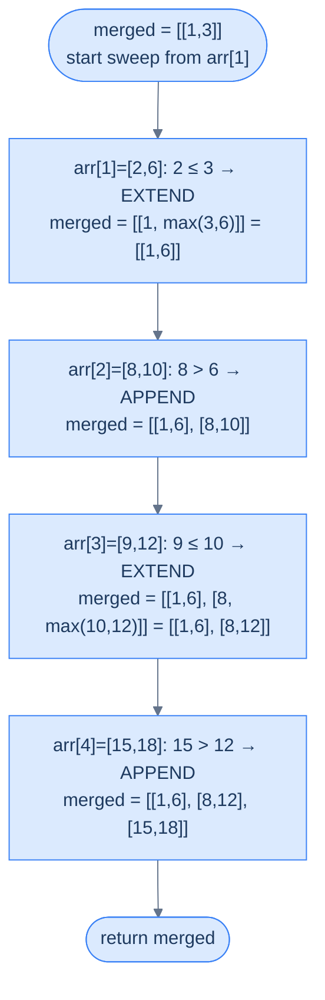
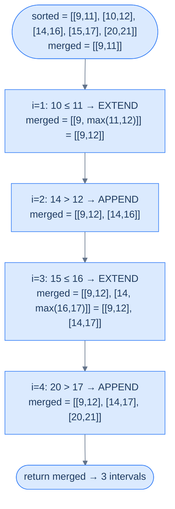

# Understanding the Line Sweep Technique

## The Hook

Imagine a thousand events scattered across a single day — flights landing, meetings booked, server requests arriving. Your task: find every moment two events overlap. The naive answer compares **every pair** — a million comparisons for a thousand events, a billion for ten thousand. There's a smarter way that does it in roughly the time it takes to *sort* the events. Once you see the trick, you'll never reach for nested loops on interval problems again.

The trick has a name. Computational geometers call it the **line sweep**, and it powers everything from collision detection in games to query planning in databases. Today you're going to learn it from first principles.

---

## The World — A Vertical Line Walking Across Your Data

Picture an x-axis stretched out before you. Every event in your input — every meeting, every flight, every request — gets placed on it as a small horizontal segment. The segment's left edge is its **start time**, the right edge its **end time**.

> 🖼 Diagram — An interval is just two points on a number line — a start and an end. The "axis" represents whatever scalar matters: time, distance, kilometres, frequency.
```d2
plane: "An interval on the x-axis" {
  grid-columns: 4
  grid-gap: 0
  s: "start" {style.fill: "#dcfce7"; style.stroke: "#16a34a"}
  m1: "•"
  m2: "•"
  e: "end" {style.fill: "#fde68a"; style.stroke: "#d97706"}
}

lbl: |md
  `interval = [start, end]`
|

plane -> lbl: "" {style.stroke-dash: 3}
```

<p align="center"><strong>An interval is just two points on a number line — a <code>start</code> and an <code>end</code>. The "axis" represents whatever scalar matters: time, distance, kilometres, frequency.</strong></p>

Now imagine a tall vertical line standing at the very left of the axis. You walk it slowly to the right. Every time the line *crosses* an event boundary — entering an interval or leaving one — something happens: a counter increments, a set updates, an answer gets recorded. The line is your cursor; the events are landmarks; the algorithm is the bookkeeping you do at each landmark.

That walking line is the **sweep line**. You're not comparing pairs anymore — you're processing events in a single ordered pass.

> *Before you read on — what would happen if the events arrived in random order? Could you still sweep the line meaningfully?*

You couldn't. The whole power of the sweep depends on visiting events in a deterministic order — almost always **sorted by start coordinate** (with end as a tiebreaker, or vice versa). Without sorting, the "line" has no axis to walk along.

---

## Step 1 — Sort the Events

Sorting is the price of admission. Intervals are usually sorted **by start coordinate ascending**, and ties broken by end coordinate ascending. The sorted order makes traversal of the array equivalent to walking left-to-right on the x-axis.

> 🖼 Diagram — Sort the interval array by start ascending; break ties by end ascending. Iterating the sorted array is now equivalent to scanning the x-axis left-to-right.
```d2
direction: right

unsorted: "Unsorted: arbitrary positions on the axis" {
  grid-columns: 4
  grid-gap: 16
  u1: "[6,8]"
  u2: "[1,3]"
  u3: "[4,7]"
  u4: "[2,5]"
}

sorted: "After sorting by (start, end)" {
  grid-columns: 4
  grid-gap: 16
  s1: "[1,3]" {style.fill: "#dcfce7"; style.stroke: "#16a34a"}
  s2: "[2,5]" {style.fill: "#dcfce7"; style.stroke: "#16a34a"}
  s3: "[4,7]" {style.fill: "#dcfce7"; style.stroke: "#16a34a"}
  s4: "[6,8]" {style.fill: "#dcfce7"; style.stroke: "#16a34a"}
}

unsorted -> sorted
```

<p align="center"><strong>Sort the interval array by <code>start</code> ascending; break ties by <code>end</code> ascending. Iterating the sorted array is now equivalent to scanning the x-axis left-to-right.</strong></p>

Why sort by start first, then by end? Because the sweep advances by start position — the start tells you *when* an event becomes relevant. If two events share a start, the end tiebreaker keeps the smaller, fully-contained one before the longer one. That subtle ordering matters for problems like "merge all overlapping intervals" — we'll see why in a moment.

> 🖼 Diagram — Ties on start are broken by end ascending — shorter intervals come first so they fold into the longer one as the sweep continues.
```d2
tiebreak: "Tiebreak: same start, sort by end ascending" {
  grid-columns: 3
  grid-gap: 16
  t1: "[2,4]" {style.fill: "#dcfce7"; style.stroke: "#16a34a"}
  t2: "[2,7]"
  t3: "[2,9]"
}

note: |md
  Smaller, contained intervals come first

  so the sweep sees them before their longer siblings
|

tiebreak -> note: "" {style.stroke-dash: 3}
```

<p align="center"><strong>Ties on <code>start</code> are broken by <code>end</code> ascending — shorter intervals come first so they fold into the longer one as the sweep continues.</strong></p>

---

## Step 2 — Sweep the Line

With the array sorted, traversing it from left to right *is* the sweep. As you visit each interval, you maintain some piece of state — a counter, a "currently active" set, the last interval you kept. That state encodes the answer-so-far. As the sweep crosses each event, you update the state in O(1) and continue.

> 🖼 Diagram — The sweep visits each interval in sorted order, updating shared state in O(1). One pass — no nested loops.
```d2
direction: right

axis: "Sorted intervals on the x-axis" {
  grid-columns: 4
  grid-gap: 0
  a: "[1,3]"
  b: "[2,5]"
  c: "[4,7]"
  d: "[6,8]"
}

sweep: "▲ sweep line walks left → right" {style.fill: "#fde68a"; style.stroke: "#d97706"}

state: |md
  **State:** depends on problem

  (active count, merged list, last end seen, ...)
|

axis -> sweep
sweep -> state
```

<p align="center"><strong>The sweep visits each interval in sorted order, updating shared state in O(1). One pass — no nested loops.</strong></p>

> ▶ Interactive Diagram — TODO: add caption
```d3 widget=array-traversal
{
  "items": ["[1,3]", "[2,5]", "[4,7]", "[6,8]"],
  "title": "Line sweep — visit sorted intervals left to right",
  "steps": [
    { "markers": [{"name": "sweep", "index": 0, "color": "#f59e0b"}], "msg": "Sweep at [1,3] — state initialised (algorithm-specific)." },
    { "markers": [{"name": "sweep", "index": 1, "color": "#f59e0b"}], "msg": "Sweep advances to [2,5] — state updated based on relation to previous." },
    { "markers": [{"name": "sweep", "index": 2, "color": "#f59e0b"}], "msg": "Sweep advances to [4,7] — single O(1) state update." },
    { "markers": [{"name": "sweep", "index": 3, "color": "#f59e0b"}], "msg": "Sweep advances to [6,8] — final state produces the answer." }
  ]
}
```

The state is **the algorithm**. Different problems need different state:
- **Merge overlaps** → keep the last merged interval and stretch its end forward
- **Maximum concurrent events** → maintain a running count of active intervals
- **Detect any overlap** → remember the largest end seen so far
- **Find gaps** → record any moment where current start > previous end

The sweep itself is universal; the state machine on top is what makes each problem unique.

---

## Complexity Analysis

| | Time | Space |
|---|---|---|
| **Best case (sort in place)** | O(N log N) | O(1) |
| **Worst case (sorted copy)** | O(N log N) | O(N) |

The work breakdown is mechanical:
- **Sorting** — O(N log N), and there's no way around it; the sweep depends on order.
- **Single pass** — O(N) after sorting; each interval handled exactly once with O(1) state updates.

So the total is dominated by the sort: **O(N log N)** in any case. Space is O(1) when you can sort the input in place; O(N) when the problem requires preserving the original order or working on an immutable input.

---

> Sorting + one pass + a small piece of state. That is the entire shape of a sweep. The next section takes this skeleton and grows the most common state machine on top of it: **interval merging**.

# Understanding the Interval Merging Pattern

## The Hook

You've got a calendar with 47 overlapping bookings. You want a clean list — no duplicates, no fragments — just the *blocks* of busy time. A reasonable first idea is "compare every pair, merge if they overlap, repeat until stable" — and that's O(N³) on a bad day. The line sweep collapses it to a single left-to-right scan that *can never miss* an overlap. Once you've seen the trick, you'll start spotting interval-merging in problems that don't even mention intervals.

This is the **interval merging pattern** — the most common application of the sweep line on the planet, and the workhorse behind half the "calendar", "ranges", and "schedule" interview questions you'll ever see.

---

## The World — Sweeping a Highlighter Across a Number Line

Picture every interval as a colored stripe drawn on a long sheet of paper. Some stripes overlap, some sit alone. Your job: produce one cleaned-up sheet where overlapping stripes have been **fused** into single, longer stripes, and isolated stripes are left alone.

> 🖼 Diagram — Merging fuses overlapping intervals into the smallest set of disjoint intervals that covers all the original ones — like running a highlighter and never lifting it through any overlap.
```d2
direction: right

before: "Before: 5 raw intervals (some overlap)" {
  grid-columns: 5
  grid-gap: 16
  a1: "[1,3]"
  a2: "[2,6]"
  a3: "[8,10]"
  a4: "[9,12]"
  a5: "[15,18]"
}

after: "After: 3 merged intervals" {
  grid-columns: 3
  grid-gap: 16
  b1: "[1,6]" {style.fill: "#dcfce7"; style.stroke: "#16a34a"}
  b2: "[8,12]" {style.fill: "#dcfce7"; style.stroke: "#16a34a"}
  b3: "[15,18]" {style.fill: "#dcfce7"; style.stroke: "#16a34a"}
}

before -> after
```

<p align="center"><strong>Merging fuses overlapping intervals into the smallest set of disjoint intervals that covers all the original ones — like running a highlighter and never lifting it through any overlap.</strong></p>

The mental shortcut: **sweep with a single highlighter**. Whenever the next stripe touches the current one, extend the highlighter rightward. Whenever the next stripe is completely past the current one, lift the pen, start a new stripe.

That mental model *is* the algorithm.

---

## Step 1 — Sort by Start Coordinate

Sorting comes first, as always for a sweep.

> 🖼 Diagram — After sorting, intervals appear in left-to-right order on the x-axis. The sweep can now process them in a single pass.
```d2
direction: right

in_arr: "arr (unsorted)" {
  grid-columns: 5
  grid-gap: 16
  i1: "[8,10]"
  i2: "[1,3]"
  i3: "[15,18]"
  i4: "[2,6]"
  i5: "[9,12]"
}

out_arr: "arr (sorted by start, then end)" {
  grid-columns: 5
  grid-gap: 16
  o1: "[1,3]" {style.fill: "#dcfce7"; style.stroke: "#16a34a"}
  o2: "[2,6]" {style.fill: "#dcfce7"; style.stroke: "#16a34a"}
  o3: "[8,10]" {style.fill: "#dcfce7"; style.stroke: "#16a34a"}
  o4: "[9,12]" {style.fill: "#dcfce7"; style.stroke: "#16a34a"}
  o5: "[15,18]" {style.fill: "#dcfce7"; style.stroke: "#16a34a"}
}

in_arr -> out_arr
```

<p align="center"><strong>After sorting, intervals appear in left-to-right order on the x-axis. The sweep can now process them in a single pass.</strong></p>

Why start coordinate? Because **two intervals overlap iff the one starting later has its start inside the one starting earlier**. Sorting by start guarantees the "earlier-starting" interval is always the one you've already seen — exactly the one sitting at the back of your `merged` list.

> *Pause and predict — what would go wrong if you sorted by **end** coordinate instead?*

You could lose overlaps. Consider `[[1, 10], [2, 4]]`. Sorted by end: `[[2, 4], [1, 10]]`. Now when you process `[1, 10]`, its start (1) is **before** the previous interval's start (2) — your "is this overlapping the last merged interval?" check no longer makes sense, because the new interval doesn't sit cleanly to the right of the last one. Sorting by start eliminates this whole class of bookkeeping.

---

## Step 2 — Initialize `merged` With the First Interval

Create an output list `merged` and seed it with the first sorted interval. The "current highlighter stripe" is always **the last item in `merged`** — that's the only interval the sweep can extend.

> 🖼 Diagram — Seed merged with the first interval. From now on, every new interval is compared only against merged.last — never the entire list.
```d2
sorted: "Sorted arr" {
  grid-columns: 5
  grid-gap: 0
  s1: "[1,3]" {style.fill: "#fde68a"; style.stroke: "#d97706"}
  s2: "[2,6]"
  s3: "[8,10]"
  s4: "[9,12]"
  s5: "[15,18]"
}

init: |md
  `merged = [ [1,3] ]`

  (seeded with arr[0])
| {style.fill: "#fde68a"; style.stroke: "#d97706"}

sorted -> init
```

<p align="center"><strong>Seed <code>merged</code> with the first interval. From now on, every new interval is compared only against <code>merged.last</code> — never the entire list.</strong></p>

This is a crucial invariant: **`merged` always contains pairwise disjoint, sorted intervals**. Because the input is sorted, any new overlap can only reach back to the most recent merged interval. We never need to scan further.

---

## Step 3 — Sweep and Decide: Extend or Append

For each subsequent interval `arr[i]`, ask one yes/no question:

> *Does `arr[i]`'s start lie inside or touch the last merged interval's end?*

- **Yes** (`arr[i].start <= merged.last.end`) → **extend** the highlighter. Update `merged.last.end = max(merged.last.end, arr[i].end)`. The `max` matters because `arr[i]` could be entirely contained within the last merged interval — never shrink an interval you've already grown.
- **No** (`arr[i].start > merged.last.end`) → **lift the pen**. Append `arr[i]` to `merged` as a fresh stripe.

> 🖼 Diagram — Each iteration peeks at merged.last and either extends its end or appends a fresh interval. The sweep visits every input exactly once.


<p align="center"><strong>Each iteration peeks at <code>merged.last</code> and either extends its end or appends a fresh interval. The sweep visits every input exactly once.</strong></p>

> ▶ Interactive Diagram — TODO: add caption
```d3 widget=array-traversal
{
  "items": ["[1,3]", "[2,6]", "[8,10]", "[9,12]", "[15,18]"],
  "title": "Interval merging on sorted arr = [[1,3], [2,6], [8,10], [9,12], [15,18]]",
  "primaryLabel": "arr (sorted)",
  "secondaryItems": ["[1,3]", "·", "·", "·", "·"],
  "secondaryLabel": "merged",
  "steps": [
    {
      "items": ["[1,3]", "[2,6]", "[8,10]", "[9,12]", "[15,18]"],
      "markers": [{"name": "i", "index": 0, "color": "#3b82f6"}],
      "secondaryItems": ["[1,3]", "·", "·", "·", "·"],
      "secondaryKeys": ["m0", "m1", "m2", "m3", "m4"],
      "msg": "Init: seed merged with arr[0]=[1,3]. Sweep starts from i=1."
    },
    {
      "items": ["[1,3]", "[2,6]", "[8,10]", "[9,12]", "[15,18]"],
      "markers": [{"name": "i", "index": 1, "color": "#3b82f6"}],
      "secondaryItems": ["[1,6]", "·", "·", "·", "·"],
      "secondaryKeys": ["m0", "m1", "m2", "m3", "m4"],
      "secondaryMarkers": [{"name": "last", "index": 0, "color": "#f59e0b"}],
      "msg": "i=1: arr[1]=[2,6]. 2 ≤ 3 (last.end) → EXTEND → merged.last = [1, max(3,6)] = [1,6]."
    },
    {
      "items": ["[1,3]", "[2,6]", "[8,10]", "[9,12]", "[15,18]"],
      "markers": [{"name": "i", "index": 2, "color": "#3b82f6"}],
      "secondaryItems": ["[1,6]", "[8,10]", "·", "·", "·"],
      "secondaryKeys": ["m0", "m1", "m2", "m3", "m4"],
      "secondaryMarkers": [{"name": "last", "index": 1, "color": "#f59e0b"}],
      "msg": "i=2: arr[2]=[8,10]. 8 > 6 → APPEND → merged = [[1,6], [8,10]]."
    },
    {
      "items": ["[1,3]", "[2,6]", "[8,10]", "[9,12]", "[15,18]"],
      "markers": [{"name": "i", "index": 3, "color": "#3b82f6"}],
      "secondaryItems": ["[1,6]", "[8,12]", "·", "·", "·"],
      "secondaryKeys": ["m0", "m1", "m2", "m3", "m4"],
      "secondaryMarkers": [{"name": "last", "index": 1, "color": "#f59e0b"}],
      "msg": "i=3: arr[3]=[9,12]. 9 ≤ 10 → EXTEND → merged.last = [8, max(10,12)] = [8,12]."
    },
    {
      "items": ["[1,3]", "[2,6]", "[8,10]", "[9,12]", "[15,18]"],
      "markers": [{"name": "i", "index": 4, "color": "#3b82f6"}],
      "secondaryItems": ["[1,6]", "[8,12]", "[15,18]", "·", "·"],
      "secondaryKeys": ["m0", "m1", "m2", "m3", "m4"],
      "secondaryMarkers": [{"name": "last", "index": 2, "color": "#f59e0b"}],
      "msg": "i=4: arr[4]=[15,18]. 15 > 12 → APPEND → merged = [[1,6], [8,12], [15,18]] ✓"
    }
  ]
}
```

The `<=` vs `<` distinction is the only edge-case knob. If your problem treats touching intervals like `[1, 3]` and `[3, 5]` as overlapping (e.g. continuous busy time), use `<=`. If it treats them as adjacent-but-distinct (e.g. discrete sessions), use `<`. The whole algorithm is otherwise identical.

---

## Why Only the Last Merged Interval?

Because the input is sorted by start, any interval we process from this point forward has a start coordinate `≥ arr[i].start`. The intervals already inside `merged` (excluding the last) all have **end coordinates that come before `merged.last.start`** — otherwise they would have been merged into `merged.last` themselves. So they cannot possibly overlap with anything still to come.

> 🖼 Diagram — The "compare only against the last" trick works because sorted input plus the merged-so-far invariant guarantee earlier intervals are forever sealed.
```d2
direction: right

m: "merged so far" {
  grid-columns: 3
  grid-gap: 0
  m1: "[1,6]"
  m2: "[8,12]"
  m3: "[15,18] ← last" {style.fill: "#fde68a"; style.stroke: "#d97706"}
}

future: |md
  Any future `arr[i]` has `start ≥ 15`<br/>(input is sorted)
|

conc: |md
  Future intervals can ONLY touch or extend `[15,18]` — never `[1,6]` or `[8,12]`
| {style.fill: "#dcfce7"; style.stroke: "#16a34a"}

m -> future
future -> conc
```

<p align="center"><strong>The "compare only against the last" trick works because sorted input plus the merged-so-far invariant guarantee earlier intervals are forever sealed.</strong></p>

That's why the algorithm is O(N) after sorting — every interval is compared against exactly one other interval, ever.

---

## Algorithm Summary

> **Step 1.** Sort `arr` by start coordinate ascending; break ties by end ascending.
>
> **Step 2.** Initialize `merged = [arr[0]]`.
>
> **Step 3.** For `i` from 1 to `len(arr) - 1`:
>
> - **3.1.** If `arr[i].start <= merged.last.end` → set `merged.last.end = max(merged.last.end, arr[i].end)` (extend).
> - **3.2.** Else → append `arr[i]` to `merged` (lift the pen).
>
> **Step 4.** Return `merged`.

The whole pattern — every "merge intervals" problem on every interview prep site — is *that*. Four steps. One pass after sorting.

---

## Implementation

The generic merge function below uses `<=` so touching intervals are merged. Flip it to `<` if your problem treats touching as non-overlapping.


```python run
class Solution:
    def merge_overlapping(
        self, arr: List[List[int]]
    ) -> List[List[int]]:

        # Sort arr by start time
        arr.sort(key=lambda x: x[0])

        # Initialize output array and push the first interval
        merged = [arr[0]]

        # Loop through arr and merge if overlapping or adjacent
        for i in range(1, len(arr)):

            # If the current interval overlaps with the last interval in
            # the merged list, merge them
            # Change '<=' to '<' for cases where the start of an interval
            # coinciding with the end of another is not considered an overlap
            if arr[i][0] <= merged[-1][1]:
                merged[-1][1] = max(merged[-1][1], arr[i][1])

            # If the current interval is non-overlapping, add it to the
            # merged list
            else:
                merged.append(arr[i])
        return merged
```

```java run
import java.util.*;

class Solution {
    public int[][] mergeOverlapping(int[][] arr) {

        // Sort arr by start time
        Arrays.sort(arr, (a, b) -> Integer.compare(a[0], b[0]));

        // Initialize output list and push the first interval
        List<int[]> merged = new ArrayList<>();
        merged.add(arr[0]);

        // Loop through arr and merge if overlapping or adjacent
        for (int i = 1; i < arr.length; i++) {

            // If the current interval overlaps with the last interval in
            // the merged list, merge them
            // Change '<=' to '<' for cases where the start of an interval
            // coinciding with the end of another is not considered an overlap
            if (arr[i][0] <= merged.get(merged.size() - 1)[1]) {
                merged.get(merged.size() - 1)[1] =
                    Math.max(
                        merged.get(merged.size() - 1)[1],
                        arr[i][1]
                    );
            }

            // If the current interval is non-overlapping, add it to the
            // merged list
            else {
                merged.add(arr[i]);
            }
        }

        // Convert output list to 2D array and return
        return merged.toArray(new int[merged.size()][]);
    }
}
```


---

## Complexity Analysis

| | Time | Space |
|---|---|---|
| **Best case (all merge into one)** | O(N log N) | O(1) extra (output is one interval) |
| **Worst case (no overlap)** | O(N log N) | O(N) extra (output equals input) |

Sorting dominates at **O(N log N)**. The sweep itself is O(N). Space depends on the output: best case is one big merged interval (O(1)), worst case is N disjoint intervals (O(N)).

---

> The pattern is mechanical, but identifying *when* to apply it is the real skill. The next section gives you a template for spotting interval-merging problems in disguise — and walks through a concrete example end to end.

# Identifying the Interval Merging Pattern

## The Hook

You won't always see the word "merge" in the problem statement. You'll see "find the minimum number of meeting rooms", "verify the schedule has no conflicts", "compress the busy intervals", "find the gaps". All of these are interval merging in costume. The trick is recognizing the underlying shape: **a set of intervals + a question whose answer becomes obvious once overlaps are merged**.

This section gives you a one-line template for spotting it, and then walks a full example from problem statement → solution.

---

## The Identification Template

> Given an array of intervals, **merge all overlapping intervals**, and the merged form either *is* the answer or makes the answer trivially derivable.

If you can rephrase the problem so that step one is "merge overlapping intervals", you have a candidate. After merging, you should be able to read off the answer with one more O(N) pass — counting, summing lengths, finding gaps, picking the first or last, etc.

If the rephrased problem requires *not* merging — for example, "count the maximum number of overlapping intervals at any moment" — then this is **not** an interval-merging problem. That belongs to the maximum-overlap pattern (next section). Most "schedule" problems are easy or medium difficulty.

---

## Canonical Example — Delivery Intervals

### Problem Statement

> A delivery service expects a sequence of deliveries throughout the day, each described by a `[start, end]` time window. Find the **minimum number of non-overlapping time intervals** during which at least one delivery is expected at every moment.

> 🖼 Diagram — Find the minimum set of non-overlapping windows that cover every delivery — equivalently, "merge all overlapping deliveries". The merged count is the answer.
```d2
direction: right

input_arr: "Raw delivery windows" {
  grid-columns: 5
  grid-gap: 16
  i1: "[9, 11]"
  i2: "[10, 12]"
  i3: "[14, 16]"
  i4: "[15, 17]"
  i5: "[20, 21]"
}

output_arr: "Minimum non-overlapping busy intervals" {
  grid-columns: 3
  grid-gap: 16
  o1: "[9, 12]" {style.fill: "#dcfce7"; style.stroke: "#16a34a"}
  o2: "[14, 17]" {style.fill: "#dcfce7"; style.stroke: "#16a34a"}
  o3: "[20, 21]" {style.fill: "#dcfce7"; style.stroke: "#16a34a"}
}

input_arr -> output_arr
```

<p align="center"><strong>Find the minimum set of non-overlapping windows that cover every delivery — equivalently, "merge all overlapping deliveries". The merged count <em>is</em> the answer.</strong></p>

---

### Brute Force

The obvious approach treats every window as an obstacle. For each pair of deliveries, check whether their `[start, end]` ranges overlap; whenever two overlap, fuse them into a single longer window; repeat the scan until no fusions happen. With `N` deliveries that is up to O(N²) comparisons per pass and up to O(N) passes — O(N³) in the worst case. The cost comes from rechecking pairs that were already proven disjoint and from never exploiting the natural left-to-right structure of the time axis.

### Key Insight

Sorting deliveries by start coordinate forces every overlap to appear between **consecutive** entries in the sorted order. A delivery beginning at minute `15` can only overlap with one whose end is `≥ 15`, and after the sort that "previous one" is uniquely the most recent merged window. The sweep maintains a single piece of state — the last merged window — and updates it in O(1) per delivery. O(N log N) sort plus an O(N) pass replaces the cubic shuffle.

### Optimized Solution — Does It Fit the Template?

Apply the template:
- "Given an array of intervals" → ✓ delivery windows.
- "Merge all overlapping intervals" → ✓ the question literally asks for the smallest set of non-overlapping intervals covering everything.
- "Answer trivially derivable" → ✓ the merged list is itself the answer; we just return it (or its length).

This is a textbook interval-merging problem. We can solve it by running the generic merge directly.

---

### Trace

> 🖼 Diagram — The sweep extends the highlighter twice and lifts it twice. Final answer: three non-overlapping busy windows.


<p align="center"><strong>The sweep extends the highlighter twice and lifts it twice. Final answer: three non-overlapping busy windows.</strong></p>

> ▶ Interactive Diagram — TODO: add caption
```d3 widget=array-traversal
{
  "items": ["[9,11]", "[10,12]", "[14,16]", "[15,17]", "[20,21]"],
  "title": "Delivery intervals — merge on sorted [[9,11], [10,12], [14,16], [15,17], [20,21]]",
  "primaryLabel": "sorted",
  "secondaryItems": ["[9,11]", "·", "·", "·", "·"],
  "secondaryLabel": "merged",
  "steps": [
    {
      "items": ["[9,11]", "[10,12]", "[14,16]", "[15,17]", "[20,21]"],
      "markers": [{"name": "i", "index": 0, "color": "#3b82f6"}],
      "secondaryItems": ["[9,11]", "·", "·", "·", "·"],
      "secondaryKeys": ["m0", "m1", "m2", "m3", "m4"],
      "msg": "Init: seed merged with sorted[0]=[9,11]. Sweep from i=1."
    },
    {
      "items": ["[9,11]", "[10,12]", "[14,16]", "[15,17]", "[20,21]"],
      "markers": [{"name": "i", "index": 1, "color": "#3b82f6"}],
      "secondaryItems": ["[9,12]", "·", "·", "·", "·"],
      "secondaryKeys": ["m0", "m1", "m2", "m3", "m4"],
      "secondaryMarkers": [{"name": "last", "index": 0, "color": "#f59e0b"}],
      "msg": "i=1: [10,12]. 10 ≤ 11 → EXTEND → merged.last = [9, max(11,12)] = [9,12]."
    },
    {
      "items": ["[9,11]", "[10,12]", "[14,16]", "[15,17]", "[20,21]"],
      "markers": [{"name": "i", "index": 2, "color": "#3b82f6"}],
      "secondaryItems": ["[9,12]", "[14,16]", "·", "·", "·"],
      "secondaryKeys": ["m0", "m1", "m2", "m3", "m4"],
      "secondaryMarkers": [{"name": "last", "index": 1, "color": "#f59e0b"}],
      "msg": "i=2: [14,16]. 14 > 12 → APPEND → merged = [[9,12], [14,16]]."
    },
    {
      "items": ["[9,11]", "[10,12]", "[14,16]", "[15,17]", "[20,21]"],
      "markers": [{"name": "i", "index": 3, "color": "#3b82f6"}],
      "secondaryItems": ["[9,12]", "[14,17]", "·", "·", "·"],
      "secondaryKeys": ["m0", "m1", "m2", "m3", "m4"],
      "secondaryMarkers": [{"name": "last", "index": 1, "color": "#f59e0b"}],
      "msg": "i=3: [15,17]. 15 ≤ 16 → EXTEND → merged.last = [14, max(16,17)] = [14,17]."
    },
    {
      "items": ["[9,11]", "[10,12]", "[14,16]", "[15,17]", "[20,21]"],
      "markers": [{"name": "i", "index": 4, "color": "#3b82f6"}],
      "secondaryItems": ["[9,12]", "[14,17]", "[20,21]", "·", "·"],
      "secondaryKeys": ["m0", "m1", "m2", "m3", "m4"],
      "secondaryMarkers": [{"name": "last", "index": 2, "color": "#f59e0b"}],
      "msg": "i=4: [20,21]. 20 > 17 → APPEND → merged = [[9,12], [14,17], [20,21]] → 3 busy windows ✓"
    }
  ]
}
```


```python run
class Solution:
    def delivery_intervals(
        self, times: List[List[int]]
    ) -> List[List[int]]:

        # Sort times by start time
        times.sort(key=lambda x: x[0])

        # Initialize output array and push the first time
        merged = [times[0]]

        # Loop through times and merge if overlapping or adjacent
        for i in range(1, len(times)):

            # If the current time overlaps with the last time in
            # the merged list, merge them
            if times[i][0] <= merged[-1][1]:
                merged[-1][1] = max(merged[-1][1], times[i][1])

            # If the current time is non-overlapping, add it to the
            # merged list
            else:
                merged.append(times[i])
        return merged
```

```java run
import java.util.*;

class Solution {
    public int[][] deliveryIntervals(int[][] times) {

        // Sort times by start time
        Arrays.sort(times, (a, b) -> Integer.compare(a[0], b[0]));

        // Initialize output list and push the first time
        List<int[]> merged = new ArrayList<>();
        merged.add(times[0]);

        // Loop through times and merge if overlapping or adjacent
        for (int i = 1; i < times.length; i++) {

            // If the current time overlaps with the last time in
            // the merged list, merge them
            if (times[i][0] <= merged.get(merged.size() - 1)[1]) {
                merged.get(merged.size() - 1)[1] =
                    Math.max(
                        merged.get(merged.size() - 1)[1],
                        times[i][1]
                    );
            }

            // If the current time is non-overlapping, add it to the
            // merged list
            else {
                merged.add(times[i]);
            }
        }

        // Convert output list to 2D array and return
        return merged.toArray(new int[merged.size()][]);
    }
}
```


The pattern fits, the algorithm is the generic merge, the answer is `merged` itself. **O(N log N)** time, **O(N)** space for the output.

---

### Fitting the Template

Walk the four-row recipe one more time against the delivery problem:

| Step | Concrete substitution for Delivery Intervals |
|---|---|
| **Sort** by `start` ascending | `times.sort(key=lambda x: x[0])` reshuffles `[[10,12], [9,11], [20,21], [15,17], [14,16]]` into start order |
| **Seed** state with the first interval | `merged = [[9, 11]]` — the earliest delivery anchors the first busy window |
| **Compare** `arr[i].start` against `merged.last.end` | At `i=1`, `10 ≤ 11` triggers an extend; at `i=2`, `14 > 12` triggers an append |
| **Extend or append** | Each step either grows `merged[-1][1]` via `max` or pushes a fresh `[s, e]` |

Every row maps one-to-one onto the generic recipe — confirming that "delivery windows" is the same problem as "merge intervals" with the labels swapped.

---

## Example Problems

The four problems in this section all reduce to interval merging — sometimes in disguise. We'll work through each one with the same template.

- **Verify Schedule** — given meeting intervals, can a single person attend all of them?
- **Overlap Reduction** — given intervals, find the minimum number to remove so the rest are non-overlapping.
- **Employee Free Time** — given each employee's busy intervals, find the time windows when *every* employee is free.
- **Insert Interval** — given a sorted, non-overlapping list, insert a new interval and re-merge.

The first two are variations on plain merging. The last two stress your understanding of the *invariant* — what the merged list represents and how to update it without doing a full re-merge.

---

## Recognition Checklist

Four questions decide whether a problem belongs to interval merging. If three or more are `yes`, reach for sort + sweep before anything else.

1. **Is the input a set of `[start, end]` intervals on a 1-D axis?** The axis is usually time, but distance, frequency, or any other scalar works.
2. **Does the answer depend on which intervals overlap, touch, or sit beside each other?** Conflict detection, free-time gaps, merged spans, coverage counts — all yes.
3. **Would the answer be unchanged if you replaced the input with its merged form?** If `merge(input)` preserves what the question is asking, the pattern fits.
4. **Can you derive the answer from one left-to-right pass after sorting by `start`?** If the only "remembering" you need is the last merged interval or the previous end, you're inside the pattern.

Two `yes` answers plus an intuition that overlaps matter is usually enough — start writing the sweep and the rest falls out.

---

## Fitting the Template

The pattern slots into a four-row recipe that every problem in this section reuses with minor variations.

| Step | What it does | Why it works | Knob |
|---|---|---|---|
| **Sort** by `start` ascending (tiebreak `end` ascending) | Guarantees the next interval's start is `≥` everything already processed | The sweep can never "miss" an earlier interval | Sort order is fixed; tiebreak only matters when starts collide |
| **Seed** state with the first interval | Establishes the invariant: merged list is sorted and pairwise disjoint | Avoids a special case inside the loop | `merged = [arr[0]]` or `lastEnd = arr[0][1]` depending on the problem |
| **Compare** `arr[i].start` against `merged.last.end` | The only earlier interval that can still overlap is the most recent one (sort gives this) | Reduces each step to one O(1) comparison | `<=` merges touching; `<` keeps touching apart |
| **Extend or append** based on the comparison | Maintains the disjoint invariant after every step | Output is built incrementally — no second pass | `max(merged.last.end, arr[i].end)` matters when `arr[i]` is fully nested |

Total work: **O(N log N)** dominated by the sort; the sweep itself is O(N) time and O(1) extra beyond the output.

---

## Problems in This Category

| # | Problem | Difficulty | What it adds vs the template |
|---|---|---|---|
| 1 | [Verify Schedule](02-problems/01-verify-schedule.md) | Easy | The sweep returns on the first overlap — you never build `merged` |
| 2 | [Overlap Reduction](02-problems/02-overlap-reduction.md) | Medium | The literal template — produces and returns `merged` |
| 3 | [Employee Free Time](02-problems/03-employee-free-time.md) | Medium | Merge, then a second pass reads off the gaps between merged blocks |
| 4 | [Insert Interval](02-problems/04-insert-interval.md) | Hard | Skips the sort by exploiting an already-sorted-and-disjoint input — a three-phase linear sweep |

Each problem stresses a different part of the invariant. Work them in order: the easy ones cement the loop, and the hard one teaches you how a precondition collapses the cost.
