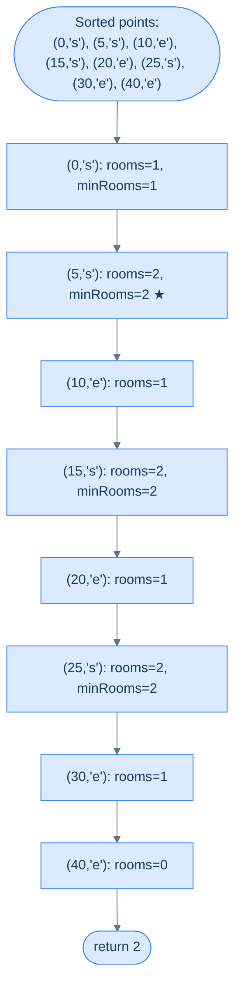
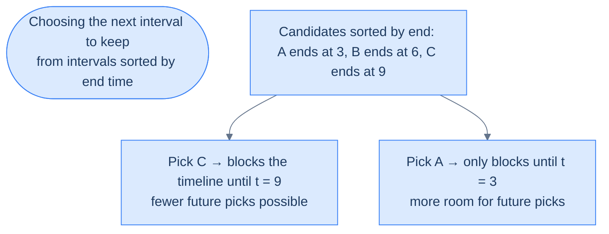
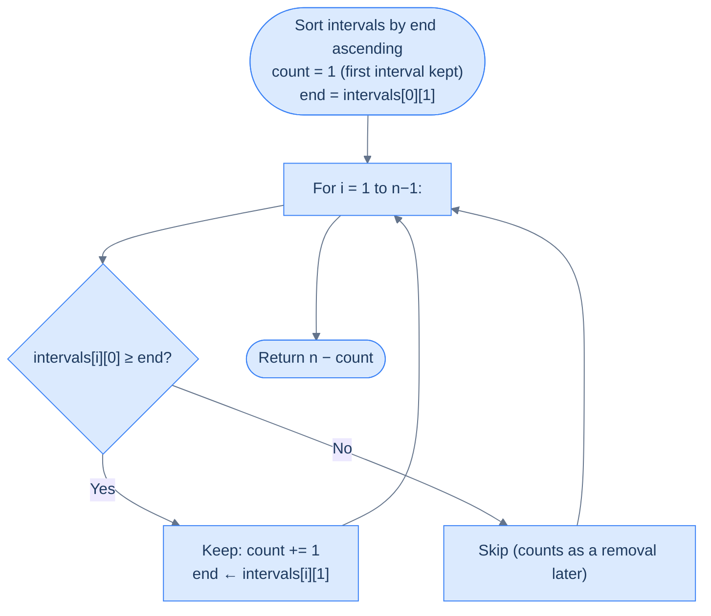
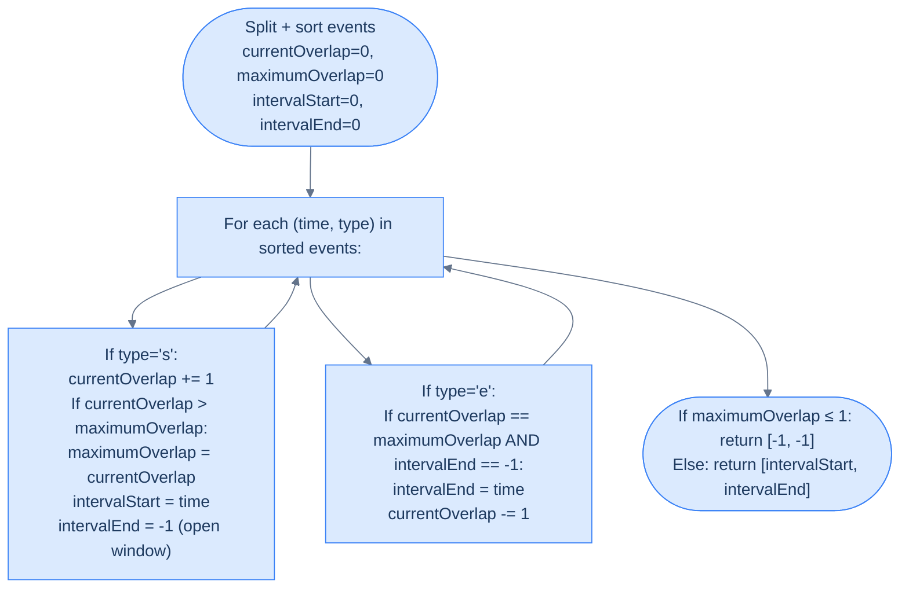
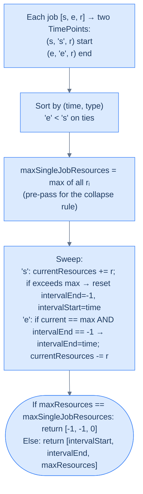

# 10. Pattern: Maximum Overlap

This section takes the line-sweep idea one step further. In the previous chapter you *merged* overlapping intervals; here you'll **count** them. How many events are active at the same time? Which moment is the busiest? How many servers do you need to run every job? These questions sound different — but under the hood, they're the same mechanical sweep with a counter riding on top.

## Table of Contents

1. [Understanding the Line Sweep Technique for Points](#understanding-the-line-sweep-technique-for-points)
2. [Understanding the Maximum Overlap Pattern](#understanding-the-maximum-overlap-pattern)
3. [Identifying the Maximum Overlap Pattern](#identifying-the-maximum-overlap-pattern)
4. [Minimum Meeting Rooms](#minimum-meeting-rooms)
5. [Remove Intervals](#remove-intervals)
6. [Busiest Interval](#busiest-interval)
7. [Peak Resource Requirement](#peak-resource-requirement)

***

# Understanding the Line Sweep Technique for Points

## The Hook

You just learned to sweep a line through **intervals**. But what if the events on your axis aren't continuous stripes — just **dots**? Lightning strikes timestamped to the millisecond. Asteroid collisions on a number line. The exact instants a coffee shop's door opens or closes. The sweep idea still works — and in fact, gets *simpler*. No more "does this overlap?" book-keeping; you just decide what happens **at each dot** and walk left to right.

Once you see the sweep as "an ordered walk over points that fire events", you'll realise almost every interval problem can be rewritten this way. That rewrite is the key to unlocking the **maximum overlap** pattern we're heading toward.

---

## The World — An Axis of Marked Points

Forget stripes for a moment. Picture a single horizontal axis with **points** marked on it — each point labelled with a letter, a number, or a tag telling you *what kind of event it is*.

```d2
axis: "x-axis with an interval marked as two points" {
  grid-columns: 5
  grid-gap: 0
  s: |md
    **s**

    start
  | {style.fill: "#dcfce7"; style.stroke: "#16a34a"}
  g1: "·"
  g2: "·"
  g3: "·"
  e: |md
    **e**

    end
  | {style.fill: "#fde68a"; style.stroke: "#d97706"}
}

lbl: |md
  `interval = [s, e]`

  represented as two independent points (s, 'start') and (e, 'end')
|

axis -> lbl
```

<p align="center"><strong>An interval can always be decomposed into two labelled points on the x-axis: a <code>start</code> and an <code>end</code>. The algorithm processes points, not intervals.</strong></p>

When intervals are the input, we **split them**. Each interval `[s, e]` becomes two entries — `(s, 'start')` and `(e, 'end')` — living in a single flat array of points. The sweep then visits those points in order, and the algorithm reacts to each one based on its tag.

That decomposition is the hinge. After it, the algorithm stops thinking in terms of interval geometry and starts thinking in terms of **events firing along an axis**.

> *Before reading on — why split intervals apart instead of keeping them as pairs? What extra power does the point representation give you?*

Because overlap is a **local** phenomenon. At any instant, overlap is determined by how many intervals are currently "open" — and that count only changes at start points (+1) or end points (−1). Tracking that count is much easier when each change is its own atomic event.

---

## Step 1 — Convert Intervals to Points

Walk the interval array once and emit two point records per interval.

```d2
direction: right

intervals: "arr (intervals)" {
  grid-columns: 3
  grid-gap: 16
  i1: "[1, 4]"
  i2: "[2, 5]"
  i3: "[6, 8]"
}

points: "points (after split)" {
  grid-columns: 6
  grid-gap: 8
  p1: "(1, 's')" {style.fill: "#dcfce7"; style.stroke: "#16a34a"}
  p2: "(4, 'e')" {style.fill: "#fde68a"; style.stroke: "#d97706"}
  p3: "(2, 's')" {style.fill: "#dcfce7"; style.stroke: "#16a34a"}
  p4: "(5, 'e')" {style.fill: "#fde68a"; style.stroke: "#d97706"}
  p5: "(6, 's')" {style.fill: "#dcfce7"; style.stroke: "#16a34a"}
  p6: "(8, 'e')" {style.fill: "#fde68a"; style.stroke: "#d97706"}
}

intervals -> points
```

<p align="center"><strong>Each interval produces two records in the <code>points</code> array: a tagged <code>start</code> and a tagged <code>end</code>. The size grows to <strong>2 × N</strong>.</strong></p>

The split doubles memory cost to `O(N)` — but it gives us a **flat, homogeneous sequence** that can be sorted and swept without any special-casing.

---

## Step 2 — Sort the Points

Sort the combined array in **non-decreasing order of coordinate value**. When two points share a coordinate, most problems break ties by putting **`'end'` before `'start'`** — we'll see why in the next section. For now, notice a beautiful coincidence: in ASCII, `'e' < 's'`, so sorting tuples `(coord, tag)` naturally produces the right order at no extra cost.

```d2
direction: right

before: "Unsorted points" {
  grid-columns: 6
  grid-gap: 8
  u1: "(1, 's')"
  u2: "(4, 'e')"
  u3: "(2, 's')"
  u4: "(5, 'e')"
  u5: "(6, 's')"
  u6: "(8, 'e')"
}

after: "Sorted points (ascending by coordinate; 'e' before 's' on ties)" {
  grid-columns: 6
  grid-gap: 8
  s1: "(1, 's')" {style.fill: "#dcfce7"; style.stroke: "#16a34a"}
  s2: "(2, 's')" {style.fill: "#dcfce7"; style.stroke: "#16a34a"}
  s3: "(4, 'e')" {style.fill: "#fde68a"; style.stroke: "#d97706"}
  s4: "(5, 'e')" {style.fill: "#fde68a"; style.stroke: "#d97706"}
  s5: "(6, 's')" {style.fill: "#dcfce7"; style.stroke: "#16a34a"}
  s6: "(8, 'e')" {style.fill: "#fde68a"; style.stroke: "#d97706"}
}

before -> after
```

<p align="center"><strong>Sorting lines every event up along the x-axis. Iterating the sorted array becomes equivalent to walking the axis left to right.</strong></p>

After this step, the `points` array is just the x-axis laid flat. Each index is a moment in time; each value is "what happens there".

---

## Step 3 — Sweep the Line

Walk the sorted array from left to right. At each point, update a **state variable** that captures the answer-so-far. The sweep line is no longer a real line — it's the **loop counter**. Each iteration is equivalent to having the imaginary line cross one more event on the axis.

```d2
direction: right

axis: "sorted points on the x-axis" {
  grid-columns: 6
  grid-gap: 0
  p1: "(1, 's')" {style.fill: "#dcfce7"; style.stroke: "#16a34a"}
  p2: "(2, 's')" {style.fill: "#dcfce7"; style.stroke: "#16a34a"}
  p3: "(4, 'e')" {style.fill: "#fde68a"; style.stroke: "#d97706"}
  p4: "(5, 'e')" {style.fill: "#fde68a"; style.stroke: "#d97706"}
  p5: "(6, 's')" {style.fill: "#dcfce7"; style.stroke: "#16a34a"}
  p6: "(8, 'e')" {style.fill: "#fde68a"; style.stroke: "#d97706"}
}

sweep: "▲ sweep cursor walks index 0 → end" {style.fill: "#fde68a"; style.stroke: "#d97706"}

state: |md
  **State updates at each point:**

  's' ⇒ something opens

  'e' ⇒ something closes
|

axis -> sweep
sweep -> state
```

<p align="center"><strong>Iterating the sorted array is equivalent to sweeping a vertical line through the points and processing each one in order.</strong></p>

```d3 widget=array-traversal
{
  "items": ["(1,s)", "(2,s)", "(4,e)", "(5,e)", "(6,s)", "(8,e)"],
  "title": "Line sweep through sorted points (intervals [[1,4], [2,5], [6,8]])",
  "steps": [
    { "markers": [{"name": "sweep", "index": 0, "color": "#f59e0b"}], "msg": "Sweep at (1, 's'). State update: something opens at x=1." },
    { "markers": [{"name": "sweep", "index": 1, "color": "#f59e0b"}], "msg": "Sweep advances to (2, 's'). Another open at x=2." },
    { "markers": [{"name": "sweep", "index": 2, "color": "#f59e0b"}], "msg": "Sweep advances to (4, 'e'). Something closes at x=4." },
    { "markers": [{"name": "sweep", "index": 3, "color": "#f59e0b"}], "msg": "Sweep advances to (5, 'e'). Another close at x=5." },
    { "markers": [{"name": "sweep", "index": 4, "color": "#f59e0b"}], "msg": "Sweep advances to (6, 's'). Reopens at x=6." },
    { "markers": [{"name": "sweep", "index": 5, "color": "#f59e0b"}], "msg": "Sweep advances to (8, 'e'). Final close. Sweep done." }
  ]
}
```

The state machine is where each problem varies. Maximum overlap tracks a counter. Busiest interval tracks both a counter and the current time window. Weighted problems track a running sum. The sweep skeleton is identical — only the *reaction* at each point changes.

---

## Complexity Analysis

| Scenario | Time | Space |
|---|---|---|
| **Best case (input is already points)** | O(N log N) | O(1) extra |
| **Worst case (input is intervals → split)** | O(N log N) | O(N) extra for the `points` array |

Sorting is the dominant cost — O(N log N) — and there is no way around it; the sweep depends on order. The sweep itself is a single O(N) pass with O(1) state updates per step. When the input is already a list of points, you can sort in place; when it's a list of intervals that must be split, you pay an O(N) auxiliary array.

> Now that you can sweep **points**, we're about to give the sweep a job: counting how many intervals are simultaneously active. That counter is the entire maximum-overlap pattern.

***

# Understanding the Maximum Overlap Pattern

## The Hook

Ten conference rooms. Forty-seven meetings scribbled on sticky notes. Your boss asks: "At our busiest, how many rooms were in use at the same time?" The naive engineer pairs up every meeting and checks for overlap — 47 × 47 = 2209 comparisons. The engineer who knows the line sweep answers the question in **one pass** after a sort, with a single integer counter. Their code is seven lines long.

This is the **maximum overlap pattern** — the second most common application of line sweep in the wild, and the workhorse behind "peak concurrent users", "minimum resources", "calendar conflicts", and dozens of systems-design questions you'll be asked in interviews.

---

## The World — A Counter That Rides the Sweep Line

Imagine a tiny integer floating just above the x-axis, labelled `overlap`. As the sweep line walks rightward, the counter listens for two kinds of events:

- **A start point passes under it** → something is opening → `overlap += 1`.
- **An end point passes under it** → something is closing → `overlap -= 1`.

At every instant, `overlap` tells you **exactly how many intervals are active right now**. And because the counter only changes at event points (never between them), you don't need to check every instant — just every point. The maximum value `overlap` ever reaches is the answer we're after.

```d2
direction: right

timeline: "Three intervals on the axis" {
  grid-columns: 3
  grid-gap: 16
  a1: "[1, 4]"
  a2: "[2, 6]"
  a3: "[3, 5]"
}

events: "Sweep processes 6 events left-to-right" {
  grid-columns: 6
  grid-gap: 0
  e1: |md
    `x=1 s`

    overlap=1
  | {style.fill: "#dcfce7"; style.stroke: "#16a34a"}
  e2: |md
    `x=2 s`

    overlap=2
  | {style.fill: "#dcfce7"; style.stroke: "#16a34a"}
  e3: |md
    `x=3 s`

    overlap=3 ★
  | {style.fill: "#fde68a"; style.stroke: "#d97706"}
  e4: |md
    `x=4 e`

    overlap=2
  |
  e5: |md
    `x=5 e`

    overlap=1
  |
  e6: |md
    `x=6 e`

    overlap=0
  |
}

result: |md
  **maxOverlap = 3**

  (attained between x=3 and x=4)
| {style.fill: "#fde68a"; style.stroke: "#d97706"}

timeline -> events
events -> result
```

<p align="center"><strong>The counter <code>overlap</code> rides the sweep line. Its peak value — <strong>3</strong> here — is the maximum number of intervals active at any single instant.</strong></p>

```d3 widget=array-traversal
{
  "items": ["(1,s)", "(2,s)", "(3,s)", "(4,e)", "(5,e)", "(6,e)"],
  "title": "Maximum overlap counter on intervals [[1,4], [2,6], [3,5]]",
  "steps": [
    { "markers": [{"name": "sweep", "index": 0, "color": "#f59e0b"}], "msg": "(1, 's') → overlap = 1, maxOverlap = 1." },
    { "markers": [{"name": "sweep", "index": 1, "color": "#f59e0b"}], "msg": "(2, 's') → overlap = 2, maxOverlap = 2." },
    { "markers": [{"name": "sweep", "index": 2, "color": "#f59e0b"}], "msg": "(3, 's') → overlap = 3, maxOverlap = 3 ★." },
    { "markers": [{"name": "sweep", "index": 3, "color": "#f59e0b"}], "msg": "(4, 'e') → overlap = 2, maxOverlap stays 3." },
    { "markers": [{"name": "sweep", "index": 4, "color": "#f59e0b"}], "msg": "(5, 'e') → overlap = 1." },
    { "markers": [{"name": "sweep", "index": 5, "color": "#f59e0b"}], "msg": "(6, 'e') → overlap = 0. Final maxOverlap = 3 ✓" }
  ]
}
```

That's the whole idea. Everything else in this lesson is bookkeeping around that single insight.

---

## Setup — Intervals to Labelled Points

Start exactly the same way as the previous section: split every interval into two labelled points.

```d2
direction: right

in_arr: "arr (intervals)" {
  grid-columns: 3
  grid-gap: 16
  i1: "[1, 4]"
  i2: "[2, 6]"
  i3: "[3, 5]"
}

out_arr: "points (split + tagged)" {
  grid-columns: 6
  grid-gap: 8
  p1: "(1,'s')" {style.fill: "#dcfce7"; style.stroke: "#16a34a"}
  p2: "(4,'e')" {style.fill: "#fde68a"; style.stroke: "#d97706"}
  p3: "(2,'s')" {style.fill: "#dcfce7"; style.stroke: "#16a34a"}
  p4: "(6,'e')" {style.fill: "#fde68a"; style.stroke: "#d97706"}
  p5: "(3,'s')" {style.fill: "#dcfce7"; style.stroke: "#16a34a"}
  p6: "(5,'e')" {style.fill: "#fde68a"; style.stroke: "#d97706"}
}

in_arr -> out_arr
```

<p align="center"><strong>Every interval becomes two entries in a flat <code>points</code> array. Nothing else about the input matters — the sweep only sees points.</strong></p>

Now sort `points` ascending. Remember the tiebreaker: when two points share a coordinate, the **end** comes before the **start**. `'e' < 's'` in ASCII, so sorting tuples achieves this for free.

```d2
sorted: "Sorted points (ascending; 'e' before 's' on ties)" {
  grid-columns: 6
  grid-gap: 0
  s1: "(1,'s')" {style.fill: "#dcfce7"; style.stroke: "#16a34a"}
  s2: "(2,'s')" {style.fill: "#dcfce7"; style.stroke: "#16a34a"}
  s3: "(3,'s')" {style.fill: "#dcfce7"; style.stroke: "#16a34a"}
  s4: "(4,'e')" {style.fill: "#fde68a"; style.stroke: "#d97706"}
  s5: "(5,'e')" {style.fill: "#fde68a"; style.stroke: "#d97706"}
  s6: "(6,'e')" {style.fill: "#fde68a"; style.stroke: "#d97706"}
}
```

<p align="center"><strong>Sorted view of the same input. Walking this array from left to right <em>is</em> the sweep.</strong></p>

---

## Why "End Before Start" on Ties?

This is the one place you can get subtly wrong. Consider two intervals `[1, 3]` and `[3, 5]`. Do they overlap?

**Convention:** two intervals overlap iff one is still active *strictly before* the other begins. Touching intervals like these are treated as **non-overlapping** — the first closes **at the exact instant** the second opens. To make the sweep honour that convention, we must process the `end` event at `x = 3` **before** the `start` event at the same coordinate. Otherwise the counter briefly reads `overlap = 2` at `x = 3` and misreports a false overlap.

```d2
direction: right

wrong: "'s' before 'e' on ties (WRONG for touching = non-overlapping)" {
  grid-columns: 4
  grid-gap: 0
  w1: |md
    `x=1 s`

    overlap=1
  |
  w2: |md
    `x=3 s`

    overlap=2 ✗
  | {style.fill: "#fecaca"; style.stroke: "#dc2626"}
  w3: |md
    `x=3 e`

    overlap=1
  |
  w4: |md
    `x=5 e`

    overlap=0
  |
}

right: "'e' before 's' on ties (correct)" {
  grid-columns: 4
  grid-gap: 0
  r1: |md
    `x=1 s`

    overlap=1
  |
  r2: |md
    `x=3 e`

    overlap=0
  | {style.fill: "#dcfce7"; style.stroke: "#16a34a"}
  r3: |md
    `x=3 s`

    overlap=1
  |
  r4: |md
    `x=5 e`

    overlap=0
  |
}

wrong -> right
```

<p align="center"><strong>When two events share a coordinate, processing <code>end</code> first ensures the closing interval has already been accounted for before the new one opens — preserving the "touching = non-overlapping" rule.</strong></p>

**Concrete numbers:** with `'s'` first, at `x = 3` the counter reaches 2 — we'd report one overlap. With `'e'` first, the counter drops to 0 at `x = 3` and then rises back to 1 — correctly reporting zero overlap.

**What breaks if you flip it:** every "back-to-back" scenario (consecutive meetings, adjacent bookings, handoffs) reports phantom overlaps. The bug is silent — no crash, just wrong answers — which is exactly the worst kind of bug. Internalise the rule now and you'll never be bitten.

> **Caveat:** a handful of problems *want* touching to count as overlapping (e.g. continuous-coverage checks). For those, invert the tie-breaker: `start` before `end`. The sweep skeleton is identical; only the comparator changes.

---

## The Algorithm

Once sorted, the sweep is almost embarrassingly small:

> **Step 1.** Build `points = []`. For each interval `[s, e]`, append `(s, 'start')` and `(e, 'end')`.
>
> **Step 2.** Sort `points` ascending. On ties, `end` before `start`.
>
> **Step 3.** Initialize `overlap = 0` and `maxOverlap = 0`.
>
> **Step 4.** For each `point` in `points`:
> - **4.1.** If `point.tag == 'start'` → `overlap += 1`, then `maxOverlap = max(maxOverlap, overlap)`.
> - **4.2.** Else → `overlap -= 1`.
>
> **Step 5.** If the problem requires "at least two intervals for an overlap to exist", return `maxOverlap` if `maxOverlap ≥ 2` else `0`. Otherwise return `maxOverlap` directly.

That's it. Three variables, one loop, one `max`.

---

## The Final-Result Sanity Check

It takes **two** intervals for the word "overlap" to mean anything — a single interval has nothing to overlap with. So if your problem statement asks for the "maximum number of overlapping intervals" in the strict mathematical sense, and the peak counter value is `0` or `1`, the real answer is `0`.

Some problems sidestep this by asking for "the maximum number of simultaneously active intervals" — in which case `1` is a perfectly valid answer (one interval is active during its own span). Read the problem statement carefully and pick one of these two conventions.

Our generic implementation returns `0` when `maxOverlap < 2`. Later problems (like "Minimum Meeting Rooms") want the raw concurrency count and skip that adjustment — we'll call it out when we get there.

---

## Implementation

The generic function below returns the peak concurrent count, collapsing `0` and `1` to `0` under the strict-overlap convention.


```pseudocode
# Sweep line. Each interval emits a 's' (open) and 'e' (close) event.
# Sort tagged points; 'e' < 's' on ties so touching intervals DON'T overlap.
function maximumOverlap(intervals):
    points ← empty list
    for each (s, e) in intervals:
        append (s, 's') to points
        append (e, 'e') to points
    sort points ascending (with 'e' tiebreaking before 's')

    overlap ← 0
    maxOverlap ← 0
    for each (coord, tag) in points:
        if tag = 's':
            overlap ← overlap + 1                     # an interval just opened
            maxOverlap ← max(maxOverlap, overlap)
        else:
            overlap ← overlap − 1                     # an interval just closed
    if maxOverlap > 1: return maxOverlap              # need ≥ 2 intervals for "overlap"
    return 0
```

```python run
from typing import List, Tuple

def maximum_overlap(intervals: List[List[int]]) -> int:
    # Split every interval into two tagged point records
    points: List[Tuple[int, str]] = []
    for s, e in intervals:
        points.append((s, 's'))     # 's' tag marks an opening event
        points.append((e, 'e'))     # 'e' tag marks a closing event

    # Sort ascending. ('e' < 's' in ASCII) ensures end processed before start on ties,
    # which keeps touching intervals [1,3] and [3,5] as NON-overlapping.
    points.sort()

    overlap = 0       # live count of intervals currently active at the sweep cursor
    max_overlap = 0   # best (largest) value of `overlap` seen during the whole sweep

    for coord, tag in points:
        if tag == 's':
            overlap += 1                           # an interval just opened
            max_overlap = max(max_overlap, overlap)   # record the new peak if we beat it
        else:
            overlap -= 1                           # an interval just closed

    # Strict-overlap convention: you need at least 2 intervals for any 'overlap' to exist
    return max_overlap if max_overlap > 1 else 0


print(maximum_overlap([[1, 4], [2, 6], [3, 5]]))      # 3
print(maximum_overlap([[1, 3], [3, 5]]))              # 0  (touching, not overlapping)
print(maximum_overlap([[1, 10], [2, 3], [4, 5]]))     # 2
```

```java run
import java.util.*;

class Solution {
    public int maximumOverlap(int[][] intervals) {
        // Store each point as [coord, tag] where tag is 0 for end, 1 for start
        // so that on ties (same coord), end (0) sorts before start (1) — the
        // convention that keeps touching intervals non-overlapping.
        List<int[]> points = new ArrayList<>();
        for (int[] iv : intervals) {
            points.add(new int[]{iv[0], 1});   // start event
            points.add(new int[]{iv[1], 0});   // end event
        }

        // Sort by coord ascending; break ties by tag ascending (end before start)
        points.sort((a, b) -> a[0] != b[0] ? Integer.compare(a[0], b[0])
                                           : Integer.compare(a[1], b[1]));

        int overlap = 0, maxOverlap = 0;
        for (int[] p : points) {
            if (p[1] == 1) {
                overlap++;                                  // start event opens an interval
                maxOverlap = Math.max(maxOverlap, overlap); // peak update
            } else {
                overlap--;                                  // end event closes an interval
            }
        }

        // Strict-overlap convention: peak < 2 means no two were ever simultaneous
        return maxOverlap > 1 ? maxOverlap : 0;
    }
}
```

```c run
#include <stdio.h>
#include <stdlib.h>

// Comparator: sort by coord ascending; break ties by tag ascending (end=0 before start=1)
int cmp(const void* a, const void* b) {
    int* x = (int*)a;
    int* y = (int*)b;
    if (x[0] != y[0]) return x[0] - y[0];
    return x[1] - y[1];
}

int maximumOverlap(int intervals[][2], int n) {
    // 2*n points: each interval contributes a start and an end event
    int (*points)[2] = malloc(sizeof(int[2]) * 2 * n);
    int k = 0;
    for (int i = 0; i < n; i++) {
        points[k][0] = intervals[i][0]; points[k][1] = 1; k++;   // start
        points[k][0] = intervals[i][1]; points[k][1] = 0; k++;   // end
    }

    qsort(points, 2 * n, sizeof(int[2]), cmp);

    int overlap = 0, maxOverlap = 0;
    for (int i = 0; i < 2 * n; i++) {
        if (points[i][1] == 1) {
            overlap++;
            if (overlap > maxOverlap) maxOverlap = overlap;
        } else {
            overlap--;
        }
    }

    free(points);
    return maxOverlap > 1 ? maxOverlap : 0;   // strict-overlap convention
}
```

```scala run
object Solution {
  def maximumOverlap(intervals: Array[Array[Int]]): Int = {
    // Build tagged points. Tag 0 = end (sorts first), 1 = start (sorts second on ties).
    val points = intervals.flatMap(iv => Seq((iv(0), 1), (iv(1), 0)))

    // Sort by (coord, tag) — tuples compare lexicographically
    val sorted = points.sortBy(p => (p._1, p._2))

    var overlap = 0
    var maxOverlap = 0
    for ((_, tag) <- sorted) {
      if (tag == 1) {
        overlap += 1
        if (overlap > maxOverlap) maxOverlap = overlap
      } else {
        overlap -= 1
      }
    }
    if (maxOverlap > 1) maxOverlap else 0
  }
}
```


<details>
<summary><strong>Trace — intervals = [[1, 4], [2, 6], [3, 5]]</strong></summary>

```
After split + sort: [(1,'s'), (2,'s'), (3,'s'), (4,'e'), (5,'e'), (6,'e')]

Step 1 │ (1,'s') │ overlap = 1 │ maxOverlap = 1
Step 2 │ (2,'s') │ overlap = 2 │ maxOverlap = 2
Step 3 │ (3,'s') │ overlap = 3 │ maxOverlap = 3 ★
Step 4 │ (4,'e') │ overlap = 2 │ maxOverlap = 3
Step 5 │ (5,'e') │ overlap = 1 │ maxOverlap = 3
Step 6 │ (6,'e') │ overlap = 0 │ maxOverlap = 3

Result: 3 ✓   (all three intervals active simultaneously between x=3 and x=4)
```

</details>

<details>
<summary><strong>Trace — intervals = [[1, 3], [3, 5]] (touching case)</strong></summary>

```
After split + sort: [(1,'s'), (3,'e'), (3,'s'), (5,'e')]
                                     ^^^^^^^^^^^ end BEFORE start at x=3

Step 1 │ (1,'s') │ overlap = 1 │ maxOverlap = 1
Step 2 │ (3,'e') │ overlap = 0 │ maxOverlap = 1    ← close the first interval FIRST
Step 3 │ (3,'s') │ overlap = 1 │ maxOverlap = 1    ← then open the second
Step 4 │ (5,'e') │ overlap = 0 │ maxOverlap = 1

Result: 0 ✓   (maxOverlap was 1 → strict-overlap convention collapses to 0)
If we had processed 's' before 'e' at x=3, overlap would have briefly hit 2 — a phantom.
```

</details>

---

## Complexity Analysis

| | Time | Space |
|---|---|---|
| **Any case** | O(N log N) | O(N) extra |

- **Sorting** dominates: `2 × N` points, sorted once → O(N log N).
- **Sweep** is a single pass with O(1) work per point → O(N).
- **Space** is O(N) for the `points` array in every case, because we always split intervals into points before sorting. If the input were already a list of points, space would drop to O(1) (sort in place).

---

> You now have the sweep skeleton for counting overlaps. The next section teaches you to **recognise** when a problem is secretly a maximum-overlap problem — even when the words "overlap" and "interval" never appear in the statement.

***

# Identifying the Maximum Overlap Pattern

## The Hook

Nobody hands you a problem saying "please run a line sweep". The words you'll actually see are things like "minimum resources needed", "peak concurrent users", "most people in the room", "maximum load at any moment", "minimum servers to run all jobs". Each one is a costume. Underneath is the same two-line answer: **the peak of a counter that rides a sweep line**. Your job is to learn the disguises.

This section gives you a one-line **template** you can use to recognise the pattern, then walks a full example — Minimum Meeting Rooms — from problem statement to solution.

---

## The Identification Template

> Given an array of intervals, find the **maximum number of intervals simultaneously active** at any point — and that count (or some trivial transformation of it) is the answer.

If you can rephrase the problem so that step one is "count the peak overlap", you have a candidate. Common transformations of the raw peak count:

- **Equal to the peak** — "minimum rooms needed", "peak concurrent users"
- **Peak minus some threshold** — "how many need to be removed to keep overlap ≤ K"
- **The *time range* during which the peak holds** — "busiest interval"
- **A weighted version** — each event adds a variable amount instead of ±1

If the problem doesn't reduce to "count how many things are active", it's probably an **interval merging** problem (section 9), a **greedy scheduling** problem, or something else entirely. The line between these patterns is thin — recognising the family is half the battle.

---

## The Pattern Template (Visualised)


<p align="center"><strong>Four mechanical steps — split, sort, sweep, return. Every problem in this chapter is a variation on this skeleton.</strong></p>

---

## A Worked Example — Minimum Meeting Rooms

> **Problem statement:** Given an array of meeting times `meetings` where each `meetings[i] = [start_i, end_i]`, find the **minimum number of meeting rooms** required so that every meeting can happen without being interrupted.

```d2
direction: right

meetings: "4 meeting windows" {
  grid-columns: 4
  grid-gap: 16
  m1: "[0, 30]"
  m2: "[5, 10]"
  m3: "[15, 20]"
  m4: "[25, 40]"
}

rooms: "Assign each meeting to a room" {
  grid-rows: 2
  grid-gap: 8
  r1: "Room A: [0,30]" {style.fill: "#dcfce7"; style.stroke: "#16a34a"}
  r2: "Room B: [5,10] → [15,20] → [25,40]" {style.fill: "#dbeafe"; style.stroke: "#3b82f6"}
}

answer: "Answer: 2 rooms" {style.fill: "#fde68a"; style.stroke: "#d97706"}

meetings -> rooms
rooms -> answer
```

<p align="center"><strong>The minimum number of rooms equals the peak number of meetings running at the same instant. Here two meetings overlap at their busiest — so two rooms suffice.</strong></p>

---

### Does It Fit the Template?

- "Given an array of intervals" → ✓ meeting windows.
- "Find the maximum number simultaneously active" → ✓ if three meetings are active at 6:00 you need three rooms; two meetings, two rooms; and so on.
- "Answer is that count (or a trivial transform)" → ✓ the peak concurrency *is* the minimum rooms. No transformation needed.

Clean match. We can reach for the generic sweep and return the raw `maxOverlap` (no "strict overlap ≥ 2" collapse, because a single meeting still needs a room).

---

### The Sweep in Action



<p align="center"><strong>The counter <code>rooms</code> reaches 2 three separate times, but never climbs higher. <code>minRooms</code> = 2 is the answer.</strong></p>

```d3 widget=array-traversal
{
  "items": ["(0,s)", "(5,s)", "(10,e)", "(15,s)", "(20,e)", "(25,s)", "(30,e)", "(40,e)"],
  "title": "Minimum Meeting Rooms — line sweep on meetings = [[0,30], [5,10], [15,20], [25,40]]",
  "steps": [
    { "markers": [{"name": "sweep", "index": 0, "color": "#f59e0b"}], "msg": "(0, 's'): rooms = 1, minRooms = 1." },
    { "markers": [{"name": "sweep", "index": 1, "color": "#f59e0b"}], "msg": "(5, 's'): rooms = 2, minRooms = 2 ★." },
    { "markers": [{"name": "sweep", "index": 2, "color": "#f59e0b"}], "msg": "(10, 'e'): rooms = 1." },
    { "markers": [{"name": "sweep", "index": 3, "color": "#f59e0b"}], "msg": "(15, 's'): rooms = 2, minRooms stays 2." },
    { "markers": [{"name": "sweep", "index": 4, "color": "#f59e0b"}], "msg": "(20, 'e'): rooms = 1." },
    { "markers": [{"name": "sweep", "index": 5, "color": "#f59e0b"}], "msg": "(25, 's'): rooms = 2, minRooms stays 2." },
    { "markers": [{"name": "sweep", "index": 6, "color": "#f59e0b"}], "msg": "(30, 'e'): rooms = 1." },
    { "markers": [{"name": "sweep", "index": 7, "color": "#f59e0b"}], "msg": "(40, 'e'): rooms = 0. Final minRooms = 2 ✓" }
  ]
}
```

---

### Implementation — Minimum Meeting Rooms (Template Version)

We rename `overlap` to `rooms` and `maxOverlap` to `minRooms` (it reads more naturally), and we **drop** the "collapse 1 → 0" rule: a single meeting legitimately needs one room.


```pseudocode
# Same sweep as maximumOverlap, but here the peak concurrency is the answer (no > 1 guard).
function minimumMeetingRooms(meetings):
    points ← empty list
    for each (s, e) in meetings:
        append (s, 's') to points
        append (e, 'e') to points
    sort points ascending (with 'e' tiebreaking before 's')

    rooms ← 0; minRooms ← 0
    for each (_, tag) in points:
        if tag = 's':
            rooms ← rooms + 1
            minRooms ← max(minRooms, rooms)
        else:
            rooms ← rooms − 1
    return minRooms
```

```python run
from typing import List

def minimum_meeting_rooms(meetings: List[List[int]]) -> int:
    # Split every meeting into a (time, tag) pair. Tag 's' opens; 'e' closes.
    points = []
    for s, e in meetings:
        points.append((s, 's'))
        points.append((e, 'e'))

    # Sort by time ascending; on ties 'e' < 's' puts end first → touching meetings share a room
    points.sort()

    rooms = 0        # meetings running right now
    min_rooms = 0    # peak number of simultaneous meetings seen so far

    for _, tag in points:
        if tag == 's':
            rooms += 1                          # new meeting opens → one more room needed
            min_rooms = max(min_rooms, rooms)   # update peak after every opening
        else:
            rooms -= 1                          # meeting closed → a room freed up
    return min_rooms


print(minimum_meeting_rooms([[0, 30], [5, 10], [15, 20]]))            # 2
print(minimum_meeting_rooms([[7, 10], [2, 4]]))                        # 1 (no overlap)
print(minimum_meeting_rooms([[1, 5], [2, 6], [3, 7], [4, 8]]))         # 4 (all overlap)
```

```java run
import java.util.*;

class Solution {
    public int minimumMeetingRooms(int[][] meetings) {
        // Tag 0 = end (sorts first on ties), 1 = start
        List<int[]> points = new ArrayList<>();
        for (int[] m : meetings) {
            points.add(new int[]{m[0], 1});
            points.add(new int[]{m[1], 0});
        }
        points.sort((a, b) -> a[0] != b[0] ? Integer.compare(a[0], b[0])
                                           : Integer.compare(a[1], b[1]));

        int rooms = 0, minRooms = 0;
        for (int[] p : points) {
            if (p[1] == 1) {
                rooms++;
                minRooms = Math.max(minRooms, rooms);
            } else {
                rooms--;
            }
        }
        return minRooms;
    }
}
```

```c run
#include <stdlib.h>

int cmp(const void* a, const void* b) {
    int* x = (int*)a; int* y = (int*)b;
    if (x[0] != y[0]) return x[0] - y[0];
    return x[1] - y[1];   // end (0) before start (1) on ties
}

int minimumMeetingRooms(int meetings[][2], int n) {
    int (*points)[2] = malloc(sizeof(int[2]) * 2 * n);
    int k = 0;
    for (int i = 0; i < n; i++) {
        points[k][0] = meetings[i][0]; points[k][1] = 1; k++;
        points[k][0] = meetings[i][1]; points[k][1] = 0; k++;
    }
    qsort(points, 2 * n, sizeof(int[2]), cmp);

    int rooms = 0, minRooms = 0;
    for (int i = 0; i < 2 * n; i++) {
        if (points[i][1] == 1) {
            rooms++;
            if (rooms > minRooms) minRooms = rooms;
        } else rooms--;
    }
    free(points);
    return minRooms;
}
```

```scala run
object Solution {
  def minimumMeetingRooms(meetings: Array[Array[Int]]): Int = {
    val points = meetings.flatMap(m => Seq((m(0), 1), (m(1), 0)))
      .sortBy(p => (p._1, p._2))   // end (tag 0) sorts before start (tag 1) on ties

    var rooms = 0
    var minRooms = 0
    for ((_, tag) <- points) {
      if (tag == 1) {
        rooms += 1
        if (rooms > minRooms) minRooms = rooms
      } else rooms -= 1
    }
    minRooms
  }
}
```


---

## Example Problems

A short list of problems that fall under this pattern — we'll tackle each below:

> - **Minimum Meeting Rooms** — peak concurrent meetings
> - **Remove Intervals** — fewest removals to cap max overlap at K
> - **Busiest Interval** — the time window during which overlap peaks
> - **Peak Resource Requirement** — weighted variant where each interval has a load

> Four problems, four variants of the same sweep. Pattern-hunting is everything — once you see the counter riding the line, you can't unsee it.

***

# Minimum Meeting Rooms

## The Problem

Given an array of **meetings** consisting of start and end times `[[s1, e1], [s2, e2], ...] (si < ei)` of meetings, find and return the **minimum number of meeting rooms** required so that all meetings can take place.

Two intervals `[s1, e1]` and `[s2, e2]` are considered overlapping if `e1 > s2`. If `e1 == s2`, the intervals are **not** considered overlapping.

---

## Examples

**Example 1**
```
Input:  meetings = [[1, 20], [10, 30], [30, 40], [1, 5]]
Output: 2
Explanation: We need at least two meeting rooms for all meetings. The
             first two rooms are used for the meetings [1, 5] and
             [1, 20]. When the first room is free, it will be used for
             the [10, 30] meeting, and when the second room is free, it
             will be used for the meeting between [30, 40].
```

**Example 2**
```
Input:  meetings = [[1, 10], [1, 10], [1, 10]]
Output: 3
Explanation: We need at least three meeting rooms so that all meetings
             can take place.
```

**Example 3**
```
Input:  meetings = [[1, 15], [15, 17], [17, 18]]
Output: 1
Explanation: One meeting room is enough for all the meetings to take
             place (the touching ends never compete for the room).
```

---

## What Does "Minimum Rooms" Mean?

The minimum number of rooms is exactly the maximum number of meetings running at any single instant. Not "most meetings in a day" (that could be hundreds spread over time) — the **peak concurrency**. Think of rooms as a pool: a room is in use while its meeting runs and is returned the moment the meeting ends. The question is: during the busiest instant of the day, how deep does the pool have to be?

```d2
direction: right

day: "Day with 4 meetings" {
  grid-columns: 4
  grid-gap: 16
  a: "[1,5]" {style.fill: "#fde68a"; style.stroke: "#d97706"}
  b: "[2,6]" {style.fill: "#fde68a"; style.stroke: "#d97706"}
  c: "[3,7]" {style.fill: "#fde68a"; style.stroke: "#d97706"}
  d: "[9,10]"
}

peak: |md
  At t=3 through t=5, meetings A, B, C all active → 3 rooms

  D is alone later → reuses room, doesn't increase peak
|

ans: "minRooms = 3" {style.fill: "#fde68a"; style.stroke: "#d97706"}

day -> peak
peak -> ans
```

<p align="center"><strong>Only the <em>simultaneous</em> meetings matter. A room freed up can be handed to the next meeting — the peak concurrency is the bottleneck.</strong></p>

---

## Applying the Diagnostic Questions

| Question | Answer |
|---|---|
| **Q1.** Can we rephrase the problem as "find the maximum overlap"? | **Yes** — minimum rooms = peak concurrency |
| **Q2.** Are touching meetings (e.g. `[1, 5]` and `[5, 10]`) treated as non-overlapping? | **Yes** — back-to-back meetings can share a room |
| **Q3.** Does a single meeting count, or must there be ≥ 2 for the answer to be non-zero? | **Counts** — a single meeting still needs a room |
| **Q4.** Which variant of the sweep applies? | **Plain `±1` counter** — no weights, no time ranges |

### Q1 — Why "maximum overlap"?

**Mental model:** imagine rooms as a stack of keys. You hand out a key each time a meeting starts and get one back each time a meeting ends. The tallest the handed-out pile ever grows is the number of keys you must have originally had.

**Concrete numbers:** for `[[1,20],[10,30],[30,40],[1,5]]` the pile grows to 1 at `t=1` (`[1,20]` takes a key), to 2 at the next `t=1` (`[1,5]` joins), drops to 1 at `t=5`, stays at 2 from `t=10` to `t=20`, drops to 1 at `t=20`, then 0 at `t=30`, then 1 at `t=30` for `[30,40]`, and back to 0 at `t=40`. Tallest value: 2 — the answer.

**What breaks otherwise:** if you answered with "total number of meetings" (4) you'd over-provision. If you answered with "number of overlapping pairs" you'd *under*-provision. The right quantity is concurrency at the busiest instant.

### Q2 — Why "touching is non-overlapping"?

**Mental model:** a room is released the *instant* the previous meeting ends. The next meeting's start-bell rings immediately after, in the same room.

**Concrete numbers:** for `[[1, 5], [5, 10]]`, at `x = 5` the first meeting just finished. If we process the end event first, `rooms` drops to 0, then the new start raises it back to 1 — peak is 1, answer is 1 room.

**What breaks otherwise:** processing the start event first would temporarily push `rooms` to 2 at `x = 5`, demanding a second room for a microsecond gap that doesn't actually exist. You'd systematically over-provision every back-to-back schedule — silently wasteful. The `'e' < 's'` tie-breaker is the whole reason touching meetings work correctly.

### Q3 — Why "single meeting counts"?

**Mental model:** a single meeting is still an active reservation — you need *some* room for it.

**Concrete numbers:** for `[[9, 10]]` the sweep sees `rooms = 1` at `x = 9` and 0 at `x = 10`. `minRooms = 1`. We return 1.

**What breaks otherwise:** if we applied the generic "maxOverlap < 2 → 0" collapse from the previous section, we'd tell the manager "you need 0 rooms for 1 meeting" — absurd. That collapse rule applies only to problems asking "are two or more things *overlapping*?" (a strict-mathematical overlap), not "are any things *active*?". Minimum Meeting Rooms wants the latter.

### Q4 — Why "plain `±1` counter"?

**Mental model:** every meeting is identical in resource footprint — one room, no more, no less. All opens add 1; all closes subtract 1.

**Concrete numbers:** no weights anywhere. `rooms` only moves by ±1.

**What breaks otherwise:** if some meetings required *two* rooms (say a split boardroom), you'd need the weighted variant we'll see in Peak Resource Requirement. Here, every increment is uniform — so the plain counter suffices.

---

## The Sweep Strategy (Visualised)


<p align="center"><strong>Four steps — split, sort, sweep, return. Textbook maximum-overlap application.</strong></p>

---

## The Solution


```pseudocode
# TimePoint sweep: end before start on ties; track running rooms, remember peak.
function minimumMeetingRooms(meetings):
    times ← empty list
    for each (s, e) in meetings:
        append TimePoint(s, 's') to times
        append TimePoint(e, 'e') to times

    sort times ascending by (time, type)  # 'e' < 's' so end before start on ties

    rooms ← 0
    minRooms ← 0

    for each point in times:
        if point.type = 's':
            rooms ← rooms + 1
            minRooms ← max(rooms, minRooms)
        else:
            rooms ← rooms − 1

    return minRooms
```

```python run
from typing import List

# Define a class to store the time and type ('s' or 'e')
class TimePoint:
    def __init__(self, time: int, type_: str):
        self.time = time
        self.type = type_

    def __lt__(self, other):

        # Sort the times array, end times come before start times
        # as 'e' < 's'
        if self.time == other.time:
            return self.type < other.type
        return self.time < other.time

def minimum_meeting_rooms(meetings: List[List[int]]) -> int:

    # Create a dynamic array to store start and end times
    times: List[TimePoint] = []

    for interval in meetings:

        # Add start and end times to the times array
        times.append(TimePoint(interval[0], "s"))
        times.append(TimePoint(interval[1], "e"))

    # Sort the times array using the custom compare function
    times.sort()

    # Initialize 'rooms' and 'minRooms' to 0
    rooms = 0
    min_rooms = 0

    for point in times:

        # Increment rooms if we encounter a start point
        if point.type == "s":
            rooms += 1
            min_rooms = max(min_rooms, rooms)

        # Decrement rooms if we encounter an end point
        else:
            rooms -= 1

    # For an overlap we need at least 2 intervals
    return min_rooms


print(minimum_meeting_rooms([[1, 20], [10, 30], [30, 40], [1, 5]]))   # 2
print(minimum_meeting_rooms([[1, 10], [1, 10], [1, 10]]))             # 3
print(minimum_meeting_rooms([[1, 15], [15, 17], [17, 18]]))           # 1
```

```java run
import java.util.*;

// Define a class to store the time and type ('s' or 'e')
class TimePoint {

    int time;
    char type;

    TimePoint(int time, char type) {
        this.time = time;
        this.type = type;
    }
}

// Comparator for TimePoint
class Compare implements Comparator<TimePoint> {
    public int compare(TimePoint a, TimePoint b) {

        // Sort the times array, end times come before start times
        // as 'e' < 's'
        if (a.time == b.time) {
            return Character.compare(a.type, b.type);
        }

        return Integer.compare(a.time, b.time);
    }
}

class Solution {
    public int minimumMeetingRooms(List<List<Integer>> meetings) {

        // Create a dynamic array to store start and end times
        List<TimePoint> times = new ArrayList<>();

        for (List<Integer> interval : meetings) {

            // Add start and end times to the times array
            times.add(new TimePoint(interval.get(0), 's'));
            times.add(new TimePoint(interval.get(1), 'e'));
        }

        // Sort the times array using the custom compare function
        times.sort(new Compare());

        // Initialize 'rooms' and 'minRooms' to 0
        int rooms = 0, minRooms = 0;

        for (TimePoint point : times) {

            // Increment rooms if we encounter a start point
            if (point.type == 's') {
                rooms++;
                minRooms = Math.max(rooms, minRooms);
            }

            // Decrement rooms if we encounter an end point
            else {
                rooms--;
            }
        }

        // For an overlap we need at least 2 intervals
        return minRooms;
    }

    public static void main(String[] args) {
        Solution s = new Solution();
        System.out.println(s.minimumMeetingRooms(List.of(
            List.of(1, 20), List.of(10, 30), List.of(30, 40), List.of(1, 5))));   // 2
        System.out.println(s.minimumMeetingRooms(List.of(
            List.of(1, 10), List.of(1, 10), List.of(1, 10))));                    // 3
        System.out.println(s.minimumMeetingRooms(List.of(
            List.of(1, 15), List.of(15, 17), List.of(17, 18))));                  // 1
    }
}
```

```c run
#include <stdio.h>
#include <stdlib.h>

// Define a struct to store the time and type ('s' or 'e')
typedef struct {
    int  time;
    char type;
} TimePoint;

// Sort the times array, end times come before start times as 'e' < 's'
static int cmp(const void* a, const void* b) {
    const TimePoint* x = (const TimePoint*)a;
    const TimePoint* y = (const TimePoint*)b;
    if (x->time == y->time) return (int)x->type - (int)y->type;
    return x->time - y->time;
}

int minimumMeetingRooms(int meetings[][2], int n) {

    // Create a dynamic array to store start and end times
    TimePoint* times = (TimePoint*)malloc(sizeof(TimePoint) * 2 * n);
    int k = 0;

    for (int i = 0; i < n; i++) {

        // Add start and end times to the times array
        times[k].time = meetings[i][0]; times[k].type = 's'; k++;
        times[k].time = meetings[i][1]; times[k].type = 'e'; k++;
    }

    // Sort the times array using the custom compare function
    qsort(times, 2 * n, sizeof(TimePoint), cmp);

    // Initialize 'rooms' and 'minRooms' to 0
    int rooms = 0, minRooms = 0;

    for (int i = 0; i < 2 * n; i++) {

        // Increment rooms if we encounter a start point
        if (times[i].type == 's') {
            rooms++;
            if (rooms > minRooms) minRooms = rooms;
        }

        // Decrement rooms if we encounter an end point
        else {
            rooms--;
        }
    }

    free(times);

    // For an overlap we need at least 2 intervals
    return minRooms;
}

int main(void) {
    int m1[][2] = {{1, 20}, {10, 30}, {30, 40}, {1, 5}};
    printf("%d\n", minimumMeetingRooms(m1, 4));   // 2
    int m2[][2] = {{1, 10}, {1, 10}, {1, 10}};
    printf("%d\n", minimumMeetingRooms(m2, 3));   // 3
    int m3[][2] = {{1, 15}, {15, 17}, {17, 18}};
    printf("%d\n", minimumMeetingRooms(m3, 3));   // 1
    return 0;
}
```

```scala run
// Define a class to store the time and type ('s' or 'e')
case class TimePoint(time: Int, `type`: Char)

object Solution {

  // Sort the times array, end times come before start times as 'e' < 's'
  private val ordering: Ordering[TimePoint] =
    Ordering.by((p: TimePoint) => (p.time, p.`type`))

  def minimumMeetingRooms(meetings: Array[Array[Int]]): Int = {

    // Create a dynamic array to store start and end times
    val times = scala.collection.mutable.ArrayBuffer.empty[TimePoint]

    for (interval <- meetings) {

      // Add start and end times to the times array
      times += TimePoint(interval(0), 's')
      times += TimePoint(interval(1), 'e')
    }

    // Sort the times array using the custom compare function
    val sorted = times.sorted(ordering)

    // Initialize 'rooms' and 'minRooms' to 0
    var rooms    = 0
    var minRooms = 0

    for (point <- sorted) {

      // Increment rooms if we encounter a start point
      if (point.`type` == 's') {
        rooms += 1
        minRooms = math.max(rooms, minRooms)
      }

      // Decrement rooms if we encounter an end point
      else {
        rooms -= 1
      }
    }

    // For an overlap we need at least 2 intervals
    minRooms
  }

  def main(args: Array[String]): Unit = {
    println(minimumMeetingRooms(Array(Array(1, 20), Array(10, 30), Array(30, 40), Array(1, 5))))  // 2
    println(minimumMeetingRooms(Array(Array(1, 10), Array(1, 10), Array(1, 10))))                 // 3
    println(minimumMeetingRooms(Array(Array(1, 15), Array(15, 17), Array(17, 18))))               // 1
  }
}
```


<details>
<summary><strong>Trace — meetings = [[1, 20], [10, 30], [30, 40], [1, 5]]</strong></summary>

```
Tagged + sorted (end before start on ties):
[(1,'s'), (1,'s'), (5,'e'), (10,'s'), (20,'e'), (30,'e'), (30,'s'), (40,'e')]

Step 1 │ (1,'s')  │ rooms 0 → 1 │ minRooms = 1
Step 2 │ (1,'s')  │ rooms 1 → 2 │ minRooms = 2 ★
Step 3 │ (5,'e')  │ rooms 2 → 1 │ minRooms = 2
Step 4 │ (10,'s') │ rooms 1 → 2 │ minRooms = 2
Step 5 │ (20,'e') │ rooms 2 → 1 │ minRooms = 2
Step 6 │ (30,'e') │ rooms 1 → 0 │ minRooms = 2  ← end first on tie
Step 7 │ (30,'s') │ rooms 0 → 1 │ minRooms = 2  ← reuses freed room
Step 8 │ (40,'e') │ rooms 1 → 0 │ minRooms = 2

Result: 2 ✓   Peak was reached at t=1 (two simultaneous opens).
```

</details>

<details>
<summary><strong>Trace — meetings = [[1, 15], [15, 17], [17, 18]] (touching case)</strong></summary>

```
Tagged + sorted: [(1,'s'), (15,'e'), (15,'s'), (17,'e'), (17,'s'), (18,'e')]
                          ^^^^^^^^^^^^^^^^^^^  end BEFORE start at t=15
                                              ^^^^^^^^^^^^^^^^^^^  also at t=17

Step 1 │ (1,'s')  │ rooms 0 → 1 │ minRooms = 1
Step 2 │ (15,'e') │ rooms 1 → 0 │ minRooms = 1   ← first meeting freed its room
Step 3 │ (15,'s') │ rooms 0 → 1 │ minRooms = 1   ← second meeting takes the same room
Step 4 │ (17,'e') │ rooms 1 → 0 │ minRooms = 1
Step 5 │ (17,'s') │ rooms 0 → 1 │ minRooms = 1
Step 6 │ (18,'e') │ rooms 1 → 0 │ minRooms = 1

Result: 1 ✓   Back-to-back meetings share a single room — exactly what we want.
```

</details>

---

## Complexity Analysis

| | Complexity | Reasoning |
|---|---|---|
| **Time** | O(N log N) | Sorting 2N tagged points dominates; sweep is O(N) |
| **Space** | O(N) | The `points` array has 2N entries |

---

## Edge Cases

| Case | Example | Expected | Reasoning |
|---|---|---|---|
| Empty schedule | `[]` | 0 | No meetings, no rooms |
| Single meeting | `[[9, 10]]` | 1 | Even one meeting needs a room — we DON'T collapse 1 → 0 here |
| Back-to-back | `[[1, 5], [5, 10]]` | 1 | `'e'` processed before `'s'` at time 5 → same room reused |
| All identical | `[[1, 5], [1, 5], [1, 5]]` | 3 | Three meetings run at the same time → three rooms |
| Fully contained | `[[1, 100], [2, 3]]` | 2 | Small meeting overlaps the big one → two rooms |
| Sparse and large | `[[1, 2], [1000000, 1000001]]` | 1 | Huge gap doesn't matter — coordinates are just keys |

---

## Final Takeaway

Minimum Meeting Rooms is the **canonical** maximum-overlap problem — so canonical that it's the example used to teach the pattern. Once you see through the words "rooms", "servers", "lanes", "bandwidth slots", the solution is always the same three-variable sweep. Memorise the skeleton: split, sort, sweep, max. If the question asks "how many of *something* do I need in parallel?", start with this.

> **Transfer Challenge:** Change the problem. Instead of "minimum rooms", return a **list of original meeting indices** assigned to each room, under the constraint that we use exactly `minRooms` rooms. How would you modify the sweep to track room assignments?
>
> <details><summary><strong>Solution hint</strong></summary>
>
> Keep a min-heap of `(end_time, room_id)` pairs indexed by room. When a meeting starts, pop the earliest-ending room if its end is ≤ start (reuse); otherwise create a new room. Record the assignment. Complexity stays O(N log N) — now dominated by the heap instead of the sort.
>
> </details>

***

# Remove Intervals

## The Problem

Given an array of `intervals` where `intervals[i] = [si, ei]`, find and return the **minimum number of intervals you need to remove** so that the rest of the intervals are non-overlapping.

Two intervals `[s1, e1]` and `[s2, e2]` are considered overlapping if `e1 > s2`. If `e1 == s2`, the intervals are **not** considered overlapping.

```
intervals = [[1, 2], [2, 3], [3, 4], [1, 3]]   →  1
intervals = [[1, 5], [1, 5], [1, 5]]            →  2
intervals = [[1, 5], [5, 7], [7, 8]]            →  0
```

---

## Examples

**Example 1**
```
Input:  intervals = [[1, 2], [2, 3], [3, 4], [1, 3]]
Output: 1
Explanation: The interval [1, 3] can be removed, and the rest of the
             intervals do not overlap.
```

**Example 2**
```
Input:  intervals = [[1, 5], [1, 5], [1, 5]]
Output: 2
Explanation: We need to remove two [1, 5] intervals to make the rest of
             the intervals non-overlapping.
```

**Example 3**
```
Input:  intervals = [[1, 5], [5, 7], [7, 8]]
Output: 0
Explanation: We don't need to remove any of the intervals since they are
             already non-overlapping (touching counts as non-overlapping).
```

---

## What Does "Minimum Removals for Non-Overlap" Mean?

Imagine you have a stack of meeting requests that **all want the same single room**. Some clash with others; some don't. You want to **honour as many as possible**, which is the same as **cancelling as few as possible**. The answer is: total intervals minus the largest subset of mutually non-overlapping ones.

```d2
direction: right

before: "Before: 4 intervals, [1,3] clashes" {
  grid-columns: 4
  grid-gap: 16
  b1: "[1,2]" {style.fill: "#dcfce7"; style.stroke: "#16a34a"}
  b2: "[2,3]" {style.fill: "#dcfce7"; style.stroke: "#16a34a"}
  b3: "[3,4]" {style.fill: "#dcfce7"; style.stroke: "#16a34a"}
  b4: "[1,3]" {style.fill: "#fecaca"; style.stroke: "#dc2626"}
}

cap: |md
  Remove **1** interval (`[1,3]`)
  to leave the rest non-overlapping
|

after: "After: 3 non-overlapping intervals kept" {
  grid-columns: 3
  grid-gap: 16
  a1: "[1,2]" {style.fill: "#dcfce7"; style.stroke: "#16a34a"}
  a2: "[2,3]" {style.fill: "#dcfce7"; style.stroke: "#16a34a"}
  a3: "[3,4]" {style.fill: "#dcfce7"; style.stroke: "#16a34a"}
}

before -> cap
cap -> after
```

<p align="center"><strong>Removing the fewest intervals so the survivors are pairwise non-overlapping is equivalent to keeping the largest non-overlapping subset. The answer is <code>n − count(largest subset)</code>.</strong></p>

---

## The Greedy Insight — Always Keep the Interval That Ends Earliest

Among intervals that compete for a slot, the one that **ends earliest** leaves the most room afterwards for future picks. Anything that ends later would block more of the future timeline for no extra benefit.



<p align="center"><strong>Sorting by end time turns the problem into a one-pass greedy: always extend the kept set with the next interval whose start is at or after the last kept end.</strong></p>

This is a classic **exchange argument**: in any optimal subset, you can swap its "first by end" for the globally earliest-ending interval without losing any compatibility — the swap can only *help* future picks. By induction, the earliest-ending choice at every step is optimal.

---

## Applying the Diagnostic Questions

| Question | Answer |
|---|---|
| **Q1.** Is this still a maximum-overlap problem? | **Indirectly** — the overlap is the cause of the conflict, but the answer is computed by a different framing |
| **Q2.** Do we need to identify *which* intervals to remove, or just count? | **Just count** — and `n − count(kept)` is the answer |
| **Q3.** What ordering makes the greedy work? | **Sort by end time ascending** |
| **Q4.** What state do we keep during the sweep? | The **end time of the last kept interval** and a **running count** of kept intervals |

### Q1 — Why "indirectly" maximum overlap?

**Mental model:** the overlap creates the conflict, but the greedy doesn't *count* overlap. It walks intervals in end-time order and accepts each one whose start is past the last kept end.

**Concrete numbers:** for `[[1,2],[2,3],[3,4],[1,3]]`, all four overlap pairwise via the `[1,3]` joiner. But the greedy keeps three (`[1,2], [2,3], [3,4]`) and drops just one.

**What breaks otherwise:** trying to "count peak overlap" gives you the *minimum number of rooms*, not the minimum number of removals. They are different problems with different answers.

### Q2 — Why "just count"?

**Mental model:** the problem asks for a single integer — the number of intervals to remove. Identities don't matter for the return value.

**Concrete numbers:** the answer for example 1 is `1`. We compute it as `n − count = 4 − 3 = 1`. We never write down which interval to remove.

**What breaks otherwise:** nothing — but tracking identities adds complexity for no benefit. Counts are cheap and exact.

### Q3 — Why "sort by end time ascending"?

**Mental model:** sorting by start works for many interval problems, but here it ties together two unrelated questions: "which starts first?" vs "which is compatible with future picks?". Sorting by end answers the second directly.

**Concrete numbers:** consider `[[1,100], [2,3], [4,5]]`. Sorted by start, you'd be tempted to keep `[1,100]` first and then nothing else fits. Sorted by end → `[2,3], [4,5], [1,100]`; greedy keeps `[2,3]` and `[4,5]`, drops `[1,100]`. Answer 1 vs answer 2.

**What breaks otherwise:** sorting by start can force a single "long" interval to dominate the kept set, throwing away many short compatible ones.

### Q4 — Why "track only the last kept end"?

**Mental model:** since intervals are sorted by end time ascending, every previously-kept interval has end ≤ current candidate's end. The only constraint on the next candidate is "start ≥ end of the last kept one".

**Concrete numbers:** after keeping `[1,2]`, the next candidate `[2,3]` has `start=2 ≥ 2` → keep it; the running `end` updates to 3. Next `[1,3]` has `start=1 < 3` → skip (it's a removal). Next `[3,4]` has `start=3 ≥ 3` → keep, `end` becomes 4.

**What breaks otherwise:** tracking all kept ends is wasteful — only the latest one matters because it dominates all earlier kept ends.

---

## The Greedy Sweep (Visualised)



<p align="center"><strong>Sort by end ascending; greedily keep every interval whose start is at or after the last kept end; the answer is total minus kept.</strong></p>

---

## The Solution

The greedy is one short pass after a sort: keep the first interval (by end time), then walk the rest accepting any whose start is at or after the last kept end. The answer is `n − count(kept)`.


```pseudocode
# Sort intervals by end ascending; greedily keep non-overlapping ones. Answer = n − count.
function removeIntervals(intervals):
    if intervals is empty:
        return 0

    # Sort the intervals in ascending order of their end times
    sort intervals by end ascending
    n ← length(intervals)

    # Keep track of the non-overlapping intervals, start with 1
    count ← 1

    # End time of the first interval
    end ← intervals[0][1]

    for i from 1 to n − 1:
        # If current interval's start time is greater or equal to the end time of previous
        # interval means it does not overlap with previous interval, so we increase the
        # count and update the end time to current interval's end time
        if intervals[i][0] ≥ end:
            count ← count + 1
            end ← intervals[i][1]

    # Return the number of intervals to be removed, i.e., difference between total
    # intervals and non-overlapping intervals
    return n − count
```

```python run
from typing import List

def remove_intervals(intervals: List[List[int]]) -> int:

    # if intervals list is empty return 0
    if not intervals:
        return 0

    # sort the intervals in ascending order of their end times
    intervals.sort(key=lambda x: x[1])
    n = len(intervals)

    # keep track of the non-overlapping intervals, start with 1
    count = 1

    # end time of the first interval
    end = intervals[0][1]

    for i in range(1, n):

        # if current interval's start time is greater or equal to the
        # end time of previous interval means it does not overlap
        # with previous interval so we increase the count and update
        # the end time to current interval's end time
        if intervals[i][0] >= end:
            count += 1
            end = intervals[i][1]

    # return the number of intervals to be removed, i.e.,
    # difference between total intervals and non-overlapping
    # intervals
    return n - count


print(remove_intervals([[1, 2], [2, 3], [3, 4], [1, 3]]))   # 1
print(remove_intervals([[1, 5], [1, 5], [1, 5]]))           # 2
print(remove_intervals([[1, 5], [5, 7], [7, 8]]))           # 0
```

```java run
import java.util.*;

class Solution {
    public int removeIntervals(int[][] intervals) {

        // if intervals list is empty return 0
        if (intervals.length == 0) {
            return 0;
        }

        // sort the intervals in ascending order of their end times
        Arrays.sort(intervals, (a, b) -> a[1] - b[1]);

        int n = intervals.length;

        // keep track of the non-overlapping intervals, start with 1
        int count = 1;

        // end time of the first interval
        int end = intervals[0][1];

        for (int i = 1; i < n; i++) {

            // if current interval's start time is greater or equal to
            // the end time of previous interval means it does not
            // overlap with previous interval so we increase the count
            // and update the end time to current interval's end time
            if (intervals[i][0] >= end) {
                count++;
                end = intervals[i][1];
            }
        }

        // return the number of intervals to be removed, i.e.,
        // difference between total intervals and non-overlapping
        // intervals
        return n - count;
    }

    public static void main(String[] args) {
        Solution s = new Solution();
        System.out.println(s.removeIntervals(new int[][]{{1, 2}, {2, 3}, {3, 4}, {1, 3}}));  // 1
        System.out.println(s.removeIntervals(new int[][]{{1, 5}, {1, 5}, {1, 5}}));          // 2
        System.out.println(s.removeIntervals(new int[][]{{1, 5}, {5, 7}, {7, 8}}));          // 0
    }
}
```

```c run
#include <stdio.h>
#include <stdlib.h>

static int cmpByEnd(const void* a, const void* b) {
    const int* x = *(const int**)a;
    const int* y = *(const int**)b;
    return x[1] - y[1];
}

int removeIntervals(int** intervals, int n) {

    // if intervals list is empty return 0
    if (n == 0) return 0;

    // sort the intervals in ascending order of their end times
    qsort(intervals, n, sizeof(int*), cmpByEnd);

    // keep track of the non-overlapping intervals, start with 1
    int count = 1;

    // end time of the first interval
    int end = intervals[0][1];

    for (int i = 1; i < n; i++) {

        // if current interval's start time is greater or equal to
        // the end time of previous interval means it does not
        // overlap with previous interval so we increase the count
        // and update the end time to current interval's end time
        if (intervals[i][0] >= end) {
            count++;
            end = intervals[i][1];
        }
    }

    // return the number of intervals to be removed, i.e.,
    // difference between total intervals and non-overlapping
    // intervals
    return n - count;
}

int main(void) {
    int a1[][2] = {{1, 2}, {2, 3}, {3, 4}, {1, 3}};
    int* p1[] = {a1[0], a1[1], a1[2], a1[3]};
    printf("%d\n", removeIntervals(p1, 4));   // 1

    int a2[][2] = {{1, 5}, {1, 5}, {1, 5}};
    int* p2[] = {a2[0], a2[1], a2[2]};
    printf("%d\n", removeIntervals(p2, 3));   // 2

    int a3[][2] = {{1, 5}, {5, 7}, {7, 8}};
    int* p3[] = {a3[0], a3[1], a3[2]};
    printf("%d\n", removeIntervals(p3, 3));   // 0
    return 0;
}
```

```scala run
object Solution {
  def removeIntervals(intervals: Array[Array[Int]]): Int = {

    // if intervals list is empty return 0
    if (intervals.isEmpty) return 0

    // sort the intervals in ascending order of their end times
    val sorted = intervals.sortBy(_(1))
    val n      = sorted.length

    // keep track of the non-overlapping intervals, start with 1
    var count = 1

    // end time of the first interval
    var end = sorted(0)(1)

    for (i <- 1 until n) {

      // if current interval's start time is greater or equal to
      // the end time of previous interval means it does not
      // overlap with previous interval so we increase the count
      // and update the end time to current interval's end time
      if (sorted(i)(0) >= end) {
        count += 1
        end = sorted(i)(1)
      }
    }

    // return the number of intervals to be removed, i.e.,
    // difference between total intervals and non-overlapping
    // intervals
    n - count
  }

  def main(args: Array[String]): Unit = {
    println(removeIntervals(Array(Array(1, 2), Array(2, 3), Array(3, 4), Array(1, 3))))  // 1
    println(removeIntervals(Array(Array(1, 5), Array(1, 5), Array(1, 5))))               // 2
    println(removeIntervals(Array(Array(1, 5), Array(5, 7), Array(7, 8))))               // 0
  }
}
```


<details>
<summary><strong>Trace — intervals = [[1, 2], [2, 3], [3, 4], [1, 3]]</strong></summary>

```
Sorted by end:   [[1,2], [2,3], [1,3], [3,4]]
count = 1   end = 2   (first interval kept)

Step │ i=1 iv=[2,3] │ start 2 ≥ end 2 → keep │ count=2 end=3
Step │ i=2 iv=[1,3] │ start 1 <  end 3 → skip │ count=2 end=3
Step │ i=3 iv=[3,4] │ start 3 ≥ end 3 → keep │ count=3 end=4

Kept 3 of 4 → answer = 4 − 3 = 1 ✓

The skipped [1,3] is the one to remove.
```

</details>

<details>
<summary><strong>Trace — intervals = [[1, 5], [1, 5], [1, 5]]</strong></summary>

```
Sorted by end:   [[1,5], [1,5], [1,5]]
count = 1   end = 5

Step │ i=1 iv=[1,5] │ start 1 < end 5 → skip │ count=1 end=5
Step │ i=2 iv=[1,5] │ start 1 < end 5 → skip │ count=1 end=5

Kept 1 of 3 → answer = 3 − 1 = 2 ✓
```

</details>

---

## Complexity Analysis

| | Complexity | Reasoning |
|---|---|---|
| **Time** | O(N log N) | Sort by end is O(N log N); the greedy sweep is O(N) |
| **Space** | O(1) | Aside from input + sort scratch, only `count` and `end` are kept |

---

## Edge Cases

| Case | Example | Expected | Reasoning |
|---|---|---|---|
| Empty input | `[]` | 0 | Nothing to remove |
| Singleton | `[[1, 5]]` | 0 | One interval is trivially non-overlapping |
| All identical | `[[1, 5], [1, 5], [1, 5]]` | 2 | Only one can survive |
| Touching only | `[[1, 5], [5, 7], [7, 8]]` | 0 | `e1 == s2` is not an overlap |
| Nested cover | `[[1, 20], [2, 3], [4, 5]]` | 1 | Keep `[2,3]` and `[4,5]`; drop `[1,20]` |
| All disjoint | `[[1, 2], [3, 4], [5, 6]]` | 0 | Already non-overlapping |
| Chained clashes | `[[1, 2], [2, 3], [3, 4], [1, 3]]` | 1 | `[1,3]` is the lone troublemaker |

---

## Final Takeaway

Remove Intervals is the **classic "activity selection" problem** in disguise. The peak-overlap framing is what *creates* the conflict, but the solution lives in a different framing entirely: **sort by end, keep greedy**. The number of removals is `n − count(kept)`. Remember the contrast with Minimum Meeting Rooms — same intervals, *very* different answer: that one counts peak concurrency, this one counts the largest non-overlapping subset. Whenever a problem asks "what is the minimum I must drop so the rest are pairwise non-overlapping?", reach for **sort by end + greedy keep**.

> **Transfer Challenge:** Modify the function to return the **list of original indices** of the removed intervals, not just the count. Order doesn't matter.
>
> <details><summary><strong>Solution hint</strong></summary>
>
> Pair each interval with its original index before sorting. After the sweep, the removed indices are exactly the ones the greedy *skipped*. Track the kept indices in a set; return the complement.
>
> </details>

***

# Busiest Interval

## The Problem

Given an array of **meetings** consisting of start and end times `[[s1, e1], [s2, e2], ...] (si < ei)` of meetings, find and return the **busiest interval** — the time interval during which the maximum number of meetings overlap.

Two intervals `[s1, e1]` and `[s2, e2]` are considered overlapping if `e1 > s2`. If `e1 == s2`, the intervals are **not** considered overlapping.

> You must abide by the following constraints:
>
> - If multiple intervals tie for the maximum overlap, return the **first** such interval.
> - The output should be in the form `[intervalStart, intervalEnd]`.
> - If there are no overlapping intervals, return `[-1, -1]`.

---

## Examples

**Example 1**
```
Input:  meetings = [[1, 3], [2, 4], [5, 6]]
Output: [2, 3]
Explanation: The interval [2, 3] is the busiest because it is the period
             during which the highest number of meetings (2) overlap.
```

**Example 2**
```
Input:  meetings = [[1, 8], [4, 5], [6, 7], [7, 8]]
Output: [4, 5]
Explanation: The intervals [4, 5], [6, 7], and [7, 8] all have the
             maximum number of overlapping meetings. Since [4, 5]
             occurs first, it is returned as the busiest interval.
```

**Example 3**
```
Input:  meetings = [[1, 5], [5, 10], [10, 15]]
Output: [-1, -1]
Explanation: Meetings only touch at endpoints so there are no
             overlapping meetings.
```

---

## What Does "Busiest Interval" Mean?

Not a single *instant* — a continuous **time range** during which concurrency stays at its peak. Between events, concurrency is constant (nothing changes until the next start or end). So the busiest interval is always bounded by **two consecutive event coordinates**: it begins at the moment concurrency hits its peak and ends at the next event that changes the count.

```d2
direction: right

timeline: "Three intervals" {
  grid-columns: 3
  grid-gap: 16
  a1: "[1,4]"
  a2: "[2,6]"
  a3: "[3,5]"
}

events: "Event timeline + live count between events" {
  grid-columns: 6
  grid-gap: 0
  e1: |md
    `t=1 s`

    count=1
  | {style.fill: "#dcfce7"; style.stroke: "#16a34a"}
  e2: |md
    `t=2 s`

    count=2
  | {style.fill: "#dcfce7"; style.stroke: "#16a34a"}
  e3: |md
    `t=3 s`

    count=3 ★
  | {style.fill: "#fde68a"; style.stroke: "#d97706"}
  e4: |md
    `t=4 e`

    count=2
  |
  e5: |md
    `t=5 e`

    count=1
  |
  e6: |md
    `t=6 e`

    count=0
  |
}

busiest: |md
  Between `t=3` and `t=4`, count = 3 (peak) → busiest = `[3, 4]`
| {style.fill: "#fde68a"; style.stroke: "#d97706"}

timeline -> events
events -> busiest
```

<p align="center"><strong>Count stays constant between consecutive events. The busiest interval spans the first event that pushes the counter to its peak and the very next event.</strong></p>

---

## Applying the Diagnostic Questions

| Question | Answer |
|---|---|
| **Q1.** Is this a maximum-overlap problem? | **Yes** — we track the same counter, just output more |
| **Q2.** Do we need the peak *value* or the peak *location*? | **Location (a time range)** — the value is a byproduct |
| **Q3.** What do we track at each event? | **Count before + count after + coordinate** to detect when a new peak begins |
| **Q4.** What tie-breaking rule for "earliest window"? | **First time the counter reaches the max** — never update the window if the count ties the existing max |

### Q1 — Why "maximum overlap"?

**Mental model:** the counter is the same. The only change is *what we record* when it reaches a new high.

**Concrete numbers:** for `[[1,3],[2,4],[5,6]]`, the counter sequence over the sorted events `[(1,'s'),(2,'s'),(3,'e'),(4,'e'),(5,'s'),(6,'e')]` is `1, 2, 1, 0, 1, 0`. The peak `2` happens between `t = 2` and the next end event at `t = 3`. That's our window.

**What breaks otherwise:** if you skip the overlap framing and try a pairwise intersection hunt ("find the interval common to all"), you'd write O(N²) code with a complicated intersection formula — and still get the same answer.

### Q2 — Why "location, not just the value"?

**Mental model:** the question is "when is it busiest?", not "how busy is the busiest moment?". The peak value drops out of the algorithm for free; the range is the main output.

**Concrete numbers:** the peak is `2` (value), attained during `[2, 3]` (range). The caller wants `[2, 3]`. Returning `2` alone would miss half the answer.

**What breaks otherwise:** a value-only algorithm would return `2` for both `[[1,3],[2,4],[5,6]]` and `[[10,11],[10,12]]`. The two problems have the same peak but different busiest ranges — you'd be throwing away the information that distinguishes them.

### Q3 — Why "coordinate + count"?

**Mental model:** imagine a cursor pointing at the current event. When the counter goes *up* and beats the current max, the cursor's coordinate is the left edge of a new candidate window. The first event after that which keeps the counter at the same max marks the right edge.

**Concrete numbers:** at `t = 2`, the counter reaches `2` — a new max. We set `start = 2`, `end = −1` (window open). At `t = 3` an end event fires while `count == max == 2`, so we set `end = 3`. Window: `[2, 3]`.

**What breaks otherwise:** tracking only the max value loses the coordinate of where it happened. You'd have no way to build the window.

### Q4 — Why "first to reach max wins"?

**Mental model:** we update `intervalStart` *strictly* when the count exceeds the stored max — not when it ties. Ties preserve the earlier window. And once `intervalEnd` is set (no longer `−1`), later end events don't overwrite it.

**Concrete numbers:** for `[[1,8],[4,5],[6,7],[7,8]]`, the events are `(1,'s'),(4,'s'),(5,'e'),(6,'s'),(7,'e'),(7,'s'),(8,'e'),(8,'e')`. Counter peaks at 2 multiple times — first at `t = 4`. We lock `start = 4, end = 5` and never overwrite, even though count returns to 2 at `t = 6` and again at `t = 7`.

**What breaks otherwise:** using `≥` would always return the *last* tied window — which answers a different question. The tiebreaker is part of the contract.

---

## The Sweep Strategy (Visualised)

The sweep needs two pieces of state beyond the usual counter: **`intervalStart`** (set when a `'s'` event pushes count above the running max) and **`intervalEnd`** (set on an `'e'` event when count momentarily equals the running max *and* end is still flagged as open with `−1`). Once `intervalEnd` is set, it stays set — that's how "first window wins" is enforced.



<p align="center"><strong>Standard sweep plus two pieces of state: <code>intervalStart</code> set on a peak-breaking <code>'s'</code>, <code>intervalEnd</code> set on the first <code>'e'</code> that fires while the count is still at peak.</strong></p>

The final guard `maximumOverlap ≤ 1` returns `[-1, -1]` — a single interval alone doesn't count as "overlap" by the problem's definition.

---

## The Solution


```pseudocode
# Find the [start, end] window with the highest concurrent-interval count.
function busiestInterval(meetings):
    times ← empty list
    for each (s, e) in meetings:
        append TimePoint(s, 's') to times
        append TimePoint(e, 'e') to times

    sort times ascending by (time, type)   # 'e' < 's' on ties

    currentOverlap ← 0
    maximumOverlap ← 0
    intervalStart  ← 0
    intervalEnd    ← 0

    for each point in times:
        if point.type = 's':
            # If we are at the start of a new maximum overlap interval
            currentOverlap ← currentOverlap + 1
            if currentOverlap > maximumOverlap:
                maximumOverlap ← currentOverlap
                intervalStart  ← point.time
                intervalEnd    ← -1                # reset end of busiest interval
        else:
            # If we are at the end of an interval with maximum overlap and
            # the current overlap equals the maximum overlap, lock the end
            if currentOverlap = maximumOverlap AND intervalEnd = -1:
                intervalEnd ← point.time
            currentOverlap ← currentOverlap − 1

    if maximumOverlap ≤ 1:
        return [-1, -1]
    return [intervalStart, intervalEnd]
```

```python run
from typing import List, Tuple

# Define a class to store the time and type ('s' or 'e')
class TimePoint:
    def __init__(self, time: int, type_: str):
        self.time = time
        self.type = type_

    def __lt__(self, other):

        # Sort the times array, end times come before start times
        # as 'e' < 's'
        if self.time == other.time:
            return self.type < other.type
        return self.time < other.time

def busiest_interval(
    meetings: List[List[int]],
) -> Tuple[int, int]:

    # Create a dynamic array to store start and end times
    times: List[TimePoint] = []

    for interval in meetings:

        # Add start and end times to the times array
        times.append(TimePoint(interval[0], "s"))
        times.append(TimePoint(interval[1], "e"))

    # Sort the times array using the custom compare function
    times.sort()

    # Currently overlapping intervals
    current_overlap = 0

    # Maximum overlap count
    maximum_overlap = 0

    # Start of the interval with maximum overlap
    interval_start = 0

    # End of the interval with maximum overlap
    interval_end = 0

    for point in times:
        if point.type == "s":

            # If we are at the start of a new maximum overlap
            # interval
            current_overlap += 1

            # If the current overlap exceeds the maximum overlap
            # update the maximum overlap and start of the interval
            # with maximum overlap
            if current_overlap > maximum_overlap:
                maximum_overlap = current_overlap
                interval_start = point.time

                # Reset the end of the interval with maximum overlap
                interval_end = -1

        # 'e' - end of interval
        else:

            # If we are at the end of an interval with maximum
            # overlap and the current overlap is equal to the
            # maximum overlap then update the end of the interval
            # with maximum overlap
            if (
                current_overlap == maximum_overlap
                and interval_end == -1
            ):
                interval_end = point.time

            # Decrement the current overlap count
            current_overlap -= 1

    # If maximum_overlap <= 1, return (-1, -1) indicating no overlap
    if maximum_overlap <= 1:
        return -1, -1

    return interval_start, interval_end


print(busiest_interval([[1, 3], [2, 4], [5, 6]]))             # (2, 3)
print(busiest_interval([[1, 8], [4, 5], [6, 7], [7, 8]]))     # (4, 5)
print(busiest_interval([[1, 5], [5, 10], [10, 15]]))          # (-1, -1)
```

```java run
import java.util.*;

// Define a class to store the time and type ('s' or 'e')
class TimePoint {

    int time;
    char type;

    TimePoint(int time, char type) {
        this.time = time;
        this.type = type;
    }
}

// Comparator for TimePoint
class Compare implements Comparator<TimePoint> {
    public int compare(TimePoint a, TimePoint b) {

        // Sort the times array, end times come before start times
        // as 'e' < 's'
        if (a.time == b.time) {
            return Character.compare(a.type, b.type);
        }

        return Integer.compare(a.time, b.time);
    }
}

class Solution {
    public int[] busiestInterval(List<List<Integer>> meetings) {

        // Create a dynamic array to store start and end times
        List<TimePoint> times = new ArrayList<>();

        for (List<Integer> interval : meetings) {

            // Add start and end times to the times array
            times.add(new TimePoint(interval.get(0), 's'));
            times.add(new TimePoint(interval.get(1), 'e'));
        }

        // Sort the times array using the custom compare function
        times.sort(new Compare());

        // Currently overlapping intervals
        int currentOverlap = 0;

        // Maximum overlap count
        int maximumOverlap = 0;

        // Start of the interval with maximum overlap
        int intervalStart = 0;

        // End of the interval with maximum overlap
        int intervalEnd = 0;

        for (TimePoint point : times) {
            if (point.type == 's') {

                // If we are at the start of a new maximum overlap
                // interval
                currentOverlap++;

                // If the current overlap exceeds the maximum overlap
                // update the maximum overlap and start of the interval
                // with maximum overlap
                if (currentOverlap > maximumOverlap) {
                    maximumOverlap = currentOverlap;
                    intervalStart = point.time;

                    // Reset the end of the interval with maximum overlap
                    intervalEnd = -1;
                }
            }

            // 'e' - end of interval
            else {

                // If we are at the end of an interval with maximum
                // overlap and the current overlap is equal to the
                // maximum overlap then update the end of the interval
                // with maximum overlap
                if (
                    currentOverlap == maximumOverlap && intervalEnd == -1
                ) {
                    intervalEnd = point.time;
                }

                // Decrement the current overlap count
                currentOverlap--;
            }
        }

        // If maximumOverlap <= 1, return {-1, -1} indicating no overlap
        if (maximumOverlap <= 1) {
            return new int[] { -1, -1 };
        }

        return new int[] { intervalStart, intervalEnd };
    }

    public static void main(String[] args) {
        Solution s = new Solution();
        System.out.println(Arrays.toString(s.busiestInterval(List.of(
            List.of(1, 3), List.of(2, 4), List.of(5, 6)))));                                 // [2, 3]
        System.out.println(Arrays.toString(s.busiestInterval(List.of(
            List.of(1, 8), List.of(4, 5), List.of(6, 7), List.of(7, 8)))));                  // [4, 5]
        System.out.println(Arrays.toString(s.busiestInterval(List.of(
            List.of(1, 5), List.of(5, 10), List.of(10, 15)))));                              // [-1, -1]
    }
}
```

```c run
#include <stdio.h>
#include <stdlib.h>

// Define a struct to store the time and type ('s' or 'e')
typedef struct {
    int  time;
    char type;
} TimePoint;

// Sort the times array, end times come before start times as 'e' < 's'
static int cmp(const void* a, const void* b) {
    const TimePoint* x = (const TimePoint*)a;
    const TimePoint* y = (const TimePoint*)b;
    if (x->time == y->time) return (int)x->type - (int)y->type;
    return x->time - y->time;
}

void busiestInterval(int meetings[][2], int n, int out[2]) {

    // Create a dynamic array to store start and end times
    TimePoint* times = (TimePoint*)malloc(sizeof(TimePoint) * 2 * n);
    int k = 0;

    for (int i = 0; i < n; i++) {

        // Add start and end times to the times array
        times[k].time = meetings[i][0]; times[k].type = 's'; k++;
        times[k].time = meetings[i][1]; times[k].type = 'e'; k++;
    }

    // Sort the times array using the custom compare function
    qsort(times, 2 * n, sizeof(TimePoint), cmp);

    // Currently overlapping intervals
    int currentOverlap = 0;

    // Maximum overlap count
    int maximumOverlap = 0;

    // Start of the interval with maximum overlap
    int intervalStart = -1;

    // End of the interval with maximum overlap
    int intervalEnd = -1;

    for (int i = 0; i < 2 * n; i++) {
        if (times[i].type == 's') {

            // If we are at the start of a new maximum overlap interval
            currentOverlap++;

            // If the current overlap exceeds the maximum overlap
            // update the maximum overlap and start of the interval
            // with maximum overlap
            if (currentOverlap > maximumOverlap) {
                maximumOverlap = currentOverlap;
                intervalStart  = times[i].time;

                // Reset the end of the interval with maximum overlap
                intervalEnd = -1;
            }
        }

        // 'e' - end of interval
        else {

            // If we are at the end of an interval with maximum overlap
            // and the current overlap equals the maximum overlap then
            // update the end of the interval with maximum overlap
            if (currentOverlap == maximumOverlap && intervalEnd == -1) {
                intervalEnd = times[i].time;
            }

            // Decrement the current overlap count
            currentOverlap--;
        }
    }

    free(times);

    // If maximumOverlap <= 1, return {-1, -1} indicating no overlap
    if (maximumOverlap <= 1) { out[0] = -1; out[1] = -1; return; }

    out[0] = intervalStart;
    out[1] = intervalEnd;
}

int main(void) {
    int out[2];
    int m1[][2] = {{1, 3}, {2, 4}, {5, 6}};
    busiestInterval(m1, 3, out); printf("[%d, %d]\n", out[0], out[1]);    // [2, 3]
    int m2[][2] = {{1, 8}, {4, 5}, {6, 7}, {7, 8}};
    busiestInterval(m2, 4, out); printf("[%d, %d]\n", out[0], out[1]);    // [4, 5]
    int m3[][2] = {{1, 5}, {5, 10}, {10, 15}};
    busiestInterval(m3, 3, out); printf("[%d, %d]\n", out[0], out[1]);    // [-1, -1]
    return 0;
}
```

```scala run
// Define a class to store the time and type ('s' or 'e')
case class TimePoint(time: Int, `type`: Char)

object Solution {

  // Sort the times array, end times come before start times as 'e' < 's'
  private val ordering: Ordering[TimePoint] =
    Ordering.by((p: TimePoint) => (p.time, p.`type`))

  def busiestInterval(meetings: Array[Array[Int]]): Array[Int] = {

    // Create a dynamic array to store start and end times
    val times = scala.collection.mutable.ArrayBuffer.empty[TimePoint]

    for (interval <- meetings) {

      // Add start and end times to the times array
      times += TimePoint(interval(0), 's')
      times += TimePoint(interval(1), 'e')
    }

    // Sort the times array using the custom compare function
    val sorted = times.sorted(ordering)

    // Currently overlapping intervals
    var currentOverlap = 0

    // Maximum overlap count
    var maximumOverlap = 0

    // Start of the interval with maximum overlap
    var intervalStart = 0

    // End of the interval with maximum overlap
    var intervalEnd = 0

    for (point <- sorted) {
      if (point.`type` == 's') {

        // If we are at the start of a new maximum overlap interval
        currentOverlap += 1

        // If the current overlap exceeds the maximum overlap
        // update the maximum overlap and start of the interval
        // with maximum overlap
        if (currentOverlap > maximumOverlap) {
          maximumOverlap = currentOverlap
          intervalStart  = point.time

          // Reset the end of the interval with maximum overlap
          intervalEnd = -1
        }
      }

      // 'e' - end of interval
      else {

        // If we are at the end of an interval with maximum overlap
        // and the current overlap equals the maximum overlap then
        // update the end of the interval with maximum overlap
        if (currentOverlap == maximumOverlap && intervalEnd == -1) {
          intervalEnd = point.time
        }

        // Decrement the current overlap count
        currentOverlap -= 1
      }
    }

    // If maximumOverlap <= 1, return {-1, -1} indicating no overlap
    if (maximumOverlap <= 1) Array(-1, -1)
    else Array(intervalStart, intervalEnd)
  }

  def main(args: Array[String]): Unit = {
    println(busiestInterval(Array(Array(1, 3), Array(2, 4), Array(5, 6))).mkString("[", ", ", "]"))    // [2, 3]
    println(busiestInterval(Array(Array(1, 8), Array(4, 5), Array(6, 7), Array(7, 8))).mkString("[", ", ", "]"))   // [4, 5]
    println(busiestInterval(Array(Array(1, 5), Array(5, 10), Array(10, 15))).mkString("[", ", ", "]"))             // [-1, -1]
  }
}
```


<details>
<summary><strong>Trace — meetings = [[1, 3], [2, 4], [5, 6]]</strong></summary>

```
Sorted events: [(1,'s'), (2,'s'), (3,'e'), (4,'e'), (5,'s'), (6,'e')]

(1,'s') │ overlap 0→1 │ 1 > 0 → max=1, start=1, end=-1
(2,'s') │ overlap 1→2 │ 2 > 1 → max=2, start=2, end=-1
(3,'e') │ overlap == max AND end==-1 → end=3 │ overlap 2→1
(4,'e') │ overlap (1) != max (2) → no update │ overlap 1→0
(5,'s') │ overlap 0→1 │ 1 > 2 FALSE → no peak
(6,'e') │ no update                          │ overlap 1→0

max overlap = 2 > 1 → result: [2, 3] ✓
```

</details>

<details>
<summary><strong>Trace — meetings = [[1, 8], [4, 5], [6, 7], [7, 8]] (tie case)</strong></summary>

```
Sorted events: [(1,'s'), (4,'s'), (5,'e'), (6,'s'), (7,'e'), (7,'s'), (8,'e'), (8,'e')]

(1,'s') │ overlap 0→1 │ 1 > 0 → max=1, start=1, end=-1
(4,'s') │ overlap 1→2 │ 2 > 1 → max=2, start=4, end=-1 ★
(5,'e') │ overlap == max AND end==-1 → end=5 │ overlap 2→1
(6,'s') │ overlap 1→2 │ 2 > 2 FALSE → window stays [4,5]
(7,'e') │ overlap (2) == max (2) but end != -1 → no update │ overlap 2→1
(7,'s') │ overlap 1→2 │ 2 > 2 FALSE → no update
(8,'e') │ end != -1 → no update │ overlap 2→1
(8,'e') │ no update             │ overlap 1→0

max overlap = 2 > 1 → result: [4, 5] ✓  (earliest of three tied windows)
```

</details>

<details>
<summary><strong>Trace — meetings = [[1, 5], [5, 10], [10, 15]] (no overlap)</strong></summary>

```
Sorted events: [(1,'s'), (5,'e'), (5,'s'), (10,'e'), (10,'s'), (15,'e')]
                       ^^^^^^^^^^^^^^^^^^^  end before start on ties

(1,'s')  │ overlap 0→1 │ 1 > 0 → max=1, start=1, end=-1
(5,'e')  │ end=5       │ overlap 1→0
(5,'s')  │ overlap 0→1 │ 1 > 1 FALSE → no update
(10,'e') │ end != -1 → no update │ overlap 1→0
(10,'s') │ overlap 0→1 │ 1 > 1 FALSE → no update
(15,'e') │ no update            │ overlap 1→0

max overlap = 1 ≤ 1 → result: [-1, -1] ✓
```

</details>

---

## Complexity Analysis

| | Complexity | Reasoning |
|---|---|---|
| **Time** | O(N log N) | Sort dominates; sweep is O(N) with O(1) per step |
| **Space** | O(N) | 2N tagged points stored in an auxiliary array |

---

## Edge Cases

| Case | Example | Expected | Reasoning |
|---|---|---|---|
| Empty input | `[]` | `[-1, -1]` | No intervals → no overlap |
| Single interval | `[[1, 10]]` | `[-1, -1]` | max overlap = 1; not an overlap |
| Disjoint | `[[1, 2], [3, 4]]` | `[-1, -1]` | Peak = 1 only — no overlap |
| Touching | `[[1, 3], [3, 5]]` | `[-1, -1]` | `'e'` processed before `'s'` at `3` → peak = 1 |
| Triple tie | `[[1, 5], [2, 6], [3, 7]]` | `[3, 5]` | Peak = 3 first attained at `t = 3`; first end fires at `5` |
| Nested | `[[1, 100], [50, 51]]` | `[50, 51]` | Inner interval triggers the peak of 2 |

---

## Final Takeaway

Busiest Interval shows how the same sweep can answer a richer question by remembering **where** peaks occur, not just **how high** they go. The trick — "set `intervalEnd` on the first `'e'` event that fires while count is still at peak" — generalises: any time you need a *range* instead of a *value*, look at event coordinates, not index positions. Don't forget the `maximumOverlap ≤ 1` guard at the end: a single interval doesn't qualify as an overlap.

> **Transfer Challenge:** Return **all** disjoint windows during which the peak is sustained (not just the earliest). For `[[1,8],[4,5],[6,7],[7,8]]` the output should be `[[4,5], [6,7], [7,8]]` because all three windows have count = 2 = max.
>
> <details><summary><strong>Solution hint</strong></summary>
>
> Sweep twice. Pass 1 finds `maximumOverlap`. Pass 2 collects every window where `currentOverlap == maximumOverlap` for a contiguous run of events, emitting each run as `[start, end]`. Stays O(N log N).
>
> </details>

***

# Peak Resource Requirement

## The Problem

Given an array of **jobs**, consisting of start time, end time, and required resources `[[s1, e1, r1], [s2, e2, r2], ...] (si < ei)`, find and return the **busiest interval** formed by overlapping jobs.

The busiest interval is the period during which the **total resources required** across all overlapping jobs are maximised. Your function should return both this interval and the corresponding maximum resources needed during that time.

Two intervals `[s1, e1]` and `[s2, e2]` are considered overlapping if `e1 > s2`. If `e1 == s2`, the intervals are **not** considered overlapping.

> You must abide by the following constraints:
>
> - If multiple intervals tie for the maximum resources, return the **first** such interval.
> - The output should be in the form `[intervalStart, intervalEnd, maxResources]`.
> - If there are no overlapping intervals, return `[-1, -1, 0]`.

---

## Examples

**Example 1**
```
Input:  jobs = [[1, 5, 2], [2, 6, 3], [4, 7, 4]]
Output: [4, 5, 9]
Explanation: At interval [4, 5], all three jobs overlap, requiring
             2 + 3 + 4 = 9 resources, which is the maximum.
```

**Example 2**
```
Input:  jobs = [[1, 3, 1], [2, 4, 5], [5, 6, 4]]
Output: [2, 3, 6]
Explanation: At t = 2 the first two jobs overlap, requiring 1 + 5 = 6
             resources — the maximum. The next event (an end at t = 3)
             closes the first peak window, so the result is [2, 3, 6].
```

**Example 3**
```
Input:  jobs = [[1, 5, 2], [5, 10, 3], [10, 15, 5]]
Output: [-1, -1, 0]
Explanation: Jobs only touch at endpoints, so there are no
             overlapping jobs.
```

---

## What Does "Peak Resources" Mean?

Instead of counting **how many** intervals are active (each contributing +1 to the counter), we sum **how much** they contribute — each job adds its own `resources` at its start and removes the same amount at its end. The sweep is identical; the delta is weighted. We also remember the **interval coordinates** of the first peak.

```d2
direction: right

loads: "Three jobs with resources" {
  grid-columns: 3
  grid-gap: 16
  l1: |md
    `[1,5]`

    r=2
  |
  l2: |md
    `[2,6]`

    r=3
  |
  l3: |md
    `[4,7]`

    r=4
  |
}

sweep: "Running total across events" {
  grid-columns: 6
  grid-gap: 0
  e1: |md
    `t=1 +2`

    cur=2
  | {style.fill: "#dcfce7"; style.stroke: "#16a34a"}
  e2: |md
    `t=2 +3`

    cur=5
  | {style.fill: "#dcfce7"; style.stroke: "#16a34a"}
  e3: |md
    `t=4 +4`

    cur=9 ★
  | {style.fill: "#fde68a"; style.stroke: "#d97706"}
  e4: |md
    `t=5 -2`

    cur=7
  |
  e5: |md
    `t=6 -3`

    cur=4
  |
  e6: |md
    `t=7 -4`

    cur=0
  |
}

ans: "result = [4, 5, 9]" {style.fill: "#fde68a"; style.stroke: "#d97706"}

loads -> sweep
sweep -> ans
```

<p align="center"><strong>Each event is a ±resources delta instead of ±1. The peak value of the running sum is the third output; the surrounding event coordinates are the first two.</strong></p>

---

## Applying the Diagnostic Questions

| Question | Answer |
|---|---|
| **Q1.** Is this a maximum-overlap problem? | **Yes** — with a weighted counter instead of ±1 |
| **Q2.** What does each start/end event contribute? | **+resources at start, −resources at end** |
| **Q3.** Does the tie-breaker rule change? | **No — still end before start on shared coords** |
| **Q4.** When do we collapse to `[-1, -1, 0]`? | **When `maxResources == maxSingleJobResources`** — no two jobs ever overlapped |

### Q1 — Why "maximum overlap"?

**Mental model:** the peak of a weighted counter is structurally the same as the peak of an unweighted counter. We never cared that the increment was `+1` — we only cared that it tracked "what's active right now". Changing the increment to `+resources` tracks "how much resource is active right now" with zero extra machinery.

**Concrete numbers:** for `[[1,5,2],[2,6,3],[4,7,4]]`, the running totals across sorted events `[(1,'s'),(2,'s'),(4,'s'),(5,'e'),(6,'e'),(7,'e')]` are `2, 5, 9, 7, 4, 0`. Peak = 9 at `t = 4`.

**What breaks otherwise:** if you tried to count "peak number of jobs active" (the unweighted version), you'd return `3` for example 1 — missing the fact that each job has a different cost.

### Q2 — Why "+resources at start, −resources at end"?

**Mental model:** a job's resource use is paid continuously from start to end. The cumulative change in "resource in use" crossing the start boundary is `+resources`; crossing the end boundary is `−resources`. Same symmetry as ±1, scaled.

**Concrete numbers:** for `[2, 6, 3]`, crossing `t=2` adds 3 to total resources; crossing `t=6` subtracts 3.

**What breaks otherwise:** forgetting the sign flip at the end would create a monotonically-increasing counter — load would only ever grow, giving the wrong answer.

### Q3 — Why "same tie-breaker"?

**Mental model:** the convention that touching jobs are non-overlapping still holds. When one job ends exactly as another starts, the end delta should fire first so the first job's resources are released before the second job's resources are added.

**Concrete numbers:** for `[[1,5,2],[5,10,3]]` at `t=5`, processing end-first gives `2 → 0 → 3`. Processing start-first would give `2 → 5 → 3` — a phantom spike of 5 that doesn't represent real simultaneity.

**What breaks otherwise:** flipping the order invents peaks that never actually happened. In capacity-planning contexts, that translates directly to over-provisioning.

### Q4 — Why collapse on `maxResources == maxSingleJobResources`?

**Mental model:** "no overlap" means no two jobs were ever active at the same instant. The peak resource value in that case is just the largest single job's resources. So if `maxResources` equals the largest single-job resources, the algorithm never observed any actual overlap — return `[-1, -1, 0]`.

**Concrete numbers:** for `[[1,5,2],[5,10,3],[10,15,5]]`, `maxSingleJobResources = 5` (the third job). The sweep also reports `maxResources = 5`, matched only when the lone third job is active. → return `[-1, -1, 0]`.

**What breaks otherwise:** a naive `peak <= 0` check would only catch the empty-input case. A "did we ever have count > 1?" check would require an extra counter alongside the weighted sweep. The single-job comparison is a cleaner invariant.

---

## The Sweep Strategy (Visualised)



<p align="center"><strong>Same four-step skeleton as Busiest Interval — but each event carries a <code>resources</code> contribution, and the collapse rule uses the largest single-job resources as the no-overlap sentinel.</strong></p>

---

## The Solution


```pseudocode
# TimePoint sweep with resources field; track first peak's start/end + the peak amount.
function peakResourceRequirement(jobs):
    times ← empty list
    for each (s, e, r) in jobs:
        append TimePoint(s, 's', r) to times
        append TimePoint(e, 'e', r) to times

    sort times ascending by (time, type)   # 'e' < 's' on ties

    currentResources ← 0
    maxResources     ← 0
    intervalStart    ← 0
    intervalEnd      ← 0

    # Pre-pass: largest single job's resources — used as the no-overlap sentinel
    maxSingleJobResources ← 0
    for each (s, e, r) in jobs:
        maxSingleJobResources ← max(maxSingleJobResources, r)

    for each point in times:
        if point.type = 's':
            currentResources ← currentResources + point.resources
            if currentResources > maxResources:
                maxResources  ← currentResources
                intervalStart ← point.time
                intervalEnd   ← -1                 # reset end
        else:
            if currentResources = maxResources AND intervalEnd = -1:
                intervalEnd ← point.time
            currentResources ← currentResources − point.resources

    if maxResources = maxSingleJobResources:
        return [-1, -1, 0]
    return [intervalStart, intervalEnd, maxResources]
```

```python run
from typing import List, Tuple

# Define a class to store the time and type ('s' or 'e')
class TimePoint:
    def __init__(self, time: int, type_: str, resources: int):
        self.time = time
        self.type = type_
        self.resources = resources

    def __lt__(self, other):

        # Sort the times array, end times come before start times
        # as 'e' < 's'
        if self.time == other.time:
            return self.type < other.type
        return self.time < other.time

def peak_resource_requirement(
    jobs: List[List[int]],
) -> Tuple[int, int, int]:

    # Create a dynamic array to store start and end times
    times: List[TimePoint] = []

    for job in jobs:

        # Add start and end times to the times array
        times.append(TimePoint(job[0], "s", job[2]))
        times.append(TimePoint(job[1], "e", job[2]))

    # Sort the times array using the custom compare function
    times.sort()

    # Currently required resources
    current_resources = 0

    # Maximum resources count
    maximum_resources = 0

    # Start of the interval with maximum resources
    interval_start = 0

    # End of the interval with maximum resources
    interval_end = 0

    # Maximum resources required by a single job
    max_single_job_resources = 0

    # Find the maximum resources required by a single job
    for job in jobs:
        max_single_job_resources = max(
            max_single_job_resources, job[2]
        )

    for point in times:
        if point.type == "s":

            # If we are at the start of a new maximum resources
            # interval
            current_resources += point.resources

            # If the current resources exceed the maximum resources
            # update the maximum resources and start of the interval
            # with maximum resources
            if current_resources > maximum_resources:
                maximum_resources = current_resources
                interval_start = point.time

                # Reset the end of the interval with maximum
                # resources
                interval_end = -1

        # 'e' - end of interval
        else:

            # If we are at the end of an interval with maximum
            # resources and the current resources are equal to the
            # maximum resources then update the end of the interval
            # with maximum resources
            if (
                current_resources == maximum_resources
                and interval_end == -1
            ):
                interval_end = point.time

            # Decrement the current resources count
            current_resources -= point.resources

    # If the maximum resources is equal to the maximum resources
    # required by a single job, return {-1, -1, 0} as there is no
    # interval with overlapping jobs
    if maximum_resources == max_single_job_resources:
        return -1, -1, 0

    return interval_start, interval_end, maximum_resources


print(peak_resource_requirement([[1, 5, 2], [2, 6, 3], [4, 7, 4]]))         # (4, 5, 9)
print(peak_resource_requirement([[1, 3, 1], [2, 4, 5], [5, 6, 4]]))         # (2, 3, 6)
print(peak_resource_requirement([[1, 5, 2], [5, 10, 3], [10, 15, 5]]))      # (-1, -1, 0)
```

```java run
import java.util.*;

// Define a struct to store the time, type ('s' or 'e') and resources
class TimePoint {

    int time;
    char type;
    int resources;

    TimePoint(int time, char type, int resources) {
        this.time = time;
        this.type = type;
        this.resources = resources;
    }
}

// Comparator for TimePoint
class Compare implements Comparator<TimePoint> {
    public int compare(TimePoint a, TimePoint b) {

        // Sort the times array, end times come before start times
        // as 'e' < 's'
        if (a.time == b.time) {
            return Character.compare(a.type, b.type);
        }

        return Integer.compare(a.time, b.time);
    }
}

class Solution {
    public int[] peakResourceRequirement(List<List<Integer>> jobs) {

        // Create a dynamic array to store start and end times
        List<TimePoint> times = new ArrayList<>();

        for (List<Integer> job : jobs) {

            // Add start and end times to the times array
            times.add(new TimePoint(job.get(0), 's', job.get(2)));
            times.add(new TimePoint(job.get(1), 'e', job.get(2)));
        }

        // Sort the times array using the custom compare function
        times.sort(new Compare());

        // Currently required resources
        int currentResources = 0;

        // Maximum resources required at any time
        int maxResources = 0;

        // Start of the interval with maximum resources
        int intervalStart = -1;

        // End of the interval with maximum resources
        int intervalEnd = -1;

        // Maximum resources required by a single job
        int maxSingleJobResources = 0;

        // Find the maximum resources required by a single job
        for (List<Integer> job : jobs) {
            maxSingleJobResources = Math.max(
                maxSingleJobResources,
                job.get(2)
            );
        }

        for (TimePoint point : times) {
            if (point.type == 's') {

                // Add the resources of the current job
                currentResources += point.resources;

                // If the current resources exceed the maximum resources
                // update the maximum resources and start of the interval
                // with maximum resources
                if (currentResources > maxResources) {
                    maxResources = currentResources;
                    intervalStart = point.time;

                    // Reset the end of the interval with maximum
                    // resources
                    intervalEnd = -1;
                }
            }

            // 'e' - end of interval
            else {

                // If we are at the end of an interval with maximum
                // overlap and the current overlap is equal to the
                // maximum resources then update the end of the interval
                // with maximum resources
                if (
                    currentResources == maxResources && intervalEnd == -1
                ) {
                    intervalEnd = point.time;
                }

                // Decrement the current resources count
                currentResources -= point.resources;
            }
        }

        // If the maximum resources is equal to the maximum resources
        // required by a single job, return {-1, -1, 0} as there is no
        // interval with overlapping jobs
        if (maxResources == maxSingleJobResources) {
            return new int[] { -1, -1, 0 };
        }

        return new int[] { intervalStart, intervalEnd, maxResources };
    }

    public static void main(String[] args) {
        Solution s = new Solution();
        System.out.println(Arrays.toString(s.peakResourceRequirement(List.of(
            List.of(1, 5, 2), List.of(2, 6, 3), List.of(4, 7, 4)))));           // [4, 5, 9]
        System.out.println(Arrays.toString(s.peakResourceRequirement(List.of(
            List.of(1, 3, 1), List.of(2, 4, 5), List.of(5, 6, 4)))));           // [2, 3, 6]
        System.out.println(Arrays.toString(s.peakResourceRequirement(List.of(
            List.of(1, 5, 2), List.of(5, 10, 3), List.of(10, 15, 5)))));        // [-1, -1, 0]
    }
}
```

```c run
#include <stdio.h>
#include <stdlib.h>

// Define a struct to store the time, type ('s' or 'e') and resources
typedef struct {
    int  time;
    char type;
    int  resources;
} TimePoint;

// Sort the times array, end times come before start times as 'e' < 's'
static int cmp(const void* a, const void* b) {
    const TimePoint* x = (const TimePoint*)a;
    const TimePoint* y = (const TimePoint*)b;
    if (x->time == y->time) return (int)x->type - (int)y->type;
    return x->time - y->time;
}

void peakResourceRequirement(int jobs[][3], int n, int out[3]) {

    // Create a dynamic array to store start and end times
    TimePoint* times = (TimePoint*)malloc(sizeof(TimePoint) * 2 * n);
    int k = 0;

    for (int i = 0; i < n; i++) {

        // Add start and end times to the times array
        times[k].time = jobs[i][0]; times[k].type = 's'; times[k].resources = jobs[i][2]; k++;
        times[k].time = jobs[i][1]; times[k].type = 'e'; times[k].resources = jobs[i][2]; k++;
    }

    // Sort the times array using the custom compare function
    qsort(times, 2 * n, sizeof(TimePoint), cmp);

    // Currently required resources
    int currentResources = 0;

    // Maximum resources required at any time
    int maxResources = 0;

    // Start of the interval with maximum resources
    int intervalStart = -1;

    // End of the interval with maximum resources
    int intervalEnd = -1;

    // Maximum resources required by a single job
    int maxSingleJobResources = 0;

    // Find the maximum resources required by a single job
    for (int i = 0; i < n; i++) {
        if (jobs[i][2] > maxSingleJobResources) maxSingleJobResources = jobs[i][2];
    }

    for (int i = 0; i < 2 * n; i++) {
        if (times[i].type == 's') {

            // Add the resources of the current job
            currentResources += times[i].resources;

            // If the current resources exceed the maximum resources
            // update the maximum resources and start of the interval
            // with maximum resources
            if (currentResources > maxResources) {
                maxResources  = currentResources;
                intervalStart = times[i].time;

                // Reset the end of the interval with maximum resources
                intervalEnd = -1;
            }
        }

        // 'e' - end of interval
        else {

            // If we are at the end of an interval with maximum overlap
            // and the current overlap equals the maximum resources then
            // update the end of the interval with maximum resources
            if (currentResources == maxResources && intervalEnd == -1) {
                intervalEnd = times[i].time;
            }

            // Decrement the current resources count
            currentResources -= times[i].resources;
        }
    }

    free(times);

    // If the maximum resources is equal to the maximum resources
    // required by a single job, return {-1, -1, 0} as there is no
    // interval with overlapping jobs
    if (maxResources == maxSingleJobResources) {
        out[0] = -1; out[1] = -1; out[2] = 0; return;
    }

    out[0] = intervalStart;
    out[1] = intervalEnd;
    out[2] = maxResources;
}

int main(void) {
    int out[3];
    int j1[][3] = {{1, 5, 2}, {2, 6, 3}, {4, 7, 4}};
    peakResourceRequirement(j1, 3, out); printf("[%d, %d, %d]\n", out[0], out[1], out[2]);   // [4, 5, 9]
    int j2[][3] = {{1, 3, 1}, {2, 4, 5}, {5, 6, 4}};
    peakResourceRequirement(j2, 3, out); printf("[%d, %d, %d]\n", out[0], out[1], out[2]);   // [2, 3, 6]
    int j3[][3] = {{1, 5, 2}, {5, 10, 3}, {10, 15, 5}};
    peakResourceRequirement(j3, 3, out); printf("[%d, %d, %d]\n", out[0], out[1], out[2]);   // [-1, -1, 0]
    return 0;
}
```

```scala run
// Define a class to store the time, type ('s' or 'e') and resources
case class TimePoint(time: Int, `type`: Char, resources: Int)

object Solution {

  // Sort the times array, end times come before start times as 'e' < 's'
  private val ordering: Ordering[TimePoint] =
    Ordering.by((p: TimePoint) => (p.time, p.`type`))

  def peakResourceRequirement(jobs: Array[Array[Int]]): Array[Int] = {

    // Create a dynamic array to store start and end times
    val times = scala.collection.mutable.ArrayBuffer.empty[TimePoint]

    for (job <- jobs) {

      // Add start and end times to the times array
      times += TimePoint(job(0), 's', job(2))
      times += TimePoint(job(1), 'e', job(2))
    }

    // Sort the times array using the custom compare function
    val sorted = times.sorted(ordering)

    // Currently required resources
    var currentResources = 0

    // Maximum resources required at any time
    var maxResources = 0

    // Start of the interval with maximum resources
    var intervalStart = -1

    // End of the interval with maximum resources
    var intervalEnd = -1

    // Maximum resources required by a single job
    var maxSingleJobResources = 0

    // Find the maximum resources required by a single job
    for (job <- jobs) {
      maxSingleJobResources = math.max(maxSingleJobResources, job(2))
    }

    for (point <- sorted) {
      if (point.`type` == 's') {

        // Add the resources of the current job
        currentResources += point.resources

        // If the current resources exceed the maximum resources
        // update the maximum resources and start of the interval
        // with maximum resources
        if (currentResources > maxResources) {
          maxResources  = currentResources
          intervalStart = point.time

          // Reset the end of the interval with maximum resources
          intervalEnd = -1
        }
      }

      // 'e' - end of interval
      else {

        // If we are at the end of an interval with maximum overlap
        // and the current overlap equals the maximum resources then
        // update the end of the interval with maximum resources
        if (currentResources == maxResources && intervalEnd == -1) {
          intervalEnd = point.time
        }

        // Decrement the current resources count
        currentResources -= point.resources
      }
    }

    // If the maximum resources is equal to the maximum resources
    // required by a single job, return {-1, -1, 0} as there is no
    // interval with overlapping jobs
    if (maxResources == maxSingleJobResources) Array(-1, -1, 0)
    else Array(intervalStart, intervalEnd, maxResources)
  }

  def main(args: Array[String]): Unit = {
    println(peakResourceRequirement(Array(Array(1, 5, 2), Array(2, 6, 3), Array(4, 7, 4))).mkString("[", ", ", "]"))       // [4, 5, 9]
    println(peakResourceRequirement(Array(Array(1, 3, 1), Array(2, 4, 5), Array(5, 6, 4))).mkString("[", ", ", "]"))       // [2, 3, 6]
    println(peakResourceRequirement(Array(Array(1, 5, 2), Array(5, 10, 3), Array(10, 15, 5))).mkString("[", ", ", "]"))    // [-1, -1, 0]
  }
}
```


<details>
<summary><strong>Trace — jobs = [[1, 5, 2], [2, 6, 3], [4, 7, 4]]</strong></summary>

```
maxSingleJobResources = 4 (the third job)

Sorted events: [(1,'s',2), (2,'s',3), (4,'s',4), (5,'e',2), (6,'e',3), (7,'e',4)]

(1,'s',2) │ cur 0→2  │ 2 > 0  → max=2, start=1, end=-1
(2,'s',3) │ cur 2→5  │ 5 > 2  → max=5, start=2, end=-1
(4,'s',4) │ cur 5→9  │ 9 > 5  → max=9, start=4, end=-1 ★
(5,'e',2) │ cur == max AND end==-1 → end=5 │ cur 9→7
(6,'e',3) │ cur(7) != max(9) → no update    │ cur 7→4
(7,'e',4) │ cur(4) != max(9) → no update    │ cur 4→0

maxResources (9) != maxSingleJobResources (4) → result: [4, 5, 9] ✓
```

</details>

<details>
<summary><strong>Trace — jobs = [[1, 5, 2], [5, 10, 3], [10, 15, 5]] (no overlap)</strong></summary>

```
maxSingleJobResources = 5 (the third job)

Sorted events: [(1,'s',2), (5,'e',2), (5,'s',3), (10,'e',3), (10,'s',5), (15,'e',5)]
                          ^^^^^^^^^^^^^^^^^^^^^  end before start on ties
                                                ^^^^^^^^^^^^^^^^^^^^^^  also at t=10

(1,'s',2)  │ cur 0→2 │ 2 > 0 → max=2, start=1, end=-1
(5,'e',2)  │ cur == max AND end==-1 → end=5 │ cur 2→0
(5,'s',3)  │ cur 0→3 │ 3 > 2 → max=3, start=5, end=-1
(10,'e',3) │ cur == max AND end==-1 → end=10 │ cur 3→0
(10,'s',5) │ cur 0→5 │ 5 > 3 → max=5, start=10, end=-1
(15,'e',5) │ cur == max AND end==-1 → end=15 │ cur 5→0

maxResources (5) == maxSingleJobResources (5) → result: [-1, -1, 0] ✓
```

</details>

---

## Complexity Analysis

| | Complexity | Reasoning |
|---|---|---|
| **Time** | O(N log N) | Sorting 2N TimePoints dominates; sweep is linear |
| **Space** | O(N) | Times array has 2N entries |

---

## Edge Cases

| Case | Example | Expected | Reasoning |
|---|---|---|---|
| Empty input | `[]` | `[-1, -1, 0]` | No jobs → no overlap, no resources |
| Single job | `[[1, 2, 100]]` | `[-1, -1, 0]` | One job alone is not an overlap; `maxResources == maxSingleJobResources` |
| Uniform resources | `[[1,4,1],[2,5,1],[3,6,1]]` | `[3, 4, 3]` | Reduces to plain meeting-rooms case with `r = 1` |
| Giant job, small peers | `[[1,100,50],[2,3,1]]` | `[2, 3, 51]` | Brief co-occurrence elevates peak from 50 to 51 |
| Touching boundary | `[[1,5,10],[5,9,20]]` | `[-1, -1, 0]` | End before start at `t=5` → no real overlap |
| Three-way tie at the peak | `[[1,8,5],[4,5,5],[6,7,5]]` | `[4, 5, 10]` | Earliest window of peak 10 is `[4, 5]` |

---

## Why the Weighted Sweep Matters

The jump from ±1 to ±resources looks tiny — but it unlocks a huge class of problems that the plain counter can't touch: **CPU scheduling with variable threads per job**, **memory provisioning for heterogeneous containers**, **airport traffic where larger aircraft occupy more gates**, and **bandwidth peaks in network routers**. The generalisation works because overlap *counting* is just a special case of overlap *weighting* where every weight happens to be 1.

If you ever catch yourself thinking "but my intervals aren't all equal" in a capacity problem, reach for this variant first — chances are it solves your problem in the exact same O(N log N) runtime.

---

## Final Takeaway

Peak Resource Requirement is the **weighted twin** of Busiest Interval. Both sweep tagged events; both return `[start, end, value]`. The difference is what each event contributes (`+r` instead of `+1`) and how "no overlap" is detected (`maxResources == maxSingleJobResources` instead of `maxOverlap ≤ 1`). Memorise the skeleton, watch the collapse rule, and you'll spot weighted-overlap problems everywhere: capacity planning, billing, service-mesh autoscaling, scheduling.

> **Transfer Challenge:** Modify the function to also return the **list of job indices** active during the peak interval.
>
> <details><summary><strong>Solution hint</strong></summary>
>
> Tag each TimePoint with its original `jobIndex`. Maintain an `active` set: add on `'s'`, remove on `'e'`. When a new peak is recorded (`currentResources > maxResources`), snapshot `active.toList` into `peakJobs`. Stays O(N log N) for the sort; `O(N)` extra space for the set and the snapshot.
>
> </details>
