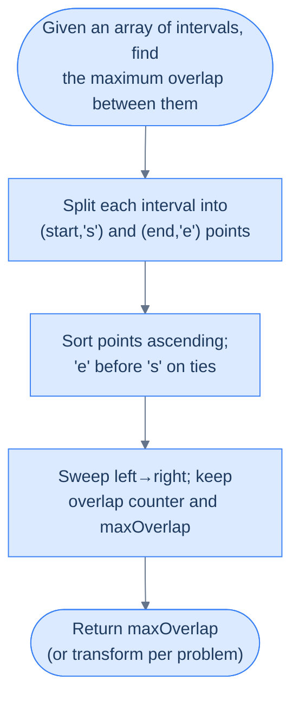
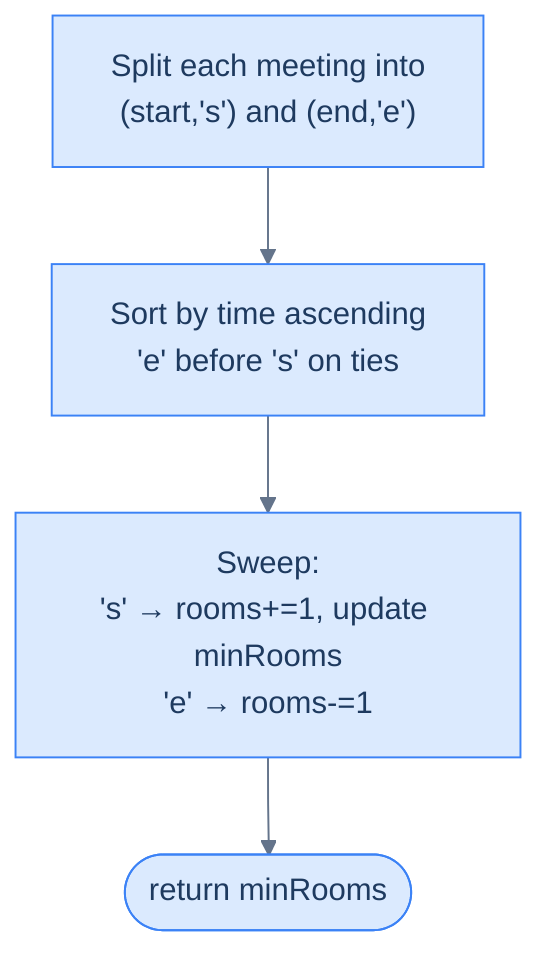
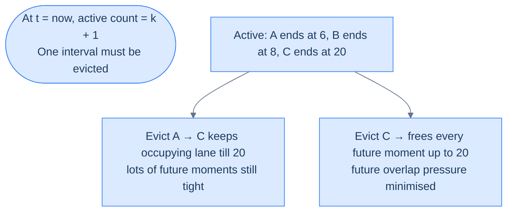
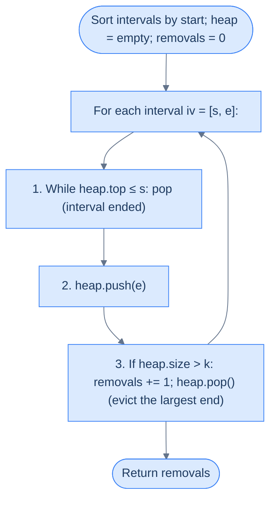
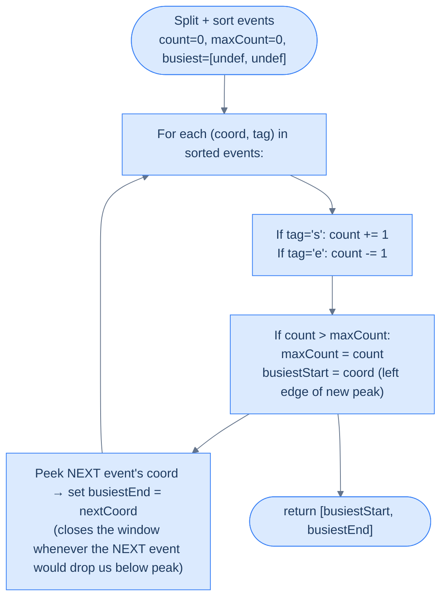
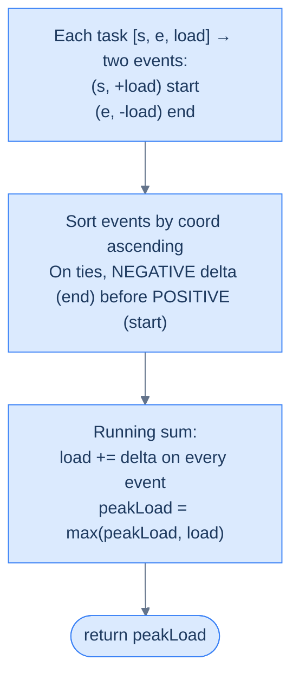

# 10. Pattern: Maximum Overlap

This section takes the line-sweep idea one step further. In the previous chapter you *merged* overlapping intervals; here you'll **count** them. How many events are active at the same time? Which moment is the busiest? How many servers do you need to run every job? These questions sound different — but under the hood, they're the same mechanical sweep with a counter riding on top.

## Table of Contents

1. [Understanding the Line Sweep Technique for Points](#understanding-the-line-sweep-technique-for-points)
2. [Understanding the Maximum Overlap Pattern](#understanding-the-maximum-overlap-pattern)
3. [Identifying the Maximum Overlap Pattern](#identifying-the-maximum-overlap-pattern)
4. [Minimum Meeting Rooms](#minimum-meeting-rooms)
5. [Remove Intervals](#remove-intervals)
6. [Busiest Interval](#busiest-interval)
7. [Peak Resource Requirement](#peak-resource-requirement)

***

# Understanding the Line Sweep Technique for Points

## The Hook

You just learned to sweep a line through **intervals**. But what if the events on your axis aren't continuous stripes — just **dots**? Lightning strikes timestamped to the millisecond. Asteroid collisions on a number line. The exact instants a coffee shop's door opens or closes. The sweep idea still works — and in fact, gets *simpler*. No more "does this overlap?" book-keeping; you just decide what happens **at each dot** and walk left to right.

Once you see the sweep as "an ordered walk over points that fire events", you'll realise almost every interval problem can be rewritten this way. That rewrite is the key to unlocking the **maximum overlap** pattern we're heading toward.

---

## The World — An Axis of Marked Points

Forget stripes for a moment. Picture a single horizontal axis with **points** marked on it — each point labelled with a letter, a number, or a tag telling you *what kind of event it is*.

```d2
axis: "x-axis with an interval marked as two points" {
  grid-columns: 5
  grid-gap: 0
  s: |md
    **s**

    start
  | {style.fill: "#dcfce7"; style.stroke: "#16a34a"}
  g1: "·"
  g2: "·"
  g3: "·"
  e: |md
    **e**

    end
  | {style.fill: "#fde68a"; style.stroke: "#d97706"}
}

lbl: |md
  `interval = [s, e]`

  represented as two independent points (s, 'start') and (e, 'end')
|

axis -> lbl
```

<p align="center"><strong>An interval can always be decomposed into two labelled points on the x-axis: a <code>start</code> and an <code>end</code>. The algorithm processes points, not intervals.</strong></p>

When intervals are the input, we **split them**. Each interval `[s, e]` becomes two entries — `(s, 'start')` and `(e, 'end')` — living in a single flat array of points. The sweep then visits those points in order, and the algorithm reacts to each one based on its tag.

That decomposition is the hinge. After it, the algorithm stops thinking in terms of interval geometry and starts thinking in terms of **events firing along an axis**.

> *Before reading on — why split intervals apart instead of keeping them as pairs? What extra power does the point representation give you?*

Because overlap is a **local** phenomenon. At any instant, overlap is determined by how many intervals are currently "open" — and that count only changes at start points (+1) or end points (−1). Tracking that count is much easier when each change is its own atomic event.

---

## Step 1 — Convert Intervals to Points

Walk the interval array once and emit two point records per interval.

```d2
direction: right

intervals: "arr (intervals)" {
  grid-columns: 3
  grid-gap: 16
  i1: "[1, 4]"
  i2: "[2, 5]"
  i3: "[6, 8]"
}

points: "points (after split)" {
  grid-columns: 6
  grid-gap: 8
  p1: "(1, 's')" {style.fill: "#dcfce7"; style.stroke: "#16a34a"}
  p2: "(4, 'e')" {style.fill: "#fde68a"; style.stroke: "#d97706"}
  p3: "(2, 's')" {style.fill: "#dcfce7"; style.stroke: "#16a34a"}
  p4: "(5, 'e')" {style.fill: "#fde68a"; style.stroke: "#d97706"}
  p5: "(6, 's')" {style.fill: "#dcfce7"; style.stroke: "#16a34a"}
  p6: "(8, 'e')" {style.fill: "#fde68a"; style.stroke: "#d97706"}
}

intervals -> points
```

<p align="center"><strong>Each interval produces two records in the <code>points</code> array: a tagged <code>start</code> and a tagged <code>end</code>. The size grows to <strong>2 × N</strong>.</strong></p>

The split doubles memory cost to `O(N)` — but it gives us a **flat, homogeneous sequence** that can be sorted and swept without any special-casing.

---

## Step 2 — Sort the Points

Sort the combined array in **non-decreasing order of coordinate value**. When two points share a coordinate, most problems break ties by putting **`'end'` before `'start'`** — we'll see why in the next section. For now, notice a beautiful coincidence: in ASCII, `'e' < 's'`, so sorting tuples `(coord, tag)` naturally produces the right order at no extra cost.

```d2
direction: right

before: "Unsorted points" {
  grid-columns: 6
  grid-gap: 8
  u1: "(1, 's')"
  u2: "(4, 'e')"
  u3: "(2, 's')"
  u4: "(5, 'e')"
  u5: "(6, 's')"
  u6: "(8, 'e')"
}

after: "Sorted points (ascending by coordinate; 'e' before 's' on ties)" {
  grid-columns: 6
  grid-gap: 8
  s1: "(1, 's')" {style.fill: "#dcfce7"; style.stroke: "#16a34a"}
  s2: "(2, 's')" {style.fill: "#dcfce7"; style.stroke: "#16a34a"}
  s3: "(4, 'e')" {style.fill: "#fde68a"; style.stroke: "#d97706"}
  s4: "(5, 'e')" {style.fill: "#fde68a"; style.stroke: "#d97706"}
  s5: "(6, 's')" {style.fill: "#dcfce7"; style.stroke: "#16a34a"}
  s6: "(8, 'e')" {style.fill: "#fde68a"; style.stroke: "#d97706"}
}

before -> after
```

<p align="center"><strong>Sorting lines every event up along the x-axis. Iterating the sorted array becomes equivalent to walking the axis left to right.</strong></p>

After this step, the `points` array is just the x-axis laid flat. Each index is a moment in time; each value is "what happens there".

---

## Step 3 — Sweep the Line

Walk the sorted array from left to right. At each point, update a **state variable** that captures the answer-so-far. The sweep line is no longer a real line — it's the **loop counter**. Each iteration is equivalent to having the imaginary line cross one more event on the axis.

```d2
direction: right

axis: "sorted points on the x-axis" {
  grid-columns: 6
  grid-gap: 0
  p1: "(1, 's')" {style.fill: "#dcfce7"; style.stroke: "#16a34a"}
  p2: "(2, 's')" {style.fill: "#dcfce7"; style.stroke: "#16a34a"}
  p3: "(4, 'e')" {style.fill: "#fde68a"; style.stroke: "#d97706"}
  p4: "(5, 'e')" {style.fill: "#fde68a"; style.stroke: "#d97706"}
  p5: "(6, 's')" {style.fill: "#dcfce7"; style.stroke: "#16a34a"}
  p6: "(8, 'e')" {style.fill: "#fde68a"; style.stroke: "#d97706"}
}

sweep: "▲ sweep cursor walks index 0 → end" {style.fill: "#fde68a"; style.stroke: "#d97706"}

state: |md
  **State updates at each point:**

  's' ⇒ something opens

  'e' ⇒ something closes
|

axis -> sweep
sweep -> state
```

<p align="center"><strong>Iterating the sorted array is equivalent to sweeping a vertical line through the points and processing each one in order.</strong></p>

The state machine is where each problem varies. Maximum overlap tracks a counter. Busiest interval tracks both a counter and the current time window. Weighted problems track a running sum. The sweep skeleton is identical — only the *reaction* at each point changes.

---

## Complexity Analysis

| Scenario | Time | Space |
|---|---|---|
| **Best case (input is already points)** | O(N log N) | O(1) extra |
| **Worst case (input is intervals → split)** | O(N log N) | O(N) extra for the `points` array |

Sorting is the dominant cost — O(N log N) — and there is no way around it; the sweep depends on order. The sweep itself is a single O(N) pass with O(1) state updates per step. When the input is already a list of points, you can sort in place; when it's a list of intervals that must be split, you pay an O(N) auxiliary array.

> Now that you can sweep **points**, we're about to give the sweep a job: counting how many intervals are simultaneously active. That counter is the entire maximum-overlap pattern.

***

# Understanding the Maximum Overlap Pattern

## The Hook

Ten conference rooms. Forty-seven meetings scribbled on sticky notes. Your boss asks: "At our busiest, how many rooms were in use at the same time?" The naive engineer pairs up every meeting and checks for overlap — 47 × 47 = 2209 comparisons. The engineer who knows the line sweep answers the question in **one pass** after a sort, with a single integer counter. Their code is seven lines long.

This is the **maximum overlap pattern** — the second most common application of line sweep in the wild, and the workhorse behind "peak concurrent users", "minimum resources", "calendar conflicts", and dozens of systems-design questions you'll be asked in interviews.

---

## The World — A Counter That Rides the Sweep Line

Imagine a tiny integer floating just above the x-axis, labelled `overlap`. As the sweep line walks rightward, the counter listens for two kinds of events:

- **A start point passes under it** → something is opening → `overlap += 1`.
- **An end point passes under it** → something is closing → `overlap -= 1`.

At every instant, `overlap` tells you **exactly how many intervals are active right now**. And because the counter only changes at event points (never between them), you don't need to check every instant — just every point. The maximum value `overlap` ever reaches is the answer we're after.

```d2
direction: right

timeline: "Three intervals on the axis" {
  grid-columns: 3
  grid-gap: 16
  a1: "[1, 4]"
  a2: "[2, 6]"
  a3: "[3, 5]"
}

events: "Sweep processes 6 events left-to-right" {
  grid-columns: 6
  grid-gap: 0
  e1: |md
    `x=1 s`

    overlap=1
  | {style.fill: "#dcfce7"; style.stroke: "#16a34a"}
  e2: |md
    `x=2 s`

    overlap=2
  | {style.fill: "#dcfce7"; style.stroke: "#16a34a"}
  e3: |md
    `x=3 s`

    overlap=3 ★
  | {style.fill: "#fde68a"; style.stroke: "#d97706"}
  e4: |md
    `x=4 e`

    overlap=2
  |
  e5: |md
    `x=5 e`

    overlap=1
  |
  e6: |md
    `x=6 e`

    overlap=0
  |
}

result: |md
  **maxOverlap = 3**

  (attained between x=3 and x=4)
| {style.fill: "#fde68a"; style.stroke: "#d97706"}

timeline -> events
events -> result
```

<p align="center"><strong>The counter <code>overlap</code> rides the sweep line. Its peak value — <strong>3</strong> here — is the maximum number of intervals active at any single instant.</strong></p>

That's the whole idea. Everything else in this lesson is bookkeeping around that single insight.

---

## Setup — Intervals to Labelled Points

Start exactly the same way as the previous section: split every interval into two labelled points.

```d2
direction: right

in_arr: "arr (intervals)" {
  grid-columns: 3
  grid-gap: 16
  i1: "[1, 4]"
  i2: "[2, 6]"
  i3: "[3, 5]"
}

out_arr: "points (split + tagged)" {
  grid-columns: 6
  grid-gap: 8
  p1: "(1,'s')" {style.fill: "#dcfce7"; style.stroke: "#16a34a"}
  p2: "(4,'e')" {style.fill: "#fde68a"; style.stroke: "#d97706"}
  p3: "(2,'s')" {style.fill: "#dcfce7"; style.stroke: "#16a34a"}
  p4: "(6,'e')" {style.fill: "#fde68a"; style.stroke: "#d97706"}
  p5: "(3,'s')" {style.fill: "#dcfce7"; style.stroke: "#16a34a"}
  p6: "(5,'e')" {style.fill: "#fde68a"; style.stroke: "#d97706"}
}

in_arr -> out_arr
```

<p align="center"><strong>Every interval becomes two entries in a flat <code>points</code> array. Nothing else about the input matters — the sweep only sees points.</strong></p>

Now sort `points` ascending. Remember the tiebreaker: when two points share a coordinate, the **end** comes before the **start**. `'e' < 's'` in ASCII, so sorting tuples achieves this for free.

```d2
sorted: "Sorted points (ascending; 'e' before 's' on ties)" {
  grid-columns: 6
  grid-gap: 0
  s1: "(1,'s')" {style.fill: "#dcfce7"; style.stroke: "#16a34a"}
  s2: "(2,'s')" {style.fill: "#dcfce7"; style.stroke: "#16a34a"}
  s3: "(3,'s')" {style.fill: "#dcfce7"; style.stroke: "#16a34a"}
  s4: "(4,'e')" {style.fill: "#fde68a"; style.stroke: "#d97706"}
  s5: "(5,'e')" {style.fill: "#fde68a"; style.stroke: "#d97706"}
  s6: "(6,'e')" {style.fill: "#fde68a"; style.stroke: "#d97706"}
}
```

<p align="center"><strong>Sorted view of the same input. Walking this array from left to right <em>is</em> the sweep.</strong></p>

---

## Why "End Before Start" on Ties?

This is the one place you can get subtly wrong. Consider two intervals `[1, 3]` and `[3, 5]`. Do they overlap?

**Convention:** two intervals overlap iff one is still active *strictly before* the other begins. Touching intervals like these are treated as **non-overlapping** — the first closes **at the exact instant** the second opens. To make the sweep honour that convention, we must process the `end` event at `x = 3` **before** the `start` event at the same coordinate. Otherwise the counter briefly reads `overlap = 2` at `x = 3` and misreports a false overlap.

```d2
direction: right

wrong: "'s' before 'e' on ties (WRONG for touching = non-overlapping)" {
  grid-columns: 4
  grid-gap: 0
  w1: |md
    `x=1 s`

    overlap=1
  |
  w2: |md
    `x=3 s`

    overlap=2 ✗
  | {style.fill: "#fecaca"; style.stroke: "#dc2626"}
  w3: |md
    `x=3 e`

    overlap=1
  |
  w4: |md
    `x=5 e`

    overlap=0
  |
}

right: "'e' before 's' on ties (correct)" {
  grid-columns: 4
  grid-gap: 0
  r1: |md
    `x=1 s`

    overlap=1
  |
  r2: |md
    `x=3 e`

    overlap=0
  | {style.fill: "#dcfce7"; style.stroke: "#16a34a"}
  r3: |md
    `x=3 s`

    overlap=1
  |
  r4: |md
    `x=5 e`

    overlap=0
  |
}

wrong -> right
```

<p align="center"><strong>When two events share a coordinate, processing <code>end</code> first ensures the closing interval has already been accounted for before the new one opens — preserving the "touching = non-overlapping" rule.</strong></p>

**Concrete numbers:** with `'s'` first, at `x = 3` the counter reaches 2 — we'd report one overlap. With `'e'` first, the counter drops to 0 at `x = 3` and then rises back to 1 — correctly reporting zero overlap.

**What breaks if you flip it:** every "back-to-back" scenario (consecutive meetings, adjacent bookings, handoffs) reports phantom overlaps. The bug is silent — no crash, just wrong answers — which is exactly the worst kind of bug. Internalise the rule now and you'll never be bitten.

> **Caveat:** a handful of problems *want* touching to count as overlapping (e.g. continuous-coverage checks). For those, invert the tie-breaker: `start` before `end`. The sweep skeleton is identical; only the comparator changes.

---

## The Algorithm

Once sorted, the sweep is almost embarrassingly small:

> **Step 1.** Build `points = []`. For each interval `[s, e]`, append `(s, 'start')` and `(e, 'end')`.
>
> **Step 2.** Sort `points` ascending. On ties, `end` before `start`.
>
> **Step 3.** Initialize `overlap = 0` and `maxOverlap = 0`.
>
> **Step 4.** For each `point` in `points`:
> - **4.1.** If `point.tag == 'start'` → `overlap += 1`, then `maxOverlap = max(maxOverlap, overlap)`.
> - **4.2.** Else → `overlap -= 1`.
>
> **Step 5.** If the problem requires "at least two intervals for an overlap to exist", return `maxOverlap` if `maxOverlap ≥ 2` else `0`. Otherwise return `maxOverlap` directly.

That's it. Three variables, one loop, one `max`.

---

## The Final-Result Sanity Check

It takes **two** intervals for the word "overlap" to mean anything — a single interval has nothing to overlap with. So if your problem statement asks for the "maximum number of overlapping intervals" in the strict mathematical sense, and the peak counter value is `0` or `1`, the real answer is `0`.

Some problems sidestep this by asking for "the maximum number of simultaneously active intervals" — in which case `1` is a perfectly valid answer (one interval is active during its own span). Read the problem statement carefully and pick one of these two conventions.

Our generic implementation returns `0` when `maxOverlap < 2`. Later problems (like "Minimum Meeting Rooms") want the raw concurrency count and skip that adjustment — we'll call it out when we get there.

---

## Implementation

The generic function below returns the peak concurrent count, collapsing `0` and `1` to `0` under the strict-overlap convention.


```pseudocode
# Sweep line. Each interval emits a 's' (open) and 'e' (close) event.
# Sort tagged points; 'e' < 's' on ties so touching intervals DON'T overlap.
function maximumOverlap(intervals):
    points ← empty list
    for each (s, e) in intervals:
        append (s, 's') to points
        append (e, 'e') to points
    sort points ascending (with 'e' tiebreaking before 's')

    overlap ← 0
    maxOverlap ← 0
    for each (coord, tag) in points:
        if tag = 's':
            overlap ← overlap + 1                     # an interval just opened
            maxOverlap ← max(maxOverlap, overlap)
        else:
            overlap ← overlap − 1                     # an interval just closed
    if maxOverlap > 1: return maxOverlap              # need ≥ 2 intervals for "overlap"
    return 0
```

```python run
from typing import List, Tuple

def maximum_overlap(intervals: List[List[int]]) -> int:
    # Split every interval into two tagged point records
    points: List[Tuple[int, str]] = []
    for s, e in intervals:
        points.append((s, 's'))     # 's' tag marks an opening event
        points.append((e, 'e'))     # 'e' tag marks a closing event

    # Sort ascending. ('e' < 's' in ASCII) ensures end processed before start on ties,
    # which keeps touching intervals [1,3] and [3,5] as NON-overlapping.
    points.sort()

    overlap = 0       # live count of intervals currently active at the sweep cursor
    max_overlap = 0   # best (largest) value of `overlap` seen during the whole sweep

    for coord, tag in points:
        if tag == 's':
            overlap += 1                           # an interval just opened
            max_overlap = max(max_overlap, overlap)   # record the new peak if we beat it
        else:
            overlap -= 1                           # an interval just closed

    # Strict-overlap convention: you need at least 2 intervals for any 'overlap' to exist
    return max_overlap if max_overlap > 1 else 0


print(maximum_overlap([[1, 4], [2, 6], [3, 5]]))      # 3
print(maximum_overlap([[1, 3], [3, 5]]))              # 0  (touching, not overlapping)
print(maximum_overlap([[1, 10], [2, 3], [4, 5]]))     # 2
```

```java run
import java.util.*;

class Solution {
    public int maximumOverlap(int[][] intervals) {
        // Store each point as [coord, tag] where tag is 0 for end, 1 for start
        // so that on ties (same coord), end (0) sorts before start (1) — the
        // convention that keeps touching intervals non-overlapping.
        List<int[]> points = new ArrayList<>();
        for (int[] iv : intervals) {
            points.add(new int[]{iv[0], 1});   // start event
            points.add(new int[]{iv[1], 0});   // end event
        }

        // Sort by coord ascending; break ties by tag ascending (end before start)
        points.sort((a, b) -> a[0] != b[0] ? Integer.compare(a[0], b[0])
                                           : Integer.compare(a[1], b[1]));

        int overlap = 0, maxOverlap = 0;
        for (int[] p : points) {
            if (p[1] == 1) {
                overlap++;                                  // start event opens an interval
                maxOverlap = Math.max(maxOverlap, overlap); // peak update
            } else {
                overlap--;                                  // end event closes an interval
            }
        }

        // Strict-overlap convention: peak < 2 means no two were ever simultaneous
        return maxOverlap > 1 ? maxOverlap : 0;
    }
}
```

```c run
#include <stdio.h>
#include <stdlib.h>

// Comparator: sort by coord ascending; break ties by tag ascending (end=0 before start=1)
int cmp(const void* a, const void* b) {
    int* x = (int*)a;
    int* y = (int*)b;
    if (x[0] != y[0]) return x[0] - y[0];
    return x[1] - y[1];
}

int maximumOverlap(int intervals[][2], int n) {
    // 2*n points: each interval contributes a start and an end event
    int (*points)[2] = malloc(sizeof(int[2]) * 2 * n);
    int k = 0;
    for (int i = 0; i < n; i++) {
        points[k][0] = intervals[i][0]; points[k][1] = 1; k++;   // start
        points[k][0] = intervals[i][1]; points[k][1] = 0; k++;   // end
    }

    qsort(points, 2 * n, sizeof(int[2]), cmp);

    int overlap = 0, maxOverlap = 0;
    for (int i = 0; i < 2 * n; i++) {
        if (points[i][1] == 1) {
            overlap++;
            if (overlap > maxOverlap) maxOverlap = overlap;
        } else {
            overlap--;
        }
    }

    free(points);
    return maxOverlap > 1 ? maxOverlap : 0;   // strict-overlap convention
}
```

```scala run
object Solution {
  def maximumOverlap(intervals: Array[Array[Int]]): Int = {
    // Build tagged points. Tag 0 = end (sorts first), 1 = start (sorts second on ties).
    val points = intervals.flatMap(iv => Seq((iv(0), 1), (iv(1), 0)))

    // Sort by (coord, tag) — tuples compare lexicographically
    val sorted = points.sortBy(p => (p._1, p._2))

    var overlap = 0
    var maxOverlap = 0
    for ((_, tag) <- sorted) {
      if (tag == 1) {
        overlap += 1
        if (overlap > maxOverlap) maxOverlap = overlap
      } else {
        overlap -= 1
      }
    }
    if (maxOverlap > 1) maxOverlap else 0
  }
}
```


<details>
<summary><strong>Trace — intervals = [[1, 4], [2, 6], [3, 5]]</strong></summary>

```
After split + sort: [(1,'s'), (2,'s'), (3,'s'), (4,'e'), (5,'e'), (6,'e')]

Step 1 │ (1,'s') │ overlap = 1 │ maxOverlap = 1
Step 2 │ (2,'s') │ overlap = 2 │ maxOverlap = 2
Step 3 │ (3,'s') │ overlap = 3 │ maxOverlap = 3 ★
Step 4 │ (4,'e') │ overlap = 2 │ maxOverlap = 3
Step 5 │ (5,'e') │ overlap = 1 │ maxOverlap = 3
Step 6 │ (6,'e') │ overlap = 0 │ maxOverlap = 3

Result: 3 ✓   (all three intervals active simultaneously between x=3 and x=4)
```

</details>

<details>
<summary><strong>Trace — intervals = [[1, 3], [3, 5]] (touching case)</strong></summary>

```
After split + sort: [(1,'s'), (3,'e'), (3,'s'), (5,'e')]
                                     ^^^^^^^^^^^ end BEFORE start at x=3

Step 1 │ (1,'s') │ overlap = 1 │ maxOverlap = 1
Step 2 │ (3,'e') │ overlap = 0 │ maxOverlap = 1    ← close the first interval FIRST
Step 3 │ (3,'s') │ overlap = 1 │ maxOverlap = 1    ← then open the second
Step 4 │ (5,'e') │ overlap = 0 │ maxOverlap = 1

Result: 0 ✓   (maxOverlap was 1 → strict-overlap convention collapses to 0)
If we had processed 's' before 'e' at x=3, overlap would have briefly hit 2 — a phantom.
```

</details>

---

## Complexity Analysis

| | Time | Space |
|---|---|---|
| **Any case** | O(N log N) | O(N) extra |

- **Sorting** dominates: `2 × N` points, sorted once → O(N log N).
- **Sweep** is a single pass with O(1) work per point → O(N).
- **Space** is O(N) for the `points` array in every case, because we always split intervals into points before sorting. If the input were already a list of points, space would drop to O(1) (sort in place).

---

> You now have the sweep skeleton for counting overlaps. The next section teaches you to **recognise** when a problem is secretly a maximum-overlap problem — even when the words "overlap" and "interval" never appear in the statement.

***

# Identifying the Maximum Overlap Pattern

## The Hook

Nobody hands you a problem saying "please run a line sweep". The words you'll actually see are things like "minimum resources needed", "peak concurrent users", "most people in the room", "maximum load at any moment", "minimum servers to run all jobs". Each one is a costume. Underneath is the same two-line answer: **the peak of a counter that rides a sweep line**. Your job is to learn the disguises.

This section gives you a one-line **template** you can use to recognise the pattern, then walks a full example — Minimum Meeting Rooms — from problem statement to solution.

---

## The Identification Template

> Given an array of intervals, find the **maximum number of intervals simultaneously active** at any point — and that count (or some trivial transformation of it) is the answer.

If you can rephrase the problem so that step one is "count the peak overlap", you have a candidate. Common transformations of the raw peak count:

- **Equal to the peak** — "minimum rooms needed", "peak concurrent users"
- **Peak minus some threshold** — "how many need to be removed to keep overlap ≤ K"
- **The *time range* during which the peak holds** — "busiest interval"
- **A weighted version** — each event adds a variable amount instead of ±1

If the problem doesn't reduce to "count how many things are active", it's probably an **interval merging** problem (section 9), a **greedy scheduling** problem, or something else entirely. The line between these patterns is thin — recognising the family is half the battle.

---

## The Pattern Template (Visualised)



<p align="center"><strong>Four mechanical steps — split, sort, sweep, return. Every problem in this chapter is a variation on this skeleton.</strong></p>

---

## A Worked Example — Minimum Meeting Rooms

> **Problem statement:** Given an array of meeting times `meetings` where each `meetings[i] = [start_i, end_i]`, find the **minimum number of meeting rooms** required so that every meeting can happen without being interrupted.

```d2
direction: right

meetings: "4 meeting windows" {
  grid-columns: 4
  grid-gap: 16
  m1: "[0, 30]"
  m2: "[5, 10]"
  m3: "[15, 20]"
  m4: "[25, 40]"
}

rooms: "Assign each meeting to a room" {
  grid-rows: 2
  grid-gap: 8
  r1: "Room A: [0,30]" {style.fill: "#dcfce7"; style.stroke: "#16a34a"}
  r2: "Room B: [5,10] → [15,20] → [25,40]" {style.fill: "#dbeafe"; style.stroke: "#3b82f6"}
}

answer: "Answer: 2 rooms" {style.fill: "#fde68a"; style.stroke: "#d97706"}

meetings -> rooms
rooms -> answer
```

<p align="center"><strong>The minimum number of rooms equals the peak number of meetings running at the same instant. Here two meetings overlap at their busiest — so two rooms suffice.</strong></p>

---

### Does It Fit the Template?

- "Given an array of intervals" → ✓ meeting windows.
- "Find the maximum number simultaneously active" → ✓ if three meetings are active at 6:00 you need three rooms; two meetings, two rooms; and so on.
- "Answer is that count (or a trivial transform)" → ✓ the peak concurrency *is* the minimum rooms. No transformation needed.

Clean match. We can reach for the generic sweep and return the raw `maxOverlap` (no "strict overlap ≥ 2" collapse, because a single meeting still needs a room).

---

### The Sweep in Action


<p align="center"><strong>The counter <code>rooms</code> reaches 2 three separate times, but never climbs higher. <code>minRooms</code> = 2 is the answer.</strong></p>

---

### Implementation — Minimum Meeting Rooms (Template Version)

We rename `overlap` to `rooms` and `maxOverlap` to `minRooms` (it reads more naturally), and we **drop** the "collapse 1 → 0" rule: a single meeting legitimately needs one room.


```pseudocode
# Same sweep as maximumOverlap, but here the peak concurrency is the answer (no > 1 guard).
function minimumMeetingRooms(meetings):
    points ← empty list
    for each (s, e) in meetings:
        append (s, 's') to points
        append (e, 'e') to points
    sort points ascending (with 'e' tiebreaking before 's')

    rooms ← 0; minRooms ← 0
    for each (_, tag) in points:
        if tag = 's':
            rooms ← rooms + 1
            minRooms ← max(minRooms, rooms)
        else:
            rooms ← rooms − 1
    return minRooms
```

```python run
from typing import List

def minimum_meeting_rooms(meetings: List[List[int]]) -> int:
    # Split every meeting into a (time, tag) pair. Tag 's' opens; 'e' closes.
    points = []
    for s, e in meetings:
        points.append((s, 's'))
        points.append((e, 'e'))

    # Sort by time ascending; on ties 'e' < 's' puts end first → touching meetings share a room
    points.sort()

    rooms = 0        # meetings running right now
    min_rooms = 0    # peak number of simultaneous meetings seen so far

    for _, tag in points:
        if tag == 's':
            rooms += 1                          # new meeting opens → one more room needed
            min_rooms = max(min_rooms, rooms)   # update peak after every opening
        else:
            rooms -= 1                          # meeting closed → a room freed up
    return min_rooms


print(minimum_meeting_rooms([[0, 30], [5, 10], [15, 20]]))            # 2
print(minimum_meeting_rooms([[7, 10], [2, 4]]))                        # 1 (no overlap)
print(minimum_meeting_rooms([[1, 5], [2, 6], [3, 7], [4, 8]]))         # 4 (all overlap)
```

```java run
import java.util.*;

class Solution {
    public int minimumMeetingRooms(int[][] meetings) {
        // Tag 0 = end (sorts first on ties), 1 = start
        List<int[]> points = new ArrayList<>();
        for (int[] m : meetings) {
            points.add(new int[]{m[0], 1});
            points.add(new int[]{m[1], 0});
        }
        points.sort((a, b) -> a[0] != b[0] ? Integer.compare(a[0], b[0])
                                           : Integer.compare(a[1], b[1]));

        int rooms = 0, minRooms = 0;
        for (int[] p : points) {
            if (p[1] == 1) {
                rooms++;
                minRooms = Math.max(minRooms, rooms);
            } else {
                rooms--;
            }
        }
        return minRooms;
    }
}
```

```c run
#include <stdlib.h>

int cmp(const void* a, const void* b) {
    int* x = (int*)a; int* y = (int*)b;
    if (x[0] != y[0]) return x[0] - y[0];
    return x[1] - y[1];   // end (0) before start (1) on ties
}

int minimumMeetingRooms(int meetings[][2], int n) {
    int (*points)[2] = malloc(sizeof(int[2]) * 2 * n);
    int k = 0;
    for (int i = 0; i < n; i++) {
        points[k][0] = meetings[i][0]; points[k][1] = 1; k++;
        points[k][0] = meetings[i][1]; points[k][1] = 0; k++;
    }
    qsort(points, 2 * n, sizeof(int[2]), cmp);

    int rooms = 0, minRooms = 0;
    for (int i = 0; i < 2 * n; i++) {
        if (points[i][1] == 1) {
            rooms++;
            if (rooms > minRooms) minRooms = rooms;
        } else rooms--;
    }
    free(points);
    return minRooms;
}
```

```scala run
object Solution {
  def minimumMeetingRooms(meetings: Array[Array[Int]]): Int = {
    val points = meetings.flatMap(m => Seq((m(0), 1), (m(1), 0)))
      .sortBy(p => (p._1, p._2))   // end (tag 0) sorts before start (tag 1) on ties

    var rooms = 0
    var minRooms = 0
    for ((_, tag) <- points) {
      if (tag == 1) {
        rooms += 1
        if (rooms > minRooms) minRooms = rooms
      } else rooms -= 1
    }
    minRooms
  }
}
```


---

## Example Problems

A short list of problems that fall under this pattern — we'll tackle each below:

> - **Minimum Meeting Rooms** — peak concurrent meetings
> - **Remove Intervals** — fewest removals to cap max overlap at K
> - **Busiest Interval** — the time window during which overlap peaks
> - **Peak Resource Requirement** — weighted variant where each interval has a load

> Four problems, four variants of the same sweep. Pattern-hunting is everything — once you see the counter riding the line, you can't unsee it.

***

# Minimum Meeting Rooms

## The Problem

> Given an array `meetings` where `meetings[i] = [start_i, end_i]` represents a meeting's start and end time, return the **minimum number of meeting rooms** required to host every meeting without any being interrupted.

```
Input:  meetings = [[0, 30], [5, 10], [15, 20]]
Output: 2
Explanation: [0,30] overlaps both [5,10] and [15,20], but [5,10] and [15,20] don't overlap each other.
             So one room can host [5,10] then [15,20], and another room hosts [0,30].

Input:  meetings = [[7, 10], [2, 4]]
Output: 1
Explanation: No overlap — a single room can host both back-to-back.

Input:  meetings = [[1, 5], [2, 6], [3, 7], [4, 8]]
Output: 4
Explanation: All four meetings overlap around time 4 → each needs its own room.

Input:  meetings = []
Output: 0
Explanation: No meetings means no rooms needed.
```

---

## What Does "Minimum Rooms" Mean?

The minimum number of rooms is exactly the maximum number of meetings running at any single instant. Not "most meetings in a day" (that could be hundreds spread over time) — the **peak concurrency**. Think of rooms as a pool: a room is in use while its meeting runs and is returned the moment the meeting ends. The question is: during the busiest instant of the day, how deep does the pool have to be?

```d2
direction: right

day: "Day with 4 meetings" {
  grid-columns: 4
  grid-gap: 16
  a: "[1,5]" {style.fill: "#fde68a"; style.stroke: "#d97706"}
  b: "[2,6]" {style.fill: "#fde68a"; style.stroke: "#d97706"}
  c: "[3,7]" {style.fill: "#fde68a"; style.stroke: "#d97706"}
  d: "[9,10]"
}

peak: |md
  At t=3 through t=5, meetings A, B, C all active → 3 rooms

  D is alone later → reuses room, doesn't increase peak
|

ans: "minRooms = 3" {style.fill: "#fde68a"; style.stroke: "#d97706"}

day -> peak
peak -> ans
```

<p align="center"><strong>Only the <em>simultaneous</em> meetings matter. A room freed up can be handed to the next meeting — the peak concurrency is the bottleneck.</strong></p>

---

## Applying the Diagnostic Questions

| Question | Answer |
|---|---|
| **Q1.** Can we rephrase the problem as "find the maximum overlap"? | **Yes** — minimum rooms = peak concurrency |
| **Q2.** Are touching meetings (e.g. `[1, 5]` and `[5, 10]`) treated as non-overlapping? | **Yes** — back-to-back meetings can share a room |
| **Q3.** Does a single meeting count, or must there be ≥ 2 for the answer to be non-zero? | **Counts** — a single meeting still needs a room |
| **Q4.** Which variant of the sweep applies? | **Plain `±1` counter** — no weights, no time ranges |

### Q1 — Why "maximum overlap"?

**Mental model:** imagine rooms as a stack of keys. You hand out a key each time a meeting starts and get one back each time a meeting ends. The tallest the handed-out pile ever grows is the number of keys you must have originally had.

**Concrete numbers:** for `[[0,30],[5,10],[15,20]]` the pile grows to 2 at `t=5` (both `[0,30]` and `[5,10]` are holding keys), drops to 1 at `t=10`, grows back to 2 at `t=15`, drops to 1 at `t=20`, and drops to 0 at `t=30`. Tallest value: 2 — the answer.

**What breaks otherwise:** if you answered with "total number of meetings" (3) you'd over-provision. If you answered with "number of overlapping pairs" (2 — `[0,30]` overlaps each of the others, but not at the same time) you'd *under*-provision: you'd still need 2 rooms. The right quantity is concurrency at the busiest instant.

### Q2 — Why "touching is non-overlapping"?

**Mental model:** a room is released the *instant* the previous meeting ends. The next meeting's start-bell rings immediately after, in the same room.

**Concrete numbers:** for `[[1, 5], [5, 10]]`, at `x = 5` the first meeting just finished. If we process the end event first, `rooms` drops to 0, then the new start raises it back to 1 — peak is 1, answer is 1 room.

**What breaks otherwise:** processing the start event first would temporarily push `rooms` to 2 at `x = 5`, demanding a second room for a microsecond gap that doesn't actually exist. You'd systematically over-provision every back-to-back schedule — silently wasteful. The `'e' < 's'` tie-breaker is the whole reason touching meetings work correctly.

### Q3 — Why "single meeting counts"?

**Mental model:** a single meeting is still an active reservation — you need *some* room for it.

**Concrete numbers:** for `[[9, 10]]` the sweep sees `rooms = 1` at `x = 9` and 0 at `x = 10`. `minRooms = 1`. We return 1.

**What breaks otherwise:** if we applied the generic "maxOverlap < 2 → 0" collapse from the previous section, we'd tell the manager "you need 0 rooms for 1 meeting" — absurd. That collapse rule applies only to problems asking "are two or more things *overlapping*?" (a strict-mathematical overlap), not "are any things *active*?". Minimum Meeting Rooms wants the latter.

### Q4 — Why "plain `±1` counter"?

**Mental model:** every meeting is identical in resource footprint — one room, no more, no less. All opens add 1; all closes subtract 1.

**Concrete numbers:** no weights anywhere. `rooms` only moves by ±1.

**What breaks otherwise:** if some meetings required *two* rooms (say a split boardroom), you'd need the weighted variant we'll see in Peak Resource Requirement. Here, every increment is uniform — so the plain counter suffices.

---

## The Sweep Strategy (Visualised)



<p align="center"><strong>Four steps — split, sort, sweep, return. Textbook maximum-overlap application.</strong></p>

---

## The Solution


```pseudocode
# Same algorithm, with explicit empty-input guard and "update peak only on opens" optimisation.
function minimumMeetingRooms(meetings):
    if meetings is empty: return 0
    points ← empty list
    for each (s, e) in meetings:
        append (s, 's') to points
        append (e, 'e') to points
    sort points ascending (with 'e' tiebreaking before 's')

    rooms ← 0; minRooms ← 0
    for each (_, tag) in points:
        if tag = 's':
            rooms ← rooms + 1
            if rooms > minRooms:                      # closes can only decrease — don't bother
                minRooms ← rooms
        else:
            rooms ← rooms − 1
    return minRooms
```

```python run
from typing import List

def minimum_meeting_rooms(meetings: List[List[int]]) -> int:
    if not meetings:
        return 0

    # Split each meeting into two tagged points
    points = []
    for s, e in meetings:
        points.append((s, 's'))
        points.append((e, 'e'))

    # Sort: primary key time ascending; secondary 'e' < 's' keeps touching meetings non-overlapping
    points.sort()

    rooms = 0        # concurrent meetings right now
    min_rooms = 0    # peak concurrency — this is the answer

    for _, tag in points:
        if tag == 's':
            rooms += 1
            if rooms > min_rooms:        # update peak only on opens (closes can only decrease it)
                min_rooms = rooms
        else:
            rooms -= 1                   # a room just freed up
    return min_rooms


print(minimum_meeting_rooms([[0, 30], [5, 10], [15, 20]]))            # 2
print(minimum_meeting_rooms([[7, 10], [2, 4]]))                        # 1
print(minimum_meeting_rooms([[1, 5], [2, 6], [3, 7], [4, 8]]))         # 4
print(minimum_meeting_rooms([]))                                        # 0
```

```java run
import java.util.*;

class Solution {
    public int minimumMeetingRooms(int[][] meetings) {
        if (meetings.length == 0) return 0;

        List<int[]> points = new ArrayList<>();
        for (int[] m : meetings) {
            points.add(new int[]{m[0], 1});   // start event (tag = 1)
            points.add(new int[]{m[1], 0});   // end event   (tag = 0)
        }
        // tag 0 sorts before tag 1 on ties → end before start, touching = non-overlapping
        points.sort((a, b) -> a[0] != b[0] ? Integer.compare(a[0], b[0])
                                           : Integer.compare(a[1], b[1]));

        int rooms = 0, minRooms = 0;
        for (int[] p : points) {
            if (p[1] == 1) {
                rooms++;
                if (rooms > minRooms) minRooms = rooms;
            } else {
                rooms--;
            }
        }
        return minRooms;
    }
}
```

```c run
#include <stdlib.h>

int cmp(const void* a, const void* b) {
    int* x = (int*)a; int* y = (int*)b;
    if (x[0] != y[0]) return x[0] - y[0];
    return x[1] - y[1];
}

int minimumMeetingRooms(int meetings[][2], int n) {
    if (n == 0) return 0;
    int (*points)[2] = malloc(sizeof(int[2]) * 2 * n);
    int k = 0;
    for (int i = 0; i < n; i++) {
        points[k][0] = meetings[i][0]; points[k][1] = 1; k++;
        points[k][0] = meetings[i][1]; points[k][1] = 0; k++;
    }
    qsort(points, 2 * n, sizeof(int[2]), cmp);

    int rooms = 0, minRooms = 0;
    for (int i = 0; i < 2 * n; i++) {
        if (points[i][1] == 1) {
            rooms++;
            if (rooms > minRooms) minRooms = rooms;
        } else rooms--;
    }
    free(points);
    return minRooms;
}
```

```scala run
object Solution {
  def minimumMeetingRooms(meetings: Array[Array[Int]]): Int = {
    if (meetings.isEmpty) return 0
    val points = meetings.flatMap(m => Seq((m(0), 1), (m(1), 0)))
                         .sortBy(p => (p._1, p._2))   // end before start on ties

    var rooms = 0; var minRooms = 0
    for ((_, tag) <- points) {
      if (tag == 1) { rooms += 1; if (rooms > minRooms) minRooms = rooms }
      else          { rooms -= 1 }
    }
    minRooms
  }
}
```


<details>
<summary><strong>Trace — meetings = [[0, 30], [5, 10], [15, 20]]</strong></summary>

```
Split + sort: [(0,'s'), (5,'s'), (10,'e'), (15,'s'), (20,'e'), (30,'e')]

Step 1 │ (0,'s')  │ rooms 0 → 1 │ minRooms = 1
Step 2 │ (5,'s')  │ rooms 1 → 2 │ minRooms = 2 ★
Step 3 │ (10,'e') │ rooms 2 → 1 │ minRooms = 2
Step 4 │ (15,'s') │ rooms 1 → 2 │ minRooms = 2
Step 5 │ (20,'e') │ rooms 2 → 1 │ minRooms = 2
Step 6 │ (30,'e') │ rooms 1 → 0 │ minRooms = 2

Result: 2 ✓   Peak was reached twice — once at t=5 and again at t=15.
```

</details>

<details>
<summary><strong>Trace — meetings = [[1, 5], [5, 10]] (touching case)</strong></summary>

```
Split + sort: [(1,'s'), (5,'e'), (5,'s'), (10,'e')]
                       ^^^^^^^^^^^^^^^^^  end BEFORE start at t=5

Step 1 │ (1,'s')  │ rooms 0 → 1 │ minRooms = 1
Step 2 │ (5,'e')  │ rooms 1 → 0 │ minRooms = 1   ← first meeting freed its room
Step 3 │ (5,'s')  │ rooms 0 → 1 │ minRooms = 1   ← second meeting takes the same room
Step 4 │ (10,'e') │ rooms 1 → 0 │ minRooms = 1

Result: 1 ✓   Back-to-back meetings share a single room — exactly what we want.
```

</details>

---

## Complexity Analysis

| | Complexity | Reasoning |
|---|---|---|
| **Time** | O(N log N) | Sorting 2N tagged points dominates; sweep is O(N) |
| **Space** | O(N) | The `points` array has 2N entries |

---

## Edge Cases

| Case | Example | Expected | Reasoning |
|---|---|---|---|
| Empty schedule | `[]` | 0 | No meetings, no rooms |
| Single meeting | `[[9, 10]]` | 1 | Even one meeting needs a room — we DON'T collapse 1 → 0 here |
| Back-to-back | `[[1, 5], [5, 10]]` | 1 | `'e'` processed before `'s'` at time 5 → same room reused |
| All identical | `[[1, 5], [1, 5], [1, 5]]` | 3 | Three meetings run at the same time → three rooms |
| Fully contained | `[[1, 100], [2, 3]]` | 2 | Small meeting overlaps the big one → two rooms |
| Sparse and large | `[[1, 2], [1000000, 1000001]]` | 1 | Huge gap doesn't matter — coordinates are just keys |

---

## Final Takeaway

Minimum Meeting Rooms is the **canonical** maximum-overlap problem — so canonical that it's the example used to teach the pattern. Once you see through the words "rooms", "servers", "lanes", "bandwidth slots", the solution is always the same three-variable sweep. Memorise the skeleton: split, sort, sweep, max. If the question asks "how many of *something* do I need in parallel?", start with this.

> **Transfer Challenge:** Change the problem. Instead of "minimum rooms", return a **list of original meeting indices** assigned to each room, under the constraint that we use exactly `minRooms` rooms. How would you modify the sweep to track room assignments?
>
> <details><summary><strong>Solution hint</strong></summary>
>
> Keep a min-heap of `(end_time, room_id)` pairs indexed by room. When a meeting starts, pop the earliest-ending room if its end is ≤ start (reuse); otherwise create a new room. Record the assignment. Complexity stays O(N log N) — now dominated by the heap instead of the sort.
>
> </details>

***

# Remove Intervals

## The Problem

> You are given an array of intervals `intervals` where `intervals[i] = [start_i, end_i]`, and a positive integer `k`. Return the **minimum number of intervals to remove** so that at any single instant, the number of remaining intervals active at that instant is at most `k`.

```
Input:  intervals = [[1, 4], [2, 5], [3, 6], [7, 9]], k = 2
Output: 1
Explanation: At t=3 and t=4 all of [1,4], [2,5], [3,6] are active (overlap = 3).
             Remove any one of them — say [3,6] — and the peak drops to 2.

Input:  intervals = [[1, 2], [3, 4], [5, 6]], k = 1
Output: 0
Explanation: No two intervals overlap → peak is already 1 ≤ k.

Input:  intervals = [[1, 10], [2, 10], [3, 10], [4, 10]], k = 2
Output: 2
Explanation: All four active at t=4 → peak 4. Remove two to bring peak down to 2.
```

---

## What Does "Cap the Overlap at K" Mean?

Think of `k` as a **capacity** — the number of lanes on a highway, parallel servers, concurrent calls a receptionist can handle. Whenever more than `k` intervals are active simultaneously, the excess must go — someone gets turned away. The question: what is the smallest number of intervals we can drop so the peak concurrency never exceeds `k`?

```d2
direction: right

before: "Before: peak overlap = 3" {
  grid-columns: 4
  grid-gap: 16
  b1: "[1,4]" {style.fill: "#fde68a"; style.stroke: "#d97706"}
  b2: "[2,5]" {style.fill: "#fde68a"; style.stroke: "#d97706"}
  b3: "[3,6]" {style.fill: "#fecaca"; style.stroke: "#dc2626"}
  b4: "[7,9]"
}

cap: |md
  **Capacity** k = 2

  At `t∈[3,4]` three are active — excess of 1
|

after: "After removing [3,6]: peak = 2" {
  grid-columns: 3
  grid-gap: 16
  a1: "[1,4]" {style.fill: "#dcfce7"; style.stroke: "#16a34a"}
  a2: "[2,5]" {style.fill: "#dcfce7"; style.stroke: "#16a34a"}
  a3: "[7,9]" {style.fill: "#dcfce7"; style.stroke: "#16a34a"}
}

before -> cap
cap -> after
```

<p align="center"><strong>Whenever the live count exceeds <code>k</code>, we must evict interval(s) until the count is back within capacity. The question is which ones to evict — and how few.</strong></p>

---

## The Greedy Insight — When You Must Evict, Evict the One Ending Last

Suppose at some instant the live count hits `k + 1`. Someone has to go. Who?

**Greedy answer:** whichever of the currently-active intervals has the **largest end time**. Evicting the longest-running one is the most "helpful" removal because every moment that interval would have occupied the lane is now freed up — including moments still to come. Evicting a short, about-to-end interval would free only a tiny sliver of future lane-time, leaving us likely to exceed `k` again soon.



<p align="center"><strong>Evicting the longest-running active interval frees the most future lane-time. It is provably optimal.</strong></p>

Why is this provably optimal? Because every removal saves exactly the **amount of future time** the evicted interval would have occupied. The interval with the largest end time occupies the most future time. In any optimal solution, we can *swap* a shorter eviction for the longest-end one and still be valid — the longer one's extra future-coverage can only *help* stay under capacity later.

---

## Applying the Diagnostic Questions

| Question | Answer |
|---|---|
| **Q1.** Is this a maximum-overlap problem? | **Yes** — the peak overlap is what we're taming |
| **Q2.** Do we need to identify *which* intervals to remove, or just count? | **Just count**, but we need a way to pick the best victim at each conflict |
| **Q3.** Is a plain counter enough, or do we need the identities of active intervals? | **Identities** — we need to know end times to pick the victim |
| **Q4.** What data structure supports "get the one with max end in O(log N)"? | **Max-heap keyed on end time** |

### Q1 — Why "maximum overlap"?

**Mental model:** walk the timeline; whenever overlap goes above `k`, drop intervals until it's back at `k`. The number of drops is the answer.

**Concrete numbers:** for `[[1,4],[2,5],[3,6]]` with `k=2`, at `t=3` the active count is 3 > 2. One eviction → live count drops to 2. No further violations → total evictions = 1.

**What breaks otherwise:** if you try to "remove intervals that overlap with others" (a simpler greedy), you'd over-remove. Two intervals can overlap each other yet still fit under `k=2` — removing either is wasted. The peak-overlap framing is the only one that correctly targets just-the-excess.

### Q2 — Why "just count"?

**Mental model:** the problem asks for the minimum *number* of removals, not the identities. But the sweep still has to *pick* good victims to guarantee the minimum — otherwise a bad choice could cascade into more violations later.

**Concrete numbers:** even if the final answer is just `1`, our simulated sweep has to commit to *which* interval it removed to continue correctly. If it "removed" the wrong one (a short one), the next conflict might force a second removal that a better choice would have avoided.

**What breaks otherwise:** returning the count without actually picking victims correctly yields a wrong answer on non-trivial inputs. The counter alone isn't enough.

### Q3 — Why "identities of active intervals"?

**Mental model:** at each start event, we *add* the interval to a running "active set". At each end event, we *remove* it (the one whose end we just hit). When we need to evict, we pick the active member with the largest end.

**Concrete numbers:** at `t=3` in example 1, the active set is `{[1,4], [2,5], [3,6]}` with ends `{4, 5, 6}`. The max is `6` → evict `[3,6]`.

**What breaks otherwise:** a plain counter loses the identities. We'd know overlap hit 3 but have no principled way to pick who to drop. Any arbitrary choice risks sub-optimality.

### Q4 — Why "max-heap on end time"?

**Mental model:** a heap lets us peek and pop the largest end in O(log N). Starts push into it; ends implicitly pop it (but only if the end event corresponds to something still in the heap — we track evictions with a "skip list" or mark-based approach).

**Concrete numbers:** with N intervals, we do at most 2N heap operations × O(log N) = O(N log N) total — same asymptotic as the sort.

**What breaks otherwise:** without a heap, finding the max-end active interval is O(N) per conflict → O(N²) overall. Fine for `N = 1000`, blown up for `N = 10⁶`.

---

## The Greedy Sweep (Visualised)

We modify the event-based sweep slightly. We walk through *intervals* sorted by start, and maintain a **max-heap of end times** of intervals currently kept. At each interval start:

1. First, **pop** any ended intervals (ends ≤ current start) from the heap — they're no longer active.
2. **Push** the new interval's end.
3. If heap size now exceeds `k`, pop the max-end entry (that's the eviction) and increment `removals`.



<p align="center"><strong>Sweep intervals left to right; keep a max-heap of active end times; evict the longest-ending interval whenever capacity is exceeded.</strong></p>

A subtle but important point: **the evicted interval is "erased from history"** — we pretend it was never kept. So "heap size" at any moment equals the number of surviving intervals currently active. That's why it's safe to compare heap size directly to `k`.

---

## The Solution

The implementation below uses a **max-heap** (via negation in languages without one built in). Crucially, the "expire ended intervals" step uses the current interval's start as the threshold and uses **strict `<=`** to drop touching-ended intervals — keeping the non-overlap convention.


```pseudocode
# Remove the fewest intervals so concurrency stays ≤ k. Sweep + max-heap of currently-kept end-times.
function removeIntervals(intervals, k):
    if intervals is empty:
        return 0
    if k ≤ 0:
        return length(intervals)                      # nothing allowed → remove all

    sort intervals by start ascending
    heap ← empty max-heap of end-times
    removals ← 0

    for each (s, e) in intervals:
        # Expire intervals that ended at or before s.
        while heap is not empty AND heap.top ≤ s:
            heap.pop
        heap.push(e)                                  # tentatively keep the new interval
        if size(heap) > k:                            # over capacity — evict the latest-ending one
            heap.pop                                  # max-heap top = largest end → best victim
            removals ← removals + 1
    return removals
```

```python run
from typing import List
import heapq

def remove_intervals(intervals: List[List[int]], k: int) -> int:
    if not intervals or k <= 0:
        # k <= 0 means no interval is allowed → remove all of them
        return len(intervals) if k <= 0 else 0

    # Sort by start ascending — processing order matches the sweep direction
    intervals.sort(key=lambda x: x[0])

    # Max-heap of end times of currently-kept active intervals.
    # Python's heapq is min-heap; negate to simulate max-heap.
    heap: List[int] = []

    removals = 0

    for s, e in intervals:
        # Expire any intervals that ended at or before this start.
        # '<=' because touching intervals are non-overlapping in our convention.
        while heap and -heap[0] <= s:
            heapq.heappop(heap)

        # Tentatively keep the new interval
        heapq.heappush(heap, -e)

        # If we now exceed capacity, evict the interval with the largest end time
        if len(heap) > k:
            heapq.heappop(heap)   # top of max-heap = largest end → best victim
            removals += 1

    return removals


print(remove_intervals([[1, 4], [2, 5], [3, 6], [7, 9]], 2))      # 1
print(remove_intervals([[1, 2], [3, 4], [5, 6]], 1))               # 0
print(remove_intervals([[1, 10], [2, 10], [3, 10], [4, 10]], 2))   # 2
```

```java run
import java.util.*;

class Solution {
    public int removeIntervals(int[][] intervals, int k) {
        if (intervals.length == 0) return 0;
        if (k <= 0) return intervals.length;   // no capacity → drop everything

        // Sort by start ascending
        Arrays.sort(intervals, (a, b) -> Integer.compare(a[0], b[0]));

        // Max-heap of end times — Java's PriorityQueue is min-heap by default, reverse it
        PriorityQueue<Integer> heap = new PriorityQueue<>(Collections.reverseOrder());

        int removals = 0;

        for (int[] iv : intervals) {
            int s = iv[0], e = iv[1];

            // Drain expired intervals — touching counts as non-overlapping
            while (!heap.isEmpty() && heap.peek() <= s) {
                // peek() is the LARGEST end — if the largest end is already ≤ s,
                // every active interval has ended (since all others have smaller ends too)
                heap.poll();
            }

            heap.offer(e);

            if (heap.size() > k) {
                heap.poll();   // evict the largest end
                removals++;
            }
        }
        return removals;
    }
}
```

```c run
#include <stdio.h>
#include <stdlib.h>

// --- simple max-heap on int ---
static int heap[100005];
static int hsize = 0;

static void hpush(int v) {
    int i = hsize++;
    heap[i] = v;
    while (i > 0 && heap[(i - 1) / 2] < heap[i]) {
        int t = heap[i]; heap[i] = heap[(i - 1) / 2]; heap[(i - 1) / 2] = t;
        i = (i - 1) / 2;
    }
}
static int hpop(void) {
    int top = heap[0];
    heap[0] = heap[--hsize];
    int i = 0;
    while (1) {
        int l = 2 * i + 1, r = 2 * i + 2, best = i;
        if (l < hsize && heap[l] > heap[best]) best = l;
        if (r < hsize && heap[r] > heap[best]) best = r;
        if (best == i) break;
        int t = heap[i]; heap[i] = heap[best]; heap[best] = t;
        i = best;
    }
    return top;
}
static int hpeek(void) { return heap[0]; }

static int cmp(const void* a, const void* b) {
    return (*(int**)a)[0] - (*(int**)b)[0];
}

int removeIntervals(int** intervals, int n, int k) {
    if (n == 0) return 0;
    if (k <= 0) return n;

    qsort(intervals, n, sizeof(int*), cmp);
    hsize = 0;

    int removals = 0;
    for (int i = 0; i < n; i++) {
        int s = intervals[i][0], e = intervals[i][1];
        // Expire any ended intervals
        while (hsize > 0 && hpeek() <= s) hpop();
        hpush(e);
        if (hsize > k) { hpop(); removals++; }   // evict largest end
    }
    return removals;
}
```

```scala run
import scala.collection.mutable

object Solution {
  def removeIntervals(intervals: Array[Array[Int]], k: Int): Int = {
    if (intervals.isEmpty) return 0
    if (k <= 0) return intervals.length

    val sorted = intervals.sortBy(_(0))
    // Max-heap via reverse ordering
    val heap = mutable.PriorityQueue.empty[Int](Ordering.Int)

    var removals = 0
    for (iv <- sorted) {
      val (s, e) = (iv(0), iv(1))
      while (heap.nonEmpty && heap.head <= s) heap.dequeue()   // expire ended
      heap.enqueue(e)
      if (heap.size > k) {
        heap.dequeue()   // evict interval with largest end
        removals += 1
      }
    }
    removals
  }
}
```


<details>
<summary><strong>Trace — intervals = [[1, 4], [2, 5], [3, 6], [7, 9]], k = 2</strong></summary>

```
Sorted by start: [[1,4], [2,5], [3,6], [7,9]]
heap = [] (max-heap of active end times)

Step 1 │ iv=[1,4] │ expire: heap empty          │ push 4  heap=[4]        size 1 ≤ 2
Step 2 │ iv=[2,5] │ expire: top 4 > 2 → stop    │ push 5  heap=[5,4]      size 2 ≤ 2
Step 3 │ iv=[3,6] │ expire: top 5 > 3 → stop    │ push 6  heap=[6,4,5]    size 3 > 2
                     EVICT top=6 (largest end)  │          heap=[5,4]     removals = 1
Step 4 │ iv=[7,9] │ expire: top 5 ≤ 7 → pop     │          heap=[4]
                     expire: top 4 ≤ 7 → pop    │          heap=[]
                                                │ push 9   heap=[9]        size 1 ≤ 2

Result: removals = 1 ✓

[3,6] was removed because, of the three overlapping intervals at t=3,
it had the largest end time (6 > 5 > 4). Greedy optimal.
```

</details>

<details>
<summary><strong>Trace — intervals = [[1, 10], [2, 10], [3, 10], [4, 10]], k = 2</strong></summary>

```
Sorted by start: [[1,10], [2,10], [3,10], [4,10]]
heap = []

Step 1 │ iv=[1,10] │ push 10 → heap=[10]           size 1 ≤ 2
Step 2 │ iv=[2,10] │ push 10 → heap=[10,10]        size 2 ≤ 2
Step 3 │ iv=[3,10] │ push 10 → heap=[10,10,10]     size 3 > 2
                     EVICT → heap=[10,10]          removals = 1
Step 4 │ iv=[4,10] │ push 10 → heap=[10,10,10]     size 3 > 2
                     EVICT → heap=[10,10]          removals = 2

Result: 2 ✓   Four identical intervals → must drop two to fit capacity k=2.
```

</details>

---

## Complexity Analysis

| | Complexity | Reasoning |
|---|---|---|
| **Time** | O(N log N) | Sort is O(N log N); each interval pushes and possibly pops O(log N) |
| **Space** | O(N) | Heap holds up to N end times |

---

## Edge Cases

| Case | Example | Expected | Reasoning |
|---|---|---|---|
| Empty input | `[]`, `k = 3` | 0 | Nothing to remove |
| Zero capacity | `[[1,2]]`, `k = 0` | 1 | No intervals allowed → remove everything |
| Already within capacity | `[[1,2],[3,4]]`, `k = 1` | 0 | Peak is 1 → no conflicts |
| All identical | `[[1,5]×5]`, `k = 2` | 3 | 5 active at once, evict 3 |
| Touching intervals | `[[1,5],[5,10]]`, `k = 1` | 0 | `5` ends before `5` starts (strict `<=`); no conflict |
| Nested intervals | `[[1,20],[2,3],[4,5]]`, `k = 1` | 2 | Outer overlaps each inner one; evict outer + one inner |
| Capacity ≥ N | `[[1,2],[1,2],[1,2]]`, `k = 10` | 0 | Plenty of capacity |

---

## Final Takeaway

Remove Intervals extends the maximum-overlap sweep from **passive counting** to **active decision-making**. You're not just watching the counter tick — you're keeping the counter *bounded* by making a greedy choice every time it would exceed the cap. The "always evict the longest-ending" rule is a textbook exchange argument: swap any other choice for this one and you never get worse. Memorise the trio: **sort by start, max-heap on ends, evict when size > k**. When a problem asks "how few removals to keep concurrency ≤ k?", this is the answer.

> **Transfer Challenge:** Modify the function to return the **list of original indices** of the removed intervals, not just the count. Order doesn't matter.
>
> <details><summary><strong>Solution hint</strong></summary>
>
> Push `(end_time, original_index)` tuples into the heap instead of raw end times. When you evict the top, add its index to a `removed` list. Return that list.
>
> </details>

***

# Busiest Interval

## The Problem

> Given an array of intervals `intervals` where `intervals[i] = [start_i, end_i]`, return the **contiguous time interval `[a, b]`** during which the **maximum number of intervals are simultaneously active**. If multiple such windows tie, return the one starting earliest.

```
Input:  intervals = [[1, 4], [2, 6], [3, 5]]
Output: [3, 4]
Explanation: At any instant in [3,4) all three intervals are active — peak = 3.
             Before t=3 only two are active; after t=4 only two remain.

Input:  intervals = [[1, 10], [2, 3], [5, 7]]
Output: [2, 3]
Explanation: Peak = 2 achieved during [2,3) and again during [5,7). Earliest window wins.

Input:  intervals = [[1, 2], [3, 4]]
Output: [1, 2]
Explanation: Peak = 1 (no actual overlap). Earliest active window is [1,2).
```

---

## What Does "Busiest Interval" Mean?

Not a single *instant* — a continuous **time range** during which concurrency stays at its peak. Between events, concurrency is constant (nothing changes until the next start or end). So the busiest interval is always bounded by **two consecutive event coordinates**: it begins at the moment concurrency hits its peak and ends at the next event that changes the count.

```d2
direction: right

timeline: "Three intervals" {
  grid-columns: 3
  grid-gap: 16
  a1: "[1,4]"
  a2: "[2,6]"
  a3: "[3,5]"
}

events: "Event timeline + live count between events" {
  grid-columns: 6
  grid-gap: 0
  e1: |md
    `t=1 s`

    count=1
  | {style.fill: "#dcfce7"; style.stroke: "#16a34a"}
  e2: |md
    `t=2 s`

    count=2
  | {style.fill: "#dcfce7"; style.stroke: "#16a34a"}
  e3: |md
    `t=3 s`

    count=3 ★
  | {style.fill: "#fde68a"; style.stroke: "#d97706"}
  e4: |md
    `t=4 e`

    count=2
  |
  e5: |md
    `t=5 e`

    count=1
  |
  e6: |md
    `t=6 e`

    count=0
  |
}

busiest: |md
  Between `t=3` and `t=4`, count = 3 (peak) → busiest = `[3, 4]`
| {style.fill: "#fde68a"; style.stroke: "#d97706"}

timeline -> events
events -> busiest
```

<p align="center"><strong>Count stays constant between consecutive events. The busiest interval spans the first event that pushes the counter to its peak and the very next event.</strong></p>

---

## Applying the Diagnostic Questions

| Question | Answer |
|---|---|
| **Q1.** Is this a maximum-overlap problem? | **Yes** — we track the same counter, just output more |
| **Q2.** Do we need the peak *value* or the peak *location*? | **Location (a time range)** — the value is a byproduct |
| **Q3.** What do we track at each event? | **Count before + count after + coordinate** to detect when a new peak begins |
| **Q4.** What tie-breaking rule for "earliest window"? | **First time the counter reaches the max** — never update the window if the count ties the existing max |

### Q1 — Why "maximum overlap"?

**Mental model:** the counter is the same. The only change is *what we record* when it reaches a new high.

**Concrete numbers:** for `[[1,4],[2,6],[3,5]]`, the counter sequence is `1, 2, 3, 2, 1, 0`. The peak `3` happens at `t = 3`. That's the left edge of our window.

**What breaks otherwise:** if you skip the overlap framing and try a pairwise intersection hunt ("find the interval common to all"), you'd write O(N²) code with a complicated intersection formula — and still get the same answer.

### Q2 — Why "location, not just the value"?

**Mental model:** the question is "when is it busiest?", not "how busy is the busiest moment?". The peak value drops out of the algorithm for free; the range is the main output.

**Concrete numbers:** the peak is `3` (value), attained during `[3, 4]` (range). The caller wants `[3, 4]`. Returning `3` alone would miss half the answer.

**What breaks otherwise:** a value-only algorithm would return `3` for both `[[1,4],[2,6],[3,5]]` and `[[10,11],[10,11],[10,11]]`. The two problems have the same peak but totally different busiest ranges — you'd be throwing away the information that distinguishes them.

### Q3 — Why "coordinate + count"?

**Mental model:** imagine a cursor pointing at the current event. When the counter goes *up* and beats the current max, the cursor's coordinate is the left edge of a new candidate window. The next event coordinate becomes the right edge.

**Concrete numbers:** at `t = 3`, the counter reaches 3 — a new max. We tentatively set `left = 3`. When we advance to `t = 4` (the next event), we set `right = 4` and record the window `[3, 4]`.

**What breaks otherwise:** tracking only the max value loses the coordinate of where it happened. You'd have no way to build the window.

### Q4 — Why "first to reach max wins"?

**Mental model:** we update the window *strictly* when the count exceeds the stored max — not when it ties. Ties preserve the earlier window.

**Concrete numbers:** for `[[1,10],[2,3],[5,7]]`, count reaches 2 at `t = 2` (window `[2, 3]`) and again at `t = 5` (window `[5, 7]`). Because we use `>` not `≥`, the first window sticks.

**What breaks otherwise:** using `≥` would always return the *last* tied window — which answers a different question. The tiebreaker is part of the contract.

---

## The Sweep Strategy (Visualised)

Instead of splitting into events, we iterate **one sorted event list** but remember the coordinate of each event. On any start that pushes `count` above `maxCount`, we set `busiestStart = this event's coordinate`. On the *next* event after that, we close the window: `busiestEnd = next event's coordinate`. We know "next event" only after we process it, so the cleanest implementation is: **after each event, update `busiestEnd` to the current coordinate whenever `count == maxCount` and the window is still "open"**.



<p align="center"><strong>A small tweak to the sweep: remember the coordinate of every peak-setting event, then peek the next event coordinate to close the window.</strong></p>

Concretely, the easiest implementation iterates with an index `i` and uses `points[i+1][0]` as the closing coordinate when a new peak is discovered at `points[i]`. We only record the *first* such peak (`>` not `≥`) so ties keep the earliest window.

---

## The Solution


```pseudocode
# Find the [start, end] window with the highest concurrent-interval count.
function busiestInterval(intervals):
    if intervals is empty: return empty list
    points ← empty list
    for each (s, e) in intervals:
        append (s, 's') to points
        append (e, 'e') to points
    sort points ascending (with 'e' tiebreaking before 's')

    count ← 0; maxCount ← 0
    busiest ← [0, 0]
    for i from 0 to length(points) − 1:
        (coord, tag) ← points[i]
        if tag = 's':
            count ← count + 1
            if count > maxCount:                      # strict > — first window at the peak wins ties
                maxCount ← count
                busiest[0] ← coord
                busiest[1] ← points[i + 1].coord      # peak ends at the very next event
        else:
            count ← count − 1
    return busiest
```

```python run
from typing import List

def busiest_interval(intervals: List[List[int]]) -> List[int]:
    if not intervals:
        return []

    # Build and sort the usual tagged-point array
    points = []
    for s, e in intervals:
        points.append((s, 's'))
        points.append((e, 'e'))
    points.sort()   # 'e' < 's' on ties — touching intervals don't overlap

    count = 0
    max_count = 0
    busiest = [0, 0]   # will be overwritten on the first true peak

    for i, (coord, tag) in enumerate(points):
        if tag == 's':
            count += 1
            # Strict '>' → first window that reaches a new peak wins ties
            if count > max_count:
                max_count = count
                # Left edge = this start coord; right edge = the NEXT event coord.
                # There is always a next event because every 's' has a matching 'e'.
                busiest = [coord, points[i + 1][0]]
        else:
            count -= 1

    return busiest


print(busiest_interval([[1, 4], [2, 6], [3, 5]]))   # [3, 4]
print(busiest_interval([[1, 10], [2, 3], [5, 7]]))  # [2, 3]
print(busiest_interval([[1, 2], [3, 4]]))           # [1, 2]
```

```java run
import java.util.*;

class Solution {
    public int[] busiestInterval(int[][] intervals) {
        if (intervals.length == 0) return new int[0];

        List<int[]> points = new ArrayList<>();
        for (int[] iv : intervals) {
            points.add(new int[]{iv[0], 1});   // start
            points.add(new int[]{iv[1], 0});   // end
        }
        points.sort((a, b) -> a[0] != b[0] ? Integer.compare(a[0], b[0])
                                           : Integer.compare(a[1], b[1]));

        int count = 0, maxCount = 0;
        int[] busiest = new int[]{0, 0};

        for (int i = 0; i < points.size(); i++) {
            int[] p = points.get(i);
            if (p[1] == 1) {
                count++;
                if (count > maxCount) {          // strict '>' — earliest wins ties
                    maxCount = count;
                    busiest[0] = p[0];           // left edge = this start coord
                    busiest[1] = points.get(i + 1)[0];   // right edge = next event coord
                }
            } else {
                count--;
            }
        }
        return busiest;
    }
}
```

```c run
#include <stdio.h>
#include <stdlib.h>

static int cmp(const void* a, const void* b) {
    int* x = (int*)a; int* y = (int*)b;
    if (x[0] != y[0]) return x[0] - y[0];
    return x[1] - y[1];
}

// out must point to an int[2]; sets out[0]=a, out[1]=b
void busiestInterval(int intervals[][2], int n, int out[2]) {
    if (n == 0) { out[0] = out[1] = 0; return; }

    int (*points)[2] = malloc(sizeof(int[2]) * 2 * n);
    int k = 0;
    for (int i = 0; i < n; i++) {
        points[k][0] = intervals[i][0]; points[k][1] = 1; k++;
        points[k][0] = intervals[i][1]; points[k][1] = 0; k++;
    }
    qsort(points, 2 * n, sizeof(int[2]), cmp);

    int count = 0, maxCount = 0;
    out[0] = out[1] = 0;
    for (int i = 0; i < 2 * n; i++) {
        if (points[i][1] == 1) {
            count++;
            if (count > maxCount) {
                maxCount = count;
                out[0] = points[i][0];
                out[1] = points[i + 1][0];   // safe: every start has a matching later end
            }
        } else count--;
    }
    free(points);
}
```

```scala run
object Solution {
  def busiestInterval(intervals: Array[Array[Int]]): Array[Int] = {
    if (intervals.isEmpty) return Array.empty

    val points = intervals.flatMap(iv => Seq((iv(0), 1), (iv(1), 0)))
                          .sortBy(p => (p._1, p._2))   // end before start on ties

    var count = 0
    var maxCount = 0
    val busiest = Array(0, 0)

    for (i <- points.indices) {
      val (coord, tag) = points(i)
      if (tag == 1) {
        count += 1
        if (count > maxCount) {            // '>' keeps the earliest window on ties
          maxCount = count
          busiest(0) = coord
          busiest(1) = points(i + 1)._1    // next event's coord closes the window
        }
      } else count -= 1
    }
    busiest
  }
}
```


<details>
<summary><strong>Trace — intervals = [[1, 4], [2, 6], [3, 5]]</strong></summary>

```
Sorted events: [(1,'s'), (2,'s'), (3,'s'), (4,'e'), (5,'e'), (6,'e')]

i=0 (1,'s') │ count 0→1 │ 1 > 0 → maxCount=1, busiest=[1, next=2]  → [1,2]
i=1 (2,'s') │ count 1→2 │ 2 > 1 → maxCount=2, busiest=[2, next=3]  → [2,3]
i=2 (3,'s') │ count 2→3 │ 3 > 2 → maxCount=3, busiest=[3, next=4]  → [3,4] ★
i=3 (4,'e') │ count 3→2 │ no update
i=4 (5,'e') │ count 2→1 │ no update
i=5 (6,'e') │ count 1→0 │ no update

Result: [3, 4] ✓
```

</details>

<details>
<summary><strong>Trace — intervals = [[1, 10], [2, 3], [5, 7]] (tie case)</strong></summary>

```
Sorted events: [(1,'s'), (2,'s'), (3,'e'), (5,'s'), (7,'e'), (10,'e')]

i=0 (1,'s')  │ count 0→1 │ 1 > 0 → busiest=[1, next=2]  → [1,2]
i=1 (2,'s')  │ count 1→2 │ 2 > 1 → busiest=[2, next=3]  → [2,3] ★ locked
i=2 (3,'e')  │ count 2→1 │ no update
i=3 (5,'s')  │ count 1→2 │ 2 > 2 FALSE (strict '>') → window stays [2,3]
i=4 (7,'e')  │ count 2→1 │ no update
i=5 (10,'e') │ count 1→0 │ no update

Result: [2, 3] ✓   Earliest tie wins.
```

</details>

---

## Complexity Analysis

| | Complexity | Reasoning |
|---|---|---|
| **Time** | O(N log N) | Sort dominates; sweep is O(N) with O(1) per step |
| **Space** | O(N) | 2N tagged points stored in an auxiliary array |

---

## Edge Cases

| Case | Example | Expected | Reasoning |
|---|---|---|---|
| Empty input | `[]` | `[]` | No intervals → no busy window |
| Single interval | `[[1, 10]]` | `[1, 10]` | Peak=1 attained at t=1; next event is the end t=10 |
| Disjoint | `[[1, 2], [3, 4]]` | `[1, 2]` | Peak=1; first to reach it |
| Touching | `[[1, 3], [3, 5]]` | `[1, 3]` | `'e'` processed before `'s'` at 3 → peak=1 only; first window wins |
| Triple tie | `[[1, 5], [2, 6], [3, 7]]` | `[3, 5]` | Peak=3 at t=3, next event is `(5,'e')` |
| Nested | `[[1, 100], [50, 51]]` | `[50, 51]` | Inner interval triggers the peak of 2 |

---

## Final Takeaway

Busiest Interval shows how the same sweep can answer a richer question by remembering **where** peaks occur, not just **how high** they go. The trick — "close the window at the next event coord" — generalises: any time you need a *range* instead of a *value*, look at event coordinates, not index positions. When you next see "busiest", "most active", "highest-load window", you now know exactly what to reach for.

> **Transfer Challenge:** Return **all** disjoint windows during which the peak is sustained (not just the earliest). For `[[1,10],[2,3],[5,7]]` the output should be `[[2,3], [5,7]]` because both windows have count = 2 = max.
>
> <details><summary><strong>Solution hint</strong></summary>
>
> Sweep twice. Pass 1 finds `maxCount`. Pass 2 collects every window where `count == maxCount` for a contiguous run of events, emitting each run as `[leftCoord, rightCoord]`. Stays O(N log N).
>
> </details>

***

# Peak Resource Requirement

## The Problem

> Each task in an array `tasks` is described by `tasks[i] = [start_i, end_i, load_i]`, meaning the task consumes `load_i` units of a shared resource (CPU cores, memory, bandwidth) continuously from `start_i` to `end_i`. Return the **peak total load** — the maximum sum of simultaneously-active loads at any instant.

```
Input:  tasks = [[1, 4, 3], [2, 6, 2], [3, 5, 1]]
Output: 6
Explanation: At t=3 all three tasks are active → total load = 3 + 2 + 1 = 6.
             That's the peak; load drops back to 3 at t=4 when [1,4,3] ends.

Input:  tasks = [[1, 10, 5], [2, 3, 10]]
Output: 15
Explanation: Between t=2 and t=3, both tasks are active → 5 + 10 = 15.

Input:  tasks = [[1, 2, 100]]
Output: 100
Explanation: A single task with load 100 → peak is 100.
```

---

## What Does "Peak Load" Mean?

Instead of counting **how many** intervals are active (each contributing +1 to the counter), we sum **how much** they contribute — each interval adds its own `load` at its start and removes the same `load` at its end. The sweep is identical; the delta is weighted.

```d2
direction: right

loads: "Three tasks with loads" {
  grid-columns: 3
  grid-gap: 16
  l1: |md
    `[1,4]`

    load=3
  |
  l2: |md
    `[2,6]`

    load=2
  |
  l3: |md
    `[3,5]`

    load=1
  |
}

sweep: "Running total across events" {
  grid-columns: 6
  grid-gap: 0
  e1: |md
    `t=1 +3`

    load=3
  | {style.fill: "#dcfce7"; style.stroke: "#16a34a"}
  e2: |md
    `t=2 +2`

    load=5
  | {style.fill: "#dcfce7"; style.stroke: "#16a34a"}
  e3: |md
    `t=3 +1`

    load=6 ★
  | {style.fill: "#fde68a"; style.stroke: "#d97706"}
  e4: |md
    `t=4 -3`

    load=3
  |
  e5: |md
    `t=5 -1`

    load=2
  |
  e6: |md
    `t=6 -2`

    load=0
  |
}

ans: "peakLoad = 6" {style.fill: "#fde68a"; style.stroke: "#d97706"}

loads -> sweep
sweep -> ans
```

<p align="center"><strong>Each event is a ±load delta instead of ±1. The peak value of the running sum is the answer.</strong></p>

---

## Applying the Diagnostic Questions

| Question | Answer |
|---|---|
| **Q1.** Is this a maximum-overlap problem? | **Yes** — with a weighted counter instead of ±1 |
| **Q2.** What does each start/end event contribute? | **+load at start, −load at end** |
| **Q3.** Does the tie-breaker rule change? | **No — still end before start on shared coords** |
| **Q4.** Does "strict overlap ≥ 2" collapse apply? | **No — a single task's own load is meaningful** |

### Q1 — Why "maximum overlap"?

**Mental model:** the peak of a weighted counter is structurally the same as the peak of an unweighted counter. We never cared that the increment was `+1` — we only cared that it tracked "what's active right now". Changing the increment to `+load` tracks "how much resource is active right now" with zero extra machinery.

**Concrete numbers:** running totals in the example are `3, 5, 6, 3, 2, 0`. Peak = 6.

**What breaks otherwise:** if you tried to count "peak number of tasks active" (the unweighted version), you'd return `3` for example 1 — missing the fact that each task has a different cost.

### Q2 — Why "+load at start, −load at end"?

**Mental model:** a task's cost is paid continuously from start to end. The cumulative change in "resource in use" crossing the start boundary is `+load`; crossing the end boundary is `−load`. Same symmetry as ±1, scaled.

**Concrete numbers:** for `[2, 6, 2]`, crossing `t=2` adds 2 to total load; crossing `t=6` subtracts 2. The task contributes exactly `load × (end − start)` to total resource-seconds, but we don't care about the integral — just the instantaneous peak.

**What breaks otherwise:** forgetting the sign flip at the end would create a monotonically-increasing counter — load would only ever grow, giving the wrong answer. Symmetric deltas are what make the running total return to zero after the last task ends.

### Q3 — Why "same tie-breaker"?

**Mental model:** the convention that touching tasks are non-overlapping still holds. When one task ends exactly as another starts, the end delta should fire first so the first task's load is released before the second task's load is added.

**Concrete numbers:** for `[[1,3,5],[3,7,4]]` at `t=3`, processing end-first gives `5 → 0 → 4`. Processing start-first gives `5 → 9 → 4` — a phantom spike of 9 that doesn't represent real simultaneity.

**What breaks otherwise:** flipping the order invents peaks that never actually happened. In capacity-planning contexts, that translates directly to over-provisioning.

### Q4 — Why "no collapse to 0"?

**Mental model:** a single task with load 100 legitimately consumes 100 units of resource while it runs. The "need at least 2 for overlap" convention from the generic pattern doesn't apply here — we're measuring *load*, not *overlap count*.

**Concrete numbers:** for `[[1, 2, 100]]` the answer is `100`, not `0`.

**What breaks otherwise:** applying the collapse rule would under-report resource needs by hiding every single-task workload — catastrophic for any real capacity calculation.

---

## The Sweep Strategy (Visualised)



<p align="center"><strong>Same four-step skeleton as the base sweep — the only changes are that each event carries a signed <code>load</code> delta and tie-breaking uses the sign instead of a string tag.</strong></p>

A neat implementation trick: store each event as `(coord, delta)` where `delta = +load` for starts and `delta = -load` for ends. Sort ascending by `(coord, delta)` — negative values come before positive values on ties, giving us "end before start" for free. Then the sweep is just `load += delta; peak = max(peak, load)`.

---

## The Solution


```pseudocode
# Each task contributes a SIGNED load (+ at start, − at end). Sweep summing deltas; track max.
function peakResource(tasks):
    if tasks is empty: return 0
    events ← empty list
    for each (s, e, load) in tasks:
        append (s, +load) to events                   # start: add load
        append (e, −load) to events                   # end:   remove load
    sort events ascending (negative deltas before positive on ties → ends before starts)

    curLoad ← 0; peakLoad ← 0
    for each (_, delta) in events:
        curLoad ← curLoad + delta
        if curLoad > peakLoad:                        # only add-events can push past the peak
            peakLoad ← curLoad
    return peakLoad
```

```python run
from typing import List

def peak_resource(tasks: List[List[int]]) -> int:
    if not tasks:
        return 0

    # Each task emits two signed deltas
    events = []
    for s, e, load in tasks:
        events.append((s, load))     # start: positive delta
        events.append((e, -load))    # end:   negative delta

    # Sort by (coord, delta). On ties, negative deltas come first →
    # ends processed before starts → touching tasks don't create phantom peaks.
    events.sort()

    cur_load = 0      # current total load (running sum of deltas)
    peak_load = 0     # best peak seen so far

    for _, delta in events:
        cur_load += delta                 # add this event's signed contribution
        if cur_load > peak_load:          # only increase-events can push past the peak
            peak_load = cur_load
    return peak_load


print(peak_resource([[1, 4, 3], [2, 6, 2], [3, 5, 1]]))   # 6
print(peak_resource([[1, 10, 5], [2, 3, 10]]))            # 15
print(peak_resource([[1, 2, 100]]))                        # 100
print(peak_resource([]))                                    # 0
```

```java run
import java.util.*;

class Solution {
    public int peakResource(int[][] tasks) {
        if (tasks.length == 0) return 0;

        List<int[]> events = new ArrayList<>();
        for (int[] t : tasks) {
            events.add(new int[]{t[0], t[2]});     // start: +load
            events.add(new int[]{t[1], -t[2]});    // end:   -load
        }
        // On ties, smaller (more negative) delta sorts first → end before start
        events.sort((a, b) -> a[0] != b[0] ? Integer.compare(a[0], b[0])
                                           : Integer.compare(a[1], b[1]));

        int curLoad = 0, peakLoad = 0;
        for (int[] ev : events) {
            curLoad += ev[1];
            if (curLoad > peakLoad) peakLoad = curLoad;
        }
        return peakLoad;
    }
}
```

```c run
#include <stdlib.h>

static int cmp(const void* a, const void* b) {
    int* x = (int*)a; int* y = (int*)b;
    if (x[0] != y[0]) return x[0] - y[0];
    return x[1] - y[1];   // more-negative delta first → end before start
}

// tasks: rows of [start, end, load]
int peakResource(int tasks[][3], int n) {
    if (n == 0) return 0;
    int (*events)[2] = malloc(sizeof(int[2]) * 2 * n);
    int k = 0;
    for (int i = 0; i < n; i++) {
        events[k][0] = tasks[i][0]; events[k][1] =  tasks[i][2]; k++;   // +load
        events[k][0] = tasks[i][1]; events[k][1] = -tasks[i][2]; k++;   // -load
    }
    qsort(events, 2 * n, sizeof(int[2]), cmp);

    int cur = 0, peak = 0;
    for (int i = 0; i < 2 * n; i++) {
        cur += events[i][1];
        if (cur > peak) peak = cur;
    }
    free(events);
    return peak;
}
```

```scala run
object Solution {
  def peakResource(tasks: Array[Array[Int]]): Int = {
    if (tasks.isEmpty) return 0

    val events = tasks.flatMap(t => Seq((t(0), t(2)), (t(1), -t(2))))
                      .sortBy(ev => (ev._1, ev._2))   // end (negative delta) first on ties

    var cur = 0; var peak = 0
    for ((_, delta) <- events) {
      cur += delta
      if (cur > peak) peak = cur
    }
    peak
  }
}
```


<details>
<summary><strong>Trace — tasks = [[1, 4, 3], [2, 6, 2], [3, 5, 1]]</strong></summary>

```
Events sorted by (coord, delta): [(1,+3), (2,+2), (3,+1), (4,-3), (5,-1), (6,-2)]

Step 1 │ (1,+3) │ cur 0 → 3  │ peak = 3
Step 2 │ (2,+2) │ cur 3 → 5  │ peak = 5
Step 3 │ (3,+1) │ cur 5 → 6  │ peak = 6 ★
Step 4 │ (4,-3) │ cur 6 → 3  │ peak = 6
Step 5 │ (5,-1) │ cur 3 → 2  │ peak = 6
Step 6 │ (6,-2) │ cur 2 → 0  │ peak = 6

Result: 6 ✓
```

</details>

<details>
<summary><strong>Trace — tasks = [[1, 3, 5], [3, 7, 4]] (touching case)</strong></summary>

```
Events sorted: [(1,+5), (3,-5), (3,+4), (7,-4)]
                       ^^^^^^^^^^^^^^^ -5 < +4 → end processed first

Step 1 │ (1,+5) │ cur 0 → 5 │ peak = 5
Step 2 │ (3,-5) │ cur 5 → 0 │ peak = 5   ← first task's load released
Step 3 │ (3,+4) │ cur 0 → 4 │ peak = 5   ← second task opens; no phantom spike
Step 4 │ (7,-4) │ cur 4 → 0 │ peak = 5

Result: 5 ✓   If '+4' had been processed first, we'd have seen a phantom peak of 9.
```

</details>

---

## Complexity Analysis

| | Complexity | Reasoning |
|---|---|---|
| **Time** | O(N log N) | Sorting 2N events dominates; sweep is linear |
| **Space** | O(N) | Events array has 2N entries |

---

## Edge Cases

| Case | Example | Expected | Reasoning |
|---|---|---|---|
| Empty input | `[]` | 0 | No tasks, no load |
| Single task | `[[1, 2, 100]]` | 100 | A single task's own load counts — no collapse |
| Uniform loads | `[[1,4,1],[2,5,1],[3,6,1]]` | 3 | Reduces to plain meeting-rooms case |
| Giant task, small peers | `[[1,100,50],[2,3,1]]` | 51 | Brief co-occurrence elevates peak from 50 to 51 |
| Touching boundary | `[[1,5,10],[5,9,20]]` | 20 | End before start at t=5 → no phantom 30 |
| Negative loads? | `[[1,3,5],[2,4,-2]]` | 5 (from t=1 to t=2) | Math still works — but verify problem allows negatives |

---

## Why the Weighted Sweep Matters

The jump from ±1 to ±load looks tiny — but it unlocks a huge class of problems that the plain counter can't touch: **CPU scheduling with variable threads per job**, **memory provisioning for heterogeneous containers**, **airport traffic where larger aircraft occupy more gates**, and **bandwidth peaks in network routers**. The generalisation works because overlap *counting* is just a special case of overlap *weighting* where every weight happens to be 1.

If you ever catch yourself thinking "but my intervals aren't all equal" in a capacity problem, reach for this variant first — chances are it solves your problem in the exact same O(N log N) runtime.

---

## Final Takeaway

Peak Resource Requirement is the **weighted twin** of Minimum Meeting Rooms. Both sweep a counter across tagged events; both return its peak. The difference is just how much each event contributes. Memorise the skeleton, note that tie-breaking falls out for free when you store signed deltas, and you'll see "peak load" problems everywhere: capacity planning, billing, service-mesh autoscaling, scheduling. The algorithm is the same six lines; only the words around it change.

> **Transfer Challenge:** Extend the algorithm to also return the **time interval** `[a, b]` during which the peak is attained (like "Busiest Interval" but for loads). What's the only line that needs to change?
>
> <details><summary><strong>Solution hint</strong></summary>
>
> When `curLoad > peakLoad`, remember `peakStart = this event's coord` and `peakEnd = next event's coord`. Same trick as the Busiest Interval section — the weighted sweep doesn't change the shape of the answer, only the increment.
>
> </details>
