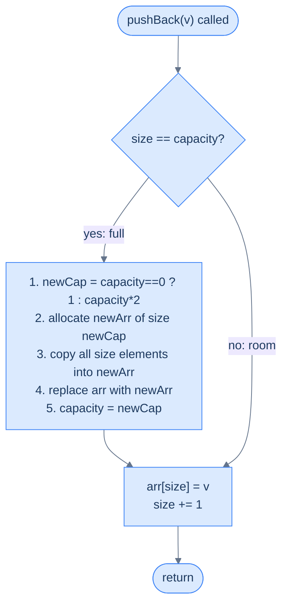

# 11. Design a Dynamic Array

## The Hook

You use `list` in Python, `ArrayList` in Java, `vector` in C++, and `Array` in JavaScript without ever thinking about what they cost. You push, push, push — a million values — and it just works. But raw arrays are **fixed-size**: the moment you allocate `int arr[10]`, pushing an 11th element is impossible. So how do these "dynamic" arrays grow? And why is the average cost of `pushBack` still **O(1)** even though every growth step copies every existing element?

The trick — **geometric doubling** — is one of the most elegant ideas in computer science. It turns what *looks* like an O(N) operation into something that averages to O(1). If you understand this, you've just understood how `std::vector`, Go slices, Python lists, and Rust `Vec` all work under the hood.

---

## The Problem

> Complete a `DynamicArray` class that supports the following operations, each with **amortised O(1)** time:
>
> - `DynamicArray()` — construct an empty dynamic array.
> - `pushBack(val)` — append `val` to the end of the array.
> - `get(index)` — return the value at position `index`.
> - `size()` — return the current number of stored elements.

```
Input:
  ops   = [DynamicArray, pushBack, pushBack, get, size, pushBack, size, get]
  args  = [[],           [2],      [3],      [1], [],   [5],      [],   [0]]

Output:
  [null, null, null, 3, 2, null, 3, 2]

Step-by-step:
  DynamicArray()  → arr = []
  pushBack(2)     → arr = [2]
  pushBack(3)     → arr = [2, 3]
  get(1)          → 3
  size()          → 2
  pushBack(5)     → arr = [2, 3, 5]
  size()          → 3
  get(0)          → 2
```

---

## What Does "Amortised O(1)" Mean?

"Amortised" is a word that trips up everyone who meets it for the first time. It does **not** mean "O(1) in the average case". It means something stronger and more precise: **the total cost of any sequence of N operations is O(N), so the average cost per operation is O(1) — even though any individual operation might be expensive.**

Think of it like a gym membership: one heavy leg-day costs 2 hours, other days cost 20 minutes — but the *average* over a month is still reasonable because the expensive days are rare.

```d2
direction: right

cost: "Cost of each pushBack as capacity doubles" {
  grid-rows: 3
  grid-columns: 8
  grid-gap: 0
  p1: "push 1" {style.fill: "#fde68a"; style.stroke: "#d97706"}
  p2: "push 2" {style.fill: "#fde68a"; style.stroke: "#d97706"}
  p3: "push 3" {style.fill: "#fde68a"; style.stroke: "#d97706"}
  p4: "push 4"
  p5: "push 5" {style.fill: "#fde68a"; style.stroke: "#d97706"}
  p6: "push 6"
  p7: "push 7"
  p8: "push 8"
  c1: "cost = 1"
  c2: "cost = 2"
  c3: "cost = 3"
  c4: "cost = 1"
  c5: "cost = 5"
  c6: "cost = 1"
  c7: "cost = 1"
  c8: "cost = 1"
  cap1: "cap = 1"
  cap2: "cap = 2"
  cap3: "cap = 4"
  cap4: "cap = 4"
  cap5: "cap = 8"
  cap6: "cap = 8"
  cap7: "cap = 8"
  cap8: "cap = 8"
}

total: |md
  8 pushes, total cost = `1+2+3+1+5+1+1+1` = **15** ≤ 2×8.<br/>**Average = 15 / 8 ≈ 1.87 = O(1)**.
| {style.fill: "#dcfce7"; style.stroke: "#16a34a"}

cost -> total: "amortise"
```

<p align="center"><strong>Expensive resizes are rare. Each doubling event pays for itself against the cheap pushes that follow it — the <em>average</em> cost is constant.</strong></p>

---

## The Core Insight — Grow by Doubling

The naive idea is "when full, make the array one bigger". That's **disastrous**: every `pushBack` becomes O(N), because every push triggers a copy of everything. Total cost of N pushes becomes `1 + 2 + 3 + ... + N = O(N²)`.

The fix is to grow the array **multiplicatively**, not additively. When we run out of room, we allocate a new array with **twice** the current capacity and copy everything over. This sounds wasteful, but the math works out beautifully:

- After N pushes, we've resized at capacities `1, 2, 4, 8, ..., N`.
- Total copy work: `1 + 2 + 4 + ... + N = 2N - 1 = O(N)`.
- Plus the cheap N pushes themselves.
- **Total: O(N)** for N operations → O(1) amortised per operation.

> *Before reading on — what happens if we grow by a factor of 1.01 instead of 2? Or a factor of 10?*

Any factor **strictly greater than 1** gives amortised O(1). A factor of 1.01 works mathematically, but in practice you resize so often it's slow by a constant. A factor of 10 wastes memory — you often hold 10× the memory you need. The sweet spot is somewhere between 1.5× (what C++ `std::vector` uses in some implementations) and 2× (what Java and Python use). We'll use **2×** for simplicity.

---

## Applying the Diagnostic Questions

| Question | Answer |
|---|---|
| **Q1.** Why can't we just allocate "enough" memory up front? | **Don't know N in advance** — must grow on demand |
| **Q2.** Why geometric growth instead of arithmetic (+1 or +k)? | **Geometric gives amortised O(1); arithmetic gives O(N) per push** |
| **Q3.** Why double-sized reallocation and not linked nodes? | **Arrays need contiguous memory for O(1) random access** |
| **Q4.** What's the trade-off we accept to get amortised O(1)? | **Up to 2× memory overhead** when just-resized |

### Q1 — Why "grow on demand"?

**Mental model:** imagine you're writing down a list of guests and you don't know the final count. You could reserve a notebook with 10,000 lines (wasteful if only 5 show up), or a notebook with 5 lines (useless if 5,000 show up). The dynamic array punts on this choice: **start small, grow when needed**.

**Concrete numbers:** a `std::vector<int>` starts empty. Push one element → capacity becomes 1. Push another → capacity 2. Push another → capacity 4. The container figures out sizing at runtime based on actual demand.

**What breaks otherwise:** if the caller is forced to declare a size up front, every function signature takes on an extra parameter and every user has to guess. That's C-style thinking. Dynamic arrays free the caller from ever thinking about capacity.

### Q2 — Why "geometric, not arithmetic"?

**Mental model:** each resize is a fixed "tax" — you pay to copy everything. Arithmetic growth (add `k` slots each time) means you resize every `k` pushes forever, and each resize copies more elements than the one before. Geometric growth (double) means resizes get **rarer** as the array grows — the tax is paid less often precisely when it starts to hurt.

**Concrete numbers (arithmetic, k = 1):** to reach size 1000, we resize 1000 times, copying `1 + 2 + 3 + ... + 999 ≈ 500,000` total elements → O(N²).

**Concrete numbers (geometric, ×2):** to reach size 1000, we resize at capacities `1, 2, 4, 8, 16, 32, 64, 128, 256, 512, 1024` — that's 11 resizes, copying `1 + 2 + 4 + ... + 512 = 1023` total elements → O(N).

**What breaks otherwise:** an arithmetically-grown array with a million pushes would do a trillion-element copy in aggregate. On a modern CPU that's minutes of wall-clock time. Geometric growth finishes the same workload in milliseconds.

### Q3 — Why "arrays, not linked nodes"?

**Mental model:** a dynamic array is still an array at heart — it offers O(1) random access because elements live in contiguous memory. A linked list can grow without copying, but `get(index)` becomes O(N) because you have to walk the chain.

**Concrete numbers:** `arr[7]` on a contiguous array is one pointer-arithmetic computation and one memory read. On a linked list, it's 7 pointer dereferences — each potentially a cache miss.

**What breaks otherwise:** swap to a linked structure and `get()` violates the O(1) contract. The whole design pivots on contiguous memory.

### Q4 — Why "accept 2× memory overhead"?

**Mental model:** immediately after a resize, the array has capacity equal to exactly twice the number of elements — so half the reserved memory is empty. This is the price of amortised O(1).

**Concrete numbers:** after 7 pushes, capacity is 8. Memory used: 8 slots for 7 elements — 14% overhead. After 1025 pushes, capacity is 2048 — 50% overhead. The worst case is 2× (just after a resize).

**What breaks otherwise:** if memory is tight (embedded systems, huge arrays), you might prefer growth factor 1.5× (up to 50% overhead) or even shrink-on-pop logic. For most general-purpose use, 2× is the accepted standard.

---

## The Growth Strategy (Visualised)



<p align="center"><strong>The <code>pushBack</code> fast path is two instructions. The slow path — resize + copy — runs rarely and only when the array is full.</strong></p>

Watch what the capacity sequence looks like as we push one element at a time into an empty array:

```d2
seq: "Capacity sequence as elements are pushed" {
  grid-columns: 8
  grid-gap: 0
  e1: |md
    push 1

    cap 0→1
  | {style.fill: "#fde68a"; style.stroke: "#d97706"}
  e2: |md
    push 2

    cap 1→2
  | {style.fill: "#fde68a"; style.stroke: "#d97706"}
  e3: |md
    push 3

    cap 2→4
  | {style.fill: "#fde68a"; style.stroke: "#d97706"}
  e4: |md
    push 4

    no resize
  |
  e5: |md
    push 5

    cap 4→8
  | {style.fill: "#fde68a"; style.stroke: "#d97706"}
  e6: |md
    push 6

    no resize
  |
  e7: |md
    push 7

    no resize
  |
  e8: |md
    push 8

    no resize
  |
}
```

<p align="center"><strong>Resizes happen at pushes 1, 2, 3, 5, 9, 17, 33, 65 … — every power of two plus one. Between those, pushes are O(1) with no work beyond a pointer bump.</strong></p>

---

## The Solution


```pseudocode
# Dynamic array (vector / ArrayList) with amortised O(1) pushBack via capacity-doubling.
class DynamicArray:
    field arr                                          # backing storage
    field currentSize                                  # number of stored elements
    field capacity                                     # slots available in arr

    constructor():
        arr ← empty list
        currentSize ← 0
        capacity ← 0

    function pushBack(val):
        if currentSize ≥ capacity:                     # slow path — out of room
            newCapacity ← 1 if capacity = 0 else capacity × 2     # double on each grow
            newArr ← list of newCapacity zeros
            for i from 0 to currentSize − 1:           # O(currentSize) — happens log₂N times total
                newArr[i] ← arr[i]
            arr ← newArr
            capacity ← newCapacity
        arr[currentSize] ← val                         # fast path — O(1)
        currentSize ← currentSize + 1

    function get(index):
        return arr[index]                              # O(1) random access via contiguous storage
```

```python run
from typing import List

class DynamicArray:
    def __init__(self):
        # Underlying storage. Starts as None — we allocate lazily on first push.
        self.arr: List[int] = []

        # Number of elements actually stored. Never exceeds `capacity`.
        self.current_size = 0

        # Slots available in `arr`. Grows by doubling whenever size hits capacity.
        self.capacity = 0

    def push_back(self, val: int) -> None:
        # Slow path: no room → allocate a fresh, larger backing array
        if self.current_size >= self.capacity:
            # Start at 1 on the very first push; otherwise double the existing capacity.
            # Doubling is what gives pushBack amortised O(1).
            new_capacity = 1 if self.capacity == 0 else self.capacity * 2
            new_arr = [0] * new_capacity

            # Copy every live element into the new array. This O(current_size) work
            # is why resizes look expensive — but they happen only log₂(N) times total.
            for i in range(self.current_size):
                new_arr[i] = self.arr[i]

            self.arr = new_arr
            self.capacity = new_capacity

        # Fast path: room available → write the new element and bump the size pointer.
        # Both lines are O(1); they run every push regardless of resize.
        self.arr[self.current_size] = val
        self.current_size += 1

    def get(self, index: int) -> int:
        # Contiguous storage → O(1) random access via integer indexing
        return self.arr[index]

    def size(self) -> int:
        # We track size explicitly so we don't count unused capacity slots
        return self.current_size


# Example usage
da = DynamicArray()
da.push_back(2)
da.push_back(3)
print(da.get(1))    # 3
print(da.size())    # 2
da.push_back(5)
print(da.size())    # 3
print(da.get(0))    # 2
```

```java run
class DynamicArray {
    // Underlying storage; reallocated whenever capacity is exhausted
    private int[] arr;
    // Number of live elements (always <= capacity)
    private int currentSize;
    // Total slots available in `arr`
    private int capacity;

    public DynamicArray() {
        this.arr = new int[0];   // empty on construction; first push triggers allocation
        this.currentSize = 0;
        this.capacity = 0;
    }

    public void pushBack(int val) {
        // Slow path: storage is full → double the capacity
        if (currentSize >= capacity) {
            int newCapacity = (capacity == 0) ? 1 : capacity * 2;
            int[] newArr = new int[newCapacity];

            // Manual copy — System.arraycopy would be faster, but the loop
            // makes the O(n) work visible.
            for (int i = 0; i < currentSize; i++) {
                newArr[i] = arr[i];
            }
            arr = newArr;
            capacity = newCapacity;
        }

        // Fast path: write and bump
        arr[currentSize] = val;
        currentSize++;
    }

    public int get(int index) {
        return arr[index];   // contiguous array → O(1) random access
    }

    public int size() {
        return currentSize;  // never return `capacity`; that's an internal detail
    }
}
```

```c run
#include <stdio.h>
#include <stdlib.h>

typedef struct {
    int* arr;          // heap-allocated backing storage
    int  currentSize;  // number of live elements
    int  capacity;     // allocated slots in arr
} DynamicArray;

DynamicArray* dynamicArrayCreate(void) {
    DynamicArray* d = (DynamicArray*)malloc(sizeof(DynamicArray));
    d->arr = NULL;
    d->currentSize = 0;
    d->capacity = 0;
    return d;
}

void pushBack(DynamicArray* d, int val) {
    if (d->currentSize >= d->capacity) {
        // Double (or start at 1) — amortised O(1) requires factor > 1
        int newCapacity = d->capacity == 0 ? 1 : d->capacity * 2;
        // realloc handles the allocate-new + copy-existing in one call
        d->arr = (int*)realloc(d->arr, sizeof(int) * newCapacity);
        d->capacity = newCapacity;
    }
    d->arr[d->currentSize++] = val;   // write + bump in one expression
}

int get(DynamicArray* d, int index) {
    return d->arr[index];              // pointer arithmetic → O(1)
}

int size(DynamicArray* d) {
    return d->currentSize;
}

void dynamicArrayFree(DynamicArray* d) {
    free(d->arr);
    free(d);
}
```

```scala run
class DynamicArray {
  private var arr: Array[Int] = new Array[Int](0)
  private var currentSize: Int = 0
  private var cap: Int = 0

  def pushBack(v: Int): Unit = {
    if (currentSize >= cap) {
      // Factor of 2 keeps pushBack amortised O(1)
      val newCap = if (cap == 0) 1 else cap * 2
      val newArr = new Array[Int](newCap)
      Array.copy(arr, 0, newArr, 0, currentSize)   // O(currentSize) resize cost
      arr = newArr
      cap = newCap
    }
    arr(currentSize) = v
    currentSize += 1
  }

  def get(index: Int): Int = arr(index)
  def size: Int = currentSize
}
```


<details>
<summary><strong>Trace — pushBack 2, 3, 5 into empty array</strong></summary>

```
State format: arr | currentSize | capacity

Init           │ []                      │ size=0 │ cap=0

pushBack(2):
  size ≥ cap (0 ≥ 0) → resize: newCap = 1, new_arr = [0]
  copy 0 elements (nothing to do)
  write arr[0] = 2, size++
  State: [2]                              │ size=1 │ cap=1

pushBack(3):
  size ≥ cap (1 ≥ 1) → resize: newCap = 2, new_arr = [0, 0]
  copy 1 element: new_arr[0] = 2 → [2, 0]
  write arr[1] = 3, size++
  State: [2, 3]                           │ size=2 │ cap=2

pushBack(5):
  size ≥ cap (2 ≥ 2) → resize: newCap = 4, new_arr = [0, 0, 0, 0]
  copy 2 elements: new_arr = [2, 3, 0, 0]
  write arr[2] = 5, size++
  State: [2, 3, 5, 0]                     │ size=3 │ cap=4

get(1) → arr[1] = 3 ✓
size() → 3 ✓
```

Notice how after 3 pushes capacity is already 4 — that slot `arr[3] = 0` is wasted space,
the price we pay for amortised O(1). The next push will fit without resizing.

</details>

<details>
<summary><strong>Trace — 8 pushes showing resize events</strong></summary>

```
push  | resize? | cap before → after | copy cost | push cost
------|---------|---------------------|-----------|----------
  1   |  YES    |   0 → 1             |   0       |   1
  2   |  YES    |   1 → 2             |   1       |   2
  3   |  YES    |   2 → 4             |   2       |   3
  4   |  no     |   4 → 4             |   0       |   1
  5   |  YES    |   4 → 8             |   4       |   5
  6   |  no     |   8 → 8             |   0       |   1
  7   |  no     |   8 → 8             |   0       |   1
  8   |  no     |   8 → 8             |   0       |   1

Total cost = 15 units for 8 pushes → ≈ 1.87 per push on average = O(1) amortised.
Resize events fire at pushes 1, 2, 3, 5, 9, 17, 33, ... — exponentially rarer as N grows.
```

</details>

```d3 widget=array-traversal
{
  "items": ["1"],
  "title": "Dynamic array: 8 pushes with capacity doubling",
  "steps": [
    {
      "items": ["1"],
      "keys":  ["a"],
      "markers": [{ "name": "size", "index": 0, "color": "#3b82f6" }],
      "range":   { "lo": 0, "hi": 0 },
      "msg": "Push 1 — resize 0→1. Capacity is now 1; size = 1; 0 slots wasted."
    },
    {
      "items": ["1", "2"],
      "keys":  ["a", "b"],
      "markers": [{ "name": "size", "index": 1, "color": "#3b82f6" }],
      "range":   { "lo": 0, "hi": 1 },
      "msg": "Push 2 — resize 1→2. Capacity = 2; size = 2; 0 slots wasted."
    },
    {
      "items": ["1", "2", "3", "_"],
      "keys":  ["a", "b", "c", "d"],
      "markers": [{ "name": "size", "index": 2, "color": "#3b82f6" }],
      "range":   { "lo": 0, "hi": 2 },
      "msg": "Push 3 — resize 2→4 (copy 2 elements). Capacity = 4; size = 3; 1 reserved slot."
    },
    {
      "items": ["1", "2", "3", "4"],
      "keys":  ["a", "b", "c", "d"],
      "markers": [{ "name": "size", "index": 3, "color": "#3b82f6" }],
      "range":   { "lo": 0, "hi": 3 },
      "msg": "Push 4 — no resize. Fast path: write + bump."
    },
    {
      "items": ["1", "2", "3", "4", "5", "_", "_", "_"],
      "keys":  ["a", "b", "c", "d", "e", "f", "g", "h"],
      "markers": [{ "name": "size", "index": 4, "color": "#3b82f6" }],
      "range":   { "lo": 0, "hi": 4 },
      "msg": "Push 5 — resize 4→8 (copy 4 elements). Capacity = 8; size = 5; 3 reserved slots."
    },
    {
      "items": ["1", "2", "3", "4", "5", "6", "_", "_"],
      "keys":  ["a", "b", "c", "d", "e", "f", "g", "h"],
      "markers": [{ "name": "size", "index": 5, "color": "#3b82f6" }],
      "range":   { "lo": 0, "hi": 5 },
      "msg": "Push 6 — no resize. Fast path."
    },
    {
      "items": ["1", "2", "3", "4", "5", "6", "7", "_"],
      "keys":  ["a", "b", "c", "d", "e", "f", "g", "h"],
      "markers": [{ "name": "size", "index": 6, "color": "#3b82f6" }],
      "range":   { "lo": 0, "hi": 6 },
      "msg": "Push 7 — no resize. Fast path."
    },
    {
      "items": ["1", "2", "3", "4", "5", "6", "7", "8"],
      "keys":  ["a", "b", "c", "d", "e", "f", "g", "h"],
      "markers": [{ "name": "size", "index": 7, "color": "#3b82f6" }],
      "range":   { "lo": 0, "hi": 7 },
      "msg": "Push 8 — no resize. Capacity = 8; size = 8; all slots used. Next push would trigger 8→16."
    }
  ]
}
```

<p align="center"><strong>Eight pushes into an empty <code>DynamicArray</code> — the blue band tracks how much of the capacity is actually used; the wasted (<code>_</code>) slots are the cost of amortised O(1).</strong></p>

---

## Complexity Analysis

| Operation | Time (worst case) | Time (amortised) | Space |
|---|---|---|---|
| `DynamicArray()` | O(1) | O(1) | O(1) |
| `pushBack(val)` | **O(N)** during resize | **O(1) amortised** | O(1) extra |
| `get(index)` | O(1) | O(1) | O(1) |
| `size()` | O(1) | O(1) | O(1) |

**Why the amortised bound:** N pushes trigger resizes at capacities `1, 2, 4, ..., 2^⌈log₂ N⌉`. Total copy work across all resizes = `1 + 2 + 4 + ... + N < 2N`. Plus N constant-time writes for the pushes themselves. **Total: < 3N ops for N pushes → O(N) total → O(1) per operation on average.**

**Space:** O(N) for the backing array. Worst case right after a resize: 2× the actual size used (half the slots are unused). This "overhead" is the explicit trade-off for amortised O(1).

---

## Edge Cases

| Case | Example | Expected Behaviour |
|---|---|---|
| First push into empty array | `pushBack(5)` on fresh instance | Resizes `0 → 1`, stores `5` |
| Push exactly at capacity | push when `size == capacity` | Triggers resize to `capacity * 2` |
| `get` on valid index | `get(2)` after 3 pushes | Returns the stored value |
| `get` on out-of-range index | `get(10)` after 3 pushes | Undefined / language-dependent crash (raw-array semantics) |
| `size()` after no pushes | Just constructed | Returns `0` — not `capacity` |
| Very large N | Push 10^6 elements | Only ~20 resizes total; overall O(N) work |
| Push same value repeatedly | `pushBack(0)` × 1000 | Resizes trigger identically; values aren't deduplicated |

A subtle point: `get` is a raw array read — if the caller passes an invalid index the behaviour is whatever the language does with out-of-range access (Python raises, C is undefined, Java throws). The class doesn't bounds-check because the problem contract doesn't require it.

---

## Why Not Just Use the Language's Built-In?

Every language you'll use in production already gives you a dynamic array — Python `list`, Java `ArrayList`, C++ `std::vector`, JavaScript `Array`, Go slices, Rust `Vec`. **All of them use this exact algorithm internally.** Building it from scratch isn't a production exercise; it's an exercise in **understanding what those built-ins are doing for you**.

Interviewers love this problem because it separates people who *use* data structures from people who *understand* them. If you can explain why Python's `list.append` is O(1) amortised but occasionally takes milliseconds, you've shown you read the source of your tools — not just their API.

---

## Final Takeaway

A dynamic array is just a fixed-size array plus two tricks: **track the used size separately from the allocated capacity**, and **double the capacity whenever you run out of room**. That single design unlocks O(1) random access AND O(1) amortised append — the best of both worlds. Every time you write `list.append(x)` or `vec.push(x)`, somewhere below you is this exact state machine, quietly amortising its copy costs over the long run.

> **Transfer Challenge:** Add a `popBack()` method. Should it ever *shrink* the backing array? If yes, when — and what shrink factor avoids a pathological "oscillate at the boundary" bug where alternating pushBack/popBack triggers a resize every single time?
>
> <details><summary><strong>Solution hint</strong></summary>
>
> Shrink when `currentSize` drops to **one quarter** (not half) of capacity, and shrink to half the current capacity. The ¼ threshold creates a "buffer zone" between grow and shrink thresholds — after a shrink the array is half-full, far from either trigger. A ½-threshold would oscillate: push past the boundary → double, pop back across it → halve, push again → double, forever.
>
> </details>
