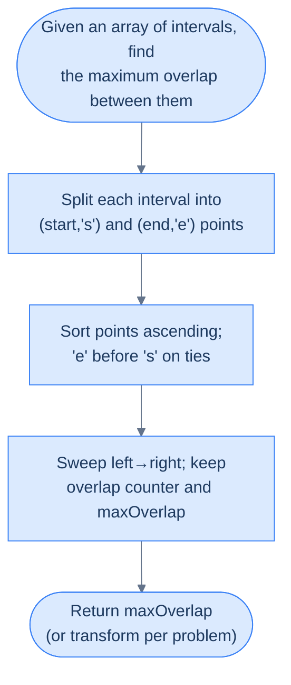
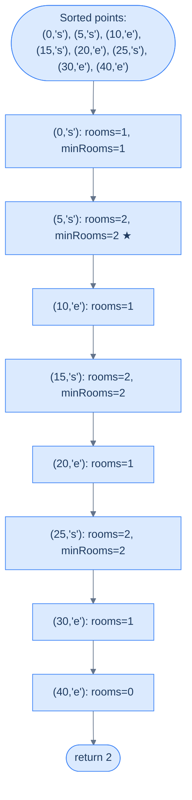

# Understanding the Line Sweep Technique for Points

## The Hook

You just learned to sweep a line through **intervals**. But what if the events on your axis aren't continuous stripes — just **dots**? Lightning strikes timestamped to the millisecond. Asteroid collisions on a number line. The exact instants a coffee shop's door opens or closes. The sweep idea still works — and in fact, gets *simpler*. No more "does this overlap?" book-keeping; you just decide what happens **at each dot** and walk left to right.

Once you see the sweep as "an ordered walk over points that fire events", you'll realise almost every interval problem can be rewritten this way. That rewrite is the key to unlocking the **maximum overlap** pattern we're heading toward.

---

## The World — An Axis of Marked Points

Forget stripes for a moment. Picture a single horizontal axis with **points** marked on it — each point labelled with a letter, a number, or a tag telling you *what kind of event it is*.

> 🖼 Diagram — An interval can always be decomposed into two labelled points on the x-axis: a start and an end. The algorithm processes points, not intervals.
```d2
axis: "x-axis with an interval marked as two points" {
  grid-columns: 5
  grid-gap: 0
  s: |md
    **s**

    start
  | {style.fill: "#dcfce7"; style.stroke: "#16a34a"}
  g1: "·"
  g2: "·"
  g3: "·"
  e: |md
    **e**

    end
  | {style.fill: "#fde68a"; style.stroke: "#d97706"}
}

lbl: |md
  `interval = [s, e]`

  represented as two independent points (s, 'start') and (e, 'end')
|

axis -> lbl
```

<p align="center"><strong>An interval can always be decomposed into two labelled points on the x-axis: a <code>start</code> and an <code>end</code>. The algorithm processes points, not intervals.</strong></p>

When intervals are the input, we **split them**. Each interval `[s, e]` becomes two entries — `(s, 'start')` and `(e, 'end')` — living in a single flat array of points. The sweep then visits those points in order, and the algorithm reacts to each one based on its tag.

That decomposition is the hinge. After it, the algorithm stops thinking in terms of interval geometry and starts thinking in terms of **events firing along an axis**.

> *Before reading on — why split intervals apart instead of keeping them as pairs? What extra power does the point representation give you?*

Because overlap is a **local** phenomenon. At any instant, overlap is determined by how many intervals are currently "open" — and that count only changes at start points (+1) or end points (−1). Tracking that count is much easier when each change is its own atomic event.

---

## Step 1 — Convert Intervals to Points

Walk the interval array once and emit two point records per interval.

> 🖼 Diagram — Each interval produces two records in the points array: a tagged start and a tagged end. The size grows to 2 × N.
```d2
direction: right

intervals: "arr (intervals)" {
  grid-columns: 3
  grid-gap: 16
  i1: "[1, 4]"
  i2: "[2, 5]"
  i3: "[6, 8]"
}

points: "points (after split)" {
  grid-columns: 6
  grid-gap: 8
  p1: "(1, 's')" {style.fill: "#dcfce7"; style.stroke: "#16a34a"}
  p2: "(4, 'e')" {style.fill: "#fde68a"; style.stroke: "#d97706"}
  p3: "(2, 's')" {style.fill: "#dcfce7"; style.stroke: "#16a34a"}
  p4: "(5, 'e')" {style.fill: "#fde68a"; style.stroke: "#d97706"}
  p5: "(6, 's')" {style.fill: "#dcfce7"; style.stroke: "#16a34a"}
  p6: "(8, 'e')" {style.fill: "#fde68a"; style.stroke: "#d97706"}
}

intervals -> points
```

<p align="center"><strong>Each interval produces two records in the <code>points</code> array: a tagged <code>start</code> and a tagged <code>end</code>. The size grows to <strong>2 × N</strong>.</strong></p>

The split doubles memory cost to `O(N)` — but it gives us a **flat, homogeneous sequence** that can be sorted and swept without any special-casing.

---

## Step 2 — Sort the Points

Sort the combined array in **non-decreasing order of coordinate value**. When two points share a coordinate, most problems break ties by putting **`'end'` before `'start'`** — we'll see why in the next section. For now, notice a beautiful coincidence: in ASCII, `'e' < 's'`, so sorting tuples `(coord, tag)` naturally produces the right order at no extra cost.

> 🖼 Diagram — Sorting lines every event up along the x-axis. Iterating the sorted array becomes equivalent to walking the axis left to right.
```d2
direction: right

before: "Unsorted points" {
  grid-columns: 6
  grid-gap: 8
  u1: "(1, 's')"
  u2: "(4, 'e')"
  u3: "(2, 's')"
  u4: "(5, 'e')"
  u5: "(6, 's')"
  u6: "(8, 'e')"
}

after: "Sorted points (ascending by coordinate; 'e' before 's' on ties)" {
  grid-columns: 6
  grid-gap: 8
  s1: "(1, 's')" {style.fill: "#dcfce7"; style.stroke: "#16a34a"}
  s2: "(2, 's')" {style.fill: "#dcfce7"; style.stroke: "#16a34a"}
  s3: "(4, 'e')" {style.fill: "#fde68a"; style.stroke: "#d97706"}
  s4: "(5, 'e')" {style.fill: "#fde68a"; style.stroke: "#d97706"}
  s5: "(6, 's')" {style.fill: "#dcfce7"; style.stroke: "#16a34a"}
  s6: "(8, 'e')" {style.fill: "#fde68a"; style.stroke: "#d97706"}
}

before -> after
```

<p align="center"><strong>Sorting lines every event up along the x-axis. Iterating the sorted array becomes equivalent to walking the axis left to right.</strong></p>

After this step, the `points` array is just the x-axis laid flat. Each index is a moment in time; each value is "what happens there".

---

## Step 3 — Sweep the Line

Walk the sorted array from left to right. At each point, update a **state variable** that captures the answer-so-far. The sweep line is no longer a real line — it's the **loop counter**. Each iteration is equivalent to having the imaginary line cross one more event on the axis.

> 🖼 Diagram — Iterating the sorted array is equivalent to sweeping a vertical line through the points and processing each one in order.
```d2
direction: right

axis: "sorted points on the x-axis" {
  grid-columns: 6
  grid-gap: 0
  p1: "(1, 's')" {style.fill: "#dcfce7"; style.stroke: "#16a34a"}
  p2: "(2, 's')" {style.fill: "#dcfce7"; style.stroke: "#16a34a"}
  p3: "(4, 'e')" {style.fill: "#fde68a"; style.stroke: "#d97706"}
  p4: "(5, 'e')" {style.fill: "#fde68a"; style.stroke: "#d97706"}
  p5: "(6, 's')" {style.fill: "#dcfce7"; style.stroke: "#16a34a"}
  p6: "(8, 'e')" {style.fill: "#fde68a"; style.stroke: "#d97706"}
}

sweep: "▲ sweep cursor walks index 0 → end" {style.fill: "#fde68a"; style.stroke: "#d97706"}

state: |md
  **State updates at each point:**

  's' ⇒ something opens

  'e' ⇒ something closes
|

axis -> sweep
sweep -> state
```

<p align="center"><strong>Iterating the sorted array is equivalent to sweeping a vertical line through the points and processing each one in order.</strong></p>

> ▶ Interactive Diagram — Walk the sweep cursor over six sorted points derived from `intervals = [[1,4], [2,5], [6,8]]`. Each step shows what happens as the cursor crosses one event.
```d3 widget=array-1d
{
  "steps": [
    {
      "nodes": [
        {
          "id": "0",
          "label": "(1,s)",
          "kind": "cell",
          "meta": [],
          "slot": 0,
          "cardId": "",
          "layoutKind": ""
        },
        {
          "id": "1",
          "label": "(2,s)",
          "kind": "cell",
          "meta": [],
          "slot": 1,
          "cardId": "",
          "layoutKind": ""
        },
        {
          "id": "2",
          "label": "(4,e)",
          "kind": "cell",
          "meta": [],
          "slot": 2,
          "cardId": "",
          "layoutKind": ""
        },
        {
          "id": "3",
          "label": "(5,e)",
          "kind": "cell",
          "meta": [],
          "slot": 3,
          "cardId": "",
          "layoutKind": ""
        },
        {
          "id": "4",
          "label": "(6,s)",
          "kind": "cell",
          "meta": [],
          "slot": 4,
          "cardId": "",
          "layoutKind": ""
        },
        {
          "id": "5",
          "label": "(8,e)",
          "kind": "cell",
          "meta": [],
          "slot": 5,
          "cardId": "",
          "layoutKind": ""
        }
      ],
      "edges": [],
      "cursor": [
        {
          "name": "sweep",
          "target": "0",
          "color": "#f59e0b"
        }
      ],
      "highlight": [],
      "changed": [],
      "removed": [],
      "annotation": "Sweep at (1, 's'). State update: something opens at x=1.",
      "line": 0,
      "frames": [],
      "cardCursor": []
    },
    {
      "nodes": [
        {
          "id": "0",
          "label": "(1,s)",
          "kind": "cell",
          "meta": [],
          "slot": 0,
          "cardId": "",
          "layoutKind": ""
        },
        {
          "id": "1",
          "label": "(2,s)",
          "kind": "cell",
          "meta": [],
          "slot": 1,
          "cardId": "",
          "layoutKind": ""
        },
        {
          "id": "2",
          "label": "(4,e)",
          "kind": "cell",
          "meta": [],
          "slot": 2,
          "cardId": "",
          "layoutKind": ""
        },
        {
          "id": "3",
          "label": "(5,e)",
          "kind": "cell",
          "meta": [],
          "slot": 3,
          "cardId": "",
          "layoutKind": ""
        },
        {
          "id": "4",
          "label": "(6,s)",
          "kind": "cell",
          "meta": [],
          "slot": 4,
          "cardId": "",
          "layoutKind": ""
        },
        {
          "id": "5",
          "label": "(8,e)",
          "kind": "cell",
          "meta": [],
          "slot": 5,
          "cardId": "",
          "layoutKind": ""
        }
      ],
      "edges": [],
      "cursor": [
        {
          "name": "sweep",
          "target": "1",
          "color": "#f59e0b"
        }
      ],
      "highlight": [],
      "changed": [],
      "removed": [],
      "annotation": "Sweep advances to (2, 's'). Another open at x=2.",
      "line": 0,
      "frames": [],
      "cardCursor": []
    },
    {
      "nodes": [
        {
          "id": "0",
          "label": "(1,s)",
          "kind": "cell",
          "meta": [],
          "slot": 0,
          "cardId": "",
          "layoutKind": ""
        },
        {
          "id": "1",
          "label": "(2,s)",
          "kind": "cell",
          "meta": [],
          "slot": 1,
          "cardId": "",
          "layoutKind": ""
        },
        {
          "id": "2",
          "label": "(4,e)",
          "kind": "cell",
          "meta": [],
          "slot": 2,
          "cardId": "",
          "layoutKind": ""
        },
        {
          "id": "3",
          "label": "(5,e)",
          "kind": "cell",
          "meta": [],
          "slot": 3,
          "cardId": "",
          "layoutKind": ""
        },
        {
          "id": "4",
          "label": "(6,s)",
          "kind": "cell",
          "meta": [],
          "slot": 4,
          "cardId": "",
          "layoutKind": ""
        },
        {
          "id": "5",
          "label": "(8,e)",
          "kind": "cell",
          "meta": [],
          "slot": 5,
          "cardId": "",
          "layoutKind": ""
        }
      ],
      "edges": [],
      "cursor": [
        {
          "name": "sweep",
          "target": "2",
          "color": "#f59e0b"
        }
      ],
      "highlight": [],
      "changed": [],
      "removed": [],
      "annotation": "Sweep advances to (4, 'e'). Something closes at x=4.",
      "line": 0,
      "frames": [],
      "cardCursor": []
    },
    {
      "nodes": [
        {
          "id": "0",
          "label": "(1,s)",
          "kind": "cell",
          "meta": [],
          "slot": 0,
          "cardId": "",
          "layoutKind": ""
        },
        {
          "id": "1",
          "label": "(2,s)",
          "kind": "cell",
          "meta": [],
          "slot": 1,
          "cardId": "",
          "layoutKind": ""
        },
        {
          "id": "2",
          "label": "(4,e)",
          "kind": "cell",
          "meta": [],
          "slot": 2,
          "cardId": "",
          "layoutKind": ""
        },
        {
          "id": "3",
          "label": "(5,e)",
          "kind": "cell",
          "meta": [],
          "slot": 3,
          "cardId": "",
          "layoutKind": ""
        },
        {
          "id": "4",
          "label": "(6,s)",
          "kind": "cell",
          "meta": [],
          "slot": 4,
          "cardId": "",
          "layoutKind": ""
        },
        {
          "id": "5",
          "label": "(8,e)",
          "kind": "cell",
          "meta": [],
          "slot": 5,
          "cardId": "",
          "layoutKind": ""
        }
      ],
      "edges": [],
      "cursor": [
        {
          "name": "sweep",
          "target": "3",
          "color": "#f59e0b"
        }
      ],
      "highlight": [],
      "changed": [],
      "removed": [],
      "annotation": "Sweep advances to (5, 'e'). Another close at x=5.",
      "line": 0,
      "frames": [],
      "cardCursor": []
    },
    {
      "nodes": [
        {
          "id": "0",
          "label": "(1,s)",
          "kind": "cell",
          "meta": [],
          "slot": 0,
          "cardId": "",
          "layoutKind": ""
        },
        {
          "id": "1",
          "label": "(2,s)",
          "kind": "cell",
          "meta": [],
          "slot": 1,
          "cardId": "",
          "layoutKind": ""
        },
        {
          "id": "2",
          "label": "(4,e)",
          "kind": "cell",
          "meta": [],
          "slot": 2,
          "cardId": "",
          "layoutKind": ""
        },
        {
          "id": "3",
          "label": "(5,e)",
          "kind": "cell",
          "meta": [],
          "slot": 3,
          "cardId": "",
          "layoutKind": ""
        },
        {
          "id": "4",
          "label": "(6,s)",
          "kind": "cell",
          "meta": [],
          "slot": 4,
          "cardId": "",
          "layoutKind": ""
        },
        {
          "id": "5",
          "label": "(8,e)",
          "kind": "cell",
          "meta": [],
          "slot": 5,
          "cardId": "",
          "layoutKind": ""
        }
      ],
      "edges": [],
      "cursor": [
        {
          "name": "sweep",
          "target": "4",
          "color": "#f59e0b"
        }
      ],
      "highlight": [],
      "changed": [],
      "removed": [],
      "annotation": "Sweep advances to (6, 's'). Reopens at x=6.",
      "line": 0,
      "frames": [],
      "cardCursor": []
    },
    {
      "nodes": [
        {
          "id": "0",
          "label": "(1,s)",
          "kind": "cell",
          "meta": [],
          "slot": 0,
          "cardId": "",
          "layoutKind": ""
        },
        {
          "id": "1",
          "label": "(2,s)",
          "kind": "cell",
          "meta": [],
          "slot": 1,
          "cardId": "",
          "layoutKind": ""
        },
        {
          "id": "2",
          "label": "(4,e)",
          "kind": "cell",
          "meta": [],
          "slot": 2,
          "cardId": "",
          "layoutKind": ""
        },
        {
          "id": "3",
          "label": "(5,e)",
          "kind": "cell",
          "meta": [],
          "slot": 3,
          "cardId": "",
          "layoutKind": ""
        },
        {
          "id": "4",
          "label": "(6,s)",
          "kind": "cell",
          "meta": [],
          "slot": 4,
          "cardId": "",
          "layoutKind": ""
        },
        {
          "id": "5",
          "label": "(8,e)",
          "kind": "cell",
          "meta": [],
          "slot": 5,
          "cardId": "",
          "layoutKind": ""
        }
      ],
      "edges": [],
      "cursor": [
        {
          "name": "sweep",
          "target": "5",
          "color": "#f59e0b"
        }
      ],
      "highlight": [],
      "changed": [],
      "removed": [],
      "annotation": "Sweep advances to (8, 'e'). Final close. Sweep done.",
      "line": 0,
      "frames": [],
      "cardCursor": []
    }
  ],
  "title": "Line sweep through sorted points (intervals [[1,4], [2,5], [6,8]])"
}
```

The state machine is where each problem varies. Maximum overlap tracks a counter. Busiest interval tracks both a counter and the current time window. Weighted problems track a running sum. The sweep skeleton is identical — only the *reaction* at each point changes.

---

## Complexity Analysis

| Scenario | Time | Space |
|---|---|---|
| **Best case (input is already points)** | O(N log N) | O(1) extra |
| **Worst case (input is intervals → split)** | O(N log N) | O(N) extra for the `points` array |

Sorting is the dominant cost — O(N log N) — and there is no way around it; the sweep depends on order. The sweep itself is a single O(N) pass with O(1) state updates per step. When the input is already a list of points, you can sort in place; when it's a list of intervals that must be split, you pay an O(N) auxiliary array.

> Now that you can sweep **points**, we're about to give the sweep a job: counting how many intervals are simultaneously active. That counter is the entire maximum-overlap pattern.

# Understanding the Maximum Overlap Pattern

## The Hook

Ten conference rooms. Forty-seven meetings scribbled on sticky notes. Your boss asks: "At our busiest, how many rooms were in use at the same time?" The naive engineer pairs up every meeting and checks for overlap — 47 × 47 = 2209 comparisons. The engineer who knows the line sweep answers the question in **one pass** after a sort, with a single integer counter. Their code is seven lines long.

This is the **maximum overlap pattern** — the second most common application of line sweep in the wild, and the workhorse behind "peak concurrent users", "minimum resources", "calendar conflicts", and dozens of systems-design questions you'll be asked in interviews.

---

## The World — A Counter That Rides the Sweep Line

Imagine a tiny integer floating just above the x-axis, labelled `overlap`. As the sweep line walks rightward, the counter listens for two kinds of events:

- **A start point passes under it** → something is opening → `overlap += 1`.
- **An end point passes under it** → something is closing → `overlap -= 1`.

At every instant, `overlap` tells you **exactly how many intervals are active right now**. And because the counter only changes at event points (never between them), you don't need to check every instant — just every point. The maximum value `overlap` ever reaches is the answer we're after.

> 🖼 Diagram — The counter overlap rides the sweep line. Its peak value — 3 here — is the maximum number of intervals active at any single instant.
```d2
direction: right

timeline: "Three intervals on the axis" {
  grid-columns: 3
  grid-gap: 16
  a1: "[1, 4]"
  a2: "[2, 6]"
  a3: "[3, 5]"
}

events: "Sweep processes 6 events left-to-right" {
  grid-columns: 6
  grid-gap: 0
  e1: |md
    `x=1 s`

    overlap=1
  | {style.fill: "#dcfce7"; style.stroke: "#16a34a"}
  e2: |md
    `x=2 s`

    overlap=2
  | {style.fill: "#dcfce7"; style.stroke: "#16a34a"}
  e3: |md
    `x=3 s`

    overlap=3 ★
  | {style.fill: "#fde68a"; style.stroke: "#d97706"}
  e4: |md
    `x=4 e`

    overlap=2
  |
  e5: |md
    `x=5 e`

    overlap=1
  |
  e6: |md
    `x=6 e`

    overlap=0
  |
}

result: |md
  **maxOverlap = 3**

  (attained between x=3 and x=4)
| {style.fill: "#fde68a"; style.stroke: "#d97706"}

timeline -> events
events -> result
```

<p align="center"><strong>The counter <code>overlap</code> rides the sweep line. Its peak value — <strong>3</strong> here — is the maximum number of intervals active at any single instant.</strong></p>

> ▶ Interactive Diagram — Step through the sweep on `intervals = [[1,4], [2,6], [3,5]]`. The `overlap` counter climbs to 3 at `x = 3` and that peak is the final `maxOverlap`.
```d3 widget=array-1d
{
  "steps": [
    {
      "nodes": [
        {
          "id": "0",
          "label": "(1,s)",
          "kind": "cell",
          "meta": [],
          "slot": 0,
          "cardId": "",
          "layoutKind": ""
        },
        {
          "id": "1",
          "label": "(2,s)",
          "kind": "cell",
          "meta": [],
          "slot": 1,
          "cardId": "",
          "layoutKind": ""
        },
        {
          "id": "2",
          "label": "(3,s)",
          "kind": "cell",
          "meta": [],
          "slot": 2,
          "cardId": "",
          "layoutKind": ""
        },
        {
          "id": "3",
          "label": "(4,e)",
          "kind": "cell",
          "meta": [],
          "slot": 3,
          "cardId": "",
          "layoutKind": ""
        },
        {
          "id": "4",
          "label": "(5,e)",
          "kind": "cell",
          "meta": [],
          "slot": 4,
          "cardId": "",
          "layoutKind": ""
        },
        {
          "id": "5",
          "label": "(6,e)",
          "kind": "cell",
          "meta": [],
          "slot": 5,
          "cardId": "",
          "layoutKind": ""
        }
      ],
      "edges": [],
      "cursor": [
        {
          "name": "sweep",
          "target": "0",
          "color": "#f59e0b"
        }
      ],
      "highlight": [],
      "changed": [],
      "removed": [],
      "annotation": "(1, 's') → overlap = 1, maxOverlap = 1.",
      "line": 0,
      "frames": [],
      "cardCursor": []
    },
    {
      "nodes": [
        {
          "id": "0",
          "label": "(1,s)",
          "kind": "cell",
          "meta": [],
          "slot": 0,
          "cardId": "",
          "layoutKind": ""
        },
        {
          "id": "1",
          "label": "(2,s)",
          "kind": "cell",
          "meta": [],
          "slot": 1,
          "cardId": "",
          "layoutKind": ""
        },
        {
          "id": "2",
          "label": "(3,s)",
          "kind": "cell",
          "meta": [],
          "slot": 2,
          "cardId": "",
          "layoutKind": ""
        },
        {
          "id": "3",
          "label": "(4,e)",
          "kind": "cell",
          "meta": [],
          "slot": 3,
          "cardId": "",
          "layoutKind": ""
        },
        {
          "id": "4",
          "label": "(5,e)",
          "kind": "cell",
          "meta": [],
          "slot": 4,
          "cardId": "",
          "layoutKind": ""
        },
        {
          "id": "5",
          "label": "(6,e)",
          "kind": "cell",
          "meta": [],
          "slot": 5,
          "cardId": "",
          "layoutKind": ""
        }
      ],
      "edges": [],
      "cursor": [
        {
          "name": "sweep",
          "target": "1",
          "color": "#f59e0b"
        }
      ],
      "highlight": [],
      "changed": [],
      "removed": [],
      "annotation": "(2, 's') → overlap = 2, maxOverlap = 2.",
      "line": 0,
      "frames": [],
      "cardCursor": []
    },
    {
      "nodes": [
        {
          "id": "0",
          "label": "(1,s)",
          "kind": "cell",
          "meta": [],
          "slot": 0,
          "cardId": "",
          "layoutKind": ""
        },
        {
          "id": "1",
          "label": "(2,s)",
          "kind": "cell",
          "meta": [],
          "slot": 1,
          "cardId": "",
          "layoutKind": ""
        },
        {
          "id": "2",
          "label": "(3,s)",
          "kind": "cell",
          "meta": [],
          "slot": 2,
          "cardId": "",
          "layoutKind": ""
        },
        {
          "id": "3",
          "label": "(4,e)",
          "kind": "cell",
          "meta": [],
          "slot": 3,
          "cardId": "",
          "layoutKind": ""
        },
        {
          "id": "4",
          "label": "(5,e)",
          "kind": "cell",
          "meta": [],
          "slot": 4,
          "cardId": "",
          "layoutKind": ""
        },
        {
          "id": "5",
          "label": "(6,e)",
          "kind": "cell",
          "meta": [],
          "slot": 5,
          "cardId": "",
          "layoutKind": ""
        }
      ],
      "edges": [],
      "cursor": [
        {
          "name": "sweep",
          "target": "2",
          "color": "#f59e0b"
        }
      ],
      "highlight": [],
      "changed": [],
      "removed": [],
      "annotation": "(3, 's') → overlap = 3, maxOverlap = 3 ★.",
      "line": 0,
      "frames": [],
      "cardCursor": []
    },
    {
      "nodes": [
        {
          "id": "0",
          "label": "(1,s)",
          "kind": "cell",
          "meta": [],
          "slot": 0,
          "cardId": "",
          "layoutKind": ""
        },
        {
          "id": "1",
          "label": "(2,s)",
          "kind": "cell",
          "meta": [],
          "slot": 1,
          "cardId": "",
          "layoutKind": ""
        },
        {
          "id": "2",
          "label": "(3,s)",
          "kind": "cell",
          "meta": [],
          "slot": 2,
          "cardId": "",
          "layoutKind": ""
        },
        {
          "id": "3",
          "label": "(4,e)",
          "kind": "cell",
          "meta": [],
          "slot": 3,
          "cardId": "",
          "layoutKind": ""
        },
        {
          "id": "4",
          "label": "(5,e)",
          "kind": "cell",
          "meta": [],
          "slot": 4,
          "cardId": "",
          "layoutKind": ""
        },
        {
          "id": "5",
          "label": "(6,e)",
          "kind": "cell",
          "meta": [],
          "slot": 5,
          "cardId": "",
          "layoutKind": ""
        }
      ],
      "edges": [],
      "cursor": [
        {
          "name": "sweep",
          "target": "3",
          "color": "#f59e0b"
        }
      ],
      "highlight": [],
      "changed": [],
      "removed": [],
      "annotation": "(4, 'e') → overlap = 2, maxOverlap stays 3.",
      "line": 0,
      "frames": [],
      "cardCursor": []
    },
    {
      "nodes": [
        {
          "id": "0",
          "label": "(1,s)",
          "kind": "cell",
          "meta": [],
          "slot": 0,
          "cardId": "",
          "layoutKind": ""
        },
        {
          "id": "1",
          "label": "(2,s)",
          "kind": "cell",
          "meta": [],
          "slot": 1,
          "cardId": "",
          "layoutKind": ""
        },
        {
          "id": "2",
          "label": "(3,s)",
          "kind": "cell",
          "meta": [],
          "slot": 2,
          "cardId": "",
          "layoutKind": ""
        },
        {
          "id": "3",
          "label": "(4,e)",
          "kind": "cell",
          "meta": [],
          "slot": 3,
          "cardId": "",
          "layoutKind": ""
        },
        {
          "id": "4",
          "label": "(5,e)",
          "kind": "cell",
          "meta": [],
          "slot": 4,
          "cardId": "",
          "layoutKind": ""
        },
        {
          "id": "5",
          "label": "(6,e)",
          "kind": "cell",
          "meta": [],
          "slot": 5,
          "cardId": "",
          "layoutKind": ""
        }
      ],
      "edges": [],
      "cursor": [
        {
          "name": "sweep",
          "target": "4",
          "color": "#f59e0b"
        }
      ],
      "highlight": [],
      "changed": [],
      "removed": [],
      "annotation": "(5, 'e') → overlap = 1.",
      "line": 0,
      "frames": [],
      "cardCursor": []
    },
    {
      "nodes": [
        {
          "id": "0",
          "label": "(1,s)",
          "kind": "cell",
          "meta": [],
          "slot": 0,
          "cardId": "",
          "layoutKind": ""
        },
        {
          "id": "1",
          "label": "(2,s)",
          "kind": "cell",
          "meta": [],
          "slot": 1,
          "cardId": "",
          "layoutKind": ""
        },
        {
          "id": "2",
          "label": "(3,s)",
          "kind": "cell",
          "meta": [],
          "slot": 2,
          "cardId": "",
          "layoutKind": ""
        },
        {
          "id": "3",
          "label": "(4,e)",
          "kind": "cell",
          "meta": [],
          "slot": 3,
          "cardId": "",
          "layoutKind": ""
        },
        {
          "id": "4",
          "label": "(5,e)",
          "kind": "cell",
          "meta": [],
          "slot": 4,
          "cardId": "",
          "layoutKind": ""
        },
        {
          "id": "5",
          "label": "(6,e)",
          "kind": "cell",
          "meta": [],
          "slot": 5,
          "cardId": "",
          "layoutKind": ""
        }
      ],
      "edges": [],
      "cursor": [
        {
          "name": "sweep",
          "target": "5",
          "color": "#f59e0b"
        }
      ],
      "highlight": [],
      "changed": [],
      "removed": [],
      "annotation": "(6, 'e') → overlap = 0. Final maxOverlap = 3 ✓",
      "line": 0,
      "frames": [],
      "cardCursor": []
    }
  ],
  "title": "Maximum overlap counter on intervals [[1,4], [2,6], [3,5]]"
}
```

That's the whole idea. Everything else in this lesson is bookkeeping around that single insight.

---

## Setup — Intervals to Labelled Points

Start exactly the same way as the previous section: split every interval into two labelled points.

> 🖼 Diagram — Every interval becomes two entries in a flat points array. Nothing else about the input matters — the sweep only sees points.
```d2
direction: right

in_arr: "arr (intervals)" {
  grid-columns: 3
  grid-gap: 16
  i1: "[1, 4]"
  i2: "[2, 6]"
  i3: "[3, 5]"
}

out_arr: "points (split + tagged)" {
  grid-columns: 6
  grid-gap: 8
  p1: "(1,'s')" {style.fill: "#dcfce7"; style.stroke: "#16a34a"}
  p2: "(4,'e')" {style.fill: "#fde68a"; style.stroke: "#d97706"}
  p3: "(2,'s')" {style.fill: "#dcfce7"; style.stroke: "#16a34a"}
  p4: "(6,'e')" {style.fill: "#fde68a"; style.stroke: "#d97706"}
  p5: "(3,'s')" {style.fill: "#dcfce7"; style.stroke: "#16a34a"}
  p6: "(5,'e')" {style.fill: "#fde68a"; style.stroke: "#d97706"}
}

in_arr -> out_arr
```

<p align="center"><strong>Every interval becomes two entries in a flat <code>points</code> array. Nothing else about the input matters — the sweep only sees points.</strong></p>

Now sort `points` ascending. Remember the tiebreaker: when two points share a coordinate, the **end** comes before the **start**. `'e' < 's'` in ASCII, so sorting tuples achieves this for free.

> 🖼 Diagram — Sorted view of the same input. Walking this array from left to right is the sweep.
```d2
sorted: "Sorted points (ascending; 'e' before 's' on ties)" {
  grid-columns: 6
  grid-gap: 0
  s1: "(1,'s')" {style.fill: "#dcfce7"; style.stroke: "#16a34a"}
  s2: "(2,'s')" {style.fill: "#dcfce7"; style.stroke: "#16a34a"}
  s3: "(3,'s')" {style.fill: "#dcfce7"; style.stroke: "#16a34a"}
  s4: "(4,'e')" {style.fill: "#fde68a"; style.stroke: "#d97706"}
  s5: "(5,'e')" {style.fill: "#fde68a"; style.stroke: "#d97706"}
  s6: "(6,'e')" {style.fill: "#fde68a"; style.stroke: "#d97706"}
}
```

<p align="center"><strong>Sorted view of the same input. Walking this array from left to right <em>is</em> the sweep.</strong></p>

---

## Why "End Before Start" on Ties?

This is the one place you can get subtly wrong. Consider two intervals `[1, 3]` and `[3, 5]`. Do they overlap?

**Convention:** two intervals overlap iff one is still active *strictly before* the other begins. Touching intervals like these are treated as **non-overlapping** — the first closes **at the exact instant** the second opens. To make the sweep honour that convention, we must process the `end` event at `x = 3` **before** the `start` event at the same coordinate. Otherwise the counter briefly reads `overlap = 2` at `x = 3` and misreports a false overlap.

> 🖼 Diagram — When two events share a coordinate, processing end first ensures the closing interval has already been accounted for before the new one opens — preserving the "touching = non-overlapping" rule.
```d2
direction: right

wrong: "'s' before 'e' on ties (WRONG for touching = non-overlapping)" {
  grid-columns: 4
  grid-gap: 0
  w1: |md
    `x=1 s`

    overlap=1
  |
  w2: |md
    `x=3 s`

    overlap=2 ✗
  | {style.fill: "#fecaca"; style.stroke: "#dc2626"}
  w3: |md
    `x=3 e`

    overlap=1
  |
  w4: |md
    `x=5 e`

    overlap=0
  |
}

right: "'e' before 's' on ties (correct)" {
  grid-columns: 4
  grid-gap: 0
  r1: |md
    `x=1 s`

    overlap=1
  |
  r2: |md
    `x=3 e`

    overlap=0
  | {style.fill: "#dcfce7"; style.stroke: "#16a34a"}
  r3: |md
    `x=3 s`

    overlap=1
  |
  r4: |md
    `x=5 e`

    overlap=0
  |
}

wrong -> right
```

<p align="center"><strong>When two events share a coordinate, processing <code>end</code> first ensures the closing interval has already been accounted for before the new one opens — preserving the "touching = non-overlapping" rule.</strong></p>

**Concrete numbers:** with `'s'` first, at `x = 3` the counter reaches 2 — we'd report one overlap. With `'e'` first, the counter drops to 0 at `x = 3` and then rises back to 1 — correctly reporting zero overlap.

**What breaks if you flip it:** every "back-to-back" scenario (consecutive meetings, adjacent bookings, handoffs) reports phantom overlaps. The bug is silent — no crash, just wrong answers — which is exactly the worst kind of bug. Internalise the rule now and you'll never be bitten.

> **Caveat:** a handful of problems *want* touching to count as overlapping (e.g. continuous-coverage checks). For those, invert the tie-breaker: `start` before `end`. The sweep skeleton is identical; only the comparator changes.

---

## The Algorithm

Once sorted, the sweep is almost embarrassingly small:

> **Step 1.** Build `points = []`. For each interval `[s, e]`, append `(s, 'start')` and `(e, 'end')`.
>
> **Step 2.** Sort `points` ascending. On ties, `end` before `start`.
>
> **Step 3.** Initialize `overlap = 0` and `maxOverlap = 0`.
>
> **Step 4.** For each `point` in `points`:
> - **4.1.** If `point.tag == 'start'` → `overlap += 1`, then `maxOverlap = max(maxOverlap, overlap)`.
> - **4.2.** Else → `overlap -= 1`.
>
> **Step 5.** If the problem requires "at least two intervals for an overlap to exist", return `maxOverlap` if `maxOverlap ≥ 2` else `0`. Otherwise return `maxOverlap` directly.

That's it. Three variables, one loop, one `max`.

---

## The Final-Result Sanity Check

It takes **two** intervals for the word "overlap" to mean anything — a single interval has nothing to overlap with. So if your problem statement asks for the "maximum number of overlapping intervals" in the strict mathematical sense, and the peak counter value is `0` or `1`, the real answer is `0`.

Some problems sidestep this by asking for "the maximum number of simultaneously active intervals" — in which case `1` is a perfectly valid answer (one interval is active during its own span). Read the problem statement carefully and pick one of these two conventions.

Our generic implementation returns `0` when `maxOverlap < 2`. Later problems (like "Minimum Meeting Rooms") want the raw concurrency count and skip that adjustment — we'll call it out when we get there.

---

## Implementation

The generic function below returns the peak concurrent count, collapsing `0` and `1` to `0` under the strict-overlap convention.


```python run viz=grid viz-root=intervals
from typing import List, Tuple

def maximum_overlap(intervals: List[List[int]]) -> int:

    # Create a list to store points
    points: List[Tuple[int, str]] = []

    for interval in intervals:
        # Add start and end points to the points list
        points.append((interval[0], 's'))
        points.append((interval[1], 'e'))

    # Sort the points list, end points come before
    # start points as 'e' < 's'
    points.sort()

    # Initialize 'overlap' and 'max_overlap' to 0
    overlap = 0
    max_overlap = 0

    for point in points:
        if point[1] == 's':
            # Increment overlap if we encounter a start point
            overlap += 1
            max_overlap = max(overlap, max_overlap)
        else:
            # Decrement overlap if we encounter an end point
            overlap -= 1

    # For an overlap, we need at least 2 intervals
    return max_overlap if max_overlap > 1 else 0


print(maximum_overlap([[1, 4], [2, 6], [3, 5]]))      # 3
print(maximum_overlap([[1, 3], [3, 5]]))              # 0  (touching, not overlapping)
print(maximum_overlap([[1, 10], [2, 3], [4, 5]]))     # 2
```

```java run viz=grid viz-root=intervals
import java.util.*;

public class Main {
    static class MaximumOverlap {

        public int maximumOverlap(int[][] intervals) {

            // Create a dynamic array to store points
            List<int[]> points = new ArrayList<>();

            for (int[] interval : intervals) {
                // Add start and end points to the points array
                points.add(new int[]{interval[0], 's'});
                points.add(new int[]{interval[1], 'e'});
            }

            // Sort the points array, end points come before
            // start points as 'e' < 's'
            Collections.sort(points, (a, b) -> {
                if (a[0] != b[0]) {
                    return Integer.compare(a[0], b[0]);
                }
                return Character.compare((char) a[1], (char) b[1]);
            });

            // Initialize 'overlap' and 'maxOverlap' to 0
            int overlap = 0, maxOverlap = 0;

            for (int[] point : points) {
                if (point[1] == 's') {
                    // Increment overlap if we encounter a start point
                    overlap++;
                    maxOverlap = Math.max(overlap, maxOverlap);
                } else {
                    // Decrement overlap if we encounter an end point
                    overlap--;
                }
            }

            // For an overlap we need at least 2 intervals
            return maxOverlap > 1 ? maxOverlap : 0;
        }
    }

    public static void main(String[] args) {
        MaximumOverlap sol = new MaximumOverlap();
        System.out.println(sol.maximumOverlap(new int[][]{{1, 4}, {2, 6}, {3, 5}}));    // 3
        System.out.println(sol.maximumOverlap(new int[][]{{1, 3}, {3, 5}}));            // 0
        System.out.println(sol.maximumOverlap(new int[][]{{1, 10}, {2, 3}, {4, 5}}));   // 2
    }
}
```


<details>
<summary><strong>Trace — intervals = [[1, 4], [2, 6], [3, 5]]</strong></summary>

```
After split + sort: [(1,'s'), (2,'s'), (3,'s'), (4,'e'), (5,'e'), (6,'e')]

Step 1 │ (1,'s') │ overlap = 1 │ maxOverlap = 1
Step 2 │ (2,'s') │ overlap = 2 │ maxOverlap = 2
Step 3 │ (3,'s') │ overlap = 3 │ maxOverlap = 3 ★
Step 4 │ (4,'e') │ overlap = 2 │ maxOverlap = 3
Step 5 │ (5,'e') │ overlap = 1 │ maxOverlap = 3
Step 6 │ (6,'e') │ overlap = 0 │ maxOverlap = 3

Result: 3 ✓   (all three intervals active simultaneously between x=3 and x=4)
```

</details>
<details>
<summary><strong>Trace — intervals = [[1, 3], [3, 5]] (touching case)</strong></summary>

```
After split + sort: [(1,'s'), (3,'e'), (3,'s'), (5,'e')]
                                     ^^^^^^^^^^^ end BEFORE start at x=3

Step 1 │ (1,'s') │ overlap = 1 │ maxOverlap = 1
Step 2 │ (3,'e') │ overlap = 0 │ maxOverlap = 1    ← close the first interval FIRST
Step 3 │ (3,'s') │ overlap = 1 │ maxOverlap = 1    ← then open the second
Step 4 │ (5,'e') │ overlap = 0 │ maxOverlap = 1

Result: 0 ✓   (maxOverlap was 1 → strict-overlap convention collapses to 0)
If we had processed 's' before 'e' at x=3, overlap would have briefly hit 2 — a phantom.
```

</details>

---

## Complexity Analysis

| | Time | Space |
|---|---|---|
| **Any case** | O(N log N) | O(N) extra |

- **Sorting** dominates: `2 × N` points, sorted once → O(N log N).
- **Sweep** is a single pass with O(1) work per point → O(N).
- **Space** is O(N) for the `points` array in every case, because we always split intervals into points before sorting. If the input were already a list of points, space would drop to O(1) (sort in place).

---

> You now have the sweep skeleton for counting overlaps. The next section teaches you to **recognise** when a problem is secretly a maximum-overlap problem — even when the words "overlap" and "interval" never appear in the statement.

# Identifying the Maximum Overlap Pattern

## The Hook

Nobody hands you a problem saying "please run a line sweep". The words you'll actually see are things like "minimum resources needed", "peak concurrent users", "most people in the room", "maximum load at any moment", "minimum servers to run all jobs". Each one is a costume. Underneath is the same two-line answer: **the peak of a counter that rides a sweep line**. Your job is to learn the disguises.

This section gives you a one-line **template** you can use to recognise the pattern, then walks a full example — Minimum Meeting Rooms — from problem statement to solution.

---

## The Identification Template

> Given an array of intervals, find the **maximum number of intervals simultaneously active** at any point — and that count (or some trivial transformation of it) is the answer.

If you can rephrase the problem so that step one is "count the peak overlap", you have a candidate. Common transformations of the raw peak count:

- **Equal to the peak** — "minimum rooms needed", "peak concurrent users"
- **Peak minus some threshold** — "how many need to be removed to keep overlap ≤ K"
- **The *time range* during which the peak holds** — "busiest interval"
- **A weighted version** — each event adds a variable amount instead of ±1

If the problem doesn't reduce to "count how many things are active", it's probably an **interval merging** problem (section 9), a **greedy scheduling** problem, or something else entirely. The line between these patterns is thin — recognising the family is half the battle.

---

## Recognition Checklist

Four questions to ask before reaching for the sweep. A "yes" to all four is a strong signal the maximum-overlap pattern fits.

1. **Is the input a collection of intervals or events with start/end coordinates?** If not, this pattern doesn't apply — the sweep needs ordered points along a single axis.
2. **Does the question reduce to "at any single instant, how many things are simultaneously active"?** Words like *peak*, *concurrent*, *busiest*, *minimum resources*, *maximum load* all paraphrase the same quantity.
3. **Does state change only at start/end coordinates, never in between?** The sweep is correct only when the answer-so-far stays constant between consecutive events.
4. **Can the per-event update run in O(1)?** Plain `±1` counters, weighted sums, and "track the first peak coordinate" all qualify. If the per-event update needs to scan the active set, you've left the pattern for something heavier.

If the answers are *yes / yes / yes / yes*, sort the events and walk. If any answer is "no", reach for **interval merging** (section 9), a greedy by end time, or a heap-based scheduler instead.

---

## The Pattern Template (Visualised)

> 🖼 Diagram — Four mechanical steps — split, sort, sweep, return. Every problem in this chapter is a variation on this skeleton.


<p align="center"><strong>Four mechanical steps — split, sort, sweep, return. Every problem in this chapter is a variation on this skeleton.</strong></p>

---

## Canonical Example — Minimum Meeting Rooms

### Problem Statement

Given an array of meeting times `meetings` where each `meetings[i] = [start_i, end_i]`, find the **minimum number of meeting rooms** required so that every meeting can happen without being interrupted.

> 🖼 Diagram — The minimum number of rooms equals the peak number of meetings running at the same instant. Here two meetings overlap at their busiest — so two rooms suffice.
```d2
direction: right

meetings: "4 meeting windows" {
  grid-columns: 4
  grid-gap: 16
  m1: "[0, 30]"
  m2: "[5, 10]"
  m3: "[15, 20]"
  m4: "[25, 40]"
}

rooms: "Assign each meeting to a room" {
  grid-rows: 2
  grid-gap: 8
  r1: "Room A: [0,30]" {style.fill: "#dcfce7"; style.stroke: "#16a34a"}
  r2: "Room B: [5,10] → [15,20] → [25,40]" {style.fill: "#dbeafe"; style.stroke: "#3b82f6"}
}

answer: "Answer: 2 rooms" {style.fill: "#fde68a"; style.stroke: "#d97706"}

meetings -> rooms
rooms -> answer
```

<p align="center"><strong>The minimum number of rooms equals the peak number of meetings running at the same instant. Here two meetings overlap at their busiest — so two rooms suffice.</strong></p>

---

### Brute Force

Pair every meeting with every other meeting and check whether they overlap. The answer is the largest cluster of meetings whose pairwise overlap graph is fully connected at some instant.

- Comparisons: `N × (N − 1) / 2` for the pairs → O(N²) time.
- Even after building the pair-overlap graph, you still need to count the maximum clique that shares an instant — which is itself non-trivial.
- For `N = 10` meetings: 45 comparisons. For `N = 10000` meetings: 50 million.

The approach works for tiny inputs, but it scales poorly and overcounts work: it asks "do these two pair?" when the only question that matters is "how many are active right now?". The sweep answers that question once per event, in a single O(N log N) pass.

---

### Key Insight

The number of active meetings only changes at start and end coordinates — never in between. Between two consecutive events, the count is constant, so we can ignore the continuum and look only at the events. Tag each meeting's start with `+1` and end with `−1`, sort the tagged points by time (`'e'` before `'s'` on ties so back-to-back meetings share a room), and walk left to right. The running counter is exactly the concurrency at the current instant; its peak is the answer.

The core insight is: **peak concurrency is the peak of a running counter that only changes at event coordinates** — so a single sorted sweep with O(1) per-event work suffices.

---

### Optimized Solution

> 🖼 Diagram — The counter rooms reaches 2 three separate times, but never climbs higher. minRooms = 2 is the answer.


<p align="center"><strong>The counter <code>rooms</code> reaches 2 three separate times, but never climbs higher. <code>minRooms</code> = 2 is the answer.</strong></p>

> ▶ Interactive Diagram — Step through the sweep on `meetings = [[0,30], [5,10], [15,20], [25,40]]`. The `rooms` counter climbs to 2 three times and never higher; `minRooms` settles at 2.
```d3 widget=array-1d
{
  "steps": [
    {
      "nodes": [
        {
          "id": "0",
          "label": "(0,s)",
          "kind": "cell",
          "meta": [],
          "slot": 0,
          "cardId": "",
          "layoutKind": ""
        },
        {
          "id": "1",
          "label": "(5,s)",
          "kind": "cell",
          "meta": [],
          "slot": 1,
          "cardId": "",
          "layoutKind": ""
        },
        {
          "id": "2",
          "label": "(10,e)",
          "kind": "cell",
          "meta": [],
          "slot": 2,
          "cardId": "",
          "layoutKind": ""
        },
        {
          "id": "3",
          "label": "(15,s)",
          "kind": "cell",
          "meta": [],
          "slot": 3,
          "cardId": "",
          "layoutKind": ""
        },
        {
          "id": "4",
          "label": "(20,e)",
          "kind": "cell",
          "meta": [],
          "slot": 4,
          "cardId": "",
          "layoutKind": ""
        },
        {
          "id": "5",
          "label": "(25,s)",
          "kind": "cell",
          "meta": [],
          "slot": 5,
          "cardId": "",
          "layoutKind": ""
        },
        {
          "id": "6",
          "label": "(30,e)",
          "kind": "cell",
          "meta": [],
          "slot": 6,
          "cardId": "",
          "layoutKind": ""
        },
        {
          "id": "7",
          "label": "(40,e)",
          "kind": "cell",
          "meta": [],
          "slot": 7,
          "cardId": "",
          "layoutKind": ""
        }
      ],
      "edges": [],
      "cursor": [
        {
          "name": "sweep",
          "target": "0",
          "color": "#f59e0b"
        }
      ],
      "highlight": [],
      "changed": [],
      "removed": [],
      "annotation": "(0, 's'): rooms = 1, minRooms = 1.",
      "line": 0,
      "frames": [],
      "cardCursor": []
    },
    {
      "nodes": [
        {
          "id": "0",
          "label": "(0,s)",
          "kind": "cell",
          "meta": [],
          "slot": 0,
          "cardId": "",
          "layoutKind": ""
        },
        {
          "id": "1",
          "label": "(5,s)",
          "kind": "cell",
          "meta": [],
          "slot": 1,
          "cardId": "",
          "layoutKind": ""
        },
        {
          "id": "2",
          "label": "(10,e)",
          "kind": "cell",
          "meta": [],
          "slot": 2,
          "cardId": "",
          "layoutKind": ""
        },
        {
          "id": "3",
          "label": "(15,s)",
          "kind": "cell",
          "meta": [],
          "slot": 3,
          "cardId": "",
          "layoutKind": ""
        },
        {
          "id": "4",
          "label": "(20,e)",
          "kind": "cell",
          "meta": [],
          "slot": 4,
          "cardId": "",
          "layoutKind": ""
        },
        {
          "id": "5",
          "label": "(25,s)",
          "kind": "cell",
          "meta": [],
          "slot": 5,
          "cardId": "",
          "layoutKind": ""
        },
        {
          "id": "6",
          "label": "(30,e)",
          "kind": "cell",
          "meta": [],
          "slot": 6,
          "cardId": "",
          "layoutKind": ""
        },
        {
          "id": "7",
          "label": "(40,e)",
          "kind": "cell",
          "meta": [],
          "slot": 7,
          "cardId": "",
          "layoutKind": ""
        }
      ],
      "edges": [],
      "cursor": [
        {
          "name": "sweep",
          "target": "1",
          "color": "#f59e0b"
        }
      ],
      "highlight": [],
      "changed": [],
      "removed": [],
      "annotation": "(5, 's'): rooms = 2, minRooms = 2 ★.",
      "line": 0,
      "frames": [],
      "cardCursor": []
    },
    {
      "nodes": [
        {
          "id": "0",
          "label": "(0,s)",
          "kind": "cell",
          "meta": [],
          "slot": 0,
          "cardId": "",
          "layoutKind": ""
        },
        {
          "id": "1",
          "label": "(5,s)",
          "kind": "cell",
          "meta": [],
          "slot": 1,
          "cardId": "",
          "layoutKind": ""
        },
        {
          "id": "2",
          "label": "(10,e)",
          "kind": "cell",
          "meta": [],
          "slot": 2,
          "cardId": "",
          "layoutKind": ""
        },
        {
          "id": "3",
          "label": "(15,s)",
          "kind": "cell",
          "meta": [],
          "slot": 3,
          "cardId": "",
          "layoutKind": ""
        },
        {
          "id": "4",
          "label": "(20,e)",
          "kind": "cell",
          "meta": [],
          "slot": 4,
          "cardId": "",
          "layoutKind": ""
        },
        {
          "id": "5",
          "label": "(25,s)",
          "kind": "cell",
          "meta": [],
          "slot": 5,
          "cardId": "",
          "layoutKind": ""
        },
        {
          "id": "6",
          "label": "(30,e)",
          "kind": "cell",
          "meta": [],
          "slot": 6,
          "cardId": "",
          "layoutKind": ""
        },
        {
          "id": "7",
          "label": "(40,e)",
          "kind": "cell",
          "meta": [],
          "slot": 7,
          "cardId": "",
          "layoutKind": ""
        }
      ],
      "edges": [],
      "cursor": [
        {
          "name": "sweep",
          "target": "2",
          "color": "#f59e0b"
        }
      ],
      "highlight": [],
      "changed": [],
      "removed": [],
      "annotation": "(10, 'e'): rooms = 1.",
      "line": 0,
      "frames": [],
      "cardCursor": []
    },
    {
      "nodes": [
        {
          "id": "0",
          "label": "(0,s)",
          "kind": "cell",
          "meta": [],
          "slot": 0,
          "cardId": "",
          "layoutKind": ""
        },
        {
          "id": "1",
          "label": "(5,s)",
          "kind": "cell",
          "meta": [],
          "slot": 1,
          "cardId": "",
          "layoutKind": ""
        },
        {
          "id": "2",
          "label": "(10,e)",
          "kind": "cell",
          "meta": [],
          "slot": 2,
          "cardId": "",
          "layoutKind": ""
        },
        {
          "id": "3",
          "label": "(15,s)",
          "kind": "cell",
          "meta": [],
          "slot": 3,
          "cardId": "",
          "layoutKind": ""
        },
        {
          "id": "4",
          "label": "(20,e)",
          "kind": "cell",
          "meta": [],
          "slot": 4,
          "cardId": "",
          "layoutKind": ""
        },
        {
          "id": "5",
          "label": "(25,s)",
          "kind": "cell",
          "meta": [],
          "slot": 5,
          "cardId": "",
          "layoutKind": ""
        },
        {
          "id": "6",
          "label": "(30,e)",
          "kind": "cell",
          "meta": [],
          "slot": 6,
          "cardId": "",
          "layoutKind": ""
        },
        {
          "id": "7",
          "label": "(40,e)",
          "kind": "cell",
          "meta": [],
          "slot": 7,
          "cardId": "",
          "layoutKind": ""
        }
      ],
      "edges": [],
      "cursor": [
        {
          "name": "sweep",
          "target": "3",
          "color": "#f59e0b"
        }
      ],
      "highlight": [],
      "changed": [],
      "removed": [],
      "annotation": "(15, 's'): rooms = 2, minRooms stays 2.",
      "line": 0,
      "frames": [],
      "cardCursor": []
    },
    {
      "nodes": [
        {
          "id": "0",
          "label": "(0,s)",
          "kind": "cell",
          "meta": [],
          "slot": 0,
          "cardId": "",
          "layoutKind": ""
        },
        {
          "id": "1",
          "label": "(5,s)",
          "kind": "cell",
          "meta": [],
          "slot": 1,
          "cardId": "",
          "layoutKind": ""
        },
        {
          "id": "2",
          "label": "(10,e)",
          "kind": "cell",
          "meta": [],
          "slot": 2,
          "cardId": "",
          "layoutKind": ""
        },
        {
          "id": "3",
          "label": "(15,s)",
          "kind": "cell",
          "meta": [],
          "slot": 3,
          "cardId": "",
          "layoutKind": ""
        },
        {
          "id": "4",
          "label": "(20,e)",
          "kind": "cell",
          "meta": [],
          "slot": 4,
          "cardId": "",
          "layoutKind": ""
        },
        {
          "id": "5",
          "label": "(25,s)",
          "kind": "cell",
          "meta": [],
          "slot": 5,
          "cardId": "",
          "layoutKind": ""
        },
        {
          "id": "6",
          "label": "(30,e)",
          "kind": "cell",
          "meta": [],
          "slot": 6,
          "cardId": "",
          "layoutKind": ""
        },
        {
          "id": "7",
          "label": "(40,e)",
          "kind": "cell",
          "meta": [],
          "slot": 7,
          "cardId": "",
          "layoutKind": ""
        }
      ],
      "edges": [],
      "cursor": [
        {
          "name": "sweep",
          "target": "4",
          "color": "#f59e0b"
        }
      ],
      "highlight": [],
      "changed": [],
      "removed": [],
      "annotation": "(20, 'e'): rooms = 1.",
      "line": 0,
      "frames": [],
      "cardCursor": []
    },
    {
      "nodes": [
        {
          "id": "0",
          "label": "(0,s)",
          "kind": "cell",
          "meta": [],
          "slot": 0,
          "cardId": "",
          "layoutKind": ""
        },
        {
          "id": "1",
          "label": "(5,s)",
          "kind": "cell",
          "meta": [],
          "slot": 1,
          "cardId": "",
          "layoutKind": ""
        },
        {
          "id": "2",
          "label": "(10,e)",
          "kind": "cell",
          "meta": [],
          "slot": 2,
          "cardId": "",
          "layoutKind": ""
        },
        {
          "id": "3",
          "label": "(15,s)",
          "kind": "cell",
          "meta": [],
          "slot": 3,
          "cardId": "",
          "layoutKind": ""
        },
        {
          "id": "4",
          "label": "(20,e)",
          "kind": "cell",
          "meta": [],
          "slot": 4,
          "cardId": "",
          "layoutKind": ""
        },
        {
          "id": "5",
          "label": "(25,s)",
          "kind": "cell",
          "meta": [],
          "slot": 5,
          "cardId": "",
          "layoutKind": ""
        },
        {
          "id": "6",
          "label": "(30,e)",
          "kind": "cell",
          "meta": [],
          "slot": 6,
          "cardId": "",
          "layoutKind": ""
        },
        {
          "id": "7",
          "label": "(40,e)",
          "kind": "cell",
          "meta": [],
          "slot": 7,
          "cardId": "",
          "layoutKind": ""
        }
      ],
      "edges": [],
      "cursor": [
        {
          "name": "sweep",
          "target": "5",
          "color": "#f59e0b"
        }
      ],
      "highlight": [],
      "changed": [],
      "removed": [],
      "annotation": "(25, 's'): rooms = 2, minRooms stays 2.",
      "line": 0,
      "frames": [],
      "cardCursor": []
    },
    {
      "nodes": [
        {
          "id": "0",
          "label": "(0,s)",
          "kind": "cell",
          "meta": [],
          "slot": 0,
          "cardId": "",
          "layoutKind": ""
        },
        {
          "id": "1",
          "label": "(5,s)",
          "kind": "cell",
          "meta": [],
          "slot": 1,
          "cardId": "",
          "layoutKind": ""
        },
        {
          "id": "2",
          "label": "(10,e)",
          "kind": "cell",
          "meta": [],
          "slot": 2,
          "cardId": "",
          "layoutKind": ""
        },
        {
          "id": "3",
          "label": "(15,s)",
          "kind": "cell",
          "meta": [],
          "slot": 3,
          "cardId": "",
          "layoutKind": ""
        },
        {
          "id": "4",
          "label": "(20,e)",
          "kind": "cell",
          "meta": [],
          "slot": 4,
          "cardId": "",
          "layoutKind": ""
        },
        {
          "id": "5",
          "label": "(25,s)",
          "kind": "cell",
          "meta": [],
          "slot": 5,
          "cardId": "",
          "layoutKind": ""
        },
        {
          "id": "6",
          "label": "(30,e)",
          "kind": "cell",
          "meta": [],
          "slot": 6,
          "cardId": "",
          "layoutKind": ""
        },
        {
          "id": "7",
          "label": "(40,e)",
          "kind": "cell",
          "meta": [],
          "slot": 7,
          "cardId": "",
          "layoutKind": ""
        }
      ],
      "edges": [],
      "cursor": [
        {
          "name": "sweep",
          "target": "6",
          "color": "#f59e0b"
        }
      ],
      "highlight": [],
      "changed": [],
      "removed": [],
      "annotation": "(30, 'e'): rooms = 1.",
      "line": 0,
      "frames": [],
      "cardCursor": []
    },
    {
      "nodes": [
        {
          "id": "0",
          "label": "(0,s)",
          "kind": "cell",
          "meta": [],
          "slot": 0,
          "cardId": "",
          "layoutKind": ""
        },
        {
          "id": "1",
          "label": "(5,s)",
          "kind": "cell",
          "meta": [],
          "slot": 1,
          "cardId": "",
          "layoutKind": ""
        },
        {
          "id": "2",
          "label": "(10,e)",
          "kind": "cell",
          "meta": [],
          "slot": 2,
          "cardId": "",
          "layoutKind": ""
        },
        {
          "id": "3",
          "label": "(15,s)",
          "kind": "cell",
          "meta": [],
          "slot": 3,
          "cardId": "",
          "layoutKind": ""
        },
        {
          "id": "4",
          "label": "(20,e)",
          "kind": "cell",
          "meta": [],
          "slot": 4,
          "cardId": "",
          "layoutKind": ""
        },
        {
          "id": "5",
          "label": "(25,s)",
          "kind": "cell",
          "meta": [],
          "slot": 5,
          "cardId": "",
          "layoutKind": ""
        },
        {
          "id": "6",
          "label": "(30,e)",
          "kind": "cell",
          "meta": [],
          "slot": 6,
          "cardId": "",
          "layoutKind": ""
        },
        {
          "id": "7",
          "label": "(40,e)",
          "kind": "cell",
          "meta": [],
          "slot": 7,
          "cardId": "",
          "layoutKind": ""
        }
      ],
      "edges": [],
      "cursor": [
        {
          "name": "sweep",
          "target": "7",
          "color": "#f59e0b"
        }
      ],
      "highlight": [],
      "changed": [],
      "removed": [],
      "annotation": "(40, 'e'): rooms = 0. Final minRooms = 2 ✓",
      "line": 0,
      "frames": [],
      "cardCursor": []
    }
  ],
  "title": "Minimum Meeting Rooms — line sweep on meetings = [[0,30], [5,10], [15,20], [25,40]]"
}
```

We rename `overlap` to `rooms` and `maxOverlap` to `minRooms` (it reads more naturally), and we **drop** the "collapse 1 → 0" rule: a single meeting legitimately needs one room.


```python run viz=array viz-root=times
from typing import List

class Solution:
    def minimum_meeting_rooms(self, meetings: List[List[int]]) -> int:

        # Create a list to store start and end times
        times = []

        # Add start and end times to the times list
        for interval in meetings:
            times.append((interval[0], "s"))
            times.append((interval[1], "e"))

        # Sort the times list, end times come before start times as 'e' <
        # 's'
        times.sort(key=lambda x: (x[0], x[1]))

        # Initialize 'rooms' and 'min_rooms' to 0
        rooms = 0
        min_rooms = 0

        for point in times:

            # Increment rooms if we encounter a start point
            if point[1] == "s":
                rooms += 1
                min_rooms = max(rooms, min_rooms)

            # Decrement rooms if we encounter an end point
            else:
                rooms -= 1

        # Return the maximum number of rooms needed at any point
        return min_rooms
```

```java run viz=array viz-root=times
import java.util.*;

class Solution {
    public int minimumMeetingRooms(int[][] meetings) {

        // Create a dynamic list to store start and end times
        List<int[]> times = new ArrayList<>();

        // Add start and end times to the times list
        for (int[] interval : meetings) {
            times.add(new int[] { interval[0], 's' });
            times.add(new int[] { interval[1], 'e' });
        }

        // Sort the times list, end times come before start times as 'e'
        // < 's'
        Collections.sort(
            times,
            (a, b) -> (a[0] == b[0]) ? a[1] - b[1] : a[0] - b[0]
        );

        // Initialize 'rooms' and 'minRooms' to 0
        int rooms = 0, minRooms = 0;

        for (int[] point : times) {

            // Increment rooms if we encounter a start point
            if (point[1] == 's') {
                rooms++;
                minRooms = Math.max(rooms, minRooms);
            }

            // Decrement rooms if we encounter an end point
            else {
                rooms--;
            }
        }

        // Return the maximum number of rooms needed at any point
        return minRooms;
    }
}
```


---

### Trace

Run the sweep on `meetings = [[0, 30], [5, 10], [15, 20], [25, 40]]`.

| Step | Event | `rooms` | `minRooms` |
|---|---|---|---|
| 1 | `(0, 's')` | `0 → 1` | `1` |
| 2 | `(5, 's')` | `1 → 2` | `2` ★ |
| 3 | `(10, 'e')` | `2 → 1` | `2` |
| 4 | `(15, 's')` | `1 → 2` | `2` |
| 5 | `(20, 'e')` | `2 → 1` | `2` |
| 6 | `(25, 's')` | `1 → 2` | `2` |
| 7 | `(30, 'e')` | `2 → 1` | `2` |
| 8 | `(40, 'e')` | `1 → 0` | `2` |

Result: `2` ✓. The peak of `2` is reached three separate times but never exceeded.

The trace makes one detail visible that the prose easily glosses over: the counter touches `2` three times yet `minRooms` never moves past `2` — because we take a `max`, not a sum.

---

### Fitting the Template

| Template Step | Minimum Meeting Rooms Specialisation |
|---|---|
| **Split intervals into tagged points** | Each meeting `[s, e]` → `(s, 's')` and `(e, 'e')` |
| **Sort by coordinate, `'e'` before `'s'` on ties** | Back-to-back meetings (`[1, 5]` then `[5, 10]`) share a room |
| **Sweep with O(1) per-event work** | `'s'` → `rooms += 1`, update `minRooms`; `'e'` → `rooms -= 1` |
| **Return the peak (or a trivial transform)** | Return `minRooms` directly — no `< 2` collapse, since one meeting still needs one room |

Clean four-row match. The only deviation from the generic skeleton is dropping the strict-overlap collapse — and that drop is the entire reason the meeting-rooms framing differs from the strict "two-or-more overlap" framing.

---

## Example Problems

A short list of problems that fall under this pattern — we'll tackle each below:

> - **Minimum Meeting Rooms** — peak concurrent meetings
> - **Remove Intervals** — fewest removals to cap max overlap at K
> - **Busiest Interval** — the time window during which overlap peaks
> - **Peak Resource Requirement** — weighted variant where each interval has a load

> Four problems, four variants of the same sweep. Pattern-hunting is everything — once you see the counter riding the line, you can't unsee it.
