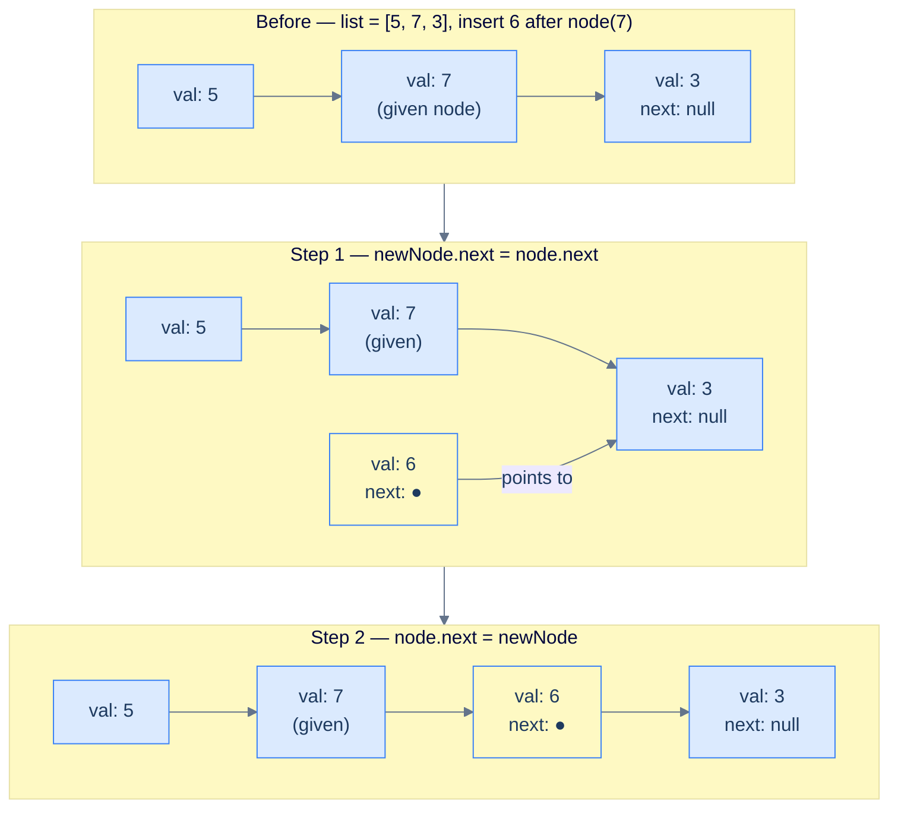

# 3. Insertion in Singly Linked Lists

## The Hook

In an array, "insert" is a lie. You don't actually insert — you **shift**. Every element past the insertion point slides one slot to the right, a cascade of memory writes that grows with the array. That's why `list.insert(0, x)` in Python on a million-element list is *slow* and `list.append(x)` is fast: one is an O(n) shift, the other is an O(1) write.

Linked lists flip the script. Insert at the head? **Two pointer assignments. O(1).** Doesn't matter if the list has 10 nodes or 10 million. What you give up is random access — inserting in the *middle* still requires walking there first. The entire zoo of "insert at X" problems in this lesson comes down to one question: **where do we already have a pointer?** If it's the head, insertion is O(1). If it's somewhere in the middle, we pay O(n) to walk, then O(1) to splice.

Five variations follow — head, tail, after-given, before-given, at-distance. They all reduce to the same three-line splice: **create a node, link it into its successor, link its predecessor to it**. Master the splice once, and every insertion problem you'll ever face is solved.

---

## Table of contents

1. [Understanding insertion at beginning](#understanding-insertion-at-beginning)
2. [Insert at beginning](#insert-at-beginning)
3. [Understanding insertion at end](#understanding-insertion-at-end)
4. [Insert at end](#insert-at-end)
5. [Understanding insertion after the given node](#understanding-insertion-after-the-given-node)
6. [Insert after the given node](#insert-after-the-given-node)
7. [Understanding insertion before the given node](#understanding-insertion-before-the-given-node)
8. [Insert before the given node](#insert-before-the-given-node)
9. [Understanding insertion at a given distance](#understanding-insertion-at-a-given-distance)
10. [Insert at given distance](#insert-at-given-distance)

***

# Understanding insertion at beginning

Inserting at the beginning of a linked list is a fundamental and commonly used operation. It is an efficient method, especially when extending a list, and requires only a few lines of code to implement. When designing an algorithm for any data structure, it's important not to make assumptions about its underlying characteristics and to design the logic for a general case. With that in mind, there are two cases to consider when inserting at the beginning of a singly linked list.

## 1\. The list is empty

In this scenario, if the linked list is empty, the **head** would be `null`. We need to initialize the **head** node of the linked list and ensure that the pointer of this newly created **head** node is `null`, as this new node will also be the last node of the list.

```d2
direction: right

before: "Before — empty list" {
  h1: "head = null" {shape: oval}
}

after: "After — insert val=6" {
  direction: right
  h2: head {shape: oval}
  n: {
    val: 6
    next: "null"
    style.fill: "#dcfce7"
    style.stroke: "#16a34a"
  }
  h2 -> n.val
}

before -> after: "create new node,\nhead = newNode"
```

<p align="center"><strong>Case 1 — empty list: create a single node and make it the head; its <code>next</code> is <code>null</code> since it is also the tail.</strong></p>

> **Algorithm**
>
> -   **Step 1:** Create a new node with the given data.
> -   **Step 2:** Set the new node's `next` pointer to `null` since it's the only node.
> -   **Step 3:** Return the new node, as this node is also the **head** node.

## 2\. The list is not empty

In this scenario, we already have some data in the linked list, so the **head** is not `null`. Therefore, to insert a new node at the beginning of the list, we need to update the pointer of the newly created node to store the reference of the existing **head** node.

```d2
direction: right

before: "Before — list = [5, 7, 3]" {
  direction: right
  h: head {shape: oval}
  b1: {val: 5; next}
  b2: {val: 7; next}
  b3: {val: 3; next: "null"}
  h -> b1.val
  b1.next -> b2.val
  b2.next -> b3.val
}

after: "After — insert val=6 at beginning" {
  direction: right
  h: head {shape: oval}
  new: {
    val: 6
    next
    style.fill: "#dcfce7"
    style.stroke: "#16a34a"
  }
  c1: {val: 5; next}
  c2: {val: 7; next}
  c3: {val: 3; next: "null"}
  h -> new.val
  new.next -> c1.val
  c1.next -> c2.val
  c2.next -> c3.val
}

before -> after: "newNode.next = head\nhead = newNode"
```

<p align="center"><strong>Case 2 — non-empty list: point the new node's <code>next</code> to the old head, then make the new node the new head.</strong></p>

> **Algorithm**
>
> -   **Step 1:** Create a new node with the given data.
> -   **Step 2:** Set the new node's `next` pointer to hold the reference of the current head.
> -   **Step 3:** Return the new node, as this is the new head.

## Implementation

When implementing the logic for the insert at the beginning operation, we consider both possible cases and write the code for each in conditional blocks.


```pseudocode
function insertAtBeginning(head, data):
    newNode ← new ListNode(data)
    if head is null:
        newNode.next ← null                            # only node — also the tail
        return newNode
    newNode.next ← head                                # new node points to old head
    return newNode                                     # new node is now the head
```

```python run
from typing import Optional

class ListNode:
    def __init__(self, val=0, next=None):
        self.val = val; self.next = next

class Solution:
    def insert_at_beginning(self, head: Optional['ListNode'], data: int) -> 'ListNode':
        new_node = ListNode(data)

        if head is None:
            new_node.next = None  # Only node — also the tail
            return new_node

        new_node.next = head  # New node points to old head
        return new_node       # New node is now the head

# --- test ---
n3=ListNode(3); n2=ListNode(7,n3); n1=ListNode(5,n2)
head = Solution().insert_at_beginning(n1, 6)
vals = []
cur = head
while cur: vals.append(cur.val); cur = cur.next
print(vals)  # [6, 5, 7, 3]
```

```java run
public class Main {
    static class ListNode { int val; ListNode next; ListNode(int v){val=v;} }

    static ListNode insertAtBeginning(ListNode head, int data) {
        ListNode newNode = new ListNode(data);
        if (head == null) { newNode.next = null; return newNode; }
        newNode.next = head;  // New node points to old head
        return newNode;       // New node is now the head
    }

    public static void main(String[] args) {
        ListNode n1=new ListNode(5),n2=new ListNode(7),n3=new ListNode(3);
        n1.next=n2; n2.next=n3;
        ListNode head = insertAtBeginning(n1, 6);
        for (ListNode c=head; c!=null; c=c.next) System.out.print(c.val+" ");
        // 6 5 7 3
    }
}
```

```c run
#include <stdio.h>
#include <stdlib.h>

typedef struct ListNode { int val; struct ListNode *next; } ListNode;
ListNode* newNode(int v){ ListNode*n=malloc(sizeof*n); n->val=v; n->next=NULL; return n; }

ListNode* insertAtBeginning(ListNode *head, int data) {
    ListNode *newNode = newNode(data);
    if (head == NULL) { newNode->next = NULL; return newNode; }
    newNode->next = head;  /* New node points to old head */
    return newNode;        /* New node is now the head */
}

int main() {
    ListNode *n1=newNode(5),*n2=newNode(7),*n3=newNode(3);
    n1->next=n2; n2->next=n3;
    ListNode *head = insertAtBeginning(n1, 6);
    for (ListNode *c=head; c!=NULL; c=c->next) printf("%d ", c->val);
    /* 6 5 7 3 */
    return 0;
}
```

```scala run
class ListNode(var v: Int, var next: ListNode = null)

object Main extends App {
  def insertAtBeginning(head: ListNode, data: Int): ListNode = {
    val newNode = new ListNode(data)
    if (head == null) { newNode.next = null; return newNode }
    newNode.next = head  // New node points to old head
    newNode              // New node is now the head
  }

  val n3=new ListNode(3); val n2=new ListNode(7,n3); val n1=new ListNode(5,n2)
  var head = insertAtBeginning(n1, 6)
  while (head != null) { print(s"${head.v} "); head = head.next }  // 6 5 7 3
}
```


## Complexity Analysis

The time complexity of the above function does not depend on the list size. In all cases, we always need to insert the node at the start of the list, which takes **constant** time, i.e., **O(1)**.

```d2
direction: right
new: |md
  **New node**

  val: 6
| {style.fill: "#dcfce7"; style.stroke: "#16a34a"}
n1: "val: 5"
n2: "val: 7"
n3: |md
  val: 3

  `next: null`
|
new -> n1: "newNode.next = head\nhead = newNode\n— 2 pointer ops, O(1)"
n1 -> n2
n2 -> n3
```

<p align="center"><strong>Insert before the head node — only 2 pointer assignments needed, regardless of list size: always O(1) time.</strong></p>

The space complexity of the function is also **O(1)** because it only creates a single new node and does not use any additional data structures.

> **Best Case**
>
> -   Space Complexity - **O(1)**
> -   Time Complexity - **O(1)**
>
> **Worst Case**
>
> -   Space Complexity - **O(1)**
> -   Time Complexity - **O(1)**

***

# Insert at beginning

## Problem Statement

Given the **head** of a singly linked list and a **data** value, write a function to insert a new node with the given data value at the beginning of the linked list and return the head of the updated list.

### Example

> -   **Input:** head = \[5, 7, 3, 10\], data = 6
> -   **Output:** \[6, 5, 7, 3, 10\]

## Solution


```pseudocode
function insertAtBeginning(head, data):
    # Create a new node with the given data
    newNode ← new ListNode(data)

    # If the list is empty (head is null)
    if head is null:

        # Set the next pointer to null since it's the only node
        newNode.next ← null

        # Return the newNode as this is the new head
        return newNode

    # Set the next pointer of the new node to the current head,
    # making the new node the new head
    newNode.next ← head

    # Return the newNode as this is the new head
    return newNode
```

```python run
class ListNode:
    def __init__(self, val=0, next=None):
        self.val = val; self.next = next

class Solution:
    def insert_at_beginning(self, head, data):

        # Create a new node with the given data
        new_node = ListNode(data)

        # If the list is empty (head is None)
        if head is None:

            # Set the next pointer to None since it's the only node
            new_node.next = None

            # Return the new_node as this is the new head
            return new_node

        # Set the next pointer of the new node to the current head,
        # making the new node the new head
        new_node.next = head

        # Return the new_node as this is the new head
        return new_node

n4=ListNode(10); n3=ListNode(3,n4); n2=ListNode(7,n3); n1=ListNode(5,n2)
head = Solution().insert_at_beginning(n1, 6)
vals=[]; cur=head
while cur: vals.append(cur.val); cur=cur.next
print(vals)  # [6, 5, 7, 3, 10]
```

```java run
public class Main {
    static class ListNode { int val; ListNode next; ListNode(int v){val=v;} }

    static ListNode insertAtBeginning(ListNode head, int data) {

        // Create a new node with the given data
        ListNode newNode = new ListNode(data);

        // If the list is empty (head is null)
        if (head == null) {

            // Set the next pointer to null since it's the only node
            newNode.next = null;

            // Return the newNode as this is the new head
            return newNode;
        }

        // Set the next pointer of the new node to the current head,
        // making the new node the new head
        newNode.next = head;

        // Return the newNode as this is the new head
        return newNode;
    }

    public static void main(String[] args) {
        ListNode n1=new ListNode(5),n2=new ListNode(7),
                 n3=new ListNode(3),n4=new ListNode(10);
        n1.next=n2; n2.next=n3; n3.next=n4;
        ListNode head = insertAtBeginning(n1, 6);
        for (ListNode c=head;c!=null;c=c.next) System.out.print(c.val+" ");
        // 6 5 7 3 10
    }
}
```

```c run
#include <stdio.h>
#include <stdlib.h>

typedef struct ListNode { int val; struct ListNode *next; } ListNode;
ListNode* newNode(int v){ ListNode*n=malloc(sizeof*n); n->val=v; n->next=NULL; return n; }

ListNode* insertAtBeginning(ListNode *head, int data) {

    /* Create a new node with the given data */
    ListNode *newN = newNode(data);

    /* If the list is empty (head is NULL) */
    if (head == NULL) {

        /* Set the next pointer to NULL since it's the only node */
        newN->next = NULL;

        /* Return the newNode as this is the new head */
        return newN;
    }

    /* Set the next pointer of the new node to the current head,
       making the new node the new head */
    newN->next = head;

    /* Return the newNode as this is the new head */
    return newN;
}

int main() {
    ListNode *n1=newNode(5),*n2=newNode(7),*n3=newNode(3),*n4=newNode(10);
    n1->next=n2; n2->next=n3; n3->next=n4;
    ListNode *head = insertAtBeginning(n1, 6);
    for (ListNode *c=head;c;c=c->next) printf("%d ",c->val);  /* 6 5 7 3 10 */
    return 0;
}
```

```scala run
class ListNode(var v: Int, var next: ListNode = null)

object Main extends App {
  def insertAtBeginning(head: ListNode, data: Int): ListNode = {

    // Create a new node with the given data
    val newNode = new ListNode(data)

    // If the list is empty (head is null)
    if (head == null) {

      // Set the next pointer to null since it's the only node
      newNode.next = null

      // Return the newNode as this is the new head
      return newNode
    }

    // Set the next pointer of the new node to the current head,
    // making the new node the new head
    newNode.next = head

    // Return the newNode as this is the new head
    newNode
  }

  val n4=new ListNode(10); val n3=new ListNode(3,n4)
  val n2=new ListNode(7,n3); val n1=new ListNode(5,n2)
  var head = insertAtBeginning(n1, 6)
  while (head!=null) { print(s"${head.v} "); head=head.next }  // 6 5 7 3 10
}
```


***

# Understanding insertion at end

Inserting at the end of a list is a common operation used to extend the list. Unlike insertion at the beginning, this operation adds a new node at the end of the list. To add a new node at the end of a singly linked list, we first need to locate the tail node of the linked list. Then, we can create a new node and update the pointer of the tail node to point to the newly created node. Since we need to traverse the entire list to insert the new node, this operation is not as efficient as insertion at the beginning. When inserting at the end of a singly linked list, there are two cases to consider.

## 1\. The list is empty

If the linked list is empty, the **head** is `null`. We create a new node and make it the head — it is also the tail since it's the only node.

```d2
direction: right

before: "Before — empty list" {
  h1: "head = null" {shape: oval}
}

after: "After — insert val=6" {
  direction: right
  h2: head {shape: oval}
  n: {
    val: 6
    next: "null"
    style.fill: "#dcfce7"
    style.stroke: "#16a34a"
  }
  h2 -> n.val
}

before -> after: "create new node,\nhead = newNode"
```

<p align="center"><strong>Case 1 — empty list: the new node becomes both head and tail.</strong></p>

> **Algorithm**
>
> -   **Step 1:** Create a new node with the given data.
> -   **Step 2:** Set the new node's `next` pointer to `null`.
> -   **Step 3:** Return the new node as the head.

## 2\. The list is not empty

We traverse to the last node (whose `next` is `null`) and link the new node after it.

```d2
direction: right

before: "Before — list = [5, 7, 3]" {
  direction: right
  b1: "val: 5"
  b2: "val: 7"
  b3: |md
    val: 3

    `next: null`
  |
  b1 -> b2 -> b3
}

after: "After — insert val=6 at end" {
  direction: right
  c1: "val: 5"
  c2: "val: 7"
  c3: "val: 3"
  new: {
    val: 6
    next: "null"
    style.fill: "#dcfce7"
    style.stroke: "#16a34a"
  }
  c1 -> c2 -> c3 -> new.val
}

before -> after: "traverse to tail,\ntail.next = newNode"
```

<p align="center"><strong>Case 2 — non-empty list: traverse to the tail, then set <code>tail.next = newNode</code>.</strong></p>

> **Algorithm**
>
> -   **Step 1:** Create a new node with the given data.
> -   **Step 2:** Traverse the list until `current.next == null` (current is the tail).
> -   **Step 3:** Set `current.next = newNode`.
> -   **Step 4:** Return the original head.

## Implementation


```pseudocode
function insertAtEnd(head, data):
    newNode ← new ListNode(data)
    if head is null:
        return newNode                                 # empty list → new node is the head
    current ← head
    while current.next is not null:                    # walk to the tail
        current ← current.next
    current.next ← newNode                             # attach after tail
    return head
```

```python run
class ListNode:
    def __init__(self, val=0, next=None):
        self.val = val; self.next = next

class Solution:
    def insert_at_end(self, head, data):
        new_node = ListNode(data)
        if head is None:
            return new_node   # Empty list — new node becomes head

        current = head
        while current.next is not None:   # Walk to the tail
            current = current.next
        current.next = new_node           # Attach after tail
        return head

n3=ListNode(3); n2=ListNode(7,n3); n1=ListNode(5,n2)
head = Solution().insert_at_end(n1, 6)
vals=[]; cur=head
while cur: vals.append(cur.val); cur=cur.next
print(vals)  # [5, 7, 3, 6]
```

```java run
public class Main {
    static class ListNode { int val; ListNode next; ListNode(int v){val=v;} }

    static ListNode insertAtEnd(ListNode head, int data) {
        ListNode newNode = new ListNode(data);
        if (head == null) return newNode;

        ListNode current = head;
        while (current.next != null) current = current.next;  // Walk to tail
        current.next = newNode;  // Attach after tail
        return head;
    }

    public static void main(String[] args) {
        ListNode n1=new ListNode(5),n2=new ListNode(7),n3=new ListNode(3);
        n1.next=n2; n2.next=n3;
        ListNode head = insertAtEnd(n1, 6);
        for (ListNode c=head;c!=null;c=c.next) System.out.print(c.val+" ");
        // 5 7 3 6
    }
}
```

```c run
#include <stdio.h>
#include <stdlib.h>

typedef struct ListNode { int val; struct ListNode *next; } ListNode;
ListNode* newNode(int v){ ListNode*n=malloc(sizeof*n); n->val=v; n->next=NULL; return n; }

ListNode* insertAtEnd(ListNode *head, int data) {
    ListNode *node = newNode(data);
    if (head == NULL) return node;

    ListNode *current = head;
    while (current->next != NULL) current = current->next;  /* Walk to tail */
    current->next = node;  /* Attach after tail */
    return head;
}

int main() {
    ListNode *n1=newNode(5),*n2=newNode(7),*n3=newNode(3);
    n1->next=n2; n2->next=n3;
    ListNode *head = insertAtEnd(n1, 6);
    for (ListNode *c=head;c;c=c->next) printf("%d ",c->val);  /* 5 7 3 6 */
    return 0;
}
```

```scala run
class ListNode(var v: Int, var next: ListNode = null)

object Main extends App {
  def insertAtEnd(head: ListNode, data: Int): ListNode = {
    val newNode = new ListNode(data)
    if (head == null) return newNode

    var current = head
    while (current.next != null) current = current.next  // Walk to tail
    current.next = newNode  // Attach after tail
    head
  }

  val n3=new ListNode(3); val n2=new ListNode(7,n3); val n1=new ListNode(5,n2)
  var head = insertAtEnd(n1, 6)
  while (head!=null) { print(s"${head.v} "); head=head.next }  // 5 7 3 6
}
```


## Complexity Analysis

To insert at the end, we must traverse the entire list to reach the tail node.

```d2
direction: right
n1: "val: 5"
n2: "val: 7"
n3: |md
  val: 3

  `next: null`

  (tail)
|
new: {
  val: 6
  next: "null"
  style.fill: "#dcfce7"
  style.stroke: "#16a34a"
}
n1 -> n2 -> n3
n3 -> new.val: "tail.next = newNode"

cur: "current\ntraverses n nodes" {shape: oval}
cur -> n3: "O(n) walk" {style.stroke-dash: 3}
```

<p align="center"><strong>Insert after the tail node — O(n) traversal to reach the tail, then O(1) pointer update.</strong></p>

> **Best Case / Worst Case**
>
> -   Space Complexity - **O(1)**
> -   Time Complexity - **O(n)**

***

# Insert at end

## Problem Statement

Given the **head** of a singly linked list and a **data** value, write a function to insert a new node with the given data value at the end of the linked list and return the head of the updated list.

### Example

> -   **Input:** head = \[5, 7, 3, 10\], data = 6
> -   **Output:** \[5, 7, 3, 10, 6\]

## Solution


```pseudocode
function insertAtEnd(head, data):
    # Create a new node with the given data
    newNode ← new ListNode(data)

    # If the list is empty
    if head is null:

        # Set the next pointer of the new node to null
        newNode.next ← null

        # Return the new node as the new head of the list
        return newNode

    # Traverse the list to find the last node
    current ← head
    while current is not null AND current.next is not null:
        current ← current.next

    # Set the next pointer of the new node to null
    newNode.next ← null

    # Link the last node to the new node
    current.next ← newNode

    # Return the original head of the list
    return head
```

```python run
class ListNode:
    def __init__(self, val=0, next=None):
        self.val = val; self.next = next

class Solution:
    def insert_at_end(self, head, data):

        # Create a new node with the given data
        new_node = ListNode(data)

        # If the list is empty
        if head is None:

            # Set the next pointer of the new node to None
            new_node.next = None

            # Return the new node as the new head of the list
            return new_node

        # Traverse the list to find the last node
        current = head
        while current is not None and current.next is not None:
            current = current.next

        # Set the next pointer of the new node to None
        new_node.next = None

        # Link the last node to the new node
        if current:
            current.next = new_node

        # Return the original head of the list
        return head

n4=ListNode(10); n3=ListNode(3,n4); n2=ListNode(7,n3); n1=ListNode(5,n2)
head = Solution().insert_at_end(n1, 6)
vals=[]; cur=head
while cur: vals.append(cur.val); cur=cur.next
print(vals)  # [5, 7, 3, 10, 6]
```

```java run
public class Main {
    static class ListNode { int val; ListNode next; ListNode(int v){val=v;} }

    static ListNode insertAtEnd(ListNode head, int data) {

        // Create a new node with the given data
        ListNode newNode = new ListNode(data);

        // If the list is empty
        if (head == null) {

            // Set the next pointer of the new node to null
            newNode.next = null;

            // Return the new node as the new head of the list
            return newNode;
        }

        // Traverse the list to find the last node
        ListNode current = head;
        while (current != null && current.next != null) {
            current = current.next;
        }

        // Set the next pointer of the new node to null
        newNode.next = null;

        // Link the last node to the new node
        current.next = newNode;

        // Return the original head of the list
        return head;
    }

    public static void main(String[] args) {
        ListNode n1=new ListNode(5),n2=new ListNode(7),
                 n3=new ListNode(3),n4=new ListNode(10);
        n1.next=n2; n2.next=n3; n3.next=n4;
        ListNode head = insertAtEnd(n1, 6);
        for (ListNode c=head;c!=null;c=c.next) System.out.print(c.val+" ");
        // 5 7 3 10 6
    }
}
```

```c run
#include <stdio.h>
#include <stdlib.h>

typedef struct ListNode { int val; struct ListNode *next; } ListNode;
ListNode* newNode(int v){ ListNode*n=malloc(sizeof*n); n->val=v; n->next=NULL; return n; }

ListNode* insertAtEnd(ListNode *head, int data) {

    /* Create a new node with the given data */
    ListNode *newN = newNode(data);

    /* If the list is empty */
    if (head == NULL) {

        /* Set the next pointer of the new node to NULL */
        newN->next = NULL;

        /* Return the new node as the new head of the list */
        return newN;
    }

    /* Traverse the list to find the last node */
    ListNode *current = head;
    while (current != NULL && current->next != NULL) {
        current = current->next;
    }

    /* Set the next pointer of the new node to NULL */
    newN->next = NULL;

    /* Link the last node to the new node */
    current->next = newN;

    /* Return the original head of the list */
    return head;
}

int main() {
    ListNode *n1=newNode(5),*n2=newNode(7),*n3=newNode(3),*n4=newNode(10);
    n1->next=n2; n2->next=n3; n3->next=n4;
    ListNode *head = insertAtEnd(n1, 6);
    for (ListNode *c=head;c;c=c->next) printf("%d ",c->val);  /* 5 7 3 10 6 */
    return 0;
}
```

```scala run
class ListNode(var v: Int, var next: ListNode = null)

object Main extends App {
  def insertAtEnd(head: ListNode, data: Int): ListNode = {

    // Create a new node with the given data
    val newNode = new ListNode(data)

    // If the list is empty
    if (head == null) {

      // Set the next pointer of the new node to null
      newNode.next = null

      // Return the new node as the new head of the list
      return newNode
    }

    // Traverse the list to find the last node
    var current = head
    while (current != null && current.next != null) {
      current = current.next
    }

    // Set the next pointer of the new node to null
    newNode.next = null

    // Link the last node to the new node
    current.next = newNode

    // Return the original head of the list
    head
  }

  val n4=new ListNode(10); val n3=new ListNode(3,n4)
  val n2=new ListNode(7,n3); val n1=new ListNode(5,n2)
  var head = insertAtEnd(n1, 6)
  while (head!=null) { print(s"${head.v} "); head=head.next }  // 5 7 3 10 6
}
```


***

# Understanding insertion after the given node

Inserting after a given node in a singly linked list is a relatively straightforward operation. Unlike arrays, we can insert data at any point in a linked list without recreating the entire list. When inserting after a node in a linked list, there are two cases to consider.

## 1\. The list is empty

If the list is empty and contains no elements, we cannot find the given node because it does not exist within the list. Inserting a new node after the given node is not possible because there is no reference point within the list to perform the insertion. In such a case, the method would return without making any changes.

```d2
direction: right
n1: "node = null" {shape: oval}
n2: "head = null" {shape: oval}
n3: "Return — nothing to do" {shape: oval; style.fill: "#fee2e2"; style.stroke: "#dc2626"}
n1 -> n3
n2 -> n3
```

<p align="center"><strong>Case 1 — empty list or null node: the function returns immediately with no changes.</strong></p>

> **Algorithm**
>
> -   **Step 1:** Return from the function.

## 2\. The list is not empty

Since the new node will be inserted between two existing nodes, we must ensure that we properly set up the pointers of these nodes. Inserting after a given node is a three-step process.



<p align="center"><strong>Case 2 — non-empty list: bridge the new node in by wiring its <code>next</code> first, then redirecting the given node.</strong></p>

> **Algorithm**
>
> -   **Step 1:** Create a new node with the given data.
> -   **Step 2:** Set the `next` pointer of the new node to hold the node's reference stored in the `next` pointer of the `given` node.
> -   **Step 3:** Set the `next` pointer of the `given` node to hold the reference of the new node.

## Implementation

We will be given the node, after which we will perform the insertion. When implementing the logic for the operation, we consider both possible cases and write the code for each in conditional blocks.


```pseudocode
# Splice newNode between `node` and `node.next` — O(1), no traversal needed.
function insertAfterTheGivenNode(node, data):
    if node is null:
        return                                         # no reference point — nothing to do
    newNode ← new ListNode(data)
    newNode.next ← node.next                           # bridge: new node points to what came after
    node.next ← newNode                                # given node now points to new node
```

```python run
class ListNode:
    def __init__(self, val=0, next=None):
        self.val = val; self.next = next

class Solution:
    def insert_after_the_given_node(self, node, data):
        if node is None:  # No reference point — nothing to do
            return

        new_node = ListNode(data)
        new_node.next = node.next  # Bridge: new node points to what came after given
        node.next = new_node       # Given node now points to new node

n4=ListNode(10); n3=ListNode(3,n4); n2=ListNode(7,n3); n1=ListNode(5,n2)
Solution().insert_after_the_given_node(n2, 6)  # Insert 6 after node(7)
vals=[]; cur=n1
while cur: vals.append(cur.val); cur=cur.next
print(vals)  # [5, 7, 6, 3, 10]
```

```java run
public class Main {
    static class ListNode { int val; ListNode next; ListNode(int v){val=v;} }

    static void insertAfterTheGivenNode(ListNode node, int data) {
        if (node == null) return;  // No reference point — nothing to do

        ListNode newNode = new ListNode(data);
        newNode.next = node.next;  // Bridge: new node points to what came after given
        node.next = newNode;       // Given node now points to new node
    }

    public static void main(String[] args) {
        ListNode n1=new ListNode(5),n2=new ListNode(7),
                 n3=new ListNode(3),n4=new ListNode(10);
        n1.next=n2; n2.next=n3; n3.next=n4;
        insertAfterTheGivenNode(n2, 6);  // Insert 6 after node(7)
        for (ListNode c=n1;c!=null;c=c.next) System.out.print(c.val+" ");
        // 5 7 6 3 10
    }
}
```

```c run
#include <stdio.h>
#include <stdlib.h>

typedef struct ListNode { int val; struct ListNode *next; } ListNode;
ListNode* newNode(int v){ ListNode*n=malloc(sizeof*n); n->val=v; n->next=NULL; return n; }

void insertAfterTheGivenNode(ListNode *node, int data) {
    if (!node) return;  /* No reference point — nothing to do */

    ListNode *newN = newNode(data);
    newN->next = node->next;  /* Bridge: new node points to what came after given */
    node->next = newN;        /* Given node now points to new node */
}

int main() {
    ListNode *n1=newNode(5),*n2=newNode(7),*n3=newNode(3),*n4=newNode(10);
    n1->next=n2; n2->next=n3; n3->next=n4;
    insertAfterTheGivenNode(n2, 6);  /* Insert 6 after node(7) */
    for (ListNode *c=n1;c;c=c->next) printf("%d ",c->val);  /* 5 7 6 3 10 */
    return 0;
}
```

```scala run
class ListNode(var v: Int, var next: ListNode = null)

object Main extends App {
  def insertAfterTheGivenNode(node: ListNode, data: Int): Unit = {
    if (node == null) return  // No reference point — nothing to do

    val newNode = new ListNode(data)
    newNode.next = node.next  // Bridge: new node points to what came after given
    node.next = newNode       // Given node now points to new node
  }

  val n4=new ListNode(10); val n3=new ListNode(3,n4)
  val n2=new ListNode(7,n3); val n1=new ListNode(5,n2)
  insertAfterTheGivenNode(n2, 6)  // Insert 6 after node(7)
  var cur = n1
  while (cur!=null) { print(s"${cur.v} "); cur=cur.next }  // 5 7 6 3 10
}
```


**Will changing the order of these operations have any effect on the outcome?**

It is crucial to update the newly created node **before** modifying the pointer of the given node. If we modify the given node first, we will lose the reference to the next node in the chain — `node.next = newNode` overwrites the only pointer to the rest of the list, making `newNode.next = node.next` store a self-reference instead.

## Complexity Analysis

The time complexity of the above function is not affected by the length of the linked list because it only involves inserting a new node after the given node and performing pointer manipulations around the given node. Since these operations take constant time, the function's time complexity is **O(1)**.

```d2
direction: right
n1: "val: 5"
given: |md
  val: 7

  (given node)
|
new: {
  val: 6
  next
  style.fill: "#dcfce7"
  style.stroke: "#16a34a"
}
n3: "val: 3"
n4: |md
  val: 10

  `next: null`
|
n1 -> given -> new.val
new.next -> n3
n3 -> n4

note: "Only 2 pointer ops\nO(1) — no traversal" {shape: oval}
note -> given: "" {style.stroke-dash: 3}
```

<p align="center"><strong>Insert after the given node — only 2 pointer assignments regardless of list size: always O(1) time.</strong></p>

The function's space complexity is **O(1)** because it only creates a single new node and does not use any additional data structures.

> **Best Case / Worst Case**
>
> -   Space Complexity - **O(1)**
> -   Time Complexity - **O(1)**

***

# Insert after the given node

## Problem Statement

Given a reference to a **random node** in a singly linked list and a **data** value, write a function to insert a new node with the given data value after the given node.

### Example

> -   **Input:** head = \[5, 7, 3, 10\], node = 7, data = 6
> -   **Output:** \[5, 7, 6, 3, 10\]

## Solution


```pseudocode
function insertAfterTheGivenNode(node, data):
    # Check if the given node is null
    if node is null:

        # If the given node is null, there is nothing to do
        return

    # Create a new node with the provided data
    newNode ← new ListNode(data)

    # Set the next pointer of the new node to the next pointer of
    # the given node
    newNode.next ← node.next

    # Set the next pointer of the given node to the new node
    node.next ← newNode
```

```python run
class ListNode:
    def __init__(self, val=0, next=None):
        self.val = val; self.next = next

class Solution:
    def insert_after_the_given_node(self, node, data):

        # Check if the given node is None
        if node is None:

            # If the given node is None, there is nothing to do
            return

        # Create a new node with the provided data
        new_node = ListNode(data)

        # Set the next pointer of the new node to the next pointer of
        # the given node
        new_node.next = node.next

        # Set the next pointer of the given node to the new node
        node.next = new_node

n4=ListNode(10); n3=ListNode(3,n4); n2=ListNode(7,n3); n1=ListNode(5,n2)
Solution().insert_after_the_given_node(n2, 6)
vals=[]; cur=n1
while cur: vals.append(cur.val); cur=cur.next
print(vals)  # [5, 7, 6, 3, 10]
```

```java run
public class Main {
    static class ListNode { int val; ListNode next; ListNode(int v){val=v;} }

    static void insertAfterTheGivenNode(ListNode node, int data) {

        // Check if the given node is null
        if (node == null) {

            // If the given node is null, there is nothing to do
            return;
        }

        // Create a new node with the provided data
        ListNode newNode = new ListNode(data);

        // Set the next pointer of the new node to the next pointer of
        // the given node
        newNode.next = node.next;

        // Set the next pointer of the given node to the new node
        node.next = newNode;
    }

    public static void main(String[] args) {
        ListNode n1=new ListNode(5),n2=new ListNode(7),
                 n3=new ListNode(3),n4=new ListNode(10);
        n1.next=n2; n2.next=n3; n3.next=n4;
        insertAfterTheGivenNode(n2, 6);
        for (ListNode c=n1;c!=null;c=c.next) System.out.print(c.val+" ");
        // 5 7 6 3 10
    }
}
```

```c run
#include <stdio.h>
#include <stdlib.h>

typedef struct ListNode { int val; struct ListNode *next; } ListNode;
ListNode* newNode(int v){ ListNode*n=malloc(sizeof*n); n->val=v; n->next=NULL; return n; }

void insertAfterTheGivenNode(ListNode *node, int data) {

    /* Check if the given node is NULL */
    if (node == NULL) {

        /* If the given node is NULL, there is nothing to do */
        return;
    }

    /* Create a new node with the provided data */
    ListNode *newN = newNode(data);

    /* Set the next pointer of the new node to the next pointer of
       the given node */
    newN->next = node->next;

    /* Set the next pointer of the given node to the new node */
    node->next = newN;
}

int main() {
    ListNode *n1=newNode(5),*n2=newNode(7),*n3=newNode(3),*n4=newNode(10);
    n1->next=n2; n2->next=n3; n3->next=n4;
    insertAfterTheGivenNode(n2, 6);
    for (ListNode *c=n1;c;c=c->next) printf("%d ",c->val);  /* 5 7 6 3 10 */
    return 0;
}
```

```scala run
class ListNode(var v: Int, var next: ListNode = null)

object Main extends App {
  def insertAfterTheGivenNode(node: ListNode, data: Int): Unit = {

    // Check if the given node is null
    if (node == null) {

      // If the given node is null, there is nothing to do
      return
    }

    // Create a new node with the provided data
    val newNode = new ListNode(data)

    // Set the next pointer of the new node to the next pointer of
    // the given node
    newNode.next = node.next

    // Set the next pointer of the given node to the new node
    node.next = newNode
  }

  val n4=new ListNode(10); val n3=new ListNode(3,n4)
  val n2=new ListNode(7,n3); val n1=new ListNode(5,n2)
  insertAfterTheGivenNode(n2, 6)
  var cur = n1
  while (cur!=null) { print(s"${cur.v} "); cur=cur.next }  // 5 7 6 3 10
}
```


***

# Understanding insertion before the given node

Inserting before a given node may seem simple, just like inserting after a node. However, upon closer observation, it is not that straightforward because we don't have access to the node one step before where the new node is inserted. In the previous lesson about inserting after a given node, the given node itself was the previous node, as the new node was inserted after the given node. In this case, however, the given node acts as the next node, and the node before the given node is what needs to be changed. Let's examine the cases we need to consider.

## 1\. The list is empty

If the list is empty and contains no elements, we cannot find the given node because it does not exist within the list. Inserting a new node before the given node is not possible. In such a case, we return the **head** node as-is.

```d2
direction: right
h: "head = null" {shape: oval}
r: "Return head — nothing to do" {shape: oval; style.fill: "#fee2e2"; style.stroke: "#dc2626"}
h -> r
```

<p align="center"><strong>Case 1 — empty list: return the head immediately with no changes.</strong></p>

> **Algorithm**
>
> -   **Step 1:** Return the original head node.

## 2\. The given node is the first node

This is similar to **inserting at the beginning**, which we learned earlier. To determine if the given node is the first node, we compare it to the **head** node. If both are the same object, the given node is the head.

```d2
direction: right

before: "Before — node == head" {
  direction: right
  h: head {shape: oval}
  b1: |md
    val: 7

    (given)
  |
  b2: "val: 3"
  b3: |md
    val: 10

    `next: null`
  |
  h -> b1 -> b2 -> b3
}

after: "After — insert val=6 before node(7)" {
  direction: right
  h: head {shape: oval}
  new: {
    val: 6
    next
    style.fill: "#dcfce7"
    style.stroke: "#16a34a"
  }
  c1: |md
    val: 7

    (given)
  |
  c2: "val: 3"
  c3: |md
    val: 10

    `next: null`
  |
  h -> new.val
  new.next -> c1
  c1 -> c2 -> c3
}

before -> after: "newNode.next = head\nreturn newNode"
```

<p align="center"><strong>Case 2 — given node is the head: same as insert-at-beginning; the new node becomes the new head.</strong></p>

> **Algorithm**
>
> -   **Step 1:** Create a new node with the given data.
> -   **Step 2:** Set the new node's `next` pointer to hold the reference of the current head.
> -   **Step 3:** Return the new node, as this is the new head.

## 3\. The given node is not the first node

This case is not easy, but it becomes simpler once we understand the concept behind it. The problem is that we don't have a reference to the node just before the given node. Without that predecessor, we can't rewire its `next` pointer after inserting.

```d2
problem: "Problem — no predecessor reference" {
  direction: right
  p1: "val: 5"
  p2: "val: 7"
  p3: |md
    val: 3

    (given)
  | {style.fill: "#fde68a"; style.stroke: "#d97706"}
  p4: |md
    val: 10

    `next: null`
  |
  p1 -> p2 -> p3 -> p4
  q: "We want to insert\nBEFORE node(3)\nbut who points to it?" {shape: oval}
  q -> p3: "" {style.stroke-dash: 3}
}
```

<p align="center"><strong>The challenge: we have a reference to the given node but not to the node before it — that predecessor is the one whose pointer must change.</strong></p>

**How do we get the reference of the previous node?**

We create a `previous` pointer initialised to `null`. As we traverse, we update both `current` and `previous` together at each step. When `current` reaches the given node, `previous` holds its predecessor. The problem then reduces to **inserting after the previous node** — which we already know how to do.

```d2
direction: right

before: "Before — list = [5, 7, 3, 10], insert 6 before node(3)" {
  direction: right
  b1: "val: 5"
  b2: "val: 7"
  b3: |md
    val: 3

    (given)
  |
  b4: |md
    val: 10

    `next: null`
  |
  b1 -> b2 -> b3 -> b4
  pr: previous {shape: oval}
  cr: current {shape: oval}
  pr -> b2: "" {style.stroke-dash: 3}
  cr -> b3: "" {style.stroke-dash: 3}
}

after: "After — previous.next rewired through new node" {
  direction: right
  c1: "val: 5"
  c2: "val: 7"
  new: {
    val: 6
    next
    style.fill: "#dcfce7"
    style.stroke: "#16a34a"
  }
  c3: |md
    val: 3

    (given)
  |
  c4: |md
    val: 10

    `next: null`
  |
  c1 -> c2 -> new.val
  new.next -> c3
  c3 -> c4
}

before -> after: "newNode.next = current\nprevious.next = newNode"
```

<p align="center"><strong>Case 3 — non-head node: traverse with two pointers until <code>current == given</code>, then wire the new node between <code>previous</code> and <code>current</code>.</strong></p>

> **Algorithm**
>
> -   **Step 1:** Create a new node with the given data.
> -   **Step 2:** Traverse while keeping track of `current` and `previous` nodes until `current == given`.
> -   **Step 3:** Set the new node's `next` pointer to hold the reference of the `given` node (`current`).
> -   **Step 4:** Set the `next` pointer of the `previous` node to hold the reference of the new node.
> -   **Step 5:** Return the original head node.

## Implementation


```pseudocode
# Walk from head to find the predecessor of `node`, then splice.
function insertBeforeTheGivenNode(head, node, data):
    if head is null OR node is null:
        return head
    newNode ← new ListNode(data)
    if node = head:                                    # special case — insert at beginning
        newNode.next ← head
        return newNode
    current ← head
    previous ← null
    while current is not null AND current ≠ node:
        previous ← current
        current ← current.next
    if current is null:                                # node not found in list
        return head
    newNode.next ← current
    previous.next ← newNode                            # predecessor → new node → node
    return head
```

```python run
class ListNode:
    def __init__(self, val=0, next=None):
        self.val = val; self.next = next

class Solution:
    def insert_before_the_given_node(self, head, node, data):
        if head is None or node is None:
            return head  # Nothing to work with

        new_node = ListNode(data)

        if node is head:           # Given node is the head — insert at beginning
            new_node.next = head
            return new_node

        current = head
        previous = None
        while current is not None and current is not node:
            previous = current     # Track the predecessor before advancing
            current = current.next

        if current is None:        # Given node not found — return unchanged
            return head

        new_node.next = current    # New node points to the given node
        previous.next = new_node   # Predecessor now points to new node
        return head

n4=ListNode(10); n3=ListNode(3,n4); n2=ListNode(7,n3); n1=ListNode(5,n2)
head = Solution().insert_before_the_given_node(n1, n3, 6)  # Insert 6 before node(3)
vals=[]; cur=head
while cur: vals.append(cur.val); cur=cur.next
print(vals)  # [5, 7, 6, 3, 10]
```

```java run
public class Main {
    static class ListNode { int val; ListNode next; ListNode(int v){val=v;} }

    static ListNode insertBeforeTheGivenNode(ListNode head, ListNode node, int data) {
        if (head == null || node == null) return head;

        ListNode newNode = new ListNode(data);

        if (node == head) {      // Given node is the head — insert at beginning
            newNode.next = head;
            return newNode;
        }

        ListNode current = head;
        ListNode previous = null;
        while (current != null && current != node) {
            previous = current;  // Track the predecessor before advancing
            current = current.next;
        }

        if (current == null) return head;  // Given node not found

        newNode.next = current;    // New node points to the given node
        previous.next = newNode;   // Predecessor now points to new node
        return head;
    }

    public static void main(String[] args) {
        ListNode n1=new ListNode(5),n2=new ListNode(7),
                 n3=new ListNode(3),n4=new ListNode(10);
        n1.next=n2; n2.next=n3; n3.next=n4;
        ListNode head = insertBeforeTheGivenNode(n1, n3, 6);
        for (ListNode c=head;c!=null;c=c.next) System.out.print(c.val+" ");
        // 5 7 6 3 10
    }
}
```

```c run
#include <stdio.h>
#include <stdlib.h>

typedef struct ListNode { int val; struct ListNode *next; } ListNode;
ListNode* newNode(int v){ ListNode*n=malloc(sizeof*n); n->val=v; n->next=NULL; return n; }

ListNode* insertBeforeTheGivenNode(ListNode *head, ListNode *node, int data) {
    if (!head || !node) return head;

    ListNode *newN = newNode(data);

    if (node == head) {       /* Given node is the head — insert at beginning */
        newN->next = head;
        return newN;
    }

    ListNode *current = head, *previous = NULL;
    while (current && current != node) {
        previous = current;   /* Track the predecessor before advancing */
        current = current->next;
    }

    if (!current) return head;  /* Given node not found */

    newN->next = current;     /* New node points to the given node */
    previous->next = newN;    /* Predecessor now points to new node */
    return head;
}

int main() {
    ListNode *n1=newNode(5),*n2=newNode(7),*n3=newNode(3),*n4=newNode(10);
    n1->next=n2; n2->next=n3; n3->next=n4;
    ListNode *head = insertBeforeTheGivenNode(n1, n3, 6);
    for (ListNode *c=head;c;c=c->next) printf("%d ",c->val);  /* 5 7 6 3 10 */
    return 0;
}
```

```scala run
class ListNode(var v: Int, var next: ListNode = null)

object Main extends App {
  def insertBeforeTheGivenNode(head: ListNode, node: ListNode, data: Int): ListNode = {
    if (head == null || node == null) return head

    val newNode = new ListNode(data)

    if (node eq head) {        // Given node is the head — insert at beginning
      newNode.next = head
      return newNode
    }

    var current = head
    var previous: ListNode = null
    while (current != null && (current ne node)) {
      previous = current       // Track the predecessor before advancing
      current = current.next
    }

    if (current == null) return head  // Given node not found

    newNode.next = current     // New node points to the given node
    previous.next = newNode    // Predecessor now points to new node
    head
  }

  val n4=new ListNode(10); val n3=new ListNode(3,n4)
  val n2=new ListNode(7,n3); val n1=new ListNode(5,n2)
  var head = insertBeforeTheGivenNode(n1, n3, 6)
  while (head!=null) { print(s"${head.v} "); head=head.next }  // 5 7 6 3 10
}
```


**Does the order of updating `previous` and `current` matter?**

Yes — critically. These two lines must happen in this order:

```python
previous = current     # 1. Save current position as predecessor
current = current.next # 2. Then advance current
```

If you reverse them:

```python
current = current.next # Advance first...
previous = current     # Now previous == current (points to the new position, not the old one)
```

`previous` ends up pointing to the same node as `current`, losing the predecessor reference entirely. The invariant that must hold after every loop iteration is: `previous` is the node immediately before `current`.

## Complexity Analysis

The time complexity depends on where the given node sits in the list.

### Best case

The given node is the head. No traversal needed — just a pointer update. **O(1)**.

```d2
direction: right
new: |md
  val: 6

  (new)
| {style.fill: "#dcfce7"; style.stroke: "#16a34a"}
n1: |md
  val: 7

  (was head)
|
n2: "val: 3"
n3: |md
  val: 10

  `next: null`
|
new -> n1: "newNode.next = head\n— 1 pointer op, O(1)"
n1 -> n2 -> n3
```

<p align="center"><strong>Best case — given node is the head: O(1), no traversal required.</strong></p>

### Worst case

The given node is the tail. The traversal visits every node to find its predecessor. **O(N)**.

```d2
direction: right
n1: "val: 5"
n2: "val: 7"
n3: "val: 3"
new: |md
  val: 6

  (new)
| {style.fill: "#dcfce7"; style.stroke: "#16a34a"}
n4: |md
  val: 10

  (given, tail)
|
n1 -> n2 -> n3 -> new -> n4

cur: "current traverses\nn−1 nodes" {shape: oval}
cur -> n3: "O(n) walk" {style.stroke-dash: 3}
```

<p align="center"><strong>Worst case — given node is the tail: O(N) traversal to find the predecessor.</strong></p>

> **Best Case** — given node is the head:
>
> -   Space Complexity — **O(1)**
> -   Time Complexity — **O(1)**
>
> **Worst Case** — given node is the tail:
>
> -   Space Complexity — **O(1)**
> -   Time Complexity — **O(N)**

***

# Insert before the given node

## Problem Statement

Given the **head** of a singly linked list, a reference to a **random node** in that linked list, and a **data** value, write a function to insert a new node with the given data before the given node and return the head of the updated list.

### Example

> -   **Input:** head = \[5, 7, 3, 10\], node = 7, data = 6
> -   **Output:** \[5, 6, 7, 3, 10\]

## Solution


```pseudocode
function insertBeforeTheGivenNode(head, node, data):
    # Check if the head or node is null
    if head is null OR node is null:
        return head

    # Create a new node with the given data
    newNode ← new ListNode(data)

    # If the given node is the head, insert the new node before it
    if node = head:
        newNode.next ← head

        # Return the newNode as this is the new head
        return newNode

    # Traverse the linked list until the current node matches the
    # given node
    current ← head
    previous ← null
    while current is not null AND current ≠ node:
        previous ← current
        current ← current.next

    # If the current node is null, the given node was not found in
    # the linked list
    if current is null:
        return head

    # Insert the new node before the given node
    newNode.next ← current
    previous.next ← newNode

    # Return the head of the modified linked list
    return head
```

```python run
class ListNode:
    def __init__(self, val=0, next=None):
        self.val = val; self.next = next

class Solution:
    def insert_before_the_given_node(self, head, node, data):

        # Check if the head or node is null
        if head is None or node is None:
            return head

        # Create a new node with the given data
        new_node = ListNode(data)

        # If the given node is the head, insert the new node before it
        if node == head:
            new_node.next = head

            # Return the newNode as this is the new head
            return new_node

        # Traverse the linked list until the current node matches the
        # given node
        current = head
        previous = None
        while current is not None and current != node:
            previous = current
            current = current.next

        # If the current node is null, the given node was not found in
        # the linked list
        if current is None:
            return head

        # Insert the new node before the given node
        new_node.next = current
        previous.next = new_node

        # Return the head of the modified linked list
        return head

n4=ListNode(10); n3=ListNode(3,n4); n2=ListNode(7,n3); n1=ListNode(5,n2)
head = Solution().insert_before_the_given_node(n1, n2, 6)  # Insert 6 before node(7)
vals=[]; cur=head
while cur: vals.append(cur.val); cur=cur.next
print(vals)  # [5, 6, 7, 3, 10]
```

```java run
public class Main {
    static class ListNode { int val; ListNode next; ListNode(int v){val=v;} }

    static ListNode insertBeforeTheGivenNode(ListNode head, ListNode node, int data) {

        // Check if the head or node is null
        if (head == null || node == null) {
            return head;
        }

        // Create a new node with the given data
        ListNode newNode = new ListNode(data);

        // If the given node is the head, insert the new node before it
        if (node == head) {
            newNode.next = head;

            // Return the newNode as this is the new head
            return newNode;
        }

        // Traverse the linked list until the current node matches the
        // given node
        ListNode current = head;
        ListNode previous = null;
        while (current != null && current != node) {
            previous = current;
            current = current.next;
        }

        // If the current node is null, the given node was not found in
        // the linked list
        if (current == null) {
            return head;
        }

        // Insert the new node before the given node
        newNode.next = current;
        previous.next = newNode;

        // Return the head of the modified linked list
        return head;
    }

    public static void main(String[] args) {
        ListNode n1=new ListNode(5),n2=new ListNode(7),
                 n3=new ListNode(3),n4=new ListNode(10);
        n1.next=n2; n2.next=n3; n3.next=n4;
        ListNode head = insertBeforeTheGivenNode(n1, n2, 6);
        for (ListNode c=head;c!=null;c=c.next) System.out.print(c.val+" ");
        // 5 6 7 3 10
    }
}
```

```c run
#include <stdio.h>
#include <stdlib.h>

typedef struct ListNode { int val; struct ListNode *next; } ListNode;
ListNode* newNode(int v){ ListNode*n=malloc(sizeof*n); n->val=v; n->next=NULL; return n; }

ListNode* insertBeforeTheGivenNode(ListNode *head, ListNode *node, int data) {

    /* Check if the head or node is NULL */
    if (head == NULL || node == NULL) {
        return head;
    }

    /* Create a new node with the given data */
    ListNode *newN = newNode(data);

    /* If the given node is the head, insert the new node before it */
    if (node == head) {
        newN->next = head;

        /* Return the newNode as this is the new head */
        return newN;
    }

    /* Traverse the linked list until the current node matches the
       given node */
    ListNode *current = head;
    ListNode *previous = NULL;
    while (current != NULL && current != node) {
        previous = current;
        current = current->next;
    }

    /* If the current node is NULL, the given node was not found in
       the linked list */
    if (current == NULL) {
        return head;
    }

    /* Insert the new node before the given node */
    newN->next = current;
    previous->next = newN;

    /* Return the head of the modified linked list */
    return head;
}

int main() {
    ListNode *n1=newNode(5),*n2=newNode(7),*n3=newNode(3),*n4=newNode(10);
    n1->next=n2; n2->next=n3; n3->next=n4;
    ListNode *head = insertBeforeTheGivenNode(n1, n2, 6);
    for (ListNode *c=head;c;c=c->next) printf("%d ",c->val);  /* 5 6 7 3 10 */
    return 0;
}
```

```scala run
class ListNode(var v: Int, var next: ListNode = null)

object Main extends App {
  def insertBeforeTheGivenNode(head: ListNode, node: ListNode, data: Int): ListNode = {

    // Check if the head or node is null
    if (head == null || node == null) {
      return head
    }

    // Create a new node with the given data
    val newNode = new ListNode(data)

    // If the given node is the head, insert the new node before it
    if (node == head) {
      newNode.next = head

      // Return the newNode as this is the new head
      return newNode
    }

    // Traverse the linked list until the current node matches the
    // given node
    var current = head
    var previous: ListNode = null
    while (current != null && current != node) {
      previous = current
      current = current.next
    }

    // If the current node is null, the given node was not found in
    // the linked list
    if (current == null) {
      return head
    }

    // Insert the new node before the given node
    newNode.next = current
    previous.next = newNode

    // Return the head of the modified linked list
    head
  }

  val n4=new ListNode(10); val n3=new ListNode(3,n4)
  val n2=new ListNode(7,n3); val n1=new ListNode(5,n2)
  var head = insertBeforeTheGivenNode(n1, n2, 6)
  while (head!=null) { print(s"${head.v} "); head=head.next }  // 5 6 7 3 10
}
```


***

# Understanding insertion at a given distance

Just as inserting before a given node is accomplished by piggybacking on the search algorithm, insertion at a given distance `X` can be achieved by piggybacking on the length-finding algorithm. Both search and length-finding rely on traversal. Let's examine all the cases we need to consider.

## 1\. The list is empty and X > 0

Attempting to insert a node at a position greater than 0 in an empty list is invalid. The only valid position in an empty list is position 0 (making the new node the head). When X > 0 but no nodes exist, we return the existing **head**.

```d2
direction: right
h: "head = null" {shape: oval}
c: "X > 0?" {shape: diamond}
r: "Return head — invalid position" {shape: oval; style.fill: "#fee2e2"; style.stroke: "#dc2626"}
n: "Create node, return it as head" {shape: oval; style.fill: "#dcfce7"; style.stroke: "#16a34a"}
h -> c
c -> r: "Yes"
c -> n: "No (X=0)"
```

<p align="center"><strong>Case 1 — empty list with X > 0: no position exists to insert at, return unchanged.</strong></p>

> **Algorithm**
>
> -   **Step 1:** Return the original head node.

## 2\. X = 0

Inserting at distance 0 means inserting at the **beginning** of the list — exactly what we covered in the very first insertion lesson.

```d2
direction: right
new: |md
  val: 6

  (new)
| {style.fill: "#dcfce7"; style.stroke: "#16a34a"}
n1: "val: 5"
n2: "val: 7"
n3: |md
  val: 3

  `next: null`
|
new -> n1: "newNode.next = head"
n1 -> n2 -> n3
```

<p align="center"><strong>Case 2 — X = 0: insert-at-beginning; new node becomes the new head.</strong></p>

> **Algorithm**
>
> -   **Step 1:** Create a new node with the given data.
> -   **Step 2:** Set the new node's `next` pointer to hold the reference of the current head.
> -   **Step 3:** Return the new node, as this is the new head.

## 3\. X ≤ size of the list

Traverse the list while keeping a counter starting at 0. Increment the counter on each step. Stop when `counter == X - 1` — this lands us at the node just **before** where we want to insert. The problem then reduces to **inserting after that node**, which we already know.

```d2
direction: right

before: "Before — list = [5, 7, 3, 10], X = 2" {
  direction: right
  b1: |md
    val: 5

    `idx 0`
  |
  b2: |md
    val: 7

    `idx 1`
  |
  b3: |md
    val: 3

    `idx 2`
  |
  b4: |md
    val: 10

    `next: null`
  |
  b1 -> b2 -> b3 -> b4
  cur: "current stops\nat idx X−1 = 1" {shape: oval}
  cur -> b2: "" {style.stroke-dash: 3}
}

after: "After — insert val=6 at distance 2" {
  direction: right
  c1: "val: 5"
  c2: "val: 7"
  new: {
    val: 6
    next
    style.fill: "#dcfce7"
    style.stroke: "#16a34a"
  }
  c3: "val: 3"
  c4: |md
    val: 10

    `next: null`
  |
  c1 -> c2 -> new.val
  new.next -> c3
  c3 -> c4
}

before -> after: "newNode.next = current.next\ncurrent.next = newNode"
```

<p align="center"><strong>Case 3 — valid position: traverse X−1 steps to land at the predecessor, then splice in the new node.</strong></p>

> **Algorithm**
>
> -   **Step 1:** Create a new node with the given data.
> -   **Step 2:** Traverse X − 1 steps, tracking the `current` node.
> -   **Step 3:** Set the new node's `next` pointer to `current.next`.
> -   **Step 4:** Set `current.next` to the new node.
> -   **Step 5:** Return the original head node.

## 4\. X > size of the list

If `X` exceeds the list's length, the position doesn't exist. For example, inserting at position 5 in a 4-element list is invalid — we return the existing **head** unchanged.

```d2
direction: right
n1: "val: 5"
n2: "val: 7"
n3: "val: 3"
n4: |md
  val: 10

  `next: null`
|
n1 -> n2 -> n3 -> n4

oob: "X = 5 > size (4)\ncurrent reaches null\n→ return head unchanged" {shape: oval; style.fill: "#fee2e2"; style.stroke: "#dc2626"}
oob -> n4: "" {style.stroke-dash: 3}
```

<p align="center"><strong>Case 4 — X exceeds list size: traversal hits null before reaching X−1, return unchanged.</strong></p>

> **Algorithm**
>
> -   **Step 1:** Traverse X − 1 steps.
> -   **Step 2:** If `current` becomes `null` before reaching X − 1, return the original head.

## Implementation


```pseudocode
# Walk to position X − 1 (the predecessor), then splice.
function insertAtGivenDistance(head, X, data):
    if head is null AND X > 0:
        return null                                    # can't insert past position 0 in empty list
    newNode ← new ListNode(data)
    if X = 0:                                          # insert at beginning
        newNode.next ← head
        return newNode
    current ← head
    counter ← 0
    while current is not null AND counter < X − 1:
        current ← current.next
        counter ← counter + 1
    if current is null:                                # X exceeds list length
        return head
    newNode.next ← current.next
    current.next ← newNode                             # predecessor → new node
    return head
```

```python run
class ListNode:
    def __init__(self, val=0, next=None):
        self.val = val; self.next = next

class Solution:
    def insert_at_given_distance(self, head, X, data):
        if head is None and X > 0:
            return None  # Cannot insert past position 0 in an empty list

        new_node = ListNode(data)

        if X == 0:                  # Insert at beginning
            new_node.next = head
            return new_node

        current = head
        counter = 0
        while current is not None and counter < X - 1:
            current = current.next  # Advance toward position X−1
            counter += 1

        if current is None:         # X exceeds list size — invalid
            return head

        new_node.next = current.next  # Splice: new node takes what followed current
        current.next = new_node       # Current now points to new node
        return head

n4=ListNode(10); n3=ListNode(3,n4); n2=ListNode(7,n3); n1=ListNode(5,n2)
head = Solution().insert_at_given_distance(n1, 2, 6)
vals=[]; cur=head
while cur: vals.append(cur.val); cur=cur.next
print(vals)  # [5, 7, 6, 3, 10]
```

```java run
public class Main {
    static class ListNode { int val; ListNode next; ListNode(int v){val=v;} }

    static ListNode insertAtGivenDistance(ListNode head, int X, int data) {
        if (head == null && X > 0) return null;

        ListNode newNode = new ListNode(data);

        if (X == 0) {               // Insert at beginning
            newNode.next = head;
            return newNode;
        }

        ListNode current = head;
        int counter = 0;
        while (current != null && counter < X - 1) {
            current = current.next; // Advance toward position X−1
            counter++;
        }

        if (current == null) return head;  // X exceeds list size

        newNode.next = current.next;  // Splice: new node takes what followed current
        current.next = newNode;       // Current now points to new node
        return head;
    }

    public static void main(String[] args) {
        ListNode n1=new ListNode(5),n2=new ListNode(7),
                 n3=new ListNode(3),n4=new ListNode(10);
        n1.next=n2; n2.next=n3; n3.next=n4;
        ListNode head = insertAtGivenDistance(n1, 2, 6);
        for (ListNode c=head;c!=null;c=c.next) System.out.print(c.val+" ");
        // 5 7 6 3 10
    }
}
```

```c run
#include <stdio.h>
#include <stdlib.h>

typedef struct ListNode { int val; struct ListNode *next; } ListNode;
ListNode* newNode(int v){ ListNode*n=malloc(sizeof*n); n->val=v; n->next=NULL; return n; }

ListNode* insertAtGivenDistance(ListNode *head, int X, int data) {
    if (!head && X > 0) return NULL;

    ListNode *newN = newNode(data);

    if (X == 0) {               /* Insert at beginning */
        newN->next = head;
        return newN;
    }

    ListNode *current = head;
    int counter = 0;
    while (current && counter < X - 1) {
        current = current->next;  /* Advance toward position X−1 */
        counter++;
    }

    if (!current) return head;  /* X exceeds list size */

    newN->next = current->next;  /* Splice: new node takes what followed current */
    current->next = newN;        /* Current now points to new node */
    return head;
}

int main() {
    ListNode *n1=newNode(5),*n2=newNode(7),*n3=newNode(3),*n4=newNode(10);
    n1->next=n2; n2->next=n3; n3->next=n4;
    ListNode *head = insertAtGivenDistance(n1, 2, 6);
    for (ListNode *c=head;c;c=c->next) printf("%d ",c->val);  /* 5 7 6 3 10 */
    return 0;
}
```

```scala run
class ListNode(var v: Int, var next: ListNode = null)

object Main extends App {
  def insertAtGivenDistance(head: ListNode, X: Int, data: Int): ListNode = {
    if (head == null && X > 0) return null

    val newNode = new ListNode(data)

    if (X == 0) {               // Insert at beginning
      newNode.next = head
      return newNode
    }

    var current = head
    var counter = 0
    while (current != null && counter < X - 1) {
      current = current.next    // Advance toward position X−1
      counter += 1
    }

    if (current == null) return head  // X exceeds list size

    newNode.next = current.next  // Splice: new node takes what followed current
    current.next = newNode       // Current now points to new node
    head
  }

  val n4=new ListNode(10); val n3=new ListNode(3,n4)
  val n2=new ListNode(7,n3); val n1=new ListNode(5,n2)
  var head = insertAtGivenDistance(n1, 2, 6)
  while (head!=null) { print(s"${head.v} "); head=head.next }  // 5 7 6 3 10
}
```


## Complexity Analysis

The time complexity depends on the insertion position X relative to the list's length.

### Best case

X = 0 — insert at the beginning. No traversal needed. **O(1)**.

```d2
direction: right
new: |md
  val: 6

  (new)
| {style.fill: "#dcfce7"; style.stroke: "#16a34a"}
n1: "val: 5"
n2: "val: 7"
n3: |md
  val: 3

  `next: null`
|
new -> n1: "newNode.next = head\n— O(1)"
n1 -> n2 -> n3
```

<p align="center"><strong>Best case — X = 0: insert at head, constant time.</strong></p>

### Worst case

X = length of the list — insert at the tail. Must traverse the entire list. **O(N)**.

```d2
direction: right
n1: "val: 5"
n2: "val: 7"
n3: "val: 3"
n4: |md
  val: 10

  `next: null`
|
new: |md
  val: 6

  (new)
| {style.fill: "#dcfce7"; style.stroke: "#16a34a"}
n1 -> n2 -> n3 -> n4 -> new

cur: "current traverses\nn nodes — O(n)" {shape: oval}
cur -> n4: "walks to tail" {style.stroke-dash: 3}
```

<p align="center"><strong>Worst case — X = list length: traverse to the tail, then append. O(N).</strong></p>

The function's space complexity is **O(1)** — only a few fixed variables regardless of list size.

> **Best Case** — X = 0:
>
> -   Space Complexity — **O(1)**
> -   Time Complexity — **O(1)**
>
> **Worst Case** — X = length of the list:
>
> -   Space Complexity — **O(1)**
> -   Time Complexity — **O(N)**

***

# Insert at given distance

## Problem Statement

Given the **head** of a singly linked list, a distance **X**, and a **data** value, write a function to insert a new node with the given data value at a distance X from the start of the linked list and return the head of the updated list.

### Example

> -   **Input:** head = \[5, 7, 3, 10\], X = 1, data = 6
> -   **Output:** \[5, 6, 7, 3, 10\]

## Solution


```pseudocode
function insertAtGivenDistance(head, X, data):
    # If the list is empty and X is greater than 0, insertion is not
    # possible, return null
    if head is null AND X > 0:
        return null

    # Create a new node with the given data
    newNode ← new ListNode(data)

    # If X is 0, insert the new node at the beginning of the list
    if X = 0:

        # Set the next pointer of the new node to the current head,
        # making the new node the new head.
        newNode.next ← head

        # Return the newNode as this is the new head
        return newNode

    # Pointer to traverse the list
    current ← head

    # Counter to track the number of nodes traversed
    counter ← 0

    # Traverse the list until reaching the desired distance or the
    # end of the list
    while current is not null AND counter < X − 1:

        # Move to the next node
        current ← current.next

        # Increment the counter
        counter ← counter + 1

    # If the list is shorter than X-1, it's not possible to insert
    # the new node, so return head.
    if current is null:
        return head

    # Set the next pointer of the new node to the current node
    newNode.next ← current.next

    # Update the next pointer of the current node to point to the new
    # node
    current.next ← newNode

    # Return the updated head of the list
    return head
```

```python run
class ListNode:
    def __init__(self, val=0, next=None):
        self.val = val; self.next = next

class Solution:
    def insert_at_given_distance(self, head, X, data):

        # If the list is empty and x is greater than 0, insertion is not
        # possible, return None
        if head is None and X > 0:
            return None

        # Create a new node with the given data
        new_node = ListNode(data)

        # If X is 0, insert the new node at the beginning of the list
        if X == 0:

            # Set the next pointer of the new node to the current head,
            # making the new node the new head.
            new_node.next = head

            # Return the newNode as this is the new head
            return new_node

        # Pointer to traverse the list
        current = head

        # Counter to track the number of nodes traversed
        counter = 0

        # Traverse the list until reaching the desired distance or the
        # end of the list
        while current is not None and counter < X - 1:

            # Move to the next node
            current = current.next

            # Increment the counter
            counter += 1

        # If the list is shorter than X-1, it's not possible to insert
        # the new node, so return head.
        if current is None:
            return head

        # Set the next pointer of the new node to the current node
        new_node.next = current.next

        # Update the next pointer of the current node to point to the new
        # node
        current.next = new_node

        # Return the updated head of the list
        return head

n4=ListNode(10); n3=ListNode(3,n4); n2=ListNode(7,n3); n1=ListNode(5,n2)
head = Solution().insert_at_given_distance(n1, 1, 6)
vals=[]; cur=head
while cur: vals.append(cur.val); cur=cur.next
print(vals)  # [5, 6, 7, 3, 10]
```

```java run
public class Main {
    static class ListNode { int val; ListNode next; ListNode(int v){val=v;} }

    static ListNode insertAtGivenDistance(ListNode head, int X, int data) {

        // If the list is empty and X is greater than 0, insertion is not
        // possible, return null
        if (head == null && X > 0) {
            return null;
        }

        // Create a new node with the given data
        ListNode newNode = new ListNode(data);

        // If X is 0, insert the new node at the beginning of the list
        if (X == 0) {

            // Set the next pointer of the new node to the current head,
            // making the new node the new head.
            newNode.next = head;

            // Return the newNode as this is the new head
            return newNode;
        }

        // Pointer to traverse the list
        ListNode current = head;

        // Counter to track the number of nodes traversed
        int counter = 0;

        // Traverse the list until reaching the desired distance or the
        // end of the list
        while (current != null && counter < X - 1) {

            // Move to the next node
            current = current.next;

            // Increment the counter
            counter++;
        }

        // If the list is shorter than X-1, it's not possible to insert
        // the new node, so return head.
        if (current == null) {
            return head;
        }

        // Set the next pointer of the new node to the current node
        newNode.next = current.next;

        // Update the next pointer of the current node to point to the new
        // node
        current.next = newNode;

        // Return the updated head of the list
        return head;
    }

    public static void main(String[] args) {
        ListNode n1=new ListNode(5),n2=new ListNode(7),
                 n3=new ListNode(3),n4=new ListNode(10);
        n1.next=n2; n2.next=n3; n3.next=n4;
        ListNode head = insertAtGivenDistance(n1, 1, 6);
        for (ListNode c=head;c!=null;c=c.next) System.out.print(c.val+" ");
        // 5 6 7 3 10
    }
}
```

```c run
#include <stdio.h>
#include <stdlib.h>

typedef struct ListNode { int val; struct ListNode *next; } ListNode;
ListNode* newNode(int v){ ListNode*n=malloc(sizeof*n); n->val=v; n->next=NULL; return n; }

ListNode* insertAtGivenDistance(ListNode *head, int X, int data) {

    /* If the list is empty and X is greater than 0, insertion is not
       possible, return NULL */
    if (head == NULL && X > 0) {
        return NULL;
    }

    /* Create a new node with the given data */
    ListNode *newN = newNode(data);

    /* If X is 0, insert the new node at the beginning of the list */
    if (X == 0) {

        /* Set the next pointer of the new node to the current head,
           making the new node the new head. */
        newN->next = head;

        /* Return the newNode as this is the new head */
        return newN;
    }

    /* Pointer to traverse the list */
    ListNode *current = head;

    /* Counter to track the number of nodes traversed */
    int counter = 0;

    /* Traverse the list until reaching the desired distance or the
       end of the list */
    while (current != NULL && counter < X - 1) {

        /* Move to the next node */
        current = current->next;

        /* Increment the counter */
        counter++;
    }

    /* If the list is shorter than X-1, it's not possible to insert
       the new node, so return head. */
    if (current == NULL) {
        return head;
    }

    /* Set the next pointer of the new node to the current node */
    newN->next = current->next;

    /* Update the next pointer of the current node to point to the new
       node */
    current->next = newN;

    /* Return the updated head of the list */
    return head;
}

int main() {
    ListNode *n1=newNode(5),*n2=newNode(7),*n3=newNode(3),*n4=newNode(10);
    n1->next=n2; n2->next=n3; n3->next=n4;
    ListNode *head = insertAtGivenDistance(n1, 1, 6);
    for (ListNode *c=head;c;c=c->next) printf("%d ",c->val);  /* 5 6 7 3 10 */
    return 0;
}
```

```scala run
class ListNode(var v: Int, var next: ListNode = null)

object Main extends App {
  def insertAtGivenDistance(head: ListNode, X: Int, data: Int): ListNode = {

    // If the list is empty and X is greater than 0, insertion is not
    // possible, return null
    if (head == null && X > 0) {
      return null
    }

    // Create a new node with the given data
    val newNode = new ListNode(data)

    // If X is 0, insert the new node at the beginning of the list
    if (X == 0) {

      // Set the next pointer of the new node to the current head,
      // making the new node the new head.
      newNode.next = head

      // Return the newNode as this is the new head
      return newNode
    }

    // Pointer to traverse the list
    var current = head

    // Counter to track the number of nodes traversed
    var counter = 0

    // Traverse the list until reaching the desired distance or the
    // end of the list
    while (current != null && counter < X - 1) {

      // Move to the next node
      current = current.next

      // Increment the counter
      counter += 1
    }

    // If the list is shorter than X-1, it's not possible to insert
    // the new node, so return head.
    if (current == null) {
      return head
    }

    // Set the next pointer of the new node to the current node
    newNode.next = current.next

    // Update the next pointer of the current node to point to the new
    // node
    current.next = newNode

    // Return the updated head of the list
    head
  }

  val n4=new ListNode(10); val n3=new ListNode(3,n4)
  val n2=new ListNode(7,n3); val n1=new ListNode(5,n2)
  var head = insertAtGivenDistance(n1, 1, 6)
  while (head!=null) { print(s"${head.v} "); head=head.next }  // 5 6 7 3 10
}
```


***

## Final Takeaway

Five insertion variants, one splice pattern. Look at what they share:

| Variant | Walk cost | Splice cost | Total |
|---|---|---|---|
| At beginning | 0 steps (head is given) | O(1) | **O(1)** |
| At end (no tail ref) | n steps (walk to tail) | O(1) | **O(n)** |
| After given node | 0 steps (node is given) | O(1) | **O(1)** |
| Before given node | n steps (find predecessor) | O(1) | **O(n)** |
| At distance X | X steps | O(1) | **O(X)** |

Every row uses the exact same three-line splice at the end — `newNode.next = successor; predecessor.next = newNode`. The cost is always in the walk, never in the splice. **Whenever a linked-list problem offers you a pointer to "where", the insert is O(1). Whenever you have to find "where", the insert pays for the search.**

This is why production linked-list libraries (`java.util.LinkedList`, C++ `std::list`) cache a **tail pointer** alongside the head — it collapses the "insert at end" variant from O(n) back down to O(1). A singly linked list with cached tail has **four** O(1) operations (head insert, head delete, tail insert) and only loses to the doubly-linked version on tail *deletion*.

> **Transfer Challenge:** Your list holds 1 million nodes and you need to insert a node **right before the tail**. With only a `head` reference, what's the minimum number of pointer dereferences? If you also have a cached `tail` pointer — can you *still* do it in O(1), or does the single-direction nature of singly linked lists force an O(n) walk?
>
> <details><summary><strong>Answer</strong></summary>
>
> With only `head`: O(n) — you must walk until `cur.next.next == null` to find the predecessor of the tail.
>
> With a cached `tail`: still **O(n)**. The tail pointer gets you to the last node in O(1), but a singly linked list has no backward pointer — you cannot find the node *before* the tail without walking from the head. This is one of the few cases where doubly linked lists strictly win: they cache `prev` on every node, making "insert before tail" O(1).
>
> </details>
