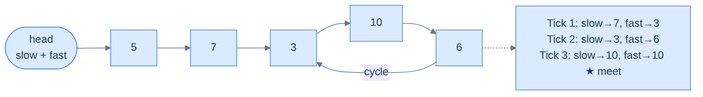
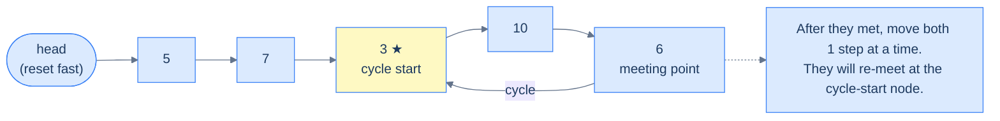
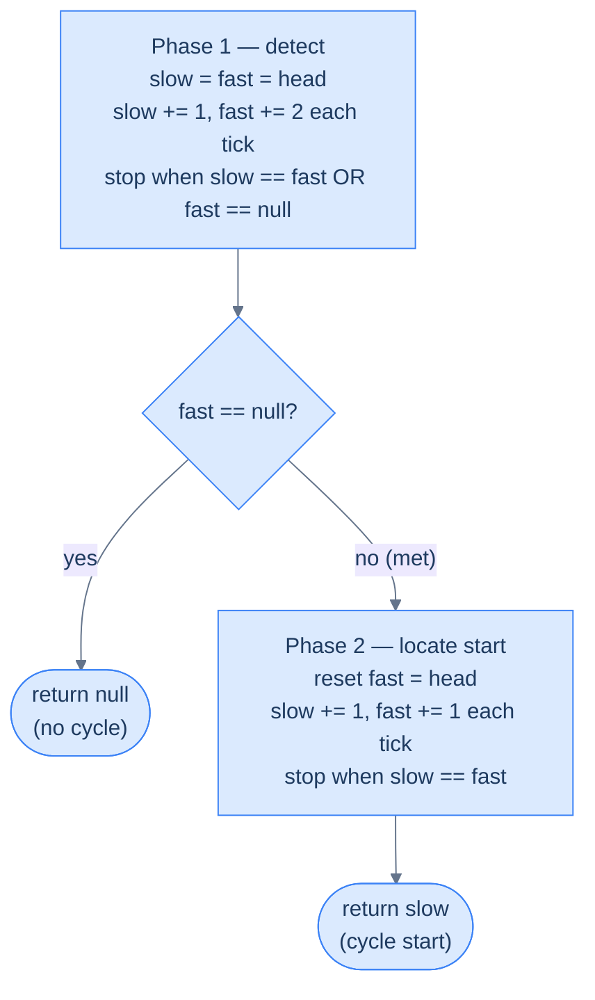

# 5. Detecting Cycle in Singly Linked Lists

## The Hook

A linked list is supposed to end. Follow `.next` enough times and eventually you hit `null`. But what if the tail points back into the middle of the list instead? Your `while (cur != null)` loop runs forever. Your server pegs a CPU core at 100%. Production goes down. A single misplaced pointer — `tail.next = head` — bricks everything.

How do you **detect** a cycle without an infinite loop yourself? The naive answer: keep a hash set of every node you've seen. Walk the list; if you ever revisit a node, there's a cycle. Works perfectly. Costs O(n) extra memory.

Floyd came up with something better. His algorithm uses **two pointers**, no hash set, no extra memory. One walks slowly (one step per tick), the other walks fast (two steps per tick). Inside a cycle, the fast one laps the slow one and they collide. Outside a cycle, the fast one falls off the end. **O(n) time, O(1) space.** The trick is so clean it's named after him — the tortoise and the hare. This lesson earns you the intuition and the proof.

---

## Table of contents

1. [Understanding Floyd's cycle finding algorithm](#understanding-floyds-cycle-finding-algorithm)
2. [Detect cycle](#detect-cycle)
3. [Remove loop](#remove-loop)

***

# Understanding Floyd's cycle finding algorithm

Sometimes, a linked list may not terminate at a `null` reference but instead, hold the reference to some other node in the next section of its last node. Such a list is said to have a cycle, as now, if we traverse the list from the start, we will loop indefinitely and never reach a `null` reference. Floyd's algorithm, also called the tortoise and hare method, uses the fast and slow pointer technique to identify if a linked list has a cycle in a single pass. It is a really efficient algorithm that can also identify the node at which the cycle starts without using any extra space.

```d2
direction: right
h: head {shape: oval}
n1: {value: 5; next}
n2: {value: 7; next}
n3: {
  value: 3
  next
  style.fill: "#fde68a"
  style.stroke: "#d97706"
}
n4: {value: 10; next}
n5: {value: 6; next}
h -> n1.value
n1.next -> n2.value
n2.next -> n3.value
n3.next -> n4.value
n4.next -> n5.value
n5.next -> n3.value: "cycle back"
```

<p align="center"><strong>A cycle exists when the tail's <code>next</code> points back to an earlier node (here the node holding <code>3</code>) instead of <code>null</code>. Traversal never terminates.</strong></p>

## Algorithm

Floyd's cycle finding algorithm uses the fast and slow pointer technique to move two pointers through the list until they meet each other. We use two references, `slow` and `fast` initialized with the head node, traverse the list using `fast`. In each iteration, we move `fast` two steps ahead while `slow` only moves 1 step. If they both reach the same node at any point in the traversal, it means there is a cycle; otherwise, `fast` will eventually hit `null` at the end of the list, meaning the list does not have a cycle.

The `fast` and `slow` pointers can meet at any node in the cycle and not necessarily the node where the cycle starts.

Below is an example of a linked list that has a cycle.



<p align="center"><strong>Slow moves 1 step, fast moves 2. If a cycle exists, fast laps slow and they meet at some node inside the loop. If no cycle exists, fast reaches <code>null</code>.</strong></p>

Once we confirm that a linked list has a cycle, the next step is to find where the cycle starts. After the `fast` and `slow` pointer meet at some node, we move `fast` back to the head of the list and traverse the list again using both `fast` and `slow`. However, this time, both `fast` and `slow` move at the same speed of one step in each iteration until they meet. The node at which they meet this time is where the cycle starts.



<p align="center"><strong>Phase 2 — reset <code>fast</code> to <code>head</code> and advance both pointers one step at a time. They collide at the node where the cycle begins.</strong></p>



<p align="center"><strong>Floyd's algorithm in two phases — detect first, then locate the cycle start using the reset-and-walk trick.</strong></p>

> -   **Step 1:** Initialize references `slow` and `fast` with the head of the list.
> -   **Step 2:** Loop while `fast` and `fast.next` are not `null` and do the following:
>     -   **Step 2.1:** Move ahead `slow` by one step and fast by two steps
>     -   **Step 2.2:** Check if `slow` == `fast`. If yes, break out of the loop as the list has a cycle.
> -   **Step 3:** If `slow` != `fast` it means the list doesn't have a cycle, so terminate. Otherwise, continue to the following steps.
> -   **Step 4:** Set `fast` to the head of the list
> -   **Step 5:** Loop while `fast` and `slow` are not equal and move both one step in each iteration
> -   **Step 6:** Return `slow` as the node where the cycle starts.

## Implementation

The implementation is relatively straightforward: we use the `slow` and `fast` pointer technique to traverse the list until they either meet (cycle) or `fast` falls off the end (no cycle). On a cycle, we reset `fast` to `head` and walk both pointers at the same speed until they meet again — that meeting point is where the cycle starts.


```pseudocode
# Floyd's tortoise-and-hare. Phase 1 sets a hasLoop flag on first collision; phase 2 resets fast to head and walks both at speed 1 until they re-meet at the cycle entry.
function findCycle(head):
    slow ← head
    fast ← head
    hasLoop ← false

    # Check if there is a loop in the linked list
    while fast is not null AND fast.next is not null:

        # Move slow pointer by one step
        slow ← slow.next

        # Move fast pointer by two steps
        fast ← fast.next.next

        # If slow and fast pointers meet, there is a loop
        if slow = fast:
            hasLoop ← true
            break

    # If no loop is found, return null
    if NOT hasLoop:
        return null

    # Reset fast pointer to the head and move both pointers at the same pace
    fast ← head
    while slow ≠ fast:
        slow ← slow.next
        fast ← fast.next

    # Return the node where the loop starts
    return slow
```

```python run
from typing import Optional

class ListNode:
    def __init__(self, val=0, next=None):
        self.val = val
        self.next = next

def find_cycle(head: Optional[ListNode]) -> Optional[ListNode]:
    slow: Optional[ListNode] = head
    fast: Optional[ListNode] = head
    has_loop: bool = False

    # Check if there is a loop in the linked list
    while fast is not None and fast.next is not None and slow:

        # Move slow pointer by one step
        slow = slow.next

        # Move fast pointer by two steps
        fast = fast.next.next

        # If slow and fast pointers meet, there is a loop
        if slow == fast:
            has_loop = True
            break

    # If no loop is found, return None
    if not has_loop:
        return None

    # Reset fast pointer to the head and move both pointers at the same pace
    fast = head
    while slow != fast and slow and fast:
        slow = slow.next
        fast = fast.next

    # Return the node where the loop starts
    return slow
```

```java run
class Solution {
    public ListNode findCycle(ListNode head) {
        ListNode slow = head;
        ListNode fast = head;
        boolean hasLoop = false;

        // Check if there is a loop in the linked list
        while (fast != null && fast.next != null) {

            // Move slow pointer by one step
            slow = slow.next;

            // Move fast pointer by two steps
            fast = fast.next.next;

            // If slow and fast pointers meet, there is a loop
            if (slow == fast) {
                hasLoop = true;
                break;
            }
        }

        // If no loop is found, return null
        if (!hasLoop) {
            return null;
        }

        // Reset fast pointer to the head and move both pointers at the
        // same pace
        fast = head;
        while (slow != fast) {
            slow = slow.next;
            fast = fast.next;
        }

        // Return the node where the loop starts
        return slow;
    }
}
```

```c run
#include <stddef.h>

typedef struct ListNode { int val; struct ListNode *next; } ListNode;

ListNode* findCycle(ListNode *head) {
    ListNode *slow = head;
    ListNode *fast = head;
    int hasLoop = 0;

    /* Check if there is a loop in the linked list */
    while (fast != NULL && fast->next != NULL) {

        /* Move slow pointer by one step */
        slow = slow->next;

        /* Move fast pointer by two steps */
        fast = fast->next->next;

        /* If slow and fast pointers meet, there is a loop */
        if (slow == fast) {
            hasLoop = 1;
            break;
        }
    }

    /* If no loop is found, return NULL */
    if (!hasLoop) {
        return NULL;
    }

    /* Reset fast pointer to the head and move both pointers at the
       same pace */
    fast = head;
    while (slow != fast) {
        slow = slow->next;
        fast = fast->next;
    }

    /* Return the node where the loop starts */
    return slow;
}
```

```scala run
object Solution {
  def findCycle(head: ListNode): ListNode = {
    var slow = head
    var fast = head
    var hasLoop = false

    // Check if there is a loop in the linked list
    while (fast != null && fast.next != null && !hasLoop) {

      // Move slow pointer by one step
      slow = slow.next

      // Move fast pointer by two steps
      fast = fast.next.next

      // If slow and fast pointers meet, there is a loop
      if (slow eq fast) {
        hasLoop = true
      }
    }

    // If no loop is found, return null
    if (!hasLoop) {
      return null
    }

    // Reset fast pointer to the head and move both pointers at the
    // same pace
    fast = head
    while (slow ne fast) {
      slow = slow.next
      fast = fast.next
    }

    // Return the node where the loop starts
    slow
  }
}
```


## Proof of correctness

Floyd's cycle-finding algorithm can detect cycles and find where the cycle starts in any automata (sequence of connected nodes) and not necessarily only a singly linked list. Consider the automata given below, which has a cycle of length `n` and the node where the cycle starts is at a distance `m` from the start.

```d2
direction: right
h: head {shape: oval}
l1: "·"
l2: "·"
s: |md
  **a**

  cycle start
| {style.fill: "#fde68a"; style.stroke: "#d97706"}
l3: "·"
m: |md
  **b**

  meet here
| {style.fill: "#fde68a"; style.stroke: "#d97706"}
l4: "·"
l5: "·"
h -> l1
l1 -> l2
l2 -> s
s -> l3
l3 -> m
m -> l4
l4 -> l5
l5 -> s: "back"
```

<p align="center"><strong>Let <code>a</code> = distance from head to cycle start, <code>n</code> = cycle length, and the pointers meet at node <code>b</code> inside the cycle.</strong></p>

It can be proved that if we move the `slow` and `fast` pointers at different speeds, they meet at some node in the cycle. This is because, after `m` iterations when `slow` pointer reaches the node `b`, the `fast` pointer will have traversed a distance `2*m` and so will be at some node `c` such that the distance between the node `b` and `c` is `k = m % n`.

```d2
direction: right
h: head {shape: oval}
l1: "·"
s: |md
  **a**

  slow is here
| {style.fill: "#fde68a"; style.stroke: "#d97706"}
l2: "·"
f: |md
  **fast is here**

  (k ahead inside cycle)
|
l3: "·"
note: |md
  When slow reaches the cycle start,
  fast has traveled 2a and is already
  somewhere inside the loop — call that offset k
| {shape: rectangle}
h -> l1
l1 -> s
s -> l2
l2 -> f
f -> l3
l3 -> s: "back"
f -> note: "" {style.stroke-dash: 3}
```

<p align="center"><strong>After <code>a</code> steps, slow just enters the cycle; fast has taken <code>2a</code> steps and is <code>k = a mod n</code> nodes ahead of slow within the loop.</strong></p>

From here on, the `slow` and `fast` pointers go around in the cycle but at different speeds. In each iteration, the gap `k` between `slow` and `fast` increases by one, but since it is a cycle, the gap between `fast` and `slow` i.e. `n-k` decreases by one, and so after `n-k` iterations `fast` and `slow` both point to the same node `d` that is at a distance `x` from the node `b` such that `x = n - k`

```d2
direction: right
s: cycle start {style.fill: "#fde68a"; style.stroke: "#d97706"}
l1: "·"
l2: "·"
m: |md
  meeting point

  (x ahead of S)
| {style.fill: "#fde68a"; style.stroke: "#d97706"}
l3: "·"
s -> l1
l1 -> l2
l2 -> m
m -> l3
l3 -> s: "back"
```

<p align="center"><strong>Let <code>x</code> = distance from cycle start to the meeting point. Because fast gains one step per tick over slow, fast closes the <code>k</code>-node gap after <code>k</code> ticks, giving <code>x = n − k</code>.</strong></p>

To find where the cycle starts (node `b`), we move the `fast` pointer back to the head and move both `fast` and `slow` pointer 1 step at a time (at the same speed). It is guaranteed that they will eventually meet at node `b`. This is because after `m` iterations, `fast` will reach node `b`, and `slow` will be at a distance `(x + m) % n` from node `b`. Expanding equations as given below, it can be proved that `(x + m) % n` **equals 0**,

```d2
direction: right
h: head {shape: oval}
l0: "·"
s: |md
  **cycle start**

  (a steps from head)
| {style.fill: "#fde68a"; style.stroke: "#d97706"}
l1: "·"
m: meeting point
l2: "·"
note: |md
  From meeting point,
  move (n − x) more steps inside cycle
  → lands on cycle start
| {shape: rectangle}
h -> l0
l0 -> s
s -> l1
l1 -> m
m -> l2
l2 -> s: "back"
m -> note: "" {style.stroke-dash: 3}
```

<p align="center"><strong>From the meeting point, stepping <code>m = n − x</code> more times brings you back around to the cycle start — exactly the same number of steps as from <code>head</code> to cycle start (because <code>a ≡ m</code> modulo <code>n</code>).</strong></p>

Based on the above, after `m` iterations the `fast` pointer will be at a distance `(x + m) % n` from node `b` but since `(x + m) % n = 0` it means it will be at the node `b` where it will meet the `slow` pointer.

```d2
direction: right
h: |md
  **head**

  (fast reset, 1 step/tick)
| {shape: oval}
l0: "·"
s: |md
  **★ cycle start**

  (slow arrives here after a steps;
  fast arrives here after m steps)
| {style.fill: "#fde68a"; style.stroke: "#d97706"}
l1: "·"
m: "(previous meeting point)"
h -> l0
l0 -> s
s -> l1
l1 -> m
m -> s: "slow moved here from meeting point" {style.stroke-dash: 3}
```

<p align="center"><strong>The beautiful conclusion — fast (walking from head) and slow (walking from the meeting point) both reach the cycle start at the same tick. That's why the re-meet locates the cycle start.</strong></p>

We can see, as above, why Floyd's cycle finding algorithm always correctly finds the cycle and the node where it starts.

## Complexity Analysis

The algorithm uses the fast and slow pointer technique to traverse the list. As stated in the proof of correctness, the `fast` and `slow` pointers meets after a fixed number of iterations, so the worst-case time complexity is linear **O(N)**.

We don't create additional data structures to traverse both arrays, so the space complexity is constant **O(1)**.

> **Best Case**
>
> -   Space Complexity - **O(1)**
> -   Time Complexity - **O(N)**
>
> **Worst Case**
>
> -   Space Complexity - **O(1)**
> -   Time Complexity - **O(N)**

## Example problems

Most problems in this category are easy or medium and can be solved by directly applying Floyd's cycle-finding algorithm. Below is a list of a few problems.

> -   **Detect cycle** - Detect if a linked list has a cycle.
> -   **Remove loop** - If a linked list has a cycle, remove it

We will now solve these problems to understand Floyd's cycle-finding algorithm better.

***

# Detect cycle

## Problem Statement

Given the **head** of a linked list, write a function to detect if there is a cycle in the linked list. There is a cycle in a linked list if a node in the list can be reached again by continuously following the reference. Your function should return `true` if there is a cycle, if not, it should return `false`.

### Example 1

> -   **Input:** head = \[5, 7, 9, 10, 6, 9\], cycleNode = 3
> -   **Output:** true

### Example 2

> -   **Input:** head = \[5, 7, 3, 10, 6, 9\], cycleNode = 0
> -   **Output:** false

## Solution


```pseudocode
# Boolean version of Floyd's algorithm — return true on the first collision, false if fast falls off the list.
function detectCycle(head):

    # Initialize the slow pointer to the head of the list
    slow ← head

    # Initialize the fast pointer to the head of the list
    fast ← head

    while fast is not null AND fast.next is not null:

        # Move the slow pointer one step forward
        slow ← slow.next

        # Move the fast pointer two steps forward
        fast ← fast.next.next

        # If the slow and fast pointers meet, there is a cycle in the list
        if slow = fast:
            return true

    # If the loop exits without returning true, there is no cycle in the list
    return false
```

```python run
from typing import Optional

class ListNode:
    def __init__(self, val=0, next=None):
        self.val = val
        self.next = next

def detect_cycle(head: Optional[ListNode]) -> bool:

    # Initialize the slow pointer to the head of the list
    slow: Optional[ListNode] = head

    # Initialize the fast pointer to the head of the list
    fast: Optional[ListNode] = head

    while fast is not None and fast.next is not None and slow:

        # Move the slow pointer one step forward
        slow = slow.next

        # Move the fast pointer two steps forward
        fast = fast.next.next

        # If the slow and fast pointers meet, there is a cycle in the
        # list
        if slow == fast:
            return True

    # If the loop exits without returning true, there is no cycle in
    # the list
    return False

# Driver: non-cyclic list [5, 7, 3, 10]
n1 = ListNode(5)
n2 = ListNode(7)
n3 = ListNode(3)
n4 = ListNode(10)
n1.next = n2; n2.next = n3; n3.next = n4

print(detect_cycle(n1))  # false
```

```java run
public class DetectCycle {
    static class ListNode {
        int val;
        ListNode next;
        ListNode(int v) { val = v; }
        ListNode(int v, ListNode n) { val = v; next = n; }
    }

    static boolean detectCycle(ListNode head) {

        // Initialize the slow pointer to the head of the list
        ListNode slow = head;

        // Initialize the fast pointer to the head of the list
        ListNode fast = head;

        while (fast != null && fast.next != null) {

            // Move the slow pointer one step forward
            slow = slow.next;

            // Move the fast pointer two steps forward
            fast = fast.next.next;

            // If the slow and fast pointers meet, there is a cycle in
            // the list
            if (slow == fast) {
                return true;
            }
        }

        // If the loop exits without returning true, there is no cycle in
        // the list
        return false;
    }

    public static void main(String[] args) {
        // Non-cyclic list [5, 7, 3, 10]
        ListNode n1 = new ListNode(5);
        ListNode n2 = new ListNode(7);
        ListNode n3 = new ListNode(3);
        ListNode n4 = new ListNode(10);
        n1.next = n2; n2.next = n3; n3.next = n4;

        System.out.println(detectCycle(n1)); // false
    }
}
```

```c run
#include <stdio.h>
#include <stdlib.h>

typedef struct ListNode {
    int val;
    struct ListNode *next;
} ListNode;

ListNode* newNode(int v) {
    ListNode *n = malloc(sizeof *n);
    n->val = v;
    n->next = NULL;
    return n;
}

int detectCycle(ListNode *head) {

    /* Initialize the slow pointer to the head of the list */
    ListNode *slow = head;

    /* Initialize the fast pointer to the head of the list */
    ListNode *fast = head;

    while (fast != NULL && fast->next != NULL) {

        /* Move the slow pointer one step forward */
        slow = slow->next;

        /* Move the fast pointer two steps forward */
        fast = fast->next->next;

        /* If the slow and fast pointers meet, there is a cycle in
           the list */
        if (slow == fast) {
            return 1;
        }
    }

    /* If the loop exits without returning true, there is no cycle in
       the list */
    return 0;
}

int main() {
    /* Non-cyclic list [5, 7, 3, 10] */
    ListNode *n1 = newNode(5);
    ListNode *n2 = newNode(7);
    ListNode *n3 = newNode(3);
    ListNode *n4 = newNode(10);
    n1->next = n2; n2->next = n3; n3->next = n4;

    printf("%s\n", detectCycle(n1) ? "true" : "false"); /* false */
    return 0;
}
```

```scala run
class ListNode(var v: Int, var next: ListNode = null)

object DetectCycle {
  def detectCycle(head: ListNode): Boolean = {

    // Initialize the slow pointer to the head of the list
    var slow = head

    // Initialize the fast pointer to the head of the list
    var fast = head

    while (fast != null && fast.next != null) {

      // Move the slow pointer one step forward
      slow = slow.next

      // Move the fast pointer two steps forward
      fast = fast.next.next

      // If the slow and fast pointers meet, there is a cycle in
      // the list
      if (slow eq fast) {
        return true
      }
    }

    // If the loop exits without returning true, there is no cycle in
    // the list
    false
  }

  def main(args: Array[String]): Unit = {
    // Non-cyclic list [5, 7, 3, 10]
    val n1 = new ListNode(5)
    val n2 = new ListNode(7)
    val n3 = new ListNode(3)
    val n4 = new ListNode(10)
    n1.next = n2; n2.next = n3; n3.next = n4

    println(detectCycle(n1)) // false
  }
}
```


# Remove Loop

## Problem Statement

Given the **head** of a singly linked list that may contain a loop and a non negative integer **X**, write a function to remove the loop if it is present.

```d2
direction: right
n1: {value: 1; next}
n2: {
  value: 3
  next
  style.fill: "#fde68a"
  style.stroke: "#d97706"
}
n3: {value: 4; next}
n1.next -> n2.value
n2.next -> n3.value
n3.next -> n2.value: "loop back (X=2)"
```

<p align="center"><strong>A loop connects the tail back to the node at position X (1-indexed).</strong></p>

### Example 1

> -   **Input:** head = \[1, 3, 4\], X = 2
> -   **Output:** \[1, 3, 4\]
> -   **Explanation:** The loop is present between nodes with values 3 and 4, it must be removed.

### Example 2

> -   **Input:** head = \[1, 8, 3, 4\], X = 0
> -   **Output:** \[1, 8, 3, 4\]
> -   **Explanation:** The list does not contain any loop as X = 0.

## Solution


```pseudocode
# Floyd Phase 1 to detect the loop; then walk to the node just before the loop entry and null its next pointer.
function removeLoop(head):

    # Check if the list is empty or has only one element (no loop possible)
    if head is null OR head.next is null:
        return

    # Pointer to traverse the list one node at a time
    slow ← head

    # Pointer to traverse the list two nodes at a time
    fast ← head

    # Flag to indicate if a loop is present
    hasLoop ← false

    # Detect if there is a loop in the linked list
    while fast is not null AND fast.next is not null:

        # Move slow pointer by one node
        slow ← slow.next

        # Move fast pointer by two nodes
        fast ← fast.next.next

        # If slow and fast pointers meet, there is a loop
        if slow = fast:
            hasLoop ← true
            break

    # No loop found, return from the function
    if NOT hasLoop:
        return

    # If the loop starts at the head of the linked list
    if slow = head:
        while slow.next ≠ head:
            slow ← slow.next

    # Find the start of the loop (where slow and fast pointers meet again)
    else:

        # Reset fast pointer to the head of the linked list
        fast ← head
        while slow.next ≠ fast.next:
            slow ← slow.next
            fast ← fast.next

    # Remove the loop by setting the next pointer of the last node in the loop to null
    slow.next ← null
```

```python run
from typing import Optional

class ListNode:
    def __init__(self, val=0, next=None):
        self.val = val
        self.next = next

def remove_loop(head: Optional[ListNode]) -> None:

    # Check if the list is empty or has only one element (no loop
    # possible)
    if head is None or head.next is None:
        return

    # Pointer to traverse the list one node at a time
    slow: Optional[ListNode] = head

    # Pointer to traverse the list two nodes at a time
    fast: Optional[ListNode] = head

    # Flag to indicate if a loop is present
    has_loop: bool = False

    # Detect if there is a loop in the linked list
    while (
        slow is not None
        and fast is not None
        and fast.next is not None
    ):

        # Move slow pointer by one node
        slow = slow.next

        # Move fast pointer by two nodes
        fast = fast.next.next

        # If slow and fast pointers meet, there is a loop
        if slow == fast:
            has_loop = True
            break

    # No loop found, return from the function
    if not has_loop:
        return

    # If the loop starts at the head of the linked list
    if slow == head:
        while slow.next != head:
            slow = slow.next

    # Find the start of the loop (where slow and fast pointers meet
    # again)
    else:

        # Reset fast pointer to the head of the linked list
        fast = head
        while slow.next != fast.next:
            slow = slow.next
            fast = fast.next

    # Remove the loop by setting the next pointer of the last node in
    # the loop to None
    if slow:
        slow.next = None

def print_list(head):
    result = []
    while head:
        result.append(str(head.val))
        head = head.next
    print(" -> ".join(result))

# Driver: list [1, 3, 4] with loop: 4 -> 3 (X=2)
n1 = ListNode(1)
n2 = ListNode(3)
n3 = ListNode(4)
n1.next = n2; n2.next = n3
n3.next = n2  # Create the loop manually

remove_loop(n1)
print_list(n1)  # 1 -> 3 -> 4
```

```java run
public class RemoveLoop {
    static class ListNode {
        int val;
        ListNode next;
        ListNode(int v) { val = v; }
        ListNode(int v, ListNode n) { val = v; next = n; }
    }

    static void removeLoop(ListNode head) {

        // Check if the list is empty or has only one element (no loop
        // possible)
        if (head == null || head.next == null) {
            return;
        }

        // Pointer to traverse the list one node at a time
        ListNode slow = head;

        // Pointer to traverse the list two nodes at a time
        ListNode fast = head;

        // Flag to indicate if a loop is present
        boolean hasLoop = false;

        // Detect if there is a loop in the linked list
        while (fast != null && fast.next != null) {

            // Move slow pointer by one node
            slow = slow.next;

            // Move fast pointer by two nodes
            fast = fast.next.next;

            // If slow and fast pointers meet, there is a loop
            if (slow == fast) {
                hasLoop = true;
                break;
            }
        }

        // No loop found, return from the function
        if (!hasLoop) {
            return;
        }

        // If the loop starts at the head of the linked list
        if (slow == head) {
            while (slow.next != head) {
                slow = slow.next;
            }
        }

        // Find the start of the loop (where slow and fast pointers meet
        // again)
        else {

            // Reset fast pointer to the head of the linked list
            fast = head;
            while (slow.next != fast.next) {
                slow = slow.next;
                fast = fast.next;
            }
        }

        // Remove the loop by setting the next pointer of the last node
        // in the loop to null
        slow.next = null;
    }

    static void printList(ListNode head) {
        StringBuilder sb = new StringBuilder();
        while (head != null) {
            sb.append(head.val);
            if (head.next != null) sb.append(" -> ");
            head = head.next;
        }
        System.out.println(sb);
    }

    public static void main(String[] args) {
        // List [1, 3, 4] with loop: 4 -> 3 (X=2)
        ListNode n1 = new ListNode(1);
        ListNode n2 = new ListNode(3);
        ListNode n3 = new ListNode(4);
        n1.next = n2; n2.next = n3;
        n3.next = n2; // Create the loop

        removeLoop(n1);
        printList(n1); // 1 -> 3 -> 4
    }
}
```

```c run
#include <stdio.h>
#include <stdlib.h>

typedef struct ListNode {
    int val;
    struct ListNode *next;
} ListNode;

ListNode* newNode(int v) {
    ListNode *n = malloc(sizeof *n);
    n->val = v; n->next = NULL;
    return n;
}

void removeLoop(ListNode *head) {

    /* Check if the list is empty or has only one element (no loop
       possible) */
    if (head == NULL || head->next == NULL) {
        return;
    }

    /* Pointer to traverse the list one node at a time */
    ListNode *slow = head;

    /* Pointer to traverse the list two nodes at a time */
    ListNode *fast = head;

    /* Flag to indicate if a loop is present */
    int hasLoop = 0;

    /* Detect if there is a loop in the linked list */
    while (fast != NULL && fast->next != NULL) {

        /* Move slow pointer by one node */
        slow = slow->next;

        /* Move fast pointer by two nodes */
        fast = fast->next->next;

        /* If slow and fast pointers meet, there is a loop */
        if (slow == fast) {
            hasLoop = 1;
            break;
        }
    }

    /* No loop found, return from the function */
    if (!hasLoop) {
        return;
    }

    /* If the loop starts at the head of the linked list */
    if (slow == head) {
        while (slow->next != head) {
            slow = slow->next;
        }
    }

    /* Find the start of the loop (where slow and fast pointers meet
       again) */
    else {

        /* Reset fast pointer to the head of the linked list */
        fast = head;
        while (slow->next != fast->next) {
            slow = slow->next;
            fast = fast->next;
        }
    }

    /* Remove the loop by setting the next pointer of the last node
       in the loop to NULL */
    slow->next = NULL;
}

void printList(ListNode *head) {
    while (head) {
        printf("%d", head->val);
        if (head->next) printf(" -> ");
        head = head->next;
    }
    printf("\n");
}

int main() {
    /* List [1, 3, 4] with loop: 4 -> 3 (X=2) */
    ListNode *n1 = newNode(1);
    ListNode *n2 = newNode(3);
    ListNode *n3 = newNode(4);
    n1->next = n2; n2->next = n3;
    n3->next = n2; /* Create the loop */

    removeLoop(n1);
    printList(n1); /* 1 -> 3 -> 4 */
    return 0;
}
```

```scala run
class ListNode(var v: Int, var next: ListNode = null)

object RemoveLoop {
  def removeLoop(head: ListNode): Unit = {

    // Check if the list is empty or has only one element (no loop
    // possible)
    if (head == null || head.next == null) {
      return
    }

    // Pointer to traverse the list one node at a time
    var slow = head

    // Pointer to traverse the list two nodes at a time
    var fast = head

    // Flag to indicate if a loop is present
    var hasLoop = false

    // Detect if there is a loop in the linked list
    while (fast != null && fast.next != null && !hasLoop) {

      // Move slow pointer by one node
      slow = slow.next

      // Move fast pointer by two nodes
      fast = fast.next.next

      // If slow and fast pointers meet, there is a loop
      if (slow eq fast) {
        hasLoop = true
      }
    }

    // No loop found, return from the function
    if (!hasLoop) {
      return
    }

    // If the loop starts at the head of the linked list
    if (slow eq head) {
      while (slow.next ne head) {
        slow = slow.next
      }
    }

    // Find the start of the loop (where slow and fast pointers meet
    // again)
    else {

      // Reset fast pointer to the head of the linked list
      fast = head
      while (slow.next ne fast.next) {
        slow = slow.next
        fast = fast.next
      }
    }

    // Remove the loop by setting the next pointer of the last node
    // in the loop to null
    slow.next = null
  }

  def printList(head: ListNode): Unit = {
    var cur = head
    val parts = scala.collection.mutable.ListBuffer[String]()
    while (cur != null) { parts += cur.v.toString; cur = cur.next }
    println(parts.mkString(" -> "))
  }

  def main(args: Array[String]): Unit = {
    // List [1, 3, 4] with loop: 4 -> 3 (X=2)
    val n1 = new ListNode(1)
    val n2 = new ListNode(3)
    val n3 = new ListNode(4)
    n1.next = n2; n2.next = n3
    n3.next = n2 // Create the loop

    removeLoop(n1)
    printList(n1) // 1 -> 3 -> 4
  }
}
```


***

## Final Takeaway

Floyd's algorithm is one of the most elegant algorithms in all of computer science. Two pointers, different speeds, and O(1) extra memory solve what naïvely needs a hash set. Three ideas are worth burning into memory:

1. **Different speeds converge inside loops, diverge outside them.** The fast pointer either laps the slow one (cycle) or falls off (no cycle). There is no third outcome — the algorithm *cannot* wrongly report a cycle.
2. **The reset-and-walk trick locates the cycle start.** After the first collision, reset `fast` to `head` and walk both at the same speed. The math — `a ≡ m mod n` — guarantees they re-meet at the cycle's entrance.
3. **Two pointers + different speeds is a pattern, not just a trick.** You'll see it again in "find the middle node", "k-th from the end", "palindrome detection", and every fast-slow problem in the next pattern chapter. The two-speed walk is the Swiss Army knife of singly-linked-list algorithms.

When you next see "detect", "find cycle start", "find middle", or any problem that needs to infer structure from a one-way chain — reach for two pointers at different speeds first.

> **Transfer Challenge:** Given a linked list known to have a cycle, return the **length** of the cycle. Can you do it in O(n) time and O(1) space using only Floyd's-style pointers?
>
> <details><summary><strong>Solution hint</strong></summary>
>
> After the first collision (phase 1), keep <code>slow</code> at the meeting point and walk it one step at a time, counting ticks, until you come back to the same node. The tick count is the cycle length. Total cost: one extra loop over the cycle only — O(n) time, O(1) space.
>
> </details>
