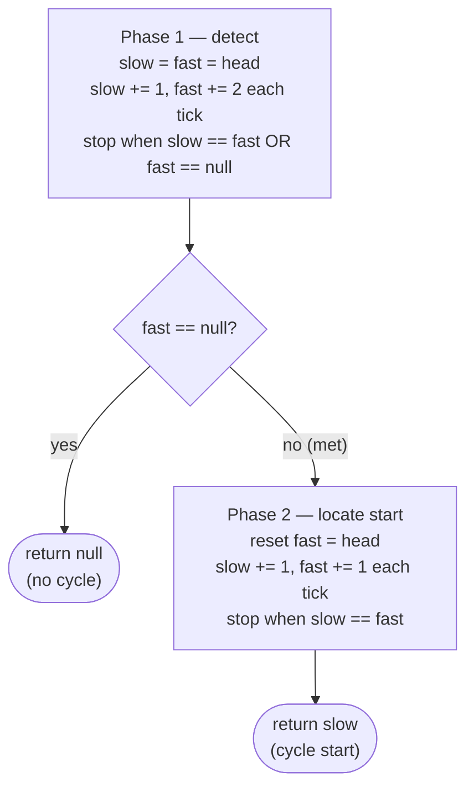

# 5. Detecting Cycle in Singly Linked Lists

## The Hook

A linked list is supposed to end. Follow `.next` enough times and eventually you hit `null`. But what if the tail points back into the middle of the list instead? Your `while (cur != null)` loop runs forever. Your server pegs a CPU core at 100%. Production goes down. A single misplaced pointer — `tail.next = head` — bricks everything.

How do you **detect** a cycle without an infinite loop yourself? The naive answer: keep a hash set of every node you've seen. Walk the list; if you ever revisit a node, there's a cycle. Works perfectly. Costs O(n) extra memory.

Floyd came up with something better. His algorithm uses **two pointers**, no hash set, no extra memory. One walks slowly (one step per tick), the other walks fast (two steps per tick). Inside a cycle, the fast one laps the slow one and they collide. Outside a cycle, the fast one falls off the end. **O(n) time, O(1) space.** The trick is so clean it's named after him — the tortoise and the hare. This lesson earns you the intuition and the proof.

---

## Table of contents

1. [Understanding Floyd's cycle finding algorithm](#understanding-floyds-cycle-finding-algorithm)
2. [Detect cycle](#detect-cycle)
3. [Remove loop](#remove-loop)
4. [Understanding the problem](#understanding-the-problem)
5. [Supported operations](#supported-operations)
6. [Internal mechanics](#internal-mechanics)
7. [Working example](#working-example)
8. [Edge cases and pitfalls](#edge-cases-and-pitfalls)
9. [Production reality](#production-reality)
10. [Quiz](#quiz)
11. [Practice ladder](#practice-ladder)
12. [Further reading](#further-reading)
13. [Cross-links](#cross-links)
14. [Final takeaway](#final-takeaway)

***

# Understanding Floyd's cycle finding algorithm

Sometimes, a linked list may not terminate at a `null` reference but instead, hold the reference to some other node in the next section of its last node. Such a list is said to have a cycle, as now, if we traverse the list from the start, we will loop indefinitely and never reach a `null` reference. Floyd's algorithm, also called the tortoise and hare method, uses the fast and slow pointer technique to identify if a linked list has a cycle in a single pass. It is a really efficient algorithm that can also identify the node at which the cycle starts without using any extra space.

```d3 widget=linked-list
{
  "title": "A linked list with a cycle — the tail loops back to node(3) instead of pointing to null",
  "direction": "single",
  "nodes": [
    {"id": "n1", "value": "5"},
    {"id": "n2", "value": "7"},
    {"id": "n3", "value": "3", "style": "highlight"},
    {"id": "n4", "value": "10"},
    {"id": "n5", "value": "6"}
  ],
  "head": "n1",
  "cycleTarget": "n3",
  "steps": [
    {
      "links": [["n1","n2"],["n2","n3"],["n3","n4"],["n4","n5"]],
      "markers": [{"name": "head", "nodeId": "n1"}, {"name": "current", "nodeId": "n3"}],
      "msg": "Tail node(6) loops back to node(3) — naive traversal would never terminate"
    }
  ]
}
```

<p align="center"><strong>A cycle exists when the tail's <code>next</code> points back to an earlier node (here the node holding <code>3</code>) instead of <code>null</code>. Traversal never terminates.</strong></p>

## Algorithm

Floyd's cycle finding algorithm uses the fast and slow pointer technique to move two pointers through the list until they meet each other. We use two references, `slow` and `fast` initialized with the head node, traverse the list using `fast`. In each iteration, we move `fast` two steps ahead while `slow` only moves 1 step. If they both reach the same node at any point in the traversal, it means there is a cycle; otherwise, `fast` will eventually hit `null` at the end of the list, meaning the list does not have a cycle.

The `fast` and `slow` pointers can meet at any node in the cycle and not necessarily the node where the cycle starts.

Below is an example of a linked list that has a cycle.

```d3 widget=linked-list
{
  "title": "Floyd Phase 1 — slow advances 1, fast advances 2; they meet inside the loop",
  "direction": "single",
  "nodes": [
    {"id": "n1", "value": "5"},
    {"id": "n2", "value": "7"},
    {"id": "n3", "value": "3"},
    {"id": "n4", "value": "10"},
    {"id": "n5", "value": "6"}
  ],
  "head": "n1",
  "cycleTarget": "n3",
  "sections": [
    {"name": "Init", "startIdx": 0},
    {"name": "Tick 1", "startIdx": 1},
    {"name": "Tick 2", "startIdx": 4},
    {"name": "Tick 3 (meet)", "startIdx": 7}
  ],
  "steps": [
    {
      "links": [["n1","n2"],["n2","n3"],["n3","n4"],["n4","n5"]],
      "markers": [{"name": "slow", "nodeId": "n1"}, {"name": "fast", "nodeId": "n1"}],
      "msg": "Init: slow = fast = head (both at node 5)"
    },
    {
      "links": [["n1","n2"],["n2","n3"],["n3","n4"],["n4","n5"]],
      "markers": [{"name": "slow", "nodeId": "n2"}, {"name": "fast", "nodeId": "n1"}],
      "msg": "Tick 1a: slow advances by 1 → node 7"
    },
    {
      "links": [["n1","n2"],["n2","n3"],["n3","n4"],["n4","n5"]],
      "markers": [{"name": "slow", "nodeId": "n2"}, {"name": "fast", "nodeId": "n2"}],
      "msg": "Tick 1b: fast advances step 1 of 2 → node 7"
    },
    {
      "links": [["n1","n2"],["n2","n3"],["n3","n4"],["n4","n5"]],
      "markers": [{"name": "slow", "nodeId": "n2"}, {"name": "fast", "nodeId": "n3"}],
      "msg": "Tick 1c: fast advances step 2 of 2 → node 3. slow=7, fast=3"
    },
    {
      "links": [["n1","n2"],["n2","n3"],["n3","n4"],["n4","n5"]],
      "markers": [{"name": "slow", "nodeId": "n3"}, {"name": "fast", "nodeId": "n3"}],
      "msg": "Tick 2a: slow advances → node 3"
    },
    {
      "links": [["n1","n2"],["n2","n3"],["n3","n4"],["n4","n5"]],
      "markers": [{"name": "slow", "nodeId": "n3"}, {"name": "fast", "nodeId": "n4"}],
      "msg": "Tick 2b: fast advances step 1 → node 10"
    },
    {
      "links": [["n1","n2"],["n2","n3"],["n3","n4"],["n4","n5"]],
      "markers": [{"name": "slow", "nodeId": "n3"}, {"name": "fast", "nodeId": "n5"}],
      "msg": "Tick 2c: fast advances step 2 → node 6. slow=3, fast=6"
    },
    {
      "links": [["n1","n2"],["n2","n3"],["n3","n4"],["n4","n5"]],
      "markers": [{"name": "slow", "nodeId": "n4"}, {"name": "fast", "nodeId": "n5"}],
      "msg": "Tick 3a: slow advances → node 10"
    },
    {
      "links": [["n1","n2"],["n2","n3"],["n3","n4"],["n4","n5"]],
      "markers": [{"name": "slow", "nodeId": "n4"}, {"name": "fast", "nodeId": "n3"}],
      "msg": "Tick 3b: fast advances step 1 — wraps via cycle edge → back to node 3"
    },
    {
      "links": [["n1","n2"],["n2","n3"],["n3","n4"],["n4","n5"]],
      "markers": [{"name": "slow", "nodeId": "n4"}, {"name": "fast", "nodeId": "n4"}],
      "msg": "Tick 3c: fast advances step 2 → node 10. slow and fast collide — a cycle exists."
    }
  ]
}
```

<p align="center"><strong>Slow moves 1 step, fast moves 2. If a cycle exists, fast laps slow and they meet at some node inside the loop. If no cycle exists, fast reaches <code>null</code>.</strong></p>

Once we confirm that a linked list has a cycle, the next step is to find where the cycle starts. After the `fast` and `slow` pointer meet at some node, we move `fast` back to the head of the list and traverse the list again using both `fast` and `slow`. However, this time, both `fast` and `slow` move at the same speed of one step in each iteration until they meet. The node at which they meet this time is where the cycle starts.

```d3 widget=linked-list
{
  "title": "Floyd Phase 2 — reset fast to head; walk both at speed 1; they meet at the cycle start",
  "direction": "single",
  "nodes": [
    {"id": "n1", "value": "5"},
    {"id": "n2", "value": "7"},
    {"id": "n3", "value": "3", "style": "highlight"},
    {"id": "n4", "value": "10"},
    {"id": "n5", "value": "6"}
  ],
  "head": "n1",
  "cycleTarget": "n3",
  "sections": [
    {"name": "Init",  "startIdx": 0},
    {"name": "Tick 1", "startIdx": 1},
    {"name": "Tick 2 (meet)", "startIdx": 3}
  ],
  "steps": [
    {
      "links": [["n1","n2"],["n2","n3"],["n3","n4"],["n4","n5"]],
      "markers": [{"name": "fast", "nodeId": "n1"}, {"name": "slow", "nodeId": "n4"}],
      "msg": "Phase 2 init: fast resets to head; slow stays at the meeting point (node 10)"
    },
    {
      "links": [["n1","n2"],["n2","n3"],["n3","n4"],["n4","n5"]],
      "markers": [{"name": "fast", "nodeId": "n2"}, {"name": "slow", "nodeId": "n4"}],
      "msg": "Tick 1a: fast advances one step → node 7"
    },
    {
      "links": [["n1","n2"],["n2","n3"],["n3","n4"],["n4","n5"]],
      "markers": [{"name": "fast", "nodeId": "n2"}, {"name": "slow", "nodeId": "n5"}],
      "msg": "Tick 1b: slow advances one step → node 6"
    },
    {
      "links": [["n1","n2"],["n2","n3"],["n3","n4"],["n4","n5"]],
      "markers": [{"name": "fast", "nodeId": "n3"}, {"name": "slow", "nodeId": "n5"}],
      "msg": "Tick 2a: fast advances one step → node 3 (the highlighted cycle entry)"
    },
    {
      "links": [["n1","n2"],["n2","n3"],["n3","n4"],["n4","n5"]],
      "markers": [{"name": "fast", "nodeId": "n3"}, {"name": "slow", "nodeId": "n3"}],
      "msg": "Tick 2b: slow wraps via cycle edge → node 3. They collide at the cycle start."
    },
    {
      "links": [["n1","n2"],["n2","n3"],["n3","n4"],["n4","n5"]],
      "markers": [{"name": "fast", "nodeId": "n3"}, {"name": "slow", "nodeId": "n3"}],
      "msg": "Return slow (= fast) — node 3 is the cycle start. Total: O(n) time, O(1) space."
    }
  ]
}
```

<p align="center"><strong>Phase 2 — reset <code>fast</code> to <code>head</code> and advance both pointers one step at a time. They collide at the node where the cycle begins.</strong></p>



<p align="center"><strong>Floyd's algorithm in two phases — detect first, then locate the cycle start using the reset-and-walk trick.</strong></p>

> -   **Step 1:** Initialize references `slow` and `fast` with the head of the list.
> -   **Step 2:** Loop while `fast` and `fast.next` are not `null` and do the following:
>     -   **Step 2.1:** Move ahead `slow` by one step and fast by two steps
>     -   **Step 2.2:** Check if `slow` == `fast`. If yes, break out of the loop as the list has a cycle.
> -   **Step 3:** If `slow` != `fast` it means the list doesn't have a cycle, so terminate. Otherwise, continue to the following steps.
> -   **Step 4:** Set `fast` to the head of the list
> -   **Step 5:** Loop while `fast` and `slow` are not equal and move both one step in each iteration
> -   **Step 6:** Return `slow` as the node where the cycle starts.

## Implementation

The implementation is relatively straightforward: we use the `slow` and `fast` pointer technique to traverse the list until they either meet (cycle) or `fast` falls off the end (no cycle). On a cycle, we reset `fast` to `head` and walk both pointers at the same speed until they meet again — that meeting point is where the cycle starts.


```python run
"""
Definition for singly-linked list.
class ListNode:
    def __init__(self, val):
        self.val = val
        self.next = None
"""

from typing import Optional

class Solution:
    def find_cycle(
        self, head: Optional[ListNode]
    ) -> Optional[ListNode]:
        slow: Optional[ListNode] = head
        fast: Optional[ListNode] = head
        has_loop: bool = False

        # Check if there is a loop in the linked list
        while fast and fast.next and slow:

            # Move slow pointer by one step
            slow = slow.next

            # Move fast pointer by two steps
            fast = fast.next.next

            # If slow and fast pointers meet, there is a loop
            if slow == fast:
                has_loop = True
                break

        # If no loop is found, return None
        if not has_loop:
            return None

        # Reset fast pointer to the head and move both pointers at the
        # same pace
        fast = head
        while slow != fast and slow and fast:
            slow = slow.next
            fast = fast.next

        # Return the node where the loop starts
        return slow
```

```java run
/**
 * Definition for singly-linked list.
 * class ListNode {
 *     int val;
 *     ListNode next;
 *     ListNode() {}
 *     ListNode(int val) { this.val = val; }
 * };
 */

class Solution {
    public ListNode findCycle(ListNode head) {
        ListNode slow = head;
        ListNode fast = head;
        boolean hasLoop = false;

        // Check if there is a loop in the linked list
        while (fast != null && fast.next != null) {

            // Move slow pointer by one step
            slow = slow.next;

            // Move fast pointer by two steps
            fast = fast.next.next;

            // If slow and fast pointers meet, there is a loop
            if (slow == fast) {
                hasLoop = true;
                break;
            }
        }

        // If no loop is found, return null
        if (!hasLoop) {
            return null;
        }

        // Reset fast pointer to the head and move both pointers at the
        // same pace
        fast = head;
        while (slow != fast) {
            slow = slow.next;
            fast = fast.next;
        }

        // Return the node where the loop starts
        return slow;
    }
}
```


## Proof of correctness

Floyd's cycle-finding algorithm can detect cycles and find where the cycle starts in any automata (sequence of connected nodes) and not necessarily only a singly linked list. Consider the automata given below, which has a cycle of length `n` and the node where the cycle starts is at a distance `m` from the start.

```d2
direction: right
h: head {shape: oval}
l1: "·"
l2: "·"
s: |md
  **a**

  cycle start
| {style.fill: "#fde68a"; style.stroke: "#d97706"}
l3: "·"
m: |md
  **b**

  meet here
| {style.fill: "#fde68a"; style.stroke: "#d97706"}
l4: "·"
l5: "·"
h -> l1
l1 -> l2
l2 -> s
s -> l3
l3 -> m
m -> l4
l4 -> l5
l5 -> s: "back"
```

<p align="center"><strong>Let <code>a</code> = distance from head to cycle start, <code>n</code> = cycle length, and the pointers meet at node <code>b</code> inside the cycle.</strong></p>

It can be proved that if we move the `slow` and `fast` pointers at different speeds, they meet at some node in the cycle. This is because, after `m` iterations when `slow` pointer reaches the node `b`, the `fast` pointer will have traversed a distance `2*m` and so will be at some node `c` such that the distance between the node `b` and `c` is `k = m % n`.

```d2
direction: right
h: head {shape: oval}
l1: "·"
s: |md
  **a**

  slow is here
| {style.fill: "#fde68a"; style.stroke: "#d97706"}
l2: "·"
f: |md
  **fast is here**

  (k ahead inside cycle)
|
l3: "·"
note: |md
  When slow reaches the cycle start,
  fast has traveled 2a and is already
  somewhere inside the loop — call that offset k
| {shape: rectangle}
h -> l1
l1 -> s
s -> l2
l2 -> f
f -> l3
l3 -> s: "back"
f -> note: "" {style.stroke-dash: 3}
```

<p align="center"><strong>After <code>a</code> steps, slow just enters the cycle; fast has taken <code>2a</code> steps and is <code>k = a mod n</code> nodes ahead of slow within the loop.</strong></p>

From here on, the `slow` and `fast` pointers go around in the cycle but at different speeds. In each iteration, the gap `k` between `slow` and `fast` increases by one, but since it is a cycle, the gap between `fast` and `slow` i.e. `n-k` decreases by one, and so after `n-k` iterations `fast` and `slow` both point to the same node `d` that is at a distance `x` from the node `b` such that `x = n - k`

```d2
direction: right
s: cycle start {style.fill: "#fde68a"; style.stroke: "#d97706"}
l1: "·"
l2: "·"
m: |md
  meeting point

  (x ahead of S)
| {style.fill: "#fde68a"; style.stroke: "#d97706"}
l3: "·"
s -> l1
l1 -> l2
l2 -> m
m -> l3
l3 -> s: "back"
```

<p align="center"><strong>Let <code>x</code> = distance from cycle start to the meeting point. Because fast gains one step per tick over slow, fast closes the <code>k</code>-node gap after <code>k</code> ticks, giving <code>x = n − k</code>.</strong></p>

To find where the cycle starts (node `b`), we move the `fast` pointer back to the head and move both `fast` and `slow` pointer 1 step at a time (at the same speed). It is guaranteed that they will eventually meet at node `b`. This is because after `m` iterations, `fast` will reach node `b`, and `slow` will be at a distance `(x + m) % n` from node `b`. Expanding equations as given below, it can be proved that `(x + m) % n` **equals 0**,

```d2
direction: right
h: head {shape: oval}
l0: "·"
s: |md
  **cycle start**

  (a steps from head)
| {style.fill: "#fde68a"; style.stroke: "#d97706"}
l1: "·"
m: meeting point
l2: "·"
note: |md
  From meeting point,
  move (n − x) more steps inside cycle
  → lands on cycle start
| {shape: rectangle}
h -> l0
l0 -> s
s -> l1
l1 -> m
m -> l2
l2 -> s: "back"
m -> note: "" {style.stroke-dash: 3}
```

<p align="center"><strong>From the meeting point, stepping <code>m = n − x</code> more times brings you back around to the cycle start — exactly the same number of steps as from <code>head</code> to cycle start (because <code>a ≡ m</code> modulo <code>n</code>).</strong></p>

Based on the above, after `m` iterations the `fast` pointer will be at a distance `(x + m) % n` from node `b` but since `(x + m) % n = 0` it means it will be at the node `b` where it will meet the `slow` pointer.

```d2
direction: right
h: |md
  **head**

  (fast reset, 1 step/tick)
| {shape: oval}
l0: "·"
s: |md
  **★ cycle start**

  (slow arrives here after a steps;
  fast arrives here after m steps)
| {style.fill: "#fde68a"; style.stroke: "#d97706"}
l1: "·"
m: "(previous meeting point)"
h -> l0
l0 -> s
s -> l1
l1 -> m
m -> s: "slow moved here from meeting point" {style.stroke-dash: 3}
```

<p align="center"><strong>The beautiful conclusion — fast (walking from head) and slow (walking from the meeting point) both reach the cycle start at the same tick. That's why the re-meet locates the cycle start.</strong></p>

We can see, as above, why Floyd's cycle finding algorithm always correctly finds the cycle and the node where it starts.

## Complexity Analysis

The algorithm uses the fast and slow pointer technique to traverse the list. As stated in the proof of correctness, the `fast` and `slow` pointers meets after a fixed number of iterations, so the worst-case time complexity is linear **O(N)**.

We don't create additional data structures to traverse both arrays, so the space complexity is constant **O(1)**.

> **Best Case**
>
> -   Space Complexity - **O(1)**
> -   Time Complexity - **O(N)**
>
> **Worst Case**
>
> -   Space Complexity - **O(1)**
> -   Time Complexity - **O(N)**

## Example problems

Most problems in this category are easy or medium and can be solved by directly applying Floyd's cycle-finding algorithm. Below is a list of a few problems.

> -   **Detect cycle** - Detect if a linked list has a cycle.
> -   **Remove loop** - If a linked list has a cycle, remove it

We will now solve these problems to understand Floyd's cycle-finding algorithm better.

***

# Detect cycle

## Problem Statement

Given the **head** of a linked list, write a function to detect if there is a cycle in the linked list. There is a cycle in a linked list if a node in the list can be reached again by continuously following the reference. Your function should return `true` if there is a cycle, if not, it should return `false`.

### Example 1

> -   **Input:** head = \[5, 7, 9, 10, 6, 9\], cycleNode = 3
> -   **Output:** true

### Example 2

> -   **Input:** head = \[5, 7, 3, 10, 6, 9\], cycleNode = 0
> -   **Output:** false

<details>
<summary><h2>Solution</h2></summary>


```python run viz=linked-list viz-root=head
from typing import Optional, Tuple


class ListNode:
    def __init__(self, val=0, nxt=None):
        self.val = val
        self.next = nxt


def from_list(values):
    if not values:
        return None
    head = ListNode(values[0])
    cur = head
    for v in values[1:]:
        cur.next = ListNode(v)
        cur = cur.next
    return head


def from_list_with_cycle(values, cycle_pos):
    """Build a list and link tail to the node at cycle_pos (0-indexed).
    cycle_pos = -1 means no cycle."""
    if not values:
        return None
    head = ListNode(values[0])
    cur = head
    cycle_entry = head if cycle_pos == 0 else None
    for i, v in enumerate(values[1:], 1):
        cur.next = ListNode(v)
        cur = cur.next
        if i == cycle_pos:
            cycle_entry = cur
    if cycle_pos >= 0 and cycle_entry is not None:
        cur.next = cycle_entry  # create the cycle
    return head


class Solution:
    def detect_cycle(self, head: Optional[ListNode]) -> bool:

        # Initialize the slow pointer to the head of the list
        slow: Optional[ListNode] = head

        # Initialize the fast pointer to the head of the list
        fast: Optional[ListNode] = head

        while fast is not None and fast.next is not None and slow:

            # Move the slow pointer one step forward
            slow = slow.next

            # Move the fast pointer two steps forward
            fast = fast.next.next

            # If the slow and fast pointers meet, there is a cycle in the
            # list
            if slow == fast:
                return True

        # If the loop exits without returning true, there is no cycle in
        # the list
        return False


# Examples from the problem statement
print(Solution().detect_cycle(from_list_with_cycle([5, 7, 9, 10, 6, 9], 3)))  # True
print(Solution().detect_cycle(from_list_with_cycle([5, 7, 3, 10, 6, 9], -1))) # False

# Edge cases
print(Solution().detect_cycle(None))                                           # False
print(Solution().detect_cycle(from_list([42])))                                # False
print(Solution().detect_cycle(from_list_with_cycle([1, 2], -1)))               # False
print(Solution().detect_cycle(from_list_with_cycle([1, 2], 0)))                # True (cycle at head)
print(Solution().detect_cycle(from_list_with_cycle([1, 2, 3, 4], 2)))          # True (cycle in middle)
print(Solution().detect_cycle(from_list_with_cycle([1, 2, 3], 2)))             # True (cycle at last node)
```

```java run
public class Main {
    static class ListNode {
        int val;
        ListNode next;
        ListNode() {}
        ListNode(int val) { this.val = val; }
        ListNode(int val, ListNode next) { this.val = val; this.next = next; }
    }

    static ListNode fromList(int... values) {
        if (values.length == 0) return null;
        ListNode head = new ListNode(values[0]);
        ListNode cur = head;
        for (int i = 1; i < values.length; i++) {
            cur.next = new ListNode(values[i]);
            cur = cur.next;
        }
        return head;
    }

    /** Build a list and link tail to the node at cyclePos (0-indexed).
     *  cyclePos = -1 means no cycle. */
    static ListNode fromListWithCycle(int cyclePos, int... values) {
        if (values.length == 0) return null;
        ListNode head = new ListNode(values[0]);
        ListNode cur = head;
        ListNode cycleEntry = (cyclePos == 0) ? head : null;
        for (int i = 1; i < values.length; i++) {
            cur.next = new ListNode(values[i]);
            cur = cur.next;
            if (i == cyclePos) cycleEntry = cur;
        }
        if (cyclePos >= 0 && cycleEntry != null) {
            cur.next = cycleEntry; // create the cycle
        }
        return head;
    }

    static class Solution {
        public boolean detectCycle(ListNode head) {

            // Initialize the slow pointer to the head of the list
            ListNode slow = head;

            // Initialize the fast pointer to the head of the list
            ListNode fast = head;

            while (fast != null && fast.next != null) {

                // Move the slow pointer one step forward
                slow = slow.next;

                // Move the fast pointer two steps forward
                fast = fast.next.next;

                // If the slow and fast pointers meet, there is a cycle in
                // the list
                if (slow == fast) {
                    return true;
                }
            }

            // If the loop exits without returning true, there is no cycle in
            // the list
            return false;
        }
    }

    public static void main(String[] args) {
        // Examples from the problem statement
        System.out.println(new Solution().detectCycle(fromListWithCycle(3, 5, 7, 9, 10, 6, 9)));  // true
        System.out.println(new Solution().detectCycle(fromListWithCycle(-1, 5, 7, 3, 10, 6, 9))); // false

        // Edge cases
        System.out.println(new Solution().detectCycle(null));                                      // false
        System.out.println(new Solution().detectCycle(fromList(42)));                              // false
        System.out.println(new Solution().detectCycle(fromListWithCycle(-1, 1, 2)));               // false
        System.out.println(new Solution().detectCycle(fromListWithCycle(0, 1, 2)));                // true (cycle at head)
        System.out.println(new Solution().detectCycle(fromListWithCycle(2, 1, 2, 3, 4)));          // true (cycle in middle)
        System.out.println(new Solution().detectCycle(fromListWithCycle(2, 1, 2, 3)));             // true (cycle at last node)
    }
}
```

</details>
# Remove Loop

## Problem Statement

Given the **head** of a singly linked list that may contain a loop and a non negative integer **X**, write a function to remove the loop if it is present.

```d2
direction: right
n1: {value: 1; next}
n2: {
  value: 3
  next
  style.fill: "#fde68a"
  style.stroke: "#d97706"
}
n3: {value: 4; next}
n1.next -> n2.value
n2.next -> n3.value
n3.next -> n2.value: "loop back (X=2)"
```

<p align="center"><strong>A loop connects the tail back to the node at position X (1-indexed).</strong></p>

### Example 1

> -   **Input:** head = \[1, 3, 4\], X = 2
> -   **Output:** \[1, 3, 4\]
> -   **Explanation:** The loop is present between nodes with values 3 and 4, it must be removed.

### Example 2

> -   **Input:** head = \[1, 8, 3, 4\], X = 0
> -   **Output:** \[1, 8, 3, 4\]
> -   **Explanation:** The list does not contain any loop as X = 0.

<details>
<summary><h2>Solution</h2></summary>


```python run viz=linked-list viz-root=head
from typing import Optional


class ListNode:
    def __init__(self, val=0, nxt=None):
        self.val = val
        self.next = nxt


def from_list_with_cycle(values, cycle_pos):
    """Build a list and link tail to the node at cycle_pos (1-indexed, matching
    problem statement convention). cycle_pos = 0 means no cycle."""
    if not values:
        return None
    head = ListNode(values[0])
    cur = head
    nodes = [head]
    for v in values[1:]:
        cur.next = ListNode(v)
        cur = cur.next
        nodes.append(cur)
    if cycle_pos > 0:
        cur.next = nodes[cycle_pos - 1]  # 1-indexed
    return head


def to_list(head):
    """Collect values, stopping at already-seen nodes (safe after remove_loop)."""
    out = []
    while head is not None:
        out.append(head.val)
        head = head.next
    return out


class Solution:
    def remove_loop(self, head: Optional[ListNode]) -> None:

        # Check if the list is empty or has only one element (no loop
        # possible)
        if head is None or head.next is None:
            return

        # Pointer to traverse the list one node at a time
        slow: Optional[ListNode] = head

        # Pointer to traverse the list two nodes at a time
        fast: Optional[ListNode] = head

        # Flag to indicate if a loop is present
        has_loop: bool = False

        # Detect if there is a loop in the linked list
        while (
            slow is not None
            and fast is not None
            and fast.next is not None
        ):

            # Move slow pointer by one node
            slow = slow.next

            # Move fast pointer by two nodes
            fast = fast.next.next

            # If slow and fast pointers meet, there is a loop
            if slow == fast:
                has_loop = True
                break

        # No loop found, return from the function
        if not has_loop:
            return

        # If the loop starts at the head of the linked list
        if slow == head:
            while slow.next != head:
                slow = slow.next

        # Find the start of the loop (where slow and fast pointers meet
        # again)
        else:

            # Reset fast pointer to the head of the linked list
            fast = head
            while slow.next != fast.next:
                slow = slow.next
                fast = fast.next

        # Remove the loop by setting the next pointer of the last node in
        # the loop to None
        if slow:
            slow.next = None


# Example 1 — loop at position 2 (1-indexed)
h1 = from_list_with_cycle([1, 3, 4], 2)
Solution().remove_loop(h1)
print(to_list(h1))                                                # [1, 3, 4]

# Example 2 — no loop
h2 = from_list_with_cycle([1, 8, 3, 4], 0)
Solution().remove_loop(h2)
print(to_list(h2))                                                # [1, 8, 3, 4]

# Loop at head (position 1)
h3 = from_list_with_cycle([1, 2, 3], 1)
Solution().remove_loop(h3)
print(to_list(h3))                                                # [1, 2, 3]

# Single node, no loop
h4 = from_list_with_cycle([5], 0)
Solution().remove_loop(h4)
print(to_list(h4))                                                # [5]

# Empty list
h5 = from_list_with_cycle([], 0)
Solution().remove_loop(h5)
print(to_list(h5))                                                # []

# Loop at last node pointing to itself
h6 = from_list_with_cycle([1, 2, 3], 3)
Solution().remove_loop(h6)
print(to_list(h6))                                                # [1, 2, 3]
```

```java run
import java.util.*;

public class Main {
    static class ListNode {
        int val;
        ListNode next;
        ListNode() {}
        ListNode(int val) { this.val = val; }
        ListNode(int val, ListNode next) { this.val = val; this.next = next; }
    }

    /** Build a list and link tail to the node at cyclePos (1-indexed).
     *  cyclePos = 0 means no cycle. */
    static ListNode fromListWithCycle(int cyclePos, int... values) {
        if (values.length == 0) return null;
        ListNode[] nodes = new ListNode[values.length];
        nodes[0] = new ListNode(values[0]);
        for (int i = 1; i < values.length; i++) {
            nodes[i] = new ListNode(values[i]);
            nodes[i - 1].next = nodes[i];
        }
        if (cyclePos > 0) {
            nodes[values.length - 1].next = nodes[cyclePos - 1]; // 1-indexed
        }
        return nodes[0];
    }

    static List<Integer> toList(ListNode head) {
        List<Integer> out = new ArrayList<>();
        while (head != null) { out.add(head.val); head = head.next; }
        return out;
    }

    static class Solution {
        public void removeLoop(ListNode head) {

            // Check if the list is empty or has only one element (no loop
            // possible)
            if (head == null || head.next == null) {
                return;
            }

            // Pointer to traverse the list one node at a time
            ListNode slow = head;

            // Pointer to traverse the list two nodes at a time
            ListNode fast = head;

            // Flag to indicate if a loop is present
            boolean hasLoop = false;

            // Detect if there is a loop in the linked list
            while (fast != null && fast.next != null) {

                // Move slow pointer by one node
                slow = slow.next;

                // Move fast pointer by two nodes
                fast = fast.next.next;

                // If slow and fast pointers meet, there is a loop
                if (slow == fast) {
                    hasLoop = true;
                    break;
                }
            }

            // No loop found, return from the function
            if (!hasLoop) {
                return;
            }

            // If the loop starts at the head of the linked list
            if (slow == head) {
                while (slow.next != head) {
                    slow = slow.next;
                }
            }

            // Find the start of the loop (where slow and fast pointers meet
            // again)
            else {

                // Reset fast pointer to the head of the linked list
                fast = head;
                while (slow.next != fast.next) {
                    slow = slow.next;
                    fast = fast.next;
                }
            }

            // Remove the loop by setting the next pointer of the last node
            // in the loop to null
            slow.next = null;
        }
    }

    public static void main(String[] args) {
        // Example 1 — loop at position 2 (1-indexed)
        ListNode h1 = fromListWithCycle(2, 1, 3, 4);
        new Solution().removeLoop(h1);
        System.out.println(toList(h1));                           // [1, 3, 4]

        // Example 2 — no loop
        ListNode h2 = fromListWithCycle(0, 1, 8, 3, 4);
        new Solution().removeLoop(h2);
        System.out.println(toList(h2));                           // [1, 8, 3, 4]

        // Loop at head (position 1)
        ListNode h3 = fromListWithCycle(1, 1, 2, 3);
        new Solution().removeLoop(h3);
        System.out.println(toList(h3));                           // [1, 2, 3]

        // Single node, no loop
        ListNode h4 = fromListWithCycle(0, 5);
        new Solution().removeLoop(h4);
        System.out.println(toList(h4));                           // [5]

        // Empty list
        ListNode h5 = fromListWithCycle(0);
        new Solution().removeLoop(h5);
        System.out.println(toList(h5));                           // []

        // Loop at last node pointing to itself
        ListNode h6 = fromListWithCycle(3, 1, 2, 3);
        new Solution().removeLoop(h6);
        System.out.println(toList(h6));                           // [1, 2, 3]
    }
}
```

</details>
***

# Understanding the Problem

A singly linked list is *supposed* to terminate. Walk `head`, then `head.next`, then `head.next.next`, and eventually you land on a node whose `.next` is `null`. Every loop you have written so far — traversal, search, length, insertion, deletion — depends on that `null` to halt.

A **cycle** breaks that invariant. Some node's `.next` points back into the chain instead of to `null`. The list now has no tail, and the standard `while (cur != null)` loop runs forever.

The question this lesson answers has two layers:

- **Detection** — given only `head`, decide whether the list contains a cycle, without looping forever yourself.
- **Localisation** — if a cycle exists, find the exact node where it *begins* (the node multiple `.next` references point to).

To make this concrete: on `5 → 7 → 3 → 10 → 6 → (back to 3)`, the cycle's entry is the node holding `3` — the node where the tail's `.next` re-enters. Detection says "yes, a cycle exists". Localisation returns the node holding `3`.

So the key idea is: cycle detection is not just defensive programming — it is the precondition for *fixing* the structure (cutting the back-edge to restore a proper `null` terminator) and for any algorithm that needs to know whether a one-way chain is finite.

---

### Why the obvious answer is wrong

The first instinct is a **hash set**: walk the list, push every node into a `Set`, and return `true` the first time you try to push a node that is already there. It works, in O(n) time. But it spends O(n) extra memory on a problem that turns out to need none.

Floyd's algorithm is the canonical proof that O(1) space is achievable here. Two pointers at different speeds extract the same information the hash set extracts — *has this node already been visited?* — using only the structural property of a cycle: **inside a cycle, two pointers moving at different speeds must eventually collide.**

So the tradeoff is: the hash-set solution is one line shorter, but Floyd's pays nothing in extra space. On a list of ten million nodes, the difference is hundreds of megabytes versus two pointer-sized variables.

---

## Key Takeaway

A cycle replaces the tail's `null` with a back-edge. Every traversal-based operation breaks until you either prove there is no cycle or cut the back-edge — and the cheapest tool for both jobs is Floyd's two-pointer walk.

***

# Supported Operations

Cycle detection is itself a small family of operations, all built on the same two-pointer scaffold. The table below names them and pins their cost, so you can pick the right one when a problem says "this list might be cyclic".

| Operation | Time | Space | Why |
|---|---|---|---|
| **Detect cycle (yes/no)** | O(n) | O(1) | Phase 1 of Floyd's — fast laps slow inside the loop, or falls off the end |
| **Find cycle start (entry node)** | O(n) | O(1) | Phase 1 to collide, then reset `fast` to `head` and walk both at speed 1 until they re-meet |
| **Find cycle length** | O(n) | O(1) | After phase 1, walk one pointer one step at a time around the loop until it returns; count the steps |
| **Remove cycle (restore `null` tail)** | O(n) | O(1) | Find the cycle start, then walk to the node whose `.next` is the start and set it to `null` |
| **Detect cycle (hash-set version)** | O(n) | O(n) | Push every node into a set; first duplicate push signals a cycle |

Two patterns explain the whole table.

- **Floyd's gives you O(1) space for every cycle-related question** — detection, entry, length, removal. The hash-set version trades O(n) memory for one fewer line of code.
- **Every operation here decomposes into "phase 1 (collide) → phase 2 (locate)"** — even cycle length, where phase 2 is the same `slow` pointer walking one more lap, counting nodes.

To make this concrete: a linked list with a million nodes and a cycle near the tail uses 16 MB of memory under the hash-set approach (8 bytes per pointer × 2 million entries with hash overhead). Floyd's uses 16 bytes total — two pointers, regardless of list size.

So the core insight is: once you can collide two pointers inside a cycle, every other cycle-related question reduces to a constant number of further walks over the same list.

---

## Key Takeaway

Floyd's algorithm is the *single primitive* behind every cycle-related operation on a singly linked list. Master phase 1, then layer phase 2 (or its lap-counting variant) on top.

***

# Internal Mechanics

The whole algorithm rests on two facts about one-way chains: a `null`-terminated list has a definite end, and a cyclic chain does not. From those two facts, the two-pointer walk becomes inevitable.

The structural facts the algorithm exploits:

- **Slow advances one node per tick.** It cannot overshoot any node; whatever the slow pointer reaches, the algorithm has had time to observe.
- **Fast advances two nodes per tick.** It enters the cycle (if one exists) faster than slow does, then runs strictly faster inside the cycle.
- **Inside a cycle, the gap between `fast` and `slow` shrinks by exactly one each tick.** Modulo the cycle's length, the gap monotonically converges to zero — they must collide.
- **Outside a cycle, `fast` falls off the end first.** It hits `null` after roughly `n/2` ticks; slow has only reached the middle.

So the core insight is: the algorithm cannot misfire. There is no third outcome between "fast hits `null`" (no cycle) and "fast meets slow" (cycle). The structure guarantees one of the two within a bounded number of ticks.

---

### Why the meeting point isn't the cycle's entry

When `slow` and `fast` first collide, they collide *somewhere inside* the loop — not necessarily at the entry. The meeting node depends on where slow happened to enter the cycle and on the cycle's length.

The phase-2 trick — reset `fast` to `head`, advance both at speed 1 — exploits a small piece of modular arithmetic. Let `a` be the distance from `head` to the cycle's entry, `n` the cycle's length, and `x` the distance from the entry to the meeting point. The first collision happens when `2 × (a + x) = a + x + k·n` for some integer `k`, which simplifies to `a = k·n − x`. That equation says: walking `a` steps from `head` and walking `a` steps forward from the meeting point both land on the same node — the cycle's entry. The full geometric proof is the next section.

So the tradeoff is: phase 2 looks magical, but it is one identity in modular arithmetic — and that identity is what turns "we collided somewhere inside the loop" into "here is the entry".

---

### Why fast-then-slow ordering matters

The standard form checks `fast != null && fast.next != null` before advancing. Both checks are essential — `fast` makes a *double* hop per tick, so it must touch the node after its current one. Skip the second check and `fast.next.next` crashes on the penultimate node of a `null`-terminated list.

Reversing the order — advance first, then check — runs the body once *past* the end on cycle-free lists. The dereference of `fast.next.next` would either crash (Python, Java) or read garbage (C). The "check first, advance second" shape is not stylistic; it is the only ordering that survives every linked-list shape.

---

## Key Takeaway

Floyd's algorithm works because of two structural facts and one modular identity. The slow/fast pair *must* collide inside a cycle; phase 2's reset *must* land on the cycle's entry; and the dual null-check guards every double-hop. Internalise the three and the loop writes itself.

***

# Working Example

To make the algorithm concrete, trace it on `5 → 7 → 3 → 10 → 6 → (back to 3)` — a five-node list whose tail loops back to the third node. The cycle's length is `n = 3` (nodes 3, 10, 6), and the lead-in distance is `a = 2` (nodes 5, 7).

**Phase 1 — detection.** Both pointers start at `head` (node 5). Each tick, `slow` advances one node, `fast` advances two.

| Tick | `slow` | `fast` | Notes |
|---|---|---|---|
| 0 — init | 5 | 5 | Both at `head` |
| 1 | 7 | 3 | Slow +1, fast +2 |
| 2 | 3 | 6 | Slow now inside the cycle; fast is at the tail node |
| 3 | 10 | 10 | Fast wraps via the cycle edge → collision |

Three ticks. The collision node is `10` — *not* the cycle's entry. That is the whole point of phase 2.

**Phase 2 — locate the entry.** Reset `fast` to `head`. Advance both at speed 1.

| Tick | `fast` | `slow` | Notes |
|---|---|---|---|
| 0 — init | 5 | 10 | Fast back at head; slow stays at the collision |
| 1 | 7 | 6 | Both +1 |
| 2 | 3 | 3 | Slow wraps via cycle edge → collision at node 3 |

Two ticks. The re-collision is at node 3 — the cycle's entry. That matches the input: the tail's `.next` points to node 3.

To make this concrete:

- phase 1 takes `O(a + n)` ticks — at most one full lap of the cycle plus the lead-in
- phase 2 takes exactly `a` ticks — the lead-in distance, which is also (by the identity in *Internal Mechanics*) the distance from the meeting point to the cycle's entry
- total: `O(a + n)` = `O(n)`, with two pointer-sized variables

So the key idea is: every phase-1 collision sits at a known modular offset from the cycle's entry, and phase 2 walks off that offset in exactly the same number of steps as `head → entry`.

---

## Key Takeaway

Two pointers, three ticks to collide, two more ticks to locate the entry — on a five-node list with a three-node cycle. The numbers grow with `n`, but the shape of the trace does not.

***

# Edge Cases and Pitfalls

The algorithm is short and ships with a long list of small bugs. The list below catches the ones every reviewer eventually develops a reflex for.

- **Empty list — `head` is `null`.** Both pointers start at `null`; the `while (fast != null && fast.next != null)` test fails immediately. Return "no cycle" without ever entering the loop. Forget the entry guard and you dereference `null` on the first iteration.
- **Single node with no self-loop.** `head.next` is `null`. The loop's second guard `fast.next != null` short-circuits the body; correct behaviour is "no cycle". This is the most common "I only tested with cycles" miss.
- **Single node with a self-loop (`head.next == head`).** On the first tick `slow = head`, `fast = head.next = head` — they collide on tick 1. Phase 2 immediately re-collides at `head`, which *is* the cycle's entry. Correct, but easy to miss in test design.
- **Cycle entry is `head` itself.** Lead-in `a = 0`. Phase 1 still produces a valid collision; phase 2's first tick before either pointer advances is already the answer — the reset puts `fast` at `head`, slow is somewhere in the loop, and they re-meet at `head` after walking `n` steps. The implementation must handle the `slow == head` case explicitly when *removing* the cycle (the `Remove Loop` solution above does this).
- **Very long lead-in, very short cycle.** A million-node list with a three-node cycle at the tail. Phase 1 takes ~500k ticks before slow even enters the cycle. The algorithm still runs in O(n), but profiling will look spiky compared to the hash-set version. Worth knowing if a benchmark surprises you.
- **Confusing "meeting point" with "cycle start".** The single most common bug. Phase-1's collision is *not* the entry — that is what phase 2 exists to find. Returning the phase-1 meeting point as the cycle start fails on every test case where the entry is not the meeting point (which is almost all of them).
- **Forgetting the `fast.next` guard.** Writing `while (fast != null)` and then dereferencing `fast.next.next` crashes the moment `fast` lands on the penultimate node of a cycle-free list. The double guard `fast != null && fast.next != null` is non-negotiable.
- **Calling the algorithm on a list you already destroyed.** Some "remove cycle" implementations mutate `.next` during detection. If a later call expects the cycle to still exist, it will not. Treat detection and mutation as separate phases — and document which one the function performs.
- **Hash-set version's overhead in GC'd languages.** Pushing every node into a `Set` is O(n) memory *plus* the boxing/hash-bucket cost in Java/Python. For ten million nodes, that is several hundred megabytes. Floyd's stays at two pointers regardless. <!-- VERIFY: HashSet<Node> in OpenJDK 21 allocates ~48 bytes per entry on top of the node itself. -->
- **Recursive variants.** A recursive cycle detector would have to memoise visited nodes — collapsing back to O(n) space and a stack overflow risk on long lists. The iterative two-pointer form is the only one that scales.

***

# Production Reality

Cycle detection is rarely the headline feature of a system, but it sits on the safety-critical path of several big ones. The five places below put it on a load-bearing edge.

**[Git's reachability traversal in `git gc`]** — uses **Floyd's-style cycle detection on the commit/tree/blob DAG** — because a corrupted pack file or a buggy hook can introduce a cycle, and the garbage collector must finish even when its input violates the "DAG" assumption.

When `git gc` walks references to mark live objects, it carries cycle-guard logic so a malformed object graph does not produce an infinite loop. The walk uses the same "two pointers, different speeds" insight to prove finiteness without an O(n) visited-set. Source: [revision.c](https://github.com/git/git/blob/master/revision.c).

**[The JVM garbage collector — reference cycles in `Reference` chains]** — uses **graph traversal with explicit cycle handling** — because Java's `WeakReference`, `SoftReference`, and `PhantomReference` chains can form cycles that the GC must collect without recursing forever.

The GC's reference processor walks per-type reference queues; cycles among references (a `Reference` whose referent is itself a `Reference`) are detected via marking, but the algorithmic shape is the same constant-space cycle guard discussed in this lesson. Source: [referenceProcessor.cpp](https://github.com/openjdk/jdk/blob/master/src/hotspot/share/gc/shared/referenceProcessor.cpp).

**[Linux's L2 bridging — Spanning Tree Protocol]** — uses **cycle detection over the network graph** — because two switches with a redundant link form an L2 loop that broadcasts every frame infinitely, melting the network in seconds.

STP runs BPDU exchanges so each switch knows whether forwarding a frame would close a cycle; the algorithm is graph-theoretic cycle detection on a distributed graph. The same insight that Floyd's exploits — a cycle exists if and only if two walks at different speeds collide — generalises to STP's bridge-port states. Source: [net/bridge/br_stp.c](https://github.com/torvalds/linux/blob/master/net/bridge/br_stp.c).

**[Random number generator quality testing — Pollard's rho algorithm]** — uses **Floyd's tortoise-and-hare directly** — because the period of a pseudo-random sequence is the length of the cycle in its state graph, and Floyd's finds it in O(period) time with O(1) memory.

Cryptographic and statistical libraries use Pollard's rho (literally Floyd's algorithm under another name) to factor integers and to measure the period of a PRNG. The mathematical core is identical to the lesson's two-pointer walk; only the "next" function differs. Source: [GMP `mpz_pollard_rho`](https://gmplib.org/manual/Integer-Algorithms).

**[Compilers — strongly connected component detection in optimisation passes]** — uses **graph cycle detection on the call graph or dataflow graph** — because loop-invariant code motion and inlining decisions depend on whether a function (or basic block) is in a cycle.

LLVM's loop-analysis pass identifies natural loops by detecting back-edges in the control-flow graph; the back-edge is exactly the kind of cycle Floyd's would find on a linearised version of the same graph. Source: [LoopInfo.cpp](https://github.com/llvm/llvm-project/blob/main/llvm/lib/Analysis/LoopInfo.cpp).

***

# Quiz

Force the answer to surface before reading the response — that is the test of whether the algorithm is internalised.

**[Recall] Q: What are the time and space complexities of Floyd's cycle-finding algorithm?**
O(n) time and O(1) space — two pointer-sized variables regardless of list length.

**[Recall] Q: After phase 1 detects a cycle, where does the second phase start the `fast` pointer?**
At `head` — phase 2 resets `fast` and advances both pointers one step at a time until they re-meet at the cycle's entry.

**[Reasoning] Q: Why must `slow` and `fast` collide inside a cycle, rather than just passing each other?**
Inside a cycle, the gap between them shrinks by exactly one node per tick (fast gains one step on slow). Since the gap is a non-negative integer, it must hit zero — they land on the same node simultaneously.

**[Reasoning] Q: Why is the phase-1 meeting point not the cycle's entry node?**
The meeting point depends on where `slow` enters the cycle and on the cycle's length, not on the entry itself. The meeting node sits at a known modular offset (`n − k`) from the entry, which is what the phase-2 reset exploits.

**[Tradeoff] Q: When would you reach for the O(n)-space hash-set version of cycle detection instead of Floyd's?**
When you also need the *set* of visited nodes as a by-product (e.g. you are about to delete them all), or when the implementation language makes pointer comparison awkward and the readability win of `if (node in seen)` outweighs the O(n) memory cost.

***

# Practice Ladder

Five problems, easiest first. Each one extends Floyd's two-pointer scaffold — same algorithm shape, different visit step or termination check.

| # | Problem | Pattern | Difficulty | Hint |
|---|---------|---------|------------|------|
| 1 | [Linked List Cycle](https://leetcode.com/problems/linked-list-cycle/) | [Fast and Slow Pointers](./10-pattern-fast-and-slow-pointers/01-pattern.md) | Easy | Phase 1 only — slow +1, fast +2 each tick. Return `true` on collision; return `false` when fast hits `null`. |
| 2 | [Middle of the Linked List](https://leetcode.com/problems/middle-of-the-linked-list/) | [Fast and Slow Pointers](./10-pattern-fast-and-slow-pointers/02-problems/01-middle-node-search.md) | Easy | Same scaffold without phase 2. When fast falls off the end, slow sits at the middle. One pass, O(n) time, O(1) space. |
| 3 | [Linked List Cycle II](https://leetcode.com/problems/linked-list-cycle-ii/) | [Fast and Slow Pointers](./10-pattern-fast-and-slow-pointers/01-pattern.md) | Medium | The full two-phase Floyd's. Detect with phase 1, locate the entry with phase 2's reset-and-walk. |
| 4 | [Palindrome Linked List](https://leetcode.com/problems/palindrome-linked-list/) | [Fast and Slow Pointers](./10-pattern-fast-and-slow-pointers/02-problems/04-palindrome-checker.md) | Easy | Find the middle (problem 2), reverse the back half, then walk both halves comparing values. Three traversals stacked — O(n) time, O(1) space. |
| 5 | [Happy Number](https://leetcode.com/problems/happy-number/) | [Fast and Slow Pointers](./10-pattern-fast-and-slow-pointers/01-pattern.md) | Easy | Floyd's on an *implicit* graph — the "next" function is sum-of-squared-digits. Collision means a cycle (not happy); `fast == 1` means terminated (happy). |

Once these feel reflexive, you have rehearsed every variation the fast-and-slow pattern chapter will demand.

***

# Further Reading

Curated paths in. The annotation tells you which to open first.

- **[CLRS — Chapter 22.3: Depth-First Search (back-edge / cycle detection)](https://mitpress.mit.edu/9780262046305/introduction-to-algorithms/)**
  ★ Essential — the general-graph version of cycle detection; reading it after this lesson clarifies why linear-chain cycles only need two pointers while general graphs need DFS bookkeeping.
- **[Donald Knuth — *The Art of Computer Programming, Vol. 2*, §3.1, exercise 6](https://www-cs-faculty.stanford.edu/~knuth/taocp.html)**
  ◆ Advanced — the original published treatment of Floyd's algorithm (with the canonical proof). Worth reading once to see the modular-arithmetic identity laid out formally.
- **[Brent's algorithm — an O(n) cycle-finder with better constants](https://maths-people.anu.edu.au/~brent/pub/pub051.html)**
  ◆ Advanced — a refinement of Floyd's that fast-pointer-jumps in powers of two; same complexity class, faster in practice for long cycles. Read after Floyd's clicks.
- **[Pollard's rho — Floyd's algorithm applied to integer factorisation](https://en.wikipedia.org/wiki/Pollard%27s_rho_algorithm)**
  → Reference — the most famous non-linked-list use of the algorithm. Shows that "two pointers, different speeds" works on any function with a finite image.
- **[Java's `LinkedList.contains` — why it doesn't have a cycle guard](https://github.com/openjdk/jdk/blob/master/src/java.base/share/classes/java/util/LinkedList.java)**
  → Reference — the JDK assumes its own linked list is well-formed; reading the source shows what production code skips when it controls both ends of the structure.

***

# Cross-Links

**Prerequisites**

- [Introduction to Singly Linked Lists](/cortex/data-structures-and-algorithms/linear-structures-singly-linked-list-introduction-to-singly-linked-lists) — the node, the `.next` pointer, and the tail's `null` invariant that cycles break.
- [Traversal in Singly Linked Lists](/cortex/data-structures-and-algorithms/linear-structures-singly-linked-list-traversal-in-singly-linked-lists) — the single-pointer walk that Floyd's algorithm doubles up.

**What comes next**

- [Fast and Slow Pointers (pattern)](/cortex/data-structures-and-algorithms/linear-structures-singly-linked-list-pattern-fast-and-slow-pointers) — the pattern this lesson sets up; cycle detection is its archetypal problem, but the same scaffold solves "middle node", "k-th from end", and "palindrome check".
- [Singly Linked Lists — Memorize](/cortex/data-structures-and-algorithms/linear-structures-singly-linked-list-memorize) — the chapter's distilled crib sheet; cycle detection lives there as the canonical O(1)-space algorithm.
- [Pattern Synthesis](/cortex/data-structures-and-algorithms/linear-structures-singly-linked-list-pattern-synthesis) — the chapter-end map of which pattern to reach for when; Floyd's anchors the fast-and-slow row.

***

# Final Takeaway

1. **Core mechanic:** advance two pointers from `head` — slow by one node per tick, fast by two — and either fast falls off the end (no cycle) or they collide inside the loop; a phase-2 reset of `fast` to `head` then locates the cycle's entry by walking both at speed 1.
2. **Dominant tradeoff:** O(n) time and O(1) space, versus the hash-set version's O(n) time and O(n) space — Floyd's pays nothing for the memory win except a small amount of cleverness in the proof.
3. **One thing to remember:** the phase-1 meeting point is *not* the cycle's entry; the reset-and-walk trick exists precisely because `a ≡ (n − x) mod n` turns "we collided somewhere inside the loop" into "here is the entry".
