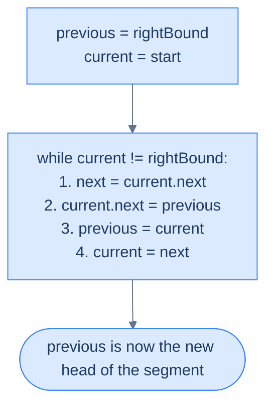
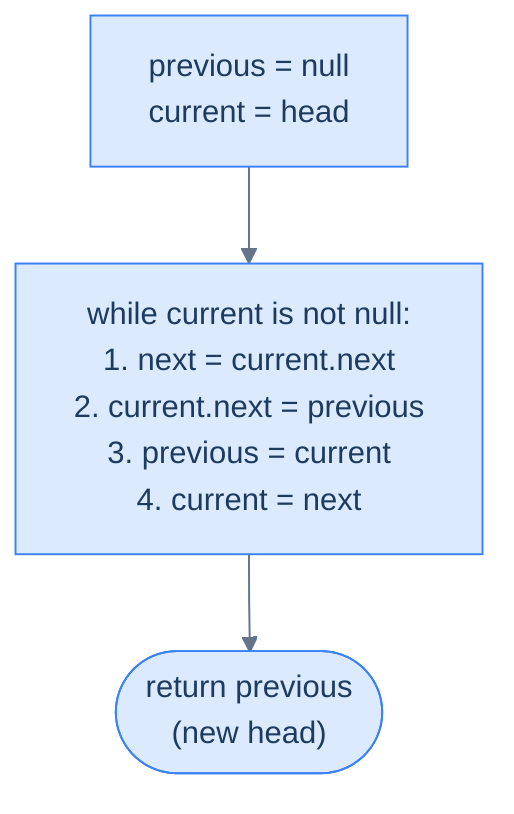

# 6. Pattern: Reversal

## The Hook

Reversing a linked list is the single most-asked question in technical interviews — and not because it's hard, but because it **reveals** everything about you. The clueless candidate allocates a new list and copies values backward: O(n) time, O(n) space, misses the point entirely. The candidate who's read the textbook writes a recursive solution in six lines and blows the stack on a 10-million-node list. The *interview-ready* candidate writes the iterative three-pointer reversal — in-place, O(n) time, O(1) space, six lines — and can explain why every line is necessary.

The reversal pattern is this three-pointer dance: `previous`, `current`, `next`. You'll use it to reverse the whole list, reverse just the first K nodes, reverse the last K nodes, reverse an arbitrary segment, and chain into reorderings and palindrome checks that seem impossible until you see them built out of small reversals. Master the six-line loop once. Every problem in this lesson (and the next) is a thin layer on top of it.

---

## Table of contents

1. [Understanding the reversal pattern](#understanding-the-reversal-pattern)
2. [Identifying direct application](#identifying-direct-application)
3. [Reverse a list](#reverse-a-list)
4. [Reverse first K nodes](#reverse-first-k-nodes)
5. [Reverse last K nodes](#reverse-last-k-nodes)
6. [Reverse the given segment](#reverse-the-given-segment)

***

# Understanding the reversal pattern

Many linked list problems require us to reverse the entire list or a part of it. For some problems, we may have to perform a reversal many times along with other more complex operations. While we can reverse a linked list using loops in multiple passes, it is not the best way to do it, as the code is complicated and error-prone. The most concise and efficient way to reverse a linked list is to use a single-pass in-place reversal algorithm, which is a very simple four-line algorithm.

The reversal pattern is a classification of linked list problems that can be solved using the linked list reversal algorithm.

```d2
direction: down

before: "Before — segment [start, end]" {
  direction: right
  a: {grid-columns: 2; grid-gap: 0; value: a; next}
  s: {grid-columns: 2; grid-gap: 0; value: start; next; style.fill: "#fde68a"; style.stroke: "#d97706"}
  m: {grid-columns: 2; grid-gap: 0; value: "..."; next}
  e: {grid-columns: 2; grid-gap: 0; value: end; next; style.fill: "#fde68a"; style.stroke: "#d97706"}
  z: {grid-columns: 2; grid-gap: 0; value: z; next}
  a.next -> s.value
  s.next -> m.value
  m.next -> e.value
  e.next -> z.value
}

after: "After — segment reversed in place" {
  direction: right
  a: {grid-columns: 2; grid-gap: 0; value: a; next}
  e: {grid-columns: 2; grid-gap: 0; value: end; next; style.fill: "#dcfce7"; style.stroke: "#16a34a"}
  m: {grid-columns: 2; grid-gap: 0; value: "..."; next}
  s: {grid-columns: 2; grid-gap: 0; value: start; next; style.fill: "#dcfce7"; style.stroke: "#16a34a"}
  z: {grid-columns: 2; grid-gap: 0; value: z; next}
  a.next -> e.value
  e.next -> m.value
  m.next -> s.value
  s.next -> z.value
}

before -> after: "flip each next pointer within the segment"
```

<p align="center"><strong>The reversal pattern flips a contiguous segment <code>[start, end]</code> in place — the nodes before <code>start</code> and after <code>end</code> remain untouched. Stitch the reversed segment back to its neighbours and you're done.</strong></p>

In this course, we will learn more about the linked list reversal algorithm and how to identify a problem as a reversal pattern problem.

## Reversing the entire list

Reversing the entire linked list is a special case of the generic reversal algorithm to reverse a segment between `start` and `end`. We first look at this special case as it has a much simpler implementation and is used in most linked list problems that require a reversal. Consider we are given a linked list denoted by `head` and need to reverse it completely.

```d2
direction: right

before: Before {
  direction: right
  h: head {shape: oval}
  n1: {grid-columns: 2; grid-gap: 0; value: 5; next}
  n2: {grid-columns: 2; grid-gap: 0; value: 7; next}
  n3: {grid-columns: 2; grid-gap: 0; value: 3; next}
  n4: {grid-columns: 2; grid-gap: 0; value: 10; next: "null"}
  h -> n1.value
  n1.next -> n2.value
  n2.next -> n3.value
  n3.next -> n4.value
}

after: After {
  direction: right
  h: head {shape: oval}
  n1: {grid-columns: 2; grid-gap: 0; value: 10; next}
  n2: {grid-columns: 2; grid-gap: 0; value: 3; next}
  n3: {grid-columns: 2; grid-gap: 0; value: 7; next}
  n4: {grid-columns: 2; grid-gap: 0; value: 5; next: "null"}
  h -> n1.value
  n1.next -> n2.value
  n2.next -> n3.value
  n3.next -> n4.value
}

before -> after: "flip every next pointer"
```

<p align="center"><strong>Full-list reversal — the old tail becomes the new head, every node's <code>next</code> points to its former predecessor.</strong></p>

We initialize two references and `current` with `nullptr` and the `head` of the list respectively and traverse the list from the head node using `current`. We save the reference of the node after `current` in a reference variable , set the next section of each node to  and update and `current` for the next iteration.

At the end of all iterations, the entire list will be revered, and the will hold the head of the reversed list.


<p align="center"><strong>The three-pointer reversal loop — <code>previous</code>, <code>current</code>, <code>next</code>. At every tick we save the forward link into <code>next</code>, flip <code>current.next</code> backward, then advance both trailing pointers one step.</strong></p>

### Algorithm

The algorithm below summarizes the reversal of the entire linked list in-place.

> **Algorithm**
>
> -   **Step 1:** Create two references, `previous` and `current`, and initialize them with `nullptr`, and `head` respectively.
> -   **Step 2:** Loop while `current` is not equal to `nullptr`, do the following:
>     -   **Step 2.1:** Initialize a reference `next` to store the reference of the node after the `current` node.
>     -   **Step 2.2:** Update the next section of the `current` node to hold the node held by `previous`.
>     -   **Step 2.3:** Update `previous` to hold the reference of the `current` node.
>     -   **Step 2.4:** Update the `current` to hold the node held by `next`
> -   **Step 3:** Return `previous` as the head of the reversed list.

### Implementation

The full-list reversal in all ten languages. Each version is the same three-pointer loop — `previous`, `current`, `next` — differing only in language syntax.


```pseudocode
# Reverse the entire singly linked list in place. O(n) time, O(1) space.
function reverse(head):

    # Initialize references
    current ← head
    previous ← null

    # Set the next reference of each node to its previous node
    while current is not null:
        next ← current.next
        current.next ← previous
        previous ← current
        current ← next

    return previous
```

```python run
from typing import Optional

class ListNode:
    def __init__(self, val=0, next=None):
        self.val = val
        self.next = next

def reverse(head: Optional[ListNode]) -> Optional[ListNode]:

    # Initialize references
    current: Optional[ListNode] = head
    previous: Optional[ListNode] = None

    # Set the next reference of each node to its previous node
    while current is not None:
        next_node: Optional[ListNode] = current.next
        current.next = previous
        previous = current
        current = next_node

    return previous
```

```java run
class Solution {
    public ListNode reverse(ListNode head) {

        // Initialize references
        ListNode current = head;
        ListNode previous = null;

        // Set the next reference of each node to its previous node
        while (current != null) {
            ListNode next = current.next;
            current.next = previous;
            previous = current;
            current = next;
        }

        return previous;
    }
}
```

```c run
typedef struct ListNode { int val; struct ListNode *next; } ListNode;

ListNode* reverse(ListNode *head) {

    /* Initialize references */
    ListNode *current = head;
    ListNode *previous = NULL;

    /* Set the next reference of each node to its previous node */
    while (current != NULL) {
        ListNode *next = current->next;
        current->next = previous;
        previous = current;
        current = next;
    }

    return previous;
}
```

```scala run
object Solution {
  def reverse(head: ListNode): ListNode = {

    // Initialize references
    var current: ListNode = head
    var previous: ListNode = null

    // Set the next reference of each node to its previous node
    while (current != null) {
      val next = current.next
      current.next = previous
      previous = current
      current = next
    }

    previous
  }
}
```


### Complexity Analysis

We traverse the entire list to reverse it in place, and so the runtime complexity is linear **O(N) i**n any case.

Since we do not create any new data structure while reversing the list, the space complexity is constant **O(1)** in any case.

> **Best Case** -
>
> -   Space Complexity - **O(1)**
> -   Time Complexity - **O(N)**
>
> **Worst Case**
>
> -   Space Complexity - **O(1)**
> -   Time Complexity - **O(N)**

## Reversing a segment

Reversing a segment between two nodes is the generic case of the reversal algorithm. Consider we are given a singly linked list and references to two nodes, `start` and `end`, and we need to reverse the segment (including `start` and `end`).

For this example, the two references can never be `null` and will always point to some node in the list such that `start` comes before `end` when traversing the list in the forward direction from `head`.

```d2
direction: right

before: "Before — reverse segment [start, end] inclusive" {
  direction: right
  h: head {shape: oval}
  p: "·"
  s: start {style.fill: "#fde68a"; style.stroke: "#d97706"}
  m: "·"
  e: end {style.fill: "#fde68a"; style.stroke: "#d97706"}
  q: "·"
  h -> p
  p -> s
  s -> m
  m -> e
  e -> q
}

after: "After — segment flipped, outer nodes intact" {
  direction: right
  h: head {shape: oval}
  p: "·"
  e: end {style.fill: "#dcfce7"; style.stroke: "#16a34a"}
  m: "·"
  s: start {style.fill: "#dcfce7"; style.stroke: "#16a34a"}
  q: "·"
  h -> p
  p -> e
  e -> m
  m -> s
  s -> q
}

before -> after
```

<p align="center"><strong>Both endpoints are included. After reversal, the outer list structure is preserved — only the order of nodes inside <code>[start, end]</code> is flipped.</strong></p>

To connect the first node of the segment back to the list after reversal, we need to know the node after `end`. We create a reference variable `rightBound` and initialize it with the node after `end`.

```d2
direction: right
h: head {shape: oval}
p: "·"
s: start
m: "·"
e: end
rb: |md
  **rightBound**

  (= end.next)
| {style.fill: "#fde68a"; style.stroke: "#d97706"}
q: "·"
h -> p
p -> s
s -> m
m -> e
e -> rb
rb -> q
```

<p align="center"><strong>Cache <code>rightBound = end.next</code> <em>before</em> reversing. During reversal we walk from <code>start</code> and stop the moment <code>current == rightBound</code> — the sentinel that tells us we've exhausted the segment.</strong></p>

Next, we initialize two references and `current` with the `rightBound` and `start` respectively and traverse the list from `start` to `end` using `current`.

In each iteration, we save the reference to the node after `current` in a reference  to use it later. We then set the next section of `current` node to .  We then set to `current` and `current` to for the next iteration. At the end of all iterations, the node held in becomes the new head of the reversed segment.



<p align="center"><strong>Same three-pointer loop as full-list reversal — with two tweaks: initialise <code>previous</code> to <code>rightBound</code> (so the reversed segment's tail points to the correct successor), and stop when <code>current == rightBound</code> instead of <code>null</code>.</strong></p>

The last step is to connect the reversed head back to the list. As we will see later when solving problems that use the reversal technique, this is generally done by the caller of the reverse algorithm, which has the references to the node before `start`. 

```d2
direction: right
h: head {shape: oval}
p: predecessor of start
new: |md
  **end**

  (new segment head)
| {style.fill: "#fde68a"; style.stroke: "#d97706"}
m: "·"
s: |md
  **start**

  (new segment tail)
|
rb: rightBound
q: "·"
h -> p
p -> new: "predecessor.next = new head of segment"
new -> m
m -> s
s -> rb
rb -> q
```

<p align="center"><strong>Final stitch — the predecessor of the original <code>start</code> now points at the reversed segment's new head (<code>end</code>). The reversed segment's tail (<code>start</code>) already points at <code>rightBound</code> thanks to our <code>previous = rightBound</code> initialisation.</strong></p>

### Algorithm

The algorithm given below summarizes the linked list reversal between start and end.

> **Algorithm**
>
> -   **Step 1:** Create three references, `previous`, `current`, and `rightBound` and initialize them with `end.next`, `start`, and `end.next` respectively.
> -   **Step 2:** Loop while `current` is not equal to `rightBound`, do the following:
>     -   **Step 2.1:** Initialize a reference `next` to store the reference of the node after the `current` node.
>     -   **Step 2.2:** Update the next section of the `current` node to hold the node held by `previous`.
>     -   **Step 2.3:** Update `previous` to hold the reference of the `current` node.
>     -   **Step 2.4:** Update the `current` to hold the node held by `next`
> -   **Step 3:** Return `previous` as the new head of the list and connect the node before `start` to this new head in the caller of this reverse function.

### Implementation

Segment reversal in all ten languages. The skeleton is the same three-pointer loop as full-list reversal — with two tweaks: initialise `previous` to `rightBound` (so the reversed tail points to the correct successor automatically) and stop when `current == rightBound` instead of `null`.


```pseudocode
# Reverse a segment [start..end]. Seed `previous` with end.next (rightBound) so the reversed tail's next pointer naturally connects to the rest of the list.
function reverse(start, end):

    # Initialize references
    current ← start
    rightBound ← end.next
    previous ← rightBound

    # Set the next reference of each node to its previous node
    while current ≠ rightBound:
        next ← current.next
        current.next ← previous
        previous ← current
        current ← next

    return previous
```

```python run
from typing import Optional

class ListNode:
    def __init__(self, val=0, next=None):
        self.val = val
        self.next = next

def reverse(start: ListNode, end: ListNode) -> ListNode:

    # Initialize references
    current: Optional[ListNode] = start
    right_bound: Optional[ListNode] = end.next
    previous: Optional[ListNode] = right_bound

    # Set the next reference of each node to its previous node
    while current != right_bound:
        next_node: Optional[ListNode] = current.next
        current.next = previous
        previous = current
        current = next_node

    return previous
```

```java run
class Solution {
    public ListNode reverse(ListNode start, ListNode end) {

        // Initialize references
        ListNode current = start;
        ListNode rightBound = end.next;
        ListNode previous = rightBound;

        // Set the next reference of each node to its previous node
        while (current != rightBound) {
            ListNode next = current.next;
            current.next = previous;
            previous = current;
            current = next;
        }

        return previous;
    }
}
```

```c run
typedef struct ListNode { int val; struct ListNode *next; } ListNode;

ListNode* reverseSegment(ListNode *start, ListNode *end) {

    /* Initialize references */
    ListNode *current = start;
    ListNode *rightBound = end->next;
    ListNode *previous = rightBound;

    /* Set the next reference of each node to its previous node */
    while (current != rightBound) {
        ListNode *next = current->next;
        current->next = previous;
        previous = current;
        current = next;
    }

    return previous;
}
```

```scala run
object Solution {
  def reverse(start: ListNode, end: ListNode): ListNode = {

    // Initialize references
    var current: ListNode = start
    val rightBound: ListNode = end.next
    var previous: ListNode = rightBound

    // Set the next reference of each node to its previous node
    while (current ne rightBound) {
      val next = current.next
      current.next = previous
      previous = current
      current = next
    }

    previous
  }
}
```


### Complexity Analysis

We only traverse the linked list between the `start` and `end` to reverse the segment. In the worst case `start` and `end` maybe the beginning and the end of the list, so we will have to traverse the entire list, which takes linear **O(N)** time. In the best case, however, `start` and `end` maybe the same node, and we won't traverse at all, leading to constant **O(1)** time.

Since we do not create any new data structure while reversing the list, the space complexity is constant **O(1)** in any case.

> **Best Case** - start and end are the same node.
>
> -   Space Complexity - **O(1)**
> -   Time Complexity - **O(1)**
>
> **Worst Case** - start and end are the head and tail of the list.
>
> -   Space Complexity - **O(1)**
> -   Time Complexity - **O(N)**

## Applications

Many linked problems may be classified as reversal pattern problems. Some may be solved by directly applying the reversal algorithm, while others may comprise one or more subproblems that can be solved using the reversal algorithm. We further classify the reversal pattern problems as follows.

> -   Direct application
> -   Subproblems

Later in the course, we will examine techniques for identifying all categories of the reversal pattern problems.

***

# Identifying direct application

The linked list reversal algorithm can only be directly applied to specific problems that fall under the reversal pattern. These are generally **easy** problems where we must revere the entire list of a part of it to solve. If the problem statement or its solution follows the generic template below, it can be solved by using the linked list reversal algorithm directly.

**Template**: Given a linked and two nodes `start` and `end`, reverse the linked list between these two nodes.

## Example

To better understand the problems that can be solved by directly applying the linked list reversal algorithm, let's consider the following problem and see how we can identify it as a direct application.

> **Problem statement:** Given a singly linked list, reverse it in place

```d2
direction: right

before: Input {
  direction: right
  n1: {grid-columns: 2; grid-gap: 0; value: 5; next}
  n2: {grid-columns: 2; grid-gap: 0; value: 7; next}
  n3: {grid-columns: 2; grid-gap: 0; value: 3; next}
  n4: {grid-columns: 2; grid-gap: 0; value: 10; next: "null"}
  n1.next -> n2.value
  n2.next -> n3.value
  n3.next -> n4.value
}

after: "Output (in-place reversal)" {
  direction: right
  n1: {grid-columns: 2; grid-gap: 0; value: 10; next}
  n2: {grid-columns: 2; grid-gap: 0; value: 3; next}
  n3: {grid-columns: 2; grid-gap: 0; value: 7; next}
  n4: {grid-columns: 2; grid-gap: 0; value: 5; next: "null"}
  n1.next -> n2.value
  n2.next -> n3.value
  n3.next -> n4.value
}

before -> after
```

<p align="center"><strong>"In place" means no auxiliary list is built — the same nodes are rewired, not copied. O(1) extra space.</strong></p>

### Linked list reversal algorithm

The problem description fits the template for the direct application of the reversal pattern we learned earlier.

**Template**:

Given a linked and two nodes `start` (`head` of the list) and `end` (tail of the list) reverse the linked list between these two nodes.

The complete reversal of the singly linked list is a special case of the reversal algorithm that we learned earlier. We initialize two references `current` and with `head` and `nullptr` respectively and traverse the list from the `head` using `current`. In each iteration, we save the reference to the node in a new reference variable, set the the next section of the node to , and update the `current` and for the next iteration. At the end of all iterations, will be the head of the reversed list.



<p align="center"><strong>The three-pointer reversal loop — <code>previous</code>, <code>current</code>, <code>next</code>. At every tick we save the forward link into <code>next</code>, flip <code>current.next</code> backward, then advance both trailing pointers one step.</strong></p>

The implementation of the reversal algorithm to reverse the entire list, in all ten languages:


```pseudocode
# Same algorithm as `reverse` above — re-listed under the standard public name with source's verbose per-step comments.
function reverseAList(head):

    # Initialize pointers current and previous
    current ← head
    previous ← null

    while current is not null:

        # Save the address of next node
        next ← current.next

        # Update the next of current node
        current.next ← previous

        # Move previous to hold current node
        previous ← current

        # Move current ahead
        current ← next

    return previous
```

```python run
from typing import Optional

class ListNode:
    def __init__(self, val=0, next=None):
        self.val = val
        self.next = next

class Solution:
    def reverse_a_list(
        self, head: Optional[ListNode]
    ) -> Optional[ListNode]:

        # Initialize pointers current and previous
        current: Optional[ListNode] = head
        previous: Optional[ListNode] = None

        while current is not None:

            # Save the address of next node
            next_node = current.next

            # Update the next of current node
            current.next = previous

            # Move previous to hold current node
            previous = current

            # Move current ahead
            current = next_node

        return previous
```

```java run
class Solution {
    public ListNode reverseAList(ListNode head) {

        // Initialize pointers current and previous
        ListNode current = head;
        ListNode previous = null;

        while (current != null) {

            // Save the address of next node
            ListNode next = current.next;

            // Update the next of current node
            current.next = previous;

            // Move previous to hold current node
            previous = current;

            // Move current ahead
            current = next;
        }

        return previous;
    }
}
```

```c run
typedef struct ListNode { int val; struct ListNode *next; } ListNode;

ListNode* reverseAList(ListNode *head) {

    /* Initialize pointers current and previous */
    ListNode *current = head;
    ListNode *previous = NULL;

    while (current != NULL) {

        /* Save the address of next node */
        ListNode *next = current->next;

        /* Update the next of current node */
        current->next = previous;

        /* Move previous to hold current node */
        previous = current;

        /* Move current ahead */
        current = next;
    }

    return previous;
}
```

```scala run
object Solution {
  def reverseAList(head: ListNode): ListNode = {

    // Initialize pointers current and previous
    var current: ListNode = head
    var previous: ListNode = null

    while (current != null) {

      // Save the address of next node
      val next = current.next

      // Update the next of current node
      current.next = previous

      // Move previous to hold current node
      previous = current

      // Move current ahead
      current = next
    }

    previous
  }
}
```


## Example Problems

Most problems that fall under this category are**easy**problems; a list of a few is given below.

> -   **[Reverse a list](#reverse-a-list)**
> -   **[Reverse first K nodes](#reverse-first-k-nodes)**
> -   **[Reverse last K nodes](#reverse-last-k-nodes)**
> -   **[Reverse the given segment](#reverse-the-given-segment)**

We will now solve these problems to understand the direct application of this pattern better.

***

# Reverse a list

## Problem Statement

Given the **head** of a singly linked list, write a function to reverse the list and return the head of the reversed list.

You need to reverse the list in place.

### Example

> -   **Input:** head = \[5, 7, 3, 10\]
> -   **Output:** \[10, 3, 7, 5\]

## Solution


```pseudocode
# Reverse the singly linked list in place — direct application of the reversal algorithm.
function reverseAList(head):

    # Initialize pointers current and previous
    current ← head
    previous ← null

    while current is not null:

        # Save the address of next node
        next ← current.next

        # Update the next of current node
        current.next ← previous

        # Move previous to hold current node
        previous ← current

        # Move current ahead
        current ← next

    return previous
```

```python run
from typing import Optional

class ListNode:
    def __init__(self, val=0, next=None):
        self.val = val
        self.next = next

def reverse_a_list(head: Optional[ListNode]) -> Optional[ListNode]:

    # Initialize pointers current and previous
    current: Optional[ListNode] = head
    previous: Optional[ListNode] = None

    while current is not None:

        # Save the address of next node
        next_node = current.next

        # Update the next of current node
        current.next = previous

        # Move previous to hold current node
        previous = current

        # Move current ahead
        current = next_node

    return previous

def print_list(head):
    parts = []
    while head:
        parts.append(str(head.val))
        head = head.next
    print(" -> ".join(parts))

# Driver: [5, 7, 3, 10] -> [10, 3, 7, 5]
n1 = ListNode(5); n2 = ListNode(7); n3 = ListNode(3); n4 = ListNode(10)
n1.next = n2; n2.next = n3; n3.next = n4

result = reverse_a_list(n1)
print_list(result)  # 10 -> 3 -> 7 -> 5
```

```java run
public class ReverseAList {
    static class ListNode {
        int val;
        ListNode next;
        ListNode(int v) { val = v; }
        ListNode(int v, ListNode n) { val = v; next = n; }
    }

    static ListNode reverseAList(ListNode head) {

        // Initialize pointers current and previous
        ListNode current = head;
        ListNode previous = null;

        while (current != null) {

            // Save the address of next node
            ListNode next = current.next;

            // Update the next of current node
            current.next = previous;

            // Move previous to hold current node
            previous = current;

            // Move current ahead
            current = next;
        }

        return previous;
    }

    static void printList(ListNode head) {
        StringBuilder sb = new StringBuilder();
        while (head != null) {
            sb.append(head.val);
            if (head.next != null) sb.append(" -> ");
            head = head.next;
        }
        System.out.println(sb);
    }

    public static void main(String[] args) {
        // [5, 7, 3, 10] -> [10, 3, 7, 5]
        ListNode n1 = new ListNode(5); ListNode n2 = new ListNode(7);
        ListNode n3 = new ListNode(3); ListNode n4 = new ListNode(10);
        n1.next = n2; n2.next = n3; n3.next = n4;

        printList(reverseAList(n1)); // 10 -> 3 -> 7 -> 5
    }
}
```

```c run
#include <stdio.h>
#include <stdlib.h>

typedef struct ListNode {
    int val;
    struct ListNode *next;
} ListNode;

ListNode* newNode(int v) {
    ListNode *n = malloc(sizeof *n);
    n->val = v; n->next = NULL;
    return n;
}

ListNode* reverseAList(ListNode *head) {

    /* Initialize pointers current and previous */
    ListNode *current = head;
    ListNode *previous = NULL;

    while (current != NULL) {

        /* Save the address of next node */
        ListNode *next = current->next;

        /* Update the next of current node */
        current->next = previous;

        /* Move previous to hold current node */
        previous = current;

        /* Move current ahead */
        current = next;
    }

    return previous;
}

void printList(ListNode *head) {
    while (head) {
        printf("%d", head->val);
        if (head->next) printf(" -> ");
        head = head->next;
    }
    printf("\n");
}

int main() {
    /* [5, 7, 3, 10] -> [10, 3, 7, 5] */
    ListNode *n1 = newNode(5); ListNode *n2 = newNode(7);
    ListNode *n3 = newNode(3); ListNode *n4 = newNode(10);
    n1->next = n2; n2->next = n3; n3->next = n4;

    printList(reverseAList(n1)); /* 10 -> 3 -> 7 -> 5 */
    return 0;
}
```

```scala run
class ListNode(var v: Int, var next: ListNode = null)

object ReverseAList {
  def reverseAList(head: ListNode): ListNode = {

    // Initialize pointers current and previous
    var current = head
    var previous: ListNode = null

    while (current != null) {

      // Save the address of next node
      val next = current.next

      // Update the next of current node
      current.next = previous

      // Move previous to hold current node
      previous = current

      // Move current ahead
      current = next
    }

    previous
  }

  def printList(head: ListNode): Unit = {
    var cur = head
    val parts = scala.collection.mutable.ListBuffer[String]()
    while (cur != null) { parts += cur.v.toString; cur = cur.next }
    println(parts.mkString(" -> "))
  }

  def main(args: Array[String]): Unit = {
    // [5, 7, 3, 10] -> [10, 3, 7, 5]
    val n1 = new ListNode(5); val n2 = new ListNode(7)
    val n3 = new ListNode(3); val n4 = new ListNode(10)
    n1.next = n2; n2.next = n3; n3.next = n4

    printList(reverseAList(n1)) // 10 -> 3 -> 7 -> 5
  }
}
```


***

# Reverse first K nodes

## Problem Statement

Given the **head** of a singly linked list and a non-negative integer **k**, write a function to reverse the first k nodes of the list and return the head of the reversed list.

You need to reverse the list in place.

### Example

> -   **Input:** head = \[5, 7, 3, 10\], k = 2
> -   **Output:** \[7, 5, 3, 10\]

## Solution


```pseudocode
# Reverse the first k nodes; stitch the original head (now the segment's tail) to the suffix.
function reverseFirstKNodes(head, k):

    # if K is less than or equal to 0, return the original head
    if k ≤ 0:
        return head

    # Initialize pointers current and previous
    current ← head
    previous ← null
    count ← 0

    while current is not null AND count < k:

        # Save the address of next node
        next ← current.next

        # Update the next of current node
        current.next ← previous

        # Move previous to hold current node
        previous ← current

        # Move current ahead
        current ← next

        # Increment count
        count ← count + 1

    # Connect the reversed sublist with the remaining part
    if head is not null:
        head.next ← current

    return previous
```

```python run
from typing import Optional

class ListNode:
    def __init__(self, val=0, next=None):
        self.val = val
        self.next = next

class Solution:
    def reverse_first_k_nodes(
        self, head: Optional[ListNode], k: int
    ) -> Optional[ListNode]:

        # if K is less than or equal to 0, return the original head
        if k <= 0:
            return head

        # Initialize pointers current and previous
        current: Optional[ListNode] = head
        previous: Optional[ListNode] = None
        count = 0

        while current is not None and count < k:

            # Save the address of next node
            next_node = current.next

            # Update the next of current node
            current.next = previous

            # Move previous to hold current node
            previous = current

            # Move current ahead
            current = next_node

            # Increment count
            count += 1

        # Connect the reversed sublist with the remaining part
        if head is not None:
            head.next = current

        return previous
```

```java run
class Solution {
    public ListNode reverseFirstKNodes(ListNode head, int k) {

        // if K is less than or equal to 0, return the original head
        if (k <= 0) {
            return head;
        }

        // Initialize pointers current and previous
        ListNode current = head;
        ListNode previous = null;
        int count = 0;

        while (current != null && count < k) {

            // Save the address of next node
            ListNode next = current.next;

            // Update the next of current node
            current.next = previous;

            // Move previous to hold current node
            previous = current;

            // Move current ahead
            current = next;

            // Increment count
            count++;
        }

        // Connect the reversed sublist with the remaining part
        if (head != null) {
            head.next = current;
        }

        return previous;
    }
}
```

```c run
typedef struct ListNode { int val; struct ListNode *next; } ListNode;

ListNode* reverseFirstKNodes(ListNode *head, int k) {

    /* if K is less than or equal to 0, return the original head */
    if (k <= 0) {
        return head;
    }

    /* Initialize pointers current and previous */
    ListNode *current = head;
    ListNode *previous = NULL;
    int count = 0;

    while (current != NULL && count < k) {

        /* Save the address of next node */
        ListNode *next = current->next;

        /* Update the next of current node */
        current->next = previous;

        /* Move previous to hold current node */
        previous = current;

        /* Move current ahead */
        current = next;

        /* Increment count */
        count++;
    }

    /* Connect the reversed sublist with the remaining part */
    if (head != NULL) {
        head->next = current;
    }

    return previous;
}
```

```scala run
object Solution {
  def reverseFirstKNodes(head: ListNode, k: Int): ListNode = {

    // if K is less than or equal to 0, return the original head
    if (k <= 0) {
      return head
    }

    // Initialize pointers current and previous
    var current: ListNode = head
    var previous: ListNode = null
    var count = 0

    while (current != null && count < k) {

      // Save the address of next node
      val next = current.next

      // Update the next of current node
      current.next = previous

      // Move previous to hold current node
      previous = current

      // Move current ahead
      current = next

      // Increment count
      count += 1
    }

    // Connect the reversed sublist with the remaining part
    if (head != null) {
      head.next = current
    }

    previous
  }
}
```


***

# Reverse last K nodes

## Problem Statement

Given the **head** of a singly linked list and a non-negative integer **k**, write a function to reverse the last k nodes of the list and return the head of the reversed list.

You need to reverse the list in place.

### Example

> -   **Input:** head = \[5, 7, 3, 10\], k = 2
> -   **Output:** \[5, 7, 10, 3\]

## Solution


```pseudocode
# Reverse the LAST k nodes by walking to the (length − k − 1)-th node, then reversing the tail and stitching it back on.
function lengthOfList(head):

    # Traverse the list and increment the length until the end
    length ← 0
    while head is not null:
        length ← length + 1
        head ← head.next

    # Return the length
    return length

function reverseAList(head):

    # Initialize pointers current and previous
    current ← head
    previous ← null

    while current is not null:
        next ← current.next
        current.next ← previous
        previous ← current
        current ← next

    return previous

function reverseLastKNodes(head, k):

    # if K is less than or equal to 0, return the original head
    if k ≤ 0:
        return head

    # Find the length of the list
    length ← lengthOfList(head)

    # If k is greater than or equal to length, reverse the entire list
    if k ≥ length:
        return reverseAList(head)

    # Find the (length - k)th node after which the reversal should occur
    current ← head
    for i ← 1 to length − k − 1:
        current ← current.next

    # Reverse the last k nodes
    lastKReverseHead ← reverseAList(current.next)

    # Connect the (length - k)th node to the new head
    current.next ← lastKReverseHead

    return head
```

```python run
from typing import Optional

class Solution:
    def length_of_list(self, head: Optional[ListNode]) -> int:
        length: int = 0

        # Traverse the list and increment the length until the end
        while head:
            length += 1
            head = head.next

        # Return the length
        return length

    def reverse_a_list(
        self, head: Optional[ListNode]
    ) -> Optional[ListNode]:

        # Initialize pointers current and previous
        current: Optional[ListNode] = head
        previous: Optional[ListNode] = None

        while current is not None:

            # Save the address of next node
            next_node = current.next

            # Update the next of current node
            current.next = previous

            # Move previous to hold current node
            previous = current

            # Move current ahead
            current = next_node

        return previous

    def reverse_last_k_nodes(
        self, head: Optional[ListNode], k: int
    ) -> Optional[ListNode]:

        # if K is less than or equal to 0, return the original head
        if k <= 0:
            return head

        # Find the length of the list
        length = self.length_of_list(head)

        # If k is greater than or equal to length, reverse the entire
        # list
        if k >= length:
            return self.reverse_a_list(head)

        # Find the (length - k)th node after which the reversal should
        # occur
        current = head
        for _ in range(1, length - k):
            current = current.next

        # Reverse the last k nodes
        last_k_reverse_head = self.reverse_a_list(current.next)

        # Connect the (length - k)th node to the new head
        current.next = last_k_reverse_head

        return head
```

```java run
class Solution {
    private int lengthOfList(ListNode head) {
        int length = 0;

        // Traverse the list and increment the length until the end
        while (head != null) {
            length++;
            head = head.next;
        }

        // Return the length
        return length;
    }

    private ListNode reverseAList(ListNode head) {

        // Initialize pointers current and previous
        ListNode current = head;
        ListNode previous = null;

        while (current != null) {

            // Save the address of next node
            ListNode next = current.next;

            // Update the next of current node
            current.next = previous;

            // Move previous to hold current node
            previous = current;

            // Move current ahead
            current = next;
        }

        return previous;
    }

    public ListNode reverseLastKNodes(ListNode head, int k) {

        // if K is less than or equal to 0, return the original head
        if (k <= 0) {
            return head;
        }

        // Find the length of the list
        int length = lengthOfList(head);

        // If k is greater than or equal to length, reverse the entire
        // list
        if (k >= length) {
            return reverseAList(head);
        }

        // Find the (length - k)th node after which the reversal should
        // occur
        ListNode current = head;
        for (int i = 1; i < length - k; i++) {
            current = current.next;
        }

        // Reverse the last k nodes
        ListNode lastKReverseHead = reverseAList(current.next);

        // Connect the (length - k)th node to the new head
        current.next = lastKReverseHead;

        return head;
    }
}
```

```c run
static int lengthOfList(ListNode *head) {
    int length = 0;

    /* Traverse the list and increment the length until the end */
    while (head != NULL) {
        length++;
        head = head->next;
    }

    /* Return the length */
    return length;
}

static ListNode* reverseAList(ListNode *head) {

    /* Initialize pointers current and previous */
    ListNode *current = head;
    ListNode *previous = NULL;

    while (current != NULL) {

        /* Save the address of next node */
        ListNode *next = current->next;

        /* Update the next of current node */
        current->next = previous;

        /* Move previous to hold current node */
        previous = current;

        /* Move current ahead */
        current = next;
    }

    return previous;
}

ListNode* reverseLastKNodes(ListNode *head, int k) {

    /* if K is less than or equal to 0, return the original head */
    if (k <= 0) {
        return head;
    }

    /* Find the length of the list */
    int length = lengthOfList(head);

    /* If k is greater than or equal to length, reverse the entire
       list */
    if (k >= length) {
        return reverseAList(head);
    }

    /* Find the (length - k)th node after which the reversal should
       occur */
    ListNode *current = head;
    for (int i = 1; i < length - k; i++) {
        current = current->next;
    }

    /* Reverse the last k nodes */
    ListNode *lastKReverseHead = reverseAList(current->next);

    /* Connect the (length - k)th node to the new head */
    current->next = lastKReverseHead;

    return head;
}
```

```scala run
object Solution {
  private def lengthOfList(head: ListNode): Int = {
    var length = 0

    // Traverse the list and increment the length until the end
    var cur = head
    while (cur != null) {
      length += 1
      cur = cur.next
    }

    // Return the length
    length
  }

  private def reverseAList(head: ListNode): ListNode = {

    // Initialize pointers current and previous
    var current = head
    var previous: ListNode = null

    while (current != null) {

      // Save the address of next node
      val next = current.next

      // Update the next of current node
      current.next = previous

      // Move previous to hold current node
      previous = current

      // Move current ahead
      current = next
    }

    previous
  }

  def reverseLastKNodes(head: ListNode, k: Int): ListNode = {

    // if K is less than or equal to 0, return the original head
    if (k <= 0) {
      return head
    }

    // Find the length of the list
    val length = lengthOfList(head)

    // If k is greater than or equal to length, reverse the entire
    // list
    if (k >= length) {
      return reverseAList(head)
    }

    // Find the (length - k)th node after which the reversal should
    // occur
    var current = head
    var i = 1
    while (i < length - k) {
      current = current.next
      i += 1
    }

    // Reverse the last k nodes
    val lastKReverseHead = reverseAList(current.next)

    // Connect the (length - k)th node to the new head
    current.next = lastKReverseHead

    head
  }
}
```


***

# Reverse the given segment

## Problem Statement

Given the **head** of a singly linked list and two integers **left** and **right** where **left <= right**. Write a function to reverse the list nodes from the position left to the right and return the head of the reversed list.

### Example 1

> -   **Input:** head = \[5, 7, 3, 10, 6\], left = 2, right = 4
> -   **Output:** \[5, 10, 3, 7, 6\]
> -   **Explanation:** After reversing the sublist from the second node to the fourth node, the list becomes \[5, 10, 3, 7, 6\].

### Example 2

> -   **Input:** head = \[5\], left = 1, right = 1
> -   **Output:** \[5\]
> -   **Explanation:** After reversing the first node of the list, the list becomes \[5\].

## Solution


```pseudocode
# Reverse arbitrary positions [left..right] (1-indexed). Stitch the leftBound to the new head of the segment.
function getNodeAtPosition(head, position):
    current ← head
    for i ← 1 to position − 1:
        current ← current.next
    return current

function reverse(start, end):
    current ← start
    rightBound ← end.next
    previous ← rightBound

    while current ≠ rightBound:
        next ← current.next
        current.next ← previous
        previous ← current
        current ← next

    return previous

function reverseTheGivenSegment(head, left, right):

    # Handle cases where reversal is not needed
    if head is null OR head.next is null OR left = right:
        return head

    # Get the end node of the segment
    end ← getNodeAtPosition(head, right)

    # If the left position is 1, reverse from the head
    if left = 1:
        return reverse(head, end)

    # Get the node before the 'left' position to connect after reversal
    leftBound ← getNodeAtPosition(head, left − 1)

    # Node at the start of the segment to reverse
    start ← leftBound.next

    # Reverse the segment and connect to the leftBound node
    leftBound.next ← reverse(start, end)

    # Return the modified list
    return head
```

```python run
from typing import Optional

class Solution:
    def get_node_at_position(
        self, head: Optional[ListNode], position: int
    ) -> Optional[ListNode]:
        current = head
        for i in range(1, position):
            current = current.next
        return current

    def reverse(
        self, start: Optional[ListNode], end: Optional[ListNode]
    ) -> Optional[ListNode]:
        current: Optional[ListNode] = start
        right_bound: Optional[ListNode] = end.next
        previous: Optional[ListNode] = right_bound

        while current != right_bound:
            next_node = current.next
            current.next = previous
            previous = current
            current = next_node

        return previous

    def reverse_the_given_segment(
        self, head: Optional[ListNode], left: int, right: int
    ) -> Optional[ListNode]:

        # Handle cases where reversal is not needed
        if head is None or head.next is None or left == right:
            return head

        # Get the end node of the segment
        end = self.get_node_at_position(head, right)

        # If the left position is 1, reverse from the head
        if left == 1:
            return self.reverse(head, end)

        # Get the node before the 'left' position to connect after
        # reversal
        left_bound = self.get_node_at_position(head, left - 1)

        # Node at the start of the segment to reverse
        start = left_bound.next

        # Reverse the segment and connect to the left_bound node
        left_bound.next = self.reverse(start, end)

        # Return the modified list
        return head
```

```java run
class Solution {
    private ListNode getNodeAtPosition(ListNode head, int position) {
        ListNode current = head;
        for (int i = 1; i < position; ++i) {
            current = current.next;
        }
        return current;
    }

    private ListNode reverse(ListNode start, ListNode end) {
        ListNode current = start;
        ListNode rightBound = end.next;
        ListNode previous = rightBound;

        while (current != rightBound) {
            ListNode next = current.next;
            current.next = previous;
            previous = current;
            current = next;
        }

        return previous;
    }

    public ListNode reverseTheGivenSegment(
        ListNode head,
        int left,
        int right
    ) {

        // Handle cases where reversal is not needed
        if (head == null || head.next == null || left == right) {
            return head;
        }

        // Get the end node of the segment
        ListNode end = getNodeAtPosition(head, right);

        // If the left position is 1, reverse from the head
        if (left == 1) {
            return reverse(head, end);
        }

        // Get the node before the 'left' position to connect after
        // reversal
        ListNode leftBound = getNodeAtPosition(head, left - 1);

        // Node at the start of the segment to reverse
        ListNode start = leftBound.next;

        // Reverse the segment and connect to the leftBound node
        leftBound.next = reverse(start, end);

        // Return the modified list
        return head;
    }
}
```

```c run
static ListNode* getNodeAtPosition(ListNode *head, int position) {
    ListNode *current = head;
    for (int i = 1; i < position; ++i) {
        current = current->next;
    }
    return current;
}

static ListNode* reverse(ListNode *start, ListNode *end) {
    ListNode *current = start;
    ListNode *rightBound = end->next;
    ListNode *previous = rightBound;

    while (current != rightBound) {
        ListNode *next = current->next;
        current->next = previous;
        previous = current;
        current = next;
    }

    return previous;
}

ListNode* reverseTheGivenSegment(ListNode *head, int left, int right) {

    /* Handle cases where reversal is not needed */
    if (head == NULL || head->next == NULL || left == right) {
        return head;
    }

    /* Get the end node of the segment */
    ListNode *end = getNodeAtPosition(head, right);

    /* If the left position is 1, reverse from the head */
    if (left == 1) {
        return reverse(head, end);
    }

    /* Get the node before the 'left' position to connect after
       reversal */
    ListNode *leftBound = getNodeAtPosition(head, left - 1);

    /* Node at the start of the segment to reverse */
    ListNode *start = leftBound->next;

    /* Reverse the segment and connect to the leftBound node */
    leftBound->next = reverse(start, end);

    /* Return the modified list */
    return head;
}
```

```scala run
object Solution {
  private def getNodeAtPosition(head: ListNode, position: Int): ListNode = {
    var current = head
    var i = 1
    while (i < position) {
      current = current.next
      i += 1
    }
    current
  }

  private def reverse(start: ListNode, end: ListNode): ListNode = {
    var current: ListNode = start
    val rightBound: ListNode = end.next
    var previous: ListNode = rightBound

    while (current ne rightBound) {
      val next = current.next
      current.next = previous
      previous = current
      current = next
    }

    previous
  }

  def reverseTheGivenSegment(head: ListNode, left: Int, right: Int): ListNode = {

    // Handle cases where reversal is not needed
    if (head == null || head.next == null || left == right) {
      return head
    }

    // Get the end node of the segment
    val end = getNodeAtPosition(head, right)

    // If the left position is 1, reverse from the head
    if (left == 1) {
      return reverse(head, end)
    }

    // Get the node before the 'left' position to connect after
    // reversal
    val leftBound = getNodeAtPosition(head, left - 1)

    // Node at the start of the segment to reverse
    val start = leftBound.next

    // Reverse the segment and connect to the leftBound node
    leftBound.next = reverse(start, end)

    // Return the modified list
    head
  }
}
```


***

## Final Takeaway

Every reversal problem reduces to the same six-line loop:

```
previous = <appropriate sentinel>
current  = <segment start>
while current != <stop sentinel>:
    next          = current.next   # save forward link BEFORE clobbering it
    current.next  = previous       # flip the pointer
    previous      = current        # advance previous one step
    current       = next           # advance current  one step
```

Three insights to internalise:

1. **Save the forward link first.** The instant you flip `current.next`, the forward path disappears. `next = current.next` is the line that keeps the rest of the list reachable.
2. **Sentinels control scope.** For full-list reversal, the sentinel is `null` on both ends. For segment reversal, the sentinel is `rightBound = end.next` and the initial `previous` is `rightBound` itself (so the reversed tail points to the correct successor automatically).
3. **Reversal composes.** Every problem in the next lesson — reverse first K, reverse last K, reverse in groups, palindrome check — is just this loop wrapped in different sentinel choices and reconnection logic.

When you next see a linked-list problem that mentions "backward", "reverse", "palindrome", "opposite order", or asks you to prove a list has mirror structure — reach for the three-pointer loop first.

> **Transfer Challenge:** Reverse a linked list **recursively** in O(n) time with O(n) stack space. Then explain why the iterative version is strictly preferable in production code.
>
> <details><summary><strong>Answer</strong></summary>
>
> Recursive:
>
> ```
> def reverse(head):
>     if head is None or head.next is None:
>         return head
>     new_head = reverse(head.next)
>     head.next.next = head   # the node just after head now points back to head
>     head.next = None        # head becomes the new tail
>     return new_head
> ```
>
> Why iterative wins in production: recursion costs O(n) stack space, and for a 10-million-node list that blows the default stack limit (~1 MB ≈ 10⁵ frames in most languages). The iterative three-pointer version runs the same algorithm in O(1) extra space and never crashes regardless of input size.
>
> </details>
