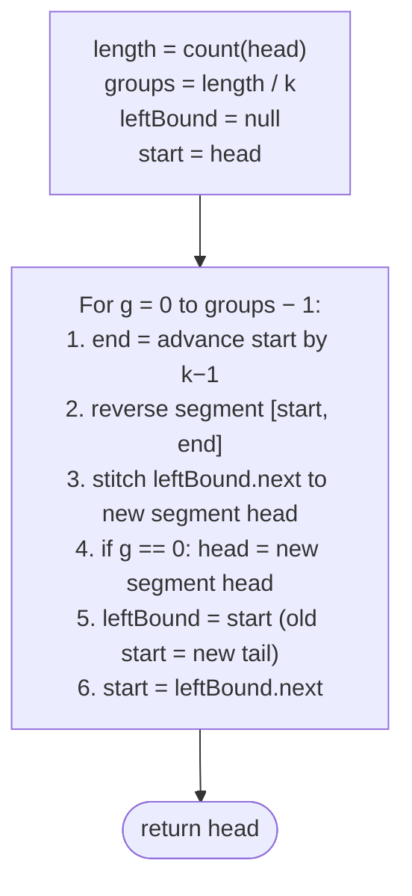

# 7. Pattern: Reversal (Subproblem)

## The Hook

You learned the six-line reversal loop in the last lesson. Now the real game begins. What if you only want to reverse **part** of a list — first K, last K, every K, alternate segments? These problems *look* harder, but under the microscope they're all the same trick: **carve the list into windows, call reversal on each window, stitch the windows back together.** Reversal is the atom. Everything here is molecules.

The one new skill is **boundary tracking**. A full-list reversal has no boundaries — the endpoints are `head` and `null`. A segment reversal has four: the node before `start`, `start`, `end`, and the node after `end`. Lose any one of them and the list falls apart. Master the four-pointer boundary dance and you've unlocked every reversal-as-subroutine problem in the interview canon. Let's go.

---

## Table of contents

1. [Identifying reversal subproblem](#identifying-reversal-subproblem)
2. [Pairwise swap](#pairwise-swap)
3. [Reverse K-segments](#reverse-k-segments)
4. [Reverse increasing groups](#reverse-increasing-groups)
5. [Reverse alternate segments](#reverse-alternate-segments)

***

# Identifying reversal subproblem

Some problems may consist of smaller subproblems that can be solved using the reversal technique. Solving these subproblems may either partially or fully solve the original problem. These are usually **medium** or **hard** problems, as breaking down a problem into subproblems may not be obvious and may require some critical observation. These problems are also implementation-heavy, meaning the solution code is often big and complex, which makes it error-prone.

Asking yourself the following questions will help you determine whether a problem is a reversal subproblem pattern problem or not.

**Ask yourself questions:**

Q1. Can the problem or solution be broken down into smaller subproblems?

Q2. Can any subproblem be solved by reversing a part of the linked list?

## Example

Let's consider an example problem and see how to break it down into smaller subproblems that can be solved using the reversal algorithm to understand it better.

> **Problem statement:** Given a linked list, reverse the list in groups of K in-place. If the last group in the list does not have K nodes, don't reverse it.

Consider the following example with`k = 3`for a linked list of size 7.

```d3 widget=linked-list
{
  "title": "Reverse in groups of k=3 — each chunk reversed in place; trailing fragment stays put",
  "direction": "single",
  "nodes": [
    {"id": "n1", "value": "1"},
    {"id": "n2", "value": "2"},
    {"id": "n3", "value": "3"},
    {"id": "n4", "value": "4"},
    {"id": "n5", "value": "5"},
    {"id": "n6", "value": "6"},
    {"id": "n7", "value": "7"}
  ],
  "head": "n1",
  "steps": [
    {
      "links": [["n1","n2"],["n2","n3"],["n3","n4"],["n4","n5"],["n5","n6"],["n6","n7"]],
      "markers": [{"name": "head", "nodeId": "n1"}],
      "msg": "Before: 1 → 2 → 3 → 4 → 5 → 6 → 7"
    },
    {
      "nodes": [
        {"id": "n3", "value": "3"},
        {"id": "n2", "value": "2"},
        {"id": "n1", "value": "1"},
        {"id": "n6", "value": "6"},
        {"id": "n5", "value": "5"},
        {"id": "n4", "value": "4"},
        {"id": "n7", "value": "7"}
      ],
      "links": [["n3","n2"],["n2","n1"],["n1","n6"],["n6","n5"],["n5","n4"],["n4","n7"]],
      "markers": [{"name": "head", "nodeId": "n3"}],
      "msg": "After: each group of 3 reversed → 3 → 2 → 1 → 6 → 5 → 4 → 7 (trailing single node 7 untouched)"
    }
  ]
}
```

<p align="center"><strong>Reverse-in-groups-of-K — slice the list into chunks of <code>k</code>, reverse each chunk in place, and leave any trailing (fewer-than-<code>k</code>) nodes untouched. The core reversal loop is invoked once per chunk.</strong></p>

## Linked list reversal solution

Let's ask ourselves the questions we listed above to identify if we can reduce this problem to the two-pointer pattern problem.

**Template:**

Q1. Can the problem or solution be broken down into smaller subproblems?

A1. Yes, we can break down the solution as a combination `length / k` reversal operations, where `length` is the length of the linked list.

Q2. Can any subproblem be solved by reversing a part of the linked list?

A2. Yes, all subproblems except finding the length can be solved by reversing a part of the linked list.

The critical observation here is that reversing a group of size `k` is the same as reversing a part of the linked list between start and end. We traverse the linked list `k` nodes at a time and reverse each group as we go. We initialize a variable `groups` with the number of k-groups (`length / k`) to reverse, truncating the fractional part as the number of k groups will always be a whole number. We use `groups` to iterate, reversing a k-group in each iteration. 

```d2
direction: right
length: "length = 7"
k: "k = 3"
g: "groups = length / k = 2 (integer division)"
r: "remaining = length % k = 1 (trailing, untouched)"
length -> g
k -> g
length -> r
k -> r
```

<p align="center"><strong>Pre-compute <code>length</code> in one pass. The number of full reversible groups is <code>length / k</code>; the remainder <code>length % k</code> trails untouched.</strong></p>

We use two reference variables `start` and `end` to denote the boundary of a k-group that we need to reverse and a variable `leftBound` to hold the node before `start` that is used to correctly connect the head of the reversed segment to the list.

We initialize `start` and `end` with the `head` of the list and iterate `k-1` times using `end` to find the end of the first k-group. We initialize `leftBound` with null for the first k-group, as there is no node before the head of the list.

```d3 widget=linked-list
{
  "title": "Boundary pointers — leftBound (before start), start (group head), end (group tail)",
  "direction": "single",
  "nodes": [
    {"id": "lb", "value": "leftBound"},
    {"id": "n1", "value": "1"},
    {"id": "n2", "value": "2"},
    {"id": "n3", "value": "3"},
    {"id": "n4", "value": "4"},
    {"id": "n5", "value": "5"},
    {"id": "n6", "value": "6"},
    {"id": "n7", "value": "7"}
  ],
  "head": "n1",
  "steps": [
    {
      "links": [["lb","n1"],["n1","n2"],["n2","n3"],["n3","n4"],["n4","n5"],["n5","n6"],["n6","n7"]],
      "markers": [{"name": "previous", "nodeId": "lb"}, {"name": "start", "nodeId": "n1"}, {"name": "end", "nodeId": "n3"}],
      "msg": "First group: leftBound = null (dummy), start = n1, end = n3 (advanced k−1 = 2 hops)"
    }
  ]
}
```

<p align="center"><strong>Three boundary pointers per group — <code>leftBound</code> (the node <em>before</em> <code>start</code>, needed so we can re-attach the reversed group to the rest of the list), <code>start</code> (first node of the group), and <code>end</code> (last node of the group, reached by advancing <code>start</code> by <code>k−1</code> hops).</strong></p>

After reversing the first k-group, we need to update the `head` of the list, as the previous `end` node will be the new head of the list.

```d3 widget=linked-list
{
  "title": "After the first group reversal, head updates to the new first node (the old end)",
  "direction": "single",
  "nodes": [
    {"id": "n1", "value": "1"},
    {"id": "n2", "value": "2"},
    {"id": "n3", "value": "3"},
    {"id": "n4", "value": "4"},
    {"id": "n5", "value": "·"}
  ],
  "head": "n1",
  "steps": [
    {
      "links": [["n1","n2"],["n2","n3"],["n3","n4"],["n4","n5"]],
      "markers": [{"name": "head", "nodeId": "n1"}],
      "msg": "Before first reversal"
    },
    {
      "nodes": [
        {"id": "n3", "value": "3"},
        {"id": "n2", "value": "2"},
        {"id": "n1", "value": "1"},
        {"id": "n4", "value": "4"},
        {"id": "n5", "value": "·"}
      ],
      "links": [["n3","n2"],["n2","n1"],["n1","n4"],["n4","n5"]],
      "markers": [{"name": "head", "nodeId": "n3"}],
      "msg": "After: head = n3 (the old end of the first group). Subsequent groups don't need to update head."
    }
  ]
}
```

<p align="center"><strong>After the <em>first</em> group is reversed, its head becomes the new head of the entire list. Update <code>head</code> to point at <code>end</code> of the just-reversed group. Subsequent groups don't need this update — their previous group handles the re-attachment.</strong></p>

Similarly, after reversing the first k-group, the previous `start` and the node after it would be the `leftBound` and `start` for the next k-group respectively.

```d3 widget=linked-list
{
  "title": "Slide boundary forward — old start becomes new leftBound; start advances to next group head",
  "direction": "single",
  "nodes": [
    {"id": "g1a", "value": "3"},
    {"id": "g1b", "value": "2"},
    {"id": "g1c", "value": "1"},
    {"id": "lb2", "value": "leftBound"},
    {"id": "s2", "value": "4"},
    {"id": "m", "value": "5"},
    {"id": "e2", "value": "6"},
    {"id": "r", "value": "7"}
  ],
  "head": "g1a",
  "steps": [
    {
      "links": [["g1a","g1b"],["g1b","g1c"],["g1c","lb2"],["lb2","s2"],["s2","m"],["m","e2"],["e2","r"]],
      "markers": [{"name": "previous", "nodeId": "lb2"}, {"name": "start", "nodeId": "s2"}, {"name": "end", "nodeId": "e2"}],
      "msg": "Second group: leftBound = old start (1's position), start = n4, end = n6 (n4 advanced k−1 = 2 hops)"
    }
  ]
}
```

<p align="center"><strong>After processing one group, slide the boundary forward — the old <code>start</code> becomes the new <code>leftBound</code>, and <code>start</code> advances to the first node of the next group. The segment-reversal loop is now primed to repeat.</strong></p>

We repeat the process to find the `end` of the next segment and reverse the list between `start` and `end` and for all the subsequent k-group reversals, we use `leftBound` to connect the reversed head of the segment back to the list. At the end of all iterations, all the k-groups in the list are reversed in place. The complete execution of the linked list reversal solution is given below.



<p align="center"><strong>The full algorithm — measure the list, iterate <code>length / k</code> times, and on each iteration slice off a group of <code>k</code>, flip it in place using the segment-reversal primitive, and slide the boundary pointers forward.</strong></p>

The implementation of the reversal algorithm solution is given below, where we create a reverse function to reverse segments between `start` and `end`.  We also create helper functions to find the length of the list  two helper functions to find the length of a linked list and reverse the list between `start` and `end` to keep the implementation simple and modular.


```python run
"""
Definition for singly-linked list.
class ListNode:
    def __init__(self, val):
        self.val = val
        self.next = None
"""

from typing import Optional

class Solution:
    def find_length(self, head: Optional[ListNode]) -> int:
        length = 0
        while head is not None:
            length += 1
            head = head.next
        return length

    def get_node_at_position(
        self, head: ListNode, position: int
    ) -> ListNode:
        current = head
        for _ in range(1, position):
            current = current.next
        return current

    def reverse(
        self, start: Optional[ListNode], end: Optional[ListNode]
    ) -> Optional[ListNode]:
        current: Optional[ListNode] = start
        right_bound: Optional[ListNode] = end.next
        previous: Optional[ListNode] = right_bound

        while current != right_bound:
            next_node = current.next
            current.next = previous
            previous = current
            current = next_node

        return previous

    def reverse_k_segments(
        self, head: Optional[ListNode], k: int
    ) -> Optional[ListNode]:

        # If the list is empty, has only one node, or k is 1, no need to
        # reverse segments
        if head is None or head.next is None or k == 1:
            return head

        # Start of the current segment to be reversed
        start = head

        # Pointer to the last node of the previous segment
        left_bound = None

        # Find the total number of segments in the linked list
        total_segments = self.find_length(head) // k

        # Loop through the list to reverse every k-length segment
        for i in range(total_segments):

            # Get the end node of the current segment
            end = self.get_node_at_position(start, k)

            # Get the head of the reversed segment.
            reversed_head = self.reverse(start, end)

            # Check if there is a previous segment to connect to or
            # if the existing head needs to be updated.
            # If left_bound is None, it means we're at the first segment
            # So, we need to update the head to the reversed_head
            # Return the new head
            if left_bound is None:
                head = reversed_head

            # If there is a left_bound, connect its next to the new
            # reversed_head
            else:
                left_bound.next = reversed_head

            # Update left_bound to the current segment's start (which is
            # now the end after reversal)
            left_bound = start

            # Move to the next segment
            start = left_bound.next

        # Return the head of the modified list
        return head
```

```java run
/**
 * Definition for singly-linked list.
 * class ListNode {
 *     int val;
 *     ListNode next;
 *     ListNode() {}
 *     ListNode(int val) { this.val = val; }
 * };
 */

class Solution {
    public int findLength(ListNode head) {
        int length = 0;
        while (head != null) {
            length++;
            head = head.next;
        }
        return length;
    }

    public ListNode getNodeAtPosition(ListNode head, int position) {
        ListNode current = head;
        for (int i = 1; i < position; ++i) {
            current = current.next;
        }
        return current;
    }

    public ListNode reverse(ListNode start, ListNode end) {
        ListNode current = start;
        ListNode rightBound = end.next;
        ListNode previous = rightBound;

        while (current != rightBound) {
            ListNode next = current.next;
            current.next = previous;
            previous = current;
            current = next;
        }

        return previous;
    }

    public ListNode reverseKSegments(ListNode head, int k) {

        // If the list is empty, has only one node, or k is 1, no need to
        // reverse segments
        if (head == null || head.next == null || k == 1) {
            return head;
        }

        // Start of the current segment to be reversed
        ListNode start = head;

        // Pointer to the last node of the previous segment
        ListNode leftBound = null;

        // Find the total number of segments in the linked list
        int totalSegments = findLength(head) / k;

        // Loop through the list to reverse every k-length segment
        for (int i = 0; i < totalSegments; i++) {

            // Get the end node of the current segment
            ListNode end = getNodeAtPosition(start, k);

            // Get the head of the reversed segment.
            ListNode reversedHead = reverse(start, end);

            // Check if there is a previous segment to connect to or
            // if the existing head needs to be updated.
            // If leftBound is null, it means we're at the first
            // segment So, we need to update the head to the
            // reversedHead
            if (leftBound == null) {
                head = reversedHead;
            }

            // If there is a leftBound, connect its next to the new
            // reversedHead
            else {
                leftBound.next = reversedHead;
            }

            // Update leftBound to the current segment's start (which is
            // now the end after reversal)
            leftBound = start;

            // Move to the next segment
            start = leftBound.next;
        }

        // Return the head of the modified list
        return head;
    }
}
```


The process above summarizes how we can identify a problem that can be broken down into smaller subproblems solvable by the reversal algorithm.

## Example problems

Most problems in this category are **medium** or **hard** problems, as subproblems may not be directly identifiable. Also, the implementation may be complex and require creating different functions, which can be error-prone. Below is a list of problems that fall under the reversal subproblem pattern.

> -   **[Pairwise swap](#pairwise-swap)**
> -   **[Reverse K-segments](#reverse-k-segments)**
> -   **[Reverse increasing groups](#reverse-increasing-groups)**
> -   **[Reverse alternate segments](#reverse-alternate-segments)**

We will now solve these problems to get a better understanding of breaking down a problem into subproblems solvable by the reversal algorithm.

***

# Pairwise swap

## Problem Statement

Given the **head** of a singly linked list, write a function to **swap every two adjacent nodes** of this list and return the head of the reordered list.

The problem needs to be solved without modifying the values in the list's nodes. The nodes should be reordered by updating links.

### Example

> -   **Input:** head = \[1, 2, 3, 4\]
> -   **Output:** \[2, 1, 4, 3\]
> -   **Explanation:** After swapping in pair, i.e. (1, 2) => (2, 1) and (3, 4) => (4, 3) the list becomes \[2, 1, 4, 3\].

<details>
<summary><h2>Solution</h2></summary>


```python run
from typing import Optional


class ListNode:
    def __init__(self, val=0, nxt=None):
        self.val = val
        self.next = nxt


def from_list(values):
    if not values:
        return None
    head = ListNode(values[0])
    cur = head
    for v in values[1:]:
        cur.next = ListNode(v)
        cur = cur.next
    return head


def to_list(head):
    out = []
    while head is not None:
        out.append(head.val)
        head = head.next
    return out


class Solution:
    def reverse(
        self, start: Optional[ListNode], end: Optional[ListNode]
    ) -> Optional[ListNode]:
        current = start
        right_bound = end.next
        previous = right_bound

        while current != right_bound:
            next_node = current.next
            current.next = previous
            previous = current
            current = next_node

        return previous

    def pairwise_swap(
        self, head: Optional[ListNode]
    ) -> Optional[ListNode]:

        # If the list is empty or has only one element, no reversal
        # needed.
        if head is None or head.next is None:

            # Return the original head
            return head

        # Start of the current pair to be reversed
        start = head

        # Initialize the 'left_bound' pointer for the first pair's
        # reversal.
        left_bound = None

        # Loop while there are pairs to be swapped
        while start is not None and start.next is not None:

            # Get the end node of the current pair
            end = start.next

            # Get the head of the reversed pair.
            reversed_head = self.reverse(start, end)

            # Check if there is a previous segment to connect to or
            # if the existing head needs to be updated.
            # If leftBound is null, it means we're at the first segment
            # So, we need to update the head to the reversedHead
            if left_bound is None:
                head = reversed_head

            # If there is a leftBound, connect its next to the new
            # reversedHead
            else:
                left_bound.next = reversed_head

            # Update left_bound to the current pair's start
            # (which is now the end after reversal)
            left_bound = start

            # Move start to the next pair
            start = start.next

        # Return the head of the modified list
        return head


# Examples from the problem statement
print(to_list(Solution().pairwise_swap(from_list([1, 2, 3, 4]))))        # [2, 1, 4, 3]

# Edge cases
print(to_list(Solution().pairwise_swap(None)))                            # []
print(to_list(Solution().pairwise_swap(from_list([1]))))                  # [1]
print(to_list(Solution().pairwise_swap(from_list([1, 2]))))               # [2, 1]
print(to_list(Solution().pairwise_swap(from_list([1, 2, 3]))))            # [2, 1, 3]
print(to_list(Solution().pairwise_swap(from_list([1, 2, 3, 4, 5]))))     # [2, 1, 4, 3, 5]
print(to_list(Solution().pairwise_swap(from_list([1, 2, 3, 4, 5, 6])))) # [2, 1, 4, 3, 6, 5]
print(to_list(Solution().pairwise_swap(from_list([5, 5, 5, 5]))))        # [5, 5, 5, 5]
```

```java run
import java.util.*;

public class Main {
    static class ListNode {
        int val;
        ListNode next;
        ListNode() {}
        ListNode(int val) { this.val = val; }
        ListNode(int val, ListNode next) { this.val = val; this.next = next; }
    }

    static ListNode fromList(int... values) {
        if (values.length == 0) return null;
        ListNode head = new ListNode(values[0]);
        ListNode cur = head;
        for (int i = 1; i < values.length; i++) {
            cur.next = new ListNode(values[i]);
            cur = cur.next;
        }
        return head;
    }

    static List<Integer> toList(ListNode head) {
        List<Integer> out = new ArrayList<>();
        while (head != null) { out.add(head.val); head = head.next; }
        return out;
    }

    static class Solution {
        private ListNode reverse(ListNode start, ListNode end) {
            ListNode current = start;
            ListNode rightBound = end.next;
            ListNode previous = rightBound;

            while (current != rightBound) {
                ListNode next = current.next;
                current.next = previous;
                previous = current;
                current = next;
            }

            // Return the new head of the reversed segment
            return previous;
        }

        public ListNode pairwiseSwap(ListNode head) {

            // If the list is empty or has only one element, no reversal
            // needed.
            if (head == null || head.next == null) {
                return head;
            }

            // Start of the current pair to be reversed
            ListNode start = head;

            // Initialize the 'leftBound' pointer for the first pair's
            // reversal.
            ListNode leftBound = null;

            // Loop while there are pairs to be swapped
            while (start != null && start.next != null) {

                // Get the end node of the current pair
                ListNode end = start.next;

                // Get the head of the reversed pair.
                ListNode reversedHead = reverse(start, end);

                // Check if there is a previous segment to connect to or
                // if the existing head needs to be updated.
                // If leftBound is null, it means we're at the first
                // segment So, we need to update the head to the
                // reversedHead
                if (leftBound == null) {
                    head = reversedHead;
                }

                // If there is a leftBound, connect its next to the new
                // reversedHead
                else {
                    leftBound.next = reversedHead;
                }

                // Update leftBound to the current pair's start
                // (which is now the end after reversal)
                leftBound = start;

                // Move start to the next pair
                start = start.next;
            }

            // Return the head of the modified list
            return head;
        }
    }

    public static void main(String[] args) {
        // Examples from the problem statement
        System.out.println(toList(new Solution().pairwiseSwap(fromList(1, 2, 3, 4))));        // [2, 1, 4, 3]

        // Edge cases
        System.out.println(toList(new Solution().pairwiseSwap(null)));                         // []
        System.out.println(toList(new Solution().pairwiseSwap(fromList(1))));                  // [1]
        System.out.println(toList(new Solution().pairwiseSwap(fromList(1, 2))));               // [2, 1]
        System.out.println(toList(new Solution().pairwiseSwap(fromList(1, 2, 3))));            // [2, 1, 3]
        System.out.println(toList(new Solution().pairwiseSwap(fromList(1, 2, 3, 4, 5))));     // [2, 1, 4, 3, 5]
        System.out.println(toList(new Solution().pairwiseSwap(fromList(1, 2, 3, 4, 5, 6)))); // [2, 1, 4, 3, 6, 5]
        System.out.println(toList(new Solution().pairwiseSwap(fromList(5, 5, 5, 5))));        // [5, 5, 5, 5]
    }
}
```

</details>


***

# Reverse K-segments

## Problem Statement

Given the **head** of a singly linked list and a positive integer **k**, write a function to reverse the list in groups of k and return the head of the reversed list.

If, at the end, the length of the remaining list is less than k, do not reverse that part of the list.

### Example 1

> -   **Input:** head = \[5, 7, 3, 10, 6, 8\], k = 3
> -   **Output:** \[3, 7, 5, 8, 6, 10\]
> -   **Explanation:** Since the value of k is 3, we reverse every three nodes from the start.

### Example 2

> -   **Input:** head = \[5, 7, 3, 10, 6\], k = 2
> -   **Output:** \[7, 5, 10, 3, 6\]
> -   **Explanation:** Since the value of k is 2, we reverse every two nodes from the start. At the end, one node remains, it is left as it is.

### Example 3

> -   **Input:** head = \[5, 7, 3, 10, 6\], k = 8
> -   **Output:** \[5, 7, 3, 10, 6\]
> -   **Explanation:** Since the value of k is 8, we cannot reverse any part of the list as the size of the entire list is 6, which is less than 8.

<details>
<summary><h2>Solution</h2></summary>


```python run
from typing import Optional


class ListNode:
    def __init__(self, val=0, nxt=None):
        self.val = val
        self.next = nxt


def from_list(values):
    if not values:
        return None
    head = ListNode(values[0])
    cur = head
    for v in values[1:]:
        cur.next = ListNode(v)
        cur = cur.next
    return head


def to_list(head):
    out = []
    while head is not None:
        out.append(head.val)
        head = head.next
    return out


class Solution:
    def find_length(self, head: Optional[ListNode]) -> int:
        length = 0
        while head is not None:
            length += 1
            head = head.next
        return length

    def get_node_at_position(
        self, head: ListNode, position: int
    ) -> ListNode:
        current = head
        for _ in range(1, position):
            current = current.next
        return current

    def reverse(
        self, start: Optional[ListNode], end: Optional[ListNode]
    ) -> Optional[ListNode]:
        current: Optional[ListNode] = start
        right_bound: Optional[ListNode] = end.next
        previous: Optional[ListNode] = right_bound

        while current != right_bound:
            next_node = current.next
            current.next = previous
            previous = current
            current = next_node

        return previous

    def reverse_k_segments(
        self, head: Optional[ListNode], k: int
    ) -> Optional[ListNode]:

        # If the list is empty, has only one node, or k is 1, no need to
        # reverse segments
        if head is None or head.next is None or k == 1:
            return head

        # Start of the current segment to be reversed
        start = head

        # Pointer to the last node of the previous segment
        left_bound = None

        # Find the total number of segments in the linked list
        total_segments = self.find_length(head) // k

        # Loop through the list to reverse every k-length segment
        for i in range(total_segments):

            # Get the end node of the current segment
            end = self.get_node_at_position(start, k)

            # Get the head of the reversed segment.
            reversed_head = self.reverse(start, end)

            # Check if there is a previous segment to connect to or
            # if the existing head needs to be updated.
            # If left_bound is None, it means we're at the first segment
            # So, we need to update the head to the reversed_head
            # Return the new head
            if left_bound is None:
                head = reversed_head

            # If there is a left_bound, connect its next to the new
            # reversed_head
            else:
                left_bound.next = reversed_head

            # Update left_bound to the current segment's start (which is
            # now the end after reversal)
            left_bound = start

            # Move to the next segment
            start = left_bound.next

        # Return the head of the modified list
        return head


# Examples from the problem statement
print(to_list(Solution().reverse_k_segments(from_list([5, 7, 3, 10, 6, 8]), 3)))  # [3, 7, 5, 8, 6, 10]
print(to_list(Solution().reverse_k_segments(from_list([5, 7, 3, 10, 6]), 2)))     # [7, 5, 10, 3, 6]
print(to_list(Solution().reverse_k_segments(from_list([5, 7, 3, 10, 6]), 8)))     # [5, 7, 3, 10, 6]

# Edge cases
print(to_list(Solution().reverse_k_segments(None, 2)))                             # []
print(to_list(Solution().reverse_k_segments(from_list([1]), 1)))                   # [1]
print(to_list(Solution().reverse_k_segments(from_list([1, 2]), 1)))                # [1, 2]
print(to_list(Solution().reverse_k_segments(from_list([1, 2, 3, 4, 5, 6]), 2)))   # [2, 1, 4, 3, 6, 5]
print(to_list(Solution().reverse_k_segments(from_list([1, 2, 3, 4, 5, 6]), 6)))   # [6, 5, 4, 3, 2, 1]
```

```java run
import java.util.*;

public class Main {
    static class ListNode {
        int val;
        ListNode next;
        ListNode() {}
        ListNode(int val) { this.val = val; }
        ListNode(int val, ListNode next) { this.val = val; this.next = next; }
    }

    static ListNode fromList(int... values) {
        if (values.length == 0) return null;
        ListNode head = new ListNode(values[0]);
        ListNode cur = head;
        for (int i = 1; i < values.length; i++) {
            cur.next = new ListNode(values[i]);
            cur = cur.next;
        }
        return head;
    }

    static List<Integer> toList(ListNode head) {
        List<Integer> out = new ArrayList<>();
        while (head != null) { out.add(head.val); head = head.next; }
        return out;
    }

    static class Solution {
        private int findLength(ListNode head) {
            int length = 0;
            while (head != null) {
                length++;
                head = head.next;
            }
            return length;
        }

        private ListNode getNodeAtPosition(ListNode head, int position) {
            ListNode current = head;
            for (int i = 1; i < position; ++i) {
                current = current.next;
            }
            return current;
        }

        private ListNode reverse(ListNode start, ListNode end) {
            ListNode current = start;
            ListNode rightBound = end.next;
            ListNode previous = rightBound;

            while (current != rightBound) {
                ListNode next = current.next;
                current.next = previous;
                previous = current;
                current = next;
            }

            return previous;
        }

        public ListNode reverseKSegments(ListNode head, int k) {

            // If the list is empty, has only one node, or k is 1, no need to
            // reverse segments
            if (head == null || head.next == null || k == 1) {
                return head;
            }

            // Start of the current segment to be reversed
            ListNode start = head;

            // Pointer to the last node of the previous segment
            ListNode leftBound = null;

            // Find the total number of segments in the linked list
            int totalSegments = findLength(head) / k;

            // Loop through the list to reverse every k-length segment
            for (int i = 0; i < totalSegments; i++) {

                // Get the end node of the current segment
                ListNode end = getNodeAtPosition(start, k);

                // Get the head of the reversed segment.
                ListNode reversedHead = reverse(start, end);

                // Check if there is a previous segment to connect to or
                // if the existing head needs to be updated.
                // If leftBound is null, it means we're at the first
                // segment So, we need to update the head to the
                // reversedHead
                if (leftBound == null) {
                    head = reversedHead;
                }

                // If there is a leftBound, connect its next to the new
                // reversedHead
                else {
                    leftBound.next = reversedHead;
                }

                // Update leftBound to the current segment's start (which is
                // now the end after reversal)
                leftBound = start;

                // Move to the next segment
                start = leftBound.next;
            }

            // Return the head of the modified list
            return head;
        }
    }

    public static void main(String[] args) {
        // Examples from the problem statement
        System.out.println(toList(new Solution().reverseKSegments(fromList(5, 7, 3, 10, 6, 8), 3))); // [3, 7, 5, 8, 6, 10]
        System.out.println(toList(new Solution().reverseKSegments(fromList(5, 7, 3, 10, 6), 2)));    // [7, 5, 10, 3, 6]
        System.out.println(toList(new Solution().reverseKSegments(fromList(5, 7, 3, 10, 6), 8)));    // [5, 7, 3, 10, 6]

        // Edge cases
        System.out.println(toList(new Solution().reverseKSegments(null, 2)));                          // []
        System.out.println(toList(new Solution().reverseKSegments(fromList(1), 1)));                   // [1]
        System.out.println(toList(new Solution().reverseKSegments(fromList(1, 2), 1)));                // [1, 2]
        System.out.println(toList(new Solution().reverseKSegments(fromList(1, 2, 3, 4, 5, 6), 2)));   // [2, 1, 4, 3, 6, 5]
        System.out.println(toList(new Solution().reverseKSegments(fromList(1, 2, 3, 4, 5, 6), 6)));   // [6, 5, 4, 3, 2, 1]
    }
}
```

</details>


***

# Reverse increasing groups

## Problem Statement

Given the **head** of a singly linked list, write a function to reverse the list in groups of increasing size. The first group has size `1`, the next group size `2`, then `3`, and so on. Return the head of the reversed list.

If, at the end, the length of the remaining list is less than the required group size, do not reverse that part of the list.

### Example 1

> -   **Input:** head = \[5, 7, 3, 10, 6, 8\]
> -   **Output:** \[5, 3, 7, 8, 6, 10\]
> -   **Explanation:** We get the above list by reversing the first three groups of sizes 1, 2 and 3, respectively.

### Example 2

> -   **Input:** head = \[5, 7, 3, 10, 6\]
> -   **Output:** \[5, 3, 7, 10, 6\]
> -   **Explanation:** We get the above list b reversing the first two groups of sizes 1 and 2. Since the remaining nodes are fewer than the next group size (3), they remain unreversed.

### Example 3

> -   **Input:** head = \[5\]
> -   **Output:** \[5\]
> -   **Explanation:** We get the above list by reversing the first group of size 1.

<details>
<summary><h2>Solution</h2></summary>


```python run
from typing import Optional


class ListNode:
    def __init__(self, val=0, nxt=None):
        self.val = val
        self.next = nxt


def from_list(values):
    if not values:
        return None
    head = ListNode(values[0])
    cur = head
    for v in values[1:]:
        cur.next = ListNode(v)
        cur = cur.next
    return head


def to_list(head):
    out = []
    while head is not None:
        out.append(head.val)
        head = head.next
    return out


class Solution:
    def find_length(self, head: Optional[ListNode]) -> int:
        length = 0
        while head is not None:
            length += 1
            head = head.next
        return length

    def get_node_at_position(
        self, head: ListNode, position: int
    ) -> ListNode:
        current = head
        for _ in range(1, position):
            current = current.next
        return current

    def reverse(
        self, start: Optional[ListNode], end: Optional[ListNode]
    ) -> Optional[ListNode]:
        current: Optional[ListNode] = start
        right_bound: Optional[ListNode] = end.next
        previous: Optional[ListNode] = right_bound

        while current != right_bound:
            next_node = current.next
            current.next = previous
            previous = current
            current = next_node

        return previous

    def reverse_increasing_groups(
        self, head: Optional[ListNode]
    ) -> Optional[ListNode]:

        # If the list is empty or has only one node, no need to
        # reverse segments
        if head is None or head.next is None:
            return head

        # Start of the current segment to be reversed
        start = head

        # Pointer to the last node of the previous segment
        left_bound = None

        # Find the length of the linked list
        length = self.find_length(head)

        # Start with a group size of 1
        group_size = 1

        # Loop through the list to reverse segments of increasing size
        while length >= group_size:

            # Get the end node of the current segment
            end = self.get_node_at_position(start, group_size)

            # Get the head of the reversed segment.
            reversed_head = self.reverse(start, end)

            # Check if there is a previous segment to connect to or
            # if the existing head needs to be updated.
            # If left_bound is None, it means we're at the first segment
            # So, we need to update the head to the reversed_head
            # Return the new head
            if left_bound is None:
                head = reversed_head

            # If there is a left_bound, connect its next to the new
            # reversed_head
            else:
                left_bound.next = reversed_head

            # Update left_bound to the current segment's start (which is
            # now the end after reversal)
            left_bound = start

            # Move to the next segment
            start = left_bound.next

            # Decrement the remaining length by the size of the current
            # group
            length -= group_size

            # Increment group_size for the next segment
            group_size += 1

        # Return the head of the modified list
        return head


# Examples from the problem statement
print(to_list(Solution().reverse_increasing_groups(from_list([5, 7, 3, 10, 6, 8]))))  # [5, 3, 7, 8, 6, 10]
print(to_list(Solution().reverse_increasing_groups(from_list([5, 7, 3, 10, 6]))))     # [5, 3, 7, 10, 6]
print(to_list(Solution().reverse_increasing_groups(from_list([5]))))                   # [5]

# Edge cases
print(to_list(Solution().reverse_increasing_groups(None)))                             # []
print(to_list(Solution().reverse_increasing_groups(from_list([1, 2]))))                # [1, 2]
print(to_list(Solution().reverse_increasing_groups(from_list([1, 2, 3]))))             # [1, 3, 2]
print(to_list(Solution().reverse_increasing_groups(from_list([1, 2, 3, 4, 5, 6, 7, 8, 9, 10]))))  # [1, 3, 2, 6, 5, 4, 10, 9, 8, 7]
```

```java run
import java.util.*;

public class Main {
    static class ListNode {
        int val;
        ListNode next;
        ListNode() {}
        ListNode(int val) { this.val = val; }
        ListNode(int val, ListNode next) { this.val = val; this.next = next; }
    }

    static ListNode fromList(int... values) {
        if (values.length == 0) return null;
        ListNode head = new ListNode(values[0]);
        ListNode cur = head;
        for (int i = 1; i < values.length; i++) {
            cur.next = new ListNode(values[i]);
            cur = cur.next;
        }
        return head;
    }

    static List<Integer> toList(ListNode head) {
        List<Integer> out = new ArrayList<>();
        while (head != null) { out.add(head.val); head = head.next; }
        return out;
    }

    static class Solution {
        private int findLength(ListNode head) {
            int length = 0;
            while (head != null) {
                length++;
                head = head.next;
            }
            return length;
        }

        private ListNode getNodeAtPosition(ListNode head, int position) {
            ListNode current = head;
            for (int i = 1; i < position; ++i) {
                current = current.next;
            }
            return current;
        }

        private ListNode reverse(ListNode start, ListNode end) {
            ListNode current = start;
            ListNode rightBound = end.next;
            ListNode previous = rightBound;

            while (current != rightBound) {
                ListNode next = current.next;
                current.next = previous;
                previous = current;
                current = next;
            }

            return previous;
        }

        public ListNode reverseIncreasingGroups(ListNode head) {

            // If the list is empty or has only one node, no need to
            // reverse segments
            if (head == null || head.next == null) {
                return head;
            }

            // Start of the current segment to be reversed
            ListNode start = head;

            // Pointer to the last node of the previous segment
            ListNode leftBound = null;

            // Find the length of the linked list
            int length = findLength(head);

            // Start with a group size of 1
            int groupSize = 1;

            // Loop through the list to reverse segments of increasing size
            while (length >= groupSize) {

                // Get the end node of the current segment
                ListNode end = getNodeAtPosition(start, groupSize);

                // Get the head of the reversed segment.
                ListNode reversedHead = reverse(start, end);

                // Check if there is a previous segment to connect to or
                // if the existing head needs to be updated.
                // If leftBound is null, it means we're at the first
                // segment So, we need to update the head to the
                // reversedHead
                if (leftBound == null) {
                    head = reversedHead;
                }

                // If there is a leftBound, connect its next to the new
                // reversedHead
                else {
                    leftBound.next = reversedHead;
                }

                // Update leftBound to the current segment's start (which is
                // now the end after reversal)
                leftBound = start;

                // Move to the next segment
                start = leftBound.next;

                // Decrement the remaining length by the size of the current
                // group
                length -= groupSize;

                // increment groupSize for the next segment
                groupSize++;
            }

            // Return the head of the modified list
            return head;
        }
    }

    public static void main(String[] args) {
        // Examples from the problem statement
        System.out.println(toList(new Solution().reverseIncreasingGroups(fromList(5, 7, 3, 10, 6, 8)))); // [5, 3, 7, 8, 6, 10]
        System.out.println(toList(new Solution().reverseIncreasingGroups(fromList(5, 7, 3, 10, 6))));    // [5, 3, 7, 10, 6]
        System.out.println(toList(new Solution().reverseIncreasingGroups(fromList(5))));                  // [5]

        // Edge cases
        System.out.println(toList(new Solution().reverseIncreasingGroups(null)));                          // []
        System.out.println(toList(new Solution().reverseIncreasingGroups(fromList(1, 2))));                // [1, 2]
        System.out.println(toList(new Solution().reverseIncreasingGroups(fromList(1, 2, 3))));             // [1, 3, 2]
        System.out.println(toList(new Solution().reverseIncreasingGroups(fromList(1, 2, 3, 4, 5, 6, 7, 8, 9, 10)))); // [1, 3, 2, 6, 5, 4, 10, 9, 8, 7]
    }
}
```

</details>


***

# Reverse alternate segments

## Problem Statement

Given the **head** of a singly linked list and a positive integer **k**, write a function to reverse alternate k nodes in the list and return the head of the reversed list.

If, at the end, the length of the remaining list is less than k, do not reverse that part of the list.

### Example 1

> -   **Input:** head = \[5, 7, 3, 10, 6, 8\], k = 2
> -   **Output:** \[7, 5, 3, 10, 8, 6\]
> -   **Explanation:** Since the value of k is 2, we reverse every alternate two nodes from the start, i.e., we reverse the first two nodes, skip the next two, and repeat the same pattern till the end of the list.

### Example 2

> -   **Input:** head = \[5, 7, 3, 10, 6\], k = 3
> -   **Output:** \[3, 7, 5, 10, 6\]
> -   **Explanation:** Since the value of k is 3, we reverse every three nodes from the start, i.e., we reverse the first three nodes, skip the next three, and repeat the same pattern till the end of the list.

### Example 3

> -   **Input:** head = \[5, 7, 3, 10, 6\], k = 8
> -   **Output:** \[5, 7, 3, 10, 6\]
> -   **Explanation:** Since the value of k is 8, we cannot reverse any part of the list as the size of the entire list is 6, which is less than 8.

<details>
<summary><h2>Solution</h2></summary>


```python run
from typing import Optional


class ListNode:
    def __init__(self, val=0, nxt=None):
        self.val = val
        self.next = nxt


def from_list(values):
    if not values:
        return None
    head = ListNode(values[0])
    cur = head
    for v in values[1:]:
        cur.next = ListNode(v)
        cur = cur.next
    return head


def to_list(head):
    out = []
    while head is not None:
        out.append(head.val)
        head = head.next
    return out


class Solution:
    def find_length(self, head: Optional[ListNode]) -> int:
        length = 0
        while head is not None:
            length += 1
            head = head.next
        return length

    def get_node_at_position(
        self, head: Optional[ListNode], position: int
    ) -> Optional[ListNode]:
        current = head
        for i in range(1, position):
            current = current.next
        return current

    def reverse(
        self, start: Optional[ListNode], end: Optional[ListNode]
    ) -> Optional[ListNode]:
        current: Optional[ListNode] = start
        right_bound: Optional[ListNode] = end.next
        previous: Optional[ListNode] = right_bound

        while current != right_bound:
            next_node = current.next
            current.next = previous
            previous = current
            current = next_node

        return previous

    def reverse_alternate_segments(
        self, head: Optional[ListNode], k: int
    ) -> Optional[ListNode]:

        # If the list is empty, has only one node, or k is 1, no need to
        # reverse segments
        if head is None or head.next is None or k == 1:
            return head

        # Flag to determine whether to reverse the current segment
        should_reverse = True

        # Start of the current segment to be reversed
        start: Optional[ListNode] = head

        # Pointer to the last node of the previous segment
        left_bound: Optional[ListNode] = None

        # Find the total number of segments in the linked list
        total_segments = self.find_length(head) // k

        # Loop through the list to reverse every alternate k-length
        # segment
        for i in range(total_segments):

            # Get the end node of the current segment
            end = self.get_node_at_position(start, k)

            # Reverse the current segment if the flag is set
            if should_reverse:

                # Get the head of the reversed segment.
                reversed_head = self.reverse(start, end)

                # Check if there is a previous segment to connect to or
                # if the existing head needs to be updated.
                # If left_bound is None, it means we're at the first
                # segment So, we need to update the head to the
                # reversed_head
                if left_bound is None:
                    head = reversed_head

                # If there is a left_bound, connect its next to the
                # new reversed_head
                else:
                    left_bound.next = reversed_head

                # Update left_bound to the current segment's start (which
                # is now the end after reversal)
                left_bound = start

            # If the flag is not set, skip reversing the current segment
            else:

                # Skip reversing this segment, move left_bound to the end
                # of the segment
                left_bound = end

            # Move to the next segment
            start = left_bound.next

            # Toggle the flag for the next segment
            should_reverse = not should_reverse

        # Return the new head of the list
        return head


# Examples from the problem statement
print(to_list(Solution().reverse_alternate_segments(from_list([5, 7, 3, 10, 6, 8]), 2)))  # [7, 5, 3, 10, 8, 6]
print(to_list(Solution().reverse_alternate_segments(from_list([5, 7, 3, 10, 6]), 3)))     # [3, 7, 5, 10, 6]
print(to_list(Solution().reverse_alternate_segments(from_list([5, 7, 3, 10, 6]), 8)))     # [5, 7, 3, 10, 6]

# Edge cases
print(to_list(Solution().reverse_alternate_segments(None, 2)))                             # []
print(to_list(Solution().reverse_alternate_segments(from_list([1]), 2)))                   # [1]
print(to_list(Solution().reverse_alternate_segments(from_list([1, 2, 3, 4]), 1)))          # [1, 2, 3, 4]
print(to_list(Solution().reverse_alternate_segments(from_list([1, 2, 3, 4, 5, 6]), 3)))   # [3, 2, 1, 4, 5, 6]
print(to_list(Solution().reverse_alternate_segments(from_list([1, 2, 3, 4, 5, 6, 7, 8]), 2)))  # [2, 1, 3, 4, 6, 5, 7, 8]
```

```java run
import java.util.*;

public class Main {
    static class ListNode {
        int val;
        ListNode next;
        ListNode() {}
        ListNode(int val) { this.val = val; }
        ListNode(int val, ListNode next) { this.val = val; this.next = next; }
    }

    static ListNode fromList(int... values) {
        if (values.length == 0) return null;
        ListNode head = new ListNode(values[0]);
        ListNode cur = head;
        for (int i = 1; i < values.length; i++) {
            cur.next = new ListNode(values[i]);
            cur = cur.next;
        }
        return head;
    }

    static List<Integer> toList(ListNode head) {
        List<Integer> out = new ArrayList<>();
        while (head != null) { out.add(head.val); head = head.next; }
        return out;
    }

    static class Solution {
        private int findLength(ListNode head) {
            int length = 0;
            while (head != null) {
                length++;
                head = head.next;
            }
            return length;
        }

        private ListNode getNodeAtPosition(ListNode head, int position) {
            ListNode current = head;
            for (int i = 1; i < position; ++i) {
                current = current.next;
            }
            return current;
        }

        private ListNode reverse(ListNode start, ListNode end) {
            ListNode current = start;
            ListNode rightBound = end.next;
            ListNode previous = rightBound;

            while (current != rightBound) {
                ListNode next = current.next;
                current.next = previous;
                previous = current;
                current = next;
            }

            return previous;
        }

        public ListNode reverseAlternateSegments(ListNode head, int k) {

            // If the list is empty, has only one node, or k is 1, no need to
            // reverse segments
            if (head == null || head.next == null || k == 1) {
                return head;
            }

            // Flag to determine whether to reverse the current segment
            boolean shouldReverse = true;

            // Start of the current segment to be reversed
            ListNode start = head;

            // Pointer to the last node of the previous segment
            ListNode leftBound = null;

            // Find the total number of segments in the linked list
            int totalSegments = findLength(head) / k;

            // Loop through the list to reverse every alternate k-length
            // segment
            for (int i = 0; i < totalSegments; i++) {

                // Get the end node of the current segment
                ListNode end = getNodeAtPosition(start, k);

                // Reverse the current segment if the flag is set
                if (shouldReverse) {

                    // Get the head of the reversed segment.
                    ListNode reversedHead = reverse(start, end);

                    // Check if there is a previous segment to connect to or
                    // if the existing head needs to be updated.
                    // If leftBound is null, it means we're at the first
                    // segment So, we need to update the head to the
                    // reversedHead
                    if (leftBound == null) {
                        head = reversedHead;
                    }

                    // If there is a leftBound, connect its next to the
                    // new reversedHead
                    else {
                        leftBound.next = reversedHead;
                    }

                    // Update leftBound to the current segment's start (which
                    // is now the end after reversal)
                    leftBound = start;
                }

                // If the flag is not set, skip reversing the current segment
                else {

                    // Skip reversing this segment, move leftBound to the end
                    // of the segment
                    leftBound = end;
                }

                // Move to the next segment
                start = leftBound.next;

                // Toggle the flag for the next segment
                shouldReverse = !shouldReverse;
            }

            // Return the new head of the list
            return head;
        }
    }

    public static void main(String[] args) {
        // Examples from the problem statement
        System.out.println(toList(new Solution().reverseAlternateSegments(fromList(5, 7, 3, 10, 6, 8), 2))); // [7, 5, 3, 10, 8, 6]
        System.out.println(toList(new Solution().reverseAlternateSegments(fromList(5, 7, 3, 10, 6), 3)));    // [3, 7, 5, 10, 6]
        System.out.println(toList(new Solution().reverseAlternateSegments(fromList(5, 7, 3, 10, 6), 8)));    // [5, 7, 3, 10, 6]

        // Edge cases
        System.out.println(toList(new Solution().reverseAlternateSegments(null, 2)));                          // []
        System.out.println(toList(new Solution().reverseAlternateSegments(fromList(1), 2)));                   // [1]
        System.out.println(toList(new Solution().reverseAlternateSegments(fromList(1, 2, 3, 4), 1)));          // [1, 2, 3, 4]
        System.out.println(toList(new Solution().reverseAlternateSegments(fromList(1, 2, 3, 4, 5, 6), 3)));   // [3, 2, 1, 4, 5, 6]
        System.out.println(toList(new Solution().reverseAlternateSegments(fromList(1, 2, 3, 4, 5, 6, 7, 8), 2))); // [2, 1, 3, 4, 6, 5, 7, 8]
    }
}
```

</details>
<details>
<summary><h2>Final Takeaway</h2></summary>


Reversal-as-subroutine follows a universal recipe:

1. **Decide the window.** Based on the problem: first K, last K, groups of K, alternate segments, a named range. This is the only step that varies between problems.
2. **Track four boundaries.** `leftBound` (predecessor of segment head), `start`, `end`, `rightBound` (successor of segment tail). The two outer pointers exist purely so you can re-attach after reversing.
3. **Invoke the segment-reversal primitive.** Same six-line loop from lesson 6, just with `previous = rightBound` as the initial value so the reversed segment's tail automatically points at the right successor.
4. **Stitch the seams.** `leftBound.next = new_segment_head`. If this was the first segment, also update the list's `head` pointer.
5. **Slide the boundaries.** Old `start` (now the segment's tail) becomes new `leftBound`. Advance `start` to the next window's head. Repeat.

Four insights worth burning in:

| Insight | Why it matters |
|---|---|
| Reversal composes | Pairwise swap, reverse-K, reorder, palindrome — all built from segment reversal. |
| Always cache `rightBound` BEFORE reversing | The instant you start flipping pointers inside the segment, the link to the rest of the list disappears. |
| A sentinel "dummy head" simplifies edge cases | Placing a dummy node before the real head gives every segment (even the first) a proper `leftBound`, eliminating the "is this the first group?" special case. |
| One O(n) pass is enough | Even with all the boundary dance, each node is visited a constant number of times. The whole family of problems stays O(n). |

When you next see "reverse in groups", "swap pairs", "reverse alternate K", or "reverse a range [i, j]" — reach for the four-boundary pattern. The reversal loop writes itself; the only question is where to put the seams.

> **Transfer Challenge:** Reverse only the **odd-indexed** groups of K in a list (leaving even-indexed groups in their original order). E.g., for `[1, 2, 3, 4, 5, 6, 7, 8]` with `k = 2`, the odd groups `(1, 2)` and `(5, 6)` reverse to `(2, 1)` and `(6, 5)` while `(3, 4)` and `(7, 8)` stay put → output `[2, 1, 3, 4, 6, 5, 7, 8]`.
>
> <details><summary><strong>Solution hint</strong></summary>
>
> Maintain a boolean <code>should_reverse</code> that flips each group. On "reverse" groups run the segment-reversal primitive; on "skip" groups just advance <code>leftBound</code> and <code>start</code> by <code>k</code> without touching any pointers inside. Same O(n), same four-boundary dance — just a conditional around step 3.
>
> </details>

</details>