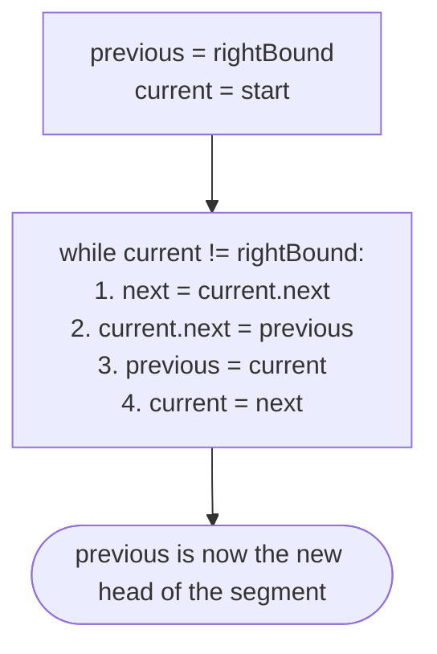
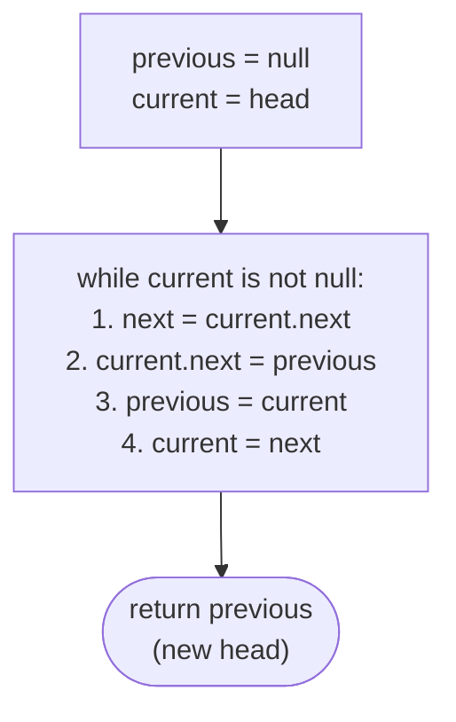

# Identifying the Reversal Pattern

The reversal pattern flips the direction of every `next` pointer inside a contiguous segment of a singly linked list — in place, in one pass, with `O(1)` extra space. It is the canonical answer to any problem that asks for a list (or a part of one) to be walked backwards: full-list reversal, reverse-first-K, reverse-last-K, reverse-between-positions, palindrome checks, and reorder-style problems that compose a reversal with another walk.

> ▶ Interactive Diagram — The reversal pattern flips a contiguous segment [start, end] in place — the nodes before start and after end remain untouched. Stitch the reversed segment back to its neighbours and you're done.
```d3 widget=linked-list
{
  "title": "Reversal pattern — flip the segment [start, end] in place; nodes outside untouched",
  "direction": "single",
  "nodes": [
    {"id": "a", "value": "a"},
    {"id": "s", "value": "start"},
    {"id": "m", "value": "..."},
    {"id": "e", "value": "end"},
    {"id": "z", "value": "z"}
  ],
  "head": "a",
  "steps": [
    {
      "links": [["a","s"],["s","m"],["m","e"],["e","z"]],
      "markers": [{"name": "start", "nodeId": "s"}, {"name": "end", "nodeId": "e"}],
      "msg": "Before: segment from start to end (the …) flows left → right"
    },
    {
      "nodes": [
        {"id": "a", "value": "a"},
        {"id": "e", "value": "end", "style": "new"},
        {"id": "m", "value": "..."},
        {"id": "s", "value": "start", "style": "new"},
        {"id": "z", "value": "z"}
      ],
      "links": [["a","e"],["e","m"],["m","s"],["s","z"]],
      "markers": [{"name": "current", "nodeId": "e"}],
      "msg": "After: segment reversed in place. a → end → … → start → z. Outside nodes untouched."
    }
  ]
}
```

<p align="center"><strong>The reversal pattern flips a contiguous segment <code>[start, end]</code> in place — the nodes before <code>start</code> and after <code>end</code> remain untouched. Stitch the reversed segment back to its neighbours and you're done.</strong></p>

---

## Understanding the Pattern

### Why Naive Isn't Enough

A singly linked list only exposes forward links — every node knows its successor, never its predecessor. The naive way to reverse the list is to copy the values into an array, reverse the array, and write the values back into the same nodes. That works, but it costs `O(n)` extra space, and it has nothing to say about partial reversals where you need to splice a reversed segment back into the surrounding list. Even worse, the naive approach treats reversal as an abstract list operation, not a structural rewiring — when a later problem asks for "reverse the first `k` nodes then attach the rest," the array-copy strategy has no natural place to slot in the splice.

To make this concrete: reversing `5 → 7 → 3 → 10` by copying values into `[5, 7, 3, 10]`, reversing to `[10, 3, 7, 5]`, and writing back uses `O(n)` time but `O(n)` extra space. The in-place three-pointer reversal hits the same `[10, 3, 7, 5]` result with `O(1)` extra space — three index variables, no auxiliary list — and the same loop body is reusable for every variant in this section.

So the key idea is: a singly linked list is just a chain of `next` pointers, so reversing the list means flipping every `next` pointer — that's structural rewiring, not value movement, and three local references are enough to do it safely.

### The Core Idea

The pattern asks one question: **can the work be expressed as flipping `next` pointers inside a contiguous segment `[start, end]`, with the outer list left untouched?**

The single mechanism that drives every variant is the **three-pointer loop**:

- **`previous`** — the node whose `next` was just rewritten; the new successor for the next node to be flipped.
- **`current`** — the node whose `next` is about to be rewritten this tick.
- **`next` (a local snapshot)** — the original successor of `current`, captured *before* `current.next` is clobbered.

To make this concrete: with `current = 7` in `5 → 7 → 3 → 10`, the tick reads `next = 3` first (saving the forward link), writes `7.next = previous` (flipping the pointer backwards), and finally advances `previous = 7`, `current = 3`. Without the upfront `next` snapshot, the forward path disappears on line 2 and the rest of the list is lost.

The core insight is: every reversal variant is the same three-pointer loop with two knobs — what `previous` starts as (`null` for full-list, `rightBound = end.next` for segment) and what the stop condition is (`current is null` for full-list, `current == rightBound` for segment).

### How the Pointers Move

The three pointers move in lockstep, one step forward per tick, but they play distinct roles. `current` is the only pointer that ever reads the list in its original forward direction — every other access is to the rewritten back-pointing chain. `previous` always trails `current` by one node and always points to the most recently rewired node (whose `next` already points backwards). The `next` snapshot exists only for the duration of one tick — it is captured at the top, used to advance `current` at the bottom, and overwritten on the next iteration.

Crucially, the rewrite of `current.next` happens *after* the snapshot and *before* the advance. Read the snapshot, flip the pointer, then advance — in that order. Any other order corrupts the chain. The loop terminates the moment `current` reaches the stop sentinel (`null` for full-list reversal, `rightBound` for segment reversal), at which point `previous` holds the new head of the reversed segment.

---

## The Generic Algorithm

The pattern follows the same four-step skeleton regardless of which variant it takes.

1. **Locate the segment.** Identify the `start` and `end` nodes of the segment to reverse. For full-list reversal, `start = head` and the end is reached when `current` becomes `null`. For segment reversal, the caller computes `start` and `end` from positional inputs or from a counted walk.
2. **Capture the sentinels.** For full-list reversal, initialise `previous = null`. For segment reversal, initialise `previous = end.next` (the `rightBound` sentinel) so the reversed segment's tail automatically points to the correct successor. Set `current = start`.
3. **Run the three-pointer loop.** While `current` has not reached the stop sentinel, save the forward link (`next = current.next`), flip the back link (`current.next = previous`), then advance both trailing pointers (`previous = current`, `current = next`). Every tick rewires exactly one node.
4. **Stitch the reversed segment back.** Return `previous` as the new head of the reversed segment. The caller connects the node before `start` to this new head — for full-list reversal there is no predecessor, so the returned `previous` is the new list head directly.

If the segment boundaries depend on a count (reverse-first-K) or a length lookup (reverse-last-K), step 1 absorbs that work — the inner three-pointer loop is unchanged.

---

## Reversing the Entire List

The whole-list reversal is the simplest instance of the pattern. The segment runs from `head` to the tail; the stop sentinel is `null`; the initial `previous` is `null`.

> ▶ Interactive Diagram — Full-list reversal — the old tail becomes the new head, every node's next points to its former predecessor.
```d3 widget=linked-list
{
  "title": "Reverse the entire list — three-pointer walk; every next flips",
  "direction": "single",
  "nodes": [
    {"id": "n1", "value": "5"},
    {"id": "n2", "value": "7"},
    {"id": "n3", "value": "3"},
    {"id": "n4", "value": "10"}
  ],
  "head": "n1",
  "steps": [
    {
      "links": [["n1","n2"],["n2","n3"],["n3","n4"]],
      "markers": [{"name": "previous", "nodeId": "n1"}, {"name": "current", "nodeId": "n1"}],
      "msg": "Init: previous = null, current = head"
    },
    {
      "links": [["n2","n1"],["n2","n3"],["n3","n4"]],
      "markers": [{"name": "previous", "nodeId": "n1"}, {"name": "current", "nodeId": "n2"}],
      "msg": "Tick 1: next = current.next (n2). current.next = previous (n1 → null). previous = current (n1). current = next (n2)."
    },
    {
      "links": [["n2","n1"],["n3","n2"],["n3","n4"]],
      "markers": [{"name": "previous", "nodeId": "n2"}, {"name": "current", "nodeId": "n3"}],
      "msg": "Tick 2: n2.next now points to n1 (former predecessor). Advance."
    },
    {
      "links": [["n2","n1"],["n3","n2"],["n4","n3"]],
      "markers": [{"name": "previous", "nodeId": "n3"}, {"name": "current", "nodeId": "n4"}],
      "msg": "Tick 3: n3.next now points to n2. Advance."
    },
    {
      "nodes": [
        {"id": "n4", "value": "10"},
        {"id": "n3", "value": "3"},
        {"id": "n2", "value": "7"},
        {"id": "n1", "value": "5"}
      ],
      "links": [["n4","n3"],["n3","n2"],["n2","n1"]],
      "markers": [{"name": "head", "nodeId": "n4"}],
      "msg": "Tick 4: n4.next = n3. current = null → loop ends. Return previous (n4) as new head: 10 → 3 → 7 → 5 → null."
    }
  ]
}
```

<p align="center"><strong>Full-list reversal — the old tail becomes the new head, every node's <code>next</code> points to its former predecessor.</strong></p>

> 🖼 Diagram — The three-pointer reversal loop — previous, current, next. At every tick we save the forward link into next, flip current.next backward, then advance both trailing pointers one step.


<p align="center"><strong>The three-pointer reversal loop — <code>previous</code>, <code>current</code>, <code>next</code>. At every tick we save the forward link into <code>next</code>, flip <code>current.next</code> backward, then advance both trailing pointers one step.</strong></p>

### Algorithm

The algorithm below summarizes the reversal of the entire linked list in-place.

> **Algorithm**
>
> -   **Step 1:** Create two references, `previous` and `current`, and initialize them with `nullptr`, and `head` respectively.
> -   **Step 2:** Loop while `current` is not equal to `nullptr`, do the following:
>     -   **Step 2.1:** Initialize a reference `next` to store the reference of the node after the `current` node.
>     -   **Step 2.2:** Update the next section of the `current` node to hold the node held by `previous`.
>     -   **Step 2.3:** Update `previous` to hold the reference of the `current` node.
>     -   **Step 2.4:** Update the `current` to hold the node held by `next`
> -   **Step 3:** Return `previous` as the head of the reversed list.

### Implementation

The full-list reversal in Python and Java. Each version is the same three-pointer loop — `previous`, `current`, `next` — differing only in language syntax.


```python run
from typing import Optional

class ListNode:
    def __init__(self, val=0, next=None):
        self.val = val
        self.next = next

def reverse(head: Optional[ListNode]) -> Optional[ListNode]:

    # Initialize references
    current: Optional[ListNode] = head
    previous: Optional[ListNode] = None

    # Set the next reference of each node to its previous node
    while current is not None:
        next_node: Optional[ListNode] = current.next
        current.next = previous
        previous = current
        current = next_node

    return previous
```

```java run
public class Main {
    static class ListNode { int val; ListNode next; ListNode(int v){val=v;} }

    static class Solution {
        public ListNode reverse(ListNode head) {

            // Initialize references
            ListNode current = head;
            ListNode previous = null;

            // Set the next reference of each node to its previous node
            while (current != null) {
                ListNode next = current.next;
                current.next = previous;
                previous = current;
                current = next;
            }

            return previous;
        }
    }

    public static void main(String[] args) {
        ListNode n1 = new ListNode(5), n2 = new ListNode(7), n3 = new ListNode(3);
        n1.next = n2; n2.next = n3;
        ListNode head = new Solution().reverse(n1);
        for (ListNode c = head; c != null; c = c.next) System.out.print(c.val + " ");
        // 3 7 5
    }
}
```


### Complexity Analysis

| | Complexity | Reason |
|---|---|---|
| **Time** | `O(n)` | Every node is visited exactly once — one snapshot, one flip, one advance per node. |
| **Space** | `O(1)` | Three local references — `previous`, `current`, `next` — regardless of list length. |

## Reversing a Segment

The generic case reverses the segment between two given nodes `start` and `end` (both inclusive). The outer list — the nodes before `start` and after `end` — is left untouched. The caller passes references to `start` and `end` such that `start` precedes `end` when walking forward from `head`.

> ▶ Interactive Diagram — Both endpoints are included. After reversal, the outer list structure is preserved — only the order of nodes inside [start, end] is flipped.
```d3 widget=linked-list
{
  "title": "Reverse a segment [start, end] inclusive — outer nodes stay intact",
  "direction": "single",
  "nodes": [
    {"id": "h", "value": "head"},
    {"id": "p", "value": "·"},
    {"id": "s", "value": "start"},
    {"id": "m", "value": "·"},
    {"id": "e", "value": "end"},
    {"id": "q", "value": "·"}
  ],
  "head": "h",
  "steps": [
    {
      "links": [["h","p"],["p","s"],["s","m"],["m","e"],["e","q"]],
      "markers": [{"name": "start", "nodeId": "s"}, {"name": "end", "nodeId": "e"}],
      "msg": "Before: outer prefix h → · → ; segment start → · → end; outer suffix ·"
    },
    {
      "nodes": [
        {"id": "h", "value": "head"},
        {"id": "p", "value": "·"},
        {"id": "e", "value": "end", "style": "new"},
        {"id": "m", "value": "·"},
        {"id": "s", "value": "start", "style": "new"},
        {"id": "q", "value": "·"}
      ],
      "links": [["h","p"],["p","e"],["e","m"],["m","s"],["s","q"]],
      "markers": [{"name": "head", "nodeId": "e"}],
      "msg": "After: segment flipped — outer prefix/suffix untouched"
    }
  ]
}
```

<p align="center"><strong>Both endpoints are included. After reversal, the outer list structure is preserved — only the order of nodes inside <code>[start, end]</code> is flipped.</strong></p>

The segment reversal needs one extra sentinel — the node *after* `end`, captured *before* the loop runs. Call it `rightBound = end.next`. Two roles fall on this one reference: it is the stop condition for the loop (`current == rightBound` means the segment is exhausted), and it is the initial value of `previous` so the reversed segment's tail (the original `start`) automatically points to the correct successor without a separate stitching step.

> ▶ Interactive Diagram — Cache rightBound = end.next before reversing. During reversal we walk from start and stop the moment current == rightBound — the sentinel that tells us we've exhausted the segment.
```d3 widget=linked-list
{
  "title": "Cache rightBound = end.next before reversing — sentinel for the segment boundary",
  "direction": "single",
  "nodes": [
    {"id": "h", "value": "head"},
    {"id": "p", "value": "·"},
    {"id": "s", "value": "start"},
    {"id": "m", "value": "·"},
    {"id": "e", "value": "end"},
    {"id": "rb", "value": "rightBound"},
    {"id": "q", "value": "·"}
  ],
  "head": "h",
  "steps": [
    {
      "links": [["h","p"],["p","s"],["s","m"],["m","e"],["e","rb"],["rb","q"]],
      "markers": [{"name": "start", "nodeId": "s"}, {"name": "end", "nodeId": "e"}, {"name": "next", "nodeId": "rb"}],
      "msg": "rightBound = end.next captured upfront. The reversal walks current from start and stops when current == rightBound."
    }
  ]
}
```

<p align="center"><strong>Cache <code>rightBound = end.next</code> <em>before</em> reversing. During reversal we walk from <code>start</code> and stop the moment <code>current == rightBound</code> — the sentinel that tells us we've exhausted the segment.</strong></p>

The three-pointer body is identical to the full-list case. Only two knobs change: `previous` starts as `rightBound` instead of `null`, and the loop condition is `current != rightBound` instead of `current != null`. At the end, `previous` holds the new head of the reversed segment, and the caller — which holds the node before `start` — performs the final stitch by setting its `next` to `previous`.

> 🖼 Diagram — Same three-pointer loop as full-list reversal — with two tweaks: initialise previous to rightBound (so the reversed segment's tail points to the correct successor), and stop when current == rightBound instead of null.


<p align="center"><strong>Same three-pointer loop as full-list reversal — with two tweaks: initialise <code>previous</code> to <code>rightBound</code> (so the reversed segment's tail points to the correct successor), and stop when <code>current == rightBound</code> instead of <code>null</code>.</strong></p>

> ▶ Interactive Diagram — Final stitch — the predecessor of the original start now points at the reversed segment's new head (end). The reversed segment's tail (start) already points at rightBound thanks to our previous = rightBound initialisation.
```d3 widget=linked-list
{
  "title": "Final stitch — predecessor of start now points at the reversed segment's new head",
  "direction": "single",
  "nodes": [
    {"id": "h", "value": "head"},
    {"id": "p", "value": "predecessor"},
    {"id": "e", "value": "end"},
    {"id": "m", "value": "·"},
    {"id": "s", "value": "start"},
    {"id": "rb", "value": "rightBound"},
    {"id": "q", "value": "·"}
  ],
  "head": "h",
  "steps": [
    {
      "links": [["h","p"],["p","e"],["e","m"],["m","s"],["s","rb"],["rb","q"]],
      "markers": [{"name": "head", "nodeId": "e"}, {"name": "tail", "nodeId": "s"}],
      "msg": "predecessor.next = end (new segment head); start.next already = rightBound thanks to previous = rightBound init"
    }
  ]
}
```

<p align="center"><strong>Final stitch — the predecessor of the original <code>start</code> now points at the reversed segment's new head (<code>end</code>). The reversed segment's tail (<code>start</code>) already points at <code>rightBound</code> thanks to our <code>previous = rightBound</code> initialisation.</strong></p>

### Algorithm

The algorithm given below summarizes the linked list reversal between start and end.

> **Algorithm**
>
> -   **Step 1:** Create three references, `previous`, `current`, and `rightBound` and initialize them with `end.next`, `start`, and `end.next` respectively.
> -   **Step 2:** Loop while `current` is not equal to `rightBound`, do the following:
>     -   **Step 2.1:** Initialize a reference `next` to store the reference of the node after the `current` node.
>     -   **Step 2.2:** Update the next section of the `current` node to hold the node held by `previous`.
>     -   **Step 2.3:** Update `previous` to hold the reference of the `current` node.
>     -   **Step 2.4:** Update the `current` to hold the node held by `next`
> -   **Step 3:** Return `previous` as the new head of the list and connect the node before `start` to this new head in the caller of this reverse function.

### Implementation

Segment reversal in Python and Java. The skeleton is the same three-pointer loop as full-list reversal — with two tweaks: initialise `previous` to `rightBound` (so the reversed tail points to the correct successor automatically) and stop when `current == rightBound` instead of `null`.


```python run
from typing import Optional

class ListNode:
    def __init__(self, val=0, next=None):
        self.val = val
        self.next = next

def reverse(start: ListNode, end: ListNode) -> ListNode:

    # Initialize references
    current: Optional[ListNode] = start
    right_bound: Optional[ListNode] = end.next
    previous: Optional[ListNode] = right_bound

    # Set the next reference of each node to its previous node
    while current != right_bound:
        next_node: Optional[ListNode] = current.next
        current.next = previous
        previous = current
        current = next_node

    return previous
```

```java run
public class Main {
    static class ListNode { int val; ListNode next; ListNode(int v){val=v;} }

    static class Solution {
        public ListNode reverse(ListNode start, ListNode end) {

            // Initialize references
            ListNode current = start;
            ListNode rightBound = end.next;
            ListNode previous = rightBound;

            // Set the next reference of each node to its previous node
            while (current != rightBound) {
                ListNode next = current.next;
                current.next = previous;
                previous = current;
                current = next;
            }

            return previous;
        }
    }

    public static void main(String[] args) {
        // List: 1 → 2 → 3 → 4 → 5; reverse segment [2, 4]
        ListNode n1=new ListNode(1),n2=new ListNode(2),n3=new ListNode(3),n4=new ListNode(4),n5=new ListNode(5);
        n1.next=n2; n2.next=n3; n3.next=n4; n4.next=n5;
        ListNode reversedSegmentHead = new Solution().reverse(n2, n4);
        n1.next = reversedSegmentHead;
        for (ListNode c=n1; c!=null; c=c.next) System.out.print(c.val+" ");
        // 1 4 3 2 5
    }
}
```


### Complexity Analysis

| | Complexity | Reason |
|---|---|---|
| **Time** | `O(n)` worst case, `O(1)` best case | Worst case: the segment spans the whole list. Best case: `start == end`, so the loop body never runs. |
| **Space** | `O(1)` | Four local references — `previous`, `current`, `next`, `rightBound` — regardless of segment length. |

---

## Variants / Taxonomy

The pattern shows up in four recognisable variants. Each maps to a different choice of `start`, `end`, and the sentinel pair, but every variant calls the same three-pointer loop body.

- **Full-list reversal** — `start = head`, `end` is implicit (the tail). Sentinels: `previous = null`, stop when `current is null`. Returns the new head. The simplest instance and the building block for the others.
- **Reverse-first-K (prefix reversal)** — `start = head`, `end` is the `k`-th node. Sentinels: `previous = null`, stop when the counted loop has flipped `k` nodes. After the loop, the original head (now the segment's tail) must be stitched to the remainder.
- **Reverse-last-K (suffix reversal)** — locate the `(length − k)`-th node, then reverse from its successor to the tail using full-list reversal on the suffix. The predecessor stitches the original head back to the reversed suffix.
- **Reverse-the-given-segment (between positions)** — given `left` and `right` (1-indexed positions), walk to find `start` (position `left`) and `end` (position `right`), reverse the inclusive segment, then stitch the predecessor of `start` to the returned new head. When `left == 1` the prefix path is taken directly.

The variants share an invariant: every flipped node's `next` points to its former predecessor inside the segment, and the segment's endpoints stitch into the outer list exactly once.

---

## Recognition Checklist

The pattern fits when **all four** answers are "yes". The first asks whether the problem is a reversal at all; the next three check that the reversal can be done in place with the three-pointer loop.

- Does the problem ask for nodes to appear in reversed order across a contiguous segment — full list, prefix, suffix, or a positional range?
- Is the segment a contiguous run of nodes with identifiable endpoints (`start` and `end` — either given, computed by position, or computed by length)?
- Is the work strictly structural — only `next` pointers change, no node values are read for the rewrite decision?
- Is `O(1)` extra space required (or strongly preferred)? If recursion with `O(n)` stack space is acceptable, the recursive variant may also fit.

Common surface signals: "reverse the linked list," "reverse the first / last `k` nodes," "reverse between positions `left` and `right`," "reorder the list so it reads `a, last, b, second-last, …`," "check whether the list is a palindrome."

---

## Canonical Example: Reverse a List

**Problem:** Given the head of a singly linked list, reverse it in place and return the head of the reversed list.

```
Input:  head = [5, 7, 3, 10]
Output: [10, 3, 7, 5]
```

### Brute Force: Copy Values to an Array

Walk the list, copy every value into a Python list (or Java `ArrayList`), reverse the array, and write the values back into the same nodes in order. The structural chain is left alone; only the values move.

```
Pass 1: arr = [5, 7, 3, 10]
Reverse arr in place: arr = [10, 3, 7, 5]
Pass 2: walk the list and assign arr[i] back into node[i].val
Result: 10 → 3 → 7 → 5
```

The brute force is correct but doubles memory: an `O(n)` array on top of the original list. It also conflates value movement with list reversal — a problem the moment the variant asks you to splice the reversed segment back into a larger list.

### Key Insight: Flip Pointers, Not Values

A singly linked list is the chain of `next` pointers. Reversing it means flipping every `next` so each node points to its former predecessor. Three local references suffice — `previous` (the new successor for the next flip), `current` (the node being flipped this tick), and a snapshot `next` (the original successor, captured *before* `current.next` is clobbered). The first flip writes `head.next = null`, turning the old head into the new tail. The last flip writes `tail.next = (old next-to-tail)`, and the loop terminates with `previous` pointing at the old tail — the new head.

> ▶ Interactive Diagram — "In place" means no auxiliary list is built — the same nodes are rewired, not copied. O(1) extra space.
```d3 widget=linked-list
{
  "title": "In-place reversal — input [5, 7, 3, 10] → output [10, 3, 7, 5]",
  "direction": "single",
  "nodes": [
    {"id": "n1", "value": "5"},
    {"id": "n2", "value": "7"},
    {"id": "n3", "value": "3"},
    {"id": "n4", "value": "10"}
  ],
  "head": "n1",
  "steps": [
    {
      "links": [["n1","n2"],["n2","n3"],["n3","n4"]],
      "markers": [{"name": "head", "nodeId": "n1"}],
      "msg": "Input: 5 → 7 → 3 → 10 → null"
    },
    {
      "nodes": [
        {"id": "n4", "value": "10"},
        {"id": "n3", "value": "3"},
        {"id": "n2", "value": "7"},
        {"id": "n1", "value": "5"}
      ],
      "links": [["n4","n3"],["n3","n2"],["n2","n1"]],
      "markers": [{"name": "head", "nodeId": "n4"}],
      "msg": "Output: same 4 nodes, rewired — 10 → 3 → 7 → 5 → null. No new allocations, O(1) extra space."
    }
  ]
}
```

<p align="center"><strong>"In place" means no auxiliary list is built — the same nodes are rewired, not copied. O(1) extra space.</strong></p>

### Optimized Solution: The Three-Pointer Loop

The three-pointer in-place reversal runs in `O(n)` time and `O(1)` space. The Python and Java implementations below are the same loop body in different language syntax.

> 🖼 Diagram — The three-pointer reversal loop — previous, current, next. At every tick we save the forward link into next, flip current.next backward, then advance both trailing pointers one step.


<p align="center"><strong>The three-pointer reversal loop — <code>previous</code>, <code>current</code>, <code>next</code>. At every tick we save the forward link into <code>next</code>, flip <code>current.next</code> backward, then advance both trailing pointers one step.</strong></p>


```python run
"""
Definition for singly-linked list.
class ListNode:
    def __init__(self, val):
        self.val = val
        self.next = None
"""

from typing import Optional, List, Any

class Solution:
    def reverse_a_list(
        self, head: Optional[ListNode]
    ) -> Optional[ListNode]:

        # Initialize pointers current and previous
        current: Optional[ListNode] = head
        previous: Optional[ListNode] = None

        while current is not None:

            # Save the address of next node
            next_node = current.next

            # Update the next of current node
            current.next = previous

            # Move previous to hold current node
            previous = current

            # Move current ahead
            current = next_node

        return previous
```

```java run
/**
 * Definition for singly-linked list.
 * class ListNode {
 *     int val;
 *     ListNode next;
 *     ListNode() {}
 *     ListNode(int val) { this.val = val; }
 * };
 */

class Solution {
    public ListNode reverseAList(ListNode head) {

        // Initialize pointers current and previous
        ListNode current = head;
        ListNode previous = null;

        while (current != null) {

            // Save the address of next node
            ListNode next = current.next;

            // Update the next of current node
            current.next = previous;

            // Move previous to hold current node
            previous = current;

            // Move current ahead
            current = next;
        }

        return previous;
    }
}
```


### Trace

```
head = 5 → 7 → 3 → 10 → null

Init: previous = null, current = 5

Tick 1: next = 7
        current.next = null    → 5 → null
        previous = 5
        current  = 7

Tick 2: next = 3
        current.next = 5       → 7 → 5 → null
        previous = 7
        current  = 3

Tick 3: next = 10
        current.next = 7       → 3 → 7 → 5 → null
        previous = 3
        current  = 10

Tick 4: next = null
        current.next = 3       → 10 → 3 → 7 → 5 → null
        previous = 10
        current  = null

Loop ends. Return previous = 10.
Reversed list: 10 → 3 → 7 → 5 → null ✓
```

### Fitting the Template

| Check | Answer for Reverse a List |
|---|---|
| **Q1.** Does the problem ask for reversed order across a contiguous segment? | **Yes** — the entire list is a contiguous segment from `head` to the tail. |
| **Q2.** Are the segment endpoints identifiable? | **Yes** — `start = head`, and the end is reached when `current` becomes `null`. |
| **Q3.** Is the work strictly structural (only `next` pointers change)? | **Yes** — node values are never read or written; only `current.next` is rewritten each tick. |
| **Q4.** Is `O(1)` extra space required? | **Yes** — three references (`previous`, `current`, `next`) regardless of list length. |

All four answers are "yes", so the reversal pattern applies. The outer driver is trivial (no positional work — `start = head`); the inner three-pointer loop does the entire job. Total cost: `O(n)` time, `O(1)` space.

---

## Problems in This Category

| Problem | Variant | How the three-pointer loop fits |
|---|---|---|
| **[Reverse a List](02-problems/01-reverse-a-list.md)** | Full-list reversal | `start = head`, `previous = null`, stop when `current is null` |
| **[Reverse First K Nodes](02-problems/02-reverse-first-k-nodes.md)** | Prefix reversal | Same as full-list, but stop after `k` flips; stitch the old head to the unreversed remainder |
| **[Reverse Last K Nodes](02-problems/03-reverse-last-k-nodes.md)** | Suffix reversal | Walk `length − k` steps to find the predecessor, then full-list reverse the suffix; stitch predecessor to the returned new head |
| **[Reverse the Given Segment](02-problems/04-reverse-the-given-segment.md)** | Positional segment reversal | Walk to position `left` and `right`, capture `rightBound = end.next`, run the segment-reversal loop, stitch the predecessor of `start` to the returned new head |

Difficulty increases with the amount of positional bookkeeping the caller has to do before invoking the three-pointer loop — the loop itself is unchanged across all four problems.
