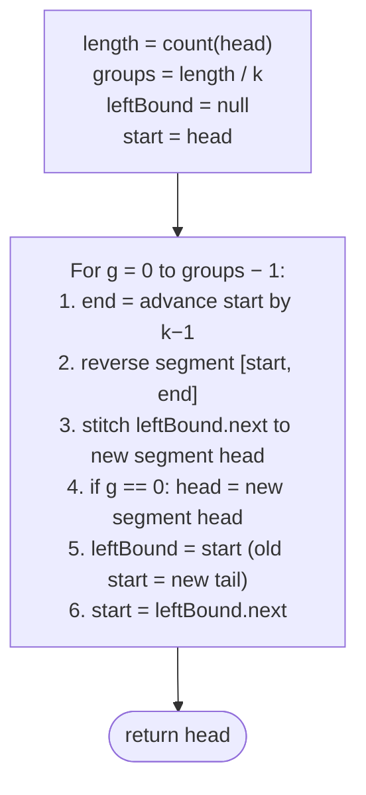

# Identifying reversal subproblem

The reversal-subproblem pattern handles linked-list problems too complex for a single full-list reversal. The trick is to slice the list into segments — pairs, k-sized chunks, monotonically growing runs, alternating segments — reverse each segment in place using the standard two-pointer flip, and stitch the reversed pieces back into a single list. Pairwise swap, reverse-in-groups-of-k, and reverse-alternate-segments all reduce to this recipe.

---

## Understanding the Pattern

### Why Naive Isn't Enough

A single full-list reversal flips every link in one pass and returns the new head. That answer is correct only when the problem asks to flip the entire list. The moment the problem asks for *partial* flips — every adjacent pair, every block of `k`, every run satisfying some monotone predicate — a single sweep cannot express the intermediate boundaries. The naive workarounds are worse: copy values into an array, shuffle them, and rebuild the list (`O(n)` extra space, defeats the point of using a linked list), or recompute boundaries by re-walking the list per segment (an extra `O(n)` per group, blowing the time budget).

To make this concrete: pairwise-swapping `1 → 2 → 3 → 4` should produce `2 → 1 → 4 → 3`. A full-list reversal returns `4 → 3 → 2 → 1`. A value-copy approach allocates an `O(n)` array and breaks the constraint that the problem be solved by re-wiring `next` pointers. The structural mismatch is real: the problem has many small reversal sub-tasks, and the algorithm needs a loop that frames each one and re-attaches it.

So the key idea is: when a list-rewriting problem decomposes into many segment-sized reversals, treat the full-list reversal as a primitive and drive it from an outer loop that walks the boundaries.

### The Core Idea

The pattern asks one question: **can the rewrite be expressed as a sequence of in-place segment reversals?**

Three concrete decomposition shapes recur in this section:

- **Fixed-size chunks** — slice the list into groups of `k` and reverse each (pairwise swap is `k = 2`, reverse-k-segments is general `k`).
- **Variable-size runs** — the chunk size changes between groups (reverse-increasing-groups grows the size `1, 2, 3, …`).
- **Conditional reversal** — walk the list in fixed-size chunks but reverse only some of them (reverse-alternate-segments flips every other chunk).

To make this concrete: in reverse-k-segments with `k = 3` on `1 → 2 → 3 → 4 → 5 → 6 → 7`, the outer driver slices the list into `[1, 2, 3]`, `[4, 5, 6]`, and the trailing fragment `[7]`. Each full chunk is reversed in place — the reversal helper from chapter pattern 07 is invoked twice — and the seams are stitched so the final list is `3 → 2 → 1 → 6 → 5 → 4 → 7`. The outer loop runs `n / k` times; each inner reversal is `O(k)`; total cost is `O(n)`.

The core insight is: every reversal-subproblem solution is "outer driver picks the next chunk's boundary; inner segment-reversal flips it; seam stitcher reconnects it."

### How the Pointers/Window Move

The pattern uses four cooperating boundary pointers per chunk. The **outer driver** is whatever decides where the next chunk begins — a fixed count `total_segments = length / k`, a growing counter `group_size = 1, 2, 3, …`, or a toggling flag `should_reverse`. The driver walks forward through the list and never re-visits a node.

The four boundary pointers are:

- **`leftBound`** — the node immediately *before* the chunk's first node. Needed so the predecessor's `next` can be re-pointed at the reversed chunk's new head. For the first chunk it is `None`, and the algorithm updates the list's `head` directly instead.
- **`start`** — the chunk's first node *before* reversal. After reversal, `start` becomes the chunk's tail and is exactly the new `leftBound` for the *next* chunk.
- **`end`** — the chunk's last node *before* reversal. Reached by advancing `start` by `k − 1` hops (or `group_size − 1`).
- **`rightBound`** — implicit; it's `end.next`. The segment-reversal primitive uses it as the initial `previous` so the reversed chunk's tail already points at the correct successor.

Each chunk goes through the same four steps: find `end` by walking `k − 1` nodes from `start`; call `reverse(start, end)` which returns the new chunk head; stitch `leftBound.next = reversed_head` (or update the global `head` if this is the first chunk); advance — `leftBound = start`, `start = leftBound.next`. The inner reversal is `O(k)` work; finding `end` is another `O(k)` walk; the seam stitch is `O(1)`. The whole list is touched a constant number of times, so total cost is `O(n)`.

Crucially, the inner reversal relies on the same monotonic-pointer guarantee that makes any in-place linked-list flip correct: `current` walks rightward from `start`, never backtracks, and stops when it reaches the cached `rightBound`. The outer driver establishes the segment boundary before the inner call; the inner call never crosses it.

---

## The Generic Algorithm

The pattern follows the same five-step skeleton regardless of which decomposition shape it takes.

1. **Measure or precompute what you need.** Most variants want the list length up front (`length = count(head)`), because the outer driver needs to know when to stop and avoid running off the end mid-chunk. Pairwise swap can skip this because the per-iteration check `start != None and start.next != None` already guards the boundary.
2. **Initialise the boundary pointers.** Set `start = head` and `leftBound = None`. The `leftBound = None` marker is what the seam-stitch step uses to detect the first chunk and update the global `head` instead of writing through a predecessor.
3. **Drive the outer loop.** Iterate until the remaining list is too short for the next chunk. At each step, advance `end` by `k − 1` hops from `start` to mark the chunk's boundary. If the chunk size varies (reverse-increasing-groups) or the chunk is conditionally skipped (reverse-alternate-segments), apply that rule here.
4. **Run the inner segment reversal.** Call the shared `reverse(start, end)` helper, which flips the links inside `[start, end]` in place and returns the new chunk head. Stitch the seam: if `leftBound is None`, update `head = reversed_head`; otherwise set `leftBound.next = reversed_head`.
5. **Slide the boundary forward.** The old `start` is now the chunk's tail and the natural `leftBound` for the next chunk. Set `leftBound = start`, then `start = leftBound.next`. If the variant grows or skips, update the counter or flag for the next iteration.

If the variant introduces a per-chunk decision (skip vs. reverse, grow vs. fixed), it slots into step 3 or step 5 — the surrounding scaffold does not change.

---

## Complexity Analysis

| | Complexity | Reason |
|---|---|---|
| **Time** | `O(n)` | The outer driver walks the list once. Each chunk's inner reversal flips its own `k` links and never revisits a node. Finding `end` is part of the same forward walk. Total work is one constant-factor pass. |
| **Space** | `O(1)` | The four boundary pointers, the counter, and the optional flag are constants. No auxiliary array or recursion stack is allocated; the list is rewritten in place. |

The constant factor is small but real — each node is touched once during the boundary walk that finds `end`, and once again during the inner flip. Two passes per node is still `O(n)`. A dummy-head sentinel can eliminate the first-chunk special case but does not change the asymptotic cost.

---

## Variants / Taxonomy

The pattern shows up in four recognisable sub-shapes. Each maps to a different outer-driver rule; the inner reversal primitive is identical.

- **Pairwise swap (`k = 2`)** — the outer driver is a `while start and start.next` guard; every chunk is a pair, and the reversal degenerates to "swap two adjacent nodes." This is the simplest concrete instance of the pattern.
- **Reverse-k-segments (fixed `k ≥ 2`)** — the outer driver runs `length / k` times. Every full chunk is reversed; any trailing fragment of length `< k` is left untouched. The general form of pairwise swap.
- **Reverse-increasing-groups (growing `k`)** — the outer driver uses a counter `group_size = 1, 2, 3, …`. After each chunk, the counter grows and the remaining length shrinks. The loop stops when `length < group_size`.
- **Reverse-alternate-segments (conditional reversal)** — the outer driver walks fixed-size chunks but flips a boolean `should_reverse` each iteration. On `True` iterations the chunk is reversed; on `False` iterations the chunk is skipped — only the boundary advances.

The shape of the outer driver's rule determines the variant; the inner reversal call and the seam-stitch step are common code.

---

## Recognition Checklist

The pattern fits when **all four** answers are "yes". The first two diagnose whether the problem is a reversal-subproblem at all; the last two confirm the inner segment reversal is feasible.

- Can the problem or solution be broken down into smaller subproblems that operate on contiguous chunks of the list?
- Can any subproblem be solved by reversing a part of the linked list — i.e., flipping `next` pointers between an inner `start` and `end`?
- Does the algorithm only need to walk each node a constant number of times — no random access, no per-chunk re-traversal from the head?
- Is each chunk's boundary computable from local state (`k`, a growing counter, a toggle) rather than from a global view of the list?

Common surface signals: "swap every two adjacent nodes," "reverse the list in groups of `k`," "reverse alternate segments of size `k`," "reverse the first/second half," "reverse a sub-list between positions `i` and `j`."

---

## Example

Let's consider an example problem and see how to break it down into smaller subproblems that can be solved using the reversal algorithm to understand it better.

> **Problem statement:** Given a linked list, reverse the list in groups of K in-place. If the last group in the list does not have K nodes, don't reverse it.

Consider the following example with`k = 3`for a linked list of size 7.

> ▶ Interactive Diagram — Reverse-in-groups-of-K — slice the list into chunks of k, reverse each chunk in place, and leave any trailing (fewer-than-k) nodes untouched. The core reversal loop is invoked once per chunk.
```d3 widget=linked-list
{
  "title": "Reverse in groups of k=3 — each chunk reversed in place; trailing fragment stays put",
  "direction": "single",
  "nodes": [
    {"id": "n1", "value": "1"},
    {"id": "n2", "value": "2"},
    {"id": "n3", "value": "3"},
    {"id": "n4", "value": "4"},
    {"id": "n5", "value": "5"},
    {"id": "n6", "value": "6"},
    {"id": "n7", "value": "7"}
  ],
  "head": "n1",
  "steps": [
    {
      "links": [["n1","n2"],["n2","n3"],["n3","n4"],["n4","n5"],["n5","n6"],["n6","n7"]],
      "markers": [{"name": "head", "nodeId": "n1"}],
      "msg": "Before: 1 → 2 → 3 → 4 → 5 → 6 → 7"
    },
    {
      "nodes": [
        {"id": "n3", "value": "3"},
        {"id": "n2", "value": "2"},
        {"id": "n1", "value": "1"},
        {"id": "n6", "value": "6"},
        {"id": "n5", "value": "5"},
        {"id": "n4", "value": "4"},
        {"id": "n7", "value": "7"}
      ],
      "links": [["n3","n2"],["n2","n1"],["n1","n6"],["n6","n5"],["n5","n4"],["n4","n7"]],
      "markers": [{"name": "head", "nodeId": "n3"}],
      "msg": "After: each group of 3 reversed → 3 → 2 → 1 → 6 → 5 → 4 → 7 (trailing single node 7 untouched)"
    }
  ]
}
```

<p align="center"><strong>Reverse-in-groups-of-K — slice the list into chunks of <code>k</code>, reverse each chunk in place, and leave any trailing (fewer-than-<code>k</code>) nodes untouched. The core reversal loop is invoked once per chunk.</strong></p>

## Linked list reversal solution

Let's ask ourselves the questions we listed above to identify if we can reduce this problem to the two-pointer pattern problem.

**Template:**

Q1. Can the problem or solution be broken down into smaller subproblems?

A1. Yes, we can break down the solution as a combination `length / k` reversal operations, where `length` is the length of the linked list.

Q2. Can any subproblem be solved by reversing a part of the linked list?

A2. Yes, all subproblems except finding the length can be solved by reversing a part of the linked list.

The critical observation here is that reversing a group of size `k` is the same as reversing a part of the linked list between start and end. We traverse the linked list `k` nodes at a time and reverse each group as we go. We initialize a variable `groups` with the number of k-groups (`length / k`) to reverse, truncating the fractional part as the number of k groups will always be a whole number. We use `groups` to iterate, reversing a k-group in each iteration. 

> 🖼 Diagram — Pre-compute length in one pass. The number of full reversible groups is length / k; the remainder length % k trails untouched.
```d2
direction: right
length: "length = 7"
k: "k = 3"
g: "groups = length / k = 2 (integer division)"
r: "remaining = length % k = 1 (trailing, untouched)"
length -> g
k -> g
length -> r
k -> r
```

<p align="center"><strong>Pre-compute <code>length</code> in one pass. The number of full reversible groups is <code>length / k</code>; the remainder <code>length % k</code> trails untouched.</strong></p>

We use two reference variables `start` and `end` to denote the boundary of a k-group that we need to reverse and a variable `leftBound` to hold the node before `start` that is used to correctly connect the head of the reversed segment to the list.

We initialize `start` and `end` with the `head` of the list and iterate `k-1` times using `end` to find the end of the first k-group. We initialize `leftBound` with null for the first k-group, as there is no node before the head of the list.

> ▶ Interactive Diagram — Three boundary pointers per group — leftBound (the node before start, needed so we can re-attach the reversed group to the rest of the list), start (first node of the group), and end (last node of the group, reached by advancing start by k−1 hops).
```d3 widget=linked-list
{
  "title": "Boundary pointers — leftBound (before start), start (group head), end (group tail)",
  "direction": "single",
  "nodes": [
    {"id": "lb", "value": "leftBound"},
    {"id": "n1", "value": "1"},
    {"id": "n2", "value": "2"},
    {"id": "n3", "value": "3"},
    {"id": "n4", "value": "4"},
    {"id": "n5", "value": "5"},
    {"id": "n6", "value": "6"},
    {"id": "n7", "value": "7"}
  ],
  "head": "n1",
  "steps": [
    {
      "links": [["lb","n1"],["n1","n2"],["n2","n3"],["n3","n4"],["n4","n5"],["n5","n6"],["n6","n7"]],
      "markers": [{"name": "previous", "nodeId": "lb"}, {"name": "start", "nodeId": "n1"}, {"name": "end", "nodeId": "n3"}],
      "msg": "First group: leftBound = null (dummy), start = n1, end = n3 (advanced k−1 = 2 hops)"
    }
  ]
}
```

<p align="center"><strong>Three boundary pointers per group — <code>leftBound</code> (the node <em>before</em> <code>start</code>, needed so we can re-attach the reversed group to the rest of the list), <code>start</code> (first node of the group), and <code>end</code> (last node of the group, reached by advancing <code>start</code> by <code>k−1</code> hops).</strong></p>

After reversing the first k-group, we need to update the `head` of the list, as the previous `end` node will be the new head of the list.

> ▶ Interactive Diagram — After the first group is reversed, its head becomes the new head of the entire list. Update head to point at end of the just-reversed group. Subsequent groups don't need this update — their previous group handles the re-attachment.
```d3 widget=linked-list
{
  "title": "After the first group reversal, head updates to the new first node (the old end)",
  "direction": "single",
  "nodes": [
    {"id": "n1", "value": "1"},
    {"id": "n2", "value": "2"},
    {"id": "n3", "value": "3"},
    {"id": "n4", "value": "4"},
    {"id": "n5", "value": "·"}
  ],
  "head": "n1",
  "steps": [
    {
      "links": [["n1","n2"],["n2","n3"],["n3","n4"],["n4","n5"]],
      "markers": [{"name": "head", "nodeId": "n1"}],
      "msg": "Before first reversal"
    },
    {
      "nodes": [
        {"id": "n3", "value": "3"},
        {"id": "n2", "value": "2"},
        {"id": "n1", "value": "1"},
        {"id": "n4", "value": "4"},
        {"id": "n5", "value": "·"}
      ],
      "links": [["n3","n2"],["n2","n1"],["n1","n4"],["n4","n5"]],
      "markers": [{"name": "head", "nodeId": "n3"}],
      "msg": "After: head = n3 (the old end of the first group). Subsequent groups don't need to update head."
    }
  ]
}
```

<p align="center"><strong>After the <em>first</em> group is reversed, its head becomes the new head of the entire list. Update <code>head</code> to point at <code>end</code> of the just-reversed group. Subsequent groups don't need this update — their previous group handles the re-attachment.</strong></p>

Similarly, after reversing the first k-group, the previous `start` and the node after it would be the `leftBound` and `start` for the next k-group respectively.

> ▶ Interactive Diagram — After processing one group, slide the boundary forward — the old start becomes the new leftBound, and start advances to the first node of the next group. The segment-reversal loop is now primed to repeat.
```d3 widget=linked-list
{
  "title": "Slide boundary forward — old start becomes new leftBound; start advances to next group head",
  "direction": "single",
  "nodes": [
    {"id": "g1a", "value": "3"},
    {"id": "g1b", "value": "2"},
    {"id": "g1c", "value": "1"},
    {"id": "lb2", "value": "leftBound"},
    {"id": "s2", "value": "4"},
    {"id": "m", "value": "5"},
    {"id": "e2", "value": "6"},
    {"id": "r", "value": "7"}
  ],
  "head": "g1a",
  "steps": [
    {
      "links": [["g1a","g1b"],["g1b","g1c"],["g1c","lb2"],["lb2","s2"],["s2","m"],["m","e2"],["e2","r"]],
      "markers": [{"name": "previous", "nodeId": "lb2"}, {"name": "start", "nodeId": "s2"}, {"name": "end", "nodeId": "e2"}],
      "msg": "Second group: leftBound = old start (1's position), start = n4, end = n6 (n4 advanced k−1 = 2 hops)"
    }
  ]
}
```

<p align="center"><strong>After processing one group, slide the boundary forward — the old <code>start</code> becomes the new <code>leftBound</code>, and <code>start</code> advances to the first node of the next group. The segment-reversal loop is now primed to repeat.</strong></p>

We repeat the process to find the `end` of the next segment and reverse the list between `start` and `end` and for all the subsequent k-group reversals, we use `leftBound` to connect the reversed head of the segment back to the list. At the end of all iterations, all the k-groups in the list are reversed in place. The complete execution of the linked list reversal solution is given below.

> 🖼 Diagram — The full algorithm — measure the list, iterate length / k times, and on each iteration slice off a group of k, flip it in place using the segment-reversal primitive, and slide the boundary pointers forward.


<p align="center"><strong>The full algorithm — measure the list, iterate <code>length / k</code> times, and on each iteration slice off a group of <code>k</code>, flip it in place using the segment-reversal primitive, and slide the boundary pointers forward.</strong></p>

The implementation of the reversal algorithm solution is given below, where we create a reverse function to reverse segments between `start` and `end`.  We also create helper functions to find the length of the list  two helper functions to find the length of a linked list and reverse the list between `start` and `end` to keep the implementation simple and modular.


```python run
"""
Definition for singly-linked list.
class ListNode:
    def __init__(self, val):
        self.val = val
        self.next = None
"""

from typing import Optional

class Solution:
    def find_length(self, head: Optional[ListNode]) -> int:
        length = 0
        while head is not None:
            length += 1
            head = head.next
        return length

    def get_node_at_position(
        self, head: ListNode, position: int
    ) -> ListNode:
        current = head
        for _ in range(1, position):
            current = current.next
        return current

    def reverse(
        self, start: Optional[ListNode], end: Optional[ListNode]
    ) -> Optional[ListNode]:
        current: Optional[ListNode] = start
        right_bound: Optional[ListNode] = end.next
        previous: Optional[ListNode] = right_bound

        while current != right_bound:
            next_node = current.next
            current.next = previous
            previous = current
            current = next_node

        return previous

    def reverse_k_segments(
        self, head: Optional[ListNode], k: int
    ) -> Optional[ListNode]:

        # If the list is empty, has only one node, or k is 1, no need to
        # reverse segments
        if head is None or head.next is None or k == 1:
            return head

        # Start of the current segment to be reversed
        start = head

        # Pointer to the last node of the previous segment
        left_bound = None

        # Find the total number of segments in the linked list
        total_segments = self.find_length(head) // k

        # Loop through the list to reverse every k-length segment
        for i in range(total_segments):

            # Get the end node of the current segment
            end = self.get_node_at_position(start, k)

            # Get the head of the reversed segment.
            reversed_head = self.reverse(start, end)

            # Check if there is a previous segment to connect to or
            # if the existing head needs to be updated.
            # If left_bound is None, it means we're at the first segment
            # So, we need to update the head to the reversed_head
            # Return the new head
            if left_bound is None:
                head = reversed_head

            # If there is a left_bound, connect its next to the new
            # reversed_head
            else:
                left_bound.next = reversed_head

            # Update left_bound to the current segment's start (which is
            # now the end after reversal)
            left_bound = start

            # Move to the next segment
            start = left_bound.next

        # Return the head of the modified list
        return head
```

```java run
/**
 * Definition for singly-linked list.
 * class ListNode {
 *     int val;
 *     ListNode next;
 *     ListNode() {}
 *     ListNode(int val) { this.val = val; }
 * };
 */

class Solution {
    public int findLength(ListNode head) {
        int length = 0;
        while (head != null) {
            length++;
            head = head.next;
        }
        return length;
    }

    public ListNode getNodeAtPosition(ListNode head, int position) {
        ListNode current = head;
        for (int i = 1; i < position; ++i) {
            current = current.next;
        }
        return current;
    }

    public ListNode reverse(ListNode start, ListNode end) {
        ListNode current = start;
        ListNode rightBound = end.next;
        ListNode previous = rightBound;

        while (current != rightBound) {
            ListNode next = current.next;
            current.next = previous;
            previous = current;
            current = next;
        }

        return previous;
    }

    public ListNode reverseKSegments(ListNode head, int k) {

        // If the list is empty, has only one node, or k is 1, no need to
        // reverse segments
        if (head == null || head.next == null || k == 1) {
            return head;
        }

        // Start of the current segment to be reversed
        ListNode start = head;

        // Pointer to the last node of the previous segment
        ListNode leftBound = null;

        // Find the total number of segments in the linked list
        int totalSegments = findLength(head) / k;

        // Loop through the list to reverse every k-length segment
        for (int i = 0; i < totalSegments; i++) {

            // Get the end node of the current segment
            ListNode end = getNodeAtPosition(start, k);

            // Get the head of the reversed segment.
            ListNode reversedHead = reverse(start, end);

            // Check if there is a previous segment to connect to or
            // if the existing head needs to be updated.
            // If leftBound is null, it means we're at the first
            // segment So, we need to update the head to the
            // reversedHead
            if (leftBound == null) {
                head = reversedHead;
            }

            // If there is a leftBound, connect its next to the new
            // reversedHead
            else {
                leftBound.next = reversedHead;
            }

            // Update leftBound to the current segment's start (which is
            // now the end after reversal)
            leftBound = start;

            // Move to the next segment
            start = leftBound.next;
        }

        // Return the head of the modified list
        return head;
    }
}
```


## Fitting the Template

| Check | Answer for Reverse-K-Segments |
|---|---|
| **Q1.** Can the problem or solution be broken down into smaller subproblems? | **Yes** — the rewrite is a sequence of `length / k` independent in-place reversals on disjoint contiguous chunks `[0..k-1], [k..2k-1], …`. |
| **Q2.** Can any subproblem be solved by reversing a part of the linked list? | **Yes** — each chunk's reversal is the canonical segment-reversal primitive from chapter pattern 07: `reverse(start, end)` flips `next` pointers between two boundary nodes. |
| **Q3.** Does the algorithm only need to walk each node a constant number of times? | **Yes** — finding `end` walks `k − 1` hops, the inner reversal walks the same `k` nodes once; both passes amortise to one `O(n)` outer walk. No node is re-visited from the head. |
| **Q4.** Is each chunk's boundary computable from local state? | **Yes** — `end` is found from `start` plus the local count `k`, and the seam re-attachment uses `leftBound` cached from the previous iteration. No global view is needed. |

All four answers are "yes", so the reversal-subproblem pattern applies. The outer driver iterates `length / k` times; the inner segment reversal is invoked once per chunk; the seam stitch re-attaches it. Total cost: `O(n)` time, `O(1)` space.

---

## Problems in This Category

| Problem | Subproblems | How segment reversal fits |
|---|---|---|
| **[Pairwise Swap](./02-problems/01-pairwise-swap.md)** | `n / 2` two-node reversals | Each chunk has `k = 2`; the reversal degenerates to swapping a pair of adjacent nodes. |
| **[Reverse K-Segments](./02-problems/02-reverse-k-segments.md)** | `length / k` chunk reversals of size `k` | The general fixed-size form; trailing fragment of length `< k` is untouched. |
| **[Reverse Increasing Groups](./02-problems/03-reverse-increasing-groups.md)** | Chunks of size `1, 2, 3, …` | The chunk size grows after each iteration; the loop stops once the remaining length is too short. |
| **[Reverse Alternate Segments](./02-problems/04-reverse-alternate-segments.md)** | Conditional chunk reversals of size `k` | The outer driver toggles a `should_reverse` flag; flipped chunks are reversed, skipped chunks just advance the boundary. |

Difficulty rises with the per-chunk decision: pairwise swap is a hard-coded `k = 2`; reverse-k-segments adds the general `k`; reverse-increasing-groups adds a growing counter; reverse-alternate-segments adds a conditional branch around the reversal call.
