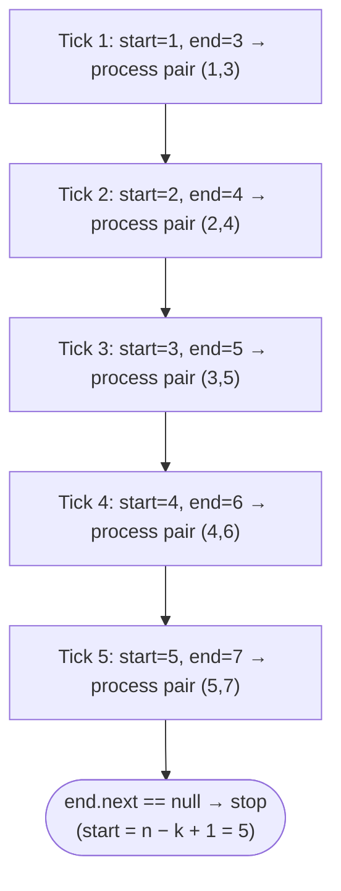
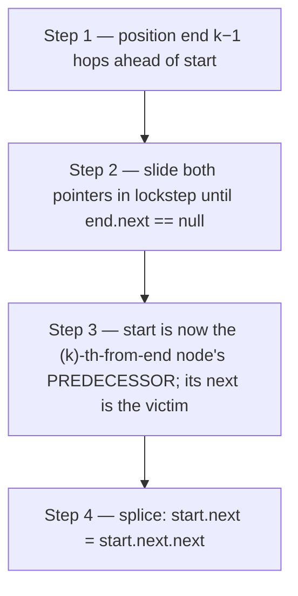

# 8. Pattern: Sliding Window Traversal

## The Hook

"Find the K-th node from the end of a linked list." Obvious brute force: walk the list to get the length `n`, then walk again to position `n − k`. **Two passes.** Works, but feels clumsy — especially when the list is a stream you can only read once.

There's a single-pass trick that feels almost unfair. Put two pointers at the head. Advance one of them `k − 1` hops. Then advance **both together** until the leader falls off the end. When that happens, the trailing pointer is parked exactly on the K-th-from-end node. One pass. No length. No second walk.

This is the **sliding window traversal** pattern — two pointers separated by a fixed gap, marching in lockstep. Once you see it, you'll spot applications everywhere: remove N-th from end, swap N-th from both ends, K rotations, K-maximum-sum windows. The trick is never the sliding — it's **choosing the right initial gap** so that when the leader terminates, the trailer is exactly where you need it.

---

## Table of contents

1. [Understanding sliding window traversal pattern](#understanding-the-sliding-window-traversal-pattern)
2. [Identifying the sliding window traversal pattern](#identifying-the-sliding-window-traversal-pattern)
3. [K maximum sum](#k-maximum-sum)
4. [Trim Nth node](#trim-nth-node)
5. [Swap Nth nodes](#swap-nth-nodes)
6. [K rotations](#k-rotations)

***

# Understanding the sliding window traversal pattern

The traversal of a linked list is generally done using a single reference variable to hold the current node. Some problems, however, require you to perform some operations on two nodes at some distance from each other. Unlike arrays, where we can access item **k** steps ahead of the current item by adding **k** to the current index, we need to iterate **k** times and traverse the list from the current node for a singly linked list, which is inefficient if we need to do this for multiple nodes.

This presents another use case for the sliding window technique, apart from aggregating values in a subarray or sublist. We can use a window of size **k** denoted by two references and move it to access all nodes **k** steps apart in a singly linked list.

The sliding window traversal pattern is a classification of problems that can be solved using the sliding window traversal technique.

```d3 widget=linked-list
{
  "title": "Sliding window — start + end stay k=3 hops apart; both advance together",
  "direction": "single",
  "nodes": [
    {"id": "n1", "value": "1"},
    {"id": "n2", "value": "2"},
    {"id": "n3", "value": "3"},
    {"id": "n4", "value": "4"},
    {"id": "n5", "value": "5"},
    {"id": "n6", "value": "6"}
  ],
  "head": "n1",
  "steps": [
    {
      "links": [["n1","n2"],["n2","n3"],["n3","n4"],["n4","n5"],["n5","n6"]],
      "markers": [{"name": "start", "nodeId": "n1"}, {"name": "end", "nodeId": "n4"}],
      "msg": "start at node 1, end at node 4 (3 hops ahead). Window = nodes 1..4."
    },
    {
      "links": [["n1","n2"],["n2","n3"],["n3","n4"],["n4","n5"],["n5","n6"]],
      "markers": [{"name": "start", "nodeId": "n2"}, {"name": "end", "nodeId": "n5"}],
      "msg": "Both advance one step. Window = nodes 2..5."
    },
    {
      "links": [["n1","n2"],["n2","n3"],["n3","n4"],["n4","n5"],["n5","n6"]],
      "markers": [{"name": "start", "nodeId": "n3"}, {"name": "end", "nodeId": "n6"}],
      "msg": "Both advance. Window = nodes 3..6. end.next is null → loop ends."
    }
  ]
}
```

<p align="center"><strong>Sliding-window traversal keeps two pointers — <code>start</code> and <code>end</code> — a fixed distance <code>k</code> apart. They advance together, one node at a time, until <code>end</code> falls off the list.</strong></p>

The sliding window technique can also solve aggregation problems on sublists like subarrays. However, in this lesson, we will only learn about the sized sliding window traversal technique, which traverses a list using a sliding window. More so, we will only learn about the fixed-sized sliding window, as most problems require performing operations on nodes apart by a fixed distance.

## Sliding window traversal technique

Consider we are given a singly linked list and need to perform some operations on all nodes that are at a distance of `k` from each other. We create two references `start` and `end`, and initialize them with the head of the linked list.

We then iterate `k` times and move the `end` reference `k` steps ahead from `start`. This way, `start` and `end` denote a window of size `k+1` such that `end` is exactly `k` steps away from `start`.

It is important to note that two nodes that are at a distance `k` from each other denote a window of size `k+1` as both nodes are included in the window.

```d3 widget=linked-list
{
  "title": "k = 3 hops between start and end ⇒ window size = k + 1 = 4 nodes",
  "direction": "single",
  "nodes": [
    {"id": "s", "value": "start"},
    {"id": "a", "value": "·"},
    {"id": "b", "value": "·"},
    {"id": "e", "value": "end"}
  ],
  "head": "s",
  "steps": [
    {
      "links": [["s","a"],["a","b"],["b","e"]],
      "markers": [{"name": "start", "nodeId": "s"}, {"name": "end", "nodeId": "e"}],
      "msg": "3 hops between start and end, but 4 nodes in the window (both endpoints included)"
    }
  ]
}
```

<p align="center"><strong>A "distance of <code>k</code>" means <code>k</code> hops between <code>start</code> and <code>end</code> — which covers <code>k + 1</code> nodes when both endpoints count. Getting this off-by-one right is the single most common bug in sliding-window code.</strong></p>

We perform the required operations on the nodes held in `start` and `end` and move both of them one step ahead by setting them to their respective next nodes. We repeat this process until `end` hits `null` at the end of the list. At the end of all iterations, we would have applied the given operation on all nodes that are `k` steps away from each other.

```d3 widget=linked-list
{
  "title": "Sliding-window tick-by-tick — pair (start, end) processed each iteration",
  "direction": "single",
  "nodes": [
    {"id": "n1", "value": "1"},
    {"id": "n2", "value": "2"},
    {"id": "n3", "value": "3"},
    {"id": "n4", "value": "4"},
    {"id": "n5", "value": "5"},
    {"id": "n6", "value": "6"},
    {"id": "n7", "value": "7"}
  ],
  "head": "n1",
  "steps": [
    {
      "links": [["n1","n2"],["n2","n3"],["n3","n4"],["n4","n5"],["n5","n6"],["n6","n7"]],
      "markers": [{"name": "start", "nodeId": "n1"}, {"name": "end", "nodeId": "n3"}],
      "msg": "Setup: start = n1, end = n3 (k−1 = 2 hops ahead). Process pair (1, 3)."
    },
    {
      "links": [["n1","n2"],["n2","n3"],["n3","n4"],["n4","n5"],["n5","n6"],["n6","n7"]],
      "markers": [{"name": "start", "nodeId": "n2"}, {"name": "end", "nodeId": "n4"}],
      "msg": "Tick 1: both advance. Process pair (2, 4)."
    },
    {
      "links": [["n1","n2"],["n2","n3"],["n3","n4"],["n4","n5"],["n5","n6"],["n6","n7"]],
      "markers": [{"name": "start", "nodeId": "n3"}, {"name": "end", "nodeId": "n5"}],
      "msg": "Tick 2: process pair (3, 5)."
    },
    {
      "links": [["n1","n2"],["n2","n3"],["n3","n4"],["n4","n5"],["n5","n6"],["n6","n7"]],
      "markers": [{"name": "start", "nodeId": "n5"}, {"name": "end", "nodeId": "n7"}],
      "msg": "Tick 4 (skipping ahead): process pair (5, 7). end.next is null → loop ends. Final start = n − k + 1 = 5."
    }
  ]
}
```

<p align="center"><strong>Setup — <code>start</code> at head, <code>end</code> exactly <code>k − 1 = 2</code> hops ahead. The three-node window covers nodes 1, 2, 3.</strong></p>



<p align="center"><strong>The window slides one node per tick. Both pointers advance together. Stop when <code>end</code> reaches the tail — <code>start</code> will then be at position <code>n − k + 1</code>, the <code>k</code>-th node from the end.</strong></p>

## Algorithm

The algorithm given below outlines the sliding window traversal technique for a window of size k.

> -   **Step 1:** Initialize two references, `start` and `end` to the head of the list.
> -   **Step 2:** Iterate k times using a loop and move `end` reference k steps ahead
> -   **Step 3:** Loop while `end` != `null` and do the following
>     -   **Step 3.1:** Process nodes held in `start` and `end` as they are k steps apart
>     -   **Step 3.2:** Move both `start` and `end` one step ahead by setting them to their next nodes.

## Implementation

Given below is the generic code implementation of the fixed-size sliding window traversal technique on a linked list with window size `k` using references `start` and `end` as the boundaries of the window.


```python run
"""
Definition for singly-linked list.
class ListNode:
    def __init__(self, val):
        self.val = val
        self.next = None
"""

def slidingWindowTraversal(head: ListNode, k: int) -> None:
    # Initialize start and end to head
    start = head
    end = head

    # Move end k steps ahead
    for _ in range(k):
        if end is None:
            return # Exit early if the list is shorter than k
        end = end.next

    while end is not None:
        # Apply operation on start and end
        # these nodes are k steps apart
        # Example: start.val = start.val + end.val

        # Move ahead both start and end by one step
        start = start.next
        end = end.next

    return
```

```java run

/**
 * Definition for singly-linked list.
 * class ListNode {
 *     int val;
 *     ListNode next;
 *     ListNode() {}
 *     ListNode(int val) { this.val = val; }
 * };
 */

class SlidingWindowTraversal {
    void slidingWindowTraversal(ListNode head, int k) {
        // Initialize start and end to head
        ListNode start = head;
        ListNode end = head;

        // Move end k steps ahead
        for (int i = 0; i < k; i++) {
            if (end == null) {
                return; // Exit early if the list is shorter than k
            }
            end = end.next;
        }

        // Traverse the list while end is not null
        while (end != null) {
            // Apply operation on start and end
            // these nodes are k steps apart
            // Example: start.val = start.val + end.val;

            // Move ahead both start and end by one step
            start = start.next;
            end = end.next;
        }
    }
}
```


## Complexity Analysis

The algorithm's time and space complexity is easy to understand. We create a sliding window of size `k` and move it one step at a time until it hots `null` at the end of the list. The variable `end` iterates from 0 to N-1, where **N** is the size of the list. So, the runtime complexity is linear **O(N)**.

Since we do not create a new data structure, the space complexity is constant **O(1)**. 

> **Best Case**
>
> -   Space Complexity - **O(1)**
> -   Time Complexity - **O(N)**
>
> **Worst Case**
>
> -   Space Complexity - **O(1)**
> -   Time Complexity - **O(N)**

Later in the course, we will examine techniques for identifying problems that can be solved using the sliding window traversal technique and walk through an example to better understand it.

***

# Identifying the sliding window traversal pattern

The sliding window traversal technique can only be applied to some specific problems. These are generally **easy** or **medium** where we must apply some operations on either some or all nodes that are a fixed distance apart. If the problem statement or its solution follows the generic template below, it can be solved by applying the sliding window traversal technique.

**Template:**

Given a list, perform some operation on a node at a distance `k` from the end or some other node.

## Example

Let's consider the following problem as an example to better understand how to identify and solve a problem using the simultaneous traversal technique

> **Problem statement:** Given a list and a value `k` remove the kth node from the end.

```d3 widget=linked-list
{
  "title": "Remove the 3rd node from the end — single-pass via the k-apart window",
  "direction": "single",
  "nodes": [
    {"id": "n1", "value": "1"},
    {"id": "n2", "value": "2"},
    {"id": "n3", "value": "3"},
    {"id": "n4", "value": "4"},
    {"id": "n5", "value": "5"},
    {"id": "n6", "value": "6"}
  ],
  "head": "n1",
  "steps": [
    {
      "links": [["n1","n2"],["n2","n3"],["n3","n4"],["n4","n5"],["n5","n6"]],
      "markers": [{"name": "current", "nodeId": "n4"}],
      "msg": "Before: target = n4 (3rd from end). Remove it."
    },
    {
      "nodes": [
        {"id": "n1", "value": "1"},
        {"id": "n2", "value": "2"},
        {"id": "n3", "value": "3"},
        {"id": "n4", "value": "4", "style": "removed"},
        {"id": "n5", "value": "5"},
        {"id": "n6", "value": "6"}
      ],
      "links": [["n1","n2"],["n2","n3"],["n3","n5"],["n4","n5"],["n5","n6"]],
      "markers": [{"name": "current", "nodeId": "n4"}],
      "msg": "Splice: n3.next = n5 — n4 unreachable"
    },
    {
      "nodes": [
        {"id": "n1", "value": "1"},
        {"id": "n2", "value": "2"},
        {"id": "n3", "value": "3"},
        {"id": "n5", "value": "5"},
        {"id": "n6", "value": "6"}
      ],
      "links": [["n1","n2"],["n2","n3"],["n3","n5"],["n5","n6"]],
      "markers": [{"name": "head", "nodeId": "n1"}],
      "msg": "After: 1 → 2 → 3 → 5 → 6. Sliding window finds the predecessor in a single pass."
    }
  ]
}
```

<p align="center"><strong>The classic use case — reach the target in a <em>single</em> pass by keeping two pointers <code>k − 1</code> apart. When <code>end</code> reaches the tail, <code>start</code> is parked exactly on the <code>k</code>-th node from the end.</strong></p>

### Brute force solution

To delete the `kth` node from the end in a singly linked list, we need the reference to its previous node (the `k+1th` node from the end). The brute-force solution first finds the length of the linked list and then identifies the 0-based index of the `k+1th` node from the end.

If the zero based index of `k+1th` node is `n`, iterate `n` times from the head to get its reference and delete the node after it. We also need to handle the edge case where `k` equals the length of the linked list, and we delete the head of the list.



<p align="center"><strong>Single-pass algorithm for removing the <code>k</code>-th node from the end — offset the two pointers by <code>k − 1</code>, slide until the end hits the tail, splice at <code>start</code>.</strong></p>

The implementation of the brute force solution is given as follows.


```python run
from typing import Optional

class Solution:
    def trim_nth_node(self, head: Optional[ListNode], k: int) -> Optional[ListNode]:
        if head is None:
            return None

        # Pass 1 — count the length
        length, cur = 0, head
        while cur:
            length += 1
            cur = cur.next

        # If k equals length, the head itself is the k-th from end
        if k == length:
            return head.next

        # Pass 2 — walk to the predecessor of the target
        prev_index = length - k - 1
        prev = head
        for _ in range(prev_index):
            prev = prev.next

        prev.next = prev.next.next
        return head
```

```java run
public class Main {
    static class ListNode { int val; ListNode next; ListNode(int v){val=v;} }

    static class Solution {
        public ListNode trimNthNode(ListNode head, int k) {
            if (head == null) return null;

            // Pass 1 — count length
            int length = 0;
            for (ListNode cur = head; cur != null; cur = cur.next) length++;

            if (k == length) return head.next;       // head itself is the k-th from end

            // Pass 2 — walk to predecessor of target
            int prevIndex = length - k - 1;
            ListNode prev = head;
            for (int i = 0; i < prevIndex; i++) prev = prev.next;

            prev.next = prev.next.next;
            return head;
        }
    }

    public static void main(String[] args) {
        // [5, 7, 3, 10], k=2 -> [5, 7, 10]
        ListNode n1=new ListNode(5),n2=new ListNode(7),n3=new ListNode(3),n4=new ListNode(10);
        n1.next=n2; n2.next=n3; n3.next=n4;
        ListNode head = new Solution().trimNthNode(n1, 2);
        for (ListNode c=head;c!=null;c=c.next) System.out.print(c.val+" ");
        // 5 7 10
    }
}
```


The brute-force solution requires two passes through the list: the first to find its length and the second to find the `k+1th` node from the end to delete the `kth` node.

### Sliding window traversal solution

If we consider the **last node** of the linked list to be its end, the 1st node from the end is at 0 distance from it, the 2nd node from the end is at a distance of 1 from it, and so the `kth` node from the end is the node that is at a distance of `k-1` before it.

```d3 widget=linked-list
{
  "title": "k-th-from-end node and the tail are exactly k − 1 hops apart",
  "direction": "single",
  "nodes": [
    {"id": "n1", "value": "·"},
    {"id": "kn", "value": "k-th"},
    {"id": "m1", "value": "·"},
    {"id": "m2", "value": "·"},
    {"id": "last", "value": "tail"}
  ],
  "head": "n1",
  "steps": [
    {
      "links": [["n1","kn"],["kn","m1"],["m1","m2"],["m2","last"]],
      "markers": [{"name": "current", "nodeId": "kn"}, {"name": "tail", "nodeId": "last"}],
      "msg": "k − 1 hops between the k-th-from-end node and the tail (here k = 4)"
    }
  ]
}
```

<p align="center"><strong>If a node is the <code>k</code>-th from the end, then there are <code>k − 1</code> hops between it and the tail. That's the fixed gap we maintain between our two pointers.</strong></p>

If we consider two references `start` and `end` that are `k-1` distance apart, when the `end` hits the last node, `start` holds the reference to the `kth` node from the end. The problem description fits the generic template for the sliding window traversal pattern we learned earlier.

**Template:**

Given a list, delete (perform some operation) the node at a distance `k-1` distance from the end (last node).

We initialize `start` and `end` with the `head` and iterate `k-1` times using `end` to move `end` `k-1` steps ahead of `start` (which creates a window of size `k`). If, at the end of these iterations, `end` hits the last node, it means `k` equals the length of the list, and we delete the head node. Otherwise, we traverse the list using this window until `end` hits the last node.

```d2
direction: right
h: head {shape: oval}
s: |md
  **start**

  (at head)
| {style.fill: "#fde68a"; style.stroke: "#d97706"}
m1: "·"
m2: "·"
e: |md
  **end**

  (k−1 hops from start)
| {style.fill: "#fde68a"; style.stroke: "#d97706"}
r: rest of list
h -> s
s -> m1
m1 -> m2
m2 -> e
e -> r
```

<p align="center"><strong>Initialisation — both pointers start at <code>head</code>, then advance <code>end</code> alone by <code>k − 1</code> hops. The window is now primed and ready to slide.</strong></p>

Since we need the node **before** the `kth` node from the end to delete the `kth` node, before traversing the list using the window, we create another reference variable `prevToStart` to hold the node before `start`. We save the previous value of `start` in `prevToStart` before updating it as we move the window. This way, when `end` hits the last node of the list, `prevToStart` has the reference to the `k+1th` node from the end, which we can use to delete the `kth` node from the end.


<p align="center"><strong>Single-pass algorithm for removing the <code>k</code>-th node from the end — offset the two pointers by <code>k − 1</code>, slide until the end hits the tail, splice at <code>start</code>.</strong></p>

The implementation of the sliding window traversal solution is given as follows.


```python run
from typing import Optional

class Solution:
    def trim_nth_node(
        self, head: Optional[ListNode], k: int
    ) -> Optional[ListNode]:

        # Handle edge case for an empty list
        if head is None:
            return None

        start = head
        prev_to_start = None
        end = head

        # Move the end pointer k steps ahead
        for _ in range(1, k):
            # If k is greater than the length of the list
            if end is None:
                return head
            end = end.next

        # If the end pointer is now at the last node, it means we need to remove the head
        if end.next is None:
            return head.next

        #  Move both pointers until the end pointer reaches the last node
        while end is not None and end.next is not None:
            end = end.next
            prev_to_start = start
            start = start.next

        # Now, prev_to_start points to the node before the one we want to remove
        prev_to_start.next = start.next

        # Return the modified list
        return head
```

```java run
public class Main {
    static class ListNode { int val; ListNode next; ListNode(int v){val=v;} }

    static class Solution {
        public ListNode trimNthNode(ListNode head, int k) {
            if (head == null) {
                return null;
            }

            ListNode start = head;
            ListNode prevToStart = null;
            ListNode end = head;

            // Move the end pointer k steps ahead
            for (int i = 1; i < k; i++) {
                if (end == null) {
                    return head;
                }
                end = end.next;
            }

            // If the end pointer is at the last node, remove the head
            if (end.next == null) {
                return head.next;
            }

            // Move both pointers until the end pointer reaches the last node
            while (end != null && end.next != null) {
                end = end.next;
                prevToStart = start;
                start = start.next;
            }

            // Remove the k-th node from the end
            if (prevToStart != null) {
                prevToStart.next = start.next;
            }

            return head;
        }
    }

    public static void main(String[] args) {
        // [5, 7, 3, 10], k=2 -> [5, 7, 10]
        ListNode n1=new ListNode(5),n2=new ListNode(7),n3=new ListNode(3),n4=new ListNode(10);
        n1.next=n2; n2.next=n3; n3.next=n4;
        ListNode head = new Solution().trimNthNode(n1, 2);
        for (ListNode c=head;c!=null;c=c.next) System.out.print(c.val+" ");
        // 5 7 10
    }
}
```


As the code above demonstrates, using the sliding window traversal technique, we delete the kth node from the end in a single pass.

## Example problems

Most problems that fall under this category are **medium** problems; a list of a few is given below.

> -   **[K maximum sum](#k-maximum-sum)**
> -   **[Trim Nth node](#trim-nth-node)**
> -   **[Swap Nth nodes](#swap-nth-nodes)**
> -   **[K rotations](#k-rotations)**

We will now solve these problems to understand the sliding window traversal technique better.

***

# K maximum sum

## Problem Statement

Given the **head** of a singly linked list and a positive integer **k**, write a function to find and return the maximum sum of any contiguous k nodes. If the list contains fewer than `k` nodes, return `-1`.

### Example 1

> -   **Input:** head = \[1, 2, -3, 4, 5\], k = 2
> -   **Output:** 9
> -   **Explanation:** Among all contiguous pairs of nodes, the largest sum comes from the last two nodes: 4 + 5 = 9.

### Example 2

> -   **Input:** head = \[0, 1, 2\], k = 4
> -   **Output:** \[2, 0, 1\]
> -   **Output:** -1
> -   **Explanation:** There are no contiguous nodes of length 4 because the list has only 3 nodes, so we return -1.

<details>
<summary><h2>Solution</h2></summary>


```python run
from typing import Optional


class ListNode:
    def __init__(self, val=0, nxt=None):
        self.val = val
        self.next = nxt


def from_list(values):
    if not values:
        return None
    head = ListNode(values[0])
    cur = head
    for v in values[1:]:
        cur.next = ListNode(v)
        cur = cur.next
    return head


def to_list(head):
    out = []
    while head is not None:
        out.append(head.val)
        head = head.next
    return out


class Solution:
    def k_maximum_sum(self, head: Optional[ListNode], k: int) -> int:

        # Handle edge case: empty list or invalid k
        if head is None or k <= 0:
            return -1

        # Pointer to mark the start of the current window
        start: Optional[ListNode] = head

        # Pointer to mark the end of the current window
        end: Optional[ListNode] = head

        # Variable to store the sum of the current window
        current_sum: int = 0

        # Counter to count nodes in the first window
        count: int = 0

        # Step 1: Calculate the sum of the first window of size k
        while end is not None and count < k:

            # Add the current node's value to the sum
            current_sum += end.val

            # Move the end pointer forward
            end = end.next

            # Increment the node counter
            count += 1

        # If there are fewer than k nodes in the list, return -1
        if count < k:
            return -1

        # Initialize max_sum with the sum of the first window
        max_sum: int = current_sum

        # Step 2: Slide the window through the rest of the list
        while end is not None:

            # Update the current sum by removing the start node and
            # adding the new end node
            current_sum = current_sum - start.val + end.val

            # Update max_sum if the current window sum is greater
            if current_sum > max_sum:
                max_sum = current_sum

            # Move the start and end pointers forward to slide the window
            start = start.next
            end = end.next

        # Return the maximum sum of any contiguous k nodes
        return max_sum


print(Solution().k_maximum_sum(from_list([1, 2, -3, 4, 5]), 2))  # 9
print(Solution().k_maximum_sum(from_list([0, 1, 2]), 4))          # -1

# Edge cases
print(Solution().k_maximum_sum(None, 2))                          # -1
print(Solution().k_maximum_sum(from_list([5]), 1))                # 5
print(Solution().k_maximum_sum(from_list([5]), 2))                # -1
print(Solution().k_maximum_sum(from_list([1, 2]), 2))             # 3
print(Solution().k_maximum_sum(from_list([-1, -2, -3, -4]), 2))  # -3
print(Solution().k_maximum_sum(from_list([10, 1, 1, 10]), 3))    # 12
print(Solution().k_maximum_sum(from_list([3, 3, 3, 3, 3]), 3))   # 9
```

```java run
import java.util.*;

public class Main {
    static class ListNode {
        int val;
        ListNode next;
        ListNode() {}
        ListNode(int val) { this.val = val; }
        ListNode(int val, ListNode next) { this.val = val; this.next = next; }
    }

    static ListNode fromList(int... values) {
        if (values.length == 0) return null;
        ListNode head = new ListNode(values[0]);
        ListNode cur = head;
        for (int i = 1; i < values.length; i++) {
            cur.next = new ListNode(values[i]);
            cur = cur.next;
        }
        return head;
    }

    static class Solution {
        public int kMaximumSum(ListNode head, int k) {

            // Handle edge case: empty list or invalid k
            if (head == null || k <= 0) {
                return -1;
            }

            // Pointer to mark the start of the current window
            ListNode start = head;

            // Pointer to mark the end of the current window
            ListNode end = head;

            // Variable to store the sum of the current window
            int sum = 0;

            // Counter to count nodes in the first window
            int count = 0;

            // Step 1: Calculate the sum of the first window of size k
            while (end != null && count < k) {

                // Add the current node's value to the sum
                sum += end.val;

                // Move the end pointer forward
                end = end.next;

                // Increment the node counter
                count++;
            }

            // If there are fewer than k nodes in the list, return -1
            if (count < k) {
                return -1;
            }

            // Initialize maxSum with the sum of the first window
            int maxSum = sum;

            // Step 2: Slide the window through the rest of the list
            while (end != null) {

                // Update the current sum by removing the start node and
                // adding the new end node
                sum = sum - start.val + end.val;

                // Update maxSum if the current window sum is greater
                if (sum > maxSum) {
                    maxSum = sum;
                }

                // Move the start and end pointers forward to slide the
                // window
                start = start.next;
                end = end.next;
            }

            // Return the maximum sum of any contiguous k nodes
            return maxSum;
        }
    }

    public static void main(String[] args) {
        System.out.println(new Solution().kMaximumSum(fromList(1, 2, -3, 4, 5), 2));  // 9
        System.out.println(new Solution().kMaximumSum(fromList(0, 1, 2), 4));          // -1

        // Edge cases
        System.out.println(new Solution().kMaximumSum(null, 2));                       // -1
        System.out.println(new Solution().kMaximumSum(fromList(5), 1));                // 5
        System.out.println(new Solution().kMaximumSum(fromList(5), 2));                // -1
        System.out.println(new Solution().kMaximumSum(fromList(1, 2), 2));             // 3
        System.out.println(new Solution().kMaximumSum(fromList(-1, -2, -3, -4), 2));  // -3
        System.out.println(new Solution().kMaximumSum(fromList(10, 1, 1, 10), 3));    // 12
        System.out.println(new Solution().kMaximumSum(fromList(3, 3, 3, 3, 3), 3));   // 9
    }
}
```

</details>


***

# Trim Nth node

## Problem Statement

Given the **head** of a singly linked list and a non-negative integer **N**, write a function to remove the Nth node from the end of the list and return the head of the updated list.

### Example 1

> -   **Input:** head = \[1, 2, 3, 4, 5\], N = 2
> -   **Output:** \[1, 2, 3, 5\]
> -   **Explanation:** The second node from the last is 4. After removing it, the list becomes \[1, 2, 3, 4, 5\].

### Example 2

> -   **Input:** head = \[1\], N = 1
> -   **Output:** \[\]
> -   **Explanation:** The first node from the last is only 1. After removing it, we are left with an empty list.

<details>
<summary><h2>Solution</h2></summary>


```python run
from typing import Optional


class ListNode:
    def __init__(self, val=0, nxt=None):
        self.val = val
        self.next = nxt


def from_list(values):
    if not values:
        return None
    head = ListNode(values[0])
    cur = head
    for v in values[1:]:
        cur.next = ListNode(v)
        cur = cur.next
    return head


def to_list(head):
    out = []
    while head is not None:
        out.append(head.val)
        head = head.next
    return out


class Solution:
    def trim_nth_node(
        self, head: Optional[ListNode], n: int
    ) -> Optional[ListNode]:

        # Handle edge case for an empty list
        if head is None:
            return None

        # Pointer to keep track of the end of the list
        current = head

        # Move the current pointer n steps ahead
        for _ in range(1, n):

            # If n is greater than the length of the list
            if current is None:
                return head
            current = current.next

        # If the current pointer is now at the last node, it means we
        # need to remove the head
        if current.next is None:
            return head.next

        nth_node_from_end = head
        prev_to_nth_node_from_end = None

        # Move both pointers until the current pointer reaches the last
        # node
        while current is not None and current.next is not None:
            prev_to_nth_node_from_end = nth_node_from_end
            nth_node_from_end = nth_node_from_end.next
            current = current.next

        # Now, prev_to_nth_node_from_end points to the node before the
        # one we want to remove
        prev_to_nth_node_from_end.next = nth_node_from_end.next

        # Return the modified list
        return head


print(to_list(Solution().trim_nth_node(from_list([1, 2, 3, 4, 5]), 2)))  # [1, 2, 3, 5]
print(to_list(Solution().trim_nth_node(from_list([1]), 1)))               # []

# Edge cases
print(to_list(Solution().trim_nth_node(from_list([1, 2]), 1)))            # [1]
print(to_list(Solution().trim_nth_node(from_list([1, 2]), 2)))            # [2]
print(to_list(Solution().trim_nth_node(from_list([1, 2, 3]), 3)))         # [2, 3]
print(to_list(Solution().trim_nth_node(from_list([1, 2, 3]), 1)))         # [1, 2]
print(to_list(Solution().trim_nth_node(from_list([1, 2, 3, 4, 5]), 5)))  # [2, 3, 4, 5]
print(to_list(Solution().trim_nth_node(from_list([1, 2, 3, 4, 5]), 1)))  # [1, 2, 3, 4]
```

```java run
import java.util.*;

public class Main {
    static class ListNode {
        int val;
        ListNode next;
        ListNode() {}
        ListNode(int val) { this.val = val; }
        ListNode(int val, ListNode next) { this.val = val; this.next = next; }
    }

    static ListNode fromList(int... values) {
        if (values.length == 0) return null;
        ListNode head = new ListNode(values[0]);
        ListNode cur = head;
        for (int i = 1; i < values.length; i++) {
            cur.next = new ListNode(values[i]);
            cur = cur.next;
        }
        return head;
    }

    static java.util.List<Integer> toList(ListNode head) {
        java.util.List<Integer> out = new java.util.ArrayList<>();
        while (head != null) { out.add(head.val); head = head.next; }
        return out;
    }

    static class Solution {
        public ListNode trimNthNode(ListNode head, int N) {

            // Handle edge case for an empty list
            if (head == null) {
                return null;
            }

            // Pointer to keep track of the end of the list
            ListNode current = head;

            // Move the current pointer N steps ahead
            for (int i = 1; i < N; i++) {

                // If N is greater than the length of the list
                if (current == null) {
                    return head;
                }
                current = current.next;
            }

            // If the current pointer is now at the last node, it means we
            // need to remove the head
            if (current.next == null) {
                return head.next;
            }

            ListNode nthNodeFromEnd = head;
            ListNode prevToNthNodeFromEnd = null;

            // Move both pointers until the current pointer reaches the last
            // node
            while (current != null && current.next != null) {
                prevToNthNodeFromEnd = nthNodeFromEnd;
                nthNodeFromEnd = nthNodeFromEnd.next;
                current = current.next;
            }

            // Now, prevToNthNodeFromEnd points to the node before the one we
            // want to remove
            prevToNthNodeFromEnd.next = nthNodeFromEnd.next;

            // Return the modified list
            return head;
        }
    }

    public static void main(String[] args) {
        System.out.println(toList(new Solution().trimNthNode(fromList(1, 2, 3, 4, 5), 2)));  // [1, 2, 3, 5]
        System.out.println(toList(new Solution().trimNthNode(fromList(1), 1)));               // []

        // Edge cases
        System.out.println(toList(new Solution().trimNthNode(fromList(1, 2), 1)));            // [1]
        System.out.println(toList(new Solution().trimNthNode(fromList(1, 2), 2)));            // [2]
        System.out.println(toList(new Solution().trimNthNode(fromList(1, 2, 3), 3)));         // [2, 3]
        System.out.println(toList(new Solution().trimNthNode(fromList(1, 2, 3), 1)));         // [1, 2]
        System.out.println(toList(new Solution().trimNthNode(fromList(1, 2, 3, 4, 5), 5)));  // [2, 3, 4, 5]
        System.out.println(toList(new Solution().trimNthNode(fromList(1, 2, 3, 4, 5), 1)));  // [1, 2, 3, 4]
    }
}
```

</details>


***

# Swap Nth nodes

## Problem Statement

Given the **head** of a singly linked list and a non-negative integer **N**, write a function to swap the Nth node from the beginning with the Nth node from the end and return the head of the reordered list.

Swapping of data is not allowed. Only references should be changed. You can assume that N will always be less than or equal to the size of the linked list.

### Example 1

> -   **Input:** head = \[1, 2, 3, 4, 5\], N = 2
> -   **Output:** \[1, 4, 3, 2, 5\]
> -   **Explanation:** After swapping the 2nd node from the start and the 2nd node from the end, the list becomes \[1, 4, 3, 2, 5\].

### Example 2

> -   **Input:** head = \[1, 2, 3, 4, 5\], N = 3
> -   **Output:** \[1, 2, 3, 4, 5\]
> -   **Explanation:** After swapping the 3rd node from the start and the 3rd node from the end, the list becomes \[1, 2, 3, 4, 5\]. As you can see, the 3rd node from the start is also the 3rd node from the end. Hence, no node needs to be swapped.

### Example 3

> -   **Input:** head = \[1, 2, 3, 4, 5\], N = 5
> -   **Output:** \[5, 2, 3, 4, 1\]
> -   **Explanation:** After swapping the 5th node from the start and the 5th node from the end, the list becomes \[5, 2, 3, 4, 1\].

<details>
<summary><h2>Solution</h2></summary>


```python run
from typing import Optional


class ListNode:
    def __init__(self, val=0, nxt=None):
        self.val = val
        self.next = nxt


def from_list(values):
    if not values:
        return None
    head = ListNode(values[0])
    cur = head
    for v in values[1:]:
        cur.next = ListNode(v)
        cur = cur.next
    return head


def to_list(head):
    out = []
    while head is not None:
        out.append(head.val)
        head = head.next
    return out


class Solution:
    def swap_nodes(
        self,
        head: Optional[ListNode],
        prev_to_nth_from_start: Optional[ListNode],
        nth_from_start: Optional[ListNode],
        prev_to_nth_from_end: Optional[ListNode],
        nth_from_end: Optional[ListNode],
    ) -> Optional[ListNode]:

        # If the Nth node from the beginning is the same as the Nth
        # node from the end, no swapping is needed
        if prev_to_nth_from_start is not None:
            prev_to_nth_from_start.next = nth_from_end

        # If Nth node from the beginning is the head, update the
        # head
        else:
            head = nth_from_end

        # If the Nth node from the end is the same as the Nth node
        # from the beginning, no swapping is needed
        if prev_to_nth_from_end is not None:
            prev_to_nth_from_end.next = nth_from_start

        # If Nth node from the end is the head, update the head
        else:
            head = nth_from_start

        # Swap the next pointers of the two nodes
        temp = nth_from_start.next
        nth_from_start.next = nth_from_end.next
        nth_from_end.next = temp

        return head

    def swap_nth_nodes(
        self, head: Optional[ListNode], n: int
    ) -> Optional[ListNode]:

        # If the list is empty or has only one node, no swapping is
        # needed.
        if head is None or head.next is None:
            return head

        # Pointer to the Nth node from the beginning
        nth_from_start = head

        # Pointer to the node before the nth_from_start node
        prev_to_nth_from_start = None

        # Pointer to keep track of the end of the list
        current = head

        # Traverse to the Nth node from the beginning
        for _ in range(1, n):
            prev_to_nth_from_start = nth_from_start
            nth_from_start = nth_from_start.next
            current = current.next

        # Pointer to the Nth node from the end
        nth_from_end = head

        # Pointer to the node before the nth_from_end node
        prev_to_nth_from_end = None

        # Find the Nth node from the end
        while current is not None and current.next is not None:
            prev_to_nth_from_end = nth_from_end
            nth_from_end = nth_from_end.next
            current = current.next

        return self.swap_nodes(
            head,
            prev_to_nth_from_start,
            nth_from_start,
            prev_to_nth_from_end,
            nth_from_end,
        )


print(to_list(Solution().swap_nth_nodes(from_list([1, 2, 3, 4, 5]), 2)))  # [1, 4, 3, 2, 5]
print(to_list(Solution().swap_nth_nodes(from_list([1, 2, 3, 4, 5]), 3)))  # [1, 2, 3, 4, 5]
print(to_list(Solution().swap_nth_nodes(from_list([1, 2, 3, 4, 5]), 5)))  # [5, 2, 3, 4, 1]

# Edge cases
print(to_list(Solution().swap_nth_nodes(from_list([1]), 1)))               # [1]
print(to_list(Solution().swap_nth_nodes(from_list([1, 2]), 1)))            # [2, 1]
print(to_list(Solution().swap_nth_nodes(from_list([1, 2]), 2)))            # [2, 1]
print(to_list(Solution().swap_nth_nodes(from_list([1, 2, 3, 4, 5]), 1)))  # [5, 2, 3, 4, 1]
```

```java run
import java.util.*;

public class Main {
    static class ListNode {
        int val;
        ListNode next;
        ListNode() {}
        ListNode(int val) { this.val = val; }
        ListNode(int val, ListNode next) { this.val = val; this.next = next; }
    }

    static ListNode fromList(int... values) {
        if (values.length == 0) return null;
        ListNode head = new ListNode(values[0]);
        ListNode cur = head;
        for (int i = 1; i < values.length; i++) {
            cur.next = new ListNode(values[i]);
            cur = cur.next;
        }
        return head;
    }

    static java.util.List<Integer> toList(ListNode head) {
        java.util.List<Integer> out = new java.util.ArrayList<>();
        while (head != null) { out.add(head.val); head = head.next; }
        return out;
    }

    static class Solution {
        private ListNode swapNodes(
            ListNode head,
            ListNode prevToNthFromStart,
            ListNode nthFromStart,
            ListNode prevToNthFromEnd,
            ListNode nthFromEnd
        ) {

            // If the Nth node from the beginning is the same as the Nth
            // node from the end, no swapping is needed
            if (prevToNthFromStart != null) {
                prevToNthFromStart.next = nthFromEnd;
            }

            // If Nth node from the beginning is the head, update the
            // head
            else {
                head = nthFromEnd;
            }

            // If the Nth node from the end is the same as the Nth node
            // from the beginning, no swapping is needed
            if (prevToNthFromEnd != null) {
                prevToNthFromEnd.next = nthFromStart;
            }

            // If Nth node from the end is the head, update the head
            else {
                head = nthFromStart;
            }

            // Swap the next pointers of the two nodes
            ListNode temp = nthFromStart.next;
            nthFromStart.next = nthFromEnd.next;
            nthFromEnd.next = temp;

            return head;
        }

        public ListNode swapNthNodes(ListNode head, int N) {

            // If the list is empty or has only one node, no swapping is
            // needed.
            if (head == null || head.next == null) {
                return head;
            }

            // Pointer to the Nth node from the beginning
            ListNode nthFromStart = head;

            // Pointer to the node before the nthFromStart node
            ListNode prevToNthFromStart = null;

            // Pointer to keep track of the end of the list
            ListNode current = head;

            // Traverse to the Nth node from the beginning
            for (int i = 1; i < N; ++i) {
                prevToNthFromStart = nthFromStart;
                nthFromStart = nthFromStart.next;
                current = current.next;
            }

            // Pointer to the Nth node from the end
            ListNode nthFromEnd = head;

            // Pointer to the node before the nthFromEnd node
            ListNode prevToNthFromEnd = null;

            // Find the Nth node from the end
            while (current != null && current.next != null) {
                prevToNthFromEnd = nthFromEnd;
                nthFromEnd = nthFromEnd.next;
                current = current.next;
            }

            return swapNodes(
                head,
                prevToNthFromStart,
                nthFromStart,
                prevToNthFromEnd,
                nthFromEnd
            );
        }
    }

    public static void main(String[] args) {
        System.out.println(toList(new Solution().swapNthNodes(fromList(1, 2, 3, 4, 5), 2)));  // [1, 4, 3, 2, 5]
        System.out.println(toList(new Solution().swapNthNodes(fromList(1, 2, 3, 4, 5), 3)));  // [1, 2, 3, 4, 5]
        System.out.println(toList(new Solution().swapNthNodes(fromList(1, 2, 3, 4, 5), 5)));  // [5, 2, 3, 4, 1]

        // Edge cases
        System.out.println(toList(new Solution().swapNthNodes(fromList(1), 1)));               // [1]
        System.out.println(toList(new Solution().swapNthNodes(fromList(1, 2), 1)));            // [2, 1]
        System.out.println(toList(new Solution().swapNthNodes(fromList(1, 2), 2)));            // [2, 1]
        System.out.println(toList(new Solution().swapNthNodes(fromList(1, 2, 3, 4, 5), 1)));  // [5, 2, 3, 4, 1]
    }
}
```

</details>


***

# K rotations

## Problem Statement

Given the **head** of a singly linked list and a non-negative integer **k**, write a function to rotate the list to the **right** by k places and return the head of the rotated list.  

### Example 1

> -   **Input:** head = \[1, 2, 3, 4, 5\], k = 2
> -   **Output:** \[4, 5, 1, 2, 3\]
> -   **Explanation:** After rotating the given list 2 times, the result is \[4, 5, 1, 2, 3\]
>
> **1st rotation:** \[5, 1, 2, 3, 4\] **2nd rotation:** \[4, 5, 1, 2, 3\]

### Example 2

> -   **Input:** head = \[0, 1, 2\], k = 4
> -   **Output:** \[2, 0, 1\]
> -   **Explanation:** After rotating the given list 4 times, the result is \[2, 0, 1\].
>
> **1st rotation:** \[2, 0, 1\] **2nd rotation:** \[1, 2, 0\] **3rd rotation:** \[0, 1, 2\] **4th rotation:** \[2, 0, 1\]

<details>
<summary><h2>Solution</h2></summary>


```python run
from typing import Optional


class ListNode:
    def __init__(self, val=0, nxt=None):
        self.val = val
        self.next = nxt


def from_list(values):
    if not values:
        return None
    head = ListNode(values[0])
    cur = head
    for v in values[1:]:
        cur.next = ListNode(v)
        cur = cur.next
    return head


def to_list(head):
    out = []
    while head is not None:
        out.append(head.val)
        head = head.next
    return out


class Solution:
    def find_length(self, head: Optional[ListNode]) -> int:
        length = 0
        while head is not None:
            length += 1
            head = head.next
        return length

    def k_rotations(
        self, head: Optional[ListNode], k: int
    ) -> Optional[ListNode]:

        # If the list is empty or has only one node, no swapping is
        # needed.
        if head is None or head.next is None or k == 0:
            return head

        # Get the length of the list
        length = self.find_length(head)

        # If k is greater than or equal to the length of the list, reduce
        # k to its modulo value
        if k >= length:
            return self.k_rotations(head, k % length)

        # Pointer to keep track of the end of the list
        current = head

        # Traverse to the kth node from the beginning
        for i in range(1, k):
            current = current.next

        # Pointer to the kth node from the end
        kth_from_end = head

        # Pointer to the node before the kth_from_end node
        prev_to_kth_from_end = None

        # Find the kth node from the end
        while current is not None and current.next is not None:
            prev_to_kth_from_end = kth_from_end
            kth_from_end = kth_from_end.next
            current = current.next

        # Since kth_from_end is the new head node, disconnect the list
        # at `prev_to_kth_from_end`, making `kth_from_end` the new head.
        prev_to_kth_from_end.next = None

        # Link the end of the list back to the original head.
        current.next = head

        # Return `kth_from_end` as it becomes the new head of the rotated
        # list.
        return kth_from_end


print(to_list(Solution().k_rotations(from_list([1, 2, 3, 4, 5]), 2)))  # [4, 5, 1, 2, 3]
print(to_list(Solution().k_rotations(from_list([0, 1, 2]), 4)))         # [2, 0, 1]

# Edge cases
print(to_list(Solution().k_rotations(from_list([1]), 3)))               # [1]
print(to_list(Solution().k_rotations(from_list([1, 2]), 1)))            # [2, 1]
print(to_list(Solution().k_rotations(from_list([1, 2, 3]), 3)))         # [1, 2, 3]
print(to_list(Solution().k_rotations(from_list([1, 2, 3, 4, 5]), 0)))  # [1, 2, 3, 4, 5]
print(to_list(Solution().k_rotations(from_list([1, 2, 3, 4, 5]), 5)))  # [1, 2, 3, 4, 5]
print(to_list(Solution().k_rotations(from_list([1, 2, 3, 4, 5]), 1)))  # [5, 1, 2, 3, 4]
```

```java run
import java.util.*;

public class Main {
    static class ListNode {
        int val;
        ListNode next;
        ListNode() {}
        ListNode(int val) { this.val = val; }
        ListNode(int val, ListNode next) { this.val = val; this.next = next; }
    }

    static ListNode fromList(int... values) {
        if (values.length == 0) return null;
        ListNode head = new ListNode(values[0]);
        ListNode cur = head;
        for (int i = 1; i < values.length; i++) {
            cur.next = new ListNode(values[i]);
            cur = cur.next;
        }
        return head;
    }

    static java.util.List<Integer> toList(ListNode head) {
        java.util.List<Integer> out = new java.util.ArrayList<>();
        while (head != null) { out.add(head.val); head = head.next; }
        return out;
    }

    static class Solution {
        private int findLength(ListNode head) {
            int length = 0;
            while (head != null) {
                length++;
                head = head.next;
            }
            return length;
        }

        public ListNode kRotations(ListNode head, int k) {

            // If the list is empty or has only one node, no swapping is
            // needed.
            if (head == null || head.next == null || k == 0) {
                return head;
            }

            // Get the length of the list
            int length = findLength(head);

            // If k is greater than or equal to the length of the list,
            // reduce k to its modulo value
            if (k >= length) {
                return kRotations(head, k % length);
            }

            // Pointer to keep track of the end of the list
            ListNode current = head;

            // Traverse to the kth node from the beginning
            for (int i = 1; i < k; ++i) {
                current = current.next;
            }

            // Pointer to the kth node from the end
            ListNode kthFromEnd = head;

            // Pointer to the node before the kthFromEnd node
            ListNode prevToKthFromEnd = null;

            // Find the kth node from the end
            while (current != null && current.next != null) {
                prevToKthFromEnd = kthFromEnd;
                kthFromEnd = kthFromEnd.next;
                current = current.next;
            }

            // Since kthNodeFromEnd is the new head node, disconnect the list
            // at `prevToKthFromEnd`, making `kthFromEnd` the new head.
            prevToKthFromEnd.next = null;

            // Link the end of the list back to the original head.
            current.next = head;

            // Return `kthFromEnd` as it becomes the new head of the rotated
            // list.
            return kthFromEnd;
        }
    }

    public static void main(String[] args) {
        System.out.println(toList(new Solution().kRotations(fromList(1, 2, 3, 4, 5), 2)));  // [4, 5, 1, 2, 3]
        System.out.println(toList(new Solution().kRotations(fromList(0, 1, 2), 4)));         // [2, 0, 1]

        // Edge cases
        System.out.println(toList(new Solution().kRotations(fromList(1), 3)));               // [1]
        System.out.println(toList(new Solution().kRotations(fromList(1, 2), 1)));            // [2, 1]
        System.out.println(toList(new Solution().kRotations(fromList(1, 2, 3), 3)));         // [1, 2, 3]
        System.out.println(toList(new Solution().kRotations(fromList(1, 2, 3, 4, 5), 0)));  // [1, 2, 3, 4, 5]
        System.out.println(toList(new Solution().kRotations(fromList(1, 2, 3, 4, 5), 5)));  // [1, 2, 3, 4, 5]
        System.out.println(toList(new Solution().kRotations(fromList(1, 2, 3, 4, 5), 1)));  // [5, 1, 2, 3, 4]
    }
}
```

</details>
<details>
<summary><h2>Final Takeaway</h2></summary>


Sliding window traversal is a two-line insight with a hundred applications:

1. **Fix a gap `k` between two pointers.**
2. **Advance them in lockstep until one hits the boundary — the other is parked on the answer.**

Three insights worth burning in:

| Insight | Why it matters |
|---|---|
| The gap is the whole algorithm | Choose the wrong gap and the trailing pointer lands in the wrong spot. Off-by-one on the gap is the #1 bug. |
| Single-pass beats two-pass without extra memory | You trade one walk of length `n` plus length computation for one walk of length `n` with two pointers. Same O(n) time, O(1) space, no streaming penalty. |
| The pattern generalises beyond linked lists | Arrays, strings, and streams all support the same trick — fixed-gap two-pointer is the atomic ancestor of every sliding-window algorithm in DSA. |

When you next see "K-th from end", "N-th from both ends", "rotate by K", "find a pair separated by K", or any "process nodes at offset" problem — reach for the fixed-gap two-pointer pattern first.

> **Transfer Challenge:** Find the **middle** of a linked list in a single pass. You don't know the length in advance. (Hint: what happens if the gap isn't fixed, but the *speeds* differ?)
>
> <details><summary><strong>Solution hint</strong></summary>
>
> Use two pointers starting at head. Move <code>slow</code> 1 step per tick and <code>fast</code> 2 steps per tick. When <code>fast</code> reaches the end, <code>slow</code> is at the middle — because <code>slow</code> has moved half as many times. This is the same family as Floyd's cycle detection (lesson 5) — two pointers at different speeds. Fixed-gap and different-speed are cousins; both single-pass, both O(1) space.
>
> </details>

</details>