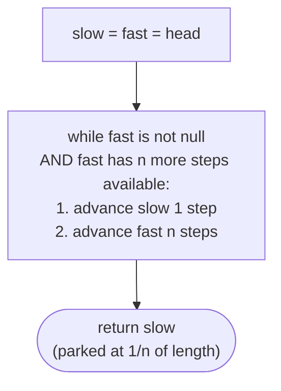
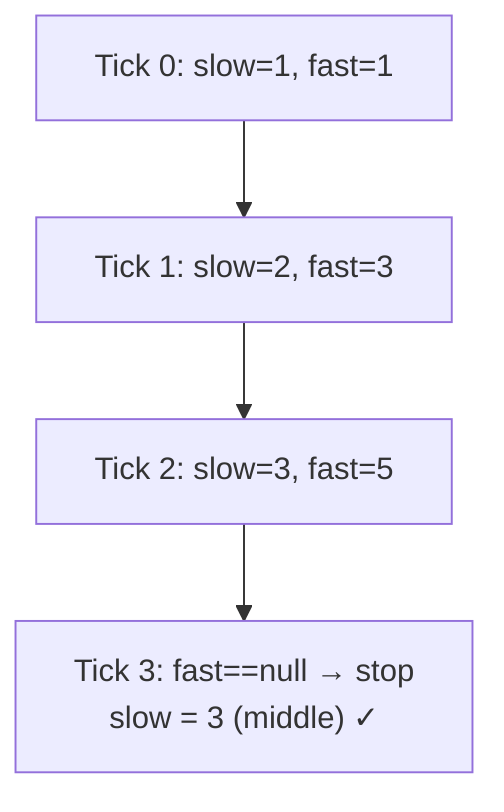

# 9. Pattern: Fast and Slow Pointers

## The Hook

Find the middle of a linked list. The obvious plan — count the nodes, divide by two, walk that far — costs two passes. For a stream you can only read once, it's *impossible*. There's a trick so clever it feels like cheating: put two pointers at the head, move one **twice as fast** as the other, and when the fast one hits the end, the slow one is sitting exactly on the middle. One pass. No length. No second walk.

You've already seen this idea in lesson 5 (Floyd's cycle detection) — two pointers at different speeds are what made that algorithm work. This lesson generalises the trick. The previous lesson's sliding-window pattern kept a **fixed gap** between two pointers; this one keeps a **fixed ratio** between their speeds. Same two pointers, different constraint. And that ratio is a superpower: ratio 2:1 finds the middle, ratio 3:1 finds the 1/3 point, ratio n:1 finds the 1/n point — always in a single pass with O(1) space.

The middle-finding primitive unlocks a surprising number of problems: split a list in half, check for palindromes, detect cycles, reorder alternating. Master the 2:1 dance once and everything else is three lines of glue code.

---

## Table of contents

1. [Understanding the fast and slow pointer pattern](#understanding-the-fast-and-slow-pointer-pattern)
2. [Identifying the fast and slow pointer pattern](#identifying-the-fast-and-slow-pointer-pattern)
3. [Middle node search](#middle-node-search)
4. [Split list in half](#split-list-in-half)
5. [Equal halves](#equal-halves)
6. [Palindrome checker](#palindrome-checker)

***

# Understanding the fast and slow pointer pattern

We can easily find the middle item in the array by dividing its length by two and accessing it using its index. However, unlike arrays, singly linked lists don't have a fixed size, and we cannot randomly access items using indices. Finding the middle node in the list requires two passes, first to find the length of the list and second to find the node at half the length from the start.

The problem can be further extended to find a node between two given nodes at a proportional distance from both. The fast and slow pointer technique can find that node in a single pass.

The fast and slow pointer pattern is a classification of problems that can be solved using the fast and slow pointer technique.

```d3 widget=linked-list
{
  "title": "Fast-and-slow finds a node at a proportional distance — e.g., 1/n of length",
  "direction": "single",
  "nodes": [
    {"id": "n1", "value": "1"},
    {"id": "n2", "value": "2"},
    {"id": "n3", "value": "3"},
    {"id": "n4", "value": "4"},
    {"id": "n5", "value": "5"},
    {"id": "n6", "value": "6"},
    {"id": "n7", "value": "7"},
    {"id": "n8", "value": "8"}
  ],
  "head": "n1",
  "steps": [
    {
      "links": [["n1","n2"],["n2","n3"],["n3","n4"],["n4","n5"],["n5","n6"],["n6","n7"],["n7","n8"]],
      "markers": [{"name": "head", "nodeId": "n1"}, {"name": "current", "nodeId": "n4"}, {"name": "tail", "nodeId": "n8"}],
      "msg": "Goal: find a node at 1/n of the length in a single pass — no length measurement needed"
    }
  ]
}
```

<p align="center"><strong>Fast-and-slow pointers find a node at a <em>proportional</em> distance from the ends — e.g., the middle (<code>n=2</code>, one pointer moves twice as fast), or the 1/3 point (<code>n=3</code>, fast moves three times as fast). No length measurement needed.</strong></p>

## Fast and slow pointer technique

Consider we are given a singly linked list and two nodes `start` and `end`, and we need to find a node that is at a distance `x` from `start` and `n*x` from `end`. It is guaranteed that a solution node exists.

It should be noted that a solution node will only exist if the length **L** between start and end is a multiple of **n** i.e, **L % n == 0**

The idea is to initialize two references `flast` and `slow` with `start` and move them forward at different speeds until `fast` reaches `end`.The `slow` reference moves **1** step in each iteration, while the `fast` reference moves **(n+1)** steps. This way, at the end of every iteration, the `slow` reference is at a proportional distance from the `start` and `fast` reference. When the `fast` reference reaches `end`, the `slow` reference points to the solution node.

```d3 widget=linked-list
{
  "title": "Middle-finding — fast moves 2x; when fast reaches tail, slow is at the middle",
  "direction": "single",
  "nodes": [
    {"id": "n1", "value": "1"},
    {"id": "n2", "value": "2"},
    {"id": "n3", "value": "3"},
    {"id": "n4", "value": "4"},
    {"id": "n5", "value": "5"}
  ],
  "head": "n1",
  "steps": [
    {
      "links": [["n1","n2"],["n2","n3"],["n3","n4"],["n4","n5"]],
      "markers": [{"name": "slow", "nodeId": "n1"}, {"name": "fast", "nodeId": "n1"}],
      "msg": "Init: slow = fast = head"
    },
    {
      "links": [["n1","n2"],["n2","n3"],["n3","n4"],["n4","n5"]],
      "markers": [{"name": "slow", "nodeId": "n2"}, {"name": "fast", "nodeId": "n3"}],
      "msg": "Tick 1: slow → 2, fast → 3"
    },
    {
      "links": [["n1","n2"],["n2","n3"],["n3","n4"],["n4","n5"]],
      "markers": [{"name": "slow", "nodeId": "n3"}, {"name": "fast", "nodeId": "n5"}],
      "msg": "Tick 2: slow → 3, fast → 5 (tail). Loop ends. slow is the middle."
    }
  ]
}
```

<p align="center"><strong>The middle-finding case — by far the most common. <code>fast</code> moves twice as fast as <code>slow</code>. Because fast traverses at 2× speed, it reaches the end in half the ticks it would take slow — so when fast is done, slow is exactly halfway through.</strong></p>



<p align="center"><strong>General algorithm — slow advances by 1, fast advances by <code>n</code>, per tick. When fast terminates, slow is at the <code>(length ÷ n)</code>-th node.</strong></p>

## Algorithm

The algorithm given below outlines the fast and slow pointer traversal technique for a linked list of size `n`.

> -   **Step 1:** Initialize two references, `slow` and `fast` with the head of the list.
> -   **Step 2:** Loop while `fast.next` != `null` and `fast` != `end` and do the following
>     -   **Step 2.1:** Move slow 1 step ahead by setting `slow` = `slow.next`
>     -   **Step 2.2:** Move `fast` `n+1` times setting `fast` = `fast.next` `n+1` times.
> -   **Step 3:** Node held in `slow` is the solution node

## Implementation

Given below is the generic code implementation of the fast and slow pointer traversal technique on a linked list.


```python run
"""
Definition for singly-linked list.
class ListNode:
    def __init__(self, val):
        self.val = val
        self.next = None
"""

def findTheSolutionNode(start: ListNode, end: ListNode, n: int) -> ListNode:
    # Create two pointers slow and fast
    # and point them to the start
    slow = start
    fast = start

    # Null pointer checks to take care of edge cases
    while fast.next and fast != end:
        # Move slow 1 step
        slow = slow.next

        # Move fast n+1 steps
        for _ in range(n+1):
            if fast.next:
                fast = fast.next

    # Node pointed by slow is the solution
    return slow
```

```java run

/**
 * Definition for singly-linked list.
 * class ListNode {
 *     int val;
 *     ListNode next;
 *     ListNode() {}
 *     ListNode(int val) { this.val = val; }
 * };
 */

public ListNode findTheSolutionNode(ListNode start, ListNode end, int n) {
    // Create two references slow and fast
    // and point them to the start
    ListNode slow = start;
    ListNode fast = start;

    // Null checks to take care of edge cases
    while(fast.next != null && fast != end) {
        // Move slow 1 step
        slow = slow.next;

        // Move fast n+1 step
        for(int i=0; i<n+1; i++) {
            if(fast != null && fast.next != null)
                fast = fast.next;
        }
    }

    // Node pointed by slow is the solution
    return slow;
}
```


## Complexity Analysis

The algorithm's time and space complexity is easy to understand. In the worst case, the start and end are the first and the last node in the list, and the fast reference traverses from the start to end of the list, which has a linear **O(N)** runtime complexity where **N** is the length of the linked list. In the best case, `start` and `end` may only have one node in between and `n=1`. In this case, the `fast` reference only traverses two nodes, and the runtime complexity would be constant O(1).

Since we do not create a new data structure, the space complexity is constant **O(1)**. 

> **Best Case**
>
> -   Space Complexity - **O(1)**
> -   Time Complexity - **O(1)**
>
> **Worst Case**
>
> -   Space Complexity - **O(1)**
> -   Time Complexity - **O(N)**

Later in the course, we will examine techniques for identifying problems that can be solved using the fast and slow pointer technique and walk through an example to better understand it.

***

# Identifying the fast and slow pointer pattern

The fast and slow pointer technique can only be applied to some specific problems. These are generally easy or medium problems where we must find a node at a proportional distance between two nodes. Most often these problems are about finding the middle node of a segment or the middle node of the entire list. If the problem statement or its solution follows the generic template below, it can be solved by applying the sliding window traversal technique.

**Template:**

Given a linked list and two nodes `start` and `end` at a distance of L from each other, find the node at a distance of `x` from `start` and `n*x` from `end` such that n > 0 and L % n == 0.

## Example

Let's consider the following problem as an example to better understand how to identify and solve a problem using the fast and slow pointer technique

> **Problem statement:** Given a linked list, find the middle node.

```d3 widget=linked-list
{
  "title": "Middle node — odd length picks the true centre; even length picks the second middle",
  "direction": "single",
  "nodes": [
    {"id": "a1", "value": "1"},
    {"id": "a2", "value": "2"},
    {"id": "a3", "value": "3"},
    {"id": "a4", "value": "4"},
    {"id": "a5", "value": "5"}
  ],
  "head": "a1",
  "steps": [
    {
      "links": [["a1","a2"],["a2","a3"],["a3","a4"],["a4","a5"]],
      "markers": [{"name": "current", "nodeId": "a3"}],
      "msg": "Odd length [1,2,3,4,5] — middle = node(3), unambiguous"
    },
    {
      "nodes": [
        {"id": "a1", "value": "1"},
        {"id": "a2", "value": "2"},
        {"id": "a3", "value": "3"},
        {"id": "a4", "value": "4"}
      ],
      "links": [["a1","a2"],["a2","a3"],["a3","a4"]],
      "markers": [{"name": "current", "nodeId": "a3"}],
      "msg": "Even length [1,2,3,4] — fast-and-slow returns the SECOND middle = node(3)"
    }
  ]
}
```

<p align="center"><strong>For odd length the middle is unambiguous. For even length there are two candidates — by convention, fast-and-slow returns the <em>second</em> middle (the one closer to the tail). Some problems want the first; the small tweak is to start <code>fast</code> one step ahead.</strong></p>

### Fast and slow pointer solution

The problem description directly fits the generic template for the fast and slow pointer traversal pattern we learned earlier.

**Template:**

Given a linked list and two nodes `start` (head) and `end` (last node) find the node at a distance of `x` from `start` and `n*x` from `end` where n = 1

We initialize two references `slow` and `fast` with the head node and iterate using `fast` until we reach the last node (either `null` or node before `null`) of the list. In each iteration, we move `slow` `n` (1) step ahead and `fast` `n+1` (2) steps ahead. At the end of all iterations, `slow` holds the reference to the node at the middle of the given list.

For linked lists that have an odd number of nodes, the traversal will terminate when `fast` reaches the last node and slow points to the node in the middle of the list. For a list with an even number of nodes, no (middle) node is equidistant from both ends, as the real middle of the list lies between two nodes. In this case, the traversal will terminate when fast hits `null` and slow points to the "second" middle node.



<p align="center"><strong>Trace on <code>[1, 2, 3, 4, 5]</code> — every tick, slow advances 1 step, fast advances 2 steps. Fast hits the end at tick 3; slow is parked at node 3, the middle.</strong></p>

The implementation of the fast and slow pointer solution is given as follows.


```python run
"""
Definition for singly-linked list.
class ListNode:
    def __init__(self, val):
        self.val = val
        self.next = None
"""

from typing import Optional

class Solution:
    def middle_node_search(
        self, head: Optional[ListNode]
    ) -> Optional[ListNode]:

        # Initialize slow pointer to the head of the list
        slow = head

        # Initialize fast pointer to the head of the list
        fast = head

        # Iterate until fast pointer reaches the end of the list
        while (
            fast is not None
            and fast.next is not None
            and slow is not None
        ):

            # Move slow pointer one step forward
            slow = slow.next

            # Move fast pointer two steps forward
            fast = fast.next.next

        # Return the middle node or the second middle node (in case of
        # even number of nodes)
        return slow
```

```java run
/**
 * Definition for singly-linked list.
 * class ListNode {
 *     int val;
 *     ListNode next;
 *     ListNode() {}
 *     ListNode(int val) { this.val = val; }
 * };
 */

class Solution {
    public ListNode middleNodeSearch(ListNode head) {

        // Initialize slow pointer to the head of the list
        ListNode slow = head;

        // Initialize fast pointer to the head of the list
        ListNode fast = head;

        // Iterate until fast pointer reaches the end of the list
        while (fast != null && fast.next != null) {

            // Move slow pointer one step forward
            slow = slow.next;

            // Move fast pointer two steps forward
            fast = fast.next.next;
        }

        // Return the middle node or the second middle node (in case of
        // even number of nodes)
        return slow;
    }
}
```


As the code above demonstrates, we can find the middle node of the given list using the fast and slow pointer technique in a single pass.

## Example problems

Most problems that fall under this category are **easy** problems; a list of a few is given below.

> -   **[Middle node search](#middle-node-search)**
> -   **[Split list in half](#split-list-in-half)**
> -   **[Equal halves](#equal-halves)**
> -   **[Palindrome checker](#palindrome-checker)**

We will now solve these problems to understand the fast and slow pointer technique better.

***

# Middle node search

## Problem Statement

Given the **head** of a singly linked list, write a function to find and return the reference of the middle node of this list.

If there are two middle nodes, return the reference of the second one.

### Example 1

> -   **Input:** head = \[5, 7, 3, 10, 6\]
> -   **Output:** 3

### Example 2

> -   **Input:** head = \[5, 7, 3, 10, 6, 8\]
> -   **Output:** 10

<details>
<summary><h2>Solution</h2></summary>


```python run
from typing import Optional


class ListNode:
    def __init__(self, val=0, nxt=None):
        self.val = val
        self.next = nxt


def from_list(values):
    if not values:
        return None
    head = ListNode(values[0])
    cur = head
    for v in values[1:]:
        cur.next = ListNode(v)
        cur = cur.next
    return head


def to_list(head):
    out = []
    while head is not None:
        out.append(head.val)
        head = head.next
    return out


class Solution:
    def middle_node_search(
        self, head: Optional[ListNode]
    ) -> Optional[ListNode]:

        # Initialize slow pointer to the head of the list
        slow = head

        # Initialize fast pointer to the head of the list
        fast = head

        # Iterate until fast pointer reaches the end of the list
        while (
            fast is not None
            and fast.next is not None
            and slow is not None
        ):

            # Move slow pointer one step forward
            slow = slow.next

            # Move fast pointer two steps forward
            fast = fast.next.next

        # Return the middle node or the second middle node (in case of
        # even number of nodes)
        return slow


print(Solution().middle_node_search(from_list([5, 7, 3, 10, 6])).val)      # 3
print(Solution().middle_node_search(from_list([5, 7, 3, 10, 6, 8])).val)   # 10

# Edge cases
print(Solution().middle_node_search(from_list([1])).val)                    # 1
print(Solution().middle_node_search(from_list([1, 2])).val)                 # 2
print(Solution().middle_node_search(from_list([1, 2, 3])).val)              # 2
print(Solution().middle_node_search(from_list([1, 2, 3, 4])).val)           # 3
print(Solution().middle_node_search(from_list([1, 2, 3, 4, 5, 6, 7])).val) # 4
```

```java run
import java.util.*;

public class Main {
    static class ListNode {
        int val;
        ListNode next;
        ListNode() {}
        ListNode(int val) { this.val = val; }
        ListNode(int val, ListNode next) { this.val = val; this.next = next; }
    }

    static ListNode fromList(int... values) {
        if (values.length == 0) return null;
        ListNode head = new ListNode(values[0]);
        ListNode cur = head;
        for (int i = 1; i < values.length; i++) {
            cur.next = new ListNode(values[i]);
            cur = cur.next;
        }
        return head;
    }

    static class Solution {
        public ListNode middleNodeSearch(ListNode head) {

            // Initialize slow pointer to the head of the list
            ListNode slow = head;

            // Initialize fast pointer to the head of the list
            ListNode fast = head;

            // Iterate until fast pointer reaches the end of the list
            while (fast != null && fast.next != null) {

                // Move slow pointer one step forward
                slow = slow.next;

                // Move fast pointer two steps forward
                fast = fast.next.next;
            }

            // Return the middle node or the second middle node (in case of
            // even number of nodes)
            return slow;
        }
    }

    public static void main(String[] args) {
        System.out.println(new Solution().middleNodeSearch(fromList(5, 7, 3, 10, 6)).val);      // 3
        System.out.println(new Solution().middleNodeSearch(fromList(5, 7, 3, 10, 6, 8)).val);   // 10

        // Edge cases
        System.out.println(new Solution().middleNodeSearch(fromList(1)).val);                    // 1
        System.out.println(new Solution().middleNodeSearch(fromList(1, 2)).val);                 // 2
        System.out.println(new Solution().middleNodeSearch(fromList(1, 2, 3)).val);              // 2
        System.out.println(new Solution().middleNodeSearch(fromList(1, 2, 3, 4)).val);           // 3
        System.out.println(new Solution().middleNodeSearch(fromList(1, 2, 3, 4, 5, 6, 7)).val); // 4
    }
}
```

</details>


***

# Split list in half

## Problem Statement

Given the **head** of a singly linked list, write a function to split the input linked list into two halves and return the heads of the two split halves. 

If there is only one middle node, that node should be part of the first half. 

### Example 1

> -   **Input:** head = \[5, 7, 3, 10, 6, 8\]
> -   **Output:** \[\[5, 7, 3\], \[10, 6, 8\]\]
> -   **Explanation:** Splitting the list results in two lists of equal lengths, as the length of the original list is even.

### Example 2

> -   **Input:** head = \[5, 7, 3, 10, 6\]
> -   **Output:** \[\[5, 7, 3\], \[10, 6\]\]
> -   **Explanation:** Splitting the list results in two lists of unequal lengths, as the length of the original list is odd. In this case, we keep the middle node as part of the first half.

### Example 3

> -   **Input:** head = \[5\]
> -   **Output:** \[\[5\], \[\]\]
> -   **Explanation:** Splitting the list results in two lists of unequal lengths, as the length of the original list is odd. In this case, we keep the middle node as part of the first half.

<details>
<summary><h2>Solution</h2></summary>


```python run
from typing import Optional, List


class ListNode:
    def __init__(self, val=0, nxt=None):
        self.val = val
        self.next = nxt


def from_list(values):
    if not values:
        return None
    head = ListNode(values[0])
    cur = head
    for v in values[1:]:
        cur.next = ListNode(v)
        cur = cur.next
    return head


def to_list(head):
    out = []
    while head is not None:
        out.append(head.val)
        head = head.next
    return out


class Solution:
    def split_list_in_half(
        self, head: Optional[ListNode]
    ) -> List[Optional[ListNode]]:

        # If the list is empty or has only one element, return the
        # original head and None
        if head is None or head.next is None:
            return [head, None]

        slow: Optional[ListNode] = head
        fast: Optional[ListNode] = head
        prev_to_slow: Optional[ListNode] = None

        # Find the midpoint of the list using the slow and fast pointer
        # technique
        while (
            fast is not None
            and fast.next is not None
            and slow is not None
        ):

            # Keep track of the node before the midpoint
            prev_to_slow = slow

            # Move the slow pointer by one step
            slow = slow.next

            # Move the fast pointer by two steps
            fast = fast.next.next

        second_half: Optional[ListNode] = None

        # If the fast pointer reached the end of the list, it has an even
        # number of nodes
        if fast is None and prev_to_slow is not None:

            # The second half starts from the next node of the previous
            # slow pointer
            second_half = prev_to_slow.next

            # Disconnect the two halves by setting the next of the
            # previous slow pointer to None
            prev_to_slow.next = None

        # else the list has an odd number of nodes
        else:
            if slow is not None:

                # The second half starts from the node after the slow
                # pointer
                second_half = slow.next

                # Disconnect the two halves by setting the next of the
                # slow pointer to None
                slow.next = None

        # Return a list containing the head of the first half and the
        # head of the second half
        return [head, second_half]


h1, h2 = Solution().split_list_in_half(from_list([5, 7, 3, 10, 6, 8]))
print(to_list(h1), to_list(h2))   # [5, 7, 3] [10, 6, 8]

h1, h2 = Solution().split_list_in_half(from_list([5, 7, 3, 10, 6]))
print(to_list(h1), to_list(h2))   # [5, 7, 3] [10, 6]

h1, h2 = Solution().split_list_in_half(from_list([5]))
print(to_list(h1), to_list(h2))   # [5] []

# Edge cases
h1, h2 = Solution().split_list_in_half(None)
print(to_list(h1), to_list(h2))   # [] []

h1, h2 = Solution().split_list_in_half(from_list([1, 2]))
print(to_list(h1), to_list(h2))   # [1] [2]

h1, h2 = Solution().split_list_in_half(from_list([1, 2, 3, 4]))
print(to_list(h1), to_list(h2))   # [1, 2] [3, 4]
```

```java run
import java.util.*;

public class Main {
    static class ListNode {
        int val;
        ListNode next;
        ListNode() {}
        ListNode(int val) { this.val = val; }
        ListNode(int val, ListNode next) { this.val = val; this.next = next; }
    }

    static ListNode fromList(int... values) {
        if (values.length == 0) return null;
        ListNode head = new ListNode(values[0]);
        ListNode cur = head;
        for (int i = 1; i < values.length; i++) {
            cur.next = new ListNode(values[i]);
            cur = cur.next;
        }
        return head;
    }

    static java.util.List<Integer> toList(ListNode head) {
        java.util.List<Integer> out = new java.util.ArrayList<>();
        while (head != null) { out.add(head.val); head = head.next; }
        return out;
    }

    static class Solution {
        public List<ListNode> splitListInHalf(ListNode head) {

            // If the list is empty or has only one element, return the
            // original head and null
            if (head == null || head.next == null) {
                return Arrays.asList(head, null);
            }

            ListNode slow = head;
            ListNode fast = head;
            ListNode prevToSlow = null;

            // Find the midpoint of the list using the slow and fast pointer
            // technique
            while (fast != null && fast.next != null) {

                // Keep track of the node before the midpoint
                prevToSlow = slow;

                // Move the slow pointer by one step
                slow = slow.next;

                // Move the fast pointer by two steps
                fast = fast.next.next;
            }

            ListNode secondHalf;

            // If the fast pointer reached the end of the list, it has an
            // even number of nodes
            if (fast == null) {

                // The second half starts from the next node of the previous
                // slow pointer
                secondHalf = prevToSlow.next;

                // Disconnect the two halves by setting the next of the
                // previous slow pointer to null
                prevToSlow.next = null;
            }

            // else the list has an odd number of nodes
            else {

                // The second half starts from the node after the slow
                // pointer
                secondHalf = slow.next;

                // Disconnect the two halves by setting the next of the slow
                // pointer to null
                slow.next = null;
            }

            // Return a list containing the head of the first half and the
            // head of the second half
            return Arrays.asList(head, secondHalf);
        }
    }

    public static void main(String[] args) {
        List<ListNode> r1 = new Solution().splitListInHalf(fromList(5, 7, 3, 10, 6, 8));
        System.out.println(toList(r1.get(0)) + " " + toList(r1.get(1)));  // [5, 7, 3] [10, 6, 8]

        List<ListNode> r2 = new Solution().splitListInHalf(fromList(5, 7, 3, 10, 6));
        System.out.println(toList(r2.get(0)) + " " + toList(r2.get(1)));  // [5, 7, 3] [10, 6]

        List<ListNode> r3 = new Solution().splitListInHalf(fromList(5));
        System.out.println(toList(r3.get(0)) + " " + toList(r3.get(1)));  // [5] []

        // Edge cases
        List<ListNode> r4 = new Solution().splitListInHalf(null);
        System.out.println(toList(r4.get(0)) + " " + toList(r4.get(1)));  // [] []

        List<ListNode> r5 = new Solution().splitListInHalf(fromList(1, 2));
        System.out.println(toList(r5.get(0)) + " " + toList(r5.get(1)));  // [1] [2]

        List<ListNode> r6 = new Solution().splitListInHalf(fromList(1, 2, 3, 4));
        System.out.println(toList(r6.get(0)) + " " + toList(r6.get(1)));  // [1, 2] [3, 4]
    }
}
```

</details>


***

# Equal halves

## Problem Statement

Given the **head** of a singly linked list, write a function that returns `true` if the sum of the nodes of the first half of the linked list is equal to the sum of the nodes of the second half. Return `false` otherwise.

```d2
direction: right
title: "Odd length [1, 2, 3, 4, 5] — middle (★ 3) belongs to the first half" {shape: text; near: top-center}
h1: First half (3 nodes) {
  direction: right
  o1: "1"
  o2: "2"
  o3: "3 ★" {style.fill: "#fde68a"; style.stroke: "#d97706"}
  o1 -> o2 -> o3
}
h2: Second half (2 nodes) {
  direction: right
  o4: "4"
  o5: "5"
  o4 -> o5
}
h1 -> h2
```

<p align="center"><strong>Odd length — the middle node (3) belongs to the first half. Sums must match across <code>{1,2,3}</code> and <code>{4,5}</code>.</strong></p>

```d2
direction: right
title: "Even length [1, 2, 3, 4] — halves are equal (2 + 2)" {shape: text; near: top-center}
h1: First half (2 nodes) {
  direction: right
  e1: "1"
  e2: "2"
  e1 -> e2
}
h2: Second half (2 nodes) {
  direction: right
  e3: "3"
  e4: "4"
  e3 -> e4
}
h1 -> h2
```

<p align="center"><strong>Even length — the two halves are equal in size. Sums must match across <code>{1,2}</code> and <code>{3,4}</code>.</strong></p>

<p align="center"><strong>Split convention — when the list has odd length, the single middle node belongs to the first half. When even, the two halves are equal.</strong></p>

### Example 1

> -   **Input:** head = \[1, 9, 2, 8\]
> -   **Output:** true
> -   **Explanation:** The sum of the first half (1 + 9 = 10) equals the sum of the second half (2 + 8 = 10).

### Example 2

> -   **Input:** head = \[2, 0\]
> -   **Output:** false
> -   **Explanation:** The sum of the first half (2) is not equals the sum of the second half (0).

<details>
<summary><h2>Solution</h2></summary>


```python run
from typing import Optional


class ListNode:
    def __init__(self, val=0, nxt=None):
        self.val = val
        self.next = nxt


def from_list(values):
    if not values:
        return None
    head = ListNode(values[0])
    cur = head
    for v in values[1:]:
        cur.next = ListNode(v)
        cur = cur.next
    return head


class Solution:
    def sum_of_list(
        self, start: Optional[ListNode], end: Optional[ListNode]
    ) -> int:
        sum_val = 0
        current = start
        while current != end:
            sum_val += current.val
            current = current.next
        return sum_val

    def equal_halves(self, head: Optional[ListNode]) -> bool:
        if head is None or head.next is None:
            return True

        # Initialize slow pointer
        slow: Optional[ListNode] = head

        # Initialize fast pointer
        fast: Optional[ListNode] = head

        # Find the midpoint of the list using the slow and fast pointer
        # technique
        while fast is not None and fast.next is not None:

            # Move the slow pointer by one step
            slow = slow.next

            # Move the fast pointer by two steps
            fast = fast.next.next

        second_half_start: Optional[ListNode]

        # Odd number of nodes, middle node goes to first half
        if fast is not None:
            second_half_start = slow.next

        # Even number of nodes, slow is the start of second half
        else:
            second_half_start = slow

        # Calculate sums of the first half
        first_half_sum = self.sum_of_list(head, second_half_start)

        # Calculate sums of the second half
        second_half_sum = self.sum_of_list(second_half_start, None)

        return first_half_sum == second_half_sum


print(Solution().equal_halves(from_list([1, 9, 2, 8])))         # True
print(Solution().equal_halves(from_list([2, 0])))                # False

# Edge cases
print(Solution().equal_halves(from_list([1])))                   # True
print(Solution().equal_halves(from_list([5, 5])))                # True
print(Solution().equal_halves(from_list([1, 2, 3])))             # False (1+2 vs 3)
print(Solution().equal_halves(from_list([3, 3, 3, 3])))          # True
print(Solution().equal_halves(from_list([1, 2, 3, 4, 5, 5])))   # True (1+2+3 vs 4+5+5 — False)
print(Solution().equal_halves(from_list([0, 0, 0, 0])))          # True
```

```java run
import java.util.*;

public class Main {
    static class ListNode {
        int val;
        ListNode next;
        ListNode() {}
        ListNode(int val) { this.val = val; }
        ListNode(int val, ListNode next) { this.val = val; this.next = next; }
    }

    static ListNode fromList(int... values) {
        if (values.length == 0) return null;
        ListNode head = new ListNode(values[0]);
        ListNode cur = head;
        for (int i = 1; i < values.length; i++) {
            cur.next = new ListNode(values[i]);
            cur = cur.next;
        }
        return head;
    }

    static class Solution {
        private int sumOfList(ListNode start, ListNode end) {
            int sum = 0;
            ListNode current = start;
            while (current != end) {
                sum += current.val;
                current = current.next;
            }
            return sum;
        }

        public boolean equalHalves(ListNode head) {
            if (head == null || head.next == null) {
                return true;
            }

            // Initialize slow pointer
            ListNode slow = head;

            // Initialize fast pointer
            ListNode fast = head;

            // Find the midpoint of the list using the slow and fast pointer
            // technique
            while (fast != null && fast.next != null) {

                // Move the slow pointer by one step
                slow = slow.next;

                // Move the fast pointer by two steps
                fast = fast.next.next;
            }

            ListNode secondHalfStart = null;

            // Odd number of nodes, middle node goes to first half
            if (fast != null) {
                secondHalfStart = slow.next;
            }

            // Even number of nodes, slow is the start of second half
            else {
                secondHalfStart = slow;
            }

            // Calculate sums of the first half
            int firstHalfSum = sumOfList(head, secondHalfStart);

            // Calculate sums of the second half
            int secondHalfSum = sumOfList(secondHalfStart, null);

            return firstHalfSum == secondHalfSum;
        }
    }

    public static void main(String[] args) {
        System.out.println(new Solution().equalHalves(fromList(1, 9, 2, 8)));         // true
        System.out.println(new Solution().equalHalves(fromList(2, 0)));                // false

        // Edge cases
        System.out.println(new Solution().equalHalves(fromList(1)));                   // true
        System.out.println(new Solution().equalHalves(fromList(5, 5)));                // true
        System.out.println(new Solution().equalHalves(fromList(1, 2, 3)));             // false
        System.out.println(new Solution().equalHalves(fromList(3, 3, 3, 3)));          // true
        System.out.println(new Solution().equalHalves(fromList(1, 2, 3, 4, 5, 5)));   // false
        System.out.println(new Solution().equalHalves(fromList(0, 0, 0, 0)));          // true
    }
}
```

</details>
# Palindrome checker

## Problem Statement

Given the **head** of a singly linked list, write a function to check if the given list is a palindrome or not. Your function should return `true` if it is a palindrome and `false` if it's not. 

### Example 1

> -   **Input:** head = \[1, 2, 2, 1\]
> -   **Output:** true
> -   **Explanation:** Returning true as \[1, 2, 2, 1\] is a palindrome.

### Example 2

> -   **Input:** head = \[1, 2\]
> -   **Output:** false
> -   **Explanation:** Returning false as \[1, 2\] is not a palindrome.

<details>
<summary><h2>Solution</h2></summary>


```python run
from typing import Optional


class ListNode:
    def __init__(self, val=0, nxt=None):
        self.val = val
        self.next = nxt


def from_list(values):
    if not values:
        return None
    head = ListNode(values[0])
    cur = head
    for v in values[1:]:
        cur.next = ListNode(v)
        cur = cur.next
    return head


class Solution:
    def reverse(self, head: Optional[ListNode]) -> Optional[ListNode]:
        current: Optional[ListNode] = head
        previous: Optional[ListNode] = None

        while current is not None:
            next_node = current.next
            current.next = previous
            previous = current
            current = next_node

        return previous

    def find_middle_node(
        self, head: Optional[ListNode]
    ) -> Optional[ListNode]:
        slow = head
        fast = head
        while fast is not None and fast.next is not None:
            slow = slow.next
            fast = fast.next.next

        return slow

    def is_palindrome(
        self, head_a: Optional[ListNode], head_b: Optional[ListNode]
    ) -> bool:
        while head_b is not None:
            if head_a.val != head_b.val:
                return False
            head_a = head_a.next
            head_b = head_b.next
        return True

    def palindrome_checker(self, head: Optional[ListNode]) -> bool:
        if head is None or head.next is None:
            return True

        # Find the middle node of the linked list
        middle_node = self.find_middle_node(head)

        # Reverse the second half of the list
        reversed_second_half = self.reverse(middle_node)

        # Compare the elements of first half with the reversed second
        # half
        return self.is_palindrome(head, reversed_second_half)


print(Solution().palindrome_checker(from_list([1, 2, 2, 1])))        # True
print(Solution().palindrome_checker(from_list([1, 2])))               # False

# Edge cases
print(Solution().palindrome_checker(None))                            # True
print(Solution().palindrome_checker(from_list([1])))                  # True
print(Solution().palindrome_checker(from_list([1, 1])))               # True
print(Solution().palindrome_checker(from_list([1, 2, 1])))            # True
print(Solution().palindrome_checker(from_list([1, 2, 3, 2, 1])))     # True
print(Solution().palindrome_checker(from_list([1, 2, 3, 4, 5])))     # False
```

```java run
import java.util.*;

public class Main {
    static class ListNode {
        int val;
        ListNode next;
        ListNode() {}
        ListNode(int val) { this.val = val; }
        ListNode(int val, ListNode next) { this.val = val; this.next = next; }
    }

    static ListNode fromList(int... values) {
        if (values.length == 0) return null;
        ListNode head = new ListNode(values[0]);
        ListNode cur = head;
        for (int i = 1; i < values.length; i++) {
            cur.next = new ListNode(values[i]);
            cur = cur.next;
        }
        return head;
    }

    static class Solution {
        private ListNode reverse(ListNode head) {
            ListNode current = head;
            ListNode previous = null;

            while (current != null) {
                ListNode next = current.next;
                current.next = previous;
                previous = current;
                current = next;
            }

            return previous;
        }

        private ListNode findMiddleNode(ListNode head) {
            ListNode slow = head;
            ListNode fast = head;
            while (fast != null && fast.next != null) {
                slow = slow.next;
                fast = fast.next.next;
            }

            return slow;
        }

        private boolean isPalindrome(ListNode headA, ListNode headB) {
            while (headB != null) {
                if (headA.val != headB.val) {
                    return false;
                }
                headA = headA.next;
                headB = headB.next;
            }
            return true;
        }

        public boolean palindromeChecker(ListNode head) {
            if (head == null || head.next == null) {
                return true;
            }

            // Find the middle node of the linked list
            ListNode middleNode = findMiddleNode(head);

            // Reverse the second half of the list
            ListNode reversedSecondHalf = reverse(middleNode);

            // Compare the elements of first half with the reversed second
            // half
            return isPalindrome(head, reversedSecondHalf);
        }
    }

    public static void main(String[] args) {
        System.out.println(new Solution().palindromeChecker(fromList(1, 2, 2, 1)));        // true
        System.out.println(new Solution().palindromeChecker(fromList(1, 2)));               // false

        // Edge cases
        System.out.println(new Solution().palindromeChecker(null));                         // true
        System.out.println(new Solution().palindromeChecker(fromList(1)));                  // true
        System.out.println(new Solution().palindromeChecker(fromList(1, 1)));               // true
        System.out.println(new Solution().palindromeChecker(fromList(1, 2, 1)));            // true
        System.out.println(new Solution().palindromeChecker(fromList(1, 2, 3, 2, 1)));     // true
        System.out.println(new Solution().palindromeChecker(fromList(1, 2, 3, 4, 5)));     // false
    }
}
```

</details>
<details>
<summary><h2>Final Takeaway</h2></summary>


Fast-and-slow pointers is a one-line insight: **when two pointers move at different speeds, their relative position encodes a proportion of the list's length**. The pattern resolves to:

```
slow = fast = head
while fast is not null and fast.next is not null:
    slow = slow.next
    fast = fast.next.next
# slow now sits at the middle (the (n/2 + 1)-th node for even n)
```

Four insights worth burning in:

| Insight | Why it matters |
|---|---|
| Ratio controls the landing position | 2:1 finds the middle, 3:1 finds the 1/3 point, n:1 finds the 1/n point. The math is the algorithm. |
| Termination check must guard both pointers | `fast != null AND fast.next != null` — missing the second clause NPEs on even-length lists when fast tries to take its second step. |
| First vs second middle is just initialisation | For even-length lists, starting fast at `head.next` lands slow on the first middle; starting fast at `head` lands it on the second. Both are one-liners. |
| This pattern is the ancestor of Floyd's cycle detection | Same two-speed walk, different observation — inside a cycle, fast eventually laps slow; outside, fast falls off. One technique, two outcomes. |

When you next see "find the middle", "split in half", "palindrome check", "reorder alternating", or any problem asking you to infer structure from length ratios — reach for the 2:1 walk first.

> **Transfer Challenge:** Return the <code>k</code>-th node from the **start**, but you can only touch the head pointer once. How? Use the same idea — but what's the right ratio?
>
> <details><summary><strong>Solution hint</strong></summary>
>
> Different problem, different trick — this one needs a <em>fixed-gap</em> two-pointer, not fixed-ratio. That's the <strong>sliding-window traversal</strong> pattern from lesson 8. Advance fast by <code>k − 1</code> hops first; then slide both together until fast hits the tail. Fast-and-slow and sliding-window are <em>sibling</em> patterns — both use two pointers, but one fixes the ratio of their speeds, the other fixes the distance between them. Pick the right sibling for the job.
>
> </details>

</details>