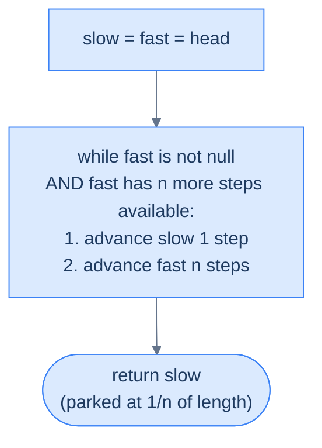
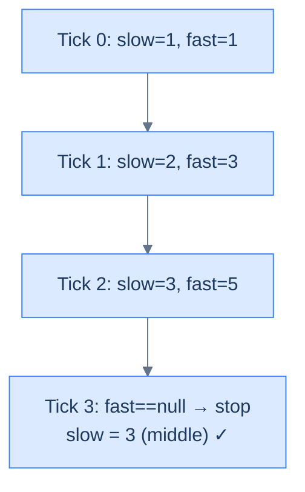

# 9. Pattern: Fast and Slow Pointers

## The Hook

Find the middle of a linked list. The obvious plan — count the nodes, divide by two, walk that far — costs two passes. For a stream you can only read once, it's *impossible*. There's a trick so clever it feels like cheating: put two pointers at the head, move one **twice as fast** as the other, and when the fast one hits the end, the slow one is sitting exactly on the middle. One pass. No length. No second walk.

You've already seen this idea in lesson 5 (Floyd's cycle detection) — two pointers at different speeds are what made that algorithm work. This lesson generalises the trick. The previous lesson's sliding-window pattern kept a **fixed gap** between two pointers; this one keeps a **fixed ratio** between their speeds. Same two pointers, different constraint. And that ratio is a superpower: ratio 2:1 finds the middle, ratio 3:1 finds the 1/3 point, ratio n:1 finds the 1/n point — always in a single pass with O(1) space.

The middle-finding primitive unlocks a surprising number of problems: split a list in half, check for palindromes, detect cycles, reorder alternating. Master the 2:1 dance once and everything else is three lines of glue code.

---

## Table of contents

1. [Understanding the fast and slow pointer pattern](#understanding-the-fast-and-slow-pointer-pattern)
2. [Identifying the fast and slow pointer pattern](#identifying-the-fast-and-slow-pointer-pattern)
3. [Middle node search](#middle-node-search)
4. [Split list in half](#split-list-in-half)
5. [Equal halves](#equal-halves)
6. [Palindrome checker](#palindrome-checker)

***

# Understanding the fast and slow pointer pattern

We can easily find the middle item in the array by dividing its length by two and accessing it using its index. However, unlike arrays, singly linked lists don't have a fixed size, and we cannot randomly access items using indices. Finding the middle node in the list requires two passes, first to find the length of the list and second to find the node at half the length from the start.

The problem can be further extended to find a node between two given nodes at a proportional distance from both. The fast and slow pointer technique can find that node in a single pass.

The fast and slow pointer pattern is a classification of problems that can be solved using the fast and slow pointer technique.

```d2
direction: right
h: head {shape: oval}
a: "·"
b: "·"
c: "·"
d: |md
  **target**

  (at 1/n of length)
| {style.fill: "#fde68a"; style.stroke: "#d97706"}
e: "·"
f: "·"
g: "·"
t: tail
h -> a
a -> b
b -> c
c -> d
d -> e
e -> f
f -> g
g -> t
```

<p align="center"><strong>Fast-and-slow pointers find a node at a <em>proportional</em> distance from the ends — e.g., the middle (<code>n=2</code>, one pointer moves twice as fast), or the 1/3 point (<code>n=3</code>, fast moves three times as fast). No length measurement needed.</strong></p>

## Fast and slow pointer technique

Consider we are given a singly linked list and two nodes `start` and `end`, and we need to find a node that is at a distance `x` from `start` and `n*x` from `end`. It is guaranteed that a solution node exists.

It should be noted that a solution node will only exist if the length **L** between start and end is a multiple of **n** i.e, **L % n == 0**

The idea is to initialize two references `flast` and `slow` with `start` and move them forward at different speeds until `fast` reaches `end`.The `slow` reference moves **1** step in each iteration, while the `fast` reference moves **(n+1)** steps. This way, at the end of every iteration, the `slow` reference is at a proportional distance from the `start` and `fast` reference. When the `fast` reference reaches `end`, the `slow` reference points to the solution node.

```d2
direction: right
h: head {shape: oval}
a: "1"
b: "2"
m: |md
  **3**

  middle
| {style.fill: "#fde68a"; style.stroke: "#d97706"}
d: "4"
e: "5"
note: |md
  fast moves 2 steps per tick

  slow moves 1 step per tick

  when fast reaches tail, slow is at middle
| {shape: rectangle}
h -> a
a -> b
b -> m
m -> d
d -> e
e -> note: "" {style.stroke-dash: 3}
```

<p align="center"><strong>The middle-finding case — by far the most common. <code>fast</code> moves twice as fast as <code>slow</code>. Because fast traverses at 2× speed, it reaches the end in half the ticks it would take slow — so when fast is done, slow is exactly halfway through.</strong></p>



<p align="center"><strong>General algorithm — slow advances by 1, fast advances by <code>n</code>, per tick. When fast terminates, slow is at the <code>(length ÷ n)</code>-th node.</strong></p>

## Algorithm

The algorithm given below outlines the fast and slow pointer traversal technique for a linked list of size `n`.

> -   **Step 1:** Initialize two references, `slow` and `fast` with the head of the list.
> -   **Step 2:** Loop while `fast.next` != `null` and `fast` != `end` and do the following
>     -   **Step 2.1:** Move slow 1 step ahead by setting `slow` = `slow.next`
>     -   **Step 2.2:** Move `fast` `n+1` times setting `fast` = `fast.next` `n+1` times.
> -   **Step 3:** Node held in `slow` is the solution node

## Implementation

Given below is the generic code implementation of the fast and slow pointer traversal technique on a linked list.


```pseudocode
# Generic fast-and-slow template. slow moves 1, fast moves n+1. When fast reaches end, slow parks at the "1-out-of-(n+1)" position.
function findTheSolutionNode(start, end, n):

    # Create two references slow and fast
    # and point them to the start
    slow ← start
    fast ← start

    # Null checks to take care of edge cases
    while fast.next is not null AND fast ≠ end:

        # Move slow 1 step
        slow ← slow.next

        # Move fast n+1 step
        for i ← 0 to n:
            if fast is not null AND fast.next is not null:
                fast ← fast.next

    # Node pointed by slow is the solution
    return slow
```

```python run
from typing import Optional

class ListNode:
    def __init__(self, val=0, next=None):
        self.val = val
        self.next = next

def find_the_solution_node(start: ListNode, end: Optional[ListNode], n: int) -> ListNode:

    # Create two references slow and fast
    # and point them to the start
    slow = start
    fast = start

    # Null checks to take care of edge cases
    while fast.next is not None and fast is not end:

        # Move slow 1 step
        slow = slow.next

        # Move fast n+1 step
        for _ in range(n + 1):
            if fast is not None and fast.next is not None:
                fast = fast.next

    # Node pointed by slow is the solution
    return slow
```

```java run
class Solution {
    public ListNode findTheSolutionNode(ListNode start, ListNode end, int n) {

        // Create two references slow and fast
        // and point them to the start
        ListNode slow = start;
        ListNode fast = start;

        // Null checks to take care of edge cases
        while (fast.next != null && fast != end) {

            // Move slow 1 step
            slow = slow.next;

            // Move fast n+1 step
            for (int i = 0; i < n + 1; i++) {
                if (fast != null && fast.next != null)
                    fast = fast.next;
            }
        }

        // Node pointed by slow is the solution
        return slow;
    }
}
```

```c run
typedef struct ListNode { int val; struct ListNode *next; } ListNode;

ListNode* findTheSolutionNode(ListNode *start, ListNode *end, int n) {

    /* Create two pointers slow and fast
       and point them to the start */
    ListNode *slow = start;
    ListNode *fast = start;

    /* Null pointer checks to take care of edge cases */
    while (fast->next && fast != end) {

        /* Move slow 1 step */
        slow = slow->next;

        /* Move fast n+1 steps */
        for (int i = 0; i < n + 1; i++) {
            if (fast->next)
                fast = fast->next;
        }
    }

    /* Node pointed by slow is the solution */
    return slow;
}
```

```scala run
object Solution {
  def findTheSolutionNode(start: ListNode, end: ListNode, n: Int): ListNode = {

    // Create two references slow and fast
    // and point them to the start
    var slow = start
    var fast = start

    // Null checks to take care of edge cases
    while (fast.next != null && (fast ne end)) {

      // Move slow 1 step
      slow = slow.next

      // Move fast n+1 step
      var i = 0
      while (i < n + 1) {
        if (fast != null && fast.next != null) {
          fast = fast.next
        }
        i += 1
      }
    }

    // Node pointed by slow is the solution
    slow
  }
}
```


## Complexity Analysis

The algorithm's time and space complexity is easy to understand. In the worst case, the start and end are the first and the last node in the list, and the fast reference traverses from the start to end of the list, which has a linear **O(N)** runtime complexity where **N** is the length of the linked list. In the best case, `start` and `end` may only have one node in between and `n=1`. In this case, the `fast` reference only traverses two nodes, and the runtime complexity would be constant O(1).

Since we do not create a new data structure, the space complexity is constant **O(1)**. 

> **Best Case**
>
> -   Space Complexity - **O(1)**
> -   Time Complexity - **O(1)**
>
> **Worst Case**
>
> -   Space Complexity - **O(1)**
> -   Time Complexity - **O(N)**

Later in the course, we will examine techniques for identifying problems that can be solved using the fast and slow pointer technique and walk through an example to better understand it.

***

# Identifying the fast and slow pointer pattern

The fast and slow pointer technique can only be applied to some specific problems. These are generally easy or medium problems where we must find a node at a proportional distance between two nodes. Most often these problems are about finding the middle node of a segment or the middle node of the entire list. If the problem statement or its solution follows the generic template below, it can be solved by applying the sliding window traversal technique.

**Template:**

Given a linked list and two nodes `start` and `end` at a distance of L from each other, find the node at a distance of `x` from `start` and `n*x` from `end` such that n > 0 and L % n == 0.

## Example

Let's consider the following problem as an example to better understand how to identify and solve a problem using the fast and slow pointer technique

> **Problem statement:** Given a linked list, find the middle node.

```d2
odd: "Odd length — [1, 2, 3, 4, 5]" {
  direction: right
  a1: "1"
  a2: "2"
  a3: |md
    **3**

    middle
  | {style.fill: "#fde68a"; style.stroke: "#d97706"}
  a4: "4"
  a5: "5"
  a1 -> a2
  a2 -> a3
  a3 -> a4
  a4 -> a5
}

even: "Even length — [1, 2, 3, 4]" {
  direction: right
  b1: "1"
  b2: "2"
  b3: |md
    **3**

    2nd middle
  | {style.fill: "#fde68a"; style.stroke: "#d97706"}
  b4: "4"
  b1 -> b2
  b2 -> b3
  b3 -> b4
}
```

<p align="center"><strong>For odd length the middle is unambiguous. For even length there are two candidates — by convention, fast-and-slow returns the <em>second</em> middle (the one closer to the tail). Some problems want the first; the small tweak is to start <code>fast</code> one step ahead.</strong></p>

### Fast and slow pointer solution

The problem description directly fits the generic template for the fast and slow pointer traversal pattern we learned earlier.

**Template:**

Given a linked list and two nodes `start` (head) and `end` (last node) find the node at a distance of `x` from `start` and `n*x` from `end` where n = 1

We initialize two references `slow` and `fast` with the head node and iterate using `fast` until we reach the last node (either `null` or node before `null`) of the list. In each iteration, we move `slow` `n` (1) step ahead and `fast` `n+1` (2) steps ahead. At the end of all iterations, `slow` holds the reference to the node at the middle of the given list.

For linked lists that have an odd number of nodes, the traversal will terminate when `fast` reaches the last node and slow points to the node in the middle of the list. For a list with an even number of nodes, no (middle) node is equidistant from both ends, as the real middle of the list lies between two nodes. In this case, the traversal will terminate when fast hits `null` and slow points to the "second" middle node.



<p align="center"><strong>Trace on <code>[1, 2, 3, 4, 5]</code> — every tick, slow advances 1 step, fast advances 2 steps. Fast hits the end at tick 3; slow is parked at node 3, the middle.</strong></p>

The implementation of the fast and slow pointer solution is given as follows.


```pseudocode
# Find the middle node. Fast = 2 × slow → when fast hits the end, slow is at the midpoint.
# Even length: returns the SECOND middle.
function middleNodeSearch(head):
    slow ← head; fast ← head
    while fast is not null AND fast.next is not null:
        slow ← slow.next
        fast ← fast.next.next
    return slow
```

```python run
from typing import Optional

class Solution:
    def middle_node_search(self, head: Optional[ListNode]) -> Optional[ListNode]:
        slow, fast = head, head
        # When fast reaches the end, slow is parked at the middle.
        while fast is not None and fast.next is not None:
            slow = slow.next
            fast = fast.next.next
        return slow    # for even length, returns the SECOND middle
```

```java run
class Solution {
    public ListNode middleNodeSearch(ListNode head) {
        ListNode slow = head, fast = head;
        while (fast != null && fast.next != null) {
            slow = slow.next;
            fast = fast.next.next;
        }
        return slow;
    }
}
```

```c run
ListNode* middleNodeSearch(ListNode *head) {
    ListNode *slow = head, *fast = head;
    while (fast != NULL && fast->next != NULL) {
        slow = slow->next;
        fast = fast->next->next;
    }
    return slow;
}
```

```scala run
object Solution {
  def middleNodeSearch(head: ListNode): ListNode = {
    var slow = head; var fast = head
    while (fast != null && fast.next != null) {
      slow = slow.next
      fast = fast.next.next
    }
    slow
  }
}
```


As the code above demonstrates, we can find the middle node of the given list using the fast and slow pointer technique in a single pass.

## Example problems

Most problems that fall under this category are **easy** problems; a list of a few is given below.

> -   **[Middle node search](#middle-node-search)**
> -   **[Split list in half](#split-list-in-half)**
> -   **[Equal halves](#equal-halves)**
> -   **[Palindrome checker](#palindrome-checker)**

We will now solve these problems to understand the fast and slow pointer technique better.

***

# Middle node search

## Problem Statement

Given the **head** of a singly linked list, write a function to find and return the reference of the middle node of this list.

If there are two middle nodes, return the reference of the second one.

### Example 1

> -   **Input:** head = \[5, 7, 3, 10, 6\]
> -   **Output:** 3

### Example 2

> -   **Input:** head = \[5, 7, 3, 10, 6, 8\]
> -   **Output:** 10

## Solution


```pseudocode
# Same algorithm with explicit step-by-two annotation.
function middleNodeSearch(head):
    slow ← head; fast ← head
    while fast is not null AND fast.next is not null:
        slow ← slow.next                               # advance slow by one
        fast ← fast.next.next                          # advance fast by two
    return slow
```

```python run
class ListNode:
    def __init__(self, val=0, next=None):
        self.val = val
        self.next = next

def middle_node_search(head: ListNode) -> ListNode:
    # Both pointers start at head
    slow = head
    fast = head

    # fast moves 2 steps per iteration, slow moves 1 —
    # when fast reaches the end, slow is at the midpoint
    while fast is not None and fast.next is not None:
        slow = slow.next          # advance slow by one
        fast = fast.next.next     # advance fast by two

    # slow now sits at the middle (second middle for even-length lists)
    return slow

# --- driver ---
def build(vals):
    dummy = ListNode(0)
    cur = dummy
    for v in vals:
        cur.next = ListNode(v)
        cur = cur.next
    return dummy.next

head = build([5, 7, 3, 10, 6])
print(middle_node_search(head).val)   # expected: 3
```

```java run
public class Solution {
    static class ListNode {
        int val;
        ListNode next;
        ListNode(int v) { val = v; }
        ListNode(int v, ListNode n) { val = v; next = n; }
    }

    static ListNode middleNodeSearch(ListNode head) {
        ListNode slow = head;
        ListNode fast = head;

        // fast moves 2 steps per iteration, slow moves 1 —
        // when fast reaches the end, slow is at the midpoint
        while (fast != null && fast.next != null) {
            slow = slow.next;      // advance slow by one
            fast = fast.next.next; // advance fast by two
        }

        // slow now sits at the middle (second middle for even-length lists)
        return slow;
    }

    static ListNode build(int[] vals) {
        ListNode dummy = new ListNode(0);
        ListNode cur = dummy;
        for (int v : vals) { cur.next = new ListNode(v); cur = cur.next; }
        return dummy.next;
    }

    public static void main(String[] args) {
        ListNode head = build(new int[]{5, 7, 3, 10, 6});
        System.out.println(middleNodeSearch(head).val); // expected: 3
    }
}
```

```c run
#include <stdio.h>
#include <stdlib.h>

typedef struct ListNode {
    int val;
    struct ListNode *next;
} ListNode;

ListNode* newNode(int v) {
    ListNode *n = malloc(sizeof *n);
    n->val = v;
    n->next = NULL;
    return n;
}

ListNode* middleNodeSearch(ListNode *head) {
    ListNode *slow = head;
    ListNode *fast = head;

    /* fast moves 2 steps per iteration, slow moves 1 —
       when fast reaches the end, slow is at the midpoint */
    while (fast != NULL && fast->next != NULL) {
        slow = slow->next;       /* advance slow by one */
        fast = fast->next->next; /* advance fast by two */
    }

    /* slow now sits at the middle (second middle for even-length lists) */
    return slow;
}

ListNode* build(int *vals, int n) {
    ListNode dummy = {0, NULL};
    ListNode *cur = &dummy;
    for (int i = 0; i < n; i++) { cur->next = newNode(vals[i]); cur = cur->next; }
    return dummy.next;
}

int main(void) {
    int vals[] = {5, 7, 3, 10, 6};
    ListNode *head = build(vals, 5);
    printf("%d\n", middleNodeSearch(head)->val); /* expected: 3 */
    return 0;
}
```

```scala run
class ListNode(var v: Int, var next: ListNode = null)

object Solution {
  def middleNodeSearch(head: ListNode): ListNode = {
    var slow = head
    var fast = head

    // fast moves 2 steps per iteration, slow moves 1 —
    // when fast reaches the end, slow is at the midpoint
    while (fast != null && fast.next != null) {
      slow = slow.next        // advance slow by one
      fast = fast.next.next   // advance fast by two
    }

    // slow now sits at the middle (second middle for even-length lists)
    slow
  }

  def build(vals: Int*): ListNode = {
    val dummy = new ListNode(0)
    var cur = dummy
    for (v <- vals) { cur.next = new ListNode(v); cur = cur.next }
    dummy.next
  }

  def main(args: Array[String]): Unit = {
    val head = build(5, 7, 3, 10, 6)
    println(middleNodeSearch(head).v) // expected: 3
  }
}
```


***

# Split list in half

## Problem Statement

Given the **head** of a singly linked list, write a function to split the input linked list into two halves and return the heads of the two split halves. 

If there is only one middle node, that node should be part of the first half. 

### Example 1

> -   **Input:** head = \[5, 7, 3, 10, 6, 8\]
> -   **Output:** \[\[5, 7, 3\], \[10, 6, 8\]\]
> -   **Explanation:** Splitting the list results in two lists of equal lengths, as the length of the original list is even.

### Example 2

> -   **Input:** head = \[5, 7, 3, 10, 6\]
> -   **Output:** \[\[5, 7, 3\], \[10, 6\]\]
> -   **Explanation:** Splitting the list results in two lists of unequal lengths, as the length of the original list is odd. In this case, we keep the middle node as part of the first half.

### Example 3

> -   **Input:** head = \[5\]
> -   **Output:** \[\[5\], \[\]\]
> -   **Explanation:** Splitting the list results in two lists of unequal lengths, as the length of the original list is odd. In this case, we keep the middle node as part of the first half.

## Solution


```pseudocode
# Split a list into two halves. prevToSlow lets us cut cleanly even on even-length lists.
function splitListInHalf(head):
    if head is null OR head.next is null:
        return [head, null]
    slow ← head; fast ← head; prevToSlow ← null
    while fast is not null AND fast.next is not null:
        prevToSlow ← slow
        slow ← slow.next
        fast ← fast.next.next
    if fast is null:                                  # even length — slow is the 2nd middle
        secondHalf ← prevToSlow.next
        prevToSlow.next ← null
    else:                                              # odd length — slow is the unique middle
        secondHalf ← slow.next
        slow.next ← null
    return [head, secondHalf]
```

```python run
from typing import Optional, List

class Solution:
    def split_list_in_half(self, head: Optional[ListNode]) -> List[Optional[ListNode]]:
        if head is None or head.next is None:
            return [head, None]

        slow, fast = head, head
        prev_to_slow: Optional[ListNode] = None

        # Find middle — prev_to_slow lets us split cleanly for even-length lists
        while fast is not None and fast.next is not None:
            prev_to_slow = slow
            slow = slow.next
            fast = fast.next.next

        if fast is None:
            # Even length — slow is the 2nd-middle (start of second half)
            second_half = prev_to_slow.next
            prev_to_slow.next = None
        else:
            # Odd length — slow is the single middle; it stays in the first half
            second_half = slow.next
            slow.next = None

        return [head, second_half]
```

```java run
class Solution {
    public ListNode[] splitListInHalf(ListNode head) {
        if (head == null || head.next == null) return new ListNode[]{head, null};

        ListNode slow = head, fast = head, prevToSlow = null;
        while (fast != null && fast.next != null) {
            prevToSlow = slow;
            slow = slow.next;
            fast = fast.next.next;
        }

        ListNode secondHalf;
        if (fast == null) {
            secondHalf = prevToSlow.next;
            prevToSlow.next = null;
        } else {
            secondHalf = slow.next;
            slow.next = null;
        }
        return new ListNode[]{head, secondHalf};
    }
}
```

```c run
#include <stdlib.h>

typedef struct { ListNode *first; ListNode *second; } ListPair;

ListPair splitListInHalf(ListNode *head) {
    ListPair out = {head, NULL};
    if (head == NULL || head->next == NULL) return out;

    ListNode *slow = head, *fast = head, *prevToSlow = NULL;
    while (fast != NULL && fast->next != NULL) {
        prevToSlow = slow;
        slow = slow->next;
        fast = fast->next->next;
    }

    if (fast == NULL) {
        out.second = prevToSlow->next;
        prevToSlow->next = NULL;
    } else {
        out.second = slow->next;
        slow->next = NULL;
    }
    return out;
}
```

```scala run
object Solution {
  def splitListInHalf(head: ListNode): Array[ListNode] = {
    if (head == null || head.next == null) return Array(head, null)

    var slow = head; var fast = head
    var prevToSlow: ListNode = null
    while (fast != null && fast.next != null) {
      prevToSlow = slow
      slow = slow.next
      fast = fast.next.next
    }

    var secondHalf: ListNode = null
    if (fast == null) {
      secondHalf = prevToSlow.next
      prevToSlow.next = null
    } else {
      secondHalf = slow.next
      slow.next = null
    }
    Array(head, secondHalf)
  }
}
```


***

# Equal halves

## Problem Statement

Given the **head** of a singly linked list, write a function that returns `true` if the sum of the nodes of the first half of the linked list is equal to the sum of the nodes of the second half. Return `false` otherwise.

```d2
odd: "Odd length — [1, 2, 3, 4, 5], middle = 3" {
  h1: First half {
    direction: right
    o1: "1"
    o2: "2"
    o3: "3 ★" {style.fill: "#fde68a"; style.stroke: "#d97706"}
    o1 -> o2
    o2 -> o3
  }
  h2: Second half {
    direction: right
    o4: "4"
    o5: "5"
    o4 -> o5
  }
}

even: "Even length — [1, 2, 3, 4], middles = 2 and 3" {
  h1: First half {
    direction: right
    e1: "1"
    e2: "2"
    e1 -> e2
  }
  h2: Second half {
    direction: right
    e3: "3"
    e4: "4"
    e3 -> e4
  }
}
```

<p align="center"><strong>Split convention — when the list has odd length, the single middle node belongs to the first half. When even, the two halves are equal.</strong></p>

### Example 1

> -   **Input:** head = \[1, 9, 2, 8\]
> -   **Output:** true
> -   **Explanation:** The sum of the first half (1 + 9 = 10) equals the sum of the second half (2 + 8 = 10).

### Example 2

> -   **Input:** head = \[2, 0\]
> -   **Output:** false
> -   **Explanation:** The sum of the first half (2) is not equals the sum of the second half (0).

## Solution


```pseudocode
# Check whether the two halves of the list have equal sum.
function sumRange(start, end):
    s ← 0; cur ← start
    while cur ≠ end:
        s ← s + cur.val
        cur ← cur.next
    return s

function equalHalves(head):
    if head is null OR head.next is null: return true
    slow ← head; fast ← head
    while fast is not null AND fast.next is not null:
        slow ← slow.next
        fast ← fast.next.next
    # Odd length: middle belongs to first half (start second half one past slow).
    # Even length: slow already marks the start of the second half.
    secondStart ← slow.next if fast is not null else slow
    return sumRange(head, secondStart) = sumRange(secondStart, null)
```

```python run
from typing import Optional

class Solution:
    def _sum_range(self, start: Optional[ListNode], end: Optional[ListNode]) -> int:
        s, cur = 0, start
        while cur is not end:
            s += cur.val
            cur = cur.next
        return s

    def equal_halves(self, head: Optional[ListNode]) -> bool:
        if head is None or head.next is None:
            return True

        slow, fast = head, head
        while fast is not None and fast.next is not None:
            slow = slow.next
            fast = fast.next.next

        # Odd length: middle belongs to first half (start second half one past slow)
        # Even length: slow already marks the start of the second half
        second_start = slow.next if fast is not None else slow

        return self._sum_range(head, second_start) == self._sum_range(second_start, None)
```

```java run
class Solution {
    private int sumRange(ListNode start, ListNode end) {
        int s = 0;
        for (ListNode cur = start; cur != end; cur = cur.next) s += cur.val;
        return s;
    }

    public boolean equalHalves(ListNode head) {
        if (head == null || head.next == null) return true;

        ListNode slow = head, fast = head;
        while (fast != null && fast.next != null) {
            slow = slow.next;
            fast = fast.next.next;
        }

        ListNode secondStart = (fast != null) ? slow.next : slow;
        return sumRange(head, secondStart) == sumRange(secondStart, null);
    }
}
```

```c run
static int sum_range(ListNode *start, ListNode *end) {
    int s = 0;
    for (ListNode *cur = start; cur != end; cur = cur->next) s += cur->val;
    return s;
}

int equalHalves(ListNode *head) {
    if (head == NULL || head->next == NULL) return 1;

    ListNode *slow = head, *fast = head;
    while (fast != NULL && fast->next != NULL) {
        slow = slow->next;
        fast = fast->next->next;
    }

    ListNode *secondStart = (fast != NULL) ? slow->next : slow;
    return sum_range(head, secondStart) == sum_range(secondStart, NULL);
}
```

```scala run
object Solution {
  private def sumRange(start: ListNode, end: ListNode): Int = {
    var s = 0; var cur = start
    while (cur ne end) { s += cur.v; cur = cur.next }
    s
  }

  def equalHalves(head: ListNode): Boolean = {
    if (head == null || head.next == null) return true

    var slow = head; var fast = head
    while (fast != null && fast.next != null) {
      slow = slow.next
      fast = fast.next.next
    }

    val secondStart = if (fast != null) slow.next else slow
    sumRange(head, secondStart) == sumRange(secondStart, null)
  }
}
```


# Palindrome checker

## Problem Statement

Given the **head** of a singly linked list, write a function to check if the given list is a palindrome or not. Your function should return `true` if it is a palindrome and `false` if it's not. 

### Example 1

> -   **Input:** head = \[1, 2, 2, 1\]
> -   **Output:** true
> -   **Explanation:** Returning true as \[1, 2, 2, 1\] is a palindrome.

### Example 2

> -   **Input:** head = \[1, 2\]
> -   **Output:** false
> -   **Explanation:** Returning false as \[1, 2\] is not a palindrome.

## Solution


```pseudocode
# Palindrome check. Find middle, reverse second half in place, compare element-by-element.
function reverse(head):
    previous ← null; current ← head
    while current is not null:
        nxt ← current.next
        current.next ← previous
        previous ← current
        current ← nxt
    return previous

function findMiddle(head):
    slow ← head; fast ← head
    while fast is not null AND fast.next is not null:
        slow ← slow.next
        fast ← fast.next.next
    return slow

function palindromeChecker(head):
    if head is null OR head.next is null: return true
    middle ← findMiddle(head)
    reversedSecond ← reverse(middle)
    a ← head; b ← reversedSecond
    while b is not null:
        if a.val ≠ b.val: return false
        a ← a.next
        b ← b.next
    return true
```

```python run
from typing import Optional

class Solution:
    def _reverse(self, head: Optional[ListNode]) -> Optional[ListNode]:
        previous, current = None, head
        while current is not None:
            nxt = current.next
            current.next = previous
            previous, current = current, nxt
        return previous

    def _find_middle(self, head: Optional[ListNode]) -> Optional[ListNode]:
        slow, fast = head, head
        while fast is not None and fast.next is not None:
            slow = slow.next
            fast = fast.next.next
        return slow

    def palindrome_checker(self, head: Optional[ListNode]) -> bool:
        if head is None or head.next is None:
            return True

        middle = self._find_middle(head)
        # Reverse the second half IN PLACE, then compare element-by-element
        reversed_second = self._reverse(middle)

        a, b = head, reversed_second
        while b is not None:
            if a.val != b.val:
                return False
            a, b = a.next, b.next
        return True
```

```java run
class Solution {
    private ListNode reverse(ListNode head) {
        ListNode previous = null, current = head;
        while (current != null) {
            ListNode next = current.next;
            current.next = previous;
            previous = current;
            current  = next;
        }
        return previous;
    }

    private ListNode findMiddle(ListNode head) {
        ListNode slow = head, fast = head;
        while (fast != null && fast.next != null) {
            slow = slow.next;
            fast = fast.next.next;
        }
        return slow;
    }

    public boolean palindromeChecker(ListNode head) {
        if (head == null || head.next == null) return true;
        ListNode middle = findMiddle(head);
        ListNode reversedSecond = reverse(middle);

        ListNode a = head, b = reversedSecond;
        while (b != null) {
            if (a.val != b.val) return false;
            a = a.next;
            b = b.next;
        }
        return true;
    }
}
```

```c run
static ListNode* reverse_list(ListNode *head) {
    ListNode *prev = NULL, *cur = head;
    while (cur) {
        ListNode *nxt = cur->next;
        cur->next = prev;
        prev = cur; cur = nxt;
    }
    return prev;
}
static ListNode* find_middle(ListNode *head) {
    ListNode *slow = head, *fast = head;
    while (fast && fast->next) { slow = slow->next; fast = fast->next->next; }
    return slow;
}

int palindromeChecker(ListNode *head) {
    if (head == NULL || head->next == NULL) return 1;
    ListNode *mid = find_middle(head);
    ListNode *rev = reverse_list(mid);

    ListNode *a = head, *b = rev;
    while (b) {
        if (a->val != b->val) return 0;
        a = a->next; b = b->next;
    }
    return 1;
}
```

```scala run
object Solution {
  private def reverse(headIn: ListNode): ListNode = {
    var prev: ListNode = null; var cur = headIn
    while (cur != null) {
      val nxt = cur.next
      cur.next = prev
      prev = cur; cur = nxt
    }
    prev
  }
  private def findMiddle(head: ListNode): ListNode = {
    var slow = head; var fast = head
    while (fast != null && fast.next != null) { slow = slow.next; fast = fast.next.next }
    slow
  }

  def palindromeChecker(head: ListNode): Boolean = {
    if (head == null || head.next == null) return true
    val mid = findMiddle(head)
    val rev = reverse(mid)
    var a = head; var b = rev
    while (b != null) {
      if (a.v != b.v) return false
      a = a.next; b = b.next
    }
    true
  }
}
```


***

## Final Takeaway

Fast-and-slow pointers is a one-line insight: **when two pointers move at different speeds, their relative position encodes a proportion of the list's length**. The pattern resolves to:

```
slow = fast = head
while fast is not null and fast.next is not null:
    slow = slow.next
    fast = fast.next.next
# slow now sits at the middle (the (n/2 + 1)-th node for even n)
```

Four insights worth burning in:

| Insight | Why it matters |
|---|---|
| Ratio controls the landing position | 2:1 finds the middle, 3:1 finds the 1/3 point, n:1 finds the 1/n point. The math is the algorithm. |
| Termination check must guard both pointers | `fast != null AND fast.next != null` — missing the second clause NPEs on even-length lists when fast tries to take its second step. |
| First vs second middle is just initialisation | For even-length lists, starting fast at `head.next` lands slow on the first middle; starting fast at `head` lands it on the second. Both are one-liners. |
| This pattern is the ancestor of Floyd's cycle detection | Same two-speed walk, different observation — inside a cycle, fast eventually laps slow; outside, fast falls off. One technique, two outcomes. |

When you next see "find the middle", "split in half", "palindrome check", "reorder alternating", or any problem asking you to infer structure from length ratios — reach for the 2:1 walk first.

> **Transfer Challenge:** Return the <code>k</code>-th node from the **start**, but you can only touch the head pointer once. How? Use the same idea — but what's the right ratio?
>
> <details><summary><strong>Solution hint</strong></summary>
>
> Different problem, different trick — this one needs a <em>fixed-gap</em> two-pointer, not fixed-ratio. That's the <strong>sliding-window traversal</strong> pattern from lesson 8. Advance fast by <code>k − 1</code> hops first; then slide both together until fast hits the tail. Fast-and-slow and sliding-window are <em>sibling</em> patterns — both use two pointers, but one fixes the ratio of their speeds, the other fixes the distance between them. Pick the right sibling for the job.
>
> </details>
