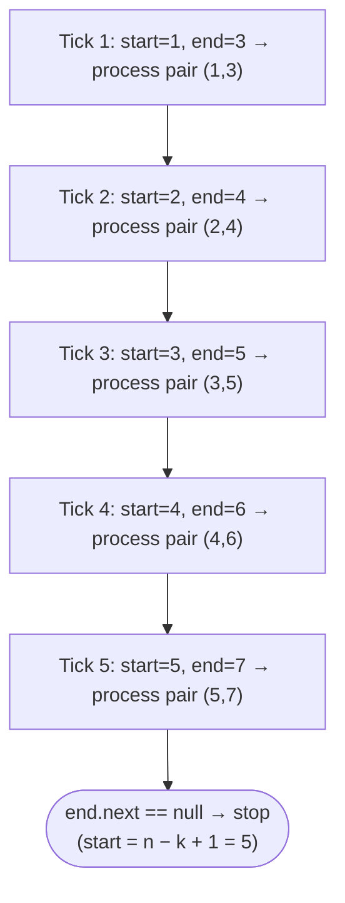
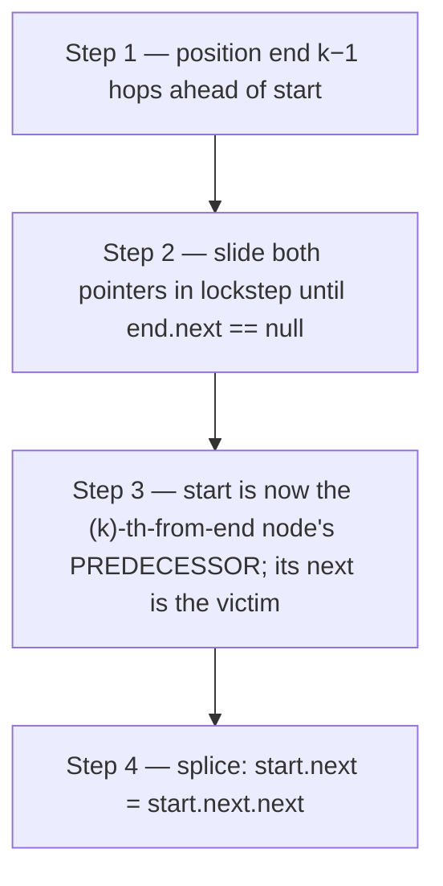

# Identifying the Sliding Window Traversal Pattern

The sliding window traversal pattern keeps two pointers a fixed distance `k` apart inside a singly linked list and advances both in lockstep, one node per tick. It is the canonical answer to any problem that asks "what is the `k`-th-from-last node?", "remove the `k`-th from the end," "swap the `k`-th nodes from either side," or "rotate the list by `k`" — all in a single forward pass, with `O(1)` extra space, on a structure that exposes only forward links.

> ▶ Interactive Diagram — Sliding-window traversal keeps two pointers — start and end — a fixed distance k apart. They advance together, one node at a time, until end falls off the list.
```d3 widget=list-single
{
  "steps": [
    {
      "nodes": [
        {
          "id": "n1",
          "label": "1",
          "kind": "node",
          "meta": [],
          "slot": null,
          "cardId": "",
          "layoutKind": ""
        },
        {
          "id": "n2",
          "label": "2",
          "kind": "node",
          "meta": [],
          "slot": null,
          "cardId": "",
          "layoutKind": ""
        },
        {
          "id": "n3",
          "label": "3",
          "kind": "node",
          "meta": [],
          "slot": null,
          "cardId": "",
          "layoutKind": ""
        },
        {
          "id": "n4",
          "label": "4",
          "kind": "node",
          "meta": [],
          "slot": null,
          "cardId": "",
          "layoutKind": ""
        },
        {
          "id": "n5",
          "label": "5",
          "kind": "node",
          "meta": [],
          "slot": null,
          "cardId": "",
          "layoutKind": ""
        },
        {
          "id": "n6",
          "label": "6",
          "kind": "node",
          "meta": [],
          "slot": null,
          "cardId": "",
          "layoutKind": ""
        }
      ],
      "edges": [
        {
          "from": "n1",
          "to": "n2",
          "label": "next"
        },
        {
          "from": "n2",
          "to": "n3",
          "label": "next"
        },
        {
          "from": "n3",
          "to": "n4",
          "label": "next"
        },
        {
          "from": "n4",
          "to": "n5",
          "label": "next"
        },
        {
          "from": "n5",
          "to": "n6",
          "label": "next"
        }
      ],
      "cursor": [
        {
          "name": "start",
          "target": "n1",
          "color": "#3b82f6"
        },
        {
          "name": "end",
          "target": "n4",
          "color": "#f59e0b"
        }
      ],
      "highlight": [],
      "changed": [],
      "removed": [],
      "annotation": "start at node 1, end at node 4 (3 hops ahead). Window = nodes 1..4.",
      "line": 0,
      "frames": [],
      "cardCursor": []
    },
    {
      "nodes": [
        {
          "id": "n1",
          "label": "1",
          "kind": "node",
          "meta": [],
          "slot": null,
          "cardId": "",
          "layoutKind": ""
        },
        {
          "id": "n2",
          "label": "2",
          "kind": "node",
          "meta": [],
          "slot": null,
          "cardId": "",
          "layoutKind": ""
        },
        {
          "id": "n3",
          "label": "3",
          "kind": "node",
          "meta": [],
          "slot": null,
          "cardId": "",
          "layoutKind": ""
        },
        {
          "id": "n4",
          "label": "4",
          "kind": "node",
          "meta": [],
          "slot": null,
          "cardId": "",
          "layoutKind": ""
        },
        {
          "id": "n5",
          "label": "5",
          "kind": "node",
          "meta": [],
          "slot": null,
          "cardId": "",
          "layoutKind": ""
        },
        {
          "id": "n6",
          "label": "6",
          "kind": "node",
          "meta": [],
          "slot": null,
          "cardId": "",
          "layoutKind": ""
        }
      ],
      "edges": [
        {
          "from": "n1",
          "to": "n2",
          "label": "next"
        },
        {
          "from": "n2",
          "to": "n3",
          "label": "next"
        },
        {
          "from": "n3",
          "to": "n4",
          "label": "next"
        },
        {
          "from": "n4",
          "to": "n5",
          "label": "next"
        },
        {
          "from": "n5",
          "to": "n6",
          "label": "next"
        }
      ],
      "cursor": [
        {
          "name": "start",
          "target": "n2",
          "color": "#3b82f6"
        },
        {
          "name": "end",
          "target": "n5",
          "color": "#f59e0b"
        }
      ],
      "highlight": [],
      "changed": [],
      "removed": [],
      "annotation": "Both advance one step. Window = nodes 2..5.",
      "line": 0,
      "frames": [],
      "cardCursor": []
    },
    {
      "nodes": [
        {
          "id": "n1",
          "label": "1",
          "kind": "node",
          "meta": [],
          "slot": null,
          "cardId": "",
          "layoutKind": ""
        },
        {
          "id": "n2",
          "label": "2",
          "kind": "node",
          "meta": [],
          "slot": null,
          "cardId": "",
          "layoutKind": ""
        },
        {
          "id": "n3",
          "label": "3",
          "kind": "node",
          "meta": [],
          "slot": null,
          "cardId": "",
          "layoutKind": ""
        },
        {
          "id": "n4",
          "label": "4",
          "kind": "node",
          "meta": [],
          "slot": null,
          "cardId": "",
          "layoutKind": ""
        },
        {
          "id": "n5",
          "label": "5",
          "kind": "node",
          "meta": [],
          "slot": null,
          "cardId": "",
          "layoutKind": ""
        },
        {
          "id": "n6",
          "label": "6",
          "kind": "node",
          "meta": [],
          "slot": null,
          "cardId": "",
          "layoutKind": ""
        }
      ],
      "edges": [
        {
          "from": "n1",
          "to": "n2",
          "label": "next"
        },
        {
          "from": "n2",
          "to": "n3",
          "label": "next"
        },
        {
          "from": "n3",
          "to": "n4",
          "label": "next"
        },
        {
          "from": "n4",
          "to": "n5",
          "label": "next"
        },
        {
          "from": "n5",
          "to": "n6",
          "label": "next"
        }
      ],
      "cursor": [
        {
          "name": "start",
          "target": "n3",
          "color": "#3b82f6"
        },
        {
          "name": "end",
          "target": "n6",
          "color": "#f59e0b"
        }
      ],
      "highlight": [],
      "changed": [],
      "removed": [],
      "annotation": "Both advance. Window = nodes 3..6. end.next is null → loop ends.",
      "line": 0,
      "frames": [],
      "cardCursor": []
    }
  ],
  "title": "Sliding window — start + end stay k=3 hops apart; both advance together"
}
```

<p align="center"><strong>Sliding-window traversal keeps two pointers — <code>start</code> and <code>end</code> — a fixed distance <code>k</code> apart. They advance together, one node at a time, until <code>end</code> falls off the list.</strong></p>

---

## Understanding the Pattern

### Why Naive Isn't Enough

A singly linked list exposes only forward links — node `i` knows about node `i+1`, never about node `i-1`. To find the `k`-th-from-last node naively, you walk the list once to count its length `n`, then walk again from `head` for `n − k` steps to land on the answer. That works, but it costs two full passes, and it breaks down the moment the input is a stream that cannot be rewound. Even when the list is in memory, the two-pass approach has nothing to say about variants that need a reference both `k` ahead AND `k` behind the same cursor — recomputing the length each time is wasteful, and stitching two independent walks together is fragile.

To make this concrete: for the list `1 → 2 → 3 → 4 → 5` and `k = 2`, the brute force counts `n = 5` in pass one, then walks `n − k = 3` steps from the head to find node `4`. The single-pass alternative parks `end` two hops ahead of `start`, advances both in lockstep until `end.next` is `null`, and ends with `start` already on node `4` — same answer, half the work, no length lookup.

So the key idea is: when the question is about a node at a fixed offset `k` from the tail, a fixed gap between two pointers turns "two passes" into "one pass" without allocating any extra structure — the gap itself is the measurement.

### The Core Idea

The pattern asks one question: **can the answer be expressed as a node at a fixed offset `k` from the tail (or from some other moving cursor), so that walking the list once with two `k`-apart pointers parks the trailing pointer exactly on it?**

The single mechanism that drives every variant is the **k-apart two-pointer loop**:

- **`start`** — the trailing pointer; the pointer that lands on the answer when the loop terminates.
- **`end`** — the leading pointer; the pointer whose job is to detect the tail.
- **The gap** — `end` is initialised `k` hops ahead of `start` (the gap is `k`); both then advance together, preserving the gap, until `end` runs out of list.

To make this concrete: with `k = 2` on `1 → 2 → 3 → 4 → 5`, `start` is initialised at node `1` and `end` is advanced to node `3` before the joint walk begins. The lockstep loop runs until `end.next` is `null`: tick 1 takes `start` to `2` and `end` to `4`; tick 2 takes `start` to `3` and `end` to `5` — and the loop stops because `end.next` is now `null`. The trailing pointer `start` is parked on node `3`, which is exactly `n − k + 1 = 3` from the head, the `k`-th-from-last node's predecessor for trim, or the `k`-th-from-last node itself for find.

The core insight is: every sliding-window-traversal variant is the same lockstep loop with two knobs — how far apart the pointers are initialised (`k` or `k − 1`, off-by-one matters), and what work is done at each tick (read for find, splice for trim, swap pointers for swap, cut-and-rejoin for rotate).

### How the Pointers Move

The two pointers move at the same speed, one node per tick, but they play distinct roles. `start` is the answer-bearing reference; `end` is the boundary-detecting reference. The gap between them is set up *before* the lockstep loop runs — this is the only phase where one pointer moves alone, and getting it right is the single most common source of off-by-one bugs. Once the gap is in place, both pointers advance together — every tick reads `start.next` and `end.next`, advances each, and re-checks the termination condition.

Crucially, the lockstep loop's termination condition reads from `end`, never from `start` — `start` is the answer, not the boundary. Stop when `end.next` is `null` (so `end` is on the tail and `start` is `k` hops behind it) or when `end` itself is `null` (so `start` is `k − 1` hops behind the tail). Picking the wrong condition shifts the trailing pointer by one node — fine if you wanted that, catastrophic if you did not.

It is important to note that two nodes that are at a distance `k` from each other denote a window of size `k + 1` as both nodes are included in the window.

> ▶ Interactive Diagram — A "distance of k" means k hops between start and end — which covers k + 1 nodes when both endpoints count. Getting this off-by-one right is the single most common bug in sliding-window code.
```d3 widget=list-single
{
  "steps": [
    {
      "nodes": [
        {
          "id": "s",
          "label": "start",
          "kind": "node",
          "meta": [],
          "slot": null,
          "cardId": "",
          "layoutKind": ""
        },
        {
          "id": "a",
          "label": "·",
          "kind": "node",
          "meta": [],
          "slot": null,
          "cardId": "",
          "layoutKind": ""
        },
        {
          "id": "b",
          "label": "·",
          "kind": "node",
          "meta": [],
          "slot": null,
          "cardId": "",
          "layoutKind": ""
        },
        {
          "id": "e",
          "label": "end",
          "kind": "node",
          "meta": [],
          "slot": null,
          "cardId": "",
          "layoutKind": ""
        }
      ],
      "edges": [
        {
          "from": "s",
          "to": "a",
          "label": "next"
        },
        {
          "from": "a",
          "to": "b",
          "label": "next"
        },
        {
          "from": "b",
          "to": "e",
          "label": "next"
        }
      ],
      "cursor": [
        {
          "name": "start",
          "target": "s",
          "color": "#3b82f6"
        },
        {
          "name": "end",
          "target": "e",
          "color": "#f59e0b"
        }
      ],
      "highlight": [],
      "changed": [],
      "removed": [],
      "annotation": "3 hops between start and end, but 4 nodes in the window (both endpoints included)",
      "line": 0,
      "frames": [],
      "cardCursor": []
    }
  ],
  "title": "k = 3 hops between start and end ⇒ window size = k + 1 = 4 nodes"
}
```

<p align="center"><strong>A "distance of <code>k</code>" means <code>k</code> hops between <code>start</code> and <code>end</code> — which covers <code>k + 1</code> nodes when both endpoints count. Getting this off-by-one right is the single most common bug in sliding-window code.</strong></p>

We perform the required operations on the nodes held in `start` and `end` and move both of them one step ahead by setting them to their respective next nodes. We repeat this process until `end` hits `null` at the end of the list. At the end of all iterations, we would have applied the given operation on all nodes that are `k` steps away from each other.

> ▶ Interactive Diagram — Setup — start at head, end exactly k − 1 = 2 hops ahead. The three-node window covers nodes 1, 2, 3.
```d3 widget=list-single
{
  "steps": [
    {
      "nodes": [
        {
          "id": "n1",
          "label": "1",
          "kind": "node",
          "meta": [],
          "slot": null,
          "cardId": "",
          "layoutKind": ""
        },
        {
          "id": "n2",
          "label": "2",
          "kind": "node",
          "meta": [],
          "slot": null,
          "cardId": "",
          "layoutKind": ""
        },
        {
          "id": "n3",
          "label": "3",
          "kind": "node",
          "meta": [],
          "slot": null,
          "cardId": "",
          "layoutKind": ""
        },
        {
          "id": "n4",
          "label": "4",
          "kind": "node",
          "meta": [],
          "slot": null,
          "cardId": "",
          "layoutKind": ""
        },
        {
          "id": "n5",
          "label": "5",
          "kind": "node",
          "meta": [],
          "slot": null,
          "cardId": "",
          "layoutKind": ""
        },
        {
          "id": "n6",
          "label": "6",
          "kind": "node",
          "meta": [],
          "slot": null,
          "cardId": "",
          "layoutKind": ""
        },
        {
          "id": "n7",
          "label": "7",
          "kind": "node",
          "meta": [],
          "slot": null,
          "cardId": "",
          "layoutKind": ""
        }
      ],
      "edges": [
        {
          "from": "n1",
          "to": "n2",
          "label": "next"
        },
        {
          "from": "n2",
          "to": "n3",
          "label": "next"
        },
        {
          "from": "n3",
          "to": "n4",
          "label": "next"
        },
        {
          "from": "n4",
          "to": "n5",
          "label": "next"
        },
        {
          "from": "n5",
          "to": "n6",
          "label": "next"
        },
        {
          "from": "n6",
          "to": "n7",
          "label": "next"
        }
      ],
      "cursor": [
        {
          "name": "start",
          "target": "n1",
          "color": "#3b82f6"
        },
        {
          "name": "end",
          "target": "n3",
          "color": "#f59e0b"
        }
      ],
      "highlight": [],
      "changed": [],
      "removed": [],
      "annotation": "Setup: start = n1, end = n3 (k−1 = 2 hops ahead). Process pair (1, 3).",
      "line": 0,
      "frames": [],
      "cardCursor": []
    },
    {
      "nodes": [
        {
          "id": "n1",
          "label": "1",
          "kind": "node",
          "meta": [],
          "slot": null,
          "cardId": "",
          "layoutKind": ""
        },
        {
          "id": "n2",
          "label": "2",
          "kind": "node",
          "meta": [],
          "slot": null,
          "cardId": "",
          "layoutKind": ""
        },
        {
          "id": "n3",
          "label": "3",
          "kind": "node",
          "meta": [],
          "slot": null,
          "cardId": "",
          "layoutKind": ""
        },
        {
          "id": "n4",
          "label": "4",
          "kind": "node",
          "meta": [],
          "slot": null,
          "cardId": "",
          "layoutKind": ""
        },
        {
          "id": "n5",
          "label": "5",
          "kind": "node",
          "meta": [],
          "slot": null,
          "cardId": "",
          "layoutKind": ""
        },
        {
          "id": "n6",
          "label": "6",
          "kind": "node",
          "meta": [],
          "slot": null,
          "cardId": "",
          "layoutKind": ""
        },
        {
          "id": "n7",
          "label": "7",
          "kind": "node",
          "meta": [],
          "slot": null,
          "cardId": "",
          "layoutKind": ""
        }
      ],
      "edges": [
        {
          "from": "n1",
          "to": "n2",
          "label": "next"
        },
        {
          "from": "n2",
          "to": "n3",
          "label": "next"
        },
        {
          "from": "n3",
          "to": "n4",
          "label": "next"
        },
        {
          "from": "n4",
          "to": "n5",
          "label": "next"
        },
        {
          "from": "n5",
          "to": "n6",
          "label": "next"
        },
        {
          "from": "n6",
          "to": "n7",
          "label": "next"
        }
      ],
      "cursor": [
        {
          "name": "start",
          "target": "n2",
          "color": "#3b82f6"
        },
        {
          "name": "end",
          "target": "n4",
          "color": "#f59e0b"
        }
      ],
      "highlight": [],
      "changed": [],
      "removed": [],
      "annotation": "Tick 1: both advance. Process pair (2, 4).",
      "line": 0,
      "frames": [],
      "cardCursor": []
    },
    {
      "nodes": [
        {
          "id": "n1",
          "label": "1",
          "kind": "node",
          "meta": [],
          "slot": null,
          "cardId": "",
          "layoutKind": ""
        },
        {
          "id": "n2",
          "label": "2",
          "kind": "node",
          "meta": [],
          "slot": null,
          "cardId": "",
          "layoutKind": ""
        },
        {
          "id": "n3",
          "label": "3",
          "kind": "node",
          "meta": [],
          "slot": null,
          "cardId": "",
          "layoutKind": ""
        },
        {
          "id": "n4",
          "label": "4",
          "kind": "node",
          "meta": [],
          "slot": null,
          "cardId": "",
          "layoutKind": ""
        },
        {
          "id": "n5",
          "label": "5",
          "kind": "node",
          "meta": [],
          "slot": null,
          "cardId": "",
          "layoutKind": ""
        },
        {
          "id": "n6",
          "label": "6",
          "kind": "node",
          "meta": [],
          "slot": null,
          "cardId": "",
          "layoutKind": ""
        },
        {
          "id": "n7",
          "label": "7",
          "kind": "node",
          "meta": [],
          "slot": null,
          "cardId": "",
          "layoutKind": ""
        }
      ],
      "edges": [
        {
          "from": "n1",
          "to": "n2",
          "label": "next"
        },
        {
          "from": "n2",
          "to": "n3",
          "label": "next"
        },
        {
          "from": "n3",
          "to": "n4",
          "label": "next"
        },
        {
          "from": "n4",
          "to": "n5",
          "label": "next"
        },
        {
          "from": "n5",
          "to": "n6",
          "label": "next"
        },
        {
          "from": "n6",
          "to": "n7",
          "label": "next"
        }
      ],
      "cursor": [
        {
          "name": "start",
          "target": "n3",
          "color": "#3b82f6"
        },
        {
          "name": "end",
          "target": "n5",
          "color": "#f59e0b"
        }
      ],
      "highlight": [],
      "changed": [],
      "removed": [],
      "annotation": "Tick 2: process pair (3, 5).",
      "line": 0,
      "frames": [],
      "cardCursor": []
    },
    {
      "nodes": [
        {
          "id": "n1",
          "label": "1",
          "kind": "node",
          "meta": [],
          "slot": null,
          "cardId": "",
          "layoutKind": ""
        },
        {
          "id": "n2",
          "label": "2",
          "kind": "node",
          "meta": [],
          "slot": null,
          "cardId": "",
          "layoutKind": ""
        },
        {
          "id": "n3",
          "label": "3",
          "kind": "node",
          "meta": [],
          "slot": null,
          "cardId": "",
          "layoutKind": ""
        },
        {
          "id": "n4",
          "label": "4",
          "kind": "node",
          "meta": [],
          "slot": null,
          "cardId": "",
          "layoutKind": ""
        },
        {
          "id": "n5",
          "label": "5",
          "kind": "node",
          "meta": [],
          "slot": null,
          "cardId": "",
          "layoutKind": ""
        },
        {
          "id": "n6",
          "label": "6",
          "kind": "node",
          "meta": [],
          "slot": null,
          "cardId": "",
          "layoutKind": ""
        },
        {
          "id": "n7",
          "label": "7",
          "kind": "node",
          "meta": [],
          "slot": null,
          "cardId": "",
          "layoutKind": ""
        }
      ],
      "edges": [
        {
          "from": "n1",
          "to": "n2",
          "label": "next"
        },
        {
          "from": "n2",
          "to": "n3",
          "label": "next"
        },
        {
          "from": "n3",
          "to": "n4",
          "label": "next"
        },
        {
          "from": "n4",
          "to": "n5",
          "label": "next"
        },
        {
          "from": "n5",
          "to": "n6",
          "label": "next"
        },
        {
          "from": "n6",
          "to": "n7",
          "label": "next"
        }
      ],
      "cursor": [
        {
          "name": "start",
          "target": "n5",
          "color": "#3b82f6"
        },
        {
          "name": "end",
          "target": "n7",
          "color": "#f59e0b"
        }
      ],
      "highlight": [],
      "changed": [],
      "removed": [],
      "annotation": "Tick 4 (skipping ahead): process pair (5, 7). end.next is null → loop ends. Final start = n − k + 1 = 5.",
      "line": 0,
      "frames": [],
      "cardCursor": []
    }
  ],
  "title": "Sliding-window tick-by-tick — pair (start, end) processed each iteration"
}
```

<p align="center"><strong>Setup — <code>start</code> at head, <code>end</code> exactly <code>k − 1 = 2</code> hops ahead. The three-node window covers nodes 1, 2, 3.</strong></p>

> 🖼 Diagram — The window slides one node per tick. Both pointers advance together. Stop when end reaches the tail — start will then be at position n − k + 1, the k-th node from the end.


<p align="center"><strong>The window slides one node per tick. Both pointers advance together. Stop when <code>end</code> reaches the tail — <code>start</code> will then be at position <code>n − k + 1</code>, the <code>k</code>-th node from the end.</strong></p>

---

## Algorithm

The algorithm given below outlines the sliding window traversal technique for a window of size k.

> -   **Step 1:** Initialize two references, `start` and `end` to the head of the list.
> -   **Step 2:** Iterate k times using a loop and move `end` reference k steps ahead
> -   **Step 3:** Loop while `end` != `null` and do the following
>     -   **Step 3.1:** Process nodes held in `start` and `end` as they are k steps apart
>     -   **Step 3.2:** Move both `start` and `end` one step ahead by setting them to their next nodes.

### Implementation

Given below is the generic code implementation of the fixed-size sliding window traversal technique on a linked list with window size `k` using references `start` and `end` as the boundaries of the window.


```python run viz=linked-list viz-root=head
"""
Definition for singly-linked list.
class ListNode:
    def __init__(self, val):
        self.val = val
        self.next = None
"""

def slidingWindowTraversal(head: ListNode, k: int) -> None:
    # Initialize start and end to head
    start = head
    end = head

    # Move end k steps ahead
    for _ in range(k):
        if end is None:
            return # Exit early if the list is shorter than k
        end = end.next

    while end is not None:
        # Apply operation on start and end
        # these nodes are k steps apart
        # Example: start.val = start.val + end.val

        # Move ahead both start and end by one step
        start = start.next
        end = end.next

    return
```

```java run viz=linked-list viz-root=head

/**
 * Definition for singly-linked list.
 * class ListNode {
 *     int val;
 *     ListNode next;
 *     ListNode() {}
 *     ListNode(int val) { this.val = val; }
 * };
 */

class SlidingWindowTraversal {
    void slidingWindowTraversal(ListNode head, int k) {
        // Initialize start and end to head
        ListNode start = head;
        ListNode end = head;

        // Move end k steps ahead
        for (int i = 0; i < k; i++) {
            if (end == null) {
                return; // Exit early if the list is shorter than k
            }
            end = end.next;
        }

        // Traverse the list while end is not null
        while (end != null) {
            // Apply operation on start and end
            // these nodes are k steps apart
            // Example: start.val = start.val + end.val;

            // Move ahead both start and end by one step
            start = start.next;
            end = end.next;
        }
    }
}
```


### Complexity Analysis

| | Complexity | Reason |
|---|---|---|
| **Time** | `O(n)` | `end` walks from the head to the tail exactly once; `start` walks at the same speed, `k` nodes behind. Every node is visited at most twice. |
| **Space** | `O(1)` | Two local references (`start`, `end`) regardless of list length. No auxiliary structure is allocated. |

---

## The Generic Algorithm

The pattern follows the same four-step skeleton regardless of which variant it takes.

1. **Decide the gap.** Choose how far apart the two pointers should sit. A gap of `k` puts `start` exactly on the `(k+1)`-th-from-last node when the loop terminates; a gap of `k − 1` puts `start` on the `k`-th-from-last node. The choice is dictated by what work happens at the answer node — trim needs the predecessor (gap `k`), find needs the node itself (gap `k − 1`).
2. **Prime the window.** Initialise both `start` and `end` to `head`. Advance `end` alone by the chosen gap. If `end` falls off the list during this phase (`end is None` mid-walk), the list is shorter than required — return the early-exit value.
3. **Slide together.** While `end` is not `null` (or while `end.next` is not `null`, depending on the gap choice), advance both pointers by one node per tick. Optionally, do per-tick work — track a running sum, copy references, or stitch pointers — at each position.
4. **Read or rewire the answer.** When the loop terminates, `start` is parked on the answer node. Read it (find), splice it out (trim), swap it (swap), or use it as the new head and rejoin the cut chain (rotate).

If the question is "the maximum over all `k`-node windows," step 3 also maintains a sum and a max — but the pointer geometry is unchanged.

---

## Variants / Taxonomy

The pattern shows up in four recognisable variants. Each maps to a different gap choice and a different action at the answer node, but every variant calls the same lockstep loop.

- **K-th-from-last find (window sum / max)** — gap of `k − 1` between `start` and `end`. Walk in lockstep until `end.next` is `null`; do per-tick work (e.g. update a running sum and a running maximum). `K Maximum Sum` is the canonical example — the window IS the answer.
- **Trim at offset `k`** — gap of `k` between `start` and `end`, so that when `end` reaches the tail, `start` sits on the predecessor of the `k`-th-from-last node. Splice with `start.next = start.next.next` (and handle the edge case where the `k`-th-from-last node IS the head — `end` reaches the tail during the priming phase).
- **Swap distinct pairs at offset `k`** — two `k`-apart walks find both the `k`-th-from-start and `k`-th-from-end nodes in one pass. Capture predecessors during the walk so the swap can rewire `next` pointers without losing references.
- **Rotation by `k`** — locate the `(length − k)`-th and `(length − k + 1)`-th nodes using a gap of `k`. Cut the list at the first, rejoin its tail to the original head, and return the second as the new head — a single pass after normalising `k` modulo length.

The variants share an invariant: the gap between `start` and `end` is set up once and preserved every tick. If the gap ever changes mid-loop, the pattern is broken — either you've reached for the wrong variant, or you've introduced a bug.

---

## Recognition Checklist

The pattern fits when **all four** answers are "yes". The first asks whether the problem is fundamentally about a fixed offset; the next three check that a single-pass two-pointer walk can deliver it.

- Does the problem reference a node at a **fixed offset** from the tail (or from another moving cursor) — `k`-th from end, last `k`, gap of `k` from another node?
- Can the answer be **read off** when one pointer reaches the tail (rather than requiring a length lookup before the work begins)?
- Is the work at each tick **`O(1)`** — a comparison, a sum update, a pointer splice — rather than a nested walk that re-traverses the list?
- Is **`O(1)` extra space** required (or strongly preferred)? If `O(n)` auxiliary storage is acceptable, a two-pass approach also works — but it loses the streaming-friendly property.

Common surface signals: "find the `k`-th node from the end," "remove the `k`-th from the end," "swap the `k`-th nodes," "rotate the list by `k`," "find the maximum sum of any contiguous `k` nodes."

---

# Identifying the sliding window traversal pattern

The sliding window traversal technique can only be applied to some specific problems. These are generally **easy** or **medium** where we must apply some operations on either some or all nodes that are a fixed distance apart. If the problem statement or its solution follows the generic template below, it can be solved by applying the sliding window traversal technique.

**Template:**

Given a list, perform some operation on a node at a distance `k` from the end or some other node.

## Canonical Example: Trim the K-th Node from the End

**Problem:** Given the head of a singly linked list and a positive integer `k`, remove the `k`-th node from the end and return the new head.

```
Input:  head = [1, 2, 3, 4, 5], k = 2
Output: [1, 2, 3, 5]
```

> ▶ Interactive Diagram — The classic use case — reach the target in a single pass by keeping two pointers k − 1 apart. When end reaches the tail, start is parked exactly on the k-th node from the end.
```d3 widget=list-single
{
  "steps": [
    {
      "nodes": [
        {
          "id": "n1",
          "label": "1",
          "kind": "node",
          "meta": [],
          "slot": null,
          "cardId": "",
          "layoutKind": ""
        },
        {
          "id": "n2",
          "label": "2",
          "kind": "node",
          "meta": [],
          "slot": null,
          "cardId": "",
          "layoutKind": ""
        },
        {
          "id": "n3",
          "label": "3",
          "kind": "node",
          "meta": [],
          "slot": null,
          "cardId": "",
          "layoutKind": ""
        },
        {
          "id": "n4",
          "label": "4",
          "kind": "node",
          "meta": [],
          "slot": null,
          "cardId": "",
          "layoutKind": ""
        },
        {
          "id": "n5",
          "label": "5",
          "kind": "node",
          "meta": [],
          "slot": null,
          "cardId": "",
          "layoutKind": ""
        },
        {
          "id": "n6",
          "label": "6",
          "kind": "node",
          "meta": [],
          "slot": null,
          "cardId": "",
          "layoutKind": ""
        }
      ],
      "edges": [
        {
          "from": "n1",
          "to": "n2",
          "label": "next"
        },
        {
          "from": "n2",
          "to": "n3",
          "label": "next"
        },
        {
          "from": "n3",
          "to": "n4",
          "label": "next"
        },
        {
          "from": "n4",
          "to": "n5",
          "label": "next"
        },
        {
          "from": "n5",
          "to": "n6",
          "label": "next"
        }
      ],
      "cursor": [
        {
          "name": "current",
          "target": "n4",
          "color": "#3b82f6"
        }
      ],
      "highlight": [],
      "changed": [],
      "removed": [],
      "annotation": "Before: target = n4 (3rd from end). Remove it.",
      "line": 0,
      "frames": [],
      "cardCursor": []
    },
    {
      "nodes": [
        {
          "id": "n1",
          "label": "1",
          "kind": "node",
          "meta": [],
          "slot": null,
          "cardId": "",
          "layoutKind": ""
        },
        {
          "id": "n2",
          "label": "2",
          "kind": "node",
          "meta": [],
          "slot": null,
          "cardId": "",
          "layoutKind": ""
        },
        {
          "id": "n3",
          "label": "3",
          "kind": "node",
          "meta": [],
          "slot": null,
          "cardId": "",
          "layoutKind": ""
        },
        {
          "id": "n4",
          "label": "4",
          "kind": "node",
          "meta": [],
          "slot": null,
          "cardId": "",
          "layoutKind": ""
        },
        {
          "id": "n5",
          "label": "5",
          "kind": "node",
          "meta": [],
          "slot": null,
          "cardId": "",
          "layoutKind": ""
        },
        {
          "id": "n6",
          "label": "6",
          "kind": "node",
          "meta": [],
          "slot": null,
          "cardId": "",
          "layoutKind": ""
        }
      ],
      "edges": [
        {
          "from": "n1",
          "to": "n2",
          "label": "next"
        },
        {
          "from": "n2",
          "to": "n3",
          "label": "next"
        },
        {
          "from": "n3",
          "to": "n5",
          "label": "next"
        },
        {
          "from": "n4",
          "to": "n5",
          "label": "next"
        },
        {
          "from": "n5",
          "to": "n6",
          "label": "next"
        }
      ],
      "cursor": [
        {
          "name": "current",
          "target": "n4",
          "color": "#3b82f6"
        }
      ],
      "highlight": [],
      "changed": [],
      "removed": [
        "n4"
      ],
      "annotation": "Splice: n3.next = n5 — n4 unreachable",
      "line": 0,
      "frames": [],
      "cardCursor": []
    },
    {
      "nodes": [
        {
          "id": "n1",
          "label": "1",
          "kind": "node",
          "meta": [],
          "slot": null,
          "cardId": "",
          "layoutKind": ""
        },
        {
          "id": "n2",
          "label": "2",
          "kind": "node",
          "meta": [],
          "slot": null,
          "cardId": "",
          "layoutKind": ""
        },
        {
          "id": "n3",
          "label": "3",
          "kind": "node",
          "meta": [],
          "slot": null,
          "cardId": "",
          "layoutKind": ""
        },
        {
          "id": "n5",
          "label": "5",
          "kind": "node",
          "meta": [],
          "slot": null,
          "cardId": "",
          "layoutKind": ""
        },
        {
          "id": "n6",
          "label": "6",
          "kind": "node",
          "meta": [],
          "slot": null,
          "cardId": "",
          "layoutKind": ""
        }
      ],
      "edges": [
        {
          "from": "n1",
          "to": "n2",
          "label": "next"
        },
        {
          "from": "n2",
          "to": "n3",
          "label": "next"
        },
        {
          "from": "n3",
          "to": "n5",
          "label": "next"
        },
        {
          "from": "n5",
          "to": "n6",
          "label": "next"
        }
      ],
      "cursor": [
        {
          "name": "head",
          "target": "n1",
          "color": "#10b981"
        }
      ],
      "highlight": [],
      "changed": [],
      "removed": [],
      "annotation": "After: 1 → 2 → 3 → 5 → 6. Sliding window finds the predecessor in a single pass.",
      "line": 0,
      "frames": [],
      "cardCursor": []
    }
  ],
  "title": "Remove the 3rd node from the end — single-pass via the k-apart window"
}
```

<p align="center"><strong>The classic use case — reach the target in a <em>single</em> pass by keeping two pointers <code>k − 1</code> apart. When <code>end</code> reaches the tail, <code>start</code> is parked exactly on the <code>k</code>-th node from the end.</strong></p>

### Brute Force: Two-Pass Length Lookup

To delete the `kth` node from the end in a singly linked list, we need the reference to its previous node (the `k+1th` node from the end). The brute-force solution first finds the length of the linked list and then identifies the 0-based index of the `k+1th` node from the end.

If the zero based index of `k+1th` node is `n`, iterate `n` times from the head to get its reference and delete the node after it. We also need to handle the edge case where `k` equals the length of the linked list, and we delete the head of the list.

> 🖼 Diagram — Single-pass algorithm for removing the k-th node from the end — offset the two pointers by k − 1, slide until the end hits the tail, splice at start.


<p align="center"><strong>Single-pass algorithm for removing the <code>k</code>-th node from the end — offset the two pointers by <code>k − 1</code>, slide until the end hits the tail, splice at <code>start</code>.</strong></p>

The implementation of the brute force solution is given as follows.


```python run viz=linked-list viz-root=head
from typing import Optional

class Solution:
    def trim_nth_node(self, head: Optional[ListNode], k: int) -> Optional[ListNode]:
        if head is None:
            return None

        # Pass 1 — count the length
        length, cur = 0, head
        while cur:
            length += 1
            cur = cur.next

        # If k equals length, the head itself is the k-th from end
        if k == length:
            return head.next

        # Pass 2 — walk to the predecessor of the target
        prev_index = length - k - 1
        prev = head
        for _ in range(prev_index):
            prev = prev.next

        prev.next = prev.next.next
        return head
```

```java run viz=linked-list viz-root=head
public class Main {
    static class ListNode { int val; ListNode next; ListNode(int v){val=v;} }

    static class Solution {
        public ListNode trimNthNode(ListNode head, int k) {
            if (head == null) return null;

            // Pass 1 — count length
            int length = 0;
            for (ListNode cur = head; cur != null; cur = cur.next) length++;

            if (k == length) return head.next;       // head itself is the k-th from end

            // Pass 2 — walk to predecessor of target
            int prevIndex = length - k - 1;
            ListNode prev = head;
            for (int i = 0; i < prevIndex; i++) prev = prev.next;

            prev.next = prev.next.next;
            return head;
        }
    }

    public static void main(String[] args) {
        // [5, 7, 3, 10], k=2 -> [5, 7, 10]
        ListNode n1=new ListNode(5),n2=new ListNode(7),n3=new ListNode(3),n4=new ListNode(10);
        n1.next=n2; n2.next=n3; n3.next=n4;
        ListNode head = new Solution().trimNthNode(n1, 2);
        for (ListNode c=head;c!=null;c=c.next) System.out.print(c.val+" ");
        // 5 7 10
    }
}
```


The brute-force solution requires two passes through the list: the first to find its length and the second to find the `k+1th` node from the end to delete the `kth` node.

### Key Insight: Fix the Gap, Read the Predecessor When `end` Hits the Tail

If we consider the **last node** of the linked list to be its end, the 1st node from the end is at 0 distance from it, the 2nd node from the end is at a distance of 1 from it, and so the `kth` node from the end is the node that is at a distance of `k-1` before it.

> ▶ Interactive Diagram — If a node is the k-th from the end, then there are k − 1 hops between it and the tail. That's the fixed gap we maintain between our two pointers.
```d3 widget=list-single
{
  "steps": [
    {
      "nodes": [
        {
          "id": "n1",
          "label": "·",
          "kind": "node",
          "meta": [],
          "slot": null,
          "cardId": "",
          "layoutKind": ""
        },
        {
          "id": "kn",
          "label": "k-th",
          "kind": "node",
          "meta": [],
          "slot": null,
          "cardId": "",
          "layoutKind": ""
        },
        {
          "id": "m1",
          "label": "·",
          "kind": "node",
          "meta": [],
          "slot": null,
          "cardId": "",
          "layoutKind": ""
        },
        {
          "id": "m2",
          "label": "·",
          "kind": "node",
          "meta": [],
          "slot": null,
          "cardId": "",
          "layoutKind": ""
        },
        {
          "id": "last",
          "label": "tail",
          "kind": "node",
          "meta": [],
          "slot": null,
          "cardId": "",
          "layoutKind": ""
        }
      ],
      "edges": [
        {
          "from": "n1",
          "to": "kn",
          "label": "next"
        },
        {
          "from": "kn",
          "to": "m1",
          "label": "next"
        },
        {
          "from": "m1",
          "to": "m2",
          "label": "next"
        },
        {
          "from": "m2",
          "to": "last",
          "label": "next"
        }
      ],
      "cursor": [
        {
          "name": "current",
          "target": "kn",
          "color": "#3b82f6"
        },
        {
          "name": "tail",
          "target": "last",
          "color": "#8b5cf6"
        }
      ],
      "highlight": [],
      "changed": [],
      "removed": [],
      "annotation": "k − 1 hops between the k-th-from-end node and the tail (here k = 4)",
      "line": 0,
      "frames": [],
      "cardCursor": []
    }
  ],
  "title": "k-th-from-end node and the tail are exactly k − 1 hops apart"
}
```

<p align="center"><strong>If a node is the <code>k</code>-th from the end, then there are <code>k − 1</code> hops between it and the tail. That's the fixed gap we maintain between our two pointers.</strong></p>

If we consider two references `start` and `end` that are `k-1` distance apart, when the `end` hits the last node, `start` holds the reference to the `kth` node from the end. The problem description fits the generic template for the sliding window traversal pattern we learned earlier.

**Template:**

Given a list, delete (perform some operation) the node at a distance `k-1` distance from the end (last node).

We initialize `start` and `end` with the `head` and iterate `k-1` times using `end` to move `end` `k-1` steps ahead of `start` (which creates a window of size `k`). If, at the end of these iterations, `end` hits the last node, it means `k` equals the length of the list, and we delete the head node. Otherwise, we traverse the list using this window until `end` hits the last node.

> 🖼 Diagram — Initialisation — both pointers start at head, then advance end alone by k − 1 hops. The window is now primed and ready to slide.
```d2
direction: right
h: head {shape: oval}
s: |md
  **start**

  (at head)
| {style.fill: "#fde68a"; style.stroke: "#d97706"}
m1: "·"
m2: "·"
e: |md
  **end**

  (k−1 hops from start)
| {style.fill: "#fde68a"; style.stroke: "#d97706"}
r: rest of list
h -> s
s -> m1
m1 -> m2
m2 -> e
e -> r
```

<p align="center"><strong>Initialisation — both pointers start at <code>head</code>, then advance <code>end</code> alone by <code>k − 1</code> hops. The window is now primed and ready to slide.</strong></p>

Since we need the node **before** the `kth` node from the end to delete the `kth` node, before traversing the list using the window, we create another reference variable `prevToStart` to hold the node before `start`. We save the previous value of `start` in `prevToStart` before updating it as we move the window. This way, when `end` hits the last node of the list, `prevToStart` has the reference to the `k+1th` node from the end, which we can use to delete the `kth` node from the end.

> 🖼 Diagram — Single-pass algorithm for removing the k-th node from the end — offset the two pointers by k − 1, slide until the end hits the tail, splice at start.


<p align="center"><strong>Single-pass algorithm for removing the <code>k</code>-th node from the end — offset the two pointers by <code>k − 1</code>, slide until the end hits the tail, splice at <code>start</code>.</strong></p>

### Optimized Solution: The Lockstep Window

The implementation of the sliding window traversal solution is given as follows.


```python run viz=linked-list viz-root=head
from typing import Optional

class Solution:
    def trim_nth_node(
        self, head: Optional[ListNode], k: int
    ) -> Optional[ListNode]:

        # Handle edge case for an empty list
        if head is None:
            return None

        start = head
        prev_to_start = None
        end = head

        # Move the end pointer k steps ahead
        for _ in range(1, k):
            # If k is greater than the length of the list
            if end is None:
                return head
            end = end.next

        # If the end pointer is now at the last node, it means we need to remove the head
        if end.next is None:
            return head.next

        #  Move both pointers until the end pointer reaches the last node
        while end is not None and end.next is not None:
            end = end.next
            prev_to_start = start
            start = start.next

        # Now, prev_to_start points to the node before the one we want to remove
        prev_to_start.next = start.next

        # Return the modified list
        return head
```

```java run viz=linked-list viz-root=head
public class Main {
    static class ListNode { int val; ListNode next; ListNode(int v){val=v;} }

    static class Solution {
        public ListNode trimNthNode(ListNode head, int k) {
            if (head == null) {
                return null;
            }

            ListNode start = head;
            ListNode prevToStart = null;
            ListNode end = head;

            // Move the end pointer k steps ahead
            for (int i = 1; i < k; i++) {
                if (end == null) {
                    return head;
                }
                end = end.next;
            }

            // If the end pointer is at the last node, remove the head
            if (end.next == null) {
                return head.next;
            }

            // Move both pointers until the end pointer reaches the last node
            while (end != null && end.next != null) {
                end = end.next;
                prevToStart = start;
                start = start.next;
            }

            // Remove the k-th node from the end
            if (prevToStart != null) {
                prevToStart.next = start.next;
            }

            return head;
        }
    }

    public static void main(String[] args) {
        // [5, 7, 3, 10], k=2 -> [5, 7, 10]
        ListNode n1=new ListNode(5),n2=new ListNode(7),n3=new ListNode(3),n4=new ListNode(10);
        n1.next=n2; n2.next=n3; n3.next=n4;
        ListNode head = new Solution().trimNthNode(n1, 2);
        for (ListNode c=head;c!=null;c=c.next) System.out.print(c.val+" ");
        // 5 7 10
    }
}
```


As the code above demonstrates, using the sliding window traversal technique, we delete the kth node from the end in a single pass.

### Trace

```
head = 1 → 2 → 3 → 4 → 5, k = 2

Init: start = 1, prev_to_start = null, end = 1

Prime (move end k − 1 = 1 step):
  end = 2

end.next = 3 (not null), so the head is NOT the victim — proceed.

Slide:
Tick 1: end = 3; prev_to_start = 1; start = 2
Tick 2: end = 4; prev_to_start = 2; start = 3
Tick 3: end = 5; prev_to_start = 3; start = 4
        end.next is now null → loop ends.

start = 4 (the k-th-from-end node — the victim).
prev_to_start = 3.
prev_to_start.next = start.next = 5  → 3 → 5.
Return head = 1 → 2 → 3 → 5. ✓
```

### Fitting the Template

| Check | Answer for Trim K-th from End |
|---|---|
| **Q1.** Does the problem reference a node at a fixed offset from the tail? | **Yes** — the `k`-th-from-end node is the victim. |
| **Q2.** Can the answer be read off when one pointer reaches the tail? | **Yes** — when `end` is on the tail and `start` is `k − 1` behind, `start` IS the victim's predecessor's neighbour (or with prev tracking, `prev_to_start` IS the predecessor). |
| **Q3.** Is the work at each tick `O(1)`? | **Yes** — one comparison and three pointer assignments per tick. |
| **Q4.** Is `O(1)` extra space required? | **Yes** — three local references (`start`, `prev_to_start`, `end`) regardless of list length. |

All four answers are "yes", so the sliding-window-traversal pattern applies. The outer driver is trivial (no length lookup); the inner lockstep loop does the entire job. Total cost: `O(n)` time, `O(1)` space.

---

## Problems in This Category

| Problem | Variant | How the lockstep loop fits |
|---|---|---|
| **[K Maximum Sum](02-problems/01-k-maximum-sum.md)** | K-th-from-last find with window sum | Gap of `k − 1`; per-tick work is a running sum update (`sum += end.val − start.val`) and a running max |
| **[Trim Nth Node](02-problems/02-trim-nth-node.md)** | Trim at offset `k` | Gap of `k − 1`; track `prev_to_start` during the walk; splice `prev_to_start.next = start.next` when `end` reaches the tail |
| **[Swap Nth Nodes](02-problems/03-swap-nth-nodes.md)** | Swap distinct pairs at offset `k` | One walk parks both the `N`-th-from-start and `N`-th-from-end nodes; capture both predecessors; rewire four `next` pointers |
| **[K Rotations](02-problems/04-k-rotations.md)** | Rotation by `k` | Normalise `k` modulo length; use a gap of `k` to locate the cut points; cut and rejoin in one pass |

Difficulty increases with the amount of bookkeeping the caller has to do alongside the lockstep loop — the loop itself is unchanged across all four problems.
