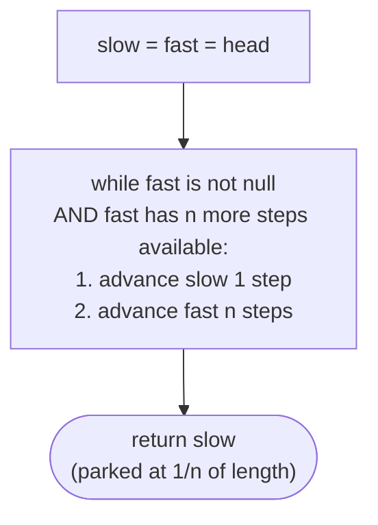
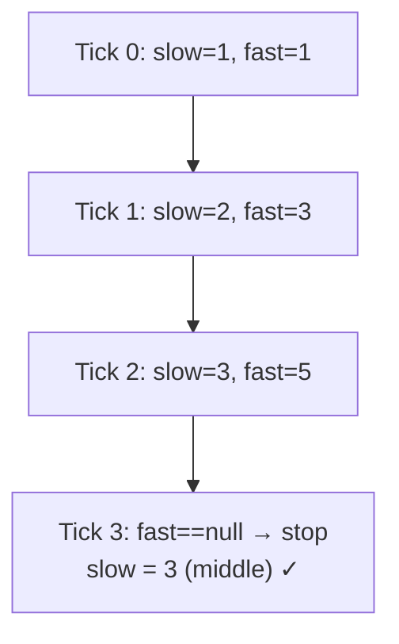

# Understanding the fast and slow pointer pattern

We can easily find the middle item in the array by dividing its length by two and accessing it using its index. However, unlike arrays, singly linked lists don't have a fixed size, and we cannot randomly access items using indices. Finding the middle node in the list requires two passes, first to find the length of the list and second to find the node at half the length from the start.

The problem can be further extended to find a node between two given nodes at a proportional distance from both. The fast and slow pointer technique can find that node in a single pass.

The fast and slow pointer pattern is a classification of problems that can be solved using the fast and slow pointer technique.

> ▶ Interactive Diagram — Fast-and-slow pointers find a node at a proportional distance from the ends — e.g., the middle (n=2, one pointer moves twice as fast), or the 1/3 point (n=3, fast moves three times as fast). No length measurement needed.
```d3 widget=linked-list
{
  "title": "Fast-and-slow finds a node at a proportional distance — e.g., 1/n of length",
  "direction": "single",
  "nodes": [
    {"id": "n1", "value": "1"},
    {"id": "n2", "value": "2"},
    {"id": "n3", "value": "3"},
    {"id": "n4", "value": "4"},
    {"id": "n5", "value": "5"},
    {"id": "n6", "value": "6"},
    {"id": "n7", "value": "7"},
    {"id": "n8", "value": "8"}
  ],
  "head": "n1",
  "steps": [
    {
      "links": [["n1","n2"],["n2","n3"],["n3","n4"],["n4","n5"],["n5","n6"],["n6","n7"],["n7","n8"]],
      "markers": [{"name": "head", "nodeId": "n1"}, {"name": "current", "nodeId": "n4"}, {"name": "tail", "nodeId": "n8"}],
      "msg": "Goal: find a node at 1/n of the length in a single pass — no length measurement needed"
    }
  ]
}
```

<p align="center"><strong>Fast-and-slow pointers find a node at a <em>proportional</em> distance from the ends — e.g., the middle (<code>n=2</code>, one pointer moves twice as fast), or the 1/3 point (<code>n=3</code>, fast moves three times as fast). No length measurement needed.</strong></p>

## Fast and slow pointer technique

Consider we are given a singly linked list and two nodes `start` and `end`, and we need to find a node that is at a distance `x` from `start` and `n*x` from `end`. It is guaranteed that a solution node exists.

It should be noted that a solution node will only exist if the length **L** between start and end is a multiple of **n** i.e, **L % n == 0**

The idea is to initialize two references `flast` and `slow` with `start` and move them forward at different speeds until `fast` reaches `end`.The `slow` reference moves **1** step in each iteration, while the `fast` reference moves **(n+1)** steps. This way, at the end of every iteration, the `slow` reference is at a proportional distance from the `start` and `fast` reference. When the `fast` reference reaches `end`, the `slow` reference points to the solution node.

> ▶ Interactive Diagram — The middle-finding case — by far the most common. fast moves twice as fast as slow. Because fast traverses at 2× speed, it reaches the end in half the ticks it would take slow — so when fast is done, slow is exactly halfway through.
```d3 widget=linked-list
{
  "title": "Middle-finding — fast moves 2x; when fast reaches tail, slow is at the middle",
  "direction": "single",
  "nodes": [
    {"id": "n1", "value": "1"},
    {"id": "n2", "value": "2"},
    {"id": "n3", "value": "3"},
    {"id": "n4", "value": "4"},
    {"id": "n5", "value": "5"}
  ],
  "head": "n1",
  "steps": [
    {
      "links": [["n1","n2"],["n2","n3"],["n3","n4"],["n4","n5"]],
      "markers": [{"name": "slow", "nodeId": "n1"}, {"name": "fast", "nodeId": "n1"}],
      "msg": "Init: slow = fast = head"
    },
    {
      "links": [["n1","n2"],["n2","n3"],["n3","n4"],["n4","n5"]],
      "markers": [{"name": "slow", "nodeId": "n2"}, {"name": "fast", "nodeId": "n3"}],
      "msg": "Tick 1: slow → 2, fast → 3"
    },
    {
      "links": [["n1","n2"],["n2","n3"],["n3","n4"],["n4","n5"]],
      "markers": [{"name": "slow", "nodeId": "n3"}, {"name": "fast", "nodeId": "n5"}],
      "msg": "Tick 2: slow → 3, fast → 5 (tail). Loop ends. slow is the middle."
    }
  ]
}
```

<p align="center"><strong>The middle-finding case — by far the most common. <code>fast</code> moves twice as fast as <code>slow</code>. Because fast traverses at 2× speed, it reaches the end in half the ticks it would take slow — so when fast is done, slow is exactly halfway through.</strong></p>

> 🖼 Diagram — General algorithm — slow advances by 1, fast advances by n, per tick. When fast terminates, slow is at the (length ÷ n)-th node.


<p align="center"><strong>General algorithm — slow advances by 1, fast advances by <code>n</code>, per tick. When fast terminates, slow is at the <code>(length ÷ n)</code>-th node.</strong></p>

## Algorithm

The algorithm given below outlines the fast and slow pointer traversal technique for a linked list of size `n`.

> -   **Step 1:** Initialize two references, `slow` and `fast` with the head of the list.
> -   **Step 2:** Loop while `fast.next` != `null` and `fast` != `end` and do the following
>     -   **Step 2.1:** Move slow 1 step ahead by setting `slow` = `slow.next`
>     -   **Step 2.2:** Move `fast` `n+1` times setting `fast` = `fast.next` `n+1` times.
> -   **Step 3:** Node held in `slow` is the solution node

## Implementation

Given below is the generic code implementation of the fast and slow pointer traversal technique on a linked list.


```python run
"""
Definition for singly-linked list.
class ListNode:
    def __init__(self, val):
        self.val = val
        self.next = None
"""

def findTheSolutionNode(start: ListNode, end: ListNode, n: int) -> ListNode:
    # Create two pointers slow and fast
    # and point them to the start
    slow = start
    fast = start

    # Null pointer checks to take care of edge cases
    while fast.next and fast != end:
        # Move slow 1 step
        slow = slow.next

        # Move fast n+1 steps
        for _ in range(n+1):
            if fast.next:
                fast = fast.next

    # Node pointed by slow is the solution
    return slow
```

```java run

/**
 * Definition for singly-linked list.
 * class ListNode {
 *     int val;
 *     ListNode next;
 *     ListNode() {}
 *     ListNode(int val) { this.val = val; }
 * };
 */

public ListNode findTheSolutionNode(ListNode start, ListNode end, int n) {
    // Create two references slow and fast
    // and point them to the start
    ListNode slow = start;
    ListNode fast = start;

    // Null checks to take care of edge cases
    while(fast.next != null && fast != end) {
        // Move slow 1 step
        slow = slow.next;

        // Move fast n+1 step
        for(int i=0; i<n+1; i++) {
            if(fast != null && fast.next != null)
                fast = fast.next;
        }
    }

    // Node pointed by slow is the solution
    return slow;
}
```


## Complexity Analysis

The algorithm's time and space complexity is easy to understand. In the worst case, the start and end are the first and the last node in the list, and the fast reference traverses from the start to end of the list, which has a linear **O(N)** runtime complexity where **N** is the length of the linked list. In the best case, `start` and `end` may only have one node in between and `n=1`. In this case, the `fast` reference only traverses two nodes, and the runtime complexity would be constant O(1).

Since we do not create a new data structure, the space complexity is constant **O(1)**. 

> **Best Case**
>
> -   Space Complexity - **O(1)**
> -   Time Complexity - **O(1)**
>
> **Worst Case**
>
> -   Space Complexity - **O(1)**
> -   Time Complexity - **O(N)**

Later in the course, we will examine techniques for identifying problems that can be solved using the fast and slow pointer technique and walk through an example to better understand it.

# Identifying the fast and slow pointer pattern

The fast and slow pointer technique can only be applied to some specific problems. These are generally easy or medium problems where we must find a node at a proportional distance between two nodes. Most often these problems are about finding the middle node of a segment or the middle node of the entire list. If the problem statement or its solution follows the generic template below, it can be solved by applying the sliding window traversal technique.

**Template:**

Given a linked list and two nodes `start` and `end` at a distance of L from each other, find the node at a distance of `x` from `start` and `n*x` from `end` such that n > 0 and L % n == 0.

## Example

Let's consider the following problem as an example to better understand how to identify and solve a problem using the fast and slow pointer technique

> **Problem statement:** Given a linked list, find the middle node.

> ▶ Interactive Diagram — For odd length the middle is unambiguous. For even length there are two candidates — by convention, fast-and-slow returns the second middle (the one closer to the tail). Some problems want the first; the small tweak is to start fast one step ahead.
```d3 widget=linked-list
{
  "title": "Middle node — odd length picks the true centre; even length picks the second middle",
  "direction": "single",
  "nodes": [
    {"id": "a1", "value": "1"},
    {"id": "a2", "value": "2"},
    {"id": "a3", "value": "3"},
    {"id": "a4", "value": "4"},
    {"id": "a5", "value": "5"}
  ],
  "head": "a1",
  "steps": [
    {
      "links": [["a1","a2"],["a2","a3"],["a3","a4"],["a4","a5"]],
      "markers": [{"name": "current", "nodeId": "a3"}],
      "msg": "Odd length [1,2,3,4,5] — middle = node(3), unambiguous"
    },
    {
      "nodes": [
        {"id": "a1", "value": "1"},
        {"id": "a2", "value": "2"},
        {"id": "a3", "value": "3"},
        {"id": "a4", "value": "4"}
      ],
      "links": [["a1","a2"],["a2","a3"],["a3","a4"]],
      "markers": [{"name": "current", "nodeId": "a3"}],
      "msg": "Even length [1,2,3,4] — fast-and-slow returns the SECOND middle = node(3)"
    }
  ]
}
```

<p align="center"><strong>For odd length the middle is unambiguous. For even length there are two candidates — by convention, fast-and-slow returns the <em>second</em> middle (the one closer to the tail). Some problems want the first; the small tweak is to start <code>fast</code> one step ahead.</strong></p>

### Fast and slow pointer solution

The problem description directly fits the generic template for the fast and slow pointer traversal pattern we learned earlier.

**Template:**

Given a linked list and two nodes `start` (head) and `end` (last node) find the node at a distance of `x` from `start` and `n*x` from `end` where n = 1

We initialize two references `slow` and `fast` with the head node and iterate using `fast` until we reach the last node (either `null` or node before `null`) of the list. In each iteration, we move `slow` `n` (1) step ahead and `fast` `n+1` (2) steps ahead. At the end of all iterations, `slow` holds the reference to the node at the middle of the given list.

For linked lists that have an odd number of nodes, the traversal will terminate when `fast` reaches the last node and slow points to the node in the middle of the list. For a list with an even number of nodes, no (middle) node is equidistant from both ends, as the real middle of the list lies between two nodes. In this case, the traversal will terminate when fast hits `null` and slow points to the "second" middle node.

> 🖼 Diagram — Trace on [1, 2, 3, 4, 5] — every tick, slow advances 1 step, fast advances 2 steps. Fast hits the end at tick 3; slow is parked at node 3, the middle.


<p align="center"><strong>Trace on <code>[1, 2, 3, 4, 5]</code> — every tick, slow advances 1 step, fast advances 2 steps. Fast hits the end at tick 3; slow is parked at node 3, the middle.</strong></p>

The implementation of the fast and slow pointer solution is given as follows.


```python run
"""
Definition for singly-linked list.
class ListNode:
    def __init__(self, val):
        self.val = val
        self.next = None
"""

from typing import Optional

class Solution:
    def middle_node_search(
        self, head: Optional[ListNode]
    ) -> Optional[ListNode]:

        # Initialize slow pointer to the head of the list
        slow = head

        # Initialize fast pointer to the head of the list
        fast = head

        # Iterate until fast pointer reaches the end of the list
        while (
            fast is not None
            and fast.next is not None
            and slow is not None
        ):

            # Move slow pointer one step forward
            slow = slow.next

            # Move fast pointer two steps forward
            fast = fast.next.next

        # Return the middle node or the second middle node (in case of
        # even number of nodes)
        return slow
```

```java run
/**
 * Definition for singly-linked list.
 * class ListNode {
 *     int val;
 *     ListNode next;
 *     ListNode() {}
 *     ListNode(int val) { this.val = val; }
 * };
 */

class Solution {
    public ListNode middleNodeSearch(ListNode head) {

        // Initialize slow pointer to the head of the list
        ListNode slow = head;

        // Initialize fast pointer to the head of the list
        ListNode fast = head;

        // Iterate until fast pointer reaches the end of the list
        while (fast != null && fast.next != null) {

            // Move slow pointer one step forward
            slow = slow.next;

            // Move fast pointer two steps forward
            fast = fast.next.next;
        }

        // Return the middle node or the second middle node (in case of
        // even number of nodes)
        return slow;
    }
}
```


As the code above demonstrates, we can find the middle node of the given list using the fast and slow pointer technique in a single pass.

## Example problems

Most problems that fall under this category are **easy** problems; a list of a few is given below.

> -   **[Middle node search](#middle-node-search)**
> -   **[Split list in half](#split-list-in-half)**
> -   **[Equal halves](#equal-halves)**
> -   **[Palindrome checker](#palindrome-checker)**

We will now solve these problems to understand the fast and slow pointer technique better.

---

## Understanding the Pattern

### Why Naive Isn't Enough

Finding the middle node of a singly linked list looks innocuous until you remember the structural constraint — there is no length field, and no random access by index. The natural two-pass solution walks the list once to count `n` nodes, then walks it again `n / 2` steps to land on the middle. That works in `O(n)` time and `O(1)` space, but it visits each prefix node twice and forces the caller to keep the head reachable across two passes. Worse, the same pattern recurs in problems where length isn't the actual signal — "split the list in half" needs the predecessor of the middle to perform the cut, "palindrome check" needs the second half in reversed form, and recomputing the length each time wastes work.

To make this concrete: on `[5, 7, 3, 10, 6]`, the two-pass solution counts `n = 5`, then walks two more steps to land on `3`. The first pass touched all five nodes; the second pass touched the first three again. Eight node-visits to find the middle of a five-node list — every middle-finding problem in this section would pay this overhead.

So the key idea is: a single pass is enough if two pointers walk the list at different speeds. When one moves twice as fast as the other, the slower one is at the halfway mark the moment the faster one falls off the end — proportions land for free.

### The Core Idea

The pattern asks one question: **can the answer be encoded as a proportion of the list's length, computable from two pointers walking at a fixed speed ratio?**

The single mechanism that drives every variant is the **two-speed walk**:

- **`slow`** — advances one node per tick. Its position grows linearly with the tick count.
- **`fast`** — advances `n` nodes per tick, where `n` is set by the desired ratio. When `fast` reaches the tail after `t` ticks, `slow` is at index `t`, and `fast` has covered `n * t` ground.

To make this concrete: with `n = 2` on a 5-node list `[1, 2, 3, 4, 5]`, after tick 1 `slow = 2`, `fast = 3`; after tick 2 `slow = 3`, `fast = 5` (the tail). The loop ends, and `slow` is parked at node 3 — the middle. No length pass, no second walk.

The core insight is: when `fast` traverses the list in `(length / n)` ticks, `slow` lands at the `(length / n)`-th node — the position at proportional fraction `1 / n` from the start. Setting `n = 2` gives the middle; `n = 3` gives the third; `n = k` gives the `(length / k)`-th node. The math IS the algorithm.

### How the Pointers Move

The two pointers move in lockstep — one tick advances both. `slow` takes a single hop (`slow = slow.next`); `fast` takes `n` hops (`fast = fast.next.next` for the 2:1 case). The termination check guards `fast` against falling off the end: `fast` is `null` (it reached one past the tail on an even-length list) or `fast.next` is `null` (it reached the tail on an odd-length list). The order of the check matters — `fast != null` must come first so `fast.next` never dereferences `null`.

Crucially, the rewrite of cursors happens *after* the termination check and *before* the next iteration. Read the cursors, decide whether to continue, then advance. The list itself is never modified — fast-and-slow is a pure positional pattern. When the loop exits, `slow` holds the answer; any structural work (splitting, comparing, reversing) happens after the walk, not during it.

---

## The Generic Algorithm

The pattern follows the same four-step skeleton regardless of which variant it takes.

1. **Initialise both pointers at the head.** Set `slow = head` and `fast = head`. Both cursors start at the same node so the proportional invariant holds from tick zero — at tick `t`, `slow` is at index `t` and `fast` is at index `n * t`.
2. **Guard the fast pointer's reach.** Before each tick, check that `fast` is not `null` and that `fast` has enough room to take its `n` hops without dereferencing `null`. For the 2:1 case, the guard is `fast != null and fast.next != null` — `fast` exists, and `fast.next` exists so `fast.next.next` is safe to read.
3. **Advance both pointers by their respective speeds.** Inside the loop body, set `slow = slow.next` (one hop) and `fast = fast.next.next` (two hops, for the 2:1 case). The order of the two advances does not matter — they read independent state — but consistency makes the code easier to debug.
4. **Return `slow` as the answer.** When the loop exits, `slow` is parked at the proportional position. For middle-finding, that is the middle node (or the second middle on even-length lists, by convention). The caller uses `slow` directly — no further walk needed.

If the problem needs the predecessor of the middle (for splitting) or the segment between two given nodes (for the generic `1 / n` form), the outer driver tracks that bookkeeping while the inner two-speed loop is unchanged.

---

## Variants / Taxonomy

The pattern shows up in four recognisable variants. Each adjusts where `slow` ends up or what surrounding work piggy-backs on the walk, but every variant calls the same two-speed loop body.

- **Middle-finding (2:1 walk)** — the default form. `fast` moves twice as fast as `slow`. When `fast` hits the tail, `slow` is at the middle. For odd-length lists, the middle is unambiguous; for even-length lists, `slow` lands on the second middle (the one closer to the tail), by convention. Starting `fast` one step ahead (`fast = head.next`) lands `slow` on the first middle instead — the same loop, one initialisation tweak.
- **Split-at-middle (2:1 walk with predecessor tracking)** — the same 2:1 walk, but the driver also tracks the node *before* `slow` so it can sever the list at the split point. After the walk, `prev_to_slow.next = null` cuts the list cleanly. Used by the split-list and palindrome problems.
- **Equal-halves comparison (2:1 walk + sum sweep)** — find the middle, then sum each half separately. The two-speed walk locates the boundary in one pass; the sums are an extra `O(n)` pass each. The pattern's contribution is the boundary; the sums are independent work.
- **Palindrome check (2:1 walk + reverse + compare)** — find the middle, reverse the back half in place using the reversal pattern from chapter 7, then walk both halves in parallel comparing values. The two-speed walk delivers the midpoint; the reversal + comparison are downstream consequences.

The variants share an invariant: when the loop ends, `slow` is at the position the problem cares about, and no length pass was required to find it.

---

## Recognition Checklist

The pattern fits when **all four** answers are "yes". The first asks whether the answer is positional; the next three check that the two-speed walk can compute it in one pass.

- Does the problem ask for a node at a **proportional position** in the list — the middle, the 1/3 point, the predecessor of the middle, or the boundary between two halves?
- Can the position be computed from a **single forward pass**, without first measuring the length or building an auxiliary array?
- Is the work at each step **`O(1)`** — a constant number of pointer hops and comparisons, with no per-node scan?
- Is **`O(1)` extra space** required (or strongly preferred)? If `O(n)` auxiliary memory is acceptable, copying values into an array and indexing also works.

Common surface signals: "find the middle of the linked list," "split the list into two halves," "is the list a palindrome," "delete the `n`-th node from the end," "detect whether the list has a cycle," "find the node where two lists meet."

---

## Canonical Example: Find the Middle Node

**Problem:** Given the head of a singly linked list, find and return the middle node. If there are two middle nodes (even length), return the second one.

```
Input:  head = [1, 2, 3, 4, 5]
Output: 3
```

### Brute Force: Two Passes with a Length Count

Walk the list once to compute its length `n`. Walk it again `n / 2` steps from the head. Return the node you land on.

```
Pass 1: walk head → 1 → 2 → 3 → 4 → 5 → null. Count = 5.
Compute target index = 5 / 2 = 2.
Pass 2: walk 2 steps from head — head → 1 → 2 → 3. Stop at node 3.
Return node 3.
```

The brute force is correct and runs in `O(n)` time / `O(1)` space — same asymptotic cost as the optimised version. The waste is constant-factor: the first three nodes are visited twice. More importantly, the two-pass approach forces the caller to keep `head` reachable across the second walk, which complicates problems that want to combine middle-finding with structural work (splitting, reversing the back half).

### Key Insight: Two Speeds Encode the Half-Length

When `fast` moves twice as fast as `slow`, the ratio of their positions is permanently 2:1. The moment `fast` falls off the end (reaches `null` or the last node), `slow` has covered exactly half the distance — the middle. No length pass, no second walk, no auxiliary memory.

### Optimized Solution: The 2:1 Two-Speed Walk

The single-pass solution runs in `O(n)` time and `O(1)` space. The Python and Java implementations below are the same loop body in different language syntax.

> 🖼 Diagram — TODO: 3 frames — initial state with slow=fast=head on a 5-node list; mid-walk with slow at index 2 and fast at index 4; terminal state with fast=null (off the end) and slow parked at the middle node 3

### Trace

```
head = 1 → 2 → 3 → 4 → 5 → null

Init: slow = 1, fast = 1

Tick 1: slow = 2, fast = 3
        (slow advances 1; fast advances 2)

Tick 2: slow = 3, fast = 5
        (fast.next = null after this tick — loop will exit next check)

Tick 3: guard fails — fast = 5, fast.next = null.
        Loop ends.

Return slow = 3. ✓
```

### Fitting the Template

| Check | Answer for Find the Middle Node |
|---|---|
| **Q1.** Does the problem ask for a node at a proportional position? | **Yes** — the middle is the `1/2` point of the list's length. |
| **Q2.** Can the position be computed in a single forward pass? | **Yes** — `slow` lands at the middle the moment `fast` runs out of room, no second walk needed. |
| **Q3.** Is the work at each step `O(1)`? | **Yes** — every tick performs one comparison and three pointer hops (one for `slow`, two for `fast`), independent of `n`. |
| **Q4.** Is `O(1)` extra space required? | **Yes** — two local references (`slow`, `fast`) regardless of list length. |

All four answers are "yes", so the fast-and-slow pattern applies. The outer driver is trivial (no positional bookkeeping — `slow = fast = head`); the inner two-speed loop does the entire job. Total cost: `O(n)` time, `O(1)` space.

---

## Problems in This Category

| Problem | Variant | How the two-speed walk fits |
|---|---|---|
| **[Middle Node Search](02-problems/01-middle-node-search.md)** | Middle-finding (2:1 walk) | `slow = fast = head`, advance until `fast` or `fast.next` is `null`; return `slow` |
| **[Split List in Half](02-problems/02-split-list-in-half.md)** | Split-at-middle | Same 2:1 walk, but track `prev_to_slow` so the list can be severed at the split point |
| **[Equal Halves](02-problems/03-equal-halves.md)** | 2:1 walk + sum sweep | Find the boundary with the 2:1 walk, then sum each half separately and compare |
| **[Palindrome Checker](02-problems/04-palindrome-checker.md)** | 2:1 walk + reverse + compare | Find the middle, reverse the second half (pattern 07), walk both halves in parallel comparing values |

Difficulty increases with the amount of post-walk work the caller does — the loop itself is unchanged across all four problems.
