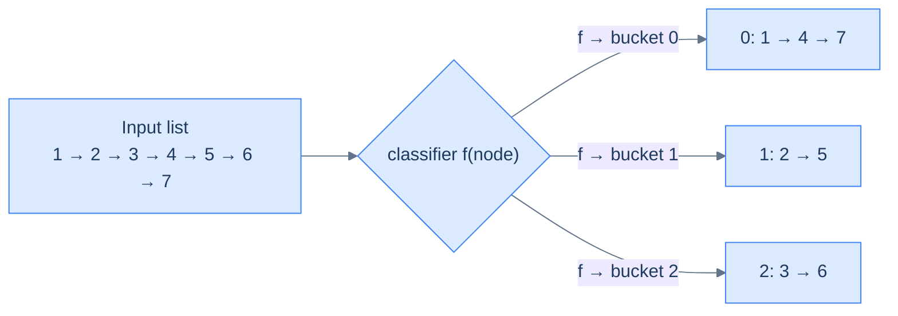
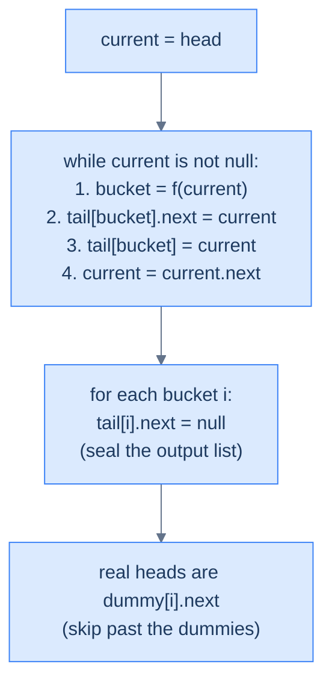

# 10. Pattern: Split

## The Hook

You have a linked list of a million nodes and you need to route them into three output lists based on some rule — say, odd/even/zero, or a hash bucket, or "rank by 1000". The naive plan: walk the list three times, copying the matching nodes into three freshly-allocated lists. **Three passes. O(n) extra memory for all those copies. Off-by-one bugs in the seam logic.**

The split pattern does it in one pass with zero allocations beyond `k` dummy nodes. For each node, compute its bucket, tack it onto that bucket's tail, move on. The nodes themselves don't move in memory — only their `.next` pointers get rewired. At the end, you have `k` cleanly terminated sublists and the original list has been dismantled.

There's one trick that makes this pattern click: the **dummy head sentinel**. Each output list begins with a placeholder node so you never need to distinguish "first node to append" from "subsequent node to append" — every append is just `tail.next = node; tail = node`. That single-trick uniformity kills a whole class of edge cases and turns a gnarly conditional forest into a 10-line loop. Let's build it.

---

## Table of contents

1. [Understanding the split pattern](#understanding-the-split-pattern)
2. [Identifying the split pattern](#identifying-the-split-pattern)
3. [Even odd split](#even-odd-split)
4. [Split alternate groups](#split-alternate-groups)
5. [Split by modulo](#split-by-modulo)
6. [K-way list split](#k-way-list-split)

***

# Understanding the split pattern

Many linked list problems require splitting a given linked list into two or more lists based on the outcome of some function. One solution to this problem is traversing the list for every new list that has to be created and copying items from the original list into the new nodes created for the new lists. However, this requires multiple passes over the list and is inefficient. Also, in many cases, we need to split the original list into separate lists instead of creating copies of nodes. The linked list split technique can be applied to such problems to solve them efficiently in a single pass.



<p align="center"><strong>The split pattern — every node is routed to one of <code>k</code> output lists by a classifier function <code>f</code>. Nothing is copied; the original nodes are re-linked into their destination list.</strong></p>

```d2
direction: right

before: Original list {
  direction: right
  a1: "1"
  a2: "2"
  a3: "3"
  a4: "4"
  a5: "5"
  a6: "6"
  a1 -> a2
  a2 -> a3
  a3 -> a4
  a4 -> a5
  a5 -> a6
}

after: "After split into k=3 sub-lists (round robin)" {
  l0: "List 0" {
    direction: right
    b1: "1"
    b4: "4"
    b1 -> b4
  }
  l1: "List 1" {
    direction: right
    b2: "2"
    b5: "5"
    b2 -> b5
  }
  l2: "List 2" {
    direction: right
    b3: "3"
    b6: "6"
    b3 -> b6
  }
}

before -> after
```

<p align="center"><strong>Round-robin split — node <em>i</em> goes to list <em>i mod k</em>. Every original node ends up in exactly one sublist; no allocations, just re-linking.</strong></p>

## Linked list split technique

Consider we are given a singly linked list that we need to split into `k` lists using a function `f` that maps every node in the original list to the list it should go to after splitting. the function`f`simply round robins amongst all the`k`lists. The split technique uses dummy nodes to simplify splitting the original lists. We create two arrays of node references `dummy` and `tails` of size `k` each. Both the arrays initialized it with references of newly created dummy nodes where the item at the index `i` is the dummy node for the list `i`.

Consider the example below, where `k = 3`.

```d2
direction: right
d0: |md
  **dummy[0]**

  next: null
|
d1: |md
  **dummy[1]**

  next: null
|
d2: |md
  **dummy[2]**

  next: null
|
t0: "tail[0] → dummy[0]"
t1: "tail[1] → dummy[1]"
t2: "tail[2] → dummy[2]"
d0 -> t0: "" {style.stroke-dash: 3}
d1 -> t1: "" {style.stroke-dash: 3}
d2 -> t2: "" {style.stroke-dash: 3}
```

<p align="center"><strong>Setup for <code>k = 3</code> — allocate <code>k</code> dummy heads and a parallel <code>tail[i]</code> pointer for each. The dummy pattern removes every "is this the first node in the output list?" special case: each tail just appends via <code>tail[i].next = current; tail[i] = current</code>, always.</strong></p>

We initialize a `current` reference with the head of the list and traverse the original list from start to end. In each iteration, we use the function `f` to identify which list the current node should go to. We get the tail node for that list from the `tail` array, update its next section to hold the current node, and update the tail reference. Then, we move `current` one step ahead for the next iteration and finally set the next section of the new tail node to `null`. This process is repeated until we reach the end of the list when the original list is split into `k` lists.



<p align="center"><strong>Single pass — for each node, compute its bucket, tack it onto that bucket's tail, advance. Afterwards, seal every bucket's tail and extract the real heads from <code>dummy[i].next</code>.</strong></p>

At the end of all iterations, we iterate in `dummy` and move the references one step ahead to hold the real head of the corresponding list and delete the dummy node.

## Algorithm

The algorithm given below summarizes the linked list split technique to split a list into `k` lists.

> **Algorithm**
>
> -   **Step 1:** Create two arrays of node references `dummy` and `tails` of size `k` and initialize each item in both arrays with the reference of a newly created dummy node.
> -   **Step 2:** Create a reference `current` and initialize it with the head of the list.
> -   **Step 3:** Loop while `current` != `null` and do the following:
>     -   **Step 3.1:** Apply the function `f` to the `current` node and retrieve `idx`, which is the index of the list where this node should be placed.
>     -   **Step 3.2:** Add the `current` node to the end of the list stored at `idx` using `tails` array.
>     -   **Step 3.3:** Update `tails\[idx\]` to now store the reference of the new tail node.
>     -   **Step 3.4:** Update the `current` pointer to hold the reference of the node after the `current` node.
>     -   **Step 3.5:** Set the next section of `tails\[idx\]` to `null`
> -   **Step 4:** Move all the dummy nodes one step ahead to obtain the heads of the split lists and delete the old dummy nodes.

## Implementation

Given below is the generic code implementation to split a given linked list into `k` lists based on the outcome of a function `f`. 


```pseudocode
# Generic split. k dummy heads + k tails. Each node is routed to bucket `classify(node)`.
function splitLists(head, k, classify):
    dummies ← list of k new ListNodes
    tails ← copy of dummies
    current ← head
    while current is not null:
        idx ← classify(current)                       # route to bucket idx
        tails[idx].next ← current
        tails[idx] ← current
        current ← current.next
    for each t in tails:
        t.next ← null                                  # seal each output list
    return [d.next for each d in dummies]
```

```python run
from typing import Callable, List, Optional

class ListNode:
    def __init__(self, val=0, next=None):
        self.val = val
        self.next = next

def split_lists(head: Optional[ListNode], k: int,
                classify: Callable[[ListNode], int]) -> List[Optional[ListNode]]:
    # k dummy heads + k tails. Dummy sentinels remove every "first node" special case.
    dummies = [ListNode() for _ in range(k)]
    tails   = list(dummies)

    current = head
    while current is not None:
        idx = classify(current)         # route current to bucket `idx`
        tails[idx].next = current       # splice onto that bucket's tail
        tails[idx]      = current       # advance the tail pointer
        current         = current.next  # walk the original list

    # Seal every bucket so outputs are independent lists
    for t in tails:
        t.next = None

    # Real heads live one hop past the dummies
    return [d.next for d in dummies]
```

```java run
import java.util.function.Function;

class Solution {
    public ListNode[] splitLists(ListNode head, int k, Function<ListNode, Integer> classify) {
        ListNode[] dummies = new ListNode[k];
        ListNode[] tails   = new ListNode[k];
        for (int i = 0; i < k; i++) { dummies[i] = new ListNode(); tails[i] = dummies[i]; }

        ListNode current = head;
        while (current != null) {
            int idx = classify.apply(current);
            tails[idx].next = current;
            tails[idx]      = current;
            current         = current.next;
        }

        ListNode[] heads = new ListNode[k];
        for (int i = 0; i < k; i++) {
            tails[i].next = null;             // seal each bucket
            heads[i] = dummies[i].next;       // strip the dummy
        }
        return heads;
    }
}
```

```c run
#include <stdlib.h>

typedef struct ListNode { int val; struct ListNode *next; } ListNode;

static ListNode* new_dummy(void) {
    ListNode *d = (ListNode*)malloc(sizeof(ListNode));
    d->val = 0; d->next = NULL;
    return d;
}

ListNode** splitLists(ListNode *head, int k, int (*classify)(ListNode*)) {
    ListNode **dummies = (ListNode**)malloc(sizeof(ListNode*) * k);
    ListNode **tails   = (ListNode**)malloc(sizeof(ListNode*) * k);
    for (int i = 0; i < k; i++) { dummies[i] = new_dummy(); tails[i] = dummies[i]; }

    ListNode *current = head;
    while (current != NULL) {
        int idx = classify(current);
        tails[idx]->next = current;
        tails[idx]       = current;
        current          = current->next;
    }

    ListNode **heads = (ListNode**)malloc(sizeof(ListNode*) * k);
    for (int i = 0; i < k; i++) {
        tails[i]->next = NULL;
        heads[i] = dummies[i]->next;
        free(dummies[i]);
    }
    free(dummies); free(tails);
    return heads;
}
```

```scala run
object Solution {
  def splitLists(head: ListNode, k: Int, classify: ListNode => Int): Array[ListNode] = {
    val dummies = Array.fill(k)(new ListNode(0))
    val tails   = dummies.clone()

    var current = head
    while (current != null) {
      val idx = classify(current)
      tails(idx).next = current
      tails(idx)      = current
      current         = current.next
    }

    val heads = new Array[ListNode](k)
    for (i <- 0 until k) {
      tails(i).next = null
      heads(i) = dummies(i).next
    }
    heads
  }
}
```


## Complexity Analysis

Looking at the algorithm, the runtime and space complexity are pretty easy to understand. We traverse the given linked list from start to end, so the time complexity is linear **O(N)** in any case.

We create two arrays of size k each to store references to dummy nodes and tail nodes. We also create k dummy nodes to simplify the implementation, so the space complexity is **O(K)** in any case.

> **Best Case:** K = 1
>
> -   Space Complexity - **O(K)**
> -   Time Complexity - **O(N)**
>
> **Worst Case:** K = N
>
> -   Space Complexity - **O(N)**
> -   Time Complexity - **O(N)**

***

# Identifying the split pattern

The linked list split technique can only be applied to some specific problems. These are generally easy or medium problems in which we must split a linked list into one or smaller lists. However, there may be some problems where we need to split a list that may have a more straightforward solution than applying the split technique. For example, we can split a list in half using the fast and slow pointer technique, and the split list technique may be overkill. If the problem statement or its solution follows the generic template below, it can be solved by applying the split list technique.

**Template:**

Given a linked list, split it into to `k` lists.

## Example

Let's consider the following problem as an example to better understand how to identify and solve a problem using the split technique.

> **Problem statement:** Given a singly linked list and an integer `k` split the list into `k` lists such that their concatenation results in the original lists. The length of all parts should be equal. If that is not possible, the difference between the size of any two lists should not be greater than one, and the list occurring earlier should have a greater size.


<p align="center"><strong>Single pass — for each node, compute its bucket, tack it onto that bucket's tail, advance. Afterwards, seal every bucket's tail and extract the real heads from <code>dummy[i].next</code>.</strong></p>

### Split technique solution

We need to split a given list into k parts, and this fits the generic template from the split pattern we learned earlier.

**Template:**

Given a linked list, split it into to `k` lists.

We first find the `length` of the given list and divide it by `k` to calculate the minimum number of nodes each of the `k` split lists will have. We save this value in a variable `partSize`. The length may not be multiple of `k`, which means that some split lists will have `partSize + 1` nodes. We create a variable `bigLists` and initialize it with `length % k`, which is the number of lists that will have `partSize + 1` nodes in them.

```d2
direction: right
length: "length = n"
k: "k = number of buckets"
base: |md
  base = n / k (integer)

  size of each 'small' sublist
|
rem: |md
  remainder = n % k

  = number of 'big' sublists (size base+1)
|
length -> base
k -> base
length -> rem
k -> rem
```

<p align="center"><strong>Unequal splitting — when <code>n</code> isn't divisible by <code>k</code>, the first <code>n mod k</code> sublists get one extra node (<code>base + 1</code>), and the rest get exactly <code>base</code>. Compute both quantities once before splitting.</strong></p>

We then apply the split list technique by creating two arrays of ListNode references `dummy` and `tails` of size `k` each and initialize all items in them with the references of newly created dummy nodes. We initialize `current` with head and use it to traverse the list from start to end. We also initialize two variables `idx` and `count` with 0 to to keep track of the current split list and the number of nodes already added to it. We then iterate the list and use the variables `bigLists` and `count` to update `idx` when we have added all nodes to the current split list.

```d2
state: "Initial state for unequal split" {
  grid-rows: 2
  grid-gap: 16
  d: |md
    **dummy[k]**

    k heads
    (one per output)
  |
  t: |md
    **tail[k]**

    k tails
    (tracks end of each)
  |
  cur: |md
    **current = head**

    (the walker)
  |
  big: |md
    **bigLists = n % k**

    (# of k+1-sized lists)
  |
  base: |md
    **baseSize = n / k**

    (size of small lists)
  |
  bkt: |md
    **bucket = 0**

    (round-robin counter)
  |
}
```

<p align="center"><strong>Initial state for unequal split — alongside the usual <code>dummy</code> / <code>tail</code> arrays, track how many nodes still belong to the current bucket and how many "big" buckets remain.</strong></p>

In each iteration, we add the node held in `current` at the end of the split list denoted by `idx` and increment `count`. If we have any `bigLists` left i.e. `bigLists > 0` it means the current split list (denoted by `idx`) should have `partSize + 1` nodes, otherwise it should only have `partSize` nodes.

We check for these conditions to correctly update `idx` for the subsequent iterations. If `bigLists > 0` we check if we have already added `partSize + 1` nodes to the current split list be checking if `count == partSize + 1` and reset `count` to 0, decrement `bigLists` and increment `idx`. Otherwise, if `bigLists == 0` we check if `count == partSize` reset `count` to 0 and increment `idx`. This ensures that we move to the next split list after we have added all nodes to the current split list.


<p align="center"><strong>Single pass — for each node, compute its bucket, tack it onto that bucket's tail, advance. Afterwards, seal every bucket's tail and extract the real heads from <code>dummy[i].next</code>.</strong></p>

The implementation of the split list solution is given as follows.


```pseudocode
# Split into k roughly-equal contiguous parts. The first (length mod k) parts are 1 node bigger.
function kWaySplit(head, k):
    length ← 0; cur ← head
    while cur is not null: length ← length + 1; cur ← cur.next
    baseSize ← length ÷ k
    bigLists ← length mod k

    dummies ← list of k new ListNodes
    tails ← copy of dummies
    current ← head; idx ← 0; count ← 0
    while current is not null:
        tails[idx].next ← current
        tails[idx] ← current
        current ← current.next
        count ← count + 1
        target ← (baseSize + 1) if bigLists > 0 else baseSize
        if count = target:
            count ← 0
            idx ← idx + 1
            if bigLists > 0: bigLists ← bigLists − 1
    for each t in tails: t.next ← null
    return [d.next for each d in dummies]
```

```python run
from typing import List, Optional

class Solution:
    def k_way_split(self, head: Optional[ListNode], k: int) -> List[Optional[ListNode]]:
        # Count length so we can pre-compute how many "big" (size base+1) buckets exist
        length, cur = 0, head
        while cur:
            length += 1; cur = cur.next

        base_size = length // k
        big_lists = length %  k

        dummies = [ListNode() for _ in range(k)]
        tails   = list(dummies)

        current = head
        idx, count = 0, 0
        while current is not None:
            tails[idx].next = current
            tails[idx]      = current
            current         = current.next
            count += 1

            # "big" buckets take base_size + 1; others take base_size
            target = base_size + 1 if big_lists > 0 else base_size
            if count == target:
                count = 0
                idx   += 1
                if big_lists > 0: big_lists -= 1

        for t in tails:
            t.next = None
        return [d.next for d in dummies]
```

```java run
class Solution {
    public ListNode[] kWayListSplit(ListNode head, int k) {
        int length = 0;
        for (ListNode c = head; c != null; c = c.next) length++;
        int baseSize = length / k;
        int bigLists = length % k;

        ListNode[] dummies = new ListNode[k];
        ListNode[] tails   = new ListNode[k];
        for (int i = 0; i < k; i++) { dummies[i] = new ListNode(); tails[i] = dummies[i]; }

        ListNode current = head;
        int idx = 0, count = 0;
        while (current != null) {
            tails[idx].next = current;
            tails[idx]      = current;
            current         = current.next;
            count++;

            int target = (bigLists > 0) ? baseSize + 1 : baseSize;
            if (count == target) {
                count = 0;
                idx++;
                if (bigLists > 0) bigLists--;
            }
        }

        ListNode[] heads = new ListNode[k];
        for (int i = 0; i < k; i++) {
            if (tails[i] != null) tails[i].next = null;
            heads[i] = dummies[i].next;
        }
        return heads;
    }
}
```

```c run
ListNode** kWayListSplit(ListNode *head, int k) {
    int length = 0;
    for (ListNode *c = head; c != NULL; c = c->next) length++;
    int baseSize = length / k;
    int bigLists = length % k;

    ListNode **dummies = (ListNode**)malloc(sizeof(ListNode*) * k);
    ListNode **tails   = (ListNode**)malloc(sizeof(ListNode*) * k);
    for (int i = 0; i < k; i++) {
        dummies[i] = (ListNode*)calloc(1, sizeof(ListNode));
        tails[i]   = dummies[i];
    }

    ListNode *current = head;
    int idx = 0, count = 0;
    while (current != NULL) {
        tails[idx]->next = current;
        tails[idx]       = current;
        current          = current->next;
        count++;

        int target = (bigLists > 0) ? baseSize + 1 : baseSize;
        if (count == target) {
            count = 0; idx++;
            if (bigLists > 0) bigLists--;
        }
    }

    ListNode **heads = (ListNode**)malloc(sizeof(ListNode*) * k);
    for (int i = 0; i < k; i++) {
        if (tails[i] != NULL) tails[i]->next = NULL;
        heads[i] = dummies[i]->next;
        free(dummies[i]);
    }
    free(dummies); free(tails);
    return heads;
}
```

```scala run
object Solution {
  def kWayListSplit(head: ListNode, k: Int): Array[ListNode] = {
    var length = 0
    var cur = head
    while (cur != null) { length += 1; cur = cur.next }
    val baseSize = length / k
    var bigLists = length % k

    val dummies = Array.fill(k)(new ListNode(0))
    val tails   = dummies.clone()

    var current = head
    var idx = 0
    var count = 0
    while (current != null) {
      tails(idx).next = current
      tails(idx)      = current
      current         = current.next
      count += 1

      val target = if (bigLists > 0) baseSize + 1 else baseSize
      if (count == target) {
        count = 0; idx += 1
        if (bigLists > 0) bigLists -= 1
      }
    }

    val heads = new Array[ListNode](k)
    for (i <- 0 until k) {
      if (tails(i) != null) tails(i).next = null
      heads(i) = dummies(i).next
    }
    heads
  }
}
```


The above implementation uses the template code of the split list technique to split the list into k lists in a single pass.

## Example problems

Most problems that fall under this category are**medium**problems; a list of a few is given below.

> -   **[Even odd split](#even-odd-split)**
> -   **[Split alternate groups](#split-alternate-groups)**
> -   **[Split by modulo](#split-by-modulo)**
> -   **[K-way list split](#k-way-list-split)**

We will now solve these problems to understand the split list technique better.

***

# Even odd split

## Problem Statement

Given the **head** of a singly linked list, write a function to split the list into two separate lists such that the first list contains the nodes with even values and the second list contains the nodes with odd values. Your function should return the heads of both these lists.

### Example 1

> -   **Input:** head = \[5, 2, 3, 10, 6, 8\]
> -   **Output:** \[\[2, 10, 6, 8\], \[5, 3\]\]
> -   **Explanation:** Above is the list containing the even and odd-valued nodes, respectively.

### Example 2

> -   **Input:** head = \[4, 2, 6, 10\]
> -   **Output:** \[\[4, 2, 6, 10\], \[\]\]
> -   **Explanation:** Above is the list containing the even and odd-valued nodes, respectively.

## Solution


```pseudocode
# Route each node into one of two buckets based on parity.
function evenOddSplit(head):
    evenDummy ← new ListNode; oddDummy ← new ListNode
    evenTail ← evenDummy; oddTail ← oddDummy
    current ← head
    while current is not null:
        if current.val mod 2 = 0:
            evenTail.next ← current; evenTail ← current
        else:
            oddTail.next ← current; oddTail ← current
        current ← current.next
    evenTail.next ← null
    oddTail.next ← null
    return [evenDummy.next, oddDummy.next]
```

```python run
from typing import List, Optional

class Solution:
    def even_odd_split(
        self, head: Optional[ListNode]
    ) -> List[Optional[ListNode]]:

        # Initialize head and tail references for the two split lists
        even_dummy = ListNode(0)
        even_tail = even_dummy

        odd_dummy = ListNode(0)
        odd_tail = odd_dummy

        # Create current reference to iterate through the list
        current = head

        # Iterate through the list and split nodes into two lists
        while current is not None:

            # If the current node's value is even then the node goes to
            # the even list
            if current.val % 2 == 0:

                # `current` node goes to the even split list
                even_tail.next = current

                # Move even_tail forward
                even_tail = even_tail.next

            # Otherwise, the node goes to the odd list
            else:

                # `current` node goes to the odd split list
                odd_tail.next = current

                # Move odd_tail forward
                odd_tail = odd_tail.next

            # Move to the next node in the original list
            current = current.next

        # Terminate the even list
        even_tail.next = None

        # Terminate the odd list
        odd_tail.next = None

        return [even_dummy.next, odd_dummy.next]
```

```java run
class Solution {
    public ListNode[] evenOddSplit(ListNode head) {

        // Initialize head and tail references for the two split lists
        ListNode evenDummy = new ListNode();
        ListNode evenTail = evenDummy;

        ListNode oddDummy = new ListNode();
        ListNode oddTail = oddDummy;

        // Create current reference to iterate through the list
        ListNode current = head;

        // Iterate through the list and split nodes into two lists
        while (current != null) {

            // If the current node's value is even then the node goes to
            // the even list
            if (current.val % 2 == 0) {

                // `current` node goes to the even split list
                evenTail.next = current;

                // Move evenTail forward
                evenTail = evenTail.next;
            }

            // Otherwise, the node goes to the odd list
            else {

                // `current` node goes to the odd split list
                oddTail.next = current;

                // Move oddTail forward
                oddTail = oddTail.next;
            }

            // Move to the next node in the original list
            current = current.next;
        }

        // Terminate the even list
        evenTail.next = null;

        // Terminate the odd list
        oddTail.next = null;

        return new ListNode[]{evenDummy.next, oddDummy.next};
    }
}
```

```c run
typedef struct { ListNode *evens; ListNode *odds; } EvenOddSplit;

EvenOddSplit evenOddSplit(ListNode *head) {

    /* Initialize head and tail references for the two split lists */
    ListNode evenDummy = {0, NULL};
    ListNode *evenTail = &evenDummy;

    ListNode oddDummy = {0, NULL};
    ListNode *oddTail = &oddDummy;

    /* Create current reference to iterate through the list */
    ListNode *current = head;

    /* Iterate through the list and split nodes into two lists */
    while (current != NULL) {

        /* If the current node's value is even then the node goes to
           the even list */
        if (current->val % 2 == 0) {

            /* `current` node goes to the even split list */
            evenTail->next = current;

            /* Move evenTail forward */
            evenTail = evenTail->next;
        }

        /* Otherwise, the node goes to the odd list */
        else {

            /* `current` node goes to the odd split list */
            oddTail->next = current;

            /* Move oddTail forward */
            oddTail = oddTail->next;
        }

        /* Move to the next node in the original list */
        current = current->next;
    }

    /* Terminate the even list */
    evenTail->next = NULL;

    /* Terminate the odd list */
    oddTail->next = NULL;

    EvenOddSplit out = {evenDummy.next, oddDummy.next};
    return out;
}
```

```scala run
object Solution {
  def evenOddSplit(head: ListNode): Array[ListNode] = {

    // Initialize head and tail references for the two split lists
    val evenDummy = new ListNode(0)
    var evenTail: ListNode = evenDummy

    val oddDummy = new ListNode(0)
    var oddTail: ListNode = oddDummy

    // Create current reference to iterate through the list
    var current = head

    // Iterate through the list and split nodes into two lists
    while (current != null) {

      // If the current node's value is even then the node goes to
      // the even list
      if (current.v % 2 == 0) {

        // `current` node goes to the even split list
        evenTail.next = current

        // Move evenTail forward
        evenTail = evenTail.next
      }

      // Otherwise, the node goes to the odd list
      else {

        // `current` node goes to the odd split list
        oddTail.next = current

        // Move oddTail forward
        oddTail = oddTail.next
      }

      // Move to the next node in the original list
      current = current.next
    }

    // Terminate the even list
    evenTail.next = null

    // Terminate the odd list
    oddTail.next = null

    Array(evenDummy.next, oddDummy.next)
  }
}
```


***

# Split alternate groups

## Problem Statement

Given the **head** of a singly linked list and a positive integer **k**, write a function to split the list into two separate lists by alternating groups of `k` nodes and return the heads of both these lists.

If the remaining nodes at the end are fewer than k, include all of them in the respective group.

### Example 1

> -   **Input:** head = \[5, 2, 3, 10, 6, 8\], k = 2
> -   **Output:** \[\[5, 2, 6, 8\], \[3, 10\]\]
> -   **Explanation:** The list is split into groups of size 2 and assigned alternately: the first group \[5, 2\] to the first list, the second \[3, 10\] to the second list, and the third \[6, 8\] back to the first list.

### Example 2

> -   **Input:** head = \[6, 1, 3, 10, 6, 8\], k = 5
> -   **Output:** \[\[6, 1, 3, 10, 6\], \[8\]\]
> -   **Explanation:** The list is split into groups of size 5 and assigned alternately. The first group \[6, 1, 3, 10, 6\] goes to the first list. Only one node \[8\] remains, which is fewer than k, but it still goes to the second list as the next group.

## Solution


```pseudocode
# Take k nodes for bucket A, next k for bucket B, alternate.
function splitAlternateGroups(head, k):
    firstDummy ← new ListNode; secondDummy ← new ListNode
    firstTail ← firstDummy; secondTail ← secondDummy
    current ← head
    addToFirst ← true
    while current is not null:
        chunkStart ← current
        prev ← null
        for i from 1 to k:                            # walk up to k nodes
            if current is null: break
            prev ← current
            current ← current.next
        prev.next ← null                              # detach the chunk
        if addToFirst:
            firstTail.next ← chunkStart; firstTail ← prev
        else:
            secondTail.next ← chunkStart; secondTail ← prev
        addToFirst ← NOT addToFirst
    return [firstDummy.next, secondDummy.next]
```

```python run
from typing import List, Optional

class Solution:
    def split_alternate_groups(
        self, head: Optional[ListNode], k: int
    ) -> List[Optional[ListNode]]:

        # Head and tail references for the two resulting lists
        first_list_dummy: ListNode = ListNode(0)
        first_list_tail: ListNode = first_list_dummy

        second_list_dummy: ListNode = ListNode(0)
        second_list_tail: ListNode = second_list_dummy

        current: Optional[ListNode] = head

        # Flag to alternate between the two lists
        add_to_first_list: bool = True

        # Iterate through the original list
        while current is not None:

            # Start of the current chunk
            chunk_start: ListNode = current
            previous: Optional[ListNode] = None

            # Traverse up to k nodes for the current chunk
            for _ in range(k):
                if current is None:
                    break
                previous = current
                current = current.next

            # Disconnect the chunk from the rest of the list
            if previous:
                previous.next = None

            # Attach chunk to the appropriate list
            if add_to_first_list:

                # Attach chunk to the first list
                first_list_tail.next = chunk_start

                # Move tail to the end of the chunk
                first_list_tail = previous
            else:

                # Attach chunk to the second list
                second_list_tail.next = chunk_start

                # Move tail to the end of the chunk
                second_list_tail = previous

            # Alternate for next chunk
            add_to_first_list = not add_to_first_list

        # Return heads of the two lists
        return [first_list_dummy.next, second_list_dummy.next]
```

```java run
class Solution {
    public ListNode[] splitAlternateGroups(ListNode head, int k) {
        ListNode firstDummy = new ListNode(), secondDummy = new ListNode();
        ListNode firstTail  = firstDummy, secondTail = secondDummy;

        ListNode current = head;
        boolean addToFirst = true;
        while (current != null) {
            ListNode chunkStart = current, prev = null;
            for (int i = 0; i < k && current != null; i++) {
                prev    = current;
                current = current.next;
            }
            prev.next = null;

            if (addToFirst) { firstTail.next  = chunkStart; firstTail  = prev; }
            else             { secondTail.next = chunkStart; secondTail = prev; }
            addToFirst = !addToFirst;
        }
        return new ListNode[]{firstDummy.next, secondDummy.next};
    }
}
```

```c run
typedef struct { ListNode *first; ListNode *second; } AltSplit;

AltSplit splitAlternateGroups(ListNode *head, int k) {
    ListNode firstDummy = {0, NULL}, secondDummy = {0, NULL};
    ListNode *firstTail = &firstDummy, *secondTail = &secondDummy;

    ListNode *current = head;
    int addToFirst = 1;
    while (current != NULL) {
        ListNode *chunkStart = current, *prev = NULL;
        for (int i = 0; i < k && current != NULL; i++) {
            prev    = current;
            current = current->next;
        }
        prev->next = NULL;

        if (addToFirst) { firstTail->next  = chunkStart; firstTail  = prev; }
        else             { secondTail->next = chunkStart; secondTail = prev; }
        addToFirst = !addToFirst;
    }
    AltSplit out = {firstDummy.next, secondDummy.next};
    return out;
}
```

```scala run
object Solution {
  def splitAlternateGroups(head: ListNode, k: Int): Array[ListNode] = {
    val firstDummy = new ListNode(0)
    val secondDummy = new ListNode(0)
    var firstTail:  ListNode = firstDummy
    var secondTail: ListNode = secondDummy

    var current = head
    var addToFirst = true
    while (current != null) {
      val chunkStart = current
      var prev: ListNode = null
      var i = 0
      while (i < k && current != null) {
        prev    = current
        current = current.next
        i += 1
      }
      prev.next = null

      if (addToFirst) { firstTail.next  = chunkStart; firstTail  = prev }
      else             { secondTail.next = chunkStart; secondTail = prev }
      addToFirst = !addToFirst
    }
    Array(firstDummy.next, secondDummy.next)
  }
}
```


***

# Split by modulo

## Problem Statement

Given the **head** of a singly linked list and a positive integer `**k**`, write a function to split the list into `k` separate lists. Each node should be placed into one of the `k` lists according to the remainder when its value is divided by `k`. Your function should return the heads of all `k` lists in order from remainder `0` to `k -1`.

### Example 1

> -   **Input:** head = \[5, 2, 3, 10, 6, 8\], k = 3
> -   **Output:** \[\[3, 6\], \[10\], \[5, 2, 8\]\]
> -   **Explanation:** The above list is split into k groups based on the remainder when each node’s value is divided by k.

### Example 2

> -   **Input:** head = \[4\], k = 3
> -   **Output:** \[\[\], \[4\], \[\]\]
> -   **Explanation:** The above list is split into k groups based on the remainder when each node’s value is divided by k.

## Solution


```pseudocode
# Hash each node into bucket (val mod k).
function splitByModulo(head, k):
    dummies ← list of k new ListNodes
    tails ← copy of dummies
    current ← head
    while current is not null:
        group ← current.val mod k
        tails[group].next ← current
        tails[group] ← current
        current ← current.next
    for each t in tails: t.next ← null
    return [d.next for each d in dummies]
```

```python run
from typing import List, Optional

class Solution:
    def split_by_modulo(self, head: Optional[ListNode], k: int) -> List[Optional[ListNode]]:
        dummies = [ListNode() for _ in range(k)]
        tails   = list(dummies)

        current = head
        while current is not None:
            group = current.val % k
            tails[group].next = current
            tails[group]      = current
            current           = current.next

        for t in tails:
            t.next = None
        return [d.next for d in dummies]
```

```java run
class Solution {
    public ListNode[] splitByModulo(ListNode head, int k) {
        ListNode[] dummies = new ListNode[k];
        ListNode[] tails   = new ListNode[k];
        for (int i = 0; i < k; i++) { dummies[i] = new ListNode(); tails[i] = dummies[i]; }

        for (ListNode c = head; c != null; c = c.next) {
            int g = Math.floorMod(c.val, k);       // safe against negative values
            tails[g].next = c;
            tails[g]      = c;
        }

        ListNode[] heads = new ListNode[k];
        for (int i = 0; i < k; i++) {
            tails[i].next = null;
            heads[i] = dummies[i].next;
        }
        return heads;
    }
}
```

```c run
ListNode** splitByModulo(ListNode *head, int k) {
    ListNode **dummies = (ListNode**)malloc(sizeof(ListNode*) * k);
    ListNode **tails   = (ListNode**)malloc(sizeof(ListNode*) * k);
    for (int i = 0; i < k; i++) {
        dummies[i] = (ListNode*)calloc(1, sizeof(ListNode));
        tails[i]   = dummies[i];
    }

    for (ListNode *c = head; c != NULL; c = c->next) {
        int g = ((c->val % k) + k) % k;           /* safe against negatives */
        tails[g]->next = c;
        tails[g]       = c;
    }

    ListNode **heads = (ListNode**)malloc(sizeof(ListNode*) * k);
    for (int i = 0; i < k; i++) {
        tails[i]->next = NULL;
        heads[i] = dummies[i]->next;
        free(dummies[i]);
    }
    free(dummies); free(tails);
    return heads;
}
```

```scala run
object Solution {
  def splitByModulo(head: ListNode, k: Int): Array[ListNode] = {
    val dummies = Array.fill(k)(new ListNode(0))
    val tails   = dummies.clone()

    var c = head
    while (c != null) {
      val g = ((c.v % k) + k) % k
      tails(g).next = c
      tails(g)      = c
      c             = c.next
    }

    val heads = new Array[ListNode](k)
    for (i <- 0 until k) {
      tails(i).next = null
      heads(i) = dummies(i).next
    }
    heads
  }
}
```


***

# K-way list split

## Problem Statement

Given the **head** of a singly linked list and an integer **k**, write a function to split the linked list into k consecutive linked list parts. Your function should return the heads of all the split parts.

> The length of each part should be as equal as possible. No two parts should have a size differing by more than one. This may lead to some parts being `null`. The parts should be in the order of occurrence in the input list, and parts occurring earlier should always have a size greater than or equal to parts occurring later.

### Example 1

> -   **Input:** head = \[1, 2, 3\], k = 5
> -   **Output:** \[\[1\], \[2\], \[3\], \[\], \[\]\]
> -   **Explanation:** As we need to split the list into five parts, which should be as equal as possible, we can divide it into parts of size one. For the remaining parts, the list would be null.

### Example 2

> -   **Input:** head = \[1, 2, 3, 4, 5, 6, 7, 8, 9, 10\], k = 3
> -   **Output:** \[\[1, 2, 3, 4\], \[5, 6, 7\], \[8, 9, 10\]\]
> -   **Explanation:** As we need to split the list into 3 parts, which should be as equal as possible, we can divide it into parts of sizes 4, 3, and 3, respectively.

## Solution


```pseudocode
# Split into k contiguous parts in place by walking and severing — no dummies.
function kWayListSplit(head, k):
    length ← 0; cur ← head
    while cur is not null: length ← length + 1; cur ← cur.next
    baseSize ← length ÷ k
    extra ← length mod k

    parts ← list of k null entries
    current ← head
    for i from 0 to k − 1:
        if current is null: break
        parts[i] ← current
        size ← baseSize + (1 if extra > 0 else 0)
        for j from 1 to size − 1:                     # walk size − 1 nodes
            current ← current.next
        nxt ← current.next
        current.next ← null                           # detach this part
        current ← nxt
        if extra > 0: extra ← extra − 1
    return parts
```

```python run
from typing import List, Optional

class Solution:
    def k_way_list_split(self, head: Optional[ListNode], k: int) -> List[Optional[ListNode]]:
        length, cur = 0, head
        while cur:
            length += 1; cur = cur.next

        base_size = length // k
        extra     = length %  k

        parts: List[Optional[ListNode]] = [None] * k
        current = head
        for i in range(k):
            if current is None:
                break
            parts[i] = current
            size = base_size + (1 if extra > 0 else 0)
            # Walk size - 1 nodes; then detach
            for _ in range(size - 1):
                current = current.next
            nxt = current.next
            current.next = None
            current = nxt
            if extra > 0: extra -= 1

        return parts
```

```java run
class Solution {
    public ListNode[] kWayListSplit(ListNode head, int k) {
        int length = 0;
        for (ListNode c = head; c != null; c = c.next) length++;
        int baseSize = length / k;
        int extra    = length % k;

        ListNode[] parts = new ListNode[k];
        ListNode current = head;
        for (int i = 0; i < k && current != null; i++) {
            parts[i] = current;
            int size = baseSize + (extra > 0 ? 1 : 0);
            for (int j = 1; j < size; j++) current = current.next;
            ListNode next = current.next;
            current.next  = null;
            current       = next;
            if (extra > 0) extra--;
        }
        return parts;
    }
}
```

```c run
ListNode** kWayListSplitFn(ListNode *head, int k) {
    int length = 0;
    for (ListNode *c = head; c != NULL; c = c->next) length++;
    int baseSize = length / k;
    int extra    = length % k;

    ListNode **parts = (ListNode**)calloc(k, sizeof(ListNode*));
    ListNode *current = head;
    for (int i = 0; i < k && current != NULL; i++) {
        parts[i] = current;
        int size = baseSize + (extra > 0 ? 1 : 0);
        for (int j = 1; j < size; j++) current = current->next;
        ListNode *nxt  = current->next;
        current->next  = NULL;
        current        = nxt;
        if (extra > 0) extra--;
    }
    return parts;
}
```

```scala run
object Solution {
  def kWayListSplit(head: ListNode, k: Int): Array[ListNode] = {
    var length = 0
    var c = head
    while (c != null) { length += 1; c = c.next }
    val baseSize = length / k
    var extra    = length % k

    val parts = new Array[ListNode](k)
    var current = head
    var i = 0
    while (i < k && current != null) {
      parts(i) = current
      val size = baseSize + (if (extra > 0) 1 else 0)
      var j = 1
      while (j < size) { current = current.next; j += 1 }
      val nxt = current.next
      current.next = null
      current      = nxt
      if (extra > 0) extra -= 1
      i += 1
    }
    parts
  }
}
```


***

## Final Takeaway

The split pattern is a single template with a swappable classifier:

```
dummies = [ListNode() for _ in range(k)]
tails   = dummies[:]                  # each tail starts at its dummy
for node in original_list:
    b = classify(node)                # <-- the only problem-specific line
    tails[b].next = node
    tails[b] = node
for t in tails:
    t.next = None                     # seal every output list
heads = [d.next for d in dummies]     # real heads live one hop past the dummies
```

Four insights worth burning in:

| Insight | Why it matters |
|---|---|
| Dummy heads eliminate the "first node" special case | Without them, every append needs `if tail[b] is None: head[b] = node else: tail[b].next = node`. With them: always `tail[b].next = node`. |
| Re-link, don't copy | Nodes never move in memory; only `.next` pointers change. Zero allocations beyond the `k` dummies. One pass. |
| The classifier is the whole problem | Every variant (even/odd, alternate groups, round robin, modulo, unequal sizes) differs only in the `classify(node)` function. The skeleton is identical. |
| Sealing the tail is non-negotiable | The last node tacked onto each bucket still points into the middle of some other output list. Setting `tail[b].next = null` at the end is what turns a tangle of shared pointers into `k` independent lists. |

When you next see "split by rule", "bucket by hash", "round-robin distribute", "even/odd split", "partition by predicate" — reach for the dummy-and-tails template first. Then just write the one-line classifier.

> **Transfer Challenge:** Split a linked list into two lists where **list A contains all nodes whose value is less than the first node's value**, and **list B contains the rest** (preserving original order within each). What's your `classify(node)` function — and what extra state do you need to track?
>
> <details><summary><strong>Solution hint</strong></summary>
>
> Save <code>pivot = head.val</code> <em>before</em> the loop starts (you need it after the head itself gets routed). Then <code>classify(node) = 0 if node.val < pivot else 1</code>. Everything else is the standard 2-bucket template. This is also the partition step of quicksort on a linked list — a template with teeth.
>
> </details>
