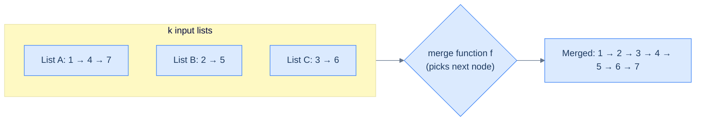
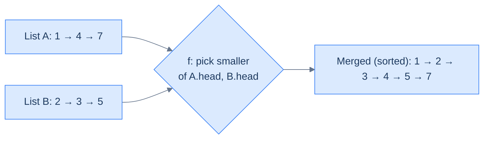
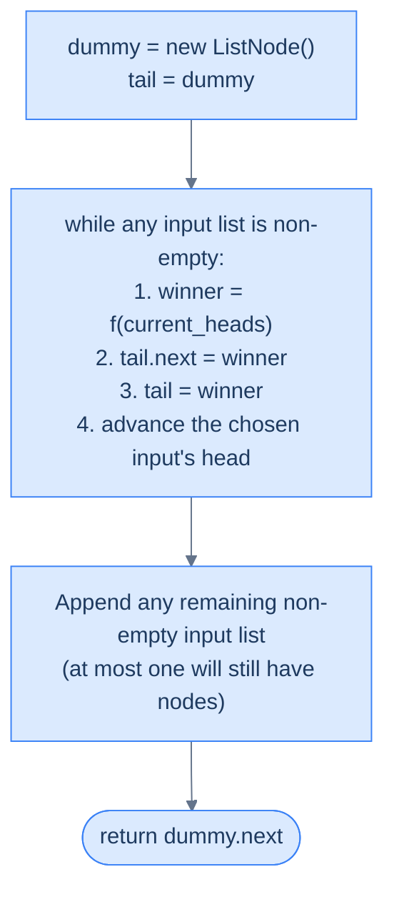
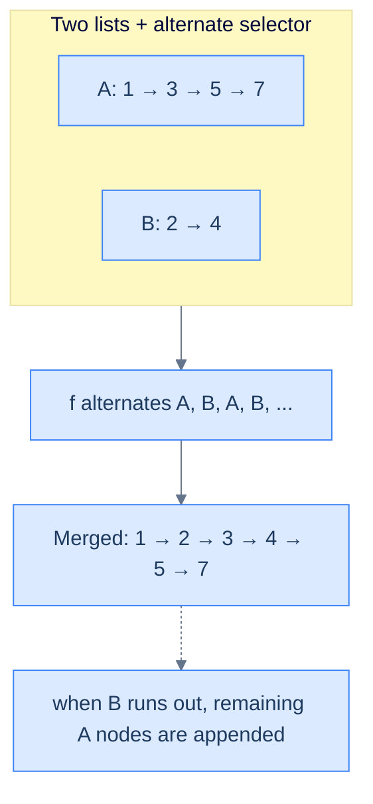
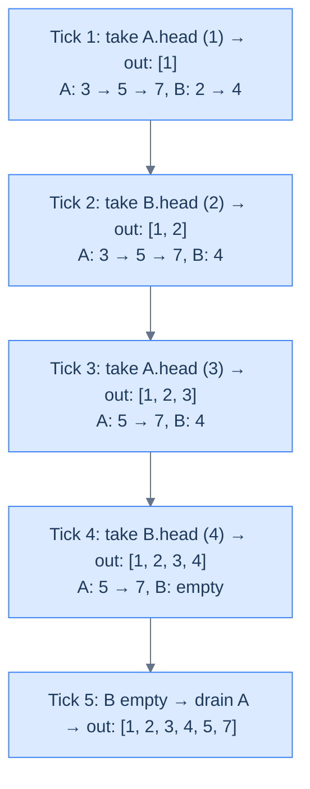

# 11. Pattern: Merge

## The Hook

Lesson 10 taught you how to tear a list apart. This one teaches you how to sew lists back together — and between these two primitives you have the core of **merge sort**, the reason lists are the perfect target for divide-and-conquer sorting.

Merging two sorted lists into one sorted list is the "merge" in "merge sort". The naive plan: copy both lists into an array, run array merge, build a new list from the result. O(n) extra memory, two copies, three passes. You can do better. Walk both lists with two pointers, at every step take the smaller head and splice it onto the output, advance that pointer, repeat. **O(n + m) time, O(1) extra memory, original nodes re-used**. The entire merge is a ten-line loop around a dummy head.

The same skeleton generalises: alternate-fuse, k-way merge (with a heap), add-two-numbers-as-lists, merge-and-deduplicate. Every variant differs in exactly one place — the **selector function** that picks which input contributes the next node. Master the skeleton once and you'll hand-code every merge variant without referring to a textbook ever again.

---

## Table of contents

1. [Understanding the merge pattern](#understanding-the-merge-pattern)
2. [Identifying the merge pattern](#identifying-the-merge-pattern)
3. [Alternate node fusion](#alternate-node-fusion)
4. [Merge sorted lists](#merge-sorted-lists)
5. [Merge sorted lists II](#merge-sorted-lists-ii)
6. [List addition](#list-addition)

***

# Understanding the merge pattern

Like splitting a linked list into multiple lists, many linked list problems require merging multiple linked lists into one based on the outcome of some function. Also, in most cases, we must merge the lists by moving around the original nodes instead of creating copies. The linked list merging technique traverses multiple lists simultaneously and merges them in a single pass.

The merge pattern is a classification of problems that can be solved using the linked list merging technique.



<p align="center"><strong>The merge pattern — multiple input lists flow through a selector <code>f</code> that picks "who goes next" and appends to a single output. The selector is where each merge variant differs; the splicing skeleton is universal.</strong></p>

## Linked list merging technique

We will learn the merge technique for two lists, but it can be easily extended to merge `k` lists. Consider that we are given two singly linked lists denoted by `headA` and `headB`, and we have to merge them into a single list based on the output of some function `f`. Given any two nodes, one from each list, the function `f` decides which node goes before the other node in the merged list.



<p align="center"><strong>Swap out <code>f</code> and you change the problem entirely. "Pick the smaller head" → sorted-list merge. "Alternate A, B, A, B" → interleave. "Pick by summed digit" → list-addition. Same template, different selector.</strong></p>

The merge technique uses a dummy node to simplify the merging algorithm. We create a `dummy` node and a reference variable `tail` which we initialize with it. We create two references `currentA` and `currentB` and initialize them with `headA` and `headB` which we use to traverse the respective lists. We then simultaneously traverse both lists using these references and, in each iteration, apply the function `f` on nodes held in `currentA` and `currentB` to decide which node should be added to the merged list. We use the `tail` reference to easily add the node at the end of the merged list, update `tail`, and move ahead either `currentA` or `currentB` accordingly.

If either `currentA` or `currentB` hits `null`, it means we have traversed one of the lists completely, and we terminate the iterations. At this point, we identify the list that is not completely traversed and add the remaining nodes at the end of the merged lists to completely merge both lists. Consider the example below where the function `f` is a simple function that alternates (round robin) between both lists to select the node that goes to the merged list.



<p align="center"><strong>The universal merge skeleton. A dummy head turns "is this the first output?" into a non-question. Each iteration, the selector <code>f</code> picks a winner, splices it, advances the input, and repeats. The drain step stitches on any leftover suffix when one input runs dry first.</strong></p>

Finally, we delete the dummy node and return the reference of the node after it as the real head of the merged list.

## Algorithm

The algorithm given below summarizes the linked list merge technique for two lists. It can be easily extended for `k` lists.

> **Algorithm**
>
> -   **Step 1:** Create a `dummy` node and initialize a `tail` reference with it.
> -   **Step 2:** Create two references `currentA` and `currentB` and initialize them with `headA` and `headB` respectively.
> -   **Step 3:** Loop while `currentA` != `null` and `currentB` != `null` and do the following:
>     -   **Step 3.1:** Apply the function `f` to the node held in `currentA` and `currentB` to decide which node to add to the merged list.
>     -   **Step 3.2:** If `currentA` has to be added, add it to the end of the merged list by updating `tail` and moving `currentA` ahead.
>     -   **Step 3.3:** If `currentB` has to be added, add it to the end of the merged list by updating `tail` and moving `currentB` ahead.
>     -   **Step 4:** If `currentA` != `null` attach the remaining list to the merged list using `tail`
>     -   **Step 5:** If `currentB` != `null` attach the remaining list to the merged list using `tail`
>     -   **Step 6:** Delete the `dummy` node and return the next node as real head of merged list.

## Implementation

Given below is the generic code implementation to merge two lists into a single list based on the outcome of a function `f`.


```pseudocode
# Generic merge template. `pickA` decides which side wins each step.
function mergeLists(headA, headB, pickA):
    dummy ← new ListNode; tail ← dummy
    curA ← headA; curB ← headB
    while curA is not null AND curB is not null:
        if pickA(curA, curB):
            tail.next ← curA; curA ← curA.next
        else:
            tail.next ← curB; curB ← curB.next
        tail ← tail.next
    tail.next ← curA if curA is not null else curB        # splice the leftover suffix in O(1)
    return dummy.next
```

```python run
from typing import Callable, Optional

class ListNode:
    def __init__(self, val=0, next=None):
        self.val = val
        self.next = next

def merge_lists(head_a: Optional[ListNode], head_b: Optional[ListNode],
                pick_a: Callable[[ListNode, ListNode], bool]) -> Optional[ListNode]:
    # Dummy + tail — eliminates the "first output" special case
    dummy = ListNode()
    tail  = dummy

    cur_a, cur_b = head_a, head_b
    while cur_a is not None and cur_b is not None:
        if pick_a(cur_a, cur_b):            # selector decides the winner
            tail.next = cur_a
            cur_a     = cur_a.next
        else:
            tail.next = cur_b
            cur_b     = cur_b.next
        tail = tail.next                    # advance tail onto the winner

    # Drain — at most one of these is non-empty; splice its suffix in O(1)
    tail.next = cur_a if cur_a is not None else cur_b
    return dummy.next
```

```java run
import java.util.function.BiPredicate;

class Solution {
    public ListNode mergeLists(ListNode headA, ListNode headB, BiPredicate<ListNode, ListNode> pickA) {
        ListNode dummy = new ListNode();
        ListNode tail  = dummy;

        ListNode cA = headA, cB = headB;
        while (cA != null && cB != null) {
            if (pickA.test(cA, cB)) { tail.next = cA; cA = cA.next; }
            else                    { tail.next = cB; cB = cB.next; }
            tail = tail.next;
        }
        tail.next = (cA != null) ? cA : cB;
        return dummy.next;
    }
}
```

```c run
typedef struct ListNode { int val; struct ListNode *next; } ListNode;

ListNode* mergeLists(ListNode *headA, ListNode *headB, int (*pickA)(ListNode*, ListNode*)) {
    ListNode dummy = {0, NULL};
    ListNode *tail = &dummy;

    ListNode *cA = headA, *cB = headB;
    while (cA != NULL && cB != NULL) {
        if (pickA(cA, cB)) { tail->next = cA; cA = cA->next; }
        else                { tail->next = cB; cB = cB->next; }
        tail = tail->next;
    }
    tail->next = (cA != NULL) ? cA : cB;
    return dummy.next;
}
```

```scala run
object Solution {
  def mergeLists(headA: ListNode, headB: ListNode, pickA: (ListNode, ListNode) => Boolean): ListNode = {
    val dummy = new ListNode(0)
    var tail: ListNode = dummy

    var cA = headA; var cB = headB
    while (cA != null && cB != null) {
      if (pickA(cA, cB)) { tail.next = cA; cA = cA.next }
      else                { tail.next = cB; cB = cB.next }
      tail = tail.next
    }
    tail.next = if (cA != null) cA else cB
    dummy.next
  }
}
```


## Complexity Analysis

The runtime and space complexity for merging two lists are pretty easy to understand. We traverse both lists together until either one is traversed completely. In the worst case, we may have to traverse both lists completely, with a linear runtime complexity of **O(N + M)**,where **N** and **M** are the lengths of the two linked lists. In the best case, one list may be empty, and we merge the other by updating references in constant time so the runtime complexity would be constant **O(1)**.

We only create a dummy node and update references to merge the lists, so the space complexity is constant, O(1), in any case.

> **Best Case:** One list is empty
>
> -   Space Complexity - **O(1)**
> -   Time Complexity - **O(1)**
>
> **Worst Case:** Both lists completely traversed
>
> -   Space Complexity - **O(1)**
> -   Time Complexity - **O(N+M)**

***

# Identifying the merge pattern

The linked list merge technique can only be applied to some specific problems. These are generally easy or medium problems where we merge multiple lists into a single list based on the outcome of some function `f`.  Sometimes, there may be more than one way to solve such problems; however, using the merge technique often has the cleanest and most straightforward solution. If the problem statement or its solution follows the generic template below, it can be solved by applying the merge technique.

**Template:**

Given `k` linked lists, merge them into a single list based on the outcome of some function `f`.

## Example

Let's consider the following problem as an example to better understand how to identify and solve a problem using the merge technique.

> **Problem statement:** Given two singly linked lists, merge them by splicing alternate nodes from both lists together. The merged list should start with the first node of the first list.

```d2
direction: right

before: Two input lists {
  a: List A {
    direction: right
    a1: "1"
    a2: "3"
    a3: "5"
    a1 -> a2
    a2 -> a3
  }
  b: List B {
    direction: right
    b1: "2"
    b2: "4"
    b3: "6"
    b1 -> b2
    b2 -> b3
  }
}

after: "Spliced (sorted merge)" {
  direction: right
  c1: "1"
  c2: "2"
  c3: "3"
  c4: "4"
  c5: "5"
  c6: "6"
  c1 -> c2
  c2 -> c3
  c3 -> c4
  c4 -> c5
  c5 -> c6
}

before -> after
```

<p align="center"><strong>Merging splices the original nodes — no new nodes allocated. The six nodes above are the same six objects before and after; only their <code>.next</code> pointers have been rewired into a single chain.</strong></p>

### Merge technique solution

We need to merge two lists to create a merged list; this fits the generic template from the merge pattern we learned earlier.

**Template:**



<p align="center"><strong>Alternate-node fusion — selector <code>f</code> flips a boolean each step. When one list runs out, the other's remaining suffix is appended whole.</strong></p>

We use the merge technique by creating a `dummy` node and `tail` reference for the merged list and iterating both lists using two references `currentA` and `currentB`. We also create a boolean variable `mergeFirst` to decide if the node from the first list should be added to the merged list and initialize it to `true`. In each iteration, we flip the value of `mergeFirst` to choose a node from the other list in subsequent iterations.

At the end of all iterations we check if either of the lists is not completely traversed and attach any remaining nodes to the end of the merged list. Finally, we delete the dummy node and return the real head of the merged list.



<p align="center"><strong>Trace — alternate merge of A = [1, 3, 5, 7] and B = [2, 4]. The boolean flip drives the selector; when one list empties, the drain step appends the other's suffix in one splice.</strong></p>

The implementation of the merge list solution is given as follows.


```pseudocode
function alternateNodeFusion(headA, headB):
    dummy ← new ListNode; tail ← dummy
    cA ← headA; cB ← headB
    takeFromA ← true
    while cA is not null AND cB is not null:
        if takeFromA: tail.next ← cA; cA ← cA.next
        else:         tail.next ← cB; cB ← cB.next
        tail ← tail.next
        takeFromA ← NOT takeFromA
    tail.next ← cA if cA is not null else cB
    return dummy.next
```

```python run
from typing import Optional

class Solution:
    def alternate_node_fusion(self, head_a: Optional[ListNode], head_b: Optional[ListNode]) -> Optional[ListNode]:
        dummy = ListNode()
        tail  = dummy
        cA, cB = head_a, head_b
        take_from_a = True                      # boolean flips each iteration
        while cA is not None and cB is not None:
            if take_from_a:
                tail.next = cA; cA = cA.next
            else:
                tail.next = cB; cB = cB.next
            tail        = tail.next
            take_from_a = not take_from_a
        tail.next = cA if cA is not None else cB
        return dummy.next
```

```java run
class Solution {
    public ListNode alternateNodeFusion(ListNode headA, ListNode headB) {
        ListNode dummy = new ListNode(), tail = dummy;
        ListNode cA = headA, cB = headB;
        boolean takeFromA = true;
        while (cA != null && cB != null) {
            if (takeFromA) { tail.next = cA; cA = cA.next; }
            else            { tail.next = cB; cB = cB.next; }
            tail       = tail.next;
            takeFromA  = !takeFromA;
        }
        tail.next = (cA != null) ? cA : cB;
        return dummy.next;
    }
}
```

```c run
ListNode* alternateNodeFusion(ListNode *headA, ListNode *headB) {
    ListNode dummy = {0, NULL};
    ListNode *tail = &dummy;
    ListNode *cA = headA, *cB = headB;
    int takeFromA = 1;
    while (cA != NULL && cB != NULL) {
        if (takeFromA) { tail->next = cA; cA = cA->next; }
        else            { tail->next = cB; cB = cB->next; }
        tail      = tail->next;
        takeFromA = !takeFromA;
    }
    tail->next = (cA != NULL) ? cA : cB;
    return dummy.next;
}
```

```scala run
object Solution {
  def alternateNodeFusion(headA: ListNode, headB: ListNode): ListNode = {
    val dummy = new ListNode(0)
    var tail: ListNode = dummy
    var cA = headA; var cB = headB
    var takeFromA = true
    while (cA != null && cB != null) {
      if (takeFromA) { tail.next = cA; cA = cA.next }
      else            { tail.next = cB; cB = cB.next }
      tail      = tail.next
      takeFromA = !takeFromA
    }
    tail.next = if (cA != null) cA else cB
    dummy.next
  }
}
```


The above implementation uses the template code of the merge technique to merge two lists into a single list in a single pass.

## Example problems

Most problems that fall under this category are **easy** or **medium** problems where we need to merge two lists. Most of the time, it is easy to identify problems that can be solved using the merge technique. A list of a few such problems is given below.

> -   **[Alternate node fusion](#alternate-node-fusion)**
> -   **[Merge sorted lists](#merge-sorted-lists)**
> -   **[Merge sorted lists II](#merge-sorted-lists-ii)**
> -   **[List addition](#list-addition)**

We will now solve these problems to understand the merge technique better.

***

# Alternate node fusion

## Problem Statement

Given the heads of two linked lists, **headA** and **headB**, write a function to merge the two lists into one by splicing together the alternate nodes of each list and return the head of the merged list.

You should take the first node of the first list (with the head as headA) as the first node of the result list. If there are no more nodes left in any one of the lists, append the remaining nodes from the other list to the end of the result in the same order as they appear.

### Example 1

> -   **Input:** headA = \[1, 2, 3\], headB = \[4, 5, 6\]
> -   **Output:** \[1, 4, 2, 5, 3, 6\]
> -   **Explanation:** After merging the alternate nodes of the two lists starting from the first list, we get \[1, 4, 2, 5, 3, 6\].

### Example 2

> -   **Input:** headA = \[1, 2, 3, 4, 5\], headB = \[6, 7\]
> -   **Output:** \[1, 6, 2, 7, 3, 4, 5\]
> -   **Explanation:** After merging the alternate nodes of the two lists starting from the first list, we get \[1, 6, 2, 7, 3, 4, 5\]. Since the second list is smaller than the first node, we merge the remaining nodes, i.e., 3, 4, 5, at the end of the result list.

## Solution


```pseudocode
function alternateNodeFusion(headA, headB):
    # Create a new dummy node as the head of the merged list
    dummy ← new ListNode; tail ← dummy
    currentA ← headA; currentB ← headB
    mergeFirst ← true
    # Merge alternate nodes from both lists
    while currentA is not null AND currentB is not null:
        if mergeFirst:
            tail.next ← currentA; currentA ← currentA.next
        else:
            tail.next ← currentB; currentB ← currentB.next
        tail ← tail.next
        mergeFirst ← NOT mergeFirst
    # Attach any remaining nodes from the longer list
    tail.next ← currentA if currentA is not null else currentB
    return dummy.next
```

```python run
from typing import Optional

class Solution:
    def alternate_node_fusion(
        self, head_a: Optional[ListNode], head_b: Optional[ListNode]
    ) -> Optional[ListNode]:

        # Create a new dummy node as the head of the merged list
        dummy = ListNode(0)
        tail = dummy

        current_a = head_a
        current_b = head_b

        merge_first = True

        # Merge alternate nodes from both lists
        while current_a is not None and current_b is not None:

            # If merge_first is true, attach the current node from
            # current_a to the merged list
            if merge_first:

                # Attach the current node from current_a to the merged
                # list
                tail.next = current_a

                # Move current_a to the next node
                current_a = current_a.next

                # Move the tail pointer to the newly attached node
                tail = tail.next

            # Otherwise, attach the current node from current_b to the
            # merged list
            else:

                # Attach the current node from current_b to the merged
                # list
                tail.next = current_b

                # Move current_b to the next node
                current_b = current_b.next

                # Move the tail pointer to the newly attached node
                tail = tail.next

            # Toggle between lists
            merge_first = not merge_first

        # If there are any remaining nodes in current_a, attach them to
        # the merged list
        if current_a is not None:
            tail.next = current_a

        # else if there are any remaining nodes in current_b, attach
        # them to the merged list
        elif current_b is not None:
            tail.next = current_b

        # Return the merged list starting from the node after the
        # dummy node
        return dummy.next
```

```java run
class Solution {
    public ListNode alternateNodeFusion(ListNode headA, ListNode headB) {

        // Create a new dummy node as the head of the merged list
        ListNode dummy = new ListNode(0);
        ListNode tail = dummy;

        ListNode currentA = headA;
        ListNode currentB = headB;

        boolean mergeFirst = true;

        // Merge alternate nodes from both lists
        while (currentA != null && currentB != null) {

            // If mergeFirst is true, attach the current node from
            // currentA to the merged list
            if (mergeFirst) {

                // Attach the current node from currentA to the merged
                // list
                tail.next = currentA;

                // Move currentA to the next node
                currentA = currentA.next;

                // Move the tail pointer to the newly attached node
                tail = tail.next;
            }

            // Otherwise, attach the current node from currentB to the
            // merged list
            else {

                // Attach the current node from currentB to the merged
                // list
                tail.next = currentB;

                // Move currentB to the next node
                currentB = currentB.next;

                // Move the tail pointer to the newly attached node
                tail = tail.next;
            }

            // Toggle between lists
            mergeFirst = !mergeFirst;
        }

        // If there are any remaining nodes in currentA, attach them to
        // the merged list
        if (currentA != null) {
            tail.next = currentA;
        }

        // Else if there are any remaining nodes in currentB, attach
        // them to the merged list
        else if (currentB != null) {
            tail.next = currentB;
        }

        // Return the merged list starting from the node after the
        // dummy node
        return dummy.next;
    }
}
```

```c run
ListNode* alternateNodeFusion(ListNode *headA, ListNode *headB) {

    /* Create a new dummy node as the head of the merged list */
    ListNode dummy = {0, NULL};
    ListNode *tail = &dummy;

    ListNode *currentA = headA;
    ListNode *currentB = headB;

    int mergeFirst = 1;

    /* Merge alternate nodes from both lists */
    while (currentA != NULL && currentB != NULL) {

        /* If mergeFirst is true, attach the current node from
           currentA to the merged list */
        if (mergeFirst) {

            /* Attach the current node from currentA to the merged
               list */
            tail->next = currentA;

            /* Move currentA to the next node */
            currentA = currentA->next;

            /* Move the tail pointer to the newly attached node */
            tail = tail->next;
        }

        /* Otherwise, attach the current node from currentB to the
           merged list */
        else {

            /* Attach the current node from currentB to the merged
               list */
            tail->next = currentB;

            /* Move currentB to the next node */
            currentB = currentB->next;

            /* Move the tail pointer to the newly attached node */
            tail = tail->next;
        }

        /* Toggle between lists */
        mergeFirst = !mergeFirst;
    }

    /* If there are any remaining nodes in currentA, attach them to
       the merged list */
    if (currentA != NULL) {
        tail->next = currentA;
    }

    /* Else if there are any remaining nodes in currentB, attach
       them to the merged list */
    else if (currentB != NULL) {
        tail->next = currentB;
    }

    /* Return the merged list starting from the node after the
       dummy node */
    return dummy.next;
}
```

```scala run
object Solution {
  def alternateNodeFusion(headA: ListNode, headB: ListNode): ListNode = {

    // Create a new dummy node as the head of the merged list
    val dummy = new ListNode(0)
    var tail: ListNode = dummy

    var currentA = headA
    var currentB = headB

    var mergeFirst = true

    // Merge alternate nodes from both lists
    while (currentA != null && currentB != null) {

      // If mergeFirst is true, attach the current node from currentA
      // to the merged list
      if (mergeFirst) {

        // Attach the current node from currentA to the merged list
        tail.next = currentA

        // Move currentA to the next node
        currentA = currentA.next

        // Move the tail pointer to the newly attached node
        tail = tail.next
      }
      // Otherwise, attach the current node from currentB to the
      // merged list
      else {

        // Attach the current node from currentB to the merged list
        tail.next = currentB

        // Move currentB to the next node
        currentB = currentB.next

        // Move the tail pointer to the newly attached node
        tail = tail.next
      }

      // Toggle between lists
      mergeFirst = !mergeFirst
    }

    // If there are any remaining nodes in currentA, attach them to
    // the merged list
    if (currentA != null) tail.next = currentA
    // Else if there are any remaining nodes in currentB, attach them
    // to the merged list
    else if (currentB != null) tail.next = currentB

    // Return the merged list starting from the node after the dummy
    // node
    dummy.next
  }
}
```


***

# Merge sorted lists

## Problem Statement

Given the heads of two sorted linked lists **headA** and **headB**, write a function to merge the two lists into one sorted list by splicing together the nodes of each list and return the head of the merged linked list.

### Example 1

> -   **Input:** headA = \[1, 2, 4\], headB = \[1, 3, 4\]
> -   **Output:** \[1, 1, 2, 3, 4, 4\]
> -   **Explanation:** After merging the list in sorted order, the resulting list will be \[1, 1, 2, 3, 4, 4\].

### Example 2

> -   **Input:** headA = \[1, 2, 3, 8, 9\], headB = \[6, 7\]
> -   **Output:** \[1, 2, 3, 6, 7, 8, 9\]
> -   **Explanation:** After merging the list in sorted order, the resulting list will be \[1, 2, 3, 6, 7, 8, 9\].

### Example 3

> -   **Input:** headA = \[1, 3, 5, 6, 7\], headB = \[2, 4\]
> -   **Output:** \[1, 2, 3, 4, 5, 6, 7\]
> -   **Explanation:** After merging the list in sorted order, the resulting list will be \[1, 2, 3, 4, 5, 6, 7\].

## Solution


```pseudocode
function mergeSortedLists(headA, headB):
    # Create a dummy node and initialize the tail pointer
    dummy ← new ListNode; tail ← dummy
    currentA ← headA; currentB ← headB
    # Traverse both lists until one of them becomes empty
    while currentA is not null AND currentB is not null:
        # Pick the smaller head; ties go to list A
        if currentA.val ≤ currentB.val:
            tail.next ← currentA; currentA ← currentA.next
        else:
            tail.next ← currentB; currentB ← currentB.next
        # Move the tail pointer forward
        tail ← tail.next
    # Append the remaining nodes from the non-empty list
    tail.next ← currentA if currentA is not null else currentB
    return dummy.next
```

```python run
from typing import Optional

class Solution:
    def merge_sorted_lists(
        self, head_a: Optional[ListNode], head_b: Optional[ListNode]
    ) -> Optional[ListNode]:

        # Create a dummy node and initialize the tail pointer
        dummy = ListNode(0)
        tail = dummy

        current_a = head_a
        current_b = head_b

        # Traverse both lists until one of them becomes empty
        while current_a is not None and current_b is not None:

            # If the value of the current node in list A is less than
            # or equal to the value of the current node in list B,
            # append the current node from list A to the merged list
            if current_a.val <= current_b.val:
                tail.next = current_a
                current_a = current_a.next

            # Otherwise, append the current node from list B to the
            # merged
            else:
                tail.next = current_b
                current_b = current_b.next

            # Move the tail pointer forward
            tail = tail.next

        # Append the remaining nodes from the non-empty list to the
        # merged list
        if current_a is not None:
            tail.next = current_a

        # Else if there are any remaining nodes in current_b, attach
        # them to the merged list
        elif current_b is not None:
            tail.next = current_b

        # Return the merged list (excluding the dummy node)
        return dummy.next
```

```java run
class Solution {
    public ListNode mergeSortedLists(ListNode headA, ListNode headB) {

        // Create a dummy node and initialize the tail pointer
        ListNode dummy = new ListNode(0);
        ListNode tail = dummy;

        ListNode currentA = headA;
        ListNode currentB = headB;

        // Traverse both lists until one of them becomes empty
        while (currentA != null && currentB != null) {

            // If the value of the current node in list A is less than
            // or equal to the value of the current node in list B,
            // append the current node from list A to the merged list
            if (currentA.val <= currentB.val) {
                tail.next = currentA;
                currentA = currentA.next;
            }

            // Otherwise, append the current node from list B to the
            // merged
            else {
                tail.next = currentB;
                currentB = currentB.next;
            }

            // Move the tail pointer forward
            tail = tail.next;
        }

        // Append the remaining nodes from the non-empty list to the
        // merged list
        if (currentA != null) {
            tail.next = currentA;
        }

        // Else if there are any remaining nodes in currentB, attach
        // them to the merged list
        else if (currentB != null) {
            tail.next = currentB;
        }

        // Return the merged list (excluding the dummy node)
        return dummy.next;
    }
}
```

```c run
ListNode* mergeSortedLists(ListNode *headA, ListNode *headB) {

    /* Create a dummy node and initialize the tail pointer */
    ListNode dummy = {0, NULL};
    ListNode *tail = &dummy;

    ListNode *currentA = headA;
    ListNode *currentB = headB;

    /* Traverse both lists until one of them becomes empty */
    while (currentA != NULL && currentB != NULL) {

        /* If the value of the current node in list A is less than
           or equal to the value of the current node in list B,
           append the current node from list A to the merged list */
        if (currentA->val <= currentB->val) {
            tail->next = currentA;
            currentA = currentA->next;
        }

        /* Otherwise, append the current node from list B to the
           merged */
        else {
            tail->next = currentB;
            currentB = currentB->next;
        }

        /* Move the tail pointer forward */
        tail = tail->next;
    }

    /* Append the remaining nodes from the non-empty list to the
       merged list */
    if (currentA != NULL) {
        tail->next = currentA;
    }

    /* Else if there are any remaining nodes in currentB, attach
       them to the merged list */
    else if (currentB != NULL) {
        tail->next = currentB;
    }

    /* Return the merged list (excluding the dummy node) */
    return dummy.next;
}
```

```scala run
object Solution {
  def mergeSortedLists(headA: ListNode, headB: ListNode): ListNode = {

    // Create a dummy node and initialize the tail pointer
    val dummy = new ListNode(0)
    var tail: ListNode = dummy

    var currentA = headA
    var currentB = headB

    // Traverse both lists until one of them becomes empty
    while (currentA != null && currentB != null) {

      // If the value of the current node in list A is less than or
      // equal to the value of the current node in list B, append
      // the current node from list A to the merged list
      if (currentA.val <= currentB.val) {
        tail.next = currentA
        currentA = currentA.next
      }
      // Otherwise, append the current node from list B to the merged
      else {
        tail.next = currentB
        currentB = currentB.next
      }

      // Move the tail pointer forward
      tail = tail.next
    }

    // Append the remaining nodes from the non-empty list to the
    // merged list
    if (currentA != null) tail.next = currentA
    // Else if there are any remaining nodes in currentB, attach them
    // to the merged list
    else if (currentB != null) tail.next = currentB

    // Return the merged list (excluding the dummy node)
    dummy.next
  }
}
```


***

# Merge sorted lists II

## Problem Statement

Given the heads of two sorted linked lists, **headA** and **headB**, write a function to merge the two lists into one sorted list by splicing together the nodes of each list in **descending** **order** and return the head of the merged linked list.

### Example 1

> -   **Input:** headA = \[1, 2, 4\], headB = \[1, 3, 4\]
> -   **Output:** \[4, 4, 3, 2, 1, 1\]
> -   **Explanation:** After merging the lists in descending order, the resulting list will be \[4, 4, 3, 2, 1, 1\].

### Example 2

> -   **Input:** headA = \[1, 2, 3, 8, 9\], headB = \[6, 7\]
> -   **Output:** \[9, 8, 7, 6, 3, 2, 1\]
> -   **Explanation:** After merging the lists in descending order, the resulting list will be \[9, 8, 7, 6, 3, 2, 1\].

### Example 3

> -   **Input:** headA = \[1, 3, 5, 6, 7\], headB = \[2, 4\]
> -   **Output:** \[7, 6, 5, 4, 3, 2, 1\]
> -   **Explanation:** After merging the lists in descending order, the resulting list will be \[7, 6, 5, 4, 3, 2, 1\].

## Solution


```pseudocode
# Merge two DESCENDING-sorted lists into a descending result. Reverse both → ascending lists,
# then pick the LARGER head each step.
function reverse(head):
    prev ← null; cur ← head
    while cur is not null:
        nxt ← cur.next
        cur.next ← prev
        prev ← cur; cur ← nxt
    return prev

function mergeSortedListsII(headA, headB):
    a ← reverse(headA); b ← reverse(headB)
    dummy ← new ListNode; tail ← dummy
    while a is not null AND b is not null:
        if a.val ≥ b.val:
            tail.next ← a; a ← a.next
        else:
            tail.next ← b; b ← b.next
        tail ← tail.next
    tail.next ← a if a is not null else b
    return dummy.next
```

```python run
from typing import Optional

class Solution:
    def _reverse(self, head: Optional[ListNode]) -> Optional[ListNode]:
        prev, cur = None, head
        while cur is not None:
            nxt = cur.next
            cur.next = prev
            prev, cur = cur, nxt
        return prev

    def merge_sorted_lists_ii(self, head_a: Optional[ListNode], head_b: Optional[ListNode]) -> Optional[ListNode]:
        # Reverse both inputs so they become descending, then pick the larger head each tick
        a, b = self._reverse(head_a), self._reverse(head_b)
        dummy = ListNode()
        tail  = dummy
        while a is not None and b is not None:
            if a.val >= b.val:
                tail.next = a; a = a.next
            else:
                tail.next = b; b = b.next
            tail = tail.next
        tail.next = a if a is not None else b
        return dummy.next
```

```java run
class Solution {
    private ListNode reverse(ListNode head) {
        ListNode prev = null, cur = head;
        while (cur != null) { ListNode nxt = cur.next; cur.next = prev; prev = cur; cur = nxt; }
        return prev;
    }

    public ListNode mergeSortedListsII(ListNode headA, ListNode headB) {
        ListNode a = reverse(headA), b = reverse(headB);
        ListNode dummy = new ListNode(), tail = dummy;
        while (a != null && b != null) {
            if (a.val >= b.val) { tail.next = a; a = a.next; }
            else                 { tail.next = b; b = b.next; }
            tail = tail.next;
        }
        tail.next = (a != null) ? a : b;
        return dummy.next;
    }
}
```

```c run
static ListNode* rev_list(ListNode *h) {
    ListNode *prev = NULL, *cur = h;
    while (cur) { ListNode *nxt = cur->next; cur->next = prev; prev = cur; cur = nxt; }
    return prev;
}

ListNode* mergeSortedListsII(ListNode *headA, ListNode *headB) {
    ListNode *a = rev_list(headA), *b = rev_list(headB);
    ListNode dummy = {0, NULL};
    ListNode *tail = &dummy;
    while (a != NULL && b != NULL) {
        if (a->val >= b->val) { tail->next = a; a = a->next; }
        else                   { tail->next = b; b = b->next; }
        tail = tail->next;
    }
    tail->next = (a != NULL) ? a : b;
    return dummy.next;
}
```

```scala run
object Solution {
  private def rev(h: ListNode): ListNode = {
    var prev: ListNode = null; var cur = h
    while (cur != null) { val nxt = cur.next; cur.next = prev; prev = cur; cur = nxt }
    prev
  }

  def mergeSortedListsII(headA: ListNode, headB: ListNode): ListNode = {
    var a = rev(headA); var b = rev(headB)
    val dummy = new ListNode(0); var tail: ListNode = dummy
    while (a != null && b != null) {
      if (a.v >= b.v) { tail.next = a; a = a.next }
      else             { tail.next = b; b = b.next }
      tail = tail.next
    }
    tail.next = if (a != null) a else b
    dummy.next
  }
}
```


***

# List addition

## Problem Statement

Given **heads** of two non-empty singly linked lists **headA** and **headB**, representing two non-negative integers where the value in every node represents a single digit. The numbers stored in the lists are in reverse order. Write a function to return the head of a new list that contains the sum of the two given lists.

### Example 1

> -   **Input:** headA = \[2, 4, 3\], headB = \[5, 6, 4\]
> -   **Output:** \[7, 0, 8\]
> -   **Explanation:** Adding 342 to 465 gives 807. Therefore, the output list will be \[7, 0, 8\].

### Example 2

> -   **Input:** headA = \[9, 8, 7\], headB = \[4, 3, 7\]
> -   **Output:** \[3, 2, 5, 1\]
> -   **Explanation:** Adding 789 to 734 gives 1523. Therefore, the output list will be \[3, 2, 5, 1\].

### Example 3

> -   **Input:** headA = \[0\], headB = \[0\]
> -   **Output:** \[0\]
> -   **Explanation:** Adding 0 to 0 gives 0. Therefore, the output list will be \[0\].

## Solution


```pseudocode
# Add two numbers stored as linked lists (least-significant digit first). Carry-propagating loop.
# Loop stops only when BOTH inputs are exhausted AND there's no pending carry.
function listAddition(headA, headB):
    dummy ← new ListNode; tail ← dummy
    cA ← headA; cB ← headB
    carry ← 0
    while cA is not null OR cB is not null OR carry > 0:
        s ← carry
        if cA is not null: s ← s + cA.val; cA ← cA.next
        if cB is not null: s ← s + cB.val; cB ← cB.next
        carry ← s ÷ 10
        tail.next ← new ListNode(s mod 10)
        tail ← tail.next
    return dummy.next
```

```python run
from typing import Optional

class Solution:
    def list_addition(self, head_a: Optional[ListNode], head_b: Optional[ListNode]) -> Optional[ListNode]:
        dummy = ListNode()
        tail  = dummy
        cA, cB = head_a, head_b
        carry = 0
        # The loop stops only when BOTH inputs are exhausted AND there's no pending carry
        while cA is not None or cB is not None or carry > 0:
            s = carry
            if cA is not None: s += cA.val; cA = cA.next
            if cB is not None: s += cB.val; cB = cB.next
            carry     = s // 10
            tail.next = ListNode(s % 10)
            tail      = tail.next
        return dummy.next
```

```java run
class Solution {
    public ListNode listAddition(ListNode headA, ListNode headB) {
        ListNode dummy = new ListNode(), tail = dummy;
        ListNode cA = headA, cB = headB;
        int carry = 0;
        while (cA != null || cB != null || carry > 0) {
            int s = carry;
            if (cA != null) { s += cA.val; cA = cA.next; }
            if (cB != null) { s += cB.val; cB = cB.next; }
            carry     = s / 10;
            tail.next = new ListNode(s % 10);
            tail      = tail.next;
        }
        return dummy.next;
    }
}
```

```c run
ListNode* listAddition(ListNode *headA, ListNode *headB) {
    ListNode dummy = {0, NULL};
    ListNode *tail = &dummy;
    int carry = 0;
    while (headA != NULL || headB != NULL || carry > 0) {
        int s = carry;
        if (headA != NULL) { s += headA->val; headA = headA->next; }
        if (headB != NULL) { s += headB->val; headB = headB->next; }
        carry     = s / 10;
        ListNode *n = (ListNode*)malloc(sizeof(ListNode));
        n->val = s % 10; n->next = NULL;
        tail->next = n;
        tail       = n;
    }
    return dummy.next;
}
```

```scala run
object Solution {
  def listAddition(headA: ListNode, headB: ListNode): ListNode = {
    val dummy = new ListNode(0)
    var tail: ListNode = dummy
    var a = headA; var b = headB
    var carry = 0
    while (a != null || b != null || carry > 0) {
      var s = carry
      if (a != null) { s += a.v; a = a.next }
      if (b != null) { s += b.v; b = b.next }
      carry = s / 10
      tail.next = new ListNode(s % 10)
      tail = tail.next
    }
    dummy.next
  }
}
```


***

## Final Takeaway

Merge is the dual of split. Where split routed nodes from one list into `k` outputs by a classifier, merge routes nodes from `k` inputs into one output by a selector. The template:

```
dummy = ListNode()
tail  = dummy
while any_input_non_empty():
    winner = select_next(current_heads)   # <-- the only problem-specific line
    tail.next = winner
    tail      = winner
    advance_head_of(winner)
drain_any_remaining_input(tail)
return dummy.next
```

Four insights worth burning in:

| Insight | Why it matters |
|---|---|
| Dummy head + tail pointer | Same trick as the split pattern. No "first node" special case; every iteration is a uniform three-line splice. |
| The selector is the whole problem | `pick smaller head` → sorted merge. `alternate A, B, A, B` → interleave. `pick by digit sum` → list addition. `pick min via heap` → k-way merge. Swap out the selector; skeleton stays. |
| Drain the leftover suffix in O(1) | When one input empties first, the other input's remaining nodes are already correctly linked — just splice the whole suffix in one pointer assignment. Don't loop through it node-by-node. |
| Merge is O(n + m) because every node is visited exactly once | No comparisons are wasted. Every node moves from its input to the output in a single pointer update. Total work is proportional to total size. |

When you next see "merge two sorted", "interleave", "combine k lists", "add as numbers", "zip lists together" — reach for the dummy-head-plus-selector template first. Then just write the one-line selector.

> **Transfer Challenge:** You need to merge **k sorted linked lists** into one sorted output. Naïve pairwise merge is O(nk) where n is total length. Can you do better?
>
> <details><summary><strong>Solution hint</strong></summary>
>
> Replace the simple "pick smaller of two heads" selector with a <strong>min-heap of size k</strong> holding the current head of each input. Each extraction is O(log k); there are n extractions total. O(n log k) overall — a dramatic win for k > 2. This is the linked-list version of <em>k-way merge sort</em>, and it's the standard technique used by database query engines to merge sorted runs from disk.
>
> </details>
