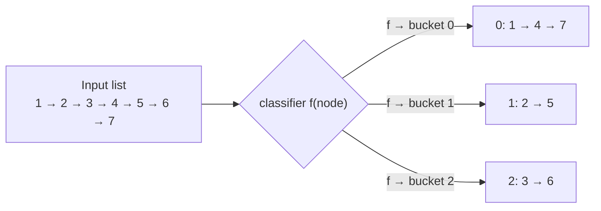
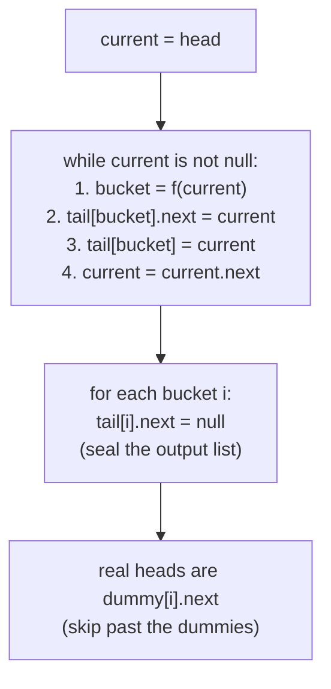

# Understanding the split pattern

Many linked list problems require splitting a given linked list into two or more lists based on the outcome of some function. One solution to this problem is traversing the list for every new list that has to be created and copying items from the original list into the new nodes created for the new lists. However, this requires multiple passes over the list and is inefficient. Also, in many cases, we need to split the original list into separate lists instead of creating copies of nodes. The linked list split technique can be applied to such problems to solve them efficiently in a single pass.

> 🖼 Diagram — The split pattern — every node is routed to one of k output lists by a classifier function f. Nothing is copied; the original nodes are re-linked into their destination list.


<p align="center"><strong>The split pattern — every node is routed to one of <code>k</code> output lists by a classifier function <code>f</code>. Nothing is copied; the original nodes are re-linked into their destination list.</strong></p>

> ▶ Interactive Diagram — Round-robin split — node i goes to list i mod k. Every original node ends up in exactly one sublist; no allocations, just re-linking.
```d3 widget=linked-list
{
  "title": "Round-robin split into k=3 sub-lists — node i goes to list (i mod k)",
  "direction": "single",
  "nodes": [
    {"id": "n1", "value": "1"},
    {"id": "n2", "value": "2"},
    {"id": "n3", "value": "3"},
    {"id": "n4", "value": "4"},
    {"id": "n5", "value": "5"},
    {"id": "n6", "value": "6"}
  ],
  "head": "n1",
  "steps": [
    {
      "links": [["n1","n2"],["n2","n3"],["n3","n4"],["n4","n5"],["n5","n6"]],
      "markers": [{"name": "head", "nodeId": "n1"}],
      "msg": "Before: original list 1 → 2 → 3 → 4 → 5 → 6"
    },
    {
      "links": [["n1","n4"],["n2","n5"],["n3","n6"]],
      "markers": [{"name": "headA", "nodeId": "n1"}, {"name": "headB", "nodeId": "n2"}, {"name": "headC", "nodeId": "n3"}],
      "msg": "After: list 0 = (1,4); list 1 = (2,5); list 2 = (3,6). Same nodes — re-linked into 3 chains."
    }
  ]
}
```

<p align="center"><strong>Round-robin split — node <em>i</em> goes to list <em>i mod k</em>. Every original node ends up in exactly one sublist; no allocations, just re-linking.</strong></p>

## Linked list split technique

Consider we are given a singly linked list that we need to split into `k` lists using a function `f` that maps every node in the original list to the list it should go to after splitting. the function`f`simply round robins amongst all the`k`lists. The split technique uses dummy nodes to simplify splitting the original lists. We create two arrays of node references `dummy` and `tails` of size `k` each. Both the arrays initialized it with references of newly created dummy nodes where the item at the index `i` is the dummy node for the list `i`.

Consider the example below, where `k = 3`.

> 🖼 Diagram — Setup for k = 3 — allocate k dummy heads and a parallel tail[i] pointer for each. The dummy pattern removes every "is this the first node in the output list?" special case: each tail just appends via tail[i].next = current; tail[i] = current, always.
```d2
direction: right
d0: |md
  **dummy[0]**

  next: null
|
d1: |md
  **dummy[1]**

  next: null
|
d2: |md
  **dummy[2]**

  next: null
|
t0: "tail[0] → dummy[0]"
t1: "tail[1] → dummy[1]"
t2: "tail[2] → dummy[2]"
d0 -> t0: "" {style.stroke-dash: 3}
d1 -> t1: "" {style.stroke-dash: 3}
d2 -> t2: "" {style.stroke-dash: 3}
```

<p align="center"><strong>Setup for <code>k = 3</code> — allocate <code>k</code> dummy heads and a parallel <code>tail[i]</code> pointer for each. The dummy pattern removes every "is this the first node in the output list?" special case: each tail just appends via <code>tail[i].next = current; tail[i] = current</code>, always.</strong></p>

We initialize a `current` reference with the head of the list and traverse the original list from start to end. In each iteration, we use the function `f` to identify which list the current node should go to. We get the tail node for that list from the `tail` array, update its next section to hold the current node, and update the tail reference. Then, we move `current` one step ahead for the next iteration and finally set the next section of the new tail node to `null`. This process is repeated until we reach the end of the list when the original list is split into `k` lists.

> 🖼 Diagram — Single pass — for each node, compute its bucket, tack it onto that bucket's tail, advance. Afterwards, seal every bucket's tail and extract the real heads from dummy[i].next.


<p align="center"><strong>Single pass — for each node, compute its bucket, tack it onto that bucket's tail, advance. Afterwards, seal every bucket's tail and extract the real heads from <code>dummy[i].next</code>.</strong></p>

At the end of all iterations, we iterate in `dummy` and move the references one step ahead to hold the real head of the corresponding list and delete the dummy node.

## Algorithm

The algorithm given below summarizes the linked list split technique to split a list into `k` lists.

> **Algorithm**
>
> -   **Step 1:** Create two arrays of node references `dummy` and `tails` of size `k` and initialize each item in both arrays with the reference of a newly created dummy node.
> -   **Step 2:** Create a reference `current` and initialize it with the head of the list.
> -   **Step 3:** Loop while `current` != `null` and do the following:
>     -   **Step 3.1:** Apply the function `f` to the `current` node and retrieve `idx`, which is the index of the list where this node should be placed.
>     -   **Step 3.2:** Add the `current` node to the end of the list stored at `idx` using `tails` array.
>     -   **Step 3.3:** Update `tails\[idx\]` to now store the reference of the new tail node.
>     -   **Step 3.4:** Update the `current` pointer to hold the reference of the node after the `current` node.
>     -   **Step 3.5:** Set the next section of `tails\[idx\]` to `null`
> -   **Step 4:** Move all the dummy nodes one step ahead to obtain the heads of the split lists and delete the old dummy nodes.

## Implementation

Given below is the generic code implementation to split a given linked list into `k` lists based on the outcome of a function `f`. 


```python run

"""
Definition for singly-linked list.
class ListNode:
    def __init__(self, val):
        self.val = val
        self.next = None
"""

def splitLists(head: ListNode, k: int) -> List[ListNode]:
    # Create an array of references for dummy and tail nodes
    dummy = [ListNode() for _ in range(k)]
    tails = dummy[:]

    # Iterate in the list using current
    current = head
    while current is not None:
        # Use the function `f` to decide which list this node should go to.
        idx = f(current)

        # Add node to the list and update tail
        tails[idx].next = current
        tails[idx] = current

        # Move current ahead
        current = current.next

        # Set the next of the tail node to None
        tails[idx].next = None

    # Remove the dummy nodes and return heads of the split lists
    for i in range(k):
        dummyNode = dummy[i]
        dummy[i] = dummy[i].next  # move head to the actual first node
        del dummyNode  # Python's garbage collection handles memory cleanup

    # Return the array of split lists' heads
    return dummy
```

```java run

/**
 * Definition for singly-linked list.
 * class ListNode {
 *     int val;
 *     ListNode next;
 *     ListNode() {}
 *     ListNode(int val) { this.val = val; }
 * };
 */

class SplitLists {
    ListNode[] splitLists(ListNode head, int k) {
        // Create an array of references for dummy and tail nodes
        ListNode[] dummy = new ListNode[k];
        ListNode[] tails = new ListNode[k];

        // Initialize the dummy and tail nodes
        for (int i = 0; i < k; i++) {
            dummy[i] = new ListNode(); // create a new dummy node
            tails[i] = dummy[i]; // point tail to the dummy node
        }

        // Iterate in the list using current
        ListNode current = head;
        while (current != null) {
            // Use the function `f` to decide which list this node should go to.
            int idx = f(current);

            // Add node to the list and update tail
            tails[idx].next = current;
            tails[idx] = current;

            // Move current ahead
            current = current.next;

            // Set the next of the current tail node to null
            tails[idx].next = null;
        }

        // Remove the dummy nodes and assign actual heads to the dummy array
        for (int i = 0; i < k; i++) {
            ListNode dummyNode = dummy[i];
            dummy[i] = dummy[i].next;  // move the dummy head to the real first node
            dummyNode = null;          // delete the dummy node
        }

        // Return the array of split lists' heads
        return dummy;
    }
}
```


## Complexity Analysis

Looking at the algorithm, the runtime and space complexity are pretty easy to understand. We traverse the given linked list from start to end, so the time complexity is linear **O(N)** in any case.

We create two arrays of size k each to store references to dummy nodes and tail nodes. We also create k dummy nodes to simplify the implementation, so the space complexity is **O(K)** in any case.

> **Best Case:** K = 1
>
> -   Space Complexity - **O(K)**
> -   Time Complexity - **O(N)**
>
> **Worst Case:** K = N
>
> -   Space Complexity - **O(N)**
> -   Time Complexity - **O(N)**

# Identifying the split pattern

The linked list split technique can only be applied to some specific problems. These are generally easy or medium problems in which we must split a linked list into one or smaller lists. However, there may be some problems where we need to split a list that may have a more straightforward solution than applying the split technique. For example, we can split a list in half using the fast and slow pointer technique, and the split list technique may be overkill. If the problem statement or its solution follows the generic template below, it can be solved by applying the split list technique.

**Template:**

Given a linked list, split it into to `k` lists.

## Example

Let's consider the following problem as an example to better understand how to identify and solve a problem using the split technique.

> **Problem statement:** Given a singly linked list and an integer `k` split the list into `k` lists such that their concatenation results in the original lists. The length of all parts should be equal. If that is not possible, the difference between the size of any two lists should not be greater than one, and the list occurring earlier should have a greater size.

> 🖼 Diagram — Single pass — for each node, compute its bucket, tack it onto that bucket's tail, advance. Afterwards, seal every bucket's tail and extract the real heads from dummy[i].next.


<p align="center"><strong>Single pass — for each node, compute its bucket, tack it onto that bucket's tail, advance. Afterwards, seal every bucket's tail and extract the real heads from <code>dummy[i].next</code>.</strong></p>

### Split technique solution

We need to split a given list into k parts, and this fits the generic template from the split pattern we learned earlier.

**Template:**

Given a linked list, split it into to `k` lists.

We first find the `length` of the given list and divide it by `k` to calculate the minimum number of nodes each of the `k` split lists will have. We save this value in a variable `partSize`. The length may not be multiple of `k`, which means that some split lists will have `partSize + 1` nodes. We create a variable `bigLists` and initialize it with `length % k`, which is the number of lists that will have `partSize + 1` nodes in them.

> 🖼 Diagram — Unequal splitting — when n isn't divisible by k, the first n mod k sublists get one extra node (base + 1), and the rest get exactly base. Compute both quantities once before splitting.
```d2
direction: right
length: "length = n"
k: "k = number of buckets"
base: |md
  base = n / k (integer)

  size of each 'small' sublist
|
rem: |md
  remainder = n % k

  = number of 'big' sublists (size base+1)
|
length -> base
k -> base
length -> rem
k -> rem
```

<p align="center"><strong>Unequal splitting — when <code>n</code> isn't divisible by <code>k</code>, the first <code>n mod k</code> sublists get one extra node (<code>base + 1</code>), and the rest get exactly <code>base</code>. Compute both quantities once before splitting.</strong></p>

We then apply the split list technique by creating two arrays of ListNode references `dummy` and `tails` of size `k` each and initialize all items in them with the references of newly created dummy nodes. We initialize `current` with head and use it to traverse the list from start to end. We also initialize two variables `idx` and `count` with 0 to to keep track of the current split list and the number of nodes already added to it. We then iterate the list and use the variables `bigLists` and `count` to update `idx` when we have added all nodes to the current split list.

> 🖼 Diagram — Initial state for unequal split — alongside the usual dummy / tail arrays, track how many nodes still belong to the current bucket and how many "big" buckets remain.
```d2
state: "Initial state for unequal split" {
  grid-rows: 2
  grid-gap: 16
  d: |md
    **dummy[k]**

    k heads
    (one per output)
  |
  t: |md
    **tail[k]**

    k tails
    (tracks end of each)
  |
  cur: |md
    **current = head**

    (the walker)
  |
  big: |md
    **bigLists = n % k**

    (# of k+1-sized lists)
  |
  base: |md
    **baseSize = n / k**

    (size of small lists)
  |
  bkt: |md
    **bucket = 0**

    (round-robin counter)
  |
}
```

<p align="center"><strong>Initial state for unequal split — alongside the usual <code>dummy</code> / <code>tail</code> arrays, track how many nodes still belong to the current bucket and how many "big" buckets remain.</strong></p>

In each iteration, we add the node held in `current` at the end of the split list denoted by `idx` and increment `count`. If we have any `bigLists` left i.e. `bigLists > 0` it means the current split list (denoted by `idx`) should have `partSize + 1` nodes, otherwise it should only have `partSize` nodes.

We check for these conditions to correctly update `idx` for the subsequent iterations. If `bigLists > 0` we check if we have already added `partSize + 1` nodes to the current split list be checking if `count == partSize + 1` and reset `count` to 0, decrement `bigLists` and increment `idx`. Otherwise, if `bigLists == 0` we check if `count == partSize` reset `count` to 0 and increment `idx`. This ensures that we move to the next split list after we have added all nodes to the current split list.

> 🖼 Diagram — Single pass — for each node, compute its bucket, tack it onto that bucket's tail, advance. Afterwards, seal every bucket's tail and extract the real heads from dummy[i].next.


<p align="center"><strong>Single pass — for each node, compute its bucket, tack it onto that bucket's tail, advance. Afterwards, seal every bucket's tail and extract the real heads from <code>dummy[i].next</code>.</strong></p>

The implementation of the split list solution is given as follows.


```python run

"""
Definition for singly-linked list.
class ListNode:
    def __init__(self, val):
        self.val = val
        self.next = None
"""

from typing import Optional, List

# Function to calculate the length of the linked list
def lengthOfLinkedList(head: Optional[ListNode]) -> int:
    length = 0
    while head is not None:
        length += 1
        head = head.next
    return length

def kWayListSplit(head: Optional[ListNode], k: int) -> List[Optional[ListNode]]:
    # Count the number of nodes in the linked list
    length = lengthOfLinkedList(head)
    # Calculate the size of each part
    partSize = length // k
    # Calculate the number of lists with partSize + 1 nodes
    bigLists = length % k

    # Create an array of dummy and tail nodes
    dummy = [ListNode(0) for _ in range(k)]
    tails = dummy[:]

    # Iterate in the list using current pointer
    current = head
    count = 0
    idx = 0

    while current is not None:
        # Add node to the current split list and update tail
        tails[idx].next = current
        tails[idx] = current

        # Move current ahead
        current = current.next
        # Set the next section of tail node to None
        tails[idx].next = None

        # Increment count after adding the node
        count += 1

        # Determine when to move to the next list
        if bigLists > 0 and count == partSize + 1:
            count = 0
            idx += 1
            bigLists -= 1
        elif bigLists == 0 and count == partSize:
            count = 0
            idx += 1

    # Remove the dummy nodes and return the real heads
    for i in range(k):
        dummy[i] = dummy[i].next

    # Return the array of split lists' heads
    return dummy
```

```java run

/**
 * Definition for singly-linked list.
 * class ListNode {
 *     int val;
 *     ListNode next;
 *     ListNode() {}
 *     ListNode(int val) { this.val = val; }
 * };
 */

class KWayListSplit {

    // Function to find the length of a linked list
    int lengthOfLinkedList(ListNode head) {
        int length = 0;
        while (head != null) {
            ++length;
            head = head.next;
        }
        return length;
    }

    List<ListNode> kWayListSplit(ListNode head, int k) {
        // Count the number of nodes in the linked list
        int length = lengthOfLinkedList(head);
        // Calculate the size of each part
        int partSize = length / k;
        // Calculate the number of lists with partSize + 1 nodes
        int bigLists = length % k;

        // Create an array of references for dummy and tail nodes
        List<ListNode> dummy = new ArrayList<>(Collections.nCopies(k, null));
        List<ListNode> tails = new ArrayList<>(Collections.nCopies(k, null));

        for (int i = 0; i < k; i++) {
            dummy.set(i, new ListNode(0)); // create a new dummy node
            tails.set(i, dummy.get(i)); // point tail to the dummy node
        }

        // Iterate in the list using current
        ListNode current = head;

        // Initialize counter to count number of nodes
        // added to current split list
        int count = 0;

        // Initialize variable to denote current split list
        int idx = 0;

        while (current != null) {
            // Add node to the current split list and update tail
            tails.get(idx).next = current;
            tails.set(idx, current);

            // Move current ahead
            current = current.next;

            // Set the next section of tail node to null
            tails.get(idx).next = null;

            // Increment count after adding the node
            count++;

            if (bigLists > 0 && count == partSize + 1) {
                count = 0; // Reset count to 0
                idx++; // Increment idx to add to next sublist from next iteration
                bigLists--; // Reduce the number of bigLists left
            } else if (bigLists == 0 && count == partSize) {
                count = 0; // Reset count to 0
                idx++; // Increment idx to add to next sublist from next iteration
            }
        }

        // Delete the dummy nodes
        for (int i = 0; i < k; i++) {
            dummy.set(i, dummy.get(i).next); // move the dummy head to the real first node
        }

        // Return the list of split lists' heads
        return dummy;
    }
}
```


The above implementation uses the template code of the split list technique to split the list into k lists in a single pass.

## Example problems

Most problems that fall under this category are**medium**problems; a list of a few is given below.

> -   **[Even odd split](#even-odd-split)**
> -   **[Split alternate groups](#split-alternate-groups)**
> -   **[Split by modulo](#split-by-modulo)**
> -   **[K-way list split](#k-way-list-split)**

We will now solve these problems to understand the split list technique better.

---

## Understanding the Pattern

### Why Naive Isn't Enough

The obvious way to split a list into `k` output groups is one pass per group — for each bucket, walk the original list, find the nodes that belong, and either copy them or thread them into a new chain. That solution is correct but pays for it twice. The first cost is time: `k` passes over `n` nodes is `O(n * k)`, and every node visit re-asks "which bucket does this belong to?" even though the classifier is deterministic. The second cost is structure: copying allocates `n` new nodes, doubling the working set; threading without copying requires bookkeeping for "have I already routed this node?" because two passes risk linking the same node into two output lists.

To make this concrete: on `[5, 2, 3, 10, 6, 8]` with a parity classifier (even → list 0, odd → list 1), a two-pass routine walks all six nodes once to collect evens and again to collect odds — twelve node-visits for what should be six. Scale `k` up to three buckets (modulo by 3) and the cost climbs to eighteen visits, even though each node's destination was decided at first sight. The classifier is cheap; the redundancy is the waste.

So the key idea is: a single pass is enough if every node is routed the moment it is read. The trick is to have a designated tail pointer per bucket so the append is `O(1)` — read the node, classify it, link it onto its bucket's current tail, advance.

### The Core Idea

The pattern asks one question: **can each node's destination be computed independently from a classifier, and can the routing be done by re-linking instead of copying?**

The single mechanism that drives every variant is the **dummy-and-tails template**:

- **`dummy[k]`** — an array of `k` placeholder head nodes, one per output list. The placeholder absorbs the "first append" special case so every later append uses the same code path.
- **`tail[k]`** — a parallel array of pointers, each initially equal to its dummy. `tail[i]` always references the current last node of output list `i`, so appending to bucket `i` is `tail[i].next = node; tail[i] = node` — two assignments, no `null` check.
- **`classify(node) → bucket`** — the only problem-specific piece. Even/odd parity, `value % k`, position modulo `k`, alternating groups of `k` — each variant supplies a different classifier; the routing skeleton is identical.

To make this concrete: with `k = 3` and parity-as-classifier on `[5, 2, 3, 10, 6, 8]`, the first append (`5`) goes to bucket 1 — `tail[1].next = node 5; tail[1] = node 5`. Without the dummy, the same line would need a guard: `if tail[1] is None: head[1] = node 5 else: tail[1].next = node 5`. The dummy absorbs that guard for every bucket, for the entire walk.

The core insight is: every node visits exactly one bucket exactly once, and the bucket-append is `O(1)`, so the total cost is `O(n)` time regardless of how many buckets exist. The buckets themselves contribute `O(k)` space — `k` dummy nodes, `k` tail pointers — independent of `n`.

### How the Pointers Move

The walker holds `current` and advances strictly left-to-right; the original chain is never traversed twice. Inside each tick, three pointers move in a fixed order. First, read `current` and ask the classifier for its destination bucket — call it `idx`. Second, link `current` into bucket `idx`'s tail: `tail[idx].next = current; tail[idx] = current`. Third, advance `current` to the next node in the original list before any further mutation. The order matters: if `current.next` is read *after* `tail[idx].next = current; tail[idx] = current` reassign `tail[idx]`, the original forward chain is still intact because the append only writes to `tail[idx].next`, not to `current.next` itself.

Crucially, sealing happens after the walk, not during it. While the walk is still running, every `tail[i]` still has its `.next` pointing into the middle of the original list — the next time a node is appended to bucket `i`, that `.next` gets overwritten. Once the walk ends, the last node in each bucket still points wherever the original list's next node took it. Setting `tail[i].next = null` for every `i` is what severs those dangling links and turns `k` shared tails into `k` independent terminated lists. Skipping this step is a silent bug — the output buckets render correctly for the first few nodes, then bleed into each other.

---

## The Generic Algorithm

The pattern follows the same four-step skeleton regardless of which classifier is plugged in. Step 3 frozen from the baseline — only the surrounding numbered shape changed.

1. **Allocate `k` dummies and `k` tails.** Create `dummy[k]`, each a fresh placeholder node; set `tail[k]` so that `tail[i] = dummy[i]`. The dummies absorb the "first node in bucket" special case; the tails track where the next append goes.
2. **Initialise the walker at the head.** Set `current = head`. The walk visits each original node exactly once, in source order.
3. **Walk the list, routing each node by classifier.** While `current != null`:
   - Compute `idx = classify(current)` — the bucket this node belongs to.
   - Append `current` to bucket `idx`: `tail[idx].next = current; tail[idx] = current`.
   - Advance the walker: `current = current.next`.
   - Defensively null out `tail[idx].next` so the bucket terminates cleanly even if no further node lands there.
4. **Extract the real heads from the dummies.** For each bucket `i`, set `heads[i] = dummy[i].next` to skip past the placeholder. Discard the dummies (or rely on garbage collection). The result is `k` independent terminated lists in source order within each.

When the classifier needs auxiliary state — alternating groups every `k` nodes, biased partitioning that needs the pivot value cached before the head is routed — that bookkeeping lives in the outer driver. The inner three-line routing core never changes.

---

## Variants / Taxonomy

The pattern surfaces in four recognisable variants. Each one swaps the classifier or layers extra state on top of the walker, but the dummy-and-tails skeleton is identical across all of them.

- **Value-predicate split (`k = 2`, predicate on the node)** — the classifier is a boolean test on `current.val`. Even/odd parity is the canonical case: `idx = 0 if current.val % 2 == 0 else 1`. Pivot-partition (everything less than a threshold to bucket 0, the rest to bucket 1) is the same shape with a different predicate. Two buckets, no extra state.
- **Modulo-by-value (`k` general, classifier = `value % k`)** — the classifier reads `current.val` and returns `current.val % k` directly. The number of buckets is the modulus; nodes with the same residue land in the same list. Order within each bucket follows source order. No length pass required.
- **Alternating groups (`k = 2`, classifier flips every `k` nodes)** — the classifier is stateful: maintain a `to_first` flag and a counter; flip the flag after every `k` nodes. The walker accumulates groups of `k` then redirects. The skeleton is unchanged; the classifier holds the alternation state.
- **Equal-size `k`-way split (classifier = position-driven, length-aware)** — the classifier depends on position rather than value: precompute `partSize = n // k` and `bigLists = n % k`, then advance `idx` after the right number of nodes has landed in the current bucket. The first `bigLists` buckets get `partSize + 1` nodes; the rest get `partSize`. One initial length pass, then the standard routing loop.

The variants share an invariant: when the walk ends, every original node sits in exactly one output list, no node has been copied, and the only allocation cost is the `k` dummies that get peeled off at the end.

---

## Recognition Checklist

The pattern fits when **all four** answers are "yes". The first asks whether the operation is partition-shaped; the next three check that the dummy-and-tails template can deliver it in a single pass.

- Does the problem ask to **partition the input list into multiple output lists** by some classifier — predicate, modulo, position, or alternation?
- Can the destination bucket for each node be **computed locally**, from the node itself (and maybe a small stateful counter), without looking ahead or back?
- Is the work at each step **`O(1)`** — one classifier call, one tail-append, one pointer advance — with no per-node scan?
- Are the output lists allowed to share the **original nodes** (re-linked, not copied)? If the problem mandates fresh allocations, the template still works; the cost just adds an `O(n)` allocation pass.

Common surface signals: "split by parity," "partition by predicate," "round-robin distribute," "split into `k` equal parts," "bucket by hash," "group consecutive runs of `k` into alternate lists."

---

## Canonical Example: K-Way List Split

**Problem:** Given the head of a singly linked list of length `n` and an integer `k`, split the list into `k` consecutive parts whose lengths differ by at most one. Earlier parts must be as large or larger than later parts. Return the `k` heads.

```
Input:  head = [1, 2, 3, 4, 5, 6, 7, 8, 9, 10], k = 3
Output: [[1, 2, 3, 4], [5, 6, 7], [8, 9, 10]]
```

### Brute Force: Length Pass, Then Copy Per Bucket

Walk the list once to compute `n = 10`. Compute `partSize = 10 / 3 = 3` and `bigLists = 10 % 3 = 1`. For each bucket `i` in `0..k-1`, walk the original list from the head, count `partSize + (1 if i < bigLists else 0)` nodes, copy each into a freshly allocated node, link those into a new chain, and store the new chain's head as `result[i]`.

```
Pass 1:  walk head → 1 → 2 → … → 10 → null. Count = 10.
Pass 2:  copy 4 nodes from index 0 — bucket 0 = [1, 2, 3, 4].
Pass 3:  copy 3 nodes from index 4 — bucket 1 = [5, 6, 7].
Pass 4:  copy 3 nodes from index 7 — bucket 2 = [8, 9, 10].
```

The brute force is correct and runs in `O(n)` time / `O(n)` space — the time is `(k + 1) * n` node visits plus `n` allocations. Both factors are wasteful: each prefix is re-walked once per later bucket, and every node is duplicated even though the original list is no longer needed after the split.

### Key Insight: Re-link by Position, Not by Copy

Because the parts are *consecutive* segments of the original list, every cut sits between two adjacent nodes. The only structural change needed is to sever `.next` at each cut point — no copying, no reordering. The classifier becomes "stay in the current bucket until I've placed `partSize + (1 if extra remaining else 0)` nodes, then advance to the next bucket." One forward walk, with the bucket boundary advancing inside the loop.

### Optimized Solution: Length Pass + Position-Driven Classifier

The single-pass-after-length solution runs in `O(n)` time and `O(k)` space (the `k` output head pointers). The same loop body handles equal and unequal splits — the `bigLists` counter absorbs the asymmetry.

> 🖼 Diagram — TODO: 3 frames — (1) input `[1,2,3,4,5,6,7,8,9,10]` with k=3 and the precomputed values `partSize=3, bigLists=1`; (2) mid-walk after the first cut showing bucket 0 = `[1,2,3,4]` sealed (the first bucket got the extra node), the walker positioned at node 5; (3) terminal state with three sealed output chains `[1,2,3,4]`, `[5,6,7]`, `[8,9,10]` and the original list's chain fully partitioned.

### Trace

```
head = 1 → 2 → 3 → 4 → 5 → 6 → 7 → 8 → 9 → 10 → null
k = 3, n = 10, partSize = 3, bigLists = 1

Bucket 0 (size 4 — partSize + 1, bigLists consumed):
  parts[0] = node 1
  walk 3 hops — current at node 4
  sever — node 4.next = null; current = node 5
  bigLists -= 1   → bigLists = 0

Bucket 1 (size 3 — partSize):
  parts[1] = node 5
  walk 2 hops — current at node 7
  sever — node 7.next = null; current = node 8

Bucket 2 (size 3 — partSize):
  parts[2] = node 8
  walk 2 hops — current at node 10
  sever — node 10.next = null; current = null

Return [node 1, node 5, node 8]. ✓
```

### Fitting the Template

| Check | Answer for K-Way List Split |
|---|---|
| **Q1.** Does the problem ask to partition the input into multiple output lists? | **Yes** — the list is partitioned into `k` consecutive segments, one head per segment. |
| **Q2.** Can each node's bucket be computed locally? | **Yes** — once `partSize` and `bigLists` are known, the bucket boundary advances by counter alone; no look-ahead is required mid-bucket. |
| **Q3.** Is the work at each step `O(1)`? | **Yes** — each node visit performs one comparison, one pointer hop, and at most one severing assignment. |
| **Q4.** Can output lists share original nodes (re-linked, not copied)? | **Yes** — the problem returns the original nodes re-threaded, never asks for copies. |

All four answers are "yes", so the split pattern applies. The outer driver tracks `partSize`, `bigLists`, and a per-bucket position counter; the inner two-line routing core (link + advance) does the rest. Total cost: `O(n)` time, `O(k)` space.

---

## Problems in This Category

| Problem | Variant | How the dummy-and-tails template fits |
|---|---|---|
| **[Even Odd Split](02-problems/01-even-odd-split.md)** | Value-predicate (`k = 2`) | `classify(node) = 0 if val % 2 == 0 else 1`; two dummies, two tails; seal both at the end |
| **[Split Alternate Groups](02-problems/02-split-alternate-groups.md)** | Alternating groups (`k = 2`, stateful) | Walker takes `k` nodes at a time, flips a `to_first` flag between chunks; route each chunk wholesale to bucket 0 or 1 |
| **[Split by Modulo](02-problems/03-split-by-modulo.md)** | Modulo-by-value (general `k`) | `classify(node) = val % k`; `k` dummies, `k` tails; seal all at the end |
| **[K-Way List Split](02-problems/04-k-way-list-split.md)** | Equal-size `k`-way split | One length pass first; classifier is position-driven (`partSize`, `bigLists`); cuts via `current.next = null` at each boundary |

Difficulty scales with the classifier's statefulness — predicate (easy) → modulo (easy) → alternating groups (medium) → length-aware position counter (medium).
