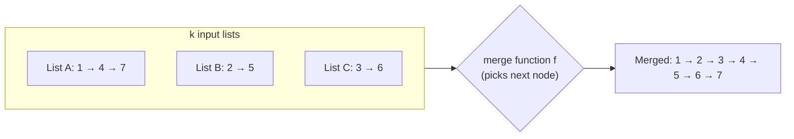
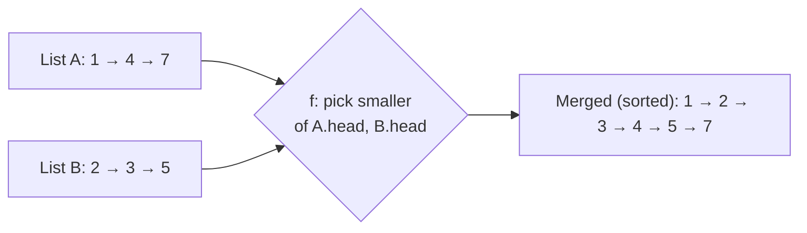
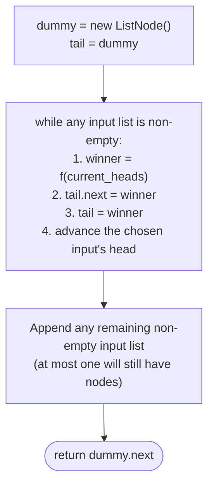
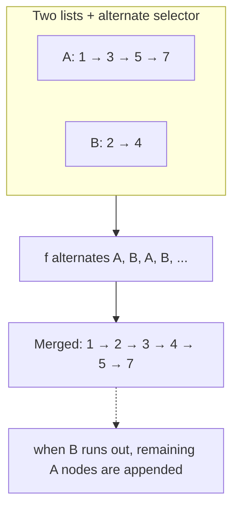
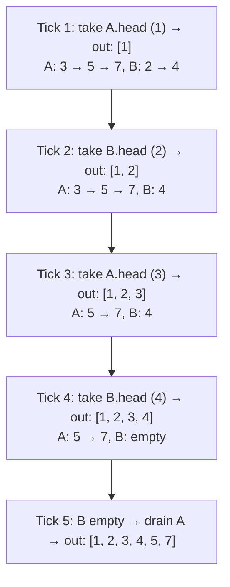

# Understanding the merge pattern

Like splitting a linked list into multiple lists, many linked list problems require merging multiple linked lists into one based on the outcome of some function. Also, in most cases, we must merge the lists by moving around the original nodes instead of creating copies. The linked list merging technique traverses multiple lists simultaneously and merges them in a single pass.

The merge pattern is a classification of problems that can be solved using the linked list merging technique.

> 🖼 Diagram — The merge pattern — multiple input lists flow through a selector f that picks "who goes next" and appends to a single output. The selector is where each merge variant differs; the splicing skeleton is universal.


<p align="center"><strong>The merge pattern — multiple input lists flow through a selector <code>f</code> that picks "who goes next" and appends to a single output. The selector is where each merge variant differs; the splicing skeleton is universal.</strong></p>

## Linked list merging technique

We will learn the merge technique for two lists, but it can be easily extended to merge `k` lists. Consider that we are given two singly linked lists denoted by `headA` and `headB`, and we have to merge them into a single list based on the output of some function `f`. Given any two nodes, one from each list, the function `f` decides which node goes before the other node in the merged list.

> 🖼 Diagram — Swap out f and you change the problem entirely. "Pick the smaller head" → sorted-list merge. "Alternate A, B, A, B" → interleave. "Pick by summed digit" → list-addition. Same template, different selector.


<p align="center"><strong>Swap out <code>f</code> and you change the problem entirely. "Pick the smaller head" → sorted-list merge. "Alternate A, B, A, B" → interleave. "Pick by summed digit" → list-addition. Same template, different selector.</strong></p>

The merge technique uses a dummy node to simplify the merging algorithm. We create a `dummy` node and a reference variable `tail` which we initialize with it. We create two references `currentA` and `currentB` and initialize them with `headA` and `headB` which we use to traverse the respective lists. We then simultaneously traverse both lists using these references and, in each iteration, apply the function `f` on nodes held in `currentA` and `currentB` to decide which node should be added to the merged list. We use the `tail` reference to easily add the node at the end of the merged list, update `tail`, and move ahead either `currentA` or `currentB` accordingly.

If either `currentA` or `currentB` hits `null`, it means we have traversed one of the lists completely, and we terminate the iterations. At this point, we identify the list that is not completely traversed and add the remaining nodes at the end of the merged lists to completely merge both lists. Consider the example below where the function `f` is a simple function that alternates (round robin) between both lists to select the node that goes to the merged list.

> 🖼 Diagram — The universal merge skeleton. A dummy head turns "is this the first output?" into a non-question. Each iteration, the selector f picks a winner, splices it, advances the input, and repeats. The drain step stitches on any leftover suffix when one input runs dry first.


<p align="center"><strong>The universal merge skeleton. A dummy head turns "is this the first output?" into a non-question. Each iteration, the selector <code>f</code> picks a winner, splices it, advances the input, and repeats. The drain step stitches on any leftover suffix when one input runs dry first.</strong></p>

Finally, we delete the dummy node and return the reference of the node after it as the real head of the merged list.

## Algorithm

The algorithm given below summarizes the linked list merge technique for two lists. It can be easily extended for `k` lists.

> **Algorithm**
>
> -   **Step 1:** Create a `dummy` node and initialize a `tail` reference with it.
> -   **Step 2:** Create two references `currentA` and `currentB` and initialize them with `headA` and `headB` respectively.
> -   **Step 3:** Loop while `currentA` != `null` and `currentB` != `null` and do the following:
>     -   **Step 3.1:** Apply the function `f` to the node held in `currentA` and `currentB` to decide which node to add to the merged list.
>     -   **Step 3.2:** If `currentA` has to be added, add it to the end of the merged list by updating `tail` and moving `currentA` ahead.
>     -   **Step 3.3:** If `currentB` has to be added, add it to the end of the merged list by updating `tail` and moving `currentB` ahead.
>     -   **Step 4:** If `currentA` != `null` attach the remaining list to the merged list using `tail`
>     -   **Step 5:** If `currentB` != `null` attach the remaining list to the merged list using `tail`
>     -   **Step 6:** Delete the `dummy` node and return the next node as real head of merged list.

## Implementation

Given below is the generic code implementation to merge two lists into a single list based on the outcome of a function `f`.


```python run

"""
Definition for singly-linked list.
class ListNode:
    def __init__(self, val):
        self.val = val
        self.next = None
"""

def mergeLists(headA: ListNode, headB: ListNode) -> ListNode:
    # Create a dummy node and a tail reference for the merged list
    dummy = ListNode(0)  # create a new dummy node
    tail = dummy  # create a tail reference for merge list

    # Create current references
    currentA = headA
    currentB = headB

    while currentA is not None and currentB is not None:
        # Use the function `f` to determine which node to merge
        # The function `f` is dictated by the problem
        mergeA = f(currentA, currentB)

        if mergeA:
            tail.next = currentA  # Merge node held in `currentA`
            currentA = currentA.next  # Move ahead `currentA`
            tail = tail.next  # Update tail of the merged list
        else:
            tail.next = currentB  # Merge node held in `currentB`
            currentB = currentB.next  # Move ahead `currentB`
            tail = tail.next  # Update tail of the merged list

    # If the first list is not completely traversed,
    # attach remaining nodes to merged list
    if currentA is not None:
        tail.next = currentA
    # If the second list is not completely traversed,
    # attach remaining nodes to merged list
    elif currentB is not None:
        tail.next = currentB

    # Return the real head of the merged list
    return dummy.next
```

```java run

/**
 * Definition for singly-linked list.
 * class ListNode {
 *     int val;
 *     ListNode next;
 *     ListNode() {}
 *     ListNode(int val) { this.val = val; }
 * };
 */

class MergeLists {
    // Function to merge two linked lists
    ListNode mergeLists(ListNode headA, ListNode headB) {
        // Create a dummy node and a tail reference for the merged list
        ListNode dummy = new ListNode(); // create a new dummy node
        ListNode tail = dummy; // create a tail reference for merge list

        // Create current references
        ListNode currentA = headA;
        ListNode currentB = headB;

        while (currentA != null && currentB != null) {
            // Use the function `f` to determine which node to merge
            boolean mergeA = f(currentA, currentB);

            if (mergeA) {
                tail.next = currentA; // Merge node held in `currentA`
                currentA = currentA.next; // Move ahead `currentA`
                tail = tail.next; // Update tail of the merged list
            } else {
                tail.next = currentB; // Merge node held in `currentB`
                currentB = currentB.next; // Move ahead `currentB`
                tail = tail.next; // Update tail of the merged list
            }
        }

        // If the first list is not completely traversed,
        // attach remaining nodes to merged list
        if (currentA != null) {
            tail.next = currentA;
        }
        // If the second list is not completely traversed,
        // attach remaining nodes to merged list
        else if (currentB != null) {
            tail.next = currentB;
        }

        // Return the real head of the merged list
        return dummy.next;
    }

    // Example function `f` that determines which node to merge (for demonstration)
    boolean f(ListNode nodeA, ListNode nodeB) {
        // Custom comparison logic: e.g., merge nodeA if its value is smaller
        return nodeA.val <= nodeB.val;
    }
}
```


## Complexity Analysis

The runtime and space complexity for merging two lists are pretty easy to understand. We traverse both lists together until either one is traversed completely. In the worst case, we may have to traverse both lists completely, with a linear runtime complexity of **O(N + M)**,where **N** and **M** are the lengths of the two linked lists. In the best case, one list may be empty, and we merge the other by updating references in constant time so the runtime complexity would be constant **O(1)**.

We only create a dummy node and update references to merge the lists, so the space complexity is constant, O(1), in any case.

> **Best Case:** One list is empty
>
> -   Space Complexity - **O(1)**
> -   Time Complexity - **O(1)**
>
> **Worst Case:** Both lists completely traversed
>
> -   Space Complexity - **O(1)**
> -   Time Complexity - **O(N+M)**

# Identifying the merge pattern

The linked list merge technique can only be applied to some specific problems. These are generally easy or medium problems where we merge multiple lists into a single list based on the outcome of some function `f`.  Sometimes, there may be more than one way to solve such problems; however, using the merge technique often has the cleanest and most straightforward solution. If the problem statement or its solution follows the generic template below, it can be solved by applying the merge technique.

**Template:**

Given `k` linked lists, merge them into a single list based on the outcome of some function `f`.

## Example

Let's consider the following problem as an example to better understand how to identify and solve a problem using the merge technique.

> **Problem statement:** Given two singly linked lists, merge them by splicing alternate nodes from both lists together. The merged list should start with the first node of the first list.

> ▶ Interactive Diagram — Merging splices the original nodes — no new nodes allocated. The six nodes above are the same six objects before and after; only their .next pointers have been rewired into a single chain.
```d3 widget=linked-list
{
  "title": "Sorted merge — same six nodes; only their next pointers are rewired",
  "direction": "single",
  "nodes": [
    {"id": "a1", "value": "1"},
    {"id": "b1", "value": "2"},
    {"id": "a2", "value": "3"},
    {"id": "b2", "value": "4"},
    {"id": "a3", "value": "5"},
    {"id": "b3", "value": "6"}
  ],
  "head": "a1",
  "steps": [
    {
      "nodes": [
        {"id": "a1", "value": "A:1"},
        {"id": "a2", "value": "A:3"},
        {"id": "a3", "value": "A:5"},
        {"id": "b1", "value": "B:2"},
        {"id": "b2", "value": "B:4"},
        {"id": "b3", "value": "B:6"}
      ],
      "links": [["a1","a2"],["a2","a3"],["b1","b2"],["b2","b3"]],
      "markers": [{"name": "headA", "nodeId": "a1"}, {"name": "headB", "nodeId": "b1"}],
      "msg": "Before: two input lists A=[1,3,5] and B=[2,4,6]"
    },
    {
      "links": [["a1","b1"],["b1","a2"],["a2","b2"],["b2","a3"],["a3","b3"]],
      "markers": [{"name": "head", "nodeId": "a1"}],
      "msg": "After: spliced (sorted merge) — same 6 nodes rewired into 1 → 2 → 3 → 4 → 5 → 6"
    }
  ]
}
```

<p align="center"><strong>Merging splices the original nodes — no new nodes allocated. The six nodes above are the same six objects before and after; only their <code>.next</code> pointers have been rewired into a single chain.</strong></p>

### Merge technique solution

We need to merge two lists to create a merged list; this fits the generic template from the merge pattern we learned earlier.

**Template:**

> 🖼 Diagram — Alternate-node fusion — selector f flips a boolean each step. When one list runs out, the other's remaining suffix is appended whole.


<p align="center"><strong>Alternate-node fusion — selector <code>f</code> flips a boolean each step. When one list runs out, the other's remaining suffix is appended whole.</strong></p>

We use the merge technique by creating a `dummy` node and `tail` reference for the merged list and iterating both lists using two references `currentA` and `currentB`. We also create a boolean variable `mergeFirst` to decide if the node from the first list should be added to the merged list and initialize it to `true`. In each iteration, we flip the value of `mergeFirst` to choose a node from the other list in subsequent iterations.

At the end of all iterations we check if either of the lists is not completely traversed and attach any remaining nodes to the end of the merged list. Finally, we delete the dummy node and return the real head of the merged list.

> 🖼 Diagram — Trace — alternate merge of A = [1, 3, 5, 7] and B = [2, 4]. The boolean flip drives the selector; when one list empties, the drain step appends the other's suffix in one splice.


<p align="center"><strong>Trace — alternate merge of A = [1, 3, 5, 7] and B = [2, 4]. The boolean flip drives the selector; when one list empties, the drain step appends the other's suffix in one splice.</strong></p>

The implementation of the merge list solution is given as follows.


```python run
"""
Definition for singly-linked list.
class ListNode:
    def __init__(self, val):
        self.val = val
        self.next = None
"""

from typing import Optional, List, Any

class Solution:
    def merge_alternate_nodes(
        self, head_a: Optional[ListNode], head_b: Optional[ListNode]
    ) -> Optional[ListNode]:

        # Create a new dummy node as the head of the merged list
        dummy: Optional[ListNode] = ListNode(0)
        tail: Optional[ListNode] = dummy

        current_a: Optional[ListNode] = head_a
        current_b: Optional[ListNode] = head_b

        mergeFirst = True

        # Merge alternate nodes from both lists
        while current_a is not None and current_b is not None:

            # If mergeFirst is true, attach the current node from
            # currentA to the merged list
            if mergeFirst:

                # Attach the current node from current_a to the merged
                # list
                tail.next = current_a

                # Move current_a to the next node
                current_a = current_a.next

                # Move the tail pointer to the newly attached node
                tail = tail.next

            # Otherwise, attach the current node from currentB to the
            # merged list
            else:

                # Attach the current node from current_b to the merged
                # list
                tail.next = current_b

                # Move current_b to the next node
                current_b = current_b.next

                # Move the tail pointer to the newly attached node
                tail = tail.next

            # Toggle between lists
            mergeFirst = not mergeFirst

        # If there are any remaining nodes in current_a, attach them to
        # the merged list
        if current_a is not None:
            tail.next = current_a

        # else if there are any remaining nodes in current_b, attach them
        # to the merged list
        elif current_b is not None:
            tail.next = current_b

        # Return the merged list starting from the node after the dummy
        # node
        return dummy.next
```

```java run
/**
 * Definition for singly-linked list.
 * class ListNode {
 *     int val;
 *     ListNode next;
 *     ListNode() {}
 *     ListNode(int val) { this.val = val; }
 * };
 */

class Solution {
    public ListNode mergeAlternateNodes(ListNode headA, ListNode headB) {

        // Create a new dummy node as the head of the merged list
        ListNode dummy = new ListNode(0);
        ListNode tail = dummy;

        ListNode currentA = headA;
        ListNode currentB = headB;

        boolean mergeFirst = true;

        // Merge alternate nodes from both lists
        while (currentA != null && currentB != null) {

            // If mergeFirst is true, attach the current node from
            // currentA to the merged list
            if (mergeFirst) {

                // Attach the current node from currentA to the merged
                // list
                tail.next = currentA;

                // Move currentA to the next node
                currentA = currentA.next;

                // Move the tail pointer to the newly attached node
                tail = tail.next;
            }

            // Otherwise, attach the current node from currentB to the
            // merged list
            else {

                // Attach the current node from currentB to the merged
                // list
                tail.next = currentB;

                // Move currentB to the next node
                currentB = currentB.next;

                // Move the tail pointer to the newly attached node
                tail = tail.next;
            }

            // Toggle between lists
            mergeFirst = !mergeFirst;
        }

        // If there are any remaining nodes in currentA, attach them to
        // the merged list
        if (currentA != null) {
            tail.next = currentA;
        }

        // Else if there are any remaining nodes in currentB, attach them
        // to the merged list
        else if (currentB != null) {
            tail.next = currentB;
        }

        // Return the merged list starting from the node after the dummy
        // node
        return dummy.next;
    }
}
```


The above implementation uses the template code of the merge technique to merge two lists into a single list in a single pass.

## Example problems

Most problems that fall under this category are **easy** or **medium** problems where we need to merge two lists. Most of the time, it is easy to identify problems that can be solved using the merge technique. A list of a few such problems is given below.

> -   **[Alternate node fusion](#alternate-node-fusion)**
> -   **[Merge sorted lists](#merge-sorted-lists)**
> -   **[Merge sorted lists II](#merge-sorted-lists-ii)**
> -   **[List addition](#list-addition)**

We will now solve these problems to understand the merge technique better.

---

## Understanding the Pattern

### Why Naive Isn't Enough

Merging two linked lists by **copying values into an array, sorting (or interleaving) the array, and rebuilding a fresh list** does work — but it wastes both time and space. The auxiliary array costs `O(n + m)` extra memory, and rebuilding the output allocates `n + m` brand-new nodes even though the input nodes are already perfectly good objects to reuse. The garbage collector then has `n + m` unreachable originals to sweep up. Worse, the rebuild loses any identity guarantees a caller might be relying on — pointers held into the input lists no longer reference the same chain.

To make this concrete: with `A = [1, 3, 5]` and `B = [2, 4, 6]`, the copy approach allocates 6 new nodes, fills an auxiliary array of length 6, then walks that array to wire up the output. The original 6 nodes are now orphaned. By contrast, the merge technique rewires `A`'s and `B`'s existing nodes into a single chain without touching the heap at all — `O(1)` extra space, no rebuild pass, no orphaned objects.

So the key idea is: every merge variant is a single forward sweep that rewires `next` pointers in place. The auxiliary array is unnecessary because the input lists already provide ordered access to the nodes we need to splice; the only state the algorithm tracks is the current tail of the output and the current head of each input.

### The Core Idea

The pattern asks one question: **can a single forward sweep over `k` input lists produce one output list by appending exactly one input node per step, chosen by a fixed selector `f`?**

The single mechanism that drives every variant is the **dummy-head splice loop**:

- **`dummy`** — a throwaway sentinel node that owns the merged list's invariant first-element. Its `.next` will become the real head when the loop finishes.
- **`tail`** — a moving reference that always points to the last node already appended to the output. Each iteration writes `tail.next = winner`, then advances `tail = winner`.
- **`currentA`, `currentB`, …** — one cursor per input list. The selector `f` reads these cursors, picks one, and the loop advances only the chosen cursor.

To make this concrete: with `A = [1, 4, 7]`, `B = [2, 5]`, and `f = "pick the smaller head"`, the first three iterations append `1, 2, 4`, advancing `A`, `B`, `A` in turn. When `B` empties at iteration 4, the loop exits and a single splice — `tail.next = currentA` — attaches `A`'s remaining suffix `[7]` to the end. No node is copied; only `next` fields are rewritten.

The core insight is: the loop body is **identical across every merge variant** — only `f` changes. Sorted merge sets `f = "pick min(currentA.val, currentB.val)"`. Alternate fusion sets `f = "flip a boolean each tick"`. List addition sets `f = "build a new digit node from `(currentA.val + currentB.val + carry) mod 10`"`. The splice skeleton is the same; the selector is the whole problem.

### How the Pointers/Window Move

The cursors move in lockstep with the splice. Each iteration reads `currentA` and `currentB`, applies the selector `f` to decide which one is the winner, then performs three pointer updates: `tail.next = winner` (splice the winner onto the output), `advance the winner's cursor` (so the next iteration sees a fresh node), and `tail = winner` (so the next splice lands at the new end). The non-chosen cursor stays put — that's the entire point of the selector, to avoid scanning past the head until that head is actually consumed.

Crucially, the rewrite of `tail.next` happens *before* the cursor advance, never after. If the cursor advance came first, the winner's original `.next` would still point into its input list — splicing it onto `tail.next` would then drag the rest of the input list along behind it, producing wrong output. The order is read, splice, advance — and the drain step at the end exploits exactly this: when one input runs out, the other input's cursor still points into a correctly-chained suffix, so `tail.next = currentB` (for example) appends the entire remaining suffix in `O(1)`.

---

## Variants / Taxonomy

The pattern shows up in four recognisable variants. Each swaps out the selector `f`, but every variant calls the same dummy-head splice loop.

- **Alternate fusion (boolean selector)** — `f` flips a `mergeFirst` boolean each tick. When `mergeFirst` is true, pick from `A`; when false, pick from `B`. Used by the alternate-node-fusion problem. The selector is stateful but trivially `O(1)`.
- **Sorted merge (comparator selector)** — `f` returns `currentA` if `currentA.val <= currentB.val`, else `currentB`. The inputs are guaranteed sorted, so the chosen winner is the smallest unmerged head across both lists. Used by merge-sorted-lists.
- **Reverse-order sorted merge (flipped comparator + reverse pre-pass)** — variant of sorted merge that wants descending output instead of ascending. The cheapest implementation reverses both inputs first (using the reversal pattern), then runs the same comparator-driven merge. Used by merge-sorted-lists-II.
- **Digit-by-digit addition (arithmetic selector + new-node emission)** — `f` reads one digit from each input, sums them with a running carry, and emits a brand-new output node holding `sum mod 10`. This is the one variant that *does* allocate nodes — the output digits don't exist in either input. Used by list-addition.

The variants share an invariant: when the loop ends, `tail` points at the last appended node and the drain step ensures any non-empty input's remaining suffix is attached in a single splice. The overall work is `O(n + m)` time and `O(1)` extra space, except for the addition variant which allocates the output and is `O(max(n, m))` extra space for the output nodes themselves.

---

## Recognition Checklist

The pattern fits when **all four** answers are "yes". The first asks whether the problem shape is a merge; the next three check that the splice loop applies cleanly.

- Does the problem combine **two or more input lists** into a single output list, with each output node coming from exactly one input (or from a fixed function of synchronised input nodes)?
- Can the choice of "which input contributes the next output node" be made by an **`O(1)` selector** looking only at the current heads of the inputs — no scan of the remaining suffixes?
- Is the output a **linked list** (not a sorted array, not a hash structure) where the input nodes can be **rewired in place** or new nodes can be appended cheaply?
- Is **`O(1)` extra space** sufficient (or `O(max(n_i))` if the variant allocates output nodes)? If the problem requires `O(n + m)` auxiliary memory, copying-then-rebuilding is also viable but loses the splice's elegance.

Common surface signals: "merge two sorted lists," "interleave two lists alternately," "add two numbers represented as linked lists," "zip two lists together," "combine `k` sorted lists into one."

---

## Canonical Example: Merge Two Sorted Lists

**Problem:** Given the heads of two sorted singly linked lists `headA` and `headB`, splice their nodes into a single sorted output list and return its head.

```
Input:  A = [1, 2, 4],  B = [1, 3, 4]
Output: [1, 1, 2, 3, 4, 4]
```

### Brute Force: Collect Values, Sort, Rebuild

Walk both lists and copy every value into an array. Sort the array. Rebuild a fresh linked list by allocating `n + m` new nodes and chaining them in sorted order.

```
Pass 1: walk A → collect [1, 2, 4]. Walk B → collect [1, 3, 4].
Combined array = [1, 2, 4, 1, 3, 4].
Sort → [1, 1, 2, 3, 4, 4].
Pass 2: allocate 6 new ListNodes; wire them as 1 → 1 → 2 → 3 → 4 → 4 → null.
Return new head.
```

The brute force is correct, but it pays `O((n + m) log(n + m))` time for the sort and `O(n + m)` extra space for the array — both worse than the merge technique. It also allocates `n + m` new nodes the GC must later sweep up; the original input nodes become garbage.

### Key Insight: Sorted Inputs Make the Selector Trivial

If both input lists are already sorted, the smallest unmerged value across both lists is always at one of the two cursors — `currentA.val` or `currentB.val`. No search, no comparison with deeper nodes. A single `if currentA.val <= currentB.val` decides the winner in `O(1)`, and the merged list grows one node at a time in correct sorted order.

### Optimized Solution: Dummy-Head Splice with a Comparator Selector

The single-pass solution runs in `O(n + m)` time and `O(1)` extra space. The selector is `f(a, b) = a.val <= b.val`. The Python and Java implementations are in `02-problems/02-merge-sorted-lists.md`.

> 🖼 Diagram — TODO: 3 frames — initial state with dummy/tail wired in front of empty output and currentA, currentB at the heads of A=[1,2,4] and B=[1,3,4]; mid-merge state after three splices with the merged prefix [1,1,2] and cursors at A=4, B=3; terminal state with both inputs drained, the full chain [1,1,2,3,4,4] visible, and dummy.next pointing at the real head.

### Trace

```
A = 1 → 2 → 4 → null
B = 1 → 3 → 4 → null

Init: dummy = ⊙, tail = dummy, currentA = A.head (=1), currentB = B.head (=1)

Iter 1: currentA.val=1 <= currentB.val=1 → winner = currentA
        tail.next = currentA; currentA = currentA.next (=2); tail = (the 1 from A)
        output prefix: ⊙ → 1
Iter 2: currentA.val=2 > currentB.val=1 → winner = currentB
        tail.next = currentB; currentB = currentB.next (=3); tail = (the 1 from B)
        output prefix: ⊙ → 1 → 1
Iter 3: currentA.val=2 <= currentB.val=3 → winner = currentA
        tail.next = currentA; currentA = currentA.next (=4); tail = 2
        output prefix: ⊙ → 1 → 1 → 2
Iter 4: currentA.val=4 > currentB.val=3 → winner = currentB
        tail.next = currentB; currentB = currentB.next (=4); tail = 3
        output prefix: ⊙ → 1 → 1 → 2 → 3
Iter 5: currentA.val=4 <= currentB.val=4 → winner = currentA
        tail.next = currentA; currentA = currentA.next (=null); tail = 4 (A)
        output prefix: ⊙ → 1 → 1 → 2 → 3 → 4
Iter 6: currentA is null → exit loop.

Drain: currentB is not null → tail.next = currentB (the 4 from B).
       Output: ⊙ → 1 → 1 → 2 → 3 → 4 → 4 → null.

Return dummy.next = the first real 1. ✓
```

### Fitting the Template

| Check | Answer for Merge Sorted Lists |
|---|---|
| **Q1.** Does the problem combine two or more input lists into a single output list? | **Yes** — two sorted inputs collapse into one sorted output, each output node coming from exactly one input. |
| **Q2.** Can the choice be made by an `O(1)` selector on the current heads? | **Yes** — `currentA.val <= currentB.val` decides the winner with one comparison; no scan of deeper nodes is needed because the inputs are sorted. |
| **Q3.** Are the input nodes rewirable into the output? | **Yes** — `tail.next = winner` splices a single input node onto the output without allocation; only `next` fields change. |
| **Q4.** Is `O(1)` extra space sufficient? | **Yes** — `dummy`, `tail`, `currentA`, `currentB` are four local references regardless of input size. |

All four answers are "yes", so the merge pattern applies. The outer driver is trivial (initialise four references); the inner splice loop does the entire job. Total cost: `O(n + m)` time, `O(1)` extra space.

---

## Problems in This Category

| Problem | Variant | How the splice loop fits |
|---|---|---|
| **[Alternate Node Fusion](02-problems/01-alternate-node-fusion.md)** | Boolean selector | `mergeFirst` flips each tick; pick `currentA` when true, `currentB` when false |
| **[Merge Sorted Lists](02-problems/02-merge-sorted-lists.md)** | Comparator selector | Pick the smaller of `currentA.val` and `currentB.val`; sorted inputs guarantee the smallest is at a cursor |
| **[Merge Sorted Lists II](02-problems/03-merge-sorted-lists-ii.md)** | Flipped comparator + reverse pre-pass | Reverse both inputs first, then run the comparator merge with `>=` to emit descending order |
| **[List Addition](02-problems/04-list-addition.md)** | Arithmetic selector with carry | Emit a fresh node holding `(currentA.val + currentB.val + carry) % 10`; advance both cursors each tick; drain the longer input still adding the running carry |

Difficulty increases with how much state the selector carries — alternate fusion has a one-bit boolean, sorted merge has zero state, list addition carries a running carry between iterations.
