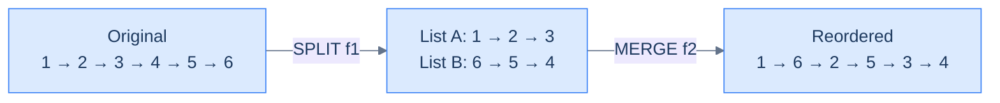
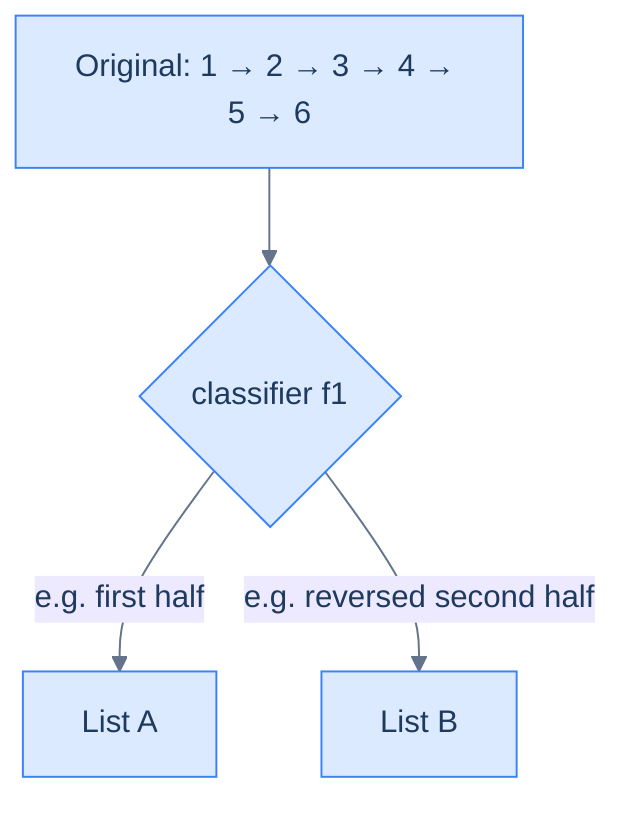
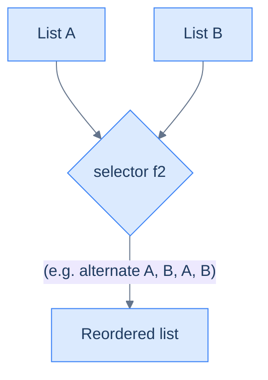
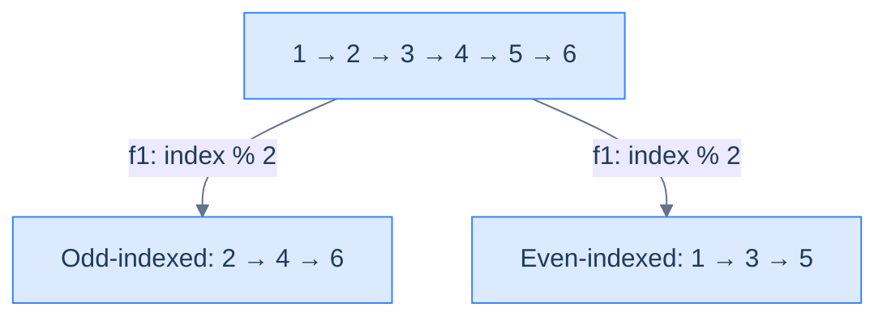
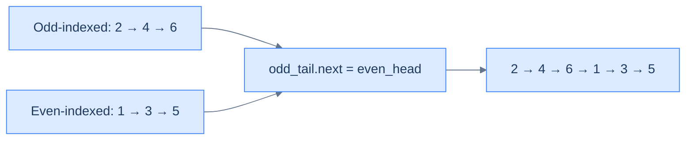

# 12. Pattern: Reorder

## The Hook

You've now met **split** (lesson 10) and **merge** (lesson 11) as separate patterns. Here's the reveal: they were never really separate. They're the two halves of a single technique called **reorder**, and almost every "rearrange the nodes of a list" problem you'll ever see — reverse alternating, move even-to-back, group by parity, interleave halves, shuffle in zig-zag — is just **split followed by merge** with a problem-specific classifier and selector.

The beauty of this framing is that you've already done the hard work. The split routes nodes into sub-lists based on a classifier `f1`. The merge weaves them back together based on a selector `f2`. Picking `f1` and `f2` is the entire problem; the skeleton is two function calls. Once you see this, "reorder the linked list" stops being a scary problem and becomes a fill-in-the-blanks exercise.

This lesson is the **capstone** of the split-merge-reorder trio. Nail it, and you've mastered the most reusable pattern family in linked lists.

---

## Table of contents

1. [Understanding the reorder pattern](#understanding-the-reorder-pattern)
2. [Identifying the reorder pattern](#identifying-the-reorder-pattern)
3. [Relocate node](#relocate-node)
4. [Parity order](#parity-order)
5. [Value partition](#value-partition)
6. [Shuffle list](#shuffle-list)

***

# Understanding the reorder pattern

Some linked list problems require us to reorder the nodes of the given list in place based on some conditions. In most cases, this requires first splitting the list based on the outcome of some function `f1` and then merging back the split list together either by using another function `f2` or simply concatenating them. These are generally **medium** difficulty problems that require either the split or merge technique we learned earlier or both. Many such problems may also require using other techniques, such as the reversal or fast and slow pointer technique.



<p align="center"><strong>Every reorder decomposes into <strong>split</strong> (lesson 10) + <strong>merge</strong> (lesson 11). Split routes nodes into temporary sub-lists; merge weaves them back together in the target order. Two primitives you've already built.</strong></p>

## Reordering technique

Consider that we are given a singly linked list whose nodes must be reordered. The problem almost always has a split function `f1` that we use to split the list into multiple lists using the split technique.

Consider the example execution below, where we use the function `f1` to split the list into two lists such that nodes with even indices go to one list and those with odd indices go to the other list.



<p align="center"><strong>Step 1 — <strong>split</strong>. A classifier <code>f1</code> routes nodes into temporary sub-lists using the pattern from lesson 10. Every reorder begins here.</strong></p>

In most cases, concatenating these split lists to merge them is sufficient, but sometimes, we may also have a function `f2` that must be used to merge the lists. We use the merge technique to merge them back together to solve the problem.

Consider the example execution below, where we use the function `f2` that merges alternate nodes to merge back the split lists starting with the second list, effectively reordering the nodes.



<p align="center"><strong>Step 2 — <strong>merge</strong>. A selector <code>f2</code> weaves the sub-lists back into one using the pattern from lesson 11. The combination of <code>f1</code> and <code>f2</code> IS the reorder algorithm.</strong></p>

The reordering technique is simply a combination of the split and merge techniques used in tandem to reorder nodes in the given list.

## Algorithm

The algorithm given below summarizes the reorder technique for **two** lists. It can be easily extended for `k` lists.

> **Algorithm**
>
> -   **Step 1:** Use the split technique to split the list in **two** using the function `f1`
> -   **Step 2:** Use the merge technique to merge the **two** lists using the function `f2`.
> -   **Step 3:** Return the head of the merged list.

## Implementation

Given below is the generic code implementation to split a list in **two** using the function `f1` and then merging them using the function `f2`.


```pseudocode
# Generic reorder = SPLIT (by f1) + MERGE (by f2). Two phases, two helpers.
function reorderNodes(head, f1, f2):
    # Phase 1 — split.
    dummyA ← new ListNode; tailA ← dummyA
    dummyB ← new ListNode; tailB ← dummyB
    current ← head
    while current is not null:
        if f1(current):
            tailA.next ← current; tailA ← current
        else:
            tailB.next ← current; tailB ← current
        current ← current.next
    tailA.next ← null; tailB.next ← null

    # Phase 2 — merge.
    dummy ← new ListNode; tail ← dummy
    ca ← dummyA.next; cb ← dummyB.next
    while ca is not null AND cb is not null:
        if f2(ca, cb):
            tail.next ← ca; ca ← ca.next
        else:
            tail.next ← cb; cb ← cb.next
        tail ← tail.next
    tail.next ← ca if ca is not null else cb
    return dummy.next
```

```python run
from typing import Callable, Optional

class ListNode:
    def __init__(self, val=0, next=None):
        self.val = val
        self.next = next

def reorder_nodes(head: Optional[ListNode],
                  f1: Callable[[ListNode], bool],
                  f2: Callable[[ListNode, ListNode], bool]) -> Optional[ListNode]:
    # Phase 1 — SPLIT by classifier f1
    dummy_a = ListNode(); tail_a = dummy_a
    dummy_b = ListNode(); tail_b = dummy_b
    current = head
    while current is not None:
        if f1(current):
            tail_a.next = current; tail_a = current
        else:
            tail_b.next = current; tail_b = current
        current = current.next
    tail_a.next = None; tail_b.next = None

    # Phase 2 — MERGE by selector f2
    dummy = ListNode(); tail = dummy
    ca, cb = dummy_a.next, dummy_b.next
    while ca is not None and cb is not None:
        if f2(ca, cb):
            tail.next = ca; ca = ca.next
        else:
            tail.next = cb; cb = cb.next
        tail = tail.next
    tail.next = ca if ca is not None else cb
    return dummy.next
```

```java run
import java.util.function.Predicate;
import java.util.function.BiPredicate;

class Solution {
    public ListNode reorderNodes(ListNode head,
                                 Predicate<ListNode> f1,
                                 BiPredicate<ListNode, ListNode> f2) {
        ListNode dummyA = new ListNode(), tailA = dummyA;
        ListNode dummyB = new ListNode(), tailB = dummyB;
        for (ListNode c = head; c != null; c = c.next) {
            if (f1.test(c)) { tailA.next = c; tailA = c; }
            else             { tailB.next = c; tailB = c; }
        }
        tailA.next = null; tailB.next = null;

        ListNode dummy = new ListNode(), tail = dummy;
        ListNode ca = dummyA.next, cb = dummyB.next;
        while (ca != null && cb != null) {
            if (f2.test(ca, cb)) { tail.next = ca; ca = ca.next; }
            else                  { tail.next = cb; cb = cb.next; }
            tail = tail.next;
        }
        tail.next = (ca != null) ? ca : cb;
        return dummy.next;
    }
}
```

```c run
typedef struct ListNode { int val; struct ListNode *next; } ListNode;

ListNode* reorderNodes(ListNode *head,
                       int (*f1)(ListNode*),
                       int (*f2)(ListNode*, ListNode*)) {
    ListNode dummyA = {0, NULL}, dummyB = {0, NULL};
    ListNode *tailA = &dummyA, *tailB = &dummyB;
    for (ListNode *c = head; c != NULL; c = c->next) {
        if (f1(c)) { tailA->next = c; tailA = c; }
        else        { tailB->next = c; tailB = c; }
    }
    tailA->next = NULL; tailB->next = NULL;

    ListNode dummy = {0, NULL};
    ListNode *tail = &dummy;
    ListNode *ca = dummyA.next, *cb = dummyB.next;
    while (ca != NULL && cb != NULL) {
        if (f2(ca, cb)) { tail->next = ca; ca = ca->next; }
        else             { tail->next = cb; cb = cb->next; }
        tail = tail->next;
    }
    tail->next = (ca != NULL) ? ca : cb;
    return dummy.next;
}
```

```scala run
object Solution {
  def reorderNodes(head: ListNode,
                   f1: ListNode => Boolean,
                   f2: (ListNode, ListNode) => Boolean): ListNode = {
    val dummyA = new ListNode(0); var tailA: ListNode = dummyA
    val dummyB = new ListNode(0); var tailB: ListNode = dummyB
    var c = head
    while (c != null) {
      if (f1(c)) { tailA.next = c; tailA = c }
      else        { tailB.next = c; tailB = c }
      c = c.next
    }
    tailA.next = null; tailB.next = null

    val dummy = new ListNode(0); var tail: ListNode = dummy
    var ca = dummyA.next; var cb = dummyB.next
    while (ca != null && cb != null) {
      if (f2(ca, cb)) { tail.next = ca; ca = ca.next }
      else             { tail.next = cb; cb = cb.next }
      tail = tail.next
    }
    tail.next = if (ca != null) ca else cb
    dummy.next
  }
}
```


## Complexity Analysis

The runtime and space complexity for the reorder technique that splits the list into **two** lists is pretty easy to understand. We traverse the entire list to split it that has a linear **O(N)** runtime complexity. If we only need to concatenate the split lists to merge them, it takes constant **O(1)** time; otherwise, we may need to traverse both split lists completely in the worst case, which has a linear, total **O(N)** runtime complexity. We traverse the entire list to split it in any case, and so the runtime complexity in any case is **O(N)**.

When we reorder a list by splitting it into two, we only create two dummy nodes and update references, so the space complexity is constant, **O(1)**, in any case.

> **Best Case:**
>
> -   Space Complexity - **O(1)**
> -   Time Complexity - **O(N)**
>
> **Worst Case:**
>
> -   Space Complexity - **O(1)**
> -   Time Complexity - **O(N)**

***

# Identifying the reorder pattern

The linked list problems that require reordering in place in the list are the only problems that can be solved using the reorder technique. These are generally **medium** problems where we split the list using some function and then merge them back together using another function. Many such problems also have smaller subproblems that require other techniques like reversal or fast and slow pointers to find the middle. If the problem statement or its solution follows the generic template below, it can be solved by applying the split list technique.

**Template:**

Given a linked list, reorder its nodes.

## Example

Let's consider the following problem as an example to better understand how to identify and solve a problem using the reorder technique.

> **Problem statement:** Given a singly linked list, reorder its nodes so all nodes at even indices come after the nodes at odd indices. The indices start with 1.

```d3 widget=linked-list
{
  "title": "Odd-even index reorder — odd-indexed nodes first, then even-indexed",
  "direction": "single",
  "nodes": [
    {"id": "n0", "value": "1"},
    {"id": "n1", "value": "2"},
    {"id": "n2", "value": "3"},
    {"id": "n3", "value": "4"},
    {"id": "n4", "value": "5"},
    {"id": "n5", "value": "6"}
  ],
  "head": "n0",
  "steps": [
    {
      "links": [["n0","n1"],["n1","n2"],["n2","n3"],["n3","n4"],["n4","n5"]],
      "markers": [{"name": "head", "nodeId": "n0"}],
      "msg": "Before: indices 0..5 with values 1..6"
    },
    {
      "nodes": [
        {"id": "n1", "value": "2"},
        {"id": "n3", "value": "4"},
        {"id": "n5", "value": "6"},
        {"id": "n0", "value": "1"},
        {"id": "n2", "value": "3"},
        {"id": "n4", "value": "5"}
      ],
      "links": [["n1","n3"],["n3","n5"],["n5","n0"],["n0","n2"],["n2","n4"]],
      "markers": [{"name": "head", "nodeId": "n1"}],
      "msg": "After: odd-indexed (2, 4, 6) first, then even-indexed (1, 3, 5)"
    }
  ]
}
```

<p align="center"><strong>Odd-even reorder — example target shape. All nodes at odd indices ([1], [3], [5]) come before all nodes at even indices ([0], [2], [4]). A clean split-then-concatenate case.</strong></p>

### Reorder technique solution

We need to reorder the nodes in the given list, and this fits the generic template from the reorder pattern we learned earlier.

**Template:**

Given a linked list, reorder its nodes.

To reorder the nodes, we use the split technique to split the given linked list into two such that the first and second split lists have all the nodes with odd and even indices nodes, respectively.  We create two dummy nodes `dummyA`, `dummyB` and tail references `tailA` and `tailB` and initialize them with the respective dummy nodes. We initialize a counter variable `index` with 0 and iterate the list from start to end using `current` which is initialized with the head of the list.

In each iteration, we check if the `index` is odd or even and add the `current` node to the end of the correct list using one of the tail references. We then increment `index` and move ahead to repeat the process for the next iteration.



<p align="center"><strong>Split step — classifier <code>f1(node, index) = index % 2</code> routes odd-indexed nodes into one bucket, even-indexed into another. Same mechanics as the split pattern (lesson 10).</strong></p>

We don't need to use the merge technique to merge the lists, as we can concatenate them in this case. We use the tail and dummy references from the split technique to concatenate them by updating references.



<p align="center"><strong>Merge step — the simplest selector <code>f2</code>: concatenate. Append the entire second list after the first by setting <code>odd_tail.next = even_head</code>. One pointer update.</strong></p>

The implementation of the split list solution is given as follows.


```pseudocode
# Group odd-INDEXED nodes first, then even-indexed nodes, preserving relative order.
function evenOddList(head):
    if head is null OR head.next is null: return head
    oddDummy ← new ListNode; evenDummy ← new ListNode
    oddTail ← oddDummy; evenTail ← evenDummy
    current ← head; counter ← 1
    while current is not null:
        if counter mod 2 = 1:
            oddTail.next ← current; oddTail ← current
        else:
            evenTail.next ← current; evenTail ← current
        current ← current.next
        counter ← counter + 1
    oddTail.next ← null; evenTail.next ← null
    oddTail.next ← evenDummy.next                      # concatenate odd → even
    return oddDummy.next
```

```python run
from typing import Optional

class Solution:
    def even_odd_list(self, head: Optional[ListNode]) -> Optional[ListNode]:
        if head is None or head.next is None:
            return head

        # Phase 1 — split by position parity (1-indexed): odd positions → oddList
        odd_dummy, even_dummy = ListNode(), ListNode()
        odd_tail,  even_tail  = odd_dummy, even_dummy
        current, counter = head, 1
        while current is not None:
            if counter % 2 == 1:
                odd_tail.next = current;  odd_tail  = current
            else:
                even_tail.next = current; even_tail = current
            current = current.next
            counter += 1
        odd_tail.next = None; even_tail.next = None

        # Phase 2 — concatenate: odd_tail → even_head
        odd_tail.next = even_dummy.next
        return odd_dummy.next
```

```java run
class Solution {
    public ListNode evenOddList(ListNode head) {
        if (head == null || head.next == null) return head;

        ListNode oddDummy = new ListNode(), oddTail  = oddDummy;
        ListNode evenDummy = new ListNode(), evenTail = evenDummy;
        ListNode current = head;
        int counter = 1;
        while (current != null) {
            if (counter % 2 == 1) { oddTail.next = current; oddTail = current; }
            else                   { evenTail.next = current; evenTail = current; }
            current = current.next;
            counter++;
        }
        evenTail.next = null;
        oddTail.next  = evenDummy.next;     // concatenate
        return oddDummy.next;
    }
}
```

```c run
ListNode* evenOddList(ListNode *head) {
    if (head == NULL || head->next == NULL) return head;

    ListNode oddDummy  = {0, NULL}, evenDummy = {0, NULL};
    ListNode *oddTail  = &oddDummy, *evenTail = &evenDummy;
    ListNode *current = head;
    int counter = 1;
    while (current != NULL) {
        if (counter % 2 == 1) { oddTail->next = current;  oddTail = current; }
        else                   { evenTail->next = current; evenTail = current; }
        current = current->next;
        counter++;
    }
    evenTail->next = NULL;
    oddTail->next  = evenDummy.next;
    return oddDummy.next;
}
```

```scala run
object Solution {
  def evenOddList(head: ListNode): ListNode = {
    if (head == null || head.next == null) return head

    val oddDummy  = new ListNode(0); var oddTail:  ListNode = oddDummy
    val evenDummy = new ListNode(0); var evenTail: ListNode = evenDummy
    var current = head; var counter = 1
    while (current != null) {
      if (counter % 2 == 1) { oddTail.next = current;  oddTail = current }
      else                   { evenTail.next = current; evenTail = current }
      current = current.next
      counter += 1
    }
    evenTail.next = null
    oddTail.next  = evenDummy.next
    oddDummy.next
  }
}
```


The above implementation uses the split list technique to split the list into two lists and merge them together by concatenating them.

## Example problems

Most problems that fall under this category are**medium**problems and can be solved by splitting and then contacting the split list. Sometimes, using the merge technique may be required for merging the split using some function, and often, other techniques like reversal or fast and slow pointer techniques may be needed to solve some subproblems. A list of a few problems is given below.

> -   **[Relocate node](#relocate-node)**
> -   **[Parity order](#parity-order)**
> -   **[Value partition](#value-partition)**
> -   **[Shuffle list](#shuffle-list)**

We will now solve these problems to understand the reorder technique better.

***

# Relocate node

## Problem Statement

Given the **head** of a singly linked list, write a function to move the last node of the list to the start and return the headof the reordered list.

### Example 1

> -   **Input:** head = \[5, 7, 3, 10, 6, 8\]
> -   **Output:** \[8, 5, 7, 3, 10, 6\]
> -   **Explanation:** The last node with the value 8 is moved to the start of the list.

### Example 2

> -   **Input:** head = \[5, 7\]
> -   **Output:** \[7, 5\]
> -   **Explanation:** The last node with the value 7 is moved to the start of the list.

### Example 3

> -   **Input:** head = \[5\]
> -   **Output:** \[5\]
> -   **Explanation:** There is nothing to move as the list only has one node, which is both the first and the last node at the same time.

## Solution


```pseudocode
function splitLastNode(head):
    current ← head; previous ← null
    # Traverse the list until the last node is reached
    while current.next is not null:
        # Keep track of the previous node
        previous ← current
        # Move to the next node
        current ← current.next
    # Disconnect the last node
    if previous is not null:
        previous.next ← null
    # Return {head of remaining list, last node}
    return (head, current)

function mergeLastNode(lastNode, firstNode):
    # If there is no last node, return the first node
    if lastNode is null: return firstNode
    # Connect the last node to the first node
    lastNode.next ← firstNode
    return lastNode

function relocateNode(head):
    # If the list is empty or contains only one node, no need to
    # modify it
    if head is null OR head.next is null: return head
    # Split the last node from the list
    (firstNode, lastNode) ← splitLastNode(head)
    # Merge the last node at the front
    return mergeLastNode(lastNode, firstNode)
```

```python run
from typing import Optional, Tuple

class Solution:
    def split_last_node(
        self, head: ListNode
    ) -> Tuple[ListNode, ListNode]:
        current = head
        previous = None

        # Traverse the list until the last node is reached
        while current.next is not None:

            # Keep track of the previous node
            previous = current

            # Move to the next node
            current = current.next

        # Disconnect the last node
        if previous is not None:
            previous.next = None

        # Return {head of remaining list, last node}
        return head, current

    def merge_last_node(
        self,
        last_node: Optional[ListNode],
        first_node: Optional[ListNode],
    ) -> Optional[ListNode]:

        # If there is no last node, return the first node
        if not last_node:
            return first_node

        # Connect the last node to the first node
        last_node.next = first_node
        return last_node

    def relocate_node(
        self, head: Optional[ListNode]
    ) -> Optional[ListNode]:

        # If the list is empty or contains only one node, no need to
        # modify it
        if not head or not head.next:
            return head

        # Split the last node from the list
        first_node, last_node = self.split_last_node(head)

        # Merge the last node at the front
        return self.merge_last_node(last_node, first_node)
```

```java run
import java.util.*;

class Solution {
    private List<ListNode> splitLastNode(ListNode head) {
        ListNode current = head;
        ListNode previous = null;

        // Traverse the list until the last node is reached
        while (current.next != null) {

            // Keep track of the previous node
            previous = current;

            // Move to the next node
            current = current.next;
        }

        // Disconnect the last node
        if (previous != null) {
            previous.next = null;
        }

        // Return {head of remaining list, last node}
        return Arrays.asList(head, current);
    }

    private ListNode mergeLastNode(ListNode lastNode, ListNode firstNode) {

        // If there is no last node, return the first node
        if (lastNode == null) {
            return firstNode;
        }

        // Connect the last node to the first node
        lastNode.next = firstNode;
        return lastNode;
    }

    public ListNode relocateNode(ListNode head) {

        // If the list is empty or contains only one node, no need to
        // modify it
        if (head == null || head.next == null) {
            return head;
        }

        // Split the last node from the list
        List<ListNode> heads = splitLastNode(head);
        ListNode firstNode = heads.get(0);
        ListNode lastNode = heads.get(1);

        // Merge the last node at the front
        return mergeLastNode(lastNode, firstNode);
    }
}
```

```c run
typedef struct { ListNode *first; ListNode *last; } SplitResult;

static SplitResult splitLastNode(ListNode *head) {
    ListNode *current = head;
    ListNode *previous = NULL;

    /* Traverse the list until the last node is reached */
    while (current->next != NULL) {

        /* Keep track of the previous node */
        previous = current;

        /* Move to the next node */
        current = current->next;
    }

    /* Disconnect the last node */
    if (previous != NULL) {
        previous->next = NULL;
    }

    /* Return {head of remaining list, last node} */
    SplitResult out = {head, current};
    return out;
}

static ListNode* mergeLastNode(ListNode *lastNode, ListNode *firstNode) {

    /* If there is no last node, return the first node */
    if (lastNode == NULL) {
        return firstNode;
    }

    /* Connect the last node to the first node */
    lastNode->next = firstNode;
    return lastNode;
}

ListNode* relocateNode(ListNode *head) {

    /* If the list is empty or contains only one node, no need to
       modify it */
    if (head == NULL || head->next == NULL) {
        return head;
    }

    /* Split the last node from the list */
    SplitResult heads = splitLastNode(head);

    /* Merge the last node at the front */
    return mergeLastNode(heads.last, heads.first);
}
```

```scala run
object Solution {
  private def splitLastNode(head: ListNode): (ListNode, ListNode) = {
    var current = head
    var previous: ListNode = null

    // Traverse the list until the last node is reached
    while (current.next != null) {

      // Keep track of the previous node
      previous = current

      // Move to the next node
      current = current.next
    }

    // Disconnect the last node
    if (previous != null) {
      previous.next = null
    }

    // Return {head of remaining list, last node}
    (head, current)
  }

  private def mergeLastNode(lastNode: ListNode, firstNode: ListNode): ListNode = {

    // If there is no last node, return the first node
    if (lastNode == null) return firstNode

    // Connect the last node to the first node
    lastNode.next = firstNode
    lastNode
  }

  def relocateNode(head: ListNode): ListNode = {

    // If the list is empty or contains only one node, no need to
    // modify it
    if (head == null || head.next == null) return head

    // Split the last node from the list
    val (firstNode, lastNode) = splitLastNode(head)

    // Merge the last node at the front
    mergeLastNode(lastNode, firstNode)
  }
}
```


***

# Parity order

## Problem Statement

Given the **head** of a singly linked list, write a function to group all the nodes that appear on odd indices together, followed by the nodes that appear on even indices, and return the head of the reordered list.  

The indices start with `1`.

### Example 1

> -   **Input:** head = \[2, 1, 3, 4, 8\]
> -   **Output:** \[2, 3, 8, 1, 4\]
> -   **Explanation:** After grouping the nodes at odd indices followed by even indices, the list becomes \[2, 3, 8, 1, 4\].

### Example 2

> -   **Input:** head = \[\]
> -   **Output:** \[\]
> -   **Explanation:** Since the input list is empty, the output list will also be empty.

## Solution


```pseudocode
function splitByParity(head):
    # Initialize head and tail references for the two split lists
    oddDummy ← new ListNode; oddTail ← oddDummy
    evenDummy ← new ListNode; evenTail ← evenDummy
    # Create current reference to iterate through the list
    current ← head
    # To track alternate positions
    counter ← 1
    # Iterate through the list and split nodes into two lists
    while current is not null:
        # If the counter is odd then the node goes to the odd list
        if counter mod 2 = 1:
            # `current` node goes to the odd split list
            oddTail.next ← current
            # Move oddTail forward
            oddTail ← oddTail.next
        else:
            # `current` node goes to the even split list
            evenTail.next ← current
            # Move evenTail forward
            evenTail ← evenTail.next
        # Move to the next node in the original list
        current ← current.next
        counter ← counter + 1
    # Terminate the odd list
    oddTail.next ← null
    # Terminate the even list
    evenTail.next ← null
    return (oddDummy.next, evenDummy.next)

function mergeOddAndEvenLists(oddHead, evenHead):
    # If the odd list is empty return the even list
    if oddHead is null: return evenHead
    # If the even list is empty return the odd list
    if evenHead is null: return oddHead
    # Traverse to the end of the odd list
    current ← oddHead
    while current.next is not null:
        current ← current.next
    # Connect the even list at the end of the odd list
    current.next ← evenHead
    return oddHead

function parityOrder(head):
    # If the list is empty or contains only one node, no splitting is
    # necessary
    if head is null OR head.next is null: return head
    # Split the list odd and even lists
    (oddHead, evenHead) ← splitByParity(head)
    # Append the even list at the end of the odd list and return
    # the head of the merged list
    return mergeOddAndEvenLists(oddHead, evenHead)
```

```python run
from typing import List, Optional

class Solution:
    def split_by_parity(
        self, head: Optional[ListNode]
    ) -> List[Optional[ListNode]]:

        # Initialize head and tail references for the two split lists
        odd_dummy = ListNode(0)
        odd_tail = odd_dummy

        even_dummy = ListNode(0)
        even_tail = even_dummy

        # Create current reference to iterate through the list
        current = head

        # To track alternate positions
        counter = 1

        # Iterate through the list and split nodes into two lists
        while current is not None:

            # If the counter is odd then the node goes to the odd list
            if counter % 2 == 1:

                # `current` node goes to the odd split list
                odd_tail.next = current

                # Move odd_tail forward
                odd_tail = odd_tail.next

            # Otherwise, the node goes to the even list
            else:

                # `current` node goes to the even split list
                even_tail.next = current

                # Move even_tail forward
                even_tail = even_tail.next

            # Move to the next node in the original list
            current = current.next
            counter += 1

        # Terminate the odd list
        odd_tail.next = None

        # Terminate the even list
        even_tail.next = None

        return [odd_dummy.next, even_dummy.next]

    def merge_odd_and_even_lists(
        self, odd_head: Optional[ListNode], even_head: Optional[ListNode]
    ) -> Optional[ListNode]:

        # If the odd list is empty return the even list
        if odd_head is None:
            return even_head

        # If the even list is empty return the odd list
        if even_head is None:
            return odd_head

        # Traverse to the end of the odd list
        current = odd_head
        while current is not None and current.next is not None:
            current = current.next

        # Connect the even list at the end of the odd list
        current.next = even_head
        return odd_head

    def parity_order(
        self, head: Optional[ListNode]
    ) -> Optional[ListNode]:

        # If the list is empty or contains only one node, no splitting
        # is necessary
        if head is None or head.next is None:
            return head

        # Split the list odd and even lists
        odd_head, even_head = self.split_by_parity(head)

        # Append the even list at the end of the odd list and return
        # the head of the merged list
        return self.merge_odd_and_even_lists(odd_head, even_head)
```

```java run
import java.util.*;

class Solution {
    private List<ListNode> splitByParity(ListNode head) {

        // Initialize head and tail references for the two split lists
        ListNode oddDummy = new ListNode(0);
        ListNode oddTail = oddDummy;

        ListNode evenDummy = new ListNode(0);
        ListNode evenTail = evenDummy;

        // Create current reference to iterate through the list
        ListNode current = head;

        // To track alternate positions
        int counter = 1;

        // Iterate through the list and split nodes into two lists
        while (current != null) {

            // If the counter is odd then the node goes to the odd list
            if (counter % 2 == 1) {

                // `current` node goes to the odd split list
                oddTail.next = current;

                // Move oddTail forward
                oddTail = oddTail.next;
            }

            // Otherwise, the node goes to the even list
            else {

                // `current` node goes to the even split list
                evenTail.next = current;

                // Move evenTail forward
                evenTail = evenTail.next;
            }

            // Move to the next node in the original list
            current = current.next;
            counter++;
        }

        // Terminate the odd list
        oddTail.next = null;

        // Terminate the even list
        evenTail.next = null;

        return Arrays.asList(oddDummy.next, evenDummy.next);
    }

    private ListNode mergeOddAndEvenLists(ListNode oddHead, ListNode evenHead) {

        // If the odd list is empty return the even list
        if (oddHead == null) {
            return evenHead;
        }

        // If the even list is empty return the odd list
        if (evenHead == null) {
            return oddHead;
        }

        // Traverse to the end of the odd list
        ListNode current = oddHead;
        while (current != null && current.next != null) {
            current = current.next;
        }

        // Connect the even list at the end of the odd list
        current.next = evenHead;
        return oddHead;
    }

    public ListNode parityOrder(ListNode head) {

        // If the list is empty or contains only one node, no splitting
        // is necessary
        if (head == null || head.next == null) {
            return head;
        }

        // Split the list odd and even lists
        List<ListNode> heads = splitByParity(head);
        ListNode oddHead = heads.get(0);
        ListNode evenHead = heads.get(1);

        // Append the even list at the end of the odd list and return
        // the head of the merged list
        return mergeOddAndEvenLists(oddHead, evenHead);
    }
}
```

```c run
typedef struct { ListNode *odd; ListNode *even; } ParitySplit;

static ParitySplit splitByParity(ListNode *head) {

    /* Initialize head and tail references for the two split lists */
    ListNode oddDummy = {0, NULL};
    ListNode *oddTail = &oddDummy;

    ListNode evenDummy = {0, NULL};
    ListNode *evenTail = &evenDummy;

    /* Create current reference to iterate through the list */
    ListNode *current = head;

    /* To track alternate positions */
    int counter = 1;

    /* Iterate through the list and split nodes into two lists */
    while (current != NULL) {

        /* If the counter is odd then the node goes to the odd list */
        if (counter % 2 == 1) {

            /* `current` node goes to the odd split list */
            oddTail->next = current;

            /* Move oddTail forward */
            oddTail = oddTail->next;
        }

        /* Otherwise, the node goes to the even list */
        else {

            /* `current` node goes to the even split list */
            evenTail->next = current;

            /* Move evenTail forward */
            evenTail = evenTail->next;
        }

        /* Move to the next node in the original list */
        current = current->next;
        counter++;
    }

    /* Terminate the odd list */
    oddTail->next = NULL;

    /* Terminate the even list */
    evenTail->next = NULL;

    ParitySplit out = {oddDummy.next, evenDummy.next};
    return out;
}

static ListNode* mergeOddAndEvenLists(ListNode *oddHead, ListNode *evenHead) {

    /* If the odd list is empty return the even list */
    if (oddHead == NULL) {
        return evenHead;
    }

    /* If the even list is empty return the odd list */
    if (evenHead == NULL) {
        return oddHead;
    }

    /* Traverse to the end of the odd list */
    ListNode *current = oddHead;
    while (current != NULL && current->next != NULL) {
        current = current->next;
    }

    /* Connect the even list at the end of the odd list */
    current->next = evenHead;
    return oddHead;
}

ListNode* parityOrder(ListNode *head) {

    /* If the list is empty or contains only one node, no splitting
       is necessary */
    if (head == NULL || head->next == NULL) {
        return head;
    }

    /* Split the list odd and even lists */
    ParitySplit heads = splitByParity(head);

    /* Append the even list at the end of the odd list and return
       the head of the merged list */
    return mergeOddAndEvenLists(heads.odd, heads.even);
}
```

```scala run
object Solution {
  private def splitByParity(head: ListNode): (ListNode, ListNode) = {

    // Initialize head and tail references for the two split lists
    val oddDummy = new ListNode(0)
    var oddTail: ListNode = oddDummy

    val evenDummy = new ListNode(0)
    var evenTail: ListNode = evenDummy

    // Create current reference to iterate through the list
    var current = head

    // To track alternate positions
    var counter = 1

    // Iterate through the list and split nodes into two lists
    while (current != null) {

      // If the counter is odd then the node goes to the odd list
      if (counter % 2 == 1) {

        // `current` node goes to the odd split list
        oddTail.next = current

        // Move oddTail forward
        oddTail = oddTail.next
      }
      // Otherwise, the node goes to the even list
      else {

        // `current` node goes to the even split list
        evenTail.next = current

        // Move evenTail forward
        evenTail = evenTail.next
      }

      // Move to the next node in the original list
      current = current.next
      counter += 1
    }

    // Terminate the odd list
    oddTail.next = null

    // Terminate the even list
    evenTail.next = null

    (oddDummy.next, evenDummy.next)
  }

  private def mergeOddAndEvenLists(oddHead: ListNode, evenHead: ListNode): ListNode = {

    // If the odd list is empty return the even list
    if (oddHead == null) return evenHead

    // If the even list is empty return the odd list
    if (evenHead == null) return oddHead

    // Traverse to the end of the odd list
    var current = oddHead
    while (current != null && current.next != null) {
      current = current.next
    }

    // Connect the even list at the end of the odd list
    current.next = evenHead
    oddHead
  }

  def parityOrder(head: ListNode): ListNode = {

    // If the list is empty or contains only one node, no splitting
    // is necessary
    if (head == null || head.next == null) return head

    // Split the list odd and even lists
    val (oddHead, evenHead) = splitByParity(head)

    // Append the even list at the end of the odd list and return
    // the head of the merged list
    mergeOddAndEvenLists(oddHead, evenHead)
  }
}
```


***

# Value partition

## Problem Statement

Given the **head** of a singly linked list and a value **X**, write a function to partition the list such that all nodes less than X come before nodes greater than or equal to X and return the head of the reordered list. The original relative order of the nodes in each of the two partitions should be preserved.

### Example 1

> -   **Input:** head = \[1, 4, 3, 2, 5, 2\], X = 3
> -   **Output:** \[1, 2, 2, 4, 3, 5\]
> -   **Explanation:** Nodes with values 1, 2, and 2 are less than 3. Therefore, they will be placed before the nodes with values greater than or equal to 3.

### Example 2

> -   **Input:** head = \[2, 1\], X = 2
> -   **Output:** \[1, 2\]
> -   **Explanation:** Node with value 1 is less than 2. Therefore, it will be placed before the nodes with values greater than or equal to 2.

## Solution


```pseudocode
function splitListByValue(head, X):
    # Create dummy nodes to initialize the heads of two separate
    # lists. List for nodes with values less than X.
    lessHead ← new ListNode; lessTail ← lessHead
    # List for nodes with values greater than or equal to X.
    greaterHead ← new ListNode; greaterTail ← greaterHead
    # Start traversing the original list from the head.
    current ← head
    # Traverse and split nodes based on the value of X.
    while current is not null:
        # If the value of the current node is less than X, it should
        # be appended to the list for nodes < X.
        if current.val < X:
            lessTail.next ← current
            lessTail ← lessTail.next
        # Otherwise, the value of the current node is greater than
        # or equal to X, and it should be appended to the list for
        # nodes >= X.
        else:
            greaterTail.next ← current
            greaterTail ← greaterTail.next
        # Proceed to the next node in the original list.
        current ← current.next
    # End both lists by setting the next pointers of their tails to
    # null.
    lessTail.next ← null
    greaterTail.next ← null
    return (lessHead.next, greaterHead.next)

function mergeLessAndGreaterLists(lessHead, greaterHead):
    # If the first list (lessHead) is empty, return greaterHead as
    # the concatenated list.
    if lessHead is null: return greaterHead
    # If the second list (greaterHead) is empty, return lessHead as
    # the concatenated list.
    if greaterHead is null: return lessHead
    # Find the end of the first list (lessHead) to append greaterHead.
    current ← lessHead
    while current.next is not null:
        current ← current.next
    # Append greaterHead to the end of lessHead.
    current.next ← greaterHead
    return lessHead

function valuePartition(head, X):
    # Return the head if the list is empty or has only one node.
    if head is null OR head.next is null: return head
    # Split the original list into two lists: nodes < X and nodes >= X.
    (lessHead, greaterHead) ← splitListByValue(head, X)
    # Merge both lists and return the head of the combined list.
    return mergeLessAndGreaterLists(lessHead, greaterHead)
```

```python run
from typing import List, Optional

class Solution:
    def split_list_by_value(
        self, head: Optional[ListNode], X: int
    ) -> List[Optional[ListNode]]:

        # Create dummy nodes to initialize the heads of two separate
        # lists. List for nodes with values less than X.
        less_head = ListNode(0)
        less_tail = less_head

        # List for nodes with values greater than or equal to X.
        greater_head = ListNode(0)
        greater_tail = greater_head

        # Start traversing the original list from the head.
        current = head

        # Traverse and split nodes based on the value of X.
        while current is not None:

            # If the value of the current node is less than X, it
            # should be appended to the list for nodes < X.
            if current.val < X:

                # Append current node to list for nodes < X.
                less_tail.next = current

                # Move less_tail to the newly added node.
                less_tail = less_tail.next

            # Otherwise, the value of the current node is greater
            # than or equal to X, and it should be appended to the
            # list for nodes >= X.
            else:

                # Append current node to list for nodes >= X.
                greater_tail.next = current

                # Move greater_tail to the newly added node.
                greater_tail = greater_tail.next

            # Proceed to the next node in the original list.
            current = current.next

        # End both lists by setting the next pointers of their tails
        # to None.
        less_tail.next = None
        greater_tail.next = None

        # Return heads of both lists, excluding dummy nodes.
        return [less_head.next, greater_head.next]

    def merge_less_and_greater_lists(
        self,
        less_head: Optional[ListNode],
        greater_head: Optional[ListNode],
    ) -> Optional[ListNode]:

        # If the first list (less_head) is empty, return greater_head
        # as the concatenated list.
        if less_head is None:
            return greater_head

        # If the second list (greater_head) is empty, return less_head
        # as the concatenated list.
        if greater_head is None:
            return less_head

        # Find the end of the first list (less_head) to append
        # greater_head.
        current = less_head
        while current is not None and current.next is not None:
            current = current.next

        # Append greater_head to the end of less_head.
        current.next = greater_head
        return less_head

    def value_partition(
        self, head: Optional[ListNode], X: int
    ) -> Optional[ListNode]:

        # Return the head if the list is empty or has only one node.
        if head is None or head.next is None:
            return head

        # Split the original list into two lists: nodes < X and nodes
        # >= X.
        less_head, greater_head = self.split_list_by_value(head, X)

        # Merge both lists and return the head of the combined list.
        return self.merge_less_and_greater_lists(less_head, greater_head)
```

```java run
import java.util.*;

class Solution {
    private List<ListNode> splitListByValue(ListNode head, int X) {

        // Create dummy nodes to initialize the heads of two separate
        // lists. List for nodes with values less than X.
        ListNode lessHead = new ListNode(0);
        ListNode lessTail = lessHead;

        // List for nodes with values greater than or equal to X.
        ListNode greaterHead = new ListNode(0);
        ListNode greaterTail = greaterHead;

        // Start traversing the original list from the head.
        ListNode current = head;

        // Traverse and split nodes based on the value of X.
        while (current != null) {

            // If the value of the current node is less than X, it
            // should be appended to the list for nodes < X.
            if (current.val < X) {

                // Append current node to list for nodes < X.
                lessTail.next = current;

                // Move lessTail to the newly added node.
                lessTail = lessTail.next;
            }

            // Otherwise, the value of the current node is greater
            // than or equal to X, and it should be appended to the
            // list for nodes >= X.
            else {

                // Append current node to list for nodes >= X.
                greaterTail.next = current;

                // Move greaterTail to the newly added node.
                greaterTail = greaterTail.next;
            }

            // Proceed to the next node in the original list.
            current = current.next;
        }

        // End both lists by setting the next pointers of their tails
        // to null.
        lessTail.next = null;
        greaterTail.next = null;

        // Return heads of both lists, excluding dummy nodes.
        return Arrays.asList(lessHead.next, greaterHead.next);
    }

    private ListNode mergeLessAndGreaterLists(ListNode lessHead, ListNode greaterHead) {

        // If the first list (lessHead) is empty, return greaterHead
        // as the concatenated list.
        if (lessHead == null) {
            return greaterHead;
        }

        // If the second list (greaterHead) is empty, return lessHead
        // as the concatenated list.
        if (greaterHead == null) {
            return lessHead;
        }

        // Find the end of the first list (lessHead) to append
        // greaterHead.
        ListNode current = lessHead;
        while (current != null && current.next != null) {
            current = current.next;
        }

        // Append greaterHead to the end of lessHead.
        current.next = greaterHead;
        return lessHead;
    }

    public ListNode valuePartition(ListNode head, int X) {

        // Return the head if the list is empty or has only one node.
        if (head == null || head.next == null) {
            return head;
        }

        // Split the original list into two lists: nodes < X and
        // nodes >= X.
        List<ListNode> heads = splitListByValue(head, X);

        // Head of list with nodes < X.
        ListNode lessHead = heads.get(0);

        // Head of list with nodes >= X.
        ListNode greaterHead = heads.get(1);

        // Merge both lists and return the head of the combined list.
        return mergeLessAndGreaterLists(lessHead, greaterHead);
    }
}
```

```c run
typedef struct { ListNode *less; ListNode *greater; } ValueSplit;

static ValueSplit splitListByValue(ListNode *head, int X) {

    /* Create dummy nodes to initialize the heads of two separate
       lists. List for nodes with values less than X. */
    ListNode lessHead = {0, NULL};
    ListNode *lessTail = &lessHead;

    /* List for nodes with values greater than or equal to X. */
    ListNode greaterHead = {0, NULL};
    ListNode *greaterTail = &greaterHead;

    /* Start traversing the original list from the head. */
    ListNode *current = head;

    /* Traverse and split nodes based on the value of X. */
    while (current != NULL) {

        /* If the value of the current node is less than X, it should
           be appended to the list for nodes < X. */
        if (current->val < X) {

            /* Append current node to list for nodes < X. */
            lessTail->next = current;

            /* Move lessTail to the newly added node. */
            lessTail = lessTail->next;
        }

        /* Otherwise, the value of the current node is greater than
           or equal to X, and it should be appended to the list for
           nodes >= X. */
        else {

            /* Append current node to list for nodes >= X. */
            greaterTail->next = current;

            /* Move greaterTail to the newly added node. */
            greaterTail = greaterTail->next;
        }

        /* Proceed to the next node in the original list. */
        current = current->next;
    }

    /* End both lists by setting the next pointers of their tails to
       NULL. */
    lessTail->next = NULL;
    greaterTail->next = NULL;

    ValueSplit out = {lessHead.next, greaterHead.next};
    return out;
}

static ListNode* mergeLessAndGreaterLists(ListNode *lessHead, ListNode *greaterHead) {

    /* If the first list (lessHead) is empty, return greaterHead as
       the concatenated list. */
    if (lessHead == NULL) {
        return greaterHead;
    }

    /* If the second list (greaterHead) is empty, return lessHead as
       the concatenated list. */
    if (greaterHead == NULL) {
        return lessHead;
    }

    /* Find the end of the first list (lessHead) to append
       greaterHead. */
    ListNode *current = lessHead;
    while (current != NULL && current->next != NULL) {
        current = current->next;
    }

    /* Append greaterHead to the end of lessHead. */
    current->next = greaterHead;
    return lessHead;
}

ListNode* valuePartition(ListNode *head, int X) {

    /* Return the head if the list is empty or has only one node. */
    if (head == NULL || head->next == NULL) {
        return head;
    }

    /* Split the original list into two lists: nodes < X and
       nodes >= X. */
    ValueSplit heads = splitListByValue(head, X);

    /* Merge both lists and return the head of the combined list. */
    return mergeLessAndGreaterLists(heads.less, heads.greater);
}
```

```scala run
object Solution {
  private def splitListByValue(head: ListNode, X: Int): (ListNode, ListNode) = {

    // Create dummy nodes to initialize the heads of two separate
    // lists. List for nodes with values less than X.
    val lessHead = new ListNode(0)
    var lessTail: ListNode = lessHead

    // List for nodes with values greater than or equal to X.
    val greaterHead = new ListNode(0)
    var greaterTail: ListNode = greaterHead

    // Start traversing the original list from the head.
    var current = head

    // Traverse and split nodes based on the value of X.
    while (current != null) {

      // If the value of the current node is less than X, it should
      // be appended to the list for nodes < X.
      if (current.val < X) {

        // Append current node to list for nodes < X.
        lessTail.next = current

        // Move lessTail to the newly added node.
        lessTail = lessTail.next
      }
      // Otherwise, the value of the current node is greater than or
      // equal to X, and it should be appended to the list for
      // nodes >= X.
      else {

        // Append current node to list for nodes >= X.
        greaterTail.next = current

        // Move greaterTail to the newly added node.
        greaterTail = greaterTail.next
      }

      // Proceed to the next node in the original list.
      current = current.next
    }

    // End both lists by setting the next pointers of their tails to
    // null.
    lessTail.next = null
    greaterTail.next = null

    (lessHead.next, greaterHead.next)
  }

  private def mergeLessAndGreaterLists(lessHead: ListNode, greaterHead: ListNode): ListNode = {

    // If the first list (lessHead) is empty, return greaterHead as
    // the concatenated list.
    if (lessHead == null) return greaterHead

    // If the second list (greaterHead) is empty, return lessHead as
    // the concatenated list.
    if (greaterHead == null) return lessHead

    // Find the end of the first list (lessHead) to append
    // greaterHead.
    var current = lessHead
    while (current != null && current.next != null) {
      current = current.next
    }

    // Append greaterHead to the end of lessHead.
    current.next = greaterHead
    lessHead
  }

  def valuePartition(head: ListNode, X: Int): ListNode = {

    // Return the head if the list is empty or has only one node.
    if (head == null || head.next == null) return head

    // Split the original list into two lists: nodes < X and
    // nodes >= X.
    val (lessHead, greaterHead) = splitListByValue(head, X)

    // Merge both lists and return the head of the combined list.
    mergeLessAndGreaterLists(lessHead, greaterHead)
  }
}
```


***

# Shuffle list

## Problem Statement

Given the **head** of a singly linked list that can be represented as **L0 -> L1 -> … -> Ln - 1 -> Ln**. Reorder the list **in place** to match the following format: 

**L0 -> Ln -> L1 -> Ln - 1 -> L2 -> Ln - 2 -> …**

### Example 1

> -   **Input:** head = \[1, 2, 3, 4\]
> -   **Output:** \[1, 4, 2, 3\]
> -   **Explanation:** After reordering, the list becomes \[1, 4, 2, 3\].

### Example 2

> -   **Input:** head = \[1, 2, 3, 4, 5\]
> -   **Output:** \[1, 5, 2, 4, 3\]
> -   **Explanation:** After reordering, the list becomes \[1, 5, 2, 4, 3\].

## Solution


```pseudocode
function reverseList(head):
    current ← head; previous ← null
    while current is not null:
        nextNode ← current.next
        current.next ← previous
        previous ← current
        current ← nextNode
    return previous

function splitListInHalf(head):
    # Initialize slow and fast pointers to find the middle of the
    # list
    slow ← head; fast ← head; prevToSlow ← null
    # Move slow by one and fast by two nodes until fast reaches the
    # end
    while fast is not null AND fast.next is not null:
        prevToSlow ← slow
        slow ← slow.next
        fast ← fast.next.next
    # Split for even length list
    if fast is null:
        secondHalf ← prevToSlow.next
        prevToSlow.next ← null
    # Split for odd length list
    else:
        secondHalf ← slow.next
        slow.next ← null
    return (head, secondHalf)

function mergeAlternateNodes(firstHalf, secondHalf):
    # Create a dummy node to form the merged list
    dummy ← new ListNode; tail ← dummy
    # Boolean to switch between nodes from each list
    mergeFirst ← true
    # Alternate between the nodes of each list
    while firstHalf is not null AND secondHalf is not null:
        if mergeFirst:
            tail.next ← firstHalf; firstHalf ← firstHalf.next
        else:
            tail.next ← secondHalf; secondHalf ← secondHalf.next
        tail ← tail.next
        mergeFirst ← NOT mergeFirst
    # Append any remaining nodes from firstHalf or secondHalf
    if firstHalf is not null:
        tail.next ← firstHalf
    else if secondHalf is not null:
        tail.next ← secondHalf
    return dummy.next

function shuffleList(head):
    # No need to reorder if the list is empty or has only one element
    if head is null OR head.next is null: return head
    # Split the list into two halves
    (firstHalf, secondHalf) ← splitListInHalf(head)
    # Reverse the second half of the list
    reversedSecondHalf ← reverseList(secondHalf)
    # Alternatively merge the first list and the reversed second list
    return mergeAlternateNodes(firstHalf, reversedSecondHalf)
```

```python run
from typing import List, Optional

class Solution:
    def reverse_list(
        self, head: Optional[ListNode]
    ) -> Optional[ListNode]:
        current = head
        previous = None

        while current is not None:
            next_node = current.next
            current.next = previous
            previous = current
            current = next_node

        return previous

    def split_list_in_half(
        self, head: Optional[ListNode]
    ) -> List[Optional[ListNode]]:

        # Initialize slow and fast pointers to find the middle of the
        # list
        slow = head
        fast = head
        prev_to_slow = None

        # Move slow by one and fast by two nodes until fast reaches
        # the end
        while fast is not None and fast.next is not None:
            prev_to_slow = slow
            slow = slow.next
            fast = fast.next.next

        # Split for even length list
        if fast is None:
            second_half = prev_to_slow.next
            prev_to_slow.next = None

        # Split for odd length list
        else:
            second_half = slow.next
            slow.next = None

        return [head, second_half]

    def merge_alternate_nodes(
        self,
        first_half: Optional[ListNode],
        second_half: Optional[ListNode],
    ) -> Optional[ListNode]:

        # Create a dummy node to form the merged list
        dummy = ListNode(0)
        tail = dummy

        # Boolean to switch between nodes from each list
        merge_first = True

        # Alternate between the nodes of each list
        while first_half is not None and second_half is not None:
            if merge_first:
                tail.next = first_half
                first_half = first_half.next
            else:
                tail.next = second_half
                second_half = second_half.next
            tail = tail.next
            merge_first = not merge_first

        # Append any remaining nodes from first_half or second_half
        if first_half is not None:
            tail.next = first_half
        elif second_half is not None:
            tail.next = second_half

        return dummy.next

    def shuffle_list(
        self, head: Optional[ListNode]
    ) -> Optional[ListNode]:

        # No need to reorder if the list is empty or has only one
        # element
        if head is None or head.next is None:
            return head

        # Split the list into two halves
        first_half, second_half = self.split_list_in_half(head)

        # Reverse the second half of the list
        reversed_second_half = self.reverse_list(second_half)

        # Alternatively merge the first list and the reversed second
        # list
        return self.merge_alternate_nodes(first_half, reversed_second_half)
```

```java run
import java.util.*;

class Solution {
    private ListNode reverseList(ListNode head) {
        ListNode current = head;
        ListNode previous = null;

        while (current != null) {
            ListNode nextNode = current.next;
            current.next = previous;
            previous = current;
            current = nextNode;
        }

        return previous;
    }

    private List<ListNode> splitListInHalf(ListNode head) {

        // Initialize slow and fast pointers to find the middle of the
        // list
        ListNode slow = head, fast = head;
        ListNode prevToSlow = null;

        // Move slow by one and fast by two nodes until fast reaches
        // the end
        while (fast != null && fast.next != null) {
            prevToSlow = slow;
            slow = slow.next;
            fast = fast.next.next;
        }

        ListNode secondHalf;

        // Split for even length list
        if (fast == null) {
            secondHalf = prevToSlow.next;
            prevToSlow.next = null;
        }

        // Split for odd length list
        else {
            secondHalf = slow.next;
            slow.next = null;
        }

        return Arrays.asList(head, secondHalf);
    }

    private ListNode mergeAlternateNodes(ListNode firstHalf, ListNode secondHalf) {

        // Create a dummy node to form the merged list
        ListNode dummy = new ListNode(0);
        ListNode tail = dummy;

        // Boolean to switch between nodes from each list
        boolean mergeFirst = true;

        // Alternate between the nodes of each list
        while (firstHalf != null && secondHalf != null) {
            if (mergeFirst) {
                tail.next = firstHalf;
                firstHalf = firstHalf.next;
                tail = tail.next;
            } else {
                tail.next = secondHalf;
                secondHalf = secondHalf.next;
                tail = tail.next;
            }

            mergeFirst = !mergeFirst;
        }

        // Append any remaining nodes from firstHalf or secondHalf
        if (firstHalf != null) {
            tail.next = firstHalf;
        } else if (secondHalf != null) {
            tail.next = secondHalf;
        }

        return dummy.next;
    }

    public ListNode shuffleList(ListNode head) {

        // No need to reorder if the list is empty or has only one
        // element
        if (head == null || head.next == null) {
            return head;
        }

        // Split the list in two halves
        List<ListNode> heads = splitListInHalf(head);
        ListNode firstHalf = heads.get(0);
        ListNode secondHalf = heads.get(1);

        // Reverse the second half of the list
        ListNode reversedSecondHalf = reverseList(secondHalf);

        // Alternatively merged the first list and the reversed second
        // list
        return mergeAlternateNodes(firstHalf, reversedSecondHalf);
    }
}
```

```c run
typedef struct { ListNode *first; ListNode *second; } HalfSplit;

static ListNode* reverseList(ListNode *head) {
    ListNode *current = head;
    ListNode *previous = NULL;

    while (current != NULL) {
        ListNode *nextNode = current->next;
        current->next = previous;
        previous = current;
        current = nextNode;
    }

    return previous;
}

static HalfSplit splitListInHalf(ListNode *head) {

    /* Initialize slow and fast pointers to find the middle of the
       list */
    ListNode *slow = head, *fast = head;
    ListNode *prevToSlow = NULL;

    /* Move slow by one and fast by two nodes until fast reaches the
       end */
    while (fast != NULL && fast->next != NULL) {
        prevToSlow = slow;
        slow = slow->next;
        fast = fast->next->next;
    }

    ListNode *secondHalf;

    /* Split for even length list */
    if (fast == NULL) {
        secondHalf = prevToSlow->next;
        prevToSlow->next = NULL;
    }

    /* Split for odd length list */
    else {
        secondHalf = slow->next;
        slow->next = NULL;
    }

    HalfSplit out = {head, secondHalf};
    return out;
}

static ListNode* mergeAlternateNodes(ListNode *firstHalf, ListNode *secondHalf) {

    /* Create a dummy node to form the merged list */
    ListNode dummy = {0, NULL};
    ListNode *tail = &dummy;

    /* Boolean to switch between nodes from each list */
    int mergeFirst = 1;

    /* Alternate between the nodes of each list */
    while (firstHalf != NULL && secondHalf != NULL) {
        if (mergeFirst) {
            tail->next = firstHalf;
            firstHalf = firstHalf->next;
            tail = tail->next;
        } else {
            tail->next = secondHalf;
            secondHalf = secondHalf->next;
            tail = tail->next;
        }

        mergeFirst = !mergeFirst;
    }

    /* Append any remaining nodes from firstHalf or secondHalf */
    if (firstHalf != NULL) {
        tail->next = firstHalf;
    } else if (secondHalf != NULL) {
        tail->next = secondHalf;
    }

    return dummy.next;
}

ListNode* shuffleList(ListNode *head) {

    /* No need to reorder if the list is empty or has only one
       element */
    if (head == NULL || head->next == NULL) {
        return head;
    }

    /* Split the list in two halves */
    HalfSplit heads = splitListInHalf(head);

    /* Reverse the second half of the list */
    ListNode *reversedSecondHalf = reverseList(heads.second);

    /* Alternatively merged the first list and the reversed second
       list */
    return mergeAlternateNodes(heads.first, reversedSecondHalf);
}
```

```scala run
object Solution {
  private def reverseList(head: ListNode): ListNode = {
    var current = head
    var previous: ListNode = null

    while (current != null) {
      val nextNode = current.next
      current.next = previous
      previous = current
      current = nextNode
    }

    previous
  }

  private def splitListInHalf(head: ListNode): (ListNode, ListNode) = {

    // Initialize slow and fast pointers to find the middle of the
    // list
    var slow = head
    var fast = head
    var prevToSlow: ListNode = null

    // Move slow by one and fast by two nodes until fast reaches the
    // end
    while (fast != null && fast.next != null) {
      prevToSlow = slow
      slow = slow.next
      fast = fast.next.next
    }

    var secondHalf: ListNode = null

    // Split for even length list
    if (fast == null) {
      secondHalf = prevToSlow.next
      prevToSlow.next = null
    }
    // Split for odd length list
    else {
      secondHalf = slow.next
      slow.next = null
    }

    (head, secondHalf)
  }

  private def mergeAlternateNodes(firstHalfArg: ListNode, secondHalfArg: ListNode): ListNode = {
    var firstHalf = firstHalfArg
    var secondHalf = secondHalfArg

    // Create a dummy node to form the merged list
    val dummy = new ListNode(0)
    var tail: ListNode = dummy

    // Boolean to switch between nodes from each list
    var mergeFirst = true

    // Alternate between the nodes of each list
    while (firstHalf != null && secondHalf != null) {
      if (mergeFirst) {
        tail.next = firstHalf
        firstHalf = firstHalf.next
        tail = tail.next
      } else {
        tail.next = secondHalf
        secondHalf = secondHalf.next
        tail = tail.next
      }

      mergeFirst = !mergeFirst
    }

    // Append any remaining nodes from firstHalf or secondHalf
    if (firstHalf != null) {
      tail.next = firstHalf
    } else if (secondHalf != null) {
      tail.next = secondHalf
    }

    dummy.next
  }

  def shuffleList(head: ListNode): ListNode = {

    // No need to reorder if the list is empty or has only one
    // element
    if (head == null || head.next == null) return head

    // Split the list in two halves
    val (firstHalf, secondHalf) = splitListInHalf(head)

    // Reverse the second half of the list
    val reversedSecondHalf = reverseList(secondHalf)

    // Alternatively merged the first list and the reversed second
    // list
    mergeAlternateNodes(firstHalf, reversedSecondHalf)
  }
}
```


***

## Final Takeaway

Reorder is the composition of two patterns you already know:

```
def reorder(head):
    sub_lists = split(head, classifier = f1)   # lesson 10
    return merge(*sub_lists, selector = f2)    # lesson 11
```

Picking `f1` and `f2` specialises the template to any reorder problem:

| Problem | `f1` (split classifier) | `f2` (merge selector) |
|---|---|---|
| Odd/even index split | `i % 2` | concatenate |
| Zig-zag reorder (1st, last, 2nd, 2nd-last, ...) | first half / reversed second half | alternate A, B, A, B |
| Parity partition (odd values first) | `val % 2` | concatenate |
| Value partition (<, ≥ pivot) | `val < pivot` | concatenate |
| Pure shuffle into alternating even-odd | index parity | alternate A, B, A, B |

Four insights worth burning in:

| Insight | Why it matters |
|---|---|
| Reorder = split + merge | Stop inventing bespoke algorithms for each reorder variant. Reuse the two primitives. |
| Classifier + selector are the whole problem | The template is 5 lines. Every variant customises exactly two functions. |
| Reversing a sub-list is a valid `f1` extension | For zig-zag reorder, split the list at the middle and reverse the second half — then the merge selector is plain alternation. |
| O(n) time, O(1) extra space | Every node is visited once in split, once in merge. No allocations beyond a few dummy heads. |

When you next see "rearrange in place", "reorder by pattern", "zig-zag", "partition", "shuffle by index" — reach for `split → merge` first. Pick your `f1` and `f2` and ship it.

> **Transfer Challenge:** Given a linked list `1 → 2 → 3 → 4 → 5 → 6`, produce the zig-zag reorder `1 → 6 → 2 → 5 → 3 → 4`. What are your `f1` and `f2`?
>
> <details><summary><strong>Solution hint</strong></summary>
>
> <strong>f1</strong> — split at the middle (using the fast-and-slow pattern from lesson 9), then <strong>reverse the second half</strong> (using the reversal pattern from lesson 6). You end with two lists: <code>1 → 2 → 3</code> and <code>6 → 5 → 4</code>.<br>
> <strong>f2</strong> — alternate-fuse A, B, A, B (the selector from the merge lesson).<br>
> Result: <code>1 → 6 → 2 → 5 → 3 → 4</code>. This problem alone touches <strong>four</strong> patterns you've learned — reversal, fast-and-slow, split, and merge. That's the power of composing primitives.
>
> </details>
