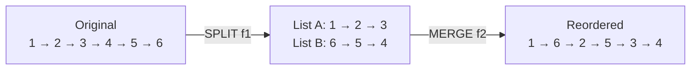
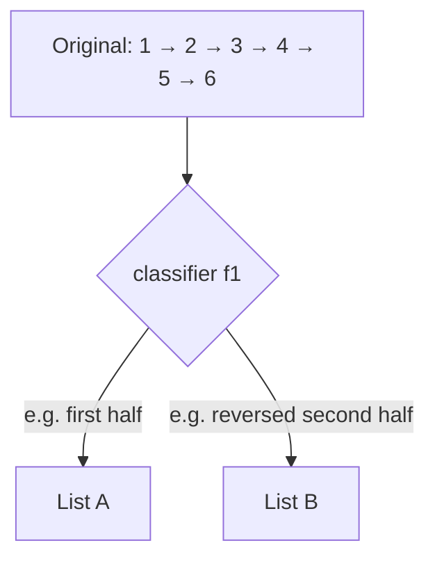
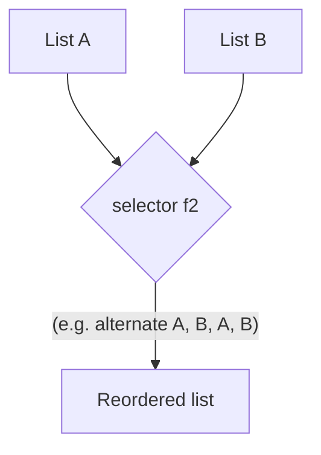
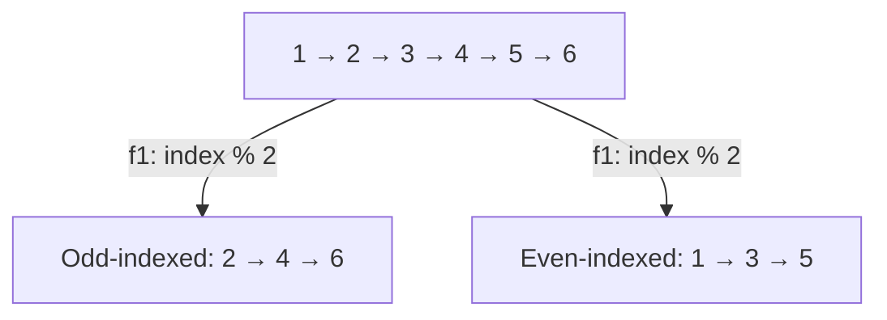
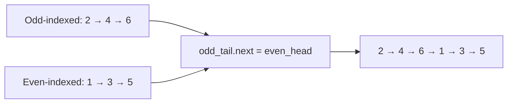

# Understanding the reorder pattern

Some linked list problems require us to reorder the nodes of the given list in place based on some conditions. In most cases, this requires first splitting the list based on the outcome of some function `f1` and then merging back the split list together either by using another function `f2` or simply concatenating them. These are generally **medium** difficulty problems that require either the split or merge technique we learned earlier or both. Many such problems may also require using other techniques, such as the reversal or fast and slow pointer technique.

> 🖼 Diagram — Every reorder decomposes into split (lesson 10) + merge (lesson 11). Split routes nodes into temporary sub-lists; merge weaves them back together in the target order. Two primitives you've already built.


<p align="center"><strong>Every reorder decomposes into <strong>split</strong> (lesson 10) + <strong>merge</strong> (lesson 11). Split routes nodes into temporary sub-lists; merge weaves them back together in the target order. Two primitives you've already built.</strong></p>

## Reordering technique

Consider that we are given a singly linked list whose nodes must be reordered. The problem almost always has a split function `f1` that we use to split the list into multiple lists using the split technique.

Consider the example execution below, where we use the function `f1` to split the list into two lists such that nodes with even indices go to one list and those with odd indices go to the other list.

> 🖼 Diagram — Step 1 — split. A classifier f1 routes nodes into temporary sub-lists using the pattern from lesson 10. Every reorder begins here.


<p align="center"><strong>Step 1 — <strong>split</strong>. A classifier <code>f1</code> routes nodes into temporary sub-lists using the pattern from lesson 10. Every reorder begins here.</strong></p>

In most cases, concatenating these split lists to merge them is sufficient, but sometimes, we may also have a function `f2` that must be used to merge the lists. We use the merge technique to merge them back together to solve the problem.

Consider the example execution below, where we use the function `f2` that merges alternate nodes to merge back the split lists starting with the second list, effectively reordering the nodes.

> 🖼 Diagram — Step 2 — merge. A selector f2 weaves the sub-lists back into one using the pattern from lesson 11. The combination of f1 and f2 IS the reorder algorithm.


<p align="center"><strong>Step 2 — <strong>merge</strong>. A selector <code>f2</code> weaves the sub-lists back into one using the pattern from lesson 11. The combination of <code>f1</code> and <code>f2</code> IS the reorder algorithm.</strong></p>

The reordering technique is simply a combination of the split and merge techniques used in tandem to reorder nodes in the given list.

## Algorithm

The algorithm given below summarizes the reorder technique for **two** lists. It can be easily extended for `k` lists.

> **Algorithm**
>
> -   **Step 1:** Use the split technique to split the list in **two** using the function `f1`
> -   **Step 2:** Use the merge technique to merge the **two** lists using the function `f2`.
> -   **Step 3:** Return the head of the merged list.

## Implementation

Given below is the generic code implementation to split a list in **two** using the function `f1` and then merging them using the function `f2`.


```python run

"""
Definition for singly-linked list.
class ListNode:
    def __init__(self, val):
        self.val = val
        self.next = None
"""

def reorder_nodes(head: ListNode) -> ListNode:
    # Create dummy nodes and tail references for the two split lists
    dummyA = ListNode(0)
    tailA = dummyA

    dummyB = ListNode(0)
    tailB = dummyB

    # Create current reference to iterate through the list
    current = head

    while current is not None:
        # Use the function `f1` to decide which list this node should go to
        split_first = f1(current)

        if split_first:
            # `current` node goes to the first split list
            tailA.next = current
            tailA = tailA.next  # Move tailA forward
        else:
            # `current` node goes to the second split list
            tailB.next = current
            tailB = tailB.next  # Move tailB forward

        # Move to the next node in the original list
        current = current.next

    # Ensure the two split lists end properly
    tailA.next = None
    tailB.next = None

    # Move ahead dummy nodes of split lists to hold the real head
    currentA = dummyA.next
    currentB = dummyB.next

    # Create dummy node and tail reference for the merged list
    dummy = ListNode(0)
    tail = dummy

    while currentA is not None and currentB is not None:
        # Use the function `f2` to determine which node to merge
        mergeA = f2(currentA, currentB)

        if mergeA:
            tail.next = currentA  # Merge node from currentA
            currentA = currentA.next  # Move currentA forward
        else:
            tail.next = currentB  # Merge node from currentB
            currentB = currentB.next  # Move currentB forward

        # Move tail forward to the merged node
        tail = tail.next

    # If currentA is not completely traversed, attach remaining nodes
    if currentA is not None:
        tail.next = currentA

    # If currentB is not completely traversed, attach remaining nodes
    if currentB is not None:
        tail.next = currentB

    # Capture the merged list's head
    new_head = dummy.next

    return new_head
```

```java run

/**
 * Definition for singly-linked list.
 * class ListNode {
 *     int val;
 *     ListNode next;
 *     ListNode() {}
 *     ListNode(int val) { this.val = val; }
 * };
 */

class ReorderNodes {
    // Function to reorder nodes based on conditions defined by f1 and f2
    public ListNode reorderNodes(ListNode head) {
        // Create dummy nodes and tail references for the two split lists
        ListNode dummyA = new ListNode(0);
        ListNode tailA = dummyA;

        ListNode dummyB = new ListNode(0);
        ListNode tailB = dummyB;

        // Create current reference to iterate through the list
        ListNode current = head;

        while (current != null) {
            // Use the function `f1` to decide which list this node should go to
            boolean splitFirst = f1(current);

            if (splitFirst) {
                // `current` node goes to the first split list
                tailA.next = current;
                tailA = tailA.next; // Move tailA forward
            } else {
                // `current` node goes to the second split list
                tailB.next = current;
                tailB = tailB.next; // Move tailB forward
            }

            // Move to the next node in the original list
            current = current.next;
        }

        // Ensure the two split lists end properly
        tailA.next = null;
        tailB.next = null;

        // Move ahead dummy nodes of split lists to hold the real head
        ListNode currentA = dummyA.next;
        ListNode currentB = dummyB.next;

        // Dummy nodes are not needed anymore, no delete operation in Java

        // Create dummy node and tail reference for the merged list
        ListNode dummy = new ListNode(0);
        ListNode tail = dummy;

        while (currentA != null && currentB != null) {
            // Use the function `f2` to determine which node to merge
            boolean mergeA = f2(currentA, currentB);

            if (mergeA) {
                tail.next = currentA; // Merge node from currentA
                currentA = currentA.next; // Move currentA forward
            } else {
                tail.next = currentB; // Merge node from currentB
                currentB = currentB.next; // Move currentB forward
            }

            // Move tail forward to the merged node
            tail = tail.next;
        }

        // If currentA is not completely traversed, attach remaining nodes
        if (currentA != null) {
            tail.next = currentA;
        }

        // If currentB is not completely traversed, attach remaining nodes
        if (currentB != null) {
            tail.next = currentB;
        }

        // Capture the merged list's head
        ListNode newHead = dummy.next;

        return newHead;
    }

    // Placeholder for the function `f1`, which decides how to split the nodes
    private boolean f1(ListNode node) {
        // Implement your condition for splitting nodes
        return node.val % 2 == 0; // Example: send even-valued nodes to list A
    }

    // Placeholder for the function `f2`, which decides how to merge nodes
    private boolean f2(ListNode a, ListNode b) {
        // Implement your condition for merging nodes
        return a.val <= b.val; // Example: merge nodes in ascending order
    }
}
```


## Complexity Analysis

The runtime and space complexity for the reorder technique that splits the list into **two** lists is pretty easy to understand. We traverse the entire list to split it that has a linear **O(N)** runtime complexity. If we only need to concatenate the split lists to merge them, it takes constant **O(1)** time; otherwise, we may need to traverse both split lists completely in the worst case, which has a linear, total **O(N)** runtime complexity. We traverse the entire list to split it in any case, and so the runtime complexity in any case is **O(N)**.

When we reorder a list by splitting it into two, we only create two dummy nodes and update references, so the space complexity is constant, **O(1)**, in any case.

> **Best Case:**
>
> -   Space Complexity - **O(1)**
> -   Time Complexity - **O(N)**
>
> **Worst Case:**
>
> -   Space Complexity - **O(1)**
> -   Time Complexity - **O(N)**

# Identifying the reorder pattern

The linked list problems that require reordering in place in the list are the only problems that can be solved using the reorder technique. These are generally **medium** problems where we split the list using some function and then merge them back together using another function. Many such problems also have smaller subproblems that require other techniques like reversal or fast and slow pointers to find the middle. If the problem statement or its solution follows the generic template below, it can be solved by applying the split list technique.

**Template:**

Given a linked list, reorder its nodes.

## Example

Let's consider the following problem as an example to better understand how to identify and solve a problem using the reorder technique.

> **Problem statement:** Given a singly linked list, reorder its nodes so all nodes at even indices come after the nodes at odd indices. The indices start with 1.

> ▶ Interactive Diagram — Odd-even reorder — example target shape. All nodes at odd indices ([1], [3], [5]) come before all nodes at even indices ([0], [2], [4]). A clean split-then-concatenate case.
```d3 widget=linked-list
{
  "title": "Odd-even index reorder — odd-indexed nodes first, then even-indexed",
  "direction": "single",
  "nodes": [
    {"id": "n0", "value": "1"},
    {"id": "n1", "value": "2"},
    {"id": "n2", "value": "3"},
    {"id": "n3", "value": "4"},
    {"id": "n4", "value": "5"},
    {"id": "n5", "value": "6"}
  ],
  "head": "n0",
  "steps": [
    {
      "links": [["n0","n1"],["n1","n2"],["n2","n3"],["n3","n4"],["n4","n5"]],
      "markers": [{"name": "head", "nodeId": "n0"}],
      "msg": "Before: indices 0..5 with values 1..6"
    },
    {
      "nodes": [
        {"id": "n1", "value": "2"},
        {"id": "n3", "value": "4"},
        {"id": "n5", "value": "6"},
        {"id": "n0", "value": "1"},
        {"id": "n2", "value": "3"},
        {"id": "n4", "value": "5"}
      ],
      "links": [["n1","n3"],["n3","n5"],["n5","n0"],["n0","n2"],["n2","n4"]],
      "markers": [{"name": "head", "nodeId": "n1"}],
      "msg": "After: odd-indexed (2, 4, 6) first, then even-indexed (1, 3, 5)"
    }
  ]
}
```

<p align="center"><strong>Odd-even reorder — example target shape. All nodes at odd indices ([1], [3], [5]) come before all nodes at even indices ([0], [2], [4]). A clean split-then-concatenate case.</strong></p>

### Reorder technique solution

We need to reorder the nodes in the given list, and this fits the generic template from the reorder pattern we learned earlier.

**Template:**

Given a linked list, reorder its nodes.

To reorder the nodes, we use the split technique to split the given linked list into two such that the first and second split lists have all the nodes with odd and even indices nodes, respectively.  We create two dummy nodes `dummyA`, `dummyB` and tail references `tailA` and `tailB` and initialize them with the respective dummy nodes. We initialize a counter variable `index` with 0 and iterate the list from start to end using `current` which is initialized with the head of the list.

In each iteration, we check if the `index` is odd or even and add the `current` node to the end of the correct list using one of the tail references. We then increment `index` and move ahead to repeat the process for the next iteration.

> 🖼 Diagram — Split step — classifier f1(node, index) = index % 2 routes odd-indexed nodes into one bucket, even-indexed into another. Same mechanics as the split pattern (lesson 10).


<p align="center"><strong>Split step — classifier <code>f1(node, index) = index % 2</code> routes odd-indexed nodes into one bucket, even-indexed into another. Same mechanics as the split pattern (lesson 10).</strong></p>

We don't need to use the merge technique to merge the lists, as we can concatenate them in this case. We use the tail and dummy references from the split technique to concatenate them by updating references.

> 🖼 Diagram — Merge step — the simplest selector f2: concatenate. Append the entire second list after the first by setting odd_tail.next = even_head. One pointer update.


<p align="center"><strong>Merge step — the simplest selector <code>f2</code>: concatenate. Append the entire second list after the first by setting <code>odd_tail.next = even_head</code>. One pointer update.</strong></p>

The implementation of the split list solution is given as follows.


```python run
"""
Definition for singly-linked list.
class ListNode:
    def __init__(self, val):
        self.val = val
        self.next = None
"""

from typing import Optional, List

class Solution:
    def split_by_parity(
        self, head: Optional[ListNode]
    ) -> List[Optional[ListNode]]:

        # Initialize head and tail references for the two split lists
        odd_dummy = ListNode(0)
        odd_tail = odd_dummy

        even_dummy = ListNode(0)
        even_tail = even_dummy

        # Create current reference to iterate through the list
        current = head

        # To track alternate positions
        counter = 1

        # Iterate through the list and split nodes into two lists
        while current is not None:

            # If the counter is odd then the node goes to the odd list
            if counter % 2 == 1:

                # `current` node goes to the odd split list
                odd_tail.next = current

                # Move odd_tail forward
                odd_tail = odd_tail.next

            # Otherwise, the node goes to the even list
            else:

                # `current` node goes to the even split list
                even_tail.next = current

                # Move even_tail forward
                even_tail = even_tail.next

            # Move to the next node in the original list
            current = current.next
            counter += 1

        # Terminate the odd list
        odd_tail.next = None

        # Terminate the even list
        even_tail.next = None

        return [odd_dummy.next, even_dummy.next]

    def merge_odd_and_even_lists(
        self, odd_head: Optional[ListNode], even_head: Optional[ListNode]
    ) -> Optional[ListNode]:

        # If the odd list is empty return the even list
        if odd_head is None:
            return even_head

        # If the even list is empty return the odd list
        if even_head is None:
            return odd_head

        # Traverse to the end of the odd list
        current = odd_head
        while current is not None and current.next is not None:
            current = current.next

        # Connect the even list at the end of the odd list
        current.next = even_head
        return odd_head

    def even_odd_list(
        self, head: Optional[ListNode]
    ) -> Optional[ListNode]:

        # If the list is empty or contains only one node, no splitting is
        # necessary
        if head is None or head.next is None:
            return head

        # Split the list odd and even lists
        odd_head, even_head = self.split_by_parity(head)

        # Append the even list at the end of the odd list and return
        # the head of the merged list
        return self.merge_odd_and_even_lists(odd_head, even_head)
```

```java run
import java.util.*;

/**
 * Definition for singly-linked list.
 * class ListNode {
 *     int val;
 *     ListNode next;
 *     ListNode() {}
 *     ListNode(int val) { this.val = val; }
 * };
 */

class Solution {
    public List<ListNode> splitByParity(ListNode head) {

        // Initialize head and tail references for the two split lists
        ListNode oddDummy = new ListNode(0);
        ListNode oddTail = oddDummy;

        ListNode evenDummy = new ListNode(0);
        ListNode evenTail = evenDummy;

        // Create current reference to iterate through the list
        ListNode current = head;

        // To track alternate positions
        int counter = 1;

        // Iterate through the list and split nodes into two lists
        while (current != null) {

            // If the counter is odd then the node goes to the odd list
            if (counter % 2 == 1) {

                // `current` node goes to the odd split list
                oddTail.next = current;

                // Move oddTail forward
                oddTail = oddTail.next;
            }

            // Otherwise, the node goes to the even list
            else {

                // `current` node goes to the even split list
                evenTail.next = current;

                // Move evenTail forward
                evenTail = evenTail.next;
            }

            // Move to the next node in the original list
            current = current.next;
            counter++;
        }

        // Terminate the odd list
        oddTail.next = null;

        // Terminate the even list
        evenTail.next = null;

        return Arrays.asList(oddDummy.next, evenDummy.next);
    }

    public ListNode mergeOddAndEvenLists(
        ListNode oddHead,
        ListNode evenHead
    ) {

        // If the odd list is empty return the even list
        if (oddHead == null) {
            return evenHead;
        }

        // If the even list is empty return the odd list
        if (evenHead == null) {
            return oddHead;
        }

        // Traverse to the end of the odd list
        ListNode current = oddHead;
        while (current != null && current.next != null) {
            current = current.next;
        }

        // Connect the even list at the end of the odd list
        current.next = evenHead;
        return oddHead;
    }

    public ListNode evenOddList(ListNode head) {

        // If the list is empty or contains only one node, no splitting
        // is necessary
        if (head == null || head.next == null) {
            return head;
        }

        // Split the list odd and even lists
        List<ListNode> heads = splitByParity(head);
        ListNode oddHead = heads.get(0);
        ListNode evenHead = heads.get(1);

        // Append the even list at the end of the odd list and return
        // the head of the merged list
        return mergeOddAndEvenLists(oddHead, evenHead);
    }
}
```


The above implementation uses the split list technique to split the list into two lists and merge them together by concatenating them.

## Example problems

Most problems that fall under this category are **medium** problems and can be solved by splitting the list and then concatenating the sub-lists. Sometimes, the merge technique is needed to weave the sub-lists together under a non-trivial selector, and often other techniques like reversal or the fast-and-slow pointer technique are needed to solve sub-problems before the merge runs. A list of a few problems is given below.

> -   **[Relocate node](#relocate-node)**
> -   **[Parity order](#parity-order)**
> -   **[Value partition](#value-partition)**
> -   **[Shuffle list](#shuffle-list)**

We will now solve these problems to understand the reorder technique better.

---

## Understanding the Pattern

### Why Naive Isn't Enough

Reordering a linked list by **copying every value into an array, rearranging the array under the target rule, and rebuilding a fresh list** works, but it concedes both of the linked list's structural advantages. The auxiliary array costs `O(n)` extra memory, and rebuilding the output allocates `n` brand-new nodes when the input nodes were already perfectly good objects to reuse. The garbage collector inherits `n` unreachable originals to sweep up, and any caller holding a pointer into the input chain is now pointing into orphaned memory.

To make this concrete: with the input `[1, 2, 3, 4, 5, 6]` and the target reorder `[1, 6, 2, 5, 3, 4]`, the copy approach allocates 6 new nodes, fills an auxiliary array of length 6, then walks that array to wire the output. The original 6 nodes become garbage even though the answer only required rewriting their `.next` fields. The reorder technique instead splits the input into temporary sub-lists and merges them under a selector — no allocation, no GC churn, and the input node identities are preserved.

So the key idea is: every reorder problem is the composition of two patterns already in your toolkit. A classifier `f1` routes nodes into temporary sub-lists (the split pattern from the previous lesson), then a selector `f2` weaves those sub-lists back into one output (the merge pattern). Both passes are `O(n)` time and `O(1)` extra space; together they form a two-pass algorithm with the same asymptotic cost as the naive copy-rebuild but none of its allocation overhead.

### The Core Idea

The pattern asks one question: **can the target reorder be expressed as "split the input by classifier `f1`, then merge the sub-lists by selector `f2`"?**

The single mechanism that drives every variant is the **split-then-merge pipeline**:

- **`f1` — the classifier.** Reads one node (and optionally a counter like its index) and returns the id of the sub-list it belongs to. The split pass routes nodes into `k` buckets using `f1`, exactly as the split pattern does.
- **`f2` — the selector.** Reads the current heads of the sub-lists and returns the winner that becomes the next output node. The merge pass walks the buckets and splices in lockstep, exactly as the merge pattern does. For the simplest reorders, `f2` degenerates to plain concatenation — append bucket B after bucket A in one splice.
- **The two sub-lists in between.** Temporary structures with dummy heads and tail cursors. They exist only between the split and the merge — the input nodes flow through them once.

To make this concrete: with the input `[1, 2, 3, 4, 5, 6]` and a target of "all odd-indexed nodes first, then all even-indexed nodes," `f1(node, index) = index % 2` routes nodes into bucket A (odd indices) and bucket B (even indices). `f2` is plain concatenation — append B after A. No node is copied; only `.next` fields are rewritten across two passes.

The core insight is: the pipeline body is **identical across every reorder variant** — only `f1` and `f2` change. Parity reorder uses `f1 = index % 2` and `f2 = concatenate`. Value partition uses `f1 = (val < pivot)` and `f2 = concatenate`. Zig-zag shuffle uses `f1 = (first half / reversed second half)` and `f2 = alternate A, B, A, B`. The split-and-merge skeleton is the same; the two functions are the whole problem.

### How the Pointers Move

Across the split pass, one cursor walks the input and two tail cursors grow the sub-lists. Each iteration reads `current`, evaluates `f1(current)`, then performs three pointer updates: `bucket_tail.next = current` (splice into the chosen bucket), advance `current = current.next` (move forward in the input), and advance the chosen `bucket_tail` (so the next splice lands at the new bucket end). After the loop, both `bucket_tail.next` fields are set to `null` to terminate the sub-lists cleanly — without this step, the buckets would still chain into stale input suffixes.

Across the merge pass, two cursors walk the sub-lists and one tail cursor grows the output. Each iteration reads the heads, evaluates `f2(headA, headB)`, splices the winner onto the output tail, advances the chosen sub-list's cursor, and advances the output tail. When one sub-list empties first, the drain step attaches the other's remaining suffix in one splice — the same trick the merge pattern uses, for the same reason: the suffix is already correctly chained.

Crucially, every `.next` rewrite is paired with a cursor advance, and the rewrite happens *before* the input cursor moves. Reading first and writing later preserves the link to the next node so we don't lose the rest of the input mid-splice. The split pass's bucket-termination step is the one extra discipline beyond the merge pattern: it severs the bucket from the residual input chain so the merge pass doesn't accidentally walk past the end of a bucket into stale memory.

---

## Variants / Taxonomy

The pattern shows up in four recognisable variants. Each picks a different `(f1, f2)` pair, but every variant calls the same split-then-merge pipeline.

- **Concatenate after split (`f2` = concatenate)** — the simplest variant. `f1` routes nodes into two buckets; `f2` appends bucket B after bucket A in one splice. Used by parity-order, value-partition, and relocate-node. Total work is `O(n)` time, `O(1)` extra space.
- **Alternate-fuse after split (`f2` = boolean flip)** — the zig-zag variant. `f1` produces two sub-lists (often "first half" and "reversed second half"); `f2` flips a boolean each tick to alternate `A, B, A, B`. Used by shuffle-list. The boolean is stateful but trivially `O(1)`.
- **Reverse-then-merge (split pre-pass + alternate `f2`)** — a sub-variant of the alternate-fuse case where `f1` is not a simple classifier but a *transformation* on a sub-list: split at the middle (fast-and-slow pattern) and reverse the second half (reversal pattern). The merge pass then alternates between the first half and the reversed second half.
- **Move-one-node (degenerate split)** — when the reorder only relocates a single node. `f1` walks to the boundary node and splits it off; `f2` is a trivial pointer rewrite. Used by relocate-node, where the last node is moved to the front in a single re-splice. Asymptotically `O(n)` time, `O(1)` space — the same envelope as the heavier variants.

The variants share an invariant: the split pass terminates each bucket's tail with `null`, and the merge pass restores connectivity by splicing buckets back into one chain. Cost is `O(n)` time, `O(1)` extra space across the board; the only allocation is a handful of dummy nodes used as splice anchors.

---

## Recognition Checklist

The pattern fits when **all four** answers are "yes". The first asks whether the problem shape is a reorder; the next three check that the split-and-merge pipeline applies cleanly.

- Does the problem require **rearranging the nodes of one input list in place**, producing an output that contains the same nodes in a different order?
- Can the target order be expressed as **"route nodes by an `O(1)` classifier `f1`, then weave them back by an `O(1)` selector `f2`"** — without sorting, without random access, without re-reading the list multiple times?
- Are the resulting sub-lists **bounded in count** (typically two, occasionally `k`) and consumable in one forward pass during the merge?
- Is **`O(1)` extra space** sufficient for the buckets and merge state? The only allocations should be dummy heads — one per bucket plus one for the output.

Common surface signals: "reorder in place," "group by parity," "partition around a value," "zig-zag the list," "shuffle by index," "interleave first half with reversed second half."

---

## Canonical Example: Parity Order Reorder

**Problem:** Given the head of a singly linked list, group all nodes at odd indices first, followed by all nodes at even indices, and return the head of the reordered list. Indices start at `1`.

```
Input:  head = [2, 1, 3, 4, 8]
Output: [2, 3, 8, 1, 4]
```

### Brute Force: Copy Values, Reorder, Rebuild

Walk the list and copy every value into two auxiliary arrays — one for odd-indexed values, one for even-indexed. Concatenate the arrays. Rebuild a fresh linked list by allocating `n` new nodes and chaining them in the new order.

```
Pass 1: walk head → odd_vals = [2, 3, 8], even_vals = [1, 4].
Concatenate → [2, 3, 8, 1, 4].
Pass 2: allocate 5 new ListNodes; wire them as 2 → 3 → 8 → 1 → 4 → null.
Return new head.
```

The brute force is correct, but it pays `O(n)` extra space for the arrays and allocates `n` brand-new nodes the GC must later sweep up. The original 5 input nodes become garbage even though their `.next` fields were the only thing that needed to change.

### Key Insight: Indices Are Cheap, Splicing Is Free

If the classifier `f1(node, index) = index % 2` can be evaluated in `O(1)` while we walk the list, we can route nodes into two sub-lists during a single forward pass — no auxiliary arrays needed. The merge step then degenerates to a single splice: append the even-indexed sub-list after the odd-indexed sub-list by setting `odd_tail.next = even_head`. One pointer update.

### Optimized Solution: Split by Index Parity, Then Concatenate

The two-pass solution runs in `O(n)` time and `O(1)` extra space. `f1 = index % 2` (1 → odd bucket, 0 → even bucket). `f2 = concatenate` (append the even bucket after the odd bucket). The Python and Java implementations are in the `## Implementation` block above and reappear in `02-problems/02-parity-order.md`.

### Trace

```
head = 2 → 1 → 3 → 4 → 8 → null
Indices (1-based) per node: [1, 2, 3, 4, 5].

Init: odd_dummy = ⊙_o, odd_tail = ⊙_o,
      even_dummy = ⊙_e, even_tail = ⊙_e,
      current = head (=2), counter = 1.

Split pass:
Iter 1: counter=1 (odd)  → splice 2 onto odd_tail.   odd: ⊙_o → 2.   counter=2, current = 1.
Iter 2: counter=2 (even) → splice 1 onto even_tail.  even: ⊙_e → 1.  counter=3, current = 3.
Iter 3: counter=3 (odd)  → splice 3 onto odd_tail.   odd: ⊙_o → 2 → 3.   counter=4, current = 4.
Iter 4: counter=4 (even) → splice 4 onto even_tail.  even: ⊙_e → 1 → 4.  counter=5, current = 8.
Iter 5: counter=5 (odd)  → splice 8 onto odd_tail.   odd: ⊙_o → 2 → 3 → 8.   counter=6, current = null.

Terminate buckets: odd_tail.next = null, even_tail.next = null.
Real heads:        odd_head = 2,         even_head = 1.

Merge pass (concatenate):
Walk odd_head to its tail (the 8). Set 8.next = even_head (=1).
Result: 2 → 3 → 8 → 1 → 4 → null.

Return odd_head = the first 2. ✓
```

### Fitting the Template

| Check | Answer for Parity Order |
|---|---|
| **Q1.** Does the problem rearrange the nodes of one input list in place? | **Yes** — the output contains the same five nodes as the input, with their `.next` fields rewired into a new order. |
| **Q2.** Can the target be expressed as classifier + selector? | **Yes** — `f1(node, index) = index % 2` routes nodes into two buckets in `O(1)` per node; `f2 = concatenate` weaves them back in `O(1)` once the bucket tails are known. |
| **Q3.** Are the sub-lists bounded in count and walkable in one pass? | **Yes** — exactly two buckets (odd-indexed, even-indexed); both are consumed in the merge pass by a single splice. |
| **Q4.** Is `O(1)` extra space sufficient? | **Yes** — two dummy heads plus four cursors (`odd_dummy`, `odd_tail`, `even_dummy`, `even_tail`, `current`, `counter`) regardless of input size. |

All four answers are "yes", so the reorder pattern applies. The split pass routes nodes into the two buckets in one walk; the merge pass concatenates them in one splice. Total cost: `O(n)` time, `O(1)` extra space.

---

## Problems in This Category

| Problem | Variant | How the pipeline fits |
|---|---|---|
| **[Relocate Node](02-problems/01-relocate-node.md)** | Move-one-node (degenerate split) | `f1` walks to the last node and severs it; `f2` is a one-line splice that prepends the severed node onto the head |
| **[Parity Order](02-problems/02-parity-order.md)** | Concatenate after split | `f1 = index % 2` routes into odd / even buckets; `f2 = concatenate` appends the even bucket after the odd bucket |
| **[Value Partition](02-problems/03-value-partition.md)** | Concatenate after split | `f1 = (val < pivot)` routes into less / greater-or-equal buckets; `f2 = concatenate` appends the greater bucket after the less bucket |
| **[Shuffle List](02-problems/04-shuffle-list.md)** | Reverse-then-merge | `f1` splits at the middle and reverses the second half (fast-and-slow + reversal patterns); `f2` alternates `A, B, A, B` |

Difficulty grows with how much `f1` does. Relocate-node has a trivial split; parity-order and value-partition use a one-line classifier; shuffle-list's `f1` itself composes two earlier patterns before the merge selector ever runs.
