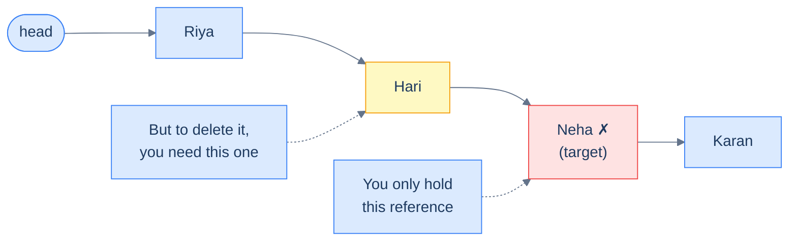
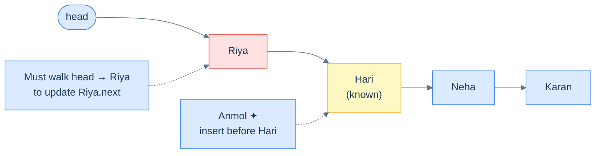
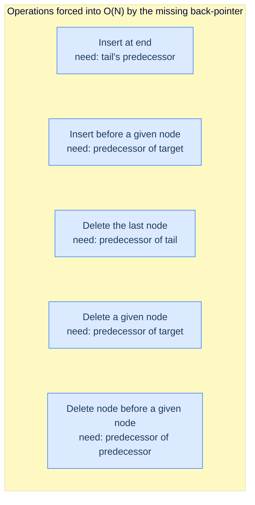
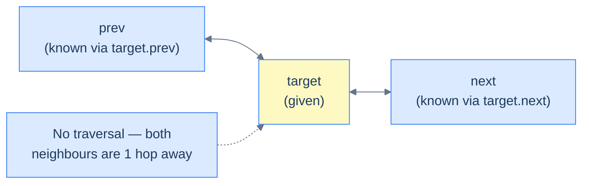
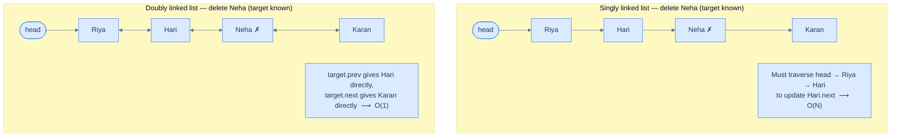
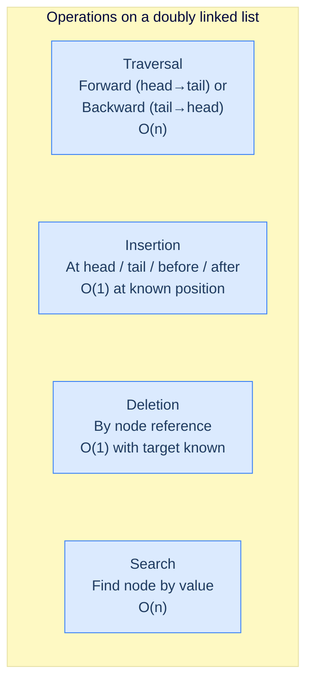

# 1. Introduction to Doubly Linked Lists

## The Hook

You're standing in the middle of a long conga line. The music stops, and someone at the front yells: *"Ravi, step out — and Anmol, slot in just before Hari."* Easy enough… except your line is a **singly linked list**. You know who's *in front of* you. You have **no idea** who's behind. To remove Ravi or place Anmol, somebody has to start from the front of the conga line and shuffle all the way down until they find the person standing right behind the spot you care about. For a thousand-person line, that's a thousand taps on shoulders just to fix one position.

What if every person in the line held *two* hands — one reaching forward, one reaching backward? Then "the person before you" is no longer a mystery hiding `n` steps away — it's the hand on your shoulder. Removing Ravi or inserting Anmol becomes a four-pointer reshuffle done **on the spot**, in constant time.

That's a **doubly linked list**. One extra pointer per node, and three of the singly linked list's worst pain points — *insert before*, *delete here*, *walk backward* — collapse from O(n) to O(1). It's the data structure behind your browser's back/forward buttons, every LRU cache in production, the undo/redo stack in your editor, and the deque inside Python's `collections`. Master it once, and you'll see its silhouette everywhere.

---

## Table of contents

1. [Understanding the problem](#understanding-the-problem)
2. [Exploring a possible solution](#exploring-a-possible-solution)
3. [Defining a node in doubly linked list](#defining-a-node-in-doubly-linked-list)
4. [Structure of a doubly linked list](#structure-of-a-doubly-linked-list)
5. [Overview of supported operations](#overview-of-supported-operations)
6. [Internal mechanics](#internal-mechanics)
7. [Working example](#working-example)
8. [Edge cases and pitfalls](#edge-cases-and-pitfalls)
9. [Production reality](#production-reality)
10. [Quiz](#quiz)
11. [Practice ladder](#practice-ladder)
12. [Further reading](#further-reading)
13. [Cross-links](#cross-links)
14. [Final takeaway](#final-takeaway)

***

# Understanding the problem

Despite the many amazing benefits that singly linked lists offer, they still have limitations. To better understand doubly linked lists, let us look at common problems programmers face when using singly linked lists.

Let's revisit our example from the singly linked list course. In that course, we collected the names of all the students in a class and used a singly linked list to represent that information.

```d2
direction: right

head: head {
  shape: oval
}

n1: |md
  **Riya**

  next: ●
|
n2: |md
  **Hari**

  next: ●
|
n3: |md
  **Neha**

  next: ●
|
n4: |md
  **Karan**

  next: null
|

head -> n1
n1 -> n2
n2 -> n3
n3 -> n4
```

<p align="center"><strong>Names of students in the class represented as a singly linked list — each node points only forward, and the list is entered through the <code>head</code> reference.</strong></p>

Consider a scenario where Neha leaves the class and transfers to another school. Even if we have the node storing Neha's information, deleting it is still not easy. To delete a node in a singly linked list, we need access to the node **1 step before** the node that has to be deleted. It is *that* node whose `next` pointer has to be updated to skip Neha. This operation has a worst-case time complexity of **O(N)**, because we might have to traverse the entire list from the head just to land on the node sitting one step before Neha. For very large lists, this is brutally inefficient.



<p align="center"><strong>Deletion in a singly linked list — even with a direct reference to Neha, you cannot delete her without first walking from the head to find the node before her. That walk costs O(N).</strong></p>

Now, consider a case where we have a new student, Anmol, join the class, and we want to insert a node storing her information **before** Hari. Just like deletion, even if we have access to the node storing Hari's information, we still need to traverse the entire list to access the node **1 step before** Hari, because *that* node's `next` pointer has to be redirected to point at Anmol. Again, this operation has a worst-case time complexity of **O(N)** — and again, it's the *backward link we don't have* that costs us.



<p align="center"><strong>Insertion before a known node — the node before Hari (Riya) is the one whose <code>next</code> must change, but a singly linked list provides no shortcut to reach it. Another O(N) traversal.</strong></p>

## Limitations of singly linked lists

Even though we can solve the problem using a singly linked list, it is not the best solution. This is because singly linked lists have a structural blind spot: **every node only knows what's ahead of it, never what's behind**. The moment a task requires reasoning *backward*, we are forced into a full forward traversal from the head.



<p align="center"><strong>Every one of these operations is slow for the same reason — the structure cannot answer "who is behind me?" in O(1).</strong></p>

> The following operations have poor performance in singly linked lists:
>
> -   Insert at end
> -   Insert before a given node
> -   Delete the last node
> -   Delete the given node
> -   Delete node before a given node

What if we had a data structure that could solve the above problem most efficiently? *(Hint: we just need to teach every node a single new fact about itself.)*

***

# Exploring a possible solution

Now that we know the limitations of singly linked lists and the situations where those limitations lead to sub-optimal solutions, we can start to consider a data structure that can be used efficiently in such situations.

## Doubly linked list

A **doubly linked list** is a bidirectional, linear, dynamic data structure that stores data sequentially at random memory locations. The single design change is small but transformative: instead of storing only a `next` pointer, every node *also* stores a `prev` pointer that references the node before it. The chain becomes walkable in **both** directions.

```d2
direction: right

head: head {
  shape: oval
}
tail: tail {
  shape: oval
}

n1: |md
  prev: null

  **Riya**

  next: ●
|
n2: |md
  prev: ●

  **Hari**

  next: ●
|
n3: |md
  prev: ●

  **Neha**

  next: ●
|
n4: |md
  prev: ●

  **Karan**

  next: null
|

head -> n1
n4 <- tail
n1 <-> n2
n2 <-> n3
n3 <-> n4
```

<p align="center"><strong>Abstract representation of a doubly linked list — each node carries two pointers (<code>prev</code> and <code>next</code>), and the list is anchored at both ends by <code>head</code> and <code>tail</code> references.</strong></p>

## Advantages

If the address of a node is given, a doubly linked list guarantees the insertion and deletion of items in **O(1)** time and **O(1)** space. Since it is also bidirectional, it can be traversed in both directions — from the **head** to the **tail**, and equally easily from the **tail** back to the **head**.



<p align="center"><strong>Insertion or deletion before the given node does not require traversal — the predecessor is always exactly one hop away through <code>target.prev</code>.</strong></p>

To understand this better, let us look at an example of deletion in a doubly linked list — and contrast it directly with the same operation in a singly linked list.



<p align="center"><strong>Same task, two structures — the doubly linked list reaches both neighbours of the target in one hop, collapsing an O(N) operation to O(1).</strong></p>

More formally, a doubly linked list has a few advantages over a singly linked list, which are listed below.

> -   **Bidirectional traversal:** A doubly linked list can be walked forward (head → tail) or backward (tail → head) with equal ease.
> -   **Efficient insertion:** Inserting a new node before or after a given node is **O(1)** once the node is known — no scan required to find the predecessor.
> -   **Efficient deletion:** Deleting a given node is **O(1)** for the same reason — `target.prev` is already in hand.

## Limitations

Doubly linked lists are very efficient for certain use cases but also have some limitations.

> -   **Extra memory:** Compared to a singly linked list, every node in a doubly linked list pays the cost of one extra pointer (`prev`). On 64-bit systems that's 8 additional bytes per node — meaningful when the list holds millions of small payloads.
> -   **More bookkeeping:** Because each node now holds *two* pointers, every insertion or deletion has to update **four** links instead of two (the target's `prev`/`next` and the neighbours' `next`/`prev`). One forgotten pointer corrupts the list silently — the chain still walks in one direction but breaks in the other.

***

# Defining a node in doubly linked list

Like singly linked lists, a **node** in a doubly linked list is its fundamental building block. Multiple nodes, when chained together, make up a doubly linked list. All operations performed on the list — inserting, deleting, or updating data items — are performed by manipulating individual nodes and their links.

<details>
<summary><h2>Structure of a node</h2></summary>


The node of a doubly linked list is a simple yet highly effective extension of the node of a singly linked list. It just has an extra pointer — `prev` — that stores the reference to the node **before** it in the list. This way, we can move **forward** and **backward** from any node, and operations involving reference manipulation become much easier. A doubly linked list node has three sections:

> -   **val:** The actual data item the node holds. This could be of any type.
> -   **prev:** A reference to the previous node in the list (or `null` if this is the head).
> -   **next:** A reference to the next node in the list (or `null` if this is the tail).

```d2
direction: right

node: "A single node" {
  grid-columns: 3
  grid-gap: 0
  prev: |md
    **prev**

    pointer
  |
  val: |md
    **val**

    data
  |
  next: |md
    **next**

    pointer
  |
}

prev_target: |md
  previous node

  or null if head
| {shape: oval}

next_target: |md
  next node

  or null if tail
| {shape: oval}

node.prev -> prev_target: "points to"
node.next -> next_target: "points to"
```

<p align="center"><strong>A doubly linked list node has three fields: <code>prev</code> (address of the predecessor), <code>val</code> (the data), and <code>next</code> (address of the successor). The <code>prev</code> field is the only structural difference from a singly linked node — and it is what unlocks O(1) bidirectional operations.</strong></p>

</details>
<details>
<summary><h2>Implementing a node</h2></summary>


As we already learned, the node of a doubly linked list is just an extension of a singly linked list node. We can implement a doubly linked list node by adding a new pointer to the implementation of a singly linked list node.


```python run viz=linked-list viz-root=head
class ListNode:
    def __init__(self, val):
        self.val = val
        self.prev = None
        self.next = None
```

```java run viz=linked-list viz-root=head

class ListNode {
	int val;
	ListNode prev;
	ListNode next;
	ListNode() {}
	ListNode(int val) { this.val = val; }
}
```


> *Notice the recurring pattern in every language above: setting `a.next = b` is **not** enough on its own — we must also set `b.prev = a`. **Every link in a doubly linked list is two pointers, not one.** Forgetting the mirror update is the single most common bug in DLL code, and we'll see why it matters the moment we start inserting and deleting in the next lessons.*

</details>

***

# Structure of a doubly linked list

Like a singly linked list, a doubly linked list is a chain of nodes — but every link in the chain is now made of **two** pointers pulling in opposite directions, like a row of magnets attracting both neighbours.

```d2
direction: right

n1: |md
  prev: null

  **val: 5**

  next: ●
|
n2: |md
  prev: ●

  **val: 7**

  next: ●
|
n3: |md
  prev: ●

  **val: 3**

  next: ●
|
n4: |md
  prev: ●

  **val: 9**

  next: null
|

n1 <-> n2
n2 <-> n3
n3 <-> n4
```

<p align="center"><strong>A chain of nodes makes up a doubly linked list — each interior node holds a live <code>prev</code> and <code>next</code> reference, while the head's <code>prev</code> and the tail's <code>next</code> are <code>null</code>.</strong></p>

When represented logically in a diagram, these nodes might look sequential (left to right, one after the other), but in reality, they are scattered all around in memory at random locations, and the only way to access a node is by using its address in memory.

```d2
mem: "Physical memory — nodes live at arbitrary addresses" {
  grid-columns: 4
  grid-gap: 16
  n1: |md
    addr 0x1A4

    prev: null

    val: 5

    next: 0x3F2
  |
  n2: |md
    addr 0x3F2

    prev: 0x1A4

    val: 7

    next: 0x0B8
  |
  n3: |md
    addr 0x0B8

    prev: 0x3F2

    val: 3

    next: 0x2C1
  |
  n4: |md
    addr 0x2C1

    prev: 0x0B8

    val: 9

    next: null
  |
  n1 -> n2: "next"
  n2 -> n3: "next"
  n3 -> n4: "next"
  n4 -> n3: "prev"
  n3 -> n2: "prev"
  n2 -> n1: "prev"
}
```

<p align="center"><strong>Doubly linked list in memory — the four nodes are scattered at unrelated addresses; each node stores both the predecessor's and the successor's address so the chain can be walked in either direction.</strong></p>

## Head node

Similar to a singly linked list, the first node of a doubly linked list is also called its **head**. The only difference between a singly and doubly linked list head arises from the fact that a doubly linked node also has a `prev` pointer. The `prev` pointer of the **head** node of a doubly-linked list is `null` — exactly the way the `next` pointer of the **tail** node in a singly linked list is `null`. This signals "there is nothing to walk *backward* into from here." A representation of a doubly linked list with its head highlighted is given below.

```d2
direction: right

null_l: "null" {shape: oval}

h: |md
  prev: null

  **val: 5**

  next: ●
| {style.fill: "#dbeafe"; style.stroke: "#3b82f6"}

n2: |md
  **val: 7**
|

n3: |md
  **val: 3**

  next: null
|

head: head {shape: oval}

null_l -- h
head -> h: "entry from the front"
h <-> n2
n2 <-> n3
```

<p align="center"><strong>Head of a doubly linked list — the head's <code>prev</code> pointer is <code>null</code>, signalling "no predecessor". The <code>head</code> reference is the entry point used for forward traversal.</strong></p>

## Tail node

Similar to a singly linked list, the **last** node of a doubly linked list is also called its **tail**. However, unlike a singly linked list, we can traverse a doubly linked list from the last node all the way back to the first. For this to be useful in O(1), however, we must always keep a reference to the **tail** node — just like we always have a reference to the **head**. Without an explicit `tail` reference, finding the tail still costs O(N), even though *walking backward from it* once we have it is free.

```d2
direction: right

h: |md
  prev: null

  **val: 5**
|

n2: |md
  **val: 7**
|

t: |md
  prev: ●

  **val: 3**

  next: null
| {style.fill: "#fef9c3"; style.stroke: "#3b82f6"}

null_r: "null" {shape: oval}

tail: tail {shape: oval}

h <-> n2
n2 <-> t
t -- null_r
tail -> t: "entry from the back"
```

<p align="center"><strong>Tail of a doubly linked list — the tail's <code>next</code> pointer is <code>null</code>, signalling "no successor". A separate <code>tail</code> reference lets us start a backward traversal in O(1).</strong></p>

> *Quick check before reading on — what if a list of length 1 has only a single node? What do its <code>prev</code> and <code>next</code> pointers look like, and what do <code>head</code> and <code>tail</code> point to?*
>
> Both pointers of the lone node are `null` (no neighbours on either side), and `head` and `tail` reference the same node. This boundary case will keep showing up in every operation lesson — train your eye to spot it now.

***

# Overview of supported operations

Now that we know what an individual node of a doubly-linked list looks like and how these individual nodes link up together to create a doubly-linked list, we can dive deeper and understand the different operations performed on this type of linked list. Just like a singly linked list, we can broadly classify all doubly linked list operations into three categories:

> -   Traversal
> -   Insertion
> -   Deletion

All other complex operations can be implemented by combining or piggybacking on these fundamental operations. Let's examine how these basic operations combine to create more complex actions.



<p align="center"><strong>Some operations on a doubly linked list — search and traversal are still O(n), but every "modification at a known position" operation is now O(1) because each node's <code>prev</code> pointer eliminates the predecessor-finding scan.</strong></p>

Don't worry if you don't understand all of these operations yet. We will explore them in more detail in the upcoming lessons. Each of these operations is built from a combination of basic ones, and once you've mastered the fundamentals, the intuition behind the more complex operations will become clear.

> *Coming up next:* we'll start with **traversal** — and you'll see something surprising. Adding the `prev` pointer doesn't just make backward walks possible; it also subtly changes how we *think* about iteration. The forward loop you wrote a hundred times for singly lists has a mirror twin now, and it's the foundation for every problem in this section.

# Internal Mechanics

Under the hood, a doubly linked list is the same scattered-heap-block layout as a singly linked list — but every block now carries **two** pointers instead of one. There is no contiguous buffer, no length field, no master container. Each `new ListNode(...)` call (Java) or `ListNode(...)` call (Python) asks the allocator for a fresh block somewhere in the heap, and the only thing tying the blocks together is the pair of addresses each one stores.

Three facts follow from this layout, and the rest of the chapter falls out of them:

- **Every link is two pointers, not one.** Setting `a.next = b` does not link the chain — it links it in one direction only. The companion write `b.prev = a` is what makes the link bidirectional. Forget one half and the list still walks forward, but the backward walk silently breaks at that node.
- **`head` and `tail` are both anchors.** A singly linked list has one entry point (`head`); a doubly linked list maintains two (`head` and `tail`). Without a `tail` reference, finding the tail still costs `O(n)` — the `prev` pointers only help *after* you have already reached the tail node.
- **There is no `O(1)` "jump to index `k`".** Random access by index is still `O(k)`. The `prev` pointer lets you walk *backward* from a known node, but it does not give you address arithmetic; reaching node `k` still means following `k` pointers from one of the two anchors.

To make this concrete: store five `int` values in a doubly linked list. Each node is roughly `32` bytes on a 64-bit machine — `8` bytes for the value plus padding, `8` for `next`, `8` for `prev`, and `~8` of allocator metadata. The same five values in an array fit in `20` bytes. The doubly linked list uses roughly eight times the memory of the array, and one and a third times the memory of the singly linked list it extends.

So the tradeoff is: a doubly linked list buys `O(1)` insertion and deletion at any known node — and `O(1)` access to both ends — at the cost of one extra pointer per node, one extra pointer write per structural change, and a structural invariant (`a.next.prev == a` for every link) that the implementation must preserve on every operation.

---

## Key Takeaway

A doubly linked list is a chain of independently-allocated heap nodes connected by paired `prev`/`next` pointers and anchored at both ends by `head` and `tail` references. Every structural change rewrites four pointers, not two — that's the price of the bidirectional invariant, and the source of every "list looks fine forward but corrupt backward" bug.

***

# Working Example

Walk through the smallest interesting list — three names, three nodes — end to end, from allocation to bidirectional traversal.

**Step 1 — allocate.** The program calls `ListNode("Alice")`, `ListNode("Bob")`, and `ListNode("Carol")` in that order. The allocator returns three heap addresses; for this trace, say `0x100`, `0x240`, and `0x1A8`. Each node holds its value with `prev` and `next` both initialised to `null`.

**Step 2 — link forward and backward.** Two assignments wire each link. `a.next = b` and `b.prev = a` together connect Alice and Bob. Then `b.next = c` and `c.prev = b` connect Bob and Carol. Alice's `prev` stays `null`, marking the head; Carol's `next` stays `null`, marking the tail.

**Step 3 — anchor at both ends.** Two variables hold the endpoints: `head` stores `0x100` (Alice) and `tail` stores `0x1A8` (Carol). These are the only two handles into the list — without them, the three nodes are unreachable.

The chain now looks like this in memory:

- `head` → address `0x100`: `prev = null`, `val = Alice`, `next = 0x240`
- address `0x240`: `prev = 0x100`, `val = Bob`, `next = 0x1A8`
- `tail` → address `0x1A8`: `prev = 0x240`, `val = Carol`, `next = null`

**Step 4 — traverse forward.** Set `curr = head`, then loop while `curr != null`: read `curr.val`, then assign `curr = curr.next`. Three iterations, three reads, three pointer follows. Cost: `O(n)` time, `O(1)` space.

**Step 5 — traverse backward.** Set `curr = tail`, then loop while `curr != null`: read `curr.val`, then assign `curr = curr.prev`. Same three iterations, in reverse order — Carol, Bob, Alice. The backward walk is structurally identical to the forward walk, just keyed on a different pointer. This is the operation a singly linked list cannot do in `O(n)` total time without first reversing the list or building a stack.

> 🖼 Diagram — TODO: 3-frame trace — scattered allocation, paired prev/next pointers wiring the chain, two cursors (curr from head and curr from tail) sweeping in opposite directions.

The core insight is: every operation on a doubly linked list reduces to three motions — *follow next*, *follow prev*, or *rewrite a (next, prev) pair*. Insertion, deletion, reversal, splicing — they are all combinations of these three atoms, and the bidirectional invariant `a.next.prev == a` is what keeps them composable.

---

## Key Takeaway

The complete lifecycle is allocate, link-both-ways, anchor-at-both-ends, traverse-in-either-direction. The `prev` pointer is the only structural addition over a singly linked list, but it pays for itself the moment you need to walk backward, insert before a known node, or pop from either end.

***

# Edge Cases and Pitfalls

The doubly linked list invariant — `a.next.prev == a` for every link, plus `head.prev == null` and `tail.next == null` — looks simple. In practice, every common bug below is a violation of one of those four equations. Train your eye to spot them now.

- **Forgetting the mirror pointer update.** Setting `a.next = b` without also setting `b.prev = a` corrupts the chain. Forward traversal still works; backward traversal walks into garbage or `null` at the broken link. Every structural change rewrites *four* pointers — the target's `prev` and `next`, plus each neighbour's mirror. Skip one and the bug only surfaces when something tries to walk backward, which can be hours later.
- **Single-node list (size 1).** The sole node has `prev = null` and `next = null`, and `head == tail` reference the same node. Insertion and deletion code that assumes "there is a `prev` neighbour to update" must check this case or it crashes on a null dereference.
- **Empty list (size 0).** Both `head == null` and `tail == null`. Any operation that reads `head.next` or `tail.prev` without a null check faults immediately. The first insertion must set both `head` and `tail` to the new node — touching only one anchor leaves the list inconsistent.
- **Forgetting to update `head` or `tail`.** Deleting the head node requires `head = head.next` *and* `head.prev = null` (if the new head exists). Deleting the tail requires `tail = tail.prev` *and* `tail.next = null`. Forgetting the anchor update leaves the list pointing at a freed or detached node.
- **Cycles created by careless reassignment.** Writing `a.next = b` when `b` is already somewhere later in the chain (without first detaching it) creates a cycle — both `next` and `prev` chains loop indefinitely. Traversal never terminates. Always detach a node from its current neighbours before splicing it in elsewhere.
- **Stale `tail` after bulk deletion.** Tail-tracking code that updates `tail` on every individual delete is fine; code that batches deletes and updates `tail` once at the end is fragile — a partial failure mid-batch can leave `tail` pointing to a freed node. Recompute `tail` from the new last node, or update it inside the same critical section as the structural change.

So the key idea is: every doubly-linked-list bug is a broken invariant. When something walks wrong, ask which of the four equations no longer holds — `a.next.prev == a`, `a.prev.next == a`, `head.prev == null`, or `tail.next == null`.

***

# Production Reality

Doubly linked lists show up wherever a system needs `O(1)` insertion and deletion at arbitrary positions, `O(1)` access to both ends, or a hash-table-plus-list combo that pins each element's position by direct node reference. The places below are worth knowing by name.

**[The Linux kernel's `struct list_head`]** — uses **an intrusive circular doubly linked list embedded into every kernel data structure** — because process queues, file descriptors, and driver registrations need `O(1)` deletion at arbitrary positions, and a circular layout removes the special-case branches for head and tail. Source: [include/linux/list.h](https://github.com/torvalds/linux/blob/master/include/linux/list.h).

**[Java's `LinkedList<E>`]** — uses **a doubly linked list under the `List` and `Deque` interfaces** — because the standard library needs `O(1)` `addFirst` / `removeFirst` / `addLast` / `removeLast` for code that uses it as a deque, even though `ArrayDeque` is almost always faster in practice.

**[Python's `collections.OrderedDict` and `LRU` caches]** — uses **a doubly linked list keyed by a hash map of node references** — because the LRU eviction policy needs `O(1)` "move this key to the front" on every access, which collapses to one `unlink` + one `prepend` only when the node's predecessor is a single pointer hop away.

**[Web browser back/forward history]** — uses **a doubly linked list of page entries** — because the user can navigate forward and backward from any point, and both directions must be `O(1)` regardless of history depth.

**[The Java HotSpot JVM's `ConcurrentLinkedDeque`]** — uses **a doubly linked list with relaxed concurrent invariants** — because lock-free deques need bidirectional pointers to coordinate enqueue and dequeue from either end without a global lock, while accepting that some `prev` pointers are momentarily stale until a helper thread fixes them up.

**[Text editor undo/redo stacks]** — uses **a doubly linked list of edit deltas** — because undo walks backward and redo walks forward, each step needs to read the neighbouring delta in `O(1)`, and the user can branch the history by editing after an undo.

***

# Quiz

Test your grip before moving on. One answer per question; reveal only after you have committed to one.

**[Recall] Q: What three fields does a doubly linked list node hold?**
A value (the payload, any type), a `prev` pointer (the address of the preceding node, or `null` if it is the head), and a `next` pointer (the address of the following node, or `null` if it is the tail).

**[Recall] Q: What two references must a doubly linked list maintain externally to support `O(1)` operations at both ends?**
The `head` reference (points to the first node, used as the entry for forward traversal) and the `tail` reference (points to the last node, used as the entry for backward traversal). Without `tail`, finding the last node still costs `O(n)`.

**[Reasoning] Q: Why is deleting a known node `O(1)` in a doubly linked list but `O(n)` in a singly linked list?**
In a doubly linked list, the target node already holds `target.prev`, so the predecessor's `next` pointer can be rewritten in one hop. In a singly linked list, the target only knows its successor, so the predecessor must be located by walking from the head — that scan is the `O(n)` cost.

**[Reasoning] Q: A list looks correct when printed forward but garbage when printed backward. What invariant is broken?**
The mirror invariant `a.next.prev == a`. Some operation set a `next` pointer without setting the corresponding `prev` pointer (or vice versa), so the forward chain is intact but the backward chain dead-ends or loops at the broken link.

**[Tradeoff] Q: When does a doubly linked list beat a singly linked list, and when does the singly linked list win?**
The doubly linked list wins when the workload includes deletion or insertion before a known node, frequent backward traversal, or `O(1)` operations at both ends (LRU caches, deques, undo stacks). The singly linked list wins when memory per node matters (one pointer instead of two, plus less bookkeeping per operation) and the access pattern is forward-only — most stacks, queues, and free lists land here.

***

# Practice Ladder

Five problems to lock in the bidirectional reflex before the pattern chapters take over. Try each unaided; hit the hint after ten minutes; don't peek at solutions until you have written something runnable.

| # | Problem | Pattern | Difficulty | Hint |
|---|---------|---------|------------|------|
| 1 | [Reverse a List](./06-pattern-reversal/02-problems/01-reverse-a-list.md) | [Reversal](./06-pattern-reversal/01-pattern.md) | Easy | At each node, swap its `prev` and `next` pointers. After one pass the chain is reversed in place — then swap the `head` and `tail` anchors. `O(n)` time, `O(1)` space. |
| 2 | [Pairwise Swap](./07-pattern-reversal-subproblem/02-problems/01-pairwise-swap.md) | [Reversal Subproblem](./07-pattern-reversal-subproblem/01-pattern.md) | Medium | Walk the list two nodes at a time, swapping each `(a, b)` pair by rewriting four pointers — `a.prev`, `a.next`, `b.prev`, `b.next`. The mirror update is exactly where most bugs live. |
| 3 | [Two Sum](./08-pattern-two-pointers/02-problems/02-two-sum.md) | [Two Pointers](./08-pattern-two-pointers/01-pattern.md) | Easy | Anchor a `left` pointer at `head` and a `right` pointer at `tail`. Move `left` forward via `next` or `right` backward via `prev` based on the sum — the symmetric pointer motion is exactly what a singly linked list cannot do. |
| 4 | [Relocate Node](./09-pattern-reorder/02-problems/01-relocate-node.md) | [Reorder](./09-pattern-reorder/01-pattern.md) | Medium | Detach the node from its current neighbours (rewire four pointers), then splice it into its new position (rewire four more). The structural invariant `a.next.prev == a` must hold at every intermediate step. |
| 5 | [Parity Order](./09-pattern-reorder/02-problems/02-parity-order.md) | [Reorder](./09-pattern-reorder/01-pattern.md) | Medium | Walk the list once; when an out-of-place node is found, unlink it and append it to the correct partition's tail. The doubly linked structure makes the unlink `O(1)` — the same problem on a singly linked list needs an auxiliary pointer per step. |

Once these feel automatic, `prev` and `next` have stopped being syntax and started being structural reflexes — and the pattern chapters can land their punches.

***

# Further Reading

Curated paths in, not a syllabus. Read in order of the annotation; come back for the rest when you need depth.

- **[CLRS — Chapter 10.2: Linked Lists](https://mitpress.mit.edu/9780262046305/introduction-to-algorithms/)**
  ★ Essential — the canonical reference for doubly linked lists with sentinel nodes, including the proofs that eliminate every head/tail edge case at the cost of one wasted node.
- **[Linux kernel `struct list_head`](https://github.com/torvalds/linux/blob/master/include/linux/list.h)**
  ★ Essential — the most-read doubly-linked-list implementation in the world. The `list_add` / `list_del` macros are four-line proofs of the bidirectional invariant; the `container_of` trick shows how an intrusive list embeds itself in any host struct.
- **[CPython `collections.OrderedDict` source](https://github.com/python/cpython/blob/main/Objects/odictobject.c)**
  ◆ Advanced — the production design that pairs a hash map with a doubly linked list to give `O(1)` insertion-ordered iteration plus `O(1)` `move_to_end`. The trick used by every LRU cache.
- **[Bjarne Stroustrup — "Why you should avoid linked lists" (GoingNative 2012)](https://www.youtube.com/watch?v=YQs6IC-vgmo)**
  ◆ Advanced — the counterargument: a benchmark showing `std::vector` outperforms `std::list` for almost every workload because of cache locality. The case for doubly linked lists narrows to LRU caches, intrusive lists, and concurrent deques after you've watched this.
- **[Python `deque` implementation — `_collectionsmodule.c`](https://github.com/python/cpython/blob/main/Modules/_collectionsmodule.c)**
  → Reference — a block-based doubly linked list (64 elements per block) that demonstrates the hybrid array-of-linked-blocks trick used to claw back cache locality while keeping `O(1)` operations at both ends.

***

# Cross-Links

**Prerequisites**

- [Introduction to Singly Linked Lists](/cortex/data-structures-and-algorithms/linear-structures-singly-linked-list-introduction-to-singly-linked-lists) — the precursor; every "doubly linked list wins here" claim is implicitly "the singly linked list loses here for lack of a back-pointer".
- [Asymptotic Analysis](/cortex/data-structures-and-algorithms/foundations-asymptotic-analysis) — what `O(1)` insertion at a known node and `O(n)` traversal actually mean, and how to read them off a loop.

**What comes next**

- [Traversal in Doubly Linked Lists](/cortex/data-structures-and-algorithms/linear-structures-doubly-linked-list-traversal-in-doubly-linked-lists) — the forward loop and its mirror twin; the foundation every later operation builds on.
- [Insertion in Doubly Linked Lists](/cortex/data-structures-and-algorithms/linear-structures-doubly-linked-list-insertion-in-doubly-linked-lists) — the four-pointer recipe for inserting at the head, at the tail, before a node, or after a node — all `O(1)` once the position is known.
- [Deletion in Doubly Linked Lists](/cortex/data-structures-and-algorithms/linear-structures-doubly-linked-list-deletion-in-doubly-linked-lists) — the dual to insertion, and the operation that justifies the whole structure: deleting a known node in `O(1)`.

***

## Final Takeaway

1. **Core mechanic:** a doubly linked list is a chain of heap-allocated nodes, each holding a value plus paired `prev` and `next` pointers to its neighbours, anchored at both ends by `head` and `tail` references and terminated by `null` on both sides.
2. **Dominant tradeoff:** you gain `O(1)` insertion and deletion at any known node, `O(1)` access to both ends, and bidirectional traversal; you give up one extra pointer per node (`~33%` memory overhead over a singly linked list), one extra pointer write per structural change, and a maintenance burden — the invariant `a.next.prev == a` must hold after every operation.
3. **One thing to remember:** every link in a doubly linked list is *two* pointers, not one. The mirror update — pairing every `a.next = b` with `b.prev = a` — is the single most common place this structure breaks, and the first place to look when the list walks correctly forward but garbage backward.
