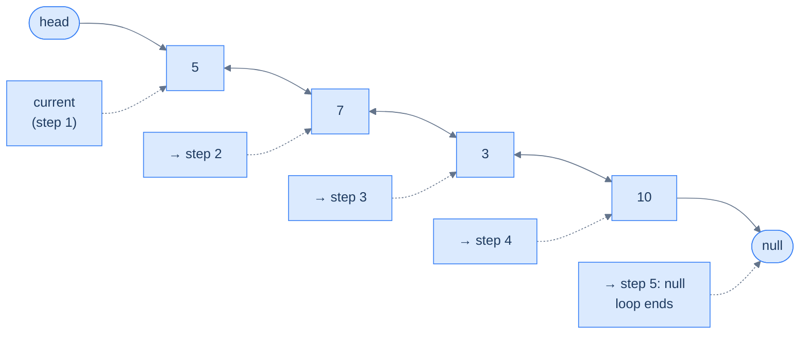
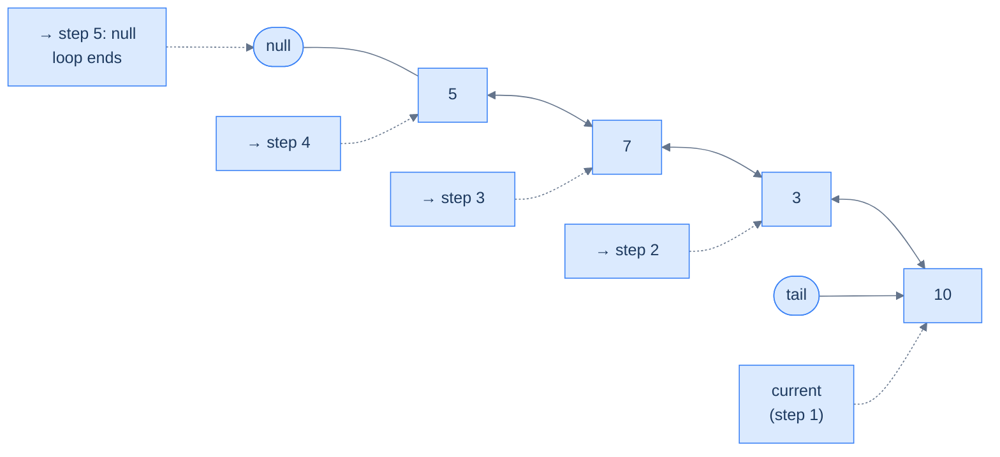
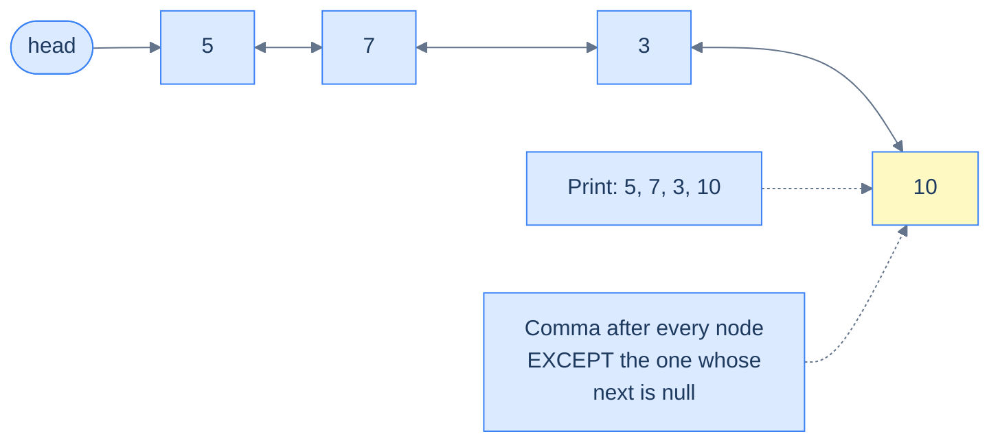
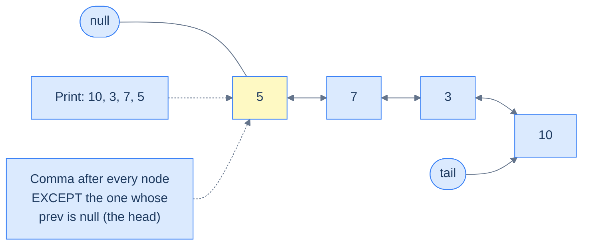
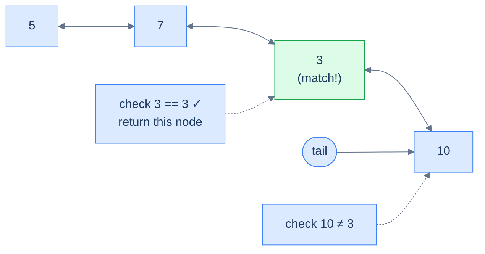

# 2. Traversal in Doubly Linked Lists

## The Hook

Picture a one-way street. Cars enter at one end, exit at the other, and any driver who needs the *previous* exit has to loop all the way around the block. That's a singly linked list — every traversal flows in exactly one direction. Now imagine a regular two-way street: same lane, same nodes, same destinations — but you can drive in either direction, and your start point dictates which direction makes sense.

This single change unlocks something subtle. With a doubly linked list, **the entry point you're given silently chooses your direction.** Hand you a `head`? You walk forward. Hand you a `tail`? You walk backward — and you don't lose any information; in fact, you gain a free reversal of the output for nothing more than starting from the other end. By the end of this lesson, you'll write a list-printer that *prints in reverse* without ever calling a reversal function — just by changing one pointer name.

---

## Table of contents

1. [Understanding traversal](#understanding-traversal)
2. [Node expedition](#node-expedition)
3. [Node expedition II](#node-expedition-ii)
4. [Node search](#node-search)
5. [Understanding the problem](#understanding-the-problem)
6. [Supported operations](#supported-operations)
7. [Internal mechanics](#internal-mechanics)
8. [Working example](#working-example)
9. [Edge cases and pitfalls](#edge-cases-and-pitfalls)
10. [Production reality](#production-reality)
11. [Quiz](#quiz)
12. [Practice ladder](#practice-ladder)
13. [Further reading](#further-reading)
14. [Cross-links](#cross-links)
15. [Final takeaway](#final-takeaway)

***

# Understanding traversal

Traversal is the most fundamental operation on a doubly linked list, and the basic mechanic is the same as in a singly linked list: hold a "cursor" variable, follow a pointer, repeat until the cursor lands on `null`. The extra information about the previous node that every node in a doubly linked list stores gives us a brand-new ability — the same loop, run on `prev` instead of `next`, walks the list in **reverse**. Two traversals for the price of one extra pointer per node.

## Forward Traversal

Forward traversal is moving from the **head** to the **tail** node in the doubly linked list. It is implemented exactly the way you remember from singly linked lists. We use a variable that holds a reference to a node in the linked list as the loop control variable, and every iteration we *advance* it by reading the `next` pointer of the current node — `current = current.next` — until it falls off the end and lands on `null`.



<p align="center"><strong>Forward traversal using the <code>next</code> pointer — start at <code>head</code>, follow <code>current.next</code> on each iteration, stop when <code>current</code> becomes <code>null</code>.</strong></p>

Given below is the code implementation of forward traversal in a doubly linked list, shown in two equivalent forms — a `for` loop that puts initialisation, condition, and advance on a single line, and a `while` loop that spreads them out for clarity.


```python run viz=linked-list viz-root=head
# Python idiom — `while` is the canonical form for pointer-walking
current = head            # Start at the head — the only entry point given
while current is not None:
    # ... do something with current.val ...
    current = current.next  # Advance to the successor; falls off to None at the tail
```

```java run viz=linked-list viz-root=head
// for loop — initialiser + condition + step on one line
for (ListNode current = head; current != null; current = current.next) {
    // ... do something with current.val ...
}

// while loop — same logic, three statements
ListNode current = head;
while (current != null) {
    // ... do something with current.val ...
    current = current.next;
}
```


## Reverse Traversal

Unlike a singly linked list, we can also traverse a doubly linked list in the reverse direction — from the **tail** node back to the **head** — thanks to the `prev` pointer in every node that stores the reference to the previous node. The shape of the loop is *identical* to forward traversal; only two things change: we start at `tail` instead of `head`, and we advance via `current.prev` instead of `current.next`. The terminator is still `null` — but now it's the head's `prev`, not the tail's `next`, that ends the walk.



<p align="center"><strong>Reverse traversal using the <code>prev</code> pointer — start at <code>tail</code>, follow <code>current.prev</code> on each iteration, stop when <code>current</code> becomes <code>null</code> (i.e. when we walk past the head).</strong></p>

Given below is the code implementation of reverse traversal — note how it is the *mirror image* of the forward version, swapping `head ↔ tail` and `next ↔ prev`.


```python run viz=linked-list viz-root=head
# Reverse walk — start at tail, follow prev
current = tail
while current is not None:
    # ... do something with current.val ...
    current = current.prev   # Advance to the predecessor; falls off to None at the head
```

```java run viz=linked-list viz-root=head
// for loop — note tail/prev instead of head/next
for (ListNode current = tail; current != null; current = current.prev) {
    // ... do something with current.val ...
}

// while loop
ListNode current = tail;
while (current != null) {
    // ... do something with current.val ...
    current = current.prev;
}
```


> *Pause and predict — if you wrote the forward traversal once and the reverse traversal once, the only differences would be: ___ and ___.*
>
> The starting reference (`head` ↔ `tail`) and the advance pointer (`next` ↔ `prev`). Everything else — the loop shape, the null check, the body — is byte-for-byte identical. **This symmetry is the whole point of a doubly linked list.** Write your traversal once, parameterise the direction, and you've doubled your toolkit.

Later in this course, we will learn more about how to piggyback on this generic forward and reverse traversal logic to do various things as we traverse a doubly linked list — printing, searching, summing, splitting, merging, and (much later) implementing operations like LRU eviction that need *both* directions running simultaneously.

***

# Node expedition

## The Problem

> Given the **head** of a doubly linked list, write a function to print a comma-separated list of all the values from the start to the end.
>
> *In TypeScript and JavaScript, use `process.stdout.write` instead of `console.log`, since `console.log` automatically appends a newline character to the output, which may cause the judge to fail the submission.*

```
Input:  head = [5, 7, 3, 10]
Output: 5, 7, 3, 10
```

### What we are practising

Forward traversal with a small twist: a **separator** between values, and *no trailing separator* after the last value. The classic "print joined" pattern — every loop body needs a way to know whether it's looking at the last element so it can suppress the comma.



<p align="center"><strong>The "lookahead" trick — print the value first, then look at <code>current.next</code> to decide whether a comma follows. The tail node is the only one whose <code>next</code> is <code>null</code>, and it is the only one that does not get a trailing comma.</strong></p>

<details>
<summary><h2>The Solution</h2></summary>


```python run viz=linked-list viz-root=head
from typing import Optional


class ListNode:
    def __init__(self, val=0, prev=None, nxt=None):
        self.val = val
        self.prev = prev
        self.next = nxt


def from_list(values):
    if not values:
        return None
    head = ListNode(values[0])
    cur = head
    for v in values[1:]:
        node = ListNode(v, prev=cur)
        cur.next = node
        cur = node
    return head


def to_list(head):
    out = []
    while head is not None:
        out.append(head.val)
        head = head.next
    return out


class Solution:
    def node_expedition(self, head: Optional[ListNode]) -> None:

        # Start from the head of the linked list
        current: Optional[ListNode] = head

        # Iterate until the current node is not null
        while current is not None:

            # Print the value of the current node
            print(current.val, end="")

            # If there is a next node, print a comma after the value
            if current.next is not None:
                print(", ", end="")

            # Move to the next node
            current = current.next


# Examples from the problem statement
Solution().node_expedition(from_list([5, 7, 3, 10])); print()    # 5, 7, 3, 10

# Edge cases
Solution().node_expedition(from_list([])); print()               # (empty)
Solution().node_expedition(from_list([42])); print()             # 42
Solution().node_expedition(from_list([1, 2])); print()           # 1, 2
Solution().node_expedition(from_list([1, 2, 3, 4, 5])); print()  # 1, 2, 3, 4, 5
Solution().node_expedition(from_list([7, 7, 7])); print()        # 7, 7, 7
```

```java run viz=linked-list viz-root=head
public class Main {
    static class ListNode {
        int val;
        ListNode prev;
        ListNode next;
        ListNode() {}
        ListNode(int val) { this.val = val; }
    }

    static ListNode fromList(int... values) {
        if (values.length == 0) return null;
        ListNode head = new ListNode(values[0]);
        ListNode cur = head;
        for (int i = 1; i < values.length; i++) {
            ListNode node = new ListNode(values[i]);
            node.prev = cur;
            cur.next = node;
            cur = node;
        }
        return head;
    }

    static class Solution {
        public void nodeExpedition(ListNode head) {

            // Start from the head of the linked list
            ListNode current = head;

            // Iterate until the current node is not null
            while (current != null) {

                // Print the value of the current node
                System.out.print(current.val);

                // If there is a next node, print a comma after the value
                if (current.next != null) {
                    System.out.print(", ");
                }

                // Move to the next node
                current = current.next;
            }
        }
    }

    public static void main(String[] args) {
        // Examples from the problem statement
        new Solution().nodeExpedition(fromList(5, 7, 3, 10)); System.out.println();    // 5, 7, 3, 10

        // Edge cases
        new Solution().nodeExpedition(fromList()); System.out.println();               // (empty)
        new Solution().nodeExpedition(fromList(42)); System.out.println();             // 42
        new Solution().nodeExpedition(fromList(1, 2)); System.out.println();           // 1, 2
        new Solution().nodeExpedition(fromList(1, 2, 3, 4, 5)); System.out.println(); // 1, 2, 3, 4, 5
        new Solution().nodeExpedition(fromList(7, 7, 7)); System.out.println();        // 7, 7, 7
    }
}
```


<details>
<summary><strong>Trace — head = [5, 7, 3, 10]</strong></summary>

```
Step 1 │ current = node(5)  │ print "5",  next != null → print ", "   │ output: "5, "
Step 2 │ current = node(7)  │ print "7",  next != null → print ", "   │ output: "5, 7, "
Step 3 │ current = node(3)  │ print "3",  next != null → print ", "   │ output: "5, 7, 3, "
Step 4 │ current = node(10) │ print "10", next == null → no separator │ output: "5, 7, 3, 10"
Step 5 │ current = null     │ loop terminates
Result: "5, 7, 3, 10" ✓
```

The lookahead at `current.next` is what suppresses the trailing comma — the tail is the only node whose successor is `null`, so it's the only one that prints its value alone.

</details>

</details>

***

# Node expedition II

## The Problem

> Given the **tail** of a doubly linked list, write a function to print a comma-separated list of all the values from the tail to the head.
>
> *In TypeScript and JavaScript, use `process.stdout.write` instead of `console.log`, since `console.log` automatically appends a newline character to the output, which may cause the judge to fail the submission.*

```
Input:  tail = [5, 7, 3, 10]      # logical list, tail is node(10)
Output: 10, 3, 7, 5
```

### What we are practising

This is the *mirror image* of the previous problem. Same algorithm, same separator trick, same null-terminator — only the entry point and the advance direction flip. The lookahead this time is at `current.prev`, because the **head** is now the node we want to print without a trailing comma.



<p align="center"><strong>Reverse expedition — start at <code>tail</code>, advance via <code>prev</code>, suppress the trailing separator on the node whose <code>prev</code> is <code>null</code> (the head).</strong></p>

<details>
<summary><h2>The Solution</h2></summary>


```python run viz=linked-list viz-root=head
from typing import Optional


class ListNode:
    def __init__(self, val=0, prev=None, nxt=None):
        self.val = val
        self.prev = prev
        self.next = nxt


def from_list(values):
    if not values:
        return None
    head = ListNode(values[0])
    cur = head
    for v in values[1:]:
        node = ListNode(v, prev=cur)
        cur.next = node
        cur = node
    return head


def to_tail(head):
    """Return the tail node of a list built with from_list."""
    if head is None:
        return None
    cur = head
    while cur.next is not None:
        cur = cur.next
    return cur


class Solution:
    def node_expedition_ii(self, tail: Optional[ListNode]) -> None:

        # Start from the tail of the linked list
        current: Optional[ListNode] = tail

        # Traverse the linked list backwards starting from the current
        # node
        while current is not None:

            # Print the value of the current node
            print(current.val, end="")

            # Check if the current node has a previous node
            if current.prev is not None:

                # If a previous node exists, print a comma and space
                print(", ", end="")

            # Move to the previous node
            current = current.prev


# Examples from the problem statement
Solution().node_expedition_ii(to_tail(from_list([5, 7, 3, 10]))); print()    # 10, 3, 7, 5

# Edge cases
Solution().node_expedition_ii(None); print()                                  # (empty)
Solution().node_expedition_ii(to_tail(from_list([42]))); print()              # 42
Solution().node_expedition_ii(to_tail(from_list([1, 2]))); print()            # 2, 1
Solution().node_expedition_ii(to_tail(from_list([1, 2, 3, 4, 5]))); print()  # 5, 4, 3, 2, 1
Solution().node_expedition_ii(to_tail(from_list([7, 7, 7]))); print()         # 7, 7, 7
```

```java run viz=linked-list viz-root=head
public class Main {
    static class ListNode {
        int val;
        ListNode prev;
        ListNode next;
        ListNode() {}
        ListNode(int val) { this.val = val; }
    }

    static ListNode fromList(int... values) {
        if (values.length == 0) return null;
        ListNode head = new ListNode(values[0]);
        ListNode cur = head;
        for (int i = 1; i < values.length; i++) {
            ListNode node = new ListNode(values[i]);
            node.prev = cur;
            cur.next = node;
            cur = node;
        }
        return head;
    }

    static ListNode toTail(ListNode head) {
        if (head == null) return null;
        ListNode cur = head;
        while (cur.next != null) cur = cur.next;
        return cur;
    }

    static class Solution {
        public void nodeExpeditionII(ListNode tail) {

            // Start from the tail of the linked list
            ListNode current = tail;

            // Traverse the linked list backwards starting from the current
            // node
            while (current != null) {

                // Print the value of the current node
                System.out.print(current.val);

                // Check if the current node has a previous node
                if (current.prev != null) {

                    // If a previous node exists, print a comma and space
                    System.out.print(", ");
                }

                // Move to the previous node
                current = current.prev;
            }
        }
    }

    public static void main(String[] args) {
        // Examples from the problem statement
        new Solution().nodeExpeditionII(toTail(fromList(5, 7, 3, 10))); System.out.println();    // 10, 3, 7, 5

        // Edge cases
        new Solution().nodeExpeditionII(null); System.out.println();                             // (empty)
        new Solution().nodeExpeditionII(toTail(fromList(42))); System.out.println();             // 42
        new Solution().nodeExpeditionII(toTail(fromList(1, 2))); System.out.println();           // 2, 1
        new Solution().nodeExpeditionII(toTail(fromList(1, 2, 3, 4, 5))); System.out.println(); // 5, 4, 3, 2, 1
        new Solution().nodeExpeditionII(toTail(fromList(7, 7, 7))); System.out.println();        // 7, 7, 7
    }
}
```


<details>
<summary><strong>Trace — tail = node(10) of [5, 7, 3, 10]</strong></summary>

```
Step 1 │ current = node(10) │ print "10", prev != null → print ", "  │ output: "10, "
Step 2 │ current = node(3)  │ print "3",  prev != null → print ", "  │ output: "10, 3, "
Step 3 │ current = node(7)  │ print "7",  prev != null → print ", "  │ output: "10, 3, 7, "
Step 4 │ current = node(5)  │ print "5",  prev == null → no separator │ output: "10, 3, 7, 5"
Step 5 │ current = null     │ loop terminates
Result: "10, 3, 7, 5" ✓
```

We never called a reversal routine — just walked the chain from the *other* end. **Reverse output for free** is the doubly linked list's signature trick.

</details>

</details>

***

# Node search

## The Problem

> Given the **tail** of a doubly linked list and a **data** value, write a function to return the first node containing the given data, searching from the tail toward the head. If no such node is found, return `null`.

```
Input:  head = [5, 7, 3, 10], data = 3
Output: node containing 3

Input:  head = [5, 7, 6, 10], data = 3
Output: null
```

### What we are practising

A **linear search** that exploits the doubly linked list's reverse traversability. The mechanic is identical to "find first match" in any other linear container — walk, compare, return on first hit, return `null` if the walk finishes empty-handed.



<p align="center"><strong>Linear search from tail to head — return the first node whose value matches; if the loop falls off the head with no match, return <code>null</code>.</strong></p>

> *Why search from the tail when we could've gone from the head? In *this* problem the input is `tail`, so we have no choice — but the takeaway is more general. **Search direction is now a free parameter.** When you have a hint about *where* the target probably lives (recently added items live near the tail in an LRU; older items live near the head), you can pick the direction that statistically wins.*

<details>
<summary><h2>Solution &amp; Analysis</h2></summary>

### The Solution

```python run viz=linked-list viz-root=head
from typing import Optional


class ListNode:
    def __init__(self, val=0, prev=None, nxt=None):
        self.val = val
        self.prev = prev
        self.next = nxt


def from_list(values):
    if not values:
        return None
    head = ListNode(values[0])
    cur = head
    for v in values[1:]:
        node = ListNode(v, prev=cur)
        cur.next = node
        cur = node
    return head


def to_tail(head):
    if head is None:
        return None
    cur = head
    while cur.next is not None:
        cur = cur.next
    return cur


class Solution:
    def node_search(
        self, tail: Optional[ListNode], data: int
    ) -> Optional[ListNode]:

        # Start from the tail of the linked list
        current: Optional[ListNode] = tail

        # Traverse the linked list backwards starting from the current
        # node
        while current is not None:

            # If a matching node is found, return the pointer to that
            # node
            if current.val == data:
                return current

            # Move to the previous node in the linked list
            current = current.prev

        # If the loop finishes without finding a matching node, return
        # None
        return None


# Examples from the problem statement
r1 = Solution().node_search(to_tail(from_list([5, 7, 3, 10])), 3)
print(r1.val if r1 else None)   # 3

r2 = Solution().node_search(to_tail(from_list([5, 7, 6, 10])), 3)
print(r2.val if r2 else None)   # None

# Edge cases
r3 = Solution().node_search(None, 5)
print(r3.val if r3 else None)   # None

r4 = Solution().node_search(to_tail(from_list([42])), 42)
print(r4.val if r4 else None)   # 42

r5 = Solution().node_search(to_tail(from_list([42])), 1)
print(r5.val if r5 else None)   # None

r6 = Solution().node_search(to_tail(from_list([1, 2, 3, 4, 5])), 1)
print(r6.val if r6 else None)   # 1 (head node found via backward traversal)

r7 = Solution().node_search(to_tail(from_list([1, 2, 3, 4, 5])), 5)
print(r7.val if r7 else None)   # 5
```

```java run viz=linked-list viz-root=head
public class Main {
    static class ListNode {
        int val;
        ListNode prev;
        ListNode next;
        ListNode() {}
        ListNode(int val) { this.val = val; }
    }

    static ListNode fromList(int... values) {
        if (values.length == 0) return null;
        ListNode head = new ListNode(values[0]);
        ListNode cur = head;
        for (int i = 1; i < values.length; i++) {
            ListNode node = new ListNode(values[i]);
            node.prev = cur;
            cur.next = node;
            cur = node;
        }
        return head;
    }

    static ListNode toTail(ListNode head) {
        if (head == null) return null;
        ListNode cur = head;
        while (cur.next != null) cur = cur.next;
        return cur;
    }

    static class Solution {
        public ListNode nodeSearch(ListNode tail, int data) {

            // Start from the tail of the linked list
            ListNode current = tail;

            // Traverse the linked list backwards starting from the current
            // node
            while (current != null) {

                // If a matching node is found, return the pointer to
                // that node
                if (current.val == data) {
                    return current;
                }

                // Move to the previous node in the linked list
                current = current.prev;
            }

            // If the loop finishes without finding a matching node, return
            // null
            return null;
        }
    }

    public static void main(String[] args) {
        // Examples from the problem statement
        ListNode r1 = new Solution().nodeSearch(toTail(fromList(5, 7, 3, 10)), 3);
        System.out.println(r1 != null ? r1.val : null);   // 3

        ListNode r2 = new Solution().nodeSearch(toTail(fromList(5, 7, 6, 10)), 3);
        System.out.println(r2 != null ? r2.val : null);   // null

        // Edge cases
        ListNode r3 = new Solution().nodeSearch(null, 5);
        System.out.println(r3 != null ? r3.val : null);   // null

        ListNode r4 = new Solution().nodeSearch(toTail(fromList(42)), 42);
        System.out.println(r4 != null ? r4.val : null);   // 42

        ListNode r5 = new Solution().nodeSearch(toTail(fromList(42)), 1);
        System.out.println(r5 != null ? r5.val : null);   // null

        ListNode r6 = new Solution().nodeSearch(toTail(fromList(1, 2, 3, 4, 5)), 1);
        System.out.println(r6 != null ? r6.val : null);   // 1

        ListNode r7 = new Solution().nodeSearch(toTail(fromList(1, 2, 3, 4, 5)), 5);
        System.out.println(r7 != null ? r7.val : null);   // 5
    }
}
```


<details>
<summary><strong>Trace 1 — tail = node(10) of [5, 7, 3, 10], data = 3</strong></summary>

```
Step 1 │ current = node(10) │ 10 ≠ 3 → continue │ current = current.prev = node(3)
Step 2 │ current = node(3)  │ 3 == 3 ✓          │ return node(3)
Result: node(3) ✓
```

The walk starts at `tail` and steps via `current.prev`, so it inspects nodes back-to-front — node(10) then node(3) — and stops the moment the value matches.

</details>
<details>
<summary><strong>Trace 2 — tail = node(10) of [5, 7, 6, 10], data = 3</strong></summary>

```
Step 1 │ current = node(10) │ 10 ≠ 3 → continue │ current = current.prev = node(6)
Step 2 │ current = node(6)  │ 6 ≠ 3 → continue  │ current = current.prev = node(7)
Step 3 │ current = node(7)  │ 7 ≠ 3 → continue  │ current = current.prev = node(5)
Step 4 │ current = node(5)  │ 5 ≠ 3 → continue  │ current = current.prev = null
Step 5 │ current = null     │ loop terminates   │ return null
Result: null ✓
```

The backward walk falls off the head — node(5)'s `prev` is `null` — and the loop ends. The "no-match" case is what makes the `null` return value non-negotiable: the function must distinguish *"I found nothing"* from *"I found the head"* (which is also a valid return). The head's `prev` terminator carries that information for free.

</details>

### Complexity Analysis

| Operation | Time | Space | Why |
|---|---|---|---|
| Forward / reverse traversal | **O(n)** | **O(1)** | Each node is visited at most once; only a single cursor variable is held. |
| Node expedition (print) | **O(n)** | **O(1)** | One print per node, no auxiliary data structure. |
| Node search (linear) | **O(n)** worst, O(1) best | **O(1)** | Best case the target is the entry node; worst case it's at the far end or absent. |

> *The space term is the headline — every doubly linked list traversal is **O(1) extra space**. We don't allocate a stack, a queue, or a copy. We mutate one pointer in place. This becomes load-bearing later when we attack problems with hard memory budgets — like reversing a list with a million nodes on a constrained system.*

</details>
<details>
<summary><h2>Final Takeaway</h2></summary>


A doubly linked list traversal is a *parameterised* singly linked list traversal — same loop, configurable direction. Pick `head + next` to walk forward, `tail + prev` to walk backward, and the same algorithm works for both. This symmetry is what makes the data structure punch above its weight: **every "do this thing forward" operation comes with a free "do it backward" twin** as long as you remember to pass the other endpoint.

> **Transfer challenge:** Given the head of a doubly linked list of integers, return the *sum of values whose index from the right is even* (i.e. the tail is index 0, the node before it is index 1, and so on) — without using extra arrays. Hint: you only need one pointer and one counter.
>
> <details>
> <summary>Solution sketch</summary>
>
> Find the tail in O(n) (walk forward once), then walk backward via `prev`, incrementing an index counter and adding `current.val` to the sum whenever the index is even. Two passes, O(1) space — no array, no stack. The reverse traversal is what makes "index from the right" cheap.
>
> </details>

In the next lesson we leave traversal behind and start *modifying* the list. Insertion is where the doubly linked list's second pointer earns its keep — we'll see operations the singly linked list literally cannot match in time complexity.

</details>

***

# Understanding the Problem

A singly linked list lets a cursor flow in one direction only — once you've stepped past a node, the only way back is to restart from the head and walk again. A doubly linked list pays one extra pointer per node to lift that restriction. Every node now stores **two** references: `.next` to its successor and `.prev` to its predecessor, with the head's `.prev` and the tail's `.next` both `null`.

So the question this lesson answers is narrower than "how do you traverse?" — singly linked lists already taught that. The new question is: *what changes when both directions are reachable?* Two things, neither of them an algorithmic upgrade:

- the **entry point** is now a free parameter — `head` walks forward, `tail` walks backward
- the **advance pointer** is now a free parameter — `.next` or `.prev`, chosen to match the entry

To make this concrete: on `5 ↔ 7 ↔ 3 ↔ 10`, the same `while current is not null` loop produces `5, 7, 3, 10` when seeded with `head` and `.next`, and `10, 3, 7, 5` when seeded with `tail` and `.prev`. The body is byte-for-byte identical; only the two parameters flip.

So the key idea is: traversal in a doubly linked list is the singly-list loop *parameterised* by direction — you don't learn a new algorithm, you learn that the algorithm has two knobs you couldn't turn before.

---

## Key Takeaway

A doubly linked list does not give you faster traversal — it gives you the *other* direction for the same O(n) cost. The skill is recognising which end to start from before you write the loop.

***

# Supported Operations

Traversal underpins the same operations as in a singly linked list, but the second pointer flips a handful of them from O(n) to O(1). The table below pins down both costs side by side so the upgrade is visible at a glance.

| Operation | Time | Space | Why |
|---|---|---|---|
| **Forward traversal** (`head → tail`) | O(n) | O(1) | Standard `current = current.next` walk |
| **Reverse traversal** (`tail → head`) | O(n) | O(1) | Same walk, but `current = current.prev`; impossible in a singly list without auxiliary space |
| **Access by index from either end** | O(min(i, n-i)) | O(1) | Start from the closer end; cuts the worst case to n/2 |
| **Search by value** | O(n) | O(1) | Walk and compare; direction can exploit a hint about where the target lives |
| **Length** | O(n) | O(1) | Walk and count; O(1) only if `size` is cached on the list object |
| **Delete a known node** | O(1) | O(1) | `prev.next = next; next.prev = prev` — no predecessor walk needed; this is the headline upgrade over singly lists |
| **Insert before a known node** | O(1) | O(1) | The `.prev` pointer makes "insert before" symmetric with "insert after" |

Two distinctions are worth highlighting against the singly-list table.

- **Delete a known node** drops from O(n) to O(1) — a singly list has to walk from `head` to find the predecessor; a doubly list reads it from `node.prev`.
- **Reverse traversal** is genuinely free — you don't reverse the list, you just walk the chain from the other end. A singly list pays O(n) extra space (stack or array) for the same output.

To make this concrete: an LRU cache uses a doubly linked list specifically for the "delete a known node" row — when a hash map already holds a reference to the node to evict, the doubly list unlinks it in O(1). On a singly list, the same eviction would walk the list to find the predecessor — turning an O(1) operation into O(n) and ruining the cache's amortised guarantees.

So the core insight is: the extra `.prev` pointer is a memory tax (one pointer per node) paid up front so that *anything you can reach* can be unlinked or walked-from in O(1).

---

## Key Takeaway

The second pointer doesn't buy you faster traversal — it buys you cheaper local edits and a free backward walk. Every cost that needed "the node before this one" collapses from O(n) to O(1).

***

# Internal Mechanics

Every doubly linked list traversal collapses into the same three-line loop — the loop body shifts with the problem, but the invariants are constant.

The structural facts:

- **`head`** and **`tail`** are the two externally-held references; either one is enough to reach every node, in opposite directions
- every node holds a **value**, a **`.next`** pointer, and a **`.prev`** pointer
- the head's `.prev` is `null`, and the tail's `.next` is `null` — *two* `null` sentinels, one at each boundary
- the **doubly-linked invariant** must hold across every adjacent pair: if `a.next == b` then `b.prev == a`, and vice versa

Given those, the traversal algorithm only needs a single cursor — pick the direction, the rest follows. **Forward:** initialise `current = head`, then `while current is not null` do the visit and advance via `current = current.next`. **Reverse:** initialise `current = tail`, then the same loop, advancing via `current = current.prev` instead. Same skeleton, mirrored knobs.

To make this concrete: on `5 ↔ 7 ↔ 3 ↔ 10`, the forward walk visits `node(5), node(7), node(3), node(10)` then halts on the fifth check; the reverse walk visits `node(10), node(3), node(7), node(5)` then halts on its fifth check. Same number of iterations, same O(n) cost, mirror-image traces.

So the core insight is: the two walks are governed by the *same* invariant — a cursor stops at `null` — but the structure has two `null`s now, so the loop terminates at whichever end you didn't start from.

### Why the `.prev` pointer is more than a convenience

The `.prev` pointer is not just "the reverse of `.next`." It also encodes the **predecessor** of every node, which is exactly the information a singly list has to walk to recover. That single pre-stored byte (well, eight, on a 64-bit pointer) is what collapses delete-by-reference and insert-before from O(n) to O(1).

### Maintaining the invariant during edits

The doubly-linked invariant is fragile. Any mutation that touches `.next` on one side must touch `.prev` on the other in the same logical step — miss the pair and you create a list where forward and reverse traversal disagree about which nodes are reachable.

So the tradeoff is: a doubly linked list trades a *single* update per edit (singly list) for a *paired* update (doubly list), and trusts the programmer to keep both sides in sync — the only safeguard the structure offers is the symmetry of the invariant itself.

---

## Key Takeaway

Two pointers per node, two `null` sentinels, one cursor — the doubly linked list is the singly list with a mirror taped on, and every loop you write is either the forward or the reverse half of that mirror.

***

# Working Example

To anchor the loop in real values, walk both directions on the four-node list `5 ↔ 7 ↔ 3 ↔ 10`.

Forward traversal — seeded with `head`:

| Step | `current` | `current.val` | `current.next` | Action |
|---|---|---|---|---|
| 0 — init | node(5) | 5 | node(7) | `current ← head` — enter the loop, condition holds |
| 1 | node(5) | 5 | node(7) | visit 5; advance: `current ← current.next` |
| 2 | node(7) | 7 | node(3) | visit 7; advance |
| 3 | node(3) | 3 | node(10) | visit 3; advance |
| 4 | node(10) | 10 | `null` | visit 10; advance: `current ← null` |
| 5 — exit | `null` | — | — | condition fails; loop ends |

Reverse traversal — seeded with `tail`:

| Step | `current` | `current.val` | `current.prev` | Action |
|---|---|---|---|---|
| 0 — init | node(10) | 10 | node(3) | `current ← tail` — enter the loop, condition holds |
| 1 | node(10) | 10 | node(3) | visit 10; advance: `current ← current.prev` |
| 2 | node(3) | 3 | node(7) | visit 3; advance |
| 3 | node(7) | 7 | node(5) | visit 7; advance |
| 4 | node(5) | 5 | `null` | visit 5; advance: `current ← null` |
| 5 — exit | `null` | — | — | condition fails; loop ends |

Two tables, perfectly mirrored — same node count, same iteration count, same exit condition, opposite order.

To make this concrete:

- the cursor `current` is the only mutable variable in either walk — no counter, no stack, no auxiliary array
- the **visit** always happens *before* the advance; reversing the order would skip the entry node
- the loop terminates on the `null` at the *opposite* boundary from where it started — forward exits on the tail's `.next`, reverse exits on the head's `.prev`

So the key idea is: every doubly-linked-list algorithm you'll write reuses one of these two traces, with a different `visit()` plugged into the same loop skeleton.

---

## Key Takeaway

Four nodes, four visits, one extra check that fails — twice. The two walks are the same shape from different ends, and every problem in this lesson is a `visit()` plugged into one of them.

***

# Edge Cases and Pitfalls

The doubly-linked traversal loop is short and ships with the same bugs as the singly version, plus a handful unique to the second pointer. The list below catches the ones every reviewer learns to spot.

- **Empty list — both `head` and `tail` are `null`.** The loop's entry condition handles this; the body never runs. The bug is dereferencing `head.val` or `tail.val` directly before the check.
- **Single-node list.** Forward and reverse traversal both run exactly once; `current.next` and `current.prev` are both `null` on that iteration. Any lookahead at adjacent pointers needs an explicit null check.
- **Reading `current.next.val` or `current.prev.val` without a null check.** At either boundary, the next/prev pointer is `null` — dereferencing it crashes. Inside the loop, every step beyond `current` itself needs its own null guard.
- **Forgetting to advance — wrong-pointer advance.** A common bug specific to doubly lists: writing `current = current.next` when you meant `current = current.prev` (or vice versa) silently walks in the wrong direction. If the list has a cycle or you started at the wrong end, the loop misbehaves without crashing.
- **Modifying `.next` without updating `.prev` (or vice versa).** Any mutation that breaks the doubly-linked invariant (`a.next == b` ⇔ `b.prev == a`) leaves the list reachable from one end and unreachable from the other. Subsequent traversals from the broken end skip nodes silently.
- **Stale `tail` reference after head/tail edits.** Functions that delete the tail must update the external `tail` pointer too — same trap as `head` in singly lists. Miss it and the next "start from tail" walk begins at a deleted node.
- **Picking the wrong direction.** Searching from `head` when the target was last inserted near `tail` is O(n) instead of O(1) — the algorithm is *correct*, but the constant factor is the worst case. The fix is reading the problem statement for hints about where the target lives.
- **Counting hops vs counting nodes.** "Walk to the kth node from `tail`" means k `.prev` advances, not k node visits — the same off-by-one trap as singly traversal, just mirrored.
- **Cycles.** If `.next` and `.prev` form a loop (programmer error), the walk never terminates. Detection uses the same fast-and-slow-pointers technique as in singly lists — covered in chapter 5.
- **Stale cached `size`.** If the list object caches `size` for O(1) length queries, every insert *and* every delete must update it on both sides of the mutation. Miss one and `length()` silently lies. <!-- VERIFY: java.util.LinkedList caches size and updates it inside linkBefore / linkLast / unlink. -->

***

# Production Reality

The "walk node-by-node in either direction" loop shows up in load-bearing systems that need fast local edits as much as they need a sequence. The five entries below put it on a hot path.

**[Linux kernel — `list_head`]** — uses **an intrusively-embedded doubly linked list with `prev`/`next` pointers walked both forward and backward** — because the kernel needs to splice and unlink nodes that may live inside arbitrary structs, and a known node must be removable in O(1) without re-walking from a head.

The `list_for_each_entry` and `list_for_each_entry_reverse` macros are direct expansions of the two traversal loops in this lesson. Every process descriptor, every loadable module, every cache LRU sits on at least one of these lists, often unlinked by a `prev`/`next` rewire from an unrelated subsystem. Source: [include/linux/list.h](https://github.com/torvalds/linux/blob/master/include/linux/list.h).

**[Redis lists — `adlist`]** — uses **a generic doubly linked list with cached `head`, `tail`, and `len`** — because `LRANGE` walks forward, `LRANGE -k -1` walks backward, and `LLEN` must answer in O(1).

`LINDEX` picks the shorter end and walks from there — O(min(i, n-i)) per access. The traversal loop is the one from this lesson; the only addition is the head/tail decision before the walk begins. Source: [adlist.c](https://github.com/redis/redis/blob/unstable/src/adlist.c).

**[`java.util.LinkedList`]** — uses **a doubly linked list with `first`, `last`, and `size`** — because the Java collection interface needs `ListIterator` to support both `hasNext()` and `hasPrevious()`, which is exactly forward and reverse traversal from any position.

`indexOf(i)` and `listIterator(i)` both pick the closer end and walk inward, capping the cost at O(n/2). Source: [LinkedList.java](https://github.com/openjdk/jdk/blob/master/src/java.base/share/classes/java/util/LinkedList.java).

**[LRU caches — most production implementations]** — uses **a doubly linked list keyed by a hash map** — because the cache needs O(1) reordering on every access: lookup the node by key, unlink it from its current position, relink it at the head.

The unlink step is `node.prev.next = node.next; node.next.prev = node.prev` — only possible in O(1) because the doubly-linked structure pre-stores `.prev`. A singly list would have to walk from `head` to find the predecessor, collapsing every access to O(n). Reference: [Wikipedia — LRU cache replacement](https://en.wikipedia.org/wiki/Cache_replacement_policies#Least_recently_used_(LRU)).

**[Text editors — gap buffers' line index]** — uses **a doubly linked list of line records walked from either the previous or next viewport line** — because a scroll up or down advances by a few lines and the editor wants O(scroll-distance) updates, not O(line-number-in-file).

When the user scrolls a viewport up by one line, the editor walks one `.prev` step from the current top line; scrolling down walks one `.next` step. The cost is constant per scroll event rather than linear in the file's length. <!-- VERIFY: many editors use piece tables or rope structures instead of a doubly-linked line index; the linked-list-of-lines design is common in simpler editors. -->

***

# Quiz

Force the answer to surface before reading the response — that is the test of whether the loop is internalised.

**[Recall] Q: What condition stops a doubly-linked-list traversal loop, in either direction?**
`current is null` — the cursor eventually lands on the `null` sentinel at the boundary opposite to where the walk started.

**[Recall] Q: What are the time and space complexities of a forward or reverse traversal of `n` nodes?**
O(n) time (each node visited at most once) and O(1) space (one cursor variable, regardless of direction).

**[Reasoning] Q: Why can a doubly linked list delete a known node in O(1) while a singly linked list cannot?**
A doubly linked list pre-stores the predecessor in `.prev`, so the unlink is `node.prev.next = node.next; node.next.prev = node.prev` — a constant number of rewires. A singly list must walk from `head` to find the predecessor, costing O(n).

**[Reasoning] Q: A search must find the value `99` in a list where the most recently inserted nodes live near the tail. Starting from `head` and starting from `tail` are both correct — why does direction still matter?**
Correctness is identical (O(n) worst case either way), but the *expected* cost differs. Starting from `tail` finds the target near the front of the walk, making the constant factor closer to O(1) on a hit. Direction is a free hyperparameter you should set using whatever you know about where the target lives.

**[Tradeoff] Q: Doubly linked lists pay one extra pointer per node compared to singly linked lists. Name two operations that benefit from this cost and one that doesn't.**
*Benefit:* delete-a-known-node (O(n) → O(1)) and reverse traversal (impossible in O(1) space → O(n) time, O(1) space). *No benefit:* forward traversal — same O(n) time, same O(1) space as a singly list. The second pointer is paid for by edit-locality wins, not by traversal wins.

***

# Practice Ladder

Five problems, easiest first. Each is the traversal loop with a small twist plugged into the visit step — and each exploits the doubly linked list's two-direction edge in a different way.

| # | Problem | Pattern | Difficulty | Hint |
|---|---------|---------|------------|------|
| 1 | Reverse a Doubly Linked List | [Reversal](./06-pattern-reversal/02-problems/01-reverse-a-list.md) | Easy | Walk forward; on each node, swap `.next` and `.prev`. The list is reversed in place after a single O(n) pass, O(1) space — and you never touched the values. |
| 2 | Pairwise Swap | [Reversal Subproblem](./07-pattern-reversal-subproblem/02-problems/01-pairwise-swap.md) | Easy | Walk forward in steps of two; rewire each adjacent pair so that `b → a` instead of `a → b`. The `.prev` pointer keeps the relinking local — no four-pointer juggling. |
| 3 | Palindrome Check | [Two Pointers](./08-pattern-two-pointers/02-problems/01-palindrome-number.md) | Easy | Two cursors — one from `head` advancing via `.next`, one from `tail` advancing via `.prev` — closing inward, comparing values. The reverse walk is what makes this O(n) time, O(1) space. |
| 4 | Parity Order | [Reorder](./09-pattern-reorder/02-problems/02-parity-order.md) | Medium | Walk forward; partition by moving each odd-value node to the front via `.prev` rewires. The doubly-linked invariant must be maintained on every move. |
| 5 | Two Sum on a Sorted List | [Two Pointers](./08-pattern-two-pointers/02-problems/02-two-sum.md) | Medium | Same two-cursor pattern as palindrome check — start at both ends, close inward, but compare against a target sum. The doubly linked list's reverse-walk is what makes the "right pointer" move backward in O(1). |

Once these feel reflexive, you have rehearsed every variation the rest of the chapter will demand.

***

# Further Reading

Curated paths in. The annotation tells you which to open first.

- **[CLRS — Chapter 10.2: Linked Lists](https://mitpress.mit.edu/9780262046305/introduction-to-algorithms/)**
  ★ Essential — the canonical reference; covers singly, doubly, and circular variants with the same invariants used here.
- **[Linus Torvalds — "Linked list cleanup" mailing list post](https://lkml.org/lkml/2006/6/17/49)**
  ◆ Advanced — Torvalds dissects the intrusive doubly linked list in the Linux kernel; explains why every node is on its own list head and how that simplifies the unlink path.
- **[Java `LinkedList` source — `LinkedList.java`](https://github.com/openjdk/jdk/blob/master/src/java.base/share/classes/java/util/LinkedList.java)**
  ◆ Advanced — the doubly linked list behind `java.util.LinkedList`; trace how `add`, `remove`, `get`, and `listIterator` map back to the operations in the table above.
- **[Redis `adlist.c`](https://github.com/redis/redis/blob/unstable/src/adlist.c)**
  → Reference — a production doubly linked list with cached head, tail, and length; an instructive read alongside the chapter's complexity table.
- **[Sedgewick & Wayne — *Algorithms* (4th ed), §1.3](https://algs4.cs.princeton.edu/13stacks/)**
  ★ Essential — the cleanest companion read after this lesson, with deques built directly on the doubly-linked primitive.

***

# Cross-Links

**Prerequisites**

- [Introduction to Doubly Linked Lists](/cortex/data-structures-and-algorithms/linear-structures-doubly-linked-list-introduction-to-doubly-linked-lists) — the node shape (`val`, `prev`, `next`), the two externally-held references, and the doubly-linked invariant.
- [Traversal in Singly Linked Lists](/cortex/data-structures-and-algorithms/linear-structures-singly-linked-list-traversal-in-singly-linked-lists) — the half of the loop you already know; this lesson is the symmetric other half.

**What comes next**

- [Insertion in Doubly Linked Lists](/cortex/data-structures-and-algorithms/linear-structures-doubly-linked-list-insertion-in-doubly-linked-lists) — the first operation where the `.prev` pointer earns its keep: insert-before becomes O(1).
- [Deletion in Doubly Linked Lists](/cortex/data-structures-and-algorithms/linear-structures-doubly-linked-list-deletion-in-doubly-linked-lists) — delete-a-known-node drops from O(n) to O(1), the headline upgrade over singly lists.
- [Reversal Pattern](./06-pattern-reversal/01-pattern.md) — the first family of problems that uses both directions of the doubly linked list at once.

***

## Final Takeaway

1. **Core mechanic:** start a cursor at `head` (or `tail`), do work, advance via `current = current.next` (or `current.prev`), and stop when `current` is `null` — that's traversal in doubly linked lists, in O(n) time and O(1) space, with the direction as a free parameter.
2. **Dominant tradeoff:** you pay one extra pointer per node and a doubled rewire cost on every edit, in exchange for O(1) delete-a-known-node, O(1) insert-before, and free reverse traversal.
3. **One thing to remember:** the same loop runs in both directions — pick the entry point and the advance pointer that match the problem, and write the body once.
