# 3. Insertion in Doubly Linked Lists

## The Hook

In a singly linked list, "insert before this node" was a small lie we told ourselves. We *said* "insert before X" but really we had to walk all the way from the head to find the node sitting one step before X — because the list refused to tell us who lived behind any given address. A thousand-node list, a thousand-step walk, just to wedge one node into place.

In a doubly linked list, that walk simply… doesn't happen. Every node already knows who's behind it. "Insert before X" becomes a four-pointer reshuffle done **on the spot**, in O(1). It's the kind of speedup you don't fully appreciate until you watch a million-element insertion that used to take seconds finish in microseconds.

But there's a catch — and it's the catch that catches everyone the first time. **A doubly linked list has twice as many pointers, so every insertion has twice as many ways to go wrong.** Forget one mirror update and your forward chain looks fine while the backward chain quietly snaps. By the end of this lesson, you'll have a checklist drilled into muscle memory: *what point at me?* and *what do I point at?* — answer both, every time, and the list stays correct.

---

## Table of contents

1. [Understanding insertion at beginning](#understanding-insertion-at-beginning)
2. [Insert at beginning](#insert-at-beginning)
3. [Understanding insertion at end](#understanding-insertion-at-end)
4. [Insert at end](#insert-at-end)
5. [Understanding insertion after the given node](#understanding-insertion-after-the-given-node)
6. [Insert after the given node](#insert-after-the-given-node)
7. [Understanding insertion before a given node](#understanding-insertion-before-the-given-node)
8. [Insert before the given node](#insert-before-the-given-node)
9. [Understanding insertion at a given distance](#understanding-insertion-at-a-given-distance)
10. [Insert at given distance](#insert-at-given-distance)

***

# Understanding insertion at beginning

Inserting a node at the beginning of a doubly linked list is similar to inserting a node at the beginning of a singly linked list. The main difference is that a doubly linked list has **two** references stored in each node, and we need to keep track of both. **Every link is two pointers, not one** — break that habit and the list breaks with it. Let's examine the scenarios we need to take into account.

## 1. The list is empty

In this scenario, if the linked list is empty, the **head** will be `null`. We need to initialize the **head** node of the linked list and ensure that the `prev` and `next` pointers of this newly created **head** node are both `null`, because this single node is simultaneously the **head** and the **tail** of the list.

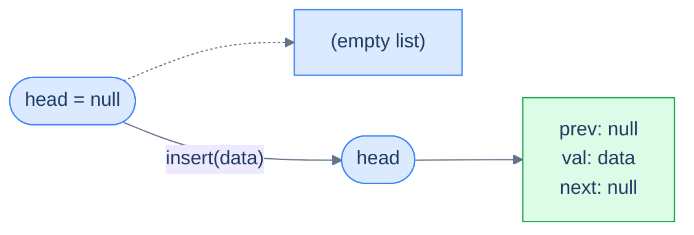

<p align="center"><strong>Insertion into an empty list — the new node becomes the entire list. Both <code>prev</code> and <code>next</code> are <code>null</code> because there are no neighbours on either side.</strong></p>

> **Algorithm**
>
> -   **Step 1:** Create a new node with the given data.
> -   **Step 2:** Set the new node's `next` pointer to `null` since it's the only node.
> -   **Step 3:** Set the new node's `prev` pointer to `null` since it's the only node.
> -   **Step 4:** Return the new node, as this node is also the head node.

## 2. The list is not empty

In this scenario, the linked list already contains some data, so the **head** is not `null` — it is the first node of the linked list. To insert a new node at the beginning of the list, create a new node, set its `next` to point at the old head, set its `prev` to `null` (it's the new head, so nothing precedes it), and **mirror** the link by setting the old head's `prev` to point back at the new node. This last step is the one beginners forget — and it silently corrupts every backward traversal afterward.

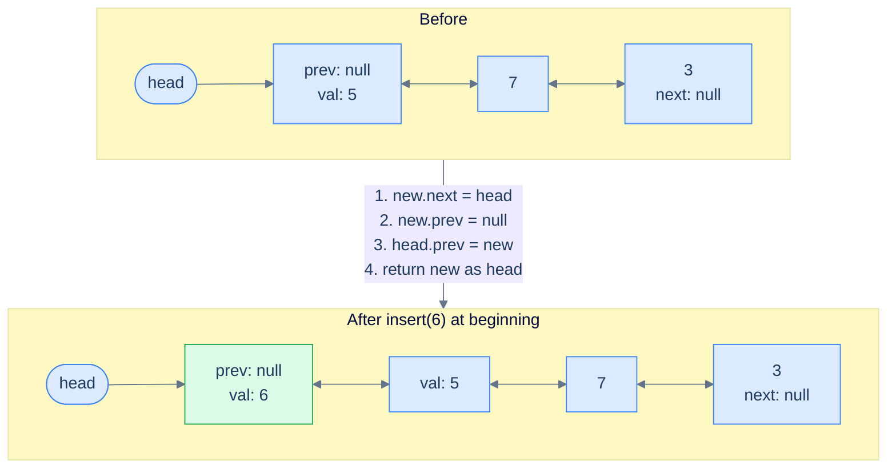

<p align="center"><strong>Insertion at the beginning of a non-empty list — three pointer updates plus the new node returned as the new head. The mirror update <code>head.prev = new</code> is what keeps backward traversal honest.</strong></p>

> **Algorithm**
>
> -   **Step 1:** Create a new node with the given data.
> -   **Step 2:** Set the `next` pointer of the new node to the current head, as the new node will be the new head.
> -   **Step 3:** Set the new node's `prev` pointer to `null` since it's the new head node.
> -   **Step 4:** Set the `prev` pointer of the current head to the new node to restore the bidirectional link.
> -   **Step 5:** Return the new node, as this is the new head.

## Implementation

When implementing the logic for the insert-at-beginning operation, we consider both possible cases (empty / non-empty) and write the code for each in conditional blocks.


```python run
"""
Definition for doubly-linked list.
class ListNode:
    def __init__(self, val):
        self.val = val
        self.prev = None
        self.next = None
"""

from typing import Optional

class Solution:
    def insert_at_beginning(
        self, head: Optional[ListNode], data: int
    ) -> Optional[ListNode]:

        # Create a new node with the given data
        new_node: ListNode = ListNode(data)

        # Check if the list is empty
        if head is None:

            # Set the next pointer to None since it's the only node
            new_node.next = None
            new_node.prev = None

            # Return the new_node as this is the new head
            return new_node

        # Set the next pointer of the new node to the current head
        new_node.next = head

        # Set the prev pointer of the new node to None since it will be
        # the new head
        new_node.prev = None

        # Set the prev pointer of the current head to the new node
        head.prev = new_node

        # Return the new node as the new head of the list
        return new_node
```

```java run
/**
 * Definition for doubly-linked list.
 * class ListNode {
 *     int val;
 *     ListNode prev;
 *     ListNode next;
 *     ListNode() {}
 *     ListNode(int val) { this.val = val; }
 * };
 */

class Solution {
    public ListNode insertAtBeginning(ListNode head, int data) {

        // Create a new node with the given data
        ListNode newNode = new ListNode(data);

        // Check if the list is empty
        if (head == null) {

            // Set the next pointer to null since it's the only node
            newNode.next = null;
            newNode.prev = null;

            // Return the newNode as this is the new head
            return newNode;
        }

        // Set the next pointer of the new node to the current head
        newNode.next = head;

        // Set the prev pointer of the new node to null since it will be
        // the new head
        newNode.prev = null;

        // Set the prev pointer of the current head to the new node
        head.prev = newNode;

        // Return the new node as the new head of the list
        return newNode;
    }
}
```


## Complexity Analysis

The time complexity of the above function does not depend on the list size — we always touch a fixed number of pointers, never traverse. The space complexity is also constant because we only allocate a single new node.


<p align="center"><strong>All cases — insert before the head node touches a constant number of pointers (new.next, new.prev, head.prev). No traversal, no allocation beyond the single new node.</strong></p>

> **Best Case**
>
> -   Space Complexity — **O(1)**
> -   Time Complexity — **O(1)**
>
> **Worst Case**
>
> -   Space Complexity — **O(1)**
> -   Time Complexity — **O(1)**

***

# Insert at beginning

## The Problem

> Given the **head** of a doubly linked list and a **data** value, write a function to insert a new node with the given data value at the beginning of the linked list and return the head of the updated list.

```
Input:  head = [5, 7, 3, 10], data = 6
Output: [6, 5, 7, 3, 10]
```

<details>
<summary><h2>The Solution</h2></summary>


```python run viz=linked-list viz-root=head
from typing import Optional


class ListNode:
    def __init__(self, val=0, prev=None, nxt=None):
        self.val = val
        self.prev = prev
        self.next = nxt


def from_list(values):
    if not values:
        return None
    head = ListNode(values[0])
    cur = head
    for v in values[1:]:
        node = ListNode(v, prev=cur)
        cur.next = node
        cur = node
    return head


def to_list(head):
    out = []
    while head is not None:
        out.append(head.val)
        head = head.next
    return out


class Solution:
    def insert_at_beginning(
        self, head: Optional[ListNode], data: int
    ) -> Optional[ListNode]:

        # Create a new node with the given data
        new_node: ListNode = ListNode(data)

        # Check if the list is empty
        if head is None:

            # Set the next pointer to None since it's the only node
            new_node.next = None
            new_node.prev = None

            # Return the new_node as this is the new head
            return new_node

        # Set the next pointer of the new node to the current head
        new_node.next = head

        # Set the prev pointer of the new node to None since it will be
        # the new head
        new_node.prev = None

        # Set the prev pointer of the current head to the new node
        head.prev = new_node

        # Return the new node as the new head of the list
        return new_node


# Examples from the problem statement
print(to_list(Solution().insert_at_beginning(from_list([5, 7, 3, 10]), 6)))  # [6, 5, 7, 3, 10]

# Edge cases
print(to_list(Solution().insert_at_beginning(None, 1)))                       # [1]
print(to_list(Solution().insert_at_beginning(from_list([42]), 99)))           # [99, 42]
print(to_list(Solution().insert_at_beginning(from_list([1, 2, 3]), 0)))       # [0, 1, 2, 3]
print(to_list(Solution().insert_at_beginning(from_list([5, 5, 5]), 5)))       # [5, 5, 5, 5]
print(to_list(Solution().insert_at_beginning(from_list([10, 20]), 5)))        # [5, 10, 20]
```

```java run
import java.util.*;

public class Main {
    static class ListNode {
        int val;
        ListNode prev;
        ListNode next;
        ListNode() {}
        ListNode(int val) { this.val = val; }
    }

    static ListNode fromList(int... values) {
        if (values.length == 0) return null;
        ListNode head = new ListNode(values[0]);
        ListNode cur = head;
        for (int i = 1; i < values.length; i++) {
            ListNode node = new ListNode(values[i]);
            node.prev = cur;
            cur.next = node;
            cur = node;
        }
        return head;
    }

    static java.util.List<Integer> toList(ListNode head) {
        java.util.List<Integer> out = new java.util.ArrayList<>();
        while (head != null) { out.add(head.val); head = head.next; }
        return out;
    }

    static class Solution {
        public ListNode insertAtBeginning(ListNode head, int data) {

            // Create a new node with the given data
            ListNode newNode = new ListNode(data);

            // Check if the list is empty
            if (head == null) {

                // Set the next pointer to null since it's the only node
                newNode.next = null;
                newNode.prev = null;

                // Return the newNode as this is the new head
                return newNode;
            }

            // Set the next pointer of the new node to the current head
            newNode.next = head;

            // Set the prev pointer of the new node to null since it will be
            // the new head
            newNode.prev = null;

            // Set the prev pointer of the current head to the new node
            head.prev = newNode;

            // Return the new node as the new head of the list
            return newNode;
        }
    }

    public static void main(String[] args) {
        // Examples from the problem statement
        System.out.println(toList(new Solution().insertAtBeginning(fromList(5, 7, 3, 10), 6)));  // [6, 5, 7, 3, 10]

        // Edge cases
        System.out.println(toList(new Solution().insertAtBeginning(null, 1)));                    // [1]
        System.out.println(toList(new Solution().insertAtBeginning(fromList(42), 99)));            // [99, 42]
        System.out.println(toList(new Solution().insertAtBeginning(fromList(1, 2, 3), 0)));        // [0, 1, 2, 3]
        System.out.println(toList(new Solution().insertAtBeginning(fromList(5, 5, 5), 5)));        // [5, 5, 5, 5]
        System.out.println(toList(new Solution().insertAtBeginning(fromList(10, 20), 5)));         // [5, 10, 20]
    }
}
```


<details>
<summary><strong>Trace — head = [5, 7, 3, 10], data = 6</strong></summary>

```
Initial │ head → 5 ⇄ 7 ⇄ 3 ⇄ 10
Step 1  │ create new_node(6)
Step 2  │ head is not null         │ skip the empty-list branch
Step 3  │ new_node.next = head     │ new_node(6) → 5 ⇄ 7 ⇄ 3 ⇄ 10
Step 4  │ new_node.prev = null     │ new_node(6) is the new head — nothing precedes it
Step 5  │ head.prev = new_node     │ old head 5 now points back: new_node(6) ⇄ 5 ⇄ 7 ⇄ 3 ⇄ 10
Step 6  │ return new_node          │ new head is 6
Result: [6, 5, 7, 3, 10] ✓
```

The mirror update `head.prev = new_node` is the doubly-linked step the singly linked version never had — without it the backward chain from node 5 would still point at `null` and reverse traversal would lose the new head.

</details>

</details>

***

# Understanding insertion at end

When inserting at the end of a doubly linked list, we must access the linked list's tail node. Fortunately, in a doubly linked list, we routinely keep a direct reference to the tail (much like the head). This makes insertion at the end almost a perfect mirror of insertion at the beginning — just flip every `head` to `tail` and every `next` to `prev`.

## 1. The list is empty

If the linked list is empty, the **tail** will be `null`. We initialize the new node and set both its pointers to `null`, since the new node is simultaneously the head and the tail of a one-element list.

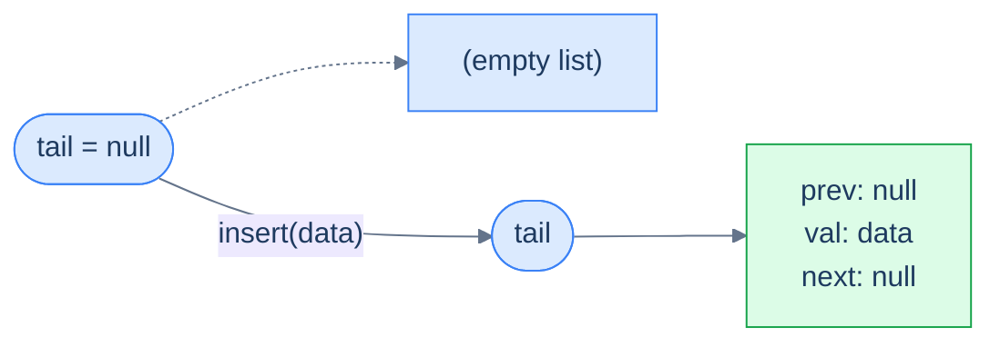

<p align="center"><strong>The list is empty — the new node becomes both the head and the tail. Same single-node case as insert-at-beginning, just entered through a different door.</strong></p>

> **Algorithm**
>
> -   **Step 1:** Create a new node with the given data.
> -   **Step 2:** Set this new node's `next` pointer to `null` since it's the only node.
> -   **Step 3:** Set this new node's `prev` pointer to `null` since it's the only node.
> -   **Step 4:** Return the new node, as this node is also the tail node.

## 2. The list is not empty

The linked list already contains some data, so the **tail** is the last node. We create the new node, link `tail.next = new` so the existing tail now points forward at us, link `new.prev = tail` to mirror that connection, and set `new.next = null` because the new node is now the end of the list.

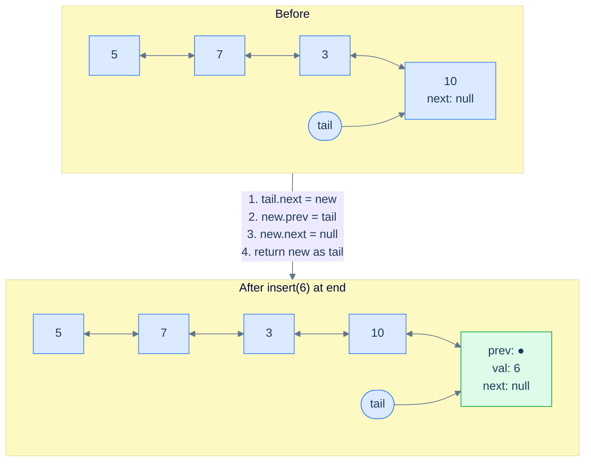

<p align="center"><strong>Insertion at the end of a non-empty list — three pointer updates and the new node becomes the new tail. Mirror image of insertion at the beginning.</strong></p>

> **Algorithm**
>
> -   **Step 1:** Create a new node with the given data.
> -   **Step 2:** Set the current tail's `next` pointer to hold the reference of the new node.
> -   **Step 3:** Set the new node's `prev` pointer to hold the reference of the current tail.
> -   **Step 4:** Set the new node's `next` pointer to `null`.
> -   **Step 5:** Return the new node, as this is the new tail.

## Implementation

We consider both cases and handle them in conditional blocks.


```python run
"""
Definition for doubly-linked list.
class ListNode:
    def __init__(self, val):
        self.val = val
        self.prev = None
        self.next = None
"""

from typing import Optional

class Solution:
    def insert_at_end(
        self, tail: Optional[ListNode], data: int
    ) -> Optional[ListNode]:

        # Create a new node with the given data
        new_node: ListNode = ListNode(data)

        # Check if the list is empty
        if tail is None:

            # Set the next and prev pointer of the new node to None
            new_node.next = None
            new_node.prev = None

            # Return the new_node as this is the new tail
            return new_node

        # Set the next pointer of the tail to the new node
        tail.next = new_node

        # Set the previous pointer of the new node to the current tail
        new_node.prev = tail

        # Set the next pointer of the new node to None since it will be
        # the new tail
        new_node.next = None

        # Return the new node as the new tail of the list
        return new_node
```

```java run
/**
 * Definition for doubly-linked list.
 * class ListNode {
 *     int val;
 *     ListNode prev;
 *     ListNode next;
 *     ListNode() {}
 *     ListNode(int val) { this.val = val; }
 * };
 */

class Solution {
    public ListNode insertAtEnd(ListNode tail, int data) {

        // Create a new node with the given data
        ListNode newNode = new ListNode(data);

        // Check if the list is empty
        if (tail == null) {

            // Set the next and prev pointer of the new node to null
            newNode.next = null;
            newNode.prev = null;

            // Return the newNode as this is the new tail
            return newNode;
        }

        // Set the next pointer of the tail to the new node
        tail.next = newNode;

        // Set the previous pointer of the new node to the current tail
        newNode.prev = tail;

        // Set the next pointer of the new node to null since it will be
        // the new tail
        newNode.next = null;

        // Return the new node as the new tail of the list
        return newNode;
    }
}
```


## Complexity Analysis

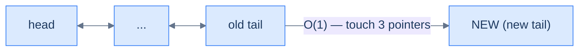

<p align="center"><strong>All cases — insert after the tail node touches a constant number of pointers. Same constant-time guarantee as insert-at-beginning, achieved through the dedicated <code>tail</code> reference.</strong></p>

> **Best Case**
>
> -   Space Complexity — **O(1)**
> -   Time Complexity — **O(1)**
>
> **Worst Case**
>
> -   Space Complexity — **O(1)**
> -   Time Complexity — **O(1)**

***

# Insert at end

## The Problem

> Given the **tail** of a doubly linked list and a **data** value, write a function to insert a new node with the given data value at the end of the linked list and return the tail of the updated list.

```
Input:  head = [5, 7, 3, 10], data = 6
Output: [5, 7, 3, 10, 6]
```

<details>
<summary><h2>The Solution</h2></summary>


```python run viz=linked-list viz-root=head
from typing import Optional


class ListNode:
    def __init__(self, val=0, prev=None, nxt=None):
        self.val = val
        self.prev = prev
        self.next = nxt


def from_list(values):
    if not values:
        return None
    head = ListNode(values[0])
    cur = head
    for v in values[1:]:
        node = ListNode(v, prev=cur)
        cur.next = node
        cur = node
    return head


def to_list(head):
    out = []
    while head is not None:
        out.append(head.val)
        head = head.next
    return out


def to_tail(head):
    if head is None:
        return None
    cur = head
    while cur.next is not None:
        cur = cur.next
    return cur


def head_of(tail):
    """Walk backwards to recover head from the tail node."""
    if tail is None:
        return None
    cur = tail
    while cur.prev is not None:
        cur = cur.prev
    return cur


class Solution:
    def insert_at_end(
        self, tail: Optional[ListNode], data: int
    ) -> Optional[ListNode]:

        # Create a new node with the given data
        new_node: ListNode = ListNode(data)

        # Check if the list is empty
        if tail is None:

            # Set the next and prev pointer of the new node to None
            new_node.next = None
            new_node.prev = None

            # Return the newNode as this is the new tail
            return new_node

        # Set the next pointer of the tail to the new node
        tail.next = new_node

        # Set the previous pointer of the new node to the current tail
        new_node.prev = tail

        # Set the next pointer of the new node to None since it will be
        # the new tail
        new_node.next = None

        # Return the new node as the new tail of the list
        return new_node


# Examples from the problem statement — rebuild full list via head
t1 = Solution().insert_at_end(to_tail(from_list([5, 7, 3, 10])), 6)
print(to_list(head_of(t1)))    # [5, 7, 3, 10, 6]

# Edge cases
t2 = Solution().insert_at_end(None, 1)
print(to_list(head_of(t2)))    # [1]

t3 = Solution().insert_at_end(to_tail(from_list([42])), 99)
print(to_list(head_of(t3)))    # [42, 99]

t4 = Solution().insert_at_end(to_tail(from_list([1, 2, 3])), 4)
print(to_list(head_of(t4)))    # [1, 2, 3, 4]

t5 = Solution().insert_at_end(to_tail(from_list([5, 5])), 5)
print(to_list(head_of(t5)))    # [5, 5, 5]

t6 = Solution().insert_at_end(to_tail(from_list([10])), 20)
print(to_list(head_of(t6)))    # [10, 20]
```

```java run
import java.util.*;

public class Main {
    static class ListNode {
        int val;
        ListNode prev;
        ListNode next;
        ListNode() {}
        ListNode(int val) { this.val = val; }
    }

    static ListNode fromList(int... values) {
        if (values.length == 0) return null;
        ListNode head = new ListNode(values[0]);
        ListNode cur = head;
        for (int i = 1; i < values.length; i++) {
            ListNode node = new ListNode(values[i]);
            node.prev = cur;
            cur.next = node;
            cur = node;
        }
        return head;
    }

    static ListNode toTail(ListNode head) {
        if (head == null) return null;
        ListNode cur = head;
        while (cur.next != null) cur = cur.next;
        return cur;
    }

    static ListNode headOf(ListNode tail) {
        if (tail == null) return null;
        ListNode cur = tail;
        while (cur.prev != null) cur = cur.prev;
        return cur;
    }

    static java.util.List<Integer> toList(ListNode head) {
        java.util.List<Integer> out = new java.util.ArrayList<>();
        while (head != null) { out.add(head.val); head = head.next; }
        return out;
    }

    static class Solution {
        public ListNode insertAtEnd(ListNode tail, int data) {

            // Create a new node with the given data
            ListNode newNode = new ListNode(data);

            // Check if the list is empty
            if (tail == null) {

                // Set the next and prev pointer of the new node to null
                newNode.next = null;
                newNode.prev = null;

                // Return the newNode as this is the new tail
                return newNode;
            }

            // Set the next pointer of the tail to the new node
            tail.next = newNode;

            // Set the previous pointer of the new node to the current tail
            newNode.prev = tail;

            // Set the next pointer of the new node to null since it will be
            // the new tail
            newNode.next = null;

            // Return the new node as the new tail of the list
            return newNode;
        }
    }

    public static void main(String[] args) {
        // Examples from the problem statement
        ListNode t1 = new Solution().insertAtEnd(toTail(fromList(5, 7, 3, 10)), 6);
        System.out.println(toList(headOf(t1)));    // [5, 7, 3, 10, 6]

        // Edge cases
        ListNode t2 = new Solution().insertAtEnd(null, 1);
        System.out.println(toList(headOf(t2)));    // [1]

        ListNode t3 = new Solution().insertAtEnd(toTail(fromList(42)), 99);
        System.out.println(toList(headOf(t3)));    // [42, 99]

        ListNode t4 = new Solution().insertAtEnd(toTail(fromList(1, 2, 3)), 4);
        System.out.println(toList(headOf(t4)));    // [1, 2, 3, 4]

        ListNode t5 = new Solution().insertAtEnd(toTail(fromList(5, 5)), 5);
        System.out.println(toList(headOf(t5)));    // [5, 5, 5]

        ListNode t6 = new Solution().insertAtEnd(toTail(fromList(10)), 20);
        System.out.println(toList(headOf(t6)));    // [10, 20]
    }
}
```

</details>


***

# Understanding insertion after the given node

Inserting a node after a given node is a simple operation. It is similar to inserting after a given node in a singly linked list, with one extra step — we must update the `prev` pointer of the node that comes after the given one (if it exists), so the new node is wired in **both** directions. Let's examine the two cases we need to consider.

## 1. The given node is null

If the given node is `null`, there's no insertion point — we simply return without making any changes. (This is the equivalent of an "empty list" guard for an operation that takes a node reference.)

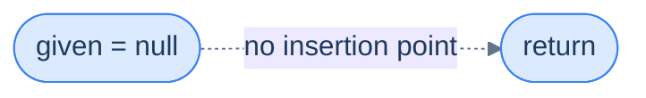

<p align="center"><strong>The list is empty / given node is null — no anchor exists, so we return early without modification.</strong></p>

> **Algorithm**
>
> -   **Step 1:** Return from the function.

## 2. The list is not empty

The new node will be inserted between two existing nodes (the given node and its current successor). We must wire **all four** of the affected pointers, with one twist: if the given node is the *tail*, there is no successor — so the "fix the successor's `prev`" step has to be guarded by a null check.

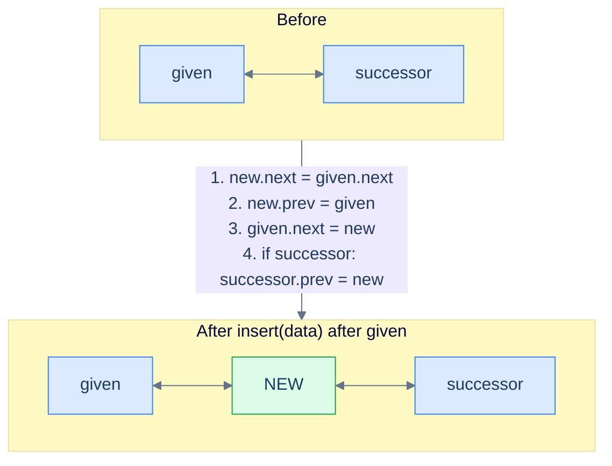

<p align="center"><strong>Insert after the given node — splice the new node between <code>given</code> and <code>given.next</code>. Four pointers updated; the fourth is conditional because the given node may be the tail.</strong></p>

> **Algorithm**
>
> -   **Step 1:** Create a new node with the given data.
> -   **Step 2:** Set the new node's `next` pointer to hold the node's reference stored in the `next` pointer of the `given` node.
> -   **Step 3:** Set the new node's `prev` pointer to hold the reference of the `given` node.
> -   **Step 4:** Set the `given` node's `next` pointer to hold the reference of the new node.
> -   **Step 5:** Set the `prev` pointer of the node after the `given` node (if it exists) to hold the reference of the new node.

## Implementation

We will be given the node, **after** which we will perform the insertion.


```python run
"""
Definition for doubly-linked list.
class ListNode:
    def __init__(self, val):
        self.val = val
        self.prev = None
        self.next = None
"""

from typing import Optional

class Solution:
    def insert_after_the_given_node(
        self, node: Optional[ListNode], data: int
    ) -> None:

        # Check if the given node is valid (not None)
        if node is None:

            # If the node is None, we cannot insert after it, so return.
            return

        # Create a new node with the given data
        new_node: ListNode = ListNode(data)

        # Link the new node to the next node in the list
        new_node.next = node.next

        # Link the new node to the current node as its previous node
        new_node.prev = node

        # Link the current node to the new node, effectively inserting
        # the new node after it
        node.next = new_node

        # If the new node has a valid next node, update its previous node
        # to point back to the new node
        if new_node.next is not None:
            new_node.next.prev = new_node
```

```java run
/**
 * Definition for doubly-linked list.
 * class ListNode {
 *     int val;
 *     ListNode prev;
 *     ListNode next;
 *     ListNode() {}
 *     ListNode(int val) { this.val = val; }
 * };
 */

class Solution {
    public void insertAfterTheGivenNode(ListNode node, int data) {

        // Check if the given node is valid (not null)
        if (node == null) {

            // If the node is null, we cannot insert after it, so return.
            return;
        }

        // Create a new node with the given data
        ListNode newNode = new ListNode(data);

        // Link the new node to the next node in the list
        newNode.next = node.next;

        // Link the new node to the current node as its previous node
        newNode.prev = node;

        // Link the current node to the new node, effectively inserting
        // the new node after it
        node.next = newNode;

        // If the new node has a valid next node, update its previous
        // node to point back to the new node
        if (newNode.next != null) {
            newNode.next.prev = newNode;
        }
    }
}
```


> *Why is the order of those four assignments important? Try mentally swapping step 4 (<code>node.next = new</code>) with step 2 (<code>new.next = node.next</code>) — what reads what before being overwritten?*
>
> If you do step 4 first, `node.next` becomes the new node, and step 2 then reads `node.next` and finds *the new node again*, creating a cycle. **Always copy the old pointers into the new node first, then overwrite the old ones.** This "save before clobber" pattern shows up in every linked-list mutation.

## Complexity Analysis

The time complexity is **O(1)** because we only touch a constant number of pointers — no traversal is required. Space is **O(1)** because we allocate exactly one node.

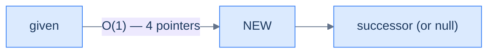

<p align="center"><strong>All cases — insert after the given node touches at most four pointers regardless of list size.</strong></p>

> **Best Case**
>
> -   Space Complexity — **O(1)**
> -   Time Complexity — **O(1)**
>
> **Worst Case**
>
> -   Space Complexity — **O(1)**
> -   Time Complexity — **O(1)**

***

# Insert after the given node

## The Problem

> Given a reference to a **random node** in a doubly linked list and a **data** value, write a function to insert a new node with the given data value after the given node.

```
Input:  head = [5, 7, 3, 10], node = 7, data = 6
Output: [5, 7, 6, 3, 10]
```

<details>
<summary><h2>The Solution</h2></summary>


```python run viz=linked-list viz-root=head
from typing import Optional


class ListNode:
    def __init__(self, val=0, prev=None, nxt=None):
        self.val = val
        self.prev = prev
        self.next = nxt


def from_list(values):
    if not values:
        return None
    head = ListNode(values[0])
    cur = head
    for v in values[1:]:
        node = ListNode(v, prev=cur)
        cur.next = node
        cur = node
    return head


def to_list(head):
    out = []
    while head is not None:
        out.append(head.val)
        head = head.next
    return out


def get_node(head, val):
    """Return first node with the given value."""
    cur = head
    while cur is not None:
        if cur.val == val:
            return cur
        cur = cur.next
    return None


class Solution:
    def insert_after_the_given_node(
        self, node: Optional[ListNode], data: int
    ) -> None:

        # Check if the given node is valid (not None)
        if node is None:

            # If the node is None, we cannot insert after it, so return.
            return

        # Create a new node with the given data
        new_node: ListNode = ListNode(data)

        # Link the new node to the next node in the list
        new_node.next = node.next

        # Link the new node to the current node as its previous node
        new_node.prev = node

        # Link the current node to the new node, effectively inserting
        # the new node after it
        node.next = new_node

        # If the new node has a valid next node, update its previous node
        # to point back to the new node
        if new_node.next is not None:
            new_node.next.prev = new_node


# Examples from the problem statement
h1 = from_list([5, 7, 3, 10])
Solution().insert_after_the_given_node(get_node(h1, 7), 6)
print(to_list(h1))    # [5, 7, 6, 3, 10]

# Edge cases — insert after head
h2 = from_list([1, 2, 3])
Solution().insert_after_the_given_node(get_node(h2, 1), 99)
print(to_list(h2))    # [1, 99, 2, 3]

# Insert after tail
h3 = from_list([1, 2, 3])
Solution().insert_after_the_given_node(get_node(h3, 3), 4)
print(to_list(h3))    # [1, 2, 3, 4]

# Single node list
h4 = from_list([5])
Solution().insert_after_the_given_node(get_node(h4, 5), 10)
print(to_list(h4))    # [5, 10]

# None node — no-op
h5 = from_list([1, 2])
Solution().insert_after_the_given_node(None, 9)
print(to_list(h5))    # [1, 2]

# Insert after middle
h6 = from_list([10, 20, 30, 40])
Solution().insert_after_the_given_node(get_node(h6, 20), 25)
print(to_list(h6))    # [10, 20, 25, 30, 40]
```

```java run
import java.util.*;

public class Main {
    static class ListNode {
        int val;
        ListNode prev;
        ListNode next;
        ListNode() {}
        ListNode(int val) { this.val = val; }
    }

    static ListNode fromList(int... values) {
        if (values.length == 0) return null;
        ListNode head = new ListNode(values[0]);
        ListNode cur = head;
        for (int i = 1; i < values.length; i++) {
            ListNode node = new ListNode(values[i]);
            node.prev = cur;
            cur.next = node;
            cur = node;
        }
        return head;
    }

    static java.util.List<Integer> toList(ListNode head) {
        java.util.List<Integer> out = new java.util.ArrayList<>();
        while (head != null) { out.add(head.val); head = head.next; }
        return out;
    }

    static ListNode getNode(ListNode head, int val) {
        ListNode cur = head;
        while (cur != null) {
            if (cur.val == val) return cur;
            cur = cur.next;
        }
        return null;
    }

    static class Solution {
        public void insertAfterTheGivenNode(ListNode node, int data) {

            // Check if the given node is valid (not null)
            if (node == null) {

                // If the node is null, we cannot insert after it, so return.
                return;
            }

            // Create a new node with the given data
            ListNode newNode = new ListNode(data);

            // Link the new node to the next node in the list
            newNode.next = node.next;

            // Link the new node to the current node as its previous node
            newNode.prev = node;

            // Link the current node to the new node, effectively inserting
            // the new node after it
            node.next = newNode;

            // If the new node has a valid next node, update its previous
            // node to point back to the new node
            if (newNode.next != null) {
                newNode.next.prev = newNode;
            }
        }
    }

    public static void main(String[] args) {
        // Examples from the problem statement
        ListNode h1 = fromList(5, 7, 3, 10);
        new Solution().insertAfterTheGivenNode(getNode(h1, 7), 6);
        System.out.println(toList(h1));    // [5, 7, 6, 3, 10]

        // Edge cases — insert after head
        ListNode h2 = fromList(1, 2, 3);
        new Solution().insertAfterTheGivenNode(getNode(h2, 1), 99);
        System.out.println(toList(h2));    // [1, 99, 2, 3]

        // Insert after tail
        ListNode h3 = fromList(1, 2, 3);
        new Solution().insertAfterTheGivenNode(getNode(h3, 3), 4);
        System.out.println(toList(h3));    // [1, 2, 3, 4]

        // Single node list
        ListNode h4 = fromList(5);
        new Solution().insertAfterTheGivenNode(getNode(h4, 5), 10);
        System.out.println(toList(h4));    // [5, 10]

        // None node — no-op
        ListNode h5 = fromList(1, 2);
        new Solution().insertAfterTheGivenNode(null, 9);
        System.out.println(toList(h5));    // [1, 2]

        // Insert after middle
        ListNode h6 = fromList(10, 20, 30, 40);
        new Solution().insertAfterTheGivenNode(getNode(h6, 20), 25);
        System.out.println(toList(h6));    // [10, 20, 25, 30, 40]
    }
}
```


<details>
<summary><strong>Trace — head = [5, 7, 3, 10], given = node(7), data = 6</strong></summary>

```
Initial │ 5 ⇄ 7 ⇄ 3 ⇄ 10
Step 1  │ node = node(7) is not null            │ continue
Step 2  │ create new_node(6)
Step 3  │ new_node.next = node.next = node(3)    │ new_node(6) → 3
Step 4  │ new_node.prev = node = node(7)         │ 7 ← new_node(6)
Step 5  │ node.next = new_node                  │ 5 ⇄ 7 → new_node(6) → 3 ⇄ 10
Step 6  │ new_node.next is node(3) ≠ null →     │ node(3).prev = new_node(6)
        │ new_node.next.prev = new_node          │ 5 ⇄ 7 ⇄ new_node(6) ⇄ 3 ⇄ 10
Result: [5, 7, 6, 3, 10] ✓
```

Four pointers, not two — steps 4 and 6 are the `prev`-side mirror updates. Step 6 is guarded by a null check because the given node could be the tail, in which case there is no successor whose `prev` needs fixing.

</details>

</details>

***

# Understanding insertion before the given node

In linked lists, it is essential to access the node **before** the one being inserted or deleted. In a singly linked list, finding the node before the given one requires traversing from the head — that's the whole reason singly lists are bad at this operation. **In a doubly linked list, that walk vanishes.** The node before the given one is sitting right there at `given.prev`, one hop away. This is the operation where the doubly linked list earns its keep over a singly linked list. Let's examine the three cases we need to consider.

## 1. The list is empty (or given is null)

If the list is empty or the given node is null, there is no insertion point. In such a case, we return the **head** node that was provided as it is.


<p align="center"><strong>Empty list or null reference — no insertion point exists, return the original head untouched.</strong></p>

> **Algorithm**
>
> -   **Step 1:** Return the original head node.

## 2. The given node is the first node (the head)

This is exactly the **insert-at-beginning** case we already solved. We detect it by comparing the given node reference to the head — if they're the same, we delegate.

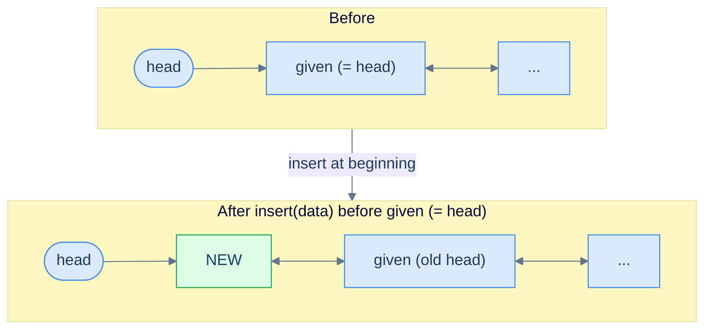

<p align="center"><strong>The given node is the first node — same as inserting at the beginning. The new node becomes the new head.</strong></p>

> **Algorithm**
>
> -   **Step 1:** Create a new node with the given data.
> -   **Step 2:** Set the `next` pointer of the new node to the current head, as the new node will be the new head.
> -   **Step 3:** Set the new node's `prev` pointer to `null` since it's the new head node.
> -   **Step 4:** Set the `prev` pointer of current head to the new node to restore the bidirectional link.
> -   **Step 5:** Return the new node, as this is the new head.

## 3. The given node is not the first node

In this scenario, we use a reference manipulation similar to **inserting after a given node**. However, this time we use the `prev` pointer to find the predecessor — and that's where the doubly linked list shines. The predecessor is `given.prev`, available in O(1).

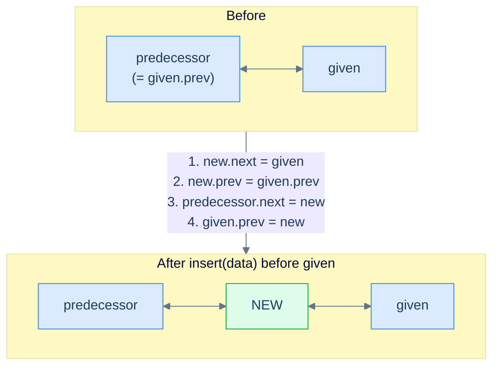

<p align="center"><strong>Insert before a non-head given node — splice the new node between <code>given.prev</code> and <code>given</code>. Four pointers updated, all reachable in O(1).</strong></p>

> **Algorithm**
>
> -   **Step 1:** Create a new node with the given data.
> -   **Step 2:** Set the new node's `next` pointer to hold the reference of the `given` node.
> -   **Step 3:** Set the new node's `prev` pointer to hold the reference of the node before the `given` node.
> -   **Step 4:** Set the `next` pointer of the node before the given node to hold the reference of the new node.
> -   **Step 5:** Set the `given` node's `prev` pointer to hold the reference of the new node.
> -   **Step 6:** Return the original head node.

## Implementation


```python run
"""
Definition for doubly-linked list.
class ListNode:
    def __init__(self, val):
        self.val = val
        self.prev = None
        self.next = None
"""

from typing import Optional

class Solution:
    def insert_before_the_given_node(
        self,
        head: Optional[ListNode],
        node: Optional[ListNode],
        data: int,
    ) -> Optional[ListNode]:

        # Check if the head or the node to insert before is None
        if head is None or node is None:
            return head

        # Create a new node with the provided data
        new_node = ListNode(data)

        # Check if the node to insert before is the head of the list.
        if node == head:

            # Set the next pointer of the new node to the current head
            new_node.next = head

            # Set the prev pointer of the new node to None since it will
            # be the new head
            new_node.prev = None

            # Set the prev pointer of the current head to the new node
            head.prev = new_node

            # Return the new_node as this is the new head
            return new_node

        # Update the pointers of the new node to connect it with the list.
        # The next node of the new node is the node given
        new_node.next = node

        # The previous node of the new node is the prev node of the given
        # node
        new_node.prev = node.prev

        # Update the next pointer of the previous node of the node to
        # point to the new node.
        if new_node.prev:
            new_node.prev.next = new_node

        # Update the prev pointer of the node to point back to the new
        # node
        node.prev = new_node

        # Return the updated head of the list
        return head
```

```java run
/**
 * Definition for doubly-linked list.
 * class ListNode {
 *     int val;
 *     ListNode prev;
 *     ListNode next;
 *     ListNode() {}
 *     ListNode(int val) { this.val = val; }
 * };
 */

class Solution {
    public ListNode insertBeforeTheGivenNode(
        ListNode head,
        ListNode node,
        int data
    ) {

        // Check if the head or the node to insert before is null
        if (head == null || node == null) {
            return head;
        }

        // Create a new node with the provided data
        ListNode newNode = new ListNode(data);

        // Check if the node to insert before is the head of the list.
        if (node == head) {

            // Set the next pointer of the new node to the current head
            newNode.next = head;

            // Set the prev pointer of the new node to null since it will
            // be the new head
            newNode.prev = null;

            // Set the prev pointer of the current head to the new node
            head.prev = newNode;

            // Return the newNode as this is the new head
            return newNode;
        }

        // Update the pointers of the new node to connect it with the
        // list. The next node of the new node is the node given
        newNode.next = node;

        // The previous node of the new node is the prev node of the
        // given node
        newNode.prev = node.prev;

        // Update the next pointer of the previous node of the node to
        // point to the new node.
        if (newNode.prev != null) {
            newNode.prev.next = newNode;
        }

        // Update the prev pointer of the node to point back to the new
        // node
        node.prev = newNode;

        // Return the updated head of the list
        return head;
    }
}
```


## Complexity Analysis

The time complexity has improved dramatically compared to the singly linked list version of this operation. We no longer need to traverse the list to find the node one step before the given node — `given.prev` gives it to us for free. With a doubly linked list, the time complexity is **O(1)** for inserting anywhere in the list if we have a reference to the node before/after which we want to insert.

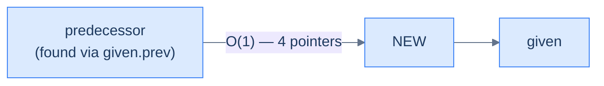

<p align="center"><strong>All cases — insert before the given node touches a constant number of pointers, with the predecessor located in O(1) via <code>given.prev</code>. This is the headline win of the doubly linked list.</strong></p>

This is the main advantage of the doubly linked list. Since we are only creating a single node, the extra space needed for this operation is constant — hence the space complexity is **O(1)**.

> **Best Case**
>
> -   Space Complexity — **O(1)**
> -   Time Complexity — **O(1)**
>
> **Worst Case**
>
> -   Space Complexity — **O(1)**
> -   Time Complexity — **O(1)**

***

# Insert before the given node

## The Problem

> Given the **head** of a doubly linked list, a reference to a **random node** in that linked list, and a **data** value, write a function to insert a new node with the given data before the given node and return the head of the updated list.

```
Input:  head = [5, 7, 3, 10], node = 7, data = 6
Output: [5, 6, 7, 3, 10]
```

<details>
<summary><h2>The Solution</h2></summary>


```python run viz=linked-list viz-root=head
from typing import Optional


class ListNode:
    def __init__(self, val=0, prev=None, nxt=None):
        self.val = val
        self.prev = prev
        self.next = nxt


def from_list(values):
    if not values:
        return None
    head = ListNode(values[0])
    cur = head
    for v in values[1:]:
        node = ListNode(v, prev=cur)
        cur.next = node
        cur = node
    return head


def to_list(head):
    out = []
    while head is not None:
        out.append(head.val)
        head = head.next
    return out


def get_node(head, val):
    cur = head
    while cur is not None:
        if cur.val == val:
            return cur
        cur = cur.next
    return None


class Solution:
    def insert_before_the_given_node(
        self,
        head: Optional[ListNode],
        node: Optional[ListNode],
        data: int,
    ) -> Optional[ListNode]:

        # Check if the head or the node to insert before is null
        if head is None or node is None:
            return head

        # Create a new node with the provided data
        new_node = ListNode(data)

        # Check if the node to insert before is the head of the list.
        if node == head:

            # Set the next pointer of the new node to the current head
            new_node.next = head

            # Set the prev pointer of the new node to None since it will
            # be the new head
            new_node.prev = None

            # Set the prev pointer of the current head to the new node
            head.prev = new_node

            # Return the newNode as this is the new head
            return new_node

        # Update the pointers of the new node to connect it with the
        # list. The next node of the new node is the node given
        new_node.next = node

        # The previous node of the new node is the prev node of the given
        # node
        new_node.prev = node.prev

        # Update the next pointer of the previous node of the node to
        # point to the new node.
        if new_node.prev:
            new_node.prev.next = new_node

        # Update the prev pointer of the node to point back to the new
        # node
        node.prev = new_node

        # Return the updated head of the list
        return head


# Examples from the problem statement
h1 = from_list([5, 7, 3, 10])
print(to_list(Solution().insert_before_the_given_node(h1, get_node(h1, 7), 6)))  # [5, 6, 7, 3, 10]

# Insert before head
h2 = from_list([5, 7, 3, 10])
print(to_list(Solution().insert_before_the_given_node(h2, get_node(h2, 5), 1)))  # [1, 5, 7, 3, 10]

# Insert before tail
h3 = from_list([1, 2, 3])
print(to_list(Solution().insert_before_the_given_node(h3, get_node(h3, 3), 99))) # [1, 2, 99, 3]

# Single node — inserts before the only node
h4 = from_list([5])
print(to_list(Solution().insert_before_the_given_node(h4, get_node(h4, 5), 0)))  # [0, 5]

# head is None — returns None
print(Solution().insert_before_the_given_node(None, None, 9))                     # None

# node is None — returns head unchanged
h5 = from_list([1, 2])
print(to_list(Solution().insert_before_the_given_node(h5, None, 9)))              # [1, 2]
```

```java run
import java.util.*;

public class Main {
    static class ListNode {
        int val;
        ListNode prev;
        ListNode next;
        ListNode() {}
        ListNode(int val) { this.val = val; }
    }

    static ListNode fromList(int... values) {
        if (values.length == 0) return null;
        ListNode head = new ListNode(values[0]);
        ListNode cur = head;
        for (int i = 1; i < values.length; i++) {
            ListNode node = new ListNode(values[i]);
            node.prev = cur;
            cur.next = node;
            cur = node;
        }
        return head;
    }

    static java.util.List<Integer> toList(ListNode head) {
        java.util.List<Integer> out = new java.util.ArrayList<>();
        while (head != null) { out.add(head.val); head = head.next; }
        return out;
    }

    static ListNode getNode(ListNode head, int val) {
        ListNode cur = head;
        while (cur != null) {
            if (cur.val == val) return cur;
            cur = cur.next;
        }
        return null;
    }

    static class Solution {
        public ListNode insertBeforeTheGivenNode(
            ListNode head,
            ListNode node,
            int data
        ) {

            // Check if the head or the node to insert before is null
            if (head == null || node == null) {
                return head;
            }

            // Create a new node with the provided data
            ListNode newNode = new ListNode(data);

            // Check if the node to insert before is the head of the list.
            if (node == head) {

                // Set the next pointer of the new node to the current head
                newNode.next = head;

                // Set the prev pointer of the new node to null since it will
                // be the new head
                newNode.prev = null;

                // Set the prev pointer of the current head to the new node
                head.prev = newNode;

                // Return the newNode as this is the new head
                return newNode;
            }

            // Update the pointers of the new node to connect it with the
            // list. The next node of the new node is the node given
            newNode.next = node;

            // The previous node of the new node is the prev node of the
            // given node
            newNode.prev = node.prev;

            // Update the next pointer of the previous node of the node to
            // point to the new node.
            if (newNode.prev != null) {
                newNode.prev.next = newNode;
            }

            // Update the prev pointer of the node to point back to the new
            // node
            node.prev = newNode;

            // Return the updated head of the list
            return head;
        }
    }

    public static void main(String[] args) {
        // Examples from the problem statement
        ListNode h1 = fromList(5, 7, 3, 10);
        System.out.println(toList(new Solution().insertBeforeTheGivenNode(h1, getNode(h1, 7), 6)));  // [5, 6, 7, 3, 10]

        // Insert before head
        ListNode h2 = fromList(5, 7, 3, 10);
        System.out.println(toList(new Solution().insertBeforeTheGivenNode(h2, getNode(h2, 5), 1)));  // [1, 5, 7, 3, 10]

        // Insert before tail
        ListNode h3 = fromList(1, 2, 3);
        System.out.println(toList(new Solution().insertBeforeTheGivenNode(h3, getNode(h3, 3), 99))); // [1, 2, 99, 3]

        // Single node — inserts before the only node
        ListNode h4 = fromList(5);
        System.out.println(toList(new Solution().insertBeforeTheGivenNode(h4, getNode(h4, 5), 0)));  // [0, 5]

        // head is null — returns null
        System.out.println(new Solution().insertBeforeTheGivenNode(null, null, 9));                   // null

        // node is null — returns head unchanged
        ListNode h5 = fromList(1, 2);
        System.out.println(toList(new Solution().insertBeforeTheGivenNode(h5, null, 9)));             // [1, 2]
    }
}
```


<details>
<summary><strong>Trace — head = [5, 7, 3, 10], given = node(7), data = 6</strong></summary>

```
Initial │ 5 ⇄ 7 ⇄ 3 ⇄ 10  ;  given = node(7)
Step 1  │ head, node both non-null; node ≠ head → not the head case
Step 2  │ create new_node(6)
Step 3  │ new_node.next = node = node(7)         │ new_node(6) → 7
Step 4  │ new_node.prev = node.prev = node(5)    │ 5 ← new_node(6)
Step 5  │ new_node.prev is node(5) ≠ null →     │ node(5).next = new_node(6)
        │ new_node.prev.next = new_node          │ 5 → new_node(6) → 7
Step 6  │ node.prev = new_node                  │ node(7).prev = new_node(6)
        │                                        │ 5 ⇄ new_node(6) ⇄ 7 ⇄ 3 ⇄ 10
Step 7  │ return head                            │ head still node(5)
Result: [5, 6, 7, 3, 10] ✓
```

The predecessor is read straight off `node.prev` in step 4 — no walk from the head needed. That O(1) lookup of the previous node is exactly the win the second pointer buys: in a singly linked list this operation would have to traverse from the head to find the node before `given`.

</details>

</details>

***

# Understanding insertion at a given distance

We have learned how to perform this operation on a singly linked list. However, a doubly linked list does *not* offer a specific advantage in this case — we don't know the address of the node where we want to insert, only an index, so we still have to traverse the list to find it. On top of that, we have *more* pointers to maintain than in a singly linked list. **Sometimes the extra pointer doesn't help.** Let's look at all the cases we need to consider.

## 1. The list is empty and X > 0

Attempting to insert a node at position > 0 in an empty list is invalid — there are no nodes for an "X-th" position to refer to. The only valid position in an empty list is 0 (which becomes a regular insert-at-beginning). For X > 0, we return the existing **head** unchanged.


<p align="center"><strong>Empty list with X > 0 — there is no X-th position to target. Return early without modification.</strong></p>

> **Algorithm**
>
> -   **Step 1:** Return the original head node.

## 2. X = 0

This is simply inserting a node at the beginning of the list, which we already covered.

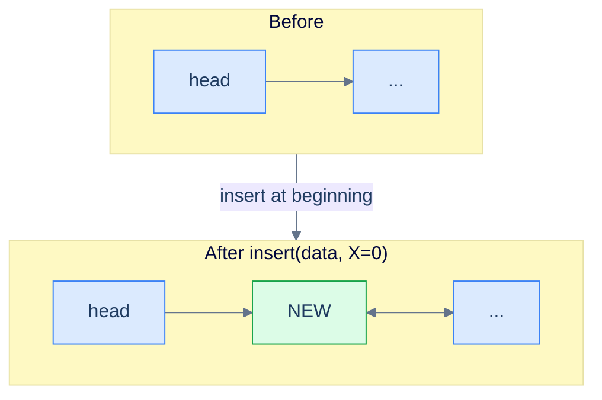

<p align="center"><strong>X = 0 — degenerate case that becomes a vanilla insert-at-beginning.</strong></p>

> **Algorithm**
>
> -   **Step 1:** Create a new node with the given data.
> -   **Step 2:** Set the `next` pointer of the new node to the current head, as the new node will be the new head.
> -   **Step 3:** Set the new node's `prev` pointer to `null` since it's the new head node.
> -   **Step 4:** Set the `prev` pointer of current head to the new node to restore the bidirectional link.
> -   **Step 5:** Return the new node, as this is the new head.

## 3. X ≤ size of the list

For positions inside the list, we traverse forward keeping a counter starting at 0. Every step we increment the counter by 1, stopping when the counter reaches `X - 1` — the node *just before* the position where the new node should go. From there, the problem reduces to **inserting after the given node**, which we already solved.

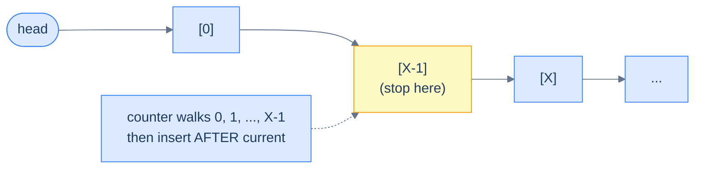

<p align="center"><strong>X ≤ length — walk forward to position X-1, then delegate to "insert after the given node". Total cost: O(X) for the walk + O(1) for the splice.</strong></p>

> **Algorithm**
>
> -   **Step 1:** Create a new node with the given data.
> -   **Step 2:** Traverse the distance X − 1 while keeping track of the `current` node.
> -   **Step 3:** Set the new node's `next` pointer to hold the node's reference stored in the `next` pointer of the `current` node.
> -   **Step 4:** Set the new node's `prev` pointer to hold the reference of the `current` node.
> -   **Step 5:** Set the `current` node's `next` pointer to hold the reference of the new node.
> -   **Step 6:** Set the `prev` pointer of the node after the `current` node (if it exists) to hold the reference of the new node.
> -   **Step 7:** Return the original head node.

## 4. X > size of the list

If `X` is larger than the list's length, the position doesn't exist (e.g. inserting at position 5 in a 3-element list). The traversal will run off the end (`current` becomes `null`), and we return the existing **head** without modification.


<p align="center"><strong>X > length — the traversal walks off the end and we return the original head unchanged.</strong></p>

> **Algorithm**
>
> -   **Step 1:** Create a new node with the given data.
> -   **Step 2:** Traverse the distance X − 1 while keeping track of the `current` node.
> -   **Step 3:** Return the original head node.

## Implementation

When implementing the logic for insert at a distance `X`, we keep all the possible cases in mind and write the code for each in conditional blocks.


```python run
"""
Definition for doubly-linked list.
class ListNode:
    def __init__(self, val):
        self.val = val
        self.prev = None
        self.next = None
"""

from typing import Optional

class Solution:
    def insert_at_given_distance(
        self, head: Optional[ListNode], X: int, data: int
    ) -> Optional[ListNode]:

        # If the list is empty, head is None, and X is greater than 0,
        # it's not possible to insert the new node, so return None.
        if head is None and X > 0:
            return None

        # Create a new node with the given data.
        new_node = ListNode(data)

        # If X is 0, insert the new node at the beginning of the list.
        if X == 0:

            # Set the next pointer of the new node to the current head
            new_node.next = head

            # Set the prev pointer of the new node to None since it will
            # be the new head
            new_node.prev = None
            if head is not None:

                # Set the prev pointer of the current head to the new
                # node
                head.prev = new_node

            # Return the new node as the new head of the list
            return new_node

        # Traverse the list to find the node at position X-1.
        current = head

        # Counter to track the number of nodes traversed
        counter = 0

        while current is not None and counter < X - 1:

            # Move to the next node
            current = current.next

            # Increment the counter
            counter += 1

        # If the list is shorter than X-1, it's not possible to insert
        # the new node, so return head.
        if current is None:
            return head

        # Insert the new node after the node at position X-1.
        new_node.next = current.next
        new_node.prev = current
        current.next = new_node
        if new_node.next is not None:
            new_node.next.prev = new_node

        # Return the updated head of the list
        return head
```

```java run
/**
 * Definition for doubly-linked list.
 * class ListNode {
 *     int val;
 *     ListNode prev;
 *     ListNode next;
 *     ListNode() {}
 *     ListNode(int val) { this.val = val; }
 * };
 */

class Solution {
    public ListNode insertAtGivenDistance(
        ListNode head,
        int X,
        int data
    ) {

        // If the list is empty, head is null, and X is greater than 0,
        // it's not possible to insert the new node, so return null.
        if (head == null && X > 0) {
            return null;
        }

        // Create a new node with the given data.
        ListNode newNode = new ListNode(data);

        // If X is 0, insert the new node at the beginning of the list.
        if (X == 0) {

            // Set the next pointer of the new node to the current head
            newNode.next = head;

            // Set the prev pointer of the new node to null since it will
            // be the new head
            newNode.prev = null;
            if (head != null) {

                // Set the prev pointer of the current head to the new
                // node
                head.prev = newNode;
            }

            // Return the new node as the new head of the list
            return newNode;
        }

        // Traverse the list to find the node at position X-1.
        ListNode current = head;

        // Counter to track the number of nodes traversed
        int counter = 0;

        while (current != null && counter < X - 1) {

            // Move to the next node
            current = current.next;

            // Increment the counter
            counter++;
        }

        // If the list is shorter than X-1, it's not possible to insert
        // the new node, so return head.
        if (current == null) {
            return head;
        }

        // Insert the new node after the node at position X-1.
        newNode.next = current.next;
        newNode.prev = current;
        current.next = newNode;
        if (newNode.next != null) {
            newNode.next.prev = newNode;
        }

        // Return the updated head of the list
        return head;
    }
}
```


## Complexity Analysis

The time complexity of insertion at a given distance depends on the position. Linked lists do not support direct random access, so traversal is required before insertion. The cases below describe the algorithm's performance under different conditions.

### Best case

The best case occurs when `X = 0`. In this case, we insert at the beginning, which takes **constant** time regardless of the list's size.


<p align="center"><strong>Best case (X = 0) — direct insert before the head, no traversal.</strong></p>

### Worst case

The worst case occurs when `X` equals the list's length. In this case, we traverse the entire list before inserting, costing **O(N)**.


<p align="center"><strong>Worst case (X = length) — walk the entire list, then insert after the tail. The doubly linked list can't shortcut this because the input is an index, not a node reference.</strong></p>

The function's space complexity is constant, as we only allocate a fixed number of variables (one new node and a counter) regardless of list size.

> **Best Case** — X = 0
>
> -   Space Complexity — **O(1)**
> -   Time Complexity — **O(1)**
>
> **Worst Case** — X = length of the list
>
> -   Space Complexity — **O(1)**
> -   Time Complexity — **O(N)**

***

# Insert at given distance

## The Problem

> Given the **head** of a doubly linked list, a distance **X**, and a **data** value, write a function to insert a new node with the given data value at a distance X from the start of the linked list and return the head of the updated list.

```
Input:  head = [5, 7, 3, 10], X = 1, data = 6
Output: [5, 6, 7, 3, 10]
```

<details>
<summary><h2>The Solution</h2></summary>


```python run viz=linked-list viz-root=head
from typing import Optional


class ListNode:
    def __init__(self, val=0, prev=None, nxt=None):
        self.val = val
        self.prev = prev
        self.next = nxt


def from_list(values):
    if not values:
        return None
    head = ListNode(values[0])
    cur = head
    for v in values[1:]:
        node = ListNode(v, prev=cur)
        cur.next = node
        cur = node
    return head


def to_list(head):
    out = []
    while head is not None:
        out.append(head.val)
        head = head.next
    return out


class Solution:
    def insert_at_given_distance(
        self, head: Optional[ListNode], X: int, data: int
    ) -> Optional[ListNode]:

        # If the list is empty, head is None, and X is greater than 0,
        # it's not possible to insert the new node, so return None.
        if head is None and X > 0:
            return None

        # Create a new node with the given data.
        new_node = ListNode(data)

        # If X is 0, insert the new node at the beginning of the list.
        if X == 0:

            # Set the next pointer of the new node to the current head
            new_node.next = head

            # Set the prev pointer of the new node to None since it will
            # be the new head
            new_node.prev = None
            if head is not None:

                # Set the prev pointer of the current head to the new
                # node
                head.prev = new_node

            # Return the new node as the new head of the list
            return new_node

        # Traverse the list to find the node at position X-1.
        current = head

        # Counter to track the number of nodes traversed
        counter = 0

        while current is not None and counter < X - 1:

            # Move to the next node
            current = current.next

            # Increment the counter
            counter += 1

        # If the list is shorter than X-1, it's not possible to insert
        # the new node, so return head.
        if current is None:
            return head

        # Insert the new node after the node at position X-1.
        new_node.next = current.next
        new_node.prev = current
        current.next = new_node
        if new_node.next is not None:
            new_node.next.prev = new_node

        # Return the updated head of the list
        return head


# Examples from the problem statement
print(to_list(Solution().insert_at_given_distance(from_list([5, 7, 3, 10]), 1, 6)))   # [5, 6, 7, 3, 10]

# Edge cases
print(to_list(Solution().insert_at_given_distance(from_list([5, 7, 3, 10]), 0, 6)))   # [6, 5, 7, 3, 10]
print(to_list(Solution().insert_at_given_distance(from_list([5, 7, 3, 10]), 3, 6)))   # [5, 7, 3, 6, 10]
print(to_list(Solution().insert_at_given_distance(None, 0, 1)))                         # [1]
print(Solution().insert_at_given_distance(None, 2, 1))                                  # None
print(to_list(Solution().insert_at_given_distance(from_list([1]), 0, 9)))              # [9, 1]
print(to_list(Solution().insert_at_given_distance(from_list([1, 2, 3]), 10, 9)))       # [1, 2, 3] (X beyond length)
```

```java run
import java.util.*;

public class Main {
    static class ListNode {
        int val;
        ListNode prev;
        ListNode next;
        ListNode() {}
        ListNode(int val) { this.val = val; }
    }

    static ListNode fromList(int... values) {
        if (values.length == 0) return null;
        ListNode head = new ListNode(values[0]);
        ListNode cur = head;
        for (int i = 1; i < values.length; i++) {
            ListNode node = new ListNode(values[i]);
            node.prev = cur;
            cur.next = node;
            cur = node;
        }
        return head;
    }

    static java.util.List<Integer> toList(ListNode head) {
        java.util.List<Integer> out = new java.util.ArrayList<>();
        while (head != null) { out.add(head.val); head = head.next; }
        return out;
    }

    static class Solution {
        public ListNode insertAtGivenDistance(
            ListNode head,
            int X,
            int data
        ) {

            // If the list is empty, head is null, and X is greater than 0,
            // it's not possible to insert the new node, so return null.
            if (head == null && X > 0) {
                return null;
            }

            // Create a new node with the given data.
            ListNode newNode = new ListNode(data);

            // If X is 0, insert the new node at the beginning of the list.
            if (X == 0) {

                // Set the next pointer of the new node to the current head
                newNode.next = head;

                // Set the prev pointer of the new node to null since it will
                // be the new head
                newNode.prev = null;
                if (head != null) {

                    // Set the prev pointer of the current head to the new
                    // node
                    head.prev = newNode;
                }

                // Return the new node as the new head of the list
                return newNode;
            }

            // Traverse the list to find the node at position X-1.
            ListNode current = head;

            // Counter to track the number of nodes traversed
            int counter = 0;

            while (current != null && counter < X - 1) {

                // Move to the next node
                current = current.next;

                // Increment the counter
                counter++;
            }

            // If the list is shorter than X-1, it's not possible to insert
            // the new node, so return head.
            if (current == null) {
                return head;
            }

            // Insert the new node after the node at position X-1.
            newNode.next = current.next;
            newNode.prev = current;
            current.next = newNode;
            if (newNode.next != null) {
                newNode.next.prev = newNode;
            }

            // Return the updated head of the list
            return head;
        }
    }

    public static void main(String[] args) {
        // Examples from the problem statement
        System.out.println(toList(new Solution().insertAtGivenDistance(fromList(5, 7, 3, 10), 1, 6)));  // [5, 6, 7, 3, 10]

        // Edge cases
        System.out.println(toList(new Solution().insertAtGivenDistance(fromList(5, 7, 3, 10), 0, 6)));  // [6, 5, 7, 3, 10]
        System.out.println(toList(new Solution().insertAtGivenDistance(fromList(5, 7, 3, 10), 3, 6)));  // [5, 7, 3, 6, 10]
        System.out.println(toList(new Solution().insertAtGivenDistance(null, 0, 1)));                    // [1]
        System.out.println(new Solution().insertAtGivenDistance(null, 2, 1));                            // null
        System.out.println(toList(new Solution().insertAtGivenDistance(fromList(1), 0, 9)));            // [9, 1]
        System.out.println(toList(new Solution().insertAtGivenDistance(fromList(1, 2, 3), 10, 9)));     // [1, 2, 3]
    }
}
```


<details>
<summary><strong>Trace — head = [5, 7, 3, 10], X = 1, data = 6</strong></summary>

```
Initial │ 5 ⇄ 7 ⇄ 3 ⇄ 10
Step 1  │ X = 1 ≠ 0  → walk to position X − 1 = 0
        │ counter=0, current=node(5) — loop condition counter < 0 false → stop
Step 2  │ current = node(5) is not null → splice
Step 3  │ new_node(6).next = current.next = node(7)        │ new_node(6) → 7
Step 4  │ new_node(6).prev = current = node(5)             │ 5 ← new_node(6)
Step 5  │ current.next = new_node                          │ 5 → new_node(6) → 7
Step 6  │ new_node.next is node(7) ≠ null →               │ node(7).prev = new_node(6)
        │ new_node.next.prev = new_node                     │ 5 ⇄ new_node(6) ⇄ 7 ⇄ 3 ⇄ 10
Result: [5, 6, 7, 3, 10] ✓
```

Once the walk lands on the node at position X − 1, the splice is the same four-pointer insert-after we already drilled — steps 4 and 6 wire the `prev` side so the backward chain stays intact.

</details>

</details>
<details>
<summary><h2>Final Takeaway</h2></summary>


Five insertion variants, one underlying skill: **always update four pointers, in a save-before-clobber order, and always mirror.** The doubly linked list earns its keep when the input is a *node reference* — insert before, insert after, insert at beginning, insert at end all collapse to O(1). When the input is an *index*, you still pay for the walk, just like in a singly linked list — the extra `prev` pointer doesn't help because indices don't dereference.

> **The Insertion Checklist** — every time you splice a node into a doubly linked list, ask yourself the same four questions. Drill them until they're automatic:
>
> 1. **What does the new node's `next` point to?**
> 2. **What does the new node's `prev` point to?**
> 3. **What `next` pointer in the existing list now points to the new node?**
> 4. **What `prev` pointer in the existing list now points to the new node?**
>
> Skip any one and you've corrupted the chain in one direction. The bug will hide until someone walks backward.

> **Transfer challenge:** Given the head of a sorted doubly linked list and a value `v`, write a function that inserts `v` while preserving sorted order. (Hint: use forward traversal to find the insertion point, then *insert before the given node* — your O(1) splice does the rest.)
>
> <details>
> <summary>Solution sketch</summary>
>
> Walk forward until you find the first node whose value is ≥ `v` (or fall off the end). If you fell off, insert at end. If you stopped at the head, insert at beginning. Otherwise, insert before the stopped node. The walk is O(N); the splice is O(1).
>
> </details>

Up next: **deletion**. Same checklist, played in reverse — except now there's a wrinkle. Deleting a node breaks the chain in *two* places, and the same "save before clobber" discipline that kept insertion safe will save us again.

</details>

<!-- ============================================== -->
<!-- SWEEP 2 — missing sections (placeholders only) -->
<!-- ============================================== -->

<!-- TODO: Understanding the Problem — missing, needs to be written -->
<!--       Guidance: frame the gap the structure/algorithm fills -->

<!-- TODO: Supported Operations — missing, needs to be written -->
<!--       Guidance: table: operation / time / notes -->

<!-- TODO: Internal Mechanics — missing, needs to be written -->
<!--       Guidance: how it actually works under the hood -->

<!-- TODO: Working Example — missing, needs to be written -->
<!--       Guidance: one fully worked end-to-end example -->

<!-- TODO: Edge Cases & Pitfalls — missing, needs to be written -->
<!--       Guidance: bulleted list of gotchas -->

<!-- TODO: Production Reality — missing, needs to be written -->
<!--       Guidance: 4–6 entries: System — uses X — because Y -->

<!-- TODO: Quiz — missing, needs to be written -->
<!--       Guidance: 3–5 questions, each labeled [Recall]/[Reasoning]/[Tradeoff] -->

<!-- TODO: Practice Ladder — missing, needs to be written -->
<!--       Guidance: table: 5 links into pattern problems + hints -->

<!-- TODO: Further Reading — missing, needs to be written -->
<!--       Guidance: annotated: ★ Essential / ◆ Advanced / → Reference -->

<!-- TODO: Cross-Links — missing, needs to be written -->
<!--       Guidance: Prerequisites | What comes next -->

<!-- TODO: Final Takeaway — missing, needs to be written -->
<!--       Guidance: exactly 3 typed bullets: Core mechanic / Dominant tradeoff / One thing to remember -->
